# G002 - Proxmox VE installation

This guide explains how to install a Proxmox VE **7.0** platform into the hardware detailed in the [**G001** guide](G001%20-%20Hardware%20setup.md). This procedure follows a straightforward path, meaning that only some basic parameters will be configured here. Any advanced stuff will be left for later guides.

## System Requirements

I've copied below the minimum and recommended requirements for Proxmox VE 7.0, to compare them with the hardware I'm using.

### _Minimum requirements_

According to the Proxmox VE manual, these minimum requirements are **for evaluation purposes only**, **not for setting up an enterprise-grade production server**.

- CPU: 64bit (Intel EMT64 or AMD64).
- Intel VT/AMD-V capable CPU/Mainboard for KVM full virtualization support.
- RAM: 1 GiB, plus additional RAM needed for guests (virtual machines and containers).
- Hard drive.
- One network card (NIC).

As shown above, my hardware fits the minimum requirements.

### _Recommended requirements_

Below you can find the minimum requirements for a proper Proxmox VE production server.

- Intel EMT64 or AMD64 with Intel VT/AMD-V CPU flag.

- Memory: Minimum 2 GB for the OS and Proxmox VE services, plus designated memory for guests. For Ceph and ZFS, additional memory is required; approximately 1GB of memory for every TB of used storage.

- Fast and redundant storage, best results are achieved with SSDs.

- OS storage: Use a hardware RAID with battery protected write cache (“BBU”) or non-RAID with ZFS (optional SSD for ZIL).

- VM storage:
    - For local storage, use either a hardware RAID with battery backed write cache (BBU) or non-RAID for ZFS and Ceph. Neither ZFS nor Ceph are compatible with a hardware RAID controller.
    - Shared and distributed storage is possible.

- Redundant (Multi-)Gbit NICs, with additional NICs depending on the preferred storage technology and cluster setup.

- For PCI(e) passthrough the CPU needs to support the VT-d/AMD-d flag.

My hardware mostly complies with the CPU requirements, except on the VT-d flag part. Regarding RAM it's not in a bad shape either, specially since I'm not planning to use ZFS or Ceph given their high RAM needs. In storage terms I don't have any fancy enterprise-level thing like redundancy or hardware RAID, but at least I won't spend that much electricity either. Also, let's not forget that I have one SSD on which I'll install the Proxmox VE platform. The thing about the redundant network cards won't be really necessary for me either.

Overall, I've got enough hardware to run a small **standalone Proxmox VE node**.

## Installation procedure

### _Preparing the Proxmox VE installation media_

Proxmox VE 7.0 is provided as an ISO image file, which you have to either burn in a CD or DVD or write in a USB drive. Since my computer has no DVD drive anymore, I'll show you the USB path. Proxmox provides some instructions about how to do it from a Linux, MacOS or Windows environment. [Check them out right here](https://pve.proxmox.com/pve-docs/chapter-pve-installation.html#installation_prepare_media)!

I'll do it from a Windows 10 system, using [**Rufus**](https://rufus.ie/) to write the Proxmox VE ISO into an USB pendrive.

#### **Writing the Proxmox VE ISO from a Windows 10 system with Rufus**

1. Get the latest Proxmox VE 7.0 ISO from the [official site](https://www.proxmox.com/en/). You'll have to look for it in the site's [_downloads_ section](https://www.proxmox.com/en/downloads). Download the ISO found in the [_Proxmox Virtual Environment_ section](https://www.proxmox.com/en/downloads/category/proxmox-virtual-environment). The [Proxmox VE 7.0-2 ISO Installer](https://www.proxmox.com/en/downloads/item/proxmox-ve-7-0-iso-installer) weights around **1 GiB**.

2. Download the [Rufus](https://rufus.ie/) tool.

3. Ready an USB drive with **4 GiB** at least, just to be sure that the Proxmox VE ISO has enough room to be written on it.

4. Plug your USB into your Windows 10 computer and open Rufus.

5. In Rufus, choose the Proxmox VE ISO you just downloaded and adjust the `Partition scheme` depending if your target computer is a UEFI system (switch to `GPT`) or not (leave `MBR`). Leave the rest of the parameters with their default values.

    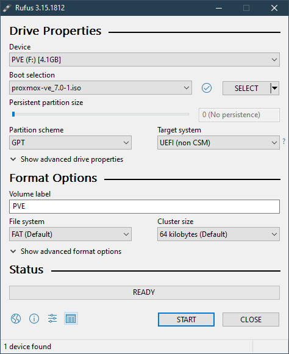

    > **BEWARE!**  
    > If you don't configure the `Partition scheme` properly, the Proxmox VE installer won't boot up when you try to launch it in your computer.

6. With the configuration set, press the `START` button. Rufus will ask you what mode to use for writing the Proxmox VE installer ISO. Choose `Write in DD Image mode` and press `OK`.

    

7. Rufus will warn you that the procedure will destroy **all data** on your USB device.

    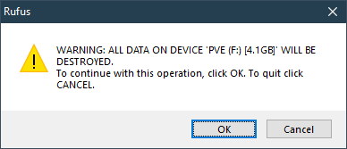

    If you're sure that you want to proceed, press `OK`.

8. Rufus will then write the Proxmox VE ISO in your USB drive.

    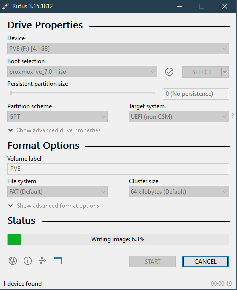

9. Rufus will take a couple of minutes to do its job. When it finishes, you'll see the message `READY` written in the green progress bar.

    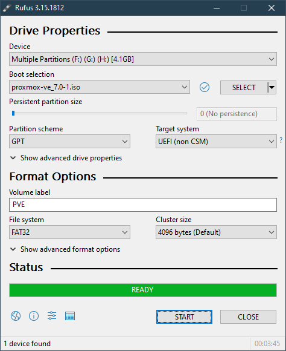

With the ISO properly written in the USB drive, you can take it  finally start the installation.

### _Prepare your storage drives_

Remember to empty the storage drives in your server-to-be computer, meaning that you have to leave them completely void of data, filesystems and partitions. This is to avoid any potential conflicts like, for instance, having an old installation of some outdated, but still bootable, Linux installation. So, be sure of clearing those drives, using some Linux distribution that can be run in Live mode, such as the official Debian one or any of the Ubuntu-based ones. Then use a tool like GParted or KDE Partition Manager to just remove all the partitions present on those drives and you'll be good to go.

### _Installing Proxmox VE_

The Proxmox site has two guides explaining the Proxmox VE installer, which I've linked to in the _References_ section at the end of this guide. But the steps you'll find below are my own take on this install procedure.

> **BEWARE!**  
> Since I couldn't take screenshots of the installer screens while installing Proxmox VE in my computer, I used a small virtual machine in a Virtual Box environment just to make the captures. That's why you'll see a couple of slightly "odd" things in the screen captures used in the following steps.

1. Plug the Proxmox VE USB in the computer, and make it boot from the USB drive.

2. After successfully booting the computer up from the USB drive, you'll eventually be greeted by the following screen.

    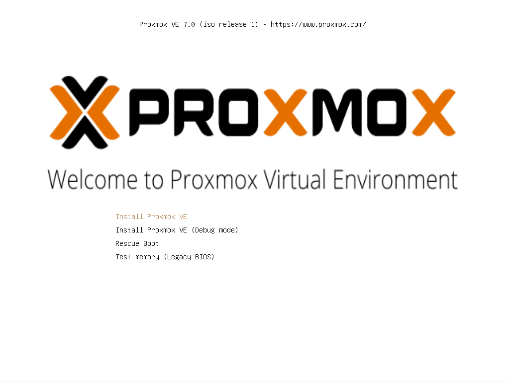

    From the four options available, the only ones you'll ever use are the first (**Install Proxmox VE**) and the third (**Rescue Boot**). The first one is rather self-explanatory, and the third will help you start your installed Proxmox VE in case you happen to have problems booting it up.

3. Select the **Install Proxmox VE** option and press enter. You'll get into a shell screen, where you'll see some lines in which the installer is doing stuff like recognizing devices and such. After a few seconds, you'll reach the installer's graphical interface.

4. **This is not a step**, just a warning the installer could raise you if your CPU doesn't have the support for virtualization Proxmox VE needs to have for executing its virtualization stuff with the KVM virtualization engine.

    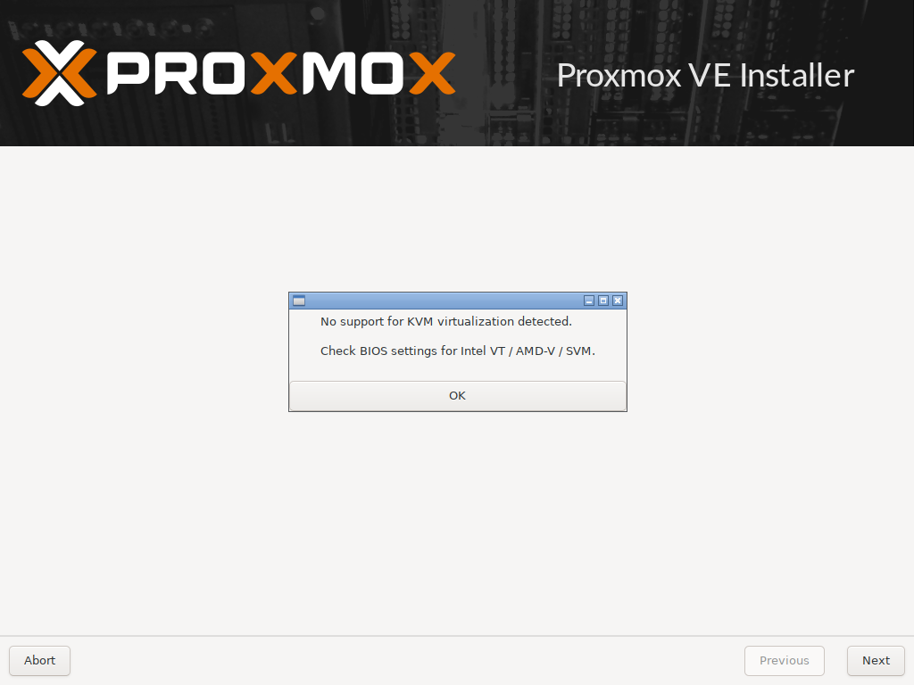

    If you see this warning, **abort** the installation and boot in your server's BIOS to check if your CPU's virtualization technology support is disabled. If so, enable it and reboot back to the installer again.

    > **IMPORTANT!**  
    If your server's CPU doesn't have virtualization support, you still can keep going on with the installation. I haven't seen anything in the official documentation forbidding it, but bear in mind that the performance of the virtualized systems you'll create inside Proxmox VE could end being sluggish or too demanding on your hardware. Or just not work at all.

5. Usually, the first thing you should see of the installer is the **EULA** screen.

    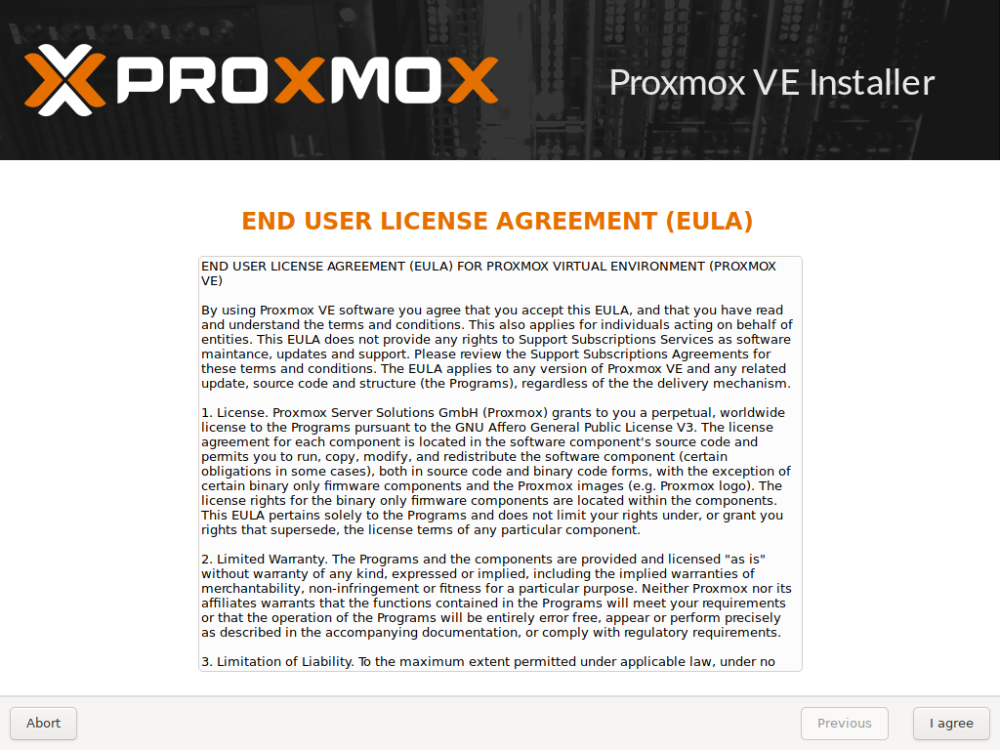

    Nothing to do here, except clicking on **I agree** and move on.

6. Here you'll meet the very first thing you'll have to configure, **where you want to install Proxmox VE**.

    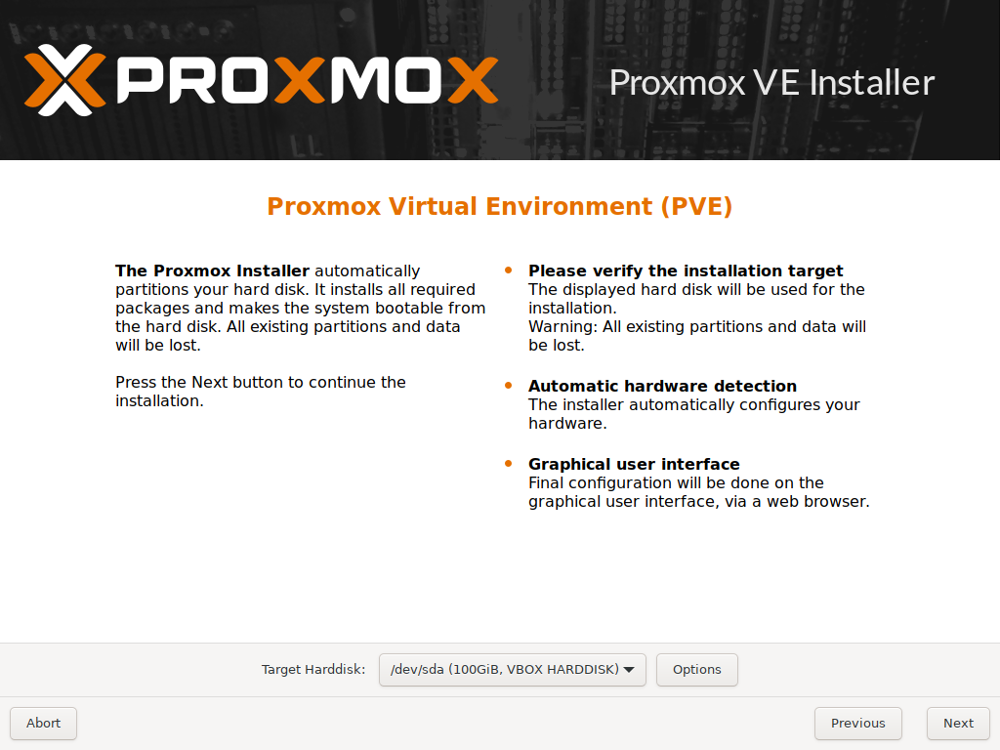

    The screenshot above is from a VirtualBox machine, in which I had set up three virtual storage drives as stand-ins for the drives in the real computer.

    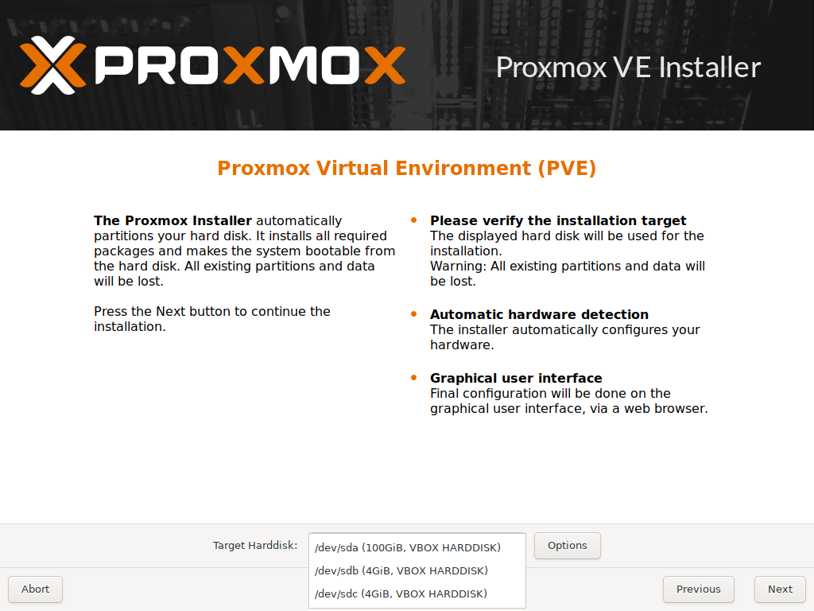

    In the Target Harddisk list you have to choose on which storage drive you want to install Proxmox VE, and you want it in the SSD drive. So, assuming the SSD is the first device in the list, choose `/dev/sda` but **don't click** on the **Next** button yet!

7. With the `/dev/sda` device chosen as target harddisk, push the **Options** button, there's something else to configure there.

    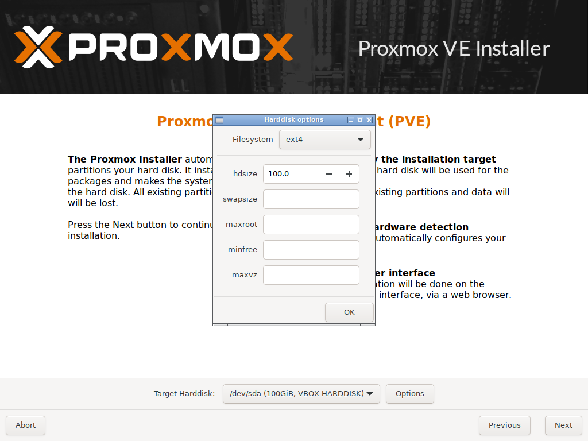

    There you'll see that you can change the filesystem, and also edit a few parameters.

    - `Filesystem`: Leave it as **ext4**, since it's the only adequate one for the  hardware available.

    - `hdsize`: By default, the installer assigns the entire space available in the chosen storage drive to the Proxmox VE system. This is not optimal since Proxmox VE doesn't need that much space by itself (remember, my real SSD has 1 TiB), so it's better to adjust this parameter to a much lower value. Leaving it at something like 50 GiB should be more than enough. The rest of the space in the storage drive will be left unpartitioned, something we'll worry about in a later guide.
        > **BEWARE!**  
        > The `hdsize` is the total size of the filesystem assigned to Proxmox VE, and that includes all the parameters below this one.

    - `swapsize`: to adjust the swap size on any computer, I always use the following rule of thumb. A swap partition should have reserved at least **1.5 times** the amount of RAM available in the system. In this case, since the computer has 8 GiB of RAM, that means reserving 12 GiB for the swap.

    - `maxroot`, `minfree` and `maxvz` are left empty, to let the installer handle them with whatever defaults it uses.

    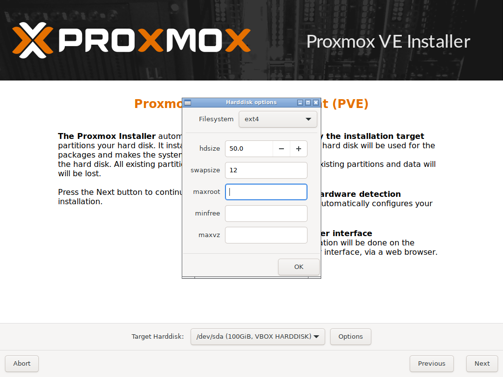

    When you have everything ready in this screen, click on **Next**.

8. The next screen is the **Localization and Time Zone selection** for your system.

    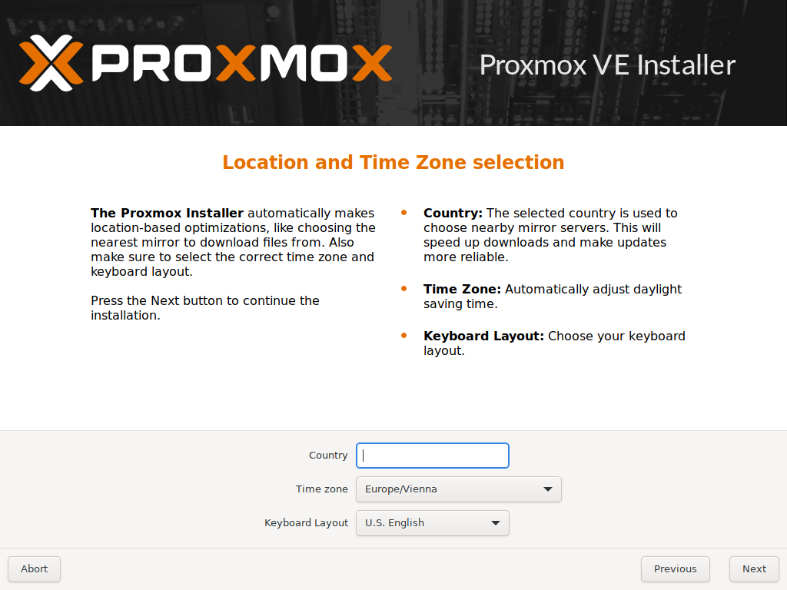

    Just choose whatever suits your needs and move on.

9. Now, you'll have to input a proper password and a valid email for the `root` user.

    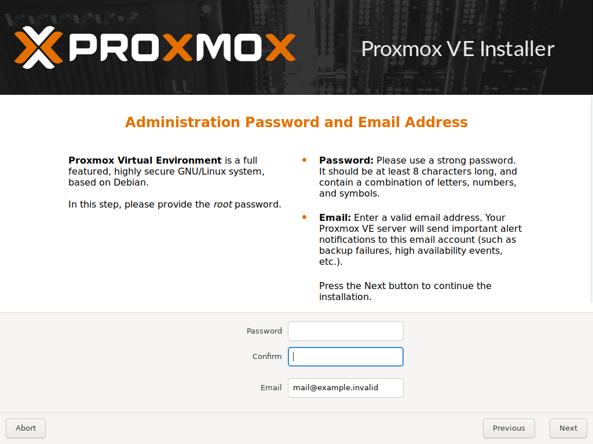

    This screen will make some validation both over the password and the email fields when you click on **Next**.

    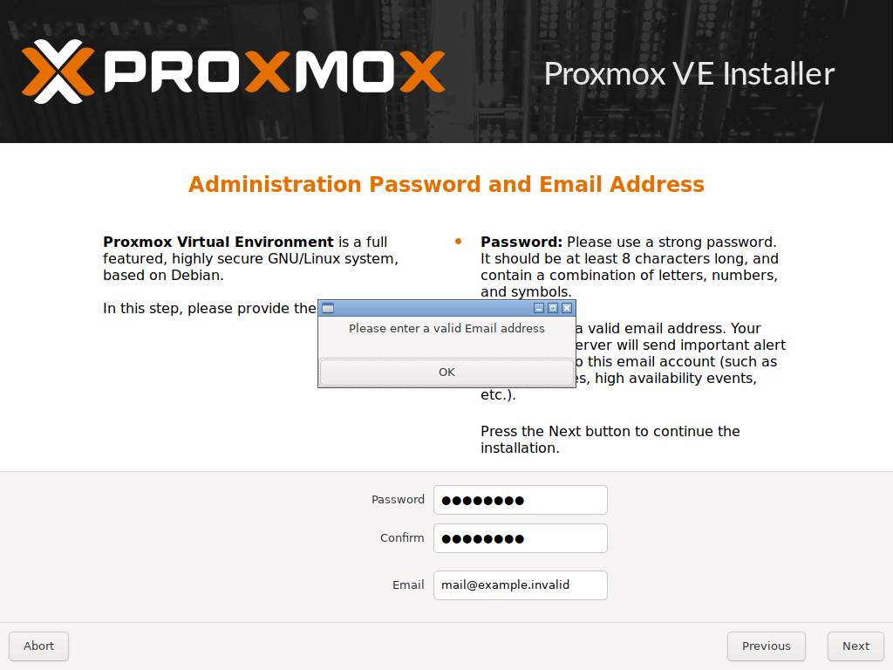

10. This step is about setting up your network configuration.

    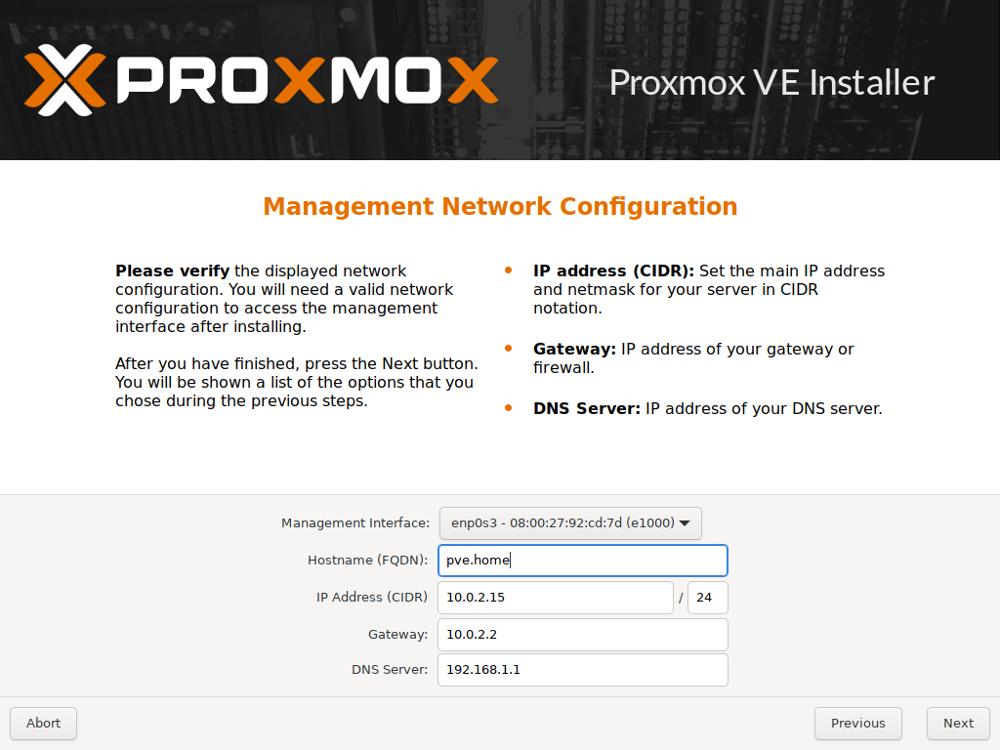

    What you're configuring here is through which network controller and network you want to reach the Proxmox VE management console. The installer will autodetect the values, but some adjustment may be required.

    Be careful of which network controller you choose as `management interface`. Choosing the wrong one could make your Proxmox VE system unreachable remotely.

11. The **summary** screen will show you the configuration you've choosen.

    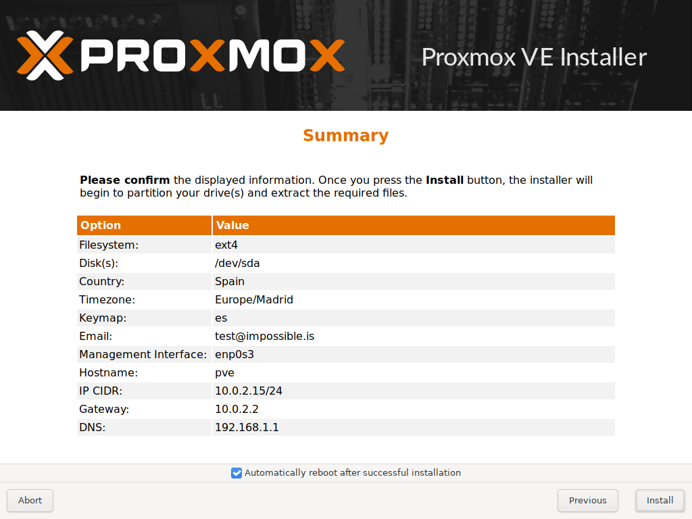

    Notice, at the bottom of the screen, the check about **Automatically reboot after successful installation**. If you prefer to reboot manually, uncheck it. Then, if you're happy with the setup, click on **Install**.

12. The next screen will show you a progress bar and some information while doing the installation.

    

    With an SSD as the target harddisk, the installation process will go really fast.

    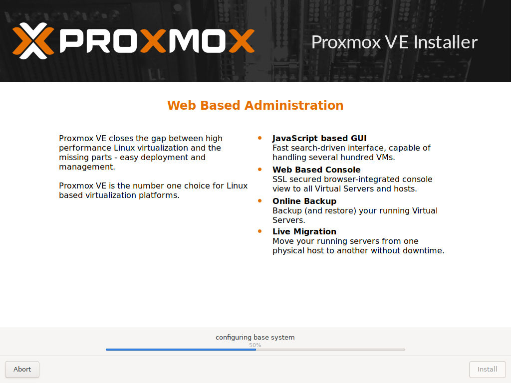

    > **BEWARE!**  
    > The installer, on its own, will download and install a more recent version of the Proxmox VE platform, instead of just putting the one present in the USB.

13. When the installation is done, it will ask for a reboot. Unplug the USB in that moment to avoid booting into the Proxmox installation program again.

## After the installation

You have installed Proxmox VE and your server has rebooted. Proxmox VE comes with a web console which is accessible through the **port 8006**. So, open a browser and navigate to `https://your.host.ip.address:8006` and you'll reach the Proxmox VE web console.

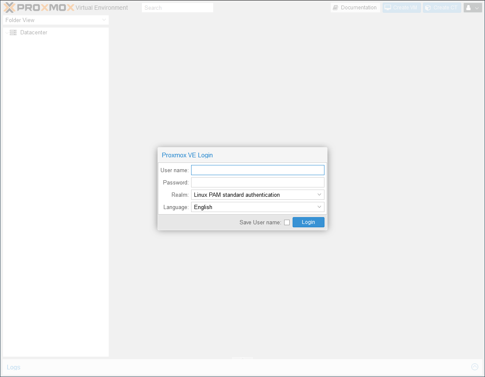

Log in as `root` and take a look around, confirming that the installation it's done. At the time of writing this, the installation procedure left my host with a Proxmox VE **7.0-11** (the version in the ISO was _7.0-2_) **standalone node** running on a **Debian 11 "Bullseye"**.

## Connecting remotely

You can connect already to your standalone PVE node through any SSH client of your choosing, by using the username `root` and the password you set up in the installation process. This is not the most safe configuration, but you'll see how to improve it in a later guide.

## References

### _Proxmox_

- [Proxmox](https://www.proxmox.com/en/)
- [Proxmox VE installation guide](https://pve.proxmox.com/wiki/Installation)
- [Proxmox VE admin guide. Installing Proxmox VE](https://pve.proxmox.com/pve-docs/chapter-pve-installation.html)
- [Proxmox VE. System Requirements](https://www.proxmox.com/en/proxmox-ve/requirements)

### _Rufus_

- [Rufus](https://rufus.ie/)

## Navigation

[<< Previous (**G001. Hardware setup**)](G001%20-%20Hardware%20setup.md) | [+Table Of Contents+](G000%20-%20Table%20Of%20Contents.md) | [Next (**G003. Host configuration 01**) >>](G003%20-%20Host%20configuration%2001%20~%20Apt%20sources%2C%20updates%20and%20extra%20tools.md)
