# G002 - Proxmox VE installation

- [A procedure to install Proxmox VE in limited consumer hardware](#a-procedure-to-install-proxmox-ve-in-limited-consumer-hardware)
- [System Requirements](#system-requirements)
  - [Minimum requirements](#minimum-requirements)
  - [Recommended requirements](#recommended-requirements)
- [Installation procedure](#installation-procedure)
  - [Prepare the Proxmox VE installation media](#prepare-the-proxmox-ve-installation-media)
  - [Clear your storage drives](#clear-your-storage-drives)
  - [Installing Proxmox VE](#installing-proxmox-ve)
  - [Failed installation due to a bootloader setup error](#failed-installation-due-to-a-bootloader-setup-error)
- [After the installation](#after-the-installation)
- [Connecting remotely](#connecting-remotely)
- [References](#references)
  - [Proxmox](#proxmox)
  - [Ventoy](#ventoy)
- [Navigation](#navigation)

## A procedure to install Proxmox VE in limited consumer hardware

This chapter explains how to install a Proxmox VE **9.0** platform into a consumer-grade computer like the one detailed in the [**G001** chapter](G001%20-%20Hardware%20setup.md). This procedure follows a straightforward path, meaning that only some basic but necessary parameters will be configured here. Any advanced stuff will be left for later guides.

## System Requirements

Here I've copied the [minimum and recommended requirements for Proxmox VE](https://pve.proxmox.com/pve-docs/pve-admin-guide.html#_system_requirements).

### Minimum requirements

According to the Proxmox VE manual, these minimum requirements are **for evaluation purposes only**, **not for setting up an enterprise-grade production server**:

- CPU: 64bit (Intel 64 or AMD64).
- Intel VT/AMD-V capable CPU/motherboard for KVM full virtualization support.
- RAM: 1 GB RAM, plus additional RAM needed for guests.
- Hard drive.
- One network card (NIC).

As you can see, a computer matching the [reference hardware](G001%20-%20Hardware%20setup.md#the-reference-hardware-setup) fits the minimum requirements.

### Recommended requirements

See below the [recommended system requirements for a proper Proxmox VE production server](https://pve.proxmox.com/pve-docs/pve-admin-guide.html#install_recommended_requirements):

- Intel 64 or AMD64 with Intel VT/AMD-V CPU flag.

- Memory: Minimum 2 GB for the OS and Proxmox VE services, plus designated memory for guests. For Ceph and ZFS, additional memory is required; approximately 1GB of memory for every TB of used storage.

- Fast and redundant storage, best results are achieved with SSDs.

- OS storage: Use a hardware RAID with battery protected write cache (“BBU”) or non-RAID with ZFS (optional SSD for ZIL).

- VM storage:

  - For local storage, use either a hardware RAID with battery backed write cache (BBU) or non-RAID for ZFS and Ceph. Neither ZFS nor Ceph are compatible with a hardware RAID controller.

  - Shared and distributed storage is possible.

  - SSDs with Power-Loss-Protection (PLP) are recommended for good performance. Using consumer SSDs is discouraged.

- Redundant (Multi-)Gbit NICs, with additional NICs depending on the preferred storage technology and cluster setup.

- For PCI(e) passthrough the CPU needs to support the VT-d/AMD-d flag.

When comparing these requirements with the [reference hardware](G001%20-%20Hardware%20setup.md#the-reference-hardware-setup), don't lose sight of the goal here: running a small **standalone Proxmox VE node** in limited consumer hardware for personal use. Under that point of view, most of these recommendations, although illustrative, do not really apply for the problem at hand in this guide.

In short, just ensure to use a computer that, at least, matches the [reference hardware](G001%20-%20Hardware%20setup.md#the-reference-hardware-setup). In particular, make sure that your CPU has virtualization capabilities and you have 8GiB of RAM at least.

## Installation procedure

Installing Proxmox VE in your computer is not complicated, but requires some preparation.

### Prepare the Proxmox VE installation media

Proxmox VE is provided as an ISO image file, which you have to either burn in a DVD or write in a USB drive. Get the ISO for Proxmox VE 9.0 from the [_Proxmox Virtual Environment_ section](https://www.proxmox.com/en/downloads/proxmox-virtual-environment) of the [Proxmox site's Downloads page](https://www.proxmox.com/en/downloads). Then, I recommend you to use a tool like [Ventoy](https://www.ventoy.net/en/doc_start.html) to put the ISO in an USB drive and boot it in your computer from there.

> [!NOTE]
> [**Proxmox also provides some instructions about how to write the ISO image from a Linux, MacOS or Windows environment**](https://pve.proxmox.com/pve-docs/pve-admin-guide.html#installation_prepare_media)\
> Still, using a tool like [Ventoy](https://www.ventoy.net/en/index.html) is much easier and straightforward.

### Clear your storage drives

Remember to completely erase the storage drives of your Proxmox VE server-to-be computer. You have to leave them completely empty of data, filesystems and partitions to avoid any potential conflict like, for instance, having an old installation of some outdated, but still bootable, Linux installation.

Therefore, be sure of clearing those drives by using a tool like GParted or KDE Partition Manager from a Linux distribution that can be run in Live mode, such as the official Debian one or any of the Ubuntu-based ones.

> [!NOTE]
> **Use a tool like Ventoy to be able to boot several ISOs from same USB drive**\
> By taking advantage of [Ventoy](https://www.ventoy.net/en/index.html) or a similar tool, you can first boot a Linux Mint ISO, clear your storage drives with GParted in the Live environment, reboot, and then launch the Proxmox VE installer ISO.

### Installing Proxmox VE

The Proxmox site has two guides explaining Proxmox VE's installation, [linked in the _References_ section at the end of this document](#proxmox). The steps below are my custom take on this install procedure, adapted to the [reference hardware](G001%20-%20Hardware%20setup.md#the-reference-hardware-setup) used in this guide:

1. Plug the USB drive containing the Proxmox VE installer ISO in your computer, then boot the ISO up. You will eventually be greeted by the following screen:

    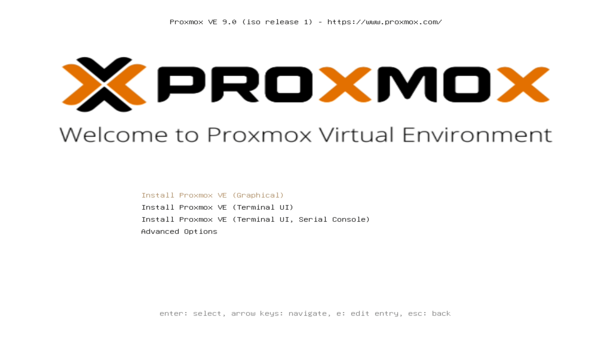

2. Leave selected the **Install Proxmox VE (Graphical)** option and press enter. You'll get into a shell screen, where you'll see some lines from the installer doing stuff like recognizing devices and such:

    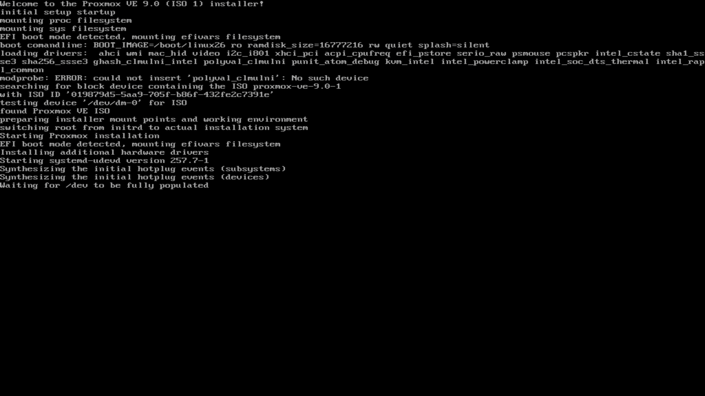

    After a few seconds, you'll reach the Proxmox VE installer's graphical interface.

3. **This is not a step**, just a warning the installer could show you if your CPU doesn't have the support for virtualization Proxmox VE needs to have for executing its virtualization stuff with the KVM virtualization engine:

    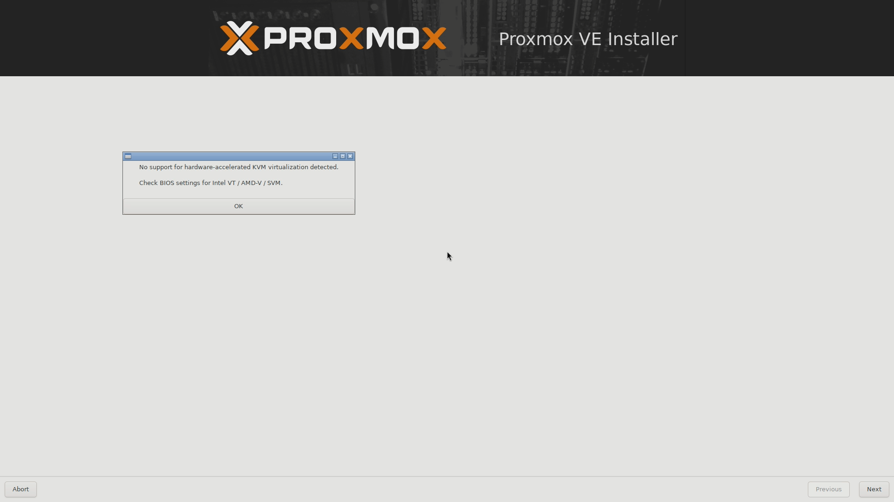

    If you see this warning, **abort** the installation and boot in your server's BIOS to check if your CPU's virtualization technology support is disabled. If so, enable it and reboot back into the installer again.

    > [!IMPORTANT]
    > **If your computer's CPU does not support virtualization, you still can install Proxmox VE in it**\
    > I haven't seen anything in the official Proxmox VE documentation forbidding it. Still, bear in mind that the performance of the virtualized systems you'll create inside Proxmox VE could end being sluggish or too demanding on your hardware. Or just not work at all.

4. Usually, the first thing the installer will present you with is the **EULA** screen:

    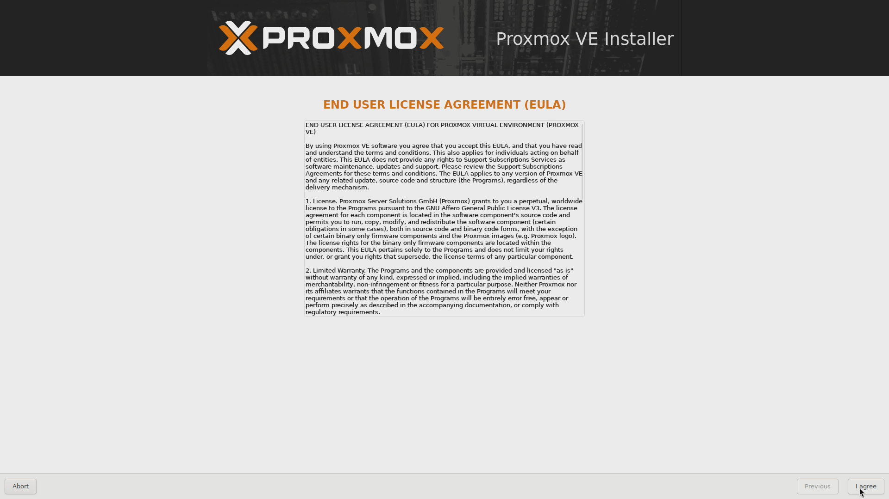

    Nothing to do here, except clicking on the **I agree** button and move on.

5. Here you'll meet the very first thing you'll have to configure, **the storage drive where you want to install Proxmox VE**:

    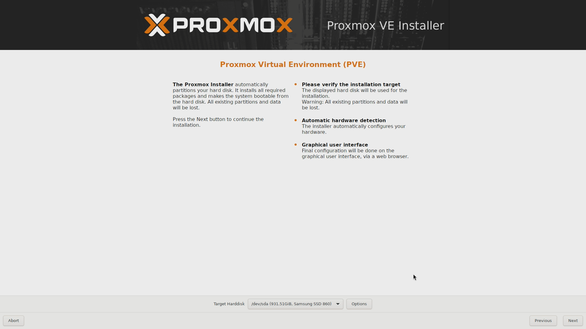

    In the _Target Harddisk_ list you have to choose on which storage drive you want to install Proxmox VE, and you want it to be the SSD drive to get the best performance out of Proxmox VE. So, assuming the SSD is the first device in the list, choose `/dev/sda` but **do not click** on the **Next** button yet!

    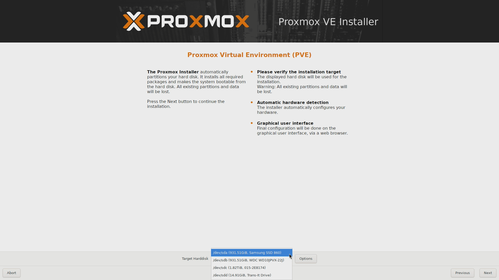

    Also notice that, depending on the method you are using to run the Proxmox VE installer ISO, the USB drive may also appear as an option in the target harddisk list (in my setup, it appears as the `/dev/sdd` unit listed last in the snapshot above). Just be sure of NOT choosing it for installing Proxmox VE and you will be fine.

6. With the `/dev/sda` device chosen as target harddisk, push the **Options** button to see the _Harddisk options_ window:

    

    There you'll see that you can change the filesystem, and also edit a few parameters.

    - `Filesystem`\
      Leave it as **ext4**, since it's the only adequate one for the hardware available.

    - `hdsize`\
      By default, the installer assigns the entire space available in the chosen storage drive to the Proxmox VE system. This is not optimal since Proxmox VE does not need that much space by itself (remember, the reference hardware's SSD has 1 TiB), so it's better to adjust this parameter to a much lower value. Leaving it at something like 63 GiB should be more than enough. The rest of the space in the storage drive will be left unpartitioned, something we'll worry about in a later guide.

      > [!WARNING]
      > **The `hdsize` is the total size of the filesystem assigned to Proxmox VE**\
      > The other parameters are contained within this `hdsize` value.

    - `swapsize`\
      To adjust the swap size on any computer, I always use the following rule of thumb. A swap partition should have reserved at least **1.5 times** the amount of RAM available in the system. In this case, since the computer has 8 GiB of RAM, that means reserving 12 GiB for the swap.

    - `maxroot`, `minfree` and `maxvz`\
      These three are left empty, to let the installer handle them with whatever defaults it uses.

    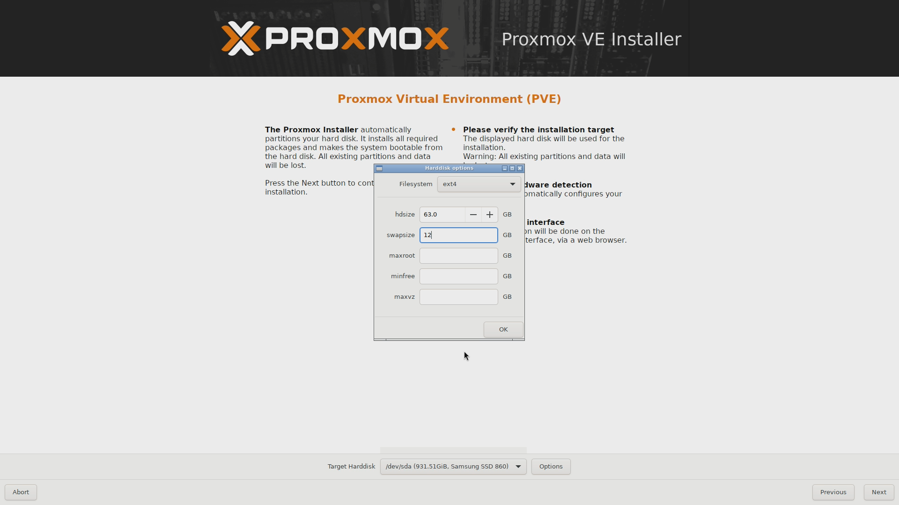

    See in this snapshot how I've configured the `hdsize` to 63 GB with 12 GB of them reserved for the swap, which leaves around 51 GB for the Proxmox VE installation and data.

    When you have everything ready in this _Harddisk options_ window, close it by clicking on **OK**, then press on **Next**.

7. The next screen is the **Localization and Time Zone selection** for your system:

    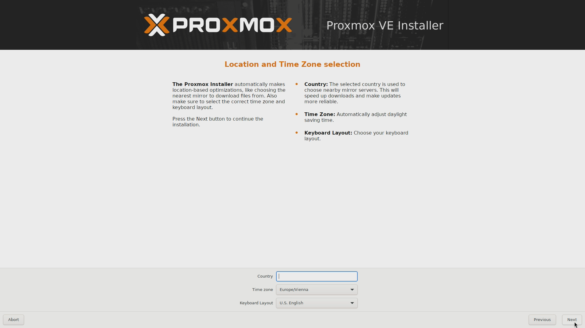

    Just choose the timezone and keyboard layout fitting your needs and move on.

8. Now, you'll have to input a proper password and a valid email for the `root` user:

    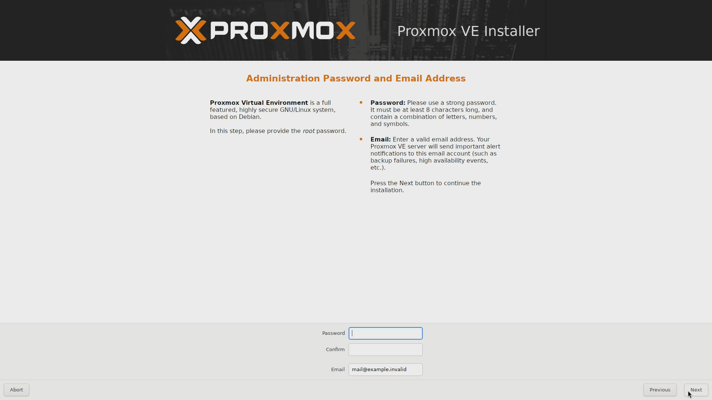

    Be aware that this screen will run a validation both over the password and the email values when you click on **Next**. You will not be able to advance in the installation unless you comply with the restrictions imposed by the installer in this step.

    > [!NOTE]
    > **The email value can be a ficticious one**\
    > The email must look realistic, but it does not have to be a real one because the installer only cares about the string itself. The installer will not try to send anything to the specified email.
    >
    > A Proxmox VE server can send notifications to that email, but that is a feature not enabled by default.

9. This step is about setting up your network configuration:

    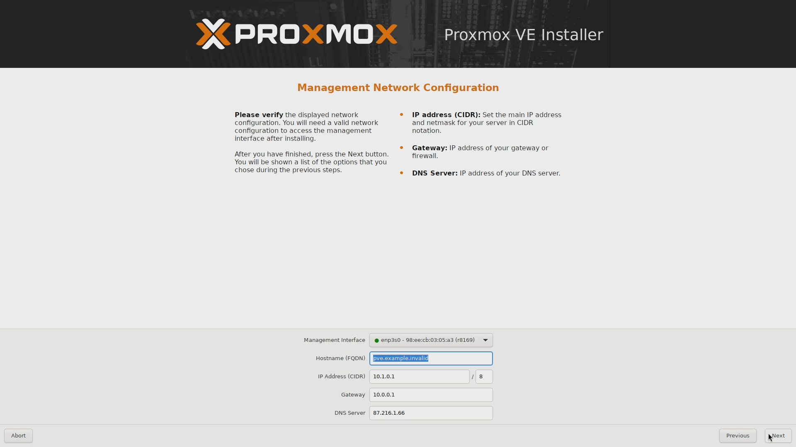

    What you're configuring here is through which network controller and network you want to reach the Proxmox VE management console. The installer will try to autodetect and fill the values (it has not worked always in my experience), but some adjustment may be required. In particular, you will always have to specify the hostname FQDN you want for your Proxmox VE server.

    > [!NOTE]
    > In this guide, the Proxmox VE hostname's FQDN will be `pve.homelab.cloud`.

10. The **summary** screen will show you the configuration you've chosen:

    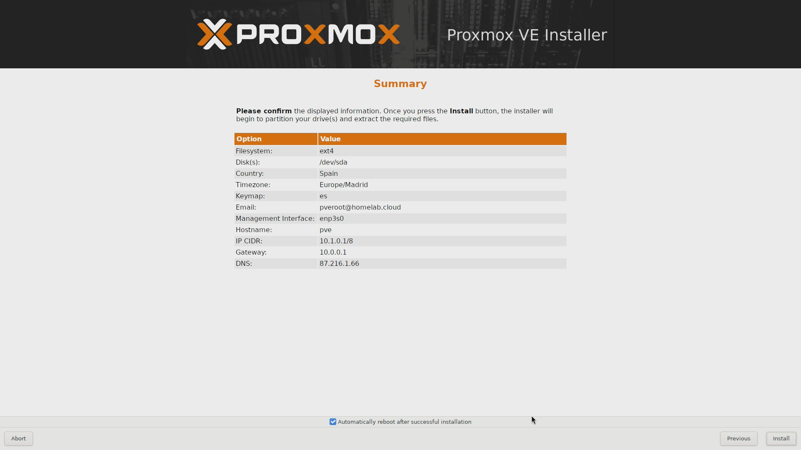

    Notice, at the bottom of the screen, the check about **Automatically reboot after successful installation**. If you prefer to reboot manually, uncheck it. Then, if you're happy with the setup, click on **Install**.

    > [!NOTE]
    > **The email shown in the screenshot is just an example**\
    > The `pveroot@homelab.cloud` value is a fake email with an obvious name for illustrative purposes. If you use a real one, Proxmox VE can be configured to send notifications to it.

11. The next screen will show you a progress bar and some information about the ongoing installation:

    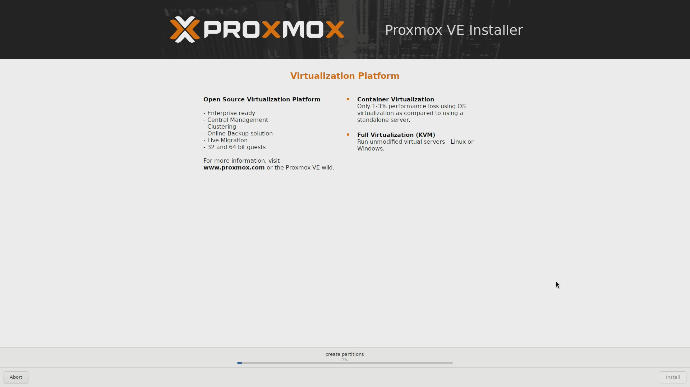

    > [!NOTE]
    > The installer, on its own, will download and install a more recent version of the Proxmox VE platform, instead of just putting the one included in the Proxmox VE ISO.

12. The installation will be over after a few minutes. If you disable the automatic reboot, you will see the `Installation successful!` screen:

    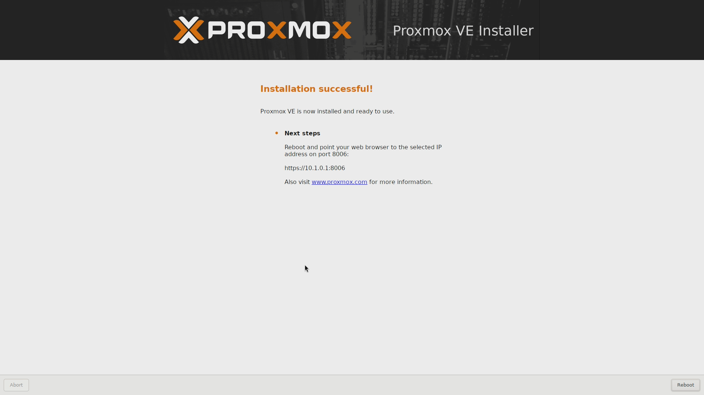

    This screen also reminds you of rebooting the system and through which IP you can reach the web console of your newly installed Proxmox VE. At this point, reboot and unplug the USB drive you used to install Proxmox VE.

### Failed installation due to a bootloader setup error

It might happen that the Proxmox VE installer fails at the very end, right when is trying to write the EFI bootloader of the Proxmox VE system in the `/dev/sda` drive. When this happens, the installer will show you an error message like the following one:

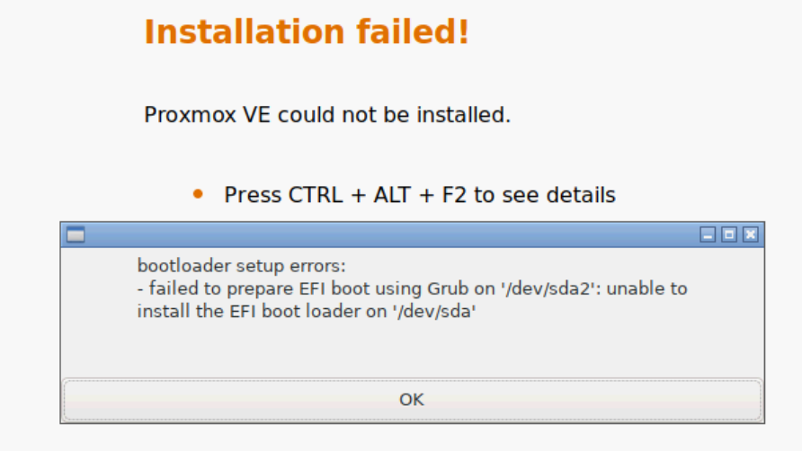

> [!NOTE]
> This snapshot comes from an old [reddit thread](https://www.reddit.com/r/homelab/comments/s9d2yg/proxmox_ve_install_failed_on_r720_due_to_efi_boot/) by [MattTheHuman](https://www.reddit.com/user/MattTheHuman/) dealing with this issue although in a different hardware setup.

In my case it happen probably due to a bug or bad UEFI implementation in the firmware of my computer's motherboard, but I cannot really tell. Just know that, if you face this issue, you will be forced to retry the installation of Proxmox VE but doing the following first:

1. Make the USB drive where you put the Proxmox VE installer ISO boot **in MBR mode**. With a tool like Ventoy this is very easy, although it will erase the drive and force you to copy the ISO again in the drive.

2. Turn on your computer and get into its BIOS.

    > [!WARNING]
    > **The next steps done within the BIOS are just orientative**\
    > The options available in your computer's firmware may differ significantly, although they should be somewhat similar.

3. Go to the screen where you can configure the Secure Boot mode and:

    - Disable the loading of security keys when the computer boots up. In my computer this was the default behavior.

    - Enable the custom mode and clear all security keys.

4. Still in the BIOS, now go to the screen where you can enable the CSM mode. This is the legacy BIOS behavior you need to boot your USB drive in MBR mode.

5. Save the changes.

6. Assuming you have the USB drive already plugged in the computer, boot it up and get into the Proxmox VE installer.

7. Complete the installation of Proxmox VE. If it fails again, maybe there is another EFI-related option that is messing up your installation process.

8. If Proxmox VE gets installed successfully, return to the BIOS when you reboot the system.

9. In the BIOS, enable the Security Boot but with custom configuration and disable the CSM mode. This is necessary to allow Proxmox VE to boot up, since it is an EFI-based system and it won't run in CSM mode.

10. Save the changes in the firmware, reboot and Proxmox VE should start running.

Hopefully, these indications will save you from spending days of (almost) fruitless research if you face this very same problem.

## After the installation

You have installed Proxmox VE and your server has rebooted. Proxmox VE comes with a web console which you can access through the **port 8006**. So, open a browser and navigate to the URL the installer indicated you when it finished and you'll reach Proxmox VE's web console.

> [!NOTE]
> **Proxmox VE's web console loads a light or dark color theme automatically**\
> By default, the login screen will use the theme that corresponds to your browser's aspect configuration.
>
> Going forward, any other web console snapshot present in the upcoming chapters will be shown using the light color theme.

Log in as `root` and take a look around to confirm that the installation is done. At the time of writing this, the installation procedure left my host with a Proxmox VE **9.0.3 standalone node** running on a **Debian GNU/Linux 13 (trixie)**.

## Connecting remotely

You can connect already to your standalone PVE node through any SSH client of your choosing, by using the username `root` and the password you set up in the installation process. **This is not the safest configuration**, but you'll see how to harden it in a later chapter.

## References

### [Proxmox](https://www.proxmox.com/en/)

- [Downloads](https://www.proxmox.com/en/downloads)
  - [Proxmox Virtual Environment](https://www.proxmox.com/en/downloads/proxmox-virtual-environment)

- [Wiki. Installation](https://pve.proxmox.com/wiki/Installation)

- [Proxmox VE Administration Guide](https://pve.proxmox.com/pve-docs/pve-admin-guide.html)
  - [2. Installing Proxmox VE](https://pve.proxmox.com/pve-docs/pve-admin-guide.html#chapter_installation)
    - [2.1. System Requirements](https://pve.proxmox.com/pve-docs/pve-admin-guide.html#_system_requirements)
    - [2.2. Prepare Installation Media](https://pve.proxmox.com/pve-docs/pve-admin-guide.html#installation_prepare_media)

- [Reddit. Proxmox VE install failed on R720 due to EFI boot using Grub on /dev/sda2 and /dev/sda - Completely Stumped](https://www.reddit.com/r/homelab/comments/s9d2yg/proxmox_ve_install_failed_on_r720_due_to_efi_boot/)

### [Ventoy](https://www.ventoy.net/en/index.html)

- [Document](https://www.ventoy.net/en/doc_start.html)

## Navigation

[<< Previous (**G001. Hardware setup**)](G001%20-%20Hardware%20setup.md) | [+Table Of Contents+](G000%20-%20Table%20Of%20Contents.md) | [Next (**G003. Host configuration 01**) >>](G003%20-%20Host%20configuration%2001%20~%20Apt%20sources%2C%20updates%20and%20extra%20tools.md)
