# G002 - Proxmox VE installation

- [A procedure to install Proxmox VE in limited consumer hardware](#a-procedure-to-install-proxmox-ve-in-limited-consumer-hardware)
- [System Requirements](#system-requirements)
  - [Minimum requirements](#minimum-requirements)
  - [Recommended requirements](#recommended-requirements)
- [Installation procedure](#installation-procedure)
  - [Preparing the Proxmox VE installation media](#preparing-the-proxmox-ve-installation-media)
    - [Writing the Proxmox VE ISO from a Windows system with Rufus](#writing-the-proxmox-ve-iso-from-a-windows-system-with-rufus)
  - [Prepare your storage drives](#prepare-your-storage-drives)
  - [Installing Proxmox VE](#installing-proxmox-ve)
- [After the installation](#after-the-installation)
- [Connecting remotely](#connecting-remotely)
- [References](#references)
  - [Proxmox](#proxmox)
  - [Rufus](#rufus)
- [Navigation](#navigation)

## A procedure to install Proxmox VE in limited consumer hardware

This guide explains how to install a Proxmox VE **8.4** platform into a consumer hardware or VM setup similar to the one detailed in the [**G001** guide](G001%20-%20Hardware%20setup.md). This procedure follows a straightforward path, meaning that only some basic but necessary parameters will be configured here. Any advanced stuff will be left for later guides.

> [!NOTE]
> **This Proxmox VE installation has been done in a virtual machine**\
> Since I no longer have the computer I originally used to elaborate the guides in this series, this revised version has been done with a _virtual machine_ (_VM_) configured to closely match the reference hardware.
>
> The main singular difference of this VM with the reference hardware is the lack of a wireless network adapter, which wasn't originally used at all in these guides anyway.

## System Requirements

I've copied below the [minimum and recommended requirements for Proxmox VE](https://pve.proxmox.com/pve-docs/pve-admin-guide.html#_system_requirements).

### Minimum requirements

According to the Proxmox VE manual, these minimum requirements are **for evaluation purposes only**, **not for setting up an enterprise-grade production server**.

- CPU: 64bit (Intel 64 or AMD64).
- Intel VT/AMD-V capable CPU/motherboard for KVM full virtualization support.
- RAM: 1 GB RAM, plus additional RAM needed for guests.
- Hard drive.
- One network card (NIC).

As you can see, a computer or VM matching the [reference hardware](G001%20-%20Hardware%20setup.md#the-reference-hardware-setup) fits the minimum requirements.

### Recommended requirements

Below you can find the [recommended system requirements for a proper Proxmox VE production server](https://pve.proxmox.com/pve-docs/pve-admin-guide.html#install_recommended_requirements).

- Intel 64 or AMD64 with Intel VT/AMD-V CPU flag.

- Memory: Minimum 2 GB for the OS and Proxmox VE services, plus designated memory for guests. For Ceph and ZFS, additional memory is required; approximately 1GB of memory for every TB of used storage.

- Fast and redundant storage, best results are achieved with SSDs.

- OS storage: Use a hardware RAID with battery protected write cache (“BBU”) or non-RAID with ZFS (optional SSD for ZIL).

- VM storage:

  - For local storage, use either a hardware RAID with battery backed write cache (BBU) or non-RAID for ZFS and Ceph. Neither ZFS nor Ceph are compatible with a hardware RAID controller.

  - Shared and distributed storage is possible.

  - SSDs with Power-Loss-Protection (PLP) are recommended for good performance. Using consumer SSDs is discouraged.

- Redundant (Multi-)Gbit NICs, with additional NICs depending on the preferred storage technology and cluster setup.

- For PCI(e) passthrough the CPU needs to support the VT-d/AMD-d flag.

When comparing these requirements with the [reference hardware](G001%20-%20Hardware%20setup.md#the-reference-hardware-setup), don't lose sight of the goal here: running a small **standalone Proxmox VE node** in limited consumer hardware for personal use. Under that point of view, most of these recommendations, although illustrative, do not really apply for the problem at hand in this guide series.

In short, just ensure to use a computer or VM that, at least, matches the [reference hardware](G001%20-%20Hardware%20setup.md#the-reference-hardware-setup). In particular, make sure that your CPU has virtualization capabilities and you have 8GiB of RAM at least.

## Installation procedure

### Preparing the Proxmox VE installation media

Proxmox VE is provided as an ISO image file, which you have to either burn in a DVD, write in a USB drive, or just use as-is with a virtual machine. Here I'll show you the USB path, since you probably want to install Proxmox on a real computer. [Proxmox also provides some instructions about how to write the ISO image from a Linux, MacOS or Windows environment](https://pve.proxmox.com/pve-docs/chapter-pve-installation.html#installation_prepare_media).

#### Writing the Proxmox VE ISO from a Windows system with Rufus

These steps explain how to use [**Rufus**](https://rufus.ie/) to write the Proxmox VE ISO into an USB pen drive from a Windows computer:

> [!NOTE]
> **Skip this Rufus procedure if you are going to install Proxmox VE on a VM**\
> Jump directly to the [step of preparing the storage drives](#prepare-your-storage-drives) and continue from there.

1. Get the latest Proxmox VE 8.4 ISO from the [official site](https://www.proxmox.com/en/). You'll have to look for it in the site's [_downloads_ section](https://www.proxmox.com/en/downloads). Download the ISO found in the [_Proxmox Virtual Environment_ section](https://www.proxmox.com/en/downloads/proxmox-virtual-environment). The [Proxmox VE 8.4 ISO Installer](https://www.proxmox.com/en/downloads/proxmox-virtual-environment/iso/proxmox-ve-8-4-iso-installer) weights around **1.46 GiB**.

2. Download the [Rufus](https://rufus.ie/) tool.

3. Ready an USB drive with **4 GiB** at least, just to be sure that the Proxmox VE ISO has enough room to be written on it.

4. Plug your USB into your Windows computer and open Rufus.

5. In Rufus, choose the Proxmox VE ISO you just downloaded. Rufus will show you a warning about the image being an ISOHybrid incompatible with some ISO/File copy mode.

    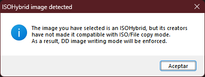

    Just accept (_Aceptar_ in my Spanish-based Windows as shown in the snapshot) it and get into the main Rufus window.

6. Adjust the `Partition scheme` depending if your target computer is a UEFI-based system (leave `GPT`) or not (switch to `MBR`). Leave the rest of the parameters with their default values.

    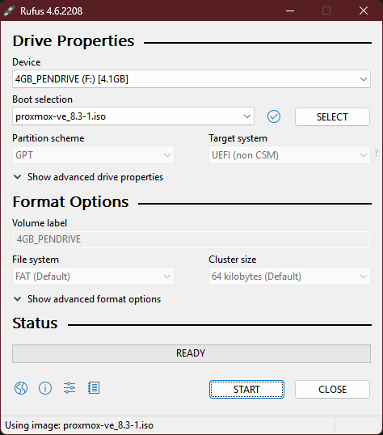

    > [!WARNING]
    > **Be careful with the `Partition scheme`!**\
    > If you don't configure the `Partition scheme` properly, the Proxmox VE installer will not boot up when you try to launch it in your computer.

7. Rufus will warn you that the procedure will destroy **all data** on your USB device.

    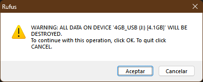

    If you're sure that you want to proceed, press `Accept` (_Aceptar_ in my Spanish-based Windows as shown in the snapshot).

8. Rufus will then write the Proxmox VE ISO in your USB drive.

    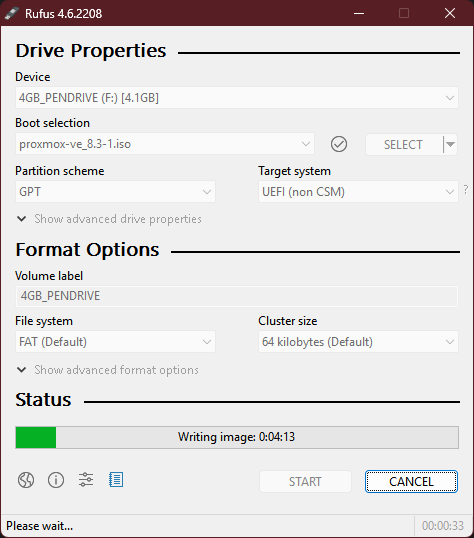

9. Rufus will take a couple of minutes to do its job. When it finishes, you'll see the message `READY` written in the green progress bar.

    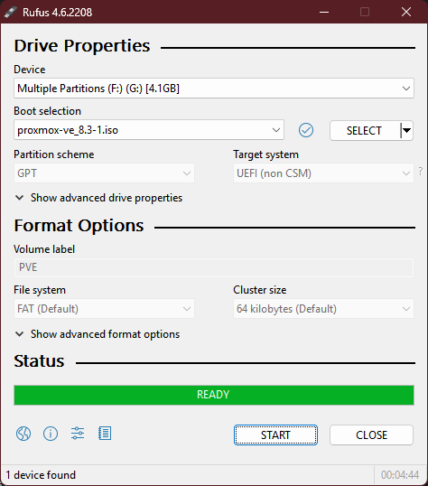

With the ISO properly written in the USB drive, you can finally start the installation of Proxmox VE.

### Prepare your storage drives

Remember to empty the storage drives in your server-to-be computer, meaning that you have to leave them completely void of data, filesystems and partitions. This is to avoid any potential conflicts like, for instance, having an old installation of some outdated, but still bootable, Linux installation. So, be sure of clearing those drives, using some Linux distribution that can be run in Live mode, such as the official Debian one or any of the Ubuntu-based ones. Then use a tool like GParted or KDE Partition Manager to remove all the partitions present on those drives and you'll be good to go.

### Installing Proxmox VE

The Proxmox site has two guides explaining Proxmox VE's installation, [linked in the _References_ section at the end of this document](#proxmox). The steps below are my custom take on this install procedure, adapted to the [reference hardware](G001%20-%20Hardware%20setup.md#the-reference-hardware-setup) used in this guide series:

1. Plug the Proxmox VE USB in the computer, and make it boot from the USB drive. If you're installing Proxmox VE on a VM, set the ISO image as the bootable DVD drive of your VM.

2. After successfully booting your computer or VM, you'll eventually be greeted by the following screen.

    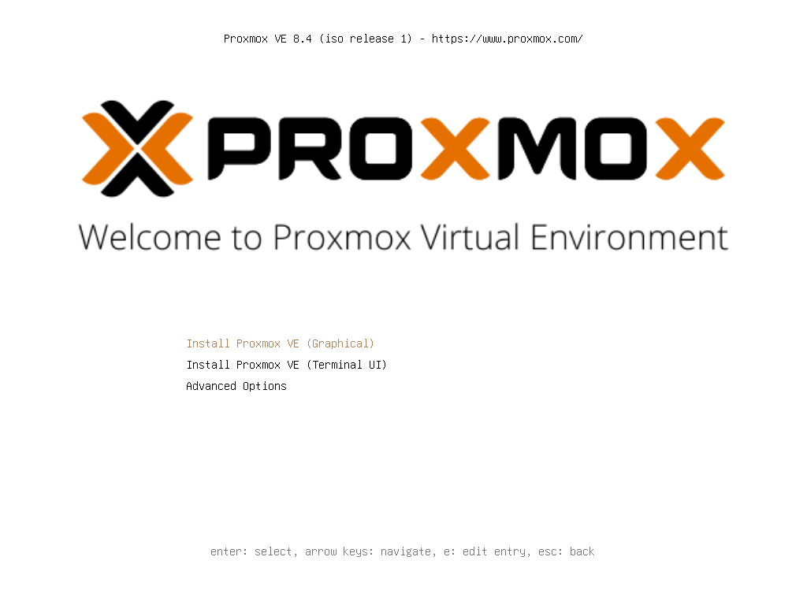

3. Leave selected the **Install Proxmox VE (Graphical)** option and press enter. You'll get into a shell screen, where you'll see some lines from the installer doing stuff like recognizing devices and such. After a few seconds, you'll return to the Proxmox VE installer's graphical interface.

4. **This is not a step**, just a warning the installer could show you if your CPU doesn't have the support for virtualization Proxmox VE needs to have for executing its virtualization stuff with the KVM virtualization engine.

    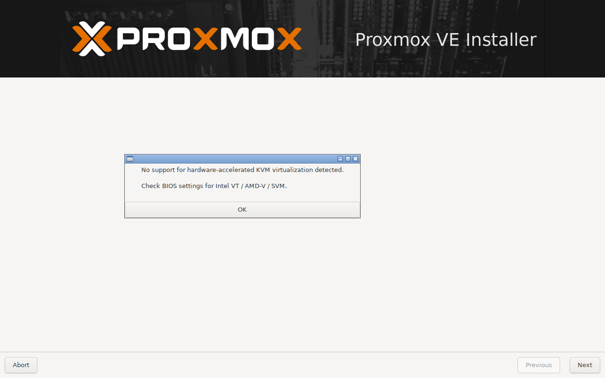

    If you see this warning, **abort** the installation and boot in your server's BIOS to check if your CPU's virtualization technology support is disabled. If so, enable it and reboot back to the installer again.

    > [!IMPORTANT]
    > **If your computer's CPU does not support virtualization, you still can install Proxmox VE in it**\
    > I haven't seen anything in the official Proxmox VE documentation forbidding it. Still, bear in mind that the performance of the virtualized systems you'll create inside Proxmox VE could end being sluggish or too demanding on your hardware. Or just not work at all.

5. Usually, the first thing the installer will present you with is the **EULA** screen.

    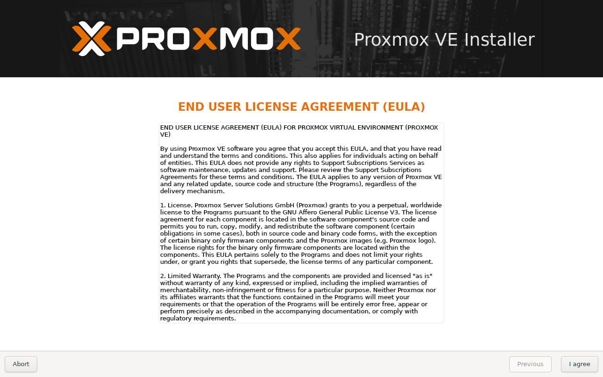

    Nothing to do here, except clicking on **I agree** and move on.

6. Here you'll meet the very first thing you'll have to configure, **where you want to install Proxmox VE**.

    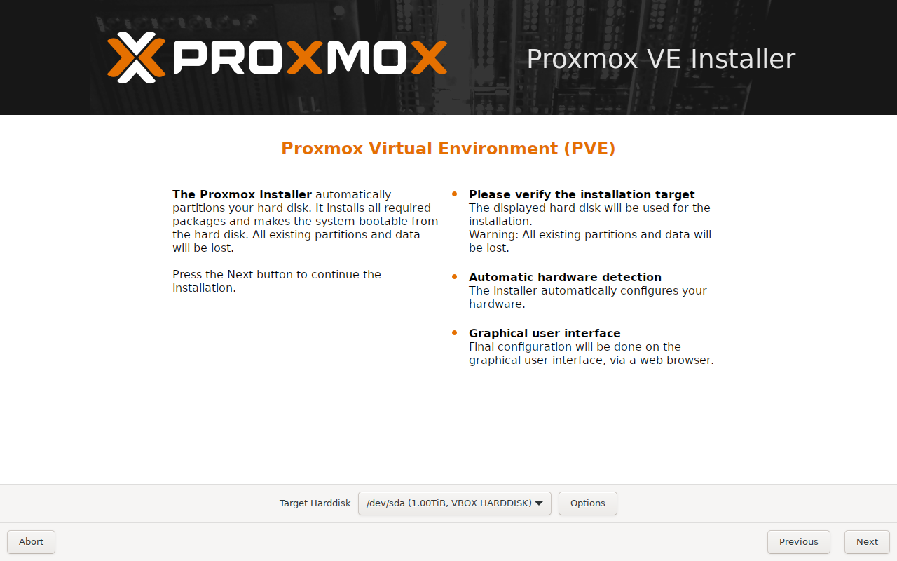

    Remember that I'm doing this installation in a VirtualBox VM, which explains why some of the storage drives shown in the _Target Harddisk_ list are called `VBOX HARDDISK`. Oddly, the `/dev/sdc` drive is listed just as `HARDDISK` although it is also a virtual storage drive like the other two. This probably is due to it being configured as a virtual USB storage drive.

    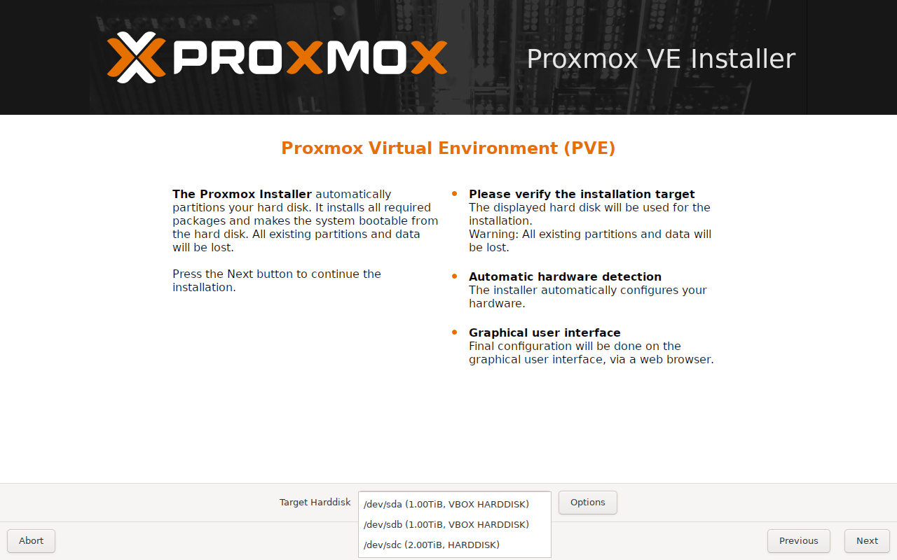

    In the _Target Harddisk_ list you have to choose on which storage drive you want to install Proxmox VE, and you want it in the SSD drive for best Proxmox VE performance. So, assuming the SSD is the first device in the list, choose `/dev/sda` but **do not click** on the **Next** button yet!

7. With the `/dev/sda` device chosen as target harddisk, push the **Options** button to see the _Harddisk options_ window.

    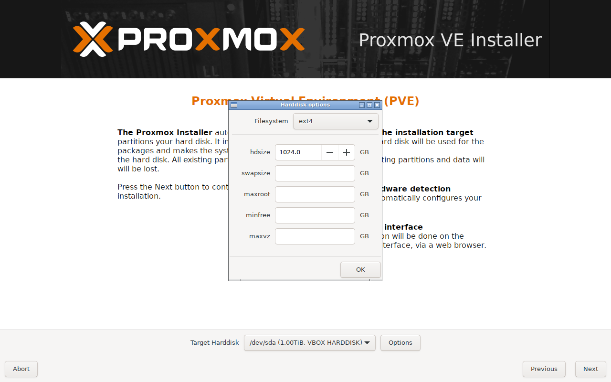

    There you'll see that you can change the filesystem, and also edit a few parameters.

    - `Filesystem`\
      Leave it as **ext4**, since it's the only adequate one for the hardware available.

    - `hdsize`\
      By default, the installer assigns the entire space available in the chosen storage drive to the Proxmox VE system. This is not optimal since Proxmox VE doesn't need that much space by itself (remember, the reference hardware's SSD has 1 TiB), so it's better to adjust this parameter to a much lower value. Leaving it at something like 50 GiB should be more than enough. The rest of the space in the storage drive will be left unpartitioned, something we'll worry about in a later guide.

      > [!WARNING]
      > **The `hdsize` is the total size of the filesystem assigned to Proxmox VE**\
      > The `hdsize` value includes all the other parameters below it.

    - `swapsize`\
      To adjust the swap size on any computer, I always use the following rule of thumb. A swap partition should have reserved at least **1.5 times** the amount of RAM available in the system. In this case, since the computer has 8 GiB of RAM, that means reserving 12 GiB for the swap.

    - `maxroot`, `minfree` and `maxvz`\
      These three are left empty, to let the installer handle them with whatever defaults it uses.

    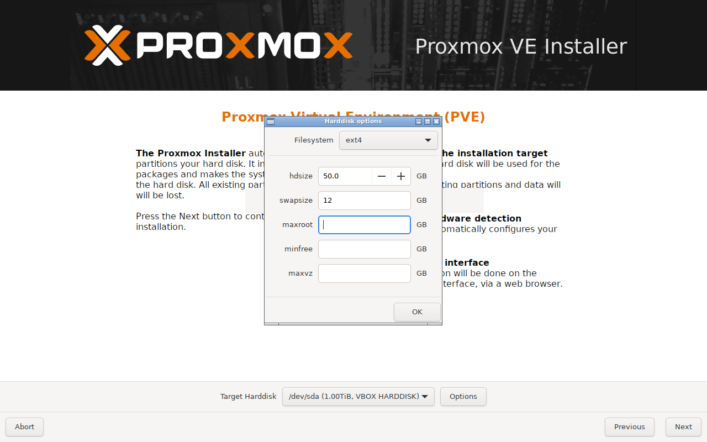

    When you have everything ready in this _Harddisk options_ window, close it by clicking on **OK**, then go to the  click on **Next**.

8. The next screen is the **Localization and Time Zone selection** for your system.

    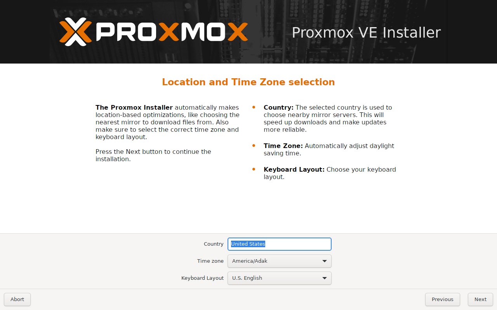

    Just choose whatever suits your needs and move on.

9. Now, you'll have to input a proper password and a valid email for the `root` user.

    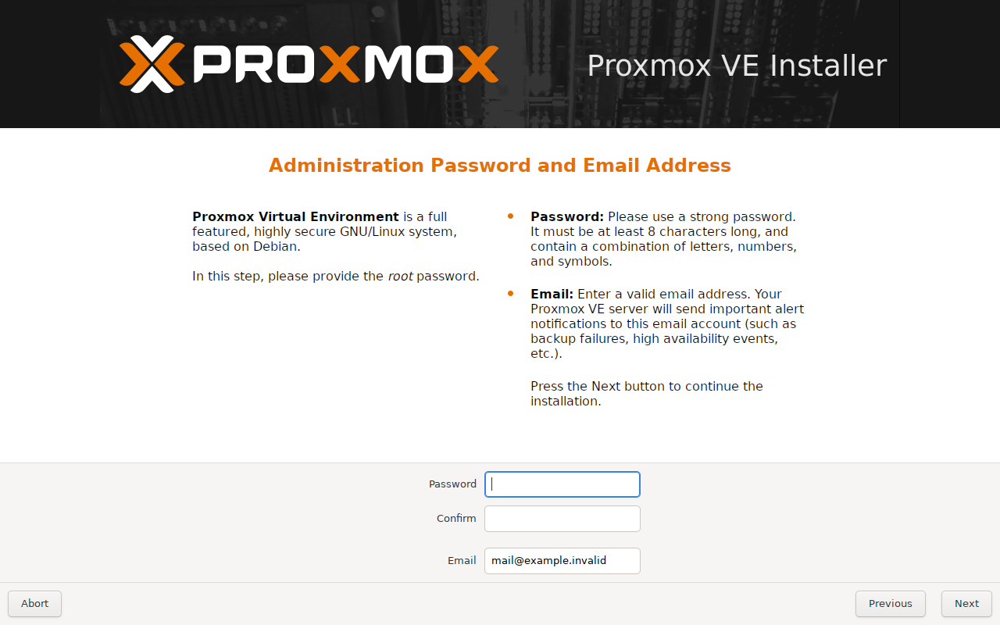

    This screen will make some validation both over the password and the email fields when you click on **Next**.

    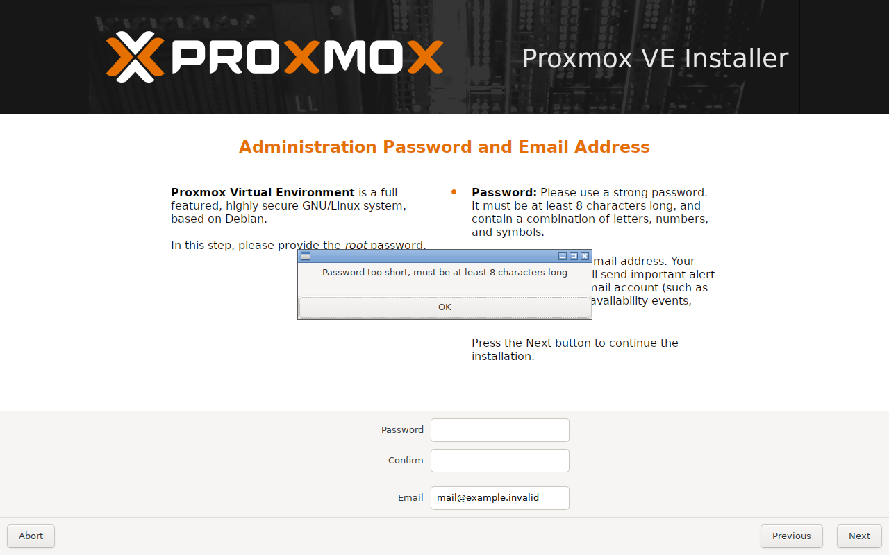

10. This step is about setting up your network configuration.

    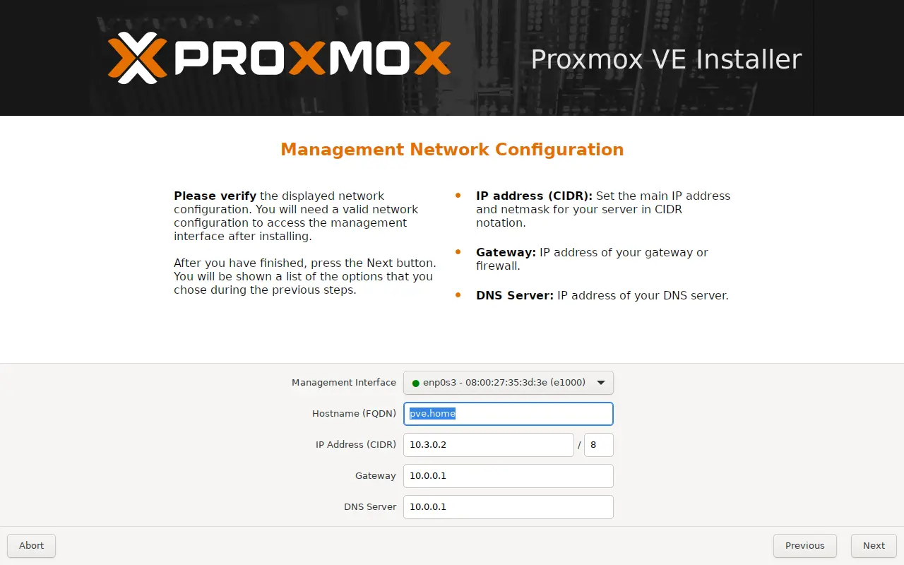

    What you're configuring here is through which network controller and network you want to reach the Proxmox VE management console. The installer will autodetect the values, but some adjustment may be required.

    Be careful of which network controller you choose as `management interface`. Choosing the wrong one could make your Proxmox VE system unreachable remotely.

11. The **summary** screen will show you the configuration you've chosen.

    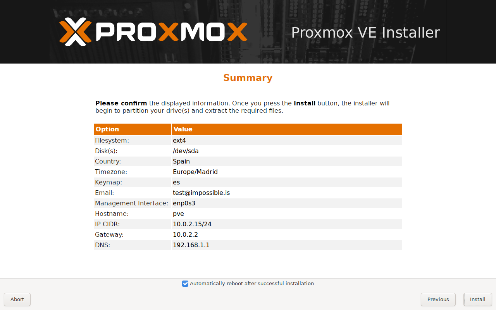

    Notice, at the bottom of the screen, the check about **Automatically reboot after successful installation**. If you prefer to reboot manually, uncheck it. Then, if you're happy with the setup, click on **Install**.

12. The next screen will show you a progress bar and some information while doing the installation.

    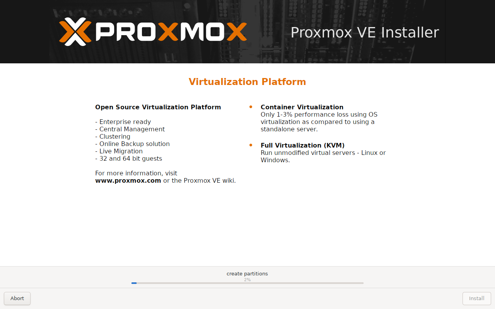

    With an SSD as the target hard disk, the installation process will go really fast.

    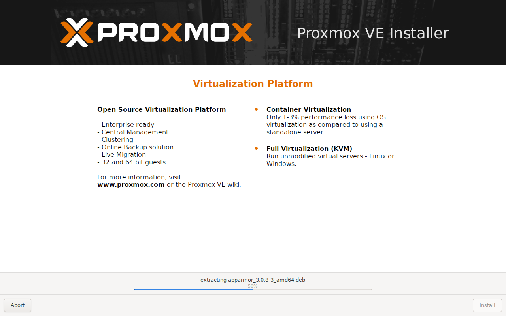

    > [!NOTE]
    > The installer, on its own, will download and install a more recent version of the Proxmox VE platform, instead of just putting the one included in the Proxmox VE ISO.

13. When the installation is done, it will ask for a reboot. Unplug the USB, or remove the ISO from the VM, in that moment to avoid booting into the Proxmox installation program again.

## After the installation

You have installed Proxmox VE and your server has rebooted. Proxmox VE comes with a web console which you can access through the **port 8006**. So, open a browser and navigate to `https://your.proxmox_ve_server.ip.address:8006` and you'll reach the Proxmox VE web console. In my case, it happens to load in dark mode.

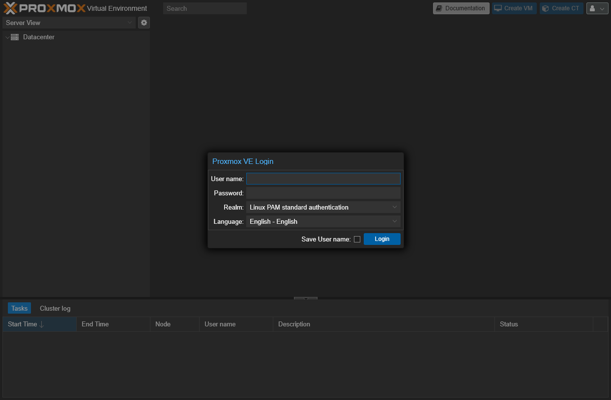

Log in as `root` and take a look around, confirming that the installation it's done. At the time of writing this, the installation procedure left my host with a Proxmox VE **8.4.0 standalone node** running on a **Debian 12 "Bookworm"**.

## Connecting remotely

You can connect already to your standalone PVE node through any SSH client of your choosing, by using the username `root` and the password you set up in the installation process. This is not the most safe configuration, but you'll see how to improve it in a later guide.

## References

### [Proxmox](https://www.proxmox.com/en/)

- [Proxmox VE installation guide](https://pve.proxmox.com/wiki/Installation)

- [Proxmox VE Administration Guide](https://pve.proxmox.com/pve-docs/pve-admin-guide.html)
  - [2. Installing Proxmox VE](https://pve.proxmox.com/pve-docs/pve-admin-guide.html#chapter_installation)
    - [2.1. System Requirements](https://pve.proxmox.com/pve-docs/pve-admin-guide.html#_system_requirements)

### Rufus

- [Rufus](https://rufus.ie/)

## Navigation

[<< Previous (**G001. Hardware setup**)](G001%20-%20Hardware%20setup.md) | [+Table Of Contents+](G000%20-%20Table%20Of%20Contents.md) | [Next (**G003. Host configuration 01**) >>](G003%20-%20Host%20configuration%2001%20~%20Apt%20sources%2C%20updates%20and%20extra%20tools.md)
