# G003 - Host configuration 01 ~ Apt sources, updates and extra tools

## Remember, Proxmox VE 7.0 runs on Debian 11 _bullseye_

Bear always in mind that your Proxmox VE 7.0 runs on a **Debian** _GNU Linux version 11_ (_bullseye_).

The Debian version can be checked by opening the file `/etc/os-release` found in the system.

> **BEWARE!**  
> For more details about Proxmox VE 7.0 itself, you can find a datasheet about it [in this page](https://www.proxmox.com/en/downloads/item/proxmox-ve-datasheet).

## Editing the apt repository sources

Proxmox VE comes with its `apt` system configured to point at a repository for **enterprise subscriptions**. This is a problem because, unless you already have such subscription, you won't be able to perform system updates at all. Look what happens if, in a `root` shell, you try to execute `apt update` with the default setup.

~~~bash
$ apt update
Get:1 http://security.debian.org bullseye-security InRelease [44.1 kB]
Get:2 http://ftp.es.debian.org/debian bullseye InRelease [154 kB]
Get:3 http://security.debian.org bullseye-security/main amd64 Packages [16.8 kB]
Get:4 http://security.debian.org bullseye-security/main Translation-en [8,244 B]
Get:5 http://ftp.es.debian.org/debian bullseye-updates InRelease [40.1 kB]
Get:6 http://ftp.es.debian.org/debian bullseye/main amd64 Packages [8,178 kB]
Err:7 https://enterprise.proxmox.com/debian/pve bullseye InRelease
  401  Unauthorized [IP: 51.91.38.34 443]
Get:8 http://ftp.es.debian.org/debian bullseye/main Translation-en [6,241 kB]
Get:9 http://ftp.es.debian.org/debian bullseye/contrib amd64 Packages [50.4 kB]
Get:10 http://ftp.es.debian.org/debian bullseye/contrib Translation-en [46.9 kB]
Reading package lists... Done
E: Failed to fetch https://enterprise.proxmox.com/debian/pve/dists/bullseye/InRelease  401  Unauthorized [IP: 51.91.38.34 443]
E: The repository 'https://enterprise.proxmox.com/debian/pve bullseye InRelease' is not signed.
N: Updating from such a repository can't be done securely, and is therefore disabled by default.
N: See apt-secure(8) manpage for repository creation and user configuration details.
~~~

See the line Err:7 indicating an error in the process: since you don't have a valid enterprise subscription, your system is `Unauthorized` to get updates from the enterprise repository.

### _Changing the apt repositories_

You need to disable the enterprise repository and enable the repository for non-subscribers.

1. Access your Proxmox VE web console as `root`, and browse to your `pve` node's `Updates > Repositories` section.

    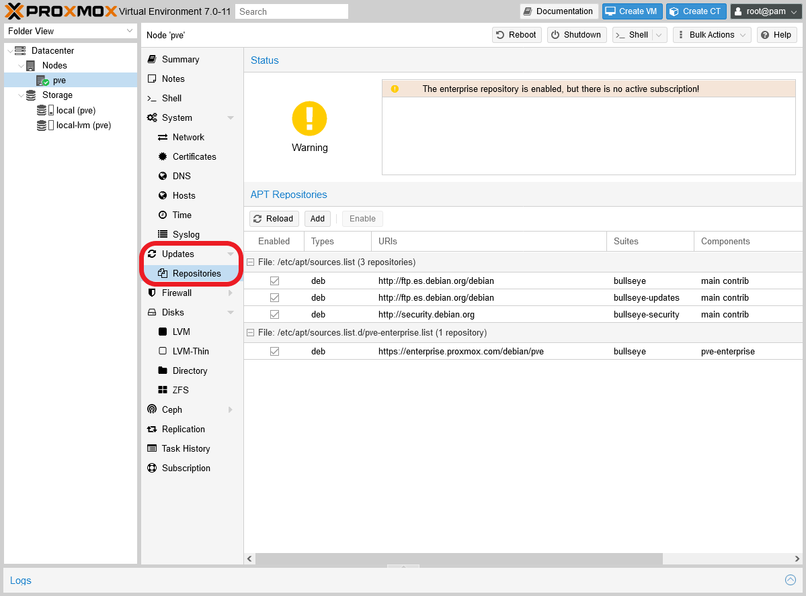

    You'll notice the warning about having the enterprise repository enabled with no active subscription. This is related to the warning you saw when you logged in the web console.

2. Select the enterprise repository, the one with the URI `https://enterprise.proxmox.com/debian/pve`.

    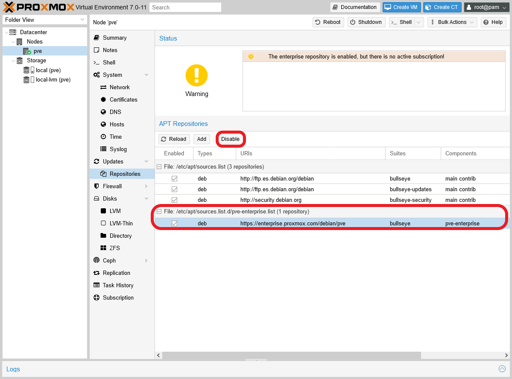

    See that the `Disable` button is now active, so press it to disable the enterprise repository.

3. With the enterprise repository disabled, the web console will warn you that you won't get any updates for the Proxmox VE platform itself.

    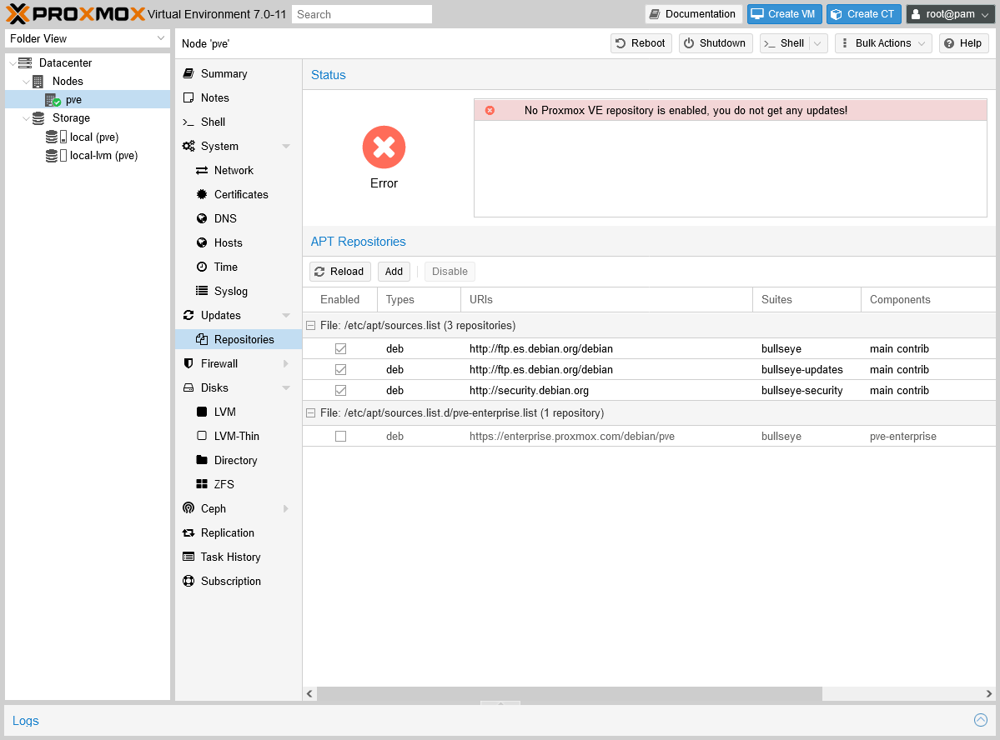

4. Click on the `Add` button now. The web console will prompt the same warning you saw when you logged in.

    

    Click on `OK` and you'll get to the windows where you can add apt repositories.

    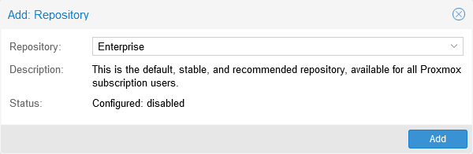

5. On that window, choose the `No-Subscription` option from the `Repository` list and then press on `Add`.

    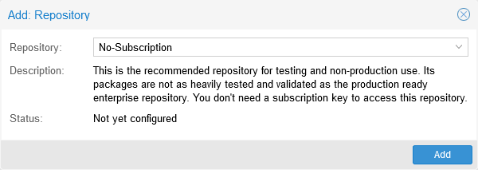

6. With the `No-Subscription` repository added, you'll see a different status in the `Repositories` screen.

    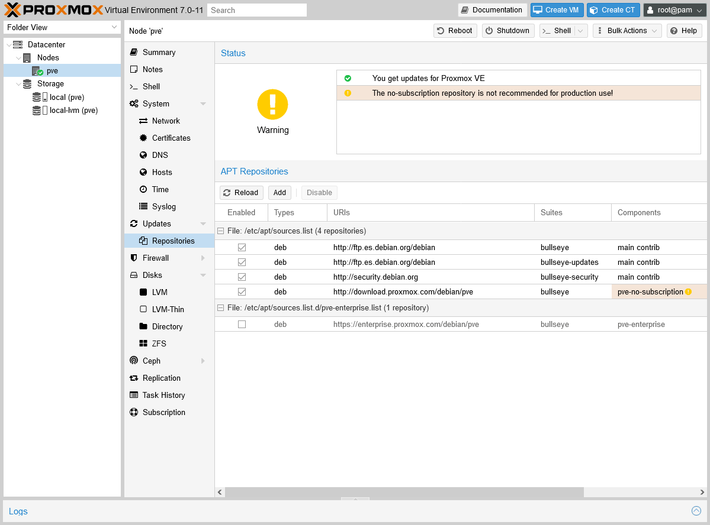

    What the new warning means is that the no-subscription repository is not the safest one to use for real production use. Still, usually it'll be good enough for your personal needs.

## Update your system

Now you can go to the `Updates` screen and see what's pending.

1. Browse to the `Updates` tab, and click on the `Refresh` button to be sure that you're getting the most recent list of updates.

    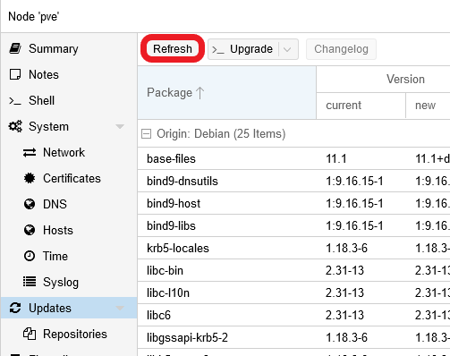

    You'll see the warning window about not having a valid subscription.

    

    Close that window and you'll meet a new one in which you'll see the `apt update` task's progress.

    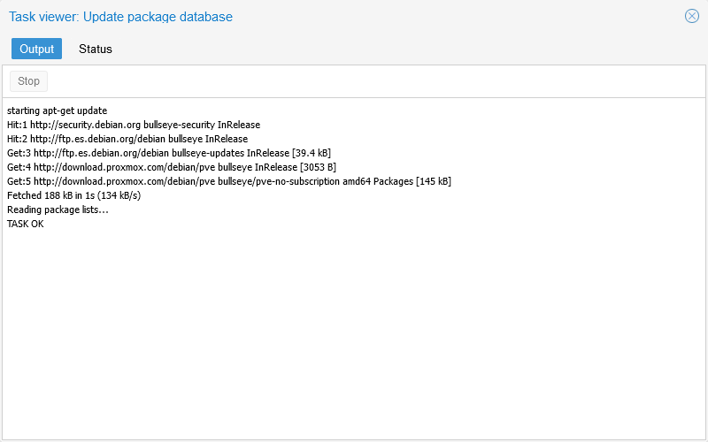

    When you see the line `TASK OK`, close the window to go back to the updates list.

    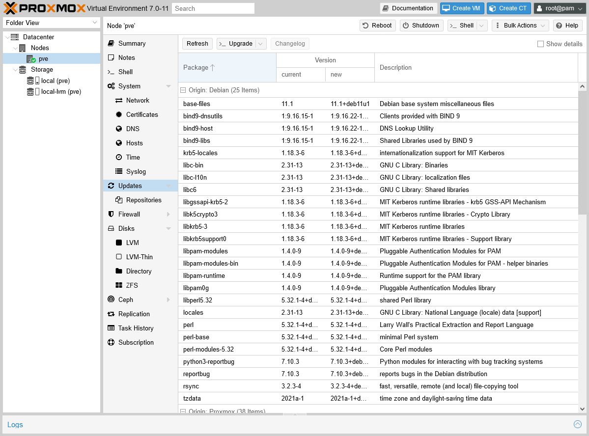

    Above, you can see that there are a lot of updates that have to be applied. In other times, this page may appear with just a few packages or empty.

2. To apply all the updates, click on the `Upgrade` button.

    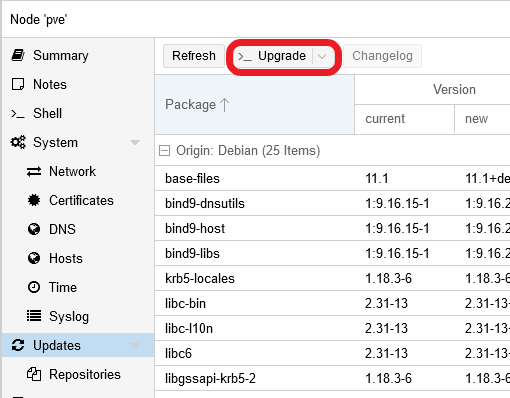

3. By default, the web console will open a shell console, using your `root` user, in which it'll launch the `apt dist-upgrade` command.

    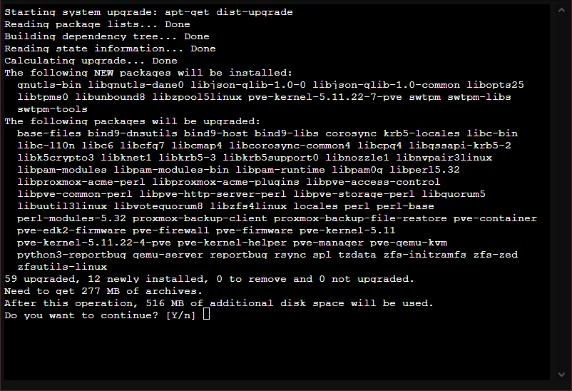

    Pay attention to when the apt command asks you for confirmation so it can proceed with the update. Also, be aware that some packages may require your input for some reason or other.

4. When the apt command finishes, it'll return the control to the prompt within the shell console.

    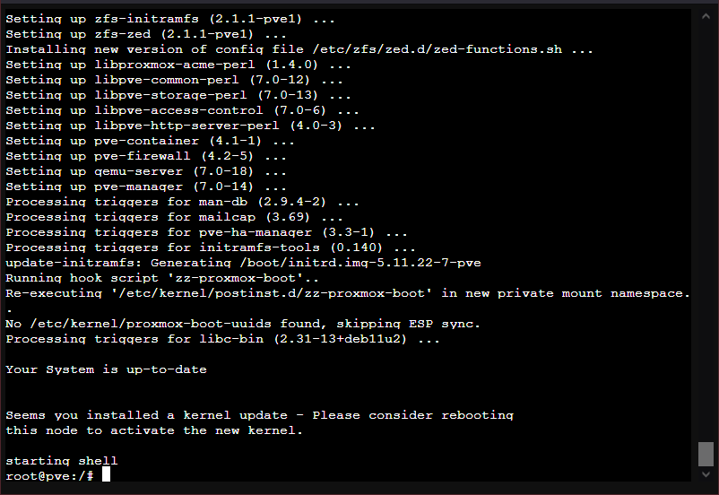

    Type `exit` to get out of the shell console, or just close the window directly.

    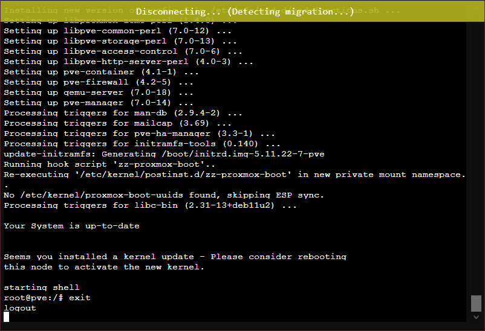

5. Back in the `Updates` screen of your `pve` node, you'll see that the updates list hasn't been refreshed. So, press again on the `Refresh` button to update the list.

    

6. The `Updates` screen may or may not show more updates to apply after refreshing. So, keep on applying the upgrades until none appear listed in this screen.

    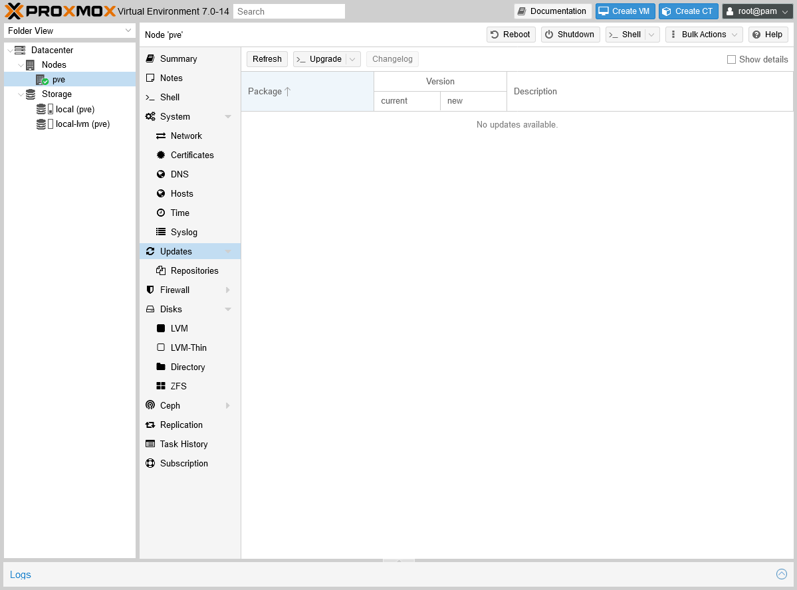

7. If you've applied many updates, or some of them were kernel related, it's better if you reboot the system. Just press on the `Reboot` button while having your `pve` node selected.

    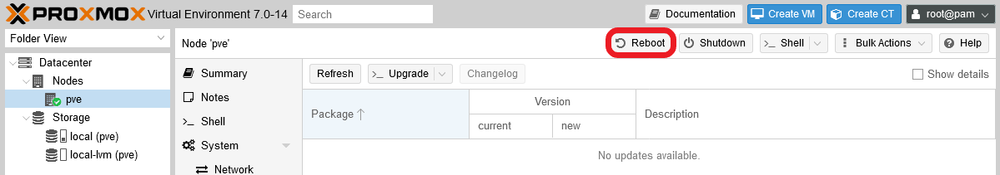

    The Proxmox VE web console will ask you to confirm the action, so click on `Yes` to proceed.

    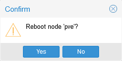

8. After the reboot, just log back in the web console and check that Proxmox VE is running fine.

While the installation left me with Proxmox VE in its version 7.0-11, after the first update, Proxmox VE got upgraded to the 7.0-14 version.

### _Consideration about upgrades_

As you've seen before, you can end having to apply several updates at once in your system. In theory, a good administrator has to be diligent and verify that each update is safe to apply. In reality, trying to do that usually is not doable. Still, you should at least be aware of the updates that directly affect the Proxmox VE platform, the ones that can update to a more recent minor or major version. Those are the ones that could break things in your setup, specially the major ones (for instance, when going from a version 6.4-x to a 7.0-x one).

So, my advice here is, since you only have one standalone node so, before you apply such updates, you should make a clone of your only node's Proxmox VE root filesystem (or the entire drive) with a tool like **Clonezilla**. This way, if something goes south in the upgrade, you can always go back to the previous stable state.

Check out the [**G905** appendix guide](G905%20-%20Appendix%2005%20~%20Cloning%20storage%20drives%20with%20Clonezilla.md) to see how to use Clonezilla to backup your host's storage drives.

### _You can use `apt` directly_

Instead of using the `Updates` screen in the web console, you could just use the `apt` command directly through an SSH shell or by opening a shell directly from the web console, as in any other Debian-based Linux system.

Personally, I prefer to connect through a SSH client to the server, as it's explained in the [**G901** appendix guide about PuTTY](G901%20-%20Appendix%2001%20~%20Connecting%20through%20SSH%20with%20PuTTY.md). If you prefer to open the shell from the Proxmox VE web console, just know that it has three different options.

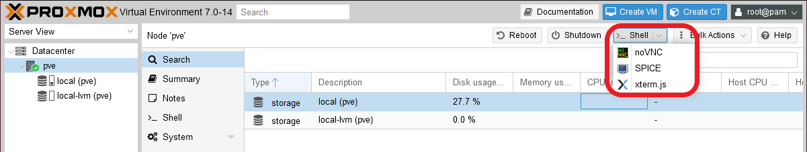

I recommend the `xterm.js` option, since that shell allows you to copy and paste, unlike the **noVCN** one. `SPICE` doesn't open you a shell, it gives you a file that you have to use in a special client prepared to use the SPICE protocol.

## Installing useful extra tools

Now that you can use the `apt` command properly, it's time to install some useful tools for different purposes. Those packages are the following:

- `ethtool` : Tool to query and change settings such as speed, auto-
 negotiation and checksum offload on many network devices, in particular on
 Ethernet devices.

- `htop`: Interactive text-based process viewer, similar to `top` but much more user friendly and colorful (on terminals that support color).

- `net-tools`: Package that includes several useful commands for network management.

- `sudo`: A command that allows a sysadmin to give limited `root`
 privileges to users and log root activity.

- `tree`: Is a recursive directory listing command that produces a depth indented listing of files.

- `vim`: A more complete version of the `vi` editor, which includes fancy things like syntax coloring.

To install all of the above at once, open a shell terminal as `root` and use the following command:

~~~bash
$ apt install -y ethtool htop net-tools sudo tree vim
~~~

### _Utilities for visualizing sensor information_

Any modern computer comes with a bunch of integrated sensors, usually ones that return CPU's cores temperatures, fan speeds and voltages. Sure you'd like to see those values through the shell easily, right? There are a bunch of tools which do that, but here I'll show you the two that I found more interesting.

#### **The lm_sensors package**

The lm_sensors package provides a `sensors` command that allows you to see the values returned by the sensors integrated in a Linux host like yours. To be able to use that command, you'll need to install and configure the `lm_sensors` package as follows.

1. Open a shell in your main `pve` node as `root` (or as a `sudo`-able user if you already got one), then execute the next `apt` command.

    ~~~bash
    $ apt install -y lm-sensors
    ~~~

2. Execute `sensors-detect`. This will launch a scan on your system looking for all the sensors available in it, so it can determine which kernel modules `lm_sensors` has to use. This scan is automatic, but the command will ask you on every step of the procedure.

    > **BEWARE!**  
    > It might be possible that a step could give some trouble if executed in your system, so read the question asked on each step and, in case of doubt, answer `no` to the step you feel unsure of.

    ~~~bash
    $ sensors-detect
    # sensors-detect revision $Revision$
    # System: LENOVO 90C2001USP [Lenovo H30-00]
    # Board: LENOVO Aptio CRB
    # Kernel: 5.4.124-1-pve x86_64
    # Processor: Intel(R) Pentium(R) CPU J2900 @ 2.41GHz (6/55/8)

    This program will help you determine which kernel modules you need
    to load to use lm_sensors most effectively. It is generally safe
    and recommended to accept the default answers to all questions,
    unless you know what you're doing.

    Some south bridges, CPUs or memory controllers contain embedded sensors.
    Do you want to scan for them? This is totally safe. (YES/no):
    Module cpuid loaded successfully.
    Silicon Integrated Systems SIS5595...                       No
    VIA VT82C686 Integrated Sensors...                          No
    VIA VT8231 Integrated Sensors...                            No
    AMD K8 thermal sensors...                                   No
    AMD Family 10h thermal sensors...                           No
    AMD Family 11h thermal sensors...                           No
    AMD Family 12h and 14h thermal sensors...                   No
    AMD Family 15h thermal sensors...                           No
    AMD Family 16h thermal sensors...                           No
    AMD Family 17h thermal sensors...                           No
    AMD Family 15h power sensors...                             No
    AMD Family 16h power sensors...                             No
    Intel digital thermal sensor...                             Success!
        (driver `coretemp')
    Intel AMB FB-DIMM thermal sensor...                         No
    Intel 5500/5520/X58 thermal sensor...                       No
    VIA C7 thermal sensor...                                    No
    VIA Nano thermal sensor...                                  No

    Some Super I/O chips contain embedded sensors. We have to write to
    standard I/O ports to probe them. This is usually safe.
    Do you want to scan for Super I/O sensors? (YES/no):
    Probing for Super-I/O at 0x2e/0x2f
    Trying family `National Semiconductor/ITE'...               No
    Trying family `SMSC'...                                     No
    Trying family `VIA/Winbond/Nuvoton/Fintek'...               No
    Trying family `ITE'...                                      Yes
    Found `ITE IT8728F Super IO Sensors'                        Success!
        (address 0xa30, driver `it87')
    Probing for Super-I/O at 0x4e/0x4f
    Trying family `National Semiconductor/ITE'...               No
    Trying family `SMSC'...                                     No
    Trying family `VIA/Winbond/Nuvoton/Fintek'...               No
    Trying family `ITE'...                                      No

    Some systems (mainly servers) implement IPMI, a set of common interfaces
    through which system health data may be retrieved, amongst other things.
    We first try to get the information from SMBIOS. If we don't find it
    there, we have to read from arbitrary I/O ports to probe for such
    interfaces. This is normally safe. Do you want to scan for IPMI
    interfaces? (YES/no):
    Probing for `IPMI BMC KCS' at 0xca0...                      No
    Probing for `IPMI BMC SMIC' at 0xca8...                     No

    Some hardware monitoring chips are accessible through the ISA I/O ports.
    We have to write to arbitrary I/O ports to probe them. This is usually
    safe though. Yes, you do have ISA I/O ports even if you do not have any
    ISA slots! Do you want to scan the ISA I/O ports? (yes/NO): yes
    Probing for `National Semiconductor LM78' at 0x290...       No
    Probing for `National Semiconductor LM79' at 0x290...       No
    Probing for `Winbond W83781D' at 0x290...                   No
    Probing for `Winbond W83782D' at 0x290...                   No

    Lastly, we can probe the I2C/SMBus adapters for connected hardware
    monitoring devices. This is the most risky part, and while it works
    reasonably well on most systems, it has been reported to cause trouble
    on some systems.
    Do you want to probe the I2C/SMBus adapters now? (YES/no):
    Using driver `i2c-i801' for device 0000:00:1f.3: BayTrail (SOC)

    Next adapter: SMBus I801 adapter at f000 (i2c-0)
    Do you want to scan it? (yes/NO/selectively): yes
    Client found at address 0x50
    Probing for `Analog Devices ADM1033'...                     No
    Probing for `Analog Devices ADM1034'...                     No
    Probing for `SPD EEPROM'...                                 Yes
        (confidence 8, not a hardware monitoring chip)
    Probing for `EDID EEPROM'...                                No

    Next adapter: i915 gmbus ssc (i2c-1)
    Do you want to scan it? (yes/NO/selectively): yes

    Next adapter: i915 gmbus vga (i2c-2)
    Do you want to scan it? (yes/NO/selectively): yes

    Next adapter: i915 gmbus panel (i2c-3)
    Do you want to scan it? (yes/NO/selectively): yes

    Next adapter: i915 gmbus dpc (i2c-4)
    Do you want to scan it? (yes/NO/selectively): yes

    Next adapter: i915 gmbus dpb (i2c-5)
    Do you want to scan it? (yes/NO/selectively): yes

    Next adapter: i915 gmbus dpd (i2c-6)
    Do you want to scan it? (yes/NO/selectively): yes

    Now follows a summary of the probes I have just done.
    Just press ENTER to continue:

    Driver `coretemp':
      * Chip `Intel digital thermal sensor' (confidence: 9)

    Driver `it87':
      * ISA bus, address 0xa30
        Chip `ITE IT8728F Super IO Sensors' (confidence: 9)

    To load everything that is needed, add this to /etc/modules:
    #----cut here----
    # Chip drivers
    coretemp
    it87
    #----cut here----
    If you have some drivers built into your kernel, the list above will
    contain too many modules. Skip the appropriate ones!

    Do you want to add these lines automatically to /etc/modules? (yes/NO))yes
    Successful!

    Monitoring programs won't work until the needed modules are
    loaded. You may want to run '/etc/init.d/kmod start'
    to load them.

    Unloading cpuid... OK
    ~~~

    You can see, in the output above, that I've allowed the `sensors-detect` command to execute all of its steps on my system, and that there were no issues. See how the final question asks for your permission to write some lines in the `/etc/modules` file. Say `yes` to it, but bear in mind that, if you uninstall the `lm_sensors` package later, those lines will remain in `/etc/modules`.

    Below you can see the lines sensors-detect wrote, in my PVE host, in the `/etc/modules` file. Bear in mind that this lines may be different in your system.

    ~~~bash
    # Generated by sensors-detect on Tue Nov  9 17:45:42 2021
    # Chip drivers
    coretemp
    it87
    ~~~

3. To ensure that all the modules configured by `sensors-detect` are loaded, reboot your system.

    ~~~bash
    $ reboot
    ~~~

4. After the reboot, open a new shell and try the `sensors` command.

    ~~~bash
    $ sensors
    soc_dts1-virtual-0
    Adapter: Virtual device
    temp1:        +37.0°C

    it8728-isa-0a30
    Adapter: ISA adapter
    in0:         684.00 mV (min =  +1.58 V, max =  +0.35 V)  ALARM
    in1:           1.37 V  (min =  +1.98 V, max =  +3.02 V)  ALARM
    in2:           2.84 V  (min =  +0.02 V, max =  +1.78 V)  ALARM
    +3.3V:         3.29 V  (min =  +5.88 V, max =  +0.65 V)  ALARM
    in4:           1.99 V  (min =  +2.40 V, max =  +2.40 V)  ALARM
    in5:         768.00 mV (min =  +2.56 V, max =  +1.38 V)  ALARM
    in6:         312.00 mV (min =  +0.16 V, max =  +2.45 V)
    3VSB:          3.26 V  (min =  +0.94 V, max =  +0.65 V)  ALARM
    Vbat:          3.19 V
    fan1:        1834 RPM  (min =   10 RPM)
    fan2:        3835 RPM  (min =   64 RPM)
    fan3:           0 RPM  (min =   19 RPM)  ALARM
    temp1:        +30.0°C  (low  = -107.0°C, high = +58.0°C)  sensor = thermal diode
    temp2:        +32.0°C  (low  = +48.0°C, high = -80.0°C)  ALARM  sensor = thermal diode
    temp3:       -128.0°C  (low  = -82.0°C, high =  +1.0°C)  ALARM  sensor = disabled
    intrusion0:  ALARM

    acpitz-acpi-0
    Adapter: ACPI interface
    temp1:        +26.8°C  (crit = +90.0°C)

    soc_dts0-virtual-0
    Adapter: Virtual device
    temp1:        +36.0°C

    coretemp-isa-0000
    Adapter: ISA adapter
    Core 0:       +35.0°C  (high = +105.0°C, crit = +105.0°C)
    Core 1:       +35.0°C  (high = +105.0°C, crit = +105.0°C)
    Core 2:       +35.0°C  (high = +105.0°C, crit = +105.0°C)
    Core 3:       +35.0°C  (high = +105.0°C, crit = +105.0°C)
    ~~~

    Notice how the command outputs all sorts of information from the system: different temperature measurements from different adapters and interfaces, the speed of the fans present in my host and also some voltage information. Also see how the command has printed `ALARM` on several lines, which are warnings of things the command is finding odd. Since my computer is working fine, this is more probably a question of configuring the command so it evaluates the values properly. Also, as you may imagine, the output of this command will be quite different in your machine.

#### **The Stress Terminal UI: s-tui**

The Stress Terminal UI, or just `s-tui`, is a command that gives you a much more graphical vision of the current performance of your hardware. To get it, just install its package with `apt`.

~~~bash
$ apt install -y s-tui
~~~

With the package installed, just execute the `s-tui` command.

> **BEWARE!**  
> When using a **non-root** user, execute this command with `sudo` so it can access all the system sensors.

~~~bash
$ s-tui
~~~

You should see the main screen of `s-tui` immediately.

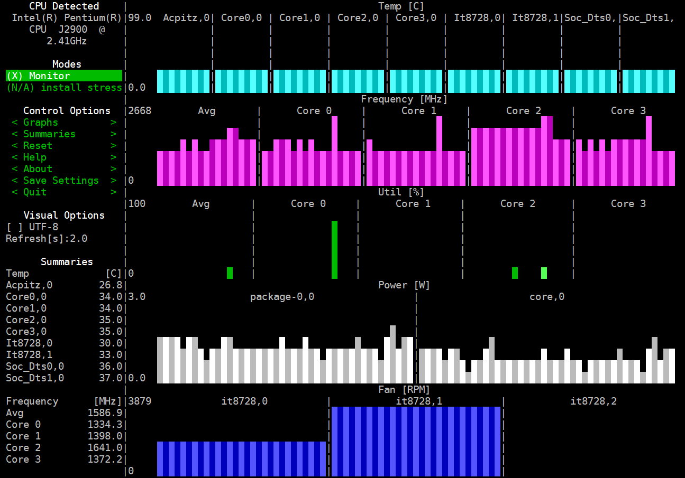

You can use the arrows or the Page Up/Down keys to browse in the left-side menu and even change some options. Going down in the menu, you'll see all the sensors this command is able to read. The settings of `s-tui` are kept in the user's `.config/s-tui` folder.

## Relevant system paths

### _Directories_

- `$HOME/.config/s-tui`

## References

### _Proxmox VE_

- [Proxmox VE 7.0 Datasheet](https://www.proxmox.com/en/downloads/item/proxmox-ve-datasheet)
- [Proxmox Package Repositories](https://pve.proxmox.com/wiki/Package_Repositories)
- [Proxmox VE No-Subscription Repository](https://pve.proxmox.com/wiki/Package_Repositories#sysadmin_no_subscription_repo)
- [How to: Fix Proxmox/PVE update failed(Failed to fetch 401 Unauthorized) (TASK ERROR: command ‘apt-get update’ failed: exit code 100)](https://dannyda.com/2020/06/19/how-to-fix-proxmox-pve6-1-26-1-7-update-failedfailed-to-fetch-401-unauthorized-task-error-command-apt-get-update-failed-exit-code-100/)
- [Proxmox roadmap](https://pve.proxmox.com/wiki/Roadmap)

### _Tools_

- [Clonezilla](https://clonezilla.org/)
- [Find fan speed and cpu temp in Linux](https://unix.stackexchange.com/questions/328906/find-fan-speed-and-cpu-temp-in-linux)
- [Lm-sensors: Monitoring CPU And System Hardware Temperature](https://www.unixmen.com/lm-sensors-monitoring-cpu-system-hardware-temperature/)
- [Lm_sensors - Linux hardware monitoring](https://hwmon.wiki.kernel.org/lm_sensors)
- [The lm-sensors package on GitHub](https://github.com/lm-sensors/lm-sensors)
- [The Stress Terminal UI: s-tui on GitHub](https://github.com/amanusk/s-tui)
