# G003 - Host configuration 01 ~ Apt sources, updates and extra tools

- [Proxmox VE 9.0 runs on Debian 13 "trixie"](#proxmox-ve-90-runs-on-debian-13-trixie)
- [Editing the apt repository sources](#editing-the-apt-repository-sources)
  - [Changing the apt repositories](#changing-the-apt-repositories)
- [Update your system](#update-your-system)
  - [Consideration about upgrades](#consideration-about-upgrades)
  - [You can use `apt` directly](#you-can-use-apt-directly)
- [Installing useful extra tools](#installing-useful-extra-tools)
  - [Utilities for visualizing sensor information](#utilities-for-visualizing-sensor-information)
    - [The `lm_sensors` package](#the-lm_sensors-package)
    - [The Stress Terminal UI: s-tui](#the-stress-terminal-ui-s-tui)
- [Relevant system paths](#relevant-system-paths)
  - [Directories](#directories)
  - [Files](#files)
- [References](#references)
  - [Proxmox](#proxmox)
  - [Proxmox VE related contents](#proxmox-ve-related-contents)
  - [System tools](#system-tools)
- [Navigation](#navigation)

## Proxmox VE 9.0 runs on Debian 13 "trixie"

Remember that your Proxmox VE 9.0 runs on a **Debian** _GNU Linux version 13_ (_trixie_). You can check the Debian version in the `/etc/os-release` file found in the system.

## Editing the apt repository sources

Proxmox VE comes with its `apt` system configured to point at two repositories for **enterprise subscriptions**, one for Proxmox VE itself while the other is for the Proxmox version of the Ceph distributed storage system. This is a problem because, unless you already have such subscription, you will not be able to perform system updates at all. Look what happens if, in a `root` shell, you try to execute `apt update` with the default setup:

~~~sh
$ apt update
Get:1 http://security.debian.org/debian-security trixie-security InRelease [43.4 kB]
Hit:2 http://deb.debian.org/debian trixie InRelease       
Get:3 http://deb.debian.org/debian trixie-updates InRelease [47.1 kB]
Get:4 http://security.debian.org/debian-security trixie-security/main amd64 Packages [11.6 kB]
Get:5 http://security.debian.org/debian-security trixie-security/main Translation-en [10.6 kB]
Err:6 https://enterprise.proxmox.com/debian/ceph-squid trixie InRelease          
  401  Unauthorized [IP: 51.91.38.34 443]
Err:7 https://enterprise.proxmox.com/debian/pve trixie InRelease
  401  Unauthorized [IP: 51.91.38.34 443]
Error: Failed to fetch https://enterprise.proxmox.com/debian/ceph-squid/dists/trixie/InRelease  401  Unauthorized [IP: 51.91.38.34 443]
Error: The repository 'https://enterprise.proxmox.com/debian/ceph-squid trixie InRelease' is not signed.
Notice: Updating from such a repository can't be done securely, and is therefore disabled by default.
Notice: See apt-secure(8) manpage for repository creation and user configuration details.
Error: Failed to fetch https://enterprise.proxmox.com/debian/pve/dists/trixie/InRelease  401  Unauthorized [IP: 51.91.38.34 443]
Error: The repository 'https://enterprise.proxmox.com/debian/pve trixie InRelease' is not signed.
Notice: Updating from such a repository can't be done securely, and is therefore disabled by default.
Notice: See apt-secure(8) manpage for repository creation and user configuration details.
~~~

See the lines like the `Err:6` one indicating an error in the process. Without a valid enterprise subscription, your system is `Unauthorized` to get updates from Proxmox's enterprise repository.

### Changing the apt repositories

You need to disable the enterprise repositories and enable the repository for non-subscribers:

1. Access your Proxmox VE web console as `root`, and browse to your `pve` node's `Updates > Repositories` section:

    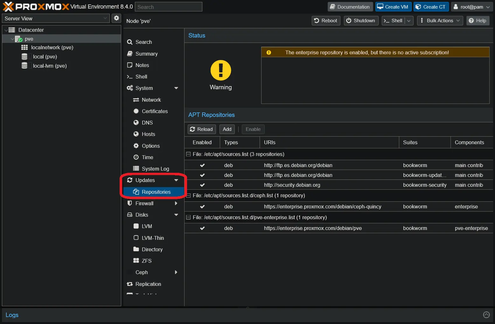

    Notice the yellow warnings about having the enterprise repositories enabled with no active subscription. This is related to the warning you saw when you logged in the web console.

2. Notice that there are two enterprise repositories, one for the [Ceph distributed storage technology](https://ceph.io/en/) embedded in Proxmox while the other is for Proxmox VE itself. **You have to disable both**:

    Begin with the Ceph enterprise repository, the one with the URI `https://enterprise.proxmox.com/debian/ceph-squid`:

    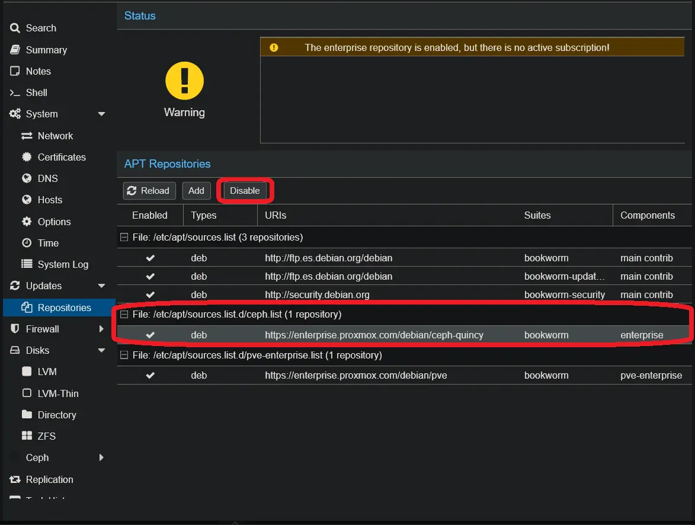

    See that the `Disable` button is now active, so press it to disable the enterprise repository. Then, do the same with the other enterprise repository, the one for Proxmox VE with the URI `https://enterprise.proxmox.com/debian/pve`:

    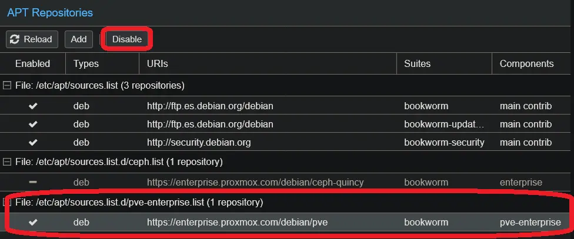

3. With both Proxmox enterprise repositories disabled, the web console warns you that you will not get any updates for your Proxmox VE platform:

    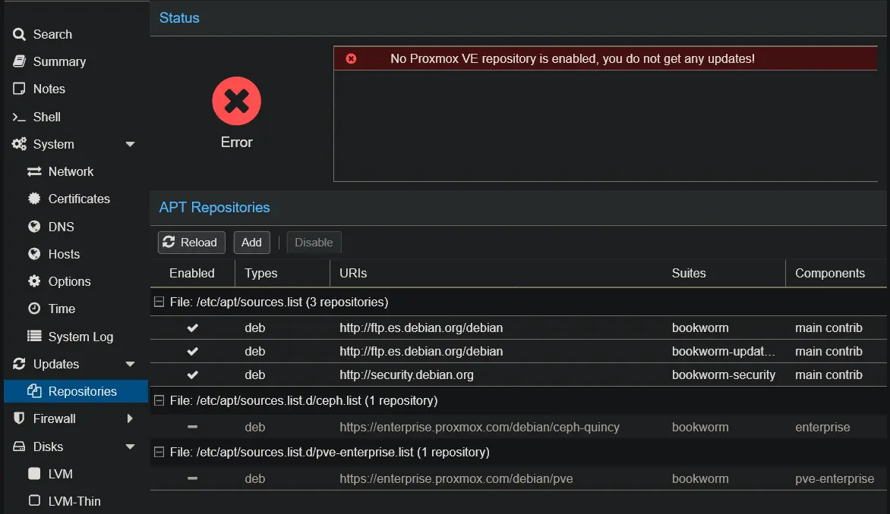

4. Click on the `Add` button now. The web console prompts the same warning you saw when you logged in:

    

    Click on `OK` to open the window where you can add apt repositories:

    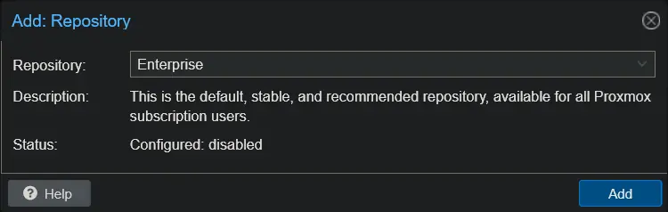

5. On that window, choose the `No-Subscription` option from the `Repository` list and then press on `Add`:

    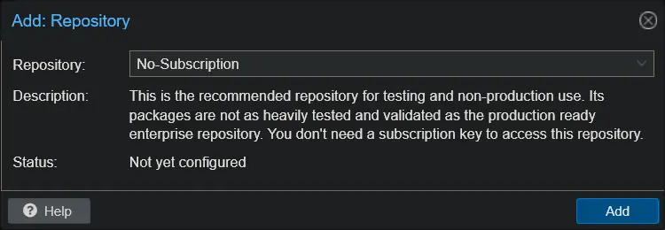

6. With the `No-Subscription` repository added, you see a different status in the `Repositories` screen:

    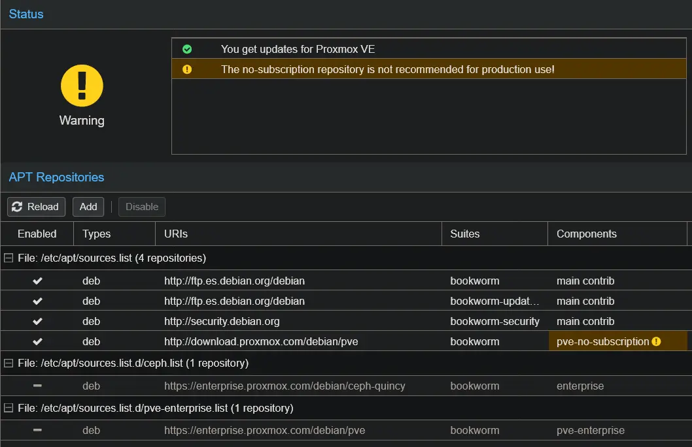

    What the new warning means is that the no-subscription repository is not the safest one to use for real production use. Regardless, it should be good enough for your personal homelab needs.

## Update your system

Now you can browse to the `Updates` screen and see what is pending:

1. Browse to the `Updates` tab, and click on the `Refresh` button to be sure that you are getting the most recent list of updates:

    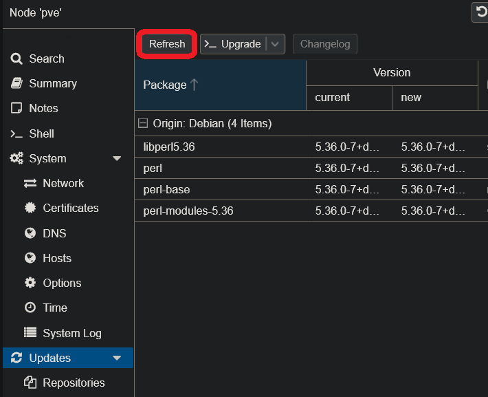

    Pressing the refresh button will launch again the warning window about not having a valid subscription:

    

    Close that window and meet a new one in which you can see the `apt update` task's progress:

    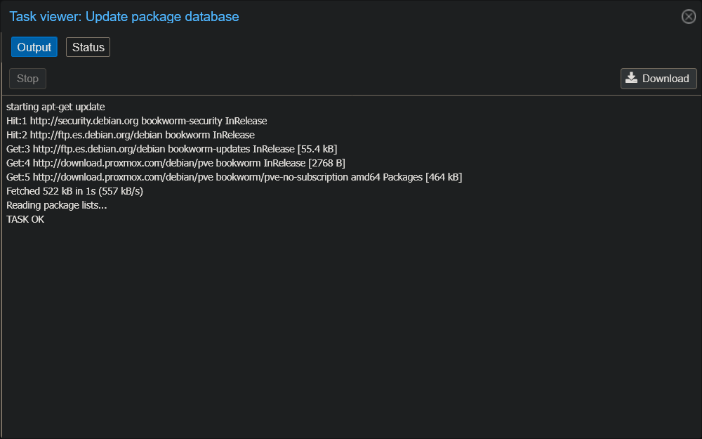

    When you see the line `TASK OK`, close the window to go back to the updates list:

    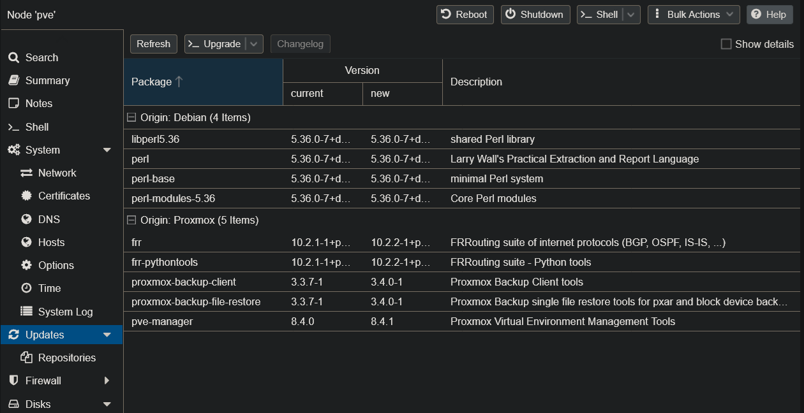

    See above that there are a number of updates, from different origins, to be applied. In future attempts, this page will show a different selection of pending packages or none at all.

2. To apply all the updates, click on the `Upgrade` button:

    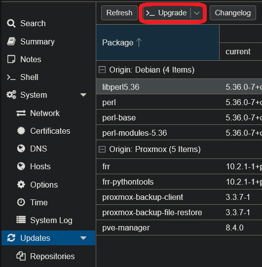

3. By default, the web console opens a noVNC shell console, using your `root` user, in which it launches the `apt dist-upgrade` command:

    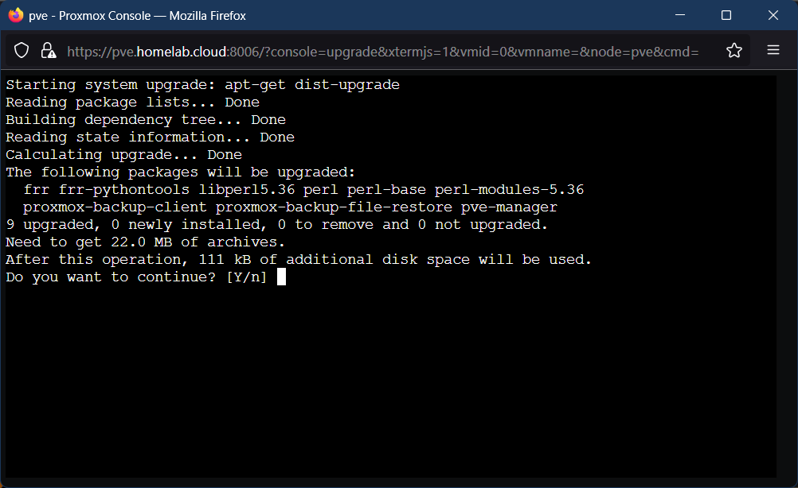

    > [!IMPORTANT]
    > **Pay attention to when the `apt` command requests your confirmation to proceed!**\
    > Also, be aware that some packages may require your input for some reason or other.

4. When the `apt` command finishes, it returns the control to the prompt within the shell console:

    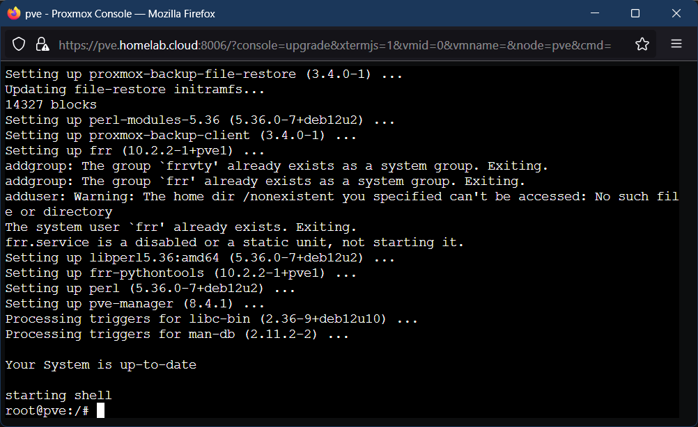

    Type `exit` to logout from the shell console and close its window, or just close the window directly:

    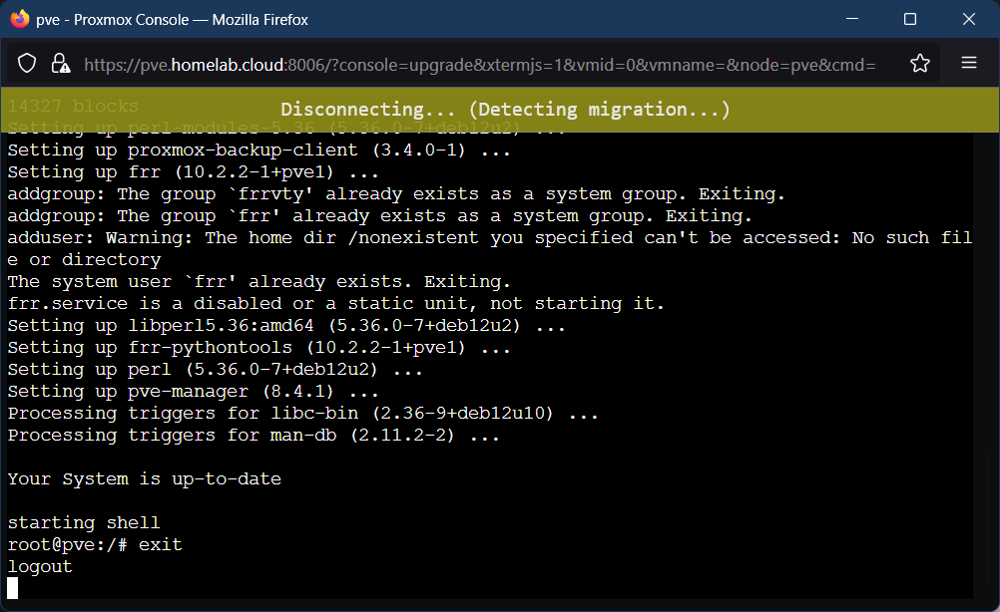

5. Back in the `Updates` view of your `pve` node, see that the updates list has not been refreshed. Press again on the `Refresh` button to update the list:

    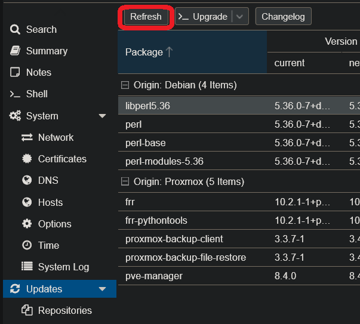

6. The `Updates` view may or may not show more updates to apply after refreshing. Keep on applying the upgrades until none appears listed in this page:

    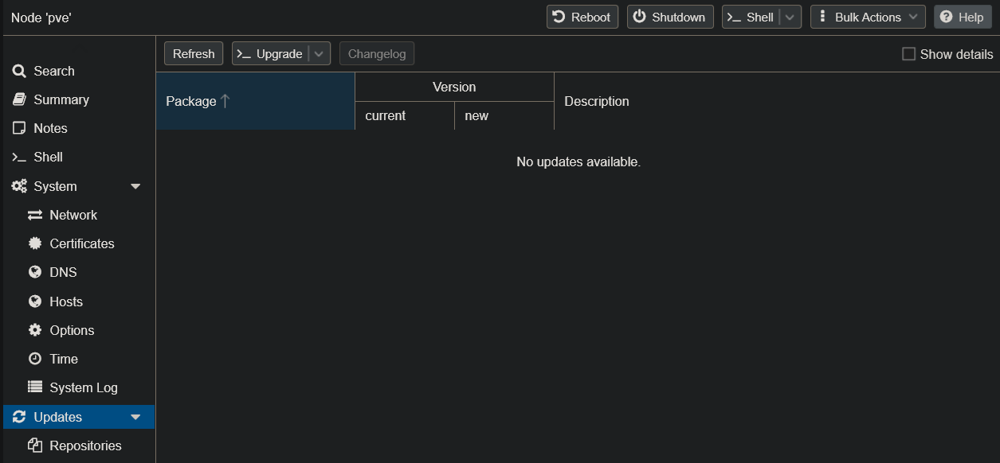

7. If you have applied many updates, or if some of them were kernel-related, it is better if you reboot the system. Just press on the `Reboot` button while having your `pve` node selected:

    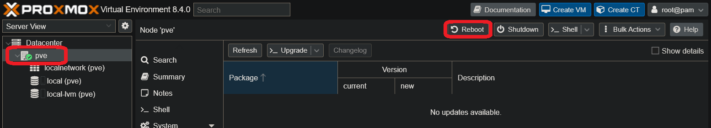

    The Proxmox VE web console asks your confirmation. Click on `Yes` to proceed:

    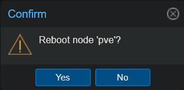

8. After the reboot, just log back in the web console as `root` and check that Proxmox VE still runs fine.

### Consideration about upgrades

As you have seen before, you can end having to apply several updates at once in your system. In theory, a good administrator has to be diligent and verify that each update is safe to apply. In reality, trying to do that is not possible. Still, you should at least be aware of the updates that directly affect the Proxmox VE platform, the ones that can update to a more recent minor or major version. Those are the ones that could break things in your setup, specially the major ones (for instance, when going from a version 8.y.z to a 9.y.z one).

Since you only have one standalone node, before you apply such updates, you should make a clone of your only node's Proxmox VE root filesystem (or the entire drive) with a tool like [Clonezilla](https://clonezilla.org/). This way, if something goes south in the upgrade, you can always go back to the previous stable state.

### You can use `apt` directly

Instead of using the `Updates` screen in the web console, you can use the `apt` command directly through an SSH shell or by opening a shell directly from the web console.

> [!NOTE]
> **Check the appendix G901 about connecting with the PuTTY client**\
> If you want to connect through a SSH client to your servers, you can do it with a client like PuTTY as it is explained by the [appendix chapter **G901**](G901%20-%20Appendix%2001%20~%20Connecting%20through%20SSH%20with%20PuTTY.md).

If you prefer to open the shell from the Proxmox VE web console, know that it offers three different options:

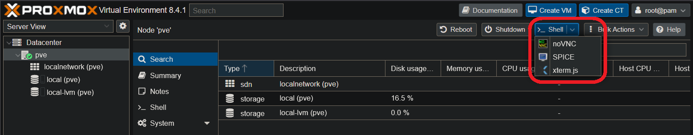

The best option is the `xterm.js` shell, since it allows you to copy and paste, unlike the `noVCN` one. `SPICE` does not open you a shell, it gives you a file that you have to use in a special client prepared to use the SPICE protocol.

## Installing useful extra tools

Now that you can use the `apt` command properly, it is time to install some useful tools for different purposes:

- `htop`\
  Interactive text-based process viewer, similar to `top` but much more user friendly and colorful (on terminals that support color).

- `net-tools`\
  Package that includes several useful commands for network management.

- `sudo`\
  A command that allows a system administrator to give limited `root` privileges to users and log root activity.

- `tree`\
  Is a recursive directory listing command that produces a depth indented listing of files.

- `vim`\
  A more complete version of the `vi` editor, which includes fancy features like syntax coloring.

To install all of the above at once, open a shell terminal as `root` and use the following command:

~~~sh
$ apt install -y htop net-tools sudo tree vim
~~~

### Utilities for visualizing sensor information

Any modern computer comes with a bunch of integrated sensors, usually ones that return CPU's cores temperatures, fan speeds and voltages. Sure you would like to see those values through the shell easily, right? There is a bunch of tools that give such information, but this guide proposes you two quite interesting ones.

#### The `lm_sensors` package

The `lm_sensors` package provides a `sensors` command that allows you to see the values returned by the sensors integrated in a Linux host like your PVE server.

> [!NOTE]
> **The `lm_sensors` package is no longer updated**\
> It still works, in particular with old hardware like the one used in this guide, but do not be surprised if it stops working in the future.

To be able to use the `sensors` command, you need to install and configure the `lm_sensors` package as follows:

1. Open a shell in your main `pve` node as `root` (or as a `sudo`-able user if you already got one), then execute the next `apt` command:

    ~~~sh
    $ apt install -y lm-sensors
    ~~~

2. Execute `sensors-detect`. This launches a scan on your system looking for all the sensors available in it, so it can determine which kernel modules `lm_sensors` has to use. This scan is automatic, but the command asks you on every step of the procedure:

    > [!WARNING]
    > **Some steps might give trouble if executed in your system!**\
    > Read the question asked on each step and, in case of doubt, answer `no` to the step you feel unsure of.

    ~~~sh
    # sensors-detect version 3.6.2
    # System: Packard Bell iMedia S2883
    # Kernel: 6.14.8-2-pve x86_64
    # Processor: Intel(R) Celeron(R) CPU J1900 @ 1.99GHz (6/55/8)

    This program will help you determine which kernel modules you need
    to load to use lm_sensors most effectively. It is generally safe
    and recommended to accept the default answers to all questions,
    unless you know what you're doing.

    Some south bridges, CPUs or memory controllers contain embedded sensors.
    Do you want to scan for them? This is totally safe. (YES/no): 
    Module cpuid loaded successfully.
    Silicon Integrated Systems SIS5595...                       No
    VIA VT82C686 Integrated Sensors...                          No
    VIA VT8231 Integrated Sensors...                            No
    AMD K8 thermal sensors...                                   No
    AMD Family 10h thermal sensors...                           No
    AMD Family 11h thermal sensors...                           No
    AMD Family 12h and 14h thermal sensors...                   No
    AMD Family 15h thermal sensors...                           No
    AMD Family 16h thermal sensors...                           No
    AMD Family 17h thermal sensors...                           No
    AMD Family 15h power sensors...                             No
    AMD Family 16h power sensors...                             No
    Hygon Family 18h thermal sensors...                         No
    AMD Family 19h thermal sensors...                           No
    Intel digital thermal sensor...                             Success!
        (driver `coretemp')
    Intel AMB FB-DIMM thermal sensor...                         No
    Intel 5500/5520/X58 thermal sensor...                       No
    VIA C7 thermal sensor...                                    No
    VIA Nano thermal sensor...                                  No

    Some Super I/O chips contain embedded sensors. We have to write to
    standard I/O ports to probe them. This is usually safe.
    Do you want to scan for Super I/O sensors? (YES/no): 
    Probing for Super-I/O at 0x2e/0x2f
    Trying family `National Semiconductor/ITE'...               No
    Trying family `SMSC'...                                     No
    Trying family `VIA/Winbond/Nuvoton/Fintek'...               No
    Trying family `ITE'...                                      Yes
    Found `ITE IT8772E Super IO Sensors'                        Success!
        (address 0xa30, driver `it87')
    Probing for Super-I/O at 0x4e/0x4f
    Trying family `National Semiconductor/ITE'...               No
    Trying family `SMSC'...                                     No
    Trying family `VIA/Winbond/Nuvoton/Fintek'...               No
    Trying family `ITE'...                                      No

    [...]

    Next adapter: i915 gmbus dpb (i2c-5)
    Do you want to scan it? (yes/NO/selectively): yes

    Next adapter: i915 gmbus dpd (i2c-6)
    Do you want to scan it? (yes/NO/selectively): yes

    Next adapter: AUX B/DP B (i2c-7)
    Do you want to scan it? (yes/NO/selectively): yes

    Now follows a summary of the probes I have just done.
    Just press ENTER to continue: 

    Driver `it87':
    * ISA bus, address 0xa30
        Chip `ITE IT8772E Super IO Sensors' (confidence: 9)

    Driver `coretemp':
    * Chip `Intel digital thermal sensor' (confidence: 9)

    To load everything that is needed, add this to /etc/modules:
    #----cut here----
    # Chip drivers
    coretemp
    it87
    #----cut here----
    If you have some drivers built into your kernel, the list above will
    contain too many modules. Skip the appropriate ones!

    Do you want to add these lines automatically to /etc/modules? (yes/NO)yes
    Successful!

    Monitoring programs won't work until the needed modules are
    loaded. You may want to run '/etc/init.d/kmod start'
    to load them.

    Unloading cpuid... OK
    ~~~

    A big chunk of the `sensors-detect` command's output has been omitted since it resulted to be very long in this guide's reference hardware. Still, know that all but one of the steps were executed without issues. See how the final question asks for your permission to write some lines in the `/etc/modules` file. Say `yes` to it, but bear in mind that, if you uninstall the `lm_sensors` package later, those lines will remain written in `/etc/modules`.

    Below you can see the lines `sensors-detect` wrote in the `/etc/modules` file of this guide's PVE host. Bear in mind that these lines may be different in your system:

    ~~~sh
    # /etc/modules is obsolete and has been replaced by /etc/modules-load.d/.
    # Please see modules-load.d(5) and modprobe.d(5) for details.
    #
    # Updating this file still works, but it is undocumented and unsupported.

    # Generated by sensors-detect on Wed Aug 20 10:57:42 2025
    # Chip drivers
    coretemp
    it87
    ~~~

    > [!NOTE]
    > **The `/etc/modules` file has been replaced by the `/etc/modules-load.d/` directory**\
    > Notice the related warning about this change at the beginning of the `/etc/modules` file. If you check inside the `/etc/modules-load.d/` directory, you will find a `modules.conf` symlink file pointing to the `/etc/modules` file ensuring backwards compatibility with packages that still have not adapted to this change like `lm_sensors`.

3. To ensure that all the modules configured by `sensors-detect` are loaded, reboot your system:

    ~~~sh
    $ reboot
    ~~~

4. After the reboot, open a new shell and try the `sensors` command:

    ~~~sh
    $ sensors
    soc_dts1-virtual-0
    Adapter: Virtual device
    temp1:        +36.0°C  

    it8772-isa-0a30
    Adapter: ISA adapter
    in0:         708.00 mV (min =  +2.56 V, max =  +1.22 V)  ALARM
    in1:           1.37 V  (min =  +1.50 V, max =  +0.84 V)  ALARM
    in2:           2.06 V  (min =  +1.69 V, max =  +2.46 V)
    in3:           2.00 V  (min =  +2.05 V, max =  +2.63 V)  ALARM
    in4:           2.03 V  (min =  +2.27 V, max =  +2.18 V)  ALARM
    in5:           2.03 V  (min =  +1.24 V, max =  +0.76 V)  ALARM
    in6:           2.98 V  (min =  +1.78 V, max =  +1.32 V)  ALARM
    3VSB:          3.36 V  (min =  +4.66 V, max =  +2.90 V)  ALARM
    Vbat:          3.26 V  
    fan2:           0 RPM  (min =   32 RPM)  ALARM
    fan3:        1555 RPM  (min =   14 RPM)
    temp1:        +31.0°C  (low  = +61.0°C, high = -11.0°C)  ALARM  sensor = thermistor
    temp2:        +34.0°C  (low  = -17.0°C, high = -93.0°C)  sensor = thermistor
    temp3:        -70.0°C  (low  = +127.0°C, high =  -2.0°C)  sensor = Intel PECI
    pwm1:             64%  (freq = 23437 Hz)  MANUAL CONTROL
    pwm2:             64%  (freq = 23437 Hz)
    pwm3:             58%  (freq = 23437 Hz)
    intrusion0:  ALARM

    acpitz-acpi-0
    Adapter: ACPI interface
    temp1:        +37.0°C  

    soc_dts0-virtual-0
    Adapter: Virtual device
    temp1:        +35.0°C  

    coretemp-isa-0000
    Adapter: ISA adapter
    Core 0:       +34.0°C  (high = +105.0°C, crit = +105.0°C)
    Core 1:       +34.0°C  (high = +105.0°C, crit = +105.0°C)
    Core 2:       +35.0°C  (high = +105.0°C, crit = +105.0°C)
    Core 3:       +35.0°C  (high = +105.0°C, crit = +105.0°C)
    ~~~

    Notice how the command outputs all sorts of information from the system: different temperature measurements from different adapters and interfaces, the speed of the fans present in the host and also some voltage information. Also see how the command has printed `ALARM` on several lines, which are warnings of things the command is finding odd. Since this guide's host is working fine, this is more probably a question of configuring the command so it evaluates the values properly. As you may imagine, the output of this command will be quite different in your machine.

#### The Stress Terminal UI: s-tui

The _Stress Terminal UI_, or just `s-tui`, is a command that gives you a much more graphical vision of the current performance of your hardware. To get it, just install its package with `apt`:

~~~sh
$ apt install -y s-tui
~~~

With the package installed, just execute the `s-tui` command:

> [!IMPORTANT]
> **Execute s-tui with `sudo` when using a regular user**\
> When using a **non-root** user, execute this command with `sudo` so it can access all the system sensors.

~~~sh
$ s-tui
~~~

You should see the main screen of `s-tui` immediately:

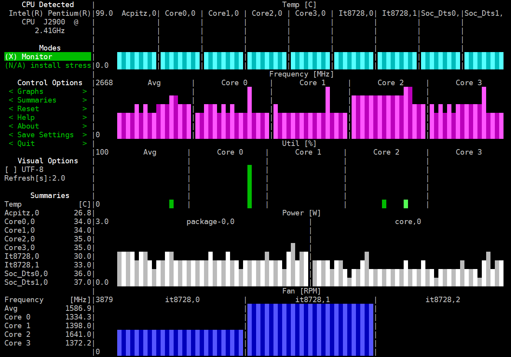

You can use the arrows or the `Page Up/Down keys` to browse in the left-side menu and even change some options. Going down in the menu, you can see all the sensors this command is able to read. The settings of `s-tui` are kept in the user's `.config/s-tui` folder.

## Relevant system paths

### Directories

- `$HOME/.config/s-tui`
- `/etc/`
- `/etc/modules-load.d/`

### Files

- `/etc/modules`
- `/etc/modules-load.d/modules.conf`

## References

### [Proxmox](https://www.proxmox.com/en/)

- [Proxmox VE Wiki](https://pve.proxmox.com/wiki/Main_Page)
  - [Proxmox Package Repositories](https://pve.proxmox.com/wiki/Package_Repositories)
  - [Proxmox VE No-Subscription Repository](https://pve.proxmox.com/wiki/Package_Repositories#sysadmin_no_subscription_repo)
  - [Roadmap](https://pve.proxmox.com/wiki/Roadmap)

### Proxmox VE related contents

- [Blog-D without Nonsense. How to: Fix Proxmox/PVE update failed(Failed to fetch 401 Unauthorized) (TASK ERROR: command ‘apt-get update’ failed: exit code 100)](https://dannyda.com/2020/06/19/how-to-fix-proxmox-pve6-1-26-1-7-update-failedfailed-to-fetch-401-unauthorized-task-error-command-apt-get-update-failed-exit-code-100/)

### System tools

- [Ceph](https://ceph.io/en/)
- [Clonezilla](https://clonezilla.org/)
- [Find fan speed and cpu temp in Linux](https://unix.stackexchange.com/questions/328906/find-fan-speed-and-cpu-temp-in-linux)
- [Lm-sensors: Monitoring CPU And System Hardware Temperature](https://www.unixmen.com/lm-sensors-monitoring-cpu-system-hardware-temperature/)
- [Lm_sensors - Linux hardware monitoring](https://archive.kernel.org/oldwiki/hwmon.wiki.kernel.org/lm_sensors.html)
- [The lm-sensors package on GitHub](https://github.com/lm-sensors/lm-sensors)
- [The Stress Terminal UI: s-tui on GitHub](https://github.com/amanusk/s-tui)

## Navigation

[<< Previous (**G002. Proxmox VE installation**)](G002%20-%20Proxmox%20VE%20installation.md) | [+Table Of Contents+](G000%20-%20Table%20Of%20Contents.md) | [Next (**G004. Host configuration 02**) >>](G004%20-%20Host%20configuration%2002%20~%20UPS%20management%20with%20NUT.md)
