# G005 - Host configuration 03 ~ LVM storage

After installing Proxmox VE with (almost) default settings, the storage is still not ready since it needs some reorganization.

As a reference, I'll use in this guide my own server's storage setup.

- One internal, 1 GiB, SSD drive, linked to a SATA 2 port.
- One internal, 1 GiB, HDD drive, linked to a SATA 2 port .
- One external, 2 GiB, HDD drive, linked to a USB 3 port.

Also, remember that...

- Proxmox VE 7.0 is installed in the SSD drive, but only using 50 GiB of its storage space.
- The filesystem is `ext4`.

## Initial filesystem configuration (**web console**)

Log in the **web console** as `root`. In a recently installed Proxmox VE node, you'll see that, at the `Datacenter` level, the `Storage` already has an initial configuration.

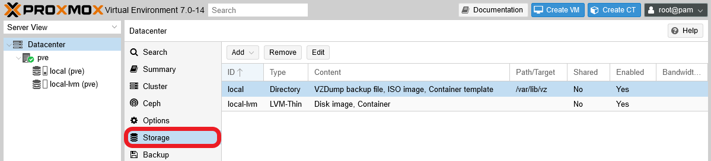

Meanwhile, at the `pve` **node** level you can see which storage drives you have available in your physical system. Remember, **one node represents one physical server**.

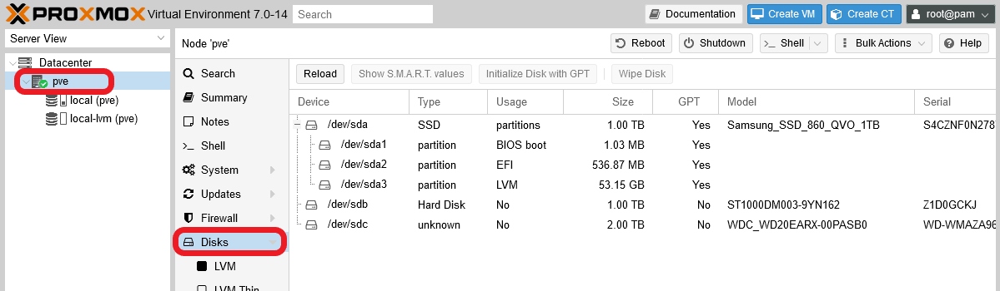

Proxmox shows some technical details from each disk, and also about the partitions present on each of them. At this point, only the `/dev/sda` ssd drive has partitions, the ones corresponding to the Proxmox VE installation. Additionally, notice that Proxmox VE is unable to tell what type of device is the `/dev/sdc` one. This is because that's the one connected through the **USB 3** connection, but this means no trouble at all.

On the other hand, be aware that Proxmox VE has installed itself in a LVM structure, but the web console won't show you much information about it.

Go to the `Disks > LVM` option at your **node** level.

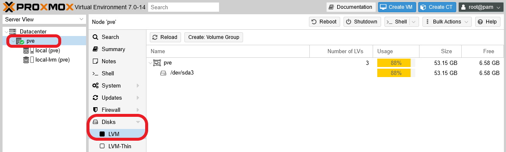

There's a volume group in your `sda` device which fills most of the space in the SSD drive. But this screen **doesn't show you the complete underlying LVM structure**.

In the `Disks > LVM-Thin` screen you can see a bit more information regarding the **LVM-Thin pools** enabled in the system.

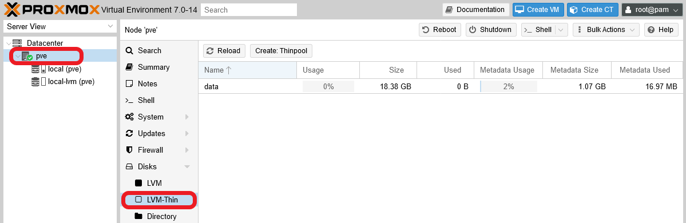

The LVM thinpool created by the Proxmox VE installation it's called `data` and appears unused. In Proxmox VE, a LVM thinpool is were the disk images for the virtual machines and containers can be stored and grow dynamically.

Under the unfolded node in the `Datacenter` tree on the left, you can see two leafs. Those leafs are the storages shown at the `Datacenter` level.

Clicking on the `local` one will show you a screen like the following.

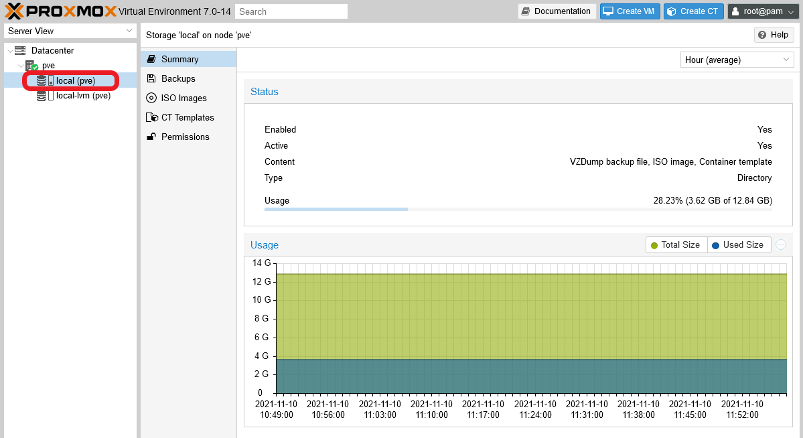

This page offers several tabs like `Summary`, which is the one shown above. The tabs shown will change depending on the type of storage, and they also depend on what Proxmox VE content types have been enabled on the storage. Notice how the `Usage` of `Storage 'local' on node 'pve'` has a capacity of 12.84 GiB. This is the main system partition, but it's just a portion of the `pve` LVM volume group's total capacity.

The rest of the space is assigned to the LVM-Thin pool, which can be seen by browsing into the `local-lvm` leaf.

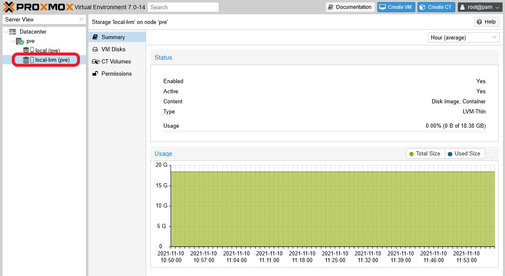

The `Storage 'local-lvm' on node 'pve'` shows in `Usage` that this thinpool has a capacity of 18.38 GiB, which is the rest of storage space available in the `pve` volume group (50 GiB), and is still empty.

Finally, notice that the 12 GiB swap volume, also existing within the LVM structure, is not shown by the web console.

## Initial filesystem configuration (**shell as root**)

To have a more complete idea of how the storage is organized in your recently installed Proxmox VE server, get into the shell as `root` (either remotely through **PuTTY** or by using one of the shells provided by the Proxmox web console).

The first thing to do is check the filesystem structure in your connected storage drives.

~~~bash
$ fdisk -l
Disk /dev/sda: 931.51 GiB, 1000204886016 bytes, 1953525168 sectors
Disk model: Samsung SSD 860
Units: sectors of 1 * 512 = 512 bytes
Sector size (logical/physical): 512 bytes / 512 bytes
I/O size (minimum/optimal): 512 bytes / 512 bytes
Disklabel type: gpt
Disk identifier: BB9279D2-E0C0-4514-BC2D-4E074BE2071A

Device       Start       End   Sectors  Size Type
/dev/sda1       34      2047      2014 1007K BIOS boot
/dev/sda2     2048   1050623   1048576  512M EFI System
/dev/sda3  1050624 104857600 103806977 49.5G Linux LVM

Disk /dev/sdb: 931.51 GiB, 1000204886016 bytes, 1953525168 sectors
Disk model: ST1000DM003-9YN1
Units: sectors of 1 * 512 = 512 bytes
Sector size (logical/physical): 512 bytes / 4096 bytes
I/O size (minimum/optimal): 4096 bytes / 4096 bytes

Disk /dev/mapper/pve-swap: 12 GiB, 12884901888 bytes, 25165824 sectors
Units: sectors of 1 * 512 = 512 bytes
Sector size (logical/physical): 512 bytes / 512 bytes
I/O size (minimum/optimal): 512 bytes / 512 bytes

Disk /dev/mapper/pve-root: 12.25 GiB, 13153337344 bytes, 25690112 sectors
Units: sectors of 1 * 512 = 512 bytes
Sector size (logical/physical): 512 bytes / 512 bytes
I/O size (minimum/optimal): 512 bytes / 512 bytes

Disk /dev/sdc: 1.82 TiB, 2000398931968 bytes, 3907029164 sectors
Disk model: External
Units: sectors of 1 * 512 = 512 bytes
Sector size (logical/physical): 512 bytes / 512 bytes
I/O size (minimum/optimal): 512 bytes / 512 bytes
~~~

> **BEWARE!**  
> The `fdisk` command **doesn't** return an alphabetically ordered list.

The `sda` device is the 1TiB SSD drive in which Proxmox VE is installed. In it's block, below its list of technical capabilites, you can also see the list of the **real partitions** (the `/dev/sda#` lines) created in it by the Proxmox VE installation. The `sda1` and `sda2` are partitions used essentially for booting the system up, and the `sda3` is the one that contains the whole `pve` LVM volume group for Proxmox VE.

Below the `sda` information block, you can see the details of the `sdb` and `sdc` storage devices (for instance, `fdisk` correctly recognizes the `sdc` drive as `External`, which is the HDD connected through the USB 3 plug). In this case, both of them are not partitioned at all and, therefore, completely empty. That's why they don't have a listing below each of them like in the case of the `sda` device.

And let's not forget the two remaining devices seen by `fdisk`, one per each LVM **logical volumes** (kind of virtual partitions) present in the system. From the point of view of the `fdisk` command, they are just like any other storage devices, although the command gives a bit less information about them. Still, you can notice how these volumes are mounted on a `/dev/mapper` route instead of hanging directly from `/dev`, this is something related to their _logical_ nature. Also, notice the following regarding the LVM volumes shown in the previous listing:

- The one called `pve-swap` is the swapping partition, as it names implies.
- The one called `pve-root` is the one in which the whole Debian 11 system is installed, the so called `/` filesystem.
- There's no mention at all of the **LVM-Thin pool** called `data` you saw in your PVE web console.

Thanks to the `fdisk` command, now you really have a good picture of what's going on inside your storage drives, but it's still a bit lacking. There are a couple commands more that will help you visualize better the innards of your server's filesystem.

The first one is `lsblk`:

~~~bash
$ lsblk
NAME               MAJ:MIN RM   SIZE RO TYPE MOUNTPOINT
sda                  8:0    0 931.5G  0 disk
├─sda1               8:1    0  1007K  0 part
├─sda2               8:2    0   512M  0 part /boot/efi
└─sda3               8:3    0  49.5G  0 part
  ├─pve-swap       253:0    0    12G  0 lvm  [SWAP]
  ├─pve-root       253:1    0  12.3G  0 lvm  /
  ├─pve-data_tmeta 253:2    0     1G  0 lvm
  │ └─pve-data     253:7    0  17.1G  0 lvm
  └─pve-data_tdata 253:3    0  17.1G  0 lvm
    └─pve-data     253:7    0  17.1G  0 lvm
sdb                  8:16   0 931.5G  0 disk
sdc                  8:32   0   1.8T  0 disk
~~~

This command not only sees all the physical storage drives available (`TYPE disk`) in the system and their partitions (`TYPE part` that, at this point, are only inside the `sda` device), it also gives information about the LVM filesystem itself (`TYPE lvm`).

It correctly shows the `pve-swap`, the `pve-root` and their mountpoints, but also lists the two elements that compose an LVM-Thin pool: its metadata (`pve-data_tmeta`) and the reserved space itself (`pve-data`). Also, the default branch format is really helpful to see where is what, although the `lsblk` command supports a few other output formats as well.

With the two previous commands you get the Linux's point of view, but you also need to know how the LVM system sees itself. For this, LVM has its own set of commands, and one of them is `vgs`.

~~~bash
$ vgs
  VG  #PV #LV #SN Attr   VSize   VFree
  pve   1   3   0 wz--n- <49.50g 6.12g
~~~

This commands informs about the LVM _volume groups_ present on the system. In the example there's only one called `pve` (also prefix for the light volumes names as in `pve-root`).

Another interesting command is `lvs`:

~~~bash
$ lvs
  LV   VG  Attr       LSize  Pool Origin Data%  Meta%  Move Log Cpy%Sync Convert
  data pve twi-a-tz-- 17.12g             0.00   1.58
  root pve -wi-ao---- 12.25g
  swap pve -wi-ao---- 12.00g
~~~

In the output above, the command lists the logical volumes and also the thin pool. Notice how the names (`LV` column) have changed: instead of being listed as `pve-something`, the list shows them indicating their volume group (`pve`) in a different column (`VG`). Also, notice how the real available space in the thin `data` pool is shown properly (17.12 GiB, under the `LSize` column).

The last command I'll show you here is `vgdisplay`.

~~~bash
$ vgdisplay
  --- Volume group ---
  VG Name               pve
  System ID
  Format                lvm2
  Metadata Areas        1
  Metadata Sequence No  7
  VG Access             read/write
  VG Status             resizable
  MAX LV                0
  Cur LV                3
  Open LV               2
  Max PV                0
  Cur PV                1
  Act PV                1
  VG Size               <49.50 GiB
  PE Size               4.00 MiB
  Total PE              12671
  Alloc PE / Size       11103 / 43.37 GiB
  Free  PE / Size       1568 / 6.12 GiB
  VG UUID               z2FKMR-3mDj-p59m-1X8X-Ezgw-CLH5-4sLBou
~~~

This command gives back details from the volume groups present in the system. In this case, its output its only related to the sole volume group present now, the `pve` group.

See the different parameters shown in the output, and notice how the commands gives you the count of logical (`LV`) and **physical** (`PV`) volumes present in the group. Bear in mind that a LVM physical volume can be either a **whole** storage drive or just a **real** partition.

Now that you have the whole picture of how the storage setup is organized in a newly installed Proxmox VE server, let's rearrange it to a more convenient one.

## Configuring the unused storage drives

Let's begin by making the two empty HDDs' storage available for the LVM system.

1. First, make a partition on each empty storage device that takes the **whole space** available. You'll do this with `sgdisk`.

    ~~~bash
    $ sgdisk -N 1 /dev/sdb
    $ sgdisk -N 1 /dev/sdc
    ~~~

    The `sgdisk` command may return lines like the following.

    ~~~bash
    Warning: Partition table header claims that the size of partition table
    entries is 0 bytes, but this program  supports only 128-byte entries.
    Adjusting accordingly, but partition table may be garbage.
    Creating new GPT entries in memory.
    The operation has completed successfully.
    ~~~

    Usually you should expect seeing only the last line, but depending on what you has been done to the storage drives previously, you might also see the partition table warning or anything else detected by `sgdisk`.

2. Then, you can check the new partitions with `fdisk -l`.

    ~~~bash
    $ fdisk -l /dev/sdb /dev/sdc
    Disk /dev/sdb: 931.51 GiB, 1000204886016 bytes, 1953525168 sectors
    Disk model: ST1000DM003-9YN1
    Units: sectors of 1 * 512 = 512 bytes
    Sector size (logical/physical): 512 bytes / 4096 bytes
    I/O size (minimum/optimal): 4096 bytes / 4096 bytes
    Disklabel type: gpt
    Disk identifier: 018E5948-DFFC-42E9-917F-21BEA499603B

    Device     Start        End    Sectors   Size Type
    /dev/sdb1   2048 1953525134 1953523087 931.5G Linux filesystem

    Disk /dev/sdc: 1.82 TiB, 2000398931968 bytes, 3907029164 sectors
    Disk model: External
    Units: sectors of 1 * 512 = 512 bytes
    Sector size (logical/physical): 512 bytes / 512 bytes
    I/O size (minimum/optimal): 512 bytes / 512 bytes
    Disklabel type: gpt
    Disk identifier: 3DB0F854-3FA0-45DF-9F75-0DF25D369D00

    Device     Start        End    Sectors  Size Type
    /dev/sdc1   2048 3907029130 3907027083  1.8T Linux filesystem
    ~~~

    Remember how the `sdb` and `sdc` devices didn't had a listing under their technical details? Now you see that they have one partition each.

3. Next, lets create a _physical volume_ (or PV) with each of those new partitions. For this operation, you'll need to use the `pvcreate` command.

    > **BEWARE!**  
    > The `pvcreate` command will fail if it finds references to a previous LVM structure in the storage drive its trying to turn into a physical volume. So, if pvcreate returns a message like `Can't open /dev/sdb1 exclusively.  Mounted filesystem?`, you'll need to remove all the LVM structure that might be lingering in your storage device. [Follow this guide](https://www.thegeekdiary.com/lvm-error-cant-open-devsdx-exclusively-mounted-filesystem/) to know more about this issue.

    ~~~bash
    $ pvcreate --metadatasize 1g -y -ff /dev/sdb1
      Wiping ntfs signature on /dev/sdb1.
      Wiping atari signature on /dev/sdb1.
      Physical volume "/dev/sdb1" successfully created.
    $ pvcreate --metadatasize 2g -y -ff /dev/sdc1
      Wiping zfs_member signature on /dev/sdc1.
      Wiping zfs_member signature on /dev/sdc1.
      Wiping zfs_member signature on /dev/sdc1.
      Wiping zfs_member signature on /dev/sdc1.
      Wiping zfs_member signature on /dev/sdc1.
      Wiping zfs_member signature on /dev/sdc1.
      Wiping zfs_member signature on /dev/sdc1.
      Wiping zfs_member signature on /dev/sdc1.
      Wiping zfs_member signature on /dev/sdc1.
      Wiping zfs_member signature on /dev/sdc1.
      Wiping zfs_member signature on /dev/sdc1.
      Wiping zfs_member signature on /dev/sdc1.
      Wiping zfs_member signature on /dev/sdc1.
      Wiping zfs_member signature on /dev/sdc1.
      Wiping zfs_member signature on /dev/sdc1.
      Wiping zfs_member signature on /dev/sdc1.
      Wiping zfs_member signature on /dev/sdc1.
      Physical volume "/dev/sdc1" successfully created.
    ~~~

    > **BEWARE!**  
    > The `Wiping` lines mean that the command is removing any references, or signatures, of previous filesystems that were used in the storage devices. And, after the signatures wiping, `pvcreate` returns a success message if everything has gone right.

    See that, in the commands above, and following the rule of thumb of 1 MiB per 1 GiB, I've assigned 1 GiB on the `sdb1` PV and 2 GiB on the `sdc1` PV as the size for their LVM metadata space. If more is required in the future, this can be reconfigured later.

4. Check your new physical volumes executing `pvs`.

    ~~~bash
    $ pvs
      PV         VG  Fmt  Attr PSize   PFree
      /dev/sda3  pve lvm2 a--  <49.50g   6.12g
      /dev/sdb1      lvm2 ---  931.51g 931.51g
      /dev/sdc1      lvm2 ---   <1.82t  <1.82t
    ~~~

    See how the new physical volumes, `sdb1` and `sdc1`, appear under the already present one, `sda3`.

5. The next step is to create a _volume group_ (or VG) for each one of the new PVs. Do this with `vgcreate`.

    ~~~bash
    $ vgcreate hddint /dev/sdb1
    $ vgcreate hddusb /dev/sdc1
    ~~~

6. To check the new VGs you can use `vgdisplay`.

    ~~~bash
    $ vgdisplay
      --- Volume group ---
      VG Name               hddusb
      System ID
      Format                lvm2
      Metadata Areas        1
      Metadata Sequence No  1
      VG Access             read/write
      VG Status             resizable
      MAX LV                0
      Cur LV                0
      Open LV               0
      Max PV                0
      Cur PV                1
      Act PV                1
      VG Size               <1.82 TiB
      PE Size               4.00 MiB
      Total PE              476419
      Alloc PE / Size       0 / 0
      Free  PE / Size       476419 / <1.82 TiB
      VG UUID               TCRKW4-r3yN-eE1G-J3gj-Jj0L-252h-tlTXzS

      --- Volume group ---
      VG Name               hddint
      System ID
      Format                lvm2
      Metadata Areas        1
      Metadata Sequence No  1
      VG Access             read/write
      VG Status             resizable
      MAX LV                0
      Cur LV                0
      Open LV               0
      Max PV                0
      Cur PV                1
      Act PV                1
      VG Size               <930.51 GiB
      PE Size               4.00 MiB
      Total PE              238210
      Alloc PE / Size       0 / 0
      Free  PE / Size       238210 / <930.51 GiB
      VG UUID               kxf4wG-iBgs-IZkC-AExc-CKx2-zCuv-WftidX

      --- Volume group ---
      VG Name               pve
      System ID
      Format                lvm2
      Metadata Areas        1
      Metadata Sequence No  7
      VG Access             read/write
      VG Status             resizable
      MAX LV                0
      Cur LV                3
      Open LV               2
      Max PV                0
      Cur PV                1
      Act PV                1
      VG Size               <49.50 GiB
      PE Size               4.00 MiB
      Total PE              12671
      Alloc PE / Size       11103 / 43.37 GiB
      Free  PE / Size       1568 / 6.12 GiB
      VG UUID               z2FKMR-3mDj-p59m-1X8X-Ezgw-CLH5-4sLBou
    ~~~

    A shorter way of checking the volume groups is with the command `vgs`.

    ~~~bash
    $ vgs
      VG     #PV #LV #SN Attr   VSize    VFree
      hddint   1   0   0 wz--n- <930.51g <930.51g
      hddusb   1   0   0 wz--n-   <1.82t   <1.82t
      pve      1   3   0 wz--n-  <49.50g    6.12g
    ~~~

### _Seeing the new storage volumes on Proxmox VE_

If you're wondering if any of this changes appear in the Proxmox web console, just open it and browse to the `pve` node level. There, open the `Disks` screen:

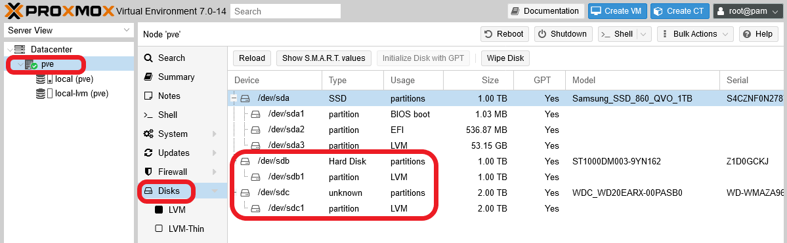

You can see how the `sdb` and `sdc` devices now show their new LVM partitions. And in the `Disks > LVM` section:

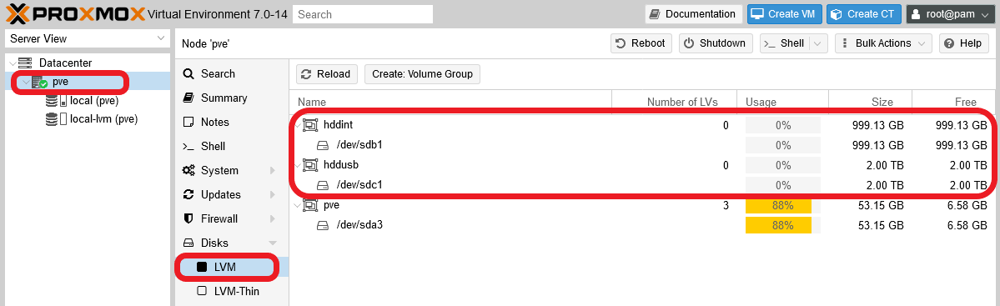

The new volume groups `hddint` and `hddusb` appear above the system's `pve` one (by default, they appear alphabetically ordered by the Volume Group _Name_ column).

At this point, you have an initial arrangement for your unused storage devices. It's just a basic configuration over which _logical volumes_ and _thin pools_ can be created as needed.

## LVM rearrangement in the main storage drive

The main storage drive, the SSD unit, has an LVM arrangement that is not optimal for the small server you want to build. Let's create a new differentiated storage unit in the SSD drive, one that is not the `pve` volume group used by the Proxmox VE system itself. This way, you'll keep thing separated and reduce the chance of messing anything directly related to your Proxmox VE installation.

### _Removing the `data` LVM thin pool_

The installation process of Proxmox VE created a LVM-thin pool called `data`, which is part of the `pve` volume group. You want to reclaim this space, so let's remove this `data`:

1. On the Proxmox VE web console, go to the `Datacenter > Storage` option and take our the `local-lvm` volume from the list by selecting it and pressing on the `Remove` button.

    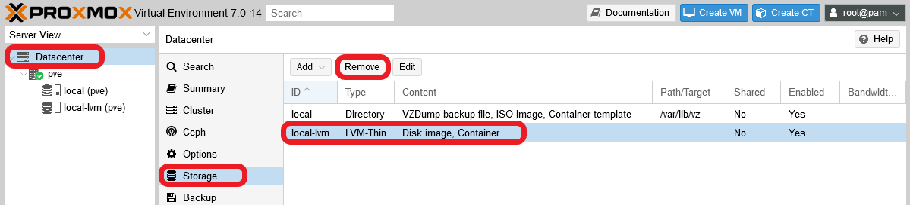

    A dialog will ask for your confirmation.

    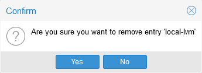

    The volume will be immediately taken out from the storage list.

    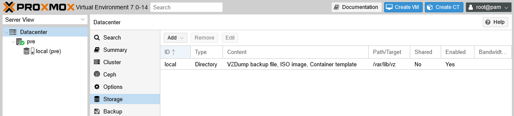

    This hasn't erased the LVM thinpool volume itself, only made it unavailable for Proxmox VE.

2. To remove the `data` thinpool volume, get into the shell as `root` and execute the following.

    ~~~bash
    $ lvs
      LV   VG  Attr       LSize  Pool Origin Data%  Meta%  Move Log Cpy%Sync Convert
      data pve twi-a-tz-- 17.12g             0.00   1.58
      root pve -wi-ao---- 12.25g
      swap pve -wi-ao---- 12.00g
    ~~~

    The `data` volume is under the `pve` volume group (`VG`). Knowing this, execute `lvremove` to delete this logical volume (`LV`).

    ~~~bash
    $ lvremove pve/data
    ~~~

    Notice how you have to specify the VG before the name of the LV you want to remove. The command will ask you to confirm the removal. Answer with `y`:

    ~~~bash
    Do you really want to remove and DISCARD active logical volume pve/data? [y/n]: y
      Logical volume "data" successfully removed
    ~~~

3. To verify that the `data` volume doesn't exist anymore, you can check it with the `lvs` command.

    ~~~bash
    $ lvs
      LV   VG  Attr       LSize  Pool Origin Data%  Meta%  Move Log Cpy%Sync Convert
      root pve -wi-ao---- 12.25g
      swap pve -wi-ao---- 12.00g
    ~~~

    Only two logical volumes are listed now, and with the `pvs` command you can see how much space you have available now in the physical volume where the `data` thin pool was present. In this case it was in the `sda3` unit.

    ~~~bash
    $ pvs
      PV         VG     Fmt  Attr PSize    PFree
      /dev/sda3  pve    lvm2 a--   <49.50g  <25.25g
      /dev/sdb1  hddint lvm2 a--  <930.51g <930.51g
      /dev/sdc1  hddusb lvm2 a--    <1.82t   <1.82t
    ~~~

    Also, if you go back to the Proxmox VE web console, you'll see there how the thin pool is not present anymore in your `pve` node's `Disks > LVM-Thin` screen.

    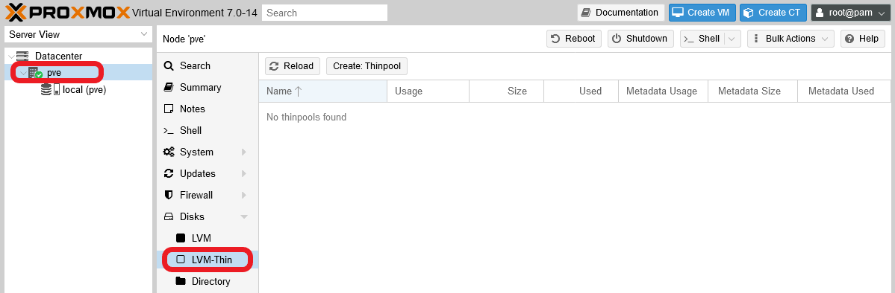

### _Extending the `root` logical volume_

Now that you have a lot of free space in the /dev/sda3, let's give more room to your system's `root` volume.

1. First locate, with `lvs`, where in your system's LVM structure the `root` LV is.

    ~~~bash
    $ lvs
      LV   VG  Attr       LSize  Pool Origin Data%  Meta%  Move Log Cpy%Sync Convert
      root pve -wi-ao---- 12.25g
      swap pve -wi-ao---- 12.00g
    ~~~

    It's in the `pve` VG.

2. Now you need to know exactly how much space you have available in the `pve` VG. Use `vgdisplay` to see all the details of this group.

    ~~~bash
    $ vgdisplay pve
      --- Volume group ---
      VG Name               pve
      System ID
      Format                lvm2
      Metadata Areas        1
      Metadata Sequence No  8
      VG Access             read/write
      VG Status             resizable
      MAX LV                0
      Cur LV                2
      Open LV               2
      Max PV                0
      Cur PV                1
      Act PV                1
      VG Size               <49.50 GiB
      PE Size               4.00 MiB
      Total PE              12671
      Alloc PE / Size       6208 / 24.25 GiB
      Free  PE / Size       6463 / <25.25 GiB
      VG UUID               z2FKMR-3mDj-p59m-1X8X-Ezgw-CLH5-4sLBou
    ~~~

    The line you must pay attention to is the `Free PE / Size`. **PE** stands for _Physical Extend_ size, and is the number of extends you have available in the volume group. The previous `Alloc PE` line gives you the _allocated_ extends or storage already in use.

3. You need to use the `lvextend` command to expand the `root` LV in the free space you have in the `pve` group.

    ~~~bash
    $ lvextend -l +6463 -r pve/root
      Size of logical volume pve/root changed from 12.25 GiB (3136 extents) to <37.50 GiB (9599 extents).
      Logical volume pve/root successfully resized.
    resize2fs 1.46.2 (28-Feb-2021)
    Filesystem at /dev/mapper/pve-root is mounted on /; on-line resizing required
    old_desc_blocks = 2, new_desc_blocks = 5
    The filesystem on /dev/mapper/pve-root is now 9829376 (4k) blocks long.
    ~~~

    Two options are specified to the `lvextend` command.

    - `-l +6463` : specifies the number of extents (`+6463`) you want to give to the logical volume.

    - `-r` : tells the `lvextend` command to call the `resizefs` procedure, after extending the volume, to expand the filesystem within the volume over the newly assigned storage space.

4. As a final verification, check with the commands `lvs`, `vgs`, `pvs` and `df` that the root partition has taken up the entire free space available in the `pve` volume group.

    ~~~bash
    $ lvs
      LV   VG  Attr       LSize   Pool Origin Data%  Meta%  Move Log Cpy%Sync Convert
      root pve -wi-ao---- <37.50g
      swap pve -wi-ao----  12.00g
    $ vgs
      VG     #PV #LV #SN Attr   VSize    VFree
      hddint   1   0   0 wz--n- <930.51g <930.51g
      hddusb   1   0   0 wz--n-   <1.82t   <1.82t
      pve      1   2   0 wz--n-  <49.50g       0
    $ pvs
      PV         VG     Fmt  Attr PSize    PFree
      /dev/sda3  pve    lvm2 a--   <49.50g       0
      /dev/sdb1  hddint lvm2 a--  <930.51g <930.51g
      /dev/sdc1  hddusb lvm2 a--    <1.82t   <1.82t
    $ df -h
    Filesystem            Size  Used Avail Use% Mounted on
    udev                  3.9G     0  3.9G   0% /dev
    tmpfs                 785M  996K  784M   1% /run
    /dev/mapper/pve-root   37G  3.5G   32G  10% /
    tmpfs                 3.9G   43M  3.8G   2% /dev/shm
    tmpfs                 5.0M     0  5.0M   0% /run/lock
    /dev/sda2             511M  328K  511M   1% /boot/efi
    /dev/fuse             128M   16K  128M   1% /etc/pve
    tmpfs                 785M     0  785M   0% /run/user/0
    ~~~

    You'll see that the `root` volume has grown from 12.25 GiB to 37.50 GiB, the `pve` VG doesn't have any empty space (`VFree`) available, the `/dev/sda3` physical volume also doesn't have any space (`PFree`) free either, and that the `/dev/mapper/pve-root` `Size` corresponds to what the `root` LV has free.

### _Creating a new partition and a new VG in the unallocated space on the `sda` drive_

What remains to do is to make usable all the still unallocated space within the `sda` drive. So, let's make a new partition in it.

1. In a `root` shell, use the following `fdisk` command.

    ~~~bash
    $ fdisk /dev/sda

    Welcome to fdisk (util-linux 2.36.1).
    Changes will remain in memory only, until you decide to write them.
    Be careful before using the write command.

    Command (m for help):
    ~~~

2. You're in the `fdisk` partition editor now. Be careful what you do here or you might mess your drive up! Input the command `F` to check the empty space available in the `sda` drive. You should see an output like the following.

    ~~~bash
    Command (m for help): F
    Unpartitioned space /dev/sda: 881.51 GiB, 946516729344 bytes, 1848665487 sectors
    Units: sectors of 1 * 512 = 512 bytes
    Sector size (logical/physical): 512 bytes / 512 bytes

        Start        End    Sectors   Size
    104859648 1953525134 1848665487 881.5G
    ~~~

3. With the previous information you're sure now of where the free space begins and ends, and also its size (881.5 GiB in my case). Now you can create a new partition, type `n` as the command.

    ~~~bash
    Command (m for help): n
    Partition number (4-128, default 4):
    ~~~

    It asks you the number you want for the new partition, and since there are already three other partitions in `sda`, it has to be any number between 4 and 128 (both included). The default value (4) is fine, so **just press enter** on this question.

4. The next question `fdisk` asks you is about which `sector` the new `sda4` partition should **start** in your `sda` drive.

    ~~~bash
    First sector (104857601-1953525134, default 104859648):
    ~~~

    Notice how the first sector chosen by default is the same one you saw before with the `F` command as the `Start` of the free space. Again, the default value (104859648) is good, since you want the `sda4` partition to start at the very beggining of the available unallocated space. So **press enter** to accept the default value.

5. The last question is about on which sector the new `sda4` partition has to **end**.

    ~~~bash
    Last sector, +/-sectors or +/-size{K,M,G,T,P} (104859648-1953525134, default 1953525134):
    ~~~

    Curiously enough, it offers you as a possibility the sector in which your partition is starting. Notice how the default value proposed is the free space's `End`. This value is right what we want so the new `sda4` partition takes all the available free space. **Just press enter** to accept the default value.

6. The `fdisk` program will warn you about the partition's creation and return you to its command line.

    ~~~bash
    Created a new partition 4 of type 'Linux filesystem' and of size 881.5 GiB.

    Command (m for help):
    ~~~

    Bear in mind that, although `fdisk` says it has done it, in fact **the new partition table is only in memory**. The change still has to be saved in the real `sda`'s partition table.

7. To verify that the partition has been registered, use the command `p` to see the current partition table in `fdisk`'s memory.

    ~~~bash
    Command (m for help): p
    Disk /dev/sda: 931.51 GiB, 1000204886016 bytes, 1953525168 sectors
    Disk model: Samsung SSD 860
    Units: sectors of 1 * 512 = 512 bytes
    Sector size (logical/physical): 512 bytes / 512 bytes
    I/O size (minimum/optimal): 512 bytes / 512 bytes
    Disklabel type: gpt
    Disk identifier: BB9279D2-E0C0-4514-BC2D-4E074BE2071A

    Device         Start        End    Sectors   Size Type
    /dev/sda1         34       2047       2014  1007K BIOS boot
    /dev/sda2       2048    1050623    1048576   512M EFI System
    /dev/sda3    1050624  104857600  103806977  49.5G Linux LVM
    /dev/sda4  104859648 1953525134 1848665487 881.5G Linux filesystem
    ~~~

    See how the new `sda4` partition is named correlatively to the other three already existing ones, and takes up the previously unassigned free space (881.8 GiB). Also notice how `fdisk` indicates that the partition is of the `Type Linux filesystem`, not `Linux LVM`.

8. To turn the partition into a Linux LVM type, use the `t` command.

    ~~~bash
    Command (m for help): t
    Partition number (1-4, default 4):
    ~~~

    Notice how the command asks you first which partition you want to change, and it also offers by default the newest one (number `4`). In my case, the default value 4 is the correct one, so I just pressed enter here.

9. The next question is about what type you want to change the partition into. If you don't know the numeric code of the type you want, type `L` on this question and you'll get a long list with all the types available. To exit the types listing press `q` and you'll return to the question.

    ~~~bash
    Partition type (type L to list all types): L
      1 EFI System                     C12A7328-F81F-11D2-BA4B-00A0C93EC93B
      2 MBR partition scheme           024DEE41-33E7-11D3-9D69-0008C781F39F
      3 Intel Fast Flash               D3BFE2DE-3DAF-11DF-BA40-E3A556D89593
      4 BIOS boot                      21686148-6449-6E6F-744E-656564454649
      5 Sony boot partition            F4019732-066E-4E12-8273-346C5641494F
      6 Lenovo boot partition          BFBFAFE7-A34F-448A-9A5B-6213EB736C22
      7 PowerPC PReP boot              9E1A2D38-C612-4316-AA26-8B49521E5A8B
      8 ONIE boot                      7412F7D5-A156-4B13-81DC-867174929325
      9 ONIE config                    D4E6E2CD-4469-46F3-B5CB-1BFF57AFC149
     10 Microsoft reserved             E3C9E316-0B5C-4DB8-817D-F92DF00215AE
     11 Microsoft basic data           EBD0A0A2-B9E5-4433-87C0-68B6B72699C7
     12 Microsoft LDM metadata         5808C8AA-7E8F-42E0-85D2-E1E90434CFB3
     13 Microsoft LDM data             AF9B60A0-1431-4F62-BC68-3311714A69AD
     14 Windows recovery environment   DE94BBA4-06D1-4D40-A16A-BFD50179D6AC
     15 IBM General Parallel Fs        37AFFC90-EF7D-4E96-91C3-2D7AE055B174
     16 Microsoft Storage Spaces       E75CAF8F-F680-4CEE-AFA3-B001E56EFC2D
     17 HP-UX data                     75894C1E-3AEB-11D3-B7C1-7B03A0000000
     18 HP-UX service                  E2A1E728-32E3-11D6-A682-7B03A0000000
     19 Linux swap                     0657FD6D-A4AB-43C4-84E5-0933C84B4F4F
     20 Linux filesystem               0FC63DAF-8483-4772-8E79-3D69D8477DE4
     21 Linux server data              3B8F8425-20E0-4F3B-907F-1A25A76F98E8
     22 Linux root (x86)               44479540-F297-41B2-9AF7-D131D5F0458A
     23 Linux root (x86-64)            4F68BCE3-E8CD-4DB1-96E7-FBCAF984B709
     24 Linux root (ARM)               69DAD710-2CE4-4E3C-B16C-21A1D49ABED3
     25 Linux root (ARM-64)            B921B045-1DF0-41C3-AF44-4C6F280D3FAE
     26 Linux root (IA-64)             993D8D3D-F80E-4225-855A-9DAF8ED7EA97
     27 Linux reserved                 8DA63339-0007-60C0-C436-083AC8230908
     28 Linux home                     933AC7E1-2EB4-4F13-B844-0E14E2AEF915
     29 Linux RAID                     A19D880F-05FC-4D3B-A006-743F0F84911E
     30 Linux LVM                      E6D6D379-F507-44C2-A23C-238F2A3DF928
    ...
    ~~~

    When you've have located the type you want, in this case `Linux LVM`, return to the question by pressing `q` and type the type's index number. For the `Linux LVM` is `30`.

    ~~~bash
    Partition type (type L to list all types): 30
    ~~~

10. After indicating the type and pressing enter, `fdisk` will indicate you if the change has been done properly and will exit the command.

    ~~~bash
    Changed type of partition 'Linux filesystem' to 'Linux LVM'.

    Command (m for help):
    ~~~

11. Check again the partition table, with the `p` command, to verify that the change has been done.

    ~~~bash
    Command (m for help): p
    Disk /dev/sda: 931.51 GiB, 1000204886016 bytes, 1953525168 sectors
    Disk model: Samsung SSD 860
    Units: sectors of 1 * 512 = 512 bytes
    Sector size (logical/physical): 512 bytes / 512 bytes
    I/O size (minimum/optimal): 512 bytes / 512 bytes
    Disklabel type: gpt
    Disk identifier: BB9279D2-E0C0-4514-BC2D-4E074BE2071A

    Device         Start        End    Sectors   Size Type
    /dev/sda1         34       2047       2014  1007K BIOS boot
    /dev/sda2       2048    1050623    1048576   512M EFI System
    /dev/sda3    1050624  104857600  103806977  49.5G Linux LVM
    /dev/sda4  104859648 1953525134 1848665487 881.5G Linux LVM
    ~~~

12. Now that you have the new `sda4` partition ready, exit the `fdisk` program with the `w` command. This will write the changes to the `sda` drive's partition table.

    ~~~bash
    Command (m for help): w
    The partition table has been altered.
    Syncing disks.
    ~~~

    See how `fdisk` gives you some output about the update before returning you to the shell.

13. With the `lsblk` command you can see that the `sda4` now appears as another branch of the `sda` tree, right below the `sda3`'s structure.

    ~~~bash
    $ lsblk
    NAME         MAJ:MIN RM   SIZE RO TYPE MOUNTPOINT
    sda            8:0    0 931.5G  0 disk
    ├─sda1         8:1    0  1007K  0 part
    ├─sda2         8:2    0   512M  0 part /boot/efi
    ├─sda3         8:3    0  49.5G  0 part
    │ ├─pve-swap 253:0    0    12G  0 lvm  [SWAP]
    │ └─pve-root 253:1    0  37.5G  0 lvm  /
    └─sda4         8:4    0 881.5G  0 part
    sdb            8:16   0 931.5G  0 disk
    └─sdb1         8:17   0 931.5G  0 part
    sdc            8:32   0   1.8T  0 disk
    └─sdc1         8:33   0   1.8T  0 part
    ~~~

    Notice how the `sda4` TYPE is simply indicated as `part`.

14. Now that the `sda4` partition is ready, let's create a new **LVM physical volume** with it. Use the `pvcreate` command.

    ~~~bash
    $ pvcreate /dev/sda4
      Physical volume "/dev/sda4" successfully created.
    ~~~

15. To verify that `sda4` is now also a PV, you can use the `lvmdiskscan` command.

    ~~~bash
    $ lvmdiskscan
      /dev/sda2 [     512.00 MiB]
      /dev/sda3 [     <49.50 GiB] LVM physical volume
      /dev/sda4 [     881.51 GiB] LVM physical volume
      /dev/sdb1 [     931.51 GiB] LVM physical volume
      /dev/sdc1 [      <1.82 TiB] LVM physical volume
      0 disks
      1 partition
      0 LVM physical volume whole disks
      4 LVM physical volumes
    ~~~

    Also, you can execute the `pvs` command to see if the `sda4` PV is there (which should).

    ~~~bash
    $ pvs
      PV         VG     Fmt  Attr PSize    PFree
      /dev/sda3  pve    lvm2 a--   <49.50g       0
      /dev/sda4         lvm2 ---   881.51g  881.51g
      /dev/sdb1  hddint lvm2 a--  <930.51g <930.51g
      /dev/sdc1  hddusb lvm2 a--    <1.82t   <1.82t
    ~~~

16. What's left to do is to create a **volume group** over the `sda4` PV. For this, execute a `vgcreate` command.

    ~~~bash
    $  vgcreate ssdint /dev/sda4
      Volume group "ssdint" successfully created
    ~~~

17. Finally, check with the `vgs` command if this new `ssdint` VG has been really created.

    ~~~bash
    $ vgs
      VG     #PV #LV #SN Attr   VSize    VFree
      hddint   1   0   0 wz--n- <930.51g <930.51g
      hddusb   1   0   0 wz--n-   <1.82t   <1.82t
      pve      1   2   0 wz--n-  <49.50g       0
      ssdint   1   0   0 wz--n- <881.51g <881.51g
    ~~~

With all these steps you've got an independent space in your SSD storage unit, meant to separate the storage used for virtual machines and containers, services and other non-Proxmox VE system related files (like ISO images or container templates) from what's the Proxmox VE system itself.

## References

### _LVM_

- [Logical Volume Management Explained on Linux](https://devconnected.com/logical-volume-management-explained-on-linux/)
- [Understanding LVM In Linux (Create Logical Volume) RHEL/CentOS 7&8](https://tekneed.com/understanding-lvm-with-examples-advantages-of-lvm/)
- [RED HAT ENTERPRISE LINUX **8** - CONFIGURING AND MANAGING LOGICAL VOLUMES](https://access.redhat.com/documentation/en-us/red_hat_enterprise_linux/8/html/configuring_and_managing_logical_volumes/index)
- [Setup Flexible Disk Storage with Logical Volume Management (LVM) in Linux – PART 1](https://www.tecmint.com/create-lvm-storage-in-linux/)
- [How to Extend/Reduce LVM’s (Logical Volume Management) in Linux – Part II](https://www.tecmint.com/extend-and-reduce-lvms-in-linux/)
- [How to Take ‘Snapshot of Logical Volume and Restore’ in LVM – Part III](https://www.tecmint.com/take-snapshot-of-logical-volume-and-restore-in-lvm/)
- [Setup Thin Provisioning Volumes in Logical Volume Management (LVM) – Part IV](https://www.tecmint.com/setup-thin-provisioning-volumes-in-lvm/)
- [Logical Volume Management in Linux](https://www.techtutsonline.com/logical-volume-management-in-linux/)
- [Thin Provisioning in LVM2](https://www.theurbanpenguin.com/thin-provisioning-lvm2/)
- [How to Manage and Use LVM (Logical Volume Management) in Ubuntu](https://www.howtogeek.com/howto/40702/how-to-manage-and-use-lvm-logical-volume-management-in-ubuntu/)
- [`pvcreate` error : Can’t open /dev/sdx exclusively. Mounted filesystem?](https://www.thegeekdiary.com/lvm-error-cant-open-devsdx-exclusively-mounted-filesystem/)
