# G005 - Host configuration 03 ~ LVM storage

- [Your Proxmox VE server's storage needs to be reorganized](#your-proxmox-ve-servers-storage-needs-to-be-reorganized)
- [Initial filesystem configuration (PVE web console)](#initial-filesystem-configuration-pve-web-console)
- [Initial filesystem configuration (shell as root)](#initial-filesystem-configuration-shell-as-root)
  - [Checking the filesystem with `fdisk`](#checking-the-filesystem-with-fdisk)
  - [Visualizing the filesystem structure with `lsblk`](#visualizing-the-filesystem-structure-with-lsblk)
  - [Investigating the LVM system with its own set of commands](#investigating-the-lvm-system-with-its-own-set-of-commands)
- [Configuring the unused storage drives](#configuring-the-unused-storage-drives)
  - [Seeing the new storage volumes in Proxmox VE's web console](#seeing-the-new-storage-volumes-in-proxmox-ves-web-console)
- [LVM rearrangement in the main storage drive](#lvm-rearrangement-in-the-main-storage-drive)
  - [Removing the `data` LVM thin-pool](#removing-the-data-lvm-thin-pool)
  - [Extending the `root` logical volume](#extending-the-root-logical-volume)
  - [Creating a new partition and a new VG in the unallocated space on the `sda` drive](#creating-a-new-partition-and-a-new-vg-in-the-unallocated-space-on-the-sda-drive)
- [References](#references)
  - [Logical Volume Management (LVM)](#logical-volume-management-lvm)
- [Navigation](#navigation)

## Your Proxmox VE server's storage needs to be reorganized

After installing Proxmox VE with (almost) default settings, the storage is still not ready since it needs some reorganization. As a reminder, the storage available in this guide's reference hardware is the following:

- One internal, 1 TiB, SSD drive, linked to a SATA 2 port.
- One internal, 1 TiB, HDD drive, linked to a SATA 2 port .
- One external, 2 TiB, HDD drive, linked to a USB 3 port.

Also, keep in mind that:

- The Proxmox VE system is installed in the SSD drive, but it is only using 63 GiB of its available storage space.
- The Proxmox VE filesystem is `ext4`.

## Initial filesystem configuration (PVE web console)

Log in your Proxmox VE's web console as `root`. In a recently installed Proxmox VE node, you can see that, at the `Datacenter` level, the `Storage` already has an initial configuration:

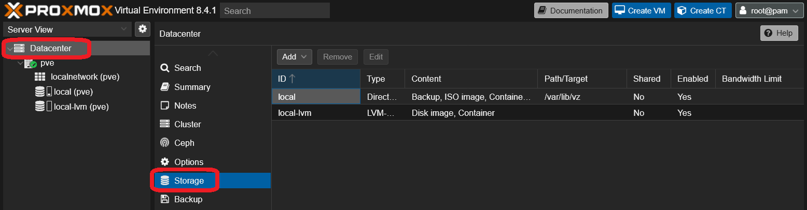

Meanwhile, at the `pve` **node level** you can see which storage drives you have available in your physical system. Remember, **one node represents one physical server**:

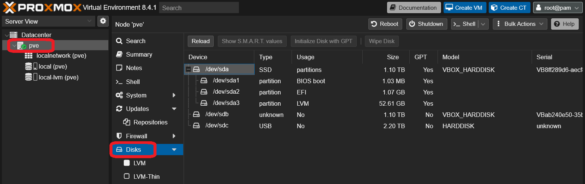

Proxmox shows some technical details from each disk, and also about the partitions present on each of them. At this point, only the `/dev/sda` ssd drive has partitions, the ones corresponding to the Proxmox VE installation.

On the other hand, be aware that Proxmox VE has installed itself within a LVM structure, but the web console does not show much information about it. Go to the `Disks > LVM` option at your **node level**:

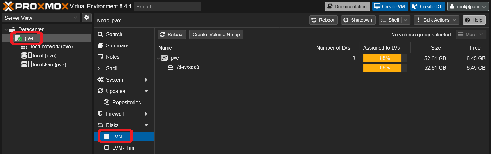

There is a volume group in your `sda` device which fills most of the space in the SSD drive. But this screen **does not show the complete underlying LVM structure**.

In the `Disks > LVM-Thin` screen you can see a bit more information regarding the **LVM-Thin pools** enabled in the system:

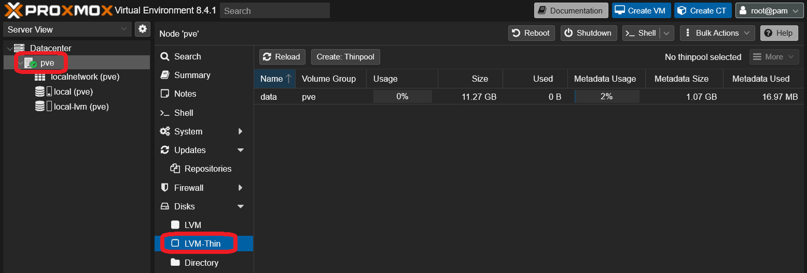

The LVM thinpool created by the Proxmox VE installation is called `data` and appears unused. In Proxmox VE, a LVM thinpool is were the disk images for the virtual machines and containers can be stored and grow dynamically.

When you unfold the `pve` node under the `Datacenter` tree on the left, you can see three leafs. Two of those leafs are the storages shown at the `Datacenter` level. Clicking on the `local (pve)` one will show you a screen like the following:

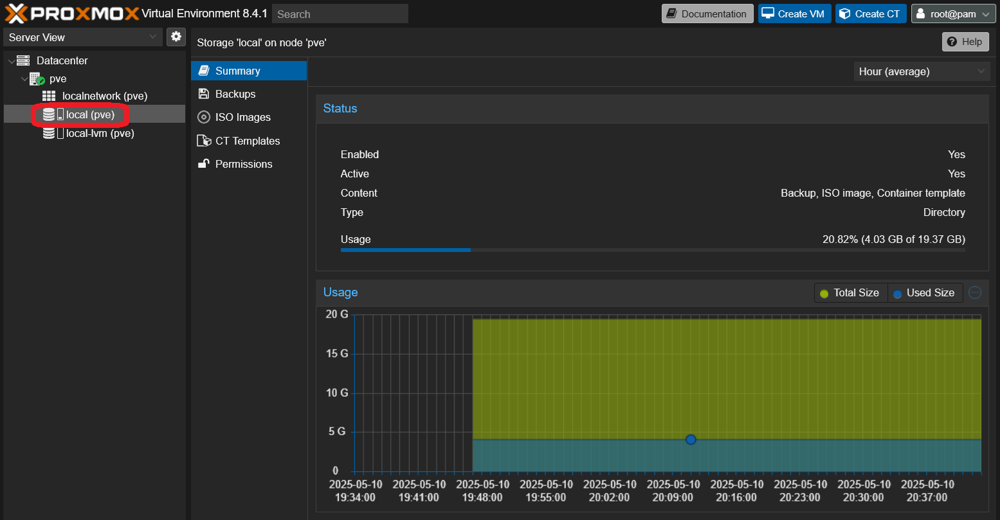

This page offers several tabs like `Summary`, which is the one shown above. The tabs shown will change depending on the type of storage, and they also depend on what Proxmox VE content types have been enabled on the storage. Notice how the `Usage` statistic of the `Storage 'local' on the node 'pve'` indicates a total capacity of 25.71 GiB. This is the main system partition, but it is just a portion of the `pve` LVM volume group's total capacity.

The rest of the space is assigned to the LVM-Thin pool, which can be seen by browsing into the `local-lvm (pve)` leaf:

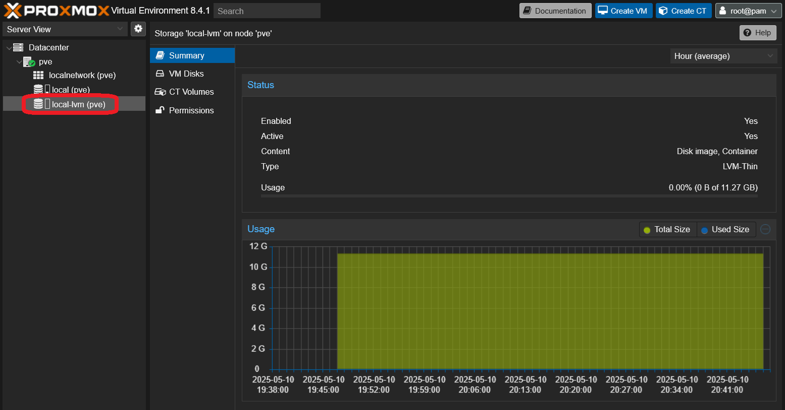

The `Storage 'local-lvm' on node 'pve'` shows in `Usage` that this thinpool has a capacity of 17.04 GiB, which is the rest of storage space available in the `pve` volume group (63 GiB minus the 12 GiB of swap space), and is still empty.

Finally, notice that the web console does not show the 12 GiB swap volume also existing within the LVM structure.

## Initial filesystem configuration (shell as root)

To have a more complete idea of how the storage is organized in your recently installed Proxmox VE server, get into the shell as `root` (either remotely through a client like **PuTTY** or by using one of the shells provided by the Proxmox web console).

### Checking the filesystem with `fdisk`

The first thing to do is to check the filesystem structure in your available storage drives with `fdisk`:

~~~sh
$ fdisk -l
Disk /dev/sda: 931.51 GiB, 1000204886016 bytes, 1953525168 sectors
Disk model: Samsung SSD 860
Units: sectors of 1 * 512 = 512 bytes
Sector size (logical/physical): 512 bytes / 512 bytes
I/O size (minimum/optimal): 512 bytes / 512 bytes
Disklabel type: gpt
Disk identifier: DE398227-5837-44FF-9422-173FEFB80BDC

Device       Start       End   Sectors  Size Type
/dev/sda1       34      2047      2014 1007K BIOS boot
/dev/sda2     2048   2099199   2097152    1G EFI System
/dev/sda3  2099200 132120576 130021377   62G Linux LVM

Disk /dev/sdb: 931.51 GiB, 1000204886016 bytes, 1953525168 sectors
Disk model: WDC WD10JPVX-22J
Units: sectors of 1 * 512 = 512 bytes
Sector size (logical/physical): 512 bytes / 4096 bytes
I/O size (minimum/optimal): 4096 bytes / 4096 bytes
Disklabel type: gpt
Disk identifier: 3E558705-367B-2444-949B-F5B848C14B9F

Disk /dev/mapper/pve-swap: 12 GiB, 12884901888 bytes, 25165824 sectors
Units: sectors of 1 * 512 = 512 bytes
Sector size (logical/physical): 512 bytes / 512 bytes
I/O size (minimum/optimal): 512 bytes / 512 bytes

Disk /dev/mapper/pve-root: 24.5 GiB, 26302480384 bytes, 51372032 sectors
Units: sectors of 1 * 512 = 512 bytes
Sector size (logical/physical): 512 bytes / 512 bytes
I/O size (minimum/optimal): 512 bytes / 512 bytes

Disk /dev/sdc: 1.82 TiB, 2000398934016 bytes, 3907029168 sectors
Disk model: 015-2E8174
Units: sectors of 1 * 512 = 512 bytes
Sector size (logical/physical): 512 bytes / 4096 bytes
I/O size (minimum/optimal): 4096 bytes / 4096 bytes
Disklabel type: gpt
Disk identifier: 8E9192A6-1F3F-412A-9B0C-0B1D6CE8B414
~~~

The `sda` device is the 1TiB SSD drive in which Proxmox VE is installed. In its block, below its list of technical capabilities, you can also see the list of the **real partitions** (the `/dev/sda#` lines under **Device**) created in it by the Proxmox VE installation. The `sda1` and `sda2` are partitions used essentially for booting the system up, and the `sda3` is the one that contains the whole `pve` LVM volume group for Proxmox VE.

Below the `sda` information block, you can see the details of the `sdb` and `sdc` storage devices. In this case, both of them are not partitioned at all and, therefore, completely empty. That is why they do not have a listing of devices like the `sda` unit.

And do not forget the two remaining devices seen by `fdisk`, one per each LVM **logical volumes** (kind of virtual partitions) present in the system. From the point of view of the `fdisk` command, they are just like any other storage device, although the command gives a bit less information about them. Still, you can notice how these volumes are mounted on a `/dev/mapper` route instead of hanging directly from `/dev`, this is something related to their _logical_ nature. Also, notice the following regarding the LVM volumes shown in the previous listing:

- The one called `pve-swap` is the swapping partition, as it names implies.
- The one called `pve-root` is the one in which the whole Debian system is installed, the so called `/` filesystem.
- There is no mention at all of the **LVM-Thin pool** called `data` you saw in your PVE web console.

Thanks to the `fdisk` command, now you really have a good picture of what is going on inside your storage drives, but it is still a bit lacking. There are other commands that will help you visualize better the innards of your server's filesystem.

### Visualizing the filesystem structure with `lsblk`

With the `lsblk` command you can see your PVE node's filesystem structure in branch format:

~~~sh
$ lsblk
NAME               MAJ:MIN RM   SIZE RO TYPE MOUNTPOINTS
sda                  8:0    0 931.5G  0 disk
├─sda1               8:1    0  1007K  0 part
├─sda2               8:2    0     1G  0 part
└─sda3               8:3    0    62G  0 part
  ├─pve-swap       252:0    0    12G  0 lvm  [SWAP]
  ├─pve-root       252:1    0  24.5G  0 lvm  /
  ├─pve-data_tmeta 252:2    0     1G  0 lvm
  │ └─pve-data     252:4    0  15.9G  0 lvm
  └─pve-data_tdata 252:3    0  15.9G  0 lvm
    └─pve-data     252:4    0  15.9G  0 lvm
sdb                  8:16   0 931.5G  0 disk
sdc                  8:32   0   1.8T  0 disk
~~~

This command not only sees all the physical storage drives available (`TYPE disk`) in the system and their partitions (`TYPE part` that, at this point, are only inside the `sda` device), it also gives information about the LVM filesystem itself (`TYPE lvm`).

It correctly shows the `pve-swap`, the `pve-root` and their mount points, but also lists the two elements that compose an LVM-Thin pool: its metadata (`pve-data_tmeta`) and the reserved space itself (`pve-data`). Although the default branch format is really helpful to see where is what, know that the `lsblk` command supports a few other output formats as well.

### Investigating the LVM system with its own set of commands

With the two previous commands you get the Linux point of view, but you also need to know how the LVM system sees itself. For this, LVM has its own set of commands, and one of them is `vgs`:

~~~sh
$ vgs
  VG  #PV #LV #SN Attr   VSize   VFree
  pve   1   3   0 wz--n- <62.00g <7.63g
~~~

This commands informs about the LVM _volume groups_ present on the system. In the snippet there is only one called `pve` (also prefix for the light volumes names as in `pve-root`).

Another interesting command is `lvs`:

~~~sh
$ lvs
  LV   VG  Attr       LSize   Pool Origin Data%  Meta%  Move Log Cpy%Sync Convert
  data pve twi-a-tz--  15.87g             0.00   1.58
  root pve -wi-ao---- <24.50g
  swap pve -wi-ao----  12.00g
~~~

In the output above, the command lists the logical volumes and also the thin-pool. Notice how the names (`LV` column) have changed: instead of being listed as `pve-lv_name`, the list shows them indicating their volume group (`pve`) in a different column (`VG`). Also, notice how the real available space in the thin `data` pool is shown properly (15.87 GiB, under the `LSize` column).

The last command to know about is `vgdisplay`:

~~~sh
$ vgdisplay
  --- Volume group ---
  VG Name               pve
  System ID
  Format                lvm2
  Metadata Areas        1
  Metadata Sequence No  7
  VG Access             read/write
  VG Status             resizable
  MAX LV                0
  Cur LV                3
  Open LV               2
  Max PV                0
  Cur PV                1
  Act PV                1
  VG Size               <62.00 GiB
  PE Size               4.00 MiB
  Total PE              15871
  Alloc PE / Size       13918 / <54.37 GiB
  Free  PE / Size       1953 / <7.63 GiB
  VG UUID               QLLDZO-5nRt-ye9r-1xtq-KBl9-drYB-iTHKRw
~~~

This command outputs details from the volume groups present in the system. In this case, it only shows information from the sole volume group present at this point in the reference setup, the `pve` group.

See the different parameters shown in the output, and notice how the commands gives you the count of logical (`LV`) and physical (`PV`) volumes present in the group. Bear in mind that a LVM physical volume can be either a whole storage drive or just a partition of the drive.

## Configuring the unused storage drives

Now that you have the whole picture of how the storage setup is organized in a newly installed Proxmox VE server, you have to rearrange it to a more convenient one. Begin by making the two empty HDDs' storage available for the LVM system:

1. Make a partition on each empty storage device that takes the **whole space** available. You can do this with `sgdisk`:

    ~~~sh
    $ sgdisk -N 1 /dev/sdb
    Creating new GPT entries in memory.
    The operation has completed successfully.
    $ sgdisk -N 1 /dev/sdc
    Creating new GPT entries in memory.
    The operation has completed successfully.
    ~~~

    The `sgdisk` command may return lines like in the following snippets:

    ~~~sh
    Warning: Partition table header claims that the size of partition table
    entries is 0 bytes, but this program  supports only 128-byte entries.
    Adjusting accordingly, but partition table may be garbage.
    Creating new GPT entries in memory.
    The operation has completed successfully.
    ~~~

    ~~~sh
    Warning: The kernel is still using the old partition table.
    The new table will be used at the next reboot or after you
    run partprobe(8) or kpartx(8)
    The operation has completed successfully.
    ~~~

    Usually, you should expect seeing only the last line but, depending on what has been done to the storage drives previously, you may also see some warning about any possible issue detected by `sgdisk`.

2. Check the new partitions with `fdisk -l`:

    ~~~sh
    $ fdisk -l /dev/sdb /dev/sdc
    Disk /dev/sdb: 931.51 GiB, 1000204886016 bytes, 1953525168 sectors
    Disk model: WDC WD10JPVX-22J
    Units: sectors of 1 * 512 = 512 bytes
    Sector size (logical/physical): 512 bytes / 4096 bytes
    I/O size (minimum/optimal): 4096 bytes / 4096 bytes
    Disklabel type: gpt
    Disk identifier: 3E558705-367B-2444-949B-F5B848C14B9F

    Device     Start        End    Sectors   Size Type
    /dev/sdb1   2048 1953525134 1953523087 931.5G Linux filesystem

    Disk /dev/sdc: 1.82 TiB, 2000398934016 bytes, 3907029168 sectors
    Disk model: 015-2E8174
    Units: sectors of 1 * 512 = 512 bytes
    Sector size (logical/physical): 512 bytes / 4096 bytes
    I/O size (minimum/optimal): 4096 bytes / 4096 bytes
    Disklabel type: gpt
    Disk identifier: 8E9192A6-1F3F-412A-9B0C-0B1D6CE8B414

    Device     Start        End    Sectors  Size Type
    /dev/sdc1   2048 3907029134 3907027087  1.8T Linux filesystem
    ~~~

    Remember how the `sdb` and `sdc` devices did not had a listing under their technical details before? Now you see that they have one partition each.

3. Create a _physical volume_ (or PV) with each of those new partitions. Use the `pvcreate` command for this operation:

    > [!WARNING]
    > **The `pvcreate` command will fail if it finds references to a previous LVM structure in the storage drive it is trying to turn into a physical volume**\
    > If `pvcreate` returns a message like `Can't open /dev/sdb1 exclusively.  Mounted filesystem?`, you'll need to remove all the LVM structure that might be lingering in your storage device.
    >
    > [Follow this guide](https://www.thegeekdiary.com/lvm-error-cant-open-devsdx-exclusively-mounted-filesystem/) to know more about this issue.

    ~~~sh
    $ pvcreate --metadatasize 1g -y -ff /dev/sdb1
      Physical volume "/dev/sdb1" successfully created.
    $ pvcreate --metadatasize 2g -y -ff /dev/sdc1
      Physical volume "/dev/sdc1" successfully created.
    ~~~

    > [!NOTE]
    > **Do not worry about any `Wiping` lines returned by `pvcreate`**\
    > The `Wiping` lines mean that the command is removing any references, or signatures, of previous filesystems that were used in the storage devices. These lines may look like this:
    >
    > ~~~sh
    > Wiping ntfs signature on /dev/sdb1.
    > Wiping zfs_member signature on /dev/sdc1.
    > ~~~

    See that, in the commands above, and following the rule of thumb of 1 MiB per 1 GiB, it has been assigned 1 GiB on the `sdb1` PV and 2 GiB on the `sdc1` PV as the size for their LVM metadata space. If more is required in the future, this can be reconfigured later.

4. Check your new physical volumes executing `pvs`:

    ~~~sh
    $ pvs
      PV         VG  Fmt  Attr PSize   PFree
      /dev/sda3  pve lvm2 a--  <62.00g  <7.63g
      /dev/sdb1      lvm2 ---  931.51g 931.51g
      /dev/sdc1      lvm2 ---   <1.82t  <1.82t
    ~~~

    See how the new physical volumes, `sdb1` and `sdc1`, appear under the already present one, `sda3`.

5. The next step is to create a _volume group_ (or VG) for each one of the new PVs. Do this with `vgcreate`:

    ~~~sh
    $ vgcreate hddint /dev/sdb1
      Volume group "hddint" successfully created
    $ vgcreate hddusb /dev/sdc1
      Volume group "hddusb" successfully created
    ~~~

6. Use `vgdisplay` To check the new VGs:

    ~~~sh
    $ vgdisplay
      --- Volume group ---
      VG Name               hddusb
      System ID
      Format                lvm2
      Metadata Areas        1
      Metadata Sequence No  1
      VG Access             read/write
      VG Status             resizable
      MAX LV                0
      Cur LV                0
      Open LV               0
      Max PV                0
      Cur PV                1
      Act PV                1
      VG Size               <1.82 TiB
      PE Size               4.00 MiB
      Total PE              476419
      Alloc PE / Size       0 / 0
      Free  PE / Size       476419 / <1.82 TiB
      VG UUID               0Yf1Dw-Wjsc-oSr4-RDGY-dgzh-USUZ-Wy9Yia

      --- Volume group ---
      VG Name               pve
      System ID
      Format                lvm2
      Metadata Areas        1
      Metadata Sequence No  7
      VG Access             read/write
      VG Status             resizable
      MAX LV                0
      Cur LV                3
      Open LV               2
      Max PV                0
      Cur PV                1
      Act PV                1
      VG Size               <62.00 GiB
      PE Size               4.00 MiB
      Total PE              15871
      Alloc PE / Size       13918 / <54.37 GiB
      Free  PE / Size       1953 / <7.63 GiB
      VG UUID               QLLDZO-5nRt-ye9r-1xtq-KBl9-drYB-iTHKRw

      --- Volume group ---
      VG Name               hddint
      System ID
      Format                lvm2
      Metadata Areas        1
      Metadata Sequence No  1
      VG Access             read/write
      VG Status             resizable
      MAX LV                0
      Cur LV                0
      Open LV               0
      Max PV                0
      Cur PV                1
      Act PV                1
      VG Size               <930.51 GiB
      PE Size               4.00 MiB
      Total PE              238210
      Alloc PE / Size       0 / 0
      Free  PE / Size       238210 / <930.51 GiB
      VG UUID               HABjIK-BEER-NphN-cBML-TwXR-qfXQ-2kBszZ
    ~~~

    A shorter way of checking the volume groups is with the command `vgs`:

    ~~~sh
    $ vgs
      VG     #PV #LV #SN Attr   VSize    VFree
      hddint   1   0   0 wz--n- <930.51g <930.51g
      hddusb   1   0   0 wz--n-   <1.82t   <1.82t
      pve      1   3   0 wz--n-  <62.00g   <7.63g
    ~~~

### Seeing the new storage volumes in Proxmox VE's web console

If you are wondering if any of this changes appear in the Proxmox web console, just open it and browse to the `pve` node level. There, open the `Disks` view:

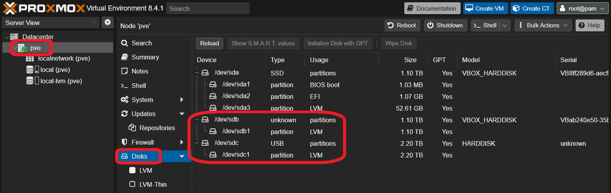

You can see how the `sdb` and `sdc` devices now show their new LVM partitions. Meanwhile, in the `Disks > LVM` section:

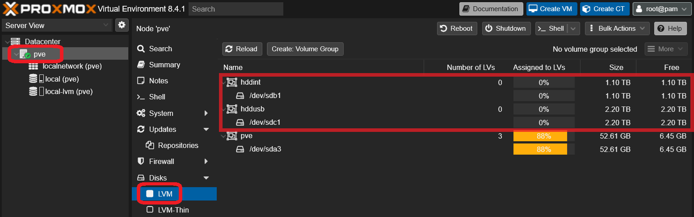

The new volume groups `hddint` and `hddusb` appear above the system's `pve` one. By default, they appear alphabetically ordered by the Volume Group _Name_ column.

At this point, you have an initial arrangement for your unused storage devices. It is just a basic configuration over which _logical volumes_ and _thin-pools_ can be created later as needed.

## LVM rearrangement in the main storage drive

The main storage drive, the SSD unit, has an LVM arrangement that is not optimal for the small server you want to build. Better create a new differentiated storage unit in the SSD drive, one that is not the `pve` volume group used by the Proxmox VE system itself. This way, you can keep thing separated and reduce the chance of messing anything directly related to your Proxmox VE installation.

### Removing the `data` LVM thin-pool

The installation process of Proxmox VE created a LVM thin-pool called `data`, which is part of the `pve` volume group. You need to reclaim this space, so remove this `data` thin-pool:

1. On the Proxmox VE web console, go to the `Datacenter > Storage` option and remove the `local-lvm` volume from the list by selecting it and pressing on the `Remove` button:

    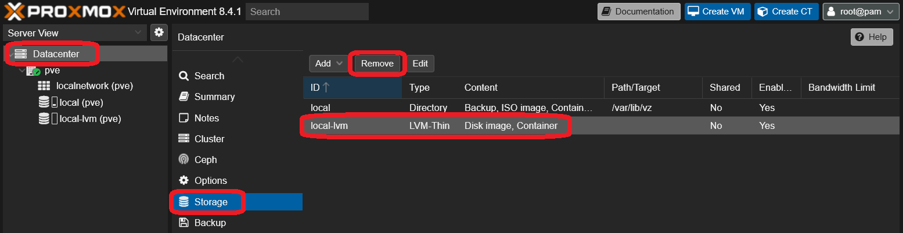

    A dialog will ask for your confirmation:

    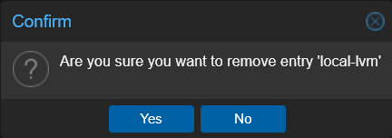

    The volume will be immediately taken out from the storage list:

    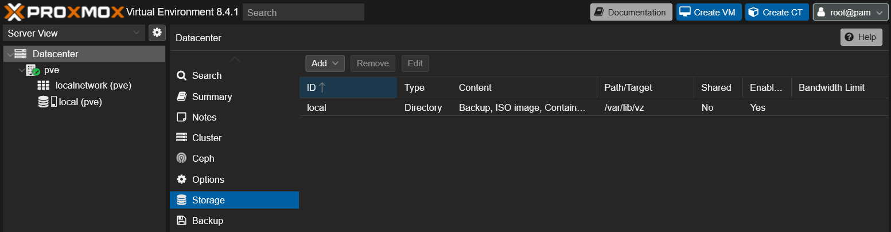

    This action has not erased the LVM thinpool volume itself, it only has made the thin-pool unavailable for Proxmox VE.

2. To remove the `data` thinpool volume, get into the shell as `root` and do this:

    ~~~sh
    $ lvs
      LV   VG  Attr       LSize   Pool Origin Data%  Meta%  Move Log Cpy%Sync Convert
      data pve twi-a-tz--  15.87g             0.00   1.58
      root pve -wi-ao---- <24.50g
      swap pve -wi-ao----  12.00g
    ~~~

    The `data` volume is under the `pve` volume group (`VG`). Knowing this, execute `lvremove` to delete this logical volume (`LV`).

    ~~~sh
    $ lvremove pve/data
    ~~~

    Notice how you have to specify the VG before the name of the LV you want to remove. The command will ask you to confirm the removal. Answer with `y`:

    ~~~sh
    Do you really want to remove active logical volume pve/data? [y/n]: y
      Logical volume "data" successfully removed.
    ~~~

3. To verify that the `data` volume does not exist anymore, you can check it with the `lvs` command:

    ~~~sh
    $ lvs
      LV   VG  Attr       LSize   Pool Origin Data%  Meta%  Move Log Cpy%Sync Convert
      root pve -wi-ao---- <24.50g
      swap pve -wi-ao----  12.00g
    ~~~

    Only two logical volumes are listed now, and with the `pvs` command you can see how much space you have available in the physical volume where the `data` thin-pool is present. In this case it is in the `sda3` unit:

    ~~~sh
    $ pvs
      /dev/sda3  pve    lvm2 a--   <62.00g   25.50g
      /dev/sdb1  hddint lvm2 a--  <930.51g <930.51g
      /dev/sdc1  hddusb lvm2 a--    <1.82t   <1.82t
    ~~~

    Also, if you go back to the Proxmox VE web console, you can see there how the thin-pool is not present anymore as a leaf under your `pve` node nor in the `Disks > LVM-Thin` screen.

    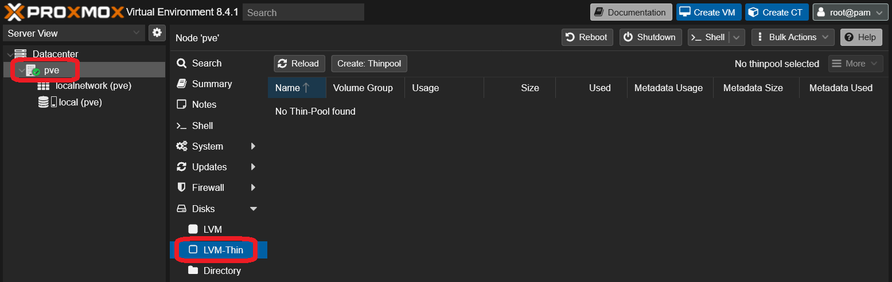

### Extending the `root` logical volume

Now that you have a lot of free space in the /dev/sda3, give more room to your system's `root` volume:

1. First locate with `lvs` where is the `root` LV in your system's LVM structure:

    ~~~sh
    $ lvs
      LV   VG  Attr       LSize   Pool Origin Data%  Meta%  Move Log Cpy%Sync Convert
      root pve -wi-ao---- <24.50g
      swap pve -wi-ao----  12.00g
    ~~~

    It is in the `pve` VG.

2. Now you need to know exactly how much space you have available in the `pve` VG. Use `vgdisplay` to see all the details of this group:

    ~~~sh
    $ vgdisplay pve
      --- Volume group ---
      VG Name               pve
      System ID
      Format                lvm2
      Metadata Areas        1
      Metadata Sequence No  8
      VG Access             read/write
      VG Status             resizable
      MAX LV                0
      Cur LV                2
      Open LV               2
      Max PV                0
      Cur PV                1
      Act PV                1
      VG Size               <62.00 GiB
      PE Size               4.00 MiB
      Total PE              15871
      Alloc PE / Size       9343 / <36.50 GiB
      Free  PE / Size       6528 / 25.50 GiB
      VG UUID               QLLDZO-5nRt-ye9r-1xtq-KBl9-drYB-iTHKRw
    ~~~

    Pay attention to the `Free PE / Size` line. **PE** stands for _Physical Extend_ size, and is the number of extends you have available in the volume group. The previous `Alloc PE` line gives you the _allocated_ extends or storage already in use.

3. You need to use the `lvextend` command to expand the `root` LV in the free space you have in the `pve` group:

    ~~~sh
    $ lvextend -l +6528 -r pve/root
      File system ext4 found on pve/root mounted at /.
      Size of logical volume pve/root changed from <24.50 GiB (6271 extents) to <50.00 GiB (12799 extents).
      Extending file system ext4 to <50.00 GiB (53682896896 bytes) on pve/root...
    resize2fs /dev/pve/root
    resize2fs 1.47.2 (1-Jan-2025)
    Filesystem at /dev/pve/root is mounted on /; on-line resizing required
    old_desc_blocks = 4, new_desc_blocks = 7
    The filesystem on /dev/pve/root is now 13106176 (4k) blocks long.

    resize2fs done
      Extended file system ext4 on pve/root.
      Logical volume pve/root successfully resized.
    ~~~

    Two options are specified to the `lvextend` command:

    - `-l +6528`\
      Specifies the number of extents (`+6528`) you want to assign to the logical volume.

    - `-r`\
      Orders the `lvextend` command to call the `resizefs` procedure, after extending the volume, to expand the filesystem within the volume over the newly assigned storage space.

4. As a final verification, check with the commands `lvs`, `vgs`, `pvs` and `df` that the root partition has taken up the entire free space available in the `pve` volume group:

    ~~~sh
    $ lvs
      LV   VG  Attr       LSize   Pool Origin Data%  Meta%  Move Log Cpy%Sync Convert
      root pve -wi-ao---- <50.00g
      swap pve -wi-ao----  12.00g
    ~~~

    ~~~sh
    $ vgs
      VG     #PV #LV #SN Attr   VSize    VFree
      hddint   1   0   0 wz--n- <930.51g <930.51g
      hddusb   1   0   0 wz--n-   <1.82t   <1.82t
      pve      1   2   0 wz--n-  <62.00g       0
    ~~~

    ~~~sh
    $ pvs
      PV         VG     Fmt  Attr PSize    PFree
      /dev/sda3  pve    lvm2 a--   <62.00g       0
      /dev/sdb1  hddint lvm2 a--  <930.51g <930.51g
      /dev/sdc1  hddusb lvm2 a--    <1.82t   <1.82t
    ~~~

    ~~~sh
    $ df -h
    Filesystem            Size  Used Avail Use% Mounted on
    udev                  3.8G     0  3.8G   0% /dev
    tmpfs                 783M  1.3M  782M   1% /run
    /dev/mapper/pve-root   50G  3.5G   44G   8% /
    tmpfs                 3.9G   46M  3.8G   2% /dev/shm
    efivarfs              128K   39K   85K  32% /sys/firmware/efi/efivars
    tmpfs                 5.0M     0  5.0M   0% /run/lock
    tmpfs                 1.0M     0  1.0M   0% /run/credentials/systemd-journald.service
    tmpfs                 3.9G     0  3.9G   0% /tmp
    /dev/fuse             128M   16K  128M   1% /etc/pve
    tmpfs                 1.0M     0  1.0M   0% /run/credentials/getty@tty1.service
    tmpfs                 783M  4.0K  783M   1% /run/user/0
    ~~~

    The snippets above show that:

    - The `root` volume has grown from 24.50 GiB to 50.00 GiB.
    - The `pve` VG does not have any empty space (`VFree`) available.
    - The `/dev/sda3` physical volume also does not have any space (`PFree`) free either
    - The `/dev/mapper/pve-root` `Size` corresponds to what the `root` LV has free.

### Creating a new partition and a new VG in the unallocated space on the `sda` drive

What remains to do is to make usable all the still unallocated space within the `sda` drive. You have to create a new partition in it:

1. In a `root` shell, use the following `fdisk` command:

    ~~~sh
    $ fdisk /dev/sda

    Welcome to fdisk (util-linux 2.41).
    Changes will remain in memory only, until you decide to write them.
    Be careful before using the write command.

    This disk is currently in use - repartitioning is probably a bad idea.
    It's recommended to umount all file systems, and swapoff all swap
    partitions on this disk.

    Command (m for help):
    ~~~

    > [!IMPORTANT]
    > **The `fdisk` command warns you about messing with the `/dev/sda` unit while in use**\
    > In this particular scenario, this will not be an issue since you are going to create a new partition in the free space available.
    >
    > Still, modifying the partition table of an active storage unit is not recommended.
    >
    > **Never do this in a real production environment!**

2. Now you are in the `fdisk` partition editor. Be careful what you do here or you might mess your PVE node's root filesystem up! Input the command `F` to check the empty space available in the `sda` drive:

    ~~~sh
    Command (m for help): F

    Unpartitioned space /dev/sda: 868.51 GiB, 932558085632 bytes, 1821402511 sectors
    Units: sectors of 1 * 512 = 512 bytes
    Sector size (logical/physical): 512 bytes / 512 bytes

        Start        End    Sectors   Size
    132122624 1953525134 1821402511 868.5G
    ~~~

3. With the previous information now you are sure of where the free space begins and ends, and also its size (868.5 GiB in this guide's case). Knowing this you can create a new partition by typing `n` as the command to do so:

    ~~~sh
    Command (m for help): n
    Partition number (4-128, default 4):
    ~~~

    The first thing `fdisk` asks you is the number you want for the new partition. Since there are already three other partitions in `sda`, it has to be any number between 4 and 128 (both included). The default value (4) is fine, so **just press enter** on this question.

4. The next question `fdisk` asks you is about on which `sector` the new `sda4` partition should start in your `sda` drive:

    ~~~sh
    First sector (132120577-1953525134, default 132122624):
    ~~~

    Notice how the first sector chosen by default is the same one you saw before with the `F` command as the `Start` of the free space. Again, the default value (`132122624`) is good, since you want the `sda4` partition to start at the very beginning of the available unallocated space. Therefore, **press enter** to accept the default value.

5. The last question is about on which sector the new `sda4` partition has to end:

    ~~~sh
    Last sector, +/-sectors or +/-size{K,M,G,T,P} (132122624-1953525134, default 1953523711):
    ~~~

    Curiously enough, it offers you as a possibility the sector in which your partition is starting. Notice how the default value proposed is the free space's `End`. This value is right what you want to make the new `sda4` partition take all the available free space. **Just press enter** to accept the default value.

6. The `fdisk` program will warn you about the partition's creation and return you to its command line:

    ~~~sh
    Created a new partition 4 of type 'Linux filesystem' and of size 868.5 GiB.

    Command (m for help):
    ~~~

    > [!WARNING]
    > **Although `fdisk` says it has created the partition, be aware that, in fact, the new partition table is only in memory**\
    > The change still has to be saved in the real `sda`'s partition table.

7. To verify that the partition has been registered, use the command `p` to see the current partition table in `fdisk`'s memory:

    ~~~sh
    Command (m for help): p
    Disk /dev/sda: 931.51 GiB, 1000204886016 bytes, 1953525168 sectors
    Disk model: Samsung SSD 860
    Units: sectors of 1 * 512 = 512 bytes
    Sector size (logical/physical): 512 bytes / 512 bytes
    I/O size (minimum/optimal): 512 bytes / 512 bytes
    Disklabel type: gpt
    Disk identifier: DE398227-5837-44FF-9422-173FEFB80BDC

    Device         Start        End    Sectors   Size Type
    /dev/sda1         34       2047       2014  1007K BIOS boot
    /dev/sda2       2048    2099199    2097152     1G EFI System
    /dev/sda3    2099200  132120576  130021377    62G Linux LVM
    /dev/sda4  132122624 1953523711 1821401088 868.5G Linux filesystem
    ~~~

    See how the new `sda4` partition is named correlatively to the other three `sda` already existing ones, and takes up the previously unassigned free space (868.5 GiB). Also notice how `fdisk` indicates that the partition is of the `Type Linux filesystem`, not `Linux LVM`.

8. To turn the partition into a Linux LVM type, use the `t` command:

    ~~~sh
    Command (m for help): t
    Partition number (1-4, default 4):
    ~~~

    The command asks you first which partition you want to change, and it also offers by default the newest one (number `4`). In this case, the default value 4 is the correct one, so press enter here.

9. The next question is about what type you want to change the partition into. If you do not know the numeric code of the type you want, type `L` on this question to get a long list with all the types available. Press `q` to exit the types listing and return to the question prompt:

    > [!WARNING]
    > **The number identifying the type can change between `fdisk` versions!**\
    > Always check with `L` which number corresponds to the type you want to use.

    ~~~sh
    Partition type or alias (type L to list all): L
      1 EFI System                     C12A7328-F81F-11D2-BA4B-00A0C93EC93B
      2 MBR partition scheme           024DEE41-33E7-11D3-9D69-0008C781F39F
      3 Intel Fast Flash               D3BFE2DE-3DAF-11DF-BA40-E3A556D89593
      4 BIOS boot                      21686148-6449-6E6F-744E-656564454649
      5 Sony boot partition            F4019732-066E-4E12-8273-346C5641494F
      6 Lenovo boot partition          BFBFAFE7-A34F-448A-9A5B-6213EB736C22
      7 PowerPC PReP boot              9E1A2D38-C612-4316-AA26-8B49521E5A8B
      7 PowerPC PReP boot              9E1A2D38-C612-4316-AA26-8B49521E5A8B
      8 ONIE boot                      7412F7D5-A156-4B13-81DC-867174929325
      8 ONIE boot                      7412F7D5-A156-4B13-81DC-867174929325
      8 ONIE boot                      7412F7D5-A156-4B13-81DC-867174929325
      9 ONIE config                    D4E6E2CD-4469-46F3-B5CB-1BFF57AFC149
    10 Microsoft reserved             E3C9E316-0B5C-4DB8-817D-F92DF00215AE
    11 Microsoft basic data           EBD0A0A2-B9E5-4433-87C0-68B6B72699C7
    12 Microsoft LDM metadata         5808C8AA-7E8F-42E0-85D2-E1E90434CFB3
    13 Microsoft LDM data             AF9B60A0-1431-4F62-BC68-3311714A69AD
    14 Windows recovery environment   DE94BBA4-06D1-4D40-A16A-BFD50179D6AC
    15 IBM General Parallel Fs        37AFFC90-EF7D-4E96-91C3-2D7AE055B174
    16 Microsoft Storage Spaces       E75CAF8F-F680-4CEE-AFA3-B001E56EFC2D
    17 HP-UX data                     75894C1E-3AEB-11D3-B7C1-7B03A0000000
    18 HP-UX service                  E2A1E728-32E3-11D6-A682-7B03A0000000
    19 Linux swap                     0657FD6D-A4AB-43C4-84E5-0933C84B4F4F
    20 Linux filesystem               0FC63DAF-8483-4772-8E79-3D69D8477DE4
    21 Linux server data              3B8F8425-20E0-4F3B-907F-1A25A76F98E8
    22 Linux root (x86)               44479540-F297-41B2-9AF7-D131D5F0458A
    23 Linux root (x86-64)            4F68BCE3-E8CD-4DB1-96E7-FBCAF984B709
    24 Linux root (Alpha)             6523F8AE-3EB1-4E2A-A05A-18B695AE656F
    25 Linux root (ARC)               D27F46ED-2919-4CB8-BD25-9531F3C16534
    26 Linux root (ARM)               69DAD710-2CE4-4E3C-B16C-21A1D49ABED3
    27 Linux root (ARM-64)            B921B045-1DF0-41C3-AF44-4C6F280D3FAE
    28 Linux root (IA-64)             993D8D3D-F80E-4225-855A-9DAF8ED7EA97
    29 Linux root (LoongArch-64)      77055800-792C-4F94-B39A-98C91B762BB6
    30 Linux root (MIPS-32 LE)        37C58C8A-D913-4156-A25F-48B1B64E07F0
    31 Linux root (MIPS-64 LE)        700BDA43-7A34-4507-B179-EEB93D7A7CA3
    32 Linux root (HPPA/PARISC)       1AACDB3B-5444-4138-BD9E-E5C2239B2346
    33 Linux root (PPC)               1DE3F1EF-FA98-47B5-8DCD-4A860A654D78
    34 Linux root (PPC64)             912ADE1D-A839-4913-8964-A10EEE08FBD2
    35 Linux root (PPC64LE)           C31C45E6-3F39-412E-80FB-4809C4980599
    36 Linux root (RISC-V-32)         60D5A7FE-8E7D-435C-B714-3DD8162144E1
    37 Linux root (RISC-V-64)         72EC70A6-CF74-40E6-BD49-4BDA08E8F224
    38 Linux root (S390)              08A7ACEA-624C-4A20-91E8-6E0FA67D23F9
    39 Linux root (S390X)             5EEAD9A9-FE09-4A1E-A1D7-520D00531306
    40 Linux root (TILE-Gx)           C50CDD70-3862-4CC3-90E1-809A8C93EE2C
    41 Linux reserved                 8DA63339-0007-60C0-C436-083AC8230908
    42 Linux home                     933AC7E1-2EB4-4F13-B844-0E14E2AEF915
    43 Linux RAID                     A19D880F-05FC-4D3B-A006-743F0F84911E
    44 Linux LVM                      E6D6D379-F507-44C2-A23C-238F2A3DF928
    ...
    ~~~

    When you have located the type you want, in this case `Linux LVM`, return to the question by pressing `q` and type the type index number. For the `Linux LVM` is `44` in this case:

    ~~~sh
    Partition type or alias (type L to list all): 44
    ~~~

10. After indicating the type and pressing enter, `fdisk` indicates you if the change has been done properly and will exit the command:

    ~~~sh
    Changed type of partition 'Linux filesystem' to 'Linux LVM'.

    Command (m for help):
    ~~~

11. To verify that `fdisk` has applied the type change, check the partition table again with the `p` command:

    ~~~sh
    Command (m for help): p
    Disk /dev/sda: 931.51 GiB, 1000204886016 bytes, 1953525168 sectors
    Disk model: Samsung SSD 860
    Units: sectors of 1 * 512 = 512 bytes
    Sector size (logical/physical): 512 bytes / 512 bytes
    I/O size (minimum/optimal): 512 bytes / 512 bytes
    Disklabel type: gpt
    Disk identifier: DE398227-5837-44FF-9422-173FEFB80BDC

    Device         Start        End    Sectors   Size Type
    /dev/sda1         34       2047       2014  1007K BIOS boot
    /dev/sda2       2048    2099199    2097152     1G EFI System
    /dev/sda3    2099200  132120576  130021377    62G Linux LVM
    /dev/sda4  132122624 1953523711 1821401088 868.5G Linux LVM
    ~~~

12. Now that you have the new `sda4` partition ready, exit the `fdisk` program with the `w` command. **This will write the changes to the `sda` drive partition table**:

    ~~~sh
    Command (m for help): w
    The partition table has been altered.
    Syncing disks.
    ~~~

    See how `fdisk` gives you some final output about the update before returning you to the shell.

13. Use the `lsblk` command to see the new `sda4` partition appearing as another branch of the `sda` tree, right below the `sda3`'s structure:

    ~~~sh
    $ lsblk
    NAME         MAJ:MIN RM   SIZE RO TYPE MOUNTPOINTS
    sda            8:0    0 931.5G  0 disk
    ├─sda1         8:1    0  1007K  0 part
    ├─sda2         8:2    0     1G  0 part
    ├─sda3         8:3    0    62G  0 part
    │ ├─pve-swap 252:0    0    12G  0 lvm  [SWAP]
    │ └─pve-root 252:1    0    50G  0 lvm  /
    └─sda4         8:4    0 868.5G  0 part
    sdb            8:16   0 931.5G  0 disk
    └─sdb1         8:17   0 931.5G  0 part
    sdc            8:32   0   1.8T  0 disk
    └─sdc1         8:33   0   1.8T  0 part
    ~~~

    Notice how the `sda4` TYPE is simply indicated as `part`.

14. With the `sda4` partition ready, create a new **physical LVM volume** with it. Use the `pvcreate` command:

    ~~~sh
    $ pvcreate /dev/sda4
      Physical volume "/dev/sda4" successfully created.
    ~~~

15. Use `lvmdiskscan` to verify that `sda4` is now also a PV:

    ~~~sh
    $ lvmdiskscan
      /dev/sdb1 [     931.51 GiB] LVM physical volume
      /dev/sda2 [       1.00 GiB]
      /dev/sda3 [     <62.00 GiB] LVM physical volume
      /dev/sdc1 [      <1.82 TiB] LVM physical volume
      /dev/sda4 [     868.51 GiB] LVM physical volume
      0 disks
      1 partition
      0 LVM physical volume whole disks
      4 LVM physical volumes
    ~~~

    Also, you can execute the `pvs` command to see if the `sda4` PV shows up there:

    ~~~sh
    $ pvs
      PV         VG     Fmt  Attr PSize    PFree
      /dev/sda3  pve    lvm2 a--   <62.00g       0
      /dev/sda4         lvm2 ---   868.51g  868.51g
      /dev/sdb1  hddint lvm2 a--  <930.51g <930.51g
      /dev/sdc1  hddusb lvm2 a--    <1.82t   <1.82t
    ~~~

16. What is left to do is to create a volume group over the `sda4` PV. For this, execute a `vgcreate` command:

    ~~~sh
    $ vgcreate ssdint /dev/sda4
      Volume group "ssdint" successfully created
    ~~~

17. Finally, check with the `vgs` command if this new `ssdint` VG has been really created:

    ~~~sh
    $ vgs
      VG     #PV #LV #SN Attr   VSize    VFree
      hddint   1   0   0 wz--n- <930.51g <930.51g
      hddusb   1   0   0 wz--n-   <1.82t   <1.82t
      pve      1   2   0 wz--n-  <62.00g       0
      ssdint   1   0   0 wz--n- <868.51g <868.51g
    ~~~

With all these steps you have got an independent space in your SSD storage unit, meant to separate the storage used for virtual machines and containers, services and other non-Proxmox VE related files (like ISO images or container templates) from what is the Proxmox VE filesystem.

## References

### Logical Volume Management (LVM)

- [devconnected. Logical Volume Management Explained on Linux](https://devconnected.com/logical-volume-management-explained-on-linux/)
- [Tekneed. Understanding LVM In Linux (Create Logical Volume) RHEL/CentOS 7&8](https://tekneed.com/understanding-lvm-with-examples-advantages-of-lvm/)
- [Red Hat Documentation. Products. Red Hat Enterprise Linux. 8. Configuring and managing logical volumes](https://docs.redhat.com/en/documentation/red_hat_enterprise_linux/8/html/configuring_and_managing_logical_volumes/index)

- [TecMint](https://www.tecmint.com/)
  - [How to Create Disk Storage with Logical Volume Management (LVM) in Linux – PART 1](https://www.tecmint.com/create-lvm-storage-in-linux/)
  - [How to Extend/Reduce LVM’s (Logical Volume Management) in Linux – Part II](https://www.tecmint.com/extend-and-reduce-lvms-in-linux/)
  - [How to Take ‘Snapshot of Logical Volume and Restore’ in LVM – Part III](https://www.tecmint.com/take-snapshot-of-logical-volume-and-restore-in-lvm/)
  - [Setup Thin Provisioning Volumes in Logical Volume Management (LVM) – Part IV](https://www.tecmint.com/setup-thin-provisioning-volumes-in-lvm/)

- [TechTutsOnline. Logical Volume Management in Linux](https://www.techtutsonline.com/logical-volume-management-in-linux/)
- [HowToGeek. How to Manage and Use LVM (Logical Volume Management) in Ubuntu](https://www.howtogeek.com/40702/how-to-manage-and-use-lvm-logical-volume-management-in-ubuntu/)
- [Ucartz. Knowledgebase. CentOS. pvcreate error : Can’t open /dev/sdx exclusively. Mounted filesystem?](https://www.ucartz.com/clients/knowledgebase/1376/pvcreate-error--Cant-open-ordevorsdx-exclusively.-Mounted-filesystem.html)

## Navigation

[<< Previous (**G004. Host configuration 02**)](G004%20-%20Host%20configuration%2002%20~%20UPS%20management%20with%20NUT.md) | [+Table Of Contents+](G000%20-%20Table%20Of%20Contents.md) | [Next (**G006. Host configuration 04**) >>](G006%20-%20Host%20configuration%2004%20~%20Removing%20Proxmox's%20subscription%20warning.md)
