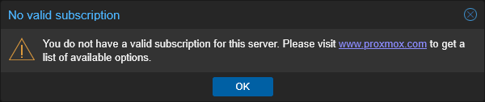

# G006 - Host configuration 04 ~ Removing Proxmox's subscription warning

- [About the Proxmox subscription warning](#about-the-proxmox-subscription-warning)
- [Removing the subscription warning](#removing-the-subscription-warning)
- [Reverting the changes](#reverting-the-changes)
- [Change executed in just one command line](#change-executed-in-just-one-command-line)
- [Final note](#final-note)
- [Relevant system paths](#relevant-system-paths)
  - [Directories](#directories)
  - [Files](#files)
- [References](#references)
- [Navigation](#navigation)

## About the Proxmox subscription warning

Every time you log in the Proxmox VE web console, or when you get into the updates section, you are met with the following warning:

This is bothersome, but there is a way to make the web console stop showing it.

> [!WARNING]
> **Disabling this warning has side effects on the Proxmox VE web console**\
> When you disable this warning, certain features of the Proxmox VE web console may not work anymore. You will need to restore the warning to be able to use them.

## Removing the subscription warning

Follow this procedure to remove or disable Proxmox's subscription warning:

1. Open a root shell and `cd` to `/usr/share/javascript/proxmox-widget-toolkit`:

    ~~~sh
    $ cd /usr/share/javascript/proxmox-widget-toolkit
    ~~~

2. In that `proxmox-widget-toolkit` directory there is a javascript library file called `proxmoxlib.js`. Make a `.orig` backup of it:

    ~~~sh
    $ cp proxmoxlib.js proxmoxlib.js.orig
    ~~~

3. Open the `proxmoxlib.js` file with a proper text editor (vi, vim or nano). Then, in the javascript code, search for the following text:

    ~~~js
    Ext.Msg.show({
        title: gettext('No valid subscription'),
    ~~~

4. When you locate it (just search the `No valid subscription` string, it is unique in the code), replace `Ext.Msg.show` with `void`:

    ~~~js
    void({ //Ext.Msg.show({
        title: gettext('No valid subscription'),
    ~~~

5. Save the change and exit the editor, then restart the Proxmox VE web service:

    ~~~sh
    $ systemctl restart pveproxy.service
    ~~~

    This restart may take a few seconds.

6. Browse to the Proxmox web console, but do not forget to refresh your browser's cache (Ctrl + F5) to ensure that you load the modified javascript. Log in and the subscription warning should not appear now.

## Reverting the changes

If you need to undo the change explained before, you have three options to revert it:

1. Manually undoing the change you made in the `proxmoxlib.js` file.

2. Restoring the `.orig` backup you created of the file within the `proxmox-widget-toolkit` directory:

    ~~~sh
    $ mv proxmoxlib.js.orig proxmoxlib.js
    ~~~

3. Reinstalling the `proxmox-widget-toolkit` package from the repository:

    ~~~sh
    $ apt-get install --reinstall proxmox-widget-toolkit
    ~~~

## Change executed in just one command line

To do the change in just one (long) command line, just use the following shell command:

~~~sh
$ sed -Ezi.orig "s/(Ext.Msg.show\(\{\s+title: gettext\('No valid sub)/void\(\{ \/\/\1/g" /usr/share/javascript/proxmox-widget-toolkit/proxmoxlib.js && systemctl restart pveproxy.service
~~~

## Final note

This fix is known to work on any version starting from Proxmox VE **5.1** up to **9.0**. Bear also in mind that later Proxmox VE updates may undo this change and restore the warning, forcing your to apply this modification again.

## Relevant system paths

### Directories

- `/usr/share/javascript/proxmox-widget-toolkit`

### Files

- `/usr/share/javascript/proxmox-widget-toolkit/proxmoxlib.js`

## References

- [McLaren Data Systems. Remove Proxmox Subscription Notice (Tested to 8.4)](https://mclarendatasystems.com/remove-proxmox51-subscription-notice/)

## Navigation

[<< Previous (**G005. Host configuration 03**)](G005%20-%20Host%20configuration%2003%20~%20LVM%20storage.md) | [+Table Of Contents+](G000%20-%20Table%20Of%20Contents.md) | [Next (**G007. Host hardening 01**) >>](G007%20-%20Host%20hardening%2001%20~%20TFA%20authentication.md)
