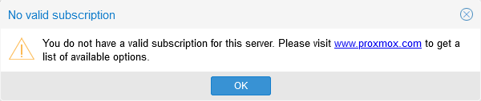

# G006 - Host configuration 04 ~ Removing subscription warning

Everytime you login into the Proxmox VE web console, you are met with the following warning.

This is bothersome, but has an easy solution.

1. Open a root shell and execute the next `cd` command.

    ~~~bash
    $ cd /usr/share/javascript/proxmox-widget-toolkit
    ~~~

2. In that `proxmox-widget-toolkit` directory there's a javascript library file called `proxmoxlib.js`. Make a backup of it.

    ~~~bash
    $ cp proxmoxlib.js proxmoxlib.js.orig
    ~~~

3. Open the `proxmoxlib.js` file with a proper text editor (vi, vim or nano). Then, in the javascript code, search for the following text.

    ~~~js
    Ext.Msg.show({
      title: gettext('No valid subscription'),
    ~~~

4. When you locate it (just search the `No valid subscription` string, its unique in the code), replace `Ext.Msg.show` with `void`, as shown below.

    ~~~js
    void({ //Ext.Msg.show({
      title: gettext('No valid subscription'),
    ~~~

5. Save the change and exit the editor, then restart the Proxmox web service.

    ~~~bash
    $ systemctl restart pveproxy.service
    ~~~

    This restart may take a few seconds.

6. Browse to the Proxmox web console, but don't forget to refresh your browser's cache (Ctrl + F5) to ensure that you load the modified javascript. Log in and the subscription warning shouldn't appear now.

## Reverting the changes

If you need to undo the change explained before, you have three options to revert it:

1. Undoing manually the changes you made in the `proxmoxlib.js`file.
2. Restoring the backup file you created of the file within the `proxmox-widget-toolkit` directory.

    ~~~bash
    $ mv proxmoxlib.js.bkp proxmoxlib.js
    ~~~

3. Reinstall the proxmox-widget-toolkit package from the repository

    ~~~bash
    $ apt-get install --reinstall proxmox-widget-toolkit
    ~~~

## Change executed in just one command line

To do the change in just one (long) command line, just use the following shell command.

~~~bash
$ sed -Ezi.bkp "s/(Ext.Msg.show\(\{\s+title: gettext\('No valid sub)/void\(\{ \/\/\1/g" /usr/share/javascript/proxmox-widget-toolkit/proxmoxlib.js && systemctl restart pveproxy.service
~~~

## Final note

This fix is known to work on any version starting from Proxmox VE **5.1** up to **7.0-x**. Also, bear in mind that any Proxmox VE update will undo this change and restore the warning, so you'll be force to apply this modification again.

## Relevant system paths

### _Directories_

- `/usr/share/javascript/proxmox-widget-toolkit`

### _Files_

- `/usr/share/javascript/proxmox-widget-toolkit/proxmoxlib.js`

## References

- [Remove Proxmox Subscription Notice (Including 5.1+ & 6.2-12+)](https://johnscs.com/remove-proxmox51-subscription-notice/)

## Navigation

[<< Previous (**G005. Host configuration 03**)](G005%20-%20Host%20configuration%2003%20~%20LVM%20storage.md) | [+Table Of Contents+](G000%20-%20Table%20Of%20Contents.md) | [Next (**G007. Host hardening 01**) >>](G007%20-%20Host%20hardening%2001%20~%20TFA%20authentication.md)
