# G007 - Host hardening 01 ~ TFA authentication

One of the first things you should do to harden your standalone PVE node is to enable the **TFA** (Two Factor Authentication, also known as _2FA_) for all your users, and specially for the `root` user.

## Enabling TFA for SSH access

First, you must be aware that the Proxmox VE platform provides its own TFA system for login into its web console, but **it doesn't apply for local shell or remote ssh access**. So, in this section you'll see how to enable a TFA token system for ssh and web access, although **not for direct local shell login**.

### _1. Installation of Google authenticator's PAM package_

Open a shell console as `root` (the only user you should have available yet) and execute the `apt` commands below.

    ~~~bash
    $ apt update
    $ apt install -y libpam-google-authenticator
    ~~~

This installs the `google-authenticator` program, which will allow you to generate TFA tokens for your Debian system's users.

### _2. Configuration of a Google authenticator TOTP token_

At this point, be aware that the Google authenticator program offers two ways of being executed: one is fully interactive and the other is meant to be used in shell scripting. The latter **is not documented** in the related program's `man` page, although it's the one that allows you to set the TFA token configuration in a more precise manner.

#### **2.1 Interactive execution of Google authenticator program**

The interactive process is a step-by-step execution that asks the user to define some parameters for generating a new TFA token. Since those steps don't cover all the possible parameters handled by the command, this interactive method should be used only for a first-contact with the command. In following executions, and specially for shell scripting purposes, **the automated execution** (explained in the next subsection) **should be the one used always**.

To start the interactive process, just launch the google authenticator program as shown below.

    ~~~bash
    $ google-authenticator -Q UTF8
    ~~~

Notice how a parameter `-Q` is specified in the command above.

- `-Q UTF8` : by default, the QR code generated by the `google-authenticator` command is printed with `ANSI` characters. This usually makes the printed QR too big for your shell screen and impossible to be copied or read by your authenticator app. Therefore, it's better to use the `UTF8` character set, so the QR is printed in a smaller and much more convenient character format.

The program will ask for your input in the following steps:

1. **Do you want authentication tokens to be time-based (y/n)**  
    Answer `y` here. The time-based token (TOTP) it's the most common and convenient one.

2. In the following step, the `google-authenticator` program will show you a **QR code** and below:

    - **Your new secret key is**: this is the secret key associated to this new TFA code.

    - **Enter code from app (-1 to skip)**: here you can input the code generated by your TFA app to verify that you got the QR right, or just type `-1` to skip this check.

    Regardless of you validating the TFA token or not, you'll get the emergency scratch codes associated to it. Make a screen capture to get that QR and save it, and also copy all the codes (**secret key**, **verification code** and **emergency scratch codes**) in a safe storage (like a password manager).

3. **Do you want me to update your "$HOME/.google_authenticator" file? (y/n)**  
    Answer `y` so the command writes this authentication token's configuration in a `.google_authenticator` plain text file. By default, the command saves this file at the home directory of your current user, so **notice** that I've replaced with a `$HOME` placeholder the path to the user's home in the question. You could change the path and the file name so you could generate and save different TFA tokens on different files or in different paths.

4. **Do you want to disallow multiple uses of the same authentication token? This restricts you to one login about every 30s, but it increases your chances to notice or even prevent man-in-the-middle attacks (y/n)**  
    Answer `y` to limit to one login per 30 seconds the usage of each TOTP token.

5. **By default, a new token is generated every 30 seconds by the mobile app. In order to compensate for possible time-skew between the client and the server, we allow an extra token before and after the current time. This allows for a time skew of up to 30 seconds between authentication server and client. If you experience problems with poor time synchronization, you can increase the window from its default size of 3 permitted codes (one previous code, the current code, the next code) to 17 permitted codes (the 8 previous codes, the current code, and the 8 next codes). This will permit for a time skew of up to 4 minutes between client and server. Do you want to do so? (y/n)**  
    Answer `n` here. This option is for taking into account possible time differences between the server and the authentication app that gives you the timed codes. Nowadays, all systems are in proper sync thanks to time servers on internet.

6. **If the computer that you are logging into isn't hardened against brute-force login attempts, you can enable rate-limiting for the authentication module. By default, this limits attackers to no more than 3 login attempts every 30s. Do you want to enable rate-limiting? (y/n)**  
    Answer `y` to this final question. This limits the attempts to input the authentication code to 3 per each 30 seconds.

#### **2.2 Automated execution of Google authenticator program**

The `google-authenticator` program can be executed with parameters so it can be included in automated procedures. For some reason, this is not documented in the `google-authenticator`'s corresponding `man` page. So, to see what options this command offers, execute `google-authenticator -h` and read it's output.

~~~bash
$ google-authenticator -h
google-authenticator [<options>]
 -h, --help                     Print this message
 -c, --counter-based            Set up counter-based (HOTP) verification
 -C, --no-confirm               Don't confirm code. For non-interactive setups
 -t, --time-based               Set up time-based (TOTP) verification
 -d, --disallow-reuse           Disallow reuse of previously used TOTP tokens
 -D, --allow-reuse              Allow reuse of previously used TOTP tokens
 -f, --force                    Write file without first confirming with user
 -l, --label=<label>            Override the default label in "otpauth://" URL
 -i, --issuer=<issuer>          Override the default issuer in "otpauth://" URL
 -q, --quiet                    Quiet mode
 -Q, --qr-mode={NONE,ANSI,UTF8} QRCode output mode
 -r, --rate-limit=N             Limit logins to N per every M seconds
 -R, --rate-time=M              Limit logins to N per every M seconds
 -u, --no-rate-limit            Disable rate-limiting
 -s, --secret=<file>            Specify a non-standard file location
 -S, --step-size=S              Set interval between token refreshes
 -w, --window-size=W            Set window of concurrently valid codes
 -W, --minimal-window           Disable window of concurrently valid codes
 -e, --emergency-codes=N        Number of emergency codes to generate
~~~

> **BEWARE!**  
> If you've executed before the command in the interactive mode, remember that you'll already have a configured TOTP token defined in a `.google_authenticator` file within your user's home directory. That file will be overwritten when you execute the `google_authenticator` command again.

Now that you know all the options available in the `google_authenticator` command, you can build a command line to replicate and enhance the TOTP token configuration made in the previously explained interactive method. Check it out below.

> **BEWARE!**  
> The following command line is just an example, **don't execute it as is**. Among it's many options there are two, `-l` and `-i` , that you must always edit to fit your requirements.

~~~bash
$ google-authenticator -t -d -f -r 3 -R 30 -w 3 -Q UTF8 -i pve.deimos.cloud -l root@pam
~~~

Next I'll explain the options set in the example command line above.

- `-t -d -f -r 3 -R 30 -w 3` : these options set up this way configure the TOTP token quite as it was set in the interactive procedure. Check their purpose in the `google-authenticator` command's help.

- `-Q UTF8` : by default, the QR code shown by the `google-authenticator` command is printed with `ANSI` characters. This can make the printed QR too big for your shell window and impossible to be copied or read by your authenticator app. Therefore, it's better to use the `UTF8` character set, so the QR is printed in a smaller but equally valid format.

- `-i pve.deimos.cloud` : the **issuer** is the name of the entity that issued the authentication token. In your authenticator app, it helps you identify to which system corresponds each TOTP code. In this guide it would be the main sole PVE node itself, so this value is filled by default with whatever hostname it has, like `pve`. It's better to put a more descriptive string here, like your full `pve` node's FQDN to avoid confusion.

- `-l root@pam` : the **label** is another identifying value shown by authenticator apps for each TOTP code. By default, the `google-authenticator` command fills this label with the username of your current user, plus your system's hostname. Instead of using the hostname, use the user's authentication realm, `pam` in this case, so this label also looks as how the Proxmox VE web console presents the username.

    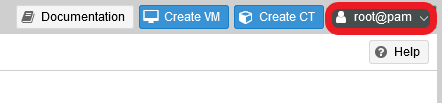

When you have set up your command to your preferences, execute it and you'll get an output like the following:

~~~bash
Warning: pasting the following URL into your browser exposes the OTP secret to Google:
  https://www.google.com/chart?chs=200x200&chld=M|0&cht=qr&chl=otpauth://totp/root@pam%3Fsecret%BKWG32GWKV4HOTNTQEUYQIYNDE%26issuer%3Dpve.deimos.cloud

  █▀▀▀▀▀█  █  █▀█▄▄ ▄ █ ██ ▄▀█▄ █▀▀▀▀▀█
  █ ███ █  ██   ▄█ █▄▄▄ ▄▄▄ ▄█▄ █ ███ █
  █ ▀▀▀ █ ▄   ▀▀▄▄████ ▄▄▀▄▄███ █ ▀▀▀ █
  ▀▀▀▀▀▀▀ ▀ ▀ █▄▀▄▀ ▀▄▀▄▀ █ █ ▀ ▀▀▀▀▀▀▀
  █  ▀▄█▀▄▀▄▀▄ ▄█▄ █ █▄▄▀ ▄▀█▀▀▀ ▀    ▄
  ▀▀██▀ ▀█▀█ █ ▀▀▄▀▀▄ ▀▄█ ▀▄ ▄██▄▄▀  ▀▀
  █▀██ ▄▀  █▀▄ ▄  ▄██▀█▀▄  ▀  █▄█  ▄█▀▀
   ▀▀█▀ ▀▀█▀▄  ██ ███  ▀ █▄█▄▄▀▀▀▄█ ▀ █
   ███ █▀▀██▀█ █▄▄▄ ██▄▄▀▄▄  ▄▄▀▀ █ ██▄
  ▀▀█▀▄█▀▄  ▄▄▀▀▀▀▀██  █▀▄▄▀▄▄▀▀▄█▀ ▄▀█
  ▀ ▄ ▀█▀▀▄█  █▀▀█▄ █▄▄█▄ ███ ▄ ██▀█▀▄
   ▄ █▀█▀▄    ▀█▄ ▀█ █ ▄▄▄█▄▀▄▄▄ █▀▀ ▀▀
  ▀█▄▄█ ▀▀██▀█▄▀ █▄▄ ▀█▄▀  ▀▄▄▀▀▀█▀▀▄▄▄
  ▀▄██▄▀▀ ▀█▄▀█▀▄▄ ▄▀▀▄█▀▀▀▄▀ █▄▀▀  ▀▄▀
  ▀▀  ▀▀▀ ▄ ██  ▀▄▄   ▄▀▀▄▄█▄▀█▀▀▀█▀ ▀▀
  █▀▀▀▀▀█ ▄▀█▀█▀█  ▄█ █▀▄▄▀ ▄▀█ ▀ █▀██▀
  █ ███ █ ▄ █▀ ▀▄▄███▄▀▄ ▀▄█▀ █▀▀███ ▄▀
  █ ▀▀▀ █  ▀ ▄▀▄█▀▄▀▄█▄▄█ ▄███▀ ▄▄█▀ ▀▀
  ▀▀▀▀▀▀▀ ▀  ▀ ▀ ▀     ▀   ▀ ▀▀▀▀▀▀ ▀▀▀

Your new secret key is: BKWG32GWKV4HOTNTQEUYQIYNDE
Enter code from app (-1 to skip): 
~~~

See that the command is asking you to verify the key, so scan the QR code with your authentication app and then input the code as the answer to the question (or just press -1 if you want to skip this validation).

~~~bash
Enter code from app (-1 to skip): 384525
Code confirmed
Your emergency scratch codes are:
  26550421
  52555350
  88197682
  80294556
  15953370
~~~

With the code verified, make a snapshot of the QR (or just copy the QR text block itself in a plain UTF-8 text file). Save the **QR**, its **issuer** and **label**, and **all the related codes** in a safe place, like in a password manager.

### _3. File with the generated authentication token configuration_

By default, the authentication token generated by the `google-authenticator` command is saved, together with its configuration, in a plain text file called `.google_authenticator`. This file is generated by the command itself (remember how it asked about saving in the file in the interactive procedure) and saved in the **home** directory of your **current user**, but with only a read-only permission (`400` mode) exclusive for your user. It's content will vary depending on how the token has been configured, but it will look something like the following.

~~~config
S4ZTE7Q4GMBYN4XZG3IHKJN4YE
" RATE_LIMIT 3 30
" WINDOW_SIZE 3
" DISALLOW_REUSE
" TOTP_AUTH
26550421
52555350
88197682
80294556
15953370
~~~

- `S4ZTE7Q4GMBYN4XZG3IHKJN4YE`: this is your token's secret code, the one you have to input in your authentication app to get the corresponding TOTP codes.

- All the lines starting with `"` are configuration values for the token. You could change these manually but, since how to do it is not properly documented, I wouldn't recommend it.

- `26550421`: this number and the ones below are scratch recovery codes, to use in case you lose access to your TFA authentication app.

### _4. Enforcing TFA on remote ssh access_

Now that you have configured the TOTP token for your `root` user (still the only user you have), you can adjust your system's ssh configuration so it enforces the use of the TOTP token when accessing the system remotely.

1. First, go to the `pam` configuration directory and make a backup of the ssh daemon's configuration file.

    ~~~bash
    $ cd /etc/pam.d
    $ cp sshd sshd.orig
    ~~~

2. **Append** to the `sshd` file the following lines to make the ssh daemon aware of the `google-authenticator` method of authentication.

    ~~~bash
    # Enforcing TFA with Google Authenticator tokens
    auth required pam_google_authenticator.so
    ~~~

3. Go to the ssh configuration directory and make a backup of the original `sshd_config` file.

    ~~~bash
    $ cd /etc/ssh/
    $ cp sshd_config sshd_config.orig
    ~~~

4. Edit the `sshd_config` as follows.
    - Find the parameter `ChallengeResponseAuthentication` and change it to `yes`.

        ~~~bash
        # Change to yes to enable challenge-response passwords (beware issues with
        # some PAM modules and threads)
        ChallengeResponseAuthentication yes
        ~~~

    - Append the following line to the file.

        ~~~bash
        AuthenticationMethods keyboard-interactive
        ~~~

        This parameter tells ssh which authentication methods are required. In this case, it'll ask for a password and the verification code.

        > **BEWARE!**  
        With `keyboard-interactive`, the authentication procedure will ask for all the inputs it requires to validate the login: in this case, the user password and the verification (TOTP) code. Therefore, don't add the `password` method before the `keyboard-interactive` one or the login procedure won't work properly (the `password` method will require the TOTP code, **NOT** the user password).

5. With all the previous changes done, restart the `sshd` daemon to apply the changes.

    ~~~bash
    $ systemctl restart sshd.service
    ~~~

6. Using a ssh client, like [**PuTTY**](https://www.putty.org/) or [**Bitvise**](https://www.bitvise.com/), check that the server asks you for your user password and your _verification code_ (your TOTP code). Through **PuTTY**, the ssh login for the `root` user will look like the following.

    ~~~bash
    Using username "root".
    Keyboard-interactive authentication prompts from server:
    | Password:
    | Verification code:
    End of keyboard-interactive prompts from server
    ~~~

You have enabled TFA authentication when connecting through SSH to your server for all users. This is better than just using the user password to log in through ssh, but we can improve on this by using ssh key pairs instead of passwords. I'll show you how in a later guide in which I'll explain how to harden the `sshd` configuration.

## Enforcing TFA TOTP for accessing the Proxmox VE web console

The Proxmox VE web console offers the option of enabling TFA for its users.

> **BEWARE!**  
> This TFA configuration is only about the web console login, **it has nothing to do** with the local or remote SSH shell terminal access.

To increase the security of your PVE setup, let's enable the **two-factor authentication** (**TFA**) of the main `root` user on the PVE's web console. Also, you'll reuse the **TOTP** token already generated in the previous section with the `google-authenticator` command.

1. Go to the **TFA** option available in the `root@pam` menu list, as shown below.

    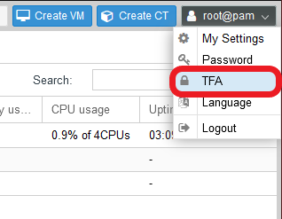

2. The window below offers two tabs. Stick to the one opened by default, the **TOTP** one.

    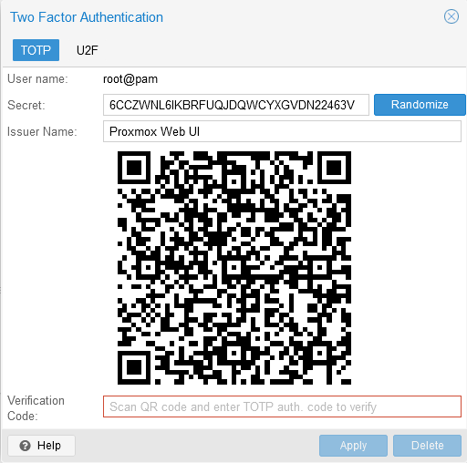

    > **BEWARE!**  
    > The **User name** field is the label applied by PVE to the generated TOTP token. Use this value as **label** for generating the TOTP token with the `google-authenticator` procedure explained in the previous section.

3. With your previously `google-authenticator` generated TOTP token, input it's secret key in the `Secret` field and the issuer in the `Issuer Name`. The autogenerated QR in this TOTP window **won't be the same** as the one you got previously with the `google-authenticator` command. So, if you scan it, it may generate a new entry in your authenticator app, but **it will generate the same codes** as the TOTP token you generated first.

    > **BEWARE!**  
    > Generate your TOTP token with the `google-authenticator` procedure first!

4. To validate the TOTP token, input the **Verification Code** given by your TOTP app. After this, you'll have the TFA TOTP mode enabled in the `root` account for the web console with the **same TOTP token** that you have enabled for the remote ssh access.

> **BEWARE!**  
> This procedure only enables TFA for login in the web console, **not for accessing through a shell terminal**.

## Enforcing TFA TOTP as a default requirement for `pam` realm

To ensure that all `pam` users use TFA when accessing the PVE's web console, you can configure that realm to have TFA enforced by default. Select the `Datacenter` level, open the `Permissions` options set and click on `Authentication`.

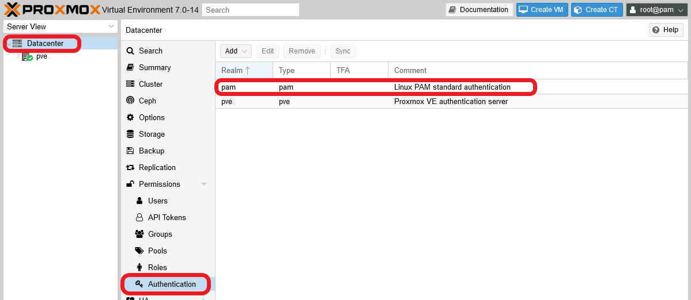

The screen you've just reached lists the authentication realms currently available in your PVE installation. Since we're working with a clean Proxmox VE installation, you'll only see two realms there: `pam` and `pve`. The main `root` user of your PVE system is in the `pam` realm.

1. Choose the `pam` realm and press `Edit` in the button menu above. You'll get the following window.

    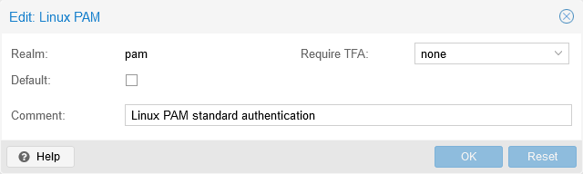

2. Unfold the `Require TFA` list, currently set as `none`, and you'll see all the options available.

    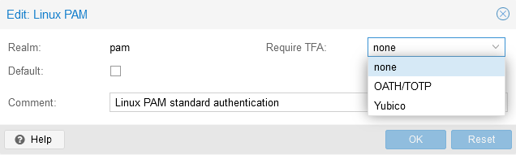

3. Choose the `OATH/TOTP` option, and notice how the window changes by adding two new parameters related to TOTP: `Time Step` and `Secret Length`.

    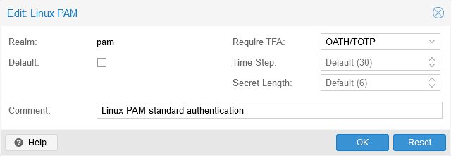

4. Leave those new parameters with their **default values**, they're good as they are. Accept the change to the `pam` realm by pressing `OK`, and you'll get back to the authentication realms list.

    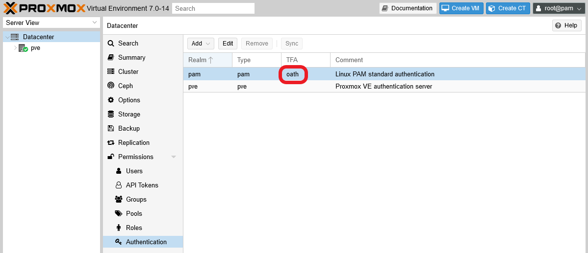

    Notice how, in the TFA column, the `pam` realm shows the string `oath`. This means that TFA is enforced in that realm with a **OATH/TOTP** token system. From now on, any user in that realm will be required to give a TOTP code, apart from their username and password, to access the PVE web console.

### _In Proxmox VE **v7.2-z**, `Authentication` is now `Realms`_

In the `v7.2-z` releases (and maybe also in the `v7.1-z` ones) of Proxmox VE have the `Permissions > Authentication` section, found at the `Datacenter` level, renamed to the more adequate `Permissions > Realms`.

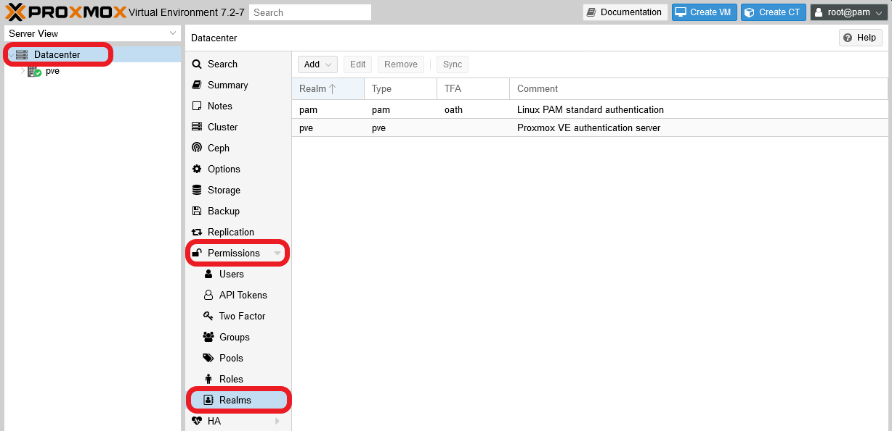

## Incompatibility of PVE web console login with TFA enforced local shell access

At the beginning of this guide, I explicitly stated that I wouldn't enable the TFA token system for the local shell login. This is due to a incompatibility existing between the Proxmox VE web console login and the modification required in the underlying Debian system's `pam` configuration.

Since this is not documented anywhere as far as I've seen, let me illustrate you the problem in a few steps.

1. Open a remote ssh terminal and log in as `root` (again, the only user we have at this point). Then `cd` to the `/etc/pam.d` directory.

    ~~~bash
    $ cd /etc/pam.d
    ~~~

2. The file to edit is `common-auth`, so first let's make a backup of it.

    ~~~bash
    $ cp common-auth common-auth.bkp
    ~~~

3. **Append** to the `common-auth` file the following line.

    ~~~bash
    auth required pam_google_authenticator.so
    ~~~

    > **BEWARE!**  
    > Don't close the remote session, and leave the file open but be sure to save the change above.

4. Now try to log in the PVE web console. You'll see how the login takes longer than usual.

    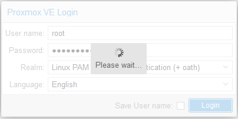

5. After a few seconds, the login will raise a failure error.

    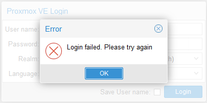

    Notice that you won't even reach the TFA form to input your TOTP code. PVE just raises this error window and doesn't go further than that.

6. Go back to your remote terminal session. Remove the line you added to the `common-auth` file and save the change, or just restore the backup.

7. Try to log into the web console again. It should work as usual now.

This conflict is not really that surprising. Proxmox VE web console needs some privileged access to its underlying Debian system, and adding the TFA restriction in the `pam` configuration for local authorization messes up with it.

Probably, this is just a problem of limiting the TFA restriction to the users and groups that should have it enforced. Still, this problem is not documented anywhere and messing with the system's PAM configuration is risky. Therefore it's better to leave it as it is, although being aware that the local access to the physical server **doesn't** have TFA enabled.

> **BEWARE!**  
> This problem not only happens in the **7.0-14** version of Proxmox Virtual Environment, but also in previous versions too.

## Relevant system paths

### _Directories_

- `/etc/pam.d`
- `/etc/ssh`
- `/root`

### _Files_

- `/etc/pam.d/sshd`
- `/etc/pam.d/sshd.orig`
- `/etc/ssh/sshd_config`
- `/etc/ssh/sshd_config.orig`
- `/root/.google_authenticator`

## References

### _About TFA_

- [How To Set Up Multi-Factor Authentication for ssh on Ubuntu 20.04](https://www.digitalocean.com/community/tutorials/how-to-set-up-multi-factor-authentication-for-ssh-on-ubuntu-20-04)
- [How to set up two-factor authentication in Linux](https://www.techrepublic.com/article/how-to-setup-two-factor-authentication-in-linux/)
- [How to add two-factor authentication to Linux with Google Authenticator](https://www.techradar.com/how-to/how-to-add-two-factor-authentication-to-linux-with-google-authenticator)
- [How To Set Up Multi-Factor Authentication for ssh on Ubuntu 16.04](https://www.digitalocean.com/community/tutorials/how-to-set-up-multi-factor-authentication-for-ssh-on-ubuntu-16-04)
- [How to Set Up Two-Factor Authentication in Ubuntu?](https://www.ultimatetech.org/set-two-factor-authentication-ubuntu/)
- [Proxmox VE User Management Two-factor authentication](https://pve.proxmox.com/wiki/User_Management#_two_factor_authentication)
- [Proxmox VE OATH(TOTP) Authentication](https://pve.proxmox.com/wiki/OATH(TOTP)_Authentication)
- [Set up two-factor authentication by using Google Authenticator](https://docs.rackspace.com/support/how-to/set-up-two-factor-authentication-by-using-google-authenticator/)
- [Google Authenticator OpenSource](https://github.com/google/google-authenticator)

### _Configuring ssh login with password + TOTP_

- [SSHD Denies access with password + google-authenticator combo](https://unix.stackexchange.com/questions/513011/sshd-denies-access-with-password-google-authenticator-combo)

### _About PAM_

- [The Linux-PAM System Administrators' Guide](http://linux-pam.org/Linux-PAM-html/Linux-PAM_SAG.html)
- [Debian Reference. 4.5. PAM and NSS](https://www.debian.org/doc/manuals/debian-reference/ch04.en.html#_pam_and_nss)
- [How to Configure and Use PAM in Linux](https://www.tecmint.com/configure-pam-in-centos-ubuntu-linux/)
- [Configurar y usar Linux-PAM](https://likegeeks.com/es/linux-pam/)
- [Autenticación PAM – Redes PYMES](https://blog.desdelinux.net/autenticacion-pam-redes-pymes/)
- [Cómo configurar y usar PAM en Linux](https://es.linux-console.net/?p=141)
