# G007 - Host hardening 01 ~ TFA authentication

- [Enable Two Factor Authentication in your PVE system](#enable-two-factor-authentication-in-your-pve-system)
- [Enabling TFA for SSH access](#enabling-tfa-for-ssh-access)
  - [1. Installation of Google Authenticator's PAM package](#1-installation-of-google-authenticators-pam-package)
  - [2. Configuration of a Google Authenticator TOTP token](#2-configuration-of-a-google-authenticator-totp-token)
    - [2.1 Interactive execution of Google Authenticator program](#21-interactive-execution-of-google-authenticator-program)
    - [2.2 Automated execution of Google authenticator program](#22-automated-execution-of-google-authenticator-program)
  - [3. File with the generated authentication token configuration](#3-file-with-the-generated-authentication-token-configuration)
  - [4. Enforcing TFA on remote ssh access](#4-enforcing-tfa-on-remote-ssh-access)
- [Enforcing TFA TOTP for accessing the Proxmox VE web console](#enforcing-tfa-totp-for-accessing-the-proxmox-ve-web-console)
- [Enforcing TFA TOTP as a default requirement for the `pam` realm](#enforcing-tfa-totp-as-a-default-requirement-for-the-pam-realm)
- [Incompatibility of PVE web console login with TFA enforced local shell access](#incompatibility-of-pve-web-console-login-with-tfa-enforced-local-shell-access)
- [Relevant system paths](#relevant-system-paths)
  - [Directories](#directories)
  - [Files](#files)
- [References](#references)
  - [Proxmox](#proxmox)
  - [About TFA and Google Authenticator](#about-tfa-and-google-authenticator)
  - [Configuring ssh login with password + TOTP](#configuring-ssh-login-with-password--totp)
  - [About Linux PAM](#about-linux-pam)
- [Navigation](#navigation)

## Enable Two Factor Authentication in your PVE system

One of the first things you should do to harden your standalone Proxmox VE node is to enable the Two Factor Authentication (**TFA**, also known as _2FA_) for all your users, **and specially for the `root` user**.

## Enabling TFA for SSH access

You must be aware that the Proxmox VE platform provides its own TFA system for login into its web console, but **it does not apply for local shell or remote ssh access**. On the other hand, this section explains how to enable a TFA token system valid for both ssh and web access, although **not for direct local shell login**.

### 1. Installation of Google Authenticator's PAM package

Open a shell console as `root` (the only user you should have available yet) and execute the `apt` commands below:

~~~sh
$ apt update
$ apt install -y libpam-google-authenticator
~~~

This installs the `google-authenticator` program, enabling you to generate TFA tokens for the users of your PVE server's underlying Debian system.

### 2. Configuration of a Google Authenticator TOTP token

At this point, be aware that the Google Authenticator program offers two ways of being executed: one is fully interactive and the other is meant to be used in shell scripting.

#### 2.1 Interactive execution of Google Authenticator program

The interactive process is a step-by-step execution that asks the user to define some parameters for generating a new TFA token. Since those steps do not cover all the possible parameters handled by the command, this interactive method should be used only for a first-contact with the command.

> [!IMPORTANT]\
> **Better use the [automated execution method](#22-automated-execution-of-google-authenticator-program) over this interactive one**\
> The automated method enables you to use all the options available for generating TFA tokens with the `google-authenticator` program, specially for shell scripting.

To start the interactive process, launch the google authenticator program like this:

~~~sh
$ google-authenticator -Q utf8
~~~

Notice how a parameter `-Q` is specified in the command above:

- `-Q utf8`\
  By default, the QR code generated by the `google-authenticator` command is printed with ANSI characters. This usually makes the printed QR too big for your shell screen and impossible to be copied or read by your authenticator app. Therefore, better use the Unicode UTF-8 character set. This ensures the QR is printed in a smaller and much more convenient character format.

The program will ask for your input in the following steps:

1. `Do you want authentication tokens to be time-based (y/n)`\
    Answer `y` here. The time-based token is a _Time-based One-Time Password_, or _TOTP_, and is the most common and convenient token to use in TFA.

2. In the following step, the `google-authenticator` program will show you a **QR code** and below it:

    - `Your new secret key is:`\
      This is the secret key associated to this new TFA code.

    - `Enter code from app (-1 to skip):`
      Here you can input the code generated by your TFA app to verify that you got the QR right, or just type `-1` to skip this check.

    Regardless of you validating the TFA token or not, you get the emergency scratch codes associated to it. Make a screen capture to get that QR (or copy the whole text block if your terminal allows it) and save it together with all the codes (**secret key**, **verification code** and **emergency scratch codes**) in a safe storage like a password manager.

3. `Do you want me to update your "/root/.google_authenticator" file? (y/n)`\
    Answer `y` so the command writes this authentication token's configuration in a `.google_authenticator` plain text file. By default, the command saves this file at the home directory of your current user (in this case, `root`).

    > [!IMPORTANT]
    > **Answering `n` to this question finishes the interactive procedure**\
    > If you answer `n` here, the `google-authenticator` command will not ask with the questions shown in the next steps and will return you to the shell prompt.

    > [!NOTE]
    > **It is possible to use other paths and other file names**\
    > You can change the path and the file name, allowing you to generate and save different TFA tokens on different files or in different paths.
    >
    > This possibility will neither be shown nor used in this guide.

4. `Do you want to disallow multiple uses of the same authentication token? This restricts you to one login about every 30s, but it increases your chances to notice or even prevent man-in-the-middle attacks (y/n)`\
    Answer `y` to limit to one login per 30 seconds the usage of each TOTP token.

5. `By default, a new token is generated every 30 seconds by the mobile app. In order to compensate for possible time-skew between the client and the server, we allow an extra token before and after the current time. This allows for a time skew of up to 30 seconds between authentication server and client. If you experience problems with poor time synchronization, you can increase the window from its default size of 3 permitted codes (one previous code, the current code, the next code) to 17 permitted codes (the 8 previous codes, the current code, and the 8 next codes). This will permit for a time skew of up to 4 minutes between client and server. Do you want to do so? (y/n)`\
    Answer `n` here. This option is for taking into account possible time differences between the server and the authentication app that gives you the timed codes. Nowadays, all systems are in proper sync thanks to time servers available on internet.

6. `If the computer that you are logging into isn't hardened against brute-force login attempts, you can enable rate-limiting for the authentication module. By default, this limits attackers to no more than 3 login attempts every 30s. Do you want to enable rate-limiting? (y/n)`\
    Answer `y` to this final question. This limits the attempts to input the authentication code to 3 per each 30 seconds.

The resulting configuration is stored by default in the $HOME directory of the current user, in this case the `root` superuser, as a `.google_authenticator` file. Remove the file when you want to regenerate the TOTP token and its associated keys.

#### 2.2 Automated execution of Google authenticator program

The `google-authenticator` program can be executed with parameters so it can be included in automated procedures. You can also list those parameters with the `--help` option:

~~~sh
$ google-authenticator -h
google-authenticator [<options>]
 -h, --help                     Print this message
 -c, --counter-based            Set up counter-based (HOTP) verification
 -C, --no-confirm               Don't confirm code. For non-interactive setups
 -t, --time-based               Set up time-based (TOTP) verification
 -d, --disallow-reuse           Disallow reuse of previously used TOTP tokens
 -D, --allow-reuse              Allow reuse of previously used TOTP tokens
 -f, --force                    Write file without first confirming with user
 -l, --label=<label>            Override the default label in "otpauth://" URL
 -i, --issuer=<issuer>          Override the default issuer in "otpauth://" URL
 -q, --quiet                    Quiet mode
 -Q, --qr-mode={NONE,ANSI,UTF8} QRCode output mode
 -r, --rate-limit=N             Limit logins to N per every M seconds
 -R, --rate-time=M              Limit logins to N per every M seconds
 -u, --no-rate-limit            Disable rate-limiting
 -s, --secret=<file>            Specify a non-standard file location
 -S, --step-size=S              Set interval between token refreshes
 -w, --window-size=W            Set window of concurrently valid codes
 -W, --minimal-window           Disable window of concurrently valid codes
 -e, --emergency-codes=N        Number of emergency codes to generate
~~~

> [!WARNING]
> **If you have already executed the `google-authenticator` command in the interactive mode, you will have a configured TOTP token**\
> This TOTP token's setup will be stored in a `.google_authenticator` file within your user's home directory.
>
> **The file `.google_authenticator` will be overwritten when you execute the `google-authenticator` command again for the same user and location!**.

After discovering all the options available in the `google-authenticator` command, you can build a command line to replicate and enhance the TOTP token configuration made in the previously explained interactive method:

> [!IMPORTANT]
> **The following command line is just an example, DO NOT execute it as is**\
> Among its many options, there are two, `-l` and `-i` , you must always edit to fit your requirements.

~~~sh
$ google-authenticator -t -d -f -r 3 -R 30 -w 3 -Q utf8 -i pve.homelab.cloud -l root@pam
~~~

Next are explained the options set in the example command line above:

- `-t -d -f -r 3 -R 30 -w 3`\
  These options configure the TOTP token almost like it was set in the [interactive procedure](#21-interactive-execution-of-google-authenticator-program). Check their purpose in the `google-authenticator` command's help (`-h`) or `man` content.

- `-Q utf8`\
  By default, the QR code shown by the `google-authenticator` command is printed with `ANSI` characters. This can make the printed QR too big for your shell window and impossible to be copied or read by your authenticator app. Therefore, it is better to use Unicode's UTF-8 character set, which prints the QR in a smaller but equally valid format.

- `-i pve.homelab.cloud`\
  The **issuer** is the name of the entity that issued the authentication token. In your authenticator app, it helps you identify to which system corresponds each TOTP code. In this guide it would be the main sole Proxmox VE node itself, so this value is filled by default with whatever hostname it has, like `pve`. Better put a more descriptive string here for clarity, like your `pve` node's FQDN.

- `-l root@pam`\
  The **label** is another identifying value shown by authenticator apps for each TOTP code. By default, the `google-authenticator` command fills this label with the username of your current user, plus your system's hostname. Instead of using the hostname, use the user's authentication realm, `pam` in this case, so this label also looks as how the Proxmox VE web console presents the username.

  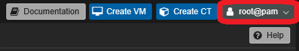

When you have set up your command to your preferences, execute it to get an output like the following:

~~~sh
Warning: pasting the following URL into your browser exposes the OTP secret to Google:
  https://www.google.com/chart?chs=200x200&chld=M|0&cht=qr&chl=otpauth://totp/root@pam%3Fsecret%3DHPDSSXPJ5BFJIXIIZD7EYTMJVM%26issuer%3Dpve.homelab.cloud

  █▀▀▀▀▀█   ▄ ▄ ▄▀▀▄█▀▀ ██ ▄▀█▄ █▀▀▀▀▀█
  █ ███ █  ▄█▀█▄▀█ ███  ▄▄▄ ▄█▄ █ ███ █
  █ ▀▀▀ █ ▄ ▀█▀▄▄ ██▄█▄▄▄▀▄▄███ █ ▀▀▀ █
  ▀▀▀▀▀▀▀ ▀▄▀ █▄█▄█▄▀ ▀▄▀ █ █ ▀ ▀▀▀▀▀▀▀
  ▀▄ ▀ █▀ █ ▄  █▀█ ▄  ▄█▀ ▄▀█▀▀▀ ▀ ▄▄ ▄
  ▄▀▀██▀▀█▄▀  ▀▀█▄▀▀██▄▄█ ▀▄ ▄██▄ █  ▀▀
   ▄▄ █▄▀▄██ █▀▄ ▄▀▄▄ ▄▀▄  ▀ ▀█▄█  ▄█▀▀
  ██▀█ ▄▀█ █▀▄▄█▀ ▀▄█▄ █ █▄█▄▄▀▀ ▄█ ▀ ▀
  ▀ ▄▄▀█▀ ▄▄ █▀▄ ▄▄▀  ▀█▀█▄  ▄▄█▀▀█▄█▄▄
   ▄▄▄  ▀ █▄██▄▀▀▀▀██ ██▀▄▄▀▄ ▀▀▄█ ▀█▀█
  ▄▀ ▀▄▄▀▀▄▀ ▄▄▀▀██▀▄█▄▀▄ ███ ▄ ██▀▄▀▄
  █▄ ▄██▀█▀  ▄█▀▄▄█  █ ▄   ▄▀▄▄▀▀█▀▀ ▀█
  ▀▀▀▀██▀▀▄ █▀█ ▀▄█▀ ███▄  ▀▄▄ █▀▀ █ ▄▄
  ▀▄▀▀▀█▀▀▄▄█▀▀ █▄██▀▄██▀▀▀▄▀ ▀▄▀  ▀▀▄█
  ▀▀ ▀▀ ▀ ▄█▀  ██ ▀▄▄▀▄▀▀▄██▄▀█▀▀▀█▀  ▀
  █▀▀▀▀▀█ ▄ █▀▄ ▀ ██▄ ██ ▄▀ ▄▀█ ▀ █▀███
  █ ███ █ ▄ ██ ▀█▀█▄▄ ▄█ ▀▄█▀ █▀▀███▄ ▀
  █ ▀▀▀ █  █  ▀▀█▄█ ▀█ ▄█ ▄███▀▄▄▄█ ▀▀▀
  ▀▀▀▀▀▀▀ ▀▀▀ ▀ ▀ ▀  ▀ ▀   ▀ ▀▀▀▀▀▀ ▀▀▀

Your new secret key is: HPDSSXPJ5BFJIXIIZD7EYTMJVM
Enter code from app (-1 to skip):
~~~

The command requests you to verify the key. Scan the QR code with your authentication app and then input the authentication code as the answer to the question (or just press -1 if you want to skip this validation).

~~~sh
Enter code from app (-1 to skip): 384525
Code confirmed
Your emergency scratch codes are:
  68904426
  75567886
  58397698
  41263689
  78071899
~~~

With the code verified, make a snapshot of the QR (or just copy the QR text block itself in a plain UTF-8 text file). Save the **QR**, its **issuer** and **label**, and **all the related codes** in a safe place, like in a password manager.

### 3. File with the generated authentication token configuration

By default, the authentication token generated by the `google-authenticator` command is saved, together with its configuration, in a plain text file called `.google_authenticator`. This file is generated by the command itself and saved **in the home directory of your current user**, but with only a read-only permission (`400` mode) exclusive for your user. Its content varies depending on how the token has been configured, but it looks something like this:

~~~config
HPDSSXPJ5BFJIXIIZD7EYTMJVM
" RATE_LIMIT 3 30
" WINDOW_SIZE 3
" DISALLOW_REUSE
" TOTP_AUTH
68904426
75567886
58397698
41263689
78071899
~~~

- `HPDSSXPJ5BFJIXIIZD7EYTMJVM`\
  This is your TOTP token's secret code, the one you have to input in your authentication app to get the corresponding TOTP codes.

- All the lines starting with `"` are configuration values for the TOTP token\
  You could change these manually but, since how to do it is not properly documented, it is not recommended.

- `68904426`\
  This number and all the ones listed below it are _scratch recovery codes_. If you lose access to your TFA authentication app, you can use any of these recovery codes as TOTP codes.

  > [!WARNING]
  > **Scratch recovery codes are one-use only**\
  > When used once, a scratch recovery code cannot be used again (hence, it has to be _scratched_ from the list of available recovery codes).

### 4. Enforcing TFA on remote ssh access

With the TOTP token configured for your `root` user (the only user you have at this point yet), you can adjust your system's ssh configuration so it enforces the use of the TOTP token when accessing the system remotely.

1. First, go to the `pam` configuration directory and make a backup of the ssh daemon's configuration file:

    ~~~sh
    $ cd /etc/pam.d
    $ cp sshd sshd.orig
    ~~~

2. Append to the `sshd` file the following lines to make the ssh daemon aware of the `google-authenticator` method of authentication:

    ~~~sh
    # Enforcing TFA with Google Authenticator tokens
    auth required pam_google_authenticator.so
    ~~~

3. Go to the ssh configuration directory and make a backup of the original `sshd_config` file:

    ~~~sh
    $ cd /etc/ssh/
    $ cp sshd_config sshd_config.orig
    ~~~

4. Edit the `sshd_config` file as follows:

    - Find the parameter `KbdInteractiveAuthentication` and change it to `yes`.

      ~~~sh
      # Change to yes to enable challenge-response passwords (beware issues with
      # some PAM modules and threads)
      KbdInteractiveAuthentication yes
      ~~~

    - Append the following line to the file.

      ~~~sh
      AuthenticationMethods keyboard-interactive
      ~~~

      This parameter tells ssh which authentication methods are required. In this case, it will ask for a password and the verification code.

      > [!WARNING]
      > **The keyboard interactive method already asks for all the required authentication inputs**\
      > With `keyboard-interactive`, the authentication procedure asks for all the inputs it requires to validate the login. In this case, the user password and the verification (TOTP) code. Therefore, **do not add the `password` method before the `keyboard-interactive` one** or the login procedure will not work properly (the `password` method will require the TOTP code, **NOT the user password**).

5. With all the previous changes done, restart the `sshd` daemon to apply the changes:

    ~~~sh
    $ systemctl restart sshd.service
    ~~~

6. Using a ssh client, like [**PuTTY**](https://www.putty.org/) or [**Bitvise**](https://www.bitvise.com/), check that the server asks you for your user password and your _verification code_ (your TOTP code). Through **PuTTY**, the ssh login for the `root` user will look like the following:

    ~~~sh
    login as: root
    Keyboard-interactive authentication prompts from server:
    Password:
    Verification code:
    End of keyboard-interactive prompts from server
    ~~~

You have enabled TFA authentication when connecting through SSH to your server for all users. This is better than just using the user password to log in through ssh, but we can improve on this by using ssh key pairs instead of passwords. This guide shows you how in a later chapter that covers how to harden the `sshd` configuration.

## Enforcing TFA TOTP for accessing the Proxmox VE web console

The Proxmox VE web console offers the option of enabling TFA for its users.

> [!IMPORTANT]
> **This TFA configuration is only about the Proxmox VE web console login**\
> Proxmox VE's TFA configuration **has nothing to do** with the local or remote SSH shell terminal access.

To increase the security of your Proxmox VE setup, enable the _Two-Factor Authentication_ (_TFA_) of the main `root` user on the Proxmox VE's web console. Also, you will reuse the TOTP token already generated with the `google-authenticator` command:

> [!WARNING]
> [Generate your TOTP token with the `google-authenticator` procedure first!](#2-configuration-of-a-google-authenticator-totp-token)

1. Go to the `TFA` option available in the `root@pam` menu:

    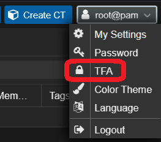

2. The web console loads the page for the `Datacenter > Permissions` level feature called `Two Factor`:

    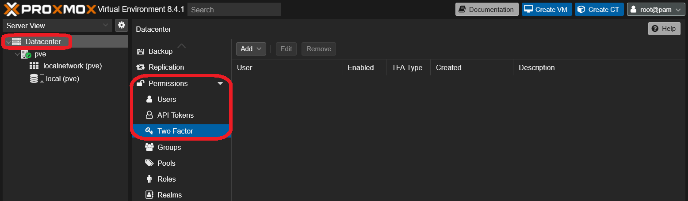

3. Unfold the `Two Factor` page's `Add` menu and pick the `TOTP` option:

    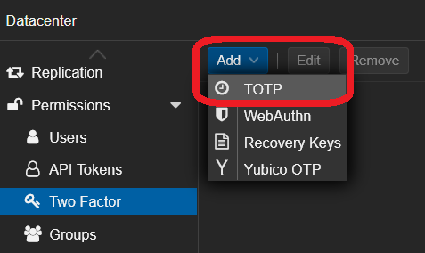

4. The `TOTP` option raises the `Add a TOTP login factor` window. Setup in it the TOTP-based TFA procedure for your `root` user:

    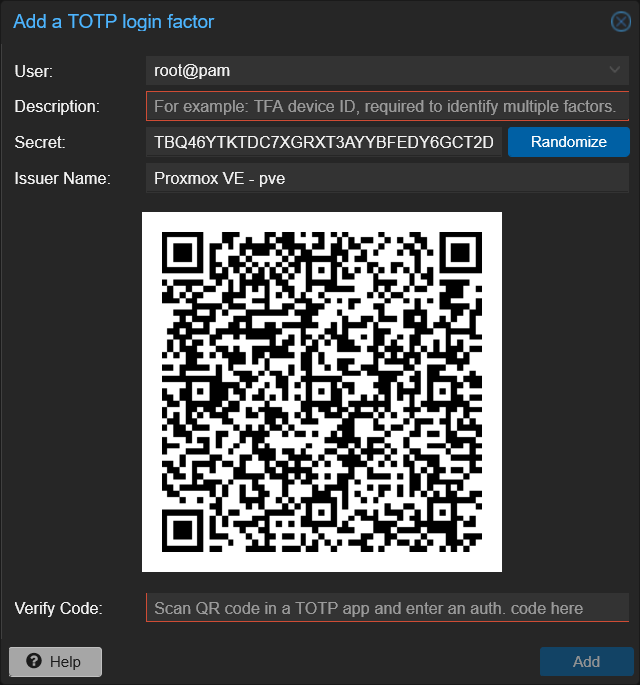

5. Fill the fields of the TOTP window [using the details of your previously `google-authenticator` generated TOTP token](#2-configuration-of-a-google-authenticator-totp-token):

    - `User`\
      Identifies the user affected by this TOTP method. This field corresponds with the `label` you specified in the `google-authenticator` method (`-l` option).

    - `Description`\
      Just a string describing this TOTP login factor. There is no correspondence with any of the parameters specified in the `google-authenticator` method.

    - `Secret`\
      This is where the secret key must be set. This field corresponds with the secret key the `google-authenticator` command returns as the generated TOTP.

    - `Issuer Name`\
      The name identifying the issuer of this TOTP. This field is equivalent to the issuer value specified to the `google-authenticator` command (`-i` option).

    > [!WARNING]
    > **The autogenerated QR in this TOTP window _will not be the same_ as the one you got previously with the `google-authenticator` command**\
    > If you scan it, it may generate a new entry in your authenticator app, but **it will generate the same codes** as the TOTP token you generated first.

6. To enable the `Add` button, **you must validate the TOTP token**. Enter the `Verify Code` given by your TOTP app, then click `Add`. Your new TOTP login factor will appear listed in the `Two Factor` page:

    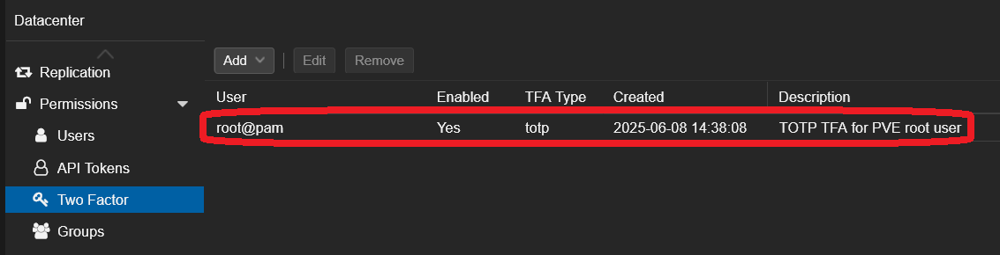

After all these steps, you obtain the TFA TOTP mode enabled in the `root` account for the web console with the **same TOTP token** you enabled for the remote ssh access.

> [!IMPORTANT]
> **This TFA is valid for the web console only**\
> This procedure only enables the TFA method for login through Proxmox VE's web console, **not for accessing through a shell terminal**.

## Enforcing TFA TOTP as a default requirement for the `pam` realm

To ensure that all `pam` users use TFA when accessing the Proxmox VE web console, you can configure that realm to have TFA enforced by default. Select the `Datacenter` level, open the `Permissions` options set and click on `Realms`.

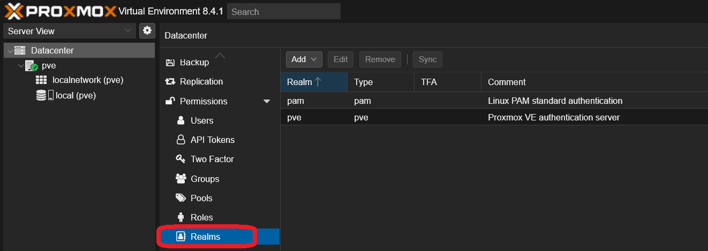

The `Realms` page lists the authentication realms currently available in your Proxmox VE installation. In a clean Proxmox VE installation like the one used in this guide, you only have two realms: `pam` and `pve`. The main `root` user of your Proxmox VE system is in the `pam` realm.

1. Choose the `pam` realm and press `Edit` in the button menu above:

    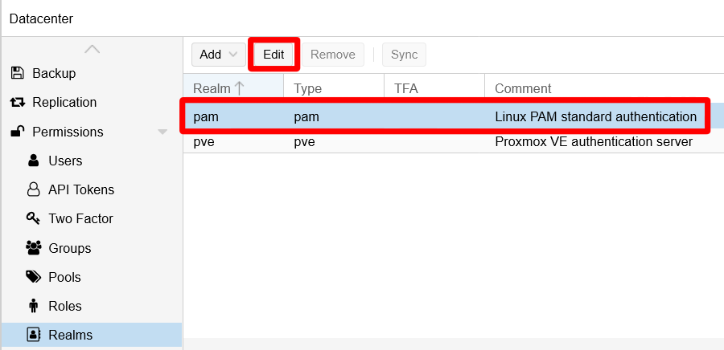

2. After pressing the `Edit` button, you will get into the `Edit: Linux PAM` window:

    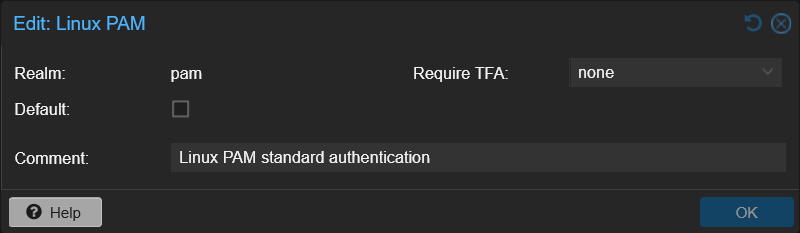

3. Unfold the `Require TFA` list, currently set as `none`, to see all the available options:

    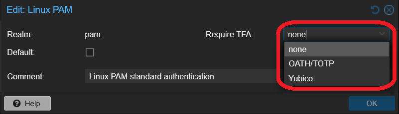

4. Choose the `OATH/TOTP` option. Notice how in the window appear two new fields related to TOTP, `Time Step` and `Secret Length`:

    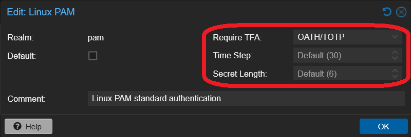

5. Leave the TOTP parameters with their **default values**, they are good as they are. Accept the change to the `pam` realm by pressing `OK`, and you get back to the authentication realms list:

    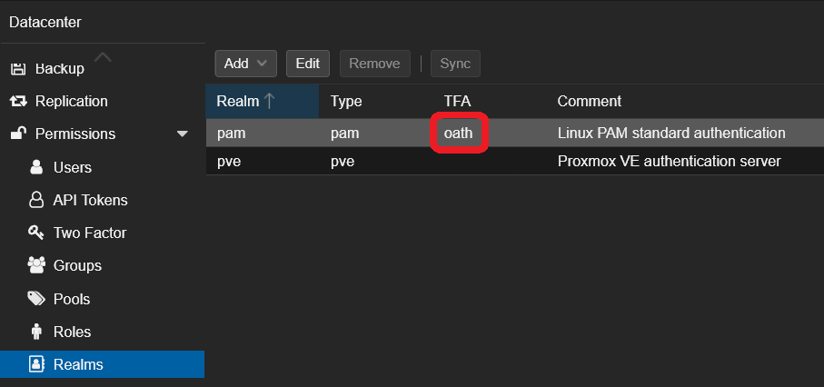

    See in the TFA column how the `pam` realm shows the string `oath`. TFA is enforced in that realm with a **OATH/TOTP** token system. From now on, any user in that realm will be required to authenticate with a TOTP code, together with their username and password, to access the Proxmox VE web console.

## Incompatibility of PVE web console login with TFA enforced local shell access

At the beginning of this chapter, it is explicitly stated that it will not be enabled the TFA token system for the local shell login. This is due to a incompatibility existing between the Proxmox VE web console login and the modification required in the underlying Debian system's `pam` configuration.

Since this issue is not documented anywhere, this chapter illustrates the problem here in a few steps:

1. Open a remote ssh terminal and log in as `root` (again, the only available user at this point). Then `cd` to the `/etc/pam.d` directory:

    ~~~sh
    $ cd /etc/pam.d
    ~~~

2. The file to edit is `common-auth`, so first let's make a backup of it:

    ~~~sh
    $ cp common-auth common-auth.orig
    ~~~

3. Append the following line to the `common-auth` file:

    ~~~sh
    auth required pam_google_authenticator.so
    ~~~

    > [!WARNING]
    > **Do not close the remote session**\
    > Also, leave the `common-auth` file open but be sure to save the change above.

4. Now try to log in the Proxmox VE web console and see how the login takes longer than usual:

    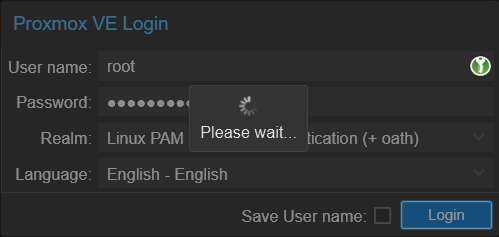

5. After a few seconds, the login will raise a failure error:

    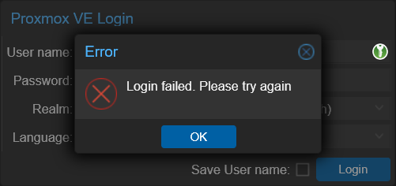

    Notice that you will not even reach the TFA form to input your TOTP code. Proxmox VE just raises this error window and does not allow you to go further than that.

6. Go back to your remote terminal session. Remove the line you added to the `common-auth` file and save the change, or just restore the backup.

7. Try to log into the web console again. It should work as usual now.

This conflict is not really that surprising. Proxmox VE web console needs some privileged access to its underlying Debian system, and adding the TFA restriction in the `pam` configuration for local authorization may mess up with it.

This is probably just a problem of limiting the TFA restriction to the users and groups that should have it enforced. Still, this problem is not explicitly documented anywhere and messing with the system's PAM configuration is risky. Therefore better leave it as it is, although being aware that the local access to the physical Proxmox VE server **does not have TFA enabled**.

> [!IMPORTANT]
> **This problem not only happens in the 9.0 releases of Proxmox Virtual Environment**\
> This problem happens in previous versions too.

## Relevant system paths

### Directories

- `/etc/pam.d`
- `/etc/ssh`
- `/root`

### Files

- `/etc/pam.d/common-auth`
- `/etc/pam.d/common-auth.orig`
- `/etc/pam.d/sshd`
- `/etc/pam.d/sshd.orig`
- `/etc/ssh/sshd_config`
- `/etc/ssh/sshd_config.orig`
- `/root/.google_authenticator`

## References

### [Proxmox](https://www.proxmox.com/en/)

- [Proxmox VE Wiki](https://pve.proxmox.com/wiki/Main_Page)
  - [User Management. Two-Factor Authentication](https://pve.proxmox.com/wiki/User_Management#pveum_tfa_auth)

### About TFA and Google Authenticator

- [DigitalOcean. How To Set Up Multi-Factor Authentication for ssh on Ubuntu 20.04](https://www.digitalocean.com/community/tutorials/how-to-set-up-multi-factor-authentication-for-ssh-on-ubuntu-20-04)
- [DigitalOcean. How To Set Up Multi-Factor Authentication for ssh on Ubuntu 16.04](https://www.digitalocean.com/community/tutorials/how-to-set-up-multi-factor-authentication-for-ssh-on-ubuntu-16-04)
- [TechRepublic. How to set up two-factor authentication in Linux](https://www.techrepublic.com/article/how-to-setup-two-factor-authentication-in-linux/)
- [TechRadar. How to add two-factor authentication to Linux with Google Authenticator](https://www.techradar.com/how-to/how-to-add-two-factor-authentication-to-linux-with-google-authenticator)

- [GitHub. Google Authenticator OpenSource (archived)](https://github.com/google/google-authenticator)

### Configuring ssh login with password + TOTP

- [StackExchange. Unix & Linux. SSHD Denies access with password + google-authenticator combo](https://unix.stackexchange.com/questions/513011/sshd-denies-access-with-password-google-authenticator-combo)

### About Linux PAM

- [GitHub. Linux PAM (Pluggable Authentication Modules for Linux) project](https://github.com/linux-pam/linux-pam)
- [Debian Reference. 4.5. PAM and NSS](https://www.debian.org/doc/manuals/debian-reference/ch04.en.html#_pam_and_nss)
- [TecMint. How to Configure and Use PAM in Linux](https://www.tecmint.com/configure-pam-in-centos-ubuntu-linux/)
- [Desde Linux. Autenticación PAM – Redes PYMES](https://blog.desdelinux.net/autenticacion-pam-redes-pymes/) (in Spanish)

## Navigation

[<< Previous (**G006. Host configuration 04**)](G006%20-%20Host%20configuration%2004%20~%20Removing%20Proxmox's%20subscription%20warning.md) | [+Table Of Contents+](G000%20-%20Table%20Of%20Contents.md) | [Next (**G008. Host hardening 02**) >>](G008%20-%20Host%20hardening%2002%20~%20Alternative%20administrator%20user.md)
