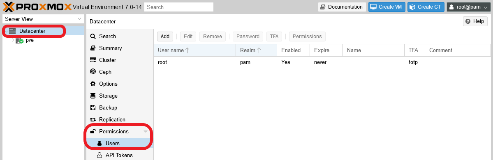
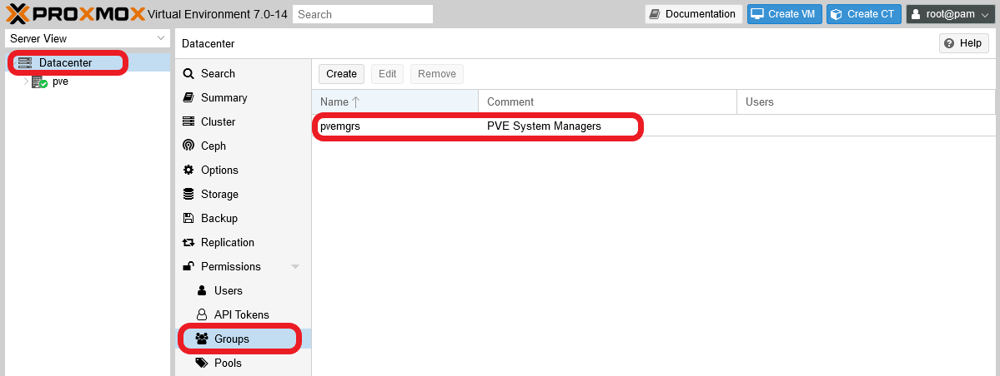
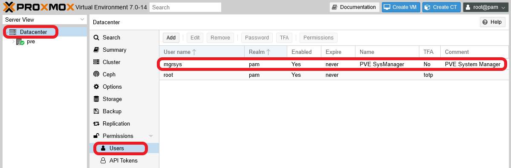
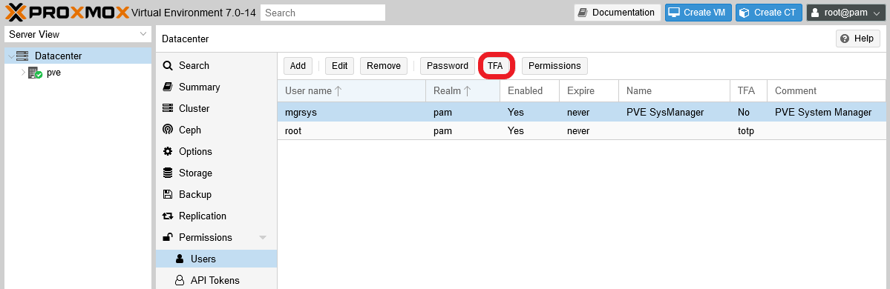
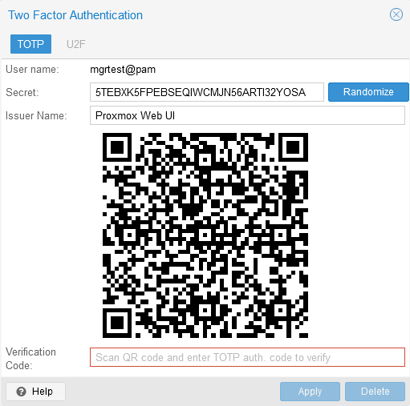
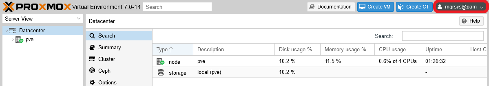
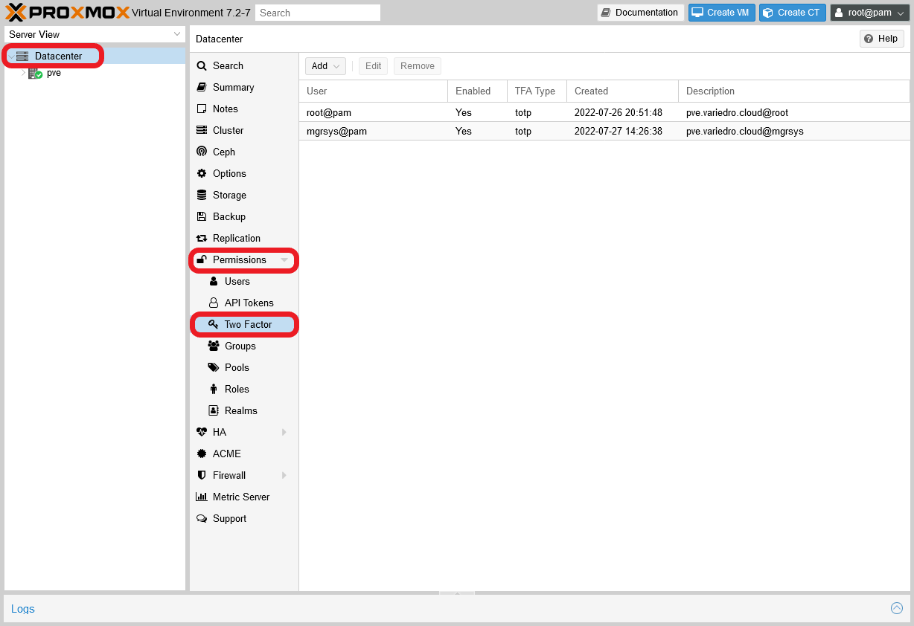

# G008 - Host hardening 02 ~ Alternative administrator user

In the previous guides, you've been using the `root` user to do all the set up in your Proxmox VE system. That's fine for earlier configuration steps, but it's not recommended to keep on using it as your server's everyday administrator user.

Since `root` is **the superuser with all the privileges**, using it directly on any Linux server has always the potential for creating all sorts of problems (security related or of any other kind). To mitigate those problems, the recommended thing to do is to create an alternative administrator user with `sudo` privileges and use it instead of `root`.

## Understanding the Proxmox VE user management and the realms

Proxmox VE can work with up to five authentication realms: pam, Proxmox VE authentication server, LDAP, Microsoft Active Directory and OpenId Connect. The last four can be considered external and shared among all the nodes of a PVE cluster. But what about the remaining `pam`?

The `pam`, which stands for **Pluggable Authentication Module**, is the standard authentication system for any Linux distribution, including the Debian 11 running your standalone PVE node. But this realm is **strictly local**, bounded just to the node itself, and **not shared** in any way with any other computer.

Is in the `pam` realm of the PVE node where the `root` user exists, like in any other Linux distribution. But this user is also registered within the user management of your Proxmox VE, and it's the only user you have initially to log in the Proxmox VE web console. This means that the `root` user was created first in the `pam` realm, and then linked to your node's Proxmox VE authentication system by the installation process.

At this point, let me show you how to find the user management screen in your PVE's web console. It's at the `Datacenter` level, as an option called `Users` under `Permissions`.

So, if all the PVE's user management is handled at the `Datacenter` level, does that mean that PVE takes care somehow of syncing the `pam` realm among the nodes of a cluster (in case we were working on one)? Short answer, _it's not documented_. From what I've seen, if you create a user directly from the PVE's user management and assign it to the `pam` realm, **it won't create the user at the Debian OS level**.

I infer that creating a user in the `pam` realm in Proxmox VE always implies two basic steps:

1. **Creating the user** directly in the node at the Debian OS level.
2. **Enabling it in the Proxmox VE user management**, either through the web console or by the shell commands PVE also provides for this and other administrative tasks.

With just one standalone node, creating one or two very particular system users is no big deal. In a cluster, you would need to automate this with some shell scripting or other tools.

## Creating a new system administrator user for a Proxmox VE node

Here you're about to create an alternative, and a bit safer, administrator user for your system to use instead of `root`.

In a normal Linux-based server, you would just create a standard user and then give it `sudo` privileges. But such user also has to hold a certain role and concrete privileges within your Proxmox VE platform, which are security concerns at the PVE's `Datacenter` level, not of any particular node.

So, you'll need to perform a number of steps to create a new administrative user in your Proxmox VE's `pam` realm.

### _Creating the user with sudo privileges in Debian_

1. Open a terminal as `root`. Then create a user called, for instance, `mgrsys` with the `adduser` command.

    ~~~bash
    $ adduser mgrsys
    ~~~

    > **BEWARE!**  
    > Use a criteria for naming your users, and make those names personalized. This way you'll have a better chance to detect any strange behavior related to your users in the system's logs. For instance, you could follow a pattern like `[role][initials]` or `[role][name][surname]`.

    The command will ask you the password for the new user first, and then a few informative details like the user's full name. The output will be something like this.

    ~~~bash
    Adding user `mgrsys' ...
    Adding new group `mgrsys' (1000) ...
    Adding new user `mgrsys' (1000) with group `mgrsys' ...
    Creating home directory `/home/mgrsys' ...
    Copying files from `/etc/skel' ...
    New password:
    Retype new password:
    passwd: password updated successfully
    Changing the user information for mgrsys
    Enter the new value, or press ENTER for the default
            Full Name []: PVE System Manager
            Room Number []:
            Work Phone []:
            Home Phone []:
            Other []:
    Is the information correct? [Y/n]
    ~~~

2. Add the new user to the `sudo` group.

    > **BEWARE!**  
    > Before you proceed with this step, be sure of having the `sudo` package installed in your PVE node:  
    `apt install sudo`

    ~~~bash
    $ adduser mgrsys sudo
    Adding user `mgrsys' to group `sudo' ...
    Adding user mgrsys to group sudo
    Done.
    ~~~

### _Assigning a TOTP code to the new user_

1. Switch to your new user by using the `su` command, and go to its `$HOME` directory.

    ~~~bash
    $ su mgrsys
    $ cd
    ~~~

2. Create a TOTP token for the new user with the `google-authenticator` program. Use the automated method with a command like the following:

    ~~~bash
    $ google-authenticator -t -d -f -r 3 -R 30 -w 3 -Q UTF8 -i pve.deimos.cloud -l mgrsys@pam
    ~~~

    > **BEWARE!**  
    > Notice how the label (`-l`) has an `@pam` suffix after the username, like it is with `root`.

3. Copy all the codes given by the `google-authenticator` command in a safe location, like a password manager.

### _Testing `sudo` with the new administrator user_

After you've checked that your new administrator user can connect through ssh, make a simple test to see if this user has sudo privileges. For instance, you could try to execute a `ls` with `sudo`.

    ~~~bash
    $ sudo ls -al

    We trust you have received the usual lecture from the local System
    Administrator. It usually boils down to these three things:

        #1) Respect the privacy of others.
        #2) Think before you type.
        #3) With great power comes great responsibility.

    [sudo] password for mgrsys:
    ~~~

If `sudo` is working for your new user, the first time you use the command it'll show you a warning about the responsibility of using it and then it'll require the user's password.

### _Creating a system administrator group in Proxmox VE_

The most convenient way of assigning roles and privileges to users within the Proxmox VE platform is by putting them in groups that already have the required roles and privileges. So, let's create a PVE platform managers group.

1. Open a shell terminal as `root` and create the group with the following PVE command.

    ~~~bash
    $ pveum groupadd pvemgrs -comment "PVE System Managers"
    ~~~

    > **BEWARE!**  
    > Be careful of not using a name too similar or equal to the ones already used for **existing groups in the underlying Debian OS**, like `sys` or `adm`, to avoid possible confusions.  
    > You can check the existing Debian groups in the `/etc/group` file.

2. Assign the Administrator role to the newly created group.

    ~~~bash
    $ pveum aclmod / -group pvemgrs -role Administrator
    ~~~

3. Check the groups creation by opening the file `/etc/pve/user.cfg`. In it, you should see a content like the following.

    ~~~bash
    user:root@pam:1:0:::invalid@email.com::x!oath:

    group:pvemgrs::PVE Managers:

    acl:1:/:@pvemgrs:Administrator:
    ~~~

    The file's content can be explain as follows:
    - The `user:` line describes the PVE's `root` user.
    - The `group:` line corresponds to your newly created system administrator group.
    - The `acl:` line assigns the PVE role `Administrator` to your new group.

This new group can also be seen in the user management section of your PVE's web console. Click on `Datacenter` and unfold the `Permissions` list, then click on `Groups`.

> **BEWARE!**  
> This group you've just created is just a Proxmox VE one, **it's not part of the underlying Debian groups**. Thus, you won't see it listed in the `/etc/group` file.

### _Enabling the new administrator user in Proxmox VE_

The `mgrsys` user you created earlier exists within the Debian 11 OS, but not in the Proxmox VE platform yet. To do so, you have to create the same user within the PVE platform too.

1. To create the user in just one line, type a command line (as `root`) like the following.

    ~~~bash
    $ pveum user add mgrsys@pam -comment "PVE System Manager" -email "mgrsys@replace.this" -firstname "PVE" -lastname "SysManager" -groups pvemgrs
    ~~~

    The command line above has created the `mgrsys` user within the `pam` realm (`@pam`) and also included it in the `pvemgrs` group. You can check this on the PVE web console.

    

2. Since the pam realm has TFA enforced, the user needs their TOTP enabled too. This can be done directly from the user management screen, by selecting the user and clicking on the `TFA` button above.

    

3. Fill the form like it was done for the root user in the previous [**G007** guide](G007%20-%20Host%20hardening%2001%20~%20TFA%20authentication.md), reusing the same TOTP secret generated before for this new user with the `google-authenticator` program.

    

    > **BEWARE!**  
    > Remember that TOTP codes must not be shared at all!

4. With the TOTP set up correctly, the new user can try to log in the Proxmox VE web console.

    > **BEWARE!**  
    > The password is **the one** set up at the Debian OS level with the `adduser` command.

    

    The new `mgrsys` user will have access to the same tabs and options as `root`, thanks of being part of a PVE group with full administrative rights.

### _TFA has its own section in Proxmox VE **v7.2-z**_

There's no `TFA` button any more in the `Permissions > Users` section at the `Datacenter` level of the `v7.2-z` releases (and maybe also in the previous `v7.1-z` ones). Instead, you can manage all two factor tokens from its own separate section under `Permissions > Two Factor`.

## Relevant system paths

### _Directories_

- `$HOME`
- `/etc/pve`
- `/etc/pve/priv`

### _Files_

- `$HOME/.google_authenticator`
- `/etc/pve/user.cfg`
- `/etc/pve/priv/tfa.cfg`
- `/etc/pve/priv/shadow.cfg`

## References

### _Proxmox VE user management_

- [Proxmox VE, admin guide. User Management](https://pve.proxmox.com/pve-docs/pve-admin-guide.html#chapter_user_management)
- [Proxmox VE, admin guide. Authentication Realms](https://pve.proxmox.com/pve-docs/pve-admin-guide.html#pveum_authentication_realms)
- [Proxmox VE, admin guide. User Management, command line tool](https://pve.proxmox.com/pve-docs/pve-admin-guide.html#_command_line_tool)
- [Proxmox VE, admin guide. User Management, real world examples](https://pve.proxmox.com/pve-docs/pve-admin-guide.html#_real_world_examples)

### _PAM_

- [PAM, Pluggable Authentication Module](https://en.wikipedia.org/wiki/Pluggable_authentication_module)

## Navigation

[<< Previous (**G007. Host hardening 01**)](G007%20-%20Host%20hardening%2001%20~%20TFA%20authentication.md) | [+Table Of Contents+](G000%20-%20Table%20Of%20Contents.md) | [Next (**G009. Host hardening 03**) >>](G009%20-%20Host%20hardening%2003%20~%20SSH%20key%20pairs%20and%20sshd%20service%20configuration.md)
