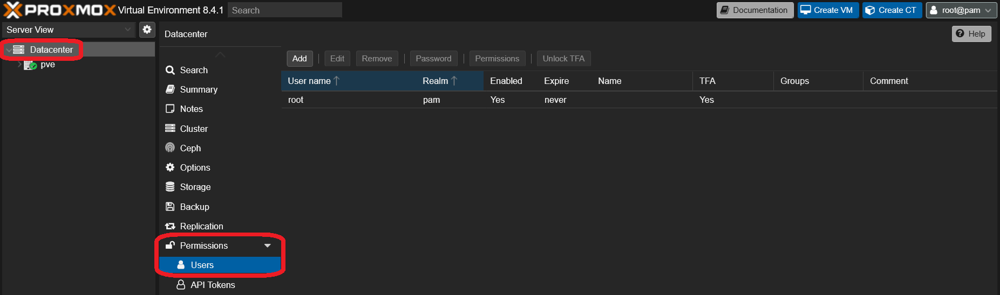
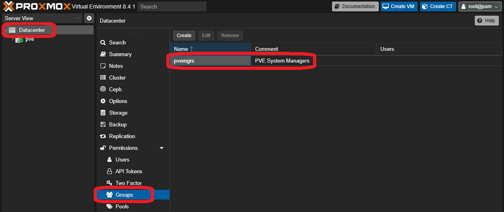
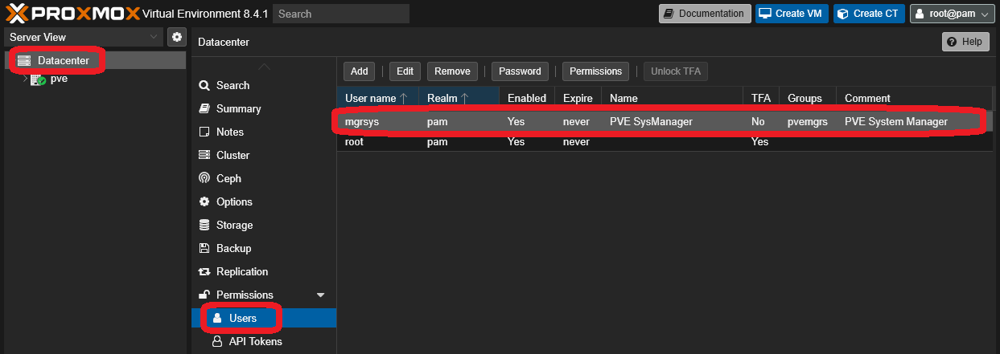
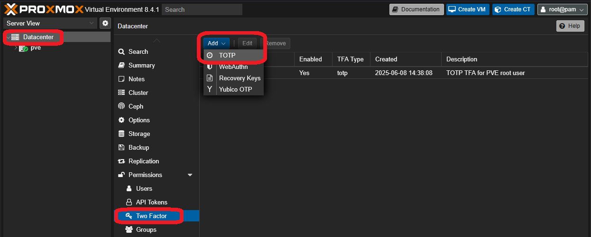
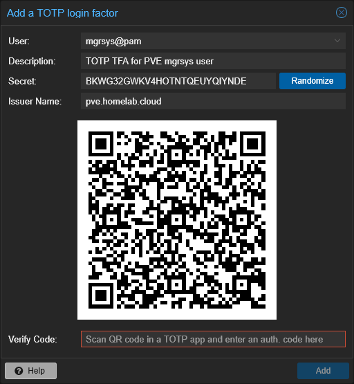
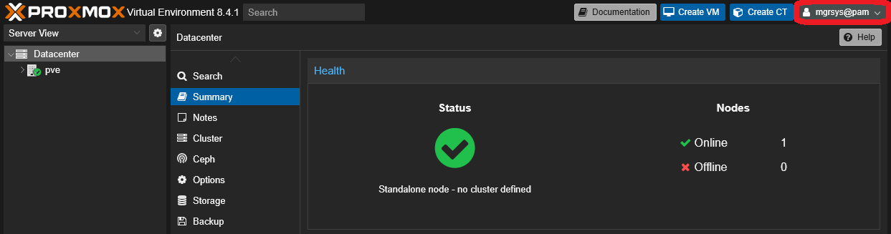

# G008 - Host hardening 02 ~ Alternative administrator user

- [Avoid using the root user](#avoid-using-the-root-user)
- [Understanding the Proxmox VE user management and the realms](#understanding-the-proxmox-ve-user-management-and-the-realms)
  - [Always create your `pam` users at the OS level first](#always-create-your-pam-users-at-the-os-level-first)
- [Creating a new system administrator user for a Proxmox VE node](#creating-a-new-system-administrator-user-for-a-proxmox-ve-node)
  - [Creating the user with sudo privileges in Debian](#creating-the-user-with-sudo-privileges-in-debian)
  - [Assigning a TOTP code to the new user](#assigning-a-totp-code-to-the-new-user)
  - [Testing `sudo` with the new administrator user](#testing-sudo-with-the-new-administrator-user)
  - [Creating a system administrator group in Proxmox VE](#creating-a-system-administrator-group-in-proxmox-ve)
  - [Enabling the new administrator user in Proxmox VE](#enabling-the-new-administrator-user-in-proxmox-ve)
- [Relevant system paths](#relevant-system-paths)
  - [Directories](#directories)
  - [Files](#files)
- [References](#references)
  - [Proxmox](#proxmox)
  - [Pluggable Authentication Module (PAM)](#pluggable-authentication-module-pam)
- [Navigation](#navigation)

## Avoid using the root user

In the previous chapters, you have been using the `root` user to work in your Proxmox VE system's setup. That is fine for earlier configuration steps, but it is absolutely not recommended to keep on using it as your server's everyday administrator user.

Since `root` is **the superuser with all the privileges**, using it directly on any Linux server risks inducing all sorts of security or other issues. To mitigate those potential problems, is better to create an alternative administrator user with `sudo` privileges and use it instead of `root`.

## Understanding the Proxmox VE user management and the realms

Proxmox VE can work with up to five authentication realms: pam, Proxmox VE authentication server, LDAP, Microsoft Active Directory and OpenID Connect. The last four can be considered external and shared among all the nodes of a PVE cluster. But what about the remaining `pam`?

The `pam`, which stands for [**Pluggable Authentication Module**](https://en.wikipedia.org/wiki/Pluggable_Authentication_Module), is the standard authentication system for any Linux distribution, including the Debian one running your standalone PVE node. But **this `pam` realm is strictly local**, bounded just to the node itself, and **not shared** in any way with any other computer.

It is in the `pam` realm of the Proxmox VE node where the `root` user exists, like in any other Linux-based system. This same user is also registered within the user management of your Proxmox VE, and it is the only user you have initially to log in the Proxmox VE web console. This means that the `root` user was created first in the `pam` realm, and then linked to your node's Proxmox VE authentication system by the installation process.

Next, learn how you can find the user management screen in your PVE's web console. It is available at the `Datacenter` level, as an option called `Users` under `Permissions`:

So, if all the PVE's user management is handled at the `Datacenter` level, does that mean that Proxmox VE takes care somehow of syncing the `pam` realm among the nodes of a cluster (in case you were working on one)? Short answer, no. Changes in the `palm` realm only apply to the node you logged in. Also, if you create a user directly from the PVE's `Users` page and assign it to the `pam` realm, **it will not create the user at the Debian OS level**.

### Always create your `pam` users at the OS level first

In conclusion, creating a `pam` realm's user in Proxmox VE always implies two basic steps:

1. **Creating the user** directly in the node at the Debian OS level.

2. **Enabling it in the Proxmox VE user management**, either through the web console or by the shell commands Proxmox VE also provides for this and other administrative tasks.

> [!NOTE]
> **With just one standalone node, creating one or two very particular system users is no big deal**\
> However, in a cluster you would need to automate this via shell scripting or some other tools.

## Creating a new system administrator user for a Proxmox VE node

Here you are about to create an alternative, and a bit safer, administrator user for your system to use instead of `root`.

In a normal Linux-based server, you would just create a standard user and then give it `sudo` privileges. But such user also has to hold a certain role and concrete privileges within your Proxmox VE platform. Those privileges are security concerns at the PVE's `Datacenter` level, not just of any particular PVE node.

Therefore, you need to perform a number of steps to create a new administrative user in your Proxmox VE's `pam` realm.

### Creating the user with sudo privileges in Debian

Open a remote terminal as `root` connected to your Proxmox VE server, and then:

1. Create a user called, for instance, `mgrsys` with the `adduser` command:

    ~~~sh
    $ adduser mgrsys
    ~~~

    > [!IMPORTANT]
    > **Stick to a naming criteria for your users!**\
    > Use a criteria for naming your users, and make those names individualized. This way you have a better chance to detect any strange behavior related to your users in the system's logs. For instance, you could follow a pattern like `[role][initials]` or `[role][name][surname]`.

    The `adduser` command first asks the password twice for the new user, and then a few informative details like the user's full name. The whole output should be something like this:

    ~~~sh
    New password:
    Retype new password:
    passwd: password updated successfully
    Changing the user information for mgrsys
    Enter the new value, or press ENTER for the default
            Full Name []: PVE system's manager
            Room Number []:
            Work Phone []:
            Home Phone []:
            Other []:
    Is the information correct? [Y/n]
    ~~~

2. Add the new user to the `sudo` group:

    > [!WARNING]
    > **Ensure you have `sudo` installed in your PVE node**\
    > Before you proceed with this step, be sure of having the `sudo` package installed in your PVE node:
    >
    > ~~~sh
    > $ apt install sudo
    > ~~~

    ~~~sh
    $ adduser mgrsys sudo
    Adding user `mgrsys' to group `sudo' ...
    Adding user mgrsys to group sudo
    Done.
    ~~~

### Assigning a TOTP code to the new user

Remaining in the same remote terminal session you opened with `root` on your Proxmox VE server:

1. Switch to your new user by using the `su` command, and go to its `$HOME` directory:

    ~~~sh
    $ su mgrsys
    $ cd
    ~~~

2. Create a TOTP token for the new user with the `google-authenticator` program. Use the automated method with a command like the following:

    ~~~sh
    $ google-authenticator -t -d -f -r 3 -R 30 -w 3 -Q utf8 -i pve.homelab.cloud -l mgrsys@pam
    ~~~

    > [!NOTE]
    > **Do not forget the `@pam` suffix in your TOTP token's label!**\
    > Notice how the label (`-l`) has an `@pam` suffix after the username, like it is with `root`.

3. Copy all the codes given by the `google-authenticator` command in a safe location, like a password manager.

### Testing `sudo` with the new administrator user

After you have checked that your new administrator user can connect through ssh, make a simple test to see if this user has `sudo` privileges. For instance, you could try to execute a `ls` with `sudo`.

~~~sh
$ sudo ls -al
~~~

### Creating a system administrator group in Proxmox VE

The most convenient way of assigning roles and privileges to users within the Proxmox VE platform is by putting them in groups that already have the required roles and privileges. Hence, create a PVE platform managers group:

1. Open a shell terminal as `root` and create the group with the following PVE command:

    ~~~sh
    $ pveum groupadd pvemgrs -comment "PVE system's managers"
    ~~~

    > [!NOTE]
    > **Do not set confusing names to your groups**\
    > Avoid using a name too similar or equal to the ones already used for **existing groups in the underlying Debian OS**, like `sys` or `adm`, to avoid possible confusions.
    >
    > You can check the existing Debian groups in the `/etc/group` file.

2. Assign the Administrator role to the newly created group:

    ~~~sh
    $ pveum aclmod / -group pvemgrs -role Administrator
    ~~~

3. Check the group creation by opening the file `/etc/pve/user.cfg`. In it, you should see something like this:

    ~~~sh
    user:root@pam:1:0:::pveroot@homelab.cloud::x:

    group:pvemgrs::PVE system's managers:

    acl:1:/:@pvemgrs:Administrator:
    ~~~

    The file's content can be explain as follows:

    - The `user:` line describes the PVE's `root` user.
    - The `group:` line corresponds to your newly created system administrator group.
    - The `acl:` line assigns the PVE role `Administrator` to your new group.

    This new group can also be seen in the user management section of your PVE node's web console. Click on `Datacenter` and unfold the `Permissions` list, then click on `Groups`.

    

    > [!IMPORTANT]
    > **The new group you've just created is just a Proxmox VE one**\
    > The `pvemgrs` **is not part of the underlying Debian's groups**. Therefore, it is not listed in the `/etc/group` file.

### Enabling the new administrator user in Proxmox VE

The `mgrsys` user you created earlier exists within the Debian OS, but not in the Proxmox VE platform yet. To do so, you have to create the same user within the PVE platform too:

1. To create the user in just one line, type a command line (as `root`) like the following:

    > [!IMPORTANT]
    > **Specify an email useful to you in the command below**\
    > Do not forget replacing the `-email` example value shown here with the one you want!

    ~~~sh
    $ pveum user add mgrsys@pam -comment "PVE system's manager" -email "mgrsys@homelab.cloud" -firstname "PVE" -lastname "SysManager" -groups pvemgrs
    ~~~

    The command line above creates the `mgrsys` user within the PVE node's `pam` realm (`@pam`), while also including it in the `pvemgrs` group. You can check this on the PVE web console:

    

2. Since the PVE's pam realm has the two factor authentication enforced, the `mgrsys` user needs its TOTP enabled too. Go then to the `Datacenter\Permissions\Two Factor` page and `Add` a new `TOTP` entry:

    

3. Fill the TFA form for the `mgrsys` user reusing the same TOTP details and secret previously set with the `google-authenticator` program:

    

    > [!WARNING]
    > **Be always careful with your secret codes, even expendable ones**\
    > Remember to never share TOTP codes at all!

4. With the TOTP set up correctly, you can try to log with your new `mgrsys` user in the Proxmox VE web console:

    > [!IMPORTANT]
    > The `mgrsys` user's password is the one specified at the Debian OS level with the `adduser` command.

    

    The new `mgrsys` user has access to the same tabs and options as `root`, thanks to being part of a PVE group with full administrative rights.

## Relevant system paths

### Directories

- `$HOME`
- `/etc/pve`
- `/etc/pve/priv`

### Files

- `$HOME/.google_authenticator`
- `/etc/pve/user.cfg`
- `/etc/pve/priv/tfa.cfg`
- `/etc/pve/priv/shadow.cfg`

## References

### [Proxmox](https://www.proxmox.com/en/)

- [Proxmox VE Administration Guide](https://pve.proxmox.com/pve-docs/pve-admin-guide.html)
  - [User Management](https://pve.proxmox.com/pve-docs/pve-admin-guide.html#user_mgmt)
    - [Authentication Realms](https://pve.proxmox.com/pve-docs/pve-admin-guide.html#pveum_authentication_realms)
    - [Command-line Tool](https://pve.proxmox.com/pve-docs/pve-admin-guide.html#_command_line_tool)
    - [Real World Examples](https://pve.proxmox.com/pve-docs/pve-admin-guide.html#_real_world_examples)

### Pluggable Authentication Module (PAM)

- [Wikipedia. Pluggable Authentication Module (PAM)](https://en.wikipedia.org/wiki/Pluggable_authentication_module)

## Navigation

[<< Previous (**G007. Host hardening 01**)](G007%20-%20Host%20hardening%2001%20~%20TFA%20authentication.md) | [+Table Of Contents+](G000%20-%20Table%20Of%20Contents.md) | [Next (**G009. Host hardening 03**) >>](G009%20-%20Host%20hardening%2003%20~%20SSH%20key%20pairs%20and%20sshd%20service%20configuration.md)
