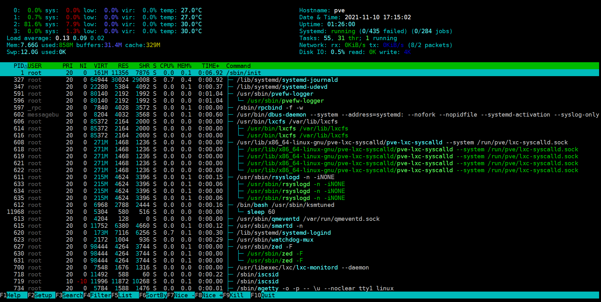
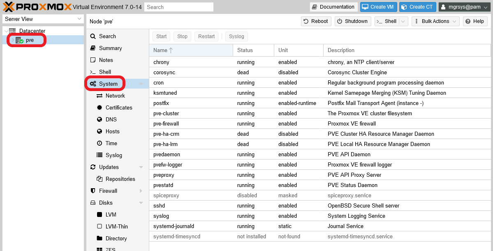

# G011 - Host hardening 05 ~ Proxmox VE services

Your standalone Proxmox VE node comes with a number of services running by default. Having in mind the target system's particularities assumed in this guide series, there's some reconfiguring or disabling of services that you can do to harden your Proxmox VE platform further.

The basic idea is to reduce the exposition surface of your platform, and also save some RAM and CPU, by disabling unneeded Proxmox VE related processes.

## Checking currently running services

To see what services are running in your system, you can do any of the following.

- Listing the contents of the `/etc/init.d/` folder. You should get an output like the following.

    ~~~bash
    $ ls -al /etc/init.d/
    total 144
    drwxr-xr-x  2 root root 4096 Nov 10 16:41 .
    drwxr-xr-x 91 root root 4096 Nov 10 16:41 ..
    -rwxr-xr-x  1 root root 3740 Apr  3  2021 apparmor
    -rwxr-xr-x  1 root root 1897 May 13 16:51 chrony
    -rwxr-xr-x  1 root root 1232 Jul 23 19:05 console-setup.sh
    -rwxr-xr-x  1 root root 3059 Feb 22  2021 cron
    -rwxr-xr-x  1 root root 3152 Feb 21  2021 dbus
    -rwxr-xr-x  1 root root 7033 Jul 12 06:52 fail2ban
    -rwxr-xr-x  1 root root 1748 Jul 28 21:09 hwclock.sh
    -rwxr-xr-x  1 root root 1503 Apr 28  2021 iscsid
    -rwxr-xr-x  1 root root 1479 Oct 29  2018 keyboard-setup.sh
    -rwxr-xr-x  1 root root 2044 Jan  7  2021 kmod
    -rwxr-xr-x  1 root root  883 May 17  2016 lm-sensors
    -rwxr-xr-x  1 root root  695 Feb 22  2021 lvm2
    -rwxr-xr-x  1 root root  586 Feb 22  2021 lvm2-lvmpolld
    -rwxr-xr-x  1 root root 5658 Jun 28 09:15 nfs-common
    -rwxr-xr-x  1 root root 5329 Oct 15  2020 nut-client
    -rwxr-xr-x  1 root root 5316 Oct 15  2020 nut-server
    -rwxr-xr-x  1 root root 2433 Apr 28  2021 open-iscsi
    -rwxr-xr-x  1 root root 3368 Aug  2  2020 postfix
    -rwxr-xr-x  1 root root  924 Apr  6  2021 procps
    -rwxr-xr-x  1 root root 2507 Jul 13  2020 rpcbind
    -rwxr-xr-x  1 root root 5246 Sep  1  2019 rrdcached
    -rwxr-xr-x  1 root root 4417 Feb  3  2021 rsync
    -rwxr-xr-x  1 root root 2864 Feb 17  2021 rsyslog
    -rwxr-xr-x  1 root root 3088 Oct 10  2019 smartmontools
    -rwxr-xr-x  1 root root 4056 Mar 13  2021 ssh
    -rwxr-xr-x  1 root root 1030 Feb 27  2021 sudo
    -rwxr-xr-x  1 root root 6871 Jul 13 19:28 udev
    lrwxrwxrwx  1 root root   10 Oct 15  2020 ups-monitor -> nut-client
    ~~~

    The problem is that not all running processes or services have an executable file in this folder, so this listing gives you a very incomplete reference.

- A much more detailed listing is the one offered by the following `systemctl` command.

    ~~~bash
    $ sudo systemctl list-unit-files
    ~~~

    This will give you an interactive read-only long and exhaustive list of processes and services.

    ~~~bash
    UNIT FILE                              STATE           VENDOR PRESET
    proc-sys-fs-binfmt_misc.automount      static          -
    -.mount                                generated       -
    boot-efi.mount                         generated       -
    dev-hugepages.mount                    static          -
    dev-mqueue.mount                       static          -
    proc-fs-nfsd.mount                     static          -
    proc-sys-fs-binfmt_misc.mount          disabled        disabled
    run-rpc_pipefs.mount                   static          -
    sys-fs-fuse-connections.mount          static          -
    sys-kernel-config.mount                static          -
    sys-kernel-debug.mount                 static          -
    sys-kernel-tracing.mount               static          -
    systemd-ask-password-console.path      static          -
    systemd-ask-password-wall.path         static          -
    session-7.scope                        transient       -
    apparmor.service                       enabled         enabled
    apt-daily-upgrade.service              static          -
    ...
    ~~~

- Another way of listing all the running services with `systemctl` is the following.

    ~~~bash
    $ sudo systemctl status
    ~~~

    The command will output an interactive read-only list like the following excerpt.

    ~~~bash
    ● pve
        State: running
         Jobs: 0 queued
       Failed: 0 units
        Since: Wed 2021-11-10 15:49:06 CET; 1h 22min ago
       CGroup: /
               ├─715 bpfilter_umh
               ├─user.slice
               │ └─user-1000.slice
               │   ├─user@1000.service …
               │   │ └─init.scope
               │   │   ├─7388 /lib/systemd/systemd --user
               │   │   └─7389 (sd-pam)
               │   └─session-7.scope
               │     ├─ 7384 sshd: mgrsys [priv]
               │     ├─ 7411 sshd: mgrsys@pts/0
               │     ├─ 7412 -bash
               │     ├─11656 sudo systemctl status
               │     ├─11657 systemctl status
               │     └─11658 less
               ├─init.scope
               │ └─1 /sbin/init
               └─system.slice
                 ├─fail2ban.service
                 │ └─8660 /usr/bin/python3 /usr/bin/fail2ban-server -xf start
    ...
    ~~~

- Also with `systemctl`, you can see the "units" systemd has currently in memory and their state.

    ~~~bash
    $ sudo systemctl list-units
      UNIT                                                                                                       LOAD   ACTIVE     SUB       DESCRIPTION
      proc-sys-fs-binfmt_misc.automount                                                                          loaded active     waiting   Arbitrary Executable File Formats File System Automount Point
      dev-fuse.device                                                                                            loaded activating tentative /dev/fuse
      sys-devices-pci0000:00-0000:00:13.0-ata1-host0-target0:0:0-0:0:0:0-block-sda-sda1.device                   loaded active     plugged   Samsung_SSD_860_QVO_1TB 1
      sys-devices-pci0000:00-0000:00:13.0-ata1-host0-target0:0:0-0:0:0:0-block-sda-sda2.device                   loaded active     plugged   Samsung_SSD_860_QVO_1TB 2
      sys-devices-pci0000:00-0000:00:13.0-ata1-host0-target0:0:0-0:0:0:0-block-sda-sda3.device                   loaded active     plugged   Samsung_SSD_860_QVO_1TB 3
      sys-devices-pci0000:00-0000:00:13.0-ata1-host0-target0:0:0-0:0:0:0-block-sda-sda4.device                   loaded active     plugged   Samsung_SSD_860_QVO_1TB 4
      sys-devices-pci0000:00-0000:00:13.0-ata1-host0-target0:0:0-0:0:0:0-block-sda.device                        loaded active     plugged   Samsung_SSD_860_QVO_1TB
      sys-devices-pci0000:00-0000:00:13.0-ata2-host1-target1:0:0-1:0:0:0-block-sdb-sdb1.device                   loaded active     plugged   ST1000DM003-9YN162 1
      sys-devices-pci0000:00-0000:00:13.0-ata2-host1-target1:0:0-1:0:0:0-block-sdb.device                        loaded active     plugged   ST1000DM003-9YN162
      sys-devices-pci0000:00-0000:00:14.0-usb2-2\x2d1-2\x2d1:1.0-host2-target2:0:0-2:0:0:0-block-sdc-sdc1.device loaded active     plugged   WDC_WD20EARX-00PASB0 1
      sys-devices-pci0000:00-0000:00:14.0-usb2-2\x2d1-2\x2d1:1.0-host2-target2:0:0-2:0:0:0-block-sdc.device      loaded active     plugged   WDC_WD20EARX-00PASB0
      sys-devices-pci0000:00-0000:00:1b.0-sound-card0-controlC0.device                                           loaded active     plugged   /sys/devices/pci0000:00/0000:00:1b.0/sound/card0/controlC0
      sys-devices-pci0000:00-0000:00:1c.2-0000:02:00.0-net-enp2s0.device                                         loaded active     plugged   RTL810xE PCI Express Fast Ethernet controller
      sys-devices-pci0000:00-0000:00:1c.3-0000:03:00.0-net-wlp3s0.device                                         loaded active     plugged   RTL8723BE PCIe Wireless Network Adapter
      sys-devices-platform-serial8250-tty-ttyS1.device                                                           loaded active     plugged   /sys/devices/platform/serial8250/tty/ttyS1
      sys-devices-platform-serial8250-tty-ttyS10.device                                                          loaded active     plugged   /sys/devices/platform/serial8250/tty/ttyS10
      sys-devices-platform-serial8250-tty-ttyS11.device                                                          loaded active     plugged   /sys/devices/platform/serial8250/tty/ttyS11
      sys-devices-platform-serial8250-tty-ttyS12.device                                                          loaded active     plugged   /sys/devices/platform/serial8250/tty/ttyS12
    ...
    ~~~

- If you installed it, you can use `htop` to monitor in real time all the services running and the resources usage.

    ~~~bash
    $ htop
    ~~~

    This program offers an interactive text-based interface, that can be configured to look like below.

    

## Configuring the `pveproxy` service

The PVEProxy is the component responsible for the Proxmox WEB interface communication. It's just a specific reverse proxy that gives access to the web console at the 8006 port.

### _Default 8006 port and listening interfaces_

By default, `pveproxy` listens on all your system's network interfaces through the `8006` port. This behavior **cannot be changed in any way**, or is not documented how to do so. Hence you'll need to rely on other techniques, like firewalling or use an extra reverse proxy, to protect the PVE's proxy.

### _Enforcing strong SSL/TLS ciphers_

To make the `pveproxy` use only strong SSL/TLS ciphers when its negotiating TLS connections (to avoid _Man In The Middle_, or _MITM_, attacks), do the following.

1. Open a shell with `mgrsys`, `cd` to `/etc/default/` and create an empty `pveproxy` file.

    ~~~bash
    $ cd /etc/default/
    $ sudo touch pveproxy
    ~~~

2. Add to the `pveproxy` file the following lines.

    ~~~bash
    CIPHERS="ECDHE-ECDSA-AES256-GCM-SHA384:ECDHE-RSA-AES256-GCM-SHA384:ECDHE-ECDSA-CHACHA20-POLY1305:ECDHE-RSA-CHACHA20-POLY1305:ECDHE-ECDSA-AES128-GCM-SHA256:ECDHE-RSA-AES128-GCM-SHA256"
    HONOR_CIPHER_ORDER="1"
    ~~~

3. Save the changes and restart the `pveproxy` service.

    ~~~bash
    $ sudo systemctl restart pveproxy.service
    ~~~

The list in the CIPHERS parameter is derived from the list of supported ciphers you can find [in Cryptcheck](https://cryptcheck.fr/ciphers). The chosen ones are at the top of the list and with a green mark, hinting their strength.

> **BEWARE!**  
> Over time, the ciphers will become outdated or deemed weak. You should check this list or a similar one to update the list of ciphers admitted in your system.

### _Host based access control rules_

You can apply some degree of access control by specifying a list of allowed IP addresses or ranges in the `pveproxy` configuration.

> **BEWARE!**  
> This approach forces you to remember to what program did you apply certain rules. The `sshd` and other services also offer this kind of access control in their configuration, but makes managing all those rules harder.  
It's better if you centralize those rules in the Proxmox VE firewall or putting a similar solution "in front" of all your services.

1. Edit the `pveproxy` file and append to it the following parameters.

    ~~~bash
    DENY_FROM="all"
    ALLOW_FROM="YOUR.PRIVATE.IP.RANGE/24,YOUR.HOME.IP.ADDRESS"
    POLICY="allow"
    ~~~

    For example, you could put in the `ALLOW_FROM` parameter something like the following.

    ~~~bash
    ALLOW_FROM="10.0.0.1-10.0.0.5,192.168.0.0/22"
    ~~~

2. Save the changes and restart the `pveproxy` service.

    ~~~bash
    $ sudo systemctl restart pveproxy.service
    ~~~

## Disabling RPC services

Since we're not using NFS in our standalone node, here you'll see how to disable all of its related services or daemons.

1. Open a shell with your `mgrsys` user, and prevent with `systemctl` the `rpcbind` services from starting up when the system boots up.

    ~~~bash
    $ sudo systemctl disable --now rpcbind.target rpcbind.socket rpcbind.service
    ~~~

    The command will return an output like below.

    ~~~bash
    Synchronizing state of rpcbind.service with SysV service script with /lib/systemd/systemd-sysv-install.
    Executing: /lib/systemd/systemd-sysv-install disable rpcbind
    Removed /etc/systemd/system/multi-user.target.wants/rpcbind.service.
    Removed /etc/systemd/system/sockets.target.wants/rpcbind.socket.
    ~~~

2. `cd` to `/etc/defaults/` and make a backup of the `nfs-common` file.

    ~~~bash
    $ cd /etc/defaults
    $ sudo cp nfs-common nfs-common.orig
    ~~~

    Then, edit `nfs-common` and set its parameters as follows.

    ~~~bash
    # If you do not set values for the NEED_ options, they will be attempted
    # autodetected; this should be sufficient for most people. Valid alternatives
    # for the NEED_ options are "yes" and "no".

    # Do you want to start the statd daemon? It is not needed for NFSv4.
    NEED_STATD=no

    # Options for rpc.statd.
    #   Should rpc.statd listen on a specific port? This is especially useful
    #   when you have a port-based firewall. To use a fixed port, set this
    #   this variable to a statd argument like: "--port 4000 --outgoing-port 4001".
    #   For more information, see rpc.statd(8) or http://wiki.debian.org/SecuringNFS
    STATDOPTS=

    # Do you want to start the idmapd daemon? It is only needed for NFSv4.
    NEED_IDMAPD=no

    # Do you want to start the gssd daemon? It is required for Kerberos mounts.
    NEED_GSSD=no
    ~~~

    Notice that I've set only the `NEED_` parameters as `no`, disabling certain daemons that won't be used in the setup explained in this guide series.

3. There's also a unit loaded in systemd which offers nfs client services. Let's disable it.

    ~~~bash
    $ sudo systemctl disable --now nfs-client.target
    ~~~

4. Reboot your system.

    ~~~bash
    $ sudo reboot
    ~~~

5. Finally, check what sockets are currently listening in your system.

    ~~~bash
    $ sudo ss -atlnup
    ~~~

    This will print you an output like below.

    ~~~bash
    Netid              State               Recv-Q              Send-Q                             Local Address:Port                             Peer Address:Port              Process
    udp                UNCONN              0                   0                                      127.0.0.1:323                                   0.0.0.0:*                  users:(("chronyd",pid=739,fd=5))
    udp                UNCONN              0                   0                                          [::1]:323                                      [::]:*                  users:(("chronyd",pid=739,fd=6))
    tcp                LISTEN              0                   16                                     127.0.0.1:3493                                  0.0.0.0:*                  users:(("upsd",pid=827,fd=4))
    tcp                LISTEN              0                   4096                                   127.0.0.1:85                                    0.0.0.0:*                  users:(("pvedaemon worke",pid=965,fd=6),("pvedaemon worke",pid=964,fd=6),("pvedaemon worke",pid=963,fd=6),("pvedaemon",pid=962,fd=6))
    tcp                LISTEN              0                   128                                192.168.1.107:22                                    0.0.0.0:*                  users:(("sshd",pid=727,fd=3))
    tcp                LISTEN              0                   100                                    127.0.0.1:25                                    0.0.0.0:*                  users:(("master",pid=923,fd=13))
    tcp                LISTEN              0                   4096                                           *:8006                                        *:*                  users:(("pveproxy worker",pid=979,fd=6),("pveproxy worker",pid=978,fd=6),("pveproxy worker",pid=977,fd=6),("pveproxy",pid=976,fd=6))
    tcp                LISTEN              0                   4096                                           *:3128                                        *:*                  users:(("spiceproxy work",pid=985,fd=6),("spiceproxy",pid=984,fd=6))
    tcp                LISTEN              0                   100                                        [::1]:25                                       [::]:*                  users:(("master",pid=923,fd=14))
    ~~~

    The nfs service use several ports in both TCP and UDP protocols: 111, 1110, 2049, 4045. But, as you can see in the output above, none of them appear as being in use by any active socket.

## Disabling `zfs` and `ceph`

ZFS requires a lot of RAM we cannot afford in such a small server as the one used in this guide series. Ceph, on the other hand, is impossible to use with just one standalone node. So let's disable all their related services.

1. Open a shell with you administrator user, and disable the `zfs` and `ceph` related services so they don't start when the node boots up.

    ~~~bash
    $ sudo systemctl disable --now zfs-mount.service zfs-share.service zfs-volume-wait.service zfs-zed.service zfs-import.target zfs-volumes.target zfs.target ceph-fuse.target ceph.target
    ~~~

    > **BEWARE!**  
    > If you're working on a Proxmox VE `v7.2-z` or later (and maybe also in a previous `v7.1-z` release), you'll have to **mask** the `ceph.target` service instead of disabling it. Otherwise, it'll start running again after a reboot. Mask it with the following command.  
    > `sudo systemctl mask --now ceph.target`

2. Reboot the system.

    ~~~bash
    $ sudo reboot
    ~~~

3. Check with `htop` or `systemctl` that the `zfs` services are not running.

> **BEWARE!**  
> Disabling the `zfs` services **won't remove** the ZFS tab found in the PVE web console at the `pve` node level, under the `Disks` section.  
> Also, Ceph wasn't really installed on your system, something notified by the PVE web console at the `Datacenter > Ceph` section, although Proxmox VE is installed with a couple of Ceph-related services.

## Disabling the SPICE proxy

The `spiceproxy` service allows SPICE clients to connect to virtual machines and containers with graphical environments. Since in this guide series we're not planning to have graphical environments running in our VMs or containers, let's disable this proxy.

1. Open a shell with you administrator user, and mask the `spiceproxy` service.

    ~~~bash
    $ sudo systemctl mask --now spiceproxy
    ~~~

    > **BEWARE!**  
    > The Proxmox VE process called `pve-manager` depends on this `spiceproxy` service somehow, and that forces us to `mask` rather than `disable` it with `systemctl`. If you just `disable` the `spiceproxy`, it will be started by the `pve-manager` (probable behaviour, but not documented).

2. Reboot the system.

    ~~~bash
    $ sudo reboot
    ~~~

3. Check with `htop` or `systemctl` that the `spiceproxy` service is not running.

4. Check with `ss` that there's no `spiceproxy` process with a socket open at the `3128` port.

    ~~~bash
    $ sudo ss -atlnup | grep spiceproxy
    ~~~

    The command above should return no result whatsoever.

> **BEWARE!**  
> The `SPICE` option offered by the PVE web console will still be present in the `Shell` list, although of course you won't be able to connect to the server through that method now.

## Disabling cluster and high availability related services

Since we're working just with a standalone node, doesn't make much sense to have cluster or high availability related services running for nothing.

1. Open a shell with you administrator user, and with the `systemctl` command disable and stop the services as follows.

    ~~~bash
    $ sudo systemctl disable --now pve-ha-crm pve-ha-lrm corosync
    ~~~

2. Reboot the system.

    ~~~bash
    $ sudo reboot
    ~~~

3. Check with `htop` or `systemctl` that the `pve-ha-crm` and `pve-ha-lrm` services are not running. Corosync wasn't running since your node is a standalone one.

> **BEWARE!**  
> Don't disable the **pve-cluster** daemon, [the Proxmox VE documentation explicitly says](https://pve.proxmox.com/wiki/Service_daemons#pve-cluster) that this service is **required** even when not running a cluster.

## Considerations

### _Errors in the `apt upgrade` process_

Disabling or masking PVE related services may provoke errors during the `apt upgrade` process of Proxmox VE packages, as it can happen with the `pve-manager` when `apt` doesn't find the `spiceproxy` daemon available. The update process of some of those PVE packages may expect a certain service to be present or running in the system, and they may try to restart them as part of the update process.

You should expect these error happening anytime you run an update of your system, although your Proxmox VE standalone node should keep on running fine. Any time you end an upgrade process with errors, try the command `sudo apt autoremove` to make `apt` or `dpkg` treat them somehow.

### _View of services running in the Proxmox VE node_

The Proxmox VE web console has a view, at the node level, where you can see the current status of the Proxmox VE-related service units running in your host.

> **BEWARE!**  
> The services shown in this view are only the ones Proxmox VE is directly concerned with. Other services running in your PVE host won't appear here.

## Relevant system paths

### _Directories_

- `/etc/default`

### _Files_

- `/etc/default/nfs-common`
- `/etc/default/nfs-common.orig`
- `/etc/default/pveproxy`

## References

### _Services management in Debian_

- [How to Start, Stop and Restart Services in Debian 10](https://vitux.com/how-to-start-stop-and-restart-services-in-debian-10/)
- [The directory `/etc/default/`](https://www.linuxquestions.org/questions/slackware-14/the-directory-etc-default-723942/)
- [What is the purpose of /etc/default?](https://superuser.com/questions/354944/what-is-the-purpose-of-etc-default)

### _Proxmox hardening and standalone node optimization_

- [Hardening Proxmox, some in one place](https://blog.samuel.domains/blog/security/hardening-proxmox-some-in-one-place)
- [Proxmox Lite](https://www.lowendtalk.com/discussion/165481/proxmox-lite)
- [PROXMOX Standalone or Cluster](https://www.reddit.com/r/Proxmox/comments/i3mupd/proxmox_standalone_or_cluster/)

### _Proxmox VE service daemons_

- [Proxmox VE wiki. Service daemons](https://pve.proxmox.com/wiki/Service_daemons)

### _NFS and RPC_

- [Is it possible to disable rpcbind (port 111) and how to do it?](https://forum.proxmox.com/threads/is-it-possible-to-disable-rpcbind-port-111-and-how-to-do-it.33590/)
- [Is rpcbind needed for an NFS client?
](https://serverfault.com/questions/1015970/is-rpcbind-needed-for-an-nfs-client)
- [What is the purpose of rpcbind service on Linux Systems?](https://www.quora.com/What-is-the-purpose-of-rpcbind-service-on-Linux-Systems)
- [Which ports do I need to open in the firewall to use NFS?](https://serverfault.com/questions/377170/which-ports-do-i-need-to-open-in-the-firewall-to-use-nfs)

### _Default listening behaviour of `pveproxy`_

- [pveproxy LISTEN address](https://forum.proxmox.com/threads/pveproxy-listen-address.75376/).

### _Configuration of SSL/TSL ciphers in `pveproxy`_

- [pveproxy - Disable weak SSL ciphers?](https://forum.proxmox.com/threads/pveproxy-disable-weak-ssl-ciphers.14794/page-3)
- [Supported cipher suites - List of SSL ciphers and it's quality](https://cryptcheck.fr/ciphers)

### _ZFS and Ceph_

- [ZFS on Linux](https://pve.proxmox.com/wiki/ZFS_on_Linux).
- [Deploy Hyper-Converged Ceph Cluster](https://pve.proxmox.com/wiki/Deploy_Hyper-Converged_Ceph_Cluster).

### _SPICE proxy_

- [PVE admin manual. spiceproxy - SPICE Proxy Service](https://pve.proxmox.com/pve-docs/pve-admin-guide.html#_spiceproxy_spice_proxy_service)
- [disable spiceproxy](https://forum.proxmox.com/threads/disable-spiceproxy.36638/)
- [pve-manager and other updates with optional services masked](https://forum.proxmox.com/threads/pve-manager-and-other-updates-with-optional-services-masked.63652/)

## Navigation

[<< Previous (**G010. Host hardening 04**)](G010%20-%20Host%20hardening%2004%20~%20Enabling%20Fail2Ban.md) | [+Table Of Contents+](G000%20-%20Table%20Of%20Contents.md) | [Next (**G012. Host hardening 06**) >>](G012%20-%20Host%20hardening%2006%20~%20Network%20hardening%20with%20sysctl.md)
