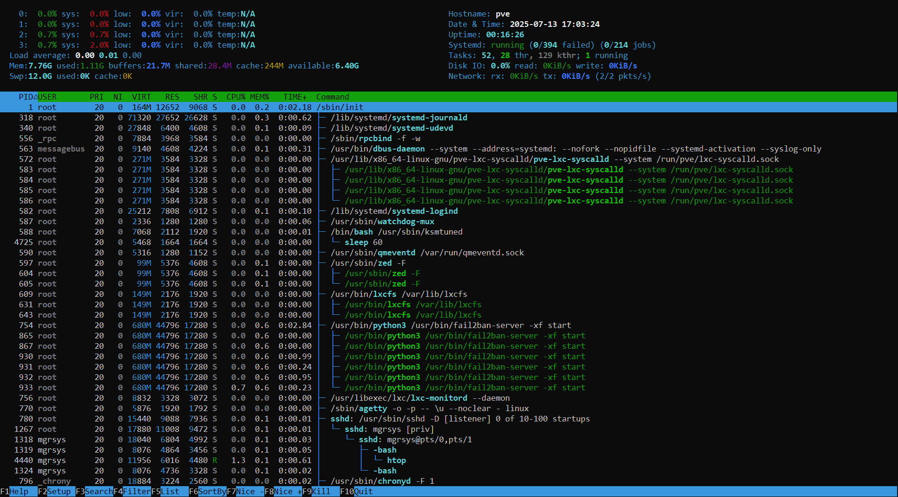
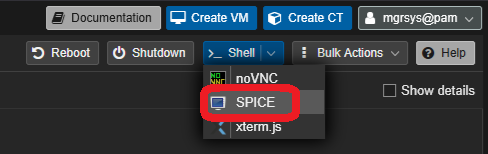
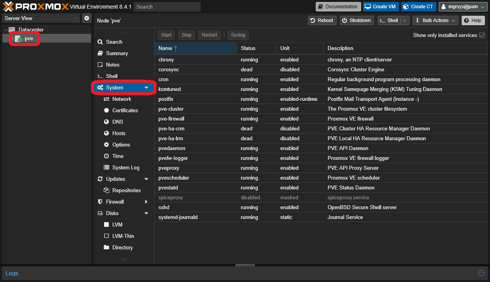

# G011 - Host hardening 05 ~ Proxmox VE services

- [Reduce your Proxmox VE server's exposed surface](#reduce-your-proxmox-ve-servers-exposed-surface)
- [Checking currently running services](#checking-currently-running-services)
  - [Listing the contents of the `/etc/init.d/` folder](#listing-the-contents-of-the-etcinitd-folder)
  - [Listing the unit files with `systemctl`](#listing-the-unit-files-with-systemctl)
  - [Getting the status of running services with `systemctl`](#getting-the-status-of-running-services-with-systemctl)
  - [Checking the systemd units loaded in memory](#checking-the-systemd-units-loaded-in-memory)
  - [Inspecting the running services with `htop`](#inspecting-the-running-services-with-htop)
- [Configuring the `pveproxy` service](#configuring-the-pveproxy-service)
  - [Default 8006 port and listening interfaces](#default-8006-port-and-listening-interfaces)
  - [Enforcing strong SSL/TLS ciphers](#enforcing-strong-ssltls-ciphers)
  - [Host based access control rules](#host-based-access-control-rules)
- [Disabling RPC services](#disabling-rpc-services)
- [Disabling `zfs` and `ceph`](#disabling-zfs-and-ceph)
- [Disabling the SPICE proxy](#disabling-the-spice-proxy)
- [Disabling cluster and high availability related services](#disabling-cluster-and-high-availability-related-services)
- [Considerations](#considerations)
  - [Errors in the `apt upgrade` process](#errors-in-the-apt-upgrade-process)
  - [View of services running in the Proxmox VE node](#view-of-services-running-in-the-proxmox-ve-node)
- [Relevant system paths](#relevant-system-paths)
  - [Directories](#directories)
  - [Files](#files)
- [References](#references)
  - [Proxmox](#proxmox)
  - [Proxmox hardening and standalone node optimization](#proxmox-hardening-and-standalone-node-optimization)
  - [Services management in Debian](#services-management-in-debian)
  - [NFS and RPC](#nfs-and-rpc)
  - [Configuration of SSL/TSL ciphers in `pveproxy`](#configuration-of-ssltsl-ciphers-in-pveproxy)
- [Navigation](#navigation)

## Reduce your Proxmox VE server's exposed surface

Your standalone Proxmox VE node comes with a number of services running by default. Having in mind the particularities assumed in this guide's target system, there is some reconfiguring or disabling of services you can do to harden your Proxmox VE platform even more.

The basic idea is to reduce your platform's surface exposed to possible attacks, while also saving some RAM and CPU in the process, by disabling unneeded processes related to Proxmox VE.

## Checking currently running services

To see what services are running in your system, you can do any of the following.

### Listing the contents of the `/etc/init.d/` folder

Check out the `/etc/init.d/` folder with `ls -al` to get an output like the following:

~~~sh
$ ls -al /etc/init.d/
total 112
drwxr-xr-x   2 root root 4096 Aug 27 16:28 .
drwxr-xr-x 100 root root 4096 Aug 27 16:28 ..
-rwxr-xr-x   1 root root 3740 Jul 21 11:30 apparmor
-rwxr-xr-x   1 root root 1897 Jun  3 17:16 chrony
-rwxr-xr-x   1 root root 1235 Jul 20 06:30 console-setup.sh
-rwxr-xr-x   1 root root 3100 Apr  3 12:18 cron
-rwxr-xr-x   1 root root 3152 Mar  8 20:04 dbus
-rwxr-xr-x   1 root root 7013 May  9 12:19 fail2ban
-rwxr-xr-x   1 root root 1511 Mar  9 18:18 iscsid
-rwxr-xr-x   1 root root 1482 Aug  7  2022 keyboard-setup.sh
-rwxr-xr-x   1 root root  883 Apr 12 14:35 lm-sensors
-rwxr-xr-x   1 root root 5619 Mar 31 20:13 nfs-common
-rwxr-xr-x   1 root root 5329 Jun 27 23:04 nut-client
-rwxr-xr-x   1 root root 5316 Jun 27 23:04 nut-server
-rwxr-xr-x   1 root root 2472 Mar  9 18:18 open-iscsi
-rwxr-xr-x   1 root root 2161 Dec 17  2024 postfix
-rwxr-xr-x   1 root root  959 Jul 30 13:58 procps
-rwxr-xr-x   1 root root 2529 Mar 18 01:43 rpcbind
-rwxr-xr-x   1 root root 4417 Jul 26 11:26 rsync
-rwxr-xr-x   1 root root 3088 Oct 10  2019 smartmontools
-rwxr-xr-x   1 root root 4060 Aug  1 17:02 ssh
-rwxr-xr-x   1 root root 1161 Jun 30 07:55 sudo
lrwxrwxrwx   1 root root   10 Jun 27 23:04 ups-monitor -> nut-client
-rwxr-xr-x   1 root root 1221 May  4 19:39 wtmpdb-update-boot
~~~

The problem with this approach is that not all running processes or services have an executable file in this folder, so this listing gives you a very incomplete reference.

### Listing the unit files with `systemctl`

A much more detailed listing is the one offered by this `systemctl` command:

~~~sh
$ sudo systemctl list-unit-files
~~~

This command will give you a long and exhaustive interactive read-only list of processes and services:

~~~sh
UNIT FILE                                    STATE           PRESET
efi.automount                                generated       -
proc-sys-fs-binfmt_misc.automount            static          -
-.mount                                      generated       -
dev-hugepages.mount                          static          -
dev-mqueue.mount                             static          -
efi.mount                                    generated       -
proc-fs-nfsd.mount                           static          -
proc-sys-fs-binfmt_misc.mount                disabled        disabled
run-lock.mount                               disabled        enabled
run-rpc_pipefs.mount                         generated       -
sys-fs-fuse-connections.mount                static          -
sys-kernel-config.mount                      static          -
sys-kernel-debug.mount                       static          -
sys-kernel-tracing.mount                     static          -
tmp.mount                                    static          -
nut-driver-enumerator.path                   enabled         enabled
postfix-resolvconf.path                      disabled        enabled
systemd-ask-password-console.path            static          -
systemd-ask-password-wall.path               static          -
session-1.scope                              transient       -
apparmor.service                             enabled         enabled
apt-daily-upgrade.service                    static          -
apt-daily.service                            static          -
apt-listchanges.service                      static          -
auth-rpcgss-module.service                   static          -
autovt@.service                              alias           -
blk-availability.service                     enabled         enabled
capsule@.service                             static          -
ceph-fuse@.service                           disabled        enabled
chrony-dnssrv@.service                       static          -
chrony-wait.service                          disabled        enabled
chrony.service                               enabled         enabled
chronyd-restricted.service                   disabled        enabled
chronyd.service                              alias           -
console-getty.service                        disabled        disabled
console-setup.service                        enabled         enabled
...
~~~

### Getting the status of running services with `systemctl`

Another way of listing all the running services with `systemctl` is:

~~~sh
$ sudo systemctl status
~~~

The command will print an interactive read-only list:

~~~sh
● pve
    State: running
    Units: 486 loaded (incl. loaded aliases)
     Jobs: 0 queued
   Failed: 0 units
    Since: Thu 2025-08-28 16:09:43 CEST; 10min ago
  systemd: 257.7-1
  Tainted: unmerged-bin
   CGroup: /
           ├─init.scope
           │ └─1 /sbin/init
           ├─system.slice
           │ ├─chrony.service
           │ │ ├─842 /usr/sbin/chronyd -F 1
           │ │ └─863 /usr/sbin/chronyd -F 1
           │ ├─cron.service
           │ │ └─1106 /usr/sbin/cron -f
           │ ├─dbus.service
           │ │ └─705 /usr/bin/dbus-daemon --system --address=systemd: --nofork --nopidfile --systemd-activation --syslog-only
           │ ├─fail2ban.service
           │ │ └─958 /usr/bin/python3 /usr/bin/fail2ban-server -xf start
           │ ├─ksmtuned.service
           │ │ ├─ 724 /bin/bash /usr/sbin/ksmtuned
           │ │ └─2741 sleep 60
           │ ├─lxc-monitord.service
           │ │ └─959 /usr/libexec/lxc/lxc-monitord --daemon
           │ ├─lxcfs.service
           │ │ └─739 /usr/bin/lxcfs /var/lib/lxcfs
           │ ├─nfs-blkmap.service
           │ │ └─674 /usr/sbin/blkmapd
           │ ├─nut-monitor.service
           │ │ ├─1159 /lib/nut/upsmon -F
           │ │ └─1160 /lib/nut/upsmon -F
           │ ├─nut-server.service
           │ │ └─1156 /lib/nut/upsd -F
           │ ├─postfix.service
           │ │ ├─1146 /usr/lib/postfix/sbin/master -w
...
~~~

### Checking the systemd units loaded in memory

Also with `systemctl`, you can see the "units" `systemd` has currently in memory and their state:

~~~sh
$ sudo systemctl list-units
  UNIT                                                                                                       LOAD   ACTIVE     SUB       DESCRIPTION
  efi.automount                                                                                              loaded active     waiting   EFI System Partition Automount
  proc-sys-fs-binfmt_misc.automount                                                                          loaded active     running   Arbitrary Executable File Formats File System Automount Point
● dev-fuse.device                                                                                            loaded activating tentative /dev/fuse
  sys-devices-pci0000:00-0000:00:13.0-ata1-host0-target0:0:0-0:0:0:0-block-sda-sda1.device                   loaded active     plugged   Samsung_SSD_860_QVO_1TB 1
  sys-devices-pci0000:00-0000:00:13.0-ata1-host0-target0:0:0-0:0:0:0-block-sda-sda2.device                   loaded active     plugged   Samsung_SSD_860_QVO_1TB 2
  sys-devices-pci0000:00-0000:00:13.0-ata1-host0-target0:0:0-0:0:0:0-block-sda-sda3.device                   loaded active     plugged   Samsung_SSD_860_QVO_1TB 3
  sys-devices-pci0000:00-0000:00:13.0-ata1-host0-target0:0:0-0:0:0:0-block-sda-sda4.device                   loaded active     plugged   Samsung_SSD_860_QVO_1TB 4
  sys-devices-pci0000:00-0000:00:13.0-ata1-host0-target0:0:0-0:0:0:0-block-sda.device                        loaded active     plugged   Samsung_SSD_860_QVO_1TB
  sys-devices-pci0000:00-0000:00:13.0-ata2-host1-target1:0:0-1:0:0:0-block-sdb-sdb1.device                   loaded active     plugged   WDC_WD10JPVX-22JC3T0 1
  sys-devices-pci0000:00-0000:00:13.0-ata2-host1-target1:0:0-1:0:0:0-block-sdb.device                        loaded active     plugged   WDC_WD10JPVX-22JC3T0
  sys-devices-pci0000:00-0000:00:14.0-usb2-2\x2d1-2\x2d1:1.0-host2-target2:0:0-2:0:0:0-block-sdc-sdc1.device loaded active     plugged   ST2000LM015-2E8174 1
  sys-devices-pci0000:00-0000:00:14.0-usb2-2\x2d1-2\x2d1:1.0-host2-target2:0:0-2:0:0:0-block-sdc.device      loaded active     plugged   ST2000LM015-2E8174
  sys-devices-pci0000:00-0000:00:1b.0-sound-card0-controlC0.device                                           loaded active     plugged   /sys/devices/pci0000:00/0000:00:1b.0/sound/card0/controlC0
  sys-devices-pci0000:00-0000:00:1c.2-0000:03:00.0-net-enp3s0.device                                         loaded active     plugged   RTL8111/8168/8211/8411 PCI Express Gigabit Ethernet Controller
  sys-devices-pci0000:00-0000:00:1f.0-intel\x2dspi-spi_master-spi0-spi0.0-mtd-mtd0.device                    loaded active     plugged   /sys/devices/pci0000:00/0000:00:1f.0/intel-spi/spi_master/spi0/spi0.0/mtd/mtd0
  sys-devices-pci0000:00-0000:00:1f.0-intel\x2dspi-spi_master-spi0-spi0.0-mtd-mtd0ro.device                  loaded active     plugged   /sys/devices/pci0000:00/0000:00:1f.0/intel-spi/spi_master/spi0/spi0.0/mtd/mtd0ro
  sys-devices-platform-serial8250-serial8250:0-serial8250:0.0-tty-ttyS0.device                               loaded active     plugged   /sys/devices/platform/serial8250/serial8250:0/serial8250:0.0/tty/ttyS0
  sys-devices-platform-serial8250-serial8250:0-serial8250:0.1-tty-ttyS1.device                               loaded active     plugged   /sys/devices/platform/serial8250/serial8250:0/serial8250:0.1/tty/ttyS1
  sys-devices-platform-serial8250-serial8250:0-serial8250:0.2-tty-ttyS2.device                               loaded active     plugged   /sys/devices/platform/serial8250/serial8250:0/serial8250:0.2/tty/ttyS2
  sys-devices-platform-serial8250-serial8250:0-serial8250:0.3-tty-ttyS3.device                               loaded active     plugged   /sys/devices/platform/serial8250/serial8250:0/serial8250:0.3/tty/ttyS3
  sys-devices-virtual-block-dm\x2d0.device                                                                   loaded active     plugged   /sys/devices/virtual/block/dm-0
  sys-devices-virtual-block-dm\x2d1.device                                                                   loaded active     plugged   /sys/devices/virtual/block/dm-1
  sys-devices-virtual-misc-rfkill.device                                                                     loaded active     plugged   /sys/devices/virtual/misc/rfkill
  sys-devices-virtual-net-vmbr0.device                                                                       loaded active     plugged   /sys/devices/virtual/net/vmbr0
  sys-devices-virtual-tty-ttyprintk.device                                                                   loaded active     plugged   /sys/devices/virtual/tty/ttyprintk
  sys-module-configfs.device                                                                                 loaded active     plugged   /sys/module/configfs
  sys-module-fuse.device                                                                                     loaded active     plugged   /sys/module/fuse
  sys-subsystem-net-devices-enp3s0.device                                                                    loaded active     plugged   RTL8111/8168/8211/8411 PCI Express Gigabit Ethernet Controller
  sys-subsystem-net-devices-vmbr0.device                                                                     loaded active     plugged   /sys/subsystem/net/devices/vmbr0
  -.mount                                                                                                    loaded active     mounted   Root Mount
  dev-hugepages.mount                                                                                        loaded active     mounted   Huge Pages File System
  dev-mqueue.mount                                                                                           loaded active     mounted   POSIX Message Queue File System
  etc-pve.mount                                                                                              loaded active     mounted   /etc/pve
  proc-sys-fs-binfmt_misc.mount                                                                              loaded active     mounted   Arbitrary Executable File Formats File System
  run-lock.mount                                                                                             loaded active     mounted   Legacy Locks Directory /run/lock
  run-rpc_pipefs.mount                                                                                       loaded active     mounted   RPC Pipe File System
...
~~~

### Inspecting the running services with `htop`

If you installed it, you can use `htop` to monitor in real time all the services currently running in your Proxmox VE server and the resources usage:

~~~sh
$ htop
~~~

This program offers an interactive text-based interface that, after some tinkering (press `F2` to enter its `Setup` menu), can be configured to look like in this snapshot:

## Configuring the `pveproxy` service

The PVEProxy is the component responsible for exposing the Proxmox VE API through HTTPS. It is just a specific reverse proxy that gives access to the Proxmox VE API and its web console at the 8006 port.

### Default 8006 port and listening interfaces

By default, `pveproxy` listens on all your system's network interfaces through the `8006` port. You can adjust this behavior to make `pveproxy` listen only through one specific IP, although you cannot change the listening port:

1. Open a shell with `mgrsys`, `cd` to `/etc/default/` and create an empty `pveproxy` file:

    ~~~sh
    $ cd /etc/default/
    $ sudo touch pveproxy
    ~~~

2. Edit the new `/etc/default/pveproxy` file to add a line like the following:

    ~~~sh
    LISTEN_IP="10.1.0.1"
    ~~~

    > [!WARNING]
    > **Ensure you specify your PVE system's IP!**\
    > Do not just blindly copy this configuration line and forget about it, or you might very well disable your access to your Proxmox VE web interface!

3. Save the changes and restart the `pveproxy` service:

    ~~~sh
    $ sudo systemctl restart pveproxy.service
    ~~~

> [!NOTE]
> **This change also affects PVE's `spiceproxy` service**\
> Since `spiceproxy` is a service you will disable later in this chapter, it is not necessary to restart it here.

### Enforcing strong SSL/TLS ciphers

To make the `pveproxy` use strong SSL/TLS ciphers (for TLS 1.2 and below) and cipher suites (for TLS 1.3 and above) only when its negotiating TLS connections (to avoid _Man In The Middle_, or _MITM_, attacks), do the following:

1. Add to the `pveproxy` file the following lines:

    ~~~sh
    CIPHERS="ECDHE-ARIA128-GCM-SHA256:ECDHE-ARIA256-GCM-SHA384:ECDHE-ECDSA-AES128-GCM-SHA256:ECDHE-ECDSA-AES256-GCM-SHA384:ECDHE-ECDSA-ARIA128-GCM-SHA256:ECDHE-ECDSA-ARIA256-GCM-SHA384:ECDHE-ECDSA-CHACHA20-POLY1305:ECDHE-PSK-CHACHA20-POLY1305:ECDHE-RSA-AES128-GCM-SHA256:ECDHE-RSA-AES256-GCM-SHA384:ECDHE-RSA-CHACHA20-POLY1305"
    CIPHERSUITES="TLS_AES_256_GCM_SHA384:TLS_CHACHA20_POLY1305_SHA256:TLS_AES_128_GCM_SHA256"
    HONOR_CIPHER_ORDER="1"
    ~~~

2. Save the changes and restart the `pveproxy` service:

    ~~~sh
    $ sudo systemctl restart pveproxy.service
    ~~~

The set in the CIPHERS parameter is derived from the list of supported ciphers you can find [in Cryptcheck](https://cryptcheck.fr/ciphers). The chosen ones are the ones at the top of the list, branded with a green mark but not of the _CCM_ type. The set in `CIPHERSUITES` is the default one, which is a selection from the five cipher suites currently available for TLS 1.3.

> [!WARNING]\
> **Ciphers evolve over time**\
> Over time, the ciphers will become outdated or deemed weak. You should check this list or a similar one from time to time to update the set of ciphers admitted in your system.

### Host based access control rules

You can apply some degree of access control by specifying a list of allowed IP addresses or ranges in the `pveproxy` configuration.

> [!IMPORTANT]
> **This approach forces you to remember to what program did you apply certain rules**\
> The `sshd` and other services also offer this kind of access control in their configuration, but managing all those rules in this scattered way is just unnecessarily hard.
>
> **Better centralize all the access control rules in the Proxmox VE firewall or putting a similar solution "in front" of all your services.**

If you really need or find useful to enforce some hard access control directly in the PVE proxy's configuration:

1. Edit the `pveproxy` file and append to it the following parameters:

    ~~~sh
    DENY_FROM="all"
    ALLOW_FROM="YOUR.PRIVATE.IP.RANGE/24,YOUR.HOME.IP.ADDRESS"
    POLICY="allow"
    ~~~

    For example, you could put in the `ALLOW_FROM` parameter something like the following.

    ~~~sh
    ALLOW_FROM="10.0.0.1-10.0.0.5,192.168.0.0/22"
    ~~~

2. Save the changes and restart the `pveproxy` service:

    ~~~sh
    $ sudo systemctl restart pveproxy.service
    ~~~

## Disabling RPC services

Since you will not use NFS in your standalone Proxmox VE node, see here how to disable all of its related services or daemons:

1. Open a shell with your `mgrsys` user, and prevent with `systemctl` the `rpcbind` services from starting up when the system boots up:

    ~~~sh
    $ sudo systemctl disable --now rpcbind.target rpcbind.socket rpcbind.service
    ~~~

    The command will output this:

    ~~~sh
    Synchronizing state of rpcbind.service with SysV service script with /usr/lib/systemd/systemd-sysv-install.
    Executing: /usr/lib/systemd/systemd-sysv-install disable rpcbind
    Removed '/etc/systemd/system/sockets.target.wants/rpcbind.socket'.
    Removed '/etc/systemd/system/multi-user.target.wants/rpcbind.service'.
    Disabling 'rpcbind.service', but its triggering units are still active:
    rpcbind.socket
    ~~~

    Nevermind the warning about the `rpcbind.socket` unit. After the reboot you will perform in a later step, that service unit and the other rpcbind ones will remain disabled.

2. `cd` to `/etc/default/` and make a backup of the `nfs-common` file:

    ~~~sh
    $ cd /etc/default/
    $ sudo cp nfs-common nfs-common.orig
    ~~~

    Then, edit `nfs-common` and set its `NEED_` parameters as follows:

    ~~~sh
    # If you do not set values for the NEED_ options, they will be attempted
    # autodetected; this should be sufficient for most people. Valid alternatives
    # for the NEED_ options are "yes" and "no".

    # Do you want to start the statd daemon? It is not needed for NFSv4.
    NEED_STATD=no

    # Do you want to start the idmapd daemon? It is only needed for NFSv4.
    NEED_IDMAPD=no

    # Do you want to start the gssd daemon? It is required for Kerberos mounts.
    NEED_GSSD=no
    ~~~

    Notice how is set the `NEED_` parameters as `no`, disabling certain daemons not used in this guide's PVE setup.

3. There is also a unit loaded in systemd which offers nfs client services. Let's disable it:

    ~~~sh
    $ sudo systemctl disable --now nfs-client.target
    ~~~

4. Reboot your system:

    ~~~sh
    $ sudo reboot
    ~~~

5. Finally, check what sockets are currently listening in your system:

    ~~~sh
    $ sudo ss -atlnup
    ~~~

    This command will print you an output like this:

    ~~~sh
    Netid            State             Recv-Q            Send-Q                       Local Address:Port                       Peer Address:Port           Process
    udp              UNCONN            0                 0                                127.0.0.1:323                             0.0.0.0:*               users:(("chronyd",pid=834,fd=5))
    udp              UNCONN            0                 0                                    [::1]:323                                [::]:*               users:(("chronyd",pid=834,fd=6))
    tcp              LISTEN            0                 128                               10.1.0.1:22                              0.0.0.0:*               users:(("sshd",pid=972,fd=6))
    tcp              LISTEN            0                 4096                             127.0.0.1:85                              0.0.0.0:*               users:(("pvedaemon worke",pid=1182,fd=6),("pvedaemon worke",pid=1181,fd=6),("pvedaemon worke",pid=1180,fd=6),("pvedaemon",pid=1179,fd=6))
    tcp              LISTEN            0                 100                              127.0.0.1:25                              0.0.0.0:*               users:(("master",pid=1132,fd=13))
    tcp              LISTEN            0                 16                               127.0.0.1:3493                            0.0.0.0:*               users:(("upsd",pid=1141,fd=4))
    tcp              LISTEN            0                 4096                              10.1.0.1:3128                            0.0.0.0:*               users:(("spiceproxy work",pid=1242,fd=6),("spiceproxy",pid=1241,fd=6))
    tcp              LISTEN            0                 4096                              10.1.0.1:8006                            0.0.0.0:*               users:(("pveproxy worker",pid=1213,fd=6),("pveproxy worker",pid=1212,fd=6),("pveproxy worker",pid=1211,fd=6),("pveproxy",pid=1210,fd=6))
    tcp              LISTEN            0                 100                                  [::1]:25                                 [::]:*               users:(("master",pid=1132,fd=14))
    ~~~

    The nfs service uses several ports in both TCP and UDP protocols: 111, 1110, 2049, 4045. But, as you can see in the output above, none of them appear as being in use by any active socket.

## Disabling `zfs` and `ceph`

ZFS requires a lot of RAM not affordable in such a small server as the one used in this guide. Ceph, on the other hand, is impossible to use with just one standalone node. Therefore, it is better to disable all of their related services:

1. Open a shell with you administrator user, and disable the `zfs` and `ceph` related services so they do not start when the node boots up:

    ~~~sh
    $ sudo systemctl disable --now zfs-mount.service zfs-share.service zfs-volume-wait.service zfs-zed.service zfs-import.target zfs-volumes.target zfs.target ceph-fuse.target
    ~~~

2. The `ceph.target` cannot be just disabled, **it has to be masked** or it will run again after a reboot:

    ~~~sh
    $ sudo systemctl mask --now ceph.target
    ~~~

3. Reboot the system:

    ~~~sh
    $ sudo reboot
    ~~~

4. Check with `htop` or `systemctl` that the `zfs` services are not running.

> [!NOTE]
> **The ZFS tab will remain visible in PVE's web console**\
> Disabling the `zfs` services **will not remove** the ZFS tab found in the PVE web console at the `pve` node level, under the `Disks` section.
>
> Also, Ceph was not really installed on your system, something notified by the PVE web console at the `Datacenter > Ceph` section, although Proxmox VE is installed with a couple of Ceph-related services.

## Disabling the SPICE proxy

The `spiceproxy` service allows SPICE clients to connect to virtual machines and containers with graphical environments. Since this guide does not contemplate having a graphical environment running in any VM or container, better disable this proxy:

1. Open a shell with you administrator user, and mask the `spiceproxy` service:

    ~~~sh
    $ sudo systemctl mask --now spiceproxy
    ~~~

    > [!IMPORTANT]
    > **The `pve-manager` service launches `spiceproxy`**\
    > The Proxmox VE startup script called `pve-manager` starts this `spiceproxy` service, and that forces us to `mask` rather than `disable` it with `systemctl`. If you just `disable` the `spiceproxy`, it will be started again by the `pve-manager` after a reboot.

2. Reboot the system:

    ~~~sh
    $ sudo reboot
    ~~~

3. Check with `htop` or `systemctl` that the `spiceproxy` service is not running.

4. Check with `ss` that there's no `spiceproxy` process with a socket open at the `3128` port:

    ~~~sh
    $ sudo ss -atlnup | grep spiceproxy
    ~~~

    The command above should return no result whatsoever.

> [!NOTE]
> **The `SPICE` option will remain available**\
> The `SPICE` option offered by the PVE web console will still be present in the `Shell` list, although you will not be able to connect to the server through that method now.
>
> 

## Disabling cluster and high availability related services

Since you are working just with a standalone node, it does not make much sense to have cluster or high availability related services running for nothing:

> [!WARNING]
> **Do not attempt to disable the `pve-cluster` daemon**\
> [The Proxmox VE documentation explicitly says](https://pve.proxmox.com/wiki/Service_daemons#pve-cluster) that **this service is needed even when not running a cluster**.

1. Open a shell with you administrator user, and with the `systemctl` command disable and stop the services as follows:

    ~~~sh
    $ sudo systemctl disable --now pve-ha-crm pve-ha-lrm corosync
    ~~~

2. Reboot the system:

    ~~~sh
    $ sudo reboot
    ~~~

3. Check either with `htop` or `systemctl` that the `pve-ha-crm` and `pve-ha-lrm` services are not running. Corosync was not running since your node is a standalone one.

## Considerations

These are a couple of things to be aware of regarding Proxmox VE services.

### Errors in the `apt upgrade` process

Disabling or masking PVE related services may provoke errors (or raise warnings at least) during the `apt upgrade` process of Proxmox VE packages, as it can happen with the `pve-manager` when `apt` does not find the `spiceproxy` daemon available. The update process for some of those PVE packages may expect a certain service to be present or running in the system, and they may try to restart them as part of the update process.

You should expect these error happening anytime you run an update of your system, although your Proxmox VE standalone node should keep on running just fine. Any time you end an upgrade process with errors, you can try first the command `sudo apt autoremove` to make `apt` or `dpkg` deal with them somehow.

### View of services running in the Proxmox VE node

The Proxmox VE web console has a `System` view, at the PVE node level, where you can see the current status of the Proxmox VE-related service units running in your host.

For example, notice how the `corosync`, `pve-ha-crm` and `pve-ha-lrm` services are reported _dead_ with their systemd units _disabled_. Meanwhile, the `spiceproxy` service is greyed out as _disabled_ with its systemd unit _masked_.

> [!IMPORTANT]
> **The `System` view only shows PVE-related services**\
> The services shown in this `System` view are only the ones Proxmox VE is directly concerned with. Other system services running in your PVE host will not appear listed here.

## Relevant system paths

### Directories

- `/etc/default`

### Files

- `/etc/default/nfs-common`
- `/etc/default/nfs-common.orig`
- `/etc/default/pveproxy`

## References

### [Proxmox](https://www.proxmox.com/en/)

- [Proxmox VE Administration Guide](https://pve.proxmox.com/pve-docs/pve-admin-guide.html)
  - [Important Service Daemons](https://pve.proxmox.com/pve-docs/pve-admin-guide.html#_important_service_daemons)
    - [pveproxy - Proxmox VE API Proxy Daemon](https://pve.proxmox.com/pve-docs/pve-admin-guide.html#_pveproxy_proxmox_ve_api_proxy_daemon)
    - [spiceproxy - SPICE Proxy Service](https://pve.proxmox.com/pve-docs/pve-admin-guide.html#_spiceproxy_spice_proxy_service)

- [Proxmox VE Wiki](https://pve.proxmox.com/wiki/Main_Page)
  - [Service daemons](https://pve.proxmox.com/wiki/Service_daemons)
  - [ZFS on Linux](https://pve.proxmox.com/wiki/ZFS_on_Linux).
  - [Deploy Hyper-Converged Ceph Cluster](https://pve.proxmox.com/wiki/Deploy_Hyper-Converged_Ceph_Cluster).

- [Proxmox. Forums. Proxmox Virtual Environment](https://forum.proxmox.com/#proxmox-virtual-environment.11)
  - [Proxmox VE: Networking and Firewall](https://forum.proxmox.com/forums/proxmox-ve-networking-and-firewall.17/)
    - [Is it possible to disable rpcbind (port 111) and how to do it?](https://forum.proxmox.com/threads/is-it-possible-to-disable-rpcbind-port-111-and-how-to-do-it.33590/)
    - [pveproxy LISTEN address](https://forum.proxmox.com/threads/pveproxy-listen-address.75376/).

  - [Proxmox VE: Installation and configuration](https://forum.proxmox.com/forums/proxmox-ve-installation-and-configuration.16/)
    - [pveproxy - Disable weak SSL ciphers?](https://forum.proxmox.com/threads/pveproxy-disable-weak-ssl-ciphers.14794/page-3)
    - [disable spiceproxy](https://forum.proxmox.com/threads/disable-spiceproxy.36638/)
    - [pve-manager and other updates with optional services masked](https://forum.proxmox.com/threads/pve-manager-and-other-updates-with-optional-services-masked.63652/)

### Proxmox hardening and standalone node optimization

- [LowEndTalk. Proxmox Lite](https://www.lowendtalk.com/discussion/165481/proxmox-lite)
- [Reddit. Proxmox. PROXMOX Standalone or Cluster](https://www.reddit.com/r/Proxmox/comments/i3mupd/proxmox_standalone_or_cluster/)

### Services management in Debian

- [Vitux. How to Start, Stop and Restart Services in Debian 10](https://vitux.com/how-to-start-stop-and-restart-services-in-debian-10/)
- [LinuxQuestions.org. The directory `/etc/default/`](https://www.linuxquestions.org/questions/slackware-14/the-directory-etc-default-723942/)
- [SuperUser. What is the purpose of /etc/default?](https://superuser.com/questions/354944/what-is-the-purpose-of-etc-default)

### NFS and RPC

- [ServerFault. Is rpcbind needed for an NFS client?](https://serverfault.com/questions/1015970/is-rpcbind-needed-for-an-nfs-client)
- [ServerFault. Which ports do I need to open in the firewall to use NFS?](https://serverfault.com/questions/377170/which-ports-do-i-need-to-open-in-the-firewall-to-use-nfs)
- [Quora. What is the purpose of rpcbind service on Linux Systems?](https://www.quora.com/What-is-the-purpose-of-rpcbind-service-on-Linux-Systems)

### Configuration of SSL/TSL ciphers in `pveproxy`

- [CryptCheck. Supported cipher suites](https://cryptcheck.fr/ciphers)
- [SSL Dragon. Cipher Suites Explained in Simple Terms: Unlocking the Code](https://www.ssldragon.com/blog/cipher-suites/)
- [TheSSLStore. Cipher Suites: Ciphers, Algorithms and Negotiating Security Settings](https://www.thesslstore.com/blog/cipher-suites-algorithms-security-settings/)

## Navigation

[<< Previous (**G010. Host hardening 04**)](G010%20-%20Host%20hardening%2004%20~%20Enabling%20Fail2Ban.md) | [+Table Of Contents+](G000%20-%20Table%20Of%20Contents.md) | [Next (**G012. Host hardening 06**) >>](G012%20-%20Host%20hardening%2006%20~%20Network%20hardening%20with%20sysctl.md)
