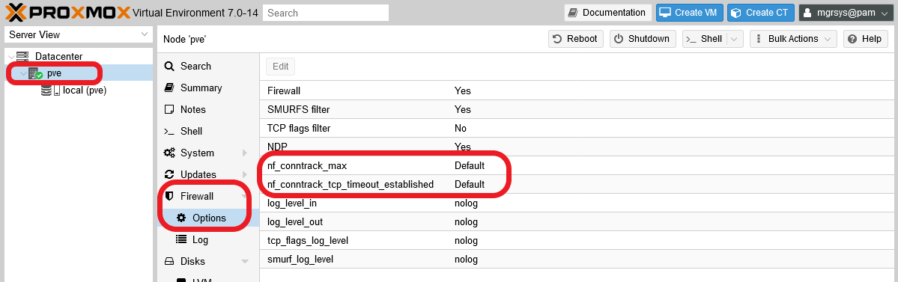

# G012 - Host hardening 06 ~ Network hardening with `sysctl`

You can harden your server's network connections with a proper `sysctl` configuration. This will help you mitigate or nullify certain attacks, while also fitting your network configuration better to your needs.

## About `sysctl`

The `sysctl` framework looks for system configuration files distributed on several locations of your system, and will read them in a concrete order. Inside the folders, `sysctl` will read the files in lexicographical order.

In your PVE system you'll find the following files.

1. `/etc/sysctl.d/99-sysctl.conf` : symlink to `/etc/sysctl.conf`
2. `/etc/sysctl.d/pve.conf`
3. `/etc/sysctl.d/README.sysctl` : this is **not** a file `sysctl` will read.
4. `/usr/lib/sysctl.d/10-pve-ct-inotify-limits.conf`
5. `/usr/lib/sysctl.d/50-pid-max.conf`
6. `/usr/lib/sysctl.d/protect-links.conf`
7. `/usr/lib/sysctl.d/pve-firewall.conf`
8. `/lib/sysctl.d/` : same as `/usr/lib/sysctl.d/`, since `/lib` is just a symlink to `/usr/lib/`
9. `/etc/sysctl.conf`

See how Proxmox VE already has its own files, the ones with the `pve` string in their names. Also notice that the `sysctl.conf` file will be read **twice**: first as `99-sysctl.conf`, and last as `sysctl.conf`.

> **BEWARE!**  
> All configuration files are sorted (after being loaded) in memory by their filename in lexicographic order, **regardless of the directories they're in**. If multiple files specify the same option, the entry in the file with the **lexicographically last name** will take precedence. Thus, the configuration in a certain file may either be replaced completely (by placing a file with the same name in a directory with higher priority), or individual settings might be changed (by specifying additional settings in a file with a different name that is ordered later).

So, the previous file list would be applied by **sysctl** in the following _lexicographical_ order.

1. `10-pve-ct-inotify-limits.conf`
2. `50-pid-max.conf`
3. `99-sysctl.conf`
4. `protect-links.conf`
5. `pve.conf`
6. `pve-firewall.conf`
7. `sysctl.conf`

Finally, to see the current value of a `sysctl` parameter, you can use directly the `sysctl` command with any full parameter name (autocomplete works for those parameter names).

~~~bash
$ sudo sysctl net.core.wmem_default
net.core.wmem_default = 212992
~~~

On the other hand, you can also list the full list of parameters with their current values.

~~~bash
$ sudo sysctl -a
abi.vsyscall32 = 1
debug.exception-trace = 1
debug.kprobes-optimization = 1
dev.cdrom.autoclose = 1
dev.cdrom.autoeject = 0
dev.cdrom.check_media = 0
dev.cdrom.debug = 0
dev.cdrom.info = CD-ROM information, Id: cdrom.c 3.20 2003/12/17
dev.cdrom.info =
dev.cdrom.info = drive name:
dev.cdrom.info = drive speed:
dev.cdrom.info = drive # of slots:
dev.cdrom.info = Can close tray:
dev.cdrom.info = Can open tray:
...
~~~

Since there are a lot of parameters, you'd prefer to pipe this command to `less` so you can revise them in a more comfortable manner.

~~~bash
$ sudo sysctl -a | less
~~~

### _Some `sysctl` values are managed by the Proxmox VE firewall_

Be aware that the Proxmox VE firewall handles a bunch of sysctl `net` parameters. The ones listed in the Proxmox VE Firewall official documentation, [in the firewall's **Host Specific Configuration** segment under the **Configuration Files** section](https://pve.proxmox.com/pve-docs/pve-admin-guide.html#_configuration_files), are the following ones.

- `nf_conntrack_allow_invalid`: to allow packets with the state INVALID on the connection tracking (conntrack). I haven't found any other reference to this parameter beyond the Proxmox VE-related documentation, so maybe its not a `sysctl` value, although it certaingly looks like it.

- `net.netfilter.nf_conntrack_max`: the maximum number of allowed connection traking entries. This value can be changed directly in the Proxmox VE web console.

- `net.netfilter.nf_conntrack_tcp_timeout_established`: just a timeout in seconds for established connections. This value can be changed directly in the Proxmox VE web console. Shouldn't be shorter than the `net.ipv4.tcp_keepalive_time` value.

- `net.netfilter.nf_conntrack_tcp_timeout_syn_recv`: another timeout in seconds, although for this one I haven't found a proper definition that explains its meaning.

The parameters mentioned above are just a few of many related to the netfilter conntrack system. Read a more complete list [in this page](https://www.kernel.org/doc/html/latest/networking/nf_conntrack-sysctl.html). On the other hand, the two parameters that can be managed from the web console are found at the pve node level, in the firewall option's screen.

It's not documented, but at least two other values are also affected by the Proxmox VE firewall (which, remember, it's just the legacy `iptables` system).

- `net.bridge.bridge-nf-call-ip6tables`
- `net.bridge.bridge-nf-call-iptables`

When the firewall gets fully enabled, those values are set to 1, overriding the 0 value they have in the `/etc/sysctl.d/pve.conf` file. This means that netfilter becomes enabled on the bridges you run on your Proxmox VE host.

On the other hand, know that all the sysctl parameters are found under the `/proc/sys` folder as independent files containing just their values. So, to see the `net.netfilter` values, you should list the contents of the `/proc/sys/net/netfilter` folder and you'll be met by a little surprise.

~~~bash
$ ls -al /proc/sys/net/netfilter
total 0
dr-xr-xr-x 1 root root 0 Nov 11 10:44 .
dr-xr-xr-x 1 root root 0 Nov 11 10:27 ..
dr-xr-xr-x 1 root root 0 Nov 11 10:44 nf_log
-rw-r--r-- 1 root root 0 Nov 11 10:44 nf_log_all_netns
~~~

None of the parameters controlled by Proxmox VE is present there, nor any of the ones you can see [here](https://www.kernel.org/doc/html/latest/networking/nf_conntrack-sysctl.html). This only means that the netfilter system is not currently active in the system. Only after you enable the firewall at the datacenter level (something you'll do in the [G014 guide](G014%20-%20Host%20hardening%2008%20~%20Firewalling.md)), you'll see this folder filled with new `nf_conntrack_` files.

## TCP/IP stack hardening with `sysctl`

To avoid messing with the `.conf` files already present, let's make a new one filled with parameters just for hardening the TCP/IP stack of your system.

> **BEWARE!**  
> The `.conf` files can have any name but, once a file of a given filename is loaded, `sysctl` **will ignore** any other file of the same name in subsequent directories.

1. Open a shell as `mgrsys` and `cd` to `/etc/sysctl.d/`.

    ~~~bash
    $ cd /etc/sysctl.d
    ~~~

2. Create the new configuration file as `80_tcp_hardening.conf`.

    ~~~bash
    $ sudo touch 80_tcp_hardening.conf
    ~~~

3. Edit `80_tcp_hardening.conf`, adding the following lines to it.

    ~~~properties
    ## TCP/IP stack hardening

    # Disable IPv6 protocol
    net.ipv6.conf.all.disable_ipv6 = 1
    net.ipv6.conf.default.disable_ipv6 = 1

    # Timeout broken connections faster (amount of time to wait for FIN).
    # Sets how many seconds to wait for a final FIN packet before the socket
    # is forcibly closed. This is strictly a violation of the TCP specification,
    # but required to prevent denial-of-service attacks.
    # https://sysctl-explorer.net/net/ipv4/tcp_fin_timeout/
    # Value in SECONDS.
    net.ipv4.tcp_fin_timeout = 10

    # IP loose spoofing protection or source route verification.
    # Complements the rule set in /usr/lib/sysctl.d/pve-firewall.conf for all interfaces.
    # Set to "loose" (2) to avoid unexpected networking problems in usual scenarios.
    net.ipv4.conf.default.rp_filter = 2

    # Ignore ICMP echo requests, or pings.
    # Commented by default since Proxmox VE or any other monitoring tool might
    # need to do pings to this host.
    # Uncomment only if you're sure that your system won't need to respond to pings.
    # net.ipv4.icmp_echo_ignore_all = 1
    # net.ipv6.icmp.echo_ignore_all = 1

    # Disable source packet routing; this system is not a router.
    net.ipv4.conf.default.accept_source_route = 0

    # Ignore send redirects; this system is not a router.
    net.ipv4.conf.all.send_redirects = 0
    net.ipv4.conf.default.send_redirects = 0

    # Do not accept ICMP redirects; prevents MITM attacks.
    net.ipv4.conf.all.accept_redirects = 0
    net.ipv4.conf.default.accept_redirects = 0
    net.ipv4.conf.all.secure_redirects = 0
    net.ipv4.conf.default.secure_redirects = 0

    # Protection against tcp time-wait assassination hazards,
    # drop RST packets for sockets in the time-wait state.
    net.ipv4.tcp_rfc1337 = 1

    # Only retry creating TCP connections twice.
    # Minimize the time it takes for a connection attempt to fail.
    net.ipv4.tcp_syn_retries = 2
    net.ipv4.tcp_synack_retries = 2
    net.ipv4.tcp_orphan_retries = 2

    # For intranets or low latency users, SACK is not worth it.
    # Also can become a performance and security issue.
    net.ipv4.tcp_sack = 0

    # A martian packet is an IP packet which specifies a source or destination
    # address that is reserved for special-use by Internet Assigned Numbers Authority
    # (IANA).
    # To monitor 'martian' packets in your logs, enable the lines below.
    # Be aware that this can fill up your logs with a lot of information,
    # so use these options only if you really need to do some checking or diagnostics.
    # net.ipv4.conf.all.log_martians = 1
    # net.ipv4.conf.default.log_martians = 1
    ~~~

4. Save the `80_tcp_hardening.conf` file, and apply the changes in your system.

    ~~~bash
    $ sudo sysctl -p /etc/sysctl.d/80_tcp_hardening.conf
    ~~~

    The command's output will list the all the parameters with their values as it has applied them to the system.

    > **BEWARE!**  
    > When executing `sysctl -p` without specifying any file, the command will load only the values found in the `/etc/sysctl.conf` file, and won't read anything inside the `/etc/sysctl.d` folder.

5. Reboot your system.

    ~~~bash
    $ sudo reboot
    ~~~

6. The specified configuration in the previous step **3** also disables the IPv6 protocol in your system. Verify that you don't see sockets listening in `[::1]` (the IPv6 version of `localhost`) adresses with the `ss` command.

    ~~~bash
    $ sudo ss -atlnup
    Netid              State               Recv-Q              Send-Q                             Local Address:Port                             Peer Address:Port              Process
    udp                UNCONN              0                   0                                      127.0.0.1:323                                   0.0.0.0:*                  users:(("chronyd",pid=693,fd=5))
    udp                UNCONN              0                   0                                          [::1]:323                                      [::]:*                  users:(("chronyd",pid=693,fd=6))
    tcp                LISTEN              0                   4096                                   127.0.0.1:85                                    0.0.0.0:*                  users:(("pvedaemon worke",pid=923,fd=6),("pvedaemon worke",pid=922,fd=6),("pvedaemon worke",pid=921,fd=6),("pvedaemon",pid=920,fd=6))
    tcp                LISTEN              0                   128                                192.168.1.107:22                                    0.0.0.0:*                  users:(("sshd",pid=677,fd=3))
    tcp                LISTEN              0                   100                                    127.0.0.1:25                                    0.0.0.0:*                  users:(("master",pid=880,fd=13))
    tcp                LISTEN              0                   16                                     127.0.0.1:3493                                  0.0.0.0:*                  users:(("upsd",pid=781,fd=4))
    tcp                LISTEN              0                   4096                                           *:8006                                        *:*                  users:(("pveproxy worker",pid=932,fd=6),("pveproxy worker",pid=931,fd=6),("pveproxy worker",pid=930,fd=6),("pveproxy",pid=929,fd=6))
    ~~~

    In the output above you can see that only one IPv6 socket remains, one opened by a certain `chronyd` service. Check the next subsection to learn how to disable that particular socket.

### _Disabling Chrony's IPv6 socket_

Chrony is a daemon that keeps your system's clock synchronized with an external time server through the NTP (Network Time Protocol) protocol. It can run as time server, but in this setup it's only working as client. To disable its IPv6 socket, you'll need to modify slightly one of its configuration files.

1. Go to `/etc/default` and make a backup of the `chrony` file.

    ~~~bash
    $ cd /etc/default
    $ sudo cp chrony chrony.orig
    ~~~

2. Edit the `chrony` file, and just add the `-4` option to the `DAEMON_OPTS` parameter. It should end looking like below.

    ~~~properties
    # Options to pass to chrony.
    DAEMON_OPTS="-4 -F 1"
    ~~~

3. Restart the Chrony service.

    ~~~bash
    $ sudo systemctl restart chrony.service
    ~~~

4. Verify that the Chrony daemon (`chronyd`) only has the IPv4 socket open.

    ~~~bash
    $ sudo ss -atlnup | grep chronyd
    udp   UNCONN 0      0          127.0.0.1:323       0.0.0.0:*    users:(("chronyd",pid=1591,fd=5))
    ~~~

## Relevant system paths

### _Directories_

- `/etc`
- `/etc/default`
- `/etc/sysctl.d`
- `/usr/lib/sysctl.d`
- `/lib/sysctl.d`
- `/proc/sys`
- `/proc/sys/net/netfilter`

### _Files_

- `/etc/default/chrony`
- `/etc/default/chrony.orig`
- `/etc/sysctl.conf`
- `/etc/sysctl.d/80_tcp_hardening.conf`
- `/etc/sysctl.d/99-sysctl.conf`
- `/etc/sysctl.d/pve.conf`
- `/etc/sysctl.d/README.sysctl`
- `/usr/lib/sysctl.d/10-pve-ct-inotify-limits.conf`
- `/usr/lib/sysctl.d/50-pid-max.conf`
- `/usr/lib/sysctl.d/protect-links.conf`
- `/usr/lib/sysctl.d/pve-firewall.conf`

## References

### _Proxmox VE_

- [Proxmox VE firewall](https://pve.deimos.cloud:8006/pve-docs/chapter-pve-firewall.html)

### _`sysctl` references_

- [`sysctl` ipv4 parameters](https://www.kernel.org/doc/Documentation/networking/ip-sysctl.txt)
- [Netfilter Conntrack `sysctl` parameters](https://www.kernel.org/doc/html/latest/networking/nf_conntrack-sysctl.html)

### _`sysctl` configuration examples_

- [Archlinux wiki: `sysctl`](https://wiki.archlinux.org/index.php/Sysctl)
- [Linux sysctl Tuning](https://community.mellanox.com/s/article/linux-sysctl-tuning)
- [Most popular speedup `sysctl` options for Proxmox](https://gist.github.com/sergey-dryabzhinsky/bcc1a15cb7d06f3d4606823fcc834824)
- [Test environment - Virtualized Proxmox on esxi - network problem](https://forum.proxmox.com/threads/test-environment-virtualized-proxmox-on-esxi-network-problem.37612/)
- [Ethtool & sysctl.conf hardening per Cryptostorm](https://tails-dev.boum.narkive.com/PdkdEag9/ethtool-sysctl-conf-hardening-per-cryptostorm)
- [Tuning nf_conntrack](https://ixnfo.com/en/tuning-nf_conntrack.html)
- [nf_conntrack: table full, dropping packet](https://newbedev.com/nf-conntrack-table-full-dropping-packet)
- [Linux kernel tuning settings for large number of concurrent clients](https://gist.github.com/kfox/1942782)

### _SYN cookies_

- [SYN cookies on Wikipedia](https://en.wikipedia.org/wiki/SYN_cookies)
- [SYN cookies by their inventor, Daniel J. Bernstein](https://cr.yp.to/syncookies.html)
- [Improving syncookies](https://lwn.net/Articles/277146/)
- [Better alternative for tcp_syncookies in linux](https://serverfault.com/questions/705504/better-alternative-for-tcp-syncookies-in-linux)
- [What is the difference between tcp_max_syn_backlog and somaxconn?](https://stackoverflow.com/questions/62641621/what-is-the-difference-between-tcp-max-syn-backlog-and-somaxconn)
- [How TCP backlog works in Linux](http://veithen.io/2014/01/01/how-tcp-backlog-works-in-linux.html)
- [Sane value for net.ipv4.tcp_max_syn_backlog in sysctl.conf](https://serverfault.com/questions/875035/sane-value-for-net-ipv4-tcp-max-syn-backlog-in-sysctl-conf)

### _ICMP_

- [sysctl.d: switch net.ipv4.conf.all.rp_filter from 1 to 2](https://github.com/systemd/systemd/pull/10971)
- [What is ICMP broadcast good for?](https://superuser.com/questions/306065/what-is-icmp-broadcast-good-for)
- [What are ICMP redirects and should they be blocked?](https://askubuntu.com/questions/118273/what-are-icmp-redirects-and-should-they-be-blocked)
- [Ensure broadcast ICMP requests are ignored](https://secscan.acron.pl/centos7/3/2/5)

### _Other_

- [DSA-4272-1 linux -- security update](https://www.debian.org/security/2018/dsa-4272)
- [`ipfrag_high_thresh` on sysctl explorer](https://sysctl-explorer.net/net/ipv4/ipfrag_high_thresh/)
- [When to turn TCP SACK off?](https://serverfault.com/questions/10955/when-to-turn-tcp-sack-off)
- [Improving TCP performance over a gigabit network with lots of connections and high traffic of small packets](https://serverfault.com/questions/357799/improving-tcp-performance-over-a-gigabit-network-with-lots-of-connections-and-hi)
- [SegmentSmack and FragmentSmack: IP fragments and TCP segments with random offsets may cause a remote denial of service (CVE-2018-5390, CVE-2018-5391)](https://access.redhat.com/articles/3553061)

### _Chrony_

- [chronyd on debian could not open IPv6 NTP socket](https://serverfault.com/questions/992844/chronyd-on-debian-could-not-open-ipv6-ntp-socket)
- [Steps to configure Chrony as NTP Server & Client (CentOS/RHEL 8)](https://www.golinuxcloud.com/configure-chrony-ntp-server-client-force-sync/)

## Navigation

[<< Previous (**G011. Host hardening 05**)](G011%20-%20Host%20hardening%2005%20~%20Proxmox%20VE%20services.md) | [+Table Of Contents+](G000%20-%20Table%20Of%20Contents.md) | [Next (**G013. Host hardening 07**) >>](G013%20-%20Host%20hardening%2007%20~%20Mitigating%20CPU%20vulnerabilities.md)
