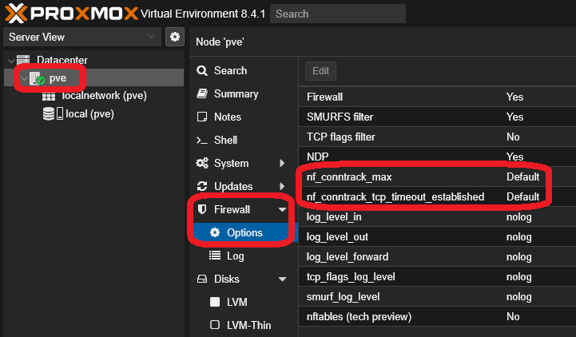

# G012 - Host hardening 06 ~ Network hardening with `sysctl`

- [Harden your PVE's networking with a `sysctl` configuration](#harden-your-pves-networking-with-a-sysctl-configuration)
- [About `sysctl`](#about-sysctl)
  - [Some `sysctl` values are managed by the Proxmox VE firewall](#some-sysctl-values-are-managed-by-the-proxmox-ve-firewall)
- [TCP/IP stack hardening with `sysctl`](#tcpip-stack-hardening-with-sysctl)
  - [Disabling Chrony's IPv6 socket](#disabling-chronys-ipv6-socket)
- [Relevant system paths](#relevant-system-paths)
  - [Directories](#directories)
  - [Files](#files)
- [References](#references)
  - [Proxmox](#proxmox)
  - [`sysctl` references](#sysctl-references)
  - [`sysctl` configuration examples](#sysctl-configuration-examples)
  - [SYN cookies](#syn-cookies)
  - [ICMP](#icmp)
  - [Other networking-related knowledge](#other-networking-related-knowledge)
  - [Chrony](#chrony)
- [Navigation](#navigation)

## Harden your PVE's networking with a `sysctl` configuration

You can harden your Proxmox VE node's network connections with a proper `sysctl` configuration. This will help you mitigate or nullify certain attacks, while also fitting your network configuration better to your needs.

## About `sysctl`

The `sysctl` framework looks for system configuration files distributed on a couple of locations in your system, and will parse them at boot time in a concrete order. Inside the folders, `sysctl` will read the files in lexicographical order.

In your PVE system you'll find the following files:

1. `/etc/sysctl.d/README.sysctl`\
   This is NOT a file `sysctl` will read.

2. `/usr/lib/sysctl.d/10-coredump-debian.conf`

3. `/usr/lib/sysctl.d/10-pve.conf`

4. `/usr/lib/sysctl.d/10-pve-ct-inotify-limits.conf`

5. `/usr/lib/sysctl.d/50-default.conf`

6. `/usr/lib/sysctl.d/50-pid-max.conf`

7. `/usr/lib/sysctl.d/pve-firewall.conf`

See how Proxmox VE already has its own files, the ones with the `pve` string in their names.

On the other hand, there is the directory `/lib/sysctl.d/`. This path is correponds to the `/usr/lib/sysctl.d/` directory since `/lib` is just a symlink to `/usr/lib/`.

> [!IMPORTANT]
> **The `sysctl` configuration files get sorted in memory by their names**\
> All configuration files are sorted (after being loaded) in memory by their filename in lexicographic order, **regardless of the directories they are in**.
>
> If multiple files specify the same option, the entry in the file with the **lexicographically last name** will take precedence. Thus, the configuration in a certain file may either be replaced completely (by placing a file with the same name in a directory with higher priority), or individual settings might be changed (by specifying additional settings in a file with a different name that is ordered later).

The previous file list would be applied by `sysctl` in the following _lexicographical_ order:

1. `10-coredump-debian.conf`
2. `10-pve.conf`
3. `10-pve-ct-inotify-limits.conf`
4. `50-default.conf`
5. `50-pid-max.conf`
6. `pve-firewall.conf`

Finally, to see the current value of a `sysctl` parameter, you can use directly the `sysctl` command with any full parameter name (autocomplete works for those parameter names):

~~~sh
$ sudo sysctl net.core.wmem_default
net.core.wmem_default = 212992
~~~

On the other hand, you can also list the full list of parameters with their current values:

~~~sh
$ sudo sysctl -a
abi.vsyscall32 = 1
debug.exception-trace = 1
debug.kprobes-optimization = 1
dev.cdrom.autoclose = 1
dev.cdrom.autoeject = 0
dev.cdrom.check_media = 0
dev.cdrom.debug = 0
dev.cdrom.info = CD-ROM information, Id: cdrom.c 3.20 2003/12/17
dev.cdrom.info =
dev.cdrom.info = drive name:
dev.cdrom.info = drive speed:
dev.cdrom.info = drive # of slots:
dev.cdrom.info = Can close tray:
dev.cdrom.info = Can open tray:
...
~~~

Since there are a lot of parameters, you may prefer to pipe this command to `less` to revise them in a more comfortable manner:

~~~sh
$ sudo sysctl -a | less
~~~

### Some `sysctl` values are managed by the Proxmox VE firewall

Be aware that the Proxmox VE firewall handles a bunch of sysctl `net` parameters. The ones listed in the Proxmox VE Firewall official documentation, [in the firewall's **Host Specific Configuration** segment under the **Configuration Files** section](https://pve.proxmox.com/pve-docs/pve-admin-guide.html#pve_firewall_host_specific_configuration), are the following ones.

- `nf_conntrack_allow_invalid`\
  To allow packets with the state INVALID on the connection tracking (conntrack). There is no other reference to this parameter beyond the Proxmox VE-related documentation, so maybe it is not a `sysctl` value, although certainly looks like it.

- `nf_conntrack_helpers`\
  For enabling [conntrack helpers](https://wiki.nftables.org/wiki-nftables/index.php/Conntrack_helpers) for specific protocols. Like the `nf_conntrack_allow_invalid` parameter, it appears to be a `sysctl` parameter but it is not mentioned in the [official Kernel networking documentation](https://www.kernel.org/doc/html/latest/networking/nf_conntrack-sysctl.html).

- `net.netfilter.nf_conntrack_max`\
  The maximum number of allowed connection tracking entries. This value can be changed directly in the Proxmox VE web console.

- `net.netfilter.nf_conntrack_tcp_timeout_established`\
  Just a timeout in seconds for established connections. This value can be changed directly in the Proxmox VE web console. Should not be shorter than the `net.ipv4.tcp_keepalive_time` value.

- `net.netfilter.nf_conntrack_tcp_timeout_syn_recv`\
  Another timeout in seconds, although there is no proper definition explaining its meaning.

The parameters mentioned above are just a few of many related to the netfilter conntrack system. [Find a more complete list in this page](https://www.kernel.org/doc/html/latest/networking/nf_conntrack-sysctl.html). On the other hand, the `nf` parameters that can be managed from the web console are found at the pve node level, in the firewall option's page:

It is not documented, but at least other two other values can be affected by the Proxmox VE firewall:

- `net.bridge.bridge-nf-call-ip6tables`
- `net.bridge.bridge-nf-call-iptables`

When the firewall gets fully enabled, those values are set to `1`, overriding the `0` value they have in the `/usr/lib/sysctl.d/10-pve.conf` file. This means that netfilter becomes enabled on the bridges you run on your Proxmox VE host.

On the other hand, know that all the `sysctl` parameters are found under the `/proc/sys` folder as independent files just containing their values. Therefore, to see the `net.netfilter` values, you should list the contents of the `/proc/sys/net/netfilter` folder and you will be met by a little surprise:

~~~sh
$ ls -al /proc/sys/net/netfilter
total 0
dr-xr-xr-x 1 root root 0 Aug 29 12:03 .
dr-xr-xr-x 1 root root 0 Aug 29 11:10 ..
-rw-r--r-- 1 root root 0 Aug 29 12:03 nf_hooks_lwtunnel
dr-xr-xr-x 1 root root 0 Aug 29 12:03 nf_log
-rw-r--r-- 1 root root 0 Aug 29 12:03 nf_log_all_netns
~~~

None of the parameters controlled by Proxmox VE is present there, nor [any of the ones you can see here](https://www.kernel.org/doc/html/latest/networking/nf_conntrack-sysctl.html). This only means that the netfilter system is not currently active in the system. Only after you enable the firewall at the datacenter level (something you will do in the [chapter **G014**](G014%20-%20Host%20hardening%2008%20~%20Firewalling.md)), you will end up seeing this folder filled with new `nf_conntrack_` files.

## TCP/IP stack hardening with `sysctl`

To avoid messing with the `.conf` files already present, better make a new one filled with parameters just for hardening the TCP/IP stack of your system.

> [!IMPORTANT]
> **Give your sysctl `.conf` files unique names**\
> The `.conf` files can have any name but, once a file of a given filename is loaded, `sysctl` **will ignore any other file of the same name in subsequent directories**.

1. Open a shell as `mgrsys` and `cd` to `/etc/sysctl.d/`:

    ~~~sh
    $ cd /etc/sysctl.d
    ~~~

2. Create the new configuration file as `80_tcp_hardening.conf`:

    ~~~sh
    $ sudo touch 80_tcp_hardening.conf
    ~~~

3. Edit `80_tcp_hardening.conf`, adding the following lines to it:

    ~~~properties
    ## TCP/IP stack hardening

    # Disable IPv6 protocol
    net.ipv6.conf.all.disable_ipv6 = 1
    net.ipv6.conf.default.disable_ipv6 = 1

    # Timeout broken connections faster (amount of time to wait for FIN).
    # Sets how many seconds to wait for a final FIN packet before the socket
    # is forcibly closed. This is strictly a violation of the TCP specification,
    # but required to prevent denial-of-service attacks.
    # https://sysctl-explorer.net/net/ipv4/tcp_fin_timeout/
    # Value in SECONDS.
    net.ipv4.tcp_fin_timeout = 10

    # IP loose spoofing protection or source route verification.
    # Complements the rule set in /usr/lib/sysctl.d/pve-firewall.conf for all interfaces.
    # Set to "loose" (2) to avoid unexpected networking problems in usual scenarios.
    net.ipv4.conf.default.rp_filter = 2

    # Ignore ICMP echo requests, or pings.
    # Commented by default since Proxmox VE or any other monitoring tool might
    # need to do pings to this host.
    # Uncomment only if you're sure that your system won't need to respond to pings.
    # net.ipv4.icmp_echo_ignore_all = 1
    # net.ipv6.icmp.echo_ignore_all = 1

    # Disable source packet routing; this system is not a router.
    net.ipv4.conf.default.accept_source_route = 0

    # Ignore send redirects; this system is not a router.
    net.ipv4.conf.all.send_redirects = 0
    net.ipv4.conf.default.send_redirects = 0

    # Do not accept ICMP redirects; prevents MITM attacks.
    net.ipv4.conf.all.accept_redirects = 0
    net.ipv4.conf.default.accept_redirects = 0
    net.ipv4.conf.all.secure_redirects = 0
    net.ipv4.conf.default.secure_redirects = 0

    # Protection against tcp time-wait assassination hazards,
    # drop RST packets for sockets in the time-wait state.
    net.ipv4.tcp_rfc1337 = 1

    # Only retry creating TCP connections twice.
    # Minimize the time it takes for a connection attempt to fail.
    net.ipv4.tcp_syn_retries = 2
    net.ipv4.tcp_synack_retries = 2
    net.ipv4.tcp_orphan_retries = 2

    # For intranets or low latency users, SACK is not worth it.
    # Also can become a performance and security issue.
    net.ipv4.tcp_sack = 0

    # A martian packet is an IP packet which specifies a source or destination
    # address that is reserved for special-use by Internet Assigned Numbers Authority
    # (IANA).
    # To monitor 'martian' packets in your logs, enable the lines below.
    # Be aware that this can fill up your logs with a lot of information,
    # so use these options only if you really need to do some checking or diagnostics.
    # net.ipv4.conf.all.log_martians = 1
    # net.ipv4.conf.default.log_martians = 1
    ~~~

4. Save the `80_tcp_hardening.conf` file, and apply the changes in your system:

    ~~~sh
    $ sudo sysctl -p /etc/sysctl.d/80_tcp_hardening.conf
    ~~~

    The command will output a list of all the parameters it has read and applied to the system.

    > [!NOTE]
    > **Do not forget to specify the file to read to the `sysctl -p` command**\
    > When executing `sysctl -p` without specifying any file, the command will load only the values found in the `/etc/sysctl.conf` file (if it exists), and will not read anything inside the `/etc/sysctl.d` folder.

5. Reboot your system:

    ~~~sh
    $ sudo reboot
    ~~~

6. The specified configuration in the previous step 3 also disables the IPv6 protocol in your system. Verify with the `ss` command that there are no sockets listening in `[::1]` (the IPv6 version of `localhost`) addresses:

    ~~~sh
    $ sudo ss -atlnup
    Netid            State             Recv-Q            Send-Q                       Local Address:Port                       Peer Address:Port           Process
    udp              UNCONN            0                 0                                127.0.0.1:323                             0.0.0.0:*               users:(("chronyd",pid=801,fd=5))
    udp              UNCONN            0                 0                                    [::1]:323                                [::]:*               users:(("chronyd",pid=801,fd=6))
    tcp              LISTEN            0                 4096                             127.0.0.1:85                              0.0.0.0:*               users:(("pvedaemon worke",pid=1161,fd=6),("pvedaemon worke",pid=1160,fd=6),("pvedaemon worke",pid=1158,fd=6),("pvedaemon",pid=1157,fd=6))
    tcp              LISTEN            0                 100                              127.0.0.1:25                              0.0.0.0:*               users:(("master",pid=1111,fd=13))
    tcp              LISTEN            0                 128                               10.1.0.1:22                              0.0.0.0:*               users:(("sshd",pid=948,fd=6))
    tcp              LISTEN            0                 16                               127.0.0.1:3493                            0.0.0.0:*               users:(("upsd",pid=1119,fd=4))
    tcp              LISTEN            0                 4096                              10.1.0.1:8006                            0.0.0.0:*               users:(("pveproxy worker",pid=1176,fd=6),("pveproxy worker",pid=1175,fd=6),("pveproxy worker",pid=1174,fd=6),("pveproxy",pid=1173,fd=6))
    ~~~

    In the output above you can see that only one IPv6 socket remains, opened by a certain `chronyd` service. Check the next subsection to learn how to disable that particular socket.

### Disabling Chrony's IPv6 socket

Chrony is a daemon that keeps your server's clock synchronized with an external time server through the NTP (Network Time Protocol) protocol. It can also run as a time server, but in this setup it is only working as client. To disable its IPv6 socket, you need to modify slightly one of its configuration files:

1. Go to `/etc/default` and make a backup of the `chrony` file:

    ~~~sh
    $ cd /etc/default
    $ sudo cp chrony chrony.orig
    ~~~

2. Edit the `chrony` file, and just add the `-4` option to the `DAEMON_OPTS` parameter. It should end looking like below:

    ~~~properties
    # Options to pass to chrony.
    DAEMON_OPTS="-4 -F 1"
    ~~~

3. Restart the Chrony service:

    ~~~sh
    $ sudo systemctl restart chrony.service
    ~~~

4. Verify that the Chrony daemon (`chronyd`) only has the IPv4 socket open:

    ~~~sh
    $ sudo ss -atlnup | grep chronyd
    udp   UNCONN 0      0          127.0.0.1:323       0.0.0.0:*    users:(("chronyd",pid=9379,fd=5))
    ~~~

## Relevant system paths

### Directories

- `/etc`
- `/etc/default`
- `/etc/sysctl.d`
- `/usr/lib/sysctl.d`
- `/lib/sysctl.d`
- `/proc/sys`
- `/proc/sys/net/netfilter`

### Files

- `/etc/default/chrony`
- `/etc/default/chrony.orig`
- `/etc/sysctl.d/80_tcp_hardening.conf`
- `/etc/sysctl.d/README.sysctl`
- `/usr/lib/sysctl.d/10-coredump-debian.conf`
- `/usr/lib/sysctl.d/10-pve.conf`
- `/usr/lib/sysctl.d/10-pve-ct-inotify-limits.conf`
- `/usr/lib/sysctl.d/50-default.conf`
- `/usr/lib/sysctl.d/50-pid-max.conf`
- `/usr/lib/sysctl.d/pve-firewall.conf`

## References

### [Proxmox](https://www.proxmox.com/en/)

- [Proxmox VE Administration Guide](https://pve.proxmox.com/pve-docs/pve-admin-guide.html)
  - [Proxmox VE firewall](https://pve.proxmox.com/pve-docs/pve-admin-guide.html#chapter_pve_firewall)
    - [Configuration files. Host Specific Configuration](https://pve.proxmox.com/pve-docs/pve-admin-guide.html#pve_firewall_host_specific_configuration)

- [Proxmox. Forums. Proxmox Virtual Environment](https://forum.proxmox.com/#proxmox-virtual-environment.11)
  - [Proxmox VE: Networking and Firewall](https://forum.proxmox.com/forums/proxmox-ve-networking-and-firewall.17/)
    - [Test environment - Virtualized Proxmox on esxi - network problem](https://forum.proxmox.com/threads/test-environment-virtualized-proxmox-on-esxi-network-problem.37612/)

### `sysctl` references

- [The Linux Kernel Archives](https://www.kernel.org/)
  - [`sysctl` ipv4 parameters](https://www.kernel.org/doc/Documentation/networking/ip-sysctl.txt)
  - [Netfilter Conntrack `sysctl` parameters](https://www.kernel.org/doc/html/latest/networking/nf_conntrack-sysctl.html)

### `sysctl` configuration examples

- [Archlinux. ArchWiki. sysctl](https://wiki.archlinux.org/index.php/Sysctl)
- [GitHub Gist. sergey-dryabzhinsky/sysctl-proxmox-tune.conf. Most popular speedup `sysctl` options for Proxmox](https://gist.github.com/sergey-dryabzhinsky/bcc1a15cb7d06f3d4606823fcc834824)
- [GitHub Gist. kfox/sysctl.conf. Linux kernel tuning settings for large number of concurrent clients](https://gist.github.com/kfox/1942782)
- [Narkive. Ethtool & sysctl.conf hardening per Cryptostorm](https://tails-dev.boum.narkive.com/PdkdEag9/ethtool-sysctl-conf-hardening-per-cryptostorm)
- [IT Blog. Tuning nf_conntrack](https://ixnfo.com/en/tuning-nf_conntrack.html)

### SYN cookies

- [Wikipedia. SYN cookies on Wikipedia](https://en.wikipedia.org/wiki/SYN_cookies)
- [cr.yp.to. SYN cookies by their inventor, Daniel J. Bernstein](https://cr.yp.to/syncookies.html)
- [LWN.net. Improving syncookies](https://lwn.net/Articles/277146/)
- [ServerFault. Better alternative for tcp_syncookies in linux](https://serverfault.com/questions/705504/better-alternative-for-tcp-syncookies-in-linux)
- [ServerFault. Sane value for net.ipv4.tcp_max_syn_backlog in sysctl.conf](https://serverfault.com/questions/875035/sane-value-for-net-ipv4-tcp-max-syn-backlog-in-sysctl-conf)
- [StackOverflow. What is the difference between tcp_max_syn_backlog and somaxconn?](https://stackoverflow.com/questions/62641621/what-is-the-difference-between-tcp-max-syn-backlog-and-somaxconn)
- [Veithen.io. How TCP backlog works in Linux](http://veithen.io/2014/01/01/how-tcp-backlog-works-in-linux.html)

### ICMP

- [GitHub. systemd. sysctl.d: switch net.ipv4.conf.all.rp_filter from 1 to 2](https://github.com/systemd/systemd/pull/10971)
- [SuperUser. What is ICMP broadcast good for?](https://superuser.com/questions/306065/what-is-icmp-broadcast-good-for)
- [Ask Ubuntu. What are ICMP redirects and should they be blocked?](https://askubuntu.com/questions/118273/what-are-icmp-redirects-and-should-they-be-blocked)
- [SecScan. Ensure broadcast ICMP requests are ignored](https://secscan.acron.pl/centos7/3/2/5)

### Other networking-related knowledge

- [nftables. Wiki. Connection Tracking System](https://wiki.nftables.org/wiki-nftables/index.php/Connection_Tracking_System)
- [Debian. DSA-4272-1 linux -- security update](https://www.debian.org/security/2018/dsa-4272)
- [ServerFault. When to turn TCP SACK off?](https://serverfault.com/questions/10955/when-to-turn-tcp-sack-off)
- [ServerFault. Improving TCP performance over a gigabit network with lots of connections and high traffic of small packets](https://serverfault.com/questions/357799/improving-tcp-performance-over-a-gigabit-network-with-lots-of-connections-and-hi)
- [Red Hat Customer Portal. Knowledgebase. SegmentSmack and FragmentSmack: IP fragments and TCP segments with random offsets may cause a remote denial of service (CVE-2018-5390, CVE-2018-5391)](https://access.redhat.com/articles/3553061)

### Chrony

- [ServerFault. chronyd on debian could not open IPv6 NTP socket](https://serverfault.com/questions/992844/chronyd-on-debian-could-not-open-ipv6-ntp-socket)
- [GoLinuxCloud. Steps to configure Chrony as NTP Server & Client (CentOS/RHEL 8)](https://www.golinuxcloud.com/configure-chrony-ntp-server-client-force-sync/)

## Navigation

[<< Previous (**G011. Host hardening 05**)](G011%20-%20Host%20hardening%2005%20~%20Proxmox%20VE%20services.md) | [+Table Of Contents+](G000%20-%20Table%20Of%20Contents.md) | [Next (**G013. Host hardening 07**) >>](G013%20-%20Host%20hardening%2007%20~%20Mitigating%20CPU%20vulnerabilities.md)
