# G014 - Host hardening 08 ~ Firewalling

One of the strongest hardening measures you can apply is a proper firewall, and Proxmox VE comes with one. Needless to say, you must enable and configure this firewall to secure your system.

## Proxmox VE firewall uses `iptables`

The Proxmox VE firewall is based on `iptables`, meaning that any rules defined within the PVE firewall will be enforced by the underlying `iptables` firewall present in your standalone node. In a cluster, those rules are spread by the PVE firewall daemon among all the nodes.

### _`iptables` is a **legacy** package_

The `iptables` is a legacy package that has been replaced by `nftables` but, probably due to incompatibilities, Proxmox VE 7.0-x is still using this legacy `iptables` package. You can verify this by printing the iptables version.

~~~bash
$ sudo iptables -V
iptables v1.8.7 (legacy)
~~~

> **BEWARE!**  
> There are several `iptables` commands available in the system, but some of them are meant to be used with the nftables firewall. So, when you execute `iptables` commands, avoid using the ones that have the `nft` string in their names.

## Zones in the Proxmox VE firewall

The Proxmox VE documentation indicates that the firewall groups the network in two logical zones:

- **Host**: Traffic from/to a cluster node.
- **VM**: Traffic from/to a specific VM.

But the same documentation also mentions three distinct tiers, or levels, that are contemplated by the PVE firewall: datacenter or cluster, nodes and guests or virtual machines.

It's important of being always aware that these tiers or zones are kind of independent from each other. Essentially, the firewall has to be enabled on each level individually, and the rules applied at the datacenter level won't be applied automatically in cascade to the lower tiers, you'll have to enable them specifically for each level (and for each virtual NIC on each guest in the case of VMs and containers).

Also, be aware that the PVE firewall offers different options for each tier.

## Situation at this point

By enabling `fail2ban` in the previous [**G010** guide](G010%20-%20Host%20hardening%2004%20~%20Enabling%20Fail2Ban.md), you've also enabled the `iptables` firewall at the **node level**. You can verify this in the web console at the `pve` node level, by going to the `Firewall > Options` of your standalone node.

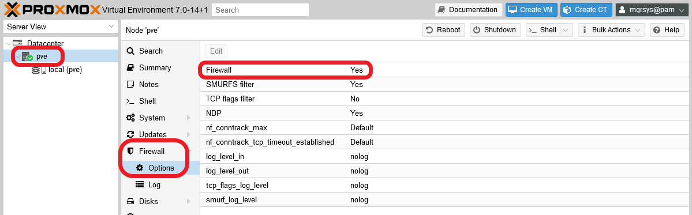

But, on the other hand, the PVE firewall it's **NOT** running at the `Datacenter` tier.

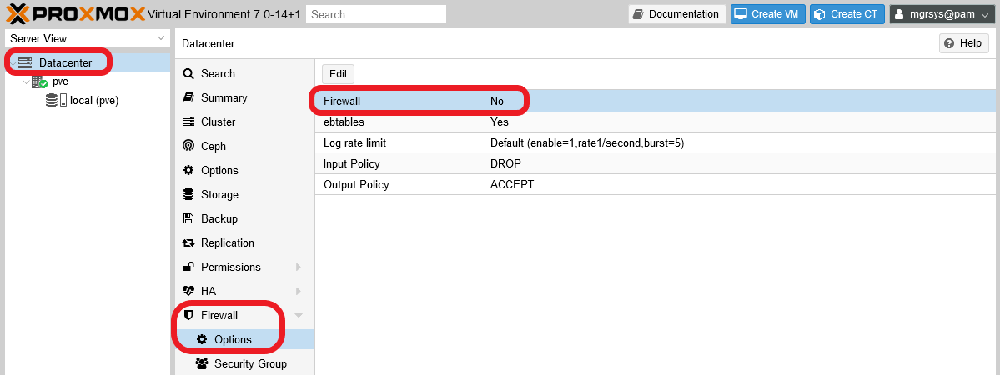

The Proxmox VE documentation indicates that the firewall comes completely disabled, at all levels we should understand, after the installation. That's why you find the `Firewall` disabled at the `Datacenter` level.

Also, from the PVE web console's point of view, the firewall doesn't seem to have rules whatsoever, something you can check when you go directly into the `Firewall` screen of either the `Datacenter` or the node tier.

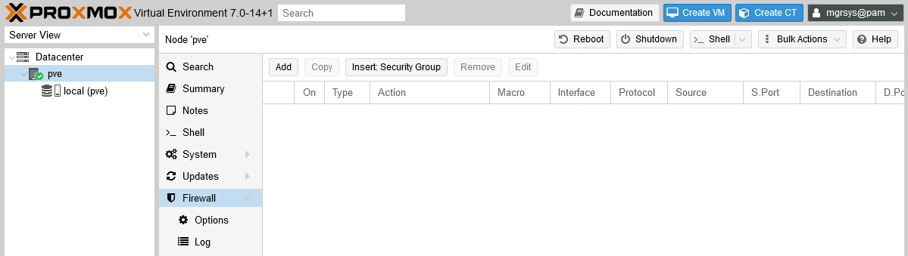

And this is mostly true. If you open a shell terminal in your node as your `mgrsys` user, you can check the rules actually enabled in the `iptables` firewall.

~~~bash
$ sudo iptables -L -n
Chain INPUT (policy ACCEPT)
target     prot opt source               destination

Chain FORWARD (policy ACCEPT)
target     prot opt source               destination

Chain OUTPUT (policy ACCEPT)
target     prot opt source               destination
~~~

There are no rules per se, just empty chains of rules, but you can see how each main `Chain` has a policy already established: all chains are **accepting everything**, with the default `policy ACCEPT`. This means that your firewall is completely open, something we don't want at all.

Now, let's revise which are the ports currently open in your system.

~~~bash
$ sudo ss -atlnup
Netid              State               Recv-Q              Send-Q                             Local Address:Port                             Peer Address:Port              Process
udp                UNCONN              0                   0                                      127.0.0.1:323                                   0.0.0.0:*                  users:(("chronyd",pid=691,fd=5))
tcp                LISTEN              0                   16                                     127.0.0.1:3493                                  0.0.0.0:*                  users:(("upsd",pid=775,fd=4))
tcp                LISTEN              0                   4096                                   127.0.0.1:85                                    0.0.0.0:*                  users:(("pvedaemon worke",pid=925,fd=6),("pvedaemon worke",pid=924,fd=6),("pvedaemon worke",pid=923,fd=6),("pvedaemon",pid=922,fd=6))
tcp                LISTEN              0                   128                                192.168.1.107:22                                    0.0.0.0:*                  users:(("sshd",pid=677,fd=3))
tcp                LISTEN              0                   100                                    127.0.0.1:25                                    0.0.0.0:*                  users:(("master",pid=883,fd=13))
tcp                LISTEN              0                   4096                                           *:8006                                        *:*                  users:(("pveproxy worker",pid=935,fd=6),("pveproxy worker",pid=934,fd=6),("pveproxy worker",pid=933,fd=6),("pveproxy",pid=932,fd=6))
~~~

If you've followed the guides, you should get a list of listening sockets like the output above. Read what they are below.

- Service `chronyd` listening on localhost (`127.0.0.1`) interface at port `323`: daemon for synchronizing the system's clock with an external time server (already seen back in the [**G012** guide](G012%20-%20Host%20hardening%2006%20~%20Network%20hardening%20with%20sysctl.md)).

- Service `upsd` listening on localhost (`127.0.0.1`) interface at port `3493`: NUT service for monitoring your UPS.

- Service `pvedaemon` listening on localhost (`127.0.0.1`) interface at port `85`: exposes the whole Proxmox VE API.

- Service `sshd` listening on the host real network Ethernet interface (`192.168.1.107`) at port `22`: ssh daemon service.

- Service `master` listening on localhost (`127.0.0.1`) interface at port `25`: postmaster mail service providing mailing within the system itself.

- Service `pveproxy` listening on all interfaces (`0.0.0.0`) at port `8006`: Proxmox VE proxy that gives access to the web console and also exposes the Proxmox VE API.

## Enabling the firewall at the `Datacenter` tier

Just by enabling the PVE firewall at the `Datacenter` tier you'll get a much stronger set of rules enforced in your firewall. But, before you do this...

> **BEWARE!**  
> **After enabling the firewall at the `Datacenter` tier, the platform will block incoming traffic from all hosts towards your datacenter, except the traffic coming from your LAN towards the 8006 (web console) and 22 (ssh) ports**.

This means that, if you plan to access your PVE platform from IPs outside your LAN, you'll need to add **first** the rules in the PVE firewall to allow such access. But I won't cover this here, since I'm just assuming a "pure" LAN, or a Proxmox VE server **not accessible** from internet, scenario in this guide series.

Assuming you're accessing your PVE system from another computer in the same LAN, go to the `Datacenter > Firewall > Options` screen in the web console and select the `Firewall` parameter.

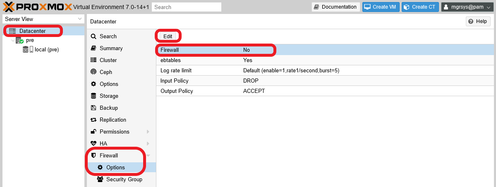

Click on `Edit` and mark the `Firewall` checkbox presented to enable the firewall at the `Datacenter` tier.

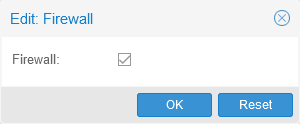

Hit `OK` and you'll see the `Firewall` parameter has a `Yes` value now.

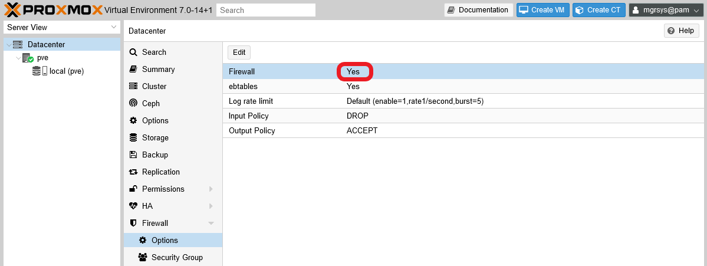

The change will be applied immediately, but you won't see any rules at all in the `Firewall` screens, neither at the `Datacenter` nor at the `pve` node level. But the `iptables` rule set will change a lot, something you can verify with the `iptables` command.

~~~bash
$ sudo iptables -L -n
Chain INPUT (policy ACCEPT)
target     prot opt source               destination
PVEFW-INPUT  all  --  0.0.0.0/0            0.0.0.0/0

Chain FORWARD (policy ACCEPT)
target     prot opt source               destination
PVEFW-FORWARD  all  --  0.0.0.0/0            0.0.0.0/0

Chain OUTPUT (policy ACCEPT)
target     prot opt source               destination
PVEFW-OUTPUT  all  --  0.0.0.0/0            0.0.0.0/0

Chain PVEFW-Drop (1 references)
target     prot opt source               destination
PVEFW-DropBroadcast  all  --  0.0.0.0/0            0.0.0.0/0
ACCEPT     icmp --  0.0.0.0/0            0.0.0.0/0            icmptype 3 code 4
ACCEPT     icmp --  0.0.0.0/0            0.0.0.0/0            icmptype 11
DROP       all  --  0.0.0.0/0            0.0.0.0/0            ctstate INVALID
DROP       udp  --  0.0.0.0/0            0.0.0.0/0            multiport dports 135,445
DROP       udp  --  0.0.0.0/0            0.0.0.0/0            udp dpts:137:139
DROP       udp  --  0.0.0.0/0            0.0.0.0/0            udp spt:137 dpts:1024:65535
DROP       tcp  --  0.0.0.0/0            0.0.0.0/0            multiport dports 135,139,445
DROP       udp  --  0.0.0.0/0            0.0.0.0/0            udp dpt:1900
DROP       tcp  --  0.0.0.0/0            0.0.0.0/0            tcp flags:!0x17/0x02
DROP       udp  --  0.0.0.0/0            0.0.0.0/0            udp spt:53
           all  --  0.0.0.0/0            0.0.0.0/0            /* PVESIG:83WlR/a4wLbmURFqMQT3uJSgIG8 */

Chain PVEFW-DropBroadcast (2 references)
target     prot opt source               destination
DROP       all  --  0.0.0.0/0            0.0.0.0/0            ADDRTYPE match dst-type BROADCAST
DROP       all  --  0.0.0.0/0            0.0.0.0/0            ADDRTYPE match dst-type MULTICAST
DROP       all  --  0.0.0.0/0            0.0.0.0/0            ADDRTYPE match dst-type ANYCAST
DROP       all  --  0.0.0.0/0            224.0.0.0/4
           all  --  0.0.0.0/0            0.0.0.0/0            /* PVESIG:NyjHNAtFbkH7WGLamPpdVnxHy4w */

Chain PVEFW-FORWARD (1 references)
target     prot opt source               destination
DROP       all  --  0.0.0.0/0            0.0.0.0/0            ctstate INVALID
ACCEPT     all  --  0.0.0.0/0            0.0.0.0/0            ctstate RELATED,ESTABLISHED
PVEFW-FWBR-IN  all  --  0.0.0.0/0            0.0.0.0/0            PHYSDEV match --physdev-in fwln+ --physdev-is-bridged
PVEFW-FWBR-OUT  all  --  0.0.0.0/0            0.0.0.0/0            PHYSDEV match --physdev-out fwln+ --physdev-is-bridged
           all  --  0.0.0.0/0            0.0.0.0/0            /* PVESIG:qnNexOcGa+y+jebd4dAUqFSp5nw */
...
~~~

I've omitted most of the output since it's quite long, but still you can see that quite a lot of rules have been added just by enabling the firewall at the `Datacenter` tier.

The Proxmox VE firewall's configuration files can be found at the following locations.

- `/etc/pve/firewall/cluster.fw` : for datacenter or cluster wide tier.
- `/etc/pve/firewall/<VMID>.fw` : for each virtual machine or container, identified by their `<VMID>`, present in the system.
- `/etc/pve/nodes/<nodename>/host.fw` : for each node (identified by their `<nodename>`) present in the datacenter.

### _Netfilter conntrack `sysctl` parameters_

I hinted you earlier in the [G012 guide](G012%20-%20Host%20hardening%2006%20~%20Network%20hardening%20with%20sysctl.md), how by enabling the firewall, new `sysctl` parameters would become available in your Proxmox VE host. Those new parameters are all the files put in the `/proc/sys/net/netfilter` folder, except the `nf_log` ones which were already present initially. All of them are related to the netfilter conntrack system used to track network connections on the system. Also, a new `/proc/sys/net/nf_conntrack_max` file is created, which is a duplicate of the `/proc/sys/net/netfilter/nf_conntrack_max` file, maybe as a management convenience for Proxmox VE.

But not only new parameters are enabled, some already existing ones are changed. In particular the `net.bridge.bridge-nf-call-ip6tables` and `net.bridge.bridge-nf-call-iptables` are set to `1`, enabling filtering on the bridges existing on this host. In fact, at this point your system already has one Linux bridge enabled, which you can find in the `pve` node level at the `System > Network` view.

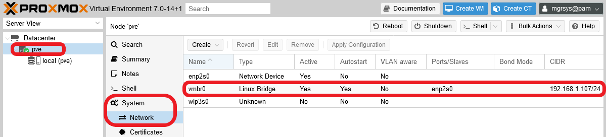

In the capture above, you can see how this Linux bridge uses the real Ethernet network card `enp2s0` as port to have access to the network. This bridge is necessary for later being able to provide network connectivity to the VMs you'll create in later guides. But keep on reading this guide to see how to apply firewalling at the bridge level with **ebtables**.

## Firewalling with `ebtables`

When you enabled the firewall at the datacenter level, you might have noticed an option in that page called `ebtables` which was already enabled.

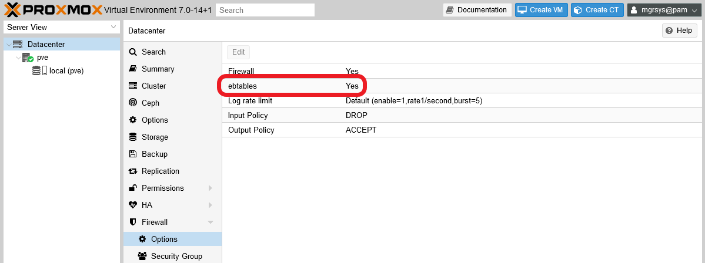

This option refers to the `ebtables` program that works as a firewall for bridges, like the one you have in your PVE virtual network. This firewall is mainly for filtering packets at the network's link layer, in which MACs (not IPs) and VLAN tags are what matter to route packets. On the other hand, `ebtables` is also capable of some packet filtering on upper network layers. The problem is that Proxmox VE doesn't have a page where you can manage `ebtables` rules, forcing you to handle them with the corresponding `ebtables` command.

> **BEWARE!**  
> As it happens with `iptables`, `ebtables` is also a legacy package that has an alternative version meant for nftables. So, only use the `ebtables` commands that don't include the `nft` string in their names.

### _Setting up `ebtables`_

The `ebtables` command handles rules but is unable to make them persist, meaning that any rules you might add to the ebtables won't survive a reboot. So you need a way to make these rules persistent in your system. To achieve this, do the following steps.

1. Open a shell as `mgrsys` on your Proxmox VE host, then install the package `netfilter-persistent`.

    ~~~bash
    $ sudo apt install netfilter-persistent
    ~~~

    This package provides a "loader for netfilter configuration" and, with the proper extension (a shell script), it can handle `ebtables` configuration too.

2. Create a new empty file at `/usr/share/netfilter-persistent/plugins.d/35-ebtables`.

    ~~~bash
    $ sudo touch /usr/share/netfilter-persistent/plugins.d/35-ebtables
    ~~~

    Then make it executable.

    ~~~bash
    $ sudo chmod 544 /usr/share/netfilter-persistent/plugins.d/35-ebtables
    ~~~

3. Copy in the `/usr/share/netfilter-persistent/plugins.d/35-ebtables` file the whole shell script below.

    ~~~bash
    #!/bin/sh

    # This file is part of netfilter-persistent
    # (was iptables-persistent)
    # Copyright (C) 2009, Simon Richter <sjr@debian.org>
    # Copyright (C) 2010, 2014 Jonathan Wiltshire <jmw@debian.org>
    #
    # This program is free software; you can redistribute it and/or
    # modify it under the terms of the GNU General Public License
    # as published by the Free Software Foundation, either version 3
    # of the License, or (at your option) any later version.

    set -e

    rc=0
    done=0

    TABLES="filter nat broute"

    for i in $TABLES; do
        modprobe -q ebtable_$i
    done

    RULES=/etc/ebtables/rules

    if [ -x ebtables ]; then
        echo "Warning: ebtables binary not available"
        exit
    fi

    load_rules()
    {
        #load ebtables rules
        for i in $TABLES; do
            done=1
            if [ -f $RULES.$i ]; then
                ebtables -t $i --atomic-file $RULES.$i --atomic-commit
                if [ $? -ne 0 ]; then
                    rc=1
                fi
            fi
        done
        if [ "x$done" = "x0" ]; then
            echo "Warning: skipping ebtables (no rules to load)"
        fi
    }

    save_rules()
    {
        #save ebtables rules
        for i in $TABLES; do
            ebtables -t $i --atomic-file $RULES.$i --atomic-save
            # zero the counters
            ebtables -t $i --atomic-file $RULES.$i -Z
        done
    }

    flush_rules()
    {
        for i in $TABLES; do
            ebtables -t $i --init-table
        done
    }

    case "$1" in
    start|restart|reload|force-reload)
        load_rules
        ;;
    save)
        save_rules
        ;;
    stop)
        # Why? because if stop is used, the firewall gets flushed for a variable
        # amount of time during package upgrades, leaving the machine vulnerable
        # It's also not always desirable to flush during purge
        echo "Automatic flushing disabled, use \"flush\" instead of \"stop\""
        ;;
    flush)
        flush_rules
        ;;
    *)
        echo "Usage: $0 {start|restart|reload|force-reload|save|flush}" >&2
        exit 1
        ;;
    esac

    exit $rc
    ~~~

    This script (found attached to [this old Debian Bug thread](https://bugs.debian.org/cgi-bin/bugreport.cgi?bug=697088)) is the extension that allows `netfilter-persistent` to truly persist the `ebtables` rules in your system.

4. Create the empty folder `/etc/ebtables`.

    ~~~bash
    $ sudo mkdir /etc/ebtables
    ~~~

    This is the folder where the previous `35-ebtables` shell script will persist the `ebtables` rules, in several `rules` files.

5. Make the script save the current `ebtables` rules to check if it works.

    ~~~bash
    $ sudo /usr/share/netfilter-persistent/plugins.d/35-ebtables save
    ~~~

    Then list the contents of `/etc/ebtables` and see if the `rules` files are there.

    ~~~bash
    $ ls /etc/ebtables/
    rules.broute  rules.filter  rules.nat
    ~~~

    You should see three different rule files, as in the output above. The files are in binary format, so don't try to open them with an editor. Each file corresponds to one of the tables `ebtables` uses to separate its functionality into different sets of rules. The `filter` table is the default one on which the `ebtables` command works.

### _Example of `ebtables` usage_

Next, I'll give you an example about when and how to use `ebtables` based on my own experience.

While I was working on this guide, I detected that incoming (`RX`) packets were being dropped only by the `vmbr0` bridge for some unknown reason. I noticed this in the output of the following `ip` command.

~~~bash
$ ip -s link show
1: lo: <LOOPBACK,UP,LOWER_UP> mtu 65536 qdisc noqueue state UNKNOWN mode DEFAULT group default qlen 1000
    link/loopback 00:00:00:00:00:00 brd 00:00:00:00:00:00
    RX: bytes  packets  errors  dropped missed  mcast
    62755      932      0       0       0       0
    TX: bytes  packets  errors  dropped carrier collsns
    62755      932      0       0       0       0
2: enp2s0: <BROADCAST,MULTICAST,UP,LOWER_UP> mtu 1500 qdisc pfifo_fast master vmbr0 state UP mode DEFAULT group default qlen 1000
    link/ether a8:ae:ed:27:c1:7d brd ff:ff:ff:ff:ff:ff
    RX: bytes  packets  errors  dropped missed  mcast
    327191     3186     0       0       0       2279
    TX: bytes  packets  errors  dropped carrier collsns
    65623      639      0       0       0       0
3: wlp3s0: <BROADCAST,MULTICAST> mtu 1500 qdisc noop state DOWN mode DEFAULT group default qlen 1000
    link/ether 64:39:ac:32:cb:23 brd ff:ff:ff:ff:ff:ff
    RX: bytes  packets  errors  dropped missed  mcast
    0          0        0       0       0       0
    TX: bytes  packets  errors  dropped carrier collsns
    0          0        0       0       0       0
4: vmbr0: <BROADCAST,MULTICAST,UP,LOWER_UP> mtu 1500 qdisc noqueue state UP mode DEFAULT group default qlen 1000
    link/ether a8:ae:ed:27:c1:7d brd ff:ff:ff:ff:ff:ff
    RX: bytes  packets  errors  dropped missed  mcast
    280443     3186     0       1494    0       2279
    TX: bytes  packets  errors  dropped carrier collsns
    65677      640      0       0       0       0
~~~

In the output above, you can see that only the `vmbr0` interface is reporting many `dropped` `RX` packets. As you can imagine, this was kind of bothersome, so I tracked them down. To do that there's a command called `tcpdump` that comes handy to see the packets themselves. The command captures the traffic going on in your system's network and prints a description of each packet it sees. I executed `tcpdump` as follows.

~~~bash
$ tcpdump -vvv -leni vmbr0 > captured-packets.txt
~~~

Notice the following:

- `-vvv`: enables the command's maximum verbosity.
- `leni`: enables printing more details from each intercepted packet
- `vmbr0`: the interface where I want to get the traffic from.
- `> captured-packets.txt`: instead of dumping the output on screen, I redirected it to a file.

This command will run in the foreground for as long as you allow it till you stop it (with `Ctrl+C`). I gave `tcpdump` about a minute to be sure that it would have enough time to catch those misteriously dropped packets, then stopped it. Next, I opened the `captured-packets.txt` file and saw something like the following.

~~~log
21:53:15.420381 a8:ae:ed:27:c1:7d > 63:6d:87:4a:1b:cd, ethertype IPv4 (0x0800), length 166: (tos 0x10, ttl 64, id 27256, offset 0, flags [DF], proto TCP (6), length 152)
    192.168.1.107.22 > 192.168.1.2.10977: Flags [P.], cksum 0x84ac (incorrect -> 0x4055), seq 1921226259:1921226371, ack 2434765221, win 501, length 112
21:53:15.428254 63:6d:87:4a:1b:cd > a8:ae:ed:27:c1:7d, ethertype IPv4 (0x0800), length 54: (tos 0x0, ttl 128, id 51333, offset 0, flags [DF], proto TCP (6), length 40)
    192.168.1.2.10977 > 192.168.1.107.22: Flags [.], cksum 0xd35f (correct), seq 1, ack 0, win 512, length 0
21:53:15.471631 63:6d:87:4a:1b:cd > a8:ae:ed:27:c1:7d, ethertype IPv4 (0x0800), length 54: (tos 0x0, ttl 128, id 51334, offset 0, flags [DF], proto TCP (6), length 40)
    192.168.1.2.10977 > 192.168.1.107.22: Flags [.], cksum 0xd2f0 (correct), seq 1, ack 112, win 511, length 0
21:53:15.519341 16:71:9c:d3:30:8b > 01:80:c2:00:00:00, 802.3, length 38: LLC, dsap STP (0x42) Individual, ssap STP (0x42) Command, ctrl 0x03: STP 802.1d, Config, Flags [none], bridge-id 8000.16:71:9c:d3:30:8b.8002, length 35
        message-age 0.00s, max-age 20.00s, hello-time 2.00s, forwarding-delay 0.00s
        root-id 8000.16:71:9c:d3:30:8b, root-pathcost 0
21:53:17.438893 16:71:9c:d3:30:8b > 01:80:c2:ef:03:fe, ethertype Unknown (0xfe68), length 111:
        0x0000:  0303 0485 f90f 0080 0180 c2ef 03fe 1882  ................
        0x0010:  8cb3 202b 004f 5350 0303 0085 f90f 0080  ...+.OSP........
        0x0020:  b5cb a588 a39d 51e9 45b5 cba5 88a3 9d51  ......Q.E......Q
        0x0030:  e942 45b7 eb4d 1e68 cac6 8ce6 6cb6 2354  .BE..M.h....l.#T
        0x0040:  103e 1b7a f801 86ec c328 901f aeca 241d  .>.z.....(....$.
        0x0050:  73d0 1c8d 82a0 32be 1c8d 82a0 32be 1c8d  s.....2.....2...
        0x0060:  82                                       .
21:53:17.438900 16:71:9c:d3:30:8b > 01:80:c2:ef:03:fe, ethertype Unknown (0xfe68), length 102:
        0x0000:  0303 0485 f90f 00c0 0180 c2ef 03fe 1882  ................
        0x0010:  8cb3 202b 0d4f 5350 0303 0d85 f90f 00c0  ...+.OSP........
        0x0020:  b5cb a588 a39d 51e9 45bc 5f5e 8382 a008  ......Q.E._^....
        0x0030:  aba9 be1c 8dc0 77a0 7fa6 40bd 85df ac59  ......w...@....Y
        0x0040:  9b18 3332 9364 05e9 6e06 45b7 c2ba 6e06  ..32.d..n.E...n.
        0x0050:  45b7 c2ba 6e06 45b7                      E...n.E.
21:53:17.438903 16:71:9c:d3:30:8b > 01:80:c2:ef:03:fe, ethertype Unknown (0xfe68), length 180:
        0x0000:  0303 0485 f90f 00c0 0180 c2ef 03fe 1882  ................
        0x0010:  8cb3 202b 0d4f 5350 0303 0e85 f90f 00c0  ...+.OSP........
        0x0020:  bf2b 564a 85ad 0c4b 60de d1da b1f8 63c3  .+VJ...K`.....c.
        0x0030:  1a7a 9114 228d 82a0 32be 1c8d 82a0 32be  .z.."...2.....2.
        0x0040:  1c8d 82a0 32be 1c8d 82a0 32be 1c8d 82a0  ....2.....2.....
        0x0050:  32be 1c8d 82a0 32be 1c8d 82a0 32be 1c8d  2.....2.....2...
        0x0060:  82a0 32be 1c8d 82a0 32be 1c8d 82a0 32be  ..2.....2.....2.
        0x0070:  1c8d 82a0 32be 1c8d 82a0 32be 1cad 3ad6  ....2.....2...:.
        0x0080:  2ca5 a63f ddcb 9371 86ad 3cf8 5318 31f4  ,..?...q..<.S.1.
        0x0090:  c29a f111 328e 7aa2 d46d 3fdd d932 8fa3  ....2.z..m?..2..
        0x00a0:  22be 2e20 b959                           "....Y
21:53:17.518887 16:71:9c:d3:30:8b > 01:80:c2:00:00:00, 802.3, length 38: LLC, dsap STP (0x42) Individual, ssap STP (0x42) Command, ctrl 0x03: STP 802.1d, Config, Flags [none], bridge-id 8000.16:71:9c:d3:30:8b.8002, length 35
        message-age 0.00s, max-age 20.00s, hello-time 2.00s, forwarding-delay 0.00s
        root-id 8000.16:71:9c:d3:30:8b, root-pathcost 0
...
~~~

From all the traffic I saw there, the thing that stood out were the packets with the `ethertype Unknown (0xfe68)` string on them. I investigated further, but the best guess I could find was that the routers or modems installed by internet service providers (ISPs) send packets like those for some reason every second or so. Knowing that much, those packets were just noise to me in my system's network, and I wanted to drop them silently before they ever reached my `vmbr0` bridge. To do this I just needed to add the proper rule in `ebtables`.

~~~bash
$ sudo ebtables -A INPUT -p fe68 -j DROP
~~~

The command above means the following.

- The rule table is omitted, meaning this rule will be added to the default `filter` table.
- `-A INPUT`: append rule to rule chain `INPUT`.
- `-p fe68`: packet protocol or ethertype `fe68`, which is the hexadecimal number returned by `tcpdump`.
- `-j DROP`: target of this rule, `DROP` in this case.

With the rule added, I checked how it looked in the `filter` table of `ebtables`.

~~~bash
$ sudo ebtables -L
Bridge table: filter

Bridge chain: INPUT, entries: 1, policy: ACCEPT
-p 0xfe68 -j DROP

Bridge chain: FORWARD, entries: 1, policy: ACCEPT
-j PVEFW-FORWARD

Bridge chain: OUTPUT, entries: 0, policy: ACCEPT

Bridge chain: BROUTING, entries: 0, policy: ACCEPT

Bridge chain: POSTROUTING, entries: 0, policy: ACCEPT

Bridge chain: PREROUTING, entries: 0, policy: ACCEPT

Bridge chain: PVEFW-FORWARD, entries: 3, policy: ACCEPT
-p IPv4 -j ACCEPT
-p IPv6 -j ACCEPT
-o fwln+ -j PVEFW-FWBR-OUT

Bridge chain: PVEFW-FWBR-OUT, entries: 0, policy: ACCEPT
~~~

Notice that:

- The `ebtables -L` command only shows the `filter` table. To specify which table to see, you have to use the `-t` option as in `ebtables -t filter -L`.
- My new rule appears in the bridge chain `INPUT`.
- Proxmox VE also has its own rules in `ebtables`, see the `PVEFW-FORWARD` and `PVEFW-FWBR-OUT` rule chains.

The final step was persisting the rules with the `netfilter-persistent` command.

~~~bash
$ sudo netfilter-persistent save
run-parts: executing /usr/share/netfilter-persistent/plugins.d/35-ebtables save
~~~

Notice, in the command's output, how it calls the `35-ebtables` shell script. Now, if you rebooted your Proxmox VE host, the `netfilter-persistent` command would restore the `ebtables` rules you've just persisted, also invoking the `35-ebtables` script for that. Look for this loading in the `/var/log/syslog` file, by searching the `netfilter-persistent` string.

Thanks to this configuration, I don't have any more `dropped` packets of that unknown ethertype showing up on my `vmbr0` bridge.

~~~bash
$ ip -s link show vmbr0
4: vmbr0: <BROADCAST,MULTICAST,UP,LOWER_UP> mtu 1500 qdisc noqueue state UP mode DEFAULT group default qlen 1000
    link/ether a8:ae:ed:27:c1:7d brd ff:ff:ff:ff:ff:ff
    RX: bytes  packets  errors  dropped missed  mcast
    123734     1392     0       0       0       1117
    TX: bytes  packets  errors  dropped carrier collsns
    32132      302      0       0       0       0
~~~

## Firewall fine tuning

You now have the Proxmox VE firewall up and running with essentially default settings, but know that you can adjust it further. In particular, there are a number of options at the node level that you should have a look to. So go to the `Firewall > Options` view at your `pve` node level.

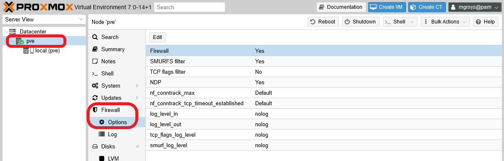

Since the official documentation is not very detailed about them, let me tell you a bit about those options.

- `Firewall`: disabled by default. Enables the firewall at the `pve` node/host level.

- `SMURFS filter`: enabled by default. Gives protection against SMURFS attacks, which are a form of distributed denial of service (DDoS) attacks "[that overloads network resources by broadcasting ICMP echo requests to devices across the network](https://www.fortinet.com/resources/cyberglossary/smurf-attack)".

- `TCP flags filter`: disabled by default. Blocks illegal TCP flag combinations that could be found in packets.

- `NDP`: enabled by default. NDP stands for _Neighbor Discovery Protocol_, and it's the IPv6 version of IPv4's ARP (_Address Resolution Protocol_). Since IPv6 is disabled in this guide series' setup, you could disable this option.

- `nf_conntrack_max`: `262144` by default. This value corresponds to both the `sysctl` parameters `net.netfilter.nf_conntrack_max` and `net.nf_conntrack_max`, meaning that by changing this value you'll change the two of them at the same time. These two values limit how many simultaneous connections can be established with your host and be tracked in the corresponding connections table maintained by netfilter. When the maximum value is reached, your host will stop accepting new TCP connections silently. If you detect connectivity issues in your setup, one of the things you can try is making this value bigger. This is one of the sysctl parameters enabled by the firewall when it got fully active, as I mentioned back in the [G012 guide](G012%20-%20Host%20hardening%2006%20~%20Network%20hardening%20with%20sysctl.md).

- `nf_conntrack_tcp_timeout_established`: `432000` by default (in seconds). This value says for how long established connections can be considered to be in such state, before being discarded as too old. The default value is equivalent to 5 days, which may or may not be excessive for your needs or requirements. If you want to reduce this value, know that the Proxmox VE web console won't allow you to put a value lower than `7875` seconds, which is equivalent to roughly 2 hours and 11 minutes.

- `log_level_in`: `nolog` value by default. To enable the logging of the firewall activity with traffic INCOMING into your host, edit this value and choose `info`. This way, you'll manage to see things like dropped packets. There are other logging levels you can choose from, as shown in the capture below.  
    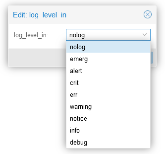

- `log_level_out`: `nolog` value by default. Change it to `info` to see the firewall activity with traffic OUTGOING from your host.

- `tcp_flags_log_level`: `nolog` value by default. To see logs of firewall actions related to TCP flags filtering.

- `smurf_log_level_in`: `nolog` value by default. To get logs of firewall action regarding SMURFS attacks protection.

### _Enabling TCP SYN flood protection_

There are three extra options related to SYN flood protection that are mentioned only in the Proxmox VE firewall documentation, [in the Host Specific Configuration subsection](https://pve.deimos.cloud:8006/pve-docs/chapter-pve-firewall.html#pve_firewall_host_specific_configuration).

- `protection_synflood`: disabled (value `0`) by default. Enables the protection against TCP syn flood attacks, which is another kind of DDoS that essentially can saturate your host's with new connection requests. This protection essentially controls how many connections can be requested by other IPs at once and per second.

- `protection_synflood_burst`: 1000 by default. Puts a limit on how many new connections can be requested from other IPs to this host.

- `protection_synflood_rate`: 200 by default. Its the maximum number of new connections that can be requested **per second** to this host from other IPs.

These three values haven't been made directly available from the PVE web console so, if you want to enable this synflood protection and configure it, you'll need to put these parameters in the corresponding `host.fw` file of your PVE node.

1. Since in this guide the Proxmox VE node is called `pve`, hence the full path of that file is `/etc/pve/nodes/pve/host.fw`. Open a shell with your `mgrsys` user, then edit the file.

    ~~~properties
    [OPTIONS]

    tcp_flags_log_level: info
    log_level_out: info
    log_level_in: info
    ndp: 0
    smurf_log_level: info
    tcpflags: 1
    nf_conntrack_tcp_timeout_established: 7875
    ~~~

    Above you can see the configuration I set up in my host, which may differ from what you have chosen to configure in your setup.

2. Below the last parameter you see in the `[OPTIONS]` section, append the synflood parameters.

    ~~~properties
    [OPTIONS]
    ...
    protection_synflood: 1
    protection_synflood_burst: 1000
    protection_synflood_rate: 200
    ~~~

    Notice that, in my case, I chose to stick with the default values for `protection_synflood_burst` and `protection_synflood_rate`.

3. The Proxmox VE documentation doesn't say if the changes in the `host.fw` file are automatically applied after saving them so, if you want to be sure, you may reboot your PVE node.

## Firewall logging

If you've configured your firewall as I've showed you before, now you have its log enabled at the node level. You can see it in the PVE web console, at the `Firewall > Log` view of your `pve` node.

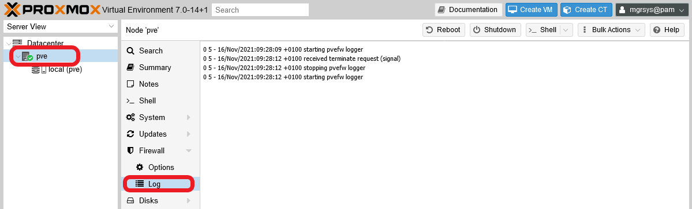

This log is a text file that you can find in your PVE host at the path `/var/log/pve-firewall.log`, and is rotated daily.

### _Understanding the firewall log_

Let's imagine you just booted up your Proxmox VE system and then you connect through a SSH client, like PuTTY, to open a shell in your PVE host. With the configuration explained in this guide, you may see lines in your firewall log like the following ones.

~~~log
0 5 - 16/Nov/2021:09:28:09 +0100 starting pvefw logger
0 5 - 16/Nov/2021:09:28:12 +0100 received terminate request (signal)
0 5 - 16/Nov/2021:09:28:12 +0100 stopping pvefw logger
0 5 - 16/Nov/2021:09:28:12 +0100 starting pvefw logger
0 6 PVEFW-HOST-IN 16/Nov/2021:10:17:00 +0100 policy DROP: IN=vmbr0 PHYSIN=enp2s0 MAC=ae:b7:cd:26:7f:d2:54:5e:96:4b:2c:cf:08:00 SRC=192.168.1.2 DST=192.168.1.107 LEN=60 TOS=0x00 PREC=0x00 TTL=128 ID=64406 PROTO=ICMP TYPE=8 CODE=0 ID=1 SEQ=1
0 6 PVEFW-HOST-IN 16/Nov/2021:10:17:17 +0100 policy DROP: IN=vmbr0 PHYSIN=enp2s0 MAC=ae:b7:cd:26:7f:d2:54:5e:96:4b:2c:cf:08:00 SRC=192.168.1.2 DST=192.168.1.107 LEN=60 TOS=0x00 PREC=0x00 TTL=128 ID=64488 PROTO=ICMP TYPE=8 CODE=0 ID=1 SEQ=2
~~~

The typical log line is formatted with the following schema:

~~~bash
VMID LOGID CHAIN TIMESTAMP POLICY: PACKET_DETAILS
~~~

This schema is translated as follows:

- `VMID`: identifies the virtual machine on which the firewall rule or policy is acting. For the Proxmox VE host itself this value is always `0`.

- `LOGID`: tells the logging level this log line has. Proxmox VE firewall has eight levels, check them out [in its official wiki](https://pve.proxmox.com/wiki/Firewall#_logging_of_firewall_rules).

- `CHAIN`: the firewall rule chain's name in which the policy or rule that provoked the log line is set. For cases in which there's no related chain, a `-` is printed here.

- `TIMESTAMP`: a full timestamp that includes the UTC.

- `POLICY`: indicates what policy was applied in the rule that printed the log line.

- `PACKET_DETAILS`: details from the affected packet, like source and destination IPs, protocol used, etc.

Knowing all that above, let's translate the previous logging example.

- All the lines are relative to the Proxmox VE host, since all of them start with the `VMID` set as `0`.

- The first four lines are **notices** just warning about the firewall logger activity:
    - Their `LOGID` is `5`, which corresponds to the **notice** logging level.
    - These log lines don't correspond to any rule chain of the firewall, so their `CHAIN` is just a `-`.
    - The `TIMESTAMP` is a full date plus the UTC reference as expected.
    - The rest of their content is just a string in which the POLICY part is just empty and the PACKET_DETAILS is used to print the notice's message.

- The following two lines **inform** of two packets that have been dropped by the firewall.
    - Their `LOGID` is `6`, which corresponds to the **info** logging level.
    - The rule that has printed this log is set in the `PVEFW-HOST-IN` chain.
    - The `TIMESTAMP` is like in the previous notice log lines.
    - The `POLICY` string indicates the `DROP` action taken with the packets.
    - The `PACKET_DETAILS` is a list of details from the dropped packets.
        - `IN`: refers to the input network device through which the packet came, in this case the bridge `vmbr0`.
        - `PHYSIN`: is the _physical_ input network device through which the packet came. Here is the ethernet network card `enp2s0` of this host, which is the one used by the bridge `vmbr0` as networking port.
        - `MAC`: this is a rather odd value because is not just the mac of a particular network device, but the concatenation of the packet's source mac (`ae:b7:cd:26:7f:d2`) with the destination mac (`54:5e:96:4b:2c:cf`) and an extra suffix `08:00`.
        - `SRC`: IP of this packet's source.
        - `DST`: IP of this packet's destination.
        - `LEN`: packet's total length in bytes.
        - `TOS`: [Type Of Service](https://linuxreviews.org/Type_of_Service_(ToS)_and_DSCP_Values), meant for prioritization of packets within a network.
        - `PREC`: the precedence bits of the previous `TOS` field.
        - `TTL`: Time To Live, which is the number of hops this packet can make before being discarded.
        - `ID`: packet's datagram identifier.
        - `PROTO`: message protocol used in the packet, [ICMP](https://en.wikipedia.org/wiki/Internet_Control_Message_Protocol) in these two cases.
        - `TYPE`: is the ICMP type of [control message](https://en.wikipedia.org/wiki/Internet_Control_Message_Protocol#Control_messages). Here is `8` which is the echo request, used to ping.
        - `CODE`: parameter used in ICMP messages, some types have several codes but the 8 only has the `0` one.
        - `ID`: this second identifier is also an ICMP field.
        - `SEQ`: a sequence identifier set up too by the ICMP protocol.

So, the conclusion you can get from those log lines is that this Proxmox VE setup is dropping incoming ping packets, something common as a network hardening method. Be aware that, in the `PACKET_DETAILS` section, you should expect seeing very different parameters depending on the protocol used on each logged packet. In the example above you've seen ICMP ping packets, but other times you might see other types of ICMP messages or, more commonly, TCP or UDP packets.

## Connection tracking tool

In this guide and in the [previous G012 one](G012%20-%20Host%20hardening%2006%20~%20Network%20hardening%20with%20sysctl.md) I've mentioned you a few times the connection tracking system enabled by the firewall. This is popularly known as _conntrack_ and not only has its own particular `sysctl` parameters (all those with the `nf_conntrack_` prefix) but there's also a command meant for system administrators that allows them manage the in-kernel connection tracking state tables.

1. Install the `conntrack` command with `apt`.

    ~~~bash
    $ sudo apt install conntrack
    ~~~

2. Test the command by showing the currently tracked connections.

    ~~~bash
    $ sudo conntrack -L
    ~~~

    The `-L` option makes `conntrack` list the currently "established" or "expected" connections in your system.

    ~~~bash
    tcp      6 82 TIME_WAIT src=127.0.0.1 dst=127.0.0.1 sport=39406 dport=85 src=127.0.0.1 dst=127.0.0.1 sport=85 dport=39406 [ASSURED] mark=0 use=1
    tcp      6 85 TIME_WAIT src=127.0.0.1 dst=127.0.0.1 sport=39410 dport=85 src=127.0.0.1 dst=127.0.0.1 sport=85 dport=39410 [ASSURED] mark=0 use=1
    tcp      6 62 TIME_WAIT src=127.0.0.1 dst=127.0.0.1 sport=39394 dport=85 src=127.0.0.1 dst=127.0.0.1 sport=85 dport=39394 [ASSURED] mark=0 use=1
    tcp      6 95 TIME_WAIT src=127.0.0.1 dst=127.0.0.1 sport=39414 dport=85 src=127.0.0.1 dst=127.0.0.1 sport=85 dport=39414 [ASSURED] mark=0 use=1
    tcp      6 18 TIME_WAIT src=127.0.0.1 dst=127.0.0.1 sport=39374 dport=85 src=127.0.0.1 dst=127.0.0.1 sport=85 dport=39374 [ASSURED] mark=0 use=1
    tcp      6 51 TIME_WAIT src=127.0.0.1 dst=127.0.0.1 sport=39390 dport=85 src=127.0.0.1 dst=127.0.0.1 sport=85 dport=39390 [ASSURED] mark=0 use=1
    tcp      6 68 TIME_WAIT src=127.0.0.1 dst=127.0.0.1 sport=39398 dport=85 src=127.0.0.1 dst=127.0.0.1 sport=85 dport=39398 [ASSURED] mark=0 use=1
    tcp      6 60 TIME_WAIT src=127.0.0.1 dst=127.0.0.1 sport=39388 dport=85 src=127.0.0.1 dst=127.0.0.1 sport=85 dport=39388 [ASSURED] mark=0 use=1
    tcp      6 89 TIME_WAIT src=127.0.0.1 dst=127.0.0.1 sport=39412 dport=85 src=127.0.0.1 dst=127.0.0.1 sport=85 dport=39412 [ASSURED] mark=0 use=1
    tcp      6 98 TIME_WAIT src=127.0.0.1 dst=127.0.0.1 sport=39416 dport=85 src=127.0.0.1 dst=127.0.0.1 sport=85 dport=39416 [ASSURED] mark=0 use=1
    tcp      6 20 TIME_WAIT src=127.0.0.1 dst=127.0.0.1 sport=39378 dport=85 src=127.0.0.1 dst=127.0.0.1 sport=85 dport=39378 [ASSURED] mark=0 use=1
    tcp      6 55 TIME_WAIT src=127.0.0.1 dst=127.0.0.1 sport=39392 dport=85 src=127.0.0.1 dst=127.0.0.1 sport=85 dport=39392 [ASSURED] mark=0 use=1
    tcp      6 5 TIME_WAIT src=127.0.0.1 dst=127.0.0.1 sport=39370 dport=85 src=127.0.0.1 dst=127.0.0.1 sport=85 dport=39370 [ASSURED] mark=0 use=1
    tcp      6 105 TIME_WAIT src=127.0.0.1 dst=127.0.0.1 sport=39420 dport=85 src=127.0.0.1 dst=127.0.0.1 sport=85 dport=39420 [ASSURED] mark=0 use=1
    tcp      6 108 TIME_WAIT src=127.0.0.1 dst=127.0.0.1 sport=39422 dport=85 src=127.0.0.1 dst=127.0.0.1 sport=85 dport=39422 [ASSURED] mark=0 use=1
    tcp      6 25 TIME_WAIT src=127.0.0.1 dst=127.0.0.1 sport=39380 dport=85 src=127.0.0.1 dst=127.0.0.1 sport=85 dport=39380 [ASSURED] mark=0 use=1
    tcp      6 73 TIME_WAIT src=127.0.0.1 dst=127.0.0.1 sport=39402 dport=85 src=127.0.0.1 dst=127.0.0.1 sport=85 dport=39402 [ASSURED] mark=0 use=1
    tcp      6 4 TIME_WAIT src=127.0.0.1 dst=127.0.0.1 sport=39366 dport=85 src=127.0.0.1 dst=127.0.0.1 sport=85 dport=39366 [ASSURED] mark=0 use=2
    tcp      6 15 TIME_WAIT src=127.0.0.1 dst=127.0.0.1 sport=39376 dport=85 src=127.0.0.1 dst=127.0.0.1 sport=85 dport=39376 [ASSURED] mark=0 use=1
    tcp      6 87 TIME_WAIT src=127.0.0.1 dst=127.0.0.1 sport=39408 dport=85 src=127.0.0.1 dst=127.0.0.1 sport=85 dport=39408 [ASSURED] mark=0 use=1
    tcp      6 7874 ESTABLISHED src=127.0.0.1 dst=127.0.0.1 sport=39426 dport=85 src=127.0.0.1 dst=127.0.0.1 sport=85 dport=39426 [ASSURED] mark=0 use=1
    tcp      6 69 TIME_WAIT src=127.0.0.1 dst=127.0.0.1 sport=39400 dport=85 src=127.0.0.1 dst=127.0.0.1 sport=85 dport=39400 [ASSURED] mark=0 use=1
    tcp      6 78 TIME_WAIT src=127.0.0.1 dst=127.0.0.1 sport=39404 dport=85 src=127.0.0.1 dst=127.0.0.1 sport=85 dport=39404 [ASSURED] mark=0 use=1
    tcp      6 7874 ESTABLISHED src=192.168.1.2 dst=192.168.1.107 sport=26945 dport=22 src=192.168.1.107 dst=192.168.1.2 sport=22 dport=26945 [ASSURED] mark=0 use=1
    tcp      6 7873 ESTABLISHED src=192.168.1.2 dst=192.168.1.107 sport=11140 dport=8006 src=192.168.1.107 dst=192.168.1.2 sport=8006 dport=11140 [ASSURED] mark=0 use=1
    tcp      6 42 TIME_WAIT src=127.0.0.1 dst=127.0.0.1 sport=39386 dport=85 src=127.0.0.1 dst=127.0.0.1 sport=85 dport=39386 [ASSURED] mark=0 use=1
    tcp      6 74 TIME_WAIT src=127.0.0.1 dst=127.0.0.1 sport=39396 dport=85 src=127.0.0.1 dst=127.0.0.1 sport=85 dport=39396 [ASSURED] mark=0 use=1
    tcp      6 7873 ESTABLISHED src=127.0.0.1 dst=127.0.0.1 sport=39428 dport=85 src=127.0.0.1 dst=127.0.0.1 sport=85 dport=39428 [ASSURED] mark=0 use=1
    tcp      6 39 TIME_WAIT src=127.0.0.1 dst=127.0.0.1 sport=39384 dport=85 src=127.0.0.1 dst=127.0.0.1 sport=85 dport=39384 [ASSURED] mark=0 use=1
    tcp      6 113 TIME_WAIT src=127.0.0.1 dst=127.0.0.1 sport=39424 dport=85 src=127.0.0.1 dst=127.0.0.1 sport=85 dport=39424 [ASSURED] mark=0 use=1
    tcp      6 6 TIME_WAIT src=127.0.0.1 dst=127.0.0.1 sport=39372 dport=85 src=127.0.0.1 dst=127.0.0.1 sport=85 dport=39372 [ASSURED] mark=0 use=1
    tcp      6 27 TIME_WAIT src=127.0.0.1 dst=127.0.0.1 sport=39382 dport=85 src=127.0.0.1 dst=127.0.0.1 sport=85 dport=39382 [ASSURED] mark=0 use=1
    unknown  2 574 src=192.168.1.1 dst=224.0.0.1 [UNREPLIED] src=224.0.0.1 dst=192.168.1.1 mark=0 use=1
    tcp      6 102 TIME_WAIT src=127.0.0.1 dst=127.0.0.1 sport=39418 dport=85 src=127.0.0.1 dst=127.0.0.1 sport=85 dport=39418 [ASSURED] mark=0 use=1
    tcp      6 7870 ESTABLISHED src=127.0.0.1 dst=127.0.0.1 sport=53236 dport=3493 src=127.0.0.1 dst=127.0.0.1 sport=3493 dport=53236 [ASSURED] mark=0 use=1
    tcp      6 7874 ESTABLISHED src=192.168.1.2 dst=192.168.1.107 sport=11137 dport=8006 src=192.168.1.107 dst=192.168.1.2 sport=8006 dport=11137 [ASSURED] mark=0 use=1
    unknown  2 578 src=192.168.1.107 dst=224.0.0.106 [UNREPLIED] src=224.0.0.106 dst=192.168.1.107 mark=0 use=1
    conntrack v1.4.6 (conntrack-tools): 37 flow entries have been shown.
    ~~~

Know that the connection tracking subsystem uses four different internal tables: _conntrack_ (the default one for active connections), _expect_, _dying_ and _unconfirmed_. Check [the `conntrack` command's `man` page](https://manpages.debian.org/bullseye/conntrack/conntrack.8.en.html) to know more.

## Relevant system paths

### _Directories_

- `/etc/pve/firewall`
- `/etc/pve/nodes/<nodename>`

### _Files_

- `/etc/pve/firewall/<VMID>.fw`
- `/etc/pve/firewall/cluster.fw`
- `/etc/pve/nodes/<nodename>/host.fw`

## References

### _Proxmox VE firewall_

- [Proxmox VE admin guide. Firewall](https://pve.proxmox.com/pve-docs/pve-admin-guide.html#chapter_pve_firewall)
- [Proxmox VE wiki. Firewall](https://pve.proxmox.com/wiki/Firewall)
- [Postinstall Configuration of Proxmox VE 6.2](https://lowendspirit.com/postinstall-configuration-of-proxmox-ve-6-2)
- [Secure Proxmox Install – Sudo, Firewall with IPv6, and more – How to Configure from Start to Finish](https://www.kiloroot.com/secure-proxmox-install-sudo-firewall-with-ipv6-and-more-how-to-configure-from-start-to-finish/)
- [Hardening Proxmox VE management interface with 2FA, reverse proxy and Let's Encrypt](https://loicpefferkorn.net/2020/11/hardening-proxmox-ve-management-interface-with-2fa-reverse-proxy-and-lets-encrypt/)

### _Ethernet Bridge firewall `ebtables`_

- [ebtables netfilter](https://ebtables.netfilter.org/)
- [Proxmox dropping packets](https://www.reddit.com/r/homelab/comments/inqncm/proxmox_dropping_packets/)
- [Tracking down dropped packets](https://blog.hambier.lu/post/tracking-dropped-packets)
- [iptables-persistent: also persist ebtables and arptables?](https://bugs.debian.org/cgi-bin/bugreport.cgi?bug=697088)

### _Network auditing on Linux_

- [How to show dropped packets per interface on Linux](https://www.cyberciti.biz/faq/linux-show-dropped-packets-per-interface-command/)
- [How to capture "dropped packets" in tcpdump](https://superuser.com/questions/1208783/how-to-capture-dropped-packets-in-tcpdump)
- [Dropped packets in all Linux and Unix](https://serverfault.com/questions/780195/dropped-packets-in-all-linux-and-unix)
- [Lots of dropped packages when tcpdumping on busy interface](https://serverfault.com/questions/421789/lots-of-dropped-packages-when-tcpdumping-on-busy-interface)

### _Network security concepts_

- [Linux TCP/IP Tuning for Scalability](https://developer.akamai.com/blog/2012/09/27/linux-tcpip-tuning-scalability)
- [What Is a Smurf Attack?](https://www.fortinet.com/resources/cyberglossary/smurf-attack)
- [Smurf attack](https://en.wikipedia.org/wiki/Smurf_attack)
- [Tcpdump: Filter Packets with Tcp Flags](https://www.howtouselinux.com/post/tcpdump-capture-packets-with-tcp-flags)
- [Filtering on TCP Flags](https://flylib.com/books/en/2.77.1.30/1/)
- [Neighbor Discovery Protocol (NDP)](https://www.oreilly.com/library/view/mastering-proxmox/9781788397605/78dcf187-f5b7-4239-89af-b4880f929b76.xhtml)
- [Address Resolution Protocol (ARP)](https://en.wikipedia.org/wiki/Address_Resolution_Protocol)
- [Netfilter Conntrack Sysfs variables](https://www.kernel.org/doc/html/latest/networking/nf_conntrack-sysctl.html)
- [TCP SYN Flood](https://www.imperva.com/learn/ddos/syn-flood/)
- [Firewall Log Messages What Do They Mean](https://www.halolinux.us/firewalls/firewall-log-messages-what-do-they-mean.html)

### _Networking concepts_

- [Internet Control Message Protocol](https://en.wikipedia.org/wiki/Internet_Control_Message_Protocol)
- [What is the Internet Control Message Protocol (ICMP)?](https://www.cloudflare.com/learning/ddos/glossary/internet-control-message-protocol-icmp/)
- [TCP/IP packets](https://inc0x0.com/tcp-ip-packets-introduction/)
- [Type of Service (ToS) and DSCP Values](https://linuxreviews.org/Type_of_Service_(ToS)_and_DSCP_Values)

### _`conntrack` command_

- [CONNTRACK(8)](https://manpages.debian.org/bullseye/conntrack/conntrack.8.en.html)
- [Package: conntrack (1:1.4.6-2)](https://packages.debian.org/bullseye/conntrack)
- [Matching connection tracking stateful metainformation](https://wiki.nftables.org/wiki-nftables/index.php/Matching_connection_tracking_stateful_metainformation)

## Navigation

[<< Previous (**G013. Host hardening 07**)](G013%20-%20Host%20hardening%2007%20~%20Mitigating%20CPU%20vulnerabilities.md) | [+Table Of Contents+](G000%20-%20Table%20Of%20Contents.md) | [Next (**G015. Host optimization 01**) >>](G015%20-%20Host%20optimization%2001%20~%20Adjustments%20through%20sysctl.md)
