# G014 - Host hardening 08 ~ Firewalling

- [Enabling your PVE's firewall is a must](#enabling-your-pves-firewall-is-a-must)
- [Proxmox VE firewall uses iptables](#proxmox-ve-firewall-uses-iptables)
  - [iptables is a legacy package](#iptables-is-a-legacy-package)
- [Zones in the Proxmox VE firewall](#zones-in-the-proxmox-ve-firewall)
- [Situation at this point](#situation-at-this-point)
- [Enabling the firewall at the Datacenter tier](#enabling-the-firewall-at-the-datacenter-tier)
  - [Netfilter conntrack sysctl parameters](#netfilter-conntrack-sysctl-parameters)
- [Firewalling with ebtables](#firewalling-with-ebtables)
  - [Setting up ebtables](#setting-up-ebtables)
  - [Example of ebtables usage](#example-of-ebtables-usage)
- [Firewall fine tuning](#firewall-fine-tuning)
  - [Enabling TCP SYN flood protection](#enabling-tcp-syn-flood-protection)
- [Firewall logging](#firewall-logging)
  - [Understanding the firewall log](#understanding-the-firewall-log)
- [Connection tracking tool](#connection-tracking-tool)
- [Relevant system paths](#relevant-system-paths)
  - [Directories](#directories)
  - [Files](#files)
- [References](#references)
  - [Proxmox](#proxmox)
  - [Contents related to the Proxmox VE firewall](#contents-related-to-the-proxmox-ve-firewall)
  - [Ethernet Bridge firewall ebtables](#ethernet-bridge-firewall-ebtables)
  - [Network auditing on Linux](#network-auditing-on-linux)
  - [Network security concepts](#network-security-concepts)
  - [Networking concepts](#networking-concepts)
  - [conntrack command](#conntrack-command)
- [Navigation](#navigation)

## Enabling your PVE's firewall is a must

One of the strongest hardening measures you can apply in any computing system is setting up a proper firewall, and Proxmox VE comes with one integrated. Needless to say, you must enable and configure this firewall to secure your virtualization server.

## Proxmox VE firewall uses iptables

The Proxmox VE firewall is based on iptables, meaning that any rules defined within the PVE firewall will be enforced by the underlying iptables firewall present in your standalone node. In a cluster, those rules are spread by the PVE firewall daemon through all the nodes.

### iptables is a legacy package

The iptables is a legacy package that has been replaced by [nftables](https://wiki.nftables.org/wiki-nftables/index.php/Main_Page) (where `nf` stands for _Netfilter_), but Proxmox VE 9.0 is still using iptables. You can verify this by printing the iptables version.

~~~sh
$ sudo iptables -V
iptables v1.8.11 (legacy)
~~~

> [!NOTE]
> **You can enable in your Proxmox VE system a nftables-based version of its firewall**\
> At the time of writing this, [the new nftables-based `proxmox-firewall` service it is still in the _tech-preview_ stage](https://pve.proxmox.com/pve-docs/pve-admin-guide.html#pve_firewall_nft). Therefore, this guide sticks to the legacy iptables-based firewall, which is the one that comes enabled by default in a Proxmox VE 9.0 server.
>
> If you want to try using the nftables firewall, know that the configuration explained here is compatible with the new firewall since it uses the same files and configuration format.

> [!IMPORTANT]
> **Fail2Ban uses nftables!**\
> Remember that the Fail2Ban service you enabled [back in chapter **G010** already uses nftables to ban IPs](G010%20-%20Host%20hardening%2004%20~%20Enabling%20Fail2Ban.md#fail2ban-uses-nftables-to-enforce-the-bans). Both iptables and nftables can coexist, but you must remember which one is used to ban suspicious IPs (nftables) and which one is used by Proxmox VE as its main firewall (iptables).

> [!NOTE]
> **Careful of not confusing nftables commands with iptables ones**\
> There are several iptables commands available in the system, but some of them are meant to be used with the nftables firewall. So, when you specifically execute iptables commands, avoid using the ones that have the `-nft` string in their names (unless you have switched to the new nftables firewall).

## Zones in the Proxmox VE firewall

The [Proxmox VE documentation](https://pve.proxmox.com/pve-docs/pve-admin-guide.html#_directions_amp_zones) indicates that the firewall groups the network in three logical zones:

- **Host**\
  Traffic from/to a cluster node (a host).

- **VM**\
  Traffic from/to a specific VM or container.

- **VNet**\
  Traffic passing through a SDN VNet, either from guest to guest or from host to guest and vice-versa.

But the same documentation also mentions three distinct tiers, or levels, that are contemplated by the PVE firewall: datacenter (the cluster), hosts (the cluster nodes) and guests (the virtual machines or containers).

Be always aware that these tiers or zones are kind of independent from each other. Essentially, the firewall has to be enabled on each level individually, and the rules applied at the datacenter level are not be applied automatically in cascade to the lower tiers. You have to enable each firewall option specifically for each level, and for each virtual NIC on each guest in the case of VMs and containers.

Also, know that the PVE firewall offers different options for each tier.

## Situation at this point

You can find the Proxmox VE firewall feature already enabled by default at the node level of your setup. You can verify this in the web console at the `pve` node level, by going to the `Firewall > Options` of your standalone node:

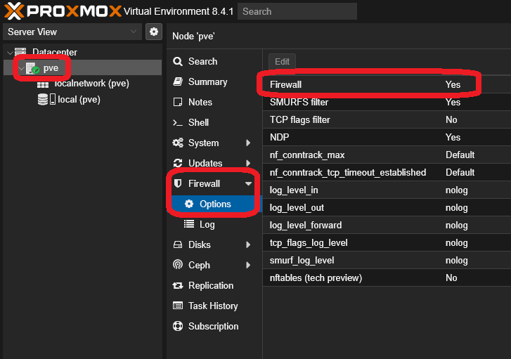

However, the PVE firewall **is NOT running at the `Datacenter` tier**:

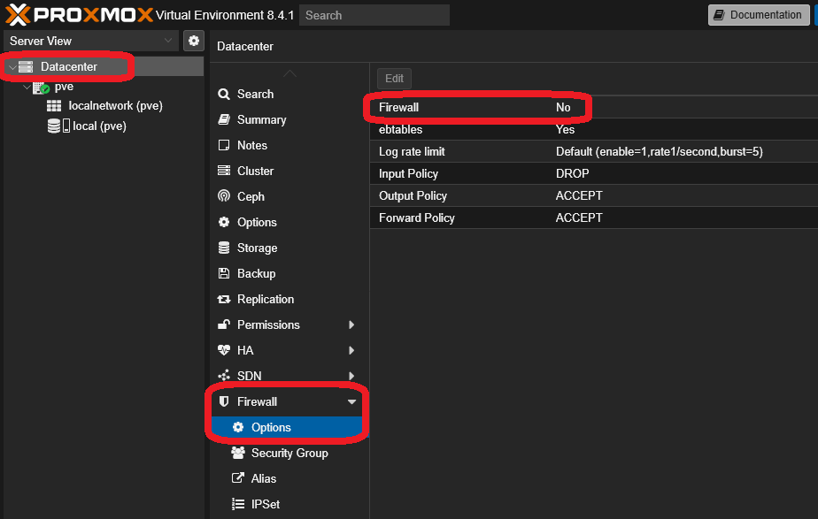

The Proxmox VE documentation indicates that the firewall comes disabled "cluster-wide" after the installation. That is why you find the `Firewall` disabled at the `Datacenter` level.

Furthermore, from the PVE web console's point of view, the firewall does not seem to have any rules whatsoever. You can see this in the `Firewall` page of either the `Datacenter` or the node tier.

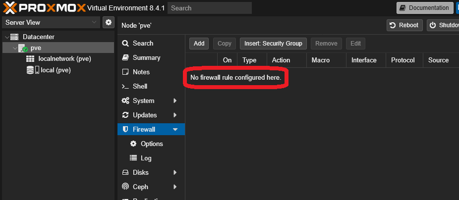

The _No firewall rule configured here._ line highlighted in the snapshot above is mostly correct. If you open a shell terminal in your node as your `mgrsys` user, you can check the rules actually enabled in the iptables firewall of your Proxmox VE server:

~~~sh
$ sudo iptables -L -n
Chain INPUT (policy ACCEPT)
target     prot opt source               destination

Chain FORWARD (policy ACCEPT)
target     prot opt source               destination

Chain OUTPUT (policy ACCEPT)
target     prot opt source               destination
~~~

There are no rules per se, just empty _chains of rules_. Still, you can see how each `Chain` has a policy already established: **all chains are accepting everything** with the `ACCEPT` policy. Your firewall is completely open, something you do not want at all.

Next, revise which are the ports currently open in your PVE system:

~~~sh
$ sudo ss -atlnup
Netid            State             Recv-Q            Send-Q                       Local Address:Port                       Peer Address:Port           Process
udp              UNCONN            0                 0                                127.0.0.1:323                             0.0.0.0:*               users:(("chronyd",pid=819,fd=5))
tcp              LISTEN            0                 100                              127.0.0.1:25                              0.0.0.0:*               users:(("master",pid=1101,fd=13))
tcp              LISTEN            0                 4096                             127.0.0.1:85                              0.0.0.0:*               users:(("pvedaemon worke",pid=1151,fd=6),("pvedaemon worke",pid=1150,fd=6),("pvedaemon worke",pid=1148,fd=6),("pvedaemon",pid=1147,fd=6))
tcp              LISTEN            0                 4096                              10.1.0.1:8006                            0.0.0.0:*               users:(("pveproxy worker",pid=1796,fd=6),("pveproxy worker",pid=1795,fd=6),("pveproxy worker",pid=1794,fd=6),("pveproxy",pid=1161,fd=6))
tcp              LISTEN            0                 128                               10.1.0.1:22                              0.0.0.0:*               users:(("sshd",pid=942,fd=6))
tcp              LISTEN            0                 16                               127.0.0.1:3493                            0.0.0.0:*               users:(("upsd",pid=1109,fd=4))
~~~

If you have followed this guide closely up to this chapter, you should get a list of listening sockets like the output above (although not necessarily in the same order):

- **Service `chronyd` listening on localhost (`127.0.0.1`) interface at port `323`**\
  Daemon for synchronizing the system's clock with an external time server (already seen back in the [**G012** chapter](G012%20-%20Host%20hardening%2006%20~%20Network%20hardening%20with%20sysctl.md#disabling-chronys-ipv6-socket)).

- **Service `master` listening on localhost (`127.0.0.1`) interface at port `25`**\
  Postmaster mail service providing mailing within the system itself.

- **Service `pvedaemon` listening on localhost (`127.0.0.1`) interface at port `85`**\
  Exposes the whole Proxmox VE API.

- **Service `pveproxy` listening on the host's network Ethernet interface (`10.1.0.1`) at port `8006`**\
  Proxmox VE proxy that gives access to the web console and also exposes the Proxmox VE API.

- **Service `sshd` listening on the host's network Ethernet interface (`10.1.0.1`) at port `22`**\
  SSH daemon service.

- **Service `upsd` listening on localhost (`127.0.0.1`) interface at port `3493`**\
  NUT service for monitoring your UPS.

## Enabling the firewall at the Datacenter tier

Just by enabling the PVE firewall at the `Datacenter` tier you get a much stronger set of rules enforced in your firewall. But, before you do this...

> [!WARNING]
> **Read this warning before enabling the firewall at the `Datacenter` tier**\
> After enabling the firewall at the `Datacenter` tier, your Proxmox VE platform will block incoming traffic from all hosts towards your datacenter, except the traffic coming from your LAN towards the 8006 (web console) and 22 (ssh) ports.
>
> If you plan to access your PVE platform **from IPs outside your LAN**, you need to **add first** the rules in the PVE firewall to allow such access. But this guide does not cover that scenario, it just assumes a "pure" LAN scenario (meaning a Proxmox VE server **not accessible** from internet).

Assuming you are accessing your PVE system from another computer in the same LAN, go to the `Datacenter > Firewall > Options` screen in the web console and select the `Firewall` parameter:

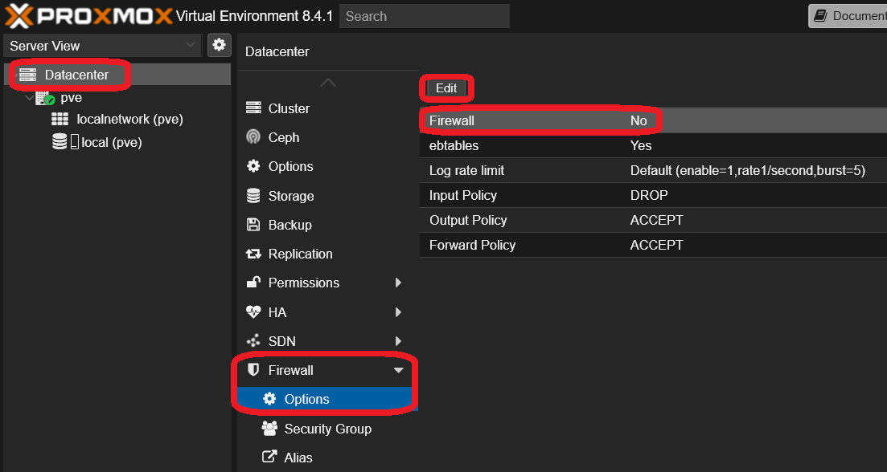

Click on `Edit` and mark the `Firewall` checkbox presented to enable the firewall at the `Datacenter` tier:

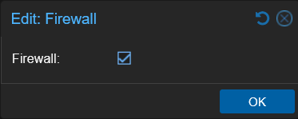

Hit `OK` and you'll see how the `Firewall` parameter has changed to a `Yes` value:

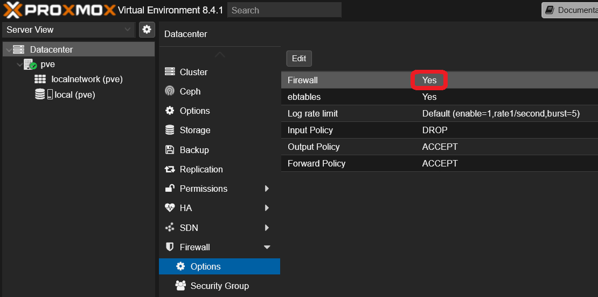

The change will be applied immediately, but you will not see any rules at all in your Proxmox VE server's `Firewall` pages, neither at the `Datacenter` nor at the `pve` node level. What changes a lot is the iptables ruleset, something you can verify with the `iptables` command:

~~~sh
$ sudo iptables -L -n
Chain INPUT (policy ACCEPT)
target     prot opt source               destination
PVEFW-INPUT  all  --  0.0.0.0/0            0.0.0.0/0

Chain FORWARD (policy ACCEPT)
target     prot opt source               destination
PVEFW-FORWARD  all  --  0.0.0.0/0            0.0.0.0/0

Chain OUTPUT (policy ACCEPT)
target     prot opt source               destination
PVEFW-OUTPUT  all  --  0.0.0.0/0            0.0.0.0/0

Chain PVEFW-Drop (1 references)
target     prot opt source               destination
PVEFW-DropBroadcast  all  --  0.0.0.0/0            0.0.0.0/0
ACCEPT     icmp --  0.0.0.0/0            0.0.0.0/0            icmptype 3 code 4
ACCEPT     icmp --  0.0.0.0/0            0.0.0.0/0            icmptype 11
DROP       all  --  0.0.0.0/0            0.0.0.0/0            ctstate INVALID
DROP       udp  --  0.0.0.0/0            0.0.0.0/0            multiport dports 135,445
DROP       udp  --  0.0.0.0/0            0.0.0.0/0            udp dpts:137:139
DROP       udp  --  0.0.0.0/0            0.0.0.0/0            udp spt:137 dpts:1024:65535
DROP       tcp  --  0.0.0.0/0            0.0.0.0/0            multiport dports 135,139,445
DROP       udp  --  0.0.0.0/0            0.0.0.0/0            udp dpt:1900
DROP       tcp  --  0.0.0.0/0            0.0.0.0/0            tcp flags:!0x17/0x02
DROP       udp  --  0.0.0.0/0            0.0.0.0/0            udp spt:53
           all  --  0.0.0.0/0            0.0.0.0/0            /* PVESIG:83WlR/a4wLbmURFqMQT3uJSgIG8 */

Chain PVEFW-DropBroadcast (2 references)
target     prot opt source               destination
DROP       all  --  0.0.0.0/0            0.0.0.0/0            ADDRTYPE match dst-type BROADCAST
DROP       all  --  0.0.0.0/0            0.0.0.0/0            ADDRTYPE match dst-type MULTICAST
DROP       all  --  0.0.0.0/0            0.0.0.0/0            ADDRTYPE match dst-type ANYCAST
DROP       all  --  0.0.0.0/0            224.0.0.0/4
           all  --  0.0.0.0/0            0.0.0.0/0            /* PVESIG:NyjHNAtFbkH7WGLamPpdVnxHy4w */

Chain PVEFW-FORWARD (1 references)
target     prot opt source               destination
DROP       all  --  0.0.0.0/0            0.0.0.0/0            ctstate INVALID
ACCEPT     all  --  0.0.0.0/0            0.0.0.0/0            ctstate RELATED,ESTABLISHED
PVEFW-FWBR-IN  all  --  0.0.0.0/0            0.0.0.0/0            PHYSDEV match --physdev-in fwln+ --physdev-is-bridged
PVEFW-FWBR-OUT  all  --  0.0.0.0/0            0.0.0.0/0            PHYSDEV match --physdev-out fwln+ --physdev-is-bridged
           all  --  0.0.0.0/0            0.0.0.0/0            /* PVESIG:qnNexOcGa+y+jebd4dAUqFSp5nw */

Chain PVEFW-FWBR-IN (1 references)
target     prot opt source               destination
PVEFW-smurfs  all  --  0.0.0.0/0            0.0.0.0/0            ctstate INVALID,NEW
           all  --  0.0.0.0/0            0.0.0.0/0            /* PVESIG:Ijl7/xz0DD7LF91MlLCz0ybZBE0 */

Chain PVEFW-FWBR-OUT (1 references)
target     prot opt source               destination
           all  --  0.0.0.0/0            0.0.0.0/0            /* PVESIG:2jmj7l5rSw0yVb/vlWAYkK/YBwk */

Chain PVEFW-HOST-IN (1 references)
target     prot opt source               destination
ACCEPT     all  --  0.0.0.0/0            0.0.0.0/0
DROP       all  --  0.0.0.0/0            0.0.0.0/0            ctstate INVALID
ACCEPT     all  --  0.0.0.0/0            0.0.0.0/0            ctstate RELATED,ESTABLISHED
PVEFW-smurfs  all  --  0.0.0.0/0            0.0.0.0/0            ctstate INVALID,NEW
RETURN     2    --  0.0.0.0/0            0.0.0.0/0
RETURN     tcp  --  0.0.0.0/0            0.0.0.0/0            match-set PVEFW-0-management-v4 src tcp dpt:8006
RETURN     tcp  --  0.0.0.0/0            0.0.0.0/0            match-set PVEFW-0-management-v4 src tcp dpts:5900:5999
RETURN     tcp  --  0.0.0.0/0            0.0.0.0/0            match-set PVEFW-0-management-v4 src tcp dpt:3128
RETURN     tcp  --  0.0.0.0/0            0.0.0.0/0            match-set PVEFW-0-management-v4 src tcp dpt:22
RETURN     tcp  --  0.0.0.0/0            0.0.0.0/0            match-set PVEFW-0-management-v4 src tcp dpts:60000:60050
PVEFW-Drop  all  --  0.0.0.0/0            0.0.0.0/0
DROP       all  --  0.0.0.0/0            0.0.0.0/0
           all  --  0.0.0.0/0            0.0.0.0/0            /* PVESIG:cucENGwfi+iPw5e/BS7lH7zNnU8 */

Chain PVEFW-HOST-OUT (1 references)
target     prot opt source               destination
ACCEPT     all  --  0.0.0.0/0            0.0.0.0/0
DROP       all  --  0.0.0.0/0            0.0.0.0/0            ctstate INVALID
ACCEPT     all  --  0.0.0.0/0            0.0.0.0/0            ctstate RELATED,ESTABLISHED
RETURN     2    --  0.0.0.0/0            0.0.0.0/0
RETURN     tcp  --  0.0.0.0/0            10.0.0.0/8           tcp dpt:8006
RETURN     tcp  --  0.0.0.0/0            10.0.0.0/8           tcp dpt:22
RETURN     tcp  --  0.0.0.0/0            10.0.0.0/8           tcp dpts:5900:5999
RETURN     tcp  --  0.0.0.0/0            10.0.0.0/8           tcp dpt:3128
RETURN     all  --  0.0.0.0/0            0.0.0.0/0
           all  --  0.0.0.0/0            0.0.0.0/0            /* PVESIG:ayfLu3G+p/8c4SeNBnCZRkwon94 */

Chain PVEFW-INPUT (1 references)
target     prot opt source               destination
PVEFW-HOST-IN  all  --  0.0.0.0/0            0.0.0.0/0
           all  --  0.0.0.0/0            0.0.0.0/0            /* PVESIG:+5iMmLaxKXynOB/+5xibfx7WhFk */

Chain PVEFW-OUTPUT (1 references)
target     prot opt source               destination
PVEFW-HOST-OUT  all  --  0.0.0.0/0            0.0.0.0/0
           all  --  0.0.0.0/0            0.0.0.0/0            /* PVESIG:LjHoZeSSiWAG3+2ZAyL/xuEehd0 */

Chain PVEFW-Reject (0 references)
target     prot opt source               destination
PVEFW-DropBroadcast  all  --  0.0.0.0/0            0.0.0.0/0
ACCEPT     icmp --  0.0.0.0/0            0.0.0.0/0            icmptype 3 code 4
ACCEPT     icmp --  0.0.0.0/0            0.0.0.0/0            icmptype 11
DROP       all  --  0.0.0.0/0            0.0.0.0/0            ctstate INVALID
PVEFW-reject  udp  --  0.0.0.0/0            0.0.0.0/0            multiport dports 135,445
PVEFW-reject  udp  --  0.0.0.0/0            0.0.0.0/0            udp dpts:137:139
PVEFW-reject  udp  --  0.0.0.0/0            0.0.0.0/0            udp spt:137 dpts:1024:65535
PVEFW-reject  tcp  --  0.0.0.0/0            0.0.0.0/0            multiport dports 135,139,445
DROP       udp  --  0.0.0.0/0            0.0.0.0/0            udp dpt:1900
DROP       tcp  --  0.0.0.0/0            0.0.0.0/0            tcp flags:!0x17/0x02
DROP       udp  --  0.0.0.0/0            0.0.0.0/0            udp spt:53
           all  --  0.0.0.0/0            0.0.0.0/0            /* PVESIG:h3DyALVslgH5hutETfixGP08w7c */

Chain PVEFW-SET-ACCEPT-MARK (0 references)
target     prot opt source               destination
MARK       all  --  0.0.0.0/0            0.0.0.0/0            MARK or 0x80000000
           all  --  0.0.0.0/0            0.0.0.0/0            /* PVESIG:Hg/OIgIwJChBUcWU8Xnjhdd2jUY */

Chain PVEFW-logflags (5 references)
target     prot opt source               destination
DROP       all  --  0.0.0.0/0            0.0.0.0/0
           all  --  0.0.0.0/0            0.0.0.0/0            /* PVESIG:MN4PH1oPZeABMuWr64RrygPfW7A */

Chain PVEFW-reject (4 references)
target     prot opt source               destination
DROP       all  --  0.0.0.0/0            0.0.0.0/0            ADDRTYPE match dst-type BROADCAST
DROP       all  --  224.0.0.0/4          0.0.0.0/0
DROP       icmp --  0.0.0.0/0            0.0.0.0/0
REJECT     tcp  --  0.0.0.0/0            0.0.0.0/0            reject-with tcp-reset
REJECT     udp  --  0.0.0.0/0            0.0.0.0/0            reject-with icmp-port-unreachable
REJECT     icmp --  0.0.0.0/0            0.0.0.0/0            reject-with icmp-host-unreachable
REJECT     all  --  0.0.0.0/0            0.0.0.0/0            reject-with icmp-host-prohibited
           all  --  0.0.0.0/0            0.0.0.0/0            /* PVESIG:Jlkrtle1mDdtxDeI9QaDSL++Npc */

Chain PVEFW-smurflog (2 references)
target     prot opt source               destination
DROP       all  --  0.0.0.0/0            0.0.0.0/0
           all  --  0.0.0.0/0            0.0.0.0/0            /* PVESIG:2gfT1VMkfr0JL6OccRXTGXo+1qk */

Chain PVEFW-smurfs (2 references)
target     prot opt source               destination
RETURN     all  --  0.0.0.0              0.0.0.0/0
PVEFW-smurflog  all  --  0.0.0.0/0            0.0.0.0/0           [goto]  ADDRTYPE match src-type BROADCAST
PVEFW-smurflog  all  --  224.0.0.0/4          0.0.0.0/0           [goto]
           all  --  0.0.0.0/0            0.0.0.0/0            /* PVESIG:HssVe5QCBXd5mc9kC88749+7fag */

Chain PVEFW-tcpflags (0 references)
target     prot opt source               destination
PVEFW-logflags  tcp  --  0.0.0.0/0            0.0.0.0/0           [goto]  tcp flags:0x3F/0x29
PVEFW-logflags  tcp  --  0.0.0.0/0            0.0.0.0/0           [goto]  tcp flags:0x3F/0x00
PVEFW-logflags  tcp  --  0.0.0.0/0            0.0.0.0/0           [goto]  tcp flags:0x06/0x06
PVEFW-logflags  tcp  --  0.0.0.0/0            0.0.0.0/0           [goto]  tcp flags:0x03/0x03
PVEFW-logflags  tcp  --  0.0.0.0/0            0.0.0.0/0           [goto]  tcp spt:0 flags:0x17/0x02
           all  --  0.0.0.0/0            0.0.0.0/0            /* PVESIG:CMFojwNPqllyqD67NeI5m+bP5mo */
~~~

As you can see in the long output above, quite a lot of rules have been added just by enabling the firewall at the `Datacenter` tier. And, if you look closely, you will notice that most of these rules are applied to any source or destination IP. Only a few ones, defined in the `Chain PVEFW-HOST-OUT`, are particular to your local network.

The Proxmox VE firewall's `.fw` configuration files can be found at the following locations:

- `/etc/pve/firewall/cluster.fw`\
  For the datacenter or cluster wide tier.

- `/etc/pve/firewall/<VMID>.fw`\
  For each virtual machine or container, identified by their `<VMID>`, present in the system.

- `/etc/pve/nodes/<nodename>/host.fw`\
  For each node, identified by their `<nodename>`, present in the datacenter.

- `/etc/pve/sdn/firewall/<vnet_name>.fw`\
  For each VNet configured in the system, identified by their `<vnet_name>`.

These files will only appear in your system when you change the configuration they belong to. For instance, at this point, you will only find the `/etc/pve/firewall/cluster.fw` file existing under its expected path.

### Netfilter conntrack sysctl parameters

It was hinted back in the [chapter **G012**](G012%20-%20Host%20hardening%2006%20~%20Network%20hardening%20with%20sysctl.md#some-sysctl-values-are-managed-by-the-proxmox-ve-firewall) how, by enabling the firewall, new `sysctl` parameters would become available in your Proxmox VE host. Those new parameters are all the files put in the `/proc/sys/net/netfilter` folder, except the `nf_log` ones which were already present initially. All of them are related to the netfilter conntrack system used to track network connections on the system. A new `/proc/sys/net/nf_conntrack_max` file is also created as a duplicate of the `/proc/sys/net/netfilter/nf_conntrack_max` file, maybe as a management convenience for Proxmox VE.

But not only new parameters are enabled, some already existing ones get changed. In particular the `net.bridge.bridge-nf-call-ip6tables` and `net.bridge.bridge-nf-call-iptables` are set to `1`, enabling filtering on the bridges existing on the host. In fact, at this point your system already has one Linux bridge enabled, which you can find in the `pve` node level at the `System > Network` view:

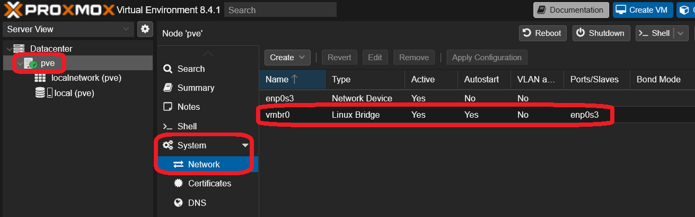

In the capture above, you can see how this Linux bridge uses the host's Ethernet network card `enp3s0` as port to have access to the network. This bridge is necessary for later being able to provide network connectivity to the VMs you will create in later chapters. But keep on reading this chapter to see how to apply firewalling at the bridge level with ebtables.

## Firewalling with ebtables

When you enabled the firewall at the datacenter level, you may have noticed the `ebtables` option which was already active:

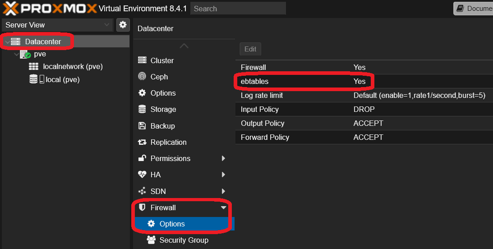

This option refers to the ebtables program that works as a firewall for bridges, like the one you have in your PVE virtual network. This firewall is mainly for filtering packets at the network's link layer, in which MACs (not IPs) and VLAN tags are what matter to route packets. On the other hand, ebtables is also capable of some packet filtering on upper network layers. The problem is that Proxmox VE does not have a page where you can manage ebtables rules, forcing you to handle them with the corresponding `ebtables` shell command.

> [!WARNING]
> **The ebtables firewall is a legacy program**\
> As it happens with iptables, ebtables is also a legacy package that has an alternative version meant for nftables. Therefore, in a Proxmox VE setup based on this guide, only use the ebtables commands that do not include the `-nft` string in their names.

### Setting up ebtables

The `ebtables` command handles rules but is unable to make them persist, meaning that any rules you may add to the ebtables will not survive a reboot. But there is a way to persist these rules in your system:

> [!WARNING]
> **This configuration may not work with the nftables version of ebtables**\
> Keep this in mind if you want to try the nftables-based firewall of Proxmox VE.

1. Open a shell as `mgrsys` on your Proxmox VE host, then install the package `netfilter-persistent`:

    ~~~sh
    $ sudo apt install netfilter-persistent
    ~~~

    This package provides a "_loader for netfilter configuration_" and, with the proper extension (a shell script), it can handle ebtables configuration too.

2. Create a new empty file at `/usr/share/netfilter-persistent/plugins.d/35-ebtables`:

    ~~~sh
    $ sudo touch /usr/share/netfilter-persistent/plugins.d/35-ebtables
    ~~~

    Then make it executable.

    ~~~sh
    $ sudo chmod 544 /usr/share/netfilter-persistent/plugins.d/35-ebtables
    ~~~

3. Copy in the `/usr/share/netfilter-persistent/plugins.d/35-ebtables` file the whole shell script below:

    ~~~sh
    #!/bin/sh

    # This file is part of netfilter-persistent
    # (was iptables-persistent)
    # Copyright (C) 2009, Simon Richter <sjr@debian.org>
    # Copyright (C) 2010, 2014 Jonathan Wiltshire <jmw@debian.org>
    #
    # This program is free software; you can redistribute it and/or
    # modify it under the terms of the GNU General Public License
    # as published by the Free Software Foundation, either version 3
    # of the License, or (at your option) any later version.

    set -e

    rc=0
    done=0

    TABLES="filter nat broute"

    for i in $TABLES; do
        modprobe -q ebtable_$i
    done

    RULES=/etc/ebtables/rules

    if [ -x ebtables ]; then
        echo "Warning: ebtables binary not available"
        exit
    fi

    load_rules()
    {
        #load ebtables rules
        for i in $TABLES; do
            done=1
            if [ -f $RULES.$i ]; then
                ebtables -t $i --atomic-file $RULES.$i --atomic-commit
                if [ $? -ne 0 ]; then
                    rc=1
                fi
            fi
        done
        if [ "x$done" = "x0" ]; then
            echo "Warning: skipping ebtables (no rules to load)"
        fi
    }

    save_rules()
    {
        #save ebtables rules
        for i in $TABLES; do
            ebtables -t $i --atomic-file $RULES.$i --atomic-save
            # zero the counters
            ebtables -t $i --atomic-file $RULES.$i -Z
        done
    }

    flush_rules()
    {
        for i in $TABLES; do
            ebtables -t $i --init-table
        done
    }

    case "$1" in
    start|restart|reload|force-reload)
        load_rules
        ;;
    save)
        save_rules
        ;;
    stop)
        # Why? because if stop is used, the firewall gets flushed for a variable
        # amount of time during package upgrades, leaving the machine vulnerable
        # It's also not always desirable to flush during purge
        echo "Automatic flushing disabled, use \"flush\" instead of \"stop\""
        ;;
    flush)
        flush_rules
        ;;
    *)
        echo "Usage: $0 {start|restart|reload|force-reload|save|flush}" >&2
        exit 1
        ;;
    esac

    exit $rc
    ~~~

    This script (found attached to [this old Debian Bug thread](https://bugs.debian.org/cgi-bin/bugreport.cgi?bug=697088)) is the extension that allows `netfilter-persistent` to truly persist the ebtables rules in your system.

4. Create the empty folder `/etc/ebtables`:

    ~~~sh
    $ sudo mkdir /etc/ebtables
    ~~~

    This is the folder where the previous `35-ebtables` shell script will persist the ebtables rules, in several `rules` files.

5. Make the script save the current ebtables rules to check if it works:

    ~~~sh
    $ sudo /usr/share/netfilter-persistent/plugins.d/35-ebtables save
    ~~~

    Then list the contents of `/etc/ebtables` and see if the `rules` files are there:

    ~~~sh
    $ ls /etc/ebtables/
    rules.broute  rules.filter  rules.nat
    ~~~

    You should see three different rule files, as in the output above.

    > [!NOTE]
    > **Do not open the ebtables rule files with a text editor**\
    > The files are in binary format. Do not manipulate them in any way.
  
    Each file corresponds to one of the tables ebtables uses to separate its functionality into different sets of rules. The `filter` table is the default one on which the ebtables command works.

### Example of ebtables usage

Next, see an example about when and how to use ebtables.

> [!NOTE]
> **The example shown here is based on the original hardware setup used for the first version of this guide**\
> Therefore you will notice small differences with the hardware used in this newer version of the guide. Still, the commands used in this example are still valid.

While working in the first version of this guide, it was detected that incoming (`RX`) packets were being dropped only by the `vmbr0` bridge for some unknown reason. This was noticed in the output of the following `ip` command:

~~~sh
$ ip -s link show
1: lo: <LOOPBACK,UP,LOWER_UP> mtu 65536 qdisc noqueue state UNKNOWN mode DEFAULT group default qlen 1000
    link/loopback 00:00:00:00:00:00 brd 00:00:00:00:00:00
    RX:  bytes packets errors dropped  missed   mcast
        213838    2817      0       0       0       0
    TX:  bytes packets errors dropped carrier collsns
        213838    2817      0       0       0       0
2: enp3s0: <BROADCAST,MULTICAST,UP,LOWER_UP> mtu 1500 qdisc fq_codel master vmbr0 state UP mode DEFAULT group default qlen 1000
    link/ether 87:ea:ab:02:15:a5 brd ff:ff:ff:ff:ff:ff
    RX:  bytes packets errors dropped  missed   mcast
       4365227   13252      0     448       0    4972
    TX:  bytes packets errors dropped carrier collsns
       3220375    5281      0       1       0       0
    altname enx98eecb0305a3
3: vmbr0: <BROADCAST,MULTICAST,UP,LOWER_UP> mtu 1500 qdisc noqueue state UP mode DEFAULT group default qlen 1000
    link/ether 87:ea:ab:02:15:a5 brd ff:ff:ff:ff:ff:ff
    RX:  bytes packets errors dropped  missed   mcast
       4051731   12474      0       0       0    4524
    TX:  bytes packets errors dropped carrier collsns
       3220459    5283      0       0       0       0
~~~

In the output above, you can see that only the `vmbr0` interface is reporting many `dropped` `RX` packets. Since they looked odd, they have to be tracked down. To do that there is a command called `tcpdump` that comes handy to see the packets themselves. The command captures the traffic going on in your system's network and prints a description of each packet it sees. The `tcpdump` command was executed as follows:

~~~sh
$ sudo tcpdump -vvv -leni vmbr0 > captured-packets.txt
~~~

Notice the following in the `tcpdump` command:

- `-vvv`: enables the command's maximum verbosity.
- `leni`: enables printing more details from each intercepted packet
- `vmbr0`: the interface where I want to get the traffic from.
- `> captured-packets.txt`: instead of dumping the output on screen, I redirected it to a file.

This command will run in the foreground for as long as you allow it till you stop it (with `Ctrl+C`). The `tcpdump` command had about a minute to ensure it would have enough time to catch those misteriously dropped packets, then it was stopped. The resulting `captured-packets.txt` file looked like this:

~~~log
21:53:15.420381 a8:ae:ed:27:c1:7d > 63:6d:87:4a:1b:cd, ethertype IPv4 (0x0800), length 166: (tos 0x10, ttl 64, id 27256, offset 0, flags [DF], proto TCP (6), length 152)
    192.168.1.107.22 > 192.168.1.2.10977: Flags [P.], cksum 0x84ac (incorrect -> 0x4055), seq 1921226259:1921226371, ack 2434765221, win 501, length 112
21:53:15.428254 63:6d:87:4a:1b:cd > a8:ae:ed:27:c1:7d, ethertype IPv4 (0x0800), length 54: (tos 0x0, ttl 128, id 51333, offset 0, flags [DF], proto TCP (6), length 40)
    192.168.1.2.10977 > 192.168.1.107.22: Flags [.], cksum 0xd35f (correct), seq 1, ack 0, win 512, length 0
21:53:15.471631 63:6d:87:4a:1b:cd > a8:ae:ed:27:c1:7d, ethertype IPv4 (0x0800), length 54: (tos 0x0, ttl 128, id 51334, offset 0, flags [DF], proto TCP (6), length 40)
    192.168.1.2.10977 > 192.168.1.107.22: Flags [.], cksum 0xd2f0 (correct), seq 1, ack 112, win 511, length 0
21:53:15.519341 16:71:9c:d3:30:8b > 01:80:c2:00:00:00, 802.3, length 38: LLC, dsap STP (0x42) Individual, ssap STP (0x42) Command, ctrl 0x03: STP 802.1d, Config, Flags [none], bridge-id 8000.16:71:9c:d3:30:8b.8002, length 35
        message-age 0.00s, max-age 20.00s, hello-time 2.00s, forwarding-delay 0.00s
        root-id 8000.16:71:9c:d3:30:8b, root-pathcost 0
21:53:17.438893 16:71:9c:d3:30:8b > 01:80:c2:ef:03:fe, ethertype Unknown (0xfe68), length 111:
        0x0000:  0303 0485 f90f 0080 0180 c2ef 03fe 1882  ................
        0x0010:  8cb3 202b 004f 5350 0303 0085 f90f 0080  ...+.OSP........
        0x0020:  b5cb a588 a39d 51e9 45b5 cba5 88a3 9d51  ......Q.E......Q
        0x0030:  e942 45b7 eb4d 1e68 cac6 8ce6 6cb6 2354  .BE..M.h....l.#T
        0x0040:  103e 1b7a f801 86ec c328 901f aeca 241d  .>.z.....(....$.
        0x0050:  73d0 1c8d 82a0 32be 1c8d 82a0 32be 1c8d  s.....2.....2...
        0x0060:  82                                       .
21:53:17.438900 16:71:9c:d3:30:8b > 01:80:c2:ef:03:fe, ethertype Unknown (0xfe68), length 102:
        0x0000:  0303 0485 f90f 00c0 0180 c2ef 03fe 1882  ................
        0x0010:  8cb3 202b 0d4f 5350 0303 0d85 f90f 00c0  ...+.OSP........
        0x0020:  b5cb a588 a39d 51e9 45bc 5f5e 8382 a008  ......Q.E._^....
        0x0030:  aba9 be1c 8dc0 77a0 7fa6 40bd 85df ac59  ......w...@....Y
        0x0040:  9b18 3332 9364 05e9 6e06 45b7 c2ba 6e06  ..32.d..n.E...n.
        0x0050:  45b7 c2ba 6e06 45b7                      E...n.E.
21:53:17.438903 16:71:9c:d3:30:8b > 01:80:c2:ef:03:fe, ethertype Unknown (0xfe68), length 180:
        0x0000:  0303 0485 f90f 00c0 0180 c2ef 03fe 1882  ................
        0x0010:  8cb3 202b 0d4f 5350 0303 0e85 f90f 00c0  ...+.OSP........
        0x0020:  bf2b 564a 85ad 0c4b 60de d1da b1f8 63c3  .+VJ...K`.....c.
        0x0030:  1a7a 9114 228d 82a0 32be 1c8d 82a0 32be  .z.."...2.....2.
        0x0040:  1c8d 82a0 32be 1c8d 82a0 32be 1c8d 82a0  ....2.....2.....
        0x0050:  32be 1c8d 82a0 32be 1c8d 82a0 32be 1c8d  2.....2.....2...
        0x0060:  82a0 32be 1c8d 82a0 32be 1c8d 82a0 32be  ..2.....2.....2.
        0x0070:  1c8d 82a0 32be 1c8d 82a0 32be 1cad 3ad6  ....2.....2...:.
        0x0080:  2ca5 a63f ddcb 9371 86ad 3cf8 5318 31f4  ,..?...q..<.S.1.
        0x0090:  c29a f111 328e 7aa2 d46d 3fdd d932 8fa3  ....2.z..m?..2..
        0x00a0:  22be 2e20 b959                           "....Y
21:53:17.518887 16:71:9c:d3:30:8b > 01:80:c2:00:00:00, 802.3, length 38: LLC, dsap STP (0x42) Individual, ssap STP (0x42) Command, ctrl 0x03: STP 802.1d, Config, Flags [none], bridge-id 8000.16:71:9c:d3:30:8b.8002, length 35
        message-age 0.00s, max-age 20.00s, hello-time 2.00s, forwarding-delay 0.00s
        root-id 8000.16:71:9c:d3:30:8b, root-pathcost 0
...
~~~

From all the traffic printed there, the thing that stood out were the packets with the `ethertype Unknown (0xfe68)` string on them. Further investigation was fruitless, and the best guess was that the routers or modems installed by internet service providers (ISPs) send packets like those for some reason every second or so. Knowing that much, those packets were just noise in the system's network. It was considered necessary to drop them silently before they ever reached the `vmbr0` bridge. To do this it was needed to add the proper rule in ebtables:

~~~sh
$ sudo ebtables -A INPUT -p fe68 -j DROP
~~~

The command above means the following:

- The rule table is omitted, meaning this rule will be added to the default `filter` table.

- `-A INPUT`: append rule to rule chain `INPUT`.

- `-p fe68`: packet protocol or ethertype `fe68`, which is the hexadecimal number returned by `tcpdump`.

- `-j DROP`: target of this rule, `DROP` in this case.

With the rule added, it was checked how it looked in the `filter` table of ebtables:

~~~sh
$ sudo ebtables -L
Bridge table: filter

Bridge chain: INPUT, entries: 1, policy: ACCEPT
-p 0xfe68 -j DROP

Bridge chain: FORWARD, entries: 1, policy: ACCEPT
-j PVEFW-FORWARD

Bridge chain: OUTPUT, entries: 0, policy: ACCEPT

Bridge chain: PVEFW-FORWARD, entries: 3, policy: ACCEPT
-p IPv4 -j ACCEPT
-p IPv6 -j ACCEPT
-o fwln+ -j PVEFW-FWBR-OUT

Bridge chain: PVEFW-FWBR-OUT, entries: 0, policy: ACCEPT
~~~

See in this output that:

- The `ebtables -L` command only shows the `filter` table. To specify which table to see, you have to use the `-t` option as in `ebtables -t filter -L`.

- The new rule appears in the bridge chain `INPUT`.

- Proxmox VE also has its own rules in ebtables, see the `PVEFW-FORWARD` and `PVEFW-FWBR-OUT` rule chains.

The final step was persisting the rules with the `netfilter-persistent` command:

~~~sh
$ sudo netfilter-persistent save
run-parts: executing /usr/share/netfilter-persistent/plugins.d/35-ebtables save
~~~

Notice how, in the command's output, how it calls the `35-ebtables` shell script. Now, if you rebooted your Proxmox VE host, the `netfilter-persistent` command would restore the ebtables rules you have just persisted, also invoking the `35-ebtables` script for that. Look for this loading in the Journal logging system (`journalctl` command), by searching the `netfilter-persistent` string.

Thanks to this configuration, there were no more `dropped` packets of that unknown ethertype showing up on the `vmbr0` bridge:

~~~sh
$ ip -s link show vmbr0
4: vmbr0: <BROADCAST,MULTICAST,UP,LOWER_UP> mtu 1500 qdisc noqueue state UP mode DEFAULT group default qlen 1000
    link/ether a8:ae:ed:27:c1:7d brd ff:ff:ff:ff:ff:ff
    RX: bytes  packets  errors  dropped missed  mcast
    123734     1392     0       0       0       1117
    TX: bytes  packets  errors  dropped carrier collsns
    32132      302      0       0       0       0
~~~

## Firewall fine tuning

Now you have your Proxmox VE's firewall up and running with default settings, but you can adjust it further. In particular, there are a number of options at the node level you should have a look to. Browse to the `Firewall > Options` view at your `pve` node level:

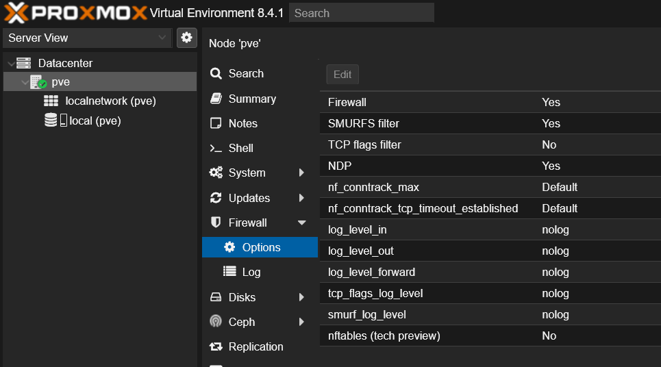

Since the official documentation is not very detailed about them, here is a bit better explanation of them:

- `Firewall`\
  Enabled by default. Enables the firewall at the `pve` node/host level.

- `SMURFS filter`\
  Enabled by default. Gives protection against SMURFS attacks, which are a form of distributed denial of service (DDoS) attacks "[that overloads network resources by broadcasting ICMP echo requests to devices across the network](https://www.fortinet.com/resources/cyberglossary/smurf-attack)".

- `TCP flags filter`\
  Disabled by default. Blocks illegal TCP flag combinations that could be found in packets.

- `NDP`\
  Enabled by default. NDP stands for _Neighbor Discovery Protocol_, and it is the IPv6 version of IPv4's ARP (_Address Resolution Protocol_). Since IPv6 is disabled in this guide's setup, you can disable this option.

- `nf_conntrack_max`\
  `262144` by default. This value corresponds to both the `sysctl` parameters `net.netfilter.nf_conntrack_max` and `net.nf_conntrack_max`, meaning that by changing this value you also changes the two of them at the same time.

  These two values limit how many simultaneous connections can be established with your host and be tracked in the corresponding connections table maintained by netfilter. When the maximum value is reached, your host will stop accepting new TCP connections silently. If you detect connectivity issues in your setup, one of the things you can try is making this value bigger.

  This is one of the `sysctl` parameters enabled by the firewall when it got fully active, as it was mentioned in the [chapter **G012**](G012%20-%20Host%20hardening%2006%20~%20Network%20hardening%20with%20sysctl.md).

- `nf_conntrack_tcp_timeout_established`\
  `432000` by default (in seconds). This value says for how long established connections can be considered to be in such state, before being discarded as too old. The default value is equivalent to 5 days, which may or may not be excessive for your needs or requirements. If you want to reduce this value, know that the Proxmox VE web console does not allow you to put a value lower than `7875` seconds, which is equivalent to roughly 2 hours and 11 minutes.

- `log_level_in`\
  `nolog` value by default. To enable the logging of the firewall activity with traffic INCOMING into your host, edit this value and choose `info`. This way, you can see things like dropped packets. There are other logging levels you can choose from, as shown in the capture below:

  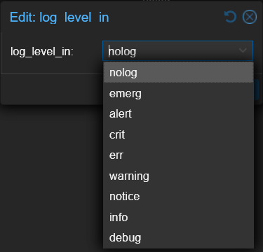

- `log_level_out`\
  `nolog` value by default. Change it to `info` to see the firewall activity with traffic OUTGOING from your host.

- `log_level_forward`\
  `nolog` value by default. Change it to `info` to see the firewall activity regarding the traffic FORWARDED towards your VMs.

- `tcp_flags_log_level`\
  `nolog` value by default. To see logs of firewall actions related to TCP flags filtering.

- `smurf_log_level_in`\
  `nolog` value by default. To get logs of firewall action regarding SMURFS attacks protection.

- `nftables (tech preview)`\
  Disabled by default. Enable this if you want to try the newer, **but still in tech preview state in Proxmox 9.0**, nftables-based firewall of Proxmox VE.

### Enabling TCP SYN flood protection

There are three extra options related to SYN flood protection that are mentioned only in the Proxmox VE firewall documentation, [in the Host Specific Configuration subsection](https://pve.proxmox.com/pve-docs/pve-admin-guide.html#pve_firewall_host_specific_configuration):

- `protection_synflood`\
  Disabled (value `0`) by default. Enables the protection against TCP syn flood attacks, which is another kind of DDoS that essentially can saturate your host with new connection requests. This protection essentially controls how many connections can be requested by other IPs at once and per second.

- `protection_synflood_burst`\
  `1000` by default. Puts a limit on how many new connections can be requested from other IPs to this host.

- `protection_synflood_rate`\
  `200` by default. It is the maximum number of new connections that can be requested **per second** to this host from other IPs.

These three parameters have not been made directly available from the PVE web console. If you want to enable and configure this synflood protection, you need to enter the parameters directly in the corresponding `host.fw` file of your PVE node. Since in this guide the Proxmox VE node is called `pve`, the full path of that file is `/etc/pve/nodes/pve/host.fw`:

1. Open a remote shell with your `mgrsys` user, then edit the `/etc/pve/nodes/pve/host.fw` file:

    > [!NOTE]
    > **Remember, this file only appears if you change the node's firewall configuration**\
    > Modify something to make Proxmox VE generate the `/etc/pve/nodes/pve/host.fw` file.

    ~~~properties
    [OPTIONS]

    nf_conntrack_tcp_timeout_established: 7875
    ndp: 0
    smurf_log_level: info
    tcp_flags_log_level: info
    log_level_out: info
    log_level_in: info
    tcpflags: 1
    log_level_forward: info
    ~~~

    Above you can see the configuration set up in this guide's PVE host, which may differ from what you have chosen to configure in your setup.

2. Below the last parameter you see in the `[OPTIONS]` section, append the synflood parameters:

    ~~~properties
    [OPTIONS]
    ...
    protection_synflood: 1
    protection_synflood_burst: 1000
    protection_synflood_rate: 200
    ~~~

    See that, in this guide's case, it sticks with the default values for `protection_synflood_burst` and `protection_synflood_rate`.

3. The Proxmox VE documentation does not say if the changes in the `host.fw` file are automatically applied after saving them. Just reboot your PVE node to be sure.

## Firewall logging

If you have configured your firewall as shown before, now you have its log enabled at the node level. You can see it in the PVE web console, at the `Firewall > Log` view of your `pve` node:

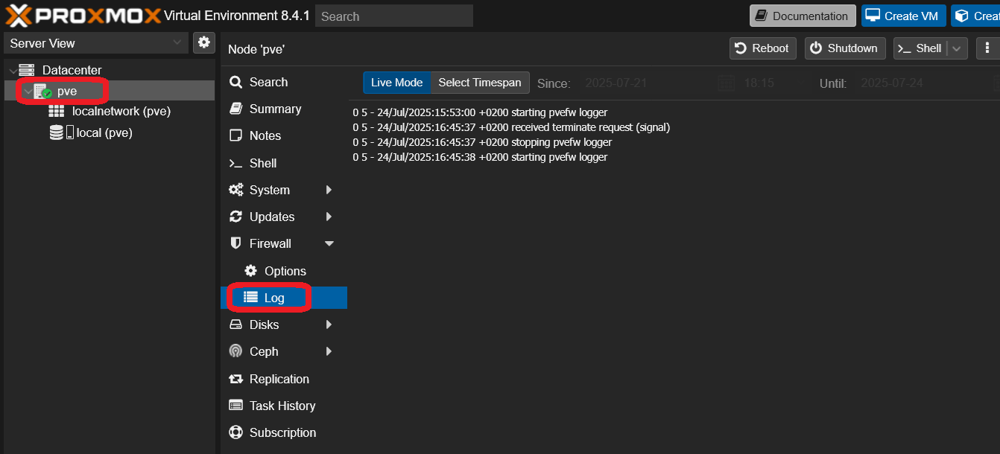

This log is a text file that you can find in your PVE host at the path `/var/log/pve-firewall.log`, and is rotated daily.

### Understanding the firewall log

Imagine you just booted up your Proxmox VE system and then you try to ping your PVE host from another computer within the same LAN. With the configuration explained in this guide, you will see lines in your firewall log like the following ones:

~~~log
0 5 - 30/Aug/2025:20:22:39 +0200 starting pvefw logger
0 5 - 30/Aug/2025:20:22:52 +0200 received terminate request (signal)
0 5 - 30/Aug/2025:20:22:52 +0200 stopping pvefw logger
0 5 - 30/Aug/2025:20:22:52 +0200 starting pvefw logger
0 6 PVEFW-HOST-IN 30/Aug/2025:20:33:05 +0200 policy DROP: IN=vmbr0 PHYSIN=enp3s0 MAC=87:ea:ab:02:15:a5:1a:e3:a5:13:f2:57:08:00 SRC=10.157.123.220 DST=10.1.0.1 LEN=60 TOS=0x00 PREC=0x00 TTL=128 ID=20335 PROTO=ICMP TYPE=8 CODE=0 ID=1 SEQ=1
0 6 PVEFW-HOST-IN 30/Aug/2025:20:33:09 +0200 policy DROP: IN=vmbr0 PHYSIN=enp3s0 MAC=87:ea:ab:02:15:a5:1a:e3:a5:13:f2:57:08:00 SRC=10.157.123.220 DST=10.1.0.1 LEN=60 TOS=0x00 PREC=0x00 TTL=128 ID=20402 PROTO=ICMP TYPE=8 CODE=0 ID=1 SEQ=2
~~~

These and any other log lines are formatted with the following schema:

~~~sh
VMID LOGID CHAIN TIMESTAMP POLICY: PACKET_DETAILS
~~~

This schema is translated as follows:

- `VMID`\
  Identifies the virtual machine on which the firewall rule or policy is acting. For the Proxmox VE host itself this value is always `0`.

- `LOGID`\
  Tells the logging level this log line has. Proxmox VE firewall has eight levels, check them out [in its official wiki](https://pve.proxmox.com/wiki/Firewall#_logging_of_firewall_rules).

- `CHAIN`\
  The firewall rule chain's name in which the policy or rule that provoked the log line is set. For cases in which there is no related chain, a `-` is printed here.

- `TIMESTAMP`\
  A full timestamp that includes the UTC.

- `POLICY`\
  Indicates what policy was applied in the rule that printed the log line.

- `PACKET_DETAILS`\
  Details from the affected packet, like source and destination IPs, protocol used, etc.

Knowing all that above, you can translate the previous logging example:

- All the lines are relative to the Proxmox VE host, since all of them start with the `VMID` set as `0`.

- The first four lines are **notices** warning about the firewall logger activity:

  - Their `LOGID` is `5`, which corresponds to the **notice** logging level.
  - These log lines do not correspond to any rule chain of the firewall, so their `CHAIN` is just a `-`.
  - The `TIMESTAMP` is a full date plus the UTC reference as expected.
  - The rest of their content is just a string in which the `POLICY` part is just empty and the `PACKET_DETAILS` is used to print the notice's message.

- The following two lines **inform** of two ICMP packets that have been dropped by the firewall:

  - Their `LOGID` is `6`, which corresponds to the **info** logging level.
  - The rule that has printed this log is set in the `PVEFW-HOST-IN` chain.
  - The `TIMESTAMP` is like in the previous notice log lines.
  - The `POLICY` string indicates the `DROP` action taken with the packets.
  - The `PACKET_DETAILS` is a list of details from the dropped packets.

    - `IN`\
      Refers to the input network device through which the packet came, in this case the bridge `vmbr0`.

    - `PHYSIN`\
      Is the _physical_ input network device through which the packet came. Here is the ethernet network card `enp3s0` of this host, which is the one used by the bridge `vmbr0` as networking port.

    - `MAC`\
      This is a rather odd value. It is not just the MAC of a particular network device, but the concatenation of the packet's source MAC (`87:ea:ab:02:15:a5`) with the destination MAC (`1a:e3:a5:13:f2:57`) and an extra suffix `08:00`.

    - `SRC`\
      IP of this packet's source.

    - `DST`\
      IP of this packet's destination.

    - `LEN`\
      Packet's total length in bytes.

    - `TOS`\
      [Type Of Service](https://linuxreviews.org/Type_of_Service_(ToS)_and_DSCP_Values), meant for prioritization of packets within a network.

    - `PREC`\
      The precedence bits of the previous `TOS` field.

    - `TTL`\
      Time To Live, which is the number of hops this packet can make before being discarded.

    - `ID`\
      Packet's datagram identifier.

    - `PROTO`\
      Message protocol used in the packet, [ICMP](https://en.wikipedia.org/wiki/Internet_Control_Message_Protocol) in these two cases.

    - `TYPE`\
      Is the ICMP type of [control message](https://en.wikipedia.org/wiki/Internet_Control_Message_Protocol#Control_messages). Here is `8` which is the echo request, used to ping.

    - `CODE`\
      Parameter used in ICMP messages, some types have several codes but the 8 only has the `0` one.

    - `ID`\
      This second identifier is also an ICMP field.

    - `SEQ`\
      A sequence identifier set up too by the ICMP protocol.

The conclusion you can get from the example log lines is that this Proxmox VE setup is dropping incoming ping packets, something common as a network hardening method. Be aware that, in the `PACKET_DETAILS` section, you should expect seeing very different parameters depending on the protocol used on each logged packet. In the example above you have seen ICMP ping packets, but other times you might see other types of ICMP messages or TCP or UDP packets.

## Connection tracking tool

In this chapter and in the [previous **G012** one](G012%20-%20Host%20hardening%2006%20~%20Network%20hardening%20with%20sysctl.md) it has been mentioned a few times the connection tracking system enabled by the firewall. This is popularly known as _conntrack_ and, adding to its own particular `sysctl` parameters (identified by the `nf_conntrack_` prefix), there is also a command enabling system administrators to manage the in-kernel connection tracking state tables:

1. The `conntrack` command is already installed in Proxmox VE 9.0, as `apt` warns:

    ~~~sh
    $ sudo apt install conntrack
    conntrack is already the newest version (1:1.4.8-2).
    Summary:
      Upgrading: 0, Installing: 0, Removing: 0, Not Upgrading: 17
    ~~~

2. Test the command by showing the currently tracked connections. Pipe it to the `less` command to be able to paginate through its long output:

    ~~~sh
    $ sudo conntrack -L | less
    ~~~

    The `-L` option makes `conntrack` list the currently "established" or "expected" connections in your system:

    ~~~sh
    tcp      6 103 TIME_WAIT src=127.0.0.1 dst=127.0.0.1 sport=58546 dport=85 src=127.0.0.1 dst=127.0.0.1 sport=85 dport=58546 [ASSURED] mark=0 use=1
    tcp      6 58 TIME_WAIT src=10.157.123.220 dst=10.1.0.1 sport=61942 dport=8006 src=10.1.0.1 dst=10.157.123.220 sport=8006 dport=61942 [ASSURED] mark=0 use=1
    tcp      6 69 TIME_WAIT src=10.157.123.220 dst=10.1.0.1 sport=61952 dport=8006 src=10.1.0.1 dst=10.157.123.220 sport=8006 dport=61952 [ASSURED] mark=0 use=1
    tcp      6 79 TIME_WAIT src=127.0.0.1 dst=127.0.0.1 sport=58110 dport=85 src=127.0.0.1 dst=127.0.0.1 sport=85 dport=58110 [ASSURED] mark=0 use=1
    tcp      6 62 TIME_WAIT src=10.157.123.220 dst=10.1.0.1 sport=61945 dport=8006 src=10.1.0.1 dst=10.157.123.220 sport=8006 dport=61945 [ASSURED] mark=0 use=1
    tcp      6 92 TIME_WAIT src=127.0.0.1 dst=127.0.0.1 sport=35924 dport=85 src=127.0.0.1 dst=127.0.0.1 sport=85 dport=35924 [ASSURED] mark=0 use=1
    tcp      6 99 TIME_WAIT src=10.157.123.220 dst=10.1.0.1 sport=61984 dport=8006 src=10.1.0.1 dst=10.157.123.220 sport=8006 dport=61984 [ASSURED] mark=0 use=1
    tcp      6 29 TIME_WAIT src=127.0.0.1 dst=127.0.0.1 sport=56546 dport=85 src=127.0.0.1 dst=127.0.0.1 sport=85 dport=56546 [ASSURED] mark=0 use=1
    tcp      6 49 TIME_WAIT src=10.157.123.220 dst=10.1.0.1 sport=61931 dport=8006 src=10.1.0.1 dst=10.157.123.220 sport=8006 dport=61931 [ASSURED] mark=0 use=1
    tcp      6 38 TIME_WAIT src=127.0.0.1 dst=127.0.0.1 sport=32788 dport=85 src=127.0.0.1 dst=127.0.0.1 sport=85 dport=32788 [ASSURED] mark=0 use=1
    tcp      6 20 TIME_WAIT src=127.0.0.1 dst=127.0.0.1 sport=45300 dport=85 src=127.0.0.1 dst=127.0.0.1 sport=85 dport=45300 [ASSURED] mark=0 use=1
    tcp      6 13 TIME_WAIT src=127.0.0.1 dst=127.0.0.1 sport=46314 dport=85 src=127.0.0.1 dst=127.0.0.1 sport=85 dport=46314 [ASSURED] mark=0 use=1
    tcp      6 113 TIME_WAIT src=127.0.0.1 dst=127.0.0.1 sport=37396 dport=85 src=127.0.0.1 dst=127.0.0.1 sport=85 dport=37396 [ASSURED] mark=0 use=1
    tcp      6 5 TIME_WAIT src=127.0.0.1 dst=127.0.0.1 sport=57050 dport=85 src=127.0.0.1 dst=127.0.0.1 sport=85 dport=57050 [ASSURED] mark=0 use=1
    tcp      6 46 TIME_WAIT src=10.157.123.220 dst=10.1.0.1 sport=61930 dport=8006 src=10.1.0.1 dst=10.157.123.220 sport=8006 dport=61930 [ASSURED] mark=0 use=1
    tcp      6 22 TIME_WAIT src=10.157.123.220 dst=10.1.0.1 sport=61903 dport=8006 src=10.1.0.1 dst=10.157.123.220 sport=8006 dport=61903 [ASSURED] mark=0 use=1
    tcp      6 16 TIME_WAIT src=127.0.0.1 dst=127.0.0.1 sport=46346 dport=85 src=127.0.0.1 dst=127.0.0.1 sport=85 dport=46346 [ASSURED] mark=0 use=1
    tcp      6 79 TIME_WAIT src=10.157.123.220 dst=10.1.0.1 sport=61964 dport=8006 src=10.1.0.1 dst=10.157.123.220 sport=8006 dport=61964 [ASSURED] mark=0 use=2
    tcp      6 102 TIME_WAIT src=127.0.0.1 dst=127.0.0.1 sport=58544 dport=85 src=127.0.0.1 dst=127.0.0.1 sport=85 dport=58544 [ASSURED] mark=0 use=1
    tcp      6 68 TIME_WAIT src=127.0.0.1 dst=127.0.0.1 sport=36384 dport=85 src=127.0.0.1 dst=127.0.0.1 sport=85 dport=36384 [ASSURED] mark=0 use=1
    tcp      6 58 TIME_WAIT src=127.0.0.1 dst=127.0.0.1 sport=41962 dport=85 src=127.0.0.1 dst=127.0.0.1 sport=85 dport=41962 [ASSURED] mark=0 use=1
    tcp      6 50 TIME_WAIT src=10.157.123.220 dst=10.1.0.1 sport=61936 dport=8006 src=10.1.0.1 dst=10.157.123.220 sport=8006 dport=61936 [ASSURED] mark=0 use=1
    tcp      6 66 TIME_WAIT src=10.157.123.220 dst=10.1.0.1 sport=61949 dport=8006 src=10.1.0.1 dst=10.157.123.220 sport=8006 dport=61949 [ASSURED] mark=0 use=1
    tcp      6 99 TIME_WAIT src=127.0.0.1 dst=127.0.0.1 sport=58522 dport=85 src=127.0.0.1 dst=127.0.0.1 sport=85 dport=58522 [ASSURED] mark=0 use=1
    tcp      6 24 TIME_WAIT src=10.157.123.220 dst=10.1.0.1 sport=61905 dport=8006 src=10.1.0.1 dst=10.157.123.220 sport=8006 dport=61905 [ASSURED] mark=0 use=1
    tcp      6 39 TIME_WAIT src=127.0.0.1 dst=127.0.0.1 sport=32804 dport=85 src=127.0.0.1 dst=127.0.0.1 sport=85 dport=32804 [ASSURED] mark=0 use=1
    tcp      6 104 TIME_WAIT src=10.157.123.220 dst=10.1.0.1 sport=61988 dport=8006 src=10.1.0.1 dst=10.157.123.220 sport=8006 dport=61988 [ASSURED] mark=0 use=1
    tcp      6 85 TIME_WAIT src=127.0.0.1 dst=127.0.0.1 sport=58158 dport=85 src=127.0.0.1 dst=127.0.0.1 sport=85 dport=58158 [ASSURED] mark=0 use=1
    tcp      6 17 TIME_WAIT src=10.157.123.220 dst=10.1.0.1 sport=61898 dport=8006 src=10.1.0.1 dst=10.157.123.220 sport=8006 dport=61898 [ASSURED] mark=0 use=1
    tcp      6 3 TIME_WAIT src=10.157.123.220 dst=10.1.0.1 sport=61882 dport=8006 src=10.1.0.1 dst=10.157.123.220 sport=8006 dport=61882 [ASSURED] mark=0 use=1
    tcp      6 28 TIME_WAIT src=10.157.123.220 dst=10.1.0.1 sport=61910 dport=8006 src=10.1.0.1 dst=10.157.123.220 sport=8006 dport=61910 [ASSURED] mark=0 use=1
    tcp      6 106 TIME_WAIT src=10.157.123.220 dst=10.1.0.1 sport=61990 dport=8006 src=10.1.0.1 dst=10.157.123.220 sport=8006 dport=61990 [ASSURED] mark=0 use=1
    tcp      6 49 TIME_WAIT src=127.0.0.1 dst=127.0.0.1 sport=39872 dport=85 src=127.0.0.1 dst=127.0.0.1 sport=85 dport=39872 [ASSURED] mark=0 use=1
    tcp      6 42 TIME_WAIT src=127.0.0.1 dst=127.0.0.1 sport=32834 dport=85 src=127.0.0.1 dst=127.0.0.1 sport=85 dport=32834 [ASSURED] mark=0 use=1
    tcp      6 54 TIME_WAIT src=127.0.0.1 dst=127.0.0.1 sport=39906 dport=85 src=127.0.0.1 dst=127.0.0.1 sport=85 dport=39906 [ASSURED] mark=0 use=1
    tcp      6 97 TIME_WAIT src=10.157.123.220 dst=10.1.0.1 sport=61981 dport=8006 src=10.1.0.1 dst=10.157.123.220 sport=8006 dport=61981 [ASSURED] mark=0 use=1
    tcp      6 76 TIME_WAIT src=127.0.0.1 dst=127.0.0.1 sport=36462 dport=85 src=127.0.0.1 dst=127.0.0.1 sport=85 dport=36462 [ASSURED] mark=0 use=2
    tcp      6 114 TIME_WAIT src=127.0.0.1 dst=127.0.0.1 sport=37400 dport=85 src=127.0.0.1 dst=127.0.0.1 sport=85 dport=37400 [ASSURED] mark=0 use=1
    tcp      6 93 TIME_WAIT src=10.157.123.220 dst=10.1.0.1 sport=61976 dport=8006 src=10.1.0.1 dst=10.157.123.220 sport=8006 dport=61976 [ASSURED] mark=0 use=1
    tcp      6 37 TIME_WAIT src=10.157.123.220 dst=10.1.0.1 sport=61921 dport=8006 src=10.1.0.1 dst=10.157.123.220 sport=8006 dport=61921 [ASSURED] mark=0 use=1
    tcp      6 102 TIME_WAIT src=10.157.123.220 dst=10.1.0.1 sport=61983 dport=8006 src=10.1.0.1 dst=10.157.123.220 sport=8006 dport=61983 [ASSURED] mark=0 use=1
    tcp      6 24 TIME_WAIT src=127.0.0.1 dst=127.0.0.1 sport=45356 dport=85 src=127.0.0.1 dst=127.0.0.1 sport=85 dport=45356 [ASSURED] mark=0 use=1
    tcp      6 26 TIME_WAIT src=10.157.123.220 dst=10.1.0.1 sport=61907 dport=8006 src=10.1.0.1 dst=10.157.123.220 sport=8006 dport=61907 [ASSURED] mark=0 use=1
    tcp      6 36 TIME_WAIT src=10.157.123.220 dst=10.1.0.1 sport=61920 dport=8006 src=10.1.0.1 dst=10.157.123.220 sport=8006 dport=61920 [ASSURED] mark=0 use=1
    tcp      6 107 TIME_WAIT src=10.157.123.220 dst=10.1.0.1 sport=61991 dport=8006 src=10.1.0.1 dst=10.157.123.220 sport=8006 dport=61991 [ASSURED] mark=0 use=1
    tcp      6 41 TIME_WAIT src=127.0.0.1 dst=127.0.0.1 sport=32824 dport=85 src=127.0.0.1 dst=127.0.0.1 sport=85 dport=32824 [ASSURED] mark=0 use=1
    tcp      6 55 TIME_WAIT src=127.0.0.1 dst=127.0.0.1 sport=39912 dport=85 src=127.0.0.1 dst=127.0.0.1 sport=85 dport=39912 [ASSURED] mark=0 use=1
    tcp      6 8 TIME_WAIT src=127.0.0.1 dst=127.0.0.1 sport=46280 dport=85 src=127.0.0.1 dst=127.0.0.1 sport=85 dport=46280 [ASSURED] mark=0 use=1
    tcp      6 38 TIME_WAIT src=10.157.123.220 dst=10.1.0.1 sport=61922 dport=8006 src=10.1.0.1 dst=10.157.123.220 sport=8006 dport=61922 [ASSURED] mark=0 use=1
    tcp      6 44 TIME_WAIT src=127.0.0.1 dst=127.0.0.1 sport=32852 dport=85 src=127.0.0.1 dst=127.0.0.1 sport=85 dport=32852 [ASSURED] mark=0 use=1
    tcp      6 1 TIME_WAIT src=127.0.0.1 dst=127.0.0.1 sport=57024 dport=85 src=127.0.0.1 dst=127.0.0.1 sport=85 dport=57024 [ASSURED] mark=0 use=1
    tcp      6 117 TIME_WAIT src=127.0.0.1 dst=127.0.0.1 sport=37424 dport=85 src=127.0.0.1 dst=127.0.0.1 sport=85 dport=37424 [ASSURED] mark=0 use=1
    tcp      6 60 TIME_WAIT src=127.0.0.1 dst=127.0.0.1 sport=41990 dport=85 src=127.0.0.1 dst=127.0.0.1 sport=85 dport=41990 [ASSURED] mark=0 use=1
    tcp      6 19 TIME_WAIT src=10.157.123.220 dst=10.1.0.1 sport=61900 dport=8006 src=10.1.0.1 dst=10.157.123.220 sport=8006 dport=61900 [ASSURED] mark=0 use=1
    tcp      6 100 TIME_WAIT src=127.0.0.1 dst=127.0.0.1 sport=58526 dport=85 src=127.0.0.1 dst=127.0.0.1 sport=85 dport=58526 [ASSURED] mark=0 use=1
    tcp      6 98 TIME_WAIT src=127.0.0.1 dst=127.0.0.1 sport=35992 dport=85 src=127.0.0.1 dst=127.0.0.1 sport=85 dport=35992 [ASSURED] mark=0 use=2
    tcp      6 95 TIME_WAIT src=10.157.123.220 dst=10.1.0.1 sport=61979 dport=8006 src=10.1.0.1 dst=10.157.123.220 sport=8006 dport=61979 [ASSURED] mark=0 use=1
    tcp      6 83 TIME_WAIT src=127.0.0.1 dst=127.0.0.1 sport=58156 dport=85 src=127.0.0.1 dst=127.0.0.1 sport=85 dport=58156 [ASSURED] mark=0 use=1
    tcp      6 57 TIME_WAIT src=10.157.123.220 dst=10.1.0.1 sport=61943 dport=8006 src=10.1.0.1 dst=10.157.123.220 sport=8006 dport=61943 [ASSURED] mark=0 use=1
    tcp      6 109 TIME_WAIT src=127.0.0.1 dst=127.0.0.1 sport=37360 dport=85 src=127.0.0.1 dst=127.0.0.1 sport=85 dport=37360 [ASSURED] mark=0 use=1
    tcp      6 37 TIME_WAIT src=127.0.0.1 dst=127.0.0.1 sport=56602 dport=85 src=127.0.0.1 dst=127.0.0.1 sport=85 dport=56602 [ASSURED] mark=0 use=1
    tcp      6 10 TIME_WAIT src=10.157.123.220 dst=10.1.0.1 sport=61890 dport=8006 src=10.1.0.1 dst=10.157.123.220 sport=8006 dport=61890 [ASSURED] mark=0 use=1
    tcp      6 89 TIME_WAIT src=10.157.123.220 dst=10.1.0.1 sport=61973 dport=8006 src=10.1.0.1 dst=10.157.123.220 sport=8006 dport=61973 [ASSURED] mark=0 use=1
    tcp      6 5 TIME_WAIT src=10.157.123.220 dst=10.1.0.1 sport=61885 dport=8006 src=10.1.0.1 dst=10.157.123.220 sport=8006 dport=61885 [ASSURED] mark=0 use=1
    tcp      6 108 TIME_WAIT src=127.0.0.1 dst=127.0.0.1 sport=37348 dport=85 src=127.0.0.1 dst=127.0.0.1 sport=85 dport=37348 [ASSURED] mark=0 use=1
    tcp      6 17 TIME_WAIT src=127.0.0.1 dst=127.0.0.1 sport=46348 dport=85 src=127.0.0.1 dst=127.0.0.1 sport=85 dport=46348 [ASSURED] mark=0 use=1
    tcp      6 2 TIME_WAIT src=127.0.0.1 dst=127.0.0.1 sport=57030 dport=85 src=127.0.0.1 dst=127.0.0.1 sport=85 dport=57030 [ASSURED] mark=0 use=1
    tcp      6 91 TIME_WAIT src=127.0.0.1 dst=127.0.0.1 sport=35910 dport=85 src=127.0.0.1 dst=127.0.0.1 sport=85 dport=35910 [ASSURED] mark=0 use=1
    tcp      6 7 TIME_WAIT src=127.0.0.1 dst=127.0.0.1 sport=57060 dport=85 src=127.0.0.1 dst=127.0.0.1 sport=85 dport=57060 [ASSURED] mark=0 use=1
    tcp      6 90 TIME_WAIT src=10.157.123.220 dst=10.1.0.1 sport=61974 dport=8006 src=10.1.0.1 dst=10.157.123.220 sport=8006 dport=61974 [ASSURED] mark=0 use=1
    tcp      6 94 TIME_WAIT src=127.0.0.1 dst=127.0.0.1 sport=35942 dport=85 src=127.0.0.1 dst=127.0.0.1 sport=85 dport=35942 [ASSURED] mark=0 use=1
    tcp      6 96 TIME_WAIT src=127.0.0.1 dst=127.0.0.1 sport=35968 dport=85 src=127.0.0.1 dst=127.0.0.1 sport=85 dport=35968 [ASSURED] mark=0 use=1
    tcp      6 66 TIME_WAIT src=127.0.0.1 dst=127.0.0.1 sport=42030 dport=85 src=127.0.0.1 dst=127.0.0.1 sport=85 dport=42030 [ASSURED] mark=0 use=1
    tcp      6 80 TIME_WAIT src=10.157.123.220 dst=10.1.0.1 sport=61962 dport=8006 src=10.1.0.1 dst=10.157.123.220 sport=8006 dport=61962 [ASSURED] mark=0 use=1
    tcp      6 98 TIME_WAIT src=10.157.123.220 dst=10.1.0.1 sport=61982 dport=8006 src=10.1.0.1 dst=10.157.123.220 sport=8006 dport=61982 [ASSURED] mark=0 use=2
    tcp      6 18 TIME_WAIT src=127.0.0.1 dst=127.0.0.1 sport=45268 dport=85 src=127.0.0.1 dst=127.0.0.1 sport=85 dport=45268 [ASSURED] mark=0 use=1
    tcp      6 40 TIME_WAIT src=10.157.123.220 dst=10.1.0.1 sport=61924 dport=8006 src=10.1.0.1 dst=10.157.123.220 sport=8006 dport=61924 [ASSURED] mark=0 use=1
    tcp      6 14 TIME_WAIT src=10.157.123.220 dst=10.1.0.1 sport=61895 dport=8006 src=10.1.0.1 dst=10.157.123.220 sport=8006 dport=61895 [ASSURED] mark=0 use=1
    tcp      6 52 TIME_WAIT src=10.157.123.220 dst=10.1.0.1 sport=61934 dport=8006 src=10.1.0.1 dst=10.157.123.220 sport=8006 dport=61934 [ASSURED] mark=0 use=1
    tcp      6 101 TIME_WAIT src=10.157.123.220 dst=10.1.0.1 sport=61986 dport=8006 src=10.1.0.1 dst=10.157.123.220 sport=8006 dport=61986 [ASSURED] mark=0 use=1
    tcp      6 61 TIME_WAIT src=127.0.0.1 dst=127.0.0.1 sport=41996 dport=85 src=127.0.0.1 dst=127.0.0.1 sport=85 dport=41996 [ASSURED] mark=0 use=1
    tcp      6 87 TIME_WAIT src=10.157.123.220 dst=10.1.0.1 sport=61971 dport=8006 src=10.1.0.1 dst=10.157.123.220 sport=8006 dport=61971 [ASSURED] mark=0 use=1
    tcp      6 4 TIME_WAIT src=10.157.123.220 dst=10.1.0.1 sport=61884 dport=8006 src=10.1.0.1 dst=10.157.123.220 sport=8006 dport=61884 [ASSURED] mark=0 use=1
    tcp      6 25 TIME_WAIT src=10.157.123.220 dst=10.1.0.1 sport=61906 dport=8006 src=10.1.0.1 dst=10.157.123.220 sport=8006 dport=61906 [ASSURED] mark=0 use=1
    tcp      6 109 TIME_WAIT src=10.157.123.220 dst=10.1.0.1 sport=61993 dport=8006 src=10.1.0.1 dst=10.157.123.220 sport=8006 dport=61993 [ASSURED] mark=0 use=1
    tcp      6 9 TIME_WAIT src=127.0.0.1 dst=127.0.0.1 sport=46286 dport=85 src=127.0.0.1 dst=127.0.0.1 sport=85 dport=46286 [ASSURED] mark=0 use=1
    tcp      6 74 TIME_WAIT src=10.157.123.220 dst=10.1.0.1 sport=61957 dport=8006 src=10.1.0.1 dst=10.157.123.220 sport=8006 dport=61957 [ASSURED] mark=0 use=1
    tcp      6 114 TIME_WAIT src=10.157.123.220 dst=10.1.0.1 sport=62002 dport=8006 src=10.1.0.1 dst=10.157.123.220 sport=8006 dport=62002 [ASSURED] mark=0 use=1
    tcp      6 51 TIME_WAIT src=10.157.123.220 dst=10.1.0.1 sport=61935 dport=8006 src=10.1.0.1 dst=10.157.123.220 sport=8006 dport=61935 [ASSURED] mark=0 use=1
    tcp      6 45 TIME_WAIT src=127.0.0.1 dst=127.0.0.1 sport=32854 dport=85 src=127.0.0.1 dst=127.0.0.1 sport=85 dport=32854 [ASSURED] mark=0 use=1
    unknown  2 591 src=0.0.0.0 dst=224.0.0.1 [UNREPLIED] src=224.0.0.1 dst=0.0.0.0 mark=0 use=1
    tcp      6 59 TIME_WAIT src=127.0.0.1 dst=127.0.0.1 sport=41976 dport=85 src=127.0.0.1 dst=127.0.0.1 sport=85 dport=41976 [ASSURED] mark=0 use=1
    tcp      6 67 TIME_WAIT src=10.157.123.220 dst=10.1.0.1 sport=61950 dport=8006 src=10.1.0.1 dst=10.157.123.220 sport=8006 dport=61950 [ASSURED] mark=0 use=1
    tcp      6 11 TIME_WAIT src=127.0.0.1 dst=127.0.0.1 sport=46294 dport=85 src=127.0.0.1 dst=127.0.0.1 sport=85 dport=46294 [ASSURED] mark=0 use=2
    tcp      6 15 TIME_WAIT src=10.157.123.220 dst=10.1.0.1 sport=61897 dport=8006 src=10.1.0.1 dst=10.157.123.220 sport=8006 dport=61897 [ASSURED] mark=0 use=1
    tcp      6 111 TIME_WAIT src=127.0.0.1 dst=127.0.0.1 sport=37372 dport=85 src=127.0.0.1 dst=127.0.0.1 sport=85 dport=37372 [ASSURED] mark=0 use=1
    tcp      6 81 TIME_WAIT src=127.0.0.1 dst=127.0.0.1 sport=58134 dport=85 src=127.0.0.1 dst=127.0.0.1 sport=85 dport=58134 [ASSURED] mark=0 use=1
    tcp      6 77 TIME_WAIT src=10.157.123.220 dst=10.1.0.1 sport=61961 dport=8006 src=10.1.0.1 dst=10.157.123.220 sport=8006 dport=61961 [ASSURED] mark=0 use=1
    tcp      6 115 TIME_WAIT src=10.157.123.220 dst=10.1.0.1 sport=61997 dport=8006 src=10.1.0.1 dst=10.157.123.220 sport=8006 dport=61997 [ASSURED] mark=0 use=1
    tcp      6 56 TIME_WAIT src=127.0.0.1 dst=127.0.0.1 sport=39916 dport=85 src=127.0.0.1 dst=127.0.0.1 sport=85 dport=39916 [ASSURED] mark=0 use=1
    tcp      6 67 TIME_WAIT src=127.0.0.1 dst=127.0.0.1 sport=42032 dport=85 src=127.0.0.1 dst=127.0.0.1 sport=85 dport=42032 [ASSURED] mark=0 use=1
    tcp      6 32 TIME_WAIT src=10.157.123.220 dst=10.1.0.1 sport=61916 dport=8006 src=10.1.0.1 dst=10.157.123.220 sport=8006 dport=61916 [ASSURED] mark=0 use=1
    tcp      6 27 TIME_WAIT src=127.0.0.1 dst=127.0.0.1 sport=45370 dport=85 src=127.0.0.1 dst=127.0.0.1 sport=85 dport=45370 [ASSURED] mark=0 use=1
    tcp      6 4 TIME_WAIT src=127.0.0.1 dst=127.0.0.1 sport=57040 dport=85 src=127.0.0.1 dst=127.0.0.1 sport=85 dport=57040 [ASSURED] mark=0 use=1
    tcp      6 63 TIME_WAIT src=10.157.123.220 dst=10.1.0.1 sport=61948 dport=8006 src=10.1.0.1 dst=10.157.123.220 sport=8006 dport=61948 [ASSURED] mark=0 use=1
    tcp      6 116 TIME_WAIT src=10.157.123.220 dst=10.1.0.1 sport=62003 dport=8006 src=10.1.0.1 dst=10.157.123.220 sport=8006 dport=62003 [ASSURED] mark=0 use=1
    tcp      6 34 TIME_WAIT src=127.0.0.1 dst=127.0.0.1 sport=56580 dport=85 src=127.0.0.1 dst=127.0.0.1 sport=85 dport=56580 [ASSURED] mark=0 use=1
    tcp      6 39 TIME_WAIT src=10.157.123.220 dst=10.1.0.1 sport=61923 dport=8006 src=10.1.0.1 dst=10.157.123.220 sport=8006 dport=61923 [ASSURED] mark=0 use=1
    tcp      6 116 TIME_WAIT src=127.0.0.1 dst=127.0.0.1 sport=37420 dport=85 src=127.0.0.1 dst=127.0.0.1 sport=85 dport=37420 [ASSURED] mark=0 use=1
    tcp      6 31 TIME_WAIT src=127.0.0.1 dst=127.0.0.1 sport=56560 dport=85 src=127.0.0.1 dst=127.0.0.1 sport=85 dport=56560 [ASSURED] mark=0 use=1
    tcp      6 119 TIME_WAIT src=127.0.0.1 dst=127.0.0.1 sport=34464 dport=85 src=127.0.0.1 dst=127.0.0.1 sport=85 dport=34464 [ASSURED] mark=0 use=1
    tcp      6 20 TIME_WAIT src=10.157.123.220 dst=10.1.0.1 sport=61901 dport=8006 src=10.1.0.1 dst=10.157.123.220 sport=8006 dport=61901 [ASSURED] mark=0 use=1
    tcp      6 42 TIME_WAIT src=10.157.123.220 dst=10.1.0.1 sport=61927 dport=8006 src=10.1.0.1 dst=10.157.123.220 sport=8006 dport=61927 [ASSURED] mark=0 use=2
    tcp      6 71 TIME_WAIT src=10.157.123.220 dst=10.1.0.1 sport=61953 dport=8006 src=10.1.0.1 dst=10.157.123.220 sport=8006 dport=61953 [ASSURED] mark=0 use=1
    tcp      6 55 TIME_WAIT src=10.157.123.220 dst=10.1.0.1 sport=61939 dport=8006 src=10.1.0.1 dst=10.157.123.220 sport=8006 dport=61939 [ASSURED] mark=0 use=1
    tcp      6 62 TIME_WAIT src=127.0.0.1 dst=127.0.0.1 sport=42010 dport=85 src=127.0.0.1 dst=127.0.0.1 sport=85 dport=42010 [ASSURED] mark=0 use=1
    tcp      6 106 TIME_WAIT src=127.0.0.1 dst=127.0.0.1 sport=58584 dport=85 src=127.0.0.1 dst=127.0.0.1 sport=85 dport=58584 [ASSURED] mark=0 use=1
    tcp      6 9 TIME_WAIT src=10.157.123.220 dst=10.1.0.1 sport=61889 dport=8006 src=10.1.0.1 dst=10.157.123.220 sport=8006 dport=61889 [ASSURED] mark=0 use=1
    tcp      6 54 TIME_WAIT src=10.157.123.220 dst=10.1.0.1 sport=61938 dport=8006 src=10.1.0.1 dst=10.157.123.220 sport=8006 dport=61938 [ASSURED] mark=0 use=1
    tcp      6 44 TIME_WAIT src=10.157.123.220 dst=10.1.0.1 sport=61929 dport=8006 src=10.1.0.1 dst=10.157.123.220 sport=8006 dport=61929 [ASSURED] mark=0 use=1
    tcp      6 89 TIME_WAIT src=127.0.0.1 dst=127.0.0.1 sport=35884 dport=85 src=127.0.0.1 dst=127.0.0.1 sport=85 dport=35884 [ASSURED] mark=0 use=1
    tcp      6 53 TIME_WAIT src=127.0.0.1 dst=127.0.0.1 sport=39902 dport=85 src=127.0.0.1 dst=127.0.0.1 sport=85 dport=39902 [ASSURED] mark=0 use=1
    tcp      6 23 TIME_WAIT src=127.0.0.1 dst=127.0.0.1 sport=45340 dport=85 src=127.0.0.1 dst=127.0.0.1 sport=85 dport=45340 [ASSURED] mark=0 use=1
    tcp      6 88 TIME_WAIT src=127.0.0.1 dst=127.0.0.1 sport=58196 dport=85 src=127.0.0.1 dst=127.0.0.1 sport=85 dport=58196 [ASSURED] mark=0 use=1
    tcp      6 92 TIME_WAIT src=10.157.123.220 dst=10.1.0.1 sport=61978 dport=8006 src=10.1.0.1 dst=10.157.123.220 sport=8006 dport=61978 [ASSURED] mark=0 use=1
    tcp      6 43 TIME_WAIT src=127.0.0.1 dst=127.0.0.1 sport=32842 dport=85 src=127.0.0.1 dst=127.0.0.1 sport=85 dport=32842 [ASSURED] mark=0 use=1
    tcp      6 107 TIME_WAIT src=127.0.0.1 dst=127.0.0.1 sport=58588 dport=85 src=127.0.0.1 dst=127.0.0.1 sport=85 dport=58588 [ASSURED] mark=0 use=1
    tcp      6 22 TIME_WAIT src=127.0.0.1 dst=127.0.0.1 sport=45330 dport=85 src=127.0.0.1 dst=127.0.0.1 sport=85 dport=45330 [ASSURED] mark=0 use=1
    tcp      6 47 TIME_WAIT src=127.0.0.1 dst=127.0.0.1 sport=32870 dport=85 src=127.0.0.1 dst=127.0.0.1 sport=85 dport=32870 [ASSURED] mark=0 use=1
    tcp      6 50 TIME_WAIT src=127.0.0.1 dst=127.0.0.1 sport=39878 dport=85 src=127.0.0.1 dst=127.0.0.1 sport=85 dport=39878 [ASSURED] mark=0 use=1
    tcp      6 43 TIME_WAIT src=10.157.123.220 dst=10.1.0.1 sport=61928 dport=8006 src=10.1.0.1 dst=10.157.123.220 sport=8006 dport=61928 [ASSURED] mark=0 use=1
    tcp      6 10 TIME_WAIT src=127.0.0.1 dst=127.0.0.1 sport=46290 dport=85 src=127.0.0.1 dst=127.0.0.1 sport=85 dport=46290 [ASSURED] mark=0 use=2
    tcp      6 25 TIME_WAIT src=127.0.0.1 dst=127.0.0.1 sport=45360 dport=85 src=127.0.0.1 dst=127.0.0.1 sport=85 dport=45360 [ASSURED] mark=0 use=1
    tcp      6 6 TIME_WAIT src=10.157.123.220 dst=10.1.0.1 sport=61886 dport=8006 src=10.1.0.1 dst=10.157.123.220 sport=8006 dport=61886 [ASSURED] mark=0 use=1
    tcp      6 2 TIME_WAIT src=10.157.123.220 dst=10.1.0.1 sport=61881 dport=8006 src=10.1.0.1 dst=10.157.123.220 sport=8006 dport=61881 [ASSURED] mark=0 use=1
    tcp      6 1 TIME_WAIT src=10.157.123.220 dst=10.1.0.1 sport=61879 dport=8006 src=10.1.0.1 dst=10.157.123.220 sport=8006 dport=61879 [ASSURED] mark=0 use=1
    tcp      6 30 TIME_WAIT src=10.157.123.220 dst=10.1.0.1 sport=61915 dport=8006 src=10.1.0.1 dst=10.157.123.220 sport=8006 dport=61915 [ASSURED] mark=0 use=1
    tcp      6 30 TIME_WAIT src=127.0.0.1 dst=127.0.0.1 sport=56548 dport=85 src=127.0.0.1 dst=127.0.0.1 sport=85 dport=56548 [ASSURED] mark=0 use=1
    tcp      6 83 TIME_WAIT src=10.157.123.220 dst=10.1.0.1 sport=61968 dport=8006 src=10.1.0.1 dst=10.157.123.220 sport=8006 dport=61968 [ASSURED] mark=0 use=1
    tcp      6 41 TIME_WAIT src=10.157.123.220 dst=10.1.0.1 sport=61925 dport=8006 src=10.1.0.1 dst=10.157.123.220 sport=8006 dport=61925 [ASSURED] mark=0 use=1
    tcp      6 87 TIME_WAIT src=127.0.0.1 dst=127.0.0.1 sport=58180 dport=85 src=127.0.0.1 dst=127.0.0.1 sport=85 dport=58180 [ASSURED] mark=0 use=1
    tcp      6 72 TIME_WAIT src=10.157.123.220 dst=10.1.0.1 sport=61955 dport=8006 src=10.1.0.1 dst=10.157.123.220 sport=8006 dport=61955 [ASSURED] mark=0 use=1
    tcp      6 104 TIME_WAIT src=127.0.0.1 dst=127.0.0.1 sport=58558 dport=85 src=127.0.0.1 dst=127.0.0.1 sport=85 dport=58558 [ASSURED] mark=0 use=1
    tcp      6 117 TIME_WAIT src=10.157.123.220 dst=10.1.0.1 sport=62005 dport=8006 src=10.1.0.1 dst=10.157.123.220 sport=8006 dport=62005 [ASSURED] mark=0 use=1
    tcp      6 73 TIME_WAIT src=127.0.0.1 dst=127.0.0.1 sport=36432 dport=85 src=127.0.0.1 dst=127.0.0.1 sport=85 dport=36432 [ASSURED] mark=0 use=1
    tcp      6 31 TIME_WAIT src=10.157.123.220 dst=10.1.0.1 sport=61914 dport=8006 src=10.1.0.1 dst=10.157.123.220 sport=8006 dport=61914 [ASSURED] mark=0 use=1
    tcp      6 105 TIME_WAIT src=10.157.123.220 dst=10.1.0.1 sport=61989 dport=8006 src=10.1.0.1 dst=10.157.123.220 sport=8006 dport=61989 [ASSURED] mark=0 use=1
    tcp      6 48 TIME_WAIT src=10.157.123.220 dst=10.1.0.1 sport=61933 dport=8006 src=10.1.0.1 dst=10.157.123.220 sport=8006 dport=61933 [ASSURED] mark=0 use=1
    tcp      6 78 TIME_WAIT src=127.0.0.1 dst=127.0.0.1 sport=36486 dport=85 src=127.0.0.1 dst=127.0.0.1 sport=85 dport=36486 [ASSURED] mark=0 use=1
    tcp      6 85 TIME_WAIT src=10.157.123.220 dst=10.1.0.1 sport=61970 dport=8006 src=10.1.0.1 dst=10.157.123.220 sport=8006 dport=61970 [ASSURED] mark=0 use=1
    tcp      6 27 TIME_WAIT src=10.157.123.220 dst=10.1.0.1 sport=61908 dport=8006 src=10.1.0.1 dst=10.157.123.220 sport=8006 dport=61908 [ASSURED] mark=0 use=2
    tcp      6 12 TIME_WAIT src=127.0.0.1 dst=127.0.0.1 sport=46300 dport=85 src=127.0.0.1 dst=127.0.0.1 sport=85 dport=46300 [ASSURED] mark=0 use=1
    tcp      6 57 TIME_WAIT src=127.0.0.1 dst=127.0.0.1 sport=39926 dport=85 src=127.0.0.1 dst=127.0.0.1 sport=85 dport=39926 [ASSURED] mark=0 use=1
    tcp      6 113 TIME_WAIT src=10.157.123.220 dst=10.1.0.1 sport=61998 dport=8006 src=10.1.0.1 dst=10.157.123.220 sport=8006 dport=61998 [ASSURED] mark=0 use=1
    tcp      6 6 TIME_WAIT src=127.0.0.1 dst=127.0.0.1 sport=57056 dport=85 src=127.0.0.1 dst=127.0.0.1 sport=85 dport=57056 [ASSURED] mark=0 use=1
    tcp      6 118 TIME_WAIT src=127.0.0.1 dst=127.0.0.1 sport=34454 dport=85 src=127.0.0.1 dst=127.0.0.1 sport=85 dport=34454 [ASSURED] mark=0 use=1
    tcp      6 110 TIME_WAIT src=10.157.123.220 dst=10.1.0.1 sport=61994 dport=8006 src=10.1.0.1 dst=10.157.123.220 sport=8006 dport=61994 [ASSURED] mark=0 use=1
    tcp      6 77 TIME_WAIT src=127.0.0.1 dst=127.0.0.1 sport=36472 dport=85 src=127.0.0.1 dst=127.0.0.1 sport=85 dport=36472 [ASSURED] mark=0 use=1
    tcp      6 110 TIME_WAIT src=127.0.0.1 dst=127.0.0.1 sport=37364 dport=85 src=127.0.0.1 dst=127.0.0.1 sport=85 dport=37364 [ASSURED] mark=0 use=1
    tcp      6 62 TIME_WAIT src=10.157.123.220 dst=10.1.0.1 sport=61946 dport=8006 src=10.1.0.1 dst=10.157.123.220 sport=8006 dport=61946 [ASSURED] mark=0 use=1
    tcp      6 7871 ESTABLISHED src=127.0.0.1 dst=127.0.0.1 sport=43472 dport=3493 src=127.0.0.1 dst=127.0.0.1 sport=3493 dport=43472 [ASSURED] mark=0 use=1
    tcp      6 16 TIME_WAIT src=10.157.123.220 dst=10.1.0.1 sport=61896 dport=8006 src=10.1.0.1 dst=10.157.123.220 sport=8006 dport=61896 [ASSURED] mark=0 use=1
    tcp      6 56 TIME_WAIT src=10.157.123.220 dst=10.1.0.1 sport=61941 dport=8006 src=10.1.0.1 dst=10.157.123.220 sport=8006 dport=61941 [ASSURED] mark=0 use=1
    tcp      6 23 TIME_WAIT src=10.157.123.220 dst=10.1.0.1 sport=61904 dport=8006 src=10.1.0.1 dst=10.157.123.220 sport=8006 dport=61904 [ASSURED] mark=0 use=1
    tcp      6 8 CLOSE src=10.157.123.220 dst=10.1.0.1 sport=62004 dport=8006 src=10.1.0.1 dst=10.157.123.220 sport=8006 dport=62004 [ASSURED] mark=0 use=1
    tcp      6 13 TIME_WAIT src=10.157.123.220 dst=10.1.0.1 sport=61894 dport=8006 src=10.1.0.1 dst=10.157.123.220 sport=8006 dport=61894 [ASSURED] mark=0 use=1
    tcp      6 71 TIME_WAIT src=127.0.0.1 dst=127.0.0.1 sport=36406 dport=85 src=127.0.0.1 dst=127.0.0.1 sport=85 dport=36406 [ASSURED] mark=0 use=1
    tcp      6 76 TIME_WAIT src=10.157.123.220 dst=10.1.0.1 sport=61960 dport=8006 src=10.1.0.1 dst=10.157.123.220 sport=8006 dport=61960 [ASSURED] mark=0 use=1
    tcp      6 101 TIME_WAIT src=127.0.0.1 dst=127.0.0.1 sport=58532 dport=85 src=127.0.0.1 dst=127.0.0.1 sport=85 dport=58532 [ASSURED] mark=0 use=1
    tcp      6 68 TIME_WAIT src=10.157.123.220 dst=10.1.0.1 sport=61951 dport=8006 src=10.1.0.1 dst=10.157.123.220 sport=8006 dport=61951 [ASSURED] mark=0 use=2
    tcp      6 36 TIME_WAIT src=127.0.0.1 dst=127.0.0.1 sport=56592 dport=85 src=127.0.0.1 dst=127.0.0.1 sport=85 dport=56592 [ASSURED] mark=0 use=1
    tcp      6 21 TIME_WAIT src=10.157.123.220 dst=10.1.0.1 sport=61902 dport=8006 src=10.1.0.1 dst=10.157.123.220 sport=8006 dport=61902 [ASSURED] mark=0 use=1
    tcp      6 66 TIME_WAIT src=10.157.123.220 dst=10.1.0.1 sport=61947 dport=8006 src=10.1.0.1 dst=10.157.123.220 sport=8006 dport=61947 [ASSURED] mark=0 use=1
    tcp      6 100 TIME_WAIT src=10.157.123.220 dst=10.1.0.1 sport=61985 dport=8006 src=10.1.0.1 dst=10.157.123.220 sport=8006 dport=61985 [ASSURED] mark=0 use=1
    tcp      6 19 TIME_WAIT src=127.0.0.1 dst=127.0.0.1 sport=45284 dport=85 src=127.0.0.1 dst=127.0.0.1 sport=85 dport=45284 [ASSURED] mark=0 use=1
    tcp      6 29 TIME_WAIT src=10.157.123.220 dst=10.1.0.1 sport=61913 dport=8006 src=10.1.0.1 dst=10.157.123.220 sport=8006 dport=61913 [ASSURED] mark=0 use=1
    tcp      6 115 TIME_WAIT src=127.0.0.1 dst=127.0.0.1 sport=37416 dport=85 src=127.0.0.1 dst=127.0.0.1 sport=85 dport=37416 [ASSURED] mark=0 use=1
    tcp      6 32 TIME_WAIT src=127.0.0.1 dst=127.0.0.1 sport=56566 dport=85 src=127.0.0.1 dst=127.0.0.1 sport=85 dport=56566 [ASSURED] mark=0 use=1
    tcp      6 78 TIME_WAIT src=10.157.123.220 dst=10.1.0.1 sport=61963 dport=8006 src=10.1.0.1 dst=10.157.123.220 sport=8006 dport=61963 [ASSURED] mark=0 use=1
    tcp      6 95 TIME_WAIT src=127.0.0.1 dst=127.0.0.1 sport=35954 dport=85 src=127.0.0.1 dst=127.0.0.1 sport=85 dport=35954 [ASSURED] mark=0 use=1
    tcp      6 111 TIME_WAIT src=10.157.123.220 dst=10.1.0.1 sport=61995 dport=8006 src=10.1.0.1 dst=10.157.123.220 sport=8006 dport=61995 [ASSURED] mark=0 use=1
    tcp      6 94 TIME_WAIT src=10.157.123.220 dst=10.1.0.1 sport=61977 dport=8006 src=10.1.0.1 dst=10.157.123.220 sport=8006 dport=61977 [ASSURED] mark=0 use=1
    tcp      6 11 TIME_WAIT src=10.157.123.220 dst=10.1.0.1 sport=61892 dport=8006 src=10.1.0.1 dst=10.157.123.220 sport=8006 dport=61892 [ASSURED] mark=0 use=1
    tcp      6 33 TIME_WAIT src=127.0.0.1 dst=127.0.0.1 sport=56578 dport=85 src=127.0.0.1 dst=127.0.0.1 sport=85 dport=56578 [ASSURED] mark=0 use=1
    tcp      6 86 TIME_WAIT src=10.157.123.220 dst=10.1.0.1 sport=61969 dport=8006 src=10.1.0.1 dst=10.157.123.220 sport=8006 dport=61969 [ASSURED] mark=0 use=1
    tcp      6 112 TIME_WAIT src=127.0.0.1 dst=127.0.0.1 sport=37384 dport=85 src=127.0.0.1 dst=127.0.0.1 sport=85 dport=37384 [ASSURED] mark=0 use=1
    tcp      6 82 TIME_WAIT src=10.157.123.220 dst=10.1.0.1 sport=61967 dport=8006 src=10.1.0.1 dst=10.157.123.220 sport=8006 dport=61967 [ASSURED] mark=0 use=1
    tcp      6 74 TIME_WAIT src=127.0.0.1 dst=127.0.0.1 sport=36438 dport=85 src=127.0.0.1 dst=127.0.0.1 sport=85 dport=36438 [ASSURED] mark=0 use=1
    tcp      6 300 ESTABLISHED src=10.157.123.220 dst=10.1.0.1 sport=60507 dport=22 src=10.1.0.1 dst=10.157.123.220 sport=22 dport=60507 [ASSURED] mark=0 use=2
    tcp      6 65 TIME_WAIT src=127.0.0.1 dst=127.0.0.1 sport=42016 dport=85 src=127.0.0.1 dst=127.0.0.1 sport=85 dport=42016 [ASSURED] mark=0 use=1
    tcp      6 8 TIME_WAIT src=10.157.123.220 dst=10.1.0.1 sport=61888 dport=8006 src=10.1.0.1 dst=10.157.123.220 sport=8006 dport=61888 [ASSURED] mark=0 use=1
    tcp      6 7 TIME_WAIT src=10.157.123.220 dst=10.1.0.1 sport=61887 dport=8006 src=10.1.0.1 dst=10.157.123.220 sport=8006 dport=61887 [ASSURED] mark=0 use=1
    tcp      6 3 TIME_WAIT src=127.0.0.1 dst=127.0.0.1 sport=57038 dport=85 src=127.0.0.1 dst=127.0.0.1 sport=85 dport=57038 [ASSURED] mark=0 use=1
    tcp      6 96 TIME_WAIT src=10.157.123.220 dst=10.1.0.1 sport=61980 dport=8006 src=10.1.0.1 dst=10.157.123.220 sport=8006 dport=61980 [ASSURED] mark=0 use=1
    tcp      6 15 TIME_WAIT src=127.0.0.1 dst=127.0.0.1 sport=46332 dport=85 src=127.0.0.1 dst=127.0.0.1 sport=85 dport=46332 [ASSURED] mark=0 use=1
    tcp      6 82 TIME_WAIT src=127.0.0.1 dst=127.0.0.1 sport=58144 dport=85 src=127.0.0.1 dst=127.0.0.1 sport=85 dport=58144 [ASSURED] mark=0 use=1
    tcp      6 51 TIME_WAIT src=127.0.0.1 dst=127.0.0.1 sport=39886 dport=85 src=127.0.0.1 dst=127.0.0.1 sport=85 dport=39886 [ASSURED] mark=0 use=1
    tcp      6 93 TIME_WAIT src=127.0.0.1 dst=127.0.0.1 sport=35936 dport=85 src=127.0.0.1 dst=127.0.0.1 sport=85 dport=35936 [ASSURED] mark=0 use=1
    tcp      6 60 TIME_WAIT src=10.157.123.220 dst=10.1.0.1 sport=61944 dport=8006 src=10.1.0.1 dst=10.157.123.220 sport=8006 dport=61944 [ASSURED] mark=0 use=1
    tcp      6 97 TIME_WAIT src=127.0.0.1 dst=127.0.0.1 sport=35982 dport=85 src=127.0.0.1 dst=127.0.0.1 sport=85 dport=35982 [ASSURED] mark=0 use=1
    tcp      6 35 TIME_WAIT src=10.157.123.220 dst=10.1.0.1 sport=61919 dport=8006 src=10.1.0.1 dst=10.157.123.220 sport=8006 dport=61919 [ASSURED] mark=0 use=1
    tcp      6 59 TIME_WAIT src=10.157.123.220 dst=10.1.0.1 sport=61940 dport=8006 src=10.1.0.1 dst=10.157.123.220 sport=8006 dport=61940 [ASSURED] mark=0 use=1
    tcp      6 0 TIME_WAIT src=10.157.123.220 dst=10.1.0.1 sport=61878 dport=8006 src=10.1.0.1 dst=10.157.123.220 sport=8006 dport=61878 [ASSURED] mark=0 use=1
    tcp      6 88 TIME_WAIT src=10.157.123.220 dst=10.1.0.1 sport=61972 dport=8006 src=10.1.0.1 dst=10.157.123.220 sport=8006 dport=61972 [ASSURED] mark=0 use=1
    tcp      6 53 TIME_WAIT src=10.157.123.220 dst=10.1.0.1 sport=61937 dport=8006 src=10.1.0.1 dst=10.157.123.220 sport=8006 dport=61937 [ASSURED] mark=0 use=1
    tcp      6 105 TIME_WAIT src=127.0.0.1 dst=127.0.0.1 sport=58568 dport=85 src=127.0.0.1 dst=127.0.0.1 sport=85 dport=58568 [ASSURED] mark=0 use=1
    tcp      6 90 TIME_WAIT src=127.0.0.1 dst=127.0.0.1 sport=35898 dport=85 src=127.0.0.1 dst=127.0.0.1 sport=85 dport=35898 [ASSURED] mark=0 use=1
    tcp      6 69 TIME_WAIT src=127.0.0.1 dst=127.0.0.1 sport=36396 dport=85 src=127.0.0.1 dst=127.0.0.1 sport=85 dport=36396 [ASSURED] mark=0 use=2
    tcp      6 0 TIME_WAIT src=127.0.0.1 dst=127.0.0.1 sport=57016 dport=85 src=127.0.0.1 dst=127.0.0.1 sport=85 dport=57016 [ASSURED] mark=0 use=1
    tcp      6 63 TIME_WAIT src=127.0.0.1 dst=127.0.0.1 sport=42014 dport=85 src=127.0.0.1 dst=127.0.0.1 sport=85 dport=42014 [ASSURED] mark=0 use=1
    tcp      6 119 TIME_WAIT src=10.157.123.220 dst=10.1.0.1 sport=62006 dport=8006 src=10.1.0.1 dst=10.157.123.220 sport=8006 dport=62006 [ASSURED] mark=0 use=1
    tcp      6 33 TIME_WAIT src=10.157.123.220 dst=10.1.0.1 sport=61918 dport=8006 src=10.1.0.1 dst=10.157.123.220 sport=8006 dport=61918 [ASSURED] mark=0 use=1
    tcp      6 81 TIME_WAIT src=10.157.123.220 dst=10.1.0.1 sport=61966 dport=8006 src=10.1.0.1 dst=10.157.123.220 sport=8006 dport=61966 [ASSURED] mark=0 use=1
    tcp      6 108 TIME_WAIT src=10.157.123.220 dst=10.1.0.1 sport=61992 dport=8006 src=10.1.0.1 dst=10.157.123.220 sport=8006 dport=61992 [ASSURED] mark=0 use=1
    tcp      6 12 TIME_WAIT src=10.157.123.220 dst=10.1.0.1 sport=61891 dport=8006 src=10.1.0.1 dst=10.157.123.220 sport=8006 dport=61891 [ASSURED] mark=0 use=1
    tcp      6 91 TIME_WAIT src=10.157.123.220 dst=10.1.0.1 sport=61975 dport=8006 src=10.1.0.1 dst=10.157.123.220 sport=8006 dport=61975 [ASSURED] mark=0 use=1
    tcp      6 26 TIME_WAIT src=127.0.0.1 dst=127.0.0.1 sport=45362 dport=85 src=127.0.0.1 dst=127.0.0.1 sport=85 dport=45362 [ASSURED] mark=0 use=1
    tcp      6 75 TIME_WAIT src=10.157.123.220 dst=10.1.0.1 sport=61958 dport=8006 src=10.1.0.1 dst=10.157.123.220 sport=8006 dport=61958 [ASSURED] mark=0 use=1
    tcp      6 21 TIME_WAIT src=127.0.0.1 dst=127.0.0.1 sport=45314 dport=85 src=127.0.0.1 dst=127.0.0.1 sport=85 dport=45314 [ASSURED] mark=0 use=1
    tcp      6 80 TIME_WAIT src=127.0.0.1 dst=127.0.0.1 sport=58122 dport=85 src=127.0.0.1 dst=127.0.0.1 sport=85 dport=58122 [ASSURED] mark=0 use=1
    tcp      6 52 TIME_WAIT src=127.0.0.1 dst=127.0.0.1 sport=39900 dport=85 src=127.0.0.1 dst=127.0.0.1 sport=85 dport=39900 [ASSURED] mark=0 use=1
    tcp      6 34 TIME_WAIT src=10.157.123.220 dst=10.1.0.1 sport=61917 dport=8006 src=10.1.0.1 dst=10.157.123.220 sport=8006 dport=61917 [ASSURED] mark=0 use=1
    tcp      6 40 TIME_WAIT src=127.0.0.1 dst=127.0.0.1 sport=32820 dport=85 src=127.0.0.1 dst=127.0.0.1 sport=85 dport=32820 [ASSURED] mark=0 use=1
    tcp      6 28 TIME_WAIT src=127.0.0.1 dst=127.0.0.1 sport=56544 dport=85 src=127.0.0.1 dst=127.0.0.1 sport=85 dport=56544 [ASSURED] mark=0 use=1
    tcp      6 18 TIME_WAIT src=10.157.123.220 dst=10.1.0.1 sport=61899 dport=8006 src=10.1.0.1 dst=10.157.123.220 sport=8006 dport=61899 [ASSURED] mark=0 use=1
    tcp      6 48 TIME_WAIT src=127.0.0.1 dst=127.0.0.1 sport=39866 dport=85 src=127.0.0.1 dst=127.0.0.1 sport=85 dport=39866 [ASSURED] mark=0 use=1
    tcp      6 47 TIME_WAIT src=10.157.123.220 dst=10.1.0.1 sport=61932 dport=8006 src=10.1.0.1 dst=10.157.123.220 sport=8006 dport=61932 [ASSURED] mark=0 use=2
    tcp      6 103 TIME_WAIT src=10.157.123.220 dst=10.1.0.1 sport=61987 dport=8006 src=10.1.0.1 dst=10.157.123.220 sport=8006 dport=61987 [ASSURED] mark=0 use=1
    tcp      6 72 TIME_WAIT src=127.0.0.1 dst=127.0.0.1 sport=36416 dport=85 src=127.0.0.1 dst=127.0.0.1 sport=85 dport=36416 [ASSURED] mark=0 use=1
    tcp      6 112 TIME_WAIT src=10.157.123.220 dst=10.1.0.1 sport=61996 dport=8006 src=10.1.0.1 dst=10.157.123.220 sport=8006 dport=61996 [ASSURED] mark=0 use=1
    tcp      6 75 TIME_WAIT src=127.0.0.1 dst=127.0.0.1 sport=36454 dport=85 src=127.0.0.1 dst=127.0.0.1 sport=85 dport=36454 [ASSURED] mark=0 use=1
    tcp      6 73 TIME_WAIT src=10.157.123.220 dst=10.1.0.1 sport=61954 dport=8006 src=10.1.0.1 dst=10.157.123.220 sport=8006 dport=61954 [ASSURED] mark=0 use=1
    tcp      6 35 TIME_WAIT src=127.0.0.1 dst=127.0.0.1 sport=56584 dport=85 src=127.0.0.1 dst=127.0.0.1 sport=85 dport=56584 [ASSURED] mark=0 use=1
    tcp      6 86 TIME_WAIT src=127.0.0.1 dst=127.0.0.1 sport=58172 dport=85 src=127.0.0.1 dst=127.0.0.1 sport=85 dport=58172 [ASSURED] mark=0 use=1
    tcp      6 14 TIME_WAIT src=127.0.0.1 dst=127.0.0.1 sport=46322 dport=85 src=127.0.0.1 dst=127.0.0.1 sport=85 dport=46322 [ASSURED] mark=0 use=1
    conntrack v1.4.8 (conntrack-tools): 235 flow entries have been shown.
    ~~~

Know that the connection tracking subsystem uses four different internal tables: _conntrack_ (the default one for active connections), _expect_, _dying_ and _unconfirmed_. Check [the `conntrack` command's `man` page](https://manpages.debian.org/trixie/conntrack/conntrack.8.en.html) to know more.

## Relevant system paths

### Directories

- `/etc/ebtables/`
- `/etc/pve/firewall`
- `/etc/pve/nodes/<nodename>/`
- `/etc/pve/sdn/firewall/`
- `/usr/share/netfilter-persistent/`
- `/usr/share/netfilter-persistent/plugins.d/`
- `/var/log/`

### Files

- `/etc/ebtables/rules.broute`
- `/etc/ebtables/rules.filter`
- `/etc/ebtables/rules.nat`
- `/etc/pve/firewall/<VMID>.fw`
- `/etc/pve/firewall/cluster.fw`
- `/etc/pve/nodes/<nodename>/host.fw`
- `/etc/pve/sdn/firewall/<vnet_name>.fw`
- `/usr/share/netfilter-persistent/plugins.d/35-ebtables`
- `/var/log/pve-firewall.log`

## References

### [Proxmox](https://www.proxmox.com/en/)

- [Proxmox VE Administration Guide](https://pve.proxmox.com/pve-docs/pve-admin-guide.html)
  - [Proxmox VE Firewall](https://pve.proxmox.com/pve-docs/pve-admin-guide.html#chapter_pve_firewall)
    - [Directions & Zones. Zones](https://pve.proxmox.com/pve-docs/pve-admin-guide.html#_directions_amp_zones)
    - [nftables](https://pve.proxmox.com/pve-docs/pve-admin-guide.html#pve_firewall_nft)

- [Proxmox VE Wiki](https://pve.proxmox.com/wiki/Main_Page)
  - [Firewall](https://pve.proxmox.com/wiki/Firewall)

### Contents related to the Proxmox VE firewall

- [Proxmox New Install – Firewall](https://homelab.casaursus.net/new_install-firewall/)
  - [Why Configure the Firewall on Proxmox?. Defaults. Node level](https://homelab.casaursus.net/new_install-firewall/#node-level)

- [Lowend Spirit. Postinstall Configuration of Proxmox VE 6.2](https://lowendspirit.com/postinstall-configuration-of-proxmox-ve-6-2)
- [Kiloroot.com. Secure Proxmox Install – Sudo, Firewall with IPv6, and more – How to Configure from Start to Finish](https://www.kiloroot.com/secure-proxmox-install-sudo-firewall-with-ipv6-and-more-how-to-configure-from-start-to-finish/)
- [Loïc Pefferkorn. Hardening Proxmox VE management interface with 2FA, reverse proxy and Let's Encrypt](https://loicpefferkorn.net/2020/11/hardening-proxmox-ve-management-interface-with-2fa-reverse-proxy-and-lets-encrypt/)
- [Bobcares. Proxmox Port Forwarding To VM | An Easy Way](https://bobcares.com/blog/proxmox-port-forwarding-to-vm/)

### Ethernet Bridge firewall ebtables

- [ebtables netfilter](https://ebtables.netfilter.org/)
- [Reddit. Homelab. Proxmox dropping packets](https://www.reddit.com/r/homelab/comments/inqncm/proxmox_dropping_packets/)
- [Hambier. Tracking down dropped packets](https://blog.hambier.lu/post/tracking-dropped-packets)
- [Debian Bug report logs - #697088. iptables-persistent: also persist ebtables and arptables?](https://bugs.debian.org/cgi-bin/bugreport.cgi?bug=697088)

### Network auditing on Linux

- [nixCraft. Howto. Linux. How to show dropped packets per interface on Linux](https://www.cyberciti.biz/faq/linux-show-dropped-packets-per-interface-command/)
- [SuperUser. How to capture "dropped packets" in tcpdump](https://superuser.com/questions/1208783/how-to-capture-dropped-packets-in-tcpdump)
- [ServerFault. Dropped packets in all Linux and Unix](https://serverfault.com/questions/780195/dropped-packets-in-all-linux-and-unix)
- [ServerFault. Lots of dropped packages when tcpdumping on busy interface](https://serverfault.com/questions/421789/lots-of-dropped-packages-when-tcpdumping-on-busy-interface)

### Network security concepts

- [Fortinet. CyberGlossary. Cyber Threats. What Is a Smurf Attack?](https://www.fortinet.com/resources/cyberglossary/smurf-attack)
- [Wikipedia. Smurf attack](https://en.wikipedia.org/wiki/Smurf_attack)
- [Wikipedia. Address Resolution Protocol (ARP)](https://en.wikipedia.org/wiki/Address_Resolution_Protocol)
- [howtouselinux. Tcpdump: Filter Packets with Tcp Flags](https://www.howtouselinux.com/post/tcpdump-capture-packets-with-tcp-flags)
- [Flylib.com. Filtering on TCP Flags](https://flylib.com/books/en/2.77.1.30/1/)
- [O'Reilly. Mastering Proxmox - Third Edition. Neighbor Discovery Protocol (NDP)](https://www.oreilly.com/library/view/mastering-proxmox/9781788397605/78dcf187-f5b7-4239-89af-b4880f929b76.xhtml)
- [The Linux Kernel Archives. Netfilter Conntrack Sysfs variables](https://www.kernel.org/doc/html/latest/networking/nf_conntrack-sysctl.html)
- [Imperva. Learning Center. TCP SYN Flood](https://www.imperva.com/learn/ddos/syn-flood/)

### Networking concepts

- [Wikipedia. Internet Control Message Protocol](https://en.wikipedia.org/wiki/Internet_Control_Message_Protocol)
- [Cloudflare. Learning Center. Glossary. What is the Internet Control Message Protocol (ICMP)?](https://www.cloudflare.com/learning/ddos/glossary/internet-control-message-protocol-icmp/)
- [inc 0x0. Networks. TCP/IP packets – Introduction](https://inc0x0.com/tcp-ip-packets-introduction/)
- [LinuxReviews. Type of Service (ToS) and DSCP Values](https://linuxreviews.org/Type_of_Service_(ToS)_and_DSCP_Values)

### conntrack command

- [Debian. MANPAGES. CONNTRACK(8)](https://manpages.debian.org/trixie/conntrack/conntrack.8.en.html)
- [Debian. PACKAGES. Package: conntrack (1:1.4.8-2 and others)](https://packages.debian.org/trixie/conntrack)

- [nftables HOWTO documentation](https://wiki.nftables.org/wiki-nftables/index.php/Main_Page)
  - [Matching connection tracking stateful metainformation](https://wiki.nftables.org/wiki-nftables/index.php/Matching_connection_tracking_stateful_metainformation)

## Navigation

[<< Previous (**G013. Host hardening 07**)](G013%20-%20Host%20hardening%2007%20~%20Mitigating%20CPU%20vulnerabilities.md) | [+Table Of Contents+](G000%20-%20Table%20Of%20Contents.md) | [Next (**G015. Host optimization 01**) >>](G015%20-%20Host%20optimization%2001%20~%20Adjustments%20through%20sysctl.md)
