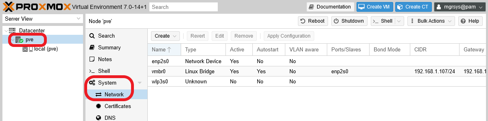
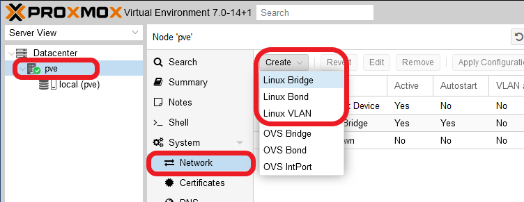
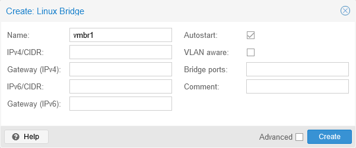
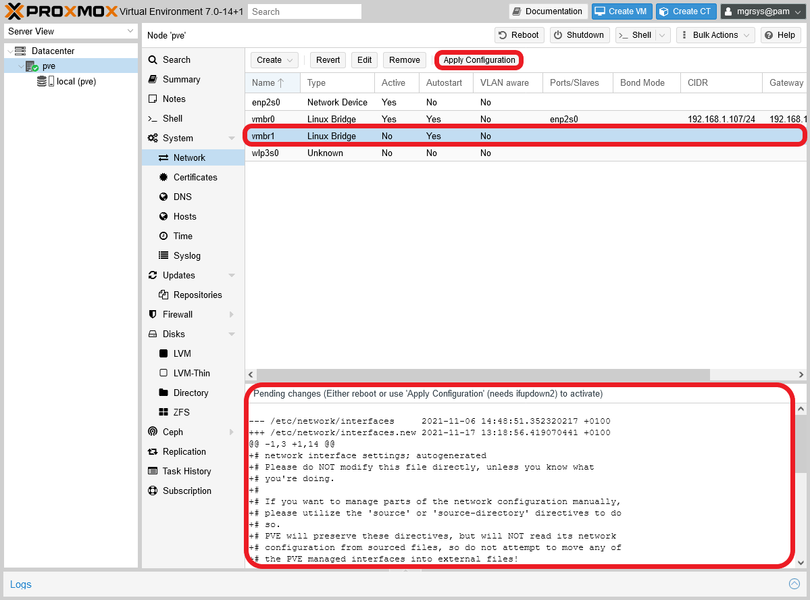
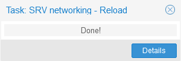
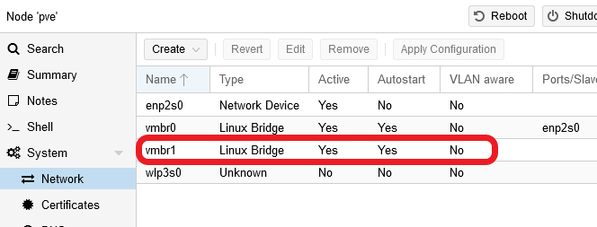

# G017 - Virtual Networking ~ Network configuration

In the upcoming guides, I'll show you how to setup a small Kubernetes cluster run with virtual machines, and those VMs will need networking among each other and also with your LAN. Therefore, you need revise the virtual network setup you have and make it fit for the needs you'll face later.

## Current virtual network setup

The setup of your Proxmox VE standalone system is kept at the node level. To see it, you need to get into your PVE web console and browse to the `System > Network` view of your `pve` node.

In the capture above you can see the setup on my own Proxmox VE host, which has three network interfaces:

- `enp2s0` : is my host's real ethernet NIC.

- `vmbr0` : is the Linux bridge generated in the installation of Proxmox VE. It holds the IP of this host, and "owns" the `enp2s0` NIC. If you remember, all this was set up [back in the Proxmox VE installation](G002%20-%20Proxmox%20VE%20installation.md).

- `wlp3s0` : is the host's real WIFI NIC. Notice how Proxmox VE doesn't know it's `Type` and that it's not `Active`.

At least, your system should have one `en*` device and the `vmbr0` Linux bridge.

Another thing you must be aware of is that any changes you make in this page will be saved in the `/etc/network/interfaces` file of your PVE host. So, open a shell as `mgrsys` and then make a backup of that file before you start changing things here.

~~~bash
$ sudo cp /etc/network/interfaces /etc/network/interfaces.orig
~~~

## Target network scenario

The idea is to create a small cluster with a few virtual machines in which each VM will have two network cards. Why two network cards? To separate the internal communications that a Kubernetes cluster has between its nodes from the traffic between the cluster and the external or LAN network.

So, the VMs will have access to the external network and be reachable through one NIC, and communicate only with each other for cluster-related tasks through the other NIC. This is achieved simply by setting up the NICs on different IP subnets but, to guarantee true isolation for the internal-cluster-communication NICs you can emulate how it would be done if you were using real hardware: by setting up another Linux bridge not connected to the external network and connecting the internal-cluster-communication NICs to it.

## Creating an isolated Linux bridge

Creating a new and isolated Linux bridge in your Proxmox VE system is rather simple through the web console.

1. Browse to the `System > Network` of your `pve` node. Then click on the `Create` button to unfold a list of options.

    

    Notice that there are two options groups in the unfolded list:

    - `Linux` options: networking technology included in the Linux kernel, meaning that it's already available in your system.

    - `OVS` options: relative to **Open vSwitch** technology. Since it's not installed in your system, these options won't work in your setup. If you want to know how to enable the OVS technology in your system, check the [**G910** appendix guide](G910%20-%20Appendix%2010%20~%20Setting%20up%20virtual%20network%20with%20Open%20vSwitch.md).

2. Click on the `Linux Bridge` option and you'll meet the `Create: Linux Bridge` form window.

    

    The default values are just fine:

    - `Name`: you could put a different name if you wanted, but since Proxmox VE follows a naming convention for device names like these, it's better to leave the default one to avoid potential issues.

    - `IPv4/CIDR` and `Gateway (IPv4)`: left empty because you don't really need an IP assigned to a bridge for it to do its job at the MAC level.

    - `IPv6/CIDR` and `Gateway (IPv6)`: the same reason as with the IPv4 values, plus you're not using IPv6 in the setup explained in this guide series.

    - `Autostart`: you want this bridge to be always available when the system boots up.

    - `VLAN aware`: for the scenario contemplated in this guide series, there's no need for you to use VLANs at all. In fact, the other `vmbr0` bridge doesn't have this option enabled either.

    - `Bridge ports`: here will be listed all the interfaces connected to this bridge. Right now this list has to be left empty in this bridge. Notice that, in the `vmbr0` bridge, the `enp2s0` appears here.

    - `Comment`: Here you could put a string like `K3s cluster inner networking` (**K3s** will be the Kubernetes distribution used to set up the cluster).

3. Click on `Create` and you'll see your new `vmbr1` Linux bridge added to the list of network devices.

    

    You'll notice two things:

    - The `Apply Configuration` button has been enabled.
    - A log console has appeared right below the network devices list, showing you the "pending changes" that you have to apply.

4. Press on the `Apply Configuration` button to make the underlying `ifupdown2` commands apply the changes. This action demands confirmation by a window as the one shown below.

    

    Press on `Yes`, and you'll see a small progress window that should finish rather fast.

    

5. The Network page will refresh automatically and you'll see your new vmbr1 Linux bridge active in the devices list.

    

6. You can also check out the changes applied at the `/etc/network/interfaces` configuration file of your PVE host. So, open a shell as mgrsys and open the file with `less`.

    ~~~bash
    $ less /etc/network/interfaces
    ~~~

    The file should look like the following at this point.

    ~~~bash
    # network interface settings; autogenerated
    # Please do NOT modify this file directly, unless you know what
    # you're doing.
    #
    # If you want to manage parts of the network configuration manually,
    # please utilize the 'source' or 'source-directory' directives to do
    # so.
    # PVE will preserve these directives, but will NOT read its network
    # configuration from sourced files, so do not attempt to move any of
    # the PVE managed interfaces into external files!

    auto lo
    iface lo inet loopback

    iface enp2s0 inet manual

    auto vmbr0
    iface vmbr0 inet static
            address 192.168.1.107/24
            gateway 192.168.1.1
            bridge-ports enp2s0
            bridge-stp off
            bridge-fd 0

    iface wlp3s0 inet manual

    auto vmbr1
    iface vmbr1 inet manual
            bridge-ports none
            bridge-stp off
            bridge-fd 0
    #K3s cluster inner networking
    ~~~

    You'll find your new `vmbr1` bridge added at the bottom of this `interfaces` file, with a set of `bridge-` options similar to the original `vmbr0` bridge.

## Bridges management

You can handle your bridges through your Proxmox VE web console, but that's a rather limited tool for solving more complex situations. So, be aware that:

- You can always work directly with the `/etc/network/interfaces` to adjust the parameters of your bridges (and any other network interface running in your system).

- You can use the `ip` command to handle the bridges as with any other network device. For instance, you can compare the traffic statistics of your new `vmbr1` bridge with the ones from `vmbr0`.

    ~~~bash
    $ ip -s link show vmbr0
    4: vmbr0: <BROADCAST,MULTICAST,UP,LOWER_UP> mtu 1500 qdisc noqueue state UP mode DEFAULT group default qlen 1000
        link/ether b8:ae:ed:27:d1:7f brd ff:ff:ff:ff:ff:ff
        RX: bytes  packets  errors  dropped missed  mcast
        13175973   48855    0       0       0       23611
        TX: bytes  packets  errors  dropped carrier collsns
        11374278   17226    0       0       0       0
    $ ip -s link show vmbr1
    6: vmbr1: <NO-CARRIER,BROADCAST,MULTICAST,UP> mtu 1500 qdisc noqueue state DOWN mode DEFAULT group default qlen 1000
        link/ether b2:6a:1c:f9:50:fa brd ff:ff:ff:ff:ff:ff
        RX: bytes  packets  errors  dropped missed  mcast
        0          0        0       0       0       0
        TX: bytes  packets  errors  dropped carrier collsns
        0          0        0       0       0       0
    ~~~

    Notice how, at this point, the `vmbr1` bridge has no traffic whatsoever while `vmbr0` has some going through it.

- There's a command with specific functionality meant for managing bridges, called `bridge`. It's installed in your Proxmox VE system, so you can use it right away. For instance, you could get the details of the links used with your bridges.

    ~~~bash
    $ sudo bridge -d link show
    2: enp2s0: <BROADCAST,MULTICAST,UP,LOWER_UP> mtu 1500 master vmbr0 state forwarding priority 32 cost 100
        hairpin off guard off root_block off fastleave off learning on flood on mcast_flood on mcast_to_unicast off neigh_suppress off vlan_tunnel off isolated off
    4: vmbr0: <BROADCAST,MULTICAST,UP,LOWER_UP> mtu 1500 master vmbr0
    6: vmbr1: <NO-CARRIER,BROADCAST,MULTICAST,UP> mtu 1500 master vmbr1
    ~~~

    Notice that `bridge` requires `sudo` to be executed. To understand this command, beyond reading its `man` page, you'll also need to study the particularities of bridges in general. Please take a look to the References I've linked at the end of this guide.

- In old documentation you'll see that they use a `brctl` command. This was the old way of managing bridges, but has been deprecated and replaced by `bridge`. You'll find the `brctl` command available in your Proxmox VE system, but try not to use it and stick to the `bridge` one instead, mainly to avoid unexpected issues due to incompatibilities between the old way of configuring bridges and the new one.

## Relevant system paths

### _Directories_

- `/etc/network`

### _Files_

- `/etc/network/interfaces`
- `/etc/network/interfaces.orig`

## References

### _Proxmox VE networking_

- [Proxmox VE documentation. Network Configuration](https://pve.deimos.cloud:8006/pve-docs/chapter-sysadmin.html#sysadmin_network_configuration)
- [Proxmox VE Wiki. Network Configuration](https://pve.proxmox.com/wiki/Network_Configuration)

### _Linux and virtual networking_

- [Fun with veth devices, Linux virtual bridges, KVM, VMware – attach the host and connect bridges via veth](https://linux-blog.anracom.com/tag/linux-bridge-linking/)
- [Linux Bridge - Part 1](https://hechao.li/2017/12/13/linux-bridge-part1/)
- [KVM networking](https://www.linux-kvm.org/page/Networking)
- [How to setup and configure network bridge on Debian Linux](https://www.cyberciti.biz/faq/how-to-configuring-bridging-in-debian-linux/)
- [Mini Container Series Part 5](https://hechao.li/2020/07/01/Mini-Container-Series-Part-5-Network-Isolation/)
- [Linux: bridges, VLANs and RSTP](https://serverfault.com/questions/824621/linux-bridges-vlans-and-rstp)
- [Bridging Ethernet Connections (as of Ubuntu 16.04)](https://help.ubuntu.com/community/NetworkConnectionBridge)
