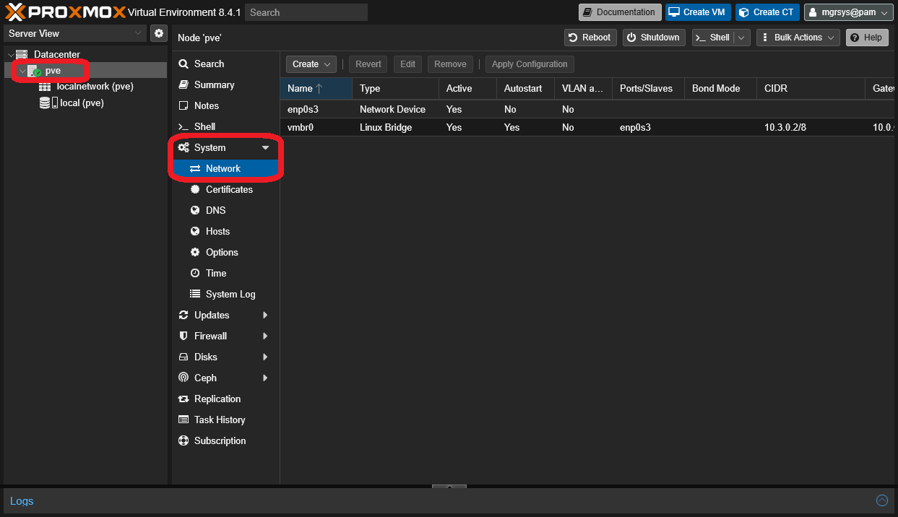
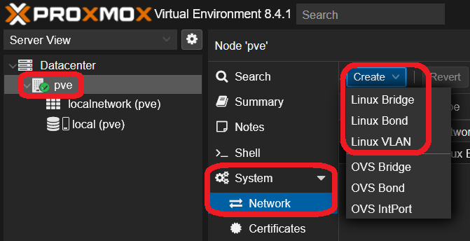
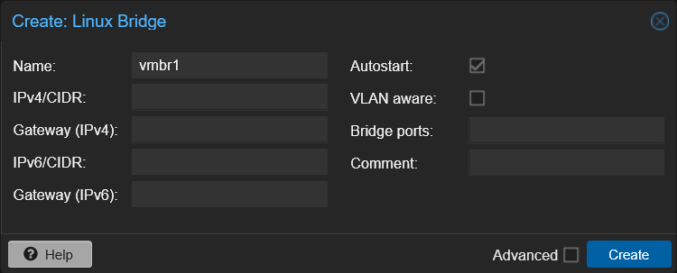
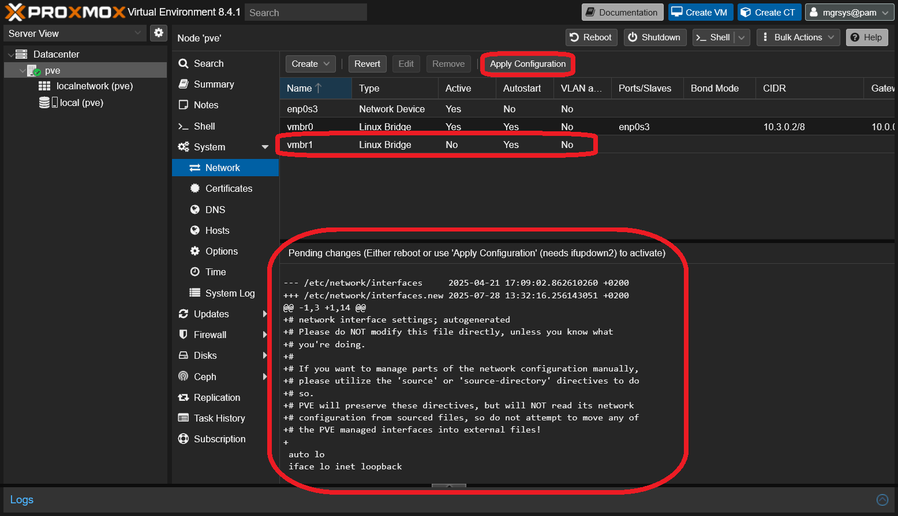
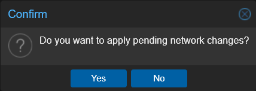
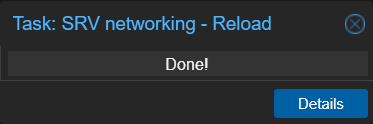
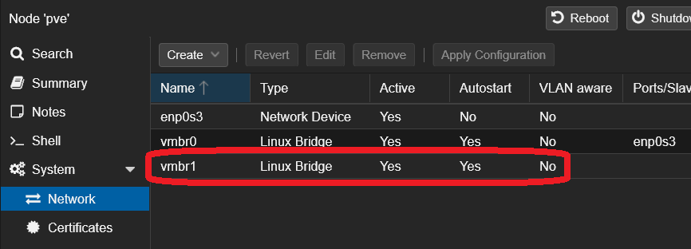

# G017 - Virtual Networking ~ Network configuration

- [Preparing your virtual network for Kubernetes](#preparing-your-virtual-network-for-kubernetes)
- [Current virtual network setup](#current-virtual-network-setup)
- [Target network scenario](#target-network-scenario)
- [Creating an isolated Linux bridge](#creating-an-isolated-linux-bridge)
- [Bridges management](#bridges-management)
- [Relevant system paths](#relevant-system-paths)
  - [Directories](#directories)
  - [Files](#files)
- [References](#references)
  - [Proxmox VE](#proxmox-ve)
  - [Linux and virtual networking](#linux-and-virtual-networking)
- [Navigation](#navigation)

## Preparing your virtual network for Kubernetes

In the upcoming chapters, I'll show you how to setup a small Kubernetes cluster run on virtual machines. Those VMs will need networking among each other and also with your LAN. Therefore, you need revise the virtual network setup you have and make it fit for the needs you will face later.

## Current virtual network setup

The network setup of your Proxmox VE standalone system is kept at its node level. To see it, you need to get into your PVE web console and browse to the `System > Network` view of your `pve` node.

In the capture above you can see the setup on my own Proxmox VE host, which has these network interfaces:

- `enp3s0`\
  Is my host's real Ethernet NIC.

- `vmbr0`\
  Is the Linux bridge generated in the installation of Proxmox VE. It holds the IP of this host, and "owns" the `enp3s0` NIC. If you remember, all this was set up [back in the Proxmox VE installation](G002%20-%20Proxmox%20VE%20installation.md).

Your system should have, at least, one `en*` device and the `vmbr0` Linux bridge.

Be aware that any changes you make in this page will be saved in the `/etc/network/interfaces` file of your PVE host. Open a shell as `mgrsys` and then make a backup of that file before you start changing your PVE network:

~~~sh
$ sudo cp /etc/network/interfaces /etc/network/interfaces.orig
~~~

## Target network scenario

The idea is to create a small Kubernetes cluster run with a few virtual machines. Each of those VMs will have two network cards. Why two network cards? To separate the internal communications that a Kubernetes cluster has between its nodes from the traffic between the cluster and the external or LAN network.

The VMs will have access to the external or LAN network and be reachable through one NIC, and communicate only with each other for cluster-related tasks through the other NIC. This is achieved simply by setting up the NICs on different IP subnets but, to guarantee true isolation for the internal-cluster-communication NICs you can emulate how it would be done if you were using real hardware: by setting up another Linux bridge not connected to the external network and connecting the internal-cluster-communication NICs to it.

## Creating an isolated Linux bridge

Creating a new and isolated Linux bridge in your Proxmox VE system is rather simple through the web console:

1. Browse to the `System > Network` of your `pve` node. Then click on the `Create` button to unfold a list of options:

    

    Notice that there are two options groups in the unfolded list:

    - **`Linux` options**\
      Networking technology included in the Linux kernel, meaning that it's already available in your PVE system.

    - **`OVS` options**\
      Relative to **Open vSwitch** technology. Since it's not installed in your system, these options won't work in your setup.

      > [!NOTE]
      > If you want to know how to enable the OVS technology in your system, check the [**G910** appendix chapter](G910%20-%20Appendix%2010%20~%20Setting%20up%20virtual%20network%20with%20Open%20vSwitch.md).

2. Click on the `Linux Bridge` option and you'll meet the `Create: Linux Bridge` form window:

    

    The default values are just fine:

    - `Name`\
      You could put a different name if you wanted to but, since Proxmox VE follows a naming convention for device names like these, it is better to leave the default one to avoid potential issues.

    - `IPv4/CIDR` and `Gateway (IPv4)`\
      Left empty because you don't really need an IP assigned to a bridge for it to do its job at the MAC level.

    - `IPv6/CIDR` and `Gateway (IPv6)`\
      Also left empty for the same reason as with the IPv4 values, plus you're not even using IPv6 in the setup explained in this guide.

    - `Autostart`\
      You want this bridge to be always available when the system boots up.

    - `VLAN aware`\
      For the scenario contemplated in this guide series, there is no need for you to use VLANs at all. In fact, the existing `vmbr0` bridge does not have this option enabled either.

    - `Bridge ports`\
      Here will be listed all the interfaces connected to this bridge. Right now this list has to be left empty in this bridge. Notice that, in the `vmbr0` bridge, the `enp3s0` interface appears listed in this field.

    - `Comment`\
      Here you could enter a string like `K3s cluster inner networking` (**K3s** will be the Kubernetes distribution used to set up the cluster later).

3. Click on `Create` and you'll see your new `vmbr1` Linux bridge added to the list of network devices:

    

    You'll see that:

    - The `Apply Configuration` button has been enabled.
    - Your new Linux bridge has been added to the network list, **but is not active**.
    - A log console has appeared right below the network devices list, showing you the "pending changes" you have to apply.

4. Press on the `Apply Configuration` button to make the underlying `ifupdown2` commands apply the changes. This action demands confirmation in the window shown below:

    

    Press on `Yes`, and you'll see a small progress window that should finish rather fast:

    

5. The `Network` page will refresh automatically and you'll see your new `vmbr1` Linux bridge active in the devices list:

    

6. You can also check out the changes applied at the `/etc/network/interfaces` configuration file of your PVE host. Open a shell as `mgrsys` and open the file with `less`.

    ~~~sh
    $ less /etc/network/interfaces
    ~~~

    The file should look now like this:

    ~~~sh
    # network interface settings; autogenerated
    # Please do NOT modify this file directly, unless you know what
    # you're doing.
    #
    # If you want to manage parts of the network configuration manually,
    # please utilize the 'source' or 'source-directory' directives to do
    # so.
    # PVE will preserve these directives, but will NOT read its network
    # configuration from sourced files, so do not attempt to move any of
    # the PVE managed interfaces into external files!

    auto lo
    iface lo inet loopback

    iface enp3s0 inet manual

    auto vmbr0
    iface vmbr0 inet static
            address 10.1.0.1/8
            gateway 10.0.0.1
            bridge-ports enp3s0
            bridge-stp off
            bridge-fd 0

    auto vmbr1
    iface vmbr1 inet manual
            bridge-ports none
            bridge-stp off
            bridge-fd 0
    #K3s cluster inner networking

    source /etc/network/interfaces.d/*
    ~~~

    You will find your new `vmbr1` bridge appended to this `interfaces` file with a set of `bridge-` options similar to the original `vmbr0` bridge.

## Bridges management

You can handle your bridges through your Proxmox VE web console, but that is a rather limited tool for solving more complex situations:

- You can use the `ip` command to handle the bridges like any other network device. For instance, you can compare the traffic statistics of your new `vmbr1` bridge with the ones from `vmbr0`.

    ~~~sh
    $ ip -s link show vmbr0
    3: vmbr0: <BROADCAST,MULTICAST,UP,LOWER_UP> mtu 1500 qdisc noqueue state UP mode DEFAULT group default qlen 1000
        link/ether 98:ee:cb:03:05:a3 brd ff:ff:ff:ff:ff:ff
        RX:  bytes packets errors dropped  missed   mcast
          3682639   12855      0       0       0    5660
        TX:  bytes packets errors dropped carrier collsns
          3750287    4968      0       0       0       0
    $ ip -s link show vmbr1
    4: vmbr1: <BROADCAST,MULTICAST,UP,LOWER_UP> mtu 1500 qdisc noqueue state UNKNOWN mode DEFAULT group default qlen 1000
        link/ether 32:06:ef:79:b5:9d brd ff:ff:ff:ff:ff:ff
        RX:  bytes packets errors dropped  missed   mcast
                0       0      0       0       0       0
        TX:  bytes packets errors dropped carrier collsns
                0       0      0       0       0       0
    ~~~

    See how, at this point, the `vmbr1` bridge has no traffic whatsoever while `vmbr0` has some networking flow going through it.

- There is a command with specific functionality meant for managing bridges, called `bridge`. It's installed in your Proxmox VE system, so you can use it right away. Also, be aware that **the `bridge` command requires `sudo` to be executed**.

    > [!NOTE]
    > **To understand the bridge command, you also need to study the particularities of bridges in general**\
    > Please take a look to the [references linked at the end of this chapter](#references).

## Relevant system paths

### Directories

- `/etc/network`

### Files

- `/etc/network/interfaces`
- `/etc/network/interfaces.orig`

## References

### [Proxmox VE](https://pve.proxmox.com/)

- [Host System Administration. Network Configuration](https://pve.proxmox.com/pve-docs/chapter-sysadmin.html#sysadmin_network_configuration)
- [Wiki. Network Configuration](https://pve.proxmox.com/wiki/Network_Configuration)

### Linux and virtual networking

- [Linux Expert. Deep Guide to Bridge Command Line in Linux](https://www.linuxoperatingsystem.net/deep-guide-bridge-command-line-in-linux/)
- [Fun with veth devices, Linux virtual bridges, KVM, VMware – attach the host and connect bridges via veth](https://linux-blog.anracom.com/tag/linux-bridge-linking/)
- [KVM networking](https://www.linux-kvm.org/page/Networking)
- [How to setup and configure network bridge on Debian Linux](https://www.cyberciti.biz/faq/how-to-configuring-bridging-in-debian-linux/)
- [Hechao's Blog. Linux Bridge - Part 1](https://hechao.li/posts/linux-bridge-part1/)
- [Hechao's Blog. Mini Container Series Part 5](https://hechao.li/posts/Mini-Container-Series-Part-5-Network-Isolation/)
- [Linux: bridges, VLANs and RSTP](https://serverfault.com/questions/824621/linux-bridges-vlans-and-rstp)
- [Bridging Ethernet Connections (as of Ubuntu 16.04)](https://help.ubuntu.com/community/NetworkConnectionBridge)

## Navigation

[<< Previous (**G016. Host optimization 02**)](G016%20-%20Host%20optimization%2002%20~%20Disabling%20the%20transparent%20hugepages.md) | [+Table Of Contents+](G000%20-%20Table%20Of%20Contents.md) | [Next (**G018. K3s cluster setup 01**) >>](G018%20-%20K3s%20cluster%20setup%2001%20~%20Requirements%20and%20arrangement.md)
