# G019 - K3s cluster setup 02 ~ Storage setup

Before you can start creating VMs or containers in your standalone PVE node, there's something still pending to do: organizing the current free storage space you have available in your node. And what are the data elements you must have in mind?

- ISO images, container templates and snippets.
- VMs and container disks images.
- Data generated or stored by apps and services.
- Backup of vzdumps and snapshots of VMs and containers.
- Backups of data stored or generated by apps and services.

On the other hand, there's the particular basic LVM storage arrangement you already set up in the [**G005** guide](G005%20-%20Host%20configuration%2003%20~%20LVM%20storage.md).

- One partitioned LVM VG group for the PVE system itself, in the internal SSD drive, called `pve`.
- An empty LVM VG group, also in the internal SSD drive, called `ssdint`.
- An empty LVM VG group, in the internal HDD drive, called `hddint`.
- An empty LVM VG group, in the external USB HDD drive, called `hddusb`.

Next, I'll show how a way to organize the data elements among the empty LVM VG groups available.

## Storage organization model

First, you need to figure out how you want to distribute the data elements in your available storage. Let's go through this element by element.

- **OSes ISO images, container templates and snippets**:  
    These could be stored in the `local` storage already available in the `pve` group, but it's better to keep the Proxmox VE system as isolated as possible from anything else. Hence, you'll create a new small LV within the `hddint` VG just to store ISOs, container templates and snippets.

- **VMs and container disks images**:  
    To store the disks images in Proxmox VE, you need to create a new LVM-thin (or thinpool) storage within the `ssdint` VG. This way you'll get the best performance possible for the VMs and containers by making them run on the ssd drive.

- **Data generated by apps or services**:  
    This data is mainly the information generated or just stored by the services running in this setup. For these you'll use two different thinpools, the one already mentioned above within the `ssdint` VG, and other that you must create within the `hddint` VG.

- **Backups and snapshots of VMs and containers**:  
    The proper thing to do is not to keep the backups inside the host itself. So, you'll create a LV within the `hddusb` VG to store the VMs and containers' backups and snapshots in your external usb drive.

- **Backups of data generated by apps and services**:  
    In a similar fashion to the backups of VMs and containers, you'll create a thinpool also in the `hddusb` to store backups of data.

## Creating the logical volumes (LVs)

Now that you know how to organize the available free storage in your setup, you can start creating the logical volumes you require.

1. Log in with `mgrsys` and check with `vgs` how much space available you have on each volume group.

    ~~~bash
    $ sudo vgs
      VG     #PV #LV #SN Attr   VSize    VFree
      hddint   1   0   0 wz--n- <930.51g <930.51g
      hddusb   1   0   0 wz--n-   <1.82t   <1.82t
      pve      1   2   0 wz--n-  <49.50g       0
      ssdint   1   0   0 wz--n- <881.51g <881.51g
    ~~~

2. Being aware of the storage available, now you create all the LVs you need with `lvcreate`.

    ~~~bash
    $ sudo lvcreate --type thin-pool -L 881g -n ssd_disks ssdint
    $ sudo lvcreate -L 60g -n hdd_templates hddint
    $ sudo lvcreate --type thin-pool -L 870g -n hdd_data hddint
    $ sudo lvcreate -L 520g -n hddusb_bkpvzdumps hddusb
    $ sudo lvcreate --type thin-pool -L 1340g -n hddusb_bkpdata hddusb
    ~~~

    > **BEWARE!**  
    > The LVs haven't taken up the whole space on each drive. You must leave some room available in case any of the thinpools' metadata need to grow.

3. With `lsblk` you can verify that you've got the storage structure you want.

    ~~~bash
    $ lsblk
    NAME                            MAJ:MIN RM   SIZE RO TYPE MOUNTPOINT
    sda                               8:0    0 931.5G  0 disk
    ├─sda1                            8:1    0  1007K  0 part
    ├─sda2                            8:2    0   512M  0 part /boot/efi
    ├─sda3                            8:3    0  49.5G  0 part
    │ ├─pve-swap                    253:0    0    12G  0 lvm  [SWAP]
    │ └─pve-root                    253:1    0  37.5G  0 lvm  /
    └─sda4                            8:4    0 881.5G  0 part
      ├─ssdint-ssd_disks_tmeta      253:2    0   112M  0 lvm
      │ └─ssdint-ssd_disks          253:4    0   881G  0 lvm
      └─ssdint-ssd_disks_tdata      253:3    0   881G  0 lvm
        └─ssdint-ssd_disks          253:4    0   881G  0 lvm
    sdb                               8:16   0 931.5G  0 disk
    └─sdb1                            8:17   0 931.5G  0 part
      ├─hddint-hdd_templates        253:5    0    60G  0 lvm
      ├─hddint-hdd_data_tmeta       253:6    0   112M  0 lvm
      │ └─hddint-hdd_data           253:8    0   870G  0 lvm
      └─hddint-hdd_data_tdata       253:7    0   870G  0 lvm
        └─hddint-hdd_data           253:8    0   870G  0 lvm
    sdc                               8:32   0   1.8T  0 disk
    └─sdc1                            8:33   0   1.8T  0 part
      ├─hddusb-hddusb_bkpvzdumps    253:9    0   520G  0 lvm
      ├─hddusb-hddusb_bkpdata_tmeta 253:10   0    84M  0 lvm
      │ └─hddusb-hddusb_bkpdata     253:12   0   1.3T  0 lvm
      └─hddusb-hddusb_bkpdata_tdata 253:11   0   1.3T  0 lvm
        └─hddusb-hddusb_bkpdata     253:12   0   1.3T  0 lvm
    ~~~

    You can also use the `vgs` command to see the current volumes within the VGs.

    ~~~bash
    $ sudo vgs -o +lv_size,lv_name
      VG     #PV #LV #SN Attr   VSize    VFree   LSize   LV
      hddint   1   2   0 wz--n- <930.51g 296.00m  60.00g hdd_templates
      hddint   1   2   0 wz--n- <930.51g 296.00m 870.00g hdd_data
      hddusb   1   2   0 wz--n-   <1.82t 868.00m 520.00g hddusb_bkpvzdumps
      hddusb   1   2   0 wz--n-   <1.82t 868.00m  <1.31t hddusb_bkpdata
      pve      1   2   0 wz--n-  <49.50g      0   12.00g swap
      pve      1   2   0 wz--n-  <49.50g      0  <37.50g root
      ssdint   1   1   0 wz--n- <881.51g 296.00m 881.00g ssd_disks
    ~~~

4. At this point, the PVE web console will already show your newly created LVM-thin thinpools. Find them at your `pve` node level, in the `Disks > LVM-Thin` screen.

    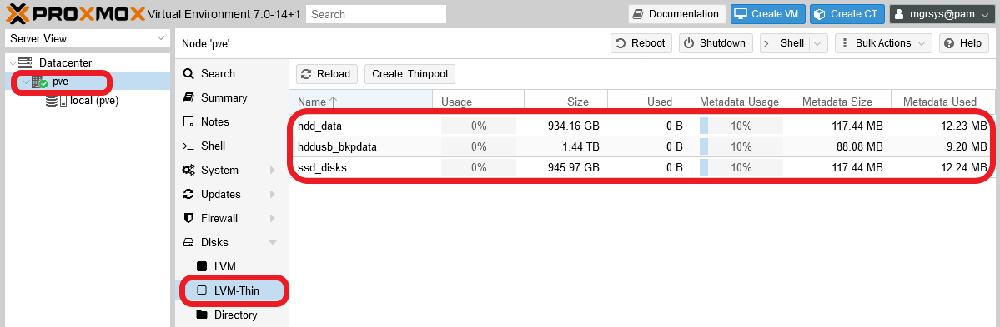

## Enabling the LVs for Proxmox VE

Before you enable the new LV volumes and thinpools in Proxmox VE, there are a few more things to do yet.

### _Formatting and mounting of LVs_

The new LVs are virtual partitions that still doesn't have a defined filesystem. So you need to format them to have one, `ext4` in your case.

> **BEWARE!**  
> Next you'll format and mount just the new LVs, NOT the new thinpools!

1. Before you format the new LVs, you need to see their `/dev/mapper/` paths with `fdisk`.

    ~~~bash
    $ sudo fdisk -l | grep /dev/mapper
    Disk /dev/mapper/pve-swap: 12 GiB, 12884901888 bytes, 25165824 sectors
    Disk /dev/mapper/pve-root: 37.5 GiB, 40261124096 bytes, 78635008 sectors
    Disk /dev/mapper/hddint-hdd_templates: 60 GiB, 64424509440 bytes, 125829120 sectors
    Disk /dev/mapper/hddusb-hddusb_bkpvzdumps: 520 GiB, 558345748480 bytes, 1090519040 sectors
    ~~~

2. After discovering their paths, you can use the `mkfs.ext4` command to format the LVs.

    ~~~bash
    $ sudo mkfs.ext4 /dev/mapper/hddint-hdd_templates
    $ sudo mkfs.ext4 /dev/mapper/hddusb-hddusb_bkpvzdumps
    ~~~

    Each `mkfs.ext4` command will print an output as below.

    ~~~bash
    mke2fs 1.46.2 (28-Feb-2021)
    Creating filesystem with 15728640 4k blocks and 3932160 inodes
    Filesystem UUID: c8a71921-3368-4fb5-95fb-12c077a64962
    Superblock backups stored on blocks:
            32768, 98304, 163840, 229376, 294912, 819200, 884736, 1605632, 2654208,
            4096000, 7962624, 11239424

    Allocating group tables: done
    Writing inode tables: done
    Creating journal (65536 blocks): done
    Writing superblocks and filesystem accounting information: done
    ~~~

3. Before you can mount these LVs like any other partition, you need to create their corresponding mountpoints. This means you have to create a directory for each LV.

    ~~~bash
    $ sudo mkdir -p /mnt/{hdd_templates,hddusb_bkpvzdumps}
    ~~~

    To check out fast that the folder structure is correct, you can use the `tree` command.

    ~~~bash
    $ tree -F /mnt/
    /mnt/
    ├── hdd_templates/
    ├── hddusb_bkpvzdumps/
    └── hostrun/

    3 directories, 0 files
    ~~~

    Don't mind the `hostrun` folder, it was already present at `mnt`. Just check if the folder structure is as expected.

4. Now you can mount the LVs on their mountpoints. To do that, use the `mount` command.

    ~~~bash
    $ sudo mount /dev/mapper/hddint-hdd_templates /mnt/hdd_templates
    $ sudo mount /dev/mapper/hddusb-hddusb_bkpvzdumps /mnt/hddusb_bkpvzdumps
    ~~~

    The `mount` command won't output anything if it executes correctly.

    To verify that you see the LVs as mounted filesystems, use `df`.

    ~~~bash
    $ df -h
    Filesystem                            Size  Used Avail Use% Mounted on
    udev                                  3.8G     0  3.8G   0% /dev
    tmpfs                                 785M  1.1M  784M   1% /run
    /dev/mapper/pve-root                   38G  3.9G   32G  11% /
    tmpfs                                 3.9G   31M  3.9G   1% /dev/shm
    tmpfs                                 5.0M     0  5.0M   0% /run/lock
    /dev/sda2                             511M  328K  511M   1% /boot/efi
    /dev/fuse                             128M   16K  128M   1% /etc/pve
    tmpfs                                 785M     0  785M   0% /run/user/1000
    /dev/mapper/hddint-hdd_templates       59G   24K   56G   1% /mnt/hdd_templates
    /dev/mapper/hddusb-hddusb_bkpvzdumps  511G   28K  485G   1% /mnt/hddusb_bkpvzdumps
    ~~~

    You can see your newly mounted filesystems at the end of the list.

5. To make the previous mounting permanent, you need to edit the `/etc/fstab` file. First make a backup of it.

    ~~~bash
    $ cd /etc
    $ sudo cp fstab fstab.orig
    ~~~

    Then **append** the following lines to the `fstab` file.

    ~~~bash
    /dev/mapper/hddint-hdd_templates /mnt/hdd_templates ext4 defaults,nofail 0 0
    /dev/mapper/hddusb-hddusb_bkpvzdumps /mnt/hddusb_bkpvzdumps ext4 defaults,nofail 0 0
    ~~~

6. To verify that the mounting is truly working permanently, reboot your PVE system.

    ~~~bash
    $ sudo reboot
    ~~~

7. Finally, verify with `df` that the mounting is still working.

    ~~~bash
    $ df -h
    Filesystem                            Size  Used Avail Use% Mounted on
    udev                                  3.8G     0  3.8G   0% /dev
    tmpfs                                 785M  1.1M  784M   1% /run
    /dev/mapper/pve-root                   38G  3.9G   32G  11% /
    tmpfs                                 3.9G   13M  3.9G   1% /dev/shm
    tmpfs                                 5.0M     0  5.0M   0% /run/lock
    /dev/mapper/hddusb-hddusb_bkpvzdumps  511G   28K  485G   1% /mnt/hddusb_bkpvzdumps
    /dev/mapper/hddint-hdd_templates       59G   24K   56G   1% /mnt/hdd_templates
    /dev/sda2                             511M  328K  511M   1% /boot/efi
    /dev/fuse                             128M   16K  128M   1% /etc/pve
    tmpfs                                 785M     0  785M   0% /run/user/1000
    ~~~

    Now the lines for your new LVs filesystems are shown in a different order because they've been mounted by the system.

### _Enabling directories within Proxmox VE_

Each storage type supported by Proxmox VE can store only a limited range of content types. In particular, to enable Proxmox VE to make backups of VMs or containers, or to store ISO images, the only option we have for the limited setup used in this guide series is to use **directories**.

A directory is just that, a path currently existing in your filesystem. In your standalone PVE node you already have one enabled, which you can see in the `Datacenter > Storage` section.

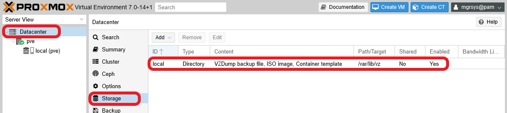

In this snapshot you can see the `local` directory highlighted. This directory is, in fact, the `root` directory of your Proxmox VE installation. It comes configured to support only three content types, although Proxmox VE can store more content types in a directory.

#### **Setting up the directories**

Now you'll enable as directories the two LVs you've just created and mounted before:

- The `hdd_templates` LV will hold ISO images, container templates and snippets.
- The `hddusb_bkpvzdumps` LV will store virtual machine dumps (`VZDump`).

1. Get into the web console, open the `Datacenter > Storage` page and click on the `Add` button.

    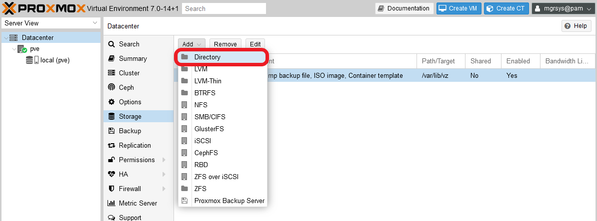

    You'll get the whole list of storage types supported by Proxmox VE, although in our small setup we're limited to use just the first three.

    > **NOTE**  
    > Technically, you could also use NFS but, since its not in the scope of this guide series, I won't consider it an option for our build.

2. Click on `Directory` and you'll get to the window below.

    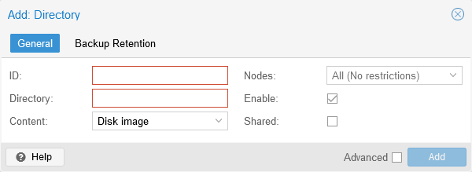

    By default, it opens at its `General` tab, which has the following parameters:

    - `ID`: this is the name for the storage, to identify it within Proxmox VE.
    - `Directory`: the directory's path you want to enable here.
    - `Content`: this is a multichoice list in which you choose the content types you want to support on this storage.
    - `Nodes`: in a PVE cluster, this allows you to restrict on which nodes you want to have this storage available.
    - `Enable`: to enable or disable this storage.
    - `Shared`: in a PVE cluster, this allows to mark a storage as shared among the nodes.
        > **BEWARE!**  
        > Not all storage types support this option (like `LVM-Thin`, for instance).

    The `Backup Retention` tab looks like below.

    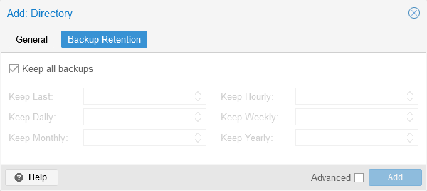

    Here you can configure your backup retention policy applied in the directory. By default, the `Keep all backups` comes already checked, but you can uncheck it to define a concrete prune policy to clear old backups stored in this storage: you may just keep a number of recent backups with `Keep Last`, from restricted periods of time with the rest of `Keep` parameters, or define a more complex combination with all those parameters.

    > **BEWARE!**  
    > In the official documentation, it's not clear if `Backup Retention` policies apply to all content types or just to some of them. In this guide I'll assume the former.

    You may also have noticed the `Advanced` checkbox in this window.

    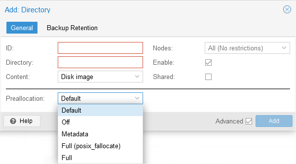

    This option allows you to specify how you want space preallocation to work with this storage unit. Since at the time of writing this there are no details whatsoever about this option in the official Proxmox VE documentation, I can't tell you more about it. If you know this, just choose the option you prefer, otherwise I'd stick with `Default`.

3. Let's enable the directory for the VZDumps (VMs backups).

    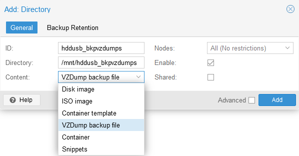

    Above, you can see that:

    - The `ID` is just a string, but it should be as descriptive as possible.

    - In `Directory` goes the **absolute** path of the folder already present in your PVE node.

    - In `Content` there's only one content type selected, the one related to VM dumps, while the `Disk image` that was marked by default has been unselected.

    - No other option has been touched, not even in the `Backup Retention` tab.

4. Click on `Add` and, after an instant, you should see your directory added to the list of available storages at your `Datacenter` level.

    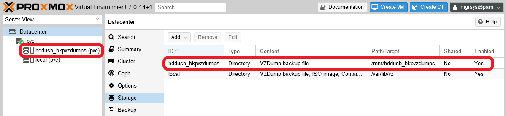

5. Like you've just done for the `vzdumps` directory, do likewise for the `templates` directory:

    - ID: `hdd_templates`, Directory: `/mnt/hdd_templates`, Content: `ISO image, Container template, Snippets`.

6. After enabling both of them, your `Datacenter`'s storage list should look like below.

    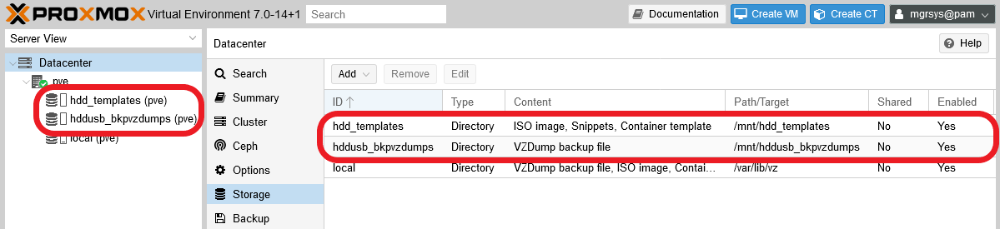

#### **Disabling the `local` directory**

As you've already seen, Proxmox VE comes with one directory storage enabled by default, the `local` one. Since this is the `root` directory of your system, and with the new directory layout you cover the same things as with this one, you can disable it as storage.

1. Open the PVE web console and go to the `Datacenter > Storage` screen. There, choose the `local` directory and press on `Edit`.

    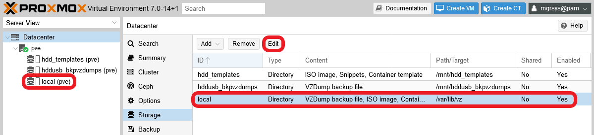

    Also, notice how the `local` storage appears under your PVE node in the `Server View` tree (which you have to unfold first), at the page's left.

2. On the `Edit` window, just uncheck the `Enable` option and then click `OK`.

    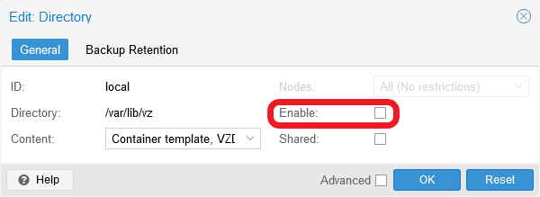

    Also, you could reduce the number of content types it supports, but you cannot leave the Content box empty. You must leave at least one type selected there.

3. Now the `local` directory will show up with the `Enabled` column set as `No`.

    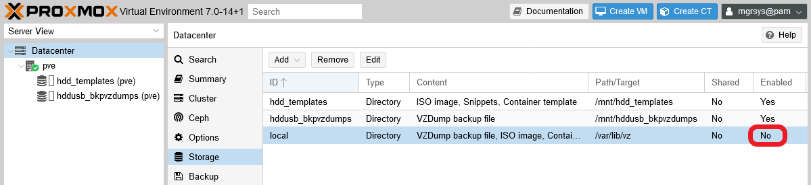

    Notice that the `local` storage is not present anymore at the tree list on the left.

> **BEWARE!**  
> The PVE web console won't allow you to `Remove` the `local` directory storage. If you try that, PVE will just reenable the storage and change its supported content types enabling **all of them**.

### _Enabling the thinpools within Proxmox VE_

Here you're going to enable in your Proxmox VE datacenter all the thinpools you've created before.

1. In the web console, go to the `Datacenter > Storage` page, click on `Add` and choose the `LVM-Thin` storage option.

    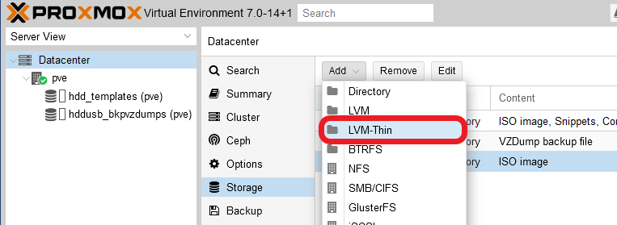

2. You'll reach the window in the snapshot below.

    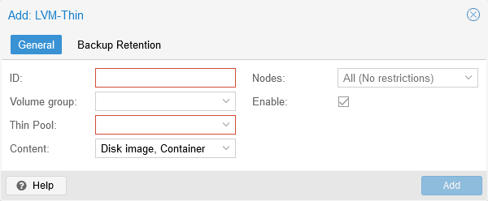

    You'll notice some differences from the form you filled when you created the `directories`. There are two new parameters, but no `Shared` or `Advanced` options.

    - `Volume group`: list where you must choose the VG in which the thinpool you want to enable resides.
    - `Thin Pool`: another list with the available thinpools in the chosen VG.

    If you click on the Backup Retention tab, you'll see that it's completely disabled with a warning: the LVM-Thin type **cannot** store Proxmox VE backups.

    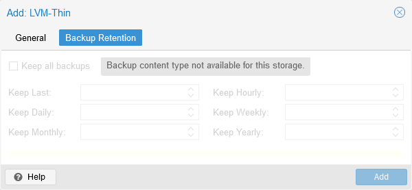

3. So, just fill the `General` tab for each thinpool as follows.

    - ID: `ssd_disks`, Volume group: `ssdint`, Thin Pool: `ssd_disks`, Content: `Disk image, Container`.

    - ID: `hdd_data`, Volume group: `hddint`, Thin Pool: `hdd_data`, Content: `Disk image, Container`.

    - ID: `hddusb_bkpdata`, Volume group: `hddusb`, Thin Pool: `hddusb_bkpdata`, Content: `Disk image, Container`.

    The form for the `ssd_disks` thinpool storage should look like as below.

    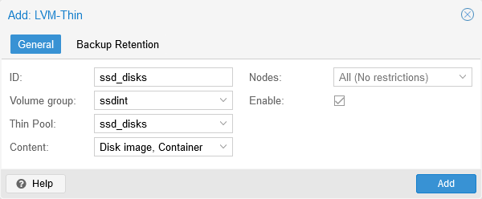

    After filling it just click on `Add`.

4. The new thinpool storages will appear both in the storage list and in the tree list on the left of your PVE web console. Since this view orders by `ID`, reorder by `Type` to see them better.

    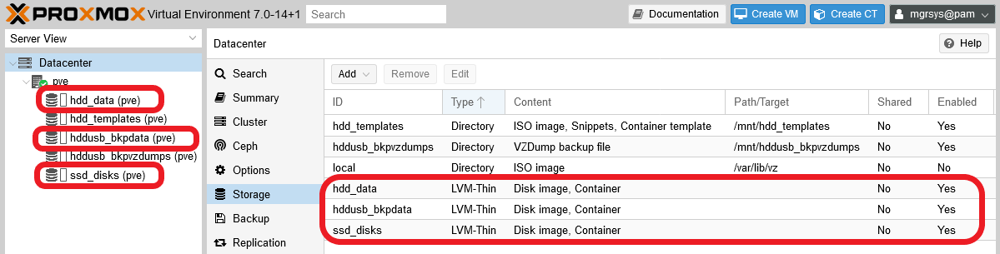

## Configuration file

The storage configuration at the `Datacenter` level is saved by Proxmox VE in the file `/etc/pve/storage.cfg`. After applying all the previous changes to your system, your `storage.cfg` will look like the following.

~~~bash
dir: hddusb_bkpvzdumps
        path /mnt/hddusb_bkpvzdumps
        content backup
        prune-backups keep-all=1
        shared 0

dir: hdd_templates
        path /mnt/hdd_templates
        content iso,snippets,vztmpl
        prune-backups keep-all=1
        shared 0

dir: local
        disable
        path /var/lib/vz
        content vztmpl,iso,backup
        prune-backups keep-all=1
        shared 0

lvmthin: ssd_disks
        thinpool ssd_disks
        vgname ssdint
        content rootdir,images

lvmthin: hdd_data
        thinpool hdd_data
        vgname hddint
        content images,rootdir

lvmthin: hddusb_bkpdata
        thinpool hddusb_bkpdata
        vgname hddusb
        content rootdir,images
~~~

You can also modify this file manually to adjust your `Datacenter` tier's storage configuration.

## Relevant system paths

### _Directories_

- `/etc/pve`

### _Files_

- `/etc/pve/storage.cfg`

## References

### _About LVM (Logical Volume Manager)_

- [Logical Volume Manager Administration](https://access.redhat.com/documentation/en-us/red_hat_enterprise_linux/7/html/logical_volume_manager_administration/index)
- [An Introduction to LVM Concepts, Terminology, and Operations](https://www.digitalocean.com/community/tutorials/an-introduction-to-lvm-concepts-terminology-and-operations)
- [LVM Thinpool - How to resize a thinpool LV?](https://stackoverflow.com/questions/40553483/lvm-thinpool-how-to-resize-a-thinpool-lv)
- [Setup Thin Provisioning Volumes in Logical Volume Management (LVM) – Part IV](https://www.tecmint.com/setup-thin-provisioning-volumes-in-lvm/)

### _About Proxmox VE storage configuration_

- [Proxmox VE wiki. Storage](https://pve.proxmox.com/wiki/Storage)
- [PVE admin guide. Logical Volume Manager (LVM)](https://pve.proxmox.com/pve-docs/pve-admin-guide.html#chapter_lvm)
- [PVE admin guide. Storage](https://pve.proxmox.com/pve-docs/pve-admin-guide.html#chapter_storage)
- [Promox configuration overview](https://imgur.com/a/OFHyxiU)
- [How to add storage to Proxmox](https://nubcakes.net/index.php/2019/03/05/how-to-add-storage-to-proxmox/)
- [Advice on storage structure](https://www.reddit.com/r/Proxmox/comments/bdss9x/advice_on_storage_structure/el0nxl5/)
