# G019 - K3s cluster setup 02 ~ Storage setup

- [Identifying your storage needs and current setup](#identifying-your-storage-needs-and-current-setup)
- [Storage organization model](#storage-organization-model)
- [Creating the logical volumes (LVs)](#creating-the-logical-volumes-lvs)
- [Enabling the LVs for Proxmox VE](#enabling-the-lvs-for-proxmox-ve)
  - [Formatting and mounting of LVs](#formatting-and-mounting-of-lvs)
  - [Enabling directories within Proxmox VE](#enabling-directories-within-proxmox-ve)
    - [Setting up the directories](#setting-up-the-directories)
    - [Disabling the `local` directory](#disabling-the-local-directory)
  - [Enabling the thinpools within Proxmox VE](#enabling-the-thinpools-within-proxmox-ve)
- [Configuration file](#configuration-file)
- [Relevant system paths](#relevant-system-paths)
  - [Directories](#directories)
  - [Files](#files)
- [References](#references)
  - [Proxmox](#proxmox)
  - [About Logical Volume Manager (LVM)](#about-logical-volume-manager-lvm)
  - [About Proxmox VE storage configuration](#about-proxmox-ve-storage-configuration)
- [Navigation](#navigation)

## Identifying your storage needs and current setup

Before you can start creating VMs or containers in your standalone PVE node, there is something still pending to do. You must reorganize the current free storage space you have available in your node. The data elements you must keep in mind in this reorganization are:

- ISO images, container templates and snippets.
- VMs and container disks images.
- Data generated or stored by apps and services.
- Backup of vzdumps and snapshots of VMs and containers.
- Backups of data stored or generated by apps and services.

On the other hand, there is the particular basic LVM storage arrangement you already set up in the [chapter **G005**](G005%20-%20Host%20configuration%2003%20~%20LVM%20storage.md).

- One partitioned LVM VG group for the Proxmox VE filesystem itself, in the internal SSD drive, called `pve`.
- An empty LVM VG group, also in the internal SSD drive, called `ssdint`.
- An empty LVM VG group, in the internal HDD drive, called `hddint`.
- An empty LVM VG group, in the external USB HDD drive, called `hddusb`.

This chapter tells you how to organize the data elements among those empty LVM VG groups available.

## Storage organization model

First, you need to figure out how you want to distribute the data elements in your available storage. Start by making an element-by-element analysis:

- **OSes ISO images, container templates and snippets**\
  These could be stored in the `local` storage already available in the `pve` group, but it is better to keep the Proxmox VE filesystem as isolated as possible from anything else. In this chapter, you will create a new small LV within the `hddint` VG just to store ISOs, container templates, and snippets.

- **VMs and container disks images**\
  To store the disks images in Proxmox VE, you need to create a new LVM-thin (or thinpool) storage within the `ssdint` VG. This way you can gain the best performance possible for the VMs and containers by making them run on the ssd drive.

- **Data generated by apps or services**\
  This data is mainly the information generated or just stored by the services running in this setup. For these you will use two different thinpools:

  - The one already mentioned in the previous point for disk images within the `ssdint` VG.
  - Another one which you must create within the `hddint` VG.

- **Backups and snapshots of VMs and containers**\
  The proper thing to do is not to keep the backups inside the host itself. To achieve this, you will create a LV within the `hddusb` VG to store the VMs and containers' backups and snapshots in the external usb drive.

- **Backups of data generated by apps and services**\
  In a similar fashion to the backups of VMs and containers, you will create a thinpool also in the `hddusb` to store backups of data.

## Creating the logical volumes (LVs)

After deciding how to organize the available free storage in your setup, you can start by creating the logical volumes you require:

1. Log in with `mgrsys` and check with `vgs` how much space available you have on each volume group:

    ~~~sh
    $ sudo vgs
      VG     #PV #LV #SN Attr   VSize    VFree
      hddint   1   0   0 wz--n- <930.51g <930.51g
      hddusb   1   0   0 wz--n-   <1.82t   <1.82t
      pve      1   2   0 wz--n-  <62.00g       0
      ssdint   1   0   0 wz--n- <868.51g <868.51g
    ~~~

2. Being aware of the storage available, create all the LVs you need with `lvcreate`:

    ~~~sh
    $ sudo lvcreate --type thin-pool -L 867g -n ssd_disks ssdint
    $ sudo lvcreate -L 60g -n hdd_templates hddint
    $ sudo lvcreate --type thin-pool -L 869g -n hdd_data hddint
    $ sudo lvcreate -L 560g -n hddusb_bkpvzdumps hddusb
    $ sudo lvcreate --type thin-pool -L 1300g -n hddusb_bkpdata hddusb
    ~~~

    The `lvcreate` commands for creating the `thin-pools` may print the following warnings:

    ~~~sh
      WARNING: Pool zeroing and 512.00 KiB large chunk size slows down thin provisioning.
      WARNING: Consider disabling zeroing (-Zn) or using smaller chunk size (<512.00 KiB).
    ~~~

    The chunk size affects the size of the metadata pool used to manage the thinly provisioned volumes. It is also relevant from a performance point of view if those volumes are going to be provisioned at a high rate, as it can happen in a real production environment. Since the homelab setup of this guide is not meant for such a demanding scenario, you can just ignore the `lvcreate` warnings.

    > [!IMPORTANT]
    > **The LVs must not eat up the whole available space on each drive**\
    > You must leave some room available in case any of the thinpools' metadata needs to grow.

3. Verify with `lsblk` that you have the storage structure you want:

    ~~~sh
    $ lsblk
    NAME                            MAJ:MIN RM   SIZE RO TYPE MOUNTPOINTS
    sda                               8:0    0 931.5G  0 disk
    ├─sda1                            8:1    0  1007K  0 part
    ├─sda2                            8:2    0     1G  0 part
    ├─sda3                            8:3    0    62G  0 part
    │ ├─pve-swap                    252:0    0    12G  0 lvm  [SWAP]
    │ └─pve-root                    252:1    0    50G  0 lvm  /
    └─sda4                            8:4    0 868.5G  0 part
      ├─ssdint-ssd_disks_tmeta      252:2    0   112M  0 lvm
      │ └─ssdint-ssd_disks          252:4    0   867G  0 lvm
      └─ssdint-ssd_disks_tdata      252:3    0   867G  0 lvm
        └─ssdint-ssd_disks          252:4    0   867G  0 lvm
    sdb                               8:16   0 931.5G  0 disk
    └─sdb1                            8:17   0 931.5G  0 part
      ├─hddint-hdd_templates        252:5    0    60G  0 lvm
      ├─hddint-hdd_data_tmeta       252:6    0   112M  0 lvm
      │ └─hddint-hdd_data           252:8    0   869G  0 lvm
      └─hddint-hdd_data_tdata       252:7    0   869G  0 lvm
        └─hddint-hdd_data           252:8    0   869G  0 lvm
    sdc                               8:32   0   1.8T  0 disk
    └─sdc1                            8:33   0   1.8T  0 part
      ├─hddusb-hddusb_bkpvzdumps    252:9    0   560G  0 lvm
      ├─hddusb-hddusb_bkpdata_tmeta 252:10   0    84M  0 lvm
      │ └─hddusb-hddusb_bkpdata     252:12   0   1.3T  0 lvm
      └─hddusb-hddusb_bkpdata_tdata 252:11   0   1.3T  0 lvm
        └─hddusb-hddusb_bkpdata     252:12   0   1.3T  0 lvm
    ~~~

    You can also use the `vgs` command to see the status of your current volumes within the VGs:

    ~~~sh
    $ sudo vgs -o +lv_size,lv_name
      VG     #PV #LV #SN Attr   VSize    VFree   LSize   LV
      hddint   1   2   0 wz--n- <930.51g  <1.29g 869.00g hdd_data
      hddint   1   2   0 wz--n- <930.51g  <1.29g  60.00g hdd_templates
      hddusb   1   2   0 wz--n-   <1.82t 868.00m  <1.27t hddusb_bkpdata
      hddusb   1   2   0 wz--n-   <1.82t 868.00m 560.00g hddusb_bkpvzdumps
      pve      1   2   0 wz--n-  <62.00g      0   12.00g swap
      pve      1   2   0 wz--n-  <62.00g      0  <50.00g root
      ssdint   1   1   0 wz--n- <868.51g  <1.29g 867.00g ssd_disks
    ~~~

4. At this point, the PVE web console can show your newly created LVM-thin thinpools. Find them at your `pve` node level, in the `Disks > LVM-Thin` screen:

    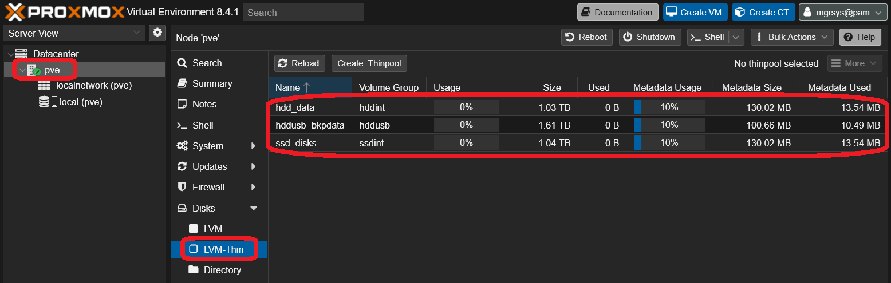

## Enabling the LVs for Proxmox VE

Before you enable the new LV volumes and thinpools in Proxmox VE, there are a few more things to do yet.

### Formatting and mounting of LVs

The new LVs are virtual partitions that still do not have a defined filesystem. You need to format each of them to have one, `ext4` in this case:

> [!WARNING]
> Next you will format and mount just the new LVs, **NOT the new thinpools**!

1. Before you format the new LVs, you need to see their `/dev/mapper/` paths with `fdisk`:

    ~~~sh
    $ sudo fdisk -l | grep /dev/mapper
    Disk /dev/mapper/pve-swap: 12 GiB, 12884901888 bytes, 25165824 sectors
    Disk /dev/mapper/pve-root: 50 GiB, 53682896896 bytes, 104849408 sectors
    Disk /dev/mapper/hddint-hdd_templates: 60 GiB, 64424509440 bytes, 125829120 sectors
    Disk /dev/mapper/hddusb-hddusb_bkpvzdumps: 560 GiB, 601295421440 bytes, 1174405120 sectors
    ~~~

2. After discovering their paths, you can use the `mkfs.ext4` command to format the LVs:

    ~~~sh
    $ sudo mkfs.ext4 /dev/mapper/hddint-hdd_templates
    $ sudo mkfs.ext4 /dev/mapper/hddusb-hddusb_bkpvzdumps
    ~~~

    Each `mkfs.ext4` command prints lines like these:

    ~~~sh
    mke2fs 1.47.2 (1-Jan-2025)
    Creating filesystem with 15728640 4k blocks and 3932160 inodes
    Filesystem UUID: 1fbdc885-c059-46d6-abae-1eaefc3430c7
    Superblock backups stored on blocks:
            32768, 98304, 163840, 229376, 294912, 819200, 884736, 1605632, 2654208,
            4096000, 7962624, 11239424

    Allocating group tables: done
    Writing inode tables: done
    Creating journal (65536 blocks): done
    Writing superblocks and filesystem accounting information: done
    ~~~

3. Before you can mount these LVs like any other partition, you need to create their corresponding mount points. This means you have to create a directory for each LV:

    ~~~sh
    $ sudo mkdir -p /mnt/{hdd_templates,hddusb_bkpvzdumps}
    ~~~

    To check out fast that the folder structure is correct, you can use the `tree` command:

    ~~~sh
    $ tree -F /mnt
    /mnt/
    ├── hdd_templates/
    └── hddusb_bkpvzdumps/

    3 directories, 0 files
    ~~~

4. Mount the LVs on their mount points with the `mount` command:

    ~~~sh
    $ sudo mount /dev/mapper/hddint-hdd_templates /mnt/hdd_templates
    $ sudo mount /dev/mapper/hddusb-hddusb_bkpvzdumps /mnt/hddusb_bkpvzdumps
    ~~~

    The `mount` command does not output anything if it executes correctly.

    To verify that you see the LVs as mounted filesystems, use `df`:

    ~~~sh
    $ df -h
    Filesystem                            Size  Used Avail Use% Mounted on
    udev                                  3.8G     0  3.8G   0% /dev
    tmpfs                                 783M  1.4M  782M   1% /run
    /dev/mapper/pve-root                   50G  3.6G   44G   8% /
    tmpfs                                 3.9G   34M  3.8G   1% /dev/shm
    efivarfs                              128K  101K   23K  82% /sys/firmware/efi/efivars
    tmpfs                                 5.0M     0  5.0M   0% /run/lock
    tmpfs                                 1.0M     0  1.0M   0% /run/credentials/systemd-journald.service
    tmpfs                                 3.9G     0  3.9G   0% /tmp
    /dev/fuse                             128M   16K  128M   1% /etc/pve
    tmpfs                                 1.0M     0  1.0M   0% /run/credentials/getty@tty1.service
    tmpfs                                 783M  4.0K  783M   1% /run/user/1000
    /dev/mapper/hddint-hdd_templates       59G  2.1M   56G   1% /mnt/hdd_templates
    /dev/mapper/hddusb-hddusb_bkpvzdumps  551G  2.1M  523G   1% /mnt/hddusb_bkpvzdumps
    ~~~

    You can see your newly mounted filesystems at the bottom of the list.

5. To make the previous mounting permanent, you need to edit the `/etc/fstab` file. First make a backup of it:

    ~~~sh
    $ sudo cp /etc/fstab /etc/fstab.orig
    ~~~

    Then, append the following lines to the `fstab` file:

    ~~~sh
    /dev/mapper/hddint-hdd_templates /mnt/hdd_templates ext4 defaults,nofail 0 0
    /dev/mapper/hddusb-hddusb_bkpvzdumps /mnt/hddusb_bkpvzdumps ext4 defaults,nofail 0 0
    ~~~

6. To verify that the mounting is truly working permanently, reboot your PVE system:

    ~~~sh
    $ sudo reboot
    ~~~

7. After the reboot, verify with `df` that the mounting is still working:

    ~~~sh
    $ df -h
    Filesystem                            Size  Used Avail Use% Mounted on
    udev                                  3.8G     0  3.8G   0% /dev
    tmpfs                                 783M  1.2M  782M   1% /run
    /dev/mapper/pve-root                   50G  3.5G   44G   8% /
    tmpfs                                 3.9G   16M  3.9G   1% /dev/shm
    efivarfs                              128K  102K   22K  83% /sys/firmware/efi/efivars
    tmpfs                                 5.0M     0  5.0M   0% /run/lock
    tmpfs                                 1.0M     0  1.0M   0% /run/credentials/systemd-journald.service
    tmpfs                                 3.9G     0  3.9G   0% /tmp
    /dev/mapper/hddusb-hddusb_bkpvzdumps  551G  2.1M  523G   1% /mnt/hddusb_bkpvzdumps
    /dev/mapper/hddint-hdd_templates       59G  2.1M   56G   1% /mnt/hdd_templates
    /dev/fuse                             128M   16K  128M   1% /etc/pve
    tmpfs                                 1.0M     0  1.0M   0% /run/credentials/getty@tty1.service
    tmpfs                                 783M  4.0K  783M   1% /run/user/1000
    ~~~

    The lines for your new LVs filesystems are shown in a different order now because they have been mounted by the system at boot time.

### Enabling directories within Proxmox VE

Each storage type supported by Proxmox VE can store only a limited range of content types. In particular, to enable Proxmox VE to make backups of VMs or containers, or to store ISO images, the only option available for the limited setup used in this guide is to use directories.

A directory is just that, a path currently existing in your filesystem. In your standalone PVE node you already have one enabled, which you can see in the `Datacenter > Storage` section.

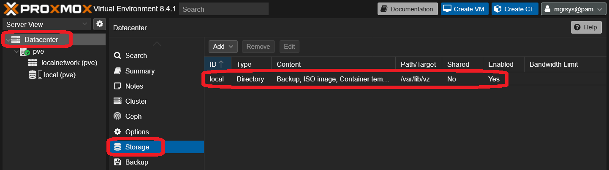

In this snapshot you can see the `local` directory highlighted. This directory is, in fact, the `root` directory of your Proxmox VE installation. It comes configured to support only three content types, although Proxmox VE can store more content types in a directory.

#### Setting up the directories

Next you will enable as directories the two LVs you have just created and mounted before:

- The `hdd_templates` LV will hold ISO images, container templates and snippets.
- The `hddusb_bkpvzdumps` LV will store virtual machine dumps (`VZDump`).

1. Get into the web console, open the `Datacenter > Storage` page and click on the `Add` button:

    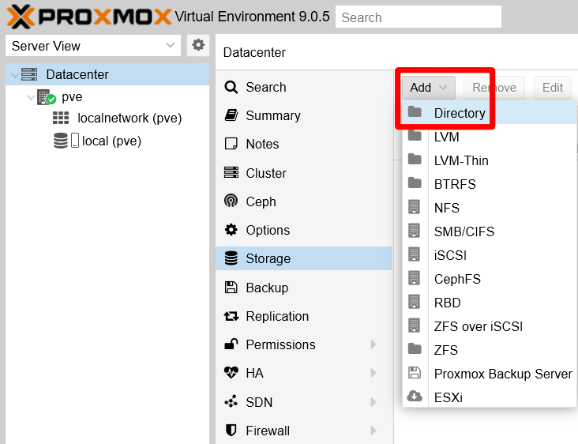

    You get the whole list of storage types supported by Proxmox VE, although the small setup of this guide is limited to use just the first four.

    > [!NOTE]
    > **This guide does not considers NFS as an storage option**\
    > Technically, you could also use NFS but, since it is not under this guide's scope, it is not considered an option for this homelab build.

2. Click on `Directory` to raise the window below:

    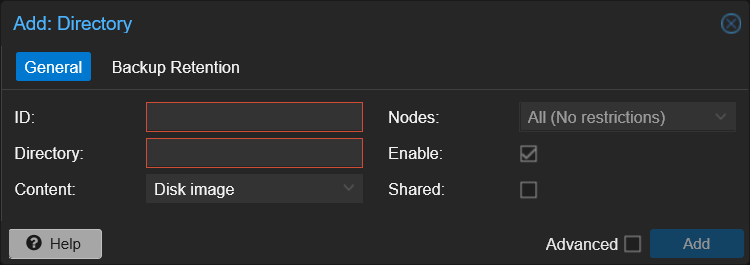

    By default, it opens at its `General` tab, which has the following parameters:

    - `ID`\
      This is the name for the storage, to identify it within Proxmox VE.

    - `Directory`\
      The directory's path you want to enable here.

    - `Content`\
      This is a multichoice list in which you choose the content types you want to support in the directory.

    - `Nodes`\
      In a PVE cluster, this allows you to restrict on which nodes you want to have this storage available.

    - `Enable`\
      To enable or disable this storage, comes enabled by default.

    - `Shared`\
      In a Proxmox VE cluster, this allows to indicate if a storage is already being shared among the nodes.

      > [!IMPORTANT]
      > **Not all storage types support this option**\
      > Like `LVM-Thin`, for instance.

    The `Backup Retention` tab looks like below:

    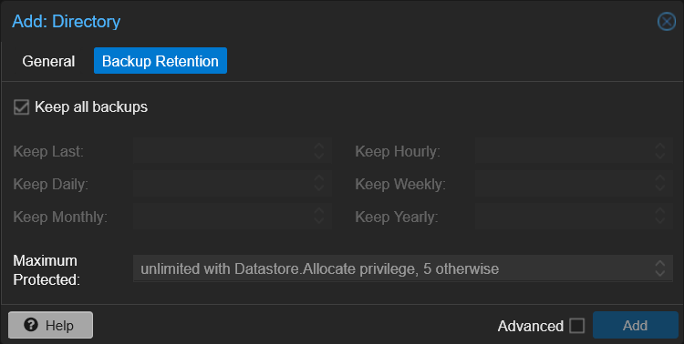

    Here you can configure the backup retention policy you want to apply within the directory. By default, the `Keep all backups` comes already checked, but you can uncheck it to define a concrete prune policy to clear old backups stored in this storage. You may just keep a number of recent backups with `Keep Last`, from restricted periods of time with the rest of `Keep` parameters, or define a more complex combination with all those parameters.

    The `Maximum Protected` field indicates the [maximum number of protected backups per guest (VMs or containers) are allowed on the storage](https://pve.proxmox.com/pve-docs/pve-admin-guide.html#vzdump_protection). Protected backups are those that cannot be pruned from the storage by the backup retention policy.

    Finally, if you enable the `Advanced` checkbox, you will get some extra options under the `General` tab:

    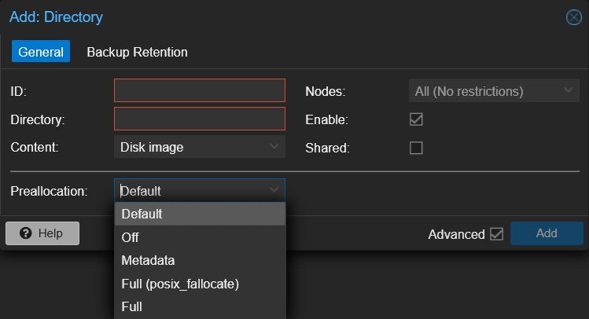

    The `Preallocation` option allows you to specify which mode to use for space preallocation in this storage unit. Seems to affect only _raw_ and _qcow2_ images on file-based storages like the `directory` one. Just keep leave it as `Default` in your homelab. The other `Allow Snapshots as Volume-Chain` option is, in Proxmox VE 9.0 at least, still in preview so better avoid using it unless you already know what you are dealing with. This is an option to "_Enable support for creating storage-vendor agnostic snapshot through volume backing-chains_".

3. Enable the directory for the VMs backups:

    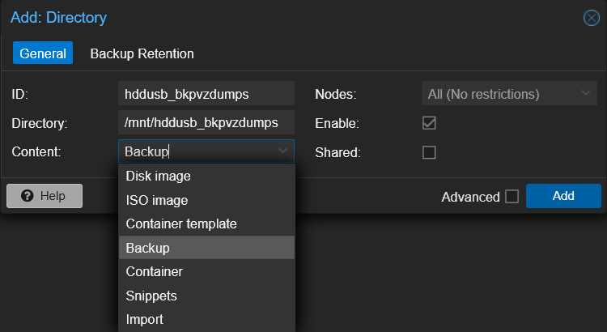

    Above, you can see that:

    - The `ID` is just a string, `hddusb_bkpvzdumps` in this case, but it should be as descriptive as possible.

    - In `Directory` goes **the absolute path** of the folder already present in your PVE node, which here is `/mnt/hddusb_bkpvzdumps`.

    - In `Content` there is only one content type selected, the one related to backups, while the `Disk image` that was marked by default has been unselected.

      > [!NOTE]
      > **Proxmox VE backups are VZ dumps**\
      > Although the list of content types no longer specifies it (as it was in previous major Proxmox VE versions), the `Backup` type are VZ dumps.

    - No other option has been touched, not even in the `Backup Retention` tab.

4. Click on `Add` and, after a moment of processing, you should see your directory added to the list of available storages at your `Datacenter` level:

    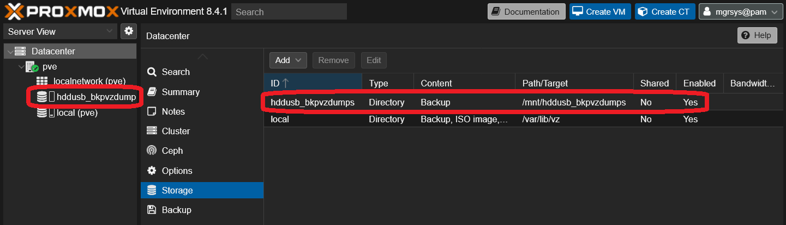

5. Like you have just done for the `vzdumps` directory, do likewise for the `templates` directory:

    - ID: `hdd_templates`, Directory: `/mnt/hdd_templates`, Content: `ISO image, Container template, Snippets`.

6. After enabling both of them, your `Datacenter`'s storage list should look like below:

    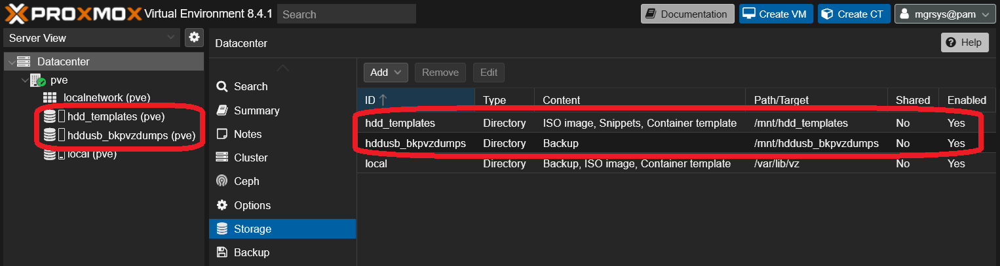

#### Disabling the `local` directory

As you have already seen, Proxmox VE comes with one directory storage enabled by default, the `local` one. You can disable it as storage since:

- This is the `root` directory of your filesystem.
- Your new directory layout covers the same things as with this one.

1. Open the PVE web console and go to the `Datacenter > Storage` screen. There, choose the `local` directory and press on `Edit`:

    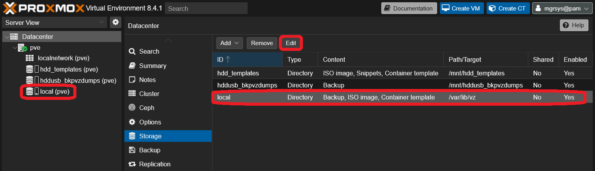

    Also, notice how the `local` storage appears under your PVE node in the `Server View` tree (which you may have to unfold first), at the page's left.

2. On the `Edit` window, just uncheck the `Enable` option and then click `OK`:

    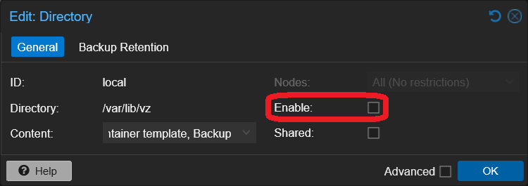

    Also, you could reduce the number of content types it supports, but you cannot leave the `Content` box empty. You must leave at least one type selected there.

3. Now the `local` directory will show up with the `Enabled` column set as `No`:

    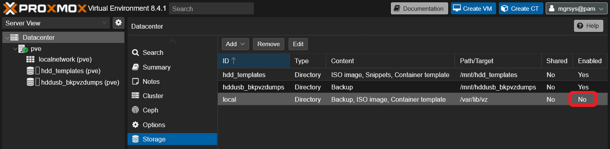

    Also notice that the `local` storage is not present anymore at the tree list on the left.

> [!WARNING]
> **The PVE web console will not allow you to `Remove` the `local` directory storage**\
> If you try that, PVE will just reenable the storage and set as supported content types **all of them**.

### Enabling the thinpools within Proxmox VE

Here you are going to enable in your Proxmox VE datacenter all the thinpools you have created before:

1. In the web console, go to the `Datacenter > Storage` page, click on `Add` and choose the `LVM-Thin` storage option:

    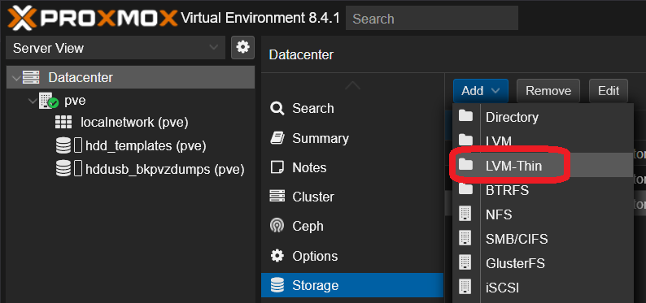

2. The window raised is for adding an LVM thinpool:

    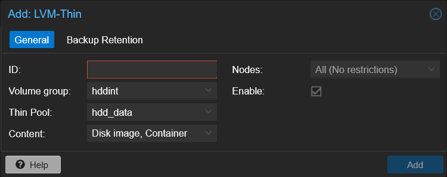

    Notice here some differences from the form you filled when you added the directories. There are two new parameters, but no `Shared` nor `Advanced` options:

    - `Volume group`\
      List where you must choose the VG in which the thinpool you want to enable resides. Notice that the field is already filled with an automatically preselected value.

    - `Thin Pool`\
      Another list with the available thinpools in the chosen VG. Notice that the field is already filled with an automatically preselected value.

    If you click on the `Backup Retention` tab, you will see that it is completely disabled with a warning meaning that **the LVM-Thin storage type cannot store Proxmox VE backups**.

    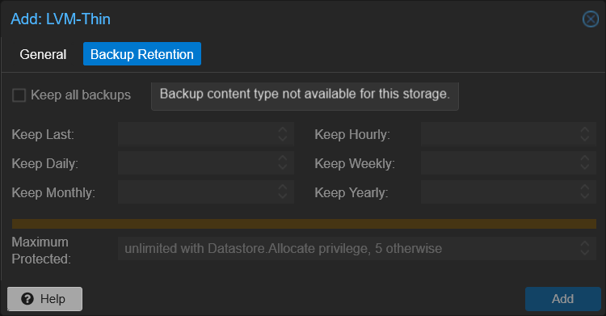

3. Fill the `General` tab for each thinpool as follows:

    - ID: `ssd_disks`, Volume group: `ssdint`, Thin Pool: `ssd_disks`, Content: `Disk image, Container`.

    - ID: `hdd_data`, Volume group: `hddint`, Thin Pool: `hdd_data`, Content: `Disk image, Container`.

    - ID: `hddusb_bkpdata`, Volume group: `hddusb`, Thin Pool: `hddusb_bkpdata`, Content: `Disk image, Container`.

    The form for the `ssd_disks` thinpool storage should look like as below:

    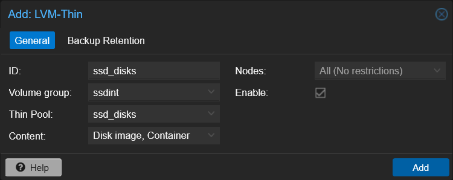

    After filling it just click on `Add`.

4. The new thinpool storages appear both in the storage list and in the tree list on the left of your PVE web console. Since this view orders with the `ID` field by default, reorder by `Type` to see them listed together:

    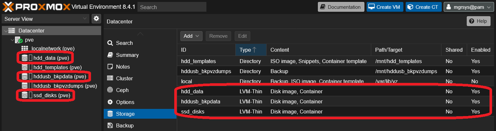

## Configuration file

The storage configuration at the `Datacenter` level is saved by Proxmox VE in the file `/etc/pve/storage.cfg`. After applying all the previous changes to your system, your `storage.cfg` should look like this:

~~~sh
dir: local
        disable
        path /var/lib/vz
        content iso,backup,vztmpl
        shared 0

dir: hddusb_bkpvzdumps
        path /mnt/hddusb_bkpvzdumps
        content backup
        prune-backups keep-all=1
        shared 0

dir: hdd_templates
        path /mnt/hdd_templates
        content iso,vztmpl,snippets
        prune-backups keep-all=1
        shared 0

lvmthin: ssd_disks
        thinpool ssd_disks
        vgname ssdint
        content images,rootdir

lvmthin: hdd_data
        thinpool hdd_data
        vgname hddint
        content images,rootdir

lvmthin: hddusb_bkpdata
        thinpool hddusb_bkpdata
        vgname hddusb
        content rootdir,images
~~~

> [!NOTE]
> **Ordering in the `storage.cfg` can change**\
> The ordering of the storage blocks within the `storage.cfg` file may be different in your system.

## Relevant system paths

### Directories

- `/etc/pve`

### Files

- `/etc/pve/storage.cfg`

## References

### [Proxmox](https://www.proxmox.com/en/)

- [Proxmox VE Administration Guide](https://pve.proxmox.com/pve-docs/pve-admin-guide.html)
  - [Host System Administration](https://pve.proxmox.com/pve-docs/pve-admin-guide.html#chapter_system_administration)
    - [Logical Volume Manager (LVM)](https://pve.proxmox.com/pve-docs/pve-admin-guide.html#chapter_lvm)
  - [Proxmox VE Storage](https://pve.proxmox.com/pve-docs/pve-admin-guide.html#chapter_storage)
  - [Backup and Restore](https://pve.proxmox.com/pve-docs/pve-admin-guide.html#chapter_vzdump)
    - [Backup Protection](https://pve.proxmox.com/pve-docs/pve-admin-guide.html#vzdump_protection)

- [Proxmox VE Wiki](https://pve.proxmox.com/wiki/Main_Page)
  - [Storage](https://pve.proxmox.com/wiki/Storage)

- [Proxmox. Forums. Proxmox Virtual Environment](https://forum.proxmox.com/#proxmox-virtual-environment.11)
  - [Proxmox VE: Installation and configuration](https://forum.proxmox.com/forums/proxmox-ve-installation-and-configuration.16/)
    - [thin lvm and zeroing/chunk size](https://forum.proxmox.com/threads/thin-lvm-and-zeroing-chunk-size.56262/)

### About Logical Volume Manager (LVM)

- [Red Hat Enterprise Linux 7. Logical Volume Manager Administration](https://docs.redhat.com/en/documentation/red_hat_enterprise_linux/7/html/logical_volume_manager_administration/index)
- [DigitalOcean. An Introduction to LVM Concepts, Terminology, and Operations](https://www.digitalocean.com/community/tutorials/an-introduction-to-lvm-concepts-terminology-and-operations)
- [StackOverflow. LVM Thinpool - How to resize a thinpool LV?](https://stackoverflow.com/questions/40553483/lvm-thinpool-how-to-resize-a-thinpool-lv)
- [TecMint. Setup Thin Provisioning Volumes in Logical Volume Management (LVM) – Part IV](https://www.tecmint.com/setup-thin-provisioning-volumes-in-lvm/)
- [LinuxQuestions.org. WARNING: Pool zeroing and 1.00 MiB large chunk size slows down thin provisioning?](https://www.linuxquestions.org/questions/linux-newbie-8/warning-pool-zeroing-and-1-00-mib-large-chunk-size-slows-down-thin-provisioning-4175638074/)

### About Proxmox VE storage configuration

- [imgur. Proxmox configuration overview](https://imgur.com/a/promox-configuration-overview-OFHyxiU)
- [Reddit. Proxmox. Advice on storage structure](https://www.reddit.com/r/Proxmox/comments/bdss9x/advice_on_storage_structure/el0nxl5/)

## Navigation

[<< Previous (**G018. K3s cluster setup 01**)](G018%20-%20K3s%20cluster%20setup%2001%20~%20Requirements%20and%20arrangement.md) | [+Table Of Contents+](G000%20-%20Table%20Of%20Contents.md) | [Next (**G020. K3s cluster setup 03**) >>](G020%20-%20K3s%20cluster%20setup%2003%20~%20Debian%20VM%20creation.md)
