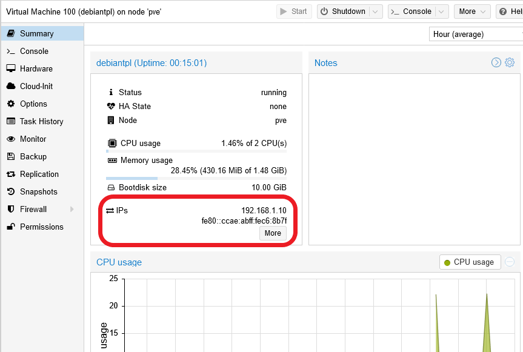
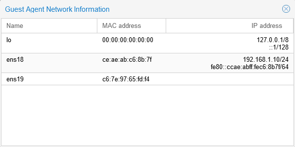

# G021 - K3s cluster setup 04 ~ Debian VM configuration

Now you have a functional Debian VM but, as you did with your Proxmox VE host, it needs to be configured. Therefore, this guide will show you most of the same procedures detailed among the [**G003**](G003%20-%20Host%20configuration%2001%20~%20Apt%20sources%2C%20updates%20and%20extra%20tools.md) to [**G016**](G016%20-%20Host%20optimization%2002%20~%20Disabling%20transparent%20hugepages.md) guides, but in an condensed manner, while also adding some extra steps needed for setting up particular aspects on this VM.

## Suggestion about IP configuration in your network

Before you go further configuring your new VM or creating some more, you should consider organizing the IPs in your network. With this I mean that you should assign static IPs to all your devices present in your network, including the VMs you'll create in your Proxmox VE standalone node. This will allow you to know to what IPs to connect to through ssh easily, rather than being forced to check everytime what IP is assigned to your VMs and Proxmox VE Host, and also avoid potential IP conflicts among your devices and VMs.

I suggest you to figure out first, in a document or spreadsheet, the IP distribution you want within your network. This way you can see how to divide the IPs among all your present devices and future VMs. For example, you could have your devices in the `192.168.1.100 - 192.168.1.150` range and your VMs in the `192.168.1.10 - 192.168.1.40` one. Then, when you've figured out the organization of your network, apply it in your router or gateway.

## Adding the `apt` sources for _non-free_ packages

It might happen that you need to install `apt` packages in your VM that are _non-free_ for Debian standards. To allow that, you need to enable the right `apt` sources in your Debian VM.

1. Start the VM, then open a `noVNC` shell and log in the VM as `root`, or open a ssh session and log in as your **other user** (the `sshd` server won't allow you to log in as `root` using a password). If you choose the ssh method, you'll have to become `root` with the `su` command.

    ~~~bash
    $ su root
    ~~~

2. Then, `cd` to `/etc/apt/sources.list.d`.

    ~~~bash
    $ cd /etc/apt/sources.list.d
    ~~~

3. Create a new file called `debian-nonfree.list`.

    ~~~bash
    $ touch debian-nonfree.list
    ~~~

4. Edit the `debian-nonfree.list` file, filling it with the lines below.

    ~~~bash
    deb http://deb.debian.org/debian bullseye non-free
    deb-src http://deb.debian.org/debian bullseye non-free

    deb http://deb.debian.org/debian-security/ bullseye-security non-free
    deb-src http://deb.debian.org/debian-security/ bullseye-security non-free

    deb http://deb.debian.org/debian bullseye-updates non-free
    deb-src http://deb.debian.org/debian bullseye-updates non-free
    ~~~

    > **BEWARE!**  
    > This sources list is only for Debian 11 Bullseye!

5. Save the file and update `apt`.

    ~~~bash
    $ apt update
    ~~~

## Installing extra packages

The Debian OS you have running in your VM is rather barebones, so let's install some packages that can be useful to have in a server. Some of them will be also necessary in the following steps described in this guide. As `root`, execute the following `apt` command.

~~~bash
$ apt install -y ethtool fail2ban gdisk htop libpam-google-authenticator net-tools nut-client sudo tree vim
~~~

## The QEMU guest agent comes enabled in Debian 11

To allow the Proxmox VE platform to control properly the VMs, you need to have in them the QEMU guest agent service. Debian 11 already comes with it installed and running, so you can go to the web console and check the `Status` block in your VM's `Summary` tab.

The web console now shows the v4 and v6 IPs of the VM's current main network card and, if you click on `More`, you'll be able to see all the MACs and IPs assigned to all the network devices currently present in your VM.

In the list above, you should recognize the network devices currently attached to your VM: the `localhost` (called `lo`), the `ens18` (`net0` for Proxmox VE in the VM's `Hardware` tab) and `ens19` (`net1`) ones. Any change to the network devices active in the VM will be also shown here.

Thanks to this agent, you can execute web console actions like `Shutdown` or execute VM snapshots properly.

A last detail to take into account here is the configuration of this QEMU agent. Although in this case it works just with the default values, you should know where to find its configuration files.

- `/etc/qemu` : directory for the agent configuration files.

- `/etc/qemu/qemu-ga.conf` : this is the configuration file for the agent. Oddly enough, you won't find one created, meaning the agent is working with default values set either in some other file or just hardcoded in the program.

- `/usr/sbin/qemu-ga` : the path to the agent program itself. For some (probably security) reason, it's setup in such a way that you won't be able to execute it like any other command.

So, if you want to know what concrete configuration has your agent, do the following.

1. As `root`, cd to `/usr/sbin`.

    ~~~bash
    $ cd /usr/sbin
    ~~~

2. Execute the `qemu-ga` command as follows.

    ~~~bash
    $ ./qemu-ga -D
    ~~~

The previous command will return you an output like the following.

~~~properties
[general]
daemon=false
method=virtio-serial
path=/dev/virtio-ports/org.qemu.guest_agent.0
pidfile=/var/run/qemu-ga.pid
statedir=/var/run
verbose=false
retry-path=false
blacklist=
~~~

The lines returned are in the format proper for the agent's `/etc/qemu/qemu-ga.conf` configuration file.

## Hardening the VM's access

The user you created in the Debian installation process, which in this guide series is called `mgrsys`, needs its login to be hardened with TFA and a ssh key pair, while also enabling it to use the `sudo` command. This way, that user will become a proper administrative user for your system. On the other hand, after properly setting up that user, you won't really need to use `root` any more. So, in this section you'll also see how to completely disable the `root` login access to the VM.

### _Enabling `sudo` to the administrative user_

1. Log in as `root` in a `noVNC` shell on your VM, then add the `mgrsys` user to the `sudo` group.

    ~~~bash
    $ adduser mgrsys sudo
    ~~~

    > **BEWARE!**  
    > You won't be able to execute the `adduser` command from a SSH shell with `mgrsys`, even after becoming `root` with `su` as you've just done in the previous section. You must be in a **noVNC** shell or it won't work.

2. Now login as the `mgrsys` user and test that `sudo` is working with a harmless command like `ls`.

    ~~~bash
    $ sudo ls -al
    ~~~

    The command will output a warning about using `sudo`, then ask you the user's password.

    ~~~bash
    We trust you have received the usual lecture from the local System
    Administrator. It usually boils down to these three things:

        #1) Respect the privacy of others.
        #2) Think before you type.
        #3) With great power comes great responsibility.

    [sudo] password for mgrsys:
    ~~~

    Type the password and `ls` will be executed.

### _Assigning a TOTP code to the administrative user_

1. As your administrative user, create a TOTP token with the `google-authenticator` program as follows.

    ~~~bash
    $ google-authenticator -t -d -f -r 3 -R 30 -w 3 -Q UTF8 -i debiantpl.deimos.cloud -l mgrsys@debiantpl
    ~~~

    > **BEWARE!**  
    Remember to replace the values at the `-i` (issuer) and `-l` (label) options with your own!

2. Copy all the codes given by the `google-authenticator` command in a safe location, like a password manager.

> **BEWARE!**  
> The configuration for the TOTP code is saved in the HOME directory of the user, in a `.google_authenticator` file.

### _SSH key pair for the administrative user_

It's much better if you login with a SSH key pair, so let's create one for your administrative user.

1. Logged in as your administrative user, execute the `ssh-keygen` command.

    ~~~bash
    $ ssh-keygen -t rsa -b 4096 -C "mgrsys@debiantpl"
    ~~~

    > **BEWARE!**  
    The `ssh-keygen` command will ask you for a passphrase, but you can leave it empty. Also take into account that you'll use TOTP codes when connecting through ssh so, if you put a passphrase to the ssh private key, you'll have to login using both the TOTP code and the passphrase.

2. Authorize the public key of your newly generated pair.

    ~~~bash
    $ cd .ssh/
    $ touch authorized_keys ; chmod 600 authorized_keys
    $ cat id_rsa.pub >> authorized_keys
    ~~~

3. Export this key pair and save it in a safe location. Remember that you'll need to generate the `.ppk` file from the private key so you can connect from Windows clients. Check out the [**G901** appendix guide](G901%20-%20Appendix%2001%20~%20Connecting%20through%20SSH%20with%20PuTTY.md) to see how.

## Hardening the `sshd` service

As you did in the [**G007**](G007%20-%20Host%20hardening%2001%20~%20TFA%20authentication.md) and [**G009** guides](G009%20-%20Host%20hardening%2003%20~%20SSH%20key%20pairs%20and%20sshd%20service%20configuration.md), you'll need to change two configuration files.

- `/etc/pam.d/sshd`
- `/etc/ssh/sshd_config`

Also, you'll need to create a new `pam` group for grouping the users that will connect through ssh to the VM, like the administrative user `mgrsys`.

### _Create group for ssh users_

1. Create a new group called `sshauth`.

    ~~~bash
    $ sudo addgroup sshauth
    ~~~

2. Add the administrative user to this group.

    ~~~bash
    $ sudo adduser mgrsys sshauth
    ~~~

### _Backup of `sshd` configuration files_

Open a terminal as your `mgrsys` user and make a backup of the current `sshd` related configuration.

~~~bash
$ cd /etc/pam.d ; sudo cp sshd sshd.orig
$ cd /etc/ssh ; sudo cp sshd_config sshd_config.orig
~~~

### _Changes to the `/etc/pam.d/sshd` file_

1. Comment out the `@include common-auth` line found at at its top.

    ~~~bash
    # Standard Un*x authentication.
    #@include common-auth
    ~~~

2. Append the following lines.

    ~~~bash
    # Enforcing TFA with Google Authenticator tokens
    auth required pam_google_authenticator.so
    ~~~

### _Changes to the `/etc/ssh/sshd_config` file_

1. Edit the `/etc/ssh/sshd_config` file and replace **all** its content with the following one.

    ~~~bash
    #       $OpenBSD: sshd_config,v 1.103 2018/04/09 20:41:22 tj Exp $

    # This is the sshd server system-wide configuration file.  See
    # sshd_config(5) for more information.

    # This sshd was compiled with PATH=/usr/bin:/bin:/usr/sbin:/sbin

    # The strategy used for options in the default sshd_config shipped with
    # OpenSSH is to specify options with their default value where
    # possible, but leave them commented.  Uncommented options override the
    # default value.

    #Port 22
    AddressFamily inet
    #ListenAddress 0.0.0.0
    #ListenAddress ::

    #HostKey /etc/ssh/ssh_host_rsa_key
    #HostKey /etc/ssh/ssh_host_ecdsa_key
    #HostKey /etc/ssh/ssh_host_ed25519_key

    # Ciphers and keying
    #RekeyLimit default none

    # Logging
    #SyslogFacility AUTH
    #LogLevel INFO

    # Authentication:

    LoginGraceTime 45
    PermitRootLogin no
    #StrictModes yes
    MaxAuthTries 3
    #MaxSessions 10

    #PubkeyAuthentication yes

    # Expect .ssh/authorized_keys2 to be disregarded by default in future.
    #AuthorizedKeysFile     .ssh/authorized_keys .ssh/authorized_keys2

    #AuthorizedPrincipalsFile none

    #AuthorizedKeysCommand none
    #AuthorizedKeysCommandUser nobody

    # For this to work you will also need host keys in /etc/ssh/ssh_known_hosts
    #HostbasedAuthentication no
    # Change to yes if you don't trust ~/.ssh/known_hosts for
    # HostbasedAuthentication
    #IgnoreUserKnownHosts no
    # Don't read the user's ~/.rhosts and ~/.shosts files
    #IgnoreRhosts yes

    # To disable tunneled clear text passwords, change to no here!
    PasswordAuthentication no
    #PermitEmptyPasswords no

    # Change to yes to enable challenge-response passwords (beware issues with
    # some PAM modules and threads)
    ChallengeResponseAuthentication yes

    # Kerberos options
    #KerberosAuthentication no
    #KerberosOrLocalPasswd yes
    #KerberosTicketCleanup yes
    #KerberosGetAFSToken no

    # GSSAPI options
    #GSSAPIAuthentication no
    #GSSAPICleanupCredentials yes
    #GSSAPIStrictAcceptorCheck yes
    #GSSAPIKeyExchange no

    # Set this to 'yes' to enable PAM authentication, account processing,
    # and session processing. If this is enabled, PAM authentication will
    # be allowed through the ChallengeResponseAuthentication and
    # PasswordAuthentication.  Depending on your PAM configuration,
    # PAM authentication via ChallengeResponseAuthentication may bypass
    # the setting of "PermitRootLogin without-password".
    # If you just want the PAM account and session checks to run without
    # PAM authentication, then enable this but set PasswordAuthentication
    # and ChallengeResponseAuthentication to 'no'.
    UsePAM yes

    #AllowAgentForwarding yes
    #AllowTcpForwarding yes
    #GatewayPorts no
    X11Forwarding no
    #X11DisplayOffset 10
    #X11UseLocalhost yes
    #PermitTTY yes
    PrintMotd no
    #PrintLastLog yes
    #TCPKeepAlive yes
    #PermitUserEnvironment no
    #Compression delayed
    #ClientAliveInterval 0
    #ClientAliveCountMax 3
    #UseDNS no
    #PidFile /var/run/sshd.pid
    #MaxStartups 10:30:100
    #PermitTunnel no
    #ChrootDirectory none
    #VersionAddendum none

    # no default banner path
    #Banner none

    # Allow client to pass locale environment variables
    AcceptEnv LANG LC_*

    # override default of no subsystems
    Subsystem       sftp    /usr/lib/openssh/sftp-server

    # Example of overriding settings on a per-user basis
    #Match User anoncvs
    #       X11Forwarding no
    #       AllowTcpForwarding no
    #       PermitTTY no
    #       ForceCommand cvs server

    # Only users from the 'ssauth' group can connect remotely through ssh.
    # They are required to provide both a valid ssh key and a TFA code.
    Match Group sshauth
            AuthenticationMethods publickey,keyboard-interactive

    # Users not in the sshauth group are not allowed to connect through ssh.
    # They won't have any authentication method available.
    Match Group *,!sshauth
            AuthenticationMethods none
    ~~~

2. Save the file and restart the `sshd` service.

    ~~~bash
    $ sudo systemctl restart sshd.service
    ~~~

3. Try to login opening a new non-shared ssh session with your `mgrsys` user. Also, you can try to log in as `root` and verify that it's not possible to connect with that user at all through ssh.

## Configuring Fail2Ban for SSH connections

Fail2Ban is already enabled for SSH connections in the VM, but it needs a more refined configuration, as you did back in the [**G010** guide](G010%20-%20Host%20hardening%2004%20~%20Enabling%20Fail2Ban.md).

1. As `mgrsys`, `cd` to `/etc/fail2ban/jail.d` and create an empty file called `01_sshd.conf`.

    ~~~bash
    $ cd /etc/fail2ban/jail.d ; sudo touch 01_sshd.conf
    ~~~

2. Edit the `01_sshd.conf` file by inserting the configuration lines below.

    ~~~bash
    [sshd]
    enabled = true
    port = 22
    maxretry = 3
    ~~~

    > **BEWARE!**  
    > Remember to set the `maxretry` parameter the same as the `MaxAuthTries` in the `sshd` configuration, so they correlate.

3. Save the changes and restart the fail2ban service.

    ~~~bash
    $ sudo systemctl restart fail2ban.service
    ~~~

4. Check the current status of the fail2ban service with the `fail2ban-client` command.

    ~~~bash
    $ sudo fail2ban-client status
    Status
    |- Number of jail:      1
    `- Jail list:   sshd
    ~~~

## Disabling the `root` user login

Now that your VM has an administrative `sudo` user like `mgrsys` and a hardened ssh service, you can disable the `root` user login altogether.

1. As your administrative user, `cd` to `/etc` and check the `passwd` files present there.

    ~~~bash
    $ cd /etc/
    $ ls -al pass*
    -rw-r--r-- 1 root root 1452 Apr 21 13:47 passwd
    -rw-r--r-- 1 root root 1452 Apr 21 13:47 passwd-
    ~~~

    The `passwd-` is a backup made by some commands (like `adduser`) that modify the `passwd` file. Other files like `group`, `gshadow`, `shadow` and `subgid` also have backups of this kind.

2. Edit the `passwd` file, by only changing the `root` line to make it look as shown below.

    ~~~bash
    root:x:0:0:root:/root:/usr/sbin/nologin
    ~~~

    With this setup, any program that requires a shell for login won't be able to do so with the `root` user.

3. Then, lock the `root` password.

    ~~~bash
    $ sudo passwd -l root
    ~~~

    A user with the password locked can't login: the `passwd -l` command has corrupted, by putting a `!` character, the `root` password hash stored in the `/etc/shadow` file.

    ~~~bash
    root:!$7$HVw1KYN.qAC.lOMC$zb3vRm1oqqdR.gITdV.Lce9XuTjkv7CZ2z4R7diVsduplK.cAGeByZc1Gk3wfhQA6pzuzls3VT9/GhcjehiX70:18739:0:99999:7:::
    ~~~

To check that you cannot login with the `root` user, open a noVNC terminal on the VM from the web console and try to login as `root`. You'll get a `Login incorrect` message back everytime you try.

## Configuring the VM with `sysctl`

Next thing to do is to harden and improve the configuration of the VM with `sysctl` settings, as you did in the [**G012**](G012%20-%20Host%20hardening%2006%20~%20Network%20hardening%20with%20sysctl.md) and [**G015**](G015%20-%20Host%20optimization%2001%20~%20Adjustments%20through%20sysctl.md) guides for your Proxmox VE host. Since your VM is also running a Debian system, the `sysctl` values applied here will be mostly the same as the ones applied to your PVE node.

> **BEWARE!**  
> This `sysctl` configuration is kind of generic but oriented to support virtualization and containers, as the Proxmox VE platform does. Still, later in this guide series, you'll have to change some of this settings in the VMs you'll use as nodes of your Kubernetes cluster.

So, as `mgrsys`, `cd` to `/etc/sysctl.d/` and apply the configuration files detailed in the following subsections.

~~~bash
$ cd /etc/sysctl.d
~~~

### _TCP/IP stack hardening_

1. Create a new empty file called `80_tcp_hardening.conf`.

    ~~~bash
    $ sudo touch 80_tcp_hardening.conf
    ~~~

2. Edit `80_tcp_hardening.conf`, adding the following content to it.

    ~~~properties
    ## TCP/IP stack hardening

    # Disable IPv6 protocol
    net.ipv6.conf.all.disable_ipv6 = 1
    net.ipv6.conf.default.disable_ipv6 = 1

    # Timeout broken connections faster (amount of time to wait for FIN).
    # Sets how many seconds to wait for a final FIN packet before the socket
    # is forcibly closed. This is strictly a violation of the TCP specification,
    # but required to prevent denial-of-service attacks.
    # https://sysctl-explorer.net/net/ipv4/tcp_fin_timeout/
    # Value in SECONDS.
    net.ipv4.tcp_fin_timeout = 10

    # IP loose spoofing protection or source route verification.
    # Set to "loose" (2) to avoid unexpected networking problems in usual scenarios.
    net.ipv4.conf.all.rp_filter = 2
    net.ipv4.conf.default.rp_filter = 2

    # Ignore ICMP echo requests, or pings.
    # Commented by default since it might be needed to do pings to this host.
    # Uncomment only if you're sure that your system won't need to respond to pings.
    # net.ipv4.icmp_echo_ignore_all = 1
    # net.ipv6.icmp.echo_ignore_all = 1

    # Protect against tcp time-wait assassination hazards,
    # drop RST packets for sockets in the time-wait state.
    net.ipv4.tcp_rfc1337 = 1

    # Disable source packet routing; this system is not a router.
    net.ipv4.conf.all.accept_source_route = 0
    net.ipv4.conf.default.accept_source_route = 0

    # Ignore send redirects; this system is not a router.
    net.ipv4.conf.all.send_redirects = 0
    net.ipv4.conf.default.send_redirects = 0

    # Do not accept ICMP redirects; prevents MITM attacks.
    net.ipv4.conf.all.accept_redirects = 0
    net.ipv4.conf.default.accept_redirects = 0
    net.ipv4.conf.all.secure_redirects = 0
    net.ipv4.conf.default.secure_redirects = 0
    net.ipv6.conf.all.accept_redirects = 0
    net.ipv6.conf.default.accept_redirects = 0

    # Only retry creating TCP connections twice.
    # Minimize the time it takes for a connection attempt to fail.
    net.ipv4.tcp_syn_retries = 2
    net.ipv4.tcp_synack_retries = 2
    net.ipv4.tcp_orphan_retries = 2

    # For intranets or low latency users, SACK is not worth it.
    # Also can become a performance and security issue.
    net.ipv4.tcp_sack = 0

    # A martian packet is an IP packet which specifies a source or destination
    # address that is reserved for special-use by Internet Assigned Numbers Authority
    # (IANA).
    # To monitor 'martian' packets in your logs, enable the lines below.
    # Be aware that this can fill up your logs with a lot of information,
    # so use these options only if you really need to do some checking or diagnostics.
    # net.ipv4.conf.all.log_martians = 1
    # net.ipv4.conf.default.log_martians = 1
    ~~~

3. Save the `80_tcp_hardening.conf` file and apply it in your system.

    ~~~bash
    $ sudo sysctl -p 80_tcp_hardening.conf
    ~~~

### _Network optimizations_

1. Create a new empty file called  `85_network_optimizations.conf`.

    ~~~bash
    $ sudo touch 85_network_optimizations.conf
    ~~~

2. Edit the `85_network_optimizations.conf` file, adding the following content to it.

    ~~~properties
    ## NETWORK optimizations

    # TCP Fast Open is an extension to the transmission control protocol (TCP)
    # that helps reduce network latency by enabling data to be exchanged during
    # the sender’s initial TCP SYN [3]. Using the value 3 instead of the default 1
    # allows TCP Fast Open for both incoming and outgoing connections.
    net.ipv4.tcp_fastopen = 3

    # Keepalive optimizations
    #
    # TCP keepalive is a mechanism for TCP connections that help to determine whether
    # the other end has stopped responding or not. TCP will send the keepalive probe
    # that contains null data to the network peer several times after a period of idle
    # time. If the peer does not respond, the socket will be closed automatically.
    #
    # By default, the keepalive routines wait for two hours (7200 secs)
    # before sending the first keepalive probe, and then resend it every 75 seconds.
    # If no ACK response is received for 9 consecutive times, the connection
    # is marked as broken. As long as there is TCP/IP socket communications going on
    # and active, no keepalive packets are needed.
    #
    # The default values are:
    # tcp_keepalive_time = 7200, tcp_keepalive_intvl = 75, tcp_keepalive_probes = 9
    #
    # We would decrease the default values for tcp_keepalive_* params as follow:
    #
    # Disconnect dead TCP connections after 1 minute.
    # https://sysctl-explorer.net/net/ipv4/tcp_keepalive_time/
    # Value in SECONDS.
    net.ipv4.tcp_keepalive_time = 60
    #
    # Determines the wait time between isAlive interval probes.
    # https://sysctl-explorer.net/net/ipv4/tcp_keepalive_intvl/
    # Value in SECONDS.
    net.ipv4.tcp_keepalive_intvl = 10
    #
    # Determines the number of probes before timing out.
    # https://sysctl-explorer.net/net/ipv4/tcp_keepalive_probes/
    net.ipv4.tcp_keepalive_probes = 6

    # The longer the maximum transmission unit (MTU) the better for performance,
    # but the worse for reliability. This is because a lost packet means more data
    # to be retransmitted and because many routers on the Internet cannot deliver
    # very long packets.
    net.ipv4.tcp_mtu_probing = 1

    # Maximum number of connections that can be queued for acceptance.
    net.core.somaxconn = 256000

    # How many half-open connections for which the client has not yet
    # sent an ACK response can be kept in the queue or, in other words,
    # the maximum queue length of pending connections 'Waiting Acknowledgment'.
    # SYN cookies only kick in when this number of remembered connections is surpassed.
    # Handle SYN floods and large numbers of valid HTTPS connections.
    net.ipv4.tcp_max_syn_backlog = 40000

    # Maximal number of packets in the receive queue that passed through the network
    # interface and are waiting to be processed by the kernel.
    # Increase the length of the network device input queue.
    net.core.netdev_max_backlog = 50000

    # Huge improve Linux network performance by change TCP congestion control to BBR
    # (Bottleneck Bandwidth and RTT).
    # BBR congestion control computes the sending rate based on the delivery
    # rate (throughput) estimated from ACKs.
    # https://djangocas.dev/blog/huge-improve-network-performance-by-change-tcp-congestion-control-to-bbr/
    net.core.default_qdisc = fq
    net.ipv4.tcp_congestion_control = bbr

    # Increase ephemeral IP ports available for outgoing connections.
    # The ephemeral port is typically used by the Transmission Control Protocol (TCP),
    # User Datagram Protocol (UDP), or the Stream Control Transmission Protocol (SCTP)
    # as the port assignment for the client end of a client–server communication.
    # https://www.cyberciti.biz/tips/linux-increase-outgoing-network-sockets-range.html
    net.ipv4.ip_local_port_range = 30000 65535

    # This is a setting for large networks (more than 128 hosts), and this includes
    # having many virtual machines or containers running in the system.
    # https://www.serveradminblog.com/2011/02/neighbour-table-overflow-sysctl-conf-tunning/
    net.ipv4.neigh.default.gc_thresh1 = 1024
    net.ipv4.neigh.default.gc_thresh2 = 4096
    net.ipv4.neigh.default.gc_thresh3 = 8192

    # Limits number of Challenge ACK sent per second, as recommended in RFC 5961.
    # Improves TCP’s Robustness to Blind In-Window Attacks.
    # https://sysctl-explorer.net/net/ipv4/tcp_challenge_ack_limit/
    net.ipv4.tcp_challenge_ack_limit = 9999

    # Sets whether TCP should start at the default window size only for new connections
    # or also for existing connections that have been idle for too long.
    # This setting kills persistent single connection performance and could be turned off.
    # https://sysctl-explorer.net/net/ipv4/tcp_slow_start_after_idle/
    # https://github.com/ton31337/tools/wiki/tcp_slow_start_after_idle---tcp_no_metrics_save-performance
    net.ipv4.tcp_slow_start_after_idle = 0

    # Maximal number of sockets in TIME_WAIT state held by the system simultaneously.
    # After reaching this number, the system will start destroying the sockets
    # that are in this state. Increase this number to prevent simple DOS attacks.
    # https://sysctl-explorer.net/net/ipv4/tcp_max_tw_buckets/
    net.ipv4.tcp_max_tw_buckets = 500000

    # Sets whether TCP should reuse an existing connection in the TIME-WAIT state
    # for a new outgoing connection, if the new timestamp is strictly bigger than
    # the most recent timestamp recorded for the previous connection.
    # This helps avoid from running out of available network sockets
    # https://sysctl-explorer.net/net/ipv4/tcp_tw_reuse/
    net.ipv4.tcp_tw_reuse = 1

    # Increase Linux autotuning TCP buffer limits.
    # The default the Linux network stack is not configured for high speed large
    # file transfer across WAN links (i.e. handle more network packets) and setting
    # the correct values may save memory resources.
    # Values in BYTES.
    net.core.rmem_default = 1048576
    net.core.rmem_max = 16777216
    net.core.wmem_default = 1048576
    net.core.wmem_max = 16777216
    net.core.optmem_max = 65536
    net.ipv4.tcp_rmem = 4096 1048576 2097152
    net.ipv4.tcp_wmem = 4096 65536 16777216

    # In case UDP connections are used, these limits should also be raised.
    # Values in BYTES.
    # https://sysctl-explorer.net/net/ipv4/udp_rmem_min/
    net.ipv4.udp_rmem_min = 8192
    # https://sysctl-explorer.net/net/ipv4/udp_wmem_min/
    net.ipv4.udp_wmem_min = 8192

    # The maximum length of dgram socket receive queue.
    net.unix.max_dgram_qlen = 1024
    ~~~

3. Save the `85_network_optimizations.conf` file and apply the changes.

    ~~~bash
    $ sudo sysctl -p 85_network_optimizations.conf
    ~~~

### _Memory optimizations_

1. Create a new empty file called `85_memory_optimizations.conf`.

    ~~~bash
    $ sudo touch 85_memory_optimizations.conf
    ~~~

2. Edit the `85_memory_optimizations.conf` file, adding the following content to it.

    ~~~properties
    ## Memory optimizations

    # Define how aggressive the kernel will swap memory pages.
    # The value represents the percentage of the free memory remaining
    # in the system's RAM before activating swap.
    # https://sysctl-explorer.net/vm/swappiness/
    # Value is a PERCENTAGE.
    vm.swappiness = 2

    # Allow application request allocation of virtual memory
    # more than real RAM size (or OpenVZ/LXC limits).
    # https://sysctl-explorer.net/vm/overcommit_memory/
    vm.overcommit_memory = 1

    # Controls the tendency of the kernel to reclaim the memory
    # which is used for caching of directory and inode objects.
    # Adjusting this value higher than the default one (100) should
    # help in keeping the caches down to a reasonable level.
    # Value is a PERCENTAGE.
    # https://sysctl-explorer.net/vm/vfs_cache_pressure/
    vm.vfs_cache_pressure = 500

    # How the kernel will deal with old data on memory.
    #
    # The kernel flusher threads will periodically wake up and write
    # `old’ data out to disk.
    # Value in CENTISECS (100 points = 1 second)
    # https://sysctl-explorer.net/vm/dirty_writeback_centisecs/
    vm.dirty_writeback_centisecs = 3000
    #
    # Define when dirty data is old enough to be eligible for
    # writeout by the kernel flusher threads.
    # https://sysctl-explorer.net/vm/dirty_expire_centisecs/
    # Value in CENTISECS (100 points = 1 second)
    vm.dirty_expire_centisecs = 18000

    # Adjustment of vfs cache to decrease dirty cache, aiming for a faster flush on disk.
    # 
    # Percentage of system memory that can be filled with “dirty” pages
    # — memory pages that still need to be written to disk — before the
    # pdflush/flush/kdmflush background processes kick in to write it to disk.
    # https://sysctl-explorer.net/vm/dirty_background_ratio/
    # Value is a PERCENTAGE.
    vm.dirty_background_ratio = 5
    #
    # Absolute maximum percentage amount of system memory that can be filled with
    # dirty pages before everything must get committed to disk.
    # https://sysctl-explorer.net/vm/dirty_ratio/
    # Value is a PERCENTAGE.
    vm.dirty_ratio = 10

    # Indicates the current number of "persistent" huge pages in the
    # kernel's huge page pool.
    # https://sysctl-explorer.net/vm/nr_hugepages/
    # https://www.kernel.org/doc/Documentation/vm/hugetlbpage.txt
    vm.nr_hugepages = 1

    # This file contains the maximum number of memory map areas a process may have.
    # Memory map areas are used as a side-effect of calling malloc, directly by
    # mmap and mprotect, and also when loading shared libraries.
    vm.max_map_count = 262144
    ~~~

3. Save the `85_memory_optimizations.conf` file and apply the changes.

    ~~~bash
    $ sudo sysctl -p 85_memory_optimizations.conf
    ~~~

### _Kernel optimizations_

1. Create a new empty file called `85_kernel_optimizations.conf`.

    ~~~bash
    $ sudo touch 85_kernel_optimizations.conf
    ~~~

2. Edit the `85_kernel_optimizations.conf` file, adding the following content to it.

    ~~~properties
    ## Kernel optimizations

    # Controls whether unprivileged users can load eBPF programs.
    # For most scenarios this is recommended to be set as 1 (enabled).
    # This is a kernel hardening concern rather than a optimization one, but
    # is left here since its just this value. 
    kernel.unprivileged_bpf_disabled=1

    # Process Scheduler related settings
    #
    # Determines how long a migrated process has to be running before the kernel
    # will consider migrating it again to another core. So, a higher value makes
    # the kernel take longer before migrating again an already migrated process.
    # Value in MILLISECONDS.
    kernel.sched_migration_cost_ns = 5000000
    #
    # This setting groups tasks by TTY, to improve perceived responsiveness on an
    # interactive system. On a server with a long running forking daemon, this will
    # tend to keep child processes from migrating away as soon as they should.
    # So in a server it's better to leave it disabled.
    kernel.sched_autogroup_enabled = 0

    # This is the maximum number of keys a non-root user can use, should be higher
    # than the number of containers
    kernel.keys.maxkeys = 2000

    # increase kernel hardcoded defaults by a factor of 512 to allow running more
    # than a very limited count of inotfiy hungry CTs (i.e., those with newer
    # systemd >= 240). This can be done as the memory used by the queued events and
    # watches is accounted to the respective memory CGroup.

    # 2^23
    fs.inotify.max_queued_events = 8388608
    # 2^16
    fs.inotify.max_user_instances = 65536
    # 2^22
    fs.inotify.max_user_watches = 4194304
    ~~~

3. Save the `85_kernel_optimizations.conf` file and apply the changes.

    ~~~bash
    $ sudo sysctl -p 85_kernel_optimizations.conf
    ~~~

## Reboot the VM

Although you've applied the changes with the `sysctl -p` command, restart the VM.

~~~bash
$ sudo reboot
~~~

Then, login as `mgrsys` and check the log files (such as `syslog`) under the `/var/log` directory to look for possible errors or warnings related to your changes.

## Disabling transparent hugepages on the VM

Back in the [**G016** guide](G016%20-%20Host%20optimization%2002%20~%20Disabling%20transparent%20hugepages.md), you disabled the transparent hugepages in your Proxmox VE host. Now you'll do the same in this VM.

1. Check the current status of the transparent hugepages.

    ~~~bash
    $ cat /sys/kernel/mm/transparent_hugepage/enabled
    [always] madvise never
    ~~~

    Is set as `always` active, which means that probably is already in use. Check it's current usage then.

    ~~~bash
    $ grep AnonHuge /proc/meminfo
    AnonHugePages:      4096 kB
    ~~~

    In this case, 4 MiB are currently in use for transparent hugepages.

2. To switch the `/sys/kernel/mm/transparent_hugepage/enabled` value to `never`, first `cd` to `/etc/default/` and make a backup of the original `grub` file.

    ~~~bash
    $ cd /etc/default/ ; sudo cp grub grub.orig
    ~~~

3. Edit the `grub` file, modifying the `GRUB_CMDLINE_LINUX=""` line as follows.

    ~~~properties
    GRUB_CMDLINE_LINUX="transparent_hugepage=never"
    ~~~

4. Update the grub and reboot the system.

    ~~~bash
    $ sudo update-grub
    $ sudo reboot
    ~~~

5. After the reboot, check the current status of the transparent hugepages.

    ~~~bash
    $ cat /sys/kernel/mm/transparent_hugepage/enabled
    always madvise [never]
    $ grep AnonHuge /proc/meminfo
    AnonHugePages:         0 kB
    ~~~

## Regarding the microcode `apt` packages for CPU vulnerabilities

In the [**G013** guide](G013%20-%20Host%20hardening%2007%20~%20Mitigating%20CPU%20vulnerabilities.md), you applied a microcode package to mitigate vulnerabilities found within your host's CPU. You could think that you also need to apply such package in the VM, but installing it in a VM is useless, since the hypervisor won't allow the VM to apply such microcode to the real CPU installed in your Proxmox VE host. So, don't worry about CPU microcode packages in VMs.

## Relevant system paths

### _Directories on Debian VM_

- `/dev`
- `/etc`
- `/etc/apt/sources.list.d`
- `/etc/default`
- `/etc/fail2ban/jail.d`
- `/etc/pam.d`
- `/etc/qemu`
- `/etc/ssh`
- `/etc/sysctl.d`
- `/proc`
- `$HOME`
- `$HOME/.ssh`

### _Files on Debian VM_

- `/etc/apt/sources.list.d/debian-nonfree.list`
- `/etc/default/grub`
- `/etc/default/grub.orig`
- `/etc/fail2ban/jail.d/01_sshd.conf`
- `/etc/pam.d/sshd`
- `/etc/pam.d/sshd.orig`
- `/etc/passwd`
- `/etc/passwd-`
- `/etc/qemu/qemu-ga.conf`
- `/etc/shadow`
- `/etc/ssh/sshd_config`
- `/etc/ssh/sshd_config.orig`
- `/etc/sysctl.d/80_tcp_hardening.conf`
- `/etc/sysctl.d/85_kernel_optimizations.conf`
- `/etc/sysctl.d/85_memory_optimizations.conf`
- `/etc/sysctl.d/85_network_optimizations.conf`
- `/proc/meminfo`
- `/usr/sbin/qemu-ga`
- `$HOME/.google_authenticator`
- `$HOME/.ssh/authorized_keys`
- `$HOME/.ssh/id_rsa`
- `$HOME/.ssh/id_rsa.pub`

## References

### _QEMU guest agent_

- [Proxmox wiki ~ Qemu-guest-agent](https://pve.proxmox.com/wiki/Qemu-guest-agent)
- [QEMU wiki ~ Features/GuestAgent](https://wiki.qemu.org/Features/GuestAgent)
- [QEMU](https://www.qemu.org/)

### _About `sudo`_

- [Debian superuser rights (sudo, visudo)](https://serverspace.us/support/help/debian-superuser-rights-sudo-visudo/)

### _Disabling `root` login_

- [4 Ways to Disable Root Account in Linux](https://www.tecmint.com/disable-root-login-in-linux/)
- [Should I disable the root account on my Debian PC for security?](https://unix.stackexchange.com/a/383309)
- [Who creates /etc/{group,gshadow,passwd,shadow}-?](https://unix.stackexchange.com/questions/27717/who-creates-etc-group-gshadow-passwd-shadow)

### _Microcode packages on VMs_

- [What if you have a microcode package installed on the VM?](https://www.reddit.com/r/debian/comments/bqk2z0/is_it_necessary_to_install_intelmicrocode_to/eo5zt6i?utm_source=share&utm_medium=web2x&context=3)
