# G022 - K3s cluster setup 05 ~ Connecting the VM to the NUT server

In the [**G004** guide](G004%20-%20Host%20configuration%2002%20~%20UPS%20management%20with%20NUT.md) you set up a standalone NUT server so your PVE node could monitor the UPS unit it is plugged in. Now that you started creating VMs, it'll be very convenient to make them aware of your UPS unit so, when there's a power cut and the UPS kicks in, you can automate a proper shutdown sequence for your whole server setup. Think that your VMs, in this context, will be like real computers plugged in to the same UPS unit as your Proxmox VE host, so they'll be also directly affected to whatever happens to your PVE host's power supply.

## Reconfiguring the NUT `master` server on your **Proxmox VE host**

First, you need to change the configuration of the NUT `master` server running in your Proxmox VE host, so it can also serve the NUT `slave` clients in any of your VMs.

### _Changing the `nut.conf` file_

1. Open a shell as `mgrsys` on your Proxmox VE host, then `cd` to `/etc/nut` and make a backup of the `nut.conf` file.

    ~~~bash
    $ cd /etc/nut ; sudo cp nut.conf nut.conf.bkp
    ~~~

2. Edit the `nut.conf` file and change the value of the `MODE` parameter to `netserver`.

    ~~~properties
    MODE=netserver
    ~~~

3. Save the changes on the `nut.conf` file.

### _Reconfiguring the UPS driver with the `ups.conf` file_

1. Remain at `/etc/nut`, and make a backup of the `ups.conf` file.

    ~~~bash
    $ sudo cp ups.conf ups.conf.bkp
    ~~~

2. Edit the `ups.conf` file. At its end, you should have just the configuration block for your UPS unit you configured previosly in the [**G004** guide](G004%20-%20Host%20configuration%2002%20~%20UPS%20management%20with%20NUT.md#connecting-your-ups-with-your-pve-node-using-nut).

    ~~~properties
    [apc]
        driver = usbhid-ups
        port = auto
        desc = "APC Back-UPS ES 700"
     ~~~

    Let's add to this block a few more parameters, so it looks as the following.

    ~~~properties
    [apc]
        driver = usbhid-ups
        port = auto
        desc = "APC Back-UPS ES 700"
        offdelay = 60
        ondelay = 70
        lowbatt = 80
    ~~~

    Here's a brief explanation of the three new parameters added to the `[upsunit]` configuration.

    - `offdelay` : Value in seconds, default is 20 seconds. Time that passes between the `upsdrvctl` shutdown command and the moment the UPS shuts itself down.

    - `ondelay` : Value in seconds, default is 30 seconds. Time that must pass between the `upsdrvctl` shutdown command and the moment when the UPS will react to the return of wall power and turn on the power to the system.
        > **BEWARE!**  
        > This `ondelay` value **must be greater** than the `offdelay` number.

    - `lowbatt` : Value in percentage. Percentage of battery charge remaining in the UPS unit that should be considered as "low charge".

    To set up those parameters properly, you must be fully aware of the real capacity of your UPS unit to hold your system running in case of a power cut. In my case, my UPS unit can only hold for just very few minutes before discharging completely, so I'm forced to set very conservative values (in particular in the `lowbatt` parameter). Of course, how long your UPS unit can run, depends a lot on how much (or how fast) energy will be drained from its battery when in use. Also, bear in mind the battery degradation over time (even if it's never used), and how long does your server take to shutdown **gracefully** (including your VMs and services running within them).

3. Save the changes on the `ups.conf` file.

### _Adding access control rules in the `upsd.conf` file_

1. Still at `/etc/nut`, make a backup of the `upsd.conf` file.

    ~~~bash
    $ sudo cp upsd.conf upsd.conf.bkp
    ~~~

2. Edit the `upsd.conf` file, jump to the `LISTEN` lines and modify them as follows.

    ~~~properties
    # LISTEN <address> [<port>]
    #LISTEN 127.0.0.1 3493
    LISTEN 0.0.0.0 3493
    # LISTEN ::1 3493
    ~~~

    By setting `0.0.0.0` as listening address, you're making the `upsd` service listen for traffic from **all** IP v4 sources available in your Proxmox VE host.

3. Save the changes on the `upsd.conf` file.

### _Adding a NUT `slave` client user in the `upsd.users` file_

1. Still at `/etc/nut`, make a backup of the `upsd.users` file.

    ~~~bash
    $ sudo cp upsd.users upsd.users.bkp
    ~~~

2. Edit the `upsd.users` file by **appending** the following block.

    ~~~properties
    [upsmonclient]
        password = s3c4R3_Kly3Nt_p4sSw0rD!
        upsmon slave
    ~~~

    Notice the `upsmon slave` line, which indicates that the `upsmonclient` will be the user of `slave` client systems.

3. Save the changes on the `upsd.users` file.

After adding this user, your NUT system will have three different NUT users: one administrator user, one monitor user to be used only locally in the `master` NUT server, and other monitor user only to be used remotely from `slave/client` NUT systems such as the VMs you'll create later on your PVE node.

### _Declaring executable actions related to concrete NUT events_

1. Yet remaining at `/etc/nut`, now make a backup of the current `upsmon.conf` file.

    ~~~bash
    $ sudo cp upsmon.conf upsmon.conf.bkp
    ~~~

2. Edit the `upsmon.conf` file, adding **below** the customized `SHUTDOWNCMD` parameter a new `NOTIFYCMD` line.

    ~~~properties
    SHUTDOWNCMD "logger -t upsmon.conf \"SHUTDOWNCMD calling /sbin/shutdown to shut down system\" ; /sbin/shutdown -h +0"
    NOTIFYCMD /usr/sbin/upssched
    ~~~

    In `NOTIFYCMD`, the configured `upssched` command is a NUT program that provides a rich set of actions to execute in response to events detected by `upsmon`.

3. Also, modify the customized `NOTIFYFLAG` lines for the `ONLINE`, `ONBATT` and `LOWBATT` events by adding a +EXEC flag.

    ~~~properties
    NOTIFYFLAG ONLINE SYSLOG+EXEC
    NOTIFYFLAG ONBATT SYSLOG+EXEC
    NOTIFYFLAG LOWBATT SYSLOG+EXEC
    ~~~

    The `+EXEC` flag makes `upsmon` call the program configured in the `NOTIFYCMD` parameter.

4. Save the changes on the `upsmon.conf` file.

5. Rename the `upssched.conf` file to `upssched.conf.orig`, and create a new empty `upssched.conf` file.

    ~~~bash
    $ sudo mv upssched.conf upssched.conf.orig
    $ sudo touch upssched.conf ; sudo chmod 640 upssched.conf
    ~~~

6. Edit the `upssched.conf` file and put in it the following content.

    ~~~properties
    # upssched.conf
    CMDSCRIPT /usr/sbin/upssched-cmd
    PIPEFN /var/run/nut/upssched.pipe
    LOCKFN /var/run/nut/upssched.lock

    AT ONLINE apc@localhost EXECUTE online
    AT ONBATT apc@localhost EXECUTE onbatt
    AT LOWBATT apc@localhost EXECUTE lowbatt
    ~~~

    The parameters above mean the following.

    - `CMDSCRIPT` : points to a user script that will be executed by `upssched` in response to the UPS events notified by the `upsmon` NUT monitor service.
        > **BEWARE!**  
        > This script is provided by the system administrator, you in this case. Don't confuse it with the `/usr/sbin/upssched` command, which is the NUT program that will call your script. On the other hand, the name `upssched-cmd` is the assumed standard in the NUT community, so **don't change it**.

    - `PIPEFN` : socket file used for communication between `upsmon` and `upssched`.
        > **BEWARE!**  
        > The directory containing this file should be accessible only by the NUT software and nothing else.

    - `LOCKFN` : file required by the upsmon NUT daemon to avoid race conditions.
        > **BEWARE!**  
        > The directory should be the same as for the `PIPEFN` file.

    - `AT` lines: declarations for actions to `EXECUTE` with the `CMDSCRIPT` only `AT` the events defined in this configuration file. These declarations follow the pattern below:

        ~~~properties
        AT notifytype UPSunit-name command
        ~~~

        - `AT` is the keyword to start the declaration.

        - `notifytype` is the code identifying a NUT-monitored event.

        - `UPSunit-name` is the name of the monitored UPS unit. This argument admits the use of the wildcard `*` to refer to all available UPS units, although it's not recommended; you'll usually prefer to have particular rules for each of those UPS units.

        - `command` specifies what to do when the event happens. The `EXECUTE` command is just one of several available.

7. Create an empty `/usr/sbin/upssched-cmd` file with the right permissions.

    ~~~bash
    $ sudo touch /usr/sbin/upssched-cmd ; sudo chmod 755 /usr/sbin/upssched-cmd
    ~~~

8. Edit the new `upssched-cmd` so it has the following shell script code.

    ~~~bash
    #!/bin/bash -u
    # upssched-cmd
    logger -i -t upssched-cmd Calling upssched-cmd $1

    UPS="apc"
    STATUS=$( upsc $UPS ups.status )
    CHARGE=$( upsc $UPS battery.charge )
    CHMSG="[$STATUS]:$CHARGE%"

    case $1 in
        online) MSG="$UPS, $CHMSG - INFO - Power supply is back online." ;;
        onbatt) MSG="$UPS, $CHMSG - WARNING - Power failure. Now running on battery!" ;;
        lowbatt) MSG="$UPS, $CHMSG - WARNING - Low battery. Shutdown now!" ;;
        *) logger -i -t upssched-cmd "ERROR - Bad argument: \"$1\", $CHMSG" 
            exit 1 ;;
    esac

    logger -i -t upssched-cmd $MSG
    notify-send-all "$MSG"
    ~~~

    > **BEWARE!**  
    > This script is just an example of what you can do which, in this case, is just some logging and sending messages regarding a particular set of UPS events. Notice how it has one input argument (`$1`), and the options appearing in the `case` block are used in the `AT` declarations defined in the `upssched.conf` file.

9. Save the `upssched-cmd` file and restart the NUT related services already running in your Proxmox VE host.

    ~~~bash
    $ sudo systemctl restart nut-server.service nut-monitor.service
    ~~~

### _Opening the `upsd` port on the Proxmox VE node_

You need to make the `upsd` port (the NUT standard `3493` in this guide) accessible in your PVE host, so the NUT client monitors in your VMs can connect to it. To achieve this, you'll need to set up proper firewall rules in Proxmox VE, both at the Datacenter and PVE node levels of the PVE web console.

1. First, get the IP of your, at this point, sole Debian VM. You can see it in the VM's `Summary` screen, in the `Status` block.

    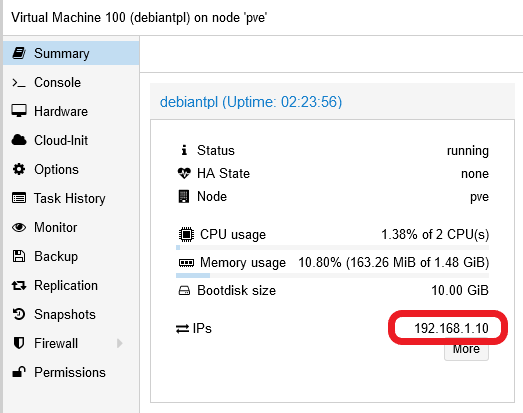

    This VM only has one external IP assigned, by your router or gateway, to the only network card that it's currently enabled in the VM.

2. Lets give an `Alias` to the VM's IP. Go to `Datacenter > Firewall > Alias` and click on `Add`.

    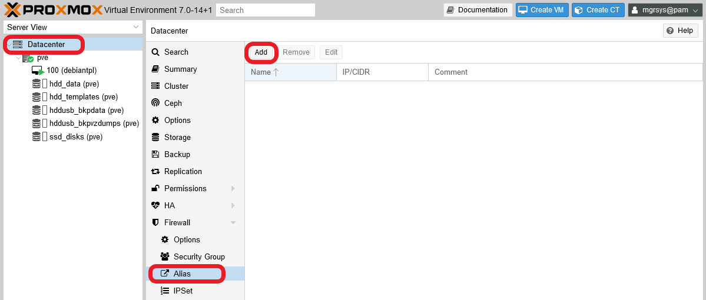

3. You'll see the following form.

    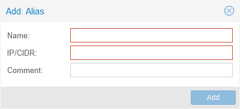

    Let's fill it in a meaningful manner:

    - `Name`: careful with this field, not any string will be considered valid here.
        - Use only alphanumerical characters plus the '_' symbol.
        - Use only letters from the english alphabet.
        > **BEWARE!**  
        > This behaviour is not explained in the Proxmox VE official documentation.

    - `IP/CIDR`: this value can be just a single IP (like `1.2.3.4`) or a network range (as `1.2.3.0/24`). For this case, you'll just input the VM's main IP here (the one assigned to `net0`).

    - `Comment`: you can use this field to put more specific info about the alias.

    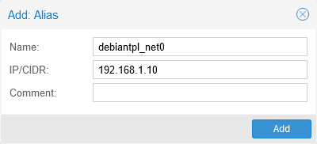

4. After clicking on `Add`, you'll see how the new alias appears listed.

    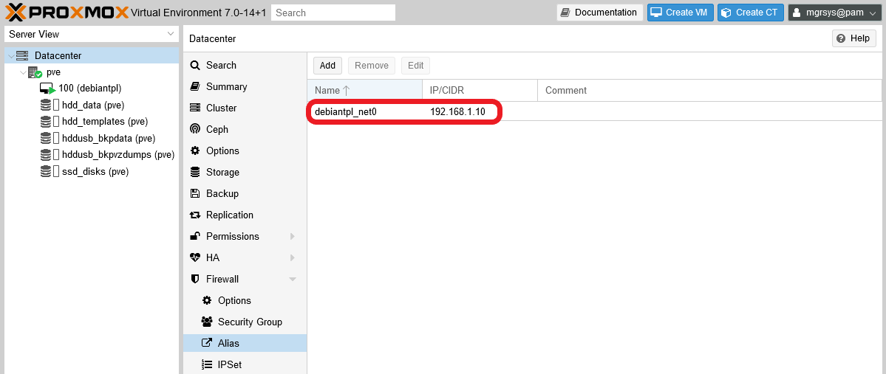

5. Next, create an IP set to hold all the IPs related to the Kubernetes cluster you'll build in a later guide. Go to the `Firewall` at the `Datacenter` level, open the `IPSet` screen and click on `Create`.

    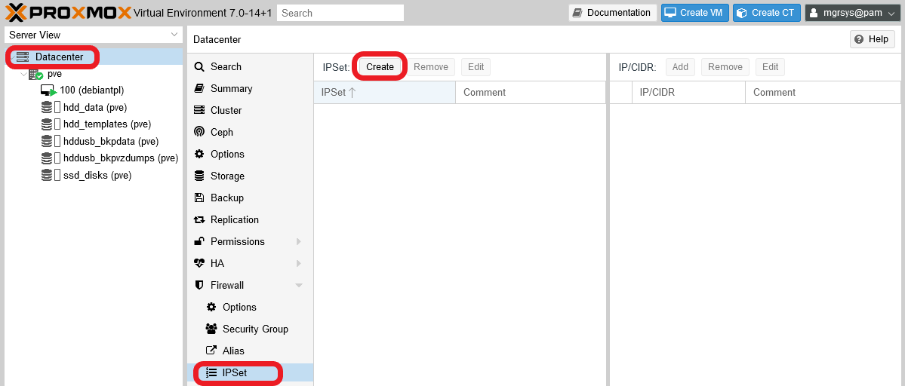

6. A simple form will raise.

    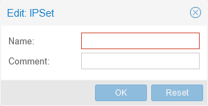

    Let's give the new IP set a meaningful `Name` such as `k3s_nodes_net0_ips`.

    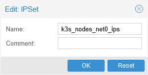

    After filling the form, just click on `OK` to create the new IP set.

7. The `IPSet` screen will now show the new IP set on its left side. Select the new `k3s_nodes_net0_ips` IP set, then click on the now enabled `Add` button over the right side.

    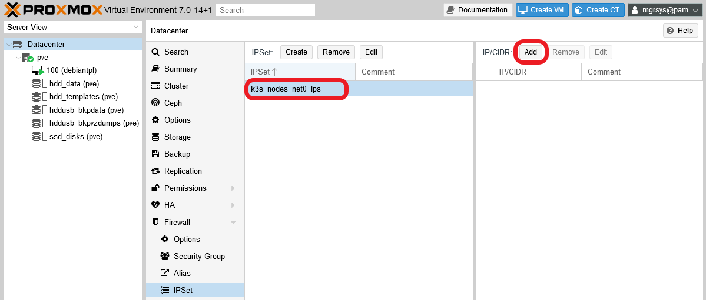

8. You'll meet a form where to input the IP to add to the IP set.

    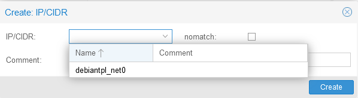

    This form has three fields.

    - `IP/CIDR`: here you can type an IP, or just choose an aliased IP from the unfolded list.

    - `nomatch`: enabling this option explicitly excludes from the set the IP put in the `IP/CIDR` field.

    - `Comment`: any string you might want to type here, although try to make it meaningful.

    Choose your previously aliased IP so the form looks like below.

    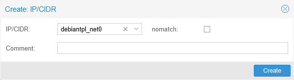

9. Click on `Create` and you'll see your aliased IP added to the set on the `IP/CIDR` list on the right.

    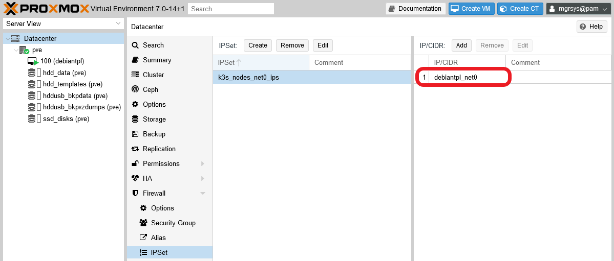

10. Next step is to create a `Security Group`. A security group is just a way of grouping together firewall rules, making it easier to handle them later. So, go to `Datacenter > Firewall > Security Group` in your PVE web console. Then, click on `Create`.

    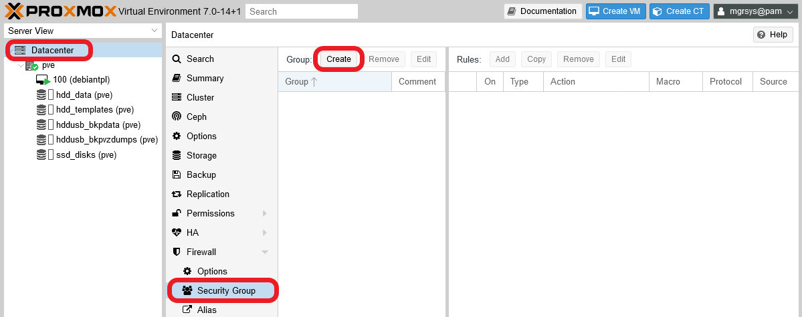

11. A simple form will raise.

    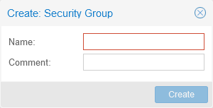

    This group will hold the firewall rules related to the NUT port, so let's give it a `Name` like `nut_port_accept_in`.

    > **BEWARE!**  
    > Careful with the `Name` field here, as it happened with the IP alias name field before, you can only use alphanumerical english characters plus the '_' symbol.

    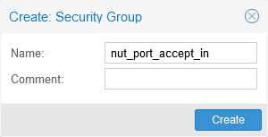

12. Click on the `Create` button, and see how your new security group appears on the left half of the `Security Group` page. Then, select the new group and click on `Add` on the right half.

    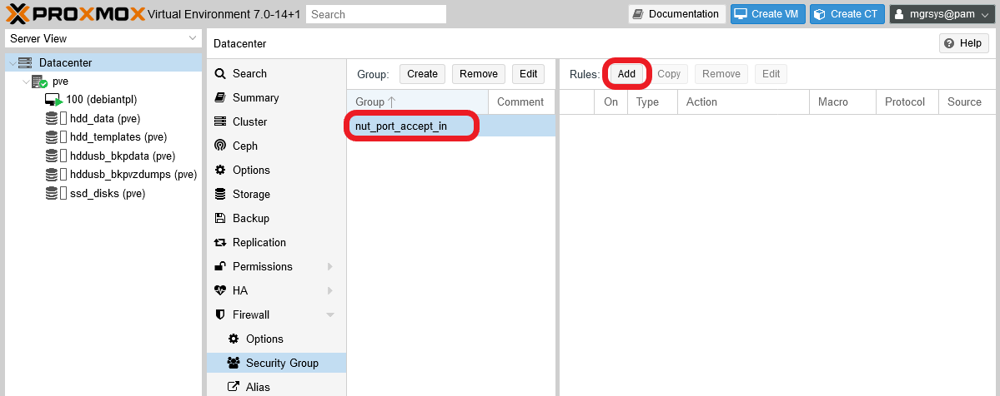

13. In the editor that appears, you're going to define a firewall rule to allow access to the NUT `3493` port from the IP set you defined a few steps before.

    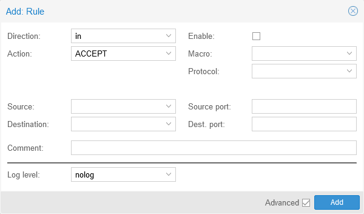

    The explanation for each field is the following.

    - `Direction`: this only has two options, either the rule is about `IN`coming or `OUT`going connections. Choose `in` to allow incoming connections to the NUT server.

    - `Action`: three possibilities here, `ACCEPT` the connection, `DROP` or `REJECT` it. In this case, choose `ACCEPT`.
        > **BEWARE!**  
        > The difference between `DROP` and `REJECT` is that `DROP` rejects connections silently, whereas `REJECT` makes the firewall answer back a rejection code. For stopping connection attempts, always use `DROP` unless you really need to make the rejection noticeable.

    - `Enable`: as its name implies, ticking this option enables the rule. Leave it off for now.

    - `Macro`: this is a list of services known by Proxmox VE. If you choose one, some fields of this rule editor will be filled automatically. Leave it empty, since it doesn't have an option for NUT.

    - `Protocol`: this a list of known net protocols, from which you'll have to choose the right one. For NUT, choose `tcp`.

    - `Source`: indicates the IP where the connection comes from. Be mindful that, depending on the value of the `Direction` field, `Source` can refer to an external origin (an INcoming connection) or to your own system (an OUTgoing connection). This field also offers a list of IP sets and IP aliases, so you just have to click on which one you want rather than typing IPs on the field.

        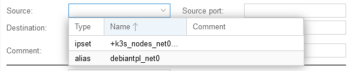

        For the NUT rule, choose the IP set you defined before, the `k3s_nodes_net0_ips`. This way, any other IP you put into that IP set will be already covered by this firewall rule.

    - `Source port`: which port on the source can the connection come from. Leave it empty for accepting any port.

    - `Destination`: is the IP the incoming or outgoing connection wants to reach. This field is of the same kind as `Source`. For the NUT rule, leave it empty for now (unless you've already defined an alias or IP set for your PVE node's IPs).

    - `Dest. port`: port in which the connection wants to connect. Specify the NUT port here: `3493` (or the whichever one you have put in your NUT configuration).

    - `Comment`: any meaningful string you might like to put here.

    - `Log level`: if you want this rule to log the connections that go through it, change the default `nolog` value to any other that suits the severity of the event. For NUT, it shouldn't be more than `info`, usually.

    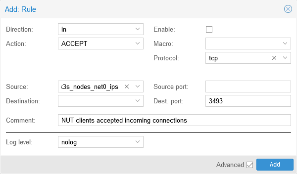

14. Click on `Add`, and see the updated `Rules` list of your Security Group on the right side of the page.

    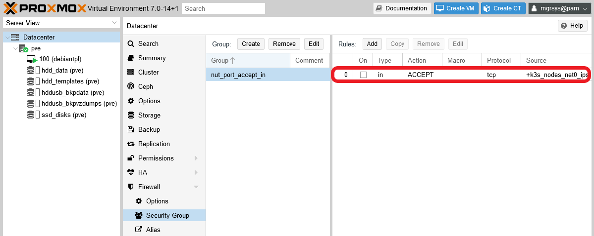

    Notice that the rule is NOT active, since the checkbox on the `On` column is NOT ticked. Leave it that way for now.

15. Go to your PVE node, and browse to the now ruleless `Firewall` section and click on `Insert: Security Group`.

    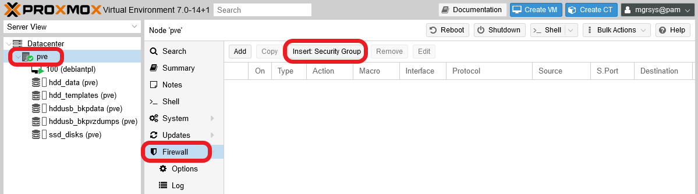

16. A form will raise where you'll be able to define a firewall rule that applies a security group.

    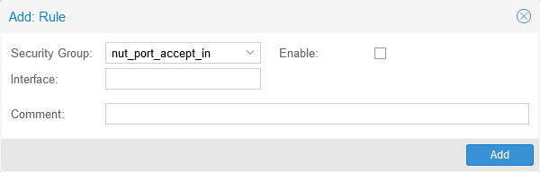

    Here's a brief explanation for each field.

    - `Security Group`: here you must choose a preexisting security group defined at the `Datacenter` level. In this case, you only have the one you've created before: `nut_port_accept_in`.

    - `Interface`: this field **only admits the name** (not IPs or MACs) of an existing node network interface, or just being left empty. In this case you'll need to put the name of the `vmbr0` bridge, since it's the network device through wich your Proxmox VE host communicates.

    - `Enable`: by ticking this on, you enable this rule on the firewall.

    - `Comment`: any string you may want to put here, like a brief explanation of what the rule does.

    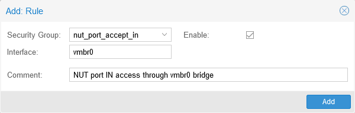

17. Click on `Add` and the new rule will appear immediately in the Firewall of your node.

    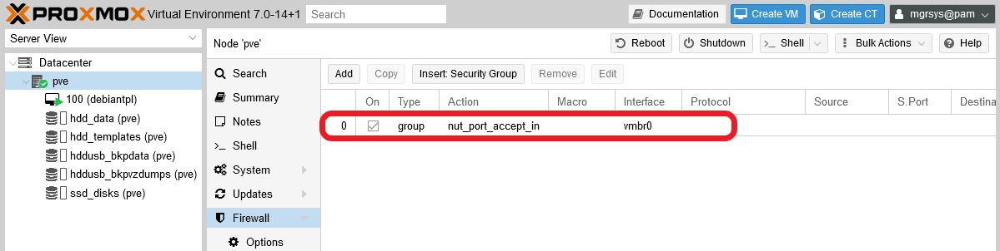

## Configuring the NUT `slave` client on your Debian VM

The previous section has been all about configuring the server side of your NUT setup. Now you'll deal with the client side of it in your Debian VM. Remember that, in your VM, you only installed the `nut-client` package of NUT, since you won't need the server components for a pure client configuration.

1. Open a shell in your Debian VM as `mgrsys`, then `cd` to `/etc/nut` and make a backup of the `nut.conf` file.

    ~~~bash
    $ cd /etc/nut/ ; sudo cp nut.conf nut.conf.orig
    ~~~

2. Edit the `nut.conf` file and just change the value of the `MODE` parameter to `netclient`.

    ~~~properties
    MODE=netclient
    ~~~

3. Save the changes to `nut.conf`, then make a backup of the `upsmon.conf` file.

    ~~~bash
    $ sudo cp upsmon.conf upsmon.conf.orig
    ~~~

4. Edit `upsmon.conf` as follows.

    - Search for and comment out the active lines of the `RBWARNTIME` and `SHUTDOWNCMD` parameters.

        ~~~properties
        # --------------------------------------------------------------------------
        # RBWARNTIME - replace battery warning time in seconds
        #
        # upsmon will normally warn you about a battery that needs to be replaced
        # every 43200 seconds, which is 12 hours.  It does this by triggering a
        # NOTIFY_REPLBATT which is then handled by the usual notify structure
        # you've defined above.
        #
        # If this number is not to your liking, override it here.

        #RBWARNTIME 43200
        ~~~

        ~~~properties
        # --------------------------------------------------------------------------
        # SHUTDOWNCMD "<command>"
        #
        # upsmon runs this command when the system needs to be brought down.
        #
        # This should work just about everywhere ... if it doesn't, well, change it.

        #SHUTDOWNCMD "/sbin/shutdown -h +0"
        ~~~

    - **Append** the following lines to the `upsmon.conf` file.

        ~~~properties
        # --------------------------------------------------------------------------
        # Customized settings

        MONITOR apc@192.168.1.107 1 upsmonclient s3c4R3_Kly3Nt_p4sSw0rD! slave
        SHUTDOWNCMD "logger -t upsmon.conf \"SHUTDOWNCMD calling /sbin/shutdown to shut down system\" ; /sbin/shutdown -h +0"
        NOTIFYCMD /usr/sbin/upssched

        NOTIFYMSG ONLINE "UPS %s: On line power."
        NOTIFYMSG ONBATT "UPS %s: On battery."
        NOTIFYMSG LOWBATT "UPS %s: Battery is low."
        NOTIFYMSG REPLBATT "UPS %s: Battery needs to be replaced."
        NOTIFYMSG FSD "UPS %s: Forced shutdown in progress."
        NOTIFYMSG SHUTDOWN "Auto logout and shutdown proceeding."
        NOTIFYMSG COMMOK "UPS %s: Communications (re-)established."
        NOTIFYMSG COMMBAD "UPS %s: Communications lost."
        NOTIFYMSG NOCOMM "UPS %s: Not available."
        NOTIFYMSG NOPARENT "upsmon parent dead, shutdown impossible."

        NOTIFYFLAG ONLINE SYSLOG+EXEC
        NOTIFYFLAG ONBATT SYSLOG+EXEC
        NOTIFYFLAG LOWBATT SYSLOG+EXEC
        NOTIFYFLAG REPLBATT SYSLOG
        NOTIFYFLAG FSD SYSLOG
        NOTIFYFLAG SHUTDOWN SYSLOG
        NOTIFYFLAG COMMOK SYSLOG
        NOTIFYFLAG COMMBAD SYSLOG
        NOTIFYFLAG NOCOMM SYSLOG
        NOTIFYFLAG NOPARENT SYSLOG

        RBWARNTIME 7200 # 2 hours
        ~~~

        The configuration above is mostly the same as the one you have in the `upsmon.conf` on your PVE node, save the MONITOR line which defines to what UPS unit to connect and with what user. Notice that in that MONITOR line you should set the user you've defined, previously in this guide, as an unprivileged NUT `slave` user in your PVE host's `upsd.users` file. This is much safer than using the fully-privileged administrator user just for monitoring your UPS unit from a VM. Also see how an IP is being used to refer to the UPS unit to monitor, this IP is the NUT server IP. Also, instead of an IP you could also use the NUT server's `hostname` if your network is able to resolve it to the right IP.

5. Save the `upsmon.conf` file, then rename the `upssched.conf` file to `upssched.conf.orig`, and create a new empty `upssched.conf` file.

    ~~~bash
    $ sudo mv upssched.conf upssched.conf.orig
    $ sudo touch upssched.conf ; sudo chmod 640 upssched.conf ; sudo chgrp nut upssched.conf
    ~~~

6. Edit the `upssched.conf` adding the following lines.

    ~~~properties
    # upssched.conf
    CMDSCRIPT /usr/sbin/upssched-cmd
    PIPEFN /var/run/nut/upssched.pipe
    LOCKFN /var/run/nut/upssched.lock

    AT ONLINE apc@192.168.1.107 EXECUTE online
    AT ONBATT apc@192.168.1.107 EXECUTE onbatt
    AT LOWBATT apc@192.168.1.107 EXECUTE lowbatt
    ~~~

    Like with the previous configuration file, here you can see that this file is almost the same `upssched.conf` file as the one set up previously in your PVE host. The only difference here is that, in the `AT` declarations, where there was a call to the `localhost` now you must put the NUT server IP or its `hostname`.

7. Save the `upssched.conf` file. Then create an empty `/usr/sbin/upssched-cmd` file with the right permissions.

    ~~~bash
    $ sudo touch /usr/sbin/upssched-cmd ; sudo chmod 755 /usr/sbin/upssched-cmd
    ~~~

8. Edit the new `/usr/sbin/upssched-cmd` so it has the following shell script code.

    ~~~bash
    #!/bin/bash -u
    # upssched-cmd
    logger -i -t upssched-cmd Calling upssched-cmd $1

    UPS="apc@192.168.1.107"
    STATUS=$( upsc $UPS ups.status )
    CHARGE=$( upsc $UPS battery.charge )
    CHMSG="[$STATUS]:$CHARGE%"

    case $1 in
        online) MSG="$UPS, $CHMSG - INFO - Power supply is back online." ;;
        onbatt) MSG="$UPS, $CHMSG - WARNING - Power failure. Now running on battery!" ;;
        lowbatt) MSG="$UPS, $CHMSG - WARNING - Low battery. Shutdown now!" ;;
        *) logger -i -t upssched-cmd "ERROR - Bad argument: \"$1\", $CHMSG" 
            exit 1 ;;
    esac

    logger -i -t upssched-cmd $MSG
    notify-send-all "$MSG"
    ~~~

    This script is almost the same one you already configured in your PVE host. The only thing that changes is the `UPS` variable, which now also needs the IP of the NUT server specified.

9. Save the `upssched-cmd` file and start the NUT related services already running in your VM.

    ~~~bash
    $ sudo systemctl restart nut-client.service nut-monitor.service 
    ~~~

## Checking the connection between the VM NUT `slave` client and the PVE node NUT `master` server

You have everything configured, so it's time you test the NUT connection between your VM and the Proxmox VE node. To do this, execute the `upsc` command on your VM as follows.

~~~bash
$ sudo upsc apc@192.168.1.107
~~~

And this command should return the following output.

~~~bash
Error: Connection failure: Connection timed out
~~~

Yes, there's a problem with the connection. You can also see this error in the `/var/log/syslog` file in your VM, in which you should find a number of lines like the following one.

~~~log
Nov 19 19:44:27 debiantpl upsmon[593]: UPS [apc@192.168.1.107]: connect failed: Connection failure: Connection timed out
~~~

The NUT monitor daemon on your VM tries to connect every few seconds to the NUT server on your PVE node, but something is wrong and the connection times out. So, what's missing? Just a small detail, regarding the security group you created in the firewall at the `Datacenter` level of your Proxmox VE platform. So, go back to the PVE web console, browse to `Datacenter > Firewall > Security Group` and select the group you created there before, the `nut_port_accept_in` one.

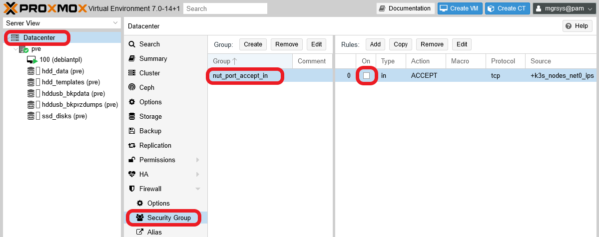

You only declared one rule in the security group, and I told you to leave it disabled. This way, I've shown you a bit how the relationship between levels within Proxmox VE works regarding firewall rules. Remember that, at your `pve` node tier, you have created and **enabled** a firewall rule that used the security group itself; but only the rules **enabled in the security group** will be also enforced by the firewall. So, to enable access to the NUT port in your PVE host, you must also activate the rule you prepared right for it. To do so, just click on the checkbox the rule has at the `On` column.

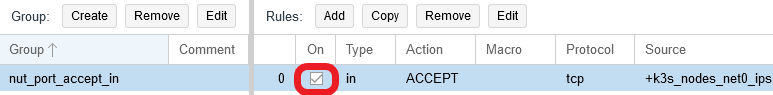

The rule will be enforced by the firewall right away, so you can already check if now you can communicate with the NUT server from your VM.

~~~bash
$ sudo upsc apc@192.168.1.107
Init SSL without certificate database
battery.charge: 100
battery.charge.low: 80
battery.charge.warning: 50
battery.date: not set
...
ups.vendorid: 051d
~~~

Now you should get a proper answer from the NUT server, in this case information about your UPS unit. On the other hand, and maybe a few seconds after you enabled the rule in the firewall, in the `/var/log/syslog` of your VM you should see the following line once.

~~~log
Nov 19 19:47:49 debiantpl upsmon[593]: UPS apc@192.168.1.107: Communications (re-)established.
~~~

The NUT monitor in your VM now is properly connected to the NUT server in your PVE node. On the other hand, in the `/var/log/syslog` file of your PVE host you should also find an output like below.

~~~log
Nov 19 19:47:49 pve upsd[923]: User upsmonclient@192.168.1.10 logged into UPS [apc]
~~~

So, the NUT connection on the server side is also verified. Mind you that, on the server side, you won't see the connection failures, since those happened due to the firewall blocking the connection.

As a final note on this matter, browse in your PVE web console to the `Datacenter Firewall`.

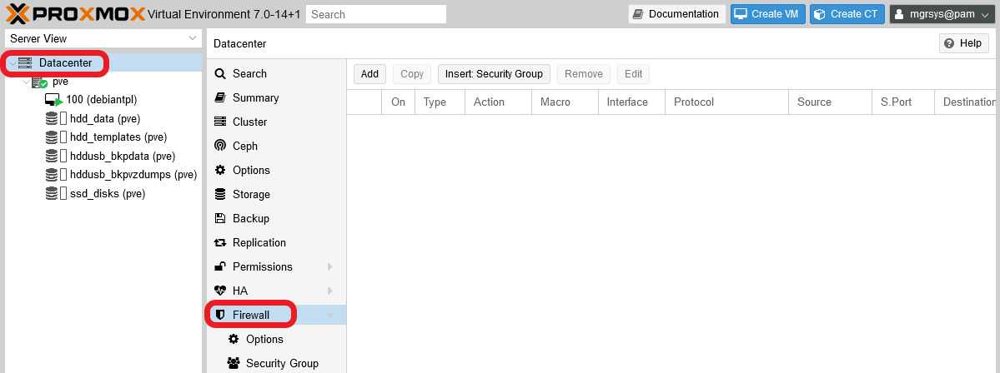

As you can see, there are no visible rules whatsoever, although you created the security group at the `Datacenter` tier, and let's not forget the rules enabled in the `iptables` running underneath, but those are not show here either. Essentially, from the firewall point of view, the datacenter and node levels are the same logical network "host" zone, although each level have their own firewall configuration page (with different options available, mind you). Just be aware of this particularity of Proxmox VE whenever you have to deal with its firewall.

## Testing a Forced ShutDown sequence (`FSD`) with NUT

To test if your whole NUT setup works as expected, you can provoke a Forced ShutDown (`FSD`) event with just one NUT command. But first you must understand what's going to happen after provoking the `FSD` event.

### _FSD event shutdown sequence_

1. The `upsmon` **master** daemon, running in your Proxmox VE host, notices and sets `FSD` (the _forced shutdown_ flag) to tell all **slave** systems that it will soon power down the load.

2. The `upsmon` **slave** daemon in your VM sees the `FSD` event and:

    1. Generate a `NOTIFY_SHUTDOWN` event.
    2. Wait `FINALDELAY` seconds, by default 5.
    3. Call its shutdown command specified by `SHUTDOWNCMD`.
    4. Disconnect from `upsd`.

3. The `upsmon` **master** daemon waits up to `HOSTSYNC` seconds (by default 15) for the **slaves** to disconnect from `upsd`. If any are connected after this time, `upsmon` stops waiting and proceeds with the shutdown process.

4. The `upsmon` **master**:

    1. Generates a `NOTIFY_SHUTDOWN` event.
    2. Waits `FINALDELAY` seconds, by default 5.
    3. Creates the `POWERDOWNFLAG` file, by default `/etc/killpower`.
    4. Calls its shutdown command specified by `SHUTDOWNCMD`.

5. On most systems, `init` takes over, kills your processes, syncs and unmounts some filesystems, and remounts some read-only.

6. The `init` process then runs your shutdown script. This checks for the `POWERDOWNFLAG`, finds it, and tells the UPS driver(s) to power off the load (your UPS unit).

7. The system, your Proxmox VE host, loses power.

8. Time passes. The power returns, and your UPS unit switches back on.

There are a few takeaways to consider from this sequence.

- **Timing is crucial**: you need to leave enough time for your **client** (`slaves` for NUT) systems, like your VM, to shutdown properly. At this point, you only have one VM that does nothing but keeping itself running, so it can shutdown in a few seconds. Something else will be when, in later guides, you build a Kubernetes cluster with two quite service-loaded VMs. You'll need to adjust the value of the `HOSTSYNC` parameter (declared in the `/etc/nut/upsmon.conf` file), both in the **master** NUT server and in the **slave** systems, to suit it to the longest period of time required to shutdown safely your VMs, while also keeping in mind the limitations of the battery on your UPS unit. Thus, you'll need to test your whole system to measure how much time does your setup requires to shutdown safely.

- **Use of the SHUTDOWNCMD and NOTIFYCMD parameters**: you can prepare shell scripts able to do certain actions, like stopping services in a certain order, and then set them in the `SHUTDOWNCMD` or the `NOTIFYCMD` parameter (both declared in the `/etc/nut/upsmon.conf` file). This is exactly what you've seen previously in this guide, when you created the `/usr/sbin/upssched-cmd` script and set it in the NOTIFYCMD parameter. In fact, you could just improve the `upssched-cmd` script and associate it with more events.

- **The UPS unit will restart**: with this `FSD` sequence, the last thing the UPS unit will do is restart. Bear this in mind if you have other unrelated devices plugged in the same UPS unit.

### _Executing the FSD test_

1. First, as `mgrsys`, open one shell terminal on your Proxmox VE host and another one on your VM, then put them side to side.

2. On the **Proxmox VE host** shell, execute the following `upsmon` command.

    ~~~bash
    $ sudo upsmon -c fsd
    ~~~

3. Right after you execute this command, pay attention to the **VM** shell. You should immediately see the following output.

    ~~~bash
    Broadcast message from nut@debiantpl (somewhere) (Fri Nov 19 20:00:04 2021):

    Executing automatic power-fail shutdown
    ~~~

4. On the Proxmox VE shell, you'll get the following output.

    ~~~bash
    Network UPS Tools upsmon 2.7.4

    Broadcast message from nut@pve (somewhere) (Fri Nov 19 20:00:09 2021):

    Executing automatic power-fail shutdown
    ~~~

5. You'll lose connection to both terminals, first from the VM, then from the Proxmox VE system.

6. A few seconds later, you should see (blinking leds) or hear (internal switching) your UPS unit rebooting.

7. Switch your Proxmox VE server back on, and then also your VM.

8. Like before, connect with a shell terminal to each system. Then, open the `/var/log/syslog` file on both terminals.

    ~~~bash
    $ sudo less /var/log/syslog
    ~~~

9. On the **Proxmox VE** system terminal, look for lines like the following ones.

    ~~~log
    ...
    Nov 19 20:00:01 pve upsmon[932]: Signal 10: User requested FSD
    Nov 19 20:00:01 pve upsd[923]: Client upsmon@127.0.0.1 set FSD on UPS [apc]
    ...
    Nov 19 20:00:09 pve upsmon[932]: Executing automatic power-fail shutdown
    Nov 19 20:00:09 pve upsmon[932]: Auto logout and shutdown proceeding.
    ...
    ~~~

    Those lines mark the beginning of the `FSD` sequence in the Proxmox VE host. Some seconds later, you should find this line.

    ~~~bash
    Nov 19 20:00:14 pve upsmon.conf: SHUTDOWNCMD calling /sbin/shutdown to shut down system
    ~~~

    That line indicates when the shutdown begins in the Proxmox VE server. Below it you'll see the log of VMs and services being stopped, storages being unmounted and so on.

10. On the **VM** terminal, search for log lines like the ones next.

    ~~~bash
    Nov 19 20:00:04 debiantpl upsmon[593]: UPS apc@192.168.1.107: Forced shutdown in progress.
    Nov 19 20:00:04 debiantpl upsmon[593]: Executing automatic power-fail shutdown
    Nov 19 20:00:04 debiantpl upsmon[593]: Auto logout and shutdown proceeding.
    ~~~

    That's the beginning of the `FSD` sequence on the VM. Not far below it, you should see this other line.

    ~~~bash
    Nov 19 20:00:09 debiantpl upsmon.conf: SHUTDOWNCMD calling /sbin/shutdown to shut down system
    ~~~

    It's exactly like in the Proxmox VE server, and also indicates that the shutdown process of the VM truly starts at this point.

With this test, you can check out the validity of your NUT configuration and your associated shell scripts. Also, you may consider using this mechanism to shut down your whole system (VMs included) with just one command, but you must be aware that Proxmox VE also comes with capabilities regarding the automatic starting and stopping of its VMs.

## Relevant system paths

### _Directories on Debian VM_

- `/etc/nut`
- `/usr/sbin`
- `/var/log`
- `/var/run/nut`

### _Files on Debian VM_

- `/etc/nut/nut.conf`
- `/etc/nut/nut.conf.orig`
- `/etc/nut/upsmon.conf`
- `/etc/nut/upsmon.conf.orig`
- `/etc/nut/upssched.conf`
- `/etc/nut/upssched.conf.orig`
- `/usr/sbin/upssched`
- `/usr/sbin/upssched-cmd`
- `/var/log/syslog`
- `/var/run/nut/upssched.pipe`
- `/var/run/nut/upssched.lock`

### _Directories on Proxmox VE host_

- `/etc/nut`
- `/usr/sbin`
- `/var/log`
- `/var/run/nut`

### _Files on Proxmox VE host_

- `/etc/nut/nut.conf`
- `/etc/nut/nut.conf.bkp`
- `/etc/nut/ups.conf`
- `/etc/nut/ups.conf.bkp`
- `/etc/nut/upsd.conf`
- `/etc/nut/upsd.conf.bkp`
- `/etc/nut/upsd.users`
- `/etc/nut/upsd.users.bkp`
- `/etc/nut/upsmon.conf`
- `/etc/nut/upsmon.conf.bkp`
- `/etc/nut/upssched.conf`
- `/etc/nut/upssched.conf.orig`
- `/usr/sbin/upssched`
- `/usr/sbin/upssched-cmd`
- `/var/log/syslog`
- `/var/run/nut/upssched.pipe`
- `/var/run/nut/upssched.lock`

## References

### _NUT configuration_

- [NUT (Network UPS Tool)](https://networkupstools.org/)
- [NUT User manual (chunked)](https://networkupstools.org/docs/user-manual.chunked/index.html)
- [NUT User manual (chunked). Shutdown design](https://networkupstools.org/docs/user-manual.chunked/ar01s06.html#Shutdown_design)
- [NUT User manual (chunked). Testing shutdowns](https://networkupstools.org/docs/user-manual.chunked/ar01s06.html#Testing_shutdowns)
- [NUT documentation and scripts](http://rogerprice.org/NUT/)
- [NUT config examples document on GitHub](https://github.com/networkupstools/ConfigExamples/releases/tag/book-2.0-20210521-nut-2.7.4)
- [Monitorización de un SAI con GNU/Debian Linux](http://index-of.co.uk/SISTEMAS-OPERATIVOS/NUT%20Debian%20UPS%20Monitor.pdf) (in spanish)
- [Instalar y configurar NUT por SNMP](https://blog.ichasco.com/instalar-y-configurar-nut-por-snmp/) (in spanish)
- [Monitoring a UPS with nut on Debian or Ubuntu Linux](https://blog.shadypixel.com/monitoring-a-ups-with-nut-on-debian-or-ubuntu-linux/)
- [Can't get upsmon service started to monitor (and respond to) remote UPS](https://serverfault.com/questions/865147/cant-get-upsmon-service-started-to-monitor-and-respond-to-remote-ups)
- [Configure UPS monitor using NUT on Debian](https://mn3m.info/posts/configure-ups-monitor-using-nut-on-debian/)
- [HOWTO: Configure A UPS on Proxmox 5.x](https://diyblindguy.com/howto-configure-ups-on-proxmox/)
- [UPS Server on Raspberry Pi](https://www.reddit.com/r/homelab/comments/5ssb5h/ups_server_on_raspberry_pi/)
- [Configuring NUT for the Eaton 3S UPS on Ubuntu Linux](https://srackham.wordpress.com/2013/02/27/configuring-nut-for-the-eaton-3s-ups-on-ubuntu-linux/)
- [UPS HowTo](https://tldp.org/HOWTO/UPS-HOWTO/)

### _Proxmox VE firewall_

- [Proxmox VE Administrator guide. 13. Proxmox VE Firewall](https://pve.proxmox.com/pve-docs/pve-admin-guide.html#chapter_pve_firewall)

## Navigation

[<< Previous (**G021. K3s cluster setup 04**)](G021%20-%20K3s%20cluster%20setup%2004%20~%20Debian%20VM%20configuration.md) | [+Table Of Contents+](G000%20-%20Table%20Of%20Contents.md) | [Next (**G023. K3s cluster setup 06**) >>](G023%20-%20K3s%20cluster%20setup%2006%20~%20Debian%20VM%20template%20and%20backup.md)
