# G022 - K3s cluster setup 05 ~ Connecting the VM to the NUT server

- [Make your VMs aware of your UPS unit with NUT](#make-your-vms-aware-of-your-ups-unit-with-nut)
- [Reconfiguring the NUT server on your Proxmox VE host](#reconfiguring-the-nut-server-on-your-proxmox-ve-host)
  - [Changing the `nut.conf` file](#changing-the-nutconf-file)
  - [Reconfiguring the UPS driver with the `ups.conf` file](#reconfiguring-the-ups-driver-with-the-upsconf-file)
  - [Adding access control rules in the `upsd.conf` file](#adding-access-control-rules-in-the-upsdconf-file)
  - [Adding a NUT client user in the `upsd.users` file](#adding-a-nut-client-user-in-the-upsdusers-file)
  - [Declaring executable actions related to concrete NUT events](#declaring-executable-actions-related-to-concrete-nut-events)
  - [Opening the `upsd` port on the Proxmox VE node](#opening-the-upsd-port-on-the-proxmox-ve-node)
- [Configuring the NUT client on your Debian VM](#configuring-the-nut-client-on-your-debian-vm)
- [Checking the connection between the VM NUT client and the PVE node NUT server](#checking-the-connection-between-the-vm-nut-client-and-the-pve-node-nut-server)
- [Testing a Forced ShutDown sequence (`FSD`) with NUT](#testing-a-forced-shutdown-sequence-fsd-with-nut)
  - [FSD event shutdown sequence](#fsd-event-shutdown-sequence)
  - [Executing the FSD test](#executing-the-fsd-test)
- [Relevant system paths](#relevant-system-paths)
  - [Directories on Debian VM](#directories-on-debian-vm)
  - [Files on Debian VM](#files-on-debian-vm)
  - [Directories on Proxmox VE host](#directories-on-proxmox-ve-host)
  - [Files on Proxmox VE host](#files-on-proxmox-ve-host)
- [References](#references)
  - [Network UPS Tools (NUT)](#network-ups-tools-nut)
  - [Other contents about NUT](#other-contents-about-nut)
  - [About UPS units](#about-ups-units)
  - [Proxmox VE](#proxmox-ve)
- [Navigation](#navigation)

## Make your VMs aware of your UPS unit with NUT

In the [chapter **G004**](G004%20-%20Host%20configuration%2002%20~%20UPS%20management%20with%20NUT.md) you set up a standalone NUT server so your PVE node could monitor the UPS unit it is plugged in. Now that you have started creating VMs, it is convenient to make them aware of your UPS unit. When there is a power cut and the UPS kicks in, you can automate a proper shutdown sequence for your whole server setup. Think that your VMs, in this context, will be like real computers plugged into the same UPS unit as your Proxmox VE host, so they will be also directly affected to whatever happens to your PVE host's power supply.

In short, you have to make your VMs monitor the UPS unit supporting your setup. You can do this by connecting the NUT client you already have installed in your first Debian VM to your Proxmox VE NUT server.

## Reconfiguring the NUT server on your Proxmox VE host

First, you need to change the configuration of the NUT server running in your Proxmox VE host, so it can also serve the NUT client enabled in your VMs.

### Changing the `nut.conf` file

1. Open a shell as `mgrsys` on your Proxmox VE host, then `cd` to `/etc/nut` and make a backup of the `nut.conf` file:

    ~~~sh
    $ cd /etc/nut ; sudo cp nut.conf nut.conf.bkp
    ~~~

2. Edit the `nut.conf` file and change the value of the `MODE` parameter to `netserver`:

    ~~~properties
    MODE=netserver
    ~~~

3. Save the changes on the `nut.conf` file.

### Reconfiguring the UPS driver with the `ups.conf` file

1. Remain at `/etc/nut`, and make a backup of the `ups.conf` file:

    ~~~sh
    $ sudo cp ups.conf ups.conf.bkp
    ~~~

2. Edit the `ups.conf` file. At its end, you should have just the configuration block for your UPS unit you configured previously in the [chapter **G004**](G004%20-%20Host%20configuration%2002%20~%20UPS%20management%20with%20NUT.md#connecting-your-ups-with-your-pve-node-using-nut):

    ~~~properties
    [eaton]
    driver = usbhid-ups
    port = auto
    desc = "Eaton 3S700D"
     ~~~

    You have to add to this block a few more parameters like this:

    ~~~properties
    [eaton]
    driver = usbhid-ups
    port = auto
    desc = "Eaton 3S700D"
    offdelay = 60
    ondelay = 70
    lowbatt = 80
    ~~~

    Here is a brief explanation of the three new parameters added to the `[upsunit]` configuration:

    - `offdelay`\
      Value in seconds, default is 20 seconds. Time that passes between the `upsdrvctl` shutdown command and the moment the UPS shuts itself down.

    - `ondelay`\
      Value in seconds, default is 30 seconds. Time that must pass between the `upsdrvctl` shutdown command and the moment when the UPS will react to the return of wall power and turn on the power to the system.

      > [!WARNING]
      > This `ondelay` value **must be greater** than the `offdelay` number!

    - `lowbatt`\
      Value in percentage. Percentage of battery charge remaining in the UPS unit that should be considered as "low charge".

    To set up those parameters properly, you must be fully aware of the real capacity of your UPS unit to hold your system running in case of a power cut. In this guide's setup, the UPS unit can only hold for just a few minutes before discharging completely. This implies that this configuration has to be set with very conservative values (in particular in the `lowbatt` parameter). Of course, how long your UPS unit can run depends on how much (or how fast) energy will be drained from its battery when in use. Also, bear in mind the battery degradation over time (even if its never used), and **how long does your server take to shutdown gracefully** (including your VMs and services running within them).

3. Save the changes on the `ups.conf` file.

### Adding access control rules in the `upsd.conf` file

1. Still at `/etc/nut`, make a backup of the `upsd.conf` file:

    ~~~sh
    $ sudo cp upsd.conf upsd.conf.bkp
    ~~~

2. Edit the `upsd.conf` file, jump to the `LISTEN` lines and modify them as follows:

    ~~~properties
    # LISTEN <address> [<port>]
    #LISTEN 127.0.0.1 3493
    LISTEN 0.0.0.0 3493
    # LISTEN ::1 3493
    ~~~

    By setting `0.0.0.0` as listening address, you are making the `upsd` service listen for traffic **from all IP v4 sources available in your Proxmox VE host**. This is necessary to allow the NUT server to respond to the NUT clients running in any of your VMs.

3. Save the changes on the `upsd.conf` file.

### Adding a NUT client user in the `upsd.users` file

1. Still at `/etc/nut`, make a backup of the `upsd.users` file:

    ~~~sh
    $ sudo cp upsd.users upsd.users.bkp
    ~~~

2. Edit the `upsd.users` file by appending the following block:

    ~~~properties
    [upsmonclient]
        password = s3c4R3_Kly3Nt_p4sSw0rD!
        upsmon secondary
    ~~~

    Notice the `upsmon secondary` line, which indicates that the `upsmonclient` will be the common user for all monitor client systems (the VMs running in your Proxmox VE server).

3. Save the changes on the `upsd.users` file.

After adding this user, your NUT system will have three different NUT users: one administrator user, one monitor user to be used only locally in the `primary` NUT server, and other monitor user only to be used remotely from `secondary` client NUT systems such as the VMs you have to create later on your PVE node.

### Declaring executable actions related to concrete NUT events

1. Still in the `/etc/nut` directory, make a backup of the current `upsmon.conf` file:

    ~~~sh
    $ sudo cp upsmon.conf upsmon.conf.bkp
    ~~~

2. Edit the `upsmon.conf` file, adding under the customized `SHUTDOWNCMD` parameter a new `NOTIFYCMD` line:

    ~~~properties
    SHUTDOWNCMD "logger -t upsmon.conf \"SHUTDOWNCMD calling /sbin/shutdown to shut down system\" ; /sbin/shutdown -h +0"
    NOTIFYCMD /usr/sbin/upssched
    ~~~

    In `NOTIFYCMD`, the configured `upssched` command is a NUT program that provides a rich set of actions to execute in response to events detected by `upsmon`.

3. Also, modify the customized `NOTIFYFLAG` lines for the `ONLINE`, `ONBATT` and `LOWBATT` events by adding a +EXEC flag:

    ~~~properties
    NOTIFYFLAG ONLINE SYSLOG+EXEC
    NOTIFYFLAG ONBATT SYSLOG+EXEC
    NOTIFYFLAG LOWBATT SYSLOG+EXEC
    ~~~

    The `+EXEC` flag makes `upsmon` call the program configured in the `NOTIFYCMD` parameter.

4. Save the changes on the `upsmon.conf` file:

5. Rename the `upssched.conf` file to `upssched.conf.orig`, and create a new empty `upssched.conf` file:

    ~~~sh
    $ sudo mv upssched.conf upssched.conf.orig
    $ sudo touch upssched.conf ; sudo chmod 640 upssched.conf
    ~~~

6. Edit the new `upssched.conf` file and put in it the following script:

    ~~~properties
    # upssched.conf
    CMDSCRIPT /usr/sbin/upssched-cmd
    PIPEFN /var/run/nut/upssched.pipe
    LOCKFN /var/run/nut/upssched.lock

    AT ONLINE eaton@localhost EXECUTE online
    AT ONBATT eaton@localhost EXECUTE onbatt
    AT LOWBATT eaton@localhost EXECUTE lowbatt
    ~~~

    The parameters in this script are explained next:

    - `CMDSCRIPT`
      Points to a user script that will be executed by `upssched` in response to the UPS events notified by the `upsmon` NUT monitor service.

      > [!IMPORTANT]
      > **This script is provided by the system administrator, which is you in this case**\
      > Do not confuse this script with the `/usr/sbin/upssched` command, which is the NUT program that will call your script. On the other hand, the name `upssched-cmd` is the assumed standard in the NUT community: **do not change it**.

    - `PIPEFN`\
      Socket file used for communication between `upsmon` and `upssched`.

      > [!IMPORTANT]
      > The directory containing this file should be accessible only by the NUT software and nothing else.

    - `LOCKFN`\
      File required by the upsmon NUT daemon to avoid race conditions.

      > [!IMPORTANT]
      > The directory should be the same as for the `PIPEFN` file.

    - `AT` lines\
      Declarations for actions to `EXECUTE` with the `CMDSCRIPT` only `AT` the events defined in this configuration file. These declarations follow the pattern below:

      ~~~properties
      AT notifytype UPSunit-name command
      ~~~

      This line is translated as follows:

      - `AT` is the keyword to start the declaration.

      - `notifytype` is the code identifying a NUT-monitored event.

      - `UPSunit-name` is the name of the monitored UPS unit. This argument admits the use of the wildcard `*` to refer to all available UPS units, although it is not recommended. You usually will prefer to have particular rules for each of those UPS units.

      - `command` specifies what to do when the event happens. The `EXECUTE` command is just one of several available.

7. Create an empty `/usr/sbin/upssched-cmd` file with the right permissions:

    ~~~sh
    $ sudo touch /usr/sbin/upssched-cmd ; sudo chmod 755 /usr/sbin/upssched-cmd
    ~~~

8. Put the following shell script code in the new `upssched-cmd` file:

    ~~~sh
    #!/bin/bash -u
    # upssched-cmd
    logger -i -t upssched-cmd Calling upssched-cmd $1

    UPS="eaton"
    STATUS=$( upsc $UPS ups.status )
    CHARGE=$( upsc $UPS battery.charge )
    CHMSG="[$STATUS]:$CHARGE%"

    case $1 in
        online) MSG="$UPS, $CHMSG - INFO - Power supply is back online." ;;
        onbatt) MSG="$UPS, $CHMSG - WARNING - Power failure. Now running on battery!" ;;
        lowbatt) MSG="$UPS, $CHMSG - WARNING - Low battery. Shutdown now!" ;;
        *) logger -i -t upssched-cmd "ERROR - Bad argument: \"$1\", $CHMSG" 
            exit 1 ;;
    esac

    logger -i -t upssched-cmd $MSG
    notify-send-all "$MSG"
    ~~~

    Do not forget specifying your own UPS unit in the `UPS` parameter of this script.

    > [!NOTE]
    > **This script is just an example of what you can do**\
    > In this case, is just some logging and sending messages regarding a particular set of UPS events. Notice how it has one input argument (`$1`), and the options appearing in the `case` block are used in the `AT` declarations defined in the `upssched.conf` file.

9. Save the `upssched-cmd` file and restart the NUT related services already running in your Proxmox VE host:

    ~~~sh
    $ sudo systemctl restart nut-server.service nut-monitor.service
    ~~~

### Opening the `upsd` port on the Proxmox VE node

You need to make the `upsd` port (in this guide is the standard NUT `3493` port) accessible in your PVE host, so the NUT client monitors in your VMs can connect to it. To achieve this, you need to set up proper firewall rules in Proxmox VE, both at the `Datacenter` and `pve` node levels of the Proxmox VE web console:

1. Get the IP of your, at this point, sole Debian VM. You can see it in the VM's `Summary` screen, in the `Status` block:

    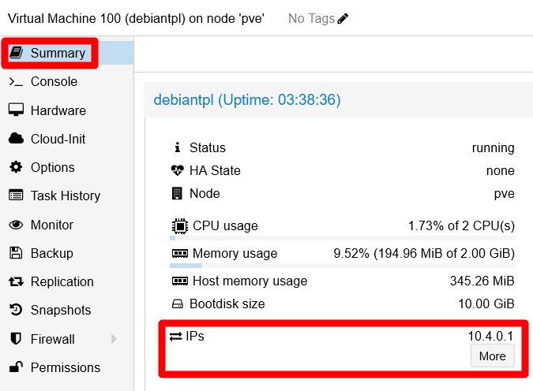

    This VM only has one external IP assigned, by your router or gateway, to the only network card currently enabled in the VM.

2. Assign an `Alias` to the VM's IP. Go to `Datacenter > Firewall > Alias` and click on `Add`:

    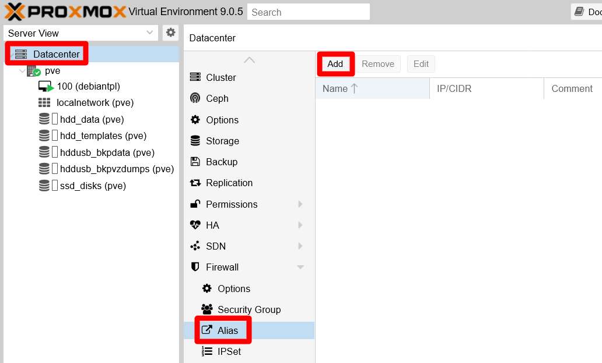

3. The `Add: Alias` form appears:

    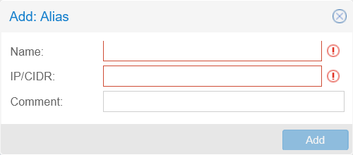

    Fill this form in a meaningful manner:

    - `Name`\
      Careful with this field, not any string will be considered valid here.

      - Only use alphanumerical characters plus the `_` symbol.
      - Only use letters from the English alphabet.

      > [!NOTE]
      > These particularities are not explained in the Proxmox VE official documentation.

      To fill this field, better follow a criteria like `[vm_hostname]_[vm_network_device_name]`. Then, for the sole VM existing in your PVE system at this point, this value would be `debiantpl_net0`.

    - `IP/CIDR`\
      This value can be just a single IP (like `1.2.3.4`) or a network range (as `1.2.3.0/24`). For this case, you just have to input the VM's main IP here (the one assigned to the VM's `net0` network device).

    - `Comment`\
      Use this text field to put more specific info about the alias.

      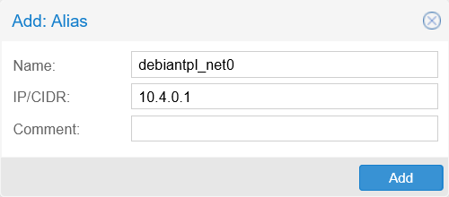

4. After clicking on `Add`, see how your new alias gets listed in the `Alias` page:

    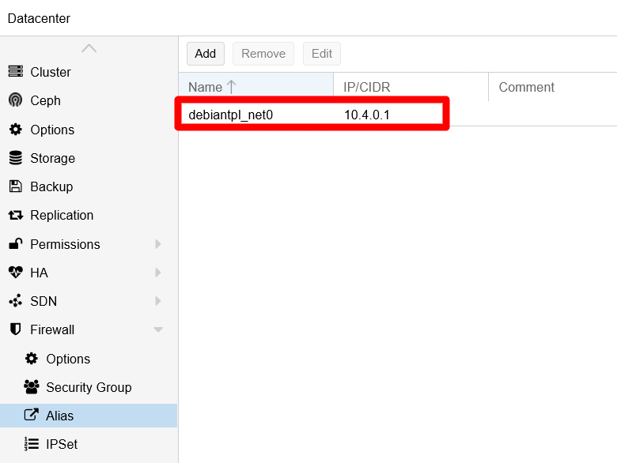

5. Next, create an _IP set_ to hold all the IPs related to the Kubernetes cluster you will build in a later chapter. Go to the `Firewall` at the `Datacenter` level, open the `IPSet` screen and click on `Create`:

    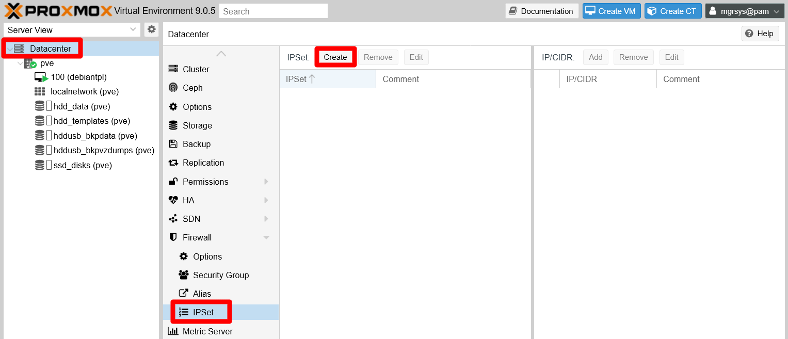

6. A simple form appears for creating an IPSet:

    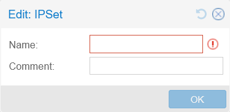

    Give the new IP set a meaningful `Name` such as `k3s_nodes_net0_ips`:

    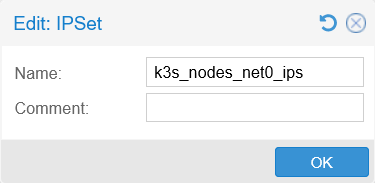

    After filling the form, just click on `OK` to create the new IP set.

7. The `IPSet` screen now shows the new IP set on its left side. Select the new `k3s_nodes_net0_ips` IP set, then click on the now enabled `Add` button over the right side:

    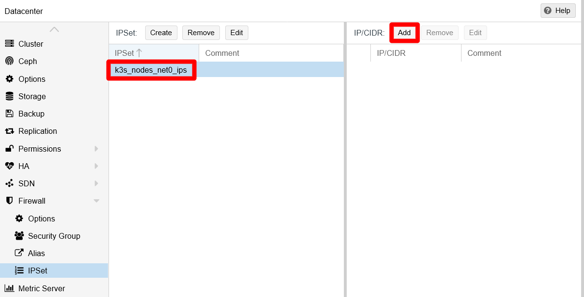

8. You meet a form where to input the IP to add to the IP set:

    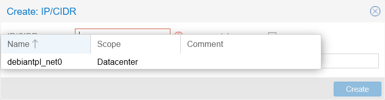

    This form has three fields.

    - `IP/CIDR`\
      Here you can type an IP, or just choose an aliased IP from the unfolded list.

    - `nomatch`\
      Enabling this option explicitly excludes from the set the IP put in the `IP/CIDR` field.

    - `Comment`\
      Any string you might want to type here, although try to make it meaningful.

    Choose your previously aliased IP so the form looks like below:

    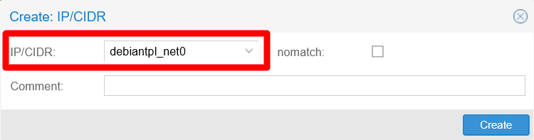

9. Click on `Create`, then see your aliased IP added to the set on the `IP/CIDR` list on the right:

    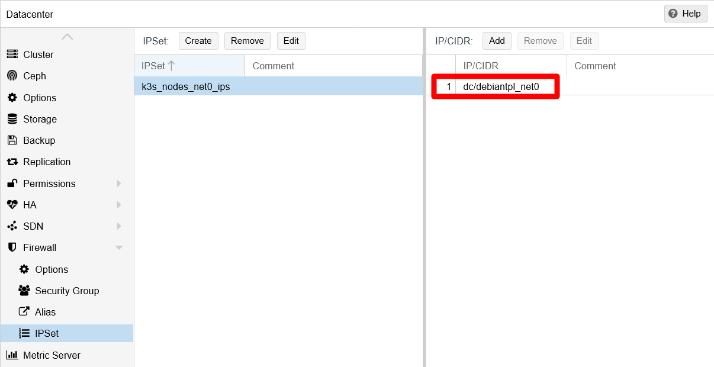

    Notice in the snapshot how Proxmox VE has added the `dc/` prefix to the IP alias added to the IP set. That prefix probably stands for the term "DataCenter", and seems to indicate the scope this alias belongs to (at the moment of writing this, there is no explanation for this prefix in the Proxmox VE documentation).

10. Next step is to create a `Security Group`. A security group is just a way of grouping together firewall rules, making it easier to handle them later. So, go to `Datacenter > Firewall > Security Group` in your PVE web console. Then, click on `Create`:

    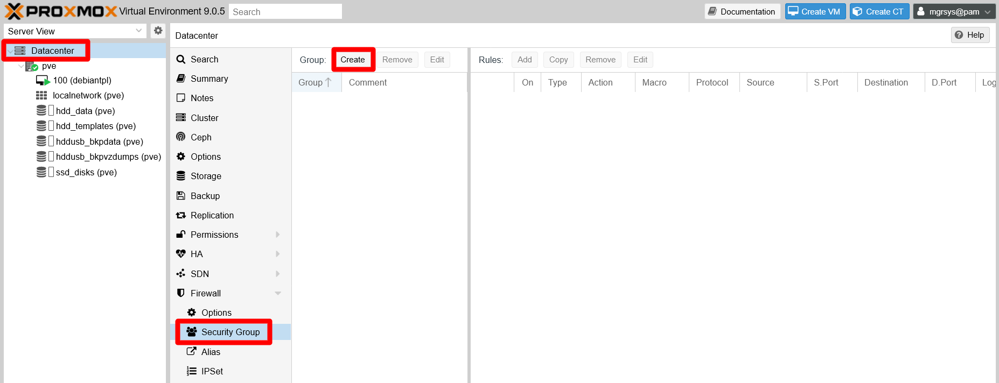

11. A simple form raises for creating a security group:

    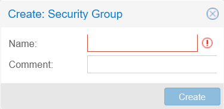

    This group will hold the firewall rules related to the NUT port, so give it a meaningful `Name` like `nut_port_accept_in`:

    > [!WARNING]
    > **Careful with the `Name` field in this form**\
    > Like the IP alias `Name` field from before, the `Name` field here can only use alphanumerical English characters plus the `_` symbol.

    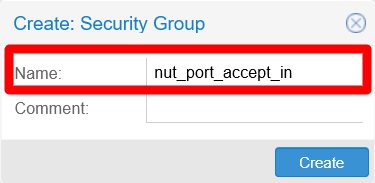

12. Click on the `Create` button, and see how your new security group appears on the left half of the `Security Group` page. Then, select the new group and click on `Add` on the right half:

    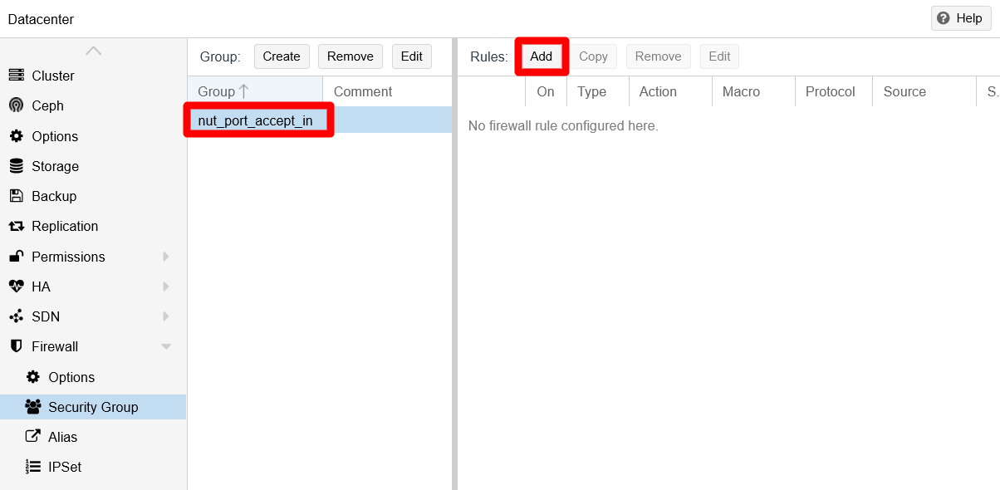

13. In the editor that appears, define a firewall rule to allow access to the NUT `3493` port from the IP set you defined a few steps before:

    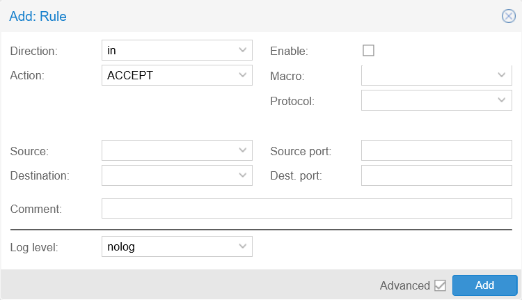

    Here is the explanation for each field:

    - `Direction`\
      This field only offers two options, either the rule is about `IN`coming or `OUT`going connections. Choose `in` to allow incoming connections to the NUT server.

    - `Action`\
      There are three options available here, `ACCEPT`, `DROP` or `REJECT`  the connection. In this case, choose `ACCEPT`.

      > [!NOTE]
      > **Difference between the `DROP` and `REJECT` actions**\
      > The difference between `DROP` and `REJECT` is that `DROP` rejects connections silently, whereas `REJECT` makes the firewall answer with a rejection code. For stopping connection attempts, always use `DROP` unless you really need to make the rejection noticeable.

    - `Enable`\
      As its name implies, ticking this option enables the rule. Leave it off for now.

    - `Macro`\
      This is a list of services known by Proxmox VE. If you choose one, some fields of this rule editor get filled automatically. Leave it empty, since it does not have an option for NUT.

    - `Protocol`\
      This a list of known net protocols, from which you have to choose the right one. For NUT, choose `tcp`.

    - `Source`\
      Indicates the IP where the connection comes from. Be mindful that, depending on the value of the `Direction` field, `Source` can refer to an external origin (an INcoming connection) or to your own system (an OUTgoing connection). This field also offers a list of IP sets and IP aliases, so you just have to click on which one you want rather than typing IPs on the field.

        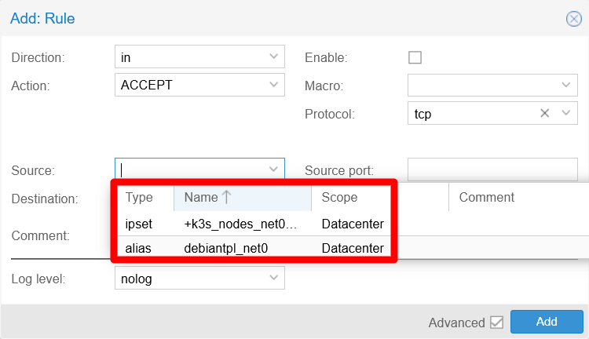

        For the NUT rule, choose the IP set you defined before, the `k3s_nodes_net0_ips`. This way, any other IP you put into that IP set gets covered by this firewall rule.

    - `Source port`\
      Which port on the source can the connection come from. Leave it empty for accepting any port.

    - `Destination`\
      Is the IP the incoming or outgoing connection wants to reach. This field is of the same kind as `Source`. For the NUT rule, leave it empty for now (unless you have already defined an alias or IP set for your PVE node's IPs).

    - `Dest. port`\
      Port in which the connection wants to connect. Specify the NUT port here: `3493` (or the one you have set in your NUT configuration).

    - `Comment`\
      Any meaningful string you might like to put here.

    - `Log level`\
      This is the only `Advanced` option available in this form. If you want the rule to log the connections that go through it, change the default `nolog` value to any other that suits the severity of the event. For NUT, it should not be more than `info`, usually.

    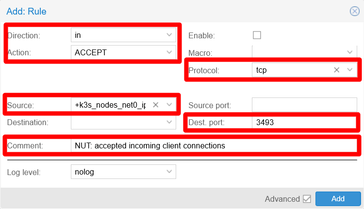

14. Click on `Add`, and see the updated `Rules` list of your security group on the right side of the page:

    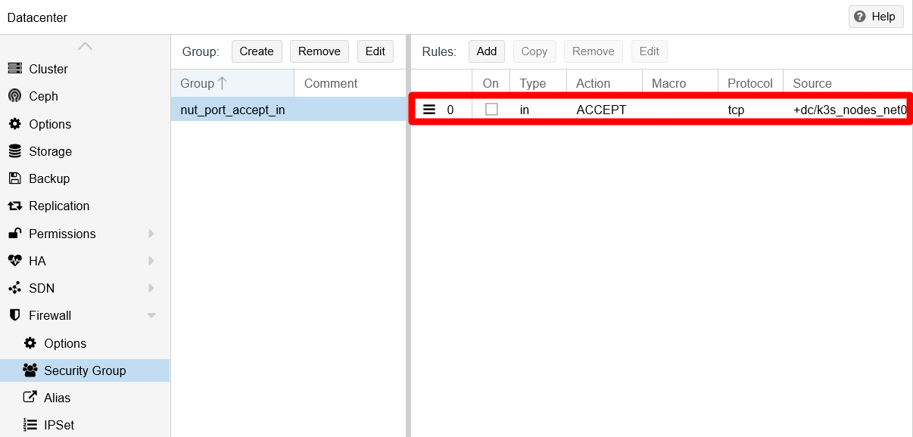

    Notice that the rule is NOT active, since the checkbox on the `On` column is NOT ticked. Leave it that way for now.

15. Go to your PVE node, and browse to the now ruleless `Firewall` section and click on `Insert: Security Group`:

    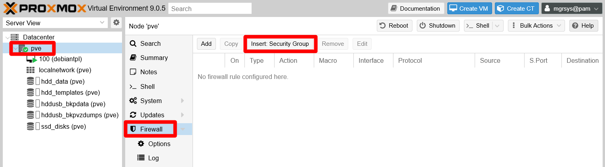

16. A form raises where you can declare a firewall rule that applies a security group:

    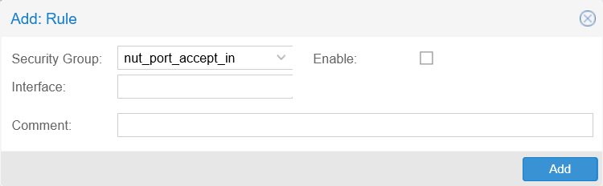

    Here is a brief explanation for each field:

    - `Security Group`\
      In this field you must choose a preexisting security group defined at the `Datacenter` level. In this case, you only have the one you have created before, `nut_port_accept_in`.

    - `Interface`\
      This field **only admits the name** (not IPs or MACs) of an existing node network interface, or just being left empty. In this case you need to enter the name of the `vmbr0` bridge, since it is the network device through which your Proxmox VE host communicates.

    - `Enable`\
      Tick this checkbox on to enable the rule on the firewall.

    - `Comment`\
      Any meaninful string you may want to put here, like a brief explanation of what the rule does.

    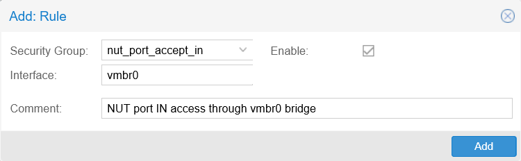

17. Click on `Add` and the new rule gets listed immediately in your `pve` node's firewall:

    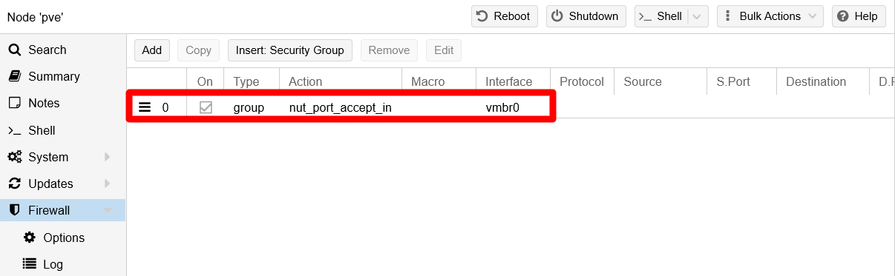

## Configuring the NUT client on your Debian VM

The previous section has been all about configuring the server side of your NUT setup. Now you have deal with the client side of it in your Debian VM. Remember that, in your VM, you only installed the `nut-client` package of NUT, since you do not need the server components for just monitoring the system's UPS unit:

1. Open a shell in your Debian VM as `mgrsys`, then `cd` to `/etc/nut` and make a backup of the `nut.conf` file:

    ~~~sh
    $ cd /etc/nut/ ; sudo cp nut.conf nut.conf.orig
    ~~~

2. Edit the `nut.conf` file and just change the value of the `MODE` parameter to `netclient`:

    ~~~properties
    MODE=netclient
    ~~~

3. Save the changes to `nut.conf`, then make a backup of the `upsmon.conf` file:

    ~~~sh
    $ sudo cp upsmon.conf upsmon.conf.orig
    ~~~

4. Edit `upsmon.conf` as follows:

    - Search for and comment out the active lines of the `RBWARNTIME` and `SHUTDOWNCMD` parameters:

      ~~~properties
      # --------------------------------------------------------------------------
      # RBWARNTIME - replace battery warning time in seconds
      #
      # upsmon will normally warn you about a battery that needs to be replaced
      # every 43200 seconds, which is 12 hours.  It does this by triggering a
      # NOTIFY_REPLBATT which is then handled by the usual notify structure
      # you've defined above.
      #
      # If this number is not to your liking, override it here.

      #RBWARNTIME 43200
      ~~~

      ~~~properties
      # --------------------------------------------------------------------------
      # SHUTDOWNCMD "<command>"
      #
      # upsmon runs this command when the system needs to be brought down.
      #
      # This should work just about everywhere ... if it doesn't, well, change it,
      # perhaps to a more complicated custom script.
      #
      # Note that while you experiment with the initial setup and want to test how
      # your configuration reacts to power state changes and ultimately when power
      # is reported to go critical, but do not want your system to actually turn
      # off, consider setting the SHUTDOWNCMD temporarily to do something benign -
      # such as posting a message with 'logger' or 'wall' or 'mailx'. Do be careful
      # to plug the UPS back into the wall in a timely fashion.
      #
      # For Windows setup use something like:
      # SHUTDOWNCMD "C:\\WINDOWS\\system32\\shutdown.exe -s -t 0"
      # If you have command line using space character you have to add double quote to them, like this:
      # SHUTDOWNCMD "\"C:\\Program Files\\some command.bat\" -first_arg -second_arg"
      # Or use the old DOS 8.3 file name, like this:
      # SHUTDOWNCMD "C:\\PROGRA~1\\SOMECO~1.bat -first_arg -second_arg"

      #SHUTDOWNCMD "/sbin/shutdown -h +0"
      ~~~

    - Append the following lines to the `upsmon.conf` file:

      ~~~properties
      # --------------------------------------------------------------------------
      # Customized settings

      MONITOR eaton@10.1.0.1 1 upsmonclient s3c4R3_Kly3Nt_p4sSw0rD! secondary
      SHUTDOWNCMD "logger -t upsmon.conf \"SHUTDOWNCMD calling /sbin/shutdown to shut down system\" ; /sbin/shutdown -h +0"
      NOTIFYCMD /usr/sbin/upssched

      NOTIFYMSG ONLINE "UPS %s: On line power."
      NOTIFYMSG ONBATT "UPS %s: On battery."
      NOTIFYMSG LOWBATT "UPS %s: Battery is low."
      NOTIFYMSG REPLBATT "UPS %s: Battery needs to be replaced."
      NOTIFYMSG FSD "UPS %s: Forced shutdown in progress."
      NOTIFYMSG SHUTDOWN "Auto logout and shutdown proceeding."
      NOTIFYMSG COMMOK "UPS %s: Communications (re-)established."
      NOTIFYMSG COMMBAD "UPS %s: Communications lost."
      NOTIFYMSG NOCOMM "UPS %s: Not available."
      NOTIFYMSG NOPARENT "upsmon parent dead, shutdown impossible."

      NOTIFYFLAG ONLINE SYSLOG+EXEC
      NOTIFYFLAG ONBATT SYSLOG+EXEC
      NOTIFYFLAG LOWBATT SYSLOG+EXEC
      NOTIFYFLAG REPLBATT SYSLOG
      NOTIFYFLAG FSD SYSLOG
      NOTIFYFLAG SHUTDOWN SYSLOG
      NOTIFYFLAG COMMOK SYSLOG
      NOTIFYFLAG COMMBAD SYSLOG
      NOTIFYFLAG NOCOMM SYSLOG
      NOTIFYFLAG NOPARENT SYSLOG

      RBWARNTIME 7200 # 2 hours
      ~~~

      The configuration above is mostly the same as the one you have in the `upsmon.conf` of your Proxmox VE node, save the MONITOR line which defines to what UPS unit to connect and with what user. In that MONITOR line you must set the client user you have defined, previously in this chapter, as an unprivileged NUT secondary user in your PVE host's `upsd.users` file. This is much safer than using the fully-privileged administrator user just for monitoring your UPS unit from a VM.

      Also see how an IP refers to the UPS unit to monitor, this IP is the NUT server IP. Instead of an IP you could also use the NUT server's `hostname`, but only if your network is able to resolve it to the right IP.

5. Save the `upsmon.conf` file, then rename the `upssched.conf` file to `upssched.conf.orig`, and create a new empty `upssched.conf` file:

    ~~~sh
    $ sudo mv upssched.conf upssched.conf.orig
    $ sudo touch upssched.conf ; sudo chmod 640 upssched.conf ; sudo chgrp nut upssched.conf
    ~~~

6. Edit the `upssched.conf` adding the following lines:

    ~~~properties
    # upssched.conf
    CMDSCRIPT /usr/sbin/upssched-cmd
    PIPEFN /var/run/nut/upssched.pipe
    LOCKFN /var/run/nut/upssched.lock

    AT ONLINE eaton@10.1.0.1 EXECUTE online
    AT ONBATT eaton@10.1.0.1 EXECUTE onbatt
    AT LOWBATT eaton@10.1.0.1 EXECUTE lowbatt
    ~~~

    Like with the previous configuration file, here you can see that this file is almost the same `upssched.conf` file as the one set up previously in your Proxmox VE host. The only difference here is in the `AT` declarations, where there was a call to the `localhost` now you must put the NUT server IP or its `hostname`.

7. Save the `upssched.conf` file. Then create an empty `/usr/sbin/upssched-cmd` file with the right permissions:

    ~~~sh
    $ sudo touch /usr/sbin/upssched-cmd ; sudo chmod 755 /usr/sbin/upssched-cmd
    ~~~

8. Edit the new `/usr/sbin/upssched-cmd` so it has the following shell script code:

    ~~~sh
    #!/bin/bash -u
    # upssched-cmd
    logger -i -t upssched-cmd Calling upssched-cmd $1

    UPS="eaton@10.1.0.1"
    STATUS=$( upsc $UPS ups.status )
    CHARGE=$( upsc $UPS battery.charge )
    CHMSG="[$STATUS]:$CHARGE%"

    case $1 in
        online) MSG="$UPS, $CHMSG - INFO - Power supply is back online." ;;
        onbatt) MSG="$UPS, $CHMSG - WARNING - Power failure. Now running on battery!" ;;
        lowbatt) MSG="$UPS, $CHMSG - WARNING - Low battery. Shutdown now!" ;;
        *) logger -i -t upssched-cmd "ERROR - Bad argument: \"$1\", $CHMSG" 
            exit 1 ;;
    esac

    logger -i -t upssched-cmd $MSG
    notify-send-all "$MSG"
    ~~~

    This script is essentially the same one you already configured in your PVE host. The only thing that changes is the `UPS` variable, which now also needs the IP of the NUT server specified.

9. Save the `upssched-cmd` file and start the NUT related services already running in your VM:

    ~~~sh
    $ sudo systemctl restart nut-client.service nut-monitor.service 
    ~~~

## Checking the connection between the VM NUT client and the PVE node NUT server

You have everything configured. It is time to test the NUT connection between your Debian VM and the Proxmox VE node. To do this, execute the `upsc` command on your VM as follows:

~~~sh
$ sudo upsc eaton@10.1.0.1
~~~

And this command should return the following output:

~~~sh
Error: Connection failure: Connection timed out
~~~

Yes, there is a problem with the connection. You can also see this error in repeated logs written in the journal of your VM. To see those entries and many other that you cannot see as a regular user, you must open the journal as `root` or, better, use `sudo` when being `mgrsys`:

~~~sh
$ sudo journalctl
~~~

This is the only way you will be able to see all the logs being registered in the journal of your VM (and this is also true for your Proxmox VE server). In particular, for this NUT connectivity issue, look for lines like this one:

~~~log
Sep 05 20:01:46 debiantpl nut-monitor[903]: UPS [eaton@10.1.0.1]: connect failed: Connection failure: Connection timed out
~~~

The NUT monitor daemon on your VM tries to connect every few seconds to the NUT server on your PVE node, but something is wrong and the connection times out. What is missing? Just a small detail affecting the security group you created in the firewall at the `Datacenter` level of your Proxmox VE platform.

Go back to your PVE web console, browse to `Datacenter > Firewall > Security Group` and select the group you created there before, the `nut_port_accept_in` one:

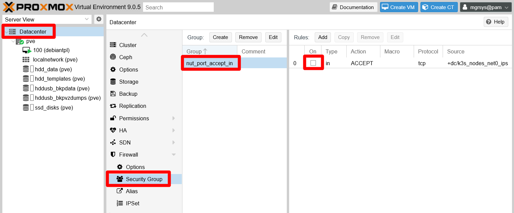

You only declared one rule in the security group, and you were told to leave it disabled. This way, you have seen a bit of how the relationship between levels within Proxmox VE works regarding firewall rules. Remember that, at your `pve` node tier, you have created and enabled a firewall rule that used the security group itself. But only the rules **enabled within the security group** will be also enforced by the firewall. So, to enable access to the NUT port in your PVE host, you must also activate the rule you prepared exactly for it. To do so, just click on the checkbox the rule has at the `On` column:

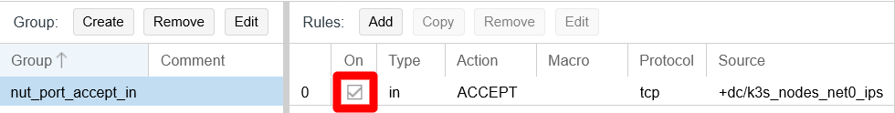

The firewall enforces the rule right away. You can check if now you can communicate with the NUT server from your VM:

~~~sh
$ sudo upsc eaton@10.1.0.1
Init SSL without certificate database
battery.charge: 100
battery.charge.low: 80
battery.runtime: 3360
battery.type: PbAc
device.mfr: EATON
device.model: Eaton 3S 700
device.serial: Blank
device.type: ups
...
ups.vendorid: 0463
~~~

Now you should get a proper answer from the NUT server, in this case information about your UPS unit. On the other hand, and maybe a few seconds after you enabled the rule in the firewall, in the journal of your VM you should see the following line once:

~~~log
Sep 05 20:19:26 debiantpl nut-monitor[903]: UPS eaton@10.1.0.1: Communications (re-)established.
~~~

The NUT monitor in your VM now is properly connected to the NUT server in your PVE node. On the other hand, in the journal (opened with `sudo`) of your PVE host you should also find an output like this:

~~~log
Sep 05 20:19:26 pve nut-server[1617]: User upsmonclient@10.4.0.1 logged into UPS [eaton]
~~~

This log verifies the NUT client connection on the server side. Mind that, on the server side, you will not get logs about the connection failures. Those happened due to the firewall blocking all possible incoming connections from NUT clients, so they are only seen by the clients.

As a final note on this matter, browse in your PVE web console to the `Datacenter > Firewall`:

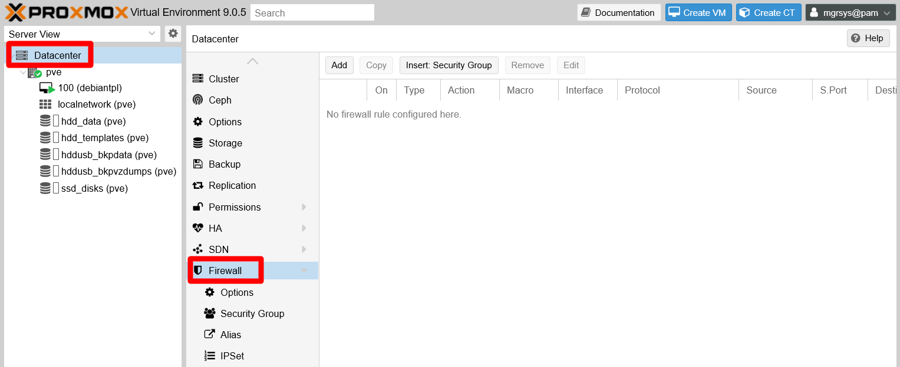

As you can see in this page, there are no visible rules whatsoever. This may look strange since you created the security group at the `Datacenter` tier, and do not forget the rules enabled in the `iptables` running underneath, but those are not show here either.

How could be this explained is that, from the firewall point of view, the datacenter and node levels are the same logical network "host" zone, although each level have their own firewall configuration page (with different options available, mind you). Just be aware of this particularity of Proxmox VE whenever you have to deal with its firewall.

## Testing a Forced ShutDown sequence (`FSD`) with NUT

To test if your whole NUT setup works as expected, you can provoke a Forced ShutDown (`FSD`) event with just one NUT command. But first you must understand what is going to happen after provoking the `FSD` event.

### FSD event shutdown sequence

1. The `upsmon` `primary` daemon, running in your Proxmox VE host, notices and sets `FSD` (the _forced shutdown_ flag) to tell all `secondary` systems that it will soon power down the load:

2. The `upsmon` `secondary` daemon in your VM sees the `FSD` event and:

    1. Generates a `NOTIFY_SHUTDOWN` event.
    2. Waits `FINALDELAY` seconds, by default 5.
    3. Calls its shutdown command specified by `SHUTDOWNCMD`.
    4. Disconnects from `upsd`.

3. The `upsmon` `primary` daemon waits up to `HOSTSYNC` seconds (by default 15) for the `secondary` systems to disconnect from `upsd`. If any are connected after this time, `upsmon` stops waiting and proceeds with the shutdown process.

4. The `upsmon` `primary`:

    1. Generates a `NOTIFY_SHUTDOWN` event.
    2. Waits `FINALDELAY` seconds, by default 5.
    3. Creates the `POWERDOWNFLAG` file, by default `/etc/killpower`.
    4. Calls its shutdown command specified by `SHUTDOWNCMD`.

5. On most systems, `init` takes over, kills your processes, syncs and unmounts some filesystems, and remounts some read-only.

6. The `init` process then runs your shutdown script. This checks for the `POWERDOWNFLAG`, finds it, and tells the UPS driver(s) to power off the load (your UPS unit).

7. The system, your Proxmox VE host, loses power.

8. Time passes. The power returns, and your UPS unit switches back on.

There are a few takeaways to consider from this sequence.

- **Timing is crucial**\
  You need to leave enough time for your client (`secondary` for NUT) systems, like your Debian VM, to shutdown properly. At this point, you only have one VM that does nothing but keeping itself running, so it can shutdown in a few seconds. Something else will be when, in later chapters, you build a Kubernetes cluster with two quite service-loaded VMs. You need to adjust the value of the `HOSTSYNC` parameter (declared in the `/etc/nut/upsmon.conf` file), both in the `primary` NUT server and in the `secondary` systems, to suit it to the longest period of time required to shutdown safely your VMs, while also keeping in mind the limitations of the battery on your UPS unit. Thus, you need to test your whole system to measure how much time does your setup requires to shutdown safely.

- **Use of the SHUTDOWNCMD and NOTIFYCMD parameters**\
  You can prepare shell scripts able to do certain actions, like stopping services in a certain order, and then set them in the `SHUTDOWNCMD` or the `NOTIFYCMD` parameter (both declared in the `/etc/nut/upsmon.conf` file). This is exactly what you have seen previously in this chapter, when you created the `/usr/sbin/upssched-cmd` script and set it in the NOTIFYCMD parameter. In fact, you could just improve the `upssched-cmd` script and associate it with more events.

- **The UPS unit will restart**\
  With this `FSD` sequence, the last thing the UPS unit will do is restart. Bear this in mind if you have other unrelated devices plugged in the same UPS unit.

### Executing the FSD test

1. First, as `mgrsys`, open a shell terminal on your Proxmox VE host. Then, execute the following `upsmon` command:

    ~~~sh
    $ sudo upsmon -c fsd
    ~~~

    This command only prints the name and version of the upsmon service:

    ~~~sh
    Network UPS Tools upsmon 2.8.1
    ~~~

2. You lose connection to the Debian VM first, then from the Proxmox VE system.

3. Your UPS unit may react in some way when it reboots, like with blinking leds or by doing some internal (audible) switching.

4. Switch your Proxmox VE server back on, and then also your VM.

5. Open a shell terminal to each system. Then, open the journal on both terminals:

    ~~~sh
    $ sudo journalctl
    ~~~

6. **In the Proxmox VE system journal**, look for log lines like these:

    ~~~log
    ...
    Sep 05 20:38:13 pve nut-monitor[1623]: Signal 10: User requested FSD
    Sep 05 20:38:13 pve nut-server[1617]: Client upsmon@127.0.0.1 set FSD on UPS [eaton]
    Sep 05 20:38:13 pve upsd[1617]: Client upsmon@127.0.0.1 set FSD on UPS [eaton]
    ...
    Sep 05 20:38:21 pve nut-monitor[1623]: Executing automatic power-fail shutdown
    Sep 05 20:38:21 pve nut-monitor[1623]: Auto logout and shutdown proceeding.
    Sep 05 20:38:21 pve nut-monitor[32897]: Network UPS Tools upsmon 2.8.1
    ...
    ~~~

    Those lines mark the beginning of the `FSD` sequence in the Proxmox VE host. Some seconds later, you should encounter this other line:

    ~~~sh
    Sep 05 20:38:26 pve upsmon.conf[32964]: SHUTDOWNCMD calling /sbin/shutdown to shut down system
    ~~~

    That line indicates when the shutdown begins in the Proxmox VE server. Around it you can also see the logs of VMs and services being stopped, storages being unmounted and so on.

7. **In your Debian VM journal**, search for log lines like these:

    ~~~sh
    Sep 05 20:38:16 debiantpl nut-monitor[903]: UPS eaton@10.1.0.1: Forced shutdown in progress.
    Sep 05 20:38:16 debiantpl nut-monitor[903]: Executing automatic power-fail shutdown
    Sep 05 20:38:16 debiantpl nut-monitor[1085]: Network UPS Tools upsmon 2.8.1
    Sep 05 20:38:16 debiantpl nut-monitor[903]: Auto logout and shutdown proceeding.
    Sep 05 20:38:16 debiantpl nut-monitor[1088]: Network UPS Tools upsmon 2.8.1
    ~~~

    That is the beginning of the `FSD` sequence on the VM. Not far below it, you should get across this other line:

    ~~~sh
    Sep 05 20:38:21 debiantpl upsmon.conf[1090]: SHUTDOWNCMD calling /sbin/shutdown to shut down system
    ~~~

    It is exactly like in the Proxmox VE server, and also indicates that the shutdown process of the Debian VM truly starts at this point.

With this test, you can check out the validity of your NUT configuration and your associated shell scripts. Also, you may consider using this mechanism to shut down your whole system (VMs included) with just one command. Rather than using this command, be aware that Proxmox VE also comes with more convenient features regarding the automatic starting and stopping of its VMs.

## Relevant system paths

### Directories on Debian VM

- `/etc/nut`
- `/usr/sbin`
- `/var/log`
- `/var/run/nut`

### Files on Debian VM

- `/etc/nut/nut.conf`
- `/etc/nut/nut.conf.orig`
- `/etc/nut/upsmon.conf`
- `/etc/nut/upsmon.conf.orig`
- `/etc/nut/upssched.conf`
- `/etc/nut/upssched.conf.orig`
- `/usr/sbin/upssched`
- `/usr/sbin/upssched-cmd`
- `/var/log/syslog`
- `/var/run/nut/upssched.pipe`
- `/var/run/nut/upssched.lock`

### Directories on Proxmox VE host

- `/etc/nut`
- `/usr/sbin`
- `/var/log`
- `/var/run/nut`

### Files on Proxmox VE host

- `/etc/nut/nut.conf`
- `/etc/nut/nut.conf.bkp`
- `/etc/nut/ups.conf`
- `/etc/nut/ups.conf.bkp`
- `/etc/nut/upsd.conf`
- `/etc/nut/upsd.conf.bkp`
- `/etc/nut/upsd.users`
- `/etc/nut/upsd.users.bkp`
- `/etc/nut/upsmon.conf`
- `/etc/nut/upsmon.conf.bkp`
- `/etc/nut/upssched.conf`
- `/etc/nut/upssched.conf.orig`
- `/usr/sbin/upssched`
- `/usr/sbin/upssched-cmd`
- `/var/log/syslog`
- `/var/run/nut/upssched.pipe`
- `/var/run/nut/upssched.lock`

## References

### [Network UPS Tools (NUT)](https://networkupstools.org/)

- [NUT User manual](https://networkupstools.org/docs/user-manual.chunked/index.html)
  - [Shutdown design](https://networkupstools.org/docs/user-manual.chunked/ar01s06.html#Shutdown_design)
  - [Testing shutdowns](https://networkupstools.org/docs/user-manual.chunked/ar01s06.html#Testing_shutdowns)

- [GitHub. Network UPS Tools project](https://github.com/networkupstools)
  - [NUT Config Examples book. Version 3.0, with corrections up to 2023-03-19](https://github.com/networkupstools/ConfigExamples/releases/tag/book-3.0-20230319-nut-2.8.0)

### Other contents about NUT

- [rogerprice.org. Network UPS Tools (NUT). Configuration Examples](http://rogerprice.org/NUT/)
- [ichasco. Instalar y configurar NUT por SNMP](https://blog.ichasco.com/instalar-y-configurar-nut-por-snmp/) (in Spanish)
- [Random Bits. Monitoring a UPS with nut on Debian or Ubuntu Linux](https://blog.shadypixel.com/monitoring-a-ups-with-nut-on-debian-or-ubuntu-linux/)
- [ServerFault. Can't get upsmon service started to monitor (and respond to) remote UPS](https://serverfault.com/questions/865147/cant-get-upsmon-service-started-to-monitor-and-respond-to-remote-ups)
- [mn3m. Configure UPS monitor using NUT on Debian](https://mn3m.info/posts/configure-ups-monitor-using-nut-on-debian/)
- [DIYblindGuy.com. HOWTO: Configure A UPS on Proxmox 5.x](https://diyblindguy.com/howto-configure-ups-on-proxmox/)
- [Reddit. Homelab. UPS Server on Raspberry Pi](https://www.reddit.com/r/homelab/comments/5ssb5h/ups_server_on_raspberry_pi/)
- [Stuart's Notes. Configuring NUT for the Eaton 3S UPS on Ubuntu Linux](https://srackham.wordpress.com/2013/02/27/configuring-nut-for-the-eaton-3s-ups-on-ubuntu-linux/)

### About UPS units

- [The Linux Documentation Project. UPS HowTo](https://tldp.org/HOWTO/UPS-HOWTO/)

### [Proxmox VE](https://pve.proxmox.com/)

- [Proxmox VE Administrator guide](https://pve.proxmox.com/pve-docs/pve-admin-guide.html)
  - [Proxmox VE Firewall](https://pve.proxmox.com/pve-docs/pve-admin-guide.html#chapter_pve_firewall)

## Navigation

[<< Previous (**G021. K3s cluster setup 04**)](G021%20-%20K3s%20cluster%20setup%2004%20~%20Debian%20VM%20configuration.md) | [+Table Of Contents+](G000%20-%20Table%20Of%20Contents.md) | [Next (**G023. K3s cluster setup 06**) >>](G023%20-%20K3s%20cluster%20setup%2006%20~%20Debian%20VM%20template%20and%20backup.md)
