# G023 - K3s cluster setup 06 ~ Debian VM template and backup

- [Turn your Debian VM into a VM template](#turn-your-debian-vm-into-a-vm-template)
- [Steps for transforming your Debian VM into a VM template](#steps-for-transforming-your-debian-vm-into-a-vm-template)
- [VM template's backup](#vm-templates-backup)
  - [Creating the backup of the VM template](#creating-the-backup-of-the-vm-template)
  - [Restoring the VM template's backup](#restoring-the-vm-templates-backup)
  - [Considerations about backups](#considerations-about-backups)
- [Other considerations regarding VM templates](#other-considerations-regarding-vm-templates)
- [References](#references)
  - [Proxmox](#proxmox)
  - [Other contents related to backups in Proxmox VE](#other-contents-related-to-backups-in-proxmox-ve)
  - [Markdown](#markdown)
- [Navigation](#navigation)

## Turn your Debian VM into a VM template

With your first Debian VM configured, you can turn it into a VM template. This way, you will be able to create new Debian VMs much faster just by cloning this template.

## Steps for transforming your Debian VM into a VM template

To do this conversion, browse into your Proxmox VE web console and follow the steps below:

1. First, yo must stop your VM by clicking on its `Shutdown` button:

    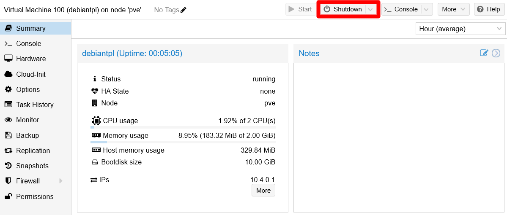

    You have to confirm the `Shutdown` action:

    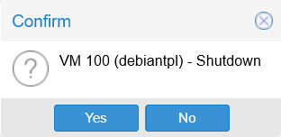

    It should not take more than a few seconds for your VM to shut down:

    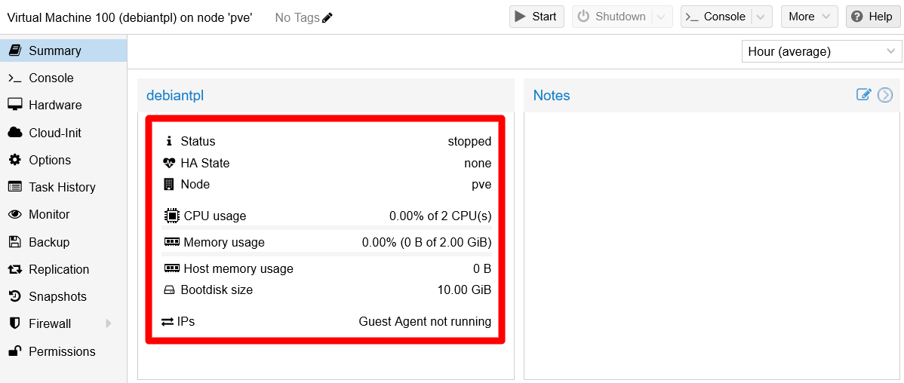

    The VM's `Status` changes to `stopped`. Other indicators like CPU and memory usage fall to 0.

2. Click on the `More` button and choose the `Convert to template` option:

    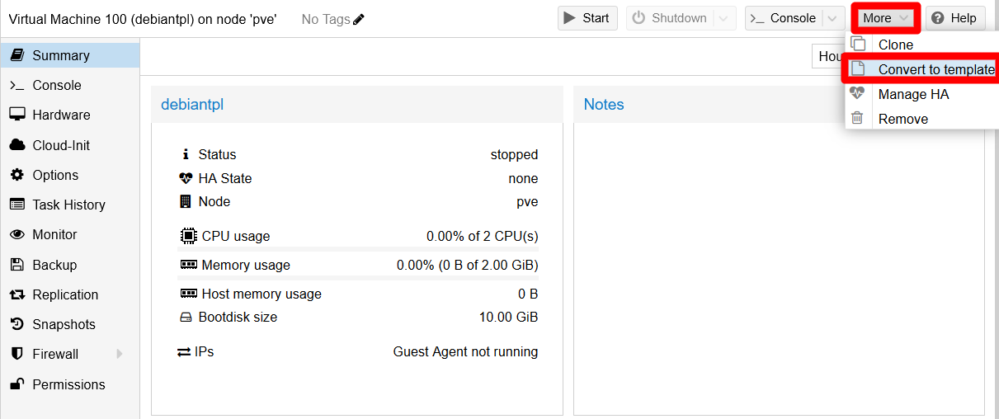

3. The web console requests your confirmation to carry on the conversion:

    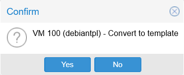

4. Just click on `Yes`, and Proxmox VE turns the VM into a template in a few seconds. When the task is finished, the VM's `Summary` page changes automatically into this:

    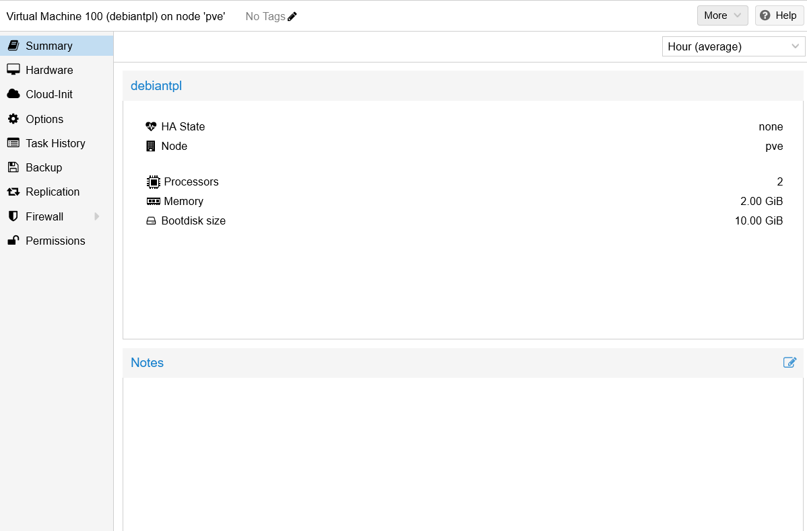

    See that the `Summary` no longer shows the VM's status or the usage statistics. Also notice that some tabs are no longer available under the `Summary` one such as `Console`, `Monitor` or `Snapshot`. Also, the `Start`, `Shutdown` and `Console` buttons that used to be at the VM page's top are not there either. This is because **VM templates cannot be started**. VM templates are just like **read-only molds** you can clone to create new VMs. Another minor detail that has changed is the icon the VM has in the tree shown at the web console's left.

5. It is better to leave a proper description of the template in the `Notes` text block available in its `Summary` view:

    - Click on the `Notes`' gear icon:

      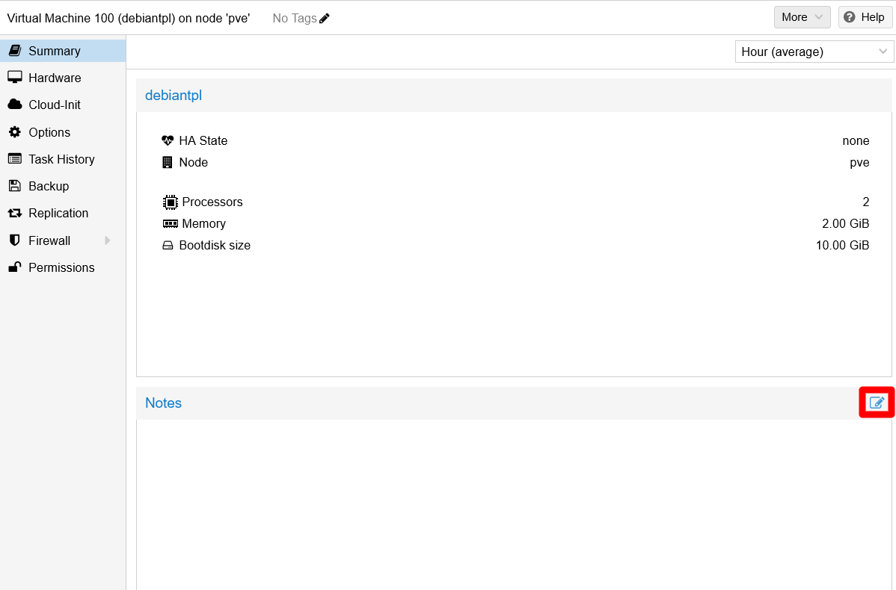

    - You will get an editor window where you can type anything you want, and even use **Markdown** syntax:

      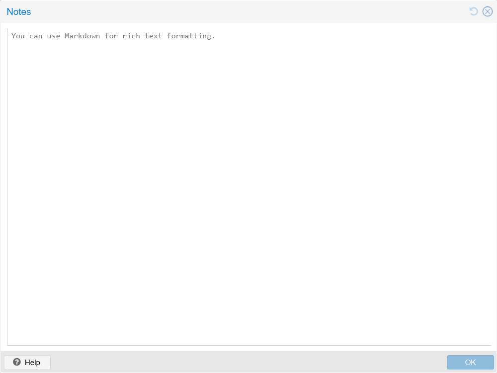

    - For instance, you could type something like the following there:

      > [!NOTE]
      > **The text snippet below is formatted in Markdown**\
      > If you use it as a template for your notes, be mindful of, among other things, the `\` character used at the end of each line. Double spacing and `\` in Markdown [forces a hard line break](https://spec.commonmark.org/0.31.2/#hard-line-breaks), equivalent to a ` ` tag in html.

      ~~~markdown
      # Debian VM TEMPLATE
      VM created: 2025-09-06\
      OS: Debian 13 "trixie"\
      Root login disabled: yes\
      Sysctl configuration: yes\
      Transparent hugepages disabled: yes\
      SSH access: yes\
      Key-pair for SSH access: yes\
      TFA enabled: yes\
      QEMU guest agent working: yes\
      Fail2Ban working: yes\
      NUT (UPS) client working: yes\
      Utilities apt packages installed: yes
      ~~~

      As you can see, you can use it as a reminder of what is inside your VM template.

    - When you have the text ready, just click on `OK` and the `Notes` block will be updated in the `Summary` view:

      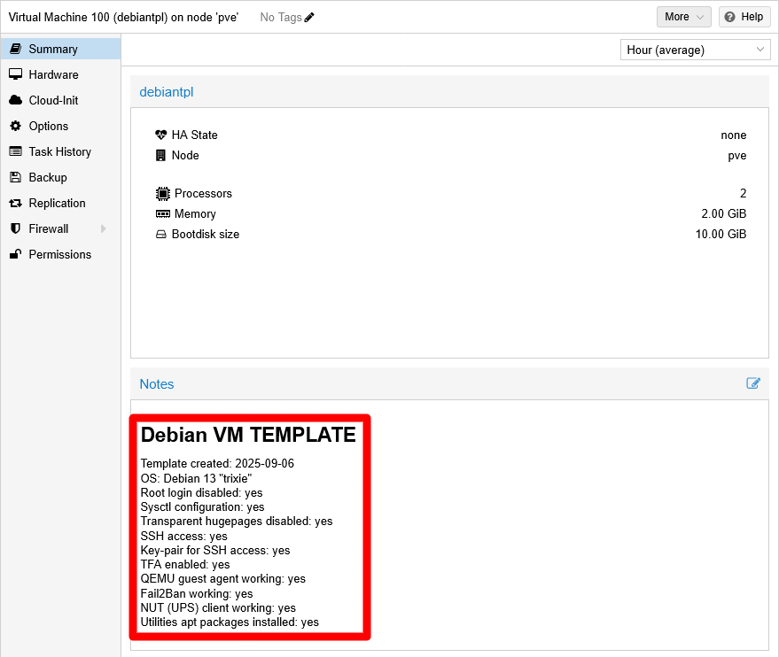

## VM template's backup

It is convenient to have a backup of your VM template, just in case anything happens. For VMs and containers, the kind of backup you can do in Proxmox VE is a **vzdump**. These dumps have to be saved in a storage configured for it but, since you already configured a specific Proxmox VE directory for that (in the external USB storage drive) in the [chapter **G019**](G019%20-%20K3s%20cluster%20setup%2002%20~%20Storage%20setup.md#setting-up-the-directories), now you just have to worry about doing the backup itself.

### Creating the backup of the VM template

1. In the Proxmox VE web console, browse to the `Backup` view of your Debian VM template:

    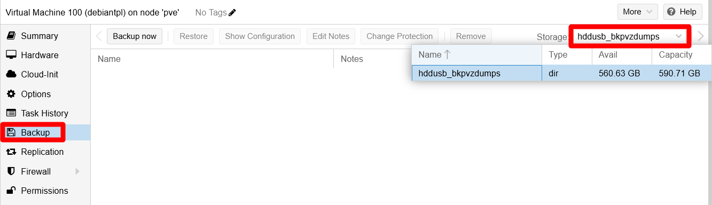

    At this point, you find this view empty of backups. The two main things you must notice here are the `Backup now` button and the `Storage` unfoldable list on the right. There is only the `hddusb_bkpvzdumps` storage available for VM dumps, which you configured as the sole directory for holding vzdumps, back in the [chapter **G019**](G019%20-%20K3s%20cluster%20setup%2002%20~%20Storage%20setup.md#setting-up-the-directories). Now you can take advantage of it and, since its already selected as the storage of choice for VM dumps, just press on the `Backup now` button.

2. An editor window appears for creating a new backup:

    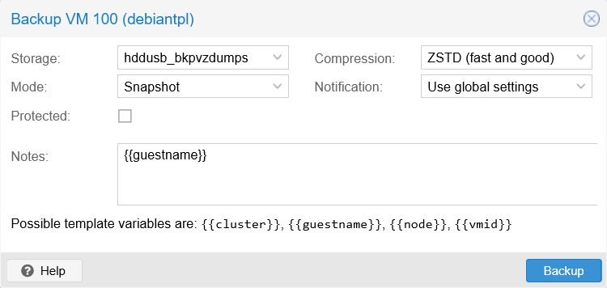

    There you have the following parameters to fill:

    - `Storage`\
      It is the same list you have available in the `Backup` view.

    - `Mode`\
      Indicates how you want to execute the backup on your VM. In case of running VMs, you have to consider if you want to execute the backup in parallel with the VM still running (`Snapshot` and `Suspend` modes, which also use the QEMU guest agent if available in the VM) or stopping it while the backup is being done (`Stop` mode). For a VM template backup, it should not matter which mode you choose, although the only one that truly makes sense to use in this case is `Stop` mode.

      > [!NOTE]
      > **The behavior of these backup modes for containers is similar but not equivalent to how they work for VMs**\
      > Check the Proxmox VE help to see the differences.

    - `Compression`\
      Offers you the possibility of compressing or not the backup of your VM or container. In a scenario with very limited storage like the one used in this guide series, it is mandatory to compress the dumps as much as possible. The default `ZSTD` option is the best option since is not only the fastest algorithm of the four options offered, but is also multi-threaded.

    - `Notification`\
      This allows you to choose how you want to notify users about this backup. The legacy method uses the `sendmail` service, while the modern method relays on certain Proxmox VE global settings not covered in this guide. The `sendmail` method may not work depending on your network and security configuration.

    - `Protected`\
      When enabled, Proxmox VE protects this backup from removal actions. This is particularly useful when using automated cleaning processes that free storage by removing old backups, but you want to preserve some specific backups.

    - `Notes`\
      Text field you can use to leave some description of the backup. Notice how you can use certain template variables that are replaced by their real value when the text is set in the backup.

    Knowing all that, you can set the configuration for the new backup like below, where the `Mode` has been changed to `Stop`:

    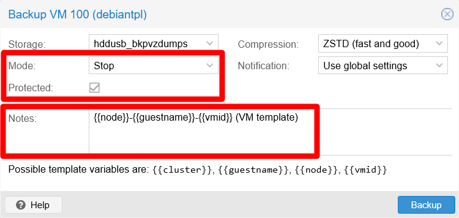

    Also notice how the backup is protected from unwanted removal actions and has a descriptive text.

3. Click on the `Backup` button and a task progress window appears:

    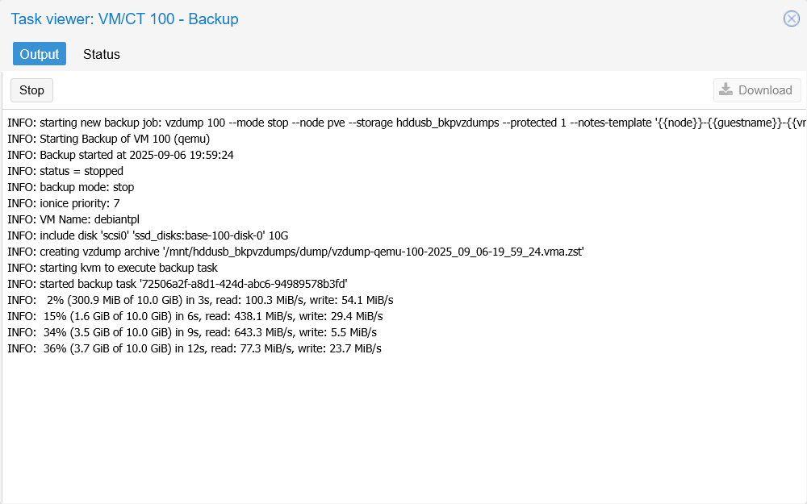

    After a short while, the `Output` prints informative log lines like these:

    ~~~log
    INFO: backup is sparse: 8.26 GiB (82%) total zero data
    INFO: transferred 10.00 GiB in 69 seconds (148.4 MiB/s)
    INFO: stopping kvm after backup task
    INFO: archive file size: 834MB
    INFO: adding notes to backup
    INFO: marking backup as protected
    INFO: Finished Backup of VM 100 (00:01:12)
    INFO: Backup finished at 2025-09-06 20:00:36
    INFO: Backup job finished successfully
    INFO: notified via target `mail-to-root`
    TASK OK
    ~~~

    This means that the dump has been done correctly.

4. Close the status window to return to the `Backup` view. There, you can see the new backup listed as a vzdump file compressed in `vma.zst` format:

    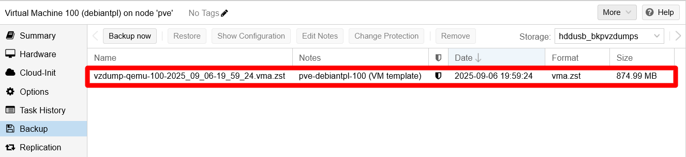

    Notice that this backup takes up to 874.99 MiB. This is a very decent compression of the 2.16 GiB taken up by the VM template's `base-100-disk-0` disk image.

### Restoring the VM template's backup

Restoring the backup of a VM or VM template is not much more complex than creating them:

1. Go back to the `Backup` view of your VM template and select the only backup you have listed there:

    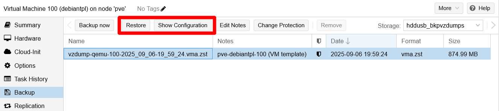

    When selecting a backup, all the buttons next to `Backup now` become active. The ones that you should pay attention to now are `Restore` and `Show Configuration`.

2. It may happen that it has been a while since you did the backup, and you do not remember what is inside of it. To help you with this, you can press on `Show Configuration`:

    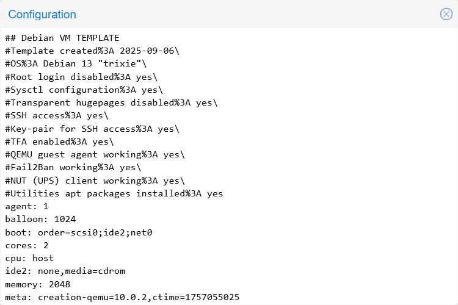

    This window shows you the configuration of the VM or VM template saved in the backup, including the notes (rendered as regular text) you may have added to the VM itself. This gives you an idea of what is going to be put back when you restore the backup.

3. Close the backup's `Configuration` window, then press on `Restore`:

    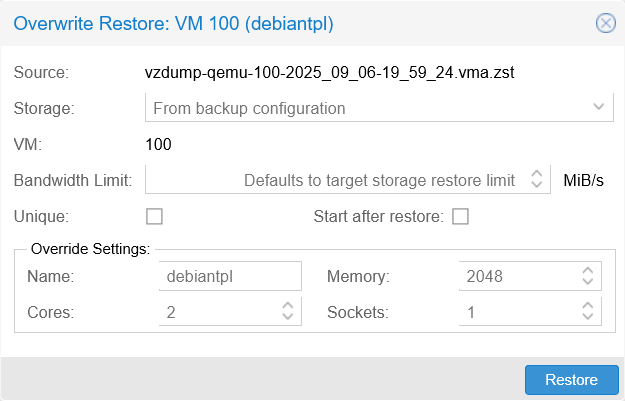

    The fields you see mean the following:

    - `Source`\
      The backup file from which you are going to restore the VM or VM template.

    - `Storage`\
      The storage where you want to restore the backup. Left by default, the backup will restore the VM hard disks in the locations indicated by the VM's configuration.

    - `VM`\
      The id of the VM you are restoring.

    - `Bandwidth Limit`\
      This parameter is to restrict the system's storage bandwidth taken up by the restoration process, and limit the impact it will have in your system performance.

    - `Unique`\
      This is a feature that generates new values to certain attributes of the restored VM, like its network interface MACs.

      > [!WARNING]
      > **Careful when using this attribute**\
      > If you happen to have some configuration that relies on the attributes that get regenerated, like a router assigning static IPs to specific MACs, the new values may not fit and could "break" your setup.

    - `Start after restore`\
      Makes the restored VM start immediately after being restore, although this feature does not work with VM templates.

    - `Override Settings`\
      This is where you can give a different name to the restored VM, plus readjust its assigned CPU and RAM capacities. Changing these particular attributes is usually not a problem for Linux-based OSes like Debian, although you must be sure that the readjusted capacities are enough for the needs of the processes that will run in the restored VM.

4. In this case the default values are fine, so press on `Restore`. The following window appears requesting you to confirm the restoration:

    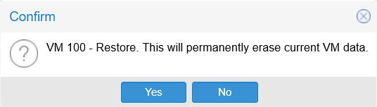

    > [!WARNING]
    > **Restoring the VM removes its existing hard disk**\
    > The restoration process **replaces the hard disk** you currently have linked to the VM template with the one stored within the backup.

5. After accepting the confirmation, the progress window of the `Restore` process appears:

    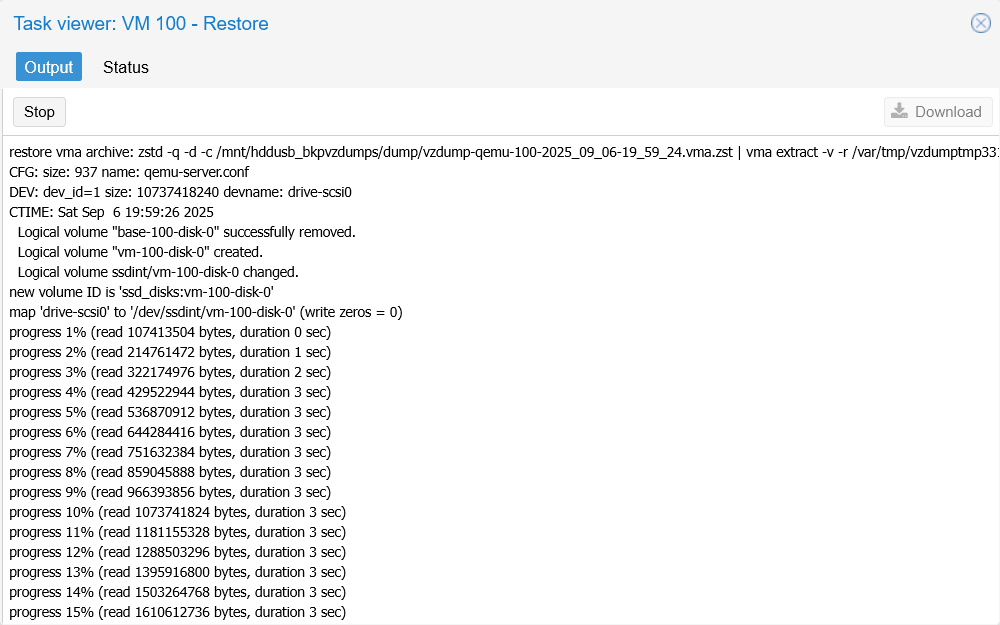

    After a while you should see in the output the `TASK OK` message, as a sign of the successful end of the process. Also, among those log entries, you may notice a line like the following:

    ~~~sh
    space reduction due to 4K zero blocks 2.83%
    ~~~

    This means that the restoration procedure has found some empty (`zero`) blocks in the backup. Due to that, the space taken up by the restored VM has been reduced by a certain percentage (`2.83%` in the example above).

### Considerations about backups

- **Different restore commands for VM and containers**\
    You can also restore commands through a shell:

  - `qmrestore`\
    VM restore utility.

  - `pct restore`\
    Container restore utility.

  Check their `man` pages to see how they work.

- **Careful with storages**\
  The hard disks attached to VMs or containers could be configured to storages that are no longer available in your system, or that have changed their names. So always check the configuration of the VM or container before you restore it, to see in which storage you can put it back.

- **Hardware setup is saved in the backup**\
  The hardware configuration of a VM that you see in the Proxmox VE web console is also stored in its backup. So, when you recover the backup of a VM, the hardware configuration will also be recovered, although the PVE web console may ask you about the differences it finds between the current VM configuration and the one stored in the backup.

  > [!NOTE]
  > This point is directly related with the previous one.

## Other considerations regarding VM templates

- **Nature of VM templates**\
  It might seem odd that, in the Proxmox VE platform, the VM templates are treated almost as normal VMs. To understand this, you have to think about VM templates just as frozen-in-time VMs. Thanks to this nature, you can clone them in Proxmox VE to create new but similar VMs much faster.

- **Proxmox VE does not compress the templates**\
  Directly related to this "frozen VM" nature, you must bear in mind that a VM template's hard disk will not be compressed or shrunk in any way by Proxmox VE. Whatever storage space was used by the VM disk image, that is exactly the space the template will still take up. The only thing that will change, as you have seen in this guide, is the write permission on the corresponding light volume and its status to inactive.

  In case you were using a `qcow2` image file, how this read-only restriction is enforced will change. Given how the storage setup has been configured already, the `qcow2` format is not covered in this guide.

- **Clone VM templates to update them**\
  Since VM templates are read-only, **you cannot modify them**. If you want to update a template, you have to clone it into a new VM, update that VM and, then, turn the updated VM into a new VM template.

- **Hardware configuration can be changed**\
  The part that really is read-only in a template is the storage drive that becomes the disk image, but the hardware setup can still be changed. If you have to do this, you must be careful that the changes do not contradict what the templated VM saved in the image knows about its hardware.

  For instance, changing the number of vCPUs or the RAM will not usually give you any trouble. However, removing a network device could have concerning consequences.

## References

### [Proxmox](https://www.proxmox.com/en/)

- [Proxmox VE Administration Guide](https://pve.proxmox.com/pve-docs/pve-admin-guide.html)
  - [Backup and Restore](https://pve.proxmox.com/pve-docs/pve-admin-guide.html#chapter_vzdump)

### Other contents related to backups in Proxmox VE

- [VinChin. VM Backup. A Step-by-Step Guide to Restoring Backups in Proxmox VE](https://www.vinchin.com/vm-backup/proxmox-restore-backup.html)

### Markdown

- [CommonMark Spec](https://spec.commonmark.org/)
  - [Hard line breaks](https://spec.commonmark.org/0.31.2/#hard-line-breaks)

## Navigation

[<< Previous (**G022. K3s cluster setup 05**)](G022%20-%20K3s%20cluster%20setup%2005%20~%20Connecting%20the%20VM%20to%20the%20NUT%20server.md) | [+Table Of Contents+](G000%20-%20Table%20Of%20Contents.md) | [Next (**G024. K3s cluster setup 07**) >>](G024%20-%20K3s%20cluster%20setup%2007%20~%20K3s%20node%20VM%20template%20setup.md)
