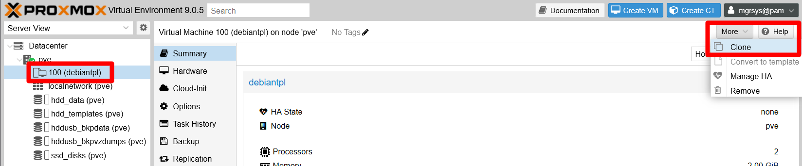
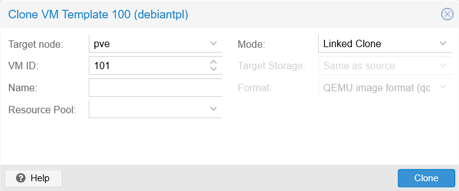
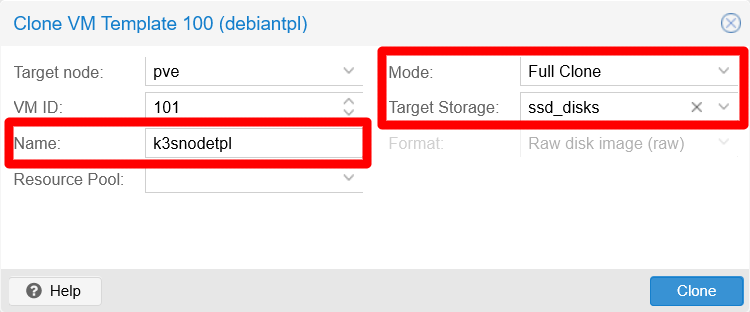
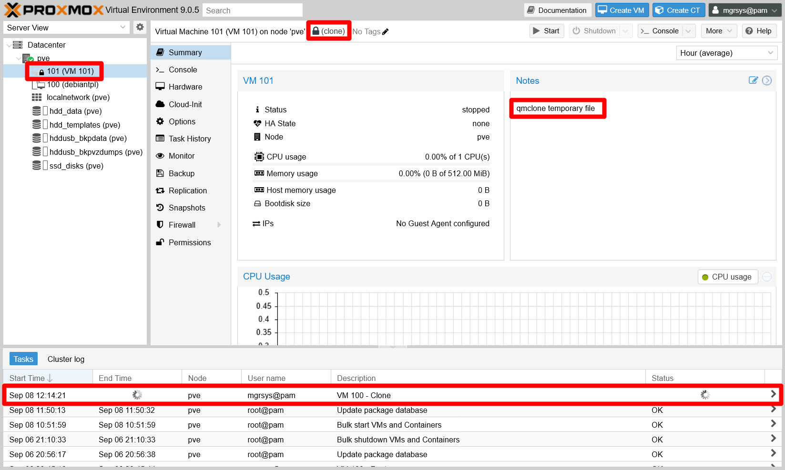
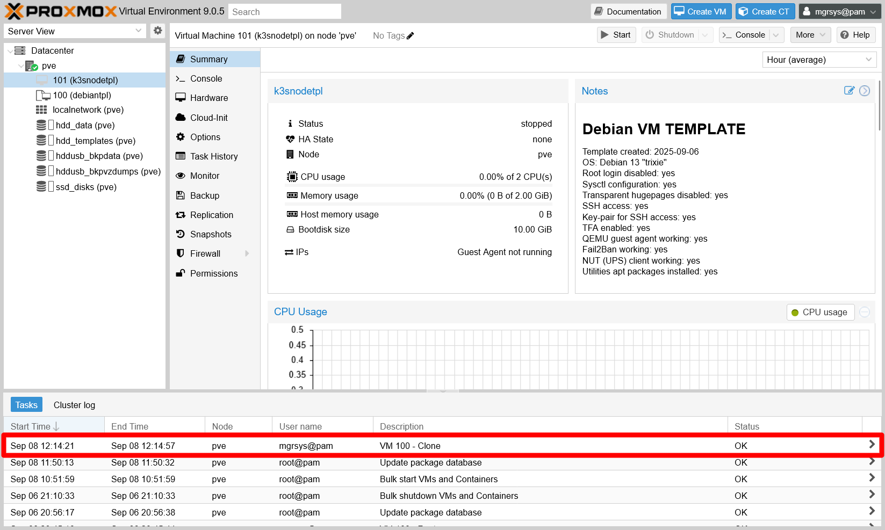
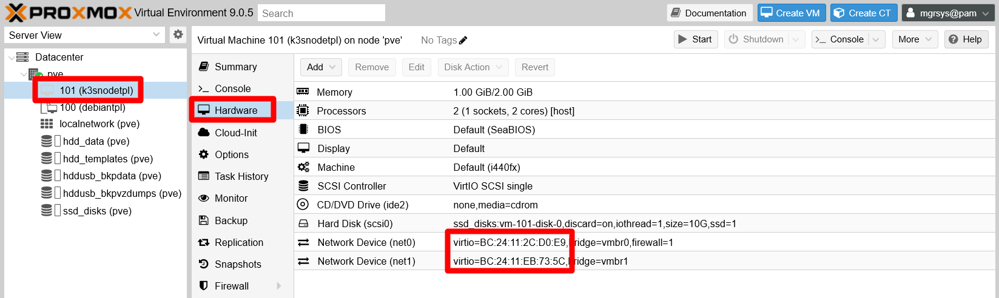
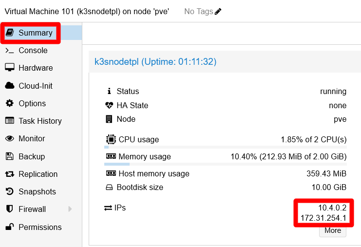
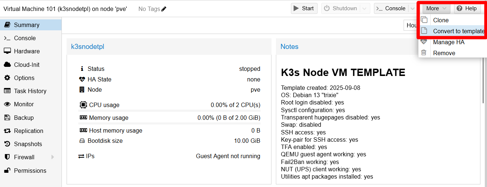
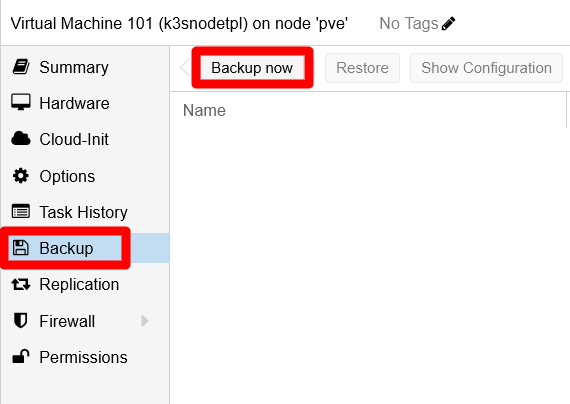

# G024 - K3s cluster setup 07 ~ K3s node VM template setup

- [You need a more specialized VM template for building K3s nodes](#you-need-a-more-specialized-vm-template-for-building-k3s-nodes)
- [Reasons for a new VM template](#reasons-for-a-new-vm-template)
- [Creating a new VM based on the Debian VM template](#creating-a-new-vm-based-on-the-debian-vm-template)
  - [Full cloning of the Debian VM template](#full-cloning-of-the-debian-vm-template)
- [Setting an static IP for the main network device (`net0`)](#setting-an-static-ip-for-the-main-network-device-net0)
- [Setting a proper hostname string](#setting-a-proper-hostname-string)
- [Disabling the swap volume](#disabling-the-swap-volume)
- [Changing the VG's name](#changing-the-vgs-name)
- [Setting up the second network card](#setting-up-the-second-network-card)
- [Setting up sysctl kernel parameters for K3s nodes](#setting-up-sysctl-kernel-parameters-for-k3s-nodes)
- [Turning the VM into a VM template](#turning-the-vm-into-a-vm-template)
- [Relevant system paths](#relevant-system-paths)
  - [Folders on the VM](#folders-on-the-vm)
  - [Files on the VM](#files-on-the-vm)
- [References](#references)
  - [Kubernetes](#kubernetes)
  - [Other contents about swap usage by Kubernetes](#other-contents-about-swap-usage-by-kubernetes)
  - [K3s](#k3s)
  - [Debian and Linux SysOps](#debian-and-linux-sysops)
    - [Changing the `Hostname`](#changing-the-hostname)
    - [Disabling the swap](#disabling-the-swap)
    - [Changing the VG's name of a `root` LV](#changing-the-vgs-name-of-a-root-lv)
    - [Network interfaces configuration](#network-interfaces-configuration)
- [Navigation](#navigation)

## You need a more specialized VM template for building K3s nodes

At this point, you have a plain Debian VM template ready. You can use that template to build any virtualized server system you want but, to create VMs that work as K3s Kubernetes cluster nodes, further adjustments are necessary. Since those changes are required for any node of your future K3s cluster, it is more practical to have an specialized VM template that comes with all those adjustments already configured.

## Reasons for a new VM template

Suppose you already have a new VM cloned from the Debian VM template created in the previous [chapter **G023**](G023%20-%20K3s%20cluster%20setup%2006%20~%20Debian%20VM%20template%20and%20backup.md). The main changes you need to apply in that new VM so it suits better the role of a K3s node are listed next:

- **Disabling the swap volume**\
  By default, Kubernetes does not allow the use of swap to its workloads mainly because of performance reasons. Moreover, you cannot configure how swap has to be used in a generic way. You must make an assessment of the needs and particularities of each workload that may require having swap available to safeguard their stability when they run out of memory.

  Also, mind that the workloads themselves only ask for memory, not swap. The use of swap is handled by Kubernetes itself, and it is a feature still being improved. Furthermore, [the official Kubernetes documentation advises using an independent physical SSD drive exclusively for swapping on each node, and avoid using the swap that is usually enabled at the root filesystem of any Linux system](https://kubernetes.io/docs/concepts/cluster-administration/swap-memory-management/#use-of-a-dedicated-disk-for-swap).

  Given the limitations and scope of the homelab this guide builds, it is better to deal with the swap issue in the "traditional" Kubernetes way: by completely disabling it in the VM.

- **Renaming the root VG**\
  In the LVM storage structure of your Debian VM template, the name of the only VG present is based on your Debian VM template's hostname. This is not a problem by itself, but could be misleading while doing some system maintenance tasks. Instead, you should change it to a more suitable name fitting for all your future K3s nodes.

- **Preparing the second network card**\
  The Debian VM template you have created in the previous chapters has two network cards, but only the principal NIC is active. The second one, connected to the isolated `vmbr1` bridge, is currently disabled but you need to activate it. This way, the only thing left to adjust in this regard on each K3s node will be the IP address.

- **Setting up sysctl parameters**\
  By having a particular option enabled, K3s requires certain `sysctl` parameters to have concrete values. If they are not set up in such way, the K3s service refuses to run.

These aspects affect all the nodes in the K3s cluster. Then, the smart thing to do is to set them correctly in a VM which, in turn, will become the common template from which you can clone the final VMs that will run as nodes of your K3s cluster.

## Creating a new VM based on the Debian VM template

This section covers the procedure of creating a new VM cloned from the Debian VM template you already have.

### Full cloning of the Debian VM template

Since in this new VM you are going to modify its filesystem structure, start by fully cloning your Debian VM template:

1. Go to your `debiantpl` template, then unfold the `More` options list. There you can find the `Clone` option:

    

2. Click on `Clone` to see its corresponding window:

    

    The form parameters are explained next:

    - `Target node`\
      Which node in the Proxmox VE cluster you want to place your cloned VM in. In your case you only have one standalone node, `pve`.

    - `VM ID`\
      The numerical ID that Proxmox VE uses to identify this VM. Notice how the form already assigns the next available number, in this case `101`.

      > [!NOTE]
      > Proxmox VE does not allow IDs lower than `100`.

    - `Name`\
      This string must be a valid FQDN, like `k3snodetpl.homelab.cloud`.

      > [!IMPORTANT]
      > **The official Proxmox VE documentation is misleading about this field**\
      > The official Proxmox VE documentation says that this name is `a free form text string you can use to describe the VM`, which contradicts what the web console actually validates as correct.

    - `Resource Pool`\
      For indicating to which pool this VM has to be a member of.

    - `Mode`\
      This option offers two ways of cloning the new VM:

      - `Linked Clone`\
        This creates a clone that still refers to the original VM, therefore is _linked_ to it. This option can only be used with read-only VMs, or templates, since the linked clone uses the original VM's volume to run, saving in its own image only the differences. Also, linked clones must be stored in the same `Target Storage` where the original VM's storage is.

        > [!WARNING]
        > **VM templates with attached linked clones are not removable**\
        > Templates cannot be removed as long as they have linked clones attached to them.

      - `Full Clone`\
        Is a full copy of the original VM, so it is not linked to it at all. Also, this type allows to be put in a different `Target Storage` if required.

    - `Target Storage`\
      Here you can choose where you want to put the new VM, although you can choose **only when making a full clone**. Also, there are storage types that do not appear in this list, like directories.

    - `Format`\
      Depending on the mode and target storage configured, this value changes to adapt to those other two parameters. It just indicates in which format is going the new VM's volumes to be stored in the Proxmox VE system.

3. Fill the `Clone` form to create a new `Full Clone`  VM as follows:

    

    See in the snapshot how the name assigned to the full clone is `k3snodetpl`, and that the  target storage is `ssd_disks`. Alternatively, the target storage could have been left with the default `Same as source` value since the template volume is also placed in that storage. For the sake of clarity, the field has been set explicitly to `ssd_disks`.

4. Click on `Clone` when ready and the form will disappear. Pay attention to the `Tasks` console at the bottom to see how the cloning process goes:

    

    See how the new `101` VM appears with a lock icon in the tree at the left. Also, in its `Summary` view, you can see how Proxmox VE warns you that the VM is still being created with the `clone` operation, and even in the `Notes` you can see a reference to a `qmclone temporary file`.

5. When the `Tasks` log reports the cloning task as `OK`, the `Summary` view shows the VM unlocked and fully created:

    

    See how all the details in the `Summary` view are the same as what the original Debian VM template had (like the `Notes` for instance).

## Setting an static IP for the main network device (`net0`)

Do not forget to set up a static IP for the main network device (the `net0` one) of this VM in your router or gateway, ideally following some criteria. You can see the MACs, in the VM's `Hardware` view, as the value of the `virtio` parameter on each network device attached to the VM:

## Setting a proper hostname string

Since this new VM is a clone of the Debian VM template you prepared before, its hostname is the same one set in the template (`debiantpl`). It is better, for coherence and clarity, to set up a more proper hostname for this particular VM which, in this case, will be called `k3snodetpl`. Then, to change the hostname string on the VM, do the following:

1. Start the VM, then login as `mgrsys` (with the same credentials used in the Debian VM template). To change the hostname value (`debiantpl` in this case) in the `/etc/hostname` file, better use the `hostnamectl` command:

    ~~~sh
    $ sudo hostnamectl set-hostname k3snodetpl
    ~~~

    If you edit the `/etc/hostname` file directly instead, you have to reboot the VM to make it load the new hostname.

2. Edit the `/etc/hosts` file, where you must replace the old hostname (again, `debiantpl`) with the new one. The hostname should only appear in the `127.0.1.1` line:

    ~~~properties
    127.0.1.1   k3snodetpl.homelab.cloud    k3snodetpl
    ~~~

To see all these changes applied, exit your current session and log back in. You should see that now the new hostname shows up in your shell prompt.

## Disabling the swap volume

Follow the next steps to remove the swap completely from your VM:

1. First disable the currently active swap memory:

    ~~~sh
    $ sudo swapoff -a
    ~~~

    The `swapoff` command disables the swap only temporarily, the system will reactivate it after a reboot. To verify that the swap is actually disabled, check the `/proc/swaps` file.

    ~~~sh
    $ cat /proc/swaps
    Filename                                Type            Size            Used            Priority
    ~~~

    If there are no filenames listed in the output, that means the swap is disabled (although just till next reboot).

2. Make a backup of the `/etc/fstab` file:

    ~~~sh
    $ sudo cp /etc/fstab /etc/fstab.orig
    ~~~

    Then edit the `fstab` file and comment out, with a '#' character, the line that begins with the `/dev/mapper/debiantpl--vg-swap_1` string.

    ~~~properties
    ...
    #/dev/mapper/debiantpl--vg-swap_1 none            swap    sw              0       0
    ...
    ~~~

3. Edit the `/etc/initramfs-tools/conf.d/resume` file, commenting out with a '#' character the line related to the `swap_1` volume:

    ~~~properties
    #RESUME=/dev/mapper/debiantpl--vg-swap_1
    ~~~

    > [!IMPORTANT]
    > **Notice that you have not been told to make a backup of this `resume` file**\
    > This is because the `update-initramfs` command would also read the backup file regardless of it having a different name, and that would lead to an error.
    >
    > Of course, you could consider making the backup in some other folder, but that forces you to employ a particular (and probably forgettable) backup procedure only for this specific file. To sum it up, just be extra careful when modifying this particular file.

4. Check with `lvs` the name of the swap LVM volume:

    ~~~sh
    $ sudo lvs
      LV     VG           Attr       LSize   Pool Origin Data%  Meta%  Move Log Cpy%Sync Convert
      root   debiantpl-vg -wi-ao----  <8.69g
      swap_1 debiantpl-vg -wi-a----- 544.00m
    ~~~

    In the output above, it is the `swap_1` light volume within the `debiantpl-vg` volume group. Use `lvremove` on it to free that space:

    ~~~sh
    $ sudo lvremove debiantpl-vg/swap_1
    Do you really want to remove active logical volume debiantpl-vg/swap_1? [y/n]: y
      Logical volume "swap_1" successfully removed.
    ~~~

    Then, check again with `lvs` that the swap partition is gone:

    ~~~sh
    $ sudo lvs
      LV   VG           Attr       LSize  Pool Origin Data%  Meta%  Move Log Cpy%Sync Convert
      root debiantpl-vg -wi-ao---- <8.69g
    ~~~

    Also, see with `vgs` that the `debiantpl-vg` VG now has some free space (`VFree` column):

    ~~~sh
    $ sudo vgs
      VG           #PV #LV #SN Attr   VSize VFree
      debiantpl-vg   1   1   0 wz--n- 9.25g 580.00m
    ~~~

5. To expand the `root` LV into the newly freed space, execute `lvextend` like this:

    ~~~sh
    $ sudo lvextend -r -l +100%FREE debiantpl-vg/root
    ~~~

    The `lvextend` options mean the following:

    - `-r`\
      Calls the `resize2fs` command right after resizing the LV, to also extend the filesystem in the LV over the added space.

    - `-l +100%FREE`\
      Indicates that the LV has to be extended over the 100% of free space available in the VG.

    Check with `lvs` the new size of the `root` LV:

    ~~~sh
    $ sudo lvs
      LV   VG           Attr       LSize Pool Origin Data%  Meta%  Move Log Cpy%Sync Convert
      root debiantpl-vg -wi-ao---- 9.25g
    ~~~

    Also verify that there is no free space left in the `debiantpl-vg` VG:

    ~~~sh
    $ sudo vgs
      VG           #PV #LV #SN Attr   VSize VFree
      debiantpl-vg   1   1   0 wz--n- 9.25g    0
    ~~~

6. The final touch is to modify the `swappiness` sysctl parameter, which you already left set with a low value in the `/etc/sysctl.d/85_memory_optimizations.conf` file. As usual, first make a backup of the file:

    ~~~sh
    $ sudo cp /etc/sysctl.d/85_memory_optimizations.conf /etc/sysctl.d/85_memory_optimizations.conf.bkp
    ~~~

    Then, edit the `/etc/sysctl.d/85_memory_optimizations.conf` file, but just modify the `vm.swappiness` value, setting it to `0`:

    ~~~properties
    ...
    vm.swappiness = 0
    ...
    ~~~

7. Save the changes, refresh the sysctl configuration and reboot:

    ~~~sh
    $ sudo sysctl -p /etc/sysctl.d/85_memory_optimizations.conf
    $ sudo reboot
    ~~~

## Changing the VG's name

The VG you have in your VM's LVM structure is the same one defined in your Debian VM template, meaning that it was made correlative to the hostname of the original system. This is not an issue per se, but it is better to give the VG's name a string that correlates with the VM. Since this VM is going to be the template for all the VMs you will use as K3s nodes, lets give the VG the name `k3snode-vg`. It is generic but still more meaningful than the `debiantpl-vg` string  for all the K3s nodes you have to create later.

> [!WARNING]
> **This procedure affects your VM's filesystem**\
> Although this is not a difficult procedure, follow all the next steps carefully, or you may end messing up your VM's filesystem!

1. Using the `vgrename` command, rename the VG with the suggested name `k3snode-vg`:

    ~~~sh
    $ sudo vgrename debiantpl-vg k3snode-vg
      Volume group "debiantpl-vg" successfully renamed to "k3snode-vg"
    ~~~

    Verify with `vgs` that the renaming has been done:

    ~~~sh
    $ sudo vgs
      VG         #PV #LV #SN Attr   VSize VFree
      k3snode-vg   1   1   0 wz--n- 9.25g    0
    ~~~

2. You must edit the `/etc/fstab` file, replacing only the `debiantpl` string with `k3snode` in the line related to the `root` volume and, if you like, also in the commented `swap_1` line to keep it coherent:

    ~~~sh
    ...
    /dev/mapper/k3snode--vg-root /               ext4    errors=remount-ro 0       1
    ...
    #/dev/mapper/k3snode--vg-swap_1 none            swap    sw              0       0
    ...
    ~~~

    > [!WARNING]
    > **Careful of NOT reducing the double dash ('`--`') to just one (`-`)**\
    > Only replace the `debiantpl` part with the new `k3snode` string.

3. Next, you must find and change all the `debiantpl` strings present in the `/boot/grub/grub.cfg` file. But before that, do not forget to make a backup of `grub.cfg`:

    ~~~sh
    $ sudo cp /boot/grub/grub.cfg /boot/grub/grub.cfg.orig
    ~~~

4. Edit the `/boot/grub/grub.cfg` file (mind you, is **read-only** even for the `root` user) to change all the `debiantpl` name with the new `k3snode` one in lines that contain the string `root=/dev/mapper/debiantpl--vg-root`. To reduce the chance of errors when editing this critical system file, you can do the following:

    - Check first that `debiantpl--vg-root` ONLY brings up the lines with `root=/dev/mapper/debiantpl--vg-root`:

      ~~~sh
      $ sudo cat /boot/grub/grub.cfg | grep debiantpl--vg-root
      ~~~

      Run it in another shell or dump the output in a temporal file, but keep the lines for later reference.

    - Apply the required modifications with `sed`:

      ~~~sh
      $ sudo sed -i 's/debiantpl--vg-root/k3snode--vg-root/g' /boot/grub/grub.cfg
      ~~~

      If `sed` executes alright, it will not return any output.

    - Verify if all the lines that had the `debiantpl--vg-root` string have it now replaced with the `k3snode--vg-root` one:

      ~~~sh
      $ sudo cat /boot/grub/grub.cfg | grep k3snode--vg-root
      ~~~

      Compare this command's output with the one you got first. You should see the same lines as before, but with the string changed.

5. Update the initramfs with the `update-initramfs` command:

    ~~~sh
    $ sudo update-initramfs -u -k all
    ~~~

6. Reboot the system to load the changes:

    ~~~sh
    $ sudo reboot
    ~~~

7. Execute the `dpkg-reconfigure` command to regenerate the grub in your VM. To get the correct image to reconfigure, just autocomplete the command after typing `linux-image` and then type the one that corresponds with the kernel currently running in your VM:

    ~~~sh
    $ sudo dpkg-reconfigure linux-image-6.12.41+deb13-amd64
    ~~~

    > [!NOTE]
    > **The current Kernel is informed in the shell login**\
    > Right after you log in the VM, the very first line that Debian prints already informs you of its current Kernel among other details. For instance:
    >
    > ~~~sh
    > Linux k3snodetpl 6.12.41+deb13-amd64 #1 SMP PREEMPT_DYNAMIC Debian 6.12.41-1 (2025-08-12) x86_64
    > ~~~
    >
    > The Kernel version string you must pay attention to comes after the hostname string (`k3snodetpl`).

8. Reboot the system again to apply the changes:

    ~~~sh
    $ sudo reboot
    ~~~

## Setting up the second network card

The VM has a second network card that is yet to be configured and enabled, and which is already set to communicate through the isolated `vmbr1` bridge of your Proxmox VE's virtual network. To set up this NIC properly, do the following:

1. Obtain the name of the second network interface with the following `ip` command:

    ~~~sh
    $ ip a
    1: lo: <LOOPBACK,UP,LOWER_UP> mtu 65536 qdisc noqueue state UNKNOWN group default qlen 1000
        link/loopback 00:00:00:00:00:00 brd 00:00:00:00:00:00
        inet 127.0.0.1/8 scope host lo
        valid_lft forever preferred_lft forever
    2: ens18: <BROADCAST,MULTICAST,UP,LOWER_UP> mtu 1500 qdisc fq state UP group default qlen 1000
        link/ether bc:24:11:2c:d0:e9 brd ff:ff:ff:ff:ff:ff
        altname enp0s18
        altname enxbc24112cd0e9
        inet 10.4.0.2/8 brd 10.255.255.255 scope global dynamic noprefixroute ens18
        valid_lft 86162sec preferred_lft 75362sec
    3: ens19: <BROADCAST,MULTICAST> mtu 1500 qdisc noop state DOWN group default qlen 1000
        link/ether bc:24:11:eb:73:5c brd ff:ff:ff:ff:ff:ff
        altname enp0s19
        altname enxbc2411eb735c
    ~~~

    In the output above, the second network device is the one named `ens19`, and has the `state DOWN` and no IP assigned (no `inet` line).

2. Configure the `ens19` NIC in the `/etc/network/interfaces` file. As usual, first make a backup of the file:

    ~~~sh
    $ sudo cp /etc/network/interfaces /etc/network/interfaces.orig
    ~~~

    Then, append the following configuration to the `interfaces` file:

    ~~~sh
    # The secondary network interface
    allow-hotplug ens19
    iface ens19 inet static
      address 172.31.254.1
      netmask 255.240.0.0
    ~~~

    Notice that I have set an IP address within the valid private network range I decided to use (`172.16.0.0` to `172.31.255.255`, or `172.16.0.0/12` with netmask `255.240.0.0`) for the secondary NICs of the K3s nodes.

    > [!IMPORTANT]
    > **Do not just blindly copy the configuration above!**\
    > Ensure you are putting the correct name of the network interface as it appears in your VM when you copy the configuration above!

3. You can enable the interface with the following `ifup` command:

    ~~~sh
    $ sudo ifup ens19
    ~~~

    The command does not return any output.

4. Use the `ip` command to check out your new network setup:

    ~~~sh
    $ ip a
    1: lo: <LOOPBACK,UP,LOWER_UP> mtu 65536 qdisc noqueue state UNKNOWN group default qlen 1000
        link/loopback 00:00:00:00:00:00 brd 00:00:00:00:00:00
        inet 127.0.0.1/8 scope host lo
        valid_lft forever preferred_lft forever
    2: ens18: <BROADCAST,MULTICAST,UP,LOWER_UP> mtu 1500 qdisc fq state UP group default qlen 1000
        link/ether bc:24:11:2c:d0:e9 brd ff:ff:ff:ff:ff:ff
        altname enp0s18
        altname enxbc24112cd0e9
        inet 10.4.0.2/8 brd 10.255.255.255 scope global dynamic noprefixroute ens18
        valid_lft 84905sec preferred_lft 74105sec
    3: ens19: <BROADCAST,MULTICAST,UP,LOWER_UP> mtu 1500 qdisc fq state UP group default qlen 1000
        link/ether bc:24:11:eb:73:5c brd ff:ff:ff:ff:ff:ff
        altname enp0s19
        altname enxbc2411eb735c
        inet 172.31.254.1/12 brd 172.31.255.255 scope global ens19
        valid_lft forever preferred_lft forever
    ~~~

    Your `ens19` interface is now active with a static IP address. You can also see that, thanks to the QEMU agent, the second IP appears immediately after applying the change in the `Status` block of the VM's `Summary` view, in the Proxmox VE web console:

    

Thanks to this configuration, now you have an network interface enabled and connected to an isolated bridge. This helps to improve somewhat the hardening of the internal network of the K3s cluster you will build in the upcoming chapters.

## Setting up sysctl kernel parameters for K3s nodes

In the installation of the K3s cluster, which you will perform in the next [chapter **G025**](G025%20-%20K3s%20cluster%20setup%2008%20~%20K3s%20Kubernetes%20cluster%20setup.md), you will have to use the `protect-kernel-defaults` option. With it enabled, [you must set certain sysctl parameters to concrete values](https://docs.k3s.io/security/hardening-guide?_highlight=protect&_highlight=kernel&_highlight=defaults#ensure-protect-kernel-defaults-is-set) or the kubelet process executed by the K3s service will not run:

1. Create a new empty file in the path `/etc/sysctl.d/90_k3s_kubelet_demands.conf`:

    ~~~sh
    $ sudo touch /etc/sysctl.d/90_k3s_kubelet_demands.conf
    ~~~

2. Edit this `90_k3s_kubelet_demands.conf` file, adding the following lines:

    ~~~properties
    ## K3s kubelet demands
    # Values demanded by the kubelet process when K3s is run with the 'protect-kernel-defaults' option enabled.

    # This enables or disables panic on out-of-memory feature.
    # https://sysctl-explorer.net/vm/panic_on_oom/
    vm.panic_on_oom=0

    # This value contains a flag that enables memory overcommitment.
    # https://sysctl-explorer.net/vm/overcommit_memory/
    #  Already enabled with the same value in the 85_memory_optimizations.conf file.
    #vm.overcommit_memory=1

    # Represents the number of seconds the kernel waits before rebooting on a panic.
    # https://sysctl-explorer.net/kernel/panic/
    kernel.panic = 10

    # Controls the kernel's behavior when an oops or BUG is encountered.
    # https://sysctl-explorer.net/kernel/panic_on_oops/
    kernel.panic_on_oops = 1
    ~~~

    > [!WARNING]
    > **If you skipped the [_memory optimizations_ step of the chapter **G021**](G021%20-%20K3s%20cluster%20setup%2004%20~%20Debian%20VM%20configuration.md#memory-optimizations), you need to adjust the `vm.overcommit_memory` flag here!**\
    > Otherwise, the K3s service you will set up later in the next [chapter **G025**](G025%20-%20K3s%20cluster%20setup%2008%20~%20K3s%20Kubernetes%20cluster%20setup.md#k3s-installation-of-the-server-node-k3sserver01) will not be able to start.

3. Save the `90_k3s_kubelet_demands.conf` file and apply the changes, then reboot the VM:

    ~~~sh
    $ sudo sysctl -p /etc/sysctl.d/90_k3s_kubelet_demands.conf
    $ sudo reboot
    ~~~

## Turning the VM into a VM template

With the VM tuned properly, you can turn it into a VM template. Just repeat the procedure already covered by the previous [chapter **G023**](G023%20-%20K3s%20cluster%20setup%2006%20~%20Debian%20VM%20template%20and%20backup.md#turning-the-debian-vm-into-a-vm-template), remembering that the `Convert to template` action is available as an option in the `More` list of any VM:

> [!IMPORTANT]
> **You cannot turn a VM currently in use into a template**\
> Before executing the conversion, **first shut down the VM you are converting**.

Moreover, update the `Notes` text of this VM with any new or extra detail you might think relevant, and do not forget to make a full backup of the template. This backup is something you also did in the [chapter **G023**](G023%20-%20K3s%20cluster%20setup%2006%20~%20Debian%20VM%20template%20and%20backup.md#turning-the-debian-vm-into-a-vm-template), and the next snapshot is a reminder of where you can find the VM backup feature:

Remember that restoring backups can free some space due to the restoration process detecting and ignoring the empty blocks within the image. Therefore, consider restoring the VM template immediately after doing the backup to recover some storage space. This action is also explained in the [chapter **G023**](G023%20-%20K3s%20cluster%20setup%2006%20~%20Debian%20VM%20template%20and%20backup.md).

## Relevant system paths

### Folders on the VM

- `/boot/grub`
- `/etc`
- `/etc/initramfs-tools/conf.d`
- `/etc/network`
- `/etc/sysctl.d`
- `/proc`

### Files on the VM

- `/boot/grub/grub.cfg`
- `/boot/grub/grub.cfg.orig`
- `/etc/fstab`
- `/etc/fstab.orig`
- `/etc/hostname`
- `/etc/hosts`
- `/etc/initramfs-tools/conf.d/resume`
- `/etc/network/interfaces`
- `/etc/network/interfaces.orig`
- `/etc/sysctl.d/85_memory_optimizations.conf`
- `/etc/sysctl.d/85_memory_optimizations.conf.bkp`
- `/etc/sysctl.d/90_k3s_kubelet_demands.conf`
- `/proc/swaps`

## References

### [Kubernetes](https://kubernetes.io/)

- [Kubernetes Documentation. Concepts](https://kubernetes.io/docs/concepts/cluster-administration/)
  - [Cluster Administration. Swap memory management](https://kubernetes.io/docs/concepts/cluster-administration/swap-memory-management/)

### Other contents about swap usage by Kubernetes

- [Medium. Robert Botez. Demystifying Swap in Kubernetes: A Handbook for DevOps Engineers](https://medium.com/@robertbotez/demystifying-swap-in-kubernetes-a-handbook-for-devops-engineers-e5ef934593e3)

### [K3s](https://k3s.io/)

- [Docs. Security. CIS Hardening Guide](https://docs.k3s.io/security/hardening-guide)
  - [Host-level Requirements](https://docs.k3s.io/security/hardening-guide#host-level-requirements)
    - [Ensure `protect-kernel-defaults` is set](https://docs.k3s.io/security/hardening-guide#ensure-protect-kernel-defaults-is-set)

### Debian and Linux SysOps

#### Changing the `Hostname`

- [Linux Handbook. How to Change Hostname in Debian](https://linuxhandbook.com/debian-change-hostname/)

#### Disabling the swap

- [Discuss. Kubernetes. Community Forums. Swap Off - why is it necessary?](https://discuss.kubernetes.io/t/swap-off-why-is-it-necessary/6879/4)
- [StackExchange. Unix & Linux. How to safely turn off swap permanently and reclaim the space? (on Debian Jessie)](https://unix.stackexchange.com/questions/224156/how-to-safely-turn-off-swap-permanently-and-reclaim-the-space-on-debian-jessie)
- [Brandon Willmott. Permanently Disable Swap for Kubernetes Cluster](https://brandonwillmott.com/2020/10/15/permanently-disable-swap-for-kubernetes-cluster/)

#### Changing the VG's name of a `root` LV

- [ORAganism. Rename LVM Volume Group Holding Root File System Volume](https://oraganism.wordpress.com/2013/03/09/rename-lvm-vg-for-root-fs-lv/)
- [StackExchange. Unix & Linux. How to fix “volume group old-vg-name not found” at boot after renaming it?](https://unix.stackexchange.com/questions/579720/how-to-fix-volume-group-old-vg-name-not-found-at-boot-after-renaming-it)
- [Raveland Blog. Rename a Volume Group (LVM / Debian)](https://blog.raveland.org/post/rename_vg/)
- [LinuxQuestions.org. Unable to change Volume Group name](https://www.linuxquestions.org/questions/linux-newbie-8/unable-to-change-volume-group-name-4175676775/)

#### Network interfaces configuration

- [Debian. Wiki. Network Configuration](https://wiki.debian.org/NetworkConfiguration)
- [LinuxConfig.org. How to setup a Static IP address on Debian Linux](https://linuxconfig.org/how-to-setup-a-static-ip-address-on-debian-linux)
- [nixCraft. Tutorials. Ubuntu Linux. Howto: Ubuntu Linux convert DHCP network configuration to static IP configuration](https://www.cyberciti.biz/tips/howto-ubuntu-linux-convert-dhcp-network-configuration-to-static-ip-configuration.html)
- [nixCraft. Howto. Debian Linux. Debian Linux Configure Network Interface Cards – IP address and Netmasks](https://www.cyberciti.biz/faq/howto-configuring-network-interface-cards-on-debian/)
- [libvirt Wiki. Net.bridge.bridge-nf-call and sysctl.conf](https://wiki.libvirt.org/page/Net.bridge.bridge-nf-call_and_sysctl.conf)

## Navigation

[<< Previous (**G023. K3s cluster setup 06**)](G023%20-%20K3s%20cluster%20setup%2006%20~%20Debian%20VM%20template%20and%20backup.md) | [+Table Of Contents+](G000%20-%20Table%20Of%20Contents.md) | [Next (**G025. K3s cluster setup 08**) >>](G025%20-%20K3s%20cluster%20setup%2008%20~%20K3s%20Kubernetes%20cluster%20setup.md)
