# G025 - K3s cluster setup 08 ~ K3s Kubernetes cluster setup

- [Build your virtualized K3s cluster](#build-your-virtualized-k3s-cluster)
- [Criteria for the VMs' IPs and hostnames](#criteria-for-the-vms-ips-and-hostnames)
  - [Criteria for IPs](#criteria-for-ips)
    - [IP ranges for VM templates](#ip-ranges-for-vm-templates)
    - [IP ranges for K3s server nodes](#ip-ranges-for-k3s-server-nodes)
    - [IP ranges for K3s agent nodes](#ip-ranges-for-k3s-agent-nodes)
  - [Naming convention for hostnames](#naming-convention-for-hostnames)
- [Creation of VMs based on the K3s node VM template](#creation-of-vms-based-on-the-k3s-node-vm-template)
  - [VM as K3s server node](#vm-as-k3s-server-node)
  - [VM as K3s agent node](#vm-as-k3s-agent-node)
  - [Assign a static IP to each VM](#assign-a-static-ip-to-each-vm)
- [Preparing the VMs for K3s](#preparing-the-vms-for-k3s)
  - [Customizing the hostname](#customizing-the-hostname)
  - [Changing the second network card's IP address](#changing-the-second-network-cards-ip-address)
  - [Changing the TOTP code](#changing-the-totp-code)
  - [Changing the SSH key-pair](#changing-the-ssh-key-pair)
  - [Changing the administrative user's password](#changing-the-administrative-users-password)
  - [Creating the pending K3s agent node VM](#creating-the-pending-k3s-agent-node-vm)
    - [Changing hostname and assigning IPs](#changing-hostname-and-assigning-ips)
    - [Exporting the TOTP codes, the SSH key-pairs and reusing passwords](#exporting-the-totp-codes-the-ssh-key-pairs-and-reusing-passwords)
- [Firewall setup for the K3s cluster](#firewall-setup-for-the-k3s-cluster)
  - [Port mapping](#port-mapping)
  - [Firewall configuration for the K3s node VMs](#firewall-configuration-for-the-k3s-node-vms)
    - [Allowing access to the host's NUT port for all K3s nodes VMs](#allowing-access-to-the-hosts-nut-port-for-all-k3s-nodes-vms)
    - [K3s node VMs' firewall setup](#k3s-node-vms-firewall-setup)
    - [Port `6443` left closed on the server node's `net0` NIC](#port-6443-left-closed-on-the-server-nodes-net0-nic)
- [Considerations before installing the K3s software](#considerations-before-installing-the-k3s-software)
  - [The K3s installer's configuration file](#the-k3s-installers-configuration-file)
- [K3s Server node setup](#k3s-server-node-setup)
  - [Folder structure for K3s configuration files](#folder-structure-for-k3s-configuration-files)
  - [Enabling graceful shutdown on the server node](#enabling-graceful-shutdown-on-the-server-node)
    - [The `kubelet.conf` file](#the-kubeletconf-file)
    - [Cleanup pods script](#cleanup-pods-script)
  - [The `k3sserver01` node's `config.yaml` file](#the-k3sserver01-nodes-configyaml-file)
  - [Installation of your K3s server node](#installation-of-your-k3s-server-node)
    - [K3s installation command](#k3s-installation-command)
    - [K3s installation of the server node `k3sserver01`](#k3s-installation-of-the-server-node-k3sserver01)
    - [Enabling the `k3s-cleanup` service](#enabling-the-k3s-cleanup-service)
- [K3s Agent nodes setup](#k3s-agent-nodes-setup)
- [Understanding your cluster through `kubectl`](#understanding-your-cluster-through-kubectl)
  - [The `kubectl` command has to be executed with `sudo` in server nodes](#the-kubectl-command-has-to-be-executed-with-sudo-in-server-nodes)
  - [The `kubectl` command does not work on pure agent nodes](#the-kubectl-command-does-not-work-on-pure-agent-nodes)
- [Enabling bash autocompletion for `kubectl`](#enabling-bash-autocompletion-for-kubectl)
- [Regular K3s logs are journaled](#regular-k3s-logs-are-journaled)
- [Rotating the `containerd.log` file](#rotating-the-containerdlog-file)
- [K3s relevant paths](#k3s-relevant-paths)
  - [K3s paths at SERVER nodes](#k3s-paths-at-server-nodes)
    - [K3s server paths under the `/etc/rancher` folder](#k3s-server-paths-under-the-etcrancher-folder)
    - [K3s server paths under the `/etc/systemd/system` folder](#k3s-server-paths-under-the-etcsystemdsystem-folder)
    - [K3s server paths under the `/var/lib/rancher/k3s` folder](#k3s-server-paths-under-the-varlibrancherk3s-folder)
  - [K3s paths at AGENT nodes](#k3s-paths-at-agent-nodes)
    - [K3s agent paths under the `/etc/rancher` folder](#k3s-agent-paths-under-the-etcrancher-folder)
    - [K3s agent paths under the `/etc/systemd/system` folder](#k3s-agent-paths-under-the-etcsystemdsystem-folder)
    - [K3s agent paths under the `/var/lib/rancher/k3s` folder](#k3s-agent-paths-under-the-varlibrancherk3s-folder)
- [Starting up and shutting down the K3s cluster nodes](#starting-up-and-shutting-down-the-k3s-cluster-nodes)
  - [Automatic ordered start or shutdown of the K3s nodes VMs](#automatic-ordered-start-or-shutdown-of-the-k3s-nodes-vms)
  - [Understanding the shutdown/reboot process of your Proxmox VE host with the K3s cluster running](#understanding-the-shutdownreboot-process-of-your-proxmox-ve-host-with-the-k3s-cluster-running)
  - [Warning about the Kubernetes graceful shutdown feature](#warning-about-the-kubernetes-graceful-shutdown-feature)
- [Relevant system paths](#relevant-system-paths)
  - [Folders on the Proxmox VE host](#folders-on-the-proxmox-ve-host)
  - [Files on the Proxmox VE host](#files-on-the-proxmox-ve-host)
  - [Folders on the VMs/K3s nodes](#folders-on-the-vmsk3s-nodes)
  - [Files on the VMs/K3s nodes](#files-on-the-vmsk3s-nodes)
- [References](#references)
  - [Proxmox VE](#proxmox-ve)
  - [Debian and Linux SysOps](#debian-and-linux-sysops)
    - [Changing the `Hostname`](#changing-the-hostname)
    - [Network interfaces configuration](#network-interfaces-configuration)
    - [Logrotate configuration](#logrotate-configuration)
    - [Downloading files with `wget`](#downloading-files-with-wget)
  - [K3s cluster setup](#k3s-cluster-setup)
    - [Kubernetes](#kubernetes)
    - [K3s configuration](#k3s-configuration)
    - [Flannel](#flannel)
    - [Graceful node shutdown](#graceful-node-shutdown)
    - [Embedded software in K3s](#embedded-software-in-k3s)
  - [YAML](#yaml)
- [Navigation](#navigation)

## Build your virtualized K3s cluster

Having a more specialized VM template suited for creating K3s nodes makes easier building your own virtualized K3s cluster. First you have create and set up the VMs you need. Then you install the K3s software in the VM nodes, although with a slightly different configuration on each of them.

## Criteria for the VMs' IPs and hostnames

In the [chapter **G021**](G021%20-%20K3s%20cluster%20setup%2004%20~%20Debian%20VM%20configuration.md#suggestion-about-the-ip-organization-within-your-lan) I made you a suggestion about how to organize the IPs within your network. Here, I'll deepen in the matter by showing you a simple IP arrangement for the K3s cluster nodes you will create in this chapter. Also, I'll show you a naming convention for the VMs' hostnames, since it's required that each node in a Kubernetes cluster has an unique hostname for identification purposes.

Another thing you must know is the two types of nodes that exist in a K3s cluster:

- The **server** node, specialized in running the control plane of the Kubernetes cluster.
- The **agent** node, where K3s runs the workloads in the cluster.

> [!NOTE]
> **Kubernetes no longer distinguishes between nodes**\
> In older versions of Kubernetes, control plane nodes were called _master_ and the rest _workers_. In modern Kubernetes clusters, this distinction is no longer relevant since the control plane's workloads can be run in any node.
>
> Still, Kubernetes maintains some sort of default behavior that makes all [control plane components start in the same node](https://kubernetes.io/docs/concepts/architecture/#control-plane-components), and also avoids running any user container in that node.

A server can also act as an agent at the same time, but this chapter only explains the scenario using one "pure" server node.

> [!NOTE]
> **This chapter shows you how to create a single-server K3s cluster that uses an embedded sqlite database as data storage**\
> If you want a multiserver/multimaster cluster setup, you need to combine the instructions given here with the indications summarized in the [appendix chapter **G908**](G908%20-%20Appendix%2008%20~%20K3s%20cluster%20with%20two%20or%20more%20server%20nodes.md).  
> Also be aware that a sqlite-based cluster can only have one server node and cannot be converted to a multiserver one.

### Criteria for IPs

I'll assume the most simple scenario, which is a single local network behind one router. This means that everything falls within a [private network IPv4 range](https://en.wikipedia.org/wiki/Reserved_IP_addresses#IPv4) such as `10.0.0.0/8`, and no other subnets are present.

> [!NOTE]
> **I picked a big private network IP range to minimize conflicts**\
> Nowadays, is a common hardening feature to make devices use randomized MACs to connect to networks. This makes those devices get a new random IP from the router every time they connect to a network. Depending on how well the router is able to handle the IP assignments, this could lead to IP conflicts with devices that have statically assigned IPs. These conflicts emerge when a device with a static IP happens to be temporarily unavailable in the network, then other device gets the same IP through dynamic assignment because the router has not been programmed to take this situation into account. When the device with a static IP, usually a server, comes back and tries to claim its IP it sees that it has been assigned already to other device and is forced to get a different one.
>
> To help minimize this problem, I considered better to use the widest valid network range available for private LANs in my own home network: `10.0.0.0/8`. This range provides up to 16.777.216 addresses, a big enough number to avoid having conflicts of IPs between devices.

Do not forget that the VMs will have two network cards:

- **The primary NIC which is exposed to the internet**\
  Its private static IP will be in the `10.0.0.0/8` range.

- **The secondary NIC that only connects with other VMs through the isolated `vmbr1` bridge**\
  Its private static IP will be in the `172.16.0.0/12` range.

Finally, also know that the cluster will not have a high number of nodes. In this guide I'm aiming to have only three nodes. With all this in mind, the IPs arrangement I propose for the K3s nodes is detailed in the next subsections.

#### IP ranges for VM templates

These proposed IP ranges also affect, in retrospective, to the main NIC of the first Debian VM created in the [chapter **G023**](G023%20-%20K3s%20cluster%20setup%2006%20~%20Debian%20VM%20template%20and%20backup.md):

- **Main network card**\
  From `10.4.0.1` to `10.4.0.255`.

- **Secondary network card**\
  From `172.31.254.1` to `172.31.254.255`.

#### IP ranges for K3s server nodes

- **Main network card**\
  From `10.4.1.1` to `10.4.1.255`.

- **Secondary network card**\
  From `172.16.1.1` to `172.16.1.255`.

#### IP ranges for K3s agent nodes

- **Main network card**\
  From `10.4.2.1` to `10.4.2.255`.

- **Secondary network card**\
  From `172.16.2.1` to `172.16.2.255`.

### Naming convention for hostnames

This is the naming convention I'll use to assign a hostname to each new VMs:

- `k3snodetpl`\
  Name for the VM that is the template of all the K3s cluster VM nodes.

- `k3sserverXX`\
  Name for VMs that will act as server nodes in the K3s cluster.

- `k3sagentXX`\
  Name for VMs that will act as agent nodes in the K3s cluster.

My intention is to have a K3s cluster with one server and two agents, therefore the hostnames for each VM will be:

- The VM acting as server will be called `k3sserver01`.
- The other two VMs running as agents will be named `k3sagent01` and `k3sagent02`.

As you can see above, the naming convention does not need to be complicated. Just make sure that it makes sense and reflects the role given to each VM in the K3s cluster.

## Creation of VMs based on the K3s node VM template

For starters, you have to create two VMs: one will be a K3s server and the other an agent. After creating them, you'll have to configure a number of things in both.

To create these two VMs, go to your latest VM template (the `k3snodetpl` one), unfold the `More` options and click on `Clone`. In the `Clone` window that appears:

- Make the `VM ID` somehow correspond to the IPs the VM will eventually have.
- Specify a significant `Name`, like `k3sserver01`.
- Leave the mode as `Linked Clone`, so the new VMs take up less space by reusing the data already present in the VM template.

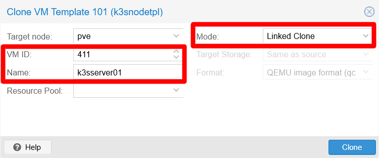

In the snapshot you see that I've given the ID `411` to the VM, since the primary IP of this VM is going to be `10.4.1.1`. Also see that, since this VM is going to be the K3s server in the cluster, I've named this VM `k3sserver01`.

The second VM is going to be an agent, so its name should be `k3sagent01`. The main IP for this VM will be `10.4.2.1`, so a good `ID` would be `421`.

> [!NOTE]
> **The VM IDs are important for configuring their automatic starting and shutting down by Proxmox VE**\
> This chapter explains more about it later, but you can check how the VM IDs are important in such process [in the Proxmox VE official documentation](https://pve.proxmox.com/pve-docs/chapter-qm.html#qm_startup_and_shutdown).

Again, my hostname schema, static IP assignments and ID assignments are just suggestions. Put the names, IPs and IDs you find suitable for your particular preferences or requirements.

> [!NOTE]
> **Remember that linked clones are attached to their VM template**\
> Proxmox VE will not allow you to remove the template unless you delete its linked clones first.

### VM as K3s server node

K3s server nodes can run workloads (apps and services), but it is more appropriate to use them just for handling your Kubernetes cluster's control plane. Acting just as a server is a heavy duty job, even in a small setup such as the one you're building with this guide. So, you can start assigning your `k3sserver01` node low hardware specs and increase them later depending on how well the node runs. Still, be aware that if the server node has a bad performance, the whole cluster won't run properly either. In my case I left this VM with rather low capabilities to begin with:

- **Memory**: 1.00/1.50 GiB of RAM.
- **Processors**: 2 vCPUs.

Those are really low hardware capabilities. Do not go lower than those or it will be too tight for the server node to run properly. Do not forget that, to change the hardware attached to a VM, just go to the `Hardware` tab of the VM. There, either just double click the item you want to modify or select it and press on `Edit`.

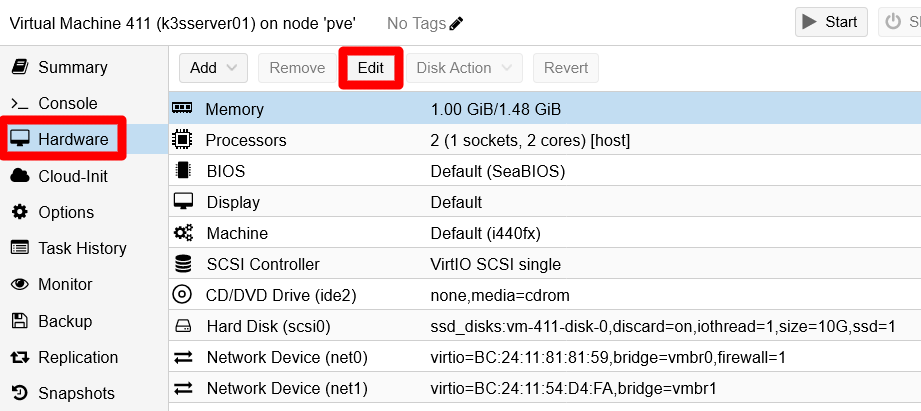

> [!NOTE]
> **Remember that this guide is based on a low end computer**\
> If your hardware setup happens to be more powerful, do not hesitate to assign more resources to the VMs if you want or need to. Just be careful of not overloading your hardware.

### VM as K3s agent node

K3s agents are the ones meant to run workloads in the cluster, so how much CPU and RAM you must assign to them depends heavily on what will be load they'll run. To play it safe you can do as I did and start by assigning them something like this.

- **Memory**: 1.00/2.00 GiB of RAM.
- **Processors**: 3 vCPUs.

As it happens with the server node VM, depending on how well your agent nodes run, later you'll have to adjust their capabilities to fit both their needs and the limits of your real hardware.

### Assign a static IP to each VM

After creating the VMs, go to your router or gateway and assign each a static IP. Here I'll follow the [criteria explained earlier](#criteria-for-ips), so the nodes here will have the following IPs for their **primary network cards**.

- K3s **server** node 1: `10.4.1.1`
- K3s **agent** node 1: `10.4.2.1`

## Preparing the VMs for K3s

Now that you have the new VMs created, you might think that you can start creating the K3s cluster, right? Wrong. In the following subsections, you'll see the pending procedures that you must apply in your VMs to make them fully adequate to become K3s cluster nodes.

### Customizing the hostname

As it happened when you set up the k3s node VM template, these two new VMs you have created both have the same hostname inherited from the VM template. You need to change it, as you did before, but customizing it to the role each node will play in the K3s cluster. So, if you apply the [naming scheme shown in a previous section](#naming-convention-for-hostnames), the hostname value for each VM will be as follows.

- The K3s server VM will be called `k3sserver01`.
- The other VM will run as an agent, so it'll be named `k3sagent01`.

With the naming scheme decided, you can change the hostname **to each VM** in the same way you did when you configured the K3s node VM template.

> [!WARNING]
> **At this point, your two new VMs will have the same credentials**\
> This means having the same certificates, password and TFA TOTP code for the `mgrsys` user as the ones set in the K3s node VM template those VMs are clones of.
>
> Remember this when you try to connect remotely to those VMs through SSH.

1. Using the `hostnamectl` command, change the VM's hostname value (`k3snodetpl` now). For instance, for the K3s server VM it would be like below:

    ~~~sh
    $ sudo hostnamectl set-hostname k3sserver01
    ~~~

2. Edit the `/etc/hosts` file, where you must replace the old hostname (`k3snodetpl`) with the new one. The hostname should only appear in the `127.0.1.1` line:

    ~~~properties
    127.0.1.1   k3sserver01.homelab.cloud    k3sserver01
    ~~~

3. Do not forget to do the same steps on the `k3sagent01` VM. First the `hostnamectl` command.

    ~~~sh
    $ sudo hostnamectl set-hostname k3sagent01
    ~~~

    Then, changing the proper line in the `/etc/hosts` file.

    ~~~properties
    127.0.1.1   k3sagent01.homelab.cloud    k3sagent01
    ~~~

Remember that to see the change applied, you have to exit your current shell session and log back into the VM. You will see the new hostname in the shell prompt.

### Changing the second network card's IP address

The secondary network card of the new VMs has the same IP address that was configured in their template, something you must correct or the networking with this card won't work. [Adhering the criteria I established before](#criteria-for-ips), the static IPs I'm going to set for this VMs are:

- K3s **server** node 1: `172.16.1.1`
- K3s **agent** node 1: `172.16.2.1`

1. To change this value on each VM, you just have to edit the `/etc/network/interfaces` file and replace there the template IP with the correct one. Of course, for extra safety, first do a backup.

    ~~~sh
    $ sudo cp /etc/network/interfaces /etc/network/interfaces.bkp
    ~~~

2. Edit the `interfaces` file and just change the address assigned to the interface. In my case, it is the `ens19` interface, and this is how it would look in the K3s server node.

    ~~~sh
    # The secondary network interface
    allow-hotplug ens19
    iface ens19 inet static
      address 172.16.1.1
      netmask 255.240.0.0
    ~~~

3. To apply the change you'll have to restart the interface with the `ifdown` and `ifup` commands.

    ~~~sh
    $ sudo ifdown ens19
    Error: ipv4: Address not found.
    $ sudo ifup ens19
    ~~~

    Don't mind the error warning `ifdown` returns, `ifup` will be able to activate the interface just fine.

4. Finally, check with the `ip` command that the interface has the new IP address.

    ~~~sh
    $ ip a
    1: lo: <LOOPBACK,UP,LOWER_UP> mtu 65536 qdisc noqueue state UNKNOWN group default qlen 1000
        link/loopback 00:00:00:00:00:00 brd 00:00:00:00:00:00
        inet 127.0.0.1/8 scope host lo
        valid_lft forever preferred_lft forever
    2: ens18: <BROADCAST,MULTICAST,UP,LOWER_UP> mtu 1500 qdisc fq state UP group default qlen 1000
        link/ether bc:24:11:81:81:59 brd ff:ff:ff:ff:ff:ff
        altname enp0s18
        altname enxbc2411818159
        inet 10.4.1.1/8 brd 10.255.255.255 scope global dynamic noprefixroute ens18
        valid_lft 85227sec preferred_lft 74427sec
    3: ens19: <BROADCAST,MULTICAST,UP,LOWER_UP> mtu 1500 qdisc fq state UP group default qlen 1000
        link/ether bc:24:11:54:d4:fa brd ff:ff:ff:ff:ff:ff
        altname enp0s19
        altname enxbc241154d4fa
        inet 172.16.1.1/12 brd 172.31.255.255 scope global ens19
        valid_lft forever preferred_lft forever
    ~~~

Remember to change the secondary network card's IP, following the same steps, on your other `K3sagent01` VM!

### Changing the TOTP code

The VMs share the same TOTP code that you generated for the Debian VM template. Obviously, this is not secure, so you must change it **on each VM**. On the other hand, you'll probably don't want to complicate your system management too much for what is just a homelab setup. So, for the scenario contemplated in this guide, a middle-ground solution would be having one TOTP for the K3s server node, and another TOTP code for all the K3s agent nodes. Regardless of the strategy you adopt, the procedure to change the TOTP on each VM is the same.

You just have to execute the `google-authenticator` command, and it will overwrite the current content of the `.google_authenticator` file in the `$HOME` directory of your current user. For instance, in the K3s server node you would execute something like the following.

~~~sh
$ google-authenticator -t -d -f -r 3 -R 30 -w 3 -Q UTF8 -i k3sserverxx.homelab.cloud -l mgrsys@k3sserverxx
~~~

And the command for the agent node should be as shown next.

~~~sh
$ google-authenticator -t -d -f -r 3 -R 30 -w 3 -Q UTF8 -i k3sagentxx.homelab.cloud -l mgrsys@k3sagentxx
~~~

> [!IMPORTANT]
> Export and save all the codes and even the `.google_authenticator` file in a password manager or by any other secure method.

### Changing the SSH key-pair

As with the TOTP code, the SSH key-pair files are the same ones you created for your first Debian VM template, and all the VMs you have created till now have the very same pair. Following the same strategy as with the TOTP code, create a different key-pair for the server node and for the agent node. The procedure in both cases is as follows.

1. Being sure that you're on your `$HOME` directory, remove the current key-pair completely.

    ~~~sh
    $ cd
    $ rm -rf .ssh/
    ~~~

2. Now you can create a new ssh key-pair with the `ssh-keygen` command.

    ~~~sh
    $ ssh-keygen -t ed25519 -a 250 -C "k3sserverxx.homelab.cloud@mgrsys"
    ~~~

    > [!NOTE]
    > **The comment (`-C`) in the command above is just an example**\
    > Replace that comment with whatever string suits your requirements.

3. Now enable the public part of the key-pair.

    ~~~sh
    $ cat .ssh/id_ed25519.pub >> .ssh/authorized_keys ; chmod 600 .ssh/authorized_keys
    ~~~

Careful now, you have to export the new private key (the `id_rsa` file) so you can remotely connect through your ssh client. Do not close your current connection so you can use it to export the private key.

> [!IMPORTANT]
> Do not forget to export and save the new ssh key-pairs in a password manager or by any other secure method.

### Changing the administrative user's password

The `mgrsys` user also has the same password you gave it in the creation of the first Debian 10 template. To change it, I'll follow the same strategy as with the TOTP code and the ssh key-pair, one password for the K3s server and another for all the K3s agents. To change the password, just execute the `passwd` command.

~~~sh
$ passwd
Changing password for mgrsys.
Current password:
New password:
Retype new password:
passwd: password updated successfully
~~~

> [!IMPORTANT]
> Save the password somewhere safe, like in a password manager.

### Creating the pending K3s agent node VM

You have created and configured one VM that will act as a K3s server node, and another that will be a K3s agent node. Still, you're missing another agent node, so link-clone it to the K3s node template with a `3112` VM ID and for name the string `k3sagent02`. Then, configure it as you did with the other K3s nodes you have already created, but with some differences.

#### Changing hostname and assigning IPs

As you did with both your K3s server and first agent nodes, you need to assign concrete static IPs to the network devices. Also, you need to change the hostname.

1. Assign in your router or gateway the static main IP for the new VM. In my criteria, its address would be as follows.

    - K3s **agent** node 2: `10.4.2.2`

2. Change its hostname, as you've already seen before in this chapter.

    - K3s **agent** node 2: `k3sagent02`

3. Finally, you also have to change the IP address of its secondary network interface.

    - K3s **agent** node 2: `172.16.2.2`

#### Exporting the TOTP codes, the SSH key-pairs and reusing passwords

To ease a bit the burden of system maintenance, and reduce the madness of so many passwords and TOTP codes, let's reuse the ones you generated for the `mgrsys` user in your first agent node. It is not the safest configuration possible, true, but should be safe enough for the homelab you are building in this guide.

The idea is that you export the TOTP code and the SSH key-pair from your `k3sagent01` VM to the `k3sagent02` one. Also, you would reuse the new password you've applied in the first agent. This way, at least you'll have different authorization codes for the different types of nodes in your K3s cluster.

The files you have to export are:

- `/home/mgrsys/.google_authenticator`\
  The file where the TOTP code is stored.

- `/home/mgrsys/.ssh/`\
  In this folder are the SSH key-files. Export the whole folder.

The most convenient way to export files is packaging and compressing them with the `tar` command.

~~~sh
$ cd
$ tar czvf .ssh.tgz .ssh/
$ tar czvf .google_authenticator.tgz .google_authenticator
~~~

When you have exported these `.tgz` files (with a tool like WinSCP, for instance) to the second agent node, remove the ones already present and then decompress the `.tgz` files.

~~~sh
$ cd
$ rm -rf .ssh
$ rm -f .google_authenticator
$ tar xvf .ssh.tgz
$ tar xvf .google_authenticator.tgz
$ rm .ssh.tgz .google_authenticator.tgz
~~~

The `.tgz` files' content will be extracted with the same permissions and owners they had originally, which in this case makes them good to go as they are: the users and groups, and their internal ids, are the same in all your VMs.

Finally, don't forget to use the `passwd` command to change the password and put the same one as in the first agent node.

## Firewall setup for the K3s cluster

A K3s cluster uses certain ports to work, although they're different on each K3s node type.

### Port mapping

In a default installation of a K3s cluster, the ports you need to have open are the following.

- **On SERVER nodes**
  - TCP `2379-2380`\
    Necessary when using HA with embedded etcd database engines. These are not used in a one-server-node setup.

  - TCP `6443`\
    This is for connecting to the Kubernetes API server, necessary for cluster management tasks.

  - TCP `10250`\
    Required to access to Kubelet metrics.

- **On AGENT nodes**
  - TCP `80`\
    Used by the Traefik service.

  - TCP `443`\
    Also used by the Traefik service.

  - TCP `10250`\
    Required to access Kubelet metrics.

On the other hand, there's also the TCP port `22`, which you must keep open in the firewall to allow yourself SSH access into all your VMs. Also, you need to give all your VMs access to the TCP port `3493` in the Proxmox VE host, so they can connect to the NUT server monitoring the UPS in your system.

Now that you know the ports required by K3s, you may wonder how these ports will be arranged in the network interface cards enabled in your VMs. Check it out below:

- **On SERVER nodes**
  - NIC `net0`/`ens18`, IP `10.4.1.x`:
    - TCP: `22`, `6443`.

  - NIC `net1`/`ens19`, IP `172.16.1.x`:
    - TCP: `2379-2380`, `6443`, `10250`.

- **On AGENT nodes**
  - NIC `net0`/`ens18`, IP `10.4.2.x`:
    - TCP: `22`, `80`, `443`.
  - NIC `net1`/`ens19`, IP `172.16.2.x`:
    - TCP: `10250`.

Remember that each NIC is meant for a particular use:

- The `net0`/`ens18` interfaces are the ones that need to be firewalled since they face the external network. You will configure your K3s cluster to use these ones only for external traffic.

- The `net1`/`ens19` interfaces are not firewalled but isolated through the `vmbr1` bridge. Your K3s cluster will use these NICs for its internal networking needs.

The upshot is that you will need to open in your Proxmox VE firewall only the ports required on the `net0`/`ens18` interfaces. Also, you'll need to give your K3s VMs explicit access to the `3493` TCP port to reach the NUT server running in the Proxmox VE system.

### Firewall configuration for the K3s node VMs

Now that you have the ports setup visualized, let's get down to it. The process is like what you did in the [chapter **G022**](G022%20-%20K3s%20cluster%20setup%2005%20~%20Connecting%20the%20VM%20to%20the%20NUT%20server.md#opening-the-upsd-port-on-the-proxmox-ve-node), where you gave your first Debian VM access to the NUT TCP port `3493` at the Proxmox VE host. This time you'll handle more ports and IPs.

#### Allowing access to the host's NUT port for all K3s nodes VMs

To give your VMs access to the NUT server running in your Proxmox VE host, you just have to include their main IPs to the IP set you already allowed to reach the NUT port:

1. Open your Proxmox VE web console and go to the `Datacenter`, then to `Firewall > Alias`. There you must add the IPs of your VMs' `net0` NICs, the `192.168.1.x` ones. The view should end looking like below:

    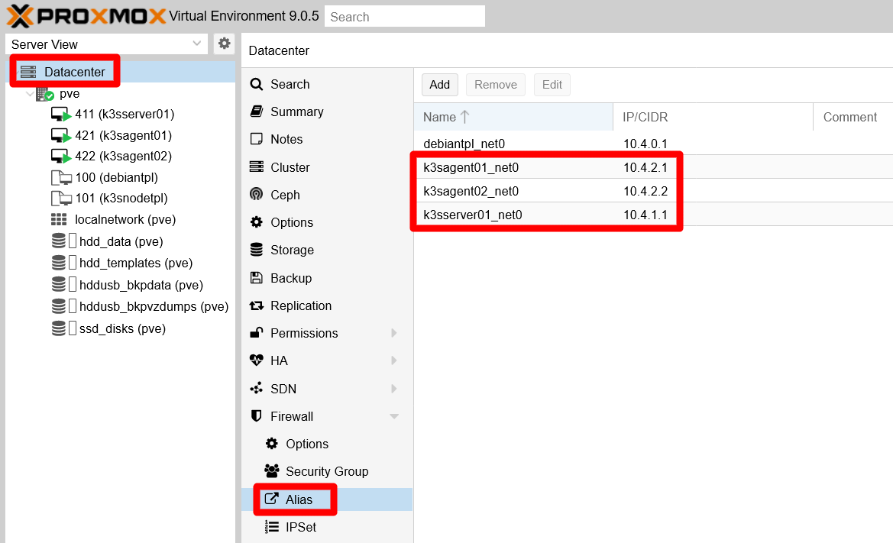

    Remember that you created, back in the [chapter **G022**](G022%20-%20K3s%20cluster%20setup%2005%20~%20Connecting%20the%20VM%20to%20the%20NUT%20server.md), the alias `debiantpl_net0` you see already listed here.

2. Browse now to the `Datacenter > Firewall > IPSet` tab, where you can find the `k3s_nodes_net0_ips` IP set:

    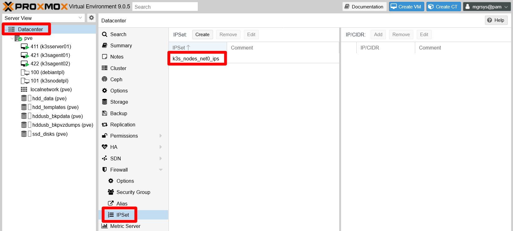

3. Select the `k3s_nodes_net0_ips` set, where you'll see the `debiantpl_net0` alias already added there. Since it's the IP of the first Debian VM template you've created, and VM templates can't be run, you can remove the `debiantpl_net0` alias from this IP set by pressing the `Remove` button:

    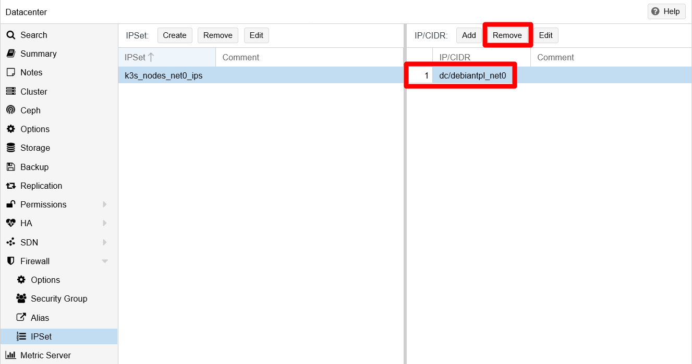

    You'll have to confirm the `Remove` action:

    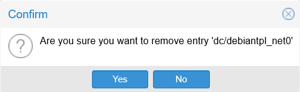

4. Use the `Add` button to aggregate the K3s node aliases you've created before to the `k3s_nodes_net0_ips` IP set. The IP set should end looking like below:

    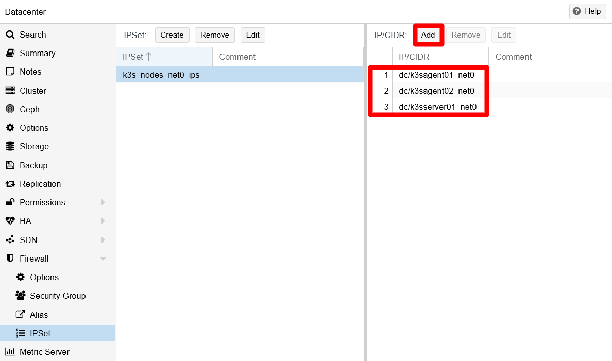

The connection of your K3s nodes with the NUT server should be enabled now. Check it out with a NUT client command like `upsc eaton@10.1.0.1`. Or go back to the chapters [**G004**](G004%20-%20Host%20configuration%2002%20~%20UPS%20management%20with%20NUT.md) or [**G022**](G022%20-%20K3s%20cluster%20setup%2005%20~%20Connecting%20the%20VM%20to%20the%20NUT%20server.md) to see how to use the NUT-related commands.

#### K3s node VMs' firewall setup

1. Browse back to the `Datacenter > Firewall > Alias` tab. In this page, add the whole IP range of your local network (`10.0.0.0/8` in this guide):

    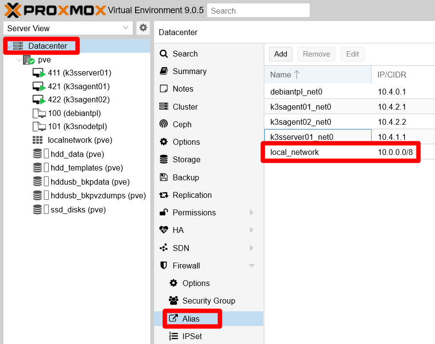

2. Go to the `Datacenter > Firewall > IPSet` page and create an IP set for the local network IPs, called `local_network_ips`. In it, add the `local_network` alias:

    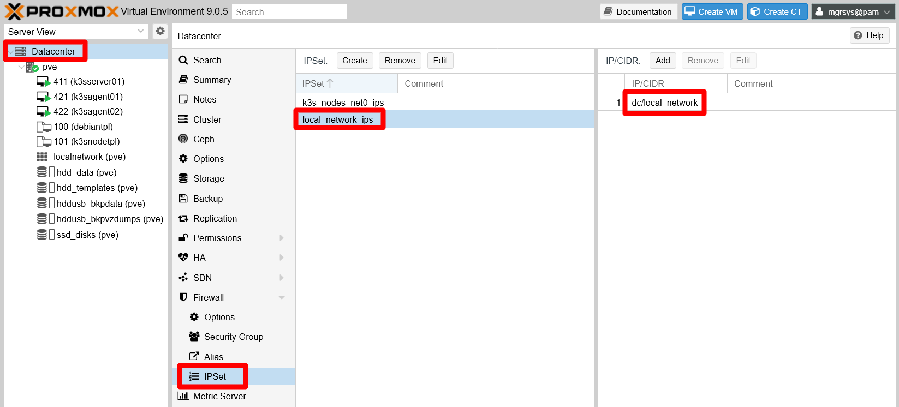

    I could have used just the `local_network` alias directly for creating rules, but it is better to use sets, even for just one alias or IP, since they give you more flexibility to manipulate IPs within the sets.

3. Jump to the `Datacenter > Firewall > Security Group` page. Define and enable here all the rules to give access to the ports you need open in your K3s cluster, which are only the ones on your VM's `net0` interfaces. Next, I'll detail the rules, but organized in two distinct security groups:

    - `k3s_srvrs_net0_in`:

      - Rule 1: Type `in`, Action `ACCEPT`, Protocol `tcp`, Source `local_network_ips`, Dest. port `22`, Comment `SSH standard port open for entire local network`.

    - `k3s_agnts_net0_in`:

      - Rule 1: Type `in`, Action `ACCEPT`, Protocol `tcp`, Source `local_network_ips`, Dest. port `22`, Comment `SSH standard port open for entire local network`.

      - Rule 2: Type `in`, Action `ACCEPT`, Protocol `tcp`, Source `local_network_ips`, Dest. port `80`, Comment `HTTP standard port open for entire local network`.

      - Rule 3: Type `in`, Action `ACCEPT`, Protocol `tcp`, Source `local_network_ips`, Dest. port `443`, Comment `HTTPS standard port open for entire local network`.

    Do not mind the rules numbers, it just for your reference when you read them. Their numbering will be different when you add them in the security groups, and they should end looking like this:

    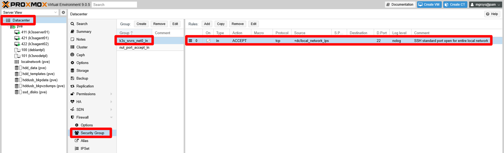

    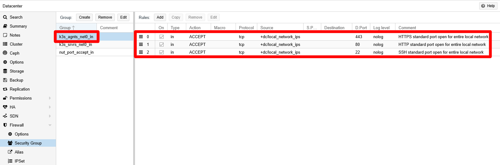

    > [!IMPORTANT]
    > **Do not forget to enable the rules when you create them**\
    > Revise the `On` column and check the ones you may have left disabled.

    The security groups do not work just as they are, **you have to apply them on each of your K3s node VMs**:

    - Insert the `k3s_srvrs_net0_in` security group in the K3s server VM firewall.
    - Put the `k3s_agnts_net0_in` security group in your other two K3s agent VMs firewalls.

4. Next, I'll show you how the firewall should look in the `k3sserver01` firewall with it's corresponding security group inserted as a rule, after using the `Insert: Security Group` button:

    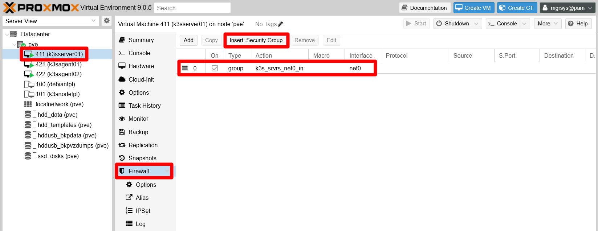

    Notice that not only I've inserted and enabled the corresponding `k3s_srvrs_net0_in` group, I've applied it to the `net0` interface of this VM.

5. Browse to the `k3sserver01` VM's `Firewall > IPSet` page and create an IP set for the `net0` network interface. In the case of the `k3sserver01` VM, it should be like this:

    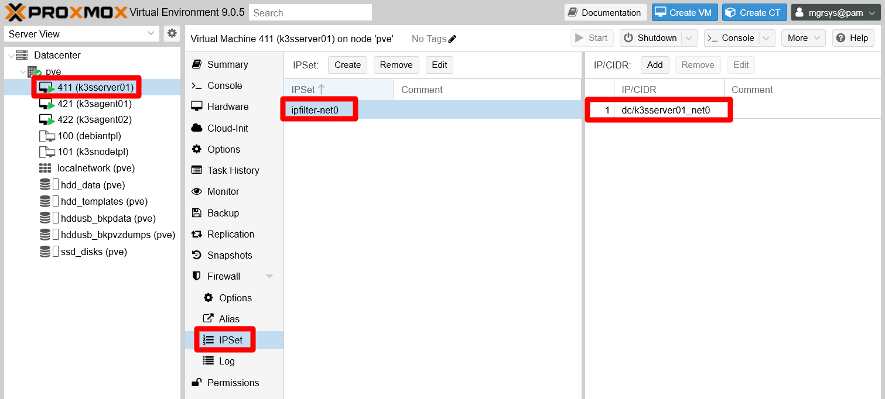

    Notice how the IP set's name follows the pattern `ipfilter-netX`, where "X" is the network interface's number in the VM. Keep the name as it is, since it's the one the Proxmox VE firewall expects for IP filtering. Also see how I've only added the aliased IP for the `net0` interface to the IP set, restricting to one the valid IPs that can initiate outgoing connections from that interface.

6. Now you can enable the firewall itself on `k3sserver01`. Go to the VM's `Firewall > Options` tab and `Edit` the `Firewall` field to enable it:

    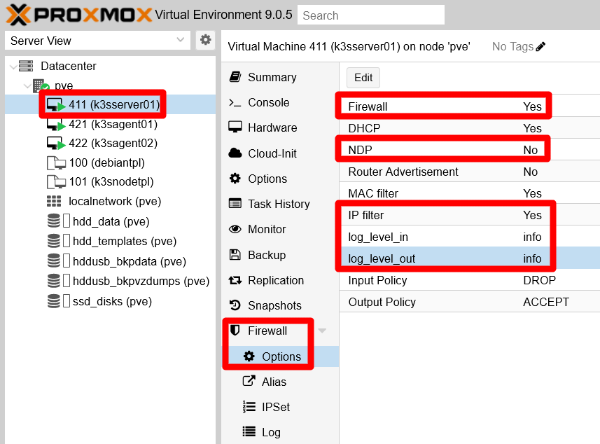

    Notice that I've also adjusted some other options:

    - The `NDP` option is disabled because is only useful for IPv6 networking, which is not active in any of the existing VMs.

    - The `IP filter` is enabled, which helps to avoid IP spoofing.

      > [!NOTE]
      > **Enabling the `IP filter` option is not enough**\
      > You need to specify the concrete IPs allowed in the network interface on which you want to apply this security measure, something you've just done in the previous step.

    - The `log_level_in` and `log_level_out` options are set to `info`, enabling the logging of the firewall on the VM. This allows you to see, in the `Firewall > Log` view of the VM, any incoming or outgoing traffic that gets dropped or rejected by the firewall.

    On the other hand, you must know that the firewall configuration you apply to the VM is saved as a `.fw` file in your Proxmox VE host, under the `/etc/pve/firewall` path. Open a shell as `mgrsys` on your Proxmox VE host and `cd` to that directory:

    ~~~sh
    $ cd /etc/pve/firewall
    ~~~

    There, execute an `ls` and see what files are there:

    ~~~sh
    $ ls
    411.fw  cluster.fw
    ~~~

    The `411.fw` file contains the firewall configuration for the `k3sserver01` VM, identified in Proxmox VE with the VM ID `411`. The `cluster.fw` is the file containing the whole Proxmox VE datacenter firewall configuration. If you open the `411.fw` file, you'll see the following content:

    ~~~properties
    [OPTIONS]

    enable: 1
    ndp: 0
    log_level_out: info
    ipfilter: 1
    log_level_in: info

    [IPSET ipfilter-net0]

    dc/k3sserver01_net0

    [RULES]

    GROUP k3s_srvrs_net0_in -i net0
    ~~~

7. As you've done with your K3s server node, now you have to apply the corresponding security group (`k3s_agnts_net0_in`) and other firewall configuration to the K3s agent node VMs, starting with the `k3sagent01` VM (with ID `421`). Applying this configuration will generate a `/etc/pve/firewall/421.fw` file that should look like below:

    ~~~properties
    [OPTIONS]

    log_level_in: info
    log_level_out: info
    ipfilter: 1
    ndp: 0
    enable: 1

    [IPSET ipfilter-net0]

    dc/k3sagent01_net0

    [RULES]

    GROUP k3s_agnts_net0_in -i net0
    ~~~

    This firewall setup for `k3sagent01` is almost identical to the one for `k3sserver01`:

    - The lines under `OPTIONS` might show up ordered differently, as it happens above, but they are the same as in the `k3sserver01` VM.

    - There is only one `IPSET` that applies an IP filter on the VM's `net0` network card.

    - The security group in the `GROUP` rules and alias in the `IPSET` directive correspond to the ones corresponding to the agent nodes.

8. Since the firewall configuration for the second K3s agent node is essentially the same as with the first one, instead of using the web console to set up the firewall for the other VM, open a shell as `mgrsys` on your Proxmox VE host and do the following.

    ~~~sh
    $ cd /etc/pve/firewall
    $ sudo cp 421.fw 422.fw
    ~~~

    Edit the new `422.fw` file to replace just the IP alias in the `IPSET` block with the correct one (`k3sagent02_net0`) for the `422` VM:

    ~~~properties
    [OPTIONS]

    log_level_in: info
    log_level_out: info
    ipfilter: 1
    ndp: 0
    enable: 1

    [IPSET ipfilter-net0]

    dc/k3sagent02_net0

    [RULES]

    GROUP k3s_agnts_net0_in -i net0
    ~~~

With the necessary ports open for the right IPs, you can now install the K3s software in your VMs. Also remember that it is not necessary to have the VMs running to configure their firewalls, and that the changes in the firewall configuration are put in effect immediately after the rules are enabled.

#### Port `6443` left closed on the server node's `net0` NIC

I listed the `6443` port as one of those to be opened in the `net0` network card of your server node. Why I haven't told you to open it in the firewall already? This port, on the `net0` NIC of your server nodes, is meant to be open only for external clients from which you'll manage remotely your K3s cluster. I'll explain how to set up such a client in the upcoming [chapter **G026**](G026%20-%20K3s%20cluster%20setup%2009%20~%20Setting%20up%20a%20kubectl%20client%20for%20remote%20access.md), where you will open the `6443` port on your server node accordingly.

## Considerations before installing the K3s software

To install the K3s software on any node, the procedure is essentially the same: you have to download and run a small executable and it will do everything to install and start the `k3s` service. But, before you install the K3s software, you must plan in advance how you want to configure your cluster. This is because you not only will configure the K3s service itself, but also which embedded services it will (or won't) deploy from the start and how those will run in your K3s cluster. In other words, the initial configuration determines how the K3s cluster and its services are configured, and reconfiguring all of it later can be a more complicated matter.

On the other hand, the K3s service installer supports two ways of being configured: by using arguments like any other command, or reading its settings from a configuration file. Here I'll show you how to do it with the configuration file.

### The K3s installer's configuration file

By default, the K3s installer looks for the `/etc/rancher/k3s/config.yaml` file in the system, although you can specify another path with the `--config` or `-c` argument.

Also know that the **K3s installer arguments take precedence over the parameters set in the file**. Avoid using the same argument both in the command and in the `config.yaml` file, because **only the command's value will stand**.

## K3s Server node setup

The very first nodes you must deploy in a Kubernetes cluster are those that run the control plane managing the cluster itself. They are the _server_ nodes in K3s jargon and, in this guide's cluster, there is only one you have to setup.

### Folder structure for K3s configuration files

In your K3s server node (`k3sserver01`), execute the following.

~~~sh
$ sudo mkdir -p /etc/rancher/k3s/ /etc/rancher/config.yaml.d/
~~~

Notice that I've created two folders, the `/etc/rancher/k3s/` expected by K3s by default and the `/etc/rancher/config.yaml.d/`. The idea is to put your own configuration files in the `config.yaml.d` directory and symlink them in the `k3s` one. This is convenient because, if you happen to uninstall the K3s software for some reason, the uninstaller also removes the `/etc/rancher/k3s/` folder completely.

### Enabling graceful shutdown on the server node

[The graceful node shutdown feature is available (as beta for now) and enabled by default in Kubernetes](https://kubernetes.io/docs/concepts/cluster-administration/node-shutdown/), and you can use it in your K3s cluster. This way, you can protect better your cluster nodes against unexpected failures or just ensuring that, when your Proxmox VE host shuts down, your K3s nodes also shutdown gracefully.

To configure this functionality in your cluster, you need to setup a configuration file with two specific parameters and, optionally, a system service for cleaning up any Kubernetes pods that could get stuck in their shutdown phase.

#### The `kubelet.conf` file

The configuration file you need to enable the graceful node shutdown can be called anything and be on any path accessible by the K3s service. So, let's use the folder structure created before and create in it the required file with a significant name.

1. Create a `kubelet.conf` file at `/etc/rancher/config.yaml.d`, and then symlink it in the `/etc/rancher/k3s` folder:

    ~~~sh
    $ sudo touch /etc/rancher/config.yaml.d/kubelet.conf
    $ sudo ln -s /etc/rancher/config.yaml.d/kubelet.conf /etc/rancher/k3s/kubelet.conf
    ~~~

    The file is named `kubelet.conf` because it affects the configuration of the kubelet process thar runs on each node of any Kubernetes cluster. Symlinking this file is not really necessary, its just a manner of keeping all the configuration files accesible through the same default K3s folder for coherence.

2. In the `kubelet.conf` file, put the following lines:

    ~~~yaml
    # Kubelet configuration
    apiVersion: kubelet.config.k8s.io/v1beta1
    kind: KubeletConfiguration

    shutdownGracePeriod: 30s
    shutdownGracePeriodCriticalPods: 10s
    ~~~

    The highlights from this YAML are:

    - `apiVersion`\
      The Kubernetes API used here is the beta one (`v1beta1`).

    - `kind`\
      Indicates the type of Kubernetes object specified in the file. In this case is a `KubeletConfiguration`, meant to be used for configuring the kubelet process that any Kubernetes node has running.

    - `shutdownGracePeriod`\
      Default value is `0`. Total delay period of the node's shutdown, which gives the regular pods this time MINUS the period specified in the `shutdownGracePeriodCriticalPods` parameter.

    - `shutdownGracePeriodCriticalPods`\
      Default value is `0`. This is the grace period conceded only to pods marked as critical. This value has to be lower than the `shutdownGracePeriod`.

      > [!IMPORTANT]
      > **The two `shutdownGracePeriod` parameters must have a non-zero value**\
      > Both the `shutdownGracePeriod` and the `shutdownGracePeriodCriticalPods` configuration options [must be set to **non-zero** values to enable the graceful shutdown functionality](https://kubernetes.io/docs/concepts/cluster-administration/node-shutdown/#configuring-graceful-node-shutdown).

    With the values set in the YAML above, the node will have `20` seconds to terminate all regular pods running in it, and `10` to end the critical ones.

#### Cleanup pods script

It might be that some pods don't shutdown in time and get stuck with the `Shutdown` status. They could reappear later as dead unevicted pods in your cluster after a reboot. To clean them up, you can prepare a system service in your server node that can get rid of them:

1. Create the `k3s-cleanup.service` file at `/lib/systemd/system/`.

    ~~~sh
    $ sudo touch /lib/systemd/system/k3s-cleanup.service
    ~~~

2. Put the next content in the `k3s-cleanup.service` file.

    ~~~properties
    [Unit]
    Description=k3s-cleanup
    StartLimitInterval=200
    StartLimitBurst=5
    Wants=k3s.service

    [Service]
    Type=oneshot
    ExecStart=kubectl delete pods --field-selector status.phase=Failed -A --ignore-not-found=true
    RemainAfterExit=true
    User=root
    StandardOutput=journal
    Restart=on-failure
    RestartSec=30

    [Install]
    WantedBy=multi-user.target
    ~~~

    Notice how, in the `ExecStart` parameter, the service invokes a `kubectl` command. Since it is not available in your server node yet, you cannot enable this service until you install the K3s software package in the VM.

### The `k3sserver01` node's `config.yaml` file

As I've already told you before, the `/etc/rancher/k3s/config.yaml` file is the one the K3s installer will try to read by default:

1. Create the `config.yaml` file as follows:

    ~~~sh
    $ sudo touch /etc/rancher/config.yaml.d/config.yaml
    $ sudo ln -s /etc/rancher/config.yaml.d/config.yaml /etc/rancher/k3s/config.yaml
    ~~~

    Notice how the `config.yaml` file is symlinked into the `/etc/rancher/k3s` folder, so the K3s installer can find it.

2. You'll also need some basic networking information from the VM itself, which you can get with the `ip` command.

    ~~~sh
    $ ip a
    1: lo: <LOOPBACK,UP,LOWER_UP> mtu 65536 qdisc noqueue state UNKNOWN group default qlen 1000
        link/loopback 00:00:00:00:00:00 brd 00:00:00:00:00:00
        inet 127.0.0.1/8 scope host lo
          valid_lft forever preferred_lft forever
    2: ens18: <BROADCAST,MULTICAST,UP,LOWER_UP> mtu 1500 qdisc fq state UP group default qlen 1000
        link/ether bc:24:11:81:81:59 brd ff:ff:ff:ff:ff:ff
        altname enp0s18
        altname enxbc2411818159
        inet 10.4.1.1/8 brd 10.255.255.255 scope global dynamic noprefixroute ens18
          valid_lft 79472sec preferred_lft 68672sec
    3: ens19: <BROADCAST,MULTICAST,UP,LOWER_UP> mtu 1500 qdisc fq state UP group default qlen 1000
        link/ether bc:24:11:54:d4:fa brd ff:ff:ff:ff:ff:ff
        altname enp0s19
        altname enxbc241154d4fa
        inet 172.16.1.1/12 brd 172.31.255.255 scope global ens19
          valid_lft forever preferred_lft forever
    ~~~

    The values you must have at hand are the IP for the first interface (`ens18` in the output above), and the IP and name of the second interface (`ens19`).

3. Next, edit the `/etc/rancher/k3s/config.yaml` file by adding the following content:

    ~~~yaml
    # k3sserver01

    cluster-domain: "homelab.cluster"
    tls-san:
      - "k3sserver01.homelab.cloud"
      - "10.4.1.1"
    flannel-backend: host-gw
    flannel-iface: "ens19"
    bind-address: "0.0.0.0"
    https-listen-port: 6443
    advertise-address: "172.16.1.1"
    advertise-port: 6443
    node-ip: "172.16.1.1"
    node-external-ip: "10.4.1.1"
    node-taint:
      - "node-role.kubernetes.io/control-plane=true:NoSchedule"
    kubelet-arg: "config=/etc/rancher/k3s/kubelet.conf"
    disable:
      - metrics-server
      - servicelb
    protect-kernel-defaults: true
    secrets-encryption: true
    agent-token: "SomeReallyLongPassword"
    ~~~

    The parameters from the `config.yaml` file above are explained next.

    - `cluster-domain`\
      Specify the base domain name used internally in your cluster for assigning DNS records to pods and services. By default is `cluster.local`. If you change it, make it different to the main domain name you want to use for accessing externally the services you'll deploy in your cluster later.

    - `tls-san`\
      Additional hostnames or IPs that will be applied as Subject Alternative Names in the self-generated TLS certs of the K3s service, meaning not the ones specified in the `bind-address`, `advertise-address`, `node-ip` or `node-external-ip` parameters.

      Put here the VM's full hostname and also the external IP of this server node to ensure that both values get included as Subject Alternative Names in its autogenerated TLS certificate. Otherwise, you will not be able to connect to your K3s cluster remotely with the official Kubernetes client using either the external IP or the full server node's hostname. Both will be rejected as not being "recognized" by the TLS certificate.

      > [!NOTE]
      > How to configure and use the Kubernetes client is explained [in the next chapter **G026**](G026%20-%20K3s%20cluster%20setup%2009%20~%20Setting%20up%20a%20kubectl%20client%20for%20remote%20access.md).

    - `flannel-backend`\
      [Flannel](https://github.com/coreos/flannel) is a plugin for handling the cluster's internal networking. Flannel supports four different network backend methods, being `vxlan` the default one. The `host-gw` backend set in the `config.yaml` above has better performance than `vxlan` for this guide's particular setup, something you really want to have in your rather hardware-constrained K3s cluster.

      > [!NOTE]
      > **Know more about the Flannel backend options**\
      > [In this related K3s documentation](https://docs.k3s.io/networking/basic-network-options#flannel-options) and [also here](https://stackoverflow.com/questions/45293321/why-host-gw-of-flannel-requires-direct-layer2-connectivity-between-hosts).

      > [!IMPORTANT]
      > **The backend you choose for your cluster will affect its performance, sometimes in a big way**\
      > For instance, the default `vxlan` proved to be an awful backend for my setup, making services respond not just slowly but erratically even. The solution was to use `host-gw`, which offered a very noticeable good performance. Therefore, be aware that you might need to run some tests to choose the right backend which suits your requirements and your cluster setup.

    - `flannel-iface`\
      Specifies through which interface you want Flannel to run. In this case, I'm making it use the internal bridged network (enabled through the `vmbr1` bridge in Proxmox VE) not exposed to the LAN.

    - `bind-address`\
      The address on which the K3s API service will listen. By default is already `0.0.0.0` (listening on all interfaces), but I find convenient making this and other default values explicit for clarity.

    - `https-listen-port`\
      The port through which the K3s API service will listen. By default is `6443`, change it if needed (but do not forget to update your firewall rules accordingly!).

    - `advertise-address`\
      The K3s API server will advertise through this IP to the other nodes in the cluster. See how I've used the IP meant for the internal bridged network.

    - `advertise-port`\
      Port used only to advertise the API to the other nodes in the cluster. By default takes the value set in the `https-listen-port` parameter.

    - `node-ip`\
      The internal IP the node uses to advertise itself in the cluster. Again, here I'm using the IP for the bridged network.

    - `node-external-ip`\
      The public or external IP where the node also advertises itself and through which it offers its services.

    - `node-taint`\
      A taint is a way used in Kubernetes to mark nodes and other objects with certain characteristics. In this case, with the `node-role.kubernetes.io/control-plane=true:NoSchedule` taint applied, this node will only perform control-plane tasks. Therefore, the `k3sserver01` node will not run any user workload, not even deployments for embedded services like Traefik.

    - `kubelet-arg`\
      Allows you to specify parameters to the kubelet process that runs in this node.

      - `config`\
        Path to a configuration file with parameters overwriting the kubelet defaults. In this case, the file is the one you've configured before to enable the node's graceful shutdown.

    - `disable`\
      For specifying which embedded components are not to be deployed in the cluster. In this case, you can see that I've disabled two embedded services:

      - `metrics-server`\
        Service for monitoring resources usage. It will be deployed as a regular service rather than an embedded one for adjusting its configuration to the particularities of the network setup used in this guide for the K3s cluster.

      - `servicelb`\
        This is the default load balancer. In the [chapter **G027**](G027%20-%20K3s%20cluster%20setup%2010%20~%20Deploying%20the%20MetalLB%20load%20balancer.md) you will learn how to deploy a better alternative.

    - `protect-kernel-defaults`\
      When set, the K3s service will return an error if certain Linux kernel `sysctl` parameters are different than the defaults required by the kubelet service. You already set those parameters properly in the previous [chapter **G024**](G024%20-%20K3s%20cluster%20setup%2007%20~%20K3s%20node%20VM%20template%20setup.md#setting-up-sysctl-kernel-parameters-for-k3s-nodes).

    - `secrets-encryption`\
      When the node is at rest, it will encrypt any secrets resources created in the cluster using a self-generated AES-CBC encrypted key. This option has to be set when the K3s cluster is created initially, not in a later reconfiguration. Otherwise, you will have authentication problems later with your cluster nodes. To know more about this feature, [read here about it](https://docs.k3s.io/security/secrets-encryption).

    - `agent-token`\
      Alternative shared password to be used only by agents to join the cluster.

      > [!IMPORTANT]
      > **The `agent-token` value is a shared key among all server nodes of the cluster**\
      > This password can be any string, but **all the server nodes of a cluster must have configured the same value**.

      Mind that this value is **just the password part** of what shall become the full agent token. The complete pattern of an agent token is as follows.

      ~~~sh
      K10<sha256 sum of cluster CA certificate>::node:<password>
      ~~~

      The cluster CA certificate is the `/var/lib/rancher/k3s/server/tls/server-ca.crt` file of the server node (or the first server in a multiserver cluster). The sha256 sum is already calculated in the first portion of the server token saved in the `/var/lib/rancher/k3s/server/token` file. Alternatively, you can calculate the sha256 sum yourself with the command `sudo sha256sum /var/lib/rancher/k3s/server/tls/server-ca.crt`.

      The `node` string is the username used by default for agents, whereas for server nodes the username is `server` (you can see this in the server token string saved in the file `/var/lib/rancher/k3s/server/token`).

### Installation of your K3s server node

With the `config.yaml` and the other configuration files ready, you can launch the installation of K3s in your VM.

#### K3s installation command

The command to execute in the server node is the following.

~~~sh
$ wget -qO - https://get.k3s.io | INSTALL_K3S_VERSION="v1.33.4+k3s1" sh -s - server
~~~

The command will find the `config.yaml` file in the default path on the VM, and apply it in the installation. Also noticed the following details in the command above.

- `wget`\
  Command for downloading the K3s installer. Instead of saving the executable into a file, `wget` dumps it into the shell output (option `-O` followed by `-`) to be consumed by the following pipe (`|`) command.

  > [!NOTE]
  > **The official K3s installation method uses `curl` for downloading the installer**\
  > Debian does not come with the `curl` command included by default, but `wget`.

- `INSTALL_K3S_VERSION`\
  [Environment variable](https://docs.k3s.io/reference/env-variables) for controlling what version of K3s you're installing on your system. It is optional and, when omitted altogether, the K3s installer will download and install the lastest stable release of K3s. To know which releases are available, check the [Releases page of K3s on GitHub](https://github.com/k3s-io/k3s/releases).

- `server`\
  Option to make the node run as a server in the cluster.

#### K3s installation of the server node `k3sserver01`

1. Execute the installation command on the `k3sserver01` VM:

    ~~~sh
    $ wget -qO - https://get.k3s.io | INSTALL_K3S_VERSION="v1.33.4+k3s1" sh -s - server
    [INFO]  Using v1.22.3+k3s1 as release
    [INFO]  Downloading hash https://github.com/k3s-io/k3s/releases/download/v1.22.3+k3s1/sha256sum-amd64.txt
    [INFO]  Downloading binary https://github.com/k3s-io/k3s/releases/download/v1.22.3+k3s1/k3s
    [INFO]  Verifying binary download
    [INFO]  Installing k3s to /usr/local/bin/k3s
    [INFO]  Skipping installation of SELinux RPM
    [INFO]  Creating /usr/local/bin/kubectl symlink to k3s
    [INFO]  Creating /usr/local/bin/crictl symlink to k3s
    [INFO]  Creating /usr/local/bin/ctr symlink to k3s
    [INFO]  Creating killall script /usr/local/bin/k3s-killall.sh
    [INFO]  Creating uninstall script /usr/local/bin/k3s-uninstall.sh
    [INFO]  env: Creating environment file /etc/systemd/system/k3s.service.env
    [INFO]  systemd: Creating service file /etc/systemd/system/k3s.service
    [INFO]  systemd: Enabling k3s unit
    Created symlink /etc/systemd/system/multi-user.target.wants/k3s.service → /etc/systemd/system/k3s.service.
    [INFO]  systemd: Starting k3s
    ~~~

2. The installer does not take too long to do its job. Still, give some time to the `k3s.service`, which will start at the end of the installation, to setup itself. Open another shell session to this VM and check with the `kubectl` command the current status of this new K3s server node:

    ~~~sh
    $ sudo kubectl get nodes
    NAME          STATUS     ROLES                  AGE   VERSION
    k3sserver01   NotReady   control-plane,master   14s   v1.33.4+k3s1
    ~~~

    > [!IMPORTANT]
    > **The AGE column means how old the node is since it was created**\
    > It is NOT about how long the node has been running in the current session.

    At first, it will probably show the `NotReady` status for a moment. This depends on the capabilities given to your VM, so wait a bit and then execute again the `kubectl` command. But this time, lets use `kubectl` with a couple of extra options to get more information about the cluster:

    ~~~sh
    $ sudo kubectl get nodes -o wide
    NAME          STATUS   ROLES                  AGE    VERSION        INTERNAL-IP   EXTERNAL-IP   OS-IMAGE                       KERNEL-VERSION        CONTAINER-RUNTIME
    k3sserver01   Ready    control-plane,master   2m6s   v1.33.4+k3s1   172.16.1.1    10.4.1.1      Debian GNU/Linux 13 (trixie)   6.12.41+deb13-amd64   containerd://2.0.5-k3s2
    ~~~

    See how now the `k3sserver01` node is `Ready` now. Also notice which roles has assigned: is not only a `master` of the cluster, but also has a `control-plane` role. This K3s node will only worry about managing the cluster, not running workloads, unless the workloads are compatible with the `node-role.kubernetes.io/control-plane=true:NoSchedule` taint given before to this server node in its installation.

    On the other hand, you can verify that the IPs are assigned as expected, the one of the first network interface is the `EXTERNAL-IP` and the one of the second NIC is the `INTERNAL-IP`. Moreover, now you can see other information about the container runtime that is running in the cluster.

3. If at this point the installer hasn't returned the control to your shell prompt yet, just get ouf of it by pressing `Ctrl+C`.

#### Enabling the `k3s-cleanup` service

With the K3s software installed in your server node, you can enable the `k3s-cleanup` service you prepared before for automatically cleaning up any pods that get stuck with a shutdown status after a reboot:

~~~sh
$ sudo systemctl enable k3s-cleanup.service
$ sudo systemctl start k3s-cleanup.service
~~~

Also, check it's current status:

~~~sh
$ sudo systemctl status k3s-cleanup.service
● k3s-cleanup.service - k3s-cleanup
     Loaded: loaded (/usr/lib/systemd/system/k3s-cleanup.service; enabled; preset: enabled)
     Active: active (exited) since Wed 2025-09-10 12:51:50 CEST; 5s ago
 Invocation: 8495690ffa7747488b97ef03338a58a3
    Process: 5652 ExecStart=kubectl delete pods --field-selector status.phase=Failed -A --ignore-not-found=true (code=exited, status=0/SUCCESS)
   Main PID: 5652 (code=exited, status=0/SUCCESS)
   Mem peak: 22M
        CPU: 510ms

Sep 10 12:51:49 k3sserver01 systemd[1]: Starting k3s-cleanup.service - k3s-cleanup...
Sep 10 12:51:50 k3sserver01 kubectl[5652]: No resources found
Sep 10 12:51:50 k3sserver01 systemd[1]: Finished k3s-cleanup.service - k3s-cleanup.
~~~

In this service status output, you can see in its last lines the logs of the `kubectl` command this service invokes for cleaning up pods. This time there was nothing to clean up, which is expected since you don't have anything running yet in your still incomplete cluster.

This service **can only run on server nodes**, because those are the ones which can fully run the `kubectl` command. I'll explain a bit more about this detail later in this chapter.

## K3s Agent nodes setup

The procedure to setup your two remaining VMs as K3s agent nodes is mostly the same as with the server node. The few things that change are the parameters specified in the `config.yaml` files and an argument in the installer command:

1. Create the `config.yaml` file for the installer:

    ~~~sh
    $ sudo mkdir -p /etc/rancher/config.yaml.d /etc/rancher/k3s
    $ sudo touch /etc/rancher/config.yaml.d/config.yaml /etc/rancher/config.yaml.d/kubelet.conf
    $ sudo ln -s /etc/rancher/config.yaml.d/config.yaml /etc/rancher/k3s/config.yaml
    $ sudo ln -s /etc/rancher/config.yaml.d/kubelet.conf /etc/rancher/k3s/kubelet.conf
    ~~~

2. Put in the `kubelet.conf` the same content as in the server node:

    ~~~yaml
    # Kubelet configuration
    apiVersion: kubelet.config.k8s.io/v1beta1
    kind: KubeletConfiguration

    shutdownGracePeriod: 30s
    shutdownGracePeriodCriticalPods: 10s
    ~~~

3. Edit the `config.yaml` files, being aware of the particular values required on each agent node:

    Configuration for the `k3sagent01` node:

    ~~~properties
    # k3sagent01

    flannel-iface: "ens19"
    node-ip: "172.16.2.1"
    node-external-ip: "10.4.2.1"
    server: "https://172.16.1.1:6443"
    token: "K10<sha256 sum of server node CA certificate>::node:<PasswordSetInServerNode>"
    kubelet-arg: "config=/etc/rancher/k3s/kubelet.conf"
    protect-kernel-defaults: true
    ~~~

    Configuration for the `k3sagent02` node:

    ~~~properties
    # k3sagent02

    flannel-iface: "ens19"
    node-ip: "172.16.2.2"
    node-external-ip: "10.4.2.2"
    server: "https://172.16.1.1:6443"
    token: "K10<sha256 sum of server node CA certificate>::node:<PasswordSetInServerNode>"
    kubelet-arg: "config=/etc/rancher/k3s/kubelet.conf"
    protect-kernel-defaults: true
    ~~~

    The `token` value in these two `config.yaml` files is the same for all the agent nodes. Remember how to build it:

    - The `K10` part can be taken directly from the server token saved in the `/var/lib/rancher/k3s/server/token` file at the server node.

    - The `node` string is the username for all the agent nodes.

    - The password is the one defined as `agent-token` in the server node.

4. With the `config.yaml` and `kubelet.conf` files ready, you can launch the K3s installer on **both** your `k3sagentXX` VMs:

    ~~~sh
    $ wget -qO - https://get.k3s.io | INSTALL_K3S_VERSION="v1.33.4+k3s1" sh -s - agent
    ~~~

    Notice that at the end of the command there's an `agent` parameter, indicating that the installer will setup and launch a `k3s-agent.service` which only runs agent worloads.

5. On the server node, execute `watch sudo kubectl get nodes -o wide` to monitor the joining of your new agent nodes in your K3s cluster:

    ~~~sh
    Every 2.0s: sudo kubectl get nodes -o wide                                                                                                                                    k3sserver01: Wed Sep 10 13:11:50 2025

    NAME          STATUS   ROLES                  AGE   VERSION        INTERNAL-IP   EXTERNAL-IP   OS-IMAGE                       KERNEL-VERSION        CONTAINER-RUNTIME
    k3sagent01    Ready    <none>                 50s   v1.33.4+k3s1   172.16.2.1    10.4.2.1      Debian GNU/Linux 13 (trixie)   6.12.41+deb13-amd64   containerd://2.0.5-k3s2
    k3sagent02    Ready    <none>                 51s   v1.33.4+k3s1   172.16.2.2    10.4.2.2      Debian GNU/Linux 13 (trixie)   6.12.41+deb13-amd64   containerd://2.0.5-k3s2
    k3sserver01   Ready    control-plane,master   25m   v1.33.4+k3s1   172.16.1.1    10.4.1.1      Debian GNU/Linux 13 (trixie)   6.12.41+deb13-amd64   containerd://2.0.5-k3s2
    ~~~

    > [!NOTE]
    > The new nodes will need some time to appear in the list and reach the `Ready` status.

    The `watch` command executes a command every two seconds by default, and constantly displays its newest output. To get out of this command, use `Ctrl+C`.

6. If the K3s installer on any of your agent nodes does not return control to the prompt after that node has reached the `Ready` state, just `Ctrl+C` out of it.

With the agent nodes running, your K3s Kubernetes cluster is completed and will deploy immediately on the agents all the embedded services that is allowed to run initially.

## Understanding your cluster through `kubectl`

Congratulations, your K3s cluster is up and running! Now you'd like to know how to get all the information possible from your cluster, right? In your current setup, the command for managing the cluster and getting all the information is `kubectl`:

- `kubectl help`\
  Lists the commands supported by `kubectl`.

- `kubectl <command> --help`\
  Shows the help relative to a concrete command, for instance `kubectl get --help` will return extensive information about the `get` command.

- `kubectl options`\
  Lists all the options that can be passed to ANY `kubectl` command.

- `kubectl api-resources`\
  Lists the resources supported in the K3s cluster, like nodes or pods.

> [!NOTE]
> **Use `less` to paginate long outputs**\
> Since the help texts can be lenghty, use a `| less` after any of the commands listed above to get a paginated output, rather than having the text directly dumped in your shell.

In particular, the main command for retrieving information about what's going on in your cluster is `kubectl get`. You've already used it to see the nodes, but you can also see other resources like pods, services and many other. Next, I list a few examples to give you an idea of this command's usage:

- `kubectl get pods -Ao wide`\
  Information about the pods running in your cluster. Notice here that only agent nodes are running the pods, since the servers are tainted not to do so:

    ~~~sh
    $ sudo kubectl get pods -Ao wide
    NAMESPACE     NAME                                      READY   STATUS      RESTARTS   AGE   IP          NODE          NOMINATED NODE   READINESS GATES
    kube-system   coredns-64fd4b4794-klv8f                  1/1     Running     0          39m   10.42.0.3   k3sserver01   <none>           <none>
    kube-system   helm-install-traefik-crd-qg8c4            0/1     Completed   0          39m   10.42.2.3   k3sagent01    <none>           <none>
    kube-system   helm-install-traefik-pqljk                0/1     Completed   2          39m   10.42.2.2   k3sagent01    <none>           <none>
    kube-system   local-path-provisioner-774c6665dc-gwmhv   1/1     Running     0          39m   10.42.0.2   k3sserver01   <none>           <none>
    kube-system   traefik-c98fdf6fb-zmkcn                   1/1     Running     0          15m   10.42.1.2   k3sagent02    <none>           <none>
    ~~~

    See that each pod has its own IP, and that it has nothing to do with the one defined as internal IP for the cluster.

- `kubectl get services -Ao wide`\
  Information about the services running in your cluster. Be aware that a service could be running in several pods at the same time:

    ~~~sh
    $ sudo kubectl get services -Ao wide
    NAMESPACE     NAME         TYPE           CLUSTER-IP     EXTERNAL-IP   PORT(S)                      AGE   SELECTOR
    default       kubernetes   ClusterIP      10.43.0.1      <none>        443/TCP                      41m   <none>
    kube-system   kube-dns     ClusterIP      10.43.0.10     <none>        53/UDP,53/TCP,9153/TCP       41m   k8s-app=kube-dns
    kube-system   traefik      LoadBalancer   10.43.174.63   <pending>     80:30512/TCP,443:32647/TCP   16m   app.kubernetes.io/instance=traefik-kube-system,app.kubernetes.io/name=traefik
    ~~~

    See here that each service has its own cluster IP, different from the internal IP (configured in the installation process) and the pods IPs.

- `kubectl get pv -Ao wide`\
  Lists the persistent volumes active in the cluster. See that instead of using the full `persistentvolumes` resource name, I've typed the shortname `pv`. Not all resources have a shortname, something you should check in the list returned by `kubectl api-resources`.

    ~~~sh
    $ sudo kubectl get pv -Ao wide
    No resources found
    ~~~

    At this point, you don't have any persistent volume active in your cluster.

- `kubectl get pvc -Ao wide`\
  Returns the persitent volume clamins (`pvc` is shorthand for `persistentvolumeclaims`) active in the cluster.

    ~~~sh
    $ sudo kubectl get pvc -Ao wide
    No resources found
    ~~~

    Like the persistent volumes, there are no persistent volume claims active in your cluster at this point.

- `kubectl get all -Ao wide`\
  Gives you information of all resources active in your cluster. Since this list can be long, append `| less` to this command to see the output paginated.

    ~~~sh
    $ sudo kubectl get all -Ao wide
    NAMESPACE     NAME                                          READY   STATUS      RESTARTS   AGE   IP          NODE          NOMINATED NODE   READINESS GATES
    kube-system   pod/coredns-64fd4b4794-klv8f                  1/1     Running     0          44m   10.42.0.3   k3sserver01   <none>           <none>
    kube-system   pod/helm-install-traefik-crd-qg8c4            0/1     Completed   0          44m   10.42.2.3   k3sagent01    <none>           <none>
    kube-system   pod/helm-install-traefik-pqljk                0/1     Completed   2          44m   10.42.2.2   k3sagent01    <none>           <none>
    kube-system   pod/local-path-provisioner-774c6665dc-gwmhv   1/1     Running     0          44m   10.42.0.2   k3sserver01   <none>           <none>
    kube-system   pod/traefik-c98fdf6fb-zmkcn                   1/1     Running     0          19m   10.42.1.2   k3sagent02    <none>           <none>

    NAMESPACE     NAME                 TYPE           CLUSTER-IP     EXTERNAL-IP   PORT(S)                      AGE   SELECTOR
    default       service/kubernetes   ClusterIP      10.43.0.1      <none>        443/TCP                      44m   <none>
    kube-system   service/kube-dns     ClusterIP      10.43.0.10     <none>        53/UDP,53/TCP,9153/TCP       44m   k8s-app=kube-dns
    kube-system   service/traefik      LoadBalancer   10.43.174.63   <pending>     80:30512/TCP,443:32647/TCP   19m   app.kubernetes.io/instance=traefik-kube-system,app.kubernetes.io/name=traefik

    NAMESPACE     NAME                                     READY   UP-TO-DATE   AVAILABLE   AGE   CONTAINERS               IMAGES                                    SELECTOR
    kube-system   deployment.apps/coredns                  1/1     1            1           44m   coredns                  rancher/mirrored-coredns-coredns:1.12.3   k8s-app=kube-dns
    kube-system   deployment.apps/local-path-provisioner   1/1     1            1           44m   local-path-provisioner   rancher/local-path-provisioner:v0.0.31    app=local-path-provisioner
    kube-system   deployment.apps/traefik                  1/1     1            1           19m   traefik                  rancher/mirrored-library-traefik:3.3.6    app.kubernetes.io/instance=traefik-kube-system,app.kubernetes.io/name=traefik

    NAMESPACE     NAME                                                DESIRED   CURRENT   READY   AGE   CONTAINERS               IMAGES                                    SELECTOR
    kube-system   replicaset.apps/coredns-64fd4b4794                  1         1         1       44m   coredns                  rancher/mirrored-coredns-coredns:1.12.3   k8s-app=kube-dns,pod-template-hash=64fd4b4794
    kube-system   replicaset.apps/local-path-provisioner-774c6665dc   1         1         1       44m   local-path-provisioner   rancher/local-path-provisioner:v0.0.31    app=local-path-provisioner,pod-template-hash=774c6665dc
    kube-system   replicaset.apps/traefik-c98fdf6fb                   1         1         1       19m   traefik                  rancher/mirrored-library-traefik:3.3.6    app.kubernetes.io/instance=traefik-kube-system,app.kubernetes.io/name=traefik,pod-template-hash=c98fdf6fb

    NAMESPACE     NAME                                 STATUS     COMPLETIONS   DURATION   AGE   CONTAINERS   IMAGES                                      SELECTOR
    kube-system   job.batch/helm-install-traefik       Complete   1/1           24m        44m   helm         rancher/klipper-helm:v0.9.8-build20250709   batch.kubernetes.io/controller-uid=551768ff-ea03-4961-b8c7-1eeb7a95a156
    kube-system   job.batch/helm-install-traefik-crd   Complete   1/1           24m        44m   helm         rancher/klipper-helm:v0.9.8-build20250709   batch.kubernetes.io/controller-uid=ea8fb86b-942d-4b0b-8f57-7b95fa23ff8a
    ~~~

In all these examples see that I've used the `-Ao wide` options, which are related to the `get` command:

- The `A` is for getting the resources from all the namespaces present in the cluster.
- The `o` is for indicating the format of the output returned by `kubectl get`. The `wide` string just indicates one of the formats available in the command.

Also, don't forget that you can combine those `kubectl` commands with `watch` whenever you need to run a real time monitoring from your shell of the entities active in your cluster.

### The `kubectl` command has to be executed with `sudo` in server nodes

Given how the K3s cluster is configured, **`kubectl` must be executed with `sudo` in the cluster's server nodes**. Otherwise, you will only see the following warning output:

~~~sh
$ kubectl version
WARN[0000] Unable to read /etc/rancher/k3s/k3s.yaml, please start server with --write-kubeconfig-mode or --write-kubeconfig-group to modify kube config permissions
error: error loading config file "/etc/rancher/k3s/k3s.yaml": open /etc/rancher/k3s/k3s.yaml: permission denied
~~~

This is because the `kubectl` command embedded in the K3s installation tries to read the kubeconfig file `/etc/rancher/k3s/k3s.yaml`, and this file is protected with `root` rights. This is the safe configuration, but you could change the permissions of the `k3s.yaml` file using the `write-kubeconfig-mode` parameter in the `config.yaml` file as follows.

~~~yaml
...
write-kubeconfig-mode: "0644"
...
~~~

Above you see how you can change the mode of the `k3s.yaml` file, with values used with the `chmod` command. But, again, **the safe configuration is the default one**. The proper thing to do is to access from a remote client that has the `kubectl` command installed and configured in it, a matter that gets explained in the upcoming [chapter **G026**](G026%20-%20K3s%20cluster%20setup%2009%20~%20Setting%20up%20a%20kubectl%20client%20for%20remote%20access.md).

### The `kubectl` command does not work on pure agent nodes

The `kubectl` command does not work on pure agent nodes like the ones in your K3s cluster. This is because pure agents are not meant to manage the cluster, and lack the required control plane components for such tasks. Without those components, `kubectl` will fail to run. Confirm this just by executing the `kubectl version` command on any agent node:

~~~sh
$ sudo kubectl version
Client Version: v1.33.4+k3s1
Kustomize Version: v5.6.0
The connection to the server localhost:8080 was refused - did you specify the right host or port?
~~~

See that the final output line warns about the server in `localhost:8080` refusing connection, just the component the `kubectl` program needs to work.

You'll be asking yourself, why the `kubectl` command is also installed in the agent nodes? This is because it is embedded in the K3s software package, and the installation makes it also available in whichever system K3s gets installed.

## Enabling bash autocompletion for `kubectl`

To make the use of the `kubectl` command a bit easier, you can enable the bash autocompletion in your server node. This little hack will help you enter `kubectl` commands a bit more faster:

1. **Execute the following only in your server node** (remember, `kubectl` is useless in the agent nodes):

    ~~~sh
    $ sudo touch /usr/share/bash-completion/completions/kubectl
    $ sudo kubectl completion bash | sudo tee /usr/share/bash-completion/completions/kubectl
    ~~~

    The second command line will output a long script. It is what goes into the `kubectl` file.

2. Then, execute the following `source` command to enable the new bash autocompletion rules.

    ~~~sh
    source ~/.bashrc
    ~~~

## Regular K3s logs are journaled

The `k3s.service` running in all your K3s cluster nodes is configured to leave its logs in the Debian journaling system. To see the K3s logs specifically, you must execute the following command:

~~~sh
$ sudo journalctl -u k3s
~~~

Try this in the server node first, which is where you will see many log entries. The agents will not have anything logged yet since they are not running any workload.

## Rotating the `containerd.log` file

There is a log in the K3s setup for which you need to configure its rotation with `logrotate`: the file `/var/lib/rancher/k3s/agent/containerd/containerd.log`. Since it is an agent node log file, you have to do the following in all your nodes:

1. Create the file `/etc/logrotate.d/k3s-containerd`.

    ~~~sh
    $ sudo touch /etc/logrotate.d/k3s-containerd
    ~~~

2. Edit the `k3s-containerd` file by adding the following configuration block to it.

    ~~~sh
    /var/lib/rancher/k3s/agent/containerd/containerd.log {
        daily
        rotate 5
        missingok
        notifempty
        dateext
        compress
        delaycompress
    }
    ~~~

    The logrotate directives in the file mean the following.

    - `daily`\
      The log rotation will be done daily.

    - `rotate`\
      How many times a log file is rotated before is finally deleted.

    - `missingok`\
      If there is no log file to rotate, it's just ignored rather than provoking an error.

    - `notifempty`\
      If the current log file is empty, it's not rotated.

    - `dateext`\
      Adds a date extension to the rotated log files, by default it's a string following the `YYYYMMDD` schema.

    - `compress`\
      Makes logrotate compress with gzip the rotated log files.

    - `delaycompress`\
      The previous log to the current one will be rotated but not compressed.

    To know more about the logrotate directives, just check `man logrotate` in any of your cluster nodes.

3. Test this new configuration.

    ~~~sh
    $ sudo logrotate -d /etc/logrotate.d/k3s-containerd
    ~~~

    With the `-d` option, `logrotate` will do a dry run and also print some debug information:

    ~~~sh
    warning: logrotate in debug mode does nothing except printing debug messages!  Consider using verbose mode (-v) instead if this is not what you want.

    reading config file /etc/logrotate.d/k3s-containerd
    Reading state from file: /var/lib/logrotate/status
    Allocating hash table for state file, size 64 entries
    Creating new state
    Creating new state
    Creating new state
    Creating new state
    Creating new state
    Creating new state
    Creating new state

    Handling 1 logs

    rotating pattern: /var/lib/rancher/k3s/agent/containerd/containerd.log after 1 days empty log files are not rotated, (5 rotations), old logs are removed
    considering log /var/lib/rancher/k3s/agent/containerd/containerd.log
    Creating new state
      Now: 2025-09-10 16:30
      Last rotated at 2025-09-10 16:00
      log does not need rotating (log has already been rotated)
    ~~~

    Notice the final line which says that the `log does not need rotating`. It means that, if you execute the same `logrotate` command but without the `-d` parameter, it won't rotate the log at this moment.

## K3s relevant paths

Something you should also know is where the K3s relevant paths are. On all the nodes of your K3s cluster you have the two following paths:

- `/etc/rancher`
- `/var/lib/rancher/k3s`

From here on, the differences start between the server and the agent nodes. In the following subsections I list some paths you should be aware of on each node type.

### K3s paths at SERVER nodes

#### K3s server paths under the `/etc/rancher` folder

- `/etc/rancher/k3s/k3s.yaml`\  
    Kubeconfig file in which your K3s setup has its cluster, context and credentials defined. In other words, this file is used to configure access to the Kubernetes cluster. By default, this file can only be accessed by the system's `root` user, forcing you to use `sudo` to execute `kubectl` commands.

- `/etc/rancher/node/password`\
    Randomly generated password for the node, used by agents to register in the cluster (servers also have the agent processes active, since they are also K3s nodes).

#### K3s server paths under the `/etc/systemd/system` folder

- `/etc/systemd/system/k3s.service`\
    Service script that runs the K3s server node. Like with any other systemd services, you can manage it with `systemctl` commands, for instance `sudo systemctl status k3s.service`.

- `/etc/systemd/system/k3s.service.env`\
    An associated file for setting environment variables for the `k3s.service`. It is already called by the `k3s.service` script, but the installer creates it empty.

#### K3s server paths under the `/var/lib/rancher/k3s` folder

- `/var/lib/rancher/k3s/agent`\
    This root-restricted folder is related to agent functionality. Contains configuration files, certificates and manifests.

- `/var/lib/rancher/k3s/data`\
    Holds the busybox related binaries of command tools that come included with the K3s installation. Also has the configuration for the embedded [strongSwan](https://strongswan.org/) IPsec solution which provides encryption and authentication to the K3s cluster nodes.

- `/var/lib/rancher/k3s/server`\
    This root-restricted folder is related to server functionality, so you'll only find it in server nodes. Contains configuration files and certificates related to the server functionality like, for instance, the internal database.

- `/var/lib/rancher/k3s/server/token`\
    File containing a self-generated token used for authenticating when joining the cluster. Is symlinked by a `node-token` file also present in the same folder.

- `/var/lib/rancher/k3s/server/manifests`\
    Contains the yaml manifests that configure the services and resources which run in a default K3s installation. For instance, here you'll find the manifests that configure the embedded Traefik service running in your K3s cluster.

### K3s paths at AGENT nodes

#### K3s agent paths under the `/etc/rancher` folder

- `/etc/rancher/node/password`\
    Randomly generated password for the node, used by agents to register in the cluster.

#### K3s agent paths under the `/etc/systemd/system` folder

- `/etc/systemd/system/k3s-agent.service`\
    Service script that runs the K3s agent node. Like with any other systemd services, you can manage it with `systemctl` commands, for instance `sudo systemctl status k3s-agent.service`.

- `/etc/systemd/system/k3s-agent.service.env`\
    An associated file for setting environment variables for the `k3s-agent.service`. It is already called by the `k3s-agent.service` script, but the installer creates it empty.

#### K3s agent paths under the `/var/lib/rancher/k3s` folder

- `/var/lib/rancher/k3s/agent`\
    This root-restricted folder is related to agent functionality. Contains configuration files, certificates and manifests.

- `/var/lib/rancher/k3s/data`\
    Holds the busybox related binaries of command tools that come included with the K3s installation.

## Starting up and shutting down the K3s cluster nodes

In a K3s/Kubernetes cluster you need to apply a certain order to start the whole cluster properly:

- First the server nodes or, at least, one of them.
- Then the agent nodes, but only when you have started at least one server.

And what about the shutting down order? As you may suppose, it is the same but just in reverse: agents first, then the servers. **Be sure of always shut down (NOT halting, mind you) the agents first** and doing it, of course, gracefully (using the feature you've specifically configured during the K3s installation). If you happen to shut down the servers first, the agents could get hang up waiting for the servers to be available again. This could force you to halt the agent VMs ungracefully, or to kill all the K3s process inside them before proceeding to shut those VMs down. Of course, this is a messy way of stopping the cluster so, again, remember: **shut down first the agents, then the servers**.

The question now is, do you have to start and shutdown the VMs of your K3s cluster manually every time? Not at all, Proxmox VE has the ability to start your VMs when your host boots up, and even allows you to specify in which order. The VM IDs are also relevant in the order in which the VMs are start or shut down, something [previously mentioned in this chapter](#creation-of-vms-based-on-the-k3s-node-vm-template).

### Automatic ordered start or shutdown of the K3s nodes VMs

1. In your Proxmox VE web console, go to your `k3sserver01` server VM and open its `Options` page:

    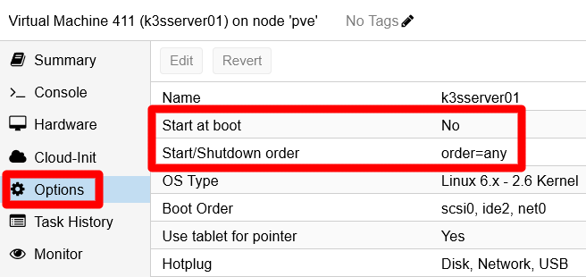

    The two options highlighted above are the ones related to the automatic start and shutdown process managed by Proxmox VE.

2. Edit `Start at boot`, which is composed only of one checkbox:

    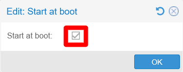

    Enable it and press `OK`. Be aware that this action won't start the VM in that moment, it's only marking it to autostart at your Proxmox VE host's boot time.

3. Now edit the `Start/Shutdown order` option:

    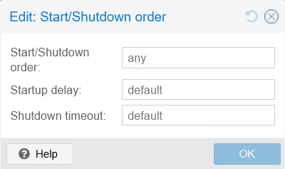

    I'll explain below this feature's parameters:

    - `Start/Shutdown order`\
      This is an integer number that indicates in which order you want to start AND shutdown this VM. The ordering works as follows:

      - **At boot time, lower numbers start before higher numbers**\
        A VM with order `1` will be booted up by Proxmox VE before another having a `2` or a higher value.

      - **At shutdown, higher numbers get shutdown before lower numbers**\
        A VM with order `2` or higher will shutdown _before_ another with any lower value.

      - If two or more VMs have the same value on this field, they'll be ordered by VM ID using the same criteria as with the order value. So, if your K3s nodes have the same order, lets say `1`, the VM with the lower ID will start before another with a higher one.

      - VMs with the default value `any` in this field will always start after the ones that have a concrete number set here.

      - The ordering behaviour of Proxmox VE for VMs that have this value set as `any` is not explicitly explained in the Proxmox VE official documentation. I think it can be safely assumed that it would be like as if they have the same order value, hence the VM ID can be expected to be the one used as ordering value.

    - `Startup delay`\
      Number of seconds that Proxmox VE must wait before it can boot up the next VM after this one. For instance, setting this field with a value of 30, it would make Proxmox VE wait 30 seconds till it can start the next VM in order. The default value here is 0 seconds (not explicitly detailed in the Proxmox VE documentation).

    - `Shutdown timeout`\
      Number of seconds that Proxmox VE concedes to the VM to shutdown gracefully. If the VM hasn't shutdown by the time this countdown reaches 0, Proxmox VE will halt the VM forcefully. The default value is 180 seconds.

    > [!IMPORTANT]
    > **The `Start/Shutdown order` option only works with VMs hosted in the same Proxmox VE node**\
    > If you have a Proxmox VE cluster of two or more nodes (instead of the standalone node setup used in this guide), this option would not be shared cluster wide. This feature just works in a node-per-node basis. To have cluster-wide ordering, you have to use the HA (High Availability) manager, which offers its own ways to do such things. Furthermore, VMs managed by HA ignore this `Start/Shutdown order` option altogether.

4. Set your server node with a `Start/Shutdown order` of 1, a `Startup delay` of 10 seconds, and leave the `Shutdown timeout` with the `default` value. Press `OK` and return to the VM's `Options` page:

    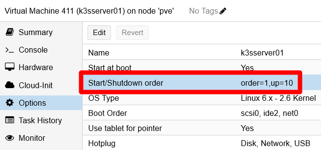

    The startup delay, shown as `up=10` in the `Start/Shutdown order` option, will make Proxmox VE wait 10 seconds before starting up any other VM that may come after this one. This is convenient to give some time to your server to fully start up before it can serve the agent nodes in your K3s cluster.

5. In the other VMs, those acting as agent nodes of your cluster, you have to edit the same options but, this time, just give the same higher order number (like 2) to all of them:

    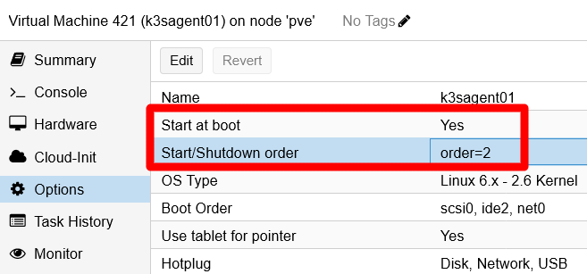

    This way, the agent nodes will start in order of VM ID: first the VM 421, then the VM 422. And both of them will start after the delay of 10 seconds set in the `k3sserver01` node, the VM 411.

6. Reboot your Proxmox VE host, your only `pve` node in your `Datacenter`, with the `Reboot` button:

    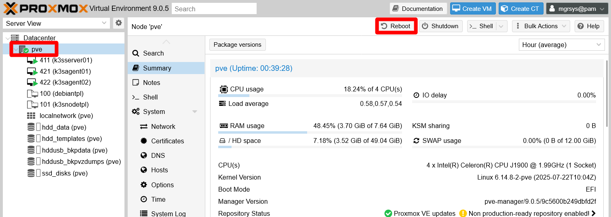

7. After rebooting your Proxmox VE host, get back inside the web console and open the `Tasks` log console at the bottom. There you'll see listed when the VMs start and shutdown tasks started. Pay particular attention to the time difference between the `VM 411 - Start` and the `VM 421-Start` tasks. In my case, it required more than the configured 10 seconds delay:

    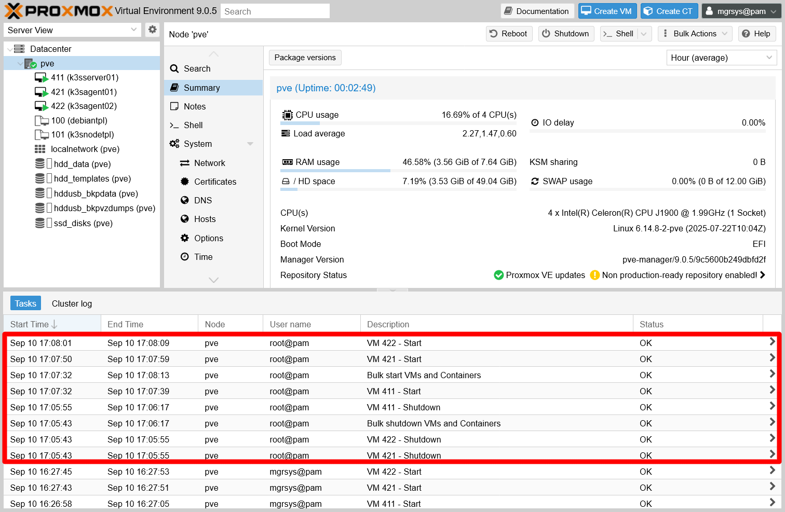

    The logs `Bulk shutdown VMs and Containers` and `Bulk start VMs and Containers` will also appear representing the tasks executing those two processes.

### Understanding the shutdown/reboot process of your Proxmox VE host with the K3s cluster running

When you press the `Shutdown` or the `Reboot` button on the Proxmox VE web console, what you're really doing is sending the corresponding signal to your host to execute those actions. This is the same as executing the `reboot` or `shutdown` commands on a shell in your host, or just pressing the power or reset button on the machine running Proxmox VE. Your VMs also shutdown because they have the Qemu guest agent running, through which they automatically receive the same shutdown signal.

On the other hand, you might be thinking now that the NUT configuration you've done in the VMs is kind of redundant. After all, when the UPS kicks in it already provokes a shutdown action of your whole Proxmox VE system, including the VMs.  Still, consider that a shutdown provoked by the UPS is something unexpected, and having the NUT clients in your VMs allows you to apply more fine grained behaviours with shell scripts that can be launched within your VMs whenever some UPS-related event happens.

### Warning about the Kubernetes graceful shutdown feature

This feature is still considered beta, so it could give you surprises. I'll give you an example from my experience with the older K3s release `v1.22.3+k3s1` of K3s. After a graceful reboot, the pods appeared as `Terminated` although they were actually running. This is something you can detect with `kubectl` when checking the pods like in the output below:

~~~sh
$ kubectl get pods -n kube-system
NAME                                     READY   STATUS       RESTARTS      AGE
helm-install-traefik-crd--1-bjv95        0/1     Completed    0             30h
helm-install-traefik--1-zb5gb            0/1     Completed    1             30h
local-path-provisioner-64ffb68fd-zxm2v   1/1     Terminated   3 (17m ago)   30h
coredns-85cb69466-9l6ws                  1/1     Terminated   3 (21m ago)   30h
traefik-74dd4975f9-tdv42                 1/1     Terminated   3 (21m ago)   29h
metrics-server-5b45cf8dbb-nv477          1/1     Terminated   1 (21m ago)   28m
~~~

Notice the `STATUS` column. All the pods that appear `Terminated` there are in fact `Running`. How can you tell? The `READY` column informs you that there's 1 out of 1 pods ready (`1/1`), but should be 0 out of 1 if in fact no pod was running. Just be aware of this quirk, kind of unsurprising when using a beta feature.

## Relevant system paths

### Folders on the Proxmox VE host

- `/etc/pve/firewall`

### Files on the Proxmox VE host

- `/etc/pve/firewall/2101.fw`
- `/etc/pve/firewall/3111.fw`
- `/etc/pve/firewall/3112.fw`
- `/etc/pve/firewall/cluster.fw`

### Folders on the VMs/K3s nodes

- `/etc`
- `/etc/bash_completion.d`
- `/etc/logrotate.d`
- `/etc/network`
- `/etc/rancher`
- `/etc/rancher/k3s`
- `/etc/rancher/config.yaml.d`
- `/etc/rancher/node`
- `/etc/sysctl.d`
- `/etc/systemd/system`
- `/home/mgrsys`
- `/home/mgrsys/.ssh`
- `/var/lib/rancher/k3s`
- `/var/lib/rancher/k3s/agent`
- `/var/lib/rancher/k3s/agent/containerd`
- `/var/lib/rancher/k3s/data`
- `/var/lib/rancher/k3s/server`
- `/var/lib/rancher/k3s/server/manifests`
- `/var/lib/rancher/k3s/server/tls`

### Files on the VMs/K3s nodes

- `/etc/bash_completion.d/kubectl`
- `/etc/logrotate.d/k3s`
- `/etc/network/interfaces`
- `/etc/rancher/k3s/config.yaml`
- `/etc/rancher/k3s/k3s.yaml`
- `/etc/rancher/config.yaml.d/config.yaml`
- `/etc/rancher/node/password`
- `/etc/systemd/system/k3s.service`
- `/etc/systemd/system/k3s.service.env`
- `/home/mgrsys/.google_authenticator`
- `/home/mgrsys/.ssh/authorized_keys`
- `/home/mgrsys/.ssh/id_rsa`
- `/home/mgrsys/.ssh/id_rsa.pub`
- `/var/lib/rancher/k3s/agent/containerd/containerd.log`
- `/var/lib/rancher/k3s/server/token`
- `/var/lib/rancher/k3s/server/tls/server-ca.crt`

## References

### Proxmox VE

- [Firewall IP sets](https://pve.proxmox.com/wiki/Firewall#pve_firewall_ip_sets)
- [IPFilter vs IPSet](https://forum.proxmox.com/threads/ipfilter-vs-ipset.36127/#post-384591)
- [How to apply proxmox firewall rules to VMs?](https://serverfault.com/questions/801617/how-to-apply-proxmox-firewall-rules-to-vms)
- [Startup Order](https://forum.proxmox.com/threads/startup-order.13629/)
- [Automatic Start and Shutdown of Virtual Machines](https://pve.proxmox.com/pve-docs/chapter-qm.html#qm_startup_and_shutdown)
- [Clean scheduled reboot](https://forum.proxmox.com/threads/clean-scheduled-reboot.38386/)
- [Shutdown VM's and CT's from Proxmox Shutdown Command?](https://www.reddit.com/r/Proxmox/comments/agdfgj/shutdown_vms_and_cts_from_proxmox_shutdown_command/)
- [Fix Proxmox Can’t Stop VM Issue – Step-by-Step Solutions](https://bobcares.com/blog/proxmox-cant-stop-vm/)
- [UPS APC to shutdown VMs?](https://forum.proxmox.com/threads/ups-apc-to-shutdown-vms.54695/)

### Debian and Linux SysOps

#### Changing the `Hostname`

- [How to Change Hostname in Debian](https://linuxhandbook.com/debian-change-hostname/)

#### Network interfaces configuration

- [Debian: add and configure VLAN](https://docs.gz.ro/debian-linux-vlan.html)
- [How to setup a Static IP address on Debian Linux](https://linuxconfig.org/how-to-setup-a-static-ip-address-on-debian-linux)
- [Howto: Ubuntu Linux convert DHCP network configuration to static IP configuration](https://www.cyberciti.biz/tips/howto-ubuntu-linux-convert-dhcp-network-configuration-to-static-ip-configuration.html)
- [Debian Linux Configure Network Interface Cards – IP address and Netmasks](https://www.cyberciti.biz/faq/howto-configuring-network-interface-cards-on-debian/)
- [For those wanting to play with VLANs](https://forums.virtualbox.org/viewtopic.php?f=1&t=38037)
- [Open vSwitch. Documentation. VLANs](https://docs.openvswitch.org/en/latest/faq/vlan/)
- [Configure openvswitch in virtualization  environment and use it for simple and complex (ex: vlan) testing in centos/rhel/fedora..etc](https://www.humblec.com/configure-openvswitch-in-virt-environment/)
- [How to setup and save vlans on ethernet](https://askubuntu.com/questions/660506/how-to-setup-and-save-vlans-on-ethernet)
- [Proxmox OVS VLANs any idea how to do ?](https://www.reddit.com/r/Proxmox/comments/7prxig/proxmox_ovs_vlans_any_idea_how_to_do/)
- [Wikipedia. Reserved IP addresses. IPv4](https://en.wikipedia.org/wiki/Reserved_IP_addresses#IPv4)

#### Logrotate configuration

- [logrotate(8) — Linux manual page](https://www.man7.org/linux/man-pages/man8/logrotate.8.html)
- [How to Setup and Manage Log Rotation Using Logrotate in Linux](https://www.tecmint.com/install-logrotate-to-manage-log-rotation-in-linux/)
- [How to Install and Configure logrotate on Linux](https://www.osradar.com/how-to-install-and-configure-logrotate-on-linux/)

#### Downloading files with `wget`

- [Execute Bash Script Directly. Installation and Usage – wget](https://www.baeldung.com/linux/execute-bash-script-from-url#installation-and-usage---wget)
- [How to disable HTTP redirect in wget](https://www.xmodulo.com/disable-http-redirect-wget.html)

### K3s cluster setup

#### [Kubernetes](https://kubernetes.io/)

- [Cluster Architecture](https://kubernetes.io/docs/concepts/architecture/)
  - [Control plane components](https://kubernetes.io/docs/concepts/architecture/#control-plane-components)

- [kubectl completion](https://kubernetes.io/docs/reference/kubectl/generated/kubectl_completion/)

- [How to Enable kubectl Autocompletion in Bash?](https://www.digitalocean.com/community/questions/how-to-enable-kubectl-autocompletion-in-bash)
- [How to enable kubernetes commands autocomplete](https://stackoverflow.com/questions/53444924/how-to-enable-kubernetes-commands-autocomplete)

#### K3s configuration

- [K3s. Releases](https://github.com/k3s-io/k3s/releases)

- [Architecture](https://docs.k3s.io/architecture)

- [Installation](https://docs.k3s.io/installation)
  - [Configuration Options. Configuration File](https://docs.k3s.io/installation/configuration#configuration-file)

- [CLI Tools. k3s server](https://docs.k3s.io/cli/server)
- [CLI Tools. k3s agent](https://docs.k3s.io/cli/agent)

- [Basic Network Options](https://docs.k3s.io/networking/basic-network-options)

- [K3s. Issues. Node taint k3s-controlplane=true:NoExecute](https://github.com/k3s-io/k3s/issues/1401)

- [Secrets Encryption Config](https://docs.k3s.io/security/secrets-encryption)

- [Is there any way to bind K3s / flannel to another interface?](https://stackoverflow.com/questions/66449289/is-there-any-way-to-bind-k3s-flannel-to-another-interface)
- [401 Unauthorized message when joining a single-node cluster](https://github.com/k3s-io/k3s/issues/2463)
- [k3s + Gitlab. Remote Access with kubectl](https://github.com/apk8s/k3s-gitlab#remote-access-with-kubectl)
- [How to Install and Configure K3s on Ubuntu 18.04](https://www.liquidweb.com/kb/how-to-install-and-configure-k3s-on-ubuntu-18-04/)
- [Home Server with k3s](https://www.publish0x.com/awesome-self-hosted/home-server-with-k3s-xdnwrmx)
- [Questions regarding the server node's agent-token parameter](https://github.com/k3s-io/k3s/discussions/3443)
- [Question: Problem setting up k3s in my VPS](https://www.reddit.com/r/k3s/comments/nl85h2/question_problem_setting_up_k3s_in_my_vps/)

#### Flannel

- [Flannel Backends](https://github.com/flannel-io/flannel/blob/master/Documentation/backends.md)
- [K3s. Basic Network Options](https://docs.k3s.io/networking/basic-network-options)
  - [Flannel Options](https://docs.k3s.io/networking/basic-network-options#flannel-options)
- [K3S Supports Container Network Interface (CNI) and Flannel](https://www.henrydu.com/2020/11/16/k3s-cni-flannel/)
- [why host-gw of flannel requires direct layer2 connectivity between hosts?](https://stackoverflow.com/questions/45293321/why-host-gw-of-flannel-requires-direct-layer2-connectivity-between-hosts)
- [Flannel Networking Demystify](https://msazure.club/flannel-networking-demystify/)
- [Configure Kubernetes Network With Flannel](https://dzone.com/articles/configure-kubernetes-network-with-flannel)
- [Configure Kubernetes Network with Flannel](https://appfleet.com/blog/configure-kubernetes-network-with-flannel/)
- [flannel host-gw network](https://hustcat.github.io/flannel-host-gw-network/)
- [Kubernetes the not so hard way with Ansible - Harden the instances - (K8s v1.21)](https://www.tauceti.blog/posts/kubernetes-the-not-so-hard-way-with-ansible-harden-the-instances/)

#### Graceful node shutdown

- [Graceful Node Shutdown Goes Beta](https://kubernetes.io/blog/2021/04/21/graceful-node-shutdown-beta/)

- [Node Shutdowns](https://kubernetes.io/docs/concepts/cluster-administration/node-shutdown/)
  - [Graceful node shutdown](https://kubernetes.io/docs/concepts/cluster-administration/node-shutdown/#graceful-node-shutdown)
    - [Configuring graceful node shutdown](https://kubernetes.io/docs/concepts/cluster-administration/node-shutdown/#configuring-graceful-node-shutdown)

- [Set Kubelet parameters via a config file](https://kubernetes.io/docs/tasks/administer-cluster/kubelet-config-file/)

- [K3s. Graceful Node shutdown Single Node Cluster](https://github.com/k3s-io/k3s/discussions/4319)

#### Embedded software in K3s

- [Kubernetes](https://kubernetes.io/)
- [CoreDNS](https://coredns.io/)
- [Traefik](https://traefik.io/)
- [Traefik on GitHub](https://github.com/traefik/traefik)
- [Kine](https://github.com/k3s-io/kine)
- [SQLite](https://sqlite.org/index.html)
- [Etcd](https://etcd.io/)
- [Etcd K3s version on GitHub](https://github.com/k3s-io/etcd)
- [Containerd](https://containerd.io/)
- [Containerd K3s version on GitHub](https://github.com/k3s-io/containerd)
- [Runc](https://github.com/opencontainers/runc)
- [Flannel](https://github.com/flannel-io/flannel)
- [Metrics-server](https://github.com/kubernetes-sigs/metrics-server)
- [Helm-controller](https://github.com/k3s-io/helm-controller)
- [Local-path-provisioner](https://github.com/rancher/local-path-provisioner)

### [YAML](http://yaml.org/)

- [YAML Tutorial](https://www.tutorialspoint.com/yaml/index.htm)

## Navigation

[<< Previous (**G024. K3s cluster setup 07**)](G024%20-%20K3s%20cluster%20setup%2007%20~%20K3s%20node%20VM%20template%20setup.md) | [+Table Of Contents+](G000%20-%20Table%20Of%20Contents.md) | [Next (**G026. K3s cluster setup 09**) >>](G026%20-%20K3s%20cluster%20setup%2009%20~%20Setting%20up%20a%20kubectl%20client%20for%20remote%20access.md)
