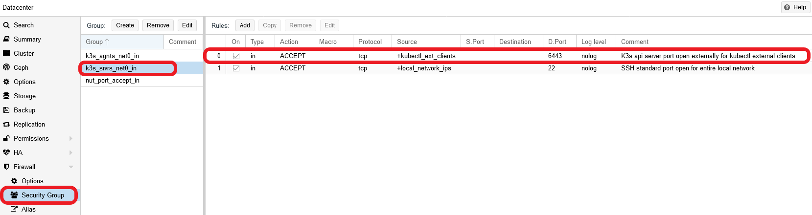

# G026 - K3s cluster setup 09 ~ Setting up a `kubectl` client for remote access

To manage a K3s Kubernetes cluster through `kubectl` is recommended not to do it directly from the _server_ nodes, but to connect remotely from another computer. This way, you won't have to copy your `.yaml` files describing your deployments or configurations directly on any of your server nodes.

## Scenario

In this guide I'll assume that you want to access remotely your K3s cluster from a Debian-based Linux computer. This guide will use the `curl` command, which may not come installed in your Linux distribution. In a Debian system, install the `curl` package as follows:

~~~bash
$ sudo apt install -y curl
~~~

## Getting the right version of `kubectl`

The first thing you must know is the version of the K3s cluster you're going to connect to. This is important because `kubectl` is guaranteed to be compatible only with its own correlative version or those that are at one _minor_ version of difference from it. For instance, at the time of writing this guide, the latest `kubectl` _minor_ version is 1.22, meaning that it's compatible with the 1.21, 1.22 and future 1.23 versions of the Kubernetes api. K3s follows the same versioning system, since it's "just" a particular distribution of Kubernetes.

To check the version of your K3s cluster, connect to your `k3sserver01` **serve node** and execute the following `k3s` command.

~~~bash
$ sudo k3s --version
k3s version v1.22.3+k3s1 (61a2aab2)
go version go1.16.8
~~~

The line `k3s version` is the one you have to pay attention to and, in particular, read the `v1.22.3` part. This K3s server node is running Kubernetes version `1.22.3`, and you can connect to it with the latest `1.22` version you can get of the `kubectl` command.

To know which is the latest stable release of Kubernetes, check [this `stable.txt` file](https://dl.k8s.io/release/stable.txt) online. It just contains a version string which, at the time of writing this, is `v1.22.4`.

## Installing `kubectl` on your client system

Now you know the version of `kubectl` you have to put in your client system, but first you must prepare it to install the command. First of all, don't install `kubectl` with a software manager like apt or yum. This is to avoid that a regular update changes your version of the command to an uncompatible one with your cluster, or not being able to upgrade `kubectl` because some reason of other. So, better make a manual, non system-wide installation of `kubectl` in your client computer.

Said that, let's proceed with this manual installation of `kubectl`.

1. Get into your client system as your preferred user and open a shell terminal in it. Then, remaining in the $HOME directory of your user, execute the following `mkdir` command.

    ~~~bash
    $ mkdir -p $HOME/bin $HOME/.kube
    ~~~

    The folders I've created are the following.

    - `$HOME/bin`: in some Linux systems like Debian, this directory is already in the `$PATH` of any user, but has to be created.
    - `$HOME/.kube`: where the kubectl command will look for the configuration file to connect to the K3s cluster.

2. Download the `kubectl` command in your `$HOME/bin/kubectl-bin` folder with `curl` as follows.

    ~~~bash
    $ curl -L "https://dl.k8s.io/release/$(curl -L -s https://dl.k8s.io/release/stable.txt)/bin/linux/amd64/kubectl" -o $HOME/bin/kubectl
    ~~~

    Check with `ls` the file you've downloaded.

    ~~~bash
    $ ls bin
    kubectl
    ~~~

3. Adjust the permission of this file so only your current user can execute it.

    ~~~bash
    $ chmod 700 $HOME/bin/kubectl
    ~~~

At this point, **DON'T** execute the `kubectl` command yet! You still need to get the configuration for connecting with the cluster, so keep reading.

## Getting the configuration for accessing the K3s cluster

The configuration file you need is inside the server nodes of your K3s cluster.

1. Get into your K3s cluster's server node, and open the `/etc/rancher/k3s/k3s.yaml` file in it. It should look like below.

    ~~~yaml
    apiVersion: v1
    clusters:
    - cluster:
        certificate-authority-data: LS0tLS1CRUdJTiBDRVJUSUZJQ0FURS0tLS0tCk1JSUJlRENDQVIyZ0F3SUJBZ0lCQURBS0JnZ3Foa2pPUFFRREFqQWpNU0V3SHdZRFZRUUREQmhyTTNNdGMyVnkKZG1WeUxXTmhRREUyTXpFMk9UZzNOamt3SGhjTk1qRXdPVEUxTURrek9USTVXaGNOTXpFd09URXpNRGt6T1RJNQpXakFqTVNFd0h3WURWUVFEREJock0zTXRjMlZ5ZG1WeUxXTmhRREUyTXpFMk9UZzNOamt3V1RBVEJnY3Foa2pPClBRSUJCZ2dxaGtqT1BRTUJCd05DQUFSZXNVc2ZwMzllVHZURkVYbE5xaDlNZUkraStuSTRDdzgrWkZZLzUyVDIKWVJkRkpQQy85TjlDRVpXVUpRYzFKeXdOOE00dGlLNDlPV3hOdE10aWdaUElvMEl3UURBT0JnTlZIUThCQWY4RQpCQU1DQXFRd0R3WURWUjBUQVFIL0JBVXdBd0VCL3pBZEJnTlZIUTRFRmdRVTYzZDVVTFUvRXNkRHZnQ1ZVMjc3CkplS1hzam93Q2dZSUtvWkl6ajBFQXdJRFNRQXdSZ0loQU5WUERDZ3k1MjdacGRMOWs5SVNpcnlIc2xVY21jK2YKcCtFeGxVcW9HZVhTQWlFQXFrb1c3RHpOR3dVVnNQTTlsWjlucm9wOXdwbjR4Ny9wczZZRUhYUDg1djQ9Ci0tLS0tRU5EIENFUlRJRklDQVRFLS0tLS0K
        server: https://0.0.0.0:6443
      name: default
    contexts:
    - context:
        cluster: default
        user: default
      name: default
    current-context: default
    kind: Config
    preferences: {}
    users:
    - name: default
      user:
        client-certificate-data: LS0tLS1CRUdJTiBDRVJUSUZJQ0FURS0tLS0tCk1JSUJrRENDQVRlZ0F3SUJBZ0lJWW9QcXlYOVJtSFF3Q2dZSUtvWkl6ajBFQXdJd0l6RWhNQjhHQTFVRUF3d1kKYXpOekxXTnNhV1Z1ZEMxallVQXhOak14TmprNE56WTVNQjRYRFRJeE1Ea3hOVEE1TXpreU9Wb1hEVEl5TURreApOVEE1TXpreU9Wb3dNREVYTUJVR0ExVUVDaE1PYzNsemRHVnRPbTFoYzNSbGNuTXhGVEFUQmdOVkJBTVRESE41CmMzUmxiVHBoWkcxcGJqQlpNQk1HQnlxR1NNNDlBZ0VHQ0NxR1NNNDlBd0VIQTBJQUJOcG53a0Y4ZFdmWEU5ZW4KNmd0TWt5Z0YyTDVWdUJCZERCVk9aaWVCbG1IcHdHZlZ4SzBpeHdYelplQkxKZmZLR2twTG9GQXc5SWZSNmdhQgpEc2xGR2JtalNEQkdNQTRHQTFVZER3RUIvd1FFQXdJRm9EQVRCZ05WSFNVRUREQUtCZ2dyQmdFRkJRY0RBakFmCkJnTlZIU01FR0RBV2dCVG5SazNaN0RmdGhML255QnE1WUZyaXVBenpnREFLQmdncWhrak9QUVFEQWdOSEFEQkUKQWlCOXM3THJJT3RLRTNYZitaMVBmWG1QSTFJSWREamVjcHB6U0RwRE04Q1pNd0lnTFpsU3ozTFhNeURnZ2EwMgpDME4rRVk2OGwvRm1Od08vSGU2Wk90OCtMRkE9Ci0tLS0tRU5EIENFUlRJRklDQVRFLS0tLS0KLS0tLS1CRUdJTiBDRVJUSUZJQ0FURS0tLS0tCk1JSUJlRENDQVIyZ0F3SUJBZ0lCQURBS0JnZ3Foa2pPUFFRREFqQWpNU0V3SHdZRFZRUUREQmhyTTNNdFkyeHAKWlc1MExXTmhRREUyTXpFMk9UZzNOamt3SGhjTk1qRXdPVEUxTURrek9USTVXaGNOTXpFd09URXpNRGt6T1RJNQpXakFqTVNFd0h3WURWUVFEREJock0zTXRZMnhwWlc1MExXTmhRREUyTXpFMk9UZzNOamt3V1RBVEJnY3Foa2pPClBRSUJCZ2dxaGtqT1BRTUJCd05DQUFUUytJNk0ycEk3VllvRGxKUkdXTXZXSUZ4SXU4RUlCTFhpK1RZQVpyM3cKNFY1S052aUtoajBwWFdwZG8xWnJnNmpITmJHUzFINjZpUVdZMTZwWk96VnhvMEl3UURBT0JnTlZIUThCQWY4RQpCQU1DQXFRd0R3WURWUjBUQVFIL0JBVXdBd0VCL3pBZEJnTlZIUTRFRmdRVTUwWk4yZXczN1lTLzU4Z2F1V0JhCjRyZ004NEF3Q2dZSUtvWkl6ajBFQXdJRFNRQXdSZ0loQUpXMCtrN1lXUHJhamV2dGtzMmlHQjMyTG5tS2ZCcGMKbHhXbVBvOEVIeDdpQWlFQXQ3L1hIbVBNNlJzNDBsUUREZGEwTUpINmJ2bGl0MnVLNGpoMHVxbGNqZUU9Ci0tLS0tRU5EIENFUlRJRklDQVRFLS0tLS0K
        client-key-data: LS0tLS1CRUdJTiBFQyBQUklWQVRFIEtFWS0tLS0tCk1IY0NBUUVFSUpCTkxJK0ZtNFNqZUlqUFBiSnFNRWlDWmtuU1dJL0JOYnNWWVM1VkhydTZvQW9HQ0NxR1NNNDkKQXdFSG9VUURRZ0FFMm1mQ1FYeDFaOWNUMTZmcUMweVRLQVhZdmxXNEVGME1GVTVtSjRHV1llbkFaOVhFclNMSApCZk5sNEVzbDk4b2FTa3VnVUREMGg5SHFCb0VPeVVVWnVRPT0KLS0tLS1FTkQgRUMgUFJJVkFURSBLRVktLS0tLQo=
    ~~~

2. Copy the `k3s.yaml` file in your client system, then move it to the `.kube` folder in your user's `$HOME` path but renamed as `config`.

    ~~~bash
    $ mv k3s.yaml $HOME/.kube/config
    ~~~

    Then adjust the permissions and ownership of the `config` file as follows.

    ~~~bash
    $ chmod 640 $HOME/.kube/config
    $ chown youruser:yourusergroup $HOME/.kube/config
    ~~~

    - Alternatively, you could just create the `config` file, then paste the contents of the `k3s.yaml` file in it.

        ~~~bash
        $ touch $HOME/.kube/config ; chmod 640 $HOME/.kube/config
        ~~~

3. Edit the `config` file and edit the `server:` line present there. You'll have to replace the url with the external IP and port of the K3s server node from which you got the configuration file. For instance, it could be `https://192.168.1.21:6443` (the `k3sserver01` node in this guide series).

    ~~~yaml
    ...
        server: https://192.168.1.21:6443
    ...
    ~~~

    Save the change to the file.

## Opening the `6443` port in the K3s server node

Now is the moment to open the `6443` port on the external IPs of your K3s server node, but only for the IP of your `kubectl` client. I'll list you briefly the steps to do so.

1. Go to your Proxmox VE web console, then go to the `Datacenter > Firewall > Alias` view. There, add your client's IP as a new alias, but giving it a significant name. For instance, you could use the following schema.

    ~~~bash
    ext_sys_[client's hostname]_net[network interface number]
    ~~~

    If the client happened to be called `kubectl_client`, the alias would be named `ext_sys_kubectl_client_net0`.

2. Browse to the `Datacenter > Firewall > IPSet` page and create a new IP set called `kubectl_ext_clients`. Add to it the alias created in the previous step.

3. Go to the `Datacenter > Firewall > Security Group` page. Add to the `k3s_srvrs_net0_in` security group the following rule.

    - Type `in`, Action `ACCEPT`, Protocol `tcp`, Source `kubectl_ext_clients`, Dest. port `6443`, Comment `K3s api server port open externally for kubectl external clients`.

    The security group should end looking like in the next screenshot.

    

4. To verify that you can connect to the cluster, try in your client the `kubectl cluster-info` command.

    ~~~bash
    $ kubectl cluster-info 
    Kubernetes control plane is running at https://192.168.1.21:6443
    CoreDNS is running at https://192.168.1.21:6443/api/v1/namespaces/kube-system/services/kube-dns:dns/proxy
    Metrics-server is running at https://192.168.1.21:6443/api/v1/namespaces/kube-system/services/https:metrics-server:/proxy

    To further debug and diagnose cluster problems, use 'kubectl cluster-info dump'.
    ~~~

And this is it! From now on, you can execute any `kubectl` command you want on your cluster from this particular client.

## Enabling bash autocompletion for `kubectl`

If you are using bash in your client system, you can enable the bash autocompletion for `kubectl`.

1. Open a terminal in your client system and do the following.

    ~~~bash
    $ sudo touch /etc/bash_completion.d/kubectl
    $ kubectl completion bash | sudo tee /etc/bash_completion.d/kubectl
    ~~~

2. Then, execute the following `source` command to enable the new bash autocompletion rules.

    ~~~bash
    source ~/.bashrc
    ~~~

## **Kubeval**, tool for validating Kubernetes configuration files

Since from now on you're going to deal with Kubernetes configuration files, you'd like to know if they're valid **before** you apply them in your K3s cluster. To help you with this task, there's a command line tool called [**Kubeval**](https://www.kubeval.com/) that you can install in your `kubectl` client system [as follows](https://www.kubeval.com/installation/).

1. Download the compressed package containing the executable in your `$HOME/bin` directory (which you created already during the `kubectl` setup).

    ~~~bash
    $ cd $HOME/bin ; wget https://github.com/instrumenta/kubeval/releases/latest/download/kubeval-linux-amd64.tar.gz
    ~~~

2. Unpackage the `tar.gz`'s contents.

    ~~~bash
    $ tar xvf kubeval-linux-amd64.tar.gz 
    ~~~

3. The `tar` command will extract three files. One is the `kubeval` command, the other two are a `LICENSE` and a `README.md` file that you can delete together with the `tar.gz`.

    ~~~bash
    $ rm kubeval-linux-amd64.tar.gz LICENSE README.md
    ~~~

4. The kubeval command already comes enabled for execution, but you might like to restrict its permission mode so only your user can execute it.

    ~~~bash
    $ chmod 700 kubeval
    ~~~

5. Test the command by getting its version.

    ~~~bash
    $ kubeval --version
    Version: 0.16.1
    Commit: f5dba6b486fa18b9179b91e15eb6f2b0f7a5a69e
    Date: 2021-03-30T15:17:06Z
    ~~~

> **BEWARE!**  
> Theres's an important issue with this command, as of its `0.16.1` version at least. It cannot validate the Kubernetes kustomize `kustomization.yaml` files (which you'll use a lot in upcoming guides) properly and returns errors where it shouldn't while checking them.

## Relevant system paths

### _Folders in client system_

- `$HOME`
- `$HOME/.kube`
- `$HOME/bin`

### _Files in client system_

- `$HOME/.kube/config`
- `$HOME/bin/kubectl`
- `$HOME/bin/kubeval`

### _Folder in K3s server node_

- `/etc/rancher/k3s`

### _File in K3s server node_

- `/etc/rancher/k3s/k3s.yaml`

## References

- [Install and Set Up `kubectl` on Linux](https://kubernetes.io/docs/tasks/tools/install-kubectl-linux/)
- [K3s cluster access](https://rancher.com/docs/k3s/latest/en/cluster-access/)
- [Kubeval](https://www.kubeval.com/)

## Navigation

[<< Previous (**G025. K3s cluster setup 08**)](G025%20-%20K3s%20cluster%20setup%2008%20~%20K3s%20Kubernetes%20cluster%20setup.md) | [+Table Of Contents+](G000%20-%20Table%20Of%20Contents.md) | [Next (**G027. K3s cluster setup 10**) >>](G027%20-%20K3s%20cluster%20setup%2010%20~%20Deploying%20the%20MetalLB%20load%20balancer.md)
