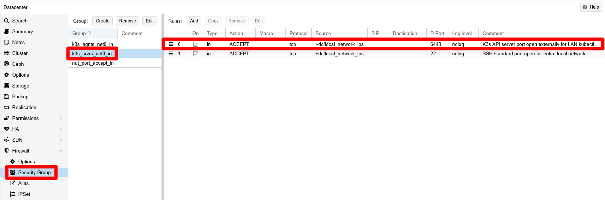

# G026 - K3s cluster setup 09 ~ Setting up a `kubectl` client for remote access

- [Never handle your Kubernetes cluster directly from server nodes](#never-handle-your-kubernetes-cluster-directly-from-server-nodes)
- [Description of the `kubectl` client system](#description-of-the-kubectl-client-system)
- [Getting the right version of `kubectl`](#getting-the-right-version-of-kubectl)
- [Installing `kubectl` on your client system](#installing-kubectl-on-your-client-system)
- [Getting the configuration for accessing the K3s cluster](#getting-the-configuration-for-accessing-the-k3s-cluster)
- [Opening the `6443` port in the K3s server node](#opening-the-6443-port-in-the-k3s-server-node)
- [Enabling bash autocompletion for `kubectl`](#enabling-bash-autocompletion-for-kubectl)
- [Validate Kubernetes configuration files with `kubeconform`](#validate-kubernetes-configuration-files-with-kubeconform)
- [Relevant system paths](#relevant-system-paths)
  - [Folders in client system](#folders-in-client-system)
  - [Files in client system](#files-in-client-system)
  - [Folder in K3s server node](#folder-in-k3s-server-node)
  - [File in K3s server node](#file-in-k3s-server-node)
- [References](#references)
  - [Kubernetes](#kubernetes)
  - [K3s](#k3s)
  - [kubeconform](#kubeconform)
- [Navigation](#navigation)

## Never handle your Kubernetes cluster directly from server nodes

To manage a K3s Kubernetes cluster through `kubectl` is recommended not to do it directly from the server nodes, but to connect remotely from another client computer. This way, you do not have to copy your `.yaml` files describing your deployments or configurations directly on any of your server nodes.

## Description of the `kubectl` client system

This chapter assumes that you want to access your K3s cluster remotely from a Debian-based Linux client system. For convenience, this chapter uses the `curl` command which may not come installed by default in your client system. In a Debian-based system, you can install the `curl` package as follows:

~~~sh
$ sudo apt install -y curl
~~~

## Getting the right version of `kubectl`

The first thing you must know is the version of the K3s cluster you are going to connect to. This is important because `kubectl` is guaranteed to be compatible only with its own correlative version or those that are at one _minor_ version of difference from it.

For instance, at the time of writing this chapter, the latest `kubectl` _minor_ version is 1.34, meaning that it has guaranteed compatibility with the 1.33, 1.34 and 1.35 versions of the Kubernetes api. K3s follows the same versioning system, since it is "just" a particular distribution of Kubernetes.

Open a shell to your `k3sserver01` server node and check your K3s software version with this `k3s` command:

~~~sh
$ sudo k3s --version
k3s version v1.33.4+k3s1 (148243c4)
go version go1.24.5
~~~

Look at the `k3s version` line and read the `v1.33.4` part. This K3s server node is running Kubernetes version `1.33.4`, and you can connect to it with the latest `1.34` version you can get of the `kubectl` command.

To know which is the latest stable release of Kubernetes, check [this `stable.txt` file](https://dl.k8s.io/release/stable.txt) online. It just contains a version string which, at the time of writing this, is `v1.34.1`.

## Installing `kubectl` on your client system

Your client system has to be prepared before you can install the `kubectl` command in it. First of all, **do not install `kubectl` with a software manager like apt or yum**. This is to avoid that a regular update changes your version of the command to an uncompatible one with your cluster, or not being able to upgrade `kubectl` because some reason of other. Better make a manual, non system-wide installation of `kubectl` in your client computer.

Said that, proceed with this manual installation of `kubectl`:

1. Get into your Linux client system as your preferred user and open a shell terminal in it. Then, remaining in the $HOME directory of your user, execute the following `mkdir` command:

    ~~~sh
    $ mkdir -p $HOME/bin $HOME/.kube
    ~~~

    These new folders are created for specific reasons:

    - `$HOME/bin`\
      Folder where you have to put the `kubectl` command to make it available only for your user. In some Linux systems like Debian, this directory is already specified in the user's `$PATH`, but must be explicitly created.

    - `$HOME/.kube`\
      This folder is where the `kubectl` command looks by default for the configuration file to connect to the Kubernetes cluster.

2. Download the `kubectl` command in your `$HOME/bin/kubectl-bin` folder with `curl` as follows:

    ~~~sh
    $ curl -L "https://dl.k8s.io/release/$(curl -L -s https://dl.k8s.io/release/stable.txt)/bin/linux/amd64/kubectl" -o $HOME/bin/kubectl
    ~~~

    Check with `ls` the file you have just downloaded:

    ~~~sh
    $ ls bin
    kubectl
    ~~~

3. Adjust the `kubectl` file permissions to make your current user the only one who can execute it:

    ~~~sh
    $ chmod 700 $HOME/bin/kubectl
    ~~~

At this point, **DO NOT execute the `kubectl` command yet!** You still need to get the configuration for connecting with your K3s cluster, so keep on reading this chapter.

## Getting the configuration for accessing the K3s cluster

The configuration file you need is inside the server node of your K3s cluster:

1. Get into your K3s cluster's server node, then open the `/etc/rancher/k3s/k3s.yaml` file in it. It should look like this:

    ~~~yaml
    apiVersion: v1
    clusters:
    - cluster:
        certificate-authority-data: LS0tLS1CRUdJTiBDRVJUSUZJQ0FURS0tLS0tCk1JSUJlRENDQVIyZ0F3SUJBZ0lCQURBS0JnZ3Foa2pPUFFRREFqQWpNU0V3SHdZRFZRUUREQmhyTTNNdGMyVnkKZG1WeUxXTmhRREUyTXpFMk9UZzNOamt3SGhjTk1qRXdPVEUxTURrek9USTVXaGNOTXpFd09URXpNRGt6T1RJNQpXakFqTVNFd0h3WURWUVFEREJock0zTXRjMlZ5ZG1WeUxXTmhRREUyTXpFMk9UZzNOamt3V1RBVEJnY3Foa2pPClBRSUJCZ2dxaGtqT1BRTUJCd05DQUFSZXNVc2ZwMzllVHZURkVYbE5xaDlNZUkraStuSTRDdzgrWkZZLzUyVDIKWVJkRkpQQy85TjlDRVpXVUpRYzFKeXdOOE00dGlLNDlPV3hOdE10aWdaUElvMEl3UURBT0JnTlZIUThCQWY4RQpCQU1DQXFRd0R3WURWUjBUQVFIL0JBVXdBd0VCL3pBZEJnTlZIUTRFRmdRVTYzZDVVTFUvRXNkRHZnQ1ZVMjc3CkplS1hzam93Q2dZSUtvWkl6ajBFQXdJRFNRQXdSZ0loQU5WUERDZ3k1MjdacGRMOWs5SVNpcnlIc2xVY21jK2YKcCtFeGxVcW9HZVhTQWlFQXFrb1c3RHpOR3dVVnNQTTlsWjlucm9wOXdwbjR4Ny9wczZZRUhYUDg1djQ9Ci0tLS0tRU5EIENFUlRJRklDQVRFLS0tLS0K
        server: https://0.0.0.0:6443
      name: default
    contexts:
    - context:
        cluster: default
        user: default
      name: default
    current-context: default
    kind: Config
    preferences: {}
    users:
    - name: default
      user:
        client-certificate-data: LS0tLS1CRUdJTiBDRVJUSUZJQ0FURS0tLS0tCk1JSUJrRENDQVRlZ0F3SUJBZ0lJWW9QcXlYOVJtSFF3Q2dZSUtvWkl6ajBFQXdJd0l6RWhNQjhHQTFVRUF3d1kKYXpOekxXTnNhV1Z1ZEMxallVQXhOak14TmprNE56WTVNQjRYRFRJeE1Ea3hOVEE1TXpreU9Wb1hEVEl5TURreApOVEE1TXpreU9Wb3dNREVYTUJVR0ExVUVDaE1PYzNsemRHVnRPbTFoYzNSbGNuTXhGVEFUQmdOVkJBTVRESE41CmMzUmxiVHBoWkcxcGJqQlpNQk1HQnlxR1NNNDlBZ0VHQ0NxR1NNNDlBd0VIQTBJQUJOcG53a0Y4ZFdmWEU5ZW4KNmd0TWt5Z0YyTDVWdUJCZERCVk9aaWVCbG1IcHdHZlZ4SzBpeHdYelplQkxKZmZLR2twTG9GQXc5SWZSNmdhQgpEc2xGR2JtalNEQkdNQTRHQTFVZER3RUIvd1FFQXdJRm9EQVRCZ05WSFNVRUREQUtCZ2dyQmdFRkJRY0RBakFmCkJnTlZIU01FR0RBV2dCVG5SazNaN0RmdGhML255QnE1WUZyaXVBenpnREFLQmdncWhrak9QUVFEQWdOSEFEQkUKQWlCOXM3THJJT3RLRTNYZitaMVBmWG1QSTFJSWREamVjcHB6U0RwRE04Q1pNd0lnTFpsU3ozTFhNeURnZ2EwMgpDME4rRVk2OGwvRm1Od08vSGU2Wk90OCtMRkE9Ci0tLS0tRU5EIENFUlRJRklDQVRFLS0tLS0KLS0tLS1CRUdJTiBDRVJUSUZJQ0FURS0tLS0tCk1JSUJlRENDQVIyZ0F3SUJBZ0lCQURBS0JnZ3Foa2pPUFFRREFqQWpNU0V3SHdZRFZRUUREQmhyTTNNdFkyeHAKWlc1MExXTmhRREUyTXpFMk9UZzNOamt3SGhjTk1qRXdPVEUxTURrek9USTVXaGNOTXpFd09URXpNRGt6T1RJNQpXakFqTVNFd0h3WURWUVFEREJock0zTXRZMnhwWlc1MExXTmhRREUyTXpFMk9UZzNOamt3V1RBVEJnY3Foa2pPClBRSUJCZ2dxaGtqT1BRTUJCd05DQUFUUytJNk0ycEk3VllvRGxKUkdXTXZXSUZ4SXU4RUlCTFhpK1RZQVpyM3cKNFY1S052aUtoajBwWFdwZG8xWnJnNmpITmJHUzFINjZpUVdZMTZwWk96VnhvMEl3UURBT0JnTlZIUThCQWY4RQpCQU1DQXFRd0R3WURWUjBUQVFIL0JBVXdBd0VCL3pBZEJnTlZIUTRFRmdRVTUwWk4yZXczN1lTLzU4Z2F1V0JhCjRyZ004NEF3Q2dZSUtvWkl6ajBFQXdJRFNRQXdSZ0loQUpXMCtrN1lXUHJhamV2dGtzMmlHQjMyTG5tS2ZCcGMKbHhXbVBvOEVIeDdpQWlFQXQ3L1hIbVBNNlJzNDBsUUREZGEwTUpINmJ2bGl0MnVLNGpoMHVxbGNqZUU9Ci0tLS0tRU5EIENFUlRJRklDQVRFLS0tLS0K
        client-key-data: LS0tLS1CRUdJTiBFQyBQUklWQVRFIEtFWS0tLS0tCk1IY0NBUUVFSUpCTkxJK0ZtNFNqZUlqUFBiSnFNRWlDWmtuU1dJL0JOYnNWWVM1VkhydTZvQW9HQ0NxR1NNNDkKQXdFSG9VUURRZ0FFMm1mQ1FYeDFaOWNUMTZmcUMweVRLQVhZdmxXNEVGME1GVTVtSjRHV1llbkFaOVhFclNMSApCZk5sNEVzbDk4b2FTa3VnVUREMGg5SHFCb0VPeVVVWnVRPT0KLS0tLS1FTkQgRUMgUFJJVkFURSBLRVktLS0tLQo=
    ~~~

2. Copy the whole `k3s.yaml` file into your user's `$HOME/.kube` folder within your client system, but renamed as `config`:

    ~~~sh
    $ mv $HOME/.kube/k3s.yaml $HOME/.kube/config
    ~~~

    Then adjust the permissions and ownership of the `config` file as follows.

    ~~~sh
    $ chmod 640 $HOME/.kube/config
    $ chown youruser:yourusergroup $HOME/.kube/config
    ~~~

    - Alternatively, you could just create an empty `config` file, then paste the contents of the `k3s.yaml` file in it:

      ~~~sh
      $ touch $HOME/.kube/config ; chmod 640 $HOME/.kube/config
      ~~~

3. Edit the `config` file and edit the `server:` line present there. You have to replace the URL with the external IP and port of the K3s server node from which you got the configuration file. For this guide, it has to be `https://10.4.1.1:6443` which corresponds to the `k3sserver01` node created in the previous [chapter **G025**](G025%20-%20K3s%20cluster%20setup%2008%20~%20K3s%20Kubernetes%20cluster%20setup.md#k3s-server-node-setup):

    ~~~yaml
    ...
        server: https://10.4.1.1:6443
    ...
    ~~~

    Save the change.

## Opening the `6443` port in the K3s server node

This is the moment for opening the `6443` port on the external IP of your K3s server node:

1. Login into your Proxmox VE web console, then browse to the `Datacenter > Firewall > Security Group` page. Add to the `k3s_srvrs_net0_in` security group the following rule:

    - Type `in`, Action `ACCEPT`, Protocol `tcp`, Source `local_network_ips`, Dest. port `6443`, Comment `K3s API server port open externally for LAN kubectl clients`.

    The `local_network_ips` source is an IP set you already created back [in the previous chapter **G025**](G025%20-%20K3s%20cluster%20setup%2008%20~%20K3s%20Kubernetes%20cluster%20setup.md#k3s-node-vms-firewall-setup). This allows you connect as a `kubectl` client from any IP in your local network, something very convenient when your router uses a dynamic IP assignment for your devices (which is the most common setup in household LANs).

    The security group should look like this:

    

    > [!NOTE]
    > **Consider a more restrictive access to the `6443` port by using static IPs in your local network**\
    > If you only want a specific set of devices to be able to act as `kubectl` clients, you will have to assign them static IPs in your LAN. Then, in your Proxmox VE system you should make an alias for each of those static IPs and put those alias all in the same IP set. Then, set that IP set as the source of the rule you have stablished in this step.

2. To verify that you can connect to the cluster, try the `kubectl cluster-info` command from your client:

    ~~~sh
    $ kubectl cluster-info
    Kubernetes control plane is running at https://10.4.1.1:6443
    CoreDNS is running at https://10.4.1.1:6443/api/v1/namespaces/kube-system/services/kube-dns:dns/proxy

    To further debug and diagnose cluster problems, use 'kubectl cluster-info dump'.
    ~~~

    This output confirms that you can start managing your cluster remotely from your `kubectl` client.

## Enabling bash autocompletion for `kubectl`

If you are using bash in your client system, you can enable the bash autocompletion for `kubectl`:

1. Open a terminal in your client system and do the following:

    ~~~sh
    $ sudo touch /etc/bash_completion.d/kubectl
    $ kubectl completion bash | sudo tee /etc/bash_completion.d/kubectl
    ~~~

2. Then, execute the following `source` command to enable the new bash autocompletion rules:

    ~~~sh
    source ~/.bashrc
    ~~~

## Validate Kubernetes configuration files with `kubeconform`

Since from now on you are going to deal with Kubernetes configuration files, you would like to know if they are valid before applying them in your K3s cluster. To help you with this task, there is a command line tool called [`kubeconform`](https://github.com/yannh/kubeconform) that you can install in your `kubectl` client system [as follows](https://github.com/yannh/kubeconform?tab=readme-ov-file#Installation).

1. Download the compressed package containing the executable in your `$HOME/bin` directory (which you created already during the `kubectl` setup):

    ~~~sh
    $ cd $HOME/bin ; wget https://github.com/yannh/kubeconform/releases/download/v0.7.0/kubeconform-linux-amd64.tar.gz
    ~~~

2. Unpack the `tar.gz` file:

    ~~~sh
    $ tar xvf kubeconform-linux-amd64.tar.gz
    ~~~

3. The `tar` command will extract two files. One is the `kubeconform` command, the other is the `LICENSE` that you can delete together with the `tar.gz`:

    ~~~sh
    $ rm kubeconform-linux-amd64.tar.gz LICENSE
    ~~~

4. The `kubeconform` command already comes enabled for execution, but you might like to restrict its permission mode so only your user can execute it:

    ~~~sh
    $ chmod 700 kubeconform
    ~~~

5. Test the command by getting its version:

    ~~~sh
    $ kubeconform -v
    v0.7.0
    ~~~

## Relevant system paths

### Folders in client system

- `$HOME`
- `$HOME/.kube`
- `$HOME/bin`

### Files in client system

- `$HOME/.kube/config`
- `$HOME/bin/kubectl`
- `$HOME/bin/kubeconform`

### Folder in K3s server node

- `/etc/rancher/k3s`

### File in K3s server node

- `/etc/rancher/k3s/k3s.yaml`

## References

### [Kubernetes](https://kubernetes.io/)

- [Kubernetes Documentation. Tasks](https://kubernetes.io/docs/tasks/)
- [Install Tools. Install and Set Up kubectl on Linux](https://kubernetes.io/docs/tasks/tools/install-kubectl-linux/)

### [K3s](https://k3s.io/)

- [Docs. Cluster Access](https://docs.k3s.io/cluster-access)

### [kubeconform](https://github.com/yannh/kubeconform)

- [README. Installation](https://github.com/yannh/kubeconform#Installation)

## Navigation

[<< Previous (**G025. K3s cluster setup 08**)](G025%20-%20K3s%20cluster%20setup%2008%20~%20K3s%20Kubernetes%20cluster%20setup.md) | [+Table Of Contents+](G000%20-%20Table%20Of%20Contents.md) | [Next (**G027. K3s cluster setup 10**) >>](G027%20-%20K3s%20cluster%20setup%2010%20~%20Deploying%20the%20MetalLB%20load%20balancer.md)
