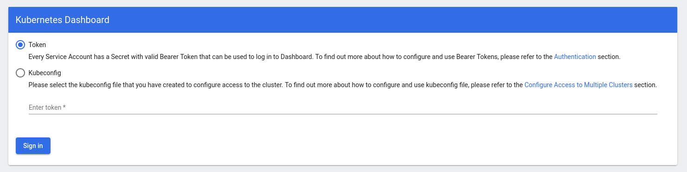
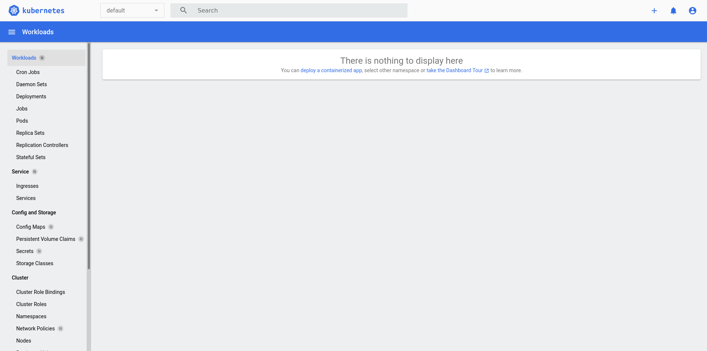
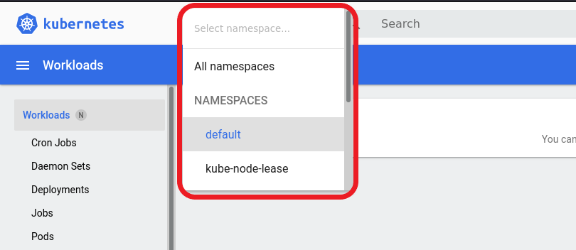
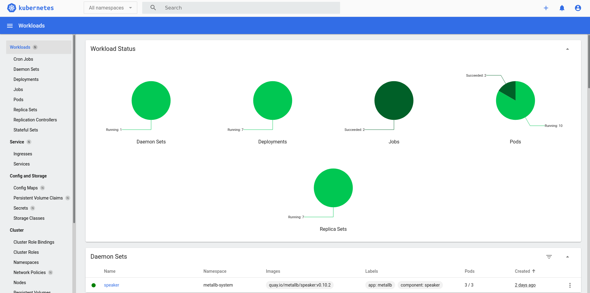

# G030 - K3s cluster setup 13 ~ Deploying the Kubernetes Dashboard

To monitor what's going on in your K3s cluster in a more visual manner, you can use the Kubernetes Dashboard. It's a web UI from which you can manage the resources running in your Kubernetes cluster.

> **BEWARE!**  
> To have metrics and graphics available, the Kubernetes Dashboard requires having the **metrics-server** service already running in your cluster.

## Deploying Kubernetes Dashboard

Deploying Kubernetes Dashboard is rather simple, although you also need to setup an administrator user for using this app. Let's do all this in a Kustomize project.

1. In your kubectl client system, create the folder structure for the Kubernetes Dashboard's Kustomize project.

    ~~~bash
    $ mkdir -p $HOME/k8sprjs/k8sdashboard/resources
    ~~~

2. Next, create two files under the `resources` folder.

    ~~~bash
    $ touch $HOME/k8sprjs/k8sdashboard/resources/{admin-user.clusterrolebinding.cluster-admin.clusterrole.yaml,admin-user.serviceaccount.yaml}
    ~~~

3. In `admin-user.serviceaccount.yaml`, copy the content below.

    ~~~yaml
    apiVersion: v1
    kind: ServiceAccount

    metadata:
      name: admin-user
    ~~~

    This is the resource definition of the Kubernetes Dashboard's administrator user.

4. Fill the `admin-user.clusterrolebinding.cluster-admin.clusterrole.yaml` file with the following yaml.

    ~~~yaml
    apiVersion: rbac.authorization.k8s.io/v1
    kind: ClusterRoleBinding

    metadata:
      name: admin-user
    roleRef:
      apiGroup: rbac.authorization.k8s.io
      kind: ClusterRole
      name: cluster-admin
    subjects:
    - kind: ServiceAccount
      name: admin-user
    ~~~

    This file describes a role named `cluster-admin` and assigns it to the `admin-user` (referenced in the `subjects` section) defined in the previous file.

5. Create the `kustomization.yaml` file for the Kustomize project.

    ~~~bash
    $ touch $HOME/k8sprjs/k8sdashboard/kustomization.yaml
    ~~~

6. Put in the `kustomization.yaml` file the following lines.

    ~~~yaml
    # Kubernetes Dashboard setup
    apiVersion: kustomize.config.k8s.io/v1beta1
    kind: Kustomization

    namespace: kubernetes-dashboard

    resources:
    - https://raw.githubusercontent.com/kubernetes/dashboard/v2.4.0/aio/deploy/recommended.yaml
    - resources/admin-user.clusterrolebinding.cluster-admin.clusterrole.yaml
    - resources/admin-user.serviceaccount.yaml
    ~~~

    Notice how the resources listed up there are a mix of a remote one and the local ones defining the cluster role and the administrator user. Also see how I've specified the `namespace` as `kubernetes-dashboard`. This namespace comes declared in the `recommended.yaml` file and will be applied to all resources of this deployment, except the `ClusterRoleBinding` you defined before and other non-namespaced resources.

7. Apply the Kustomize project to your cluster.

    ~~~bash
    $ kubectl apply -k $HOME/k8sprjs/k8sdashboard
    ~~~

8. Verify that the Kubernetes Dashboard's corresponding pods and services are running in the `kubernetes-dashboard` namespace.

    ~~~bash
    $ kubectl get pods,svc -n kubernetes-dashboard
    NAME                                            READY   STATUS    RESTARTS   AGE
    pod/dashboard-metrics-scraper-c45b7869d-fl9tg   1/1     Running   0          86s
    pod/kubernetes-dashboard-576cb95f94-2szjp       1/1     Running   0          86s

    NAME                                TYPE        CLUSTER-IP      EXTERNAL-IP   PORT(S)    AGE
    service/dashboard-metrics-scraper   ClusterIP   10.43.181.120   <none>        8000/TCP   86s
    service/kubernetes-dashboard        ClusterIP   10.43.101.112   <none>        443/TCP    86s
    ~~~

### _Getting the administrator user's secret token_

To log in your Kubernetes Dashboard with the administrator user also created in the deployment, you'll need to use it's secret token for authenticating in the app. You can get this token with the `kubectl` command, but in a different way depending on what version of Kubernetes you're working.

#### **On v1.23 and older.**

Execute the following.

~~~bash
$ kubectl -n kubernetes-dashboard describe secret admin-user-token
~~~

This will output you the whole description of the `admin-user-token` secret as follows.

~~~bash
Name:         admin-user-token-qb2t5
Namespace:    kubernetes-dashboard
Labels:       <none>
Annotations:  kubernetes.io/service-account.name: admin-user
            kubernetes.io/service-account.uid: bc9adea8-4b16-37d0-8097-7c0d5068dc5a

Type:  kubernetes.io/service-account-token

Data
====
ca.crt:     570 bytes
namespace:  20 bytes
token:      eycm5ldGJpdWJlVI6ImFkbWlzL3NlcnZpY2VhY2NvdW50Iiwia3ViZXJuZXRlcy5pby9zZXJ2aWNlYWNjb3VudC9ueyJhc3MiOiJriJSUImtpZCI6zI1NiIsrdWJlcm5ldIlJUeVVjUzN0TnloUFZTYTgxMnNYUDZYYmFoX1lzeXlTRm81bXV3QktBY3MifQ.11c2VyLYW1lc3BhY2bGciOUiOiJGVzLWRhc2hib2FyZCIsImt1YmVybmV0ZXMuaW8vc2VydmljZWFjY291bnQvc2VjcmV0Lm5hbWUiOiJhZG1pbiXR0ZDA1LTQva2VuLXdoODJxIiwia3ViZXJuZXRlcy5pby9zZXJ2aWNlYWNjb3VudC9zZXJ2aWNlLWFjY291bnQubmFtZSuLXVzZXIiLCJrdWJlcm5ldGVzLmlvL3NlcnZpY2VhY2NvdW50L3NlcnZpY2UtYWNjb3VudC51aWQiOiJhZDlhYmFhOC05ZDAtODA51kYXNoYm9hcmQ6YWNy03YzFkZTAyOGNiNWEiLCJzdWIiOiJzeXN0ZW06c2VydmljZ3ViWFjY291bnQ6aZXJuZXRlcyRtaW4tdXNlciJ9.rACsldkM7A0_Om-akoEh_5GJxfYo1_Wk6hM_TkiyLZuG-RxrtpEfDk23L3QeO1LyJmx1nQOyPSsqhL8A6d4LrDau-WMKNbI1CFYT3FMusMObi66ved7mnOz99M4MWB48ULUDeh0kAENeiMIeYpSIUs-B61J8G6LyHid0_18zWAVytRPwciksWteX8zB_2XW_oB6T0-6TICepPREke5NUwow0dYWy5kFvFx6MNeOT_iRfbdaGI1ROo4MI2_mmBFft0B7Ri6xJ4Hinfo2Q-cI95410tpJC0iX9B_t-Gt-XaDu2oX-9MZTUEJrD2XxdVx3aZM3PopmlTMb44DC149lllw
~~~

The value you need is the `token` one. Notice that it's just a encrypted string like the ones you created in previous guides for accessing your VMs through SSH. Save it in a safe place like a password manager.

To get only the token line, execute the same `kubectl` command but piped with `grep`.

~~~bash
$ kubectl -n kubernetes-dashboard describe secret admin-user-token | grep '^token'
~~~

#### **On v1.24+**

Execute the command below.

~~~bash
$ kubectl -n kubernetes-dashboard create token admin-user
eyJhbGciOiJSUzI1NiIsImtpZCI6ImtxNzh0bmk3cDAzVU4zXzFnMVgwZXVSR3c0U1FnNVZ3OUtSdDBSTkw2WmsifQ.eyJpc3MiOiJrdWJlcm5ldGVzL3NlcnZpY2VhY2NvdW50Iiwia3ViZXJuZXRlcy5pby9zZXJ2aWNlYWNjb3VudC9uYW1lc3BhY2UiOiJrdWJlcm5ldGVzLWRhc2hib2FyZCIsImt1YmVybmV0ZXMuaW8vc2VydmljZWFjY291bnQvc2VjcmV0Lm5hbWUiOiJhZG1pbi11c2VyLXRva2VuLXFiMnQ1Iiwia3ViZXJuZXRlcy5pby9zZXJ2aWNlYWNjb3VudC9zZXJ2aWNlLWFjY291bnQubmFtZSI6ImFkbWluLXVzZXIiLCJrdWJlcm5ldGVzLmlvL3NlcnZpY2VhY2NvdW50L3NlcnZpY2UtYWNjb3VudC51aWQiOiI4MjU4Mjc4ZC02YjBmLTQwZDItOTI1Yy1kMzEwMmY3MTkxYzQiLCJzdWIiOiJzeXN0ZW06c2VydmljZWFjY291bnQ6a3ViZXJuZXRlcy1kYXNoYm9hcmQ6YWRtaW4tdXNlciJ9.PG-4qfeT3C6vFfwhdGDoXVmjDEU7TJDTftcmIa2kQO0HtWM8ZN45wDGk4ZSWUR5mO5HlXpYORiGkKHq6GNPFRr_qCo4tKIONyZbgXtV98P6OpOIrfDTJCwxjFf0aqOmEs1N3BqViFs3MgBRCLElx98rD6AXehdxPADXlAksnaypKKx6q1WFgNmOTHfC9WrpQzX-qoo8CbRRCuSyTagm3qkpa5hV5RjyKjE7IaOqQGwFOSbTqMy6eghTYSufC-uUxcOWw3OPVa9QzINOn9_tioxj7tH7rpw_eOHzUW_-Cr_HE89DygnuZAqQEsWxBLfYcrBKtnMhxn49E22SyCaJldA
~~~

See how the command outputs your admin-user's secret token string directly. Remember to copy and save it somewhere safe such as a password manager.

## Testing Kubernetes Dashboard

Now that you both have the app deployed and the user created, you can test the dashboard.

1. First you need to enable a proxy on your kubectl client system.

    ~~~bash
    $ kubectl proxy
    Starting to serve on 127.0.0.1:8001
    ~~~

    This proxy gives you access to the services running in your cluster as if they were running locally in your own client system. The command won't return control to the bash shell, so you'll have to stop it with `Ctrl+C`. If you want to make this proxy run in the background, execute the command as follows.

    ~~~bash
    $ kubectl proxy &
    [1] 5151
    $ Starting to serve on 127.0.0.1:8001
    ~~~

    Notice the `&` at the command's end, that tells bash to execute the command as a background process. The `[1]` line tells you the PID this process has, so you can identify it for stopping it later with the `kill` command or with `htop`. You can also use the `fg` command to return this program to your shell's foreground and then stop it with `Ctrl+C`.

2. Open a browser in your client system and go to `http://localhost:8001/api/v1/namespaces/kubernetes-dashboard/services/https:kubernetes-dashboard:/proxy/`. You'll see the following page.

    

    See that it offers you two ways for signing in your dashboard, with a token or using a kubeconfig file. If you try to use the kubeconfig file you already have in your client (in the `.kube/config` path), you'll get the warning `Internal error (500): Not enough data to create auth info structure`. So, you can only use the token you got before to get into the dashboard. Enter the token and click on the `Sign In` button.

3. After signing in, you'll get directly into the `Workloads` page, which will look like the snapshot below.

    

    It's empty! But you already have several services deployed and running in your cluster! Worry not, this is just a matter of **namespaces**. Next to the `Search` bar you'll find a folded namespaces list.

    

    Just select the `All namespaces` option to see all the workloads running in your cluster.

    

    This is something else, right? Now you can see all the workloads running under all the namespaces present in your K3s cluster. Remember this, many Kubernetes resources are namespaced and you'll usually end having several different namespaces active in your cluster.

4. To stop the dashboard, just `Ctrl+C` out of the `kubectl proxy` process you started before, although not before signing out of the dashboard itself.

    

    If you made the kubectl proxy run in the background with `&`, you'll need its PID so you can tell the `kill` command what process to stop.

    ~~~bash
    $ kill -15 5151
    ~~~

    Up there I've used the `SIGTERM` (`15`) signal to stop the process but, if for some reason the process doesn't stop with it, use the `SIGKILL` (`9`) signal instead. And if you don't remember the process' PID, just use `htop` to locate and stop the process in a more visual manner.

## Kubernetes Dashboard's Kustomize project attached to this guide series

You can find the Kustomize project for this Kubernetes Dashboard deployment in the following attached folder.

- `k8sprjs/k8sdashboard`

## Relevant system paths

### _Folders in `kubectl` client system_

- `$HOME/k8sprjs/k8sdashboard`
- `$HOME/k8sprjs/k8sdashboard/resources`

### _Files in `kubectl` client system_

- `$HOME/k8sprjs/k8sdashboard/kustomization.yaml`
- `$HOME/k8sprjs/k8sdashboard/admin-user.clusterrolebinding.cluster-admin.clusterrole.yaml`
- `$HOME/k8sprjs/k8sdashboard/admin-user.serviceaccount.yaml`

## References

### _Kubernetes Dashboard_

- [Kubernetes Web UI (Dashboard)](https://kubernetes.io/docs/tasks/access-application-cluster/web-ui-dashboard/)
- [Kubernetes Dashboard on GitHub](https://github.com/kubernetes/dashboard)
- [Kubernetes Dashboard on K3s](https://rancher.com/docs/k3s/latest/en/installation/kube-dashboard/)
- [My Kubernetes Dashboard and How To Deploy Yours](https://ikarus.sg/k8s-dashboard/)
