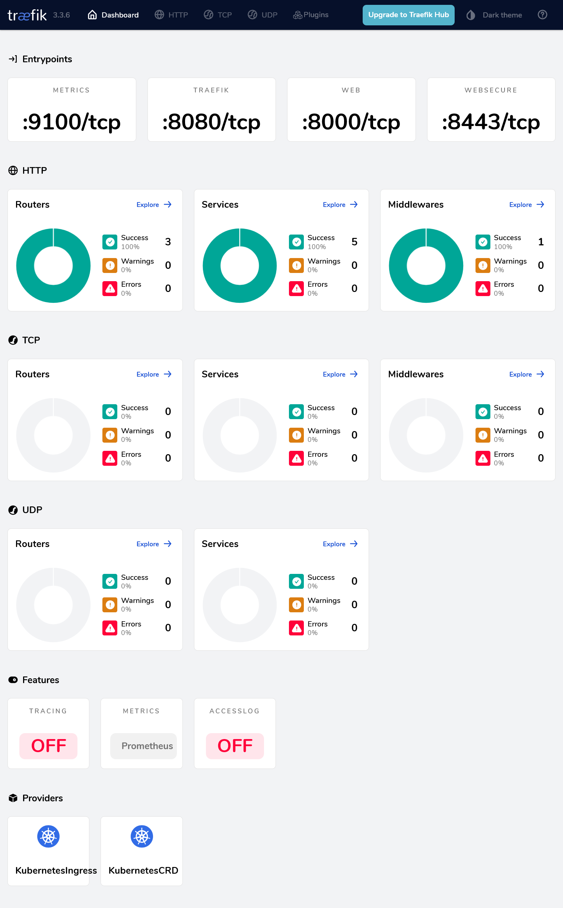

# G030 - K3s cluster setup 13 ~ Enabling the Traefik dashboard

- [Traefik is the embedded ingress controller of K3s](#traefik-is-the-embedded-ingress-controller-of-k3s)
- [Steps to enable access to the Traefik dashboard](#steps-to-enable-access-to-the-traefik-dashboard)
- [Kustomize project's folder structure](#kustomize-projects-folder-structure)
- [Traefik dashboard user](#traefik-dashboard-user)
  - [Creating the user with htpasswd](#creating-the-user-with-htpasswd)
  - [Traefik dashboard secret](#traefik-dashboard-secret)
- [Traefik dashboard Middleware](#traefik-dashboard-middleware)
- [Traefik dashboard IngressRoute](#traefik-dashboard-ingressroute)
- [Traefik dashboard Kustomize project](#traefik-dashboard-kustomize-project)
  - [Validating the Kustomize YAML output](#validating-the-kustomize-yaml-output)
- [Deploying the Traefik dashboard Kustomize project](#deploying-the-traefik-dashboard-kustomize-project)
- [Getting into the Traefik dashboard](#getting-into-the-traefik-dashboard)
- [What to do if Traefik's dashboard has bad performance](#what-to-do-if-traefiks-dashboard-has-bad-performance)
- [Traefik dashboard's Kustomize project attached to this guide](#traefik-dashboards-kustomize-project-attached-to-this-guide)
- [Relevant system paths](#relevant-system-paths)
  - [Folders in `kubectl` client system](#folders-in-kubectl-client-system)
  - [Files in `kubectl` client system](#files-in-kubectl-client-system)
- [References](#references)
  - [Traefik (Proxy)](#traefik-proxy)
  - [Traefik IngressRoute Vs Ingress](#traefik-ingressroute-vs-ingress)
  - [Traefik in K3s](#traefik-in-k3s)
  - [Kubernetes](#kubernetes)
  - [Kustomize](#kustomize)
- [Navigation](#navigation)

## Traefik is the embedded ingress controller of K3s

Traefik is the default ingress controller that already comes embedded in K3s. In other words, you can enable access to services running in your cluster through Traefik ingresses, instead of just assigning them external IPs directly (in particular, with the MetalLB load balancer).

Traefik in K3s comes with its embedded web dashboard enabled by default, but reaching it requires a particular setup not clearly explained in the official documentation of neither [Traefik](https://doc.traefik.io/traefik/reference/install-configuration/api-dashboard/) nor [K3s](https://docs.k3s.io/networking/networking-services?_highlight=traefik#traefik-ingress-controller).

## Steps to enable access to the Traefik dashboard

This chapter shows you how to enable HTTPS access to your Traefik dashboard by doing the following:

1. Creating a user to restrict access into the Traefik dashboard.

2. Declaring an `IngressRoute` that enables access to a `TraefikService` where the dashboard is available. This `IngressRoute` enforces basic authentication with the user created in the previous step.

The first step is just the execution of a command on your `kubectl` client. The other is resolved in the corresponding Kustomize project.

## Kustomize project's folder structure

Create the Kustomize project's folder structure:

~~~sh
$ mkdir -p $HOME/k8sprjs/traefik-dashboard/{resources,secrets}
~~~

This project has one `resources` subfolder for storing Kubernetes resources declarations, and a `secrets` one to keep a file with the secret string describing the user for accessing the Traefik dashboard.

## Traefik dashboard user

Secure the access to your Traefik dashboard by defining at least one user with a password. [Later in this chapter](#traefik-dashboard-kustomize-project), this user will go into a `Secret` object generated by this Traefik dashboard's Kustomize project.

### Creating the user with htpasswd

Traefik demands passwords hashed using MD5, SHA1, or BCrypt, and recommends using the `htpasswd` command to generate them:

1. Install the package providing the `htpasswd` command in your `kubectl` client system. The package is `apache2-utils` and, on a Debian based system, you can install it with `apt`:

    ~~~sh
    $ sudo apt install -y apache2-utils
    ~~~

2. Next, use the `htpasswd` command to generate a user called, for instance, `tfkuser` with the password hashed with the BCrypt encryption:

    ~~~sh
    $ htpasswd -nb -B -C 9 tfkuser Pu7Y0urV3ryS3cr3tP4ssw0rdH3r3
    tfkuser:$2y$17$0mdP4WLdbj8BWj1lIJMDb.bXyYK75qR5AfRNzuunZuCamvAlqDlo.
    ~~~

    > [!IMPORTANT]
    > **Be careful with the value you set to the `-C` option!**\
    > This option indicates the computing time used by the BCrypt algorithm for hashing and, if you set it too high, the Traefik dashboard could end not loading at all. The value you can type here must be between 4 and 17, and the default is 5.

    Keep the `htpasswd`'s output at hand, you will use that encrypted string in the next procedure.

### Traefik dashboard secret

Copy the user string returned by `htpasswd` in a text file. Later, you will put this file [in a `Secret` object generated by the Kustomize project](#traefik-dashboard-kustomize-project):

1. Create a file simply called `users` in the `secrets` folder of the Kustomize project:

    ~~~sh
    $ touch $HOME/k8sprjs/traefik-dashboard/secrets/users
    ~~~

2. In the `users` file, copy the entire string you got from the `htpasswd` command earlier:

    ~~~sh
    tfkuser:$2y$17$0mdP4WLdbj8BWj1lIJMDb.bXyYK75qR5AfRNzuunZuCamvAlqDlo.
    ~~~

    > [!WARNING]
    > **Be careful of who can access this `users` file**\
    > Regardless of the password being hashed, the hash itself is also secret information you do not want to get exposed to anyone.

## Traefik dashboard Middleware

To restrict access to your Traefik dashboard with a login, you need a `Middleware` object to enable the basic authentication feature in the ingress route you will declare later:

1. Create the `traefik-dashboard-basicauth.middleware.traefik.yaml` file in the `resources` folder of the Kustomize project:

    ~~~sh
    $ touch $HOME/k8sprjs/traefik-dashboard/resources/traefik-dashboard-basicauth.middleware.traefik.yaml
    ~~~

2. Declare in `traefik-dashboard-basicauth.middleware.traefik.yaml` the authentication method to use for login in the Traefik dashboard:

    ~~~yaml
    # Basic authentication method for Traefik dashboard
    apiVersion: traefik.io/v1alpha1
    kind: Middleware

    metadata:
      name: traefik-dashboard-basicauth
    spec:
      basicAuth:
        secret: traefik-dashboard-basicauth-secret
    ~~~

    A [`Middleware` is a custom Traefik resource](https://doc.traefik.io/traefik/reference/routing-configuration/http/middlewares/overview/), used in this case for configuring a [basic authentication](https://doc.traefik.io/traefik/reference/routing-configuration/http/middlewares/basicauth/) method (a user and password login method). In the `spec.basicAuth.secret` parameter, this middleware invokes a `Secret` resource to be declared later in the Kustomize manifest for this Traefik dashboard project.

## Traefik dashboard IngressRoute

To enable access into your Traefik dashboard, you need to declare an HTTPS ingress:

1. Create the following files within the Kustomize project:

    ~~~sh
    $ touch $HOME/k8sprjs/traefik-dashboard/resources/traefik-dashboard.ingressroute.traefik.yaml
    ~~~

2. Declare in `traefik-dashboard.ingressroute.traefik.yaml` the `IngressRoute` resource enabling access to the Traefik dashboard:

    ~~~yaml
    # HTTPS ingress for Traefik dashboard and API
    apiVersion: traefik.io/v1alpha1
    kind: IngressRoute

    metadata:
      name: traefik-dashboard
    spec:
      routes:
      - kind: Rule
        match: Host(`traefik.homelab.cloud`) && (PathPrefix(`/api`) || PathPrefix(`/dashboard`))
        services:
        - name: api@internal
          kind: TraefikService
        middlewares:
        - name: traefik-dashboard-basicauth
    ~~~

    This is a Traefik `IngressRoute` object specifying the route and the authentication method to access your Traefik dashboard:

    > [!IMPORTANT]
    > **The `IngressRoute` is NOT a standard Kubernetes resource**\
    > It is a custom alternative to the standard `Ingress` Kubernetes object **offered only by Traefik**. Other ingress controllers may have their own alternatives to the standard Kubernetes Ingress object.

    - In the `spec.entryPoints` there is only the `websecure` option enabled. This means that only the `443` port is enabled as entry point to this route.

    - The `spec.routes.match` parameter indicates to Traefik the valid URL patterns reachable through this `IngressRoute`:

      - First in the pattern is the hostname of the Traefik service set as `Host` value. Next go the possible paths in Traefik, one for its API and the other for the Traefik dashboard.

        Notice the logic operators `&&` (and) and `||` (or) that allow connecting the hostname with the available paths in the service.

        > [!NOTE]
        > **The domains or subdomains you set up as `Host` values will not work just by being put there**\
        > You have to enable them in your network's router or gateway, local DNS or associate them with their corresponding IP in the `hosts` file of any client systems connected to your network that require to know the correct IP for those domains or subdomains.

      - Do not forget any of the backticks characters ( \` ) enclosing the strings in the `Host` directives.

      - The `spec.routes.services` links the `IngressRoute` with the `TraefikService` (a custom Traefik-specific type of Kubernetes `Service`) called `api@internal` through which you can access the Traefik dashboard. Also notice that no service port is specified.

        > [!NOTE]
        > **There is no official proper explanation for this `api@internal` `TraefikService`**\
        > This `api@internal` could be some sort of alias or wrapper of the real `traefik` `Service` running in the K3s cluster. This may also explain why it is not necessary to specify which port to connect to in the service.

      - The `spec.routes.match.middlewares` only invokes the basic authentication middleware.

## Traefik dashboard Kustomize project

Put together all the resources making up your Traefik dashboard ingress in a Kustomize manifest:

1. Generate a `kustomization.yaml` file at the main folder of this Kustomize project:

    ~~~sh
    $ touch $HOME/k8sprjs/traefik-dashboard/kustomization.yaml
    ~~~

2. In the `kustomization.yaml` file, declare your `Kustomization` object for enabling access into the Traefik dashboard:

    ~~~yaml
    # Traefik dashboard ingress setup
    apiVersion: kustomize.config.k8s.io/v1beta1
    kind: Kustomization

    namespace: kube-system

    resources:
    - resources/traefik-dashboard-basicauth.middleware.traefik.yaml
    - resources/traefik-dashboard.ingressroute.traefik.yaml

    secretGenerator:
    - name: traefik-dashboard-basicauth-secret
      files:
      - secrets/users
      options:
        disableNameSuffixHash: true
    ~~~

    See that there is a `secretGenerator` block in this `Kustomization` declaration:

    - This is a Kustomize feature that generates `Secret` objects in a Kubernetes cluster containing files or environment variables specified in its declaration.

    - The `namespace` puts all the resources and the secret generated by this Kustomize project under the `kube-system` namespace.

    - The one secret generated is configured with a concrete `name` and `namespace`.  It also has under `files` a reference to the `users` file you created previously under the `secrets` subfolder.

    - The `disableNameSuffixHash` option is required to be `true`. Otherwise, Kustomize will add a hash suffix to the secret's name and your `Middleware` will not be able to find it in the cluster.

      > [!NOTE]
      > **This is an issue between Traefik and Kubernetes Kustomize**\
      > The suffix problem happens because [the `Middleware` object](#traefik-dashboard-middleware) declares the secret's name in a non-Kubernetes-standard parameter which Kustomize does not recognize. Therefore, Kustomize cannot replace the name with its hashed version in the `spec.basicAuth.secret` parameter.

### Validating the Kustomize YAML output

To validate the `Secret` object, you can review it with `kubectl kustomize`:

~~~sh
$ kubectl kustomize $HOME/k8sprjs/traefik-dashboard | less
~~~

Look for the `Secret` object in the resulting YAML, it should have this aspect:

~~~yaml
apiVersion: v1
data:
  users: |
    dGZrdXNlcjokMnkkMTckMG1kUDRXTGRiajhCV2oxbElKTURiLmJYeVlLNzVxUjVBZlJOenV1blp1
    Q2FtdkFscURsby4K
kind: Secret
metadata:
  name: traefik.homelab.cloud-basic-auth-secret
  namespace: kube-system
type: Opaque
~~~

Notice the following details in this `Secret` object:

- In the `data.users` parameter there is an odd-looking string. This is the content of the `secrets/user` file referenced in the `secretGenerator` block, automatically encoded by Kustomize in base64. You can check that it is the same string on the file by decoding it with `base64 -d` as follows.

  ~~~sh
  $ echo dGZrdXNlcjokMnkkMTckMG1kUDRXTGRiajhCV2oxbElKTURiLmJYeVlLNzVxUjVBZlJOenV1blp1Q2FtdkFscURsby4K | base64 -d
  tfkuser:$2y$17$0mdP4WLdbj8BWj1lIJMDb.bXyYK75qR5AfRNzuunZuCamvAlqDlo.
  ~~~

  See that the base64 string is entered in one line, although it had been returned split in two in the `Secret` object output.

- The `metadata.name` and `metadata.namespace` are exactly as specified in the `kustomization.yaml` file.

- The `type` `Opaque` means that the content under `data` is base64-encoded.

## Deploying the Traefik dashboard Kustomize project

After verifying the YAML output of the Kustomize project, apply it in your cluster:

~~~sh
$ kubectl apply -k $HOME/k8sprjs/traefik-dashboard
~~~

## Getting into the Traefik dashboard

Assuming you have enabled the DNS name or hostname for the Traefik service as `traefik.homelab.cloud` in your LAN, try to access the URL `https://traefik.homelab.cloud/dashboard`:

> [!NOTE]
> **Remember to associate your Traefik service's IP to the DNS name or hostname you have chosen for it**\
> The fastest way is usually adding an entry in the `hosts` file of the client system you are using. For the Traefik service's IP and DNS name used in this guide, that entry would look like this:
>
> ~~~txt
> 10.7.0.1 traefik.homelab.cloud
> ~~~
>
> Also be aware that you can associate more than one DNS name to the same IP, in the same line even.

1. The first thing you will probably see is a browser warning telling you that the connection is not secure because the certificate is not either. If you check the certificate's information, you will see it being one self-generated by Traefik itself ("verified" by `CN=TRAEFIK DEFAULT CERT`).

2. Right after accepting "the risk" in the security warning, a generic "Sign in" window will pop up in your browser:

    

3. Type your user and password, press on `Sign in` and you will be redirected to the Traefik dashboard's main page available under the `/dashboard/#/` path:

    

## What to do if Traefik's dashboard has bad performance

If your Traefik dashboard seems to load extremely slowly, or just returning a blank page, it could be that you set the `-C` value in the `htpasswd` command too high. This can affect the Traefik dashboard's performance, hitting badly the node were the traefik service is being executed. So, if this is happening to you, try the following:

1. Generate a new user string with `htpasswd` as you saw previously, but with a lower `-C` value than the one you used in the first place. Then replace the string you already have in the `secrets/users` file with the new one.

2. Delete and then reapply the Kustomize project again:

    ~~~sh
    $ kubectl delete -k $HOME/k8sprjs/traefik-dashboard
    $ kubectl apply -k $HOME/k8sprjs/traefik-dashboard
    ~~~

    The `delete` command is just to make sure that the `IngressRoute` resource is regenerated with the change applied.

3. Try to access your Traefik dashboard and see how it runs now.

## Traefik dashboard's Kustomize project attached to this guide

Find the Kustomize project for this Traefik dashboard deployment in the following attached folder:

- [`k8sprjs/traefik-dashboard`](k8sprjs/traefik-dashboard/)

## Relevant system paths

### Folders in `kubectl` client system

- `$HOME/k8sprjs/traefik-dashboard`
- `$HOME/k8sprjs/traefik-dashboard/resources`
- `$HOME/k8sprjs/traefik-dashboard/secrets`

### Files in `kubectl` client system

- `$HOME/k8sprjs/traefik-dashboard/kustomization.yaml`
- `$HOME/k8sprjs/traefik-dashboard/resources/traefik-dashboard.ingressroute.traefik.yaml`
- `$HOME/k8sprjs/traefik-dashboard/resources/traefik-dashboard.service.yaml`
- `$HOME/k8sprjs/traefik-dashboard/resources/traefik-dashboard-basicauth.middleware.traefik.yaml`
- `$HOME/k8sprjs/traefik-dashboard/secrets/users`

## References

### [Traefik (Proxy)](https://traefik.io/traefik)

- [Reference. Install Configuration. API & Dashboard](https://doc.traefik.io/traefik/reference/install-configuration/api-dashboard/)
- [Reference. Routing Configuration. Common Configuration. HTTP. Middlewares. Overview](https://doc.traefik.io/traefik/reference/routing-configuration/http/middlewares/overview/)
- [Reference. Routing Configuration. Common Configuration. HTTP. Middlewares. BasicAuth](https://doc.traefik.io/traefik/reference/routing-configuration/http/middlewares/basicauth/)
- [Reference. Routing Configuration. Kubernetes. Ingress](https://doc.traefik.io/traefik/reference/routing-configuration/kubernetes/ingress/)
- [Reference. Routing Configuration. Kubernetes. Kubernetes CRD. HTTP. IngressRoute](https://doc.traefik.io/traefik/reference/routing-configuration/kubernetes/crd/http/ingressroute/)
- [Reference. Routing Configuration. Kubernetes. Kubernetes CRD. HTTP. Middleware](https://doc.traefik.io/traefik/reference/routing-configuration/kubernetes/crd/http/middleware/)

### Traefik IngressRoute Vs Ingress

- [StackOverflow. What is the difference between a Kubernetes Ingress and a IngressRoute?](https://stackoverflow.com/questions/60177488/what-is-the-difference-between-a-kubernetes-ingress-and-a-ingressroute)
- [GoLinuxCloud. Steps to expose services using Kubernetes Ingress](https://www.golinuxcloud.com/steps-to-expose-services-using-kubernetes-ingress/)
- [Opensource.com. Directing Kubernetes traffic with Traefik](https://opensource.com/article/20/3/kubernetes-traefik)
- [Medium. ITNEXT. Ingress with Traefik on K3s](https://itnext.io/ingress-with-treafik-on-k3s-53db6e751ed3)

### Traefik in K3s

- [K3s docs. Networking](https://docs.k3s.io/networking)
  - [Traefik Ingress Controller](https://docs.k3s.io/networking/networking-services?_highlight=traefik#traefik-ingress-controller)

- [GitHub. K3s. Issues. Documentation on ingress](https://github.com/k3s-io/k3s/issues/436)

- [K3s Rocks. Traefik dashboard](https://k3s.rocks/traefik-dashboard/)

### [Kubernetes](https://kubernetes.io/docs/home/)

- [Kubernetes Documentation. Concepts. Overview. Objects In Kubernetes](https://kubernetes.io/docs/concepts/overview/working-with-objects/)
  - [Labels and Selectors](https://kubernetes.io/docs/concepts/overview/working-with-objects/labels/#label-selectors)
    - [Labels selectors](https://kubernetes.io/docs/concepts/overview/working-with-objects/labels/#label-selectors)
    - [Equality-based requirement](https://kubernetes.io/docs/concepts/overview/working-with-objects/labels/#equality-based-requirement)

- [Kubernetes Documentation. Concepts. Services, Load Balancing, and Networking](https://kubernetes.io/docs/concepts/services-networking/)
  - [Ingress](https://kubernetes.io/docs/concepts/services-networking/ingress/)

### [Kustomize](https://kubectl.docs.kubernetes.io/references/kustomize/)

- [SIG CLI. Reference. Kustomize. kustomization](https://kubectl.docs.kubernetes.io/references/kustomize/kustomization/)
  - [configMapGenerator](https://kubectl.docs.kubernetes.io/references/kustomize/kustomization/configmapgenerator/)
  - [secretGenerator](https://kubectl.docs.kubernetes.io/references/kustomize/kustomization/secretgenerator/)
  - [generatorOptions](https://kubectl.docs.kubernetes.io/references/kustomize/kustomization/generatoroptions/)

## Navigation

[<< Previous (**G029. K3s cluster setup 12**)](G029%20-%20K3s%20cluster%20setup%2012%20~%20Setting%20up%20cert-manager%20and%20self-signed%20CA.md) | [+Table Of Contents+](G000%20-%20Table%20Of%20Contents.md) | [Next (**G031. K3s cluster setup 14**) >>](G031%20-%20K3s%20cluster%20setup%2014%20~%20Deploying%20the%20Headlamp%20dashboard.md)
