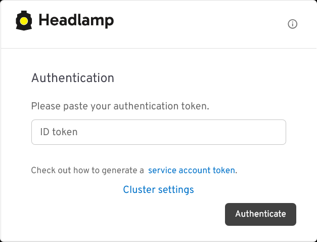
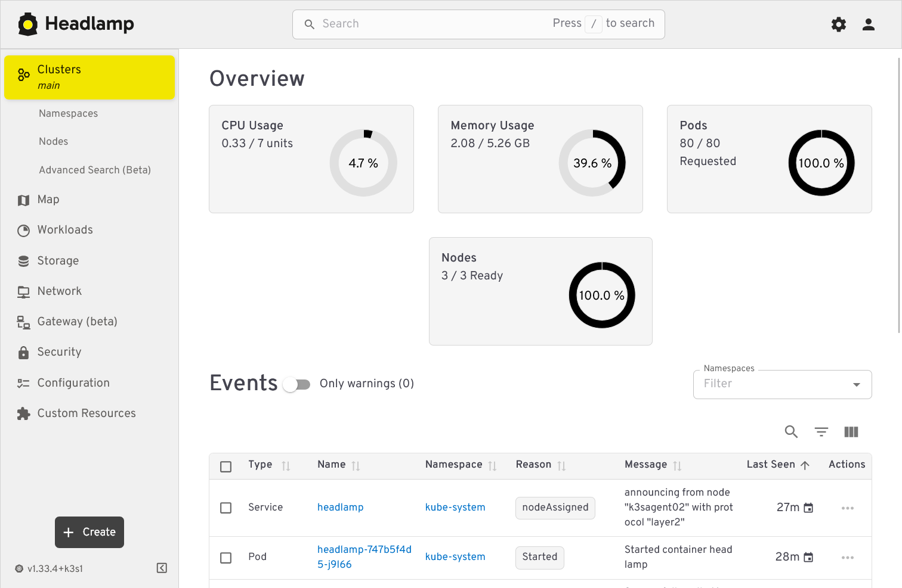
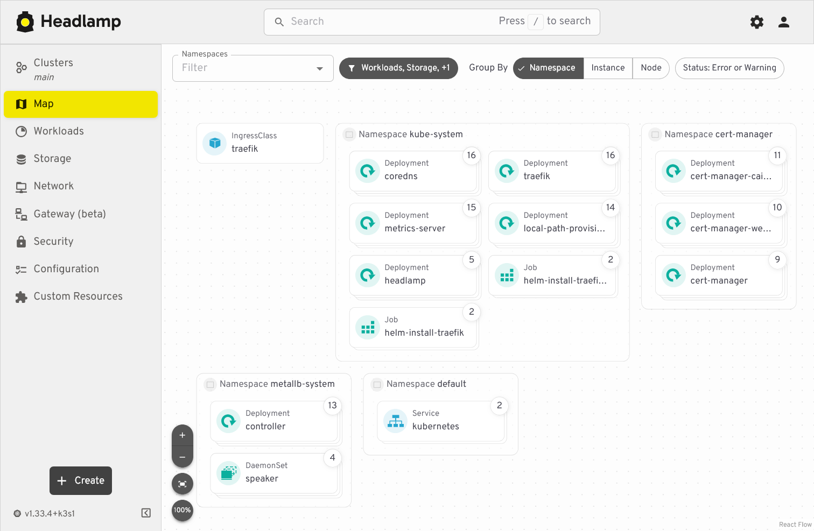

# G031 - K3s cluster setup 14 ~ Deploying the Headlamp dashboard

- [Headlamp is an alternative to the Kubernetes Dashboard](#headlamp-is-an-alternative-to-the-kubernetes-dashboard)
- [Components required for deploying Headlamp](#components-required-for-deploying-headlamp)
- [Kustomize project's folder structure](#kustomize-projects-folder-structure)
- [Headlamp ServiceAccount](#headlamp-serviceaccount)
- [Headlamp ClusterRoleBinding](#headlamp-clusterrolebinding)
- [Headlamp TLS certificate](#headlamp-tls-certificate)
- [Headlamp IngressRoute](#headlamp-ingressroute)
- [Kustomize manifest for the Headlamp project](#kustomize-manifest-for-the-headlamp-project)
  - [Validating the Kustomize YAML output](#validating-the-kustomize-yaml-output)
- [Deploying Headlamp](#deploying-headlamp)
- [Getting the administrator user's service account token](#getting-the-administrator-users-service-account-token)
- [Testing Headlamp](#testing-headlamp)
- [Headlamp's Kustomize project attached to this guide](#headlamps-kustomize-project-attached-to-this-guide)
- [Relevant system paths](#relevant-system-paths)
  - [Folders in `kubectl` client system](#folders-in-kubectl-client-system)
  - [Files in `kubectl` client system](#files-in-kubectl-client-system)
- [References](#references)
  - [Headlamp](#headlamp)
  - [Kubernetes](#kubernetes)
  - [Traefik (Proxy)](#traefik-proxy)
  - [Cert-manager](#cert-manager)
- [Navigation](#navigation)

## Headlamp is an alternative to the Kubernetes Dashboard

To monitor what is going on in your K3s cluster in a more visual manner, [Kubernetes offers its own native web-based dashboard](https://kubernetes.io/docs/tasks/access-application-cluster/web-ui-dashboard/). That one is fine, but there is an interesting alternative dashboard called [Headlamp](https://headlamp.dev/) also worth trying out.

> [!WARNING]
> **Ensure having the metrics-server service running in your cluster first!**\
> To be able to show stats from your K3s cluster, Headlamp (like the Kubernetes Dashboard) requires having [the **metrics-server** service already running in your cluster](G028%20-%20K3s%20cluster%20setup%2011%20~%20Deploying%20the%20metrics-server%20service.md).

## Components required for deploying Headlamp

To deploy Headlamp in your homelab cluster, you need:

- A service account with the cluster administrator role.
- A TLS certificate to secure communications with Headlamp.
- An HTTPS ingress to access Headlamp that uses the previously mentioned TLS certificate.

## Kustomize project's folder structure

In your `kubectl` client system, create the folder structure for the Headlamp Kustomize project:

~~~sh
$ mkdir -p $HOME/k8sprjs/headlamp/resources
~~~

## Headlamp ServiceAccount

Prepare a `ServiceAccount` for Headlamp like this:

1. Create a `headlamp-admin.serviceaccount.yaml` file under the `resources` folder:

    ~~~sh
    $ touch $HOME/k8sprjs/headlamp/resources/headlamp-admin.serviceaccount.yaml
    ~~~

2. Declare the `headlamp-admin` service account in `headlamp-admin.serviceaccount.yaml`:

    ~~~yaml
    # Headlamp administrator user
    apiVersion: v1
    kind: ServiceAccount

    metadata:
      name: headlamp-admin
    ~~~

    This service account will act as the administrator user for your Headlamp instance:

    - The name `headlamp-admin` is the one expected in the official Headlamp installation. Its deployment manifest already points to a secret token for a service account called `headlamp-admin`.

    - This declaration only creates the `headlamp-admin` service account without any special privileges in the cluster. The account needs to be bound to a cluster role to be authorized to access your K3s cluster information, something you will declare in the next section.

    > [!IMPORTANT]
    > **Service accounts are not meant for regular users**\
    > For Kubernetes, [user accounts are for humans and service accounts are for application processes](https://kubernetes.io/docs/reference/access-authn-authz/service-accounts-admin/#user-accounts-versus-service-accounts). Still, [Headlamp's official installation documentation explicitly **recommends** (at the time of writing this) using a service account](https://headlamp.dev/docs/latest/installation/).

## Headlamp ClusterRoleBinding

To bind the `headlamp-admin` service account with the required administrator role, you need a `ClusterRoleBinding` object:

1. Generate a new `cluster-admin-users.clusterrolebinding.yaml` file under `resources`:

    ~~~sh
    $ touch $HOME/k8sprjs/headlamp/resources/cluster-admin-users.clusterrolebinding.yaml
    ~~~

2. In `cluster-admin-users.clusterrolebinding.yaml`, bind the `headlamp-admin` with the `cluster-admin` cluster role:

    ~~~yaml
    # Administrator cluster role bindings
    apiVersion: rbac.authorization.k8s.io/v1
    kind: ClusterRoleBinding

    metadata:
      name: cluster-admin-users
    roleRef:
      apiGroup: rbac.authorization.k8s.io
      kind: ClusterRole
      name: cluster-admin
    subjects:
    - kind: ServiceAccount
      name: headlamp-admin
      namespace: kube-system
    ~~~

    With this declaration, you make the `headlamp-admin` account an administrator of your cluster under the `kube-system` namespace:

    - The `roleRef` attribute specifies that the cluster role to be bound is `cluster-admin`, which is a built-in role in Kubernetes.

    - In `subjects` you list all the users you want bounded to the role indicated in `roleRef`. In this case, there is only the `headlamp-admin` service account.

## Headlamp TLS certificate

To encrypt the client communications with Headlamp you need a TLS certificate managed with [the cert-manager you deployed in a previous chapter](G029%20-%20K3s%20cluster%20setup%2012%20~%20Setting%20up%20cert-manager%20and%20self-signed%20CA.md):

1. Create the file `headlamp.homelab.cloud-tls.certificate.cert-manager.yaml` in the `resources` folder:

    ~~~sh
    $ touch $HOME/k8sprjs/headlamp/resources/headlamp.homelab.cloud-tls.certificate.cert-manager.yaml
    ~~~

2. Declare a self-signed "leaf" certificate in `headlamp.homelab.cloud-tls.certificate.cert-manager.yaml`:

    ~~~yaml
    # TLS certificate for Headlamp
    apiVersion: cert-manager.io/v1
    kind: Certificate

    metadata:
      name: headlamp.homelab.cloud-tls
    spec:
      isCA: false
      secretName: headlamp.homelab.cloud-tls
      duration: 2190h # 3 months
      renewBefore: 168h # Certificates must be renewed some time before they expire (7 days)
      dnsNames:
      - headlamp.homelab.cloud
      privateKey:
        algorithm: ECDSA
        size: 521
        encoding: PKCS8
        rotationPolicy: Always
      issuerRef:
        name: homelab.cloud-intm-ca01-issuer
        kind: ClusterIssuer
        group: cert-manager.io
    ~~~

    This certificate is similar to the ones created for the [self-signed CA issuers already explained in the chapter **G029**](G029%20-%20K3s%20cluster%20setup%2012%20~%20Setting%20up%20cert-manager%20and%20self-signed%20CA.md#setting-up-self-signed-cas-for-your-cluster), except for:

    - The `spec.isCA` parameter set to `false` makes this certificate a "leaf" one that cannot be used to issue other certificates.

    - There is no `spec.commonName` because the official cert-manager documentation recommends setting this attribute only in CA certificates, and leaving it unset in "leaf" certificates.

    - Its `duration` and `renewBefore` values are half of the ones set to the certificate of the intermediate CA issuing this Headlamp certificate.

    - The list in `spec.dnsNames` specifies which domains this certificate corresponds to.

    - The `spec.issuerRef` invokes the intermediate CA already available in your cluster as issuer of this Headlamp certificate.

## Headlamp IngressRoute

To enable ingress access into Headlamp, use a Traefik `IngressRoute`:

1. Create the `headlamp.ingressroute.traefik.yaml` file under the `resources` folder:

    ~~~sh
    $ touch $HOME/k8sprjs/headlamp/resources/headlamp.ingressroute.traefik.yaml
    ~~~

2. In `resources/headlamp.ingressroute.traefik.yaml`, specify the Traefik `IngressRoute` resource for accessing Headlamp through HTTPS:

    ~~~yaml
    # HTTPS ingress for Headlamp
    apiVersion: traefik.io/v1alpha1
    kind: IngressRoute

    metadata:
      name: headlamp
    spec:
      entryPoints:
      - websecure
      routes:
      - match: Host(`headlamp.homelab.cloud`)
        kind: Rule
        services:
        - name: headlamp
          kind: Service
          port: 80
      tls:
        secretName: headlamp.homelab.cloud-tls
    ~~~

    Details you should pay attention to in this Traefik `IngressRoute` declaration are:

    - The `spec.entryPoints` is set to `websecure` only, which corresponds to the Traefik service's HTTPS port.

    - The `spec.routes.match` enables the URL to reach Headlamp through Traefik.

      > [!NOTE]
      > **The domain name must be enabled in your local network**\
      > Your equivalent of the hostname seen in the YAML above will not be reachable unless you enable it from a DNS service (your local network's router could provide it), or specify it in the `hosts` file of the clients you want to access from.

    - The `spec.routes.services` only has an entry for the Headlamp service, linking it to this IngressRoute.

    - The `spec.tls.secretName` points to the secret associated to the Headlamp certificate declared in the previous step. This enables the TLS termination at the ingress level, while the communication with Headlamp will still be done in HTTP.

## Kustomize manifest for the Headlamp project

With all the required resources declared, put them all together with the manifest that deploys Headlamp itself in the Kustomize YAML of this project:

1. Create the `kustomization.yaml` file for the Kustomize project:

    ~~~sh
    $ touch $HOME/k8sprjs/headlamp/kustomization.yaml
    ~~~

2. Put in the `kustomization.yaml` file the following `Kustomization` manifest:

    ~~~yaml
    # Headlamp setup
    apiVersion: kustomize.config.k8s.io/v1beta1
    kind: Kustomization

    namespace: kube-system

    resources:
    - resources/headlamp-admin.serviceaccount.yaml
    - resources/cluster-admin-users.clusterrolebinding.yaml
    - resources/headlamp.homelab.cloud-tls.certificate.cert-manager.yaml
    - resources/headlamp.ingressroute.traefik.yaml
    - https://raw.githubusercontent.com/kubernetes-sigs/headlamp/main/kubernetes-headlamp.yaml
    ~~~

    The `namespace` declaration sets the `kube-system` namespace to all the namespaced resources (the `ClusterRoleBinding` object is not namespaced since it has a cluster-wide nature) declared in this Kustomize project, and also to their invocations within standard Kubernetes objects (not in custom ones). The `kube-system` namespace is where the Headlamp service is going to be deployed. It is important that all namespaced resources are in the same namespace as Headlamp. In particular, the service account must be in the same namespace as Headlamp to authorize this service to access the cluster information it needs to work.

### Validating the Kustomize YAML output

You may want to take a look at how the resources you declared appear in the Kustomize output before deploying:

1. Execute the `kubectl kustomize` command on the Headlamp Kustomize project main folder, redirected to `less` (or to your favorite text editor):

    ~~~sh
    $ kubectl kustomize $HOME/k8sprjs/headlamp | less
    ~~~

2. Compare your YAML output with this one:

    ~~~yaml
    apiVersion: v1
    kind: ServiceAccount
    metadata:
      name: headlamp-admin
      namespace: kube-system
    ---
    apiVersion: rbac.authorization.k8s.io/v1
    kind: ClusterRoleBinding
    metadata:
      name: cluster-admin-users
    roleRef:
      apiGroup: rbac.authorization.k8s.io
      kind: ClusterRole
      name: cluster-admin
    subjects:
    - kind: ServiceAccount
      name: headlamp-admin
      namespace: kube-system
    ---
    apiVersion: v1
    kind: Secret
    metadata:
      annotations:
        kubernetes.io/service-account.name: headlamp-admin
      name: headlamp-admin
      namespace: kube-system
    type: kubernetes.io/service-account-token
    ---
    apiVersion: v1
    kind: Service
    metadata:
      name: headlamp
      namespace: kube-system
    spec:
      ports:
      - port: 80
        targetPort: 4466
      selector:
        k8s-app: headlamp
    ---
    apiVersion: apps/v1
    kind: Deployment
    metadata:
      name: headlamp
      namespace: kube-system
    spec:
      replicas: 1
      selector:
        matchLabels:
          k8s-app: headlamp
      template:
        metadata:
          labels:
            k8s-app: headlamp
        spec:
          containers:
          - args:
            - -in-cluster
            - -plugins-dir=/headlamp/plugins
            env:
            - name: HEADLAMP_CONFIG_TRACING_ENABLED
              value: "true"
            - name: HEADLAMP_CONFIG_METRICS_ENABLED
              value: "true"
            - name: HEADLAMP_CONFIG_OTLP_ENDPOINT
              value: otel-collector:4317
            - name: HEADLAMP_CONFIG_SERVICE_NAME
              value: headlamp
            - name: HEADLAMP_CONFIG_SERVICE_VERSION
              value: latest
            image: ghcr.io/headlamp-k8s/headlamp:latest
            livenessProbe:
              httpGet:
                path: /
                port: 4466
                scheme: HTTP
              initialDelaySeconds: 30
              timeoutSeconds: 30
            name: headlamp
            ports:
            - containerPort: 4466
              name: http
            - containerPort: 9090
              name: metrics
            readinessProbe:
              httpGet:
                path: /
                port: 4466
                scheme: HTTP
              initialDelaySeconds: 30
              timeoutSeconds: 30
          nodeSelector:
            kubernetes.io/os: linux
    ---
    apiVersion: cert-manager.io/v1
    kind: Certificate
    metadata:
      name: headlamp.homelab.cloud-tls
      namespace: kube-system
    spec:
      dnsNames:
      - headlamp.homelab.cloud
      duration: 2190h
      isCA: false
      issuerRef:
        group: cert-manager.io
        kind: ClusterIssuer
        name: homelab.cloud-intm-ca01-issuer
      privateKey:
        algorithm: ECDSA
        encoding: PKCS8
        rotationPolicy: Always
        size: 521
      renewBefore: 168h
      secretName: headlamp.homelab.cloud-tls
    ---
    apiVersion: traefik.io/v1alpha1
    kind: IngressRoute
    metadata:
      name: headlamp
      namespace: kube-system
    spec:
      entryPoints:
      - websecure
      routes:
      - kind: Rule
        match: Host(`headlamp.homelab.cloud`)
        services:
        - kind: Service
          name: headlamp
          port: 80
      tls:
        secretName: headlamp.homelab.cloud-tls
    ~~~

    In this output you can see the combination of the resources you declared (`ServiceAccount`, `ClusterRoleBinding`, TLS `Certificate`, `IngressRoute`) with the objects included in the official Headlamp manifest:

    - `Secret`\
      The main thing to notice in this object is that it expects to have available a `ServiceAccount` named `headlamp-admin`, right the one you declared.

    - `Service`\
      Is a regular `Service` that has the particularity of exposing the port `80` instead of the `4466` used by Headlamp. This does not matter much since the Traefik `IngressRoute` is the one making the ingress go through an HTTPS connection that uses the `443` port.

    - `Deployment`\
      A `Deployment` resource is the standard object for deploying pods in Kubernetes. In this case, it configures a pod for Headlamp with a single container:

      - `spec.replicas`\
        Is set to make this deployment produce only one Headlamp pod.

      - `spec.template.spec.containers`\
        Under this block there are a few details worth highlighting:

        - `args`\
          Specifies a couple of parameters that affect the behavior of the Headlamp server binary. The `-in-cluster` option indicates Headlamp that is running in the same cluster it is monitoring. The `-plugin-dir` parameter just indicates the path within the pod where Headlamp can find its plugins.

        - `env`\
          These are environment variables that get imported in the Headlamp's pod, affecting the behavior of the Headlamp server.

          > [!NOTE]
          > **These variables are not explained in the official Headlamp documentation**\
          > At the time of writing this note, they are not found even by the search tool [of the Headlamp documentation site](https://headlamp.dev/docs/latest/).

        - `image`\
          Important to notice that it points to the `latest` image of the Headlamp container. Every time Headlamp gets deployed in your cluster, it will be its last available version.

        - `livenessProbe` and `readinessProbe`\
          Probes that regularly check if the Headlamp server is running properly and can respond to HTTP requests in the `4466` port.

        - `name`\
          Just the name given to the container in the deployment.

        - `ports`\
          Here notice that there are two ports declared:

          - `http` where Headlamp is served.
          - `metrics` which returns the Prometheus-compatible metrics of this Headlamp instance.

      - `spec.template.spec.nodeSelector`\
        This selector ensures that the pod only deploys in nodes that are running on a Linux system, like the Debian OS you have running on each of your K3s cluster nodes.

    In the upcoming chapters you will see again all these and many other parameters when you prepare the deployments of Ghost, Forgejo and the monitoring stack.

## Deploying Headlamp

After reviewing the Headlamp Kustomize project's output, you can apply its manifest in your cluster:

1. Apply the Kustomize project to your cluster:

    ~~~sh
    $ kubectl apply -k $HOME/k8sprjs/headlamp
    ~~~

2. Give Headlamp around a minute to boot up, then verify that its corresponding pod and service are running under the `kube-system` namespace:

    ~~~sh
    $ kubectl get pods,svc -n kube-system | grep headlamp
    pod/headlamp-747b5f4d5-tntzn                  1/1     Running     0          53s
    service/headlamp         ClusterIP      10.43.27.248   <none>        80/TCP                       55s
    ~~~

## Getting the administrator user's service account token

To log in Headlamp with the `headlamp-admin` user you created in its deployment, you need to authenticate with a service account token associated to that user. This is a secret token you can create with `kubectl`:

~~~sh
$ kubectl -n kube-system create token headlamp-admin --duration=8760h
eyJhbGciOiJSUzI1NiIsImtpZCI6ImtxNzh0bmk3cDAzVU4zXzFnMVgwZXVSR3c0U1FnNVZ3OUtSdDBSTkw2WmsifQ.eyJpc3MiOiJrdWJlcm5ldGVzL3NlcnZpY2VhY2NvdW50Iiwia3ViZXJuZXRlcy5pby9zZXJ2aWNlYWNjb3VudC9uYW1lc3BhY2UiOiJrdWJlcm5ldGVzLWRhc2hib2FyZCIsImt1YmVybmV0ZXMuaW8vc2VydmljZWFjY291bnQvc2VjcmV0Lm5hbWUiOiJhZG1pbi11c2VyLXRva2VuLXFiMnQ1Iiwia3ViZXJuZXRlcy5pby9zZXJ2aWNlYWNjb3VudC9zZXJ2aWNlLWFjY291bnQubmFtZSI6ImFkbWluLXVzZXIiLCJrdWJlcm5ldGVzLmlvL3NlcnZpY2VhY2NvdW50L3NlcnZpY2UtYWNjb3VudC51aWQiOiI4MjU4Mjc4ZC02YjBmLTQwZDItOTI1Yy1kMzEwMmY3MTkxYzQiLCJzdWIiOiJzeXN0ZW06c2VydmljZWFjY291bnQ6a3ViZXJuZXRlcy1kYXNoYm9hcmQ6YWRtaW4tdXNlciJ9.PG-4qfeT3C6vFfwhdGDoXVmjDEU7TJDTftcmIa2kQO0HtWM8ZN45wDGk4ZSWUR5mO5HlXpYORiGkKHq6GNPFRr_qCo4tKIONyZbgXtV98P6OpOIrfDTJCwxjFf0aqOmEs1N3BqViFs3MgBRCLElx98rD6AXehdxPADXlAksnaypKKx6q1WFgNmOTHfC9WrpQzX-qoo8CbRRCuSyTagm3qkpa5hV5RjyKjE7IaOqQGwFOSbTqMy6eghTYSufC-uUxcOWw3OPVa9QzINOn9_tioxj7tH7rpw_eOHzUW_-Cr_HE89DygnuZAqQEsWxBLfYcrBKtnMhxn49E22SyCaJldA
~~~

Be aware that:

- This service account token is associated to the `headlamp-admin` service account existing in the `kube-system` namespace.

- **The command outputs your `headlamp-admin`'s secret token string directly in your shell**. Remember to copy and save it somewhere safe such as a password manager.

- The `--duration=8760h` makes this token last for 365 days, although you may prefer it to expire sooner for security reasons. [By default, a service account token
  expires after one hour, but it can also expire when the associated pod is deleted](https://kubernetes.io/docs/reference/access-authn-authz/service-accounts-admin/#bound-service-account-token-volume). By setting a specific duration, the token will last for the time period set with `--duration`, regardless of what happens to the pod.

  > [!IMPORTANT]
  > **Use the `kubectl create token` command again for refreshing the service account token**\
  > Whenever your current secret token for your `headlamp-admin` service account becomes invalid, generate a new service account token with the same `kubectl` command.

## Testing Headlamp

Now that you have Headlamp deployed, you can test it if you have enabled its DNS name or hostname in your LAN. In this guide, Headlamp has the hostname `headlamp.homelab.cloud`:

> [!NOTE]
> **Associate the Headlamp's DNS name or hostname to your Traefik service's IP**\
> Since Headlamp is served through Traefik, you have to associate its DNS name to the Traefik service's IP. In your client system's `hosts` file, you would do it like this with the values used in this guide:
>
> ~~~txt
> 10.7.0.1 traefik.homelab.cloud headlamp.homelab.cloud
> ~~~
>
> See how Headlamp's DNS name goes after the one for Traefik. The Traefik service can figure out where to redirect clients depending on the DNS name indicated in their requests.

1. Open a browser in your client system and go to `https://headlamp.homelab.cloud/`, or whatever hostname you may have configured for your Headlamp dashboard. The browser will warn you about the connection being insecure. Accept the warning to reach Headlamp's authentication form:

    

    This form requests an authentication token for signing into Headlamp. Use the `headlamp-admin` service account's token you generated previously to authenticate into Headlamp.

2. After authenticating, you get directly into Headlamp's `Clusters` page:

    

    This the main page of Headlamp. It provides you with a summarized view of your cluster status, including statistics about resources usage and a listing of events that have happened in your cluster. If you happen to have warning events, this page will automatically enable the "Only warnings" mode to show you just warning events.

    Try out the other views Headlamp offers to get familiarized with this tool. In particular, you may like to try out the `Map`:

    

    This view provides a zoomable map that can show your cluster components grouped under three different criteria: by namespace, by instance, or by node. This feature will help you to locate more easily any component deployed in your K3s cluster.

## Headlamp's Kustomize project attached to this guide

You can find the Kustomize project for this Headlamp deployment in this attached folder:

- [`k8sprjs/headlamp`](k8sprjs/headlamp/)

## Relevant system paths

### Folders in `kubectl` client system

- `$HOME/k8sprjs/headlamp`
- `$HOME/k8sprjs/headlamp/resources`

### Files in `kubectl` client system

- `$HOME/k8sprjs/headlamp/kustomization.yaml`
- `$HOME/k8sprjs/headlamp/resources/cluster-admin-users.clusterrolebinding.yaml`
- `$HOME/k8sprjs/headlamp/resources/headlamp-admin.serviceaccount.yaml`
- `$HOME/k8sprjs/headlamp/resources/headlamp.homelab.cloud-tls.certificate.cert-manager.yaml`
- `$HOME/k8sprjs/headlamp/resources/headlamp.ingressroute.traefik.yaml`

## References

### [Headlamp](https://headlamp.dev/)

- [Docs. Installation](https://headlamp.dev/docs/latest/installation/)

### [Kubernetes](https://kubernetes.io/)

- [Kubernetes Documentation. Reference](https://kubernetes.io/docs/reference/)
  - [API Access Control. Managing Service Accounts](https://kubernetes.io/docs/reference/access-authn-authz/service-accounts-admin/)
    - [User accounts versus service accounts](https://kubernetes.io/docs/reference/access-authn-authz/service-accounts-admin/#user-accounts-versus-service-accounts)
    - [Bound service account token volume mechanism](https://kubernetes.io/docs/reference/access-authn-authz/service-accounts-admin/#bound-service-account-token-volume)

  - [Command line tool (kubectl)](https://kubernetes.io/docs/reference/kubectl/)
    - [kubectl reference. kubectl create. kubectl create token](https://kubernetes.io/docs/reference/kubectl/generated/kubectl_create/kubectl_create_token/)

### [Traefik (Proxy)](https://traefik.io/traefik)

- [Reference. Routing Configuration. Kubernetes. Kubernetes CRD. HTTP. IngressRoute](https://doc.traefik.io/traefik/reference/routing-configuration/kubernetes/crd/http/ingressroute/)

### [Cert-manager](https://cert-manager.io/)

- [Documentation](https://cert-manager.io/docs/)
  - [Requesting Certificates. Certificate resource](https://cert-manager.io/docs/usage/certificate/)
  - [Reference. API Reference. cert-manager.io/v1](https://cert-manager.io/docs/reference/api-docs/#cert-manager.io/v1)
    - [CertificateSpec](https://cert-manager.io/docs/reference/api-docs/#cert-manager.io/v1.CertificateSpec)

## Navigation

[<< Previous (**G030. K3s cluster setup 13**)](G030%20-%20K3s%20cluster%20setup%2013%20~%20Enabling%20the%20Traefik%20dashboard.md) | [+Table Of Contents+](G000%20-%20Table%20Of%20Contents.md) | [Next (**G032. Deploying services 01**) >>](G032%20-%20Deploying%20services%2001%20~%20Considerations.md)
