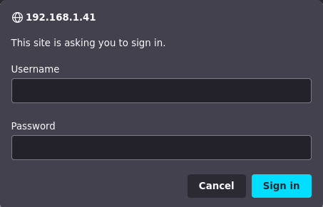
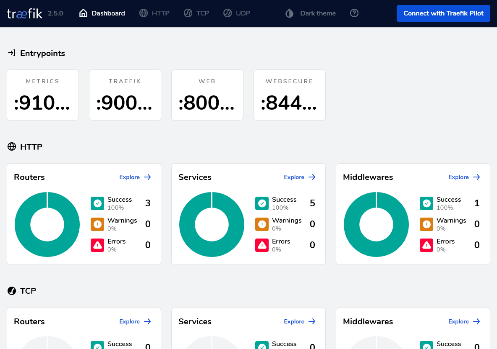

# G031 - K3s cluster setup 14 ~ Enabling the Traefik dashboard

Traefik is the ingress controller you already have running in your K3s cluster. In other words, you can give access to services running in your cluster through Traefik ingresses, instead of just assigning them external IPs directly (with MetalLB load balancer for instance). Traefik in K3s comes with its embedded web dashboard enabled by default, but you have to configure an `IngressRoute` to access it.

## Creating an `IngressRoute` for Traefik dashboard

Creating the `IngressRoute` implies three procedures: creation of a user to secure the route, declaring the `IngressRoute`, and enabling the Traefik service's IP on the Proxmox VE firewall.

### _Creating a user for the Traefik dashboard_

To secure your access to the Traefik dashboard, you'll need to define at least one user with a password. Traefik demands passwords hashed using MD5, SHA1, or BCrypt, and recommends using the `htpasswd` command to generate them.

1. Start by installing, in your `kubectl` client system, the package providing the `htpasswd` command. The package is `apache2-utils` and, on a Debian based system, you can install it with `apt`.

    ~~~bash
    $ sudo apt install -y apache2-utils
    ~~~

2. Next, use `htpasswd` to generate a user called, for instance, `tfkuser` with the password hashed with the BCrypt encryption.

    ~~~bash
    $ htpasswd -nb -B -C 9 tfkuser Pu7Y0urV3ryS3cr3tP4ssw0rdH3r3
    tfkuser:$2y$17$0mdP4WLdbj8BWj1lIJMDb.bXyYK75qR5AfRNzuunZuCamvAlqDlo.
    ~~~

    > **BEWARE!**  
    > Be careful with the value you set to the `-C` option. This option indicates the computing time used by the BCrypt algorithm for hashing and, if you set it too high, the Traefik dashboard could end not loading at all. The value you can type here must be between 4 and 17, and the default is 5.

Keep the `htpasswd`'s output at hand, you'll use that string in the next procedure.

### _Enabling the `IngressRoute`_

You need to setup a Kustomize project to deploy all the resources necessary for an `IngressRoute` but, before that, you also have to recover some information from your K3s cluster.

1. Recover the name of the secret resource related to the self-signed certificate you created back in the [**G029** guide](G029%20-%20K3s%20cluster%20setup%2012%20~%20Setting%20up%20cert-manager%20and%20wildcard%20certificate.md#setting-up-a-wildcard-certificate-for-a-domain). Remember that that certificate's secret was mirrored automatically, by the Reflector addon, into the `kube-system` namespace. Assuming the certificate secret's name started with the string "`wildcard`", you could narrow the search with `grep`.

    ~~~bash
    $ kubectl -n kube-system get secrets | grep wildcard
    wildcard.deimos.cloud-tls                            kubernetes.io/tls                     3      22h
    ~~~

    In this case, there's only one secret with such "`wildcard`" string in its name.

2. You'll also need to get the external IP assigned by MetalLB to the Traefik service.

    ~~~bash
    $ kubectl -n kube-system get svc traefik
    NAME      TYPE           CLUSTER-IP      EXTERNAL-IP    PORT(S)                      AGE
    traefik   LoadBalancer   10.43.187.212   192.168.1.41   80:30963/TCP,443:32446/TCP   3d3h
    ~~~

With those two pieces of data recovered, now you can start working on the Traefik Dashboard's `IngressRoute` Kustomize project.

1. Create the Kustomize project's folder tree as follows.

    ~~~bash
    $ mkdir -p $HOME/k8sprjs/traefik_dashboard-ingressroute/{resources,secrets}
    ~~~

    As you above, there's a subfolder for `resources` and now there's also another for `secrets`.

2. Create the following files within the `resources` folder.

    ~~~bash
    $ touch $HOME/k8sprjs/traefik_dashboard-ingressroute/resources/{traefik-auth.middleware.basicauth.yaml,traefik-dashboard.ingressroute.yaml}
    ~~~

3. Copy in `traefik-dashboard.ingressroute.yaml` the following lines.

    ~~~yaml
    apiVersion: traefik.containo.us/v1alpha1
    kind: IngressRoute

    metadata:
      name: traefik-dashboard
      namespace: kube-system
    spec:
      entryPoints:
        - websecure
      tls:
        secretName: wildcard.deimos.cloud-tls
      routes:
      - match: (Host(`192.168.1.41`) || Host(`traefik.deimos.cloud`) || Host(`tfk.deimos.cloud`)) && (PathPrefix(`/dashboard`) || PathPrefix(`/api`))
        kind: Rule
        services:
        - name: api@internal
          kind: TraefikService
        middlewares:
          - name: traefik-auth
    ~~~

    This is a Traefik `IngressRoute`, defining the route and the authentication method to access your Traefik Dashboard.

    > **BEWARE!**  
    > An `IngressRoute` object is **not** a standard Kubernetes resource, it's a customized alternative to the standard `Ingress` Kubernetes object **used only by Traefik**. Other Ingress controllers may have their own alternatives to the standard Ingress object.

    - In the `spec.entryPoints` there's only the `websecure` option enabled. This means that only the _https_ (`443` port) is enabled as entry point to this route.

    - Your certificate secret's name goes in the `spec.tls.secretname` parameter.
        > **BEWARE!**  
        > When applying a certificate in a Traefik `IngressRoute`, this route can have enabled **only** the `websecure` entry point. If you also need an alternative standard _http_ entry point to the same route, you'll need to create a different `IngressRoute` resource with the `web` entry point option set and no `tls` section, while keeping the rest the same as in the `websecure` version of the route.

    - The `spec.routes.match` parameter indicates to Traefik the valid URL pattern to reach this ingress route.
        - The pattern is `Host/PathPrefix`, where `Host` and `PathPrefix` are placeholders for their possible values. Examples of valid paths admitted by the configuration above are:
            - `https://192.168.1.41/dashboard/`
            - `https://tfk.deimos.cloud/dashboard/`
            - `https://traefik.deimos.cloud/api/`
        - See how I added the external IP of the Traefik service as a possible `Host` that can appear in the route. If you don't add it, you won't be able to access this route with that IP.
        - Also see how I've set up two subdomains as possible `Host` values. This way, you can put any number of alternative subdomains that can lead to the same web resource.
            > **BEWARE!**  
            > Remember that the domains or subdomains you set up as `Host` values won't work on your network just by being put here. You'll have to enable them in your network's router or gateway, local DNS or associate them with their corresponding IP in the `hosts` file of any client systems connected to your network that require to know the correct IP for those domains or subdomains.
        - Be very careful of not forgetting any of those backticks characters ( \` ) enclosing the strings in the `Host` and `PathPrefix` directives.

4. Add to `traefik-auth.middleware.basicauth.yaml` the yaml next.

    ~~~yaml
    apiVersion: traefik.containo.us/v1alpha1
    kind: Middleware

    metadata:
      name: traefik-auth
      namespace: kube-system
    spec:
      basicAuth:
        secret: traefik-auth-secret
    ~~~

    A `Middleware` is another custom Traefik resource, used in this case for configuring a basic authentication method (user and password login system). In the the `spec.basicAuth.secret` parameter this middleware invokes a `Secret` resource which you'll define later in this procedure.

5. Create a new `users` file under the `secrets` subfolder.

    ~~~bash
    $ touch $HOME/k8sprjs/traefik_dashboard-ingressroute/secrets/users
    ~~~

6. In the new `users` file, paste the string you got from the `htpasswd` command earlier.

    ~~~bash
    tfkuser:$2y$17$0mdP4WLdbj8BWj1lIJMDb.bXyYK75qR5AfRNzuunZuCamvAlqDlo.
    ~~~

7. Generate a `kustomization.yaml` file at the root folder of this Kustomization project.

    ~~~bash
    $ touch $HOME/k8sprjs/traefik_dashboard-ingressroute/kustomization.yaml
    ~~~

8. In the `kustomization.yaml` file put the following yaml content.

    ~~~yaml
    # Traefik Dashboard IngressRoute setup
    apiVersion: kustomize.config.k8s.io/v1beta1
    kind: Kustomization

    resources:
    - resources/traefik-auth.middleware.basicauth.yaml 
    - resources/traefik-dashboard.ingressroute.yaml

    secretGenerator:
    - name: traefik-auth-secret
      namespace: kube-system
      files:
      - secrets/users
      options:
        disableNameSuffixHash: true
    ~~~

    See that there's a `secretGenerator` block in the yaml above.

    - This is a Kustomize feature that generates `Secret` objects in a Kubernetes cluster from a given configuration.

    - See how the secret is configured with a concrete `name` and `namespace`, and that has a reference to the `users` file you created previously in the `secrets` subfolder.

    - The `disableNameSuffixHash` option is required to be `true`, otherwise Kustomize will add a hash suffix to the secret's name and your `Middleware` won't be able to find it in the cluster.
        - This is because the `Middleware` declares the `Secret`'s name in a non-Kubernetes-standard parameter which Kustomize doesn't recognize. Thus, Kustomize can't replace the name with its hashed version in the `spec.basicAuth.secret` parameter.
        - This is a situation equivalent to what happened in the deployment of MetalLB, back in the [**G027** guide](G027%20-%20K3s%20cluster%20setup%2010%20~%20Deploying%20the%20MetalLB%20load%20balancer.md#setting-up-the-configuration-files), where there was a `configMapGenerator` in which this option has also to be enabled to avoid a similar issue with a `ConfigMap` resource.
        > **BEWARE!**  
        > Since the `secretGenerator` and `configMapGenerator` feature are Kustomize generators, both have [exactly the same generator options available](https://kubectl.docs.kubernetes.io/references/kustomize/kustomization/generatoroptions/), such as this `disableNameSuffixHash` feature.

    To see how the secret object would look in this case, just check it out with `kubectl kustomize`.

    ~~~bash
    $ kubectl kustomize $HOME/k8sprjs/traefik_dashboard-ingressroute | less
    ~~~

    Look for the `Secret` object in the resulting paginated yaml, it should look like below.

    ~~~yaml
    apiVersion: v1
    data:
      users: |
        dGZrdXNlcjokMnkkMTckMG1kUDRXTGRiajhCV2oxbElKTURiLmJYeVlLNzVxUjVBZlJOenV1blp1
        Q2FtdkFscURsby4K
    kind: Secret
    metadata:
      name: traefik-auth-secret
      namespace: kube-system
    type: Opaque
    ~~~

    Notice the following in this `Secret`.

    - In the `data.users` section there's a odd looking string. This is the content of the `secrets/user` file referenced in the `secretGenerator` block, automatically encoded by Kustomize in base64. You can check that its the same string on the file by decoding it with `base64 -d` as follows.

        ~~~bash
        $ echo dGZrdXNlcjokMnkkMTckMG1kUDRXTGRiajhCV2oxbElKTURiLmJYeVlLNzVxUjVBZlJOenV1blp1Q2FtdkFscURsby4K | base64 -d
        tfkuser:$2y$17$0mdP4WLdbj8BWj1lIJMDb.bXyYK75qR5AfRNzuunZuCamvAlqDlo.
        ~~~

        Notice that I've put the base64 string in one line, while it's splitted in two in the `Secret` object.

    - The `metadata.name` and `metadata.namespace` are exactly as specified in the `kustomization.yaml` file.

    - The `type` `Opaque` means that the content under `data` is base64-encoded.

9. At last, apply this Kustomization project.

    ~~~bash
    $ kubectl apply -k $HOME/k8sprjs/traefik_dashboard-ingressroute
    ~~~

## Getting into the dashboard

Let's suppose that you don't have the subdomains you've defined as `Host` enabled in your network. This means that you'll have to access the dashboard using traefik service's external IP. In this case, the external IP happens to be `192.168.1.41` so you should open a browser and go to `https://192.168.1.41/dashboard/`.

1. The first thing you'll probably see is a warning by your browser telling you that the connection is not secure because the certificate isn't either. But, if you check the information of the certificate, you'll see that it's **not** the one you generated back in the [**G029** guide](G029%20-%20K3s%20cluster%20setup%2012%20~%20Setting%20up%20cert-manager%20and%20wildcard%20certificate.md#setting-up-a-wildcard-certificate-for-a-domain), but another self-generated by Traefik itself ("verified" by `CN=TRAEFIK DEFAULT CERT`). Remember that the certificate in that guide was configured for a wildcard main domain, not for any concrete IP.

2. After the security warning, a generic sign-in window will pop up in your browser.

    

3. Type your user and password, sign in and you'll reach the Traefik dashboard's main page.

    

Finally, when you have the subdomain or subdomains for your traefik's external IP ready in your network, or in the `hosts` file of your client systems, try to access the dashboard using them. Then check the certificate information and you'll see that it corresponds to the one that you created.

## Traefik dashboard has bad performance

If your Traefik dashboard seems to load extremely slowly, or just returning a blank page, it could be that you set the `-C` value in the `htpasswd` command too high. For some reason this affects the Traefik dashboard's performance, hitting badly the node were the traefik service is being executed. So, if this is happening to you, try the following.

1. Generate a new user string with `htpasswd` as you saw previously, but with a lower `-C` value than the one you used in the first place. Then replace the string you already have in the `secrets/users` file with the new one.

2. Delete and then reapply the Kustomize project again.

    ~~~bash
    $ kubectl delete -k $HOME/k8sprjs/traefik_dashboard-ingressroute
    $ kubectl apply -k $HOME/k8sprjs/traefik_dashboard-ingressroute
    ~~~

    The delete is to make sure that the `IngressRoute` resource is regenerated with the change applied.

3. Try to access the Traefik Dashboard and see how it runs now.

## Traefik dashboard's Kustomize project attached to this guide series

You can find the Kustomize project for this Traefik dashboard deployment in the following attached folder.

- `k8sprjs/traefik_dashboard-ingressroute`

## Relevant system paths

### _Folders in `kubectl` client system_

- `$HOME/k8sprjs/traefik-ingressroute`
- `$HOME/k8sprjs/traefik-ingressroute/resources`
- `$HOME/k8sprjs/traefik-ingressroute/secrets`

### _Files in `kubectl` client system_

- `$HOME/k8sprjs/traefik-ingressroute/kustomization.yaml`
- `$HOME/k8sprjs/traefik-ingressroute/resources/traefik-auth.middleware.basicauth.yaml`
- `$HOME/k8sprjs/traefik-ingressroute/resources/traefik-dashboard.ingressroute.yaml`
- `$HOME/k8sprjs/traefik-ingressroute/secrets/users`

## References

### _Traefik dashboard_

- [Traefik Dashboard](https://doc.traefik.io/traefik/operations/dashboard/)
- [Traefik Middleware Basic Auth](https://doc.traefik.io/traefik/middlewares/basicauth/)
- [Install Traefik Ingress Controller in Kubernetes](https://blog.zachinachshon.com/traefik-ingress/)
- [Install the Traefik Ingress Controller on k0s](https://docs.k0sproject.io/v1.21.2+k0s.0/examples/traefik-ingress/)
- [Deploy Traefik on Kubernetes with Wildcard TLS Certs](https://ikarus.sg/deploy-traefik-v2/)

### _Traefik IngressRoute Vs Ingress_

- [What is the difference between a Kubernetes Ingress and a IngressRoute?](https://stackoverflow.com/questions/60177488/what-is-the-difference-between-a-kubernetes-ingress-and-a-ingressroute)
- [The Kubernetes Ingress Controller, The Custom Resource Way.](https://doc.traefik.io/traefik/providers/kubernetes-crd/)
- [The Kubernetes Ingress Controller.](https://doc.traefik.io/traefik/providers/kubernetes-ingress/)
- [Kubernetes Ingress](https://kubernetes.io/docs/concepts/services-networking/ingress/)
- [Steps to expose services using Kubernetes Ingress](https://www.golinuxcloud.com/steps-to-expose-services-using-kubernetes-ingress/)
- [Directing Kubernetes traffic with Traefik](https://opensource.com/article/20/3/kubernetes-traefik)
- [Ingress with Traefik on K3s](https://itnext.io/ingress-with-treafik-on-k3s-53db6e751ed3)
- [K3s issue. Documentation on ingress](https://github.com/k3s-io/k3s/issues/436)

### _Traefik with cert-manager_

- [How to configure Traefik on Kubernetes with Cert-manager?](https://www.padok.fr/en/blog/traefik-kubernetes-certmanager)
- [Use Traefik and cert-manager to serve a secured website](https://community.hetzner.com/tutorials/howto-k8s-traefik-certmanager)
- [How to use TLS in k8s IngressRoute](https://community.traefik.io/t/how-to-use-tls-in-k8s-ingressroute/7529)
- [IngressRoute with “secretName” field still serves with default certificate](https://community.traefik.io/t/ingressroute-with-secretname-field-still-serves-with-default-certificate/991)
- [Securing Ingress Resources with cert-manager](https://cert-manager.io/docs/usage/ingress/)

### _Kustomize_

- [configMapGenerator](https://kubectl.docs.kubernetes.io/references/kustomize/kustomization/configmapgenerator/)
- [secretGenerator](https://kubectl.docs.kubernetes.io/references/kustomize/kustomization/secretgenerator/)
- [generatorOptions](https://kubectl.docs.kubernetes.io/references/kustomize/kustomization/generatoroptions/)

## Navigation

[<< Previous (**G030. K3s cluster setup 13**)](G030%20-%20K3s%20cluster%20setup%2013%20~%20Deploying%20the%20Kubernetes%20Dashboard.md) | [+Table Of Contents+](G000%20-%20Table%20Of%20Contents.md) | [Next (**G032. Deploying services 01**) >>](G032%20-%20Deploying%20services%2001%20~%20Considerations.md)
