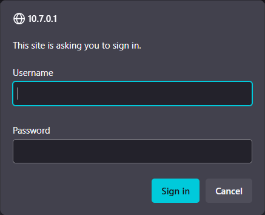

# G031 - K3s cluster setup 14 ~ Enabling the Traefik dashboard

- [Traefik is the embedded ingress controller of K3s](#traefik-is-the-embedded-ingress-controller-of-k3s)
- [Enabling access to the Traefik dashboard](#enabling-access-to-the-traefik-dashboard)
  - [Defining a user for the Traefik dashboard](#defining-a-user-for-the-traefik-dashboard)
  - [Kustomize project for enabling access to the Traefik dashboard](#kustomize-project-for-enabling-access-to-the-traefik-dashboard)
- [Getting into the Traefik dashboard](#getting-into-the-traefik-dashboard)
- [What to do if Traefik's dashboard has bad performance](#what-to-do-if-traefiks-dashboard-has-bad-performance)
- [Traefik dashboard's Kustomize project attached to this guide](#traefik-dashboards-kustomize-project-attached-to-this-guide)
- [Relevant system paths](#relevant-system-paths)
  - [Folders in `kubectl` client system](#folders-in-kubectl-client-system)
  - [Files in `kubectl` client system](#files-in-kubectl-client-system)
- [References](#references)
  - [Traefik documentation](#traefik-documentation)
  - [Traefik in K3s](#traefik-in-k3s)
  - [Kubernetes Documentation](#kubernetes-documentation)
  - [Traefik IngressRoute Vs Ingress](#traefik-ingressroute-vs-ingress)
  - [Kustomize](#kustomize)
- [Navigation](#navigation)

## Traefik is the embedded ingress controller of K3s

Traefik is the default ingress controller that already comes embedded in K3s. In other words, you can enable access to services running in your cluster through Traefik ingresses, instead of just assigning them external IPs directly (in particular, with the MetalLB load balancer).

Traefik in K3s comes with its embedded web dashboard enabled by default, but reaching it requires a particular setup not clearly explained in the official documentation of neither [Traefik](https://doc.traefik.io/traefik/reference/install-configuration/api-dashboard/) nor [K3s](https://docs.k3s.io/networking/networking-services?_highlight=traefik#traefik-ingress-controller).

## Enabling access to the Traefik dashboard

This chapter shows you how to enable HTTPS access to your Traefik dashboard by doing the following:

1. Defining a user to restrict access to the Traefik dashboard.
2. Declaring a `Service` pointing to the websecure `443` port of the pod running Traefik in your cluster.
3. Declaring an `IngressRoute` to the Traefik dashboard `Service` enabling access to Traefik's websecure port.

The first step is just the execution of a command on your `kubectl` client. The other two go together in the corresponding Kustomize project.

### Defining a user for the Traefik dashboard

Secure the access to your Traefik dashboard by defining at least one user with a password. Traefik demands passwords hashed using MD5, SHA1, or BCrypt, and recommends using the `htpasswd` command to generate them:

1. Start by installing, in your `kubectl` client system, the package providing the `htpasswd` command. The package is `apache2-utils` and, on a Debian based system, you can install it with `apt`:

    ~~~sh
    $ sudo apt install -y apache2-utils
    ~~~

2. Next, use `htpasswd` to generate a user called, for instance, `tfkuser` with the password hashed with the BCrypt encryption:

    ~~~sh
    $ htpasswd -nb -B -C 9 tfkuser Pu7Y0urV3ryS3cr3tP4ssw0rdH3r3
    tfkuser:$2y$17$0mdP4WLdbj8BWj1lIJMDb.bXyYK75qR5AfRNzuunZuCamvAlqDlo.
    ~~~

    > [!IMPORTANT]
    > **Be careful with the value you set to the `-C` option!**\
    > This option indicates the computing time used by the BCrypt algorithm for hashing and, if you set it too high, the Traefik dashboard could end not loading at all. The value you can type here must be between 4 and 17, and the default is 5.

Keep the `htpasswd`'s output at hand, you will use that encrypted string in the next procedure.

### Kustomize project for enabling access to the Traefik dashboard

The next steps set up and deploy the Kustomize project enabling access to your Traefik dashboard:

1. Create the Kustomize project's folder structure:

    ~~~sh
    $ mkdir -p $HOME/k8sprjs/traefik-dashboard/{resources,secrets}
    ~~~

    This project has one `resources` subfolder for storing Kubenetes resources declarations, and a `secrets` one to keep a file with the secret string describing the user for accessing the Traefik dashboard.

2. Create the following files within the Kustomize project:

    ~~~sh
    $ touch $HOME/k8sprjs/traefik-dashboard/resources/{traefik-dashboard-basicauth.middleware.traefik.yaml,traefik-dashboard.ingressroute.traefik.yaml,traefik-dashboard.service.yaml} $HOME/k8sprjs/traefik-dashboard/secrets/users
    ~~~

3. In `resources/traefik-dashboard-basicauth.middleware.traefik.yaml` declare the authorization method that will be used for login in the Traefik dashboard:

    ~~~yaml
    # Basic authentication method for Traefik dashboard
    apiVersion: traefik.io/v1alpha1
    kind: Middleware

    metadata:
      name: traefik-dashboard-basicauth
      namespace: kube-system
    spec:
      basicAuth:
        secret: traefik-dashboard-basicauth-secret
    ~~~

    A `Middleware` is a custom Traefik resource, used in this case for configuring a basic authentication method (a user and password login system). In the `spec.basicAuth.secret` parameter, this middleware invokes a `secret` resource which you'll declare in a later step of this procedure.

4. Using `kubectl`, see the current external IP MetalLB has assigned to the services running in your cluster:

    ~~~sh
    $ kubectl -n kube-system get svc
    NAME             TYPE           CLUSTER-IP      EXTERNAL-IP   PORT(S)                      AGE
    kube-dns         ClusterIP      10.43.0.10      <none>        53/UDP,53/TCP,9153/TCP       22d
    metrics-server   ClusterIP      10.43.50.63     <none>        443/TCP                      9d
    traefik          LoadBalancer   10.43.174.63    10.7.0.0      80:30512/TCP,443:32647/TCP   22d

    ~~~

    At this point, the only service with an external IP assigned is Traefik, but you cannot use that address even if you want to access its own dashboard. You have to pick the next IP available [in the address pool you enabled in MetalLB](G027%20-%20K3s%20cluster%20setup%2010%20~%20Deploying%20the%20MetalLB%20load%20balancer.md#choosing-the-ip-ranges-for-metallb), which for this guide's setup is `10.7.0.1`.

    > [!NOTE]
    > **The Traefik dashboard is not accessible through the existing `traefik` service**\
    > It is not possible to reach the Traefik dashboard through the already present `traefik` `Service` object in the K3s setup. You need to create a different service with its own IP address to access the dashboard, as declared in the next step.

5. Declare the `Service` object for the Traefik dasboard in `traefik-dashboard.service.yaml`:

    ~~~yaml
    # Traefik dashboard service
    apiVersion: v1
    kind: Service

    metadata:
      name: traefik-dashboard
      namespace: kube-system
      labels:
        app.kubernetes.io/instance: traefik-kube-system
        app.kubernetes.io/name: traefik-dashboard
    spec:
      type: LoadBalancer
      loadBalancerIP: 10.7.0.1
      ports:
      - name: websecure
        port: 443
        targetPort: websecure
        protocol: TCP
      selector:
        app.kubernetes.io/instance: traefik-kube-system
        app.kubernetes.io/name: traefik
    ~~~

    This `Service` has the following particularities:

    - In its `metadata` section there are `labels`:

      - `app.kubernetes.io/instance`\
        The `traefik-kube-system` value groups this service in the same instance as the pod and service already existing in your cluster.

      - `app.kubernetes.io/name`\
        The `traefik-dashboard` string identifies this service within the Traefik instance.

    - The `spec.type` makes this `Service` managed by your cluster's load balancer (MetalLB). This is required to be able to use the `spec.loadBalancerIP` property to specify the IP you want for this `Service` from those provided by MetalLB.

    - The `ports` configuration exposes the `websecure` port of the Traefik pod through the `443` (HTTPS) `port`.

      > [!NOTE]
      > **Traefik's pod has four named ports opened**\
      > To check those ports out, first discover the name of the `Running` Traefik pod:
      >
      > ~~~sh
      > $ kubectl -n kube-system get pods | grep traefik
      > traefik-c98fdf6fb-ndqbk                   1/1     Running     0             25m
      > traefik-c98fdf6fb-t8bkp                   0/1     Completed   0             44h
      > traefik-c98fdf6fb-vdwbf                   0/1     Completed   0             43h
      > ~~~
      >
      > You can have several pods listed for Traefik, but most of them are just references to old pods that you can remove from your cluster with the `kubectl -n kube-system delete pods` command. Copy the name for the `Running` Traefik pod, then extract the ports information from the pod's description:
      >
      > ~~~sh
      > $ kubectl -n kube-system describe pod traefik-c98fdf6fb-ndqbk | grep Ports
      >     Ports:         9100/TCP (metrics), 8080/TCP (traefik), 8000/TCP (web), 8443/TCP (websecure)
      >     Host Ports:    0/TCP (metrics), 0/TCP (traefik), 0/TCP (web), 0/TCP (websecure)
      > ~~~
      >
      > You could also get this same information from older `Completed` pods, but it is better to get the most up-to-date details from a currently `Running` pod.

    - The `selector` links this `Service` object with the running Traefik pod that has been labeled with the same specified tags.

      > [!NOTE]
      > **See the labels applied to the running Traefik pod**\
      > Check out the [labels](https://kubernetes.io/docs/concepts/overview/working-with-objects/labels/#label-selectors) applied to the running Traefik pod with `kubectl`:
      >
      > ~~~sh
      > $ kubectl -n kube-system describe pods traefik-c98fdf6fb-ndqbk 
      > Name:                 traefik-c98fdf6fb-ndqbk
      > Namespace:            kube-system
      > Priority:             2000000000
      > Priority Class Name:  system-cluster-critical
      > Service Account:      traefik
      > Node:                 k3sagent02/172.16.2.2
      > Start Time:           Wed, 08 Oct 2025 09:00:04 +0200
      > Labels:               app.kubernetes.io/instance=traefik-kube-system
      >                       app.kubernetes.io/managed-by=Helm
      >                       app.kubernetes.io/name=traefik
      >                       helm.sh/chart=traefik-34.2.1_up34.2.0
      >                       pod-template-hash=c98fdf6fb
      > ...
      > ~~~
      >
      > In the output, look at the `Labels` section to find there the labels `app.kubernetes.io/instance` and `app.kubernetes.io/name`. Also notice that the labels applied are [equality-based ones](https://kubernetes.io/docs/concepts/overview/working-with-objects/labels/#equality-based-requirement).

6. Declare in `resources/traefik-dashboard.ingressroute.traefik.yaml` the `IngressRoute` resource for enabling access to the Traefik dashboard:

    ~~~yaml
    # Ingress for Traefik's dashboard
    apiVersion: traefik.io/v1alpha1
    kind: IngressRoute

    metadata:
      name: traefik-dashboard
      namespace: kube-system
    spec:
      entryPoints:
        - websecure
      routes:
        - kind: Rule
          match: Host(`10.7.0.1`) || Host(`traefik.homelab.cloud`) || Host(`tfk.homelab.cloud`)
          services:
            - name: api@internal
              kind: TraefikService
          middlewares:
            - name: traefik-dashboard-basicauth
    ~~~

    This is a Traefik `IngressRoute` resource defining the route and the authentication method to access your Traefik dashboard:

    > [!IMPORTANT]
    > **The `IngressRoute` is NOT a standard Kubernetes resource**\
    > It is a customized alternative to the standard `Ingress` Kubernetes object **offered only by Traefik**. Other Ingress controllers may have their own alternatives to the standard Kubernetes Ingress object.

    - In the `spec.entryPoints` there is only the `websecure` option enabled. This means that only the `443` port is enabled as entry point to this route.

    - The `spec.routes.match` parameter indicates to Traefik the valid URL patterns reachable through this `IngressRoute`:

      - The external IP of the Traefik service is added as a possible `Host` that can appear in the route. If you do not add it, you will not be able to access this route with that address.

      - Two subdomains are setup as possible `Host` values. This way, you can put any number of alternative subdomains that can lead to the same web resource.

        > [!NOTE]
        > **The domains or subdomains you set up as `Host` values will not work just by being put there**\
        > You have to enable them in your network's router or gateway, local DNS or associate them with their corresponding IP in the `hosts` file of any client systems connected to your network that require to know the correct IP for those domains or subdomains.

      - Do not forget any of the backticks characters ( \` ) enclosing the strings in the `Host` directives.

      - The `spec.routes.services` links the `IngressRoute` with the `traefik-dashboard` `Service` declared earlier.

        > [!NOTE]
        > **This is invoking an `api@internal` `TraefikService` resource, not the `traefik-dashboard` `Service` object!**\
        > Why it works this way is something I have not found an explanation for.

      - The `spec.routes.match.middlewares` only invokes the basic authentication middleware.

7. In the `secrets/users` file, just paste the encrypted string you got from the `htpasswd` command earlier:

    ~~~sh
    tfkuser:$2y$17$0mdP4WLdbj8BWj1lIJMDb.bXyYK75qR5AfRNzuunZuCamvAlqDlo.
    ~~~

8. Generate a `kustomization.yaml` file at the root folder of this Kustomization project:

    ~~~sh
    $ touch $HOME/k8sprjs/traefik-dashboard/kustomization.yaml
    ~~~

9. In the `kustomization.yaml` file declare your Kustomization project for enabling the Traefik dashboard:

    ~~~yaml
    # Traefik dashboard setup
    apiVersion: kustomize.config.k8s.io/v1beta1
    kind: Kustomization

    resources:
    - resources/traefik-dashboard-basicauth.middleware.traefik.yaml
    - resources/traefik-dashboard.service.yaml
    - resources/traefik-dashboard.ingressroute.traefik.yaml

    secretGenerator:
    - name: traefik-dashboard-basicauth-secret
      namespace: kube-system
      files:
      - secrets/users
      options:
        disableNameSuffixHash: true
    ~~~

    See that there is a `secretGenerator` block in this Kustomization declaration:

    - This is a Kustomize feature that generates `Secret` objects in a Kubernetes cluster from a given configuration.

    - The secret is configured with a concrete `name` and `namespace`.  It also has under `files` a reference to the `users` file you created previously under the `secrets` subfolder.

    - The `disableNameSuffixHash` option is required to be `true`. Otherwise, Kustomize will add a hash suffix to the secret's name and your `Middleware` will not be able to find it in the cluster.

      > [!NOTE]
      > **This is an issue between Traefik and Kubernetes Kustomize**\
      > The suffix problem happens because the `Middleware` declares the `Secret`'s name in a non-Kubernetes-standard parameter which Kustomize does not recognize. Therefore, Kustomize cannot replace the name with its hashed version in the `spec.basicAuth.secret` parameter.

    To see how the `Secret` object would look, you can review it with `kubectl kustomize`:

    ~~~sh
    $ kubectl kustomize $HOME/k8sprjs/traefik-dashboard | less
    ~~~

    Look for the `Secret` object in the resulting paginated yaml, it should look like below:

    ~~~yaml
    apiVersion: v1
    data:
      users: |
        dGZrdXNlcjokMnkkMTckMG1kUDRXTGRiajhCV2oxbElKTURiLmJYeVlLNzVxUjVBZlJOenV1blp1
        Q2FtdkFscURsby4K
    kind: Secret
    metadata:
      name: traefik.homelab.cloud-basic-auth-secret
      namespace: kube-system
    type: Opaque
    ~~~

    Notice the following details in this `Secret` object:

    - In the `data.users` parameter there is an odd looking string. This is the content of the `secrets/user` file referenced in the `secretGenerator` block, automatically encoded by Kustomize in base64. You can check that it is the same string on the file by decoding it with `base64 -d` as follows.

        ~~~sh
        $ echo dGZrdXNlcjokMnkkMTckMG1kUDRXTGRiajhCV2oxbElKTURiLmJYeVlLNzVxUjVBZlJOenV1blp1Q2FtdkFscURsby4K | base64 -d
        tfkuser:$2y$17$0mdP4WLdbj8BWj1lIJMDb.bXyYK75qR5AfRNzuunZuCamvAlqDlo.
        ~~~

        See that I've entered the base64 string in one line, while it has been returned split in two in the `Secret` object.

    - The `metadata.name` and `metadata.namespace` are exactly as specified in the `kustomization.yaml` file.

    - The `type` `Opaque` means that the content under `data` is base64-encoded.

10. At last, apply this Kustomization project:

    ~~~sh
    $ kubectl apply -k $HOME/k8sprjs/traefik-dashboard
    ~~~

## Getting into the Traefik dashboard

Let's suppose you do not have the subdomains you've defined as `Host` enabled in your network. You will have to access the dashboard using traefik service's external IP. In this case, the external IP happens to be `10.7.0.1` so browse to `https://10.7.0.1/`.

1. The first thing you'll probably see is a warning by your browser telling you that the connection is not secure because the certificate isn't either. If you check the certificate's information, you will see that it is one self-generated by Traefik itself ("verified" by `CN=TRAEFIK DEFAULT CERT`).

2. Right after accepting "the risk" in the security warning, a generic login window will pop up in your browser:

    

3. Type your user and password, press on `Sign in` and you will be redirected to the Traefik dashboard's main page available under the `/dashboard/#/` path:

    

Finally, when you have the subdomain or subdomains for your traefik's external IP ready in your network, or in the `hosts` file of your client systems, try accessing the Traefik dashboard using them.

## What to do if Traefik's dashboard has bad performance

If your Traefik dashboard seems to load extremely slowly, or just returning a blank page, it could be that you set the `-C` value in the `htpasswd` command too high. For some reason this affects the Traefik dashboard's performance, hitting badly the node were the traefik service is being executed. So, if this is happening to you, try the following.

1. Generate a new user string with `htpasswd` as you saw previously, but with a lower `-C` value than the one you used in the first place. Then replace the string you already have in the `secrets/users` file with the new one.

2. Delete and then reapply the Kustomize project again.

    ~~~sh
    $ kubectl delete -k $HOME/k8sprjs/traefik-dashboard
    $ kubectl apply -k $HOME/k8sprjs/traefik-dashboard
    ~~~

    The `delete` command is to make sure that the `IngressRoute` resource is regenerated with the change applied.

3. Try to access your Traefik dashboard and see how it runs now.

## Traefik dashboard's Kustomize project attached to this guide

Find the Kustomize project for this Traefik dashboard deployment in the following attached folder:

- [`k8sprjs/traefik-dashboard`](k8sprjs/traefik-dashboard/)

## Relevant system paths

### Folders in `kubectl` client system

- `$HOME/k8sprjs/traefik-dashboard`
- `$HOME/k8sprjs/traefik-dashboard/resources`
- `$HOME/k8sprjs/traefik-dashboard/secrets`

### Files in `kubectl` client system

- `$HOME/k8sprjs/traefik-dashboard/kustomization.yaml`
- `$HOME/k8sprjs/traefik-dashboard/resources/traefik-dashboard.ingressroute.traefik.yaml`
- `$HOME/k8sprjs/traefik-dashboard/resources/traefik-dashboard.service.yaml`
- `$HOME/k8sprjs/traefik-dashboard/resources/traefik-dashboard-basicauth.middleware.traefik.yaml`
- `$HOME/k8sprjs/traefik-dashboard/secrets/users`

## References

### [Traefik documentation](https://doc.traefik.io/)

- [Reference. Install Configuration. API & Dashboard](https://doc.traefik.io/traefik/reference/install-configuration/api-dashboard/)
- [Reference. Routing Configuration. Kubernetes. Ingress](https://doc.traefik.io/traefik/reference/routing-configuration/kubernetes/ingress/)
- [Reference. Routing Configuration. Kubernetes. Kubernetes CRD. HTTP. IngressRoute](https://doc.traefik.io/traefik/reference/routing-configuration/kubernetes/crd/http/ingressroute/)
- [Reference. Routing Configuration. Kubernetes. Kubernetes CRD. HTTP. Middleware](https://doc.traefik.io/traefik/reference/routing-configuration/kubernetes/crd/http/middleware/)

### Traefik in K3s

- [K3s docs. Networking](https://docs.k3s.io/networking)
  - [Traefik Ingress Controller](https://docs.k3s.io/networking/networking-services?_highlight=traefik#traefik-ingress-controller)

- [K3s Rocks. Traefik dashboard](https://k3s.rocks/traefik-dashboard/)
- [Exposing services in a K3S/K3D cluster with Traefik](https://www.ivankrizsan.se/2024/07/12/exposing-services-in-a-k3s-k3d-cluster-with-traefik/)

### [Kubernetes Documentation](https://kubernetes.io/docs/home/)

- [Concepts. Overview. Objects In Kubernetes](https://kubernetes.io/docs/concepts/overview/working-with-objects/)
  - [Labels and Selectors](https://kubernetes.io/docs/concepts/overview/working-with-objects/labels/#label-selectors)
    - [Labels selectors](https://kubernetes.io/docs/concepts/overview/working-with-objects/labels/#label-selectors)
    - [Equality-based requirement](https://kubernetes.io/docs/concepts/overview/working-with-objects/labels/#equality-based-requirement)

- [Concepts. Services, Load Balancing, and Networking](https://kubernetes.io/docs/concepts/services-networking/)
  - [Ingress](https://kubernetes.io/docs/concepts/services-networking/ingress/)

### Traefik IngressRoute Vs Ingress

- [What is the difference between a Kubernetes Ingress and a IngressRoute?](https://stackoverflow.com/questions/60177488/what-is-the-difference-between-a-kubernetes-ingress-and-a-ingressroute)
- [Steps to expose services using Kubernetes Ingress](https://www.golinuxcloud.com/steps-to-expose-services-using-kubernetes-ingress/)
- [Directing Kubernetes traffic with Traefik](https://opensource.com/article/20/3/kubernetes-traefik)
- [Ingress with Traefik on K3s](https://itnext.io/ingress-with-treafik-on-k3s-53db6e751ed3)
- [K3s issue. Documentation on ingress](https://github.com/k3s-io/k3s/issues/436)

### [Kustomize](https://kubectl.docs.kubernetes.io/references/kustomize/)

- [configMapGenerator](https://kubectl.docs.kubernetes.io/references/kustomize/kustomization/configmapgenerator/)
- [secretGenerator](https://kubectl.docs.kubernetes.io/references/kustomize/kustomization/secretgenerator/)
- [generatorOptions](https://kubectl.docs.kubernetes.io/references/kustomize/kustomization/generatoroptions/)

## Navigation

[<< Previous (**G030. K3s cluster setup 13**)](G030%20-%20K3s%20cluster%20setup%2013%20~%20Deploying%20the%20Headlamp%20dashboard.md) | [+Table Of Contents+](G000%20-%20Table%20Of%20Contents.md) | [Next (**G032. Deploying services 01**) >>](G032%20-%20Deploying%20services%2001%20~%20Considerations.md)
