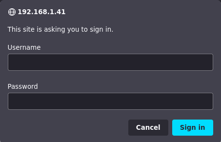
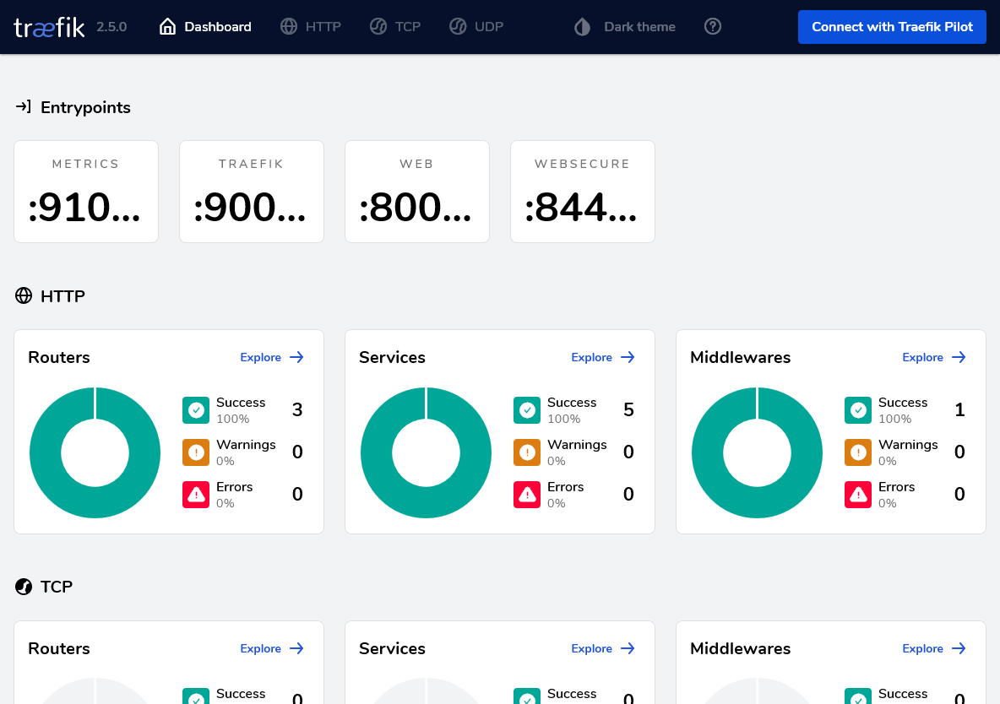

# G031 - K3s cluster setup 14 ~ Enabling the Traefik dashboard

- [Traefik is the embedded ingress controller of K3s](#traefik-is-the-embedded-ingress-controller-of-k3s)
- [Creating an `IngressRoute` for Traefik dashboard](#creating-an-ingressroute-for-traefik-dashboard)
  - [Creating a user for the Traefik dashboard](#creating-a-user-for-the-traefik-dashboard)
  - [Enabling the `IngressRoute`](#enabling-the-ingressroute)
- [Getting into the dashboard](#getting-into-the-dashboard)
- [Traefik dashboard has bad performance](#traefik-dashboard-has-bad-performance)
- [Traefik dashboard's Kustomize project attached to this guide series](#traefik-dashboards-kustomize-project-attached-to-this-guide-series)
- [Relevant system paths](#relevant-system-paths)
  - [Folders in `kubectl` client system](#folders-in-kubectl-client-system)
  - [Files in `kubectl` client system](#files-in-kubectl-client-system)
- [References](#references)
  - [Traefik dashboard](#traefik-dashboard)
  - [Traefik IngressRoute Vs Ingress](#traefik-ingressroute-vs-ingress)
  - [Traefik with cert-manager](#traefik-with-cert-manager)
  - [Kustomize](#kustomize)
- [Navigation](#navigation)

## Traefik is the embedded ingress controller of K3s

Traefik is the ingress controller you already have running in your K3s cluster. In other words, you can give access to services running in your cluster through Traefik ingresses, instead of just assigning them external IPs directly (with the MetalLB load balancer for instance). Traefik in K3s comes with its embedded web dashboard enabled by default, but you have to configure an `IngressRoute` to access it.

## Creating an `IngressRoute` for Traefik dashboard

Creating the `IngressRoute` implies doing these procedures:

1. Creation of a user to secure access to the Traefik dashboard.
2. Declaring an HTTPS `IngressRoute` with a self-signed certificate that enables an encrypted access to the Traefik dashboard.
3. Enabling the Traefik service's IP on the Proxmox VE firewall.

### Creating a user for the Traefik dashboard

To secure your access to the Traefik dashboard, you need to define at least one user with a password. Traefik demands passwords hashed using MD5, SHA1, or BCrypt, and recommends using the `htpasswd` command to generate them.

1. Start by installing, in your `kubectl` client system, the package providing the `htpasswd` command. The package is `apache2-utils` and, on a Debian based system, you can install it with `apt`.

    ~~~sh
    $ sudo apt install -y apache2-utils
    ~~~

2. Next, use `htpasswd` to generate a user called, for instance, `tfkuser` with the password hashed with the BCrypt encryption.

    ~~~sh
    $ htpasswd -nb -B -C 9 tfkuser Pu7Y0urV3ryS3cr3tP4ssw0rdH3r3
    tfkuser:$2y$17$0mdP4WLdbj8BWj1lIJMDb.bXyYK75qR5AfRNzuunZuCamvAlqDlo.
    ~~~

    > [!IMPORTANT]
    > **Be careful with the value you set to the `-C` option!**\
    > This option indicates the computing time used by the BCrypt algorithm for hashing and, if you set it too high, the Traefik dashboard could end not loading at all. The value you can type here must be between 4 and 17, and the default is 5.

Keep the `htpasswd`'s output at hand, you will use that encrypted string in the next procedure.

### Enabling the `IngressRoute`

You need to setup a Kustomize project to deploy all the resources necessary for an `IngressRoute` and its certificate:

1. Create the Kustomize project's folder structure:

    ~~~sh
    $ mkdir -p $HOME/k8sprjs/traefik-dashboard/{resources,secrets}
    ~~~

    This project has a subfolder for `resources` and another for `secrets`.

2. Create the following files within the project:

    ~~~sh
    $ touch $HOME/k8sprjs/traefik-dashboard/resources/{traefik.homelab.cloud-basicauth.middleware.traefik.yaml,traefik.homelab.cloud-crt.certificate.cert-manager.yaml,traefik.homelab.cloud-dashboard.ingressroute.traefik.yaml} $HOME/k8sprjs/traefik-dashboard/secrets/users
    ~~~

3. In `resources/traefik.homelab.cloud-basicauth.middleware.traefik.yaml` declare the authorization method that will be used for login in the Traefik dashboard:

    ~~~yaml
    apiVersion: traefik.io/v1alpha1
    kind: Middleware

    metadata:
      name: traefik.homelab.cloud-basic-auth
      namespace: kube-system
    spec:
      basicAuth:
        secret: traefik.homelab.cloud-basic-auth-secret
    ~~~

    A `Middleware` is a custom Traefik resource, used in this case for configuring a basic authentication method (a user and password login system). In the `spec.basicAuth.secret` parameter, this middleware invokes a `secret` resource which you'll define later in this procedure.

4. Declare a self-signed "leaf" certificate for the Traefik service in `resources/traefik.homelab.cloud-crt.certificate.cert-manager.yaml`:

    ~~~yaml
    # Certificate for Traefik service
    apiVersion: cert-manager.io/v1
    kind: Certificate

    metadata:
      name: traefik.homelab.cloud-crt
      namespace: kube-system
    spec:
      isCA: false
      commonName: traefik.homelab.cloud-crt
      secretName: traefik.homelab.cloud-crt-secret
      duration: 2190h # 3 months
      renewBefore: 168h # Certificates must be renewed some time before they expire (7 days)
      privateKey:
        algorithm: Ed25519
        encoding: PKCS8
        rotationPolicy: Always
      issuerRef:
        name: homelab.cloud-intm-ca01-issuer
        kind: ClusterIssuer
        group: cert-manager.io
    ~~~

    This certificate is very similar to the ones created for the [self-signed CA issuers already explained in the chapter **G029**](G029%20-%20K3s%20cluster%20setup%2012%20~%20Setting%20up%20cert-manager%20and%20self-signed%20CA.md), except for:

    - The namespace is `kube-system`, meaning that this certificate and its associated secret will be created in the same namespace where the Traefik service is running. This is necessary to ensure that the secret is accessible by the ingress route resource you will create in a later step in this procedure.

    - The `spec.isCA` parameter set to `false` makes this certificate a "leaf" one that cannot be used to issue other certificates.

    - Its `duration` and `renewBefore` values are half of the ones set for the certificate of the intermediate CA issuing this Traefik certificate.

    - The `spec.issuerRef` invokes the intermediate CA already available in your cluster as issuer of this Traefik certificate.

5. Using `kubectl`, get the current external IP MetalLB has provided to the Traefik service:

    ~~~sh
    $ kubectl -n kube-system get svc traefik
    NAME      TYPE           CLUSTER-IP     EXTERNAL-IP   PORT(S)                      AGE
    traefik   LoadBalancer   10.43.174.63   10.7.0.0      80:30512/TCP,443:32647/TCP   20d
    ~~~

    In this output the external IP of Traefik is `10.7.0.0`, which is also the very first IP available in the default IP pool of the MetalLB running in this setup.

6. Declare in `resources/traefik.homelab.cloud-dashboard.ingressroute.traefik.yaml` the IngressRoute resource for enabling access to the Traefik dashboard:

    ~~~yaml
    apiVersion: traefik.io/v1alpha1
    kind: IngressRoute

    metadata:
      name: traefik.homelab.cloud-dashboard
      namespace: kube-system
    spec:
      entryPoints:
        - websecure
      routes:
      - match: (Host(`10.7.0.0`) || Host(`traefik.homelab.cloud`) || Host(`tfk.homelab.cloud`)) && (PathPrefix(`/dashboard`) || PathPrefix(`/api`))
        kind: Rule
        services:
        - name: api@internal
          kind: TraefikService
        middlewares:
          - name: traefik.homelab.cloud-basic-auth
      tls:
        secretName: traefik.homelab.cloud-crt-secret
    ~~~

    This is a Traefik `IngressRoute`, defining the route and the authentication method to access your Traefik Dashboard.

    > [!IMPORTANT]
    > **The `IngressRoute` object is NOT a standard Kubernetes resource**\
    > It is a customized alternative to the standard `Ingress` Kubernetes object **used only by Traefik**. Other Ingress controllers may have their own alternatives to the standard Kubernetes Ingress object.

    - In the `spec.entryPoints` there is only the `websecure` option enabled. This means that only the _https_ scheme (`443` port) is enabled as entry point to this route.

    - The `spec.routes.match` parameter indicates to Traefik the valid URL pattern to reach this ingress route.

      - The pattern is `Host/PathPrefix`, where `Host` and `PathPrefix` are placeholders for their possible values. Examples of valid paths admitted by the configuration above are:

        - `https://10.7.0.0/dashboard/`
        - `https://tfk.homelab.cloud/dashboard/`
        - `https://traefik.homelab.cloud/api/`

      - The external IP of the Traefik service is also added as a possible `Host` that can appear in the route. If you do not add it, you will not be able to access this route with that IP.

      - Two subdomains are setup as possible `Host` values. This way, you can put any number of alternative subdomains that can lead to the same web resource.

        > [!NOTE]
        > **The domains or subdomains you set up as `Host` values won't work on your network just by being put here**\
        > You have to enable them in your network's router or gateway, local DNS or associate them with their corresponding IP in the `hosts` file of any client systems connected to your network that require to know the correct IP for those domains or subdomains.

      - Be very careful of not forgetting any of those backticks characters ( \` ) enclosing the strings in the `Host` and `PathPrefix` directives.

    - Your certificate secret's name goes in the `spec.tls.secretname` parameter.

        > [!IMPORTANT]
        > **When applying a certificate in a Traefik `IngressRoute`, this route can have enabled ONLY the `websecure` entry point**\
        > If you also need an alternative standard _http_ entry point to the same route, you'll need to create a different `IngressRoute` resource with the `web` entry point option set and no `tls` section, while keeping the rest the same as in the `websecure` version of the route.

7. In the `secrets/users` file, just paste the encrypted string you got from the `htpasswd` command earlier:

    ~~~sh
    tfkuser:$2y$17$0mdP4WLdbj8BWj1lIJMDb.bXyYK75qR5AfRNzuunZuCamvAlqDlo.
    ~~~

8. Generate a `kustomization.yaml` file at the root folder of this Kustomization project:

    ~~~sh
    $ touch $HOME/k8sprjs/traefik-dashboard/kustomization.yaml
    ~~~

9. In the `kustomization.yaml` file declare your Kustomization project for enabling the Traefik dashboard:

    ~~~yaml
    # Traefik dashboard IngressRoute setup
    apiVersion: kustomize.config.k8s.io/v1beta1
    kind: Kustomization

    resources:
    - resources/traefik.homelab.cloud-basicauth.middleware.traefik.yaml
    - resources/traefik.homelab.cloud-crt.certificate.cert-manager.yaml
    - resources/traefik.homelab.cloud-dashboard.ingressroute.traefik.yaml

    secretGenerator:
    - name: traefik.homelab.cloud-basic-auth-secret
      namespace: kube-system
      files:
      - secrets/users
      options:
        disableNameSuffixHash: true
    ~~~

    See that there's a `secretGenerator` block in this Kustomization declaration:

    - This is a Kustomize feature that generates Secret objects in a Kubernetes cluster from a given configuration.

    - See how the secret is configured with a concrete `name` and `namespace`, and that has a reference to the `users` file you created previously under the `secrets` subfolder.

    - The `disableNameSuffixHash` option is required to be `true`. Otherwise, Kustomize will add a hash suffix to the secret's name and your `Middleware` won't be able to find it in the cluster.

      This happens because the `Middleware` declares the Secret's name in a non-Kubernetes-standard parameter which Kustomize does not recognize. Thus, Kustomize cannot replace the name with its hashed version in the `spec.basicAuth.secret` parameter.

    To see how the secret object would look in this case, just check it out with `kubectl kustomize`.

    ~~~sh
    $ kubectl kustomize $HOME/k8sprjs/traefik-dashboard | less
    ~~~

    Look for the Secret object in the resulting paginated yaml, it should look like below.

    ~~~yaml
    apiVersion: v1
    data:
      users: |
        dGZrdXNlcjokMnkkMTckMG1kUDRXTGRiajhCV2oxbElKTURiLmJYeVlLNzVxUjVBZlJOenV1blp1
        Q2FtdkFscURsby4K
    kind: Secret
    metadata:
      name: traefik.homelab.cloud-basic-auth-secret
      namespace: kube-system
    type: Opaque
    ~~~

    Notice the following details in this Secret object:

    - In the `data.users` parameter there is an odd looking string. This is the content of the `secrets/user` file referenced in the `secretGenerator` block, automatically encoded by Kustomize in base64. You can check that it is the same string on the file by decoding it with `base64 -d` as follows.

        ~~~sh
        $ echo dGZrdXNlcjokMnkkMTckMG1kUDRXTGRiajhCV2oxbElKTURiLmJYeVlLNzVxUjVBZlJOenV1blp1Q2FtdkFscURsby4K | base64 -d
        tfkuser:$2y$17$0mdP4WLdbj8BWj1lIJMDb.bXyYK75qR5AfRNzuunZuCamvAlqDlo.
        ~~~

        Notice that I've put the base64 string in one line, while it has been returned split in two in the Secret object.

    - The `metadata.name` and `metadata.namespace` are exactly as specified in the `kustomization.yaml` file.

    - The `type` `Opaque` means that the content under `data` is base64-encoded.

10. At last, apply this Kustomization project:

    ~~~sh
    $ kubectl apply -k $HOME/k8sprjs/traefik-dashboard
    ~~~

## Getting into the dashboard

Let's suppose that you don't have the subdomains you've defined as `Host` enabled in your network. This means that you'll have to access the dashboard using traefik service's external IP. In this case, the external IP happens to be `10.7.0.0` so you should open a browser and go to `https://10.7.0.0/dashboard/`.

1. The first thing you'll probably see is a warning by your browser telling you that the connection is not secure because the certificate isn't either. But, if you check the information of the certificate, you'll see that it's **not** the one you generated back in the [**G029** guide](G029%20-%20K3s%20cluster%20setup%2012%20~%20Setting%20up%20cert-manager%20and%20wildcard%20certificate.md#setting-up-a-wildcard-certificate-for-a-domain), but another self-generated by Traefik itself ("verified" by `CN=TRAEFIK DEFAULT CERT`). Remember that the certificate in that guide was configured for a wildcard main domain, not for any concrete IP.

2. After the security warning, a generic sign-in window will pop up in your browser.

    

3. Type your user and password, sign in and you'll reach the Traefik dashboard's main page.

    

Finally, when you have the subdomain or subdomains for your traefik's external IP ready in your network, or in the `hosts` file of your client systems, try to access the dashboard using them. Then check the certificate information and you'll see that it corresponds to the one that you created.

## Traefik dashboard has bad performance

If your Traefik dashboard seems to load extremely slowly, or just returning a blank page, it could be that you set the `-C` value in the `htpasswd` command too high. For some reason this affects the Traefik dashboard's performance, hitting badly the node were the traefik service is being executed. So, if this is happening to you, try the following.

1. Generate a new user string with `htpasswd` as you saw previously, but with a lower `-C` value than the one you used in the first place. Then replace the string you already have in the `secrets/users` file with the new one.

2. Delete and then reapply the Kustomize project again.

    ~~~sh
    $ kubectl delete -k $HOME/k8sprjs/traefik-dashboard
    $ kubectl apply -k $HOME/k8sprjs/traefik-dashboard
    ~~~

    The delete is to make sure that the `IngressRoute` resource is regenerated with the change applied.

3. Try to access the Traefik Dashboard and see how it runs now.

## Traefik dashboard's Kustomize project attached to this guide series

You can find the Kustomize project for this Traefik dashboard deployment in the following attached folder.

- [`k8sprjs/traefik-dashboard`](k8sprjs/traefik-dashboard/)

## Relevant system paths

### Folders in `kubectl` client system

- `$HOME/k8sprjs/traefik-ingressroute`
- `$HOME/k8sprjs/traefik-ingressroute/resources`
- `$HOME/k8sprjs/traefik-ingressroute/secrets`

### Files in `kubectl` client system

- `$HOME/k8sprjs/traefik-ingressroute/kustomization.yaml`
- `$HOME/k8sprjs/traefik-ingressroute/resources/traefik.homelab.cloud-basicauth.middleware.traefik.yaml`
- `$HOME/k8sprjs/traefik-ingressroute/resources/traefik.homelab.cloud-dashboard.ingressroute.traefik.yaml`
- `$HOME/k8sprjs/traefik-ingressroute/secrets/users`

## References

### Traefik dashboard

- [Traefik Dashboard](https://doc.traefik.io/traefik/operations/dashboard/)
- [Traefik Middleware Basic Auth](https://doc.traefik.io/traefik/middlewares/basicauth/)
- [Install Traefik Ingress Controller in Kubernetes](https://blog.zachinachshon.com/traefik-ingress/)
- [Install the Traefik Ingress Controller on k0s](https://docs.k0sproject.io/v1.21.2+k0s.0/examples/traefik-ingress/)
- [Deploy Traefik on Kubernetes with Wildcard TLS Certs](https://ikarus.sg/deploy-traefik-v2/)

### Traefik IngressRoute Vs Ingress

- [What is the difference between a Kubernetes Ingress and a IngressRoute?](https://stackoverflow.com/questions/60177488/what-is-the-difference-between-a-kubernetes-ingress-and-a-ingressroute)
- [The Kubernetes Ingress Controller, The Custom Resource Way.](https://doc.traefik.io/traefik/providers/kubernetes-crd/)
- [The Kubernetes Ingress Controller.](https://doc.traefik.io/traefik/providers/kubernetes-ingress/)
- [Kubernetes Ingress](https://kubernetes.io/docs/concepts/services-networking/ingress/)
- [Steps to expose services using Kubernetes Ingress](https://www.golinuxcloud.com/steps-to-expose-services-using-kubernetes-ingress/)
- [Directing Kubernetes traffic with Traefik](https://opensource.com/article/20/3/kubernetes-traefik)
- [Ingress with Traefik on K3s](https://itnext.io/ingress-with-treafik-on-k3s-53db6e751ed3)
- [K3s issue. Documentation on ingress](https://github.com/k3s-io/k3s/issues/436)

### Traefik with cert-manager

- [How to configure Traefik on Kubernetes with Cert-manager?](https://www.padok.fr/en/blog/traefik-kubernetes-certmanager)
- [Use Traefik and cert-manager to serve a secured website](https://community.hetzner.com/tutorials/howto-k8s-traefik-certmanager)
- [How to use TLS in k8s IngressRoute](https://community.traefik.io/t/how-to-use-tls-in-k8s-ingressroute/7529)
- [IngressRoute with “secretName” field still serves with default certificate](https://community.traefik.io/t/ingressroute-with-secretname-field-still-serves-with-default-certificate/991)
- [Securing Ingress Resources with cert-manager](https://cert-manager.io/docs/usage/ingress/)

### Kustomize

- [configMapGenerator](https://kubectl.docs.kubernetes.io/references/kustomize/kustomization/configmapgenerator/)
- [secretGenerator](https://kubectl.docs.kubernetes.io/references/kustomize/kustomization/secretgenerator/)
- [generatorOptions](https://kubectl.docs.kubernetes.io/references/kustomize/kustomization/generatoroptions/)

## Navigation

[<< Previous (**G030. K3s cluster setup 13**)](G030%20-%20K3s%20cluster%20setup%2013%20~%20Deploying%20the%20Headlamp%20dashboard.md) | [+Table Of Contents+](G000%20-%20Table%20Of%20Contents.md) | [Next (**G032. Deploying services 01**) >>](G032%20-%20Deploying%20services%2001%20~%20Considerations.md)
