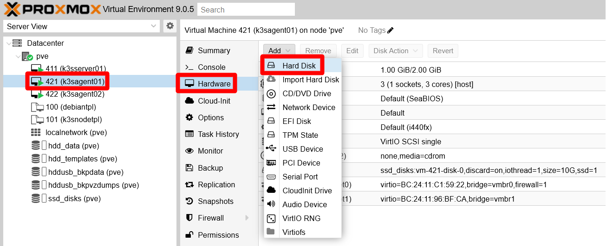
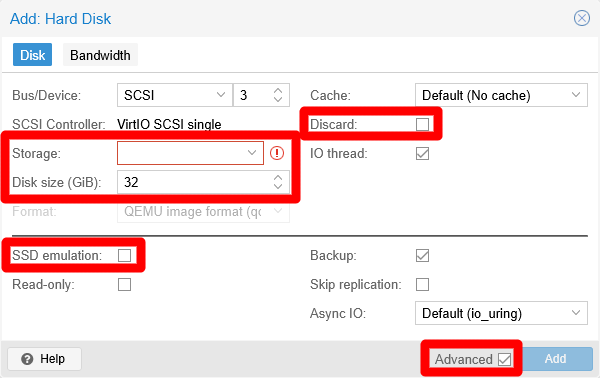
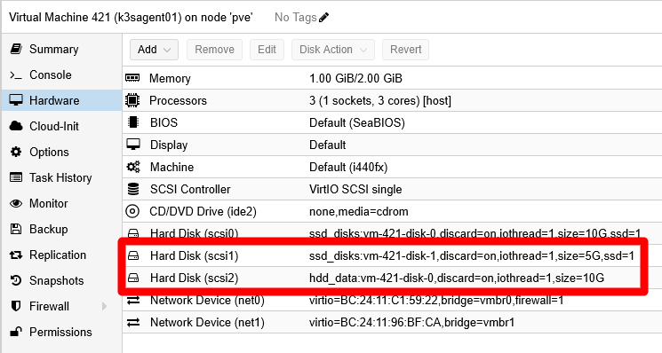

# G033 - Deploying services 02 ~ Ghost - Part 1 - Outlining setup and arranging storage

- [Beginning with Ghost](#beginning-with-ghost)
- [Outlining Ghost's setup](#outlining-ghosts-setup)
- [Choosing the K3s agent node for running Ghost](#choosing-the-k3s-agent-node-for-running-ghost)
- [Setting up new storage drives in the K3s agent node](#setting-up-new-storage-drives-in-the-k3s-agent-node)
  - [Adding the new storage drives to the K3s agent node's VM](#adding-the-new-storage-drives-to-the-k3s-agent-nodes-vm)
  - [LVM storage set up](#lvm-storage-set-up)
  - [Formatting and mounting the new LVs](#formatting-and-mounting-the-new-lvs)
  - [Storage mount points for the Ghost pods](#storage-mount-points-for-the-ghost-pods)
  - [About increasing the size of volumes](#about-increasing-the-size-of-volumes)
- [Relevant system paths](#relevant-system-paths)
  - [Folders in K3s agent node's VM](#folders-in-k3s-agent-nodes-vm)
  - [Files in K3s agent node's VM](#files-in-k3s-agent-nodes-vm)
- [References](#references)
  - [Ghost](#ghost)
  - [Cache servers](#cache-servers)
  - [Database engines](#database-engines)
- [Navigation](#navigation)

## Beginning with Ghost

From the services listed in the [chapter **G018**](G018%20-%20K3s%20cluster%20setup%2001%20~%20Requirements%20and%20arrangement.md#ghost), you can begin with the publishing platform **Ghost**. Since deploying it requires the configuration and deployment of several different components, the procedure for deploying Ghost is split in five parts, being this chapter the first one of them.

This first part explains how to outline the setup of your Ghost platform, then works out the arrangement of the storage drives needed to store Ghost components' data.

## Outlining Ghost's setup

You must define how you want to setup Ghost in your cluster, meaning that you have to decide beforehand how to solve the following points:

- Ghost can use a cache server. Which one you want to use and will it be exclusive to the Ghost instance?

- For storing operation-related data, Ghost requires a database. Which one are you going to use and how you will setup it?

- Where in your K3s cluster the data produced by Ghost's components should be placed?

This guide solves the previous points as follows:

- **Cache server**\
  Ghost can work with [Redis](https://redis.io/), but this guide rather opts for the compatible alternative [Valkey](https://valkey.io/) configured to have data persistence on a local SSD storage drive.

- **Database**\
  [Ghost's documentation specifies](https://docs.ghost.org/install/ubuntu) [MySQL](https://www.mysql.com/) as the database of choice, but this guide picks instead the compatible alternative [MariaDB](https://mariadb.org/) with its data saved in a local SSD storage drive.

- **Ghost server**\
  Its contents data will be stored in a persistent volume prepared on a local HDD storage drive.

Also be aware that all the services making up this Ghost platform are going to run in the same K3s agent node. This is because all the local storage is going to be enabled in one agent node, and Kubernetes applies the affinity rule of making pods run in the node that provides their storage.

## Choosing the K3s agent node for running Ghost

Your cluster has only two K3s agent nodes, and the two of them are already running services. For running the whole Ghost setup, choose the one that currently has the lowest CPU and RAM usage of the two. The node picked in this guide is the `k3sagent02` node.

## Setting up new storage drives in the K3s agent node

Given how the K3s cluster has been configured in this guide, the only persistent volumes you can use are local ones. They rely on paths found in the K3s node VM's host system, but you do not want to use the `root` filesystem in which the underlying Debian OS is installed. It is better and safer to have separate drives for each persistent volume, and you can create those storage drives directly from your Proxmox VE web console.

### Adding the new storage drives to the K3s agent node's VM

Here you are going to create two virtual storage drives (called "hard disks" in Proxmox), one in the real HDD drive and another in the SSD unit:

1. Log in your Proxmox VE web console and go to the `Hardware` page of your chosen K3s agent's VM. There, click on the `Add` button and then on the `Hard Disk` option:

    

2. Use the "Hard Disk" form (already seen back in the [chapter **G020**](G020%20-%20K3s%20cluster%20setup%2003%20~%20Debian%20VM%20creation.md#setting-up-a-new-virtual-machine)) to add two "hard disks" in your VM:

    

    Notice the highlighted elements in the capture above. When creating each hard disk, be sure of having the `Advanced` checkbox enabled and edit only the featured fields as follows:

    - **SSD drive**\
      Storage `ssd_disks`, Discard `ENABLED`, disk size `10 GiB`, SSD emulation `ENABLED`.

    - **HDD drive**\
      Storage `hdd_data`, Discard `ENABLED`, disk size `10 GiB`, SSD emulation `DISABLED`.

    After adding the new storage drives, they should appear in your K3s agent node VM's hardware list.

    

3. Open a shell in your K3s agent node VM and check with `fdisk` that the new drives are already active and running:

    ~~~sh
    $ sudo fdisk -l
    Disk /dev/sda: 10 GiB, 10737418240 bytes, 20971520 sectors
    Disk model: QEMU HARDDISK
    Units: sectors of 1 * 512 = 512 bytes
    Sector size (logical/physical): 512 bytes / 512 bytes
    I/O size (minimum/optimal): 512 bytes / 512 bytes
    Disklabel type: dos
    Disk identifier: 0x5dc9a39f

    Device     Boot   Start      End  Sectors  Size Id Type
    /dev/sda1  *       2048  1556479  1554432  759M 83 Linux
    /dev/sda2       1558526 20969471 19410946  9.3G  f W95 Ext'd (LBA)
    /dev/sda5       1558528 20969471 19410944  9.3G 8e Linux LVM

    Disk /dev/mapper/k3snode--vg-root: 9.25 GiB, 9936306176 bytes, 19406848 sectors
    Units: sectors of 1 * 512 = 512 bytes
    Sector size (logical/physical): 512 bytes / 512 bytes
    I/O size (minimum/optimal): 512 bytes / 512 bytes

    Disk /dev/sdb: 10 GiB, 10737418240 bytes, 20971520 sectors
    Disk model: QEMU HARDDISK
    Units: sectors of 1 * 512 = 512 bytes
    Sector size (logical/physical): 512 bytes / 512 bytes
    I/O size (minimum/optimal): 512 bytes / 512 bytes

    Disk /dev/sdc: 10 GiB, 10737418240 bytes, 20971520 sectors
    Disk model: QEMU HARDDISK
    Units: sectors of 1 * 512 = 512 bytes
    Sector size (logical/physical): 512 bytes / 512 bytes
    I/O size (minimum/optimal): 512 bytes / 512 bytes
    ~~~

    The new drives are `/dev/sdb` and `/dev/sdc`. Unsurprisingly, they are of the same `Disk model` as `/dev/sda`: `QEMU HARDDISK`.

### LVM storage set up

Your new storage drives are now available in your K3s agent node VM, but you still have to configure the required LVM volumes within them:

1. Create a new GPT partition on each of the new storage drives with `sgdisk`. Remember that these new drives are the `/dev/sdb` and `/dev/sdc` devices you saw before with `fdisk`:

    ~~~sh
    $ sudo sgdisk -N 1 /dev/sdb
    $ sudo sgdisk -N 1 /dev/sdc
    ~~~

2. Check with `fdisk` that now you have a new partition on each storage drive:

    ~~~sh
    $ sudo fdisk -l /dev/sdb /dev/sdc
    Disk /dev/sdb: 10 GiB, 10737418240 bytes, 20971520 sectors
    Disk model: QEMU HARDDISK
    Units: sectors of 1 * 512 = 512 bytes
    Sector size (logical/physical): 512 bytes / 512 bytes
    I/O size (minimum/optimal): 512 bytes / 512 bytes
    Disklabel type: gpt
    Disk identifier: 0DF6943D-791B-4D7B-9946-36648735901E

    Device     Start      End  Sectors Size Type
    /dev/sdb1   2048 20971486 20969439  10G Linux filesystem

    Disk /dev/sdc: 10 GiB, 10737418240 bytes, 20971520 sectors
    Disk model: QEMU HARDDISK
    Units: sectors of 1 * 512 = 512 bytes
    Sector size (logical/physical): 512 bytes / 512 bytes
    I/O size (minimum/optimal): 512 bytes / 512 bytes
    Disklabel type: gpt
    Disk identifier: FFC445C4-C09D-4689-9A31-7BB4B0DCFB95

    Device     Start      End  Sectors Size Type
    /dev/sdc1   2048 20971486 20969439  10G Linux filesystem
    ~~~

    See above the `/dev/sdb1` and `/dev/sdc1` partitions ("devices" for `fdisk`) under their respective "disks".

3. Use `pvcreate` to create a new LVM physical volume, or PV, out of each partition:

    ~~~sh
    $ sudo pvcreate --metadatasize 10m -y -ff /dev/sdb1
    $ sudo pvcreate --metadatasize 10m -y -ff /dev/sdc1
    ~~~

    To determine the metadata size, this guide uses the rule of thumb of allocating 1 MiB per 1 GiB present in the PV.

    Check with `pvs` that the PVs have been created.

    ~~~sh
    $ sudo pvs
      PV         VG         Fmt  Attr PSize   PFree
      /dev/sda5  k3snode-vg lvm2 a--    9.25g      0
      /dev/sdb1             lvm2 ---  <10.00g <10.00g
      /dev/sdc1             lvm2 ---  <10.00g <10.00g
    ~~~

4. You also need to assign a volume group, or VG, to each PV, bearing in mind the following:

    - The two drives are running on different storage hardware, so you must clearly differentiate their storage space.
    - Ghost's database and cache data will be stored in `/dev/sdb1`, on the SSD drive.
    - Ghost's other data will be kept in `/dev/sdc1`, on the HDD drive.

    Knowing all this, create two VGs with `vgcreate`:

    ~~~sh
    $ sudo vgcreate ghost-ssd /dev/sdb1
    $ sudo vgcreate ghost-hdd /dev/sdc1
    ~~~

    See how each VG is named related to Ghost and the kind of underlying drive used. Then, with `pvs` you can see how each PV is now assigned to their respective VG:

    ~~~sh
    $ sudo pvs
      PV         VG         Fmt  Attr PSize PFree
      /dev/sda5  k3snode-vg lvm2 a--  9.25g    0
      /dev/sdb1  ghost-ssd  lvm2 a--  9.98g 9.98g
      /dev/sdc1  ghost-hdd  lvm2 a--  9.98g 9.98g
    ~~~

    Also check with `vgs` the current status of the VGs in your VM.

    ~~~sh
    $ sudo vgs
      VG         #PV #LV #SN Attr   VSize VFree
      ghost-hdd    1   0   0 wz--n- 9.98g 9.98g
      ghost-ssd    1   0   0 wz--n- 9.98g 9.98g
      k3snode-vg   1   1   0 wz--n- 9.25g    0
    ~~~

5. Now you can create the required light volumes on each VG with `lvcreate`. Remember the purpose of each LV and give them meaningful names:

    ~~~sh
    $ sudo lvcreate -l 70%FREE -n db ghost-ssd
    $ sudo lvcreate -l 100%FREE -n cache ghost-ssd
    $ sudo lvcreate -l 100%FREE -n srv ghost-hdd
    ~~~

    Notice how the `db` LV takes the `70%` of the currently free space in the `ghost-ssd` VG, and how the `cache` LV uses **all the remaining space** available on the same `ghost-ssd` VG. On the other hand, `data` takes all the storage available in the `ghost-hdd` VG. Also see how all the LV's names are short reminders of what kind of data they will store later.

    Check with `lvs` the new LVs in your VM:

    ~~~sh
    $ sudo lvs
      LV    VG         Attr       LSize  Pool Origin Data%  Meta%  Move Log Cpy%Sync Convert
      srv   ghost-hdd  -wi-a-----  9.98g
      cache ghost-ssd  -wi-a----- <3.00g
      db    ghost-ssd  -wi-a----- <6.99g
      root  k3snode-vg -wi-ao----  9.25g
    ~~~

    See how `db` has the size corresponding to the 70% (6.99 GiB) of the 10 GiB that were available in the `ghost-ssd` VG, while `cache` took the remaining 30% (3.00 GiB).

    With `vgs` you can verify that there is no space left (`VFree` column) in the VGs:

    ~~~sh
    $ sudo vgs
      VG         #PV #LV #SN Attr   VSize VFree
      ghost-hdd    1   1   0 wz--n- 9.98g    0
      ghost-ssd    1   2   0 wz--n- 9.98g    0
      k3snode-vg   1   1   0 wz--n- 9.25g    0
    ~~~

    Notice how the count of LVs in the `ghost-ssd` VG is `2`, while in the rest of them is just `1`.

### Formatting and mounting the new LVs

Your new LVs need to be formatted as ext4 filesystems and then mounted in the K3s agent node's system:

1. Before you format the new LVs, you need to see their `/dev/mapper/` paths with `fdisk`. To get only the Ghost related paths, you can filter out their lines with `grep` because the `ghost` string is part of their paths:

    ~~~sh
    $ sudo fdisk -l | grep ghost
    Disk /dev/mapper/ghost--ssd-db: 6.99 GiB, 7503609856 bytes, 14655488 sectors
    Disk /dev/mapper/ghost--ssd-cache: 3 GiB, 3217031168 bytes, 6283264 sectors
    Disk /dev/mapper/ghost--hdd-srv: 9.98 GiB, 10720641024 bytes, 20938752 sectors
    ~~~

2. Call the `mkfs.ext4` command on their `/dev/mapper/ghost` paths:

    ~~~sh
    $ sudo mkfs.ext4 /dev/mapper/ghost--ssd-db
    $ sudo mkfs.ext4 /dev/mapper/ghost--ssd-cache
    $ sudo mkfs.ext4 /dev/mapper/ghost--hdd-srv
    ~~~

3. Create a directory structure that provides mount points for the LVs with `mkdir`:

    ~~~sh
    $ sudo mkdir -p /mnt/ghost-ssd/{cache,db} /mnt/ghost-hdd/srv
    ~~~

    You have to use `sudo` for creating those folders, because the system will use its `root` user to mount them later on each boot up. Check, with the `tree` command, that they have been created correctly:

    ~~~sh
    $ tree -F /mnt
    /mnt/
    ├── ghost-hdd/
    │   └── srv/
    └── ghost-ssd/
        ├── cache/
        └── db/

    6 directories, 0 files
    ~~~

4. Using the `mount` command, mount the LVs in their respective mount points:

    ~~~sh
    $ sudo mount /dev/mapper/ghost--ssd-db /mnt/ghost-ssd/db
    $ sudo mount /dev/mapper/ghost--ssd-cache /mnt/ghost-ssd/cache
    $ sudo mount /dev/mapper/ghost--hdd-srv /mnt/ghost-hdd/srv
    ~~~

    Verify with `df` that they have been mounted in the system. Since you are working in a K3s agent node, you are going to see a bunch of containerd-related filesystems mounted. Your newly mounted LVs appear at the bottom of the list:

    ~~~sh
    $ df -h
    Filesystem                    Size  Used Avail Use% Mounted on
    udev                          965M     0  965M   0% /dev
    tmpfs                         198M  780K  197M   1% /run
    /dev/mapper/k3snode--vg-root  9.1G  4.3G  4.4G  50% /
    tmpfs                         987M     0  987M   0% /dev/shm
    tmpfs                         5.0M     0  5.0M   0% /run/lock
    tmpfs                         987M     0  987M   0% /tmp
    tmpfs                         1.0M     0  1.0M   0% /run/credentials/systemd-journald.service
    /dev/sda1                     730M  111M  567M  17% /boot
    tmpfs                         1.0M     0  1.0M   0% /run/credentials/getty@tty1.service
    shm                            64M     0   64M   0% /run/k3s/containerd/io.containerd.grpc.v1.cri/sandboxes/42476a81294a94e7af0604956f2f7bf9f3e6250c78221cc5d0b01d560a5809a5/shm
    tmpfs                         198M  8.0K  198M   1% /run/user/1000
    /dev/mapper/ghost--ssd-db     6.8G  1.8M  6.5G   1% /mnt/ghost-ssd/db
    /dev/mapper/ghost--ssd-cache  2.9G  788K  2.8G   1% /mnt/ghost-ssd/cache
    /dev/mapper/ghost--hdd-srv    9.8G  2.1M  9.3G   1% /mnt/ghost-hdd/srv
    ~~~

5. To make the mountings permanent, append them to the `/etc/fstab` file of the VM. First, make a backup of the `fstab` file:

    ~~~sh
    $ sudo cp /etc/fstab /etc/fstab.bkp
    ~~~

    Then **append** all these lines to the `fstab` file:

    ~~~sh
    # Ghost volumes
    /dev/mapper/ghost--ssd-db /mnt/ghost-ssd/db ext4 defaults,nofail 0 0
    /dev/mapper/ghost--ssd-cache /mnt/ghost-ssd/cache ext4 defaults,nofail 0 0
    /dev/mapper/ghost--hdd-srv /mnt/ghost-hdd/srv ext4 defaults,nofail 0 0
    ~~~

### Storage mount points for the Ghost pods

> [!WARNING]
> **Create an inner mount point for pods**\
> Do not use the directories where you have mounted the new storage volumes as mount points for the persistent volumes you will enable later for the Ghost deployment.

Kubernetes pods can change the owner user and group, and also the permissions, applied to those folders. This can cause a failure when, after a reboot, your K3s agent node tries to mount again its storage volumes. The issue happens because it no longer has the right user or permissions to access the mount point folders. The best thing to do then is to create another folder within each storage volume that can be used safely as mount point by the Ghost pods:

1. For the LVM storage volumes created before, you have to execute a `mkdir` command like this:

    ~~~sh
    $ sudo mkdir /mnt/{ghost-hdd/srv,ghost-ssd/cache,ghost-ssd/db}/k3smnt
    ~~~

    As you did with the mount point folders, these new directories also have to be owned initially by `root`. This is because the K3s service is running under that user.

2. Check the updated folder structure with `tree`:

    ~~~sh
    $ tree -F /mnt
    /mnt/
    ├── ghost-hdd/
    │   └── srv/
    │       ├── k3smnt/
    │       └── lost+found/  [error opening dir]
    └── ghost-ssd/
        ├── cache/
        │   ├── k3smnt/
        │   └── lost+found/  [error opening dir]
        └── db/
            ├── k3smnt/
            └── lost+found/  [error opening dir]

    12 directories, 0 files
    ~~~

    Do not mind the `lost+found` folders, they are created by the Linux system automatically.

> [!WARNING]
> **The `k3smnt` folders exist within the already mounted LVM storage volumes!**\
> You cannot create those folders without mounting the light volumes first.

### About increasing the size of volumes

If, after a time using and filling up these volumes, you need to increase their size, take a look to the [appendix chapter **G907**](G907%20-%20Appendix%2007%20~%20Resizing%20a%20root%20LVM%20volume.md). It shows you how to extend a partition and the LVM filesystem within it although, in that case, it is done on a LV volume that happens to be also the `root` filesystem of a VM.

## Relevant system paths

### Folders in K3s agent node's VM

- `/etc`
- `/mnt`
- `/mnt/ghost-hdd`
- `/mnt/ghost-hdd/srv`
- `/mnt/ghost-hdd/srv/k3smnt`
- `/mnt/ghost-ssd`
- `/mnt/ghost-ssd/cache`
- `/mnt/ghost-ssd/cache/k3smnt`
- `/mnt/ghost-ssd/db`
- `/mnt/ghost-ssd/db/k3smnt`

### Files in K3s agent node's VM

- `/dev/mapper/ghost--hdd-srv`
- `/dev/mapper/ghost--ssd-cache`
- `/dev/mapper/ghost--ssd-db`
- `/dev/sdb`
- `/dev/sdb1`
- `/dev/sdc`
- `/dev/sdc1`
- `/etc/fstab`
- `/etc/fstab.bkp`

## References

### [Ghost](https://ghost.org/)

- [For Developers](https://docs.ghost.org/)
  - [Documentation. Getting Stared. How To Install Ghost](https://docs.ghost.org/install)
    - [How To Install Ghost On Ubuntu](https://docs.ghost.org/install/ubuntu)

### Cache servers

- [Redis](https://redis.io/)
- [Valkey](https://valkey.io/)

### Database engines

- [MariaDB](https://mariadb.org/)
- [MySQL](https://www.mysql.com/)

## Navigation

[<< Previous (**G032. Deploying services 01**)](G032%20-%20Deploying%20services%2001%20~%20Considerations.md) | [+Table Of Contents+](G000%20-%20Table%20Of%20Contents.md) | [Next (**G033. Deploying services 02. Ghost Part 2**) >>](G033%20-%20Deploying%20services%2002%20~%20Ghost%20-%20Part%202%20-%20Valkey%20cache%20server.md)