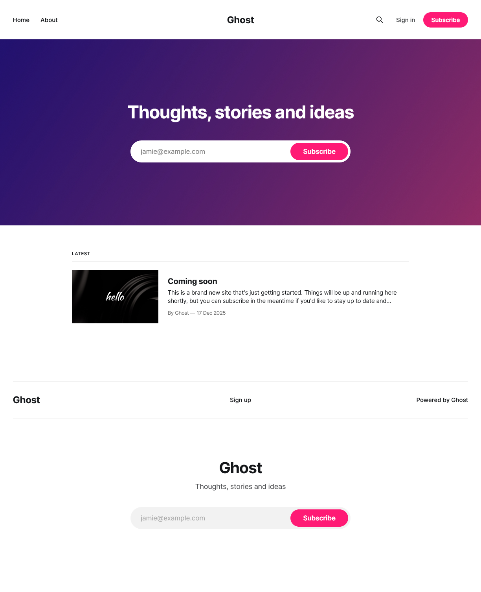
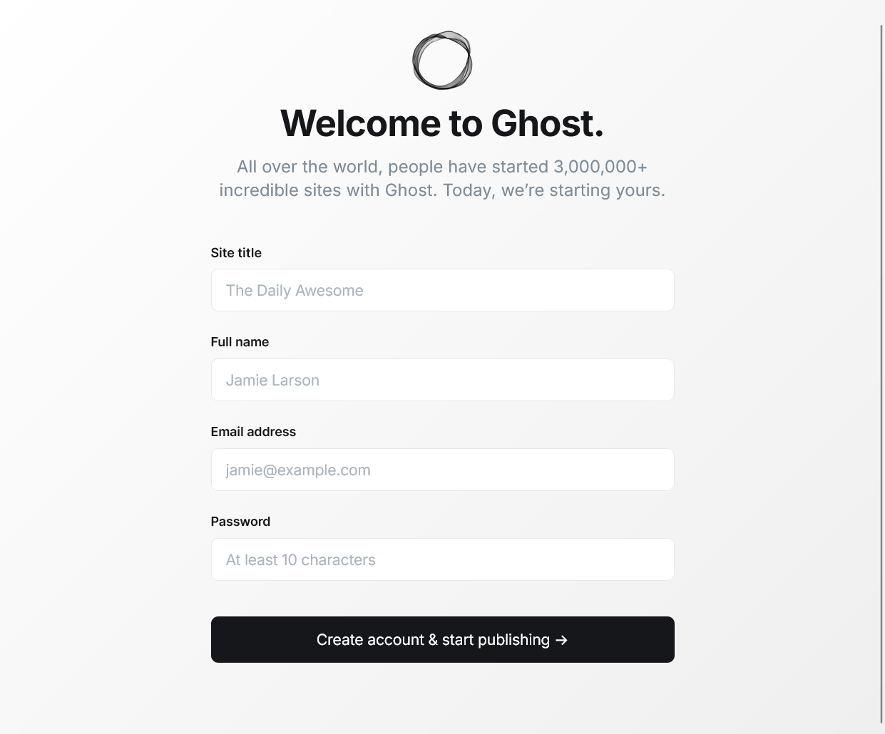
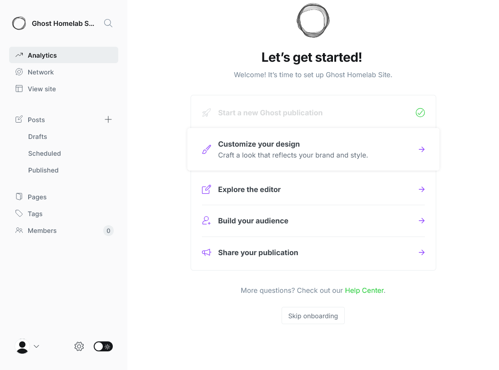
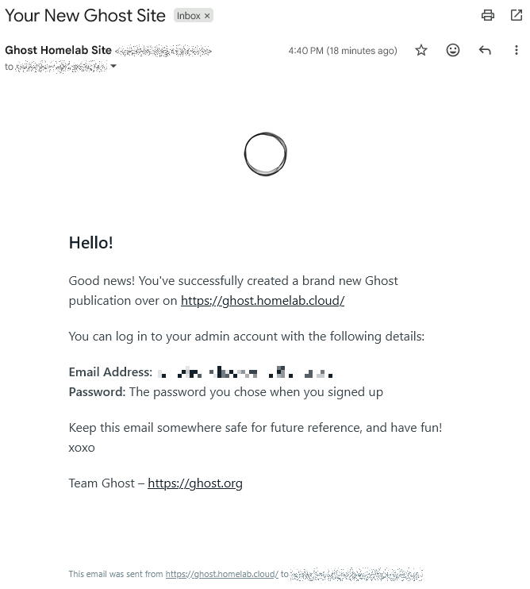
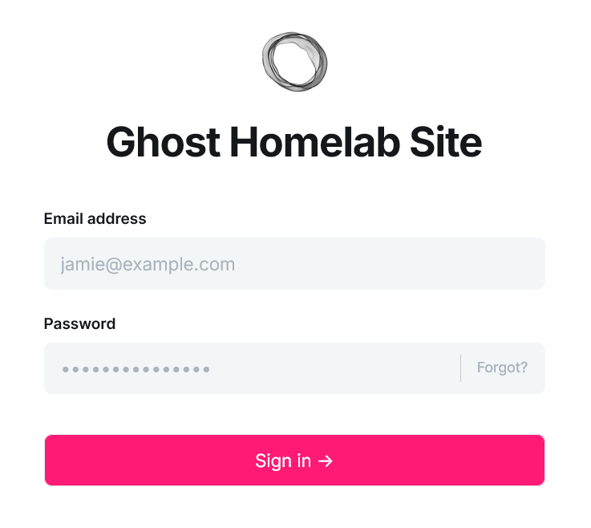

# G033 - Deploying services 02 ~ Ghost - Part 5 - Complete Ghost platform

- [Putting together the whole Ghost platform](#putting-together-the-whole-ghost-platform)
- [Create a folder for the pending Ghost platform resources](#create-a-folder-for-the-pending-ghost-platform-resources)
- [Ghost platform's persistent volumes](#ghost-platforms-persistent-volumes)
- [Ghost platform's TLS certificate](#ghost-platforms-tls-certificate)
- [Traefik IngressRoute for enabling HTTPS access to the Ghost platform](#traefik-ingressroute-for-enabling-https-access-to-the-ghost-platform)
- [Ghost Namespace](#ghost-namespace)
- [Main Kustomize project for the Ghost platform](#main-kustomize-project-for-the-ghost-platform)
  - [Validating the Kustomize YAML output](#validating-the-kustomize-yaml-output)
- [Deploying the main Kustomize project in the cluster](#deploying-the-main-kustomize-project-in-the-cluster)
- [Start using Ghost](#start-using-ghost)
- [Security considerations in Ghost](#security-considerations-in-ghost)
- [Ghost platform's Kustomize project attached to this guide](#ghost-platforms-kustomize-project-attached-to-this-guide)
- [Relevant system paths](#relevant-system-paths)
  - [Folders in `kubectl` client system](#folders-in-kubectl-client-system)
  - [Files in `kubectl` client system](#files-in-kubectl-client-system)
- [References](#references)
  - [Ghost](#ghost)
  - [SREDevOps.org](#sredevopsorg)
- [Navigation](#navigation)

## Putting together the whole Ghost platform

This is the final part of the Ghost platform deployment procedure. Here you are going to declare:

- The persistent storage volumes claimed by the Ghost components.
- The TLS certificate for encrypting client communications with the Ghost platform.
- The Traefik ingress resource that enables HTTPS access to the Ghost platform.
- The namespace for the whole Ghost platform's Kubernetes setup.

You will put all these elements together with the components Kustomize subprojects you have already created under a single main Kustomize project.

## Create a folder for the pending Ghost platform resources

The pieces that have not been declared yet in this Ghost platform deployment are all resources. Start by creating a folder where to put their YAML declarations together under the root folder of the Ghost platform Kustomize project:

~~~sh
$ mkdir -p $HOME/k8sprjs/ghost/resources
~~~

## Ghost platform's persistent volumes

A `PersistentVolume` is the Kubernetes resource for enabling in your K3s cluster the LVM storage volumes you arranged in [the first part of this Ghost deployment procedure](G033%20-%20Deploying%20services%2002%20~%20Ghost%20-%20Part%201%20-%20Outlining%20setup%20and%20arranging%20storage.md#setting-up-new-storage-drives-in-the-k3s-agent-node):

1. You need to create three different persistent volumes, so prepare a new YAML for each of them:

    ~~~sh
    $ touch $HOME/k8sprjs/ghost/resources/{ghost-ssd-cache,ghost-ssd-db,ghost-hdd-srv}.persistentvolume.yaml
    ~~~

2. Declare the persistent volume for the Valkey cache server instance in `ghost-ssd-cache.persistentvolume.yaml`:

    ~~~yaml
    # Persistent storage volume for the Ghost cache
    apiVersion: v1
    kind: PersistentVolume

    metadata:
      name: ghost-ssd-cache
    spec:
      capacity:
        storage: 2.8G
      volumeMode: Filesystem
      accessModes:
      - ReadWriteOnce
      storageClassName: local-path
      persistentVolumeReclaimPolicy: Retain
      local:
        path: /mnt/ghost-ssd/cache/k3smnt
      nodeAffinity:
        required:
          nodeSelectorTerms:
          - matchExpressions:
            - key: kubernetes.io/hostname
              operator: In
              values:
              - k3sagent02
    ~~~

3. Declare the persistent volume for the MariaDB server instance in `ghost-ssd-db.persistentvolume.yaml`:

    ~~~yaml
    # Persistent storage volume for the Ghost database
    apiVersion: v1
    kind: PersistentVolume

    metadata:
      name: ghost-ssd-db
    spec:
      capacity:
        storage: 6.5G
      volumeMode: Filesystem
      accessModes:
      - ReadWriteOnce
      storageClassName: local-path
      persistentVolumeReclaimPolicy: Retain
      local:
        path: /mnt/ghost-ssd/db/k3smnt
      nodeAffinity:
        required:
          nodeSelectorTerms:
          - matchExpressions:
            - key: kubernetes.io/hostname
              operator: In
              values:
              - k3sagent02
    ~~~

4. Declare the persistent volume for the Ghost server instance in `ghost-hdd-srv.persistentvolume.yaml`:

    ~~~yaml
    # Persistent storage volume for the Ghost server
    apiVersion: v1
    kind: PersistentVolume

    metadata:
      name: ghost-hdd-srv
    spec:
      capacity:
        storage: 9.3G
      volumeMode: Filesystem
      accessModes:
      - ReadWriteOnce
      storageClassName: local-path
      persistentVolumeReclaimPolicy: Retain
      local:
        path: /mnt/ghost-hdd/srv/k3smnt
      nodeAffinity:
        required:
          nodeSelectorTerms:
          - matchExpressions:
            - key: kubernetes.io/hostname
              operator: In
              values:
              - k3sagent02
    ~~~

All these `PersistentVolume` declarations use exactly the same parameters:

- In the `metadata` section, the `name` strings are the same ones set in the claims you declared for the MariaDB and Seafile servers.

- In the `spec` section there are a number or particularities:

  - The `spec.capacity.storage` is a decimal number in gigabytes (`G`). Internally the decimal value will be converted to megabytes (`M`). Be sure of not assigning more capacity than is really available in the underlying storage, something you can check on the node with the command `df -h`.

  > [!IMPORTANT]
  > **Be careful with the units you use in Kubernetes**\
  > It is not the same typing **1G** (1000M) than **1Gi** (1024 Mi). Check out [this Stackoverflow question about the matter](https://stackoverflow.com/questions/50804915/kubernetes-size-definitions-whats-the-difference-of-gi-and-g) for further clarification.

  - The `spec.volumeMode` is set to `Filesystem` because the underlying LVM volume has been formatted with an ext4 filesystem. The alternative value is `Block`, and its valid only for raw (unformatted) volumes connected through storage plugins that support that format (`local-path` doesn't).

  - The `spec.accessModes` list has just the `ReadWriteOnce` value to ensure that only one pod (hence the `Once` part) has read and write access to the volume.

  - The `spec.storageClassName` is a parameter that indicates what storage profile (a particular set of properties) to use with the persistent volume. Remember that you only have one available in your K3s cluster, `local-path`, so that is the one you have to use.

    > [!IMPORTANT]
    > **Mind the value you set in the `storageClassName` parameter**\
    > If you leave the `storageClassName` parameter unset, its value is set internally to the default one (`local-path` in a K3s cluster). On the other hand, if the value is the empty string (`storageClassName: ""`), this leaves the volume with no storage class assigned at all.

  - The `spec.persistentVolumeReclaimPolicy` parameter is about the reclaim policy to apply to this persistent volume. When all the persistent volume claims that required this volume are deleted from the cluster, the system must know what to do with this storage.

    - There are only two policies to use here: `Retain` or `Delete`.

    - Left unset, it is set to whatever reclaim policy is set in the storage class. The `local-path` has it on `Delete`.

    - `Retain` deletes the persistent volume from the cluster but not the associated storage asset. This means that whatever data stored there gets preserved.

    - `Delete` deletes both the persistent volume and the associated storage asset, but only if the volume plugin/storage provisioner used supports it. In the case of the Rancher [local-path-provisioner](https://github.com/rancher/local-path-provisioner) used in K3s (associated with the `local-path` storage class), it automatically cleans up the contents stored in the volume.

  - In `spec.local.path` is where you specify the **absolute path**, within the node's filesystem, where you want to mount this volume. Notice how, in all the PVs, it has the path to their corresponding `k3smnt` folder you already left prepared in your `k3sagent02` VM.

  - The `spec.nodeAffinity` block restricts to which node in the cluster a persistent volume will be binded to. Since the storage used in this guide's setup is local, you have to ensure with this set of parameters that the persistent volume is assigned to the node where the storage space truly exists. This affinity configuration would not be necessary in the case of using a distributed storage system.

    In the YAML declarations above, you can see how in all the PVs there is only one node affinity rule that looks for the hostname of the node (the `key` in the `matchExpressions` section), and checks if it is `In` (the `operator` parameter) the list of admitted `values`. Since the `k3sagent02` node is the only one with the storage ready for those volumes, its hostname is the only value in the list.

## Ghost platform's TLS certificate

To encrypt the communications between your Ghost platform and its clients, you need a TLS certificate [like the one created previously in the deployment of Headlamp back in the chapter **G031**](G031%20-%20K3s%20cluster%20setup%2014%20~%20Deploying%20the%20Headlamp%20dashboard.md#headlamp-tls-certificate).

1. Create a `ghost.homelab.cloud-tls.certificate.cert-manager.yaml` file under `resources`:

    ~~~sh
    $ touch $HOME/k8sprjs/ghost/resources/ghost.homelab.cloud-tls.certificate.cert-manager.yaml
    ~~~

2. Declare the certificate in `resources/ghost.homelab.cloud-tls.certificate.cert-manager.yaml`:

    ~~~yaml
    # TLS certificate for Ghost
    apiVersion: cert-manager.io/v1
    kind: Certificate

    metadata:
      name: ghost.homelab.cloud-tls
    spec:
      isCA: false
      secretName: ghost.homelab.cloud-tls
      duration: 2190h # 3 months
      renewBefore: 168h # Certificates must be renewed some time before they expire (7 days)
      dnsNames:
      - ghost.homelab.cloud
      privateKey:
        algorithm: ECDSA
        size: 521
        encoding: PKCS8
        rotationPolicy: Always
      issuerRef:
        name: homelab.cloud-intm-ca01-issuer
        kind: ClusterIssuer
        group: cert-manager.io
    ~~~

    This certificate is adjusted to work with the DNS name the Ghost server is expected to have in the local network. It also includes [the alternative DNS name configured in the Ghost server](G033%20-%20Deploying%20services%2002%20~%20Ghost%20-%20Part%204%20-%20Ghost%20server.md#ghost-server-configuration-file) for accessing the Admin API.

## Traefik IngressRoute for enabling HTTPS access to the Ghost platform

As you did with the [Traefik dashboard](G030%20-%20K3s%20cluster%20setup%2013%20~%20Enabling%20the%20Traefik%20dashboard.md) or [Headlamp](G031%20-%20K3s%20cluster%20setup%2014%20~%20Deploying%20the%20Headlamp%20dashboard.md), better handle the ingress into your Ghost platform with a Traefik `IngressRoute`. This allows you to provide a proper HTTPS access that uses [the TLS certificate you have declared in the previous section](#ghost-platforms-tls-certificate):

1. Create the `ghost.homelab.cloud.ingressroute.traefik.yaml` in the `resources` folder:

    ~~~sh
    $ touch $HOME/k8sprjs/ghost/resources/ghost.homelab.cloud.ingressroute.traefik.yaml
    ~~~

2. Declare the Traefik `IngressRoute` object in `resources/ghost.homelab.cloud.ingressroute.traefik.yaml`:

    ~~~yaml
    # HTTPS ingress for Ghost
    apiVersion: traefik.io/v1alpha1
    kind: IngressRoute

    metadata:
      name: ghost.homelab.cloud
    spec:
      entryPoints:
      - websecure
      routes:
      - kind: Rule
        match: Host(`ghost.homelab.cloud`)
        services:
        - kind: Service
          name: server-ghost
          passHostHeader: true
          port: server
          scheme: http
      tls:
        secretName: ghost.homelab.cloud-tls
    ~~~

    This ingress configures an HTTPS route into the Ghost platform:

    - The `spec.entryPoints` only enables the websecure (HTTPS) access to the route declared below.

    - The route to get into the Ghost platform is enabled in `spec.routes`.

    - This route invokes the `server-ghost` service and calls its port by name (which is named `server`). Also enables forwarding the client's Host header to the Ghost server with the `passHostHeader` option and specify that requests have the http `scheme`.

    - The TLS certificate is set in the `tls.secretName` parameter.

## Ghost Namespace

To avoid naming conflicts with any other resources you could have running in your K3s cluster, it is better to put all the components of your Ghost platform under their own exclusive namespace:

1. Since a `Namespace` is also a Kubernetes resource, create a file for it under the `resources` folder:

    ~~~sh
    $ touch $HOME/k8sprjs/ghost/resources/ghost.namespace.yaml
    ~~~

2. Declare the `Namespace` resource in `resources/ghost.namespace.yaml`:

    ~~~yaml
    # Namespace for the Ghost components
    apiVersion: v1
    kind: Namespace

    metadata:
      name: ghost
    ~~~

    As you see above, the `Namespace` is one of the simplest resources you can declare in a Kubernetes cluster.

## Main Kustomize project for the Ghost platform

With every required element declared or configured, now you need to put everything together under a single main Kustomize project:

1. Create a `kustomization.yaml` file under the root `ghost` folder of the Ghost platform's deployment project:

    ~~~sh
    $ touch $HOME/k8sprjs/ghost/kustomization.yaml
    ~~~

2. Declare the main Kustomize project in `kustomization.yaml`:

    ~~~yaml
    # Ghost platform setup
    apiVersion: kustomize.config.k8s.io/v1beta1
    kind: Kustomization

    namespace: ghost

    labels:
    - pairs:
        platform: ghost
      includeSelectors: true
      includeTemplates: true

    resources:
    - resources/ghost-hdd-srv.persistentvolume.yaml
    - resources/ghost-ssd-cache.persistentvolume.yaml
    - resources/ghost-ssd-db.persistentvolume.yaml
    - resources/ghost.homelab.cloud-tls.certificate.cert-manager.yaml
    - resources/ghost.homelab.cloud.ingressroute.traefik.yaml
    - resources/ghost.namespace.yaml
    - components/cache-valkey
    - components/db-mariadb
    - components/server-ghost
    ~~~

    Be aware of the following details:

    - The `ghost` namespace is applied to all the namespaced resources coming out of this Kustomize project, except:

      - The `Namespace` object itself.
      - The `PersistentVolume` resources.

    - The `labels` brands all the resources part of this Kustomize project with a `platform` label. Remember that you already set an `app` label within each major component.

    - In the `resources` list you have YAML files and also the directories of the components you have configured in the previous parts of this guide.

      > [!NOTE]
      > **Kustomize projects can be added as resources**\
      > You can add directories as resources only if they have a `kustomization.yaml` inside that can be read by Kustomize. In other words, you can list Kustomize projects as resources for another Kustomize project.

### Validating the Kustomize YAML output

Before deploying your Ghost Kustomize project, review first its YAML output:

1. Since this particular output is going to be rather long, you may find more convenient to dump the resulting YAML into a file such as `ghost.k.output.yaml`:

    ~~~sh
    $ kubectl kustomize $HOME/k8sprjs/ghost > ghost.k.output.yaml
    ~~~

2. Open the `ghost.k.output.yaml` file and compare your resulting YAML output with this one:

    ~~~yaml
    apiVersion: v1
    kind: Namespace
    metadata:
      labels:
        platform: ghost
      name: ghost
    ---
    apiVersion: v1
    data:
      valkey.conf: |-
        # Custom Valkey configuration
        bind 0.0.0.0
        protected-mode no
        port 6379
        maxmemory 64mb
        maxmemory-policy allkeys-lru
        aclfile /etc/valkey/users.acl
        dir /data
    kind: ConfigMap
    metadata:
      labels:
        app: cache-valkey
        platform: ghost
      name: cache-valkey-config-c86dc4fh5d
      namespace: ghost
    ---
    apiVersion: v1
    data:
      ghost-db-name: ghost-db
      ghost-username: ghostdb
      initdb.sh: |-
        #!/bin/sh
        echo ">>> Creating user for MariaDB Prometheus metrics exporter"
        mysql -u root -p$MYSQL_ROOT_PASSWORD --execute \
        "CREATE USER '${MARIADB_PROMETHEUS_EXPORTER_USERNAME}'@'localhost' IDENTIFIED BY '${MARIADB_PROMETHEUS_EXPORTER_PASSWORD}' WITH MAX_USER_CONNECTIONS 3;
        GRANT PROCESS, REPLICATION CLIENT, SELECT ON *.* TO '${MARIADB_PROMETHEUS_EXPORTER_USERNAME}'@'localhost';
        FLUSH privileges;"
      my.cnf: |-
        [client]
        default-character-set = utf8mb4

        [server]
        # General parameters
        skip_name_resolve = ON
        max_connections = 50
        thread_cache_size = 50
        character_set_server = utf8mb4
        collation_server = utf8mb4_general_ci
        tmp_table_size = 64M

        # InnoDB storage engine parameters
        innodb_buffer_pool_size = 256M
        innodb_io_capacity = 2000
        innodb_io_capacity_max = 3000
        innodb_log_buffer_size = 32M
        innodb_log_file_size = 256M
      prometheus-exporter-username: promexp
    kind: ConfigMap
    metadata:
      labels:
        app: db-mariadb
        platform: ghost
      name: db-mariadb-config-t9c84t7h62
      namespace: ghost
    ---
    apiVersion: v1
    data:
      GHOST_CONTENT: /home/nonroot/app/ghost/content
      GHOST_INSTALL: /home/nonroot/app/ghost
      NODE_ENV: production
    kind: ConfigMap
    metadata:
      labels:
        app: server-ghost
        platform: ghost
      name: server-ghost-env-vars-9ggkgtdt7b
      namespace: ghost
    ---
    apiVersion: v1
    data:
      users.acl: |
        dXNlciBkZWZhdWx0IG9uIH4qICYqICtAYWxsID5QNHM1VzByZF9GT3JfN2gzX0RlRjR1MX
        RfdVNFcgp1c2VyIGdob3N0Y2FjaGUgb24gfmdob3N0OiogJiogYWxsY29tbWFuZHMgPnBB
        UzJ3T1JUX2Ywcl9UI2VfR2gwNVRfVXMzUg==
    kind: Secret
    metadata:
      labels:
        app: cache-valkey
        platform: ghost
      name: cache-valkey-acl-bcc5gh9d6g
      namespace: ghost
    type: Opaque
    ---
    apiVersion: v1
    data:
      REDIS_PASSWORD: UDRzNVcwcmRfRk9yXzdoM19EZUY0dTF0X3VTRXI=
      REDIS_USER: ZGVmYXVsdA==
    kind: Secret
    metadata:
      labels:
        app: cache-valkey
        platform: ghost
      name: cache-valkey-exporter-user-6mdd99ft8d
      namespace: ghost
    type: Opaque
    ---
    apiVersion: v1
    data:
      ghost-user-password: bDBuRy5QbDRpbl9UM3h0X3NFa1JldF9wNHM1d09SRC1Gb1JfNmgwc1RfdVozciE=
      prometheus-exporter-password: bDBuRy5QbDRpbl9UM3h0X3NFa1JldF9wNHM1d09SRC1Gb1JfM3hQMHJUZVJfdVozciE=
      root-password: bDBuRy5QbDRpbl9UM3h0X3NFa1JldF9wNHM1d09SRC1Gb1Jfck9vN191WjNyIQ==
    kind: Secret
    metadata:
      labels:
        app: db-mariadb
        platform: ghost
      name: db-mariadb-passwords-dtt9d6h2b9
      namespace: ghost
    type: Opaque
    ---
    apiVersion: v1
    data:
      config.production.json: |
        ewogICJ1cmwiOiAiaHR0cHM6Ly9naG9zdC5ob21lbGFiLmNsb3VkIiwKICAic2VydmVyIj
        ogewogICAgImhvc3QiOiAiMC4wLjAuMCIsCiAgICAicG9ydCI6IDIzNjgKICB9LAogICJs
        b2dnaW5nIjogewogICAgInRyYW5zcG9ydHMiOiBbCiAgICAgICAgInN0ZG91dCIKICAgIF
        0KICB9LAogICJtYWlsIjogewogICAgInRyYW5zcG9ydCI6ICJTTVRQIiwKICAgICJmcm9t
        IjogImluZm9AZ2hvc3QuaG9tZWxhYi5jbG91ZCIsCiAgICAib3B0aW9ucyI6IHsKICAgIC
        AgInNlcnZpY2UiOiAiR29vZ2xlIiwKICAgICAgImhvc3QiOiAic210cC5nbWFpbC5jb20i
        LAogICAgICAicG9ydCI6IDQ2NSwKICAgICAgInNlY3VyZSI6IHRydWUsCiAgICAgICJhdX
        RoIjogewogICAgICAgICJ1c2VyIjogInlvdXJfZ2hvc3RfZW1haWxAZ21haWwuY29tIiwK
        ICAgICAgICAicGFzcyI6ICJZMHVyXzZoTzV0X2VNNDFsX1A0U3N2dm9SZCIKICAgICAgfQ
        ogICAgfQogIH0sCiAgImFkYXB0ZXJzIjogewogICAgImNhY2hlIjogewogICAgICAiUmVk
        aXMiOiB7CiAgICAgICAgImhvc3QiOiAiY2FjaGUtdmFsa2V5Lmdob3N0LnN2Yy5ob21lbG
        FiLmNsdXN0ZXIuIiwKICAgICAgICAicG9ydCI6IDYzNzksCiAgICAgICAgInVzZXJuYW1l
        IjogImdob3N0Y2FjaGUiLAogICAgICAgICJwYXNzd29yZCI6ICJwQVMyd09SVF9mMHJfVC
        NlX0doMDVUX1VzM1IiLAogICAgICAgICJrZXlQcmVmaXgiOiAiZ2hvc3Q6IiwKICAgICAg
        ICAidHRsIjogMzYwMCwKICAgICAgICAicmV1c2VDb25uZWN0aW9uIjogdHJ1ZSwKICAgIC
        AgICAicmVmcmVzaEFoZWFkRmFjdG9yIjogMC44LAogICAgICAgICJnZXRUaW1lb3V0TWls
        bGlzZWNvbmRzIjogNTAwMCwKICAgICAgICAic3RvcmVDb25maWciOiB7CiAgICAgICAgIC
        AicmV0cnlDb25uZWN0U2Vjb25kcyI6IDEwLAogICAgICAgICAgImxhenlDb25uZWN0Ijog
        dHJ1ZSwKICAgICAgICAgICJlbmFibGVPZmZsaW5lUXVldWUiOiB0cnVlLAogICAgICAgIC
        AgIm1heFJldHJpZXNQZXJSZXF1ZXN0IjogMwogICAgICAgIH0KICAgICAgfSwKICAgICAg
        ImdzY2FuIjogewogICAgICAgICJhZGFwdGVyIjogIlJlZGlzIiwKICAgICAgICAidHRsIj
        ogNDMyMDAsCiAgICAgICAgInJlZnJlc2hBaGVhZEZhY3RvciI6IDAuOSwKICAgICAgICAi
        a2V5UHJlZml4IjogImdob3N0OmdzY2FuLiIKICAgICAgfSwKICAgICAgImltYWdlU2l6ZX
        MiOiB7CiAgICAgICAgImFkYXB0ZXIiOiAiUmVkaXMiLAogICAgICAgICJ0dGwiOiA4NjQw
        MCwKICAgICAgICAicmVmcmVzaEFoZWFkRmFjdG9yIjogMC45NSwKICAgICAgICAia2V5UH
        JlZml4IjogImdob3N0OmltYWdlU2l6ZXMuIgogICAgICB9LAogICAgICAibGlua1JlZGly
        ZWN0c1B1YmxpYyI6IHsKICAgICAgICAiYWRhcHRlciI6ICJSZWRpcyIsCiAgICAgICAgIn
        R0bCI6IDcyMDAsCiAgICAgICAgInJlZnJlc2hBaGVhZEZhY3RvciI6IDAuOSwKICAgICAg
        ICAia2V5UHJlZml4IjogImdob3N0OmxpbmtSZWRpcmVjdHNQdWJsaWMuIgogICAgICB9LA
        ogICAgICAicG9zdHNQdWJsaWMiOiB7CiAgICAgICAgImFkYXB0ZXIiOiAiUmVkaXMiLAog
        ICAgICAgICJ0dGwiOiAxODAwLAogICAgICAgICJyZWZyZXNoQWhlYWRGYWN0b3IiOiAwLj
        csCiAgICAgICAgImtleVByZWZpeCI6ICJnaG9zdDpwb3N0c1B1YmxpYy4iCiAgICAgIH0s
        CiAgICAgICJzdGF0cyI6IHsKICAgICAgICAiYWRhcHRlciI6ICJSZWRpcyIsCiAgICAgIC
        AgInR0bCI6IDkwMCwKICAgICAgICAicmVmcmVzaEFoZWFkRmFjdG9yIjogMC44LAogICAg
        ICAgICJrZXlQcmVmaXgiOiAiZ2hvc3Q6c3RhdHMuIgogICAgICB9LAogICAgICAidGFnc1
        B1YmxpYyI6IHsKICAgICAgICAiYWRhcHRlciI6ICJSZWRpcyIsCiAgICAgICAgInR0bCI6
        IDM2MDAsCiAgICAgICAgInJlZnJlc2hBaGVhZEZhY3RvciI6IDAuOCwKICAgICAgICAia2
        V5UHJlZml4IjogImdob3N0OnRhZ3NQdWJsaWMuIgogICAgICB9CiAgICB9CiAgfSwKICAi
        aG9zdFNldHRpbmdzIjogewogICAgImxpbmtSZWRpcmVjdHNQdWJsaWNDYWNoZSI6IHsKIC
        AgICAgImVuYWJsZWQiOiB0cnVlCiAgICB9LAogICAgInBvc3RzUHVibGljQ2FjaGUiOiB7
        CiAgICAgICJlbmFibGVkIjogdHJ1ZQogICAgfSwKICAgICJzdGF0c0NhY2hlIjogewogIC
        AgICAiZW5hYmxlZCI6IHRydWUKICAgIH0sCiAgICAidGFnc1B1YmxpY0NhY2hlIjogewog
        ICAgICAiZW5hYmxlZCI6IHRydWUKICAgIH0KICB9LAogICJkYXRhYmFzZSI6IHsKICAgIC
        JjbGllbnQiOiAibXlzcWwiLAogICAgImNvbm5lY3Rpb24iOiB7CiAgICAgICJob3N0Ijog
        ImRiLW1hcmlhZGIuZ2hvc3Quc3ZjLmhvbWVsYWIuY2x1c3Rlci4iLAogICAgICAidXNlci
        I6ICJnaG9zdGRiIiwKICAgICAgInBhc3N3b3JkIjogImwwbkcuUGw0aW5fVDN4dF9zRWtS
        ZXRfcDRzNXdPUkQtRm9SXzZoMHNUX3VaM3IhIiwKICAgICAgImRhdGFiYXNlIjogImdob3
        N0LWRiIiwKICAgICAgInBvcnQiOiAiMzMwNiIKICAgIH0KICB9LAogICJwcm9jZXNzIjog
        ImxvY2FsIiwKICAicGF0aHMiOiB7CiAgICAiY29udGVudFBhdGgiOiAiL2hvbWUvbm9ucm
        9vdC9hcHAvZ2hvc3QvY29udGVudCIKICB9Cn0=
    kind: Secret
    metadata:
      labels:
        app: server-ghost
        platform: ghost
      name: server-ghost-config-c4td5f9fb9
      namespace: ghost
    type: Opaque
    ---
    apiVersion: v1
    kind: Service
    metadata:
      annotations:
        prometheus.io/port: "9121"
        prometheus.io/scrape: "true"
      labels:
        app: cache-valkey
        platform: ghost
      name: cache-valkey
      namespace: ghost
    spec:
      clusterIP: None
      ports:
      - name: server
        port: 6379
        protocol: TCP
        targetPort: server
      - name: metrics
        port: 9121
        protocol: TCP
        targetPort: metrics
      selector:
        app: cache-valkey
        platform: ghost
      type: ClusterIP
    ---
    apiVersion: v1
    kind: Service
    metadata:
      annotations:
        prometheus.io/port: "9104"
        prometheus.io/scrape: "true"
      labels:
        app: db-mariadb
        platform: ghost
      name: db-mariadb
      namespace: ghost
    spec:
      clusterIP: None
      ports:
      - name: server
        port: 3306
        protocol: TCP
        targetPort: server
      - name: metrics
        port: 9104
        protocol: TCP
        targetPort: metrics
      selector:
        app: db-mariadb
        platform: ghost
      type: ClusterIP
    ---
    apiVersion: v1
    kind: Service
    metadata:
      labels:
        app: server-ghost
        platform: ghost
      name: server-ghost
      namespace: ghost
    spec:
      clusterIP: None
      ports:
      - name: server
        port: 2368
        protocol: TCP
        targetPort: server
      selector:
        app: server-ghost
        platform: ghost
      type: ClusterIP
    ---
    apiVersion: v1
    kind: PersistentVolume
    metadata:
      labels:
        platform: ghost
      name: ghost-hdd-srv
    spec:
      accessModes:
      - ReadWriteOnce
      capacity:
        storage: 9.3G
      local:
        path: /mnt/ghost-hdd/srv/k3smnt
      nodeAffinity:
        required:
          nodeSelectorTerms:
          - matchExpressions:
            - key: kubernetes.io/hostname
              operator: In
              values:
              - k3sagent02
      persistentVolumeReclaimPolicy: Retain
      storageClassName: local-path
      volumeMode: Filesystem
    ---
    apiVersion: v1
    kind: PersistentVolume
    metadata:
      labels:
        platform: ghost
      name: ghost-ssd-cache
    spec:
      accessModes:
      - ReadWriteOnce
      capacity:
        storage: 2.8G
      local:
        path: /mnt/ghost-ssd/cache/k3smnt
      nodeAffinity:
        required:
          nodeSelectorTerms:
          - matchExpressions:
            - key: kubernetes.io/hostname
              operator: In
              values:
              - k3sagent02
      persistentVolumeReclaimPolicy: Retain
      storageClassName: local-path
      volumeMode: Filesystem
    ---
    apiVersion: v1
    kind: PersistentVolume
    metadata:
      labels:
        platform: ghost
      name: ghost-ssd-db
    spec:
      accessModes:
      - ReadWriteOnce
      capacity:
        storage: 6.5G
      local:
        path: /mnt/ghost-ssd/db/k3smnt
      nodeAffinity:
        required:
          nodeSelectorTerms:
          - matchExpressions:
            - key: kubernetes.io/hostname
              operator: In
              values:
              - k3sagent02
      persistentVolumeReclaimPolicy: Retain
      storageClassName: local-path
      volumeMode: Filesystem
    ---
    apiVersion: v1
    kind: PersistentVolumeClaim
    metadata:
      labels:
        app: cache-valkey
        platform: ghost
      name: cache-valkey
      namespace: ghost
    spec:
      accessModes:
      - ReadWriteOnce
      resources:
        requests:
          storage: 2.8G
      storageClassName: local-path
      volumeName: ghost-ssd-cache
    ---
    apiVersion: v1
    kind: PersistentVolumeClaim
    metadata:
      labels:
        app: db-mariadb
        platform: ghost
      name: db-mariadb
      namespace: ghost
    spec:
      accessModes:
      - ReadWriteOnce
      resources:
        requests:
          storage: 6.5G
      storageClassName: local-path
      volumeName: ghost-ssd-db
    ---
    apiVersion: v1
    kind: PersistentVolumeClaim
    metadata:
      labels:
        app: server-ghost
        platform: ghost
      name: server-ghost
      namespace: ghost
    spec:
      accessModes:
      - ReadWriteOnce
      resources:
        requests:
          storage: 9.3G
      storageClassName: local-path
      volumeName: ghost-hdd-srv
    ---
    apiVersion: apps/v1
    kind: StatefulSet
    metadata:
      labels:
        app: cache-valkey
        platform: ghost
      name: cache-valkey
      namespace: ghost
    spec:
      replicas: 1
      selector:
        matchLabels:
          app: cache-valkey
          platform: ghost
      serviceName: cache-valkey
      template:
        metadata:
          labels:
            app: cache-valkey
            platform: ghost
        spec:
          containers:
          - command:
            - valkey-server
            - /etc/valkey/valkey.conf
            image: valkey/valkey:9.0-alpine
            name: server
            ports:
            - containerPort: 6379
              name: server
            resources:
              requests:
                cpu: "0.5"
                memory: 64Mi
            volumeMounts:
            - mountPath: /data
              name: valkey-storage
            - mountPath: /etc/valkey/valkey.conf
              name: valkey-config
              readOnly: true
              subPath: valkey.conf
            - mountPath: /etc/valkey/users.acl
              name: valkey-acl
              readOnly: true
              subPath: users.acl
          - envFrom:
            - secretRef:
                name: cache-valkey-exporter-user-6mdd99ft8d
            image: oliver006/redis_exporter:v1.80.0-alpine
            name: metrics
            ports:
            - containerPort: 9121
              name: metrics
            resources:
              requests:
                cpu: "0.25"
                memory: 16Mi
          volumes:
          - name: valkey-storage
            persistentVolumeClaim:
              claimName: cache-valkey
          - configMap:
              defaultMode: 444
              items:
              - key: valkey.conf
                path: valkey.conf
              name: cache-valkey-config-c86dc4fh5d
            name: valkey-config
          - name: valkey-acl
            secret:
              defaultMode: 444
              items:
              - key: users.acl
                path: users.acl
              secretName: cache-valkey-acl-bcc5gh9d6g
    ---
    apiVersion: apps/v1
    kind: StatefulSet
    metadata:
      labels:
        app: db-mariadb
        platform: ghost
      name: db-mariadb
      namespace: ghost
    spec:
      replicas: 1
      selector:
        matchLabels:
          app: db-mariadb
          platform: ghost
      serviceName: db-mariadb
      template:
        metadata:
          labels:
            app: db-mariadb
            platform: ghost
        spec:
          containers:
          - env:
            - name: MYSQL_DATABASE
              valueFrom:
                configMapKeyRef:
                  key: ghost-db-name
                  name: db-mariadb-config-t9c84t7h62
            - name: MYSQL_ROOT_PASSWORD
              valueFrom:
                secretKeyRef:
                  key: root-password
                  name: db-mariadb-passwords-dtt9d6h2b9
            - name: MYSQL_USER
              valueFrom:
                configMapKeyRef:
                  key: ghost-username
                  name: db-mariadb-config-t9c84t7h62
            - name: MYSQL_PASSWORD
              valueFrom:
                secretKeyRef:
                  key: ghost-user-password
                  name: db-mariadb-passwords-dtt9d6h2b9
            - name: MARIADB_PROMETHEUS_EXPORTER_USERNAME
              valueFrom:
                configMapKeyRef:
                  key: prometheus-exporter-username
                  name: db-mariadb-config-t9c84t7h62
            - name: MARIADB_PROMETHEUS_EXPORTER_PASSWORD
              valueFrom:
                secretKeyRef:
                  key: prometheus-exporter-password
                  name: db-mariadb-passwords-dtt9d6h2b9
            image: mariadb:11.8-noble
            name: server
            ports:
            - containerPort: 3306
              name: server
            resources:
              requests:
                cpu: "0.75"
                memory: 256Mi
            volumeMounts:
            - mountPath: /etc/mysql/my.cnf
              name: mariadb-config
              readOnly: true
              subPath: my.cnf
            - mountPath: /docker-entrypoint-initdb.d/initdb.sh
              name: mariadb-config
              readOnly: true
              subPath: initdb.sh
            - mountPath: /var/lib/mysql
              name: mariadb-storage
          - args:
            - --collect.auto_increment.columns
            - --collect.binlog_size
            - --collect.engine_innodb_status
            - --collect.global_status
            - --collect.global_variables
            - --collect.info_schema.clientstats
            - --collect.info_schema.innodb_metrics
            - --collect.info_schema.innodb_tablespaces
            - --collect.info_schema.innodb_cmp
            - --collect.info_schema.innodb_cmpmem
            - --collect.info_schema.processlist
            - --collect.info_schema.query_response_time
            - --collect.info_schema.tables
            - --collect.info_schema.tablestats
            - --collect.info_schema.schemastats
            - --collect.info_schema.userstats
            - --collect.perf_schema.eventsstatements
            - --collect.perf_schema.eventsstatementssum
            - --collect.perf_schema.eventswaits
            - --collect.perf_schema.file_events
            - --collect.perf_schema.file_instances
            - --collect.perf_schema.indexiowaits
            - --collect.perf_schema.tableiowaits
            - --collect.perf_schema.tablelocks
            - --collect.perf_schema.replication_group_member_stats
            - --collect.perf_schema.replication_applier_status_by_worker
            - --collect.slave_hosts
            - --mysqld.address=localhost:3306
            - --mysqld.username=$(MARIADB_PROMETHEUS_EXPORTER_USERNAME)
            env:
            - name: MARIADB_PROMETHEUS_EXPORTER_USERNAME
              valueFrom:
                configMapKeyRef:
                  key: prometheus-exporter-username
                  name: db-mariadb-config-t9c84t7h62
            - name: MYSQLD_EXPORTER_PASSWORD
              valueFrom:
                secretKeyRef:
                  key: prometheus-exporter-password
                  name: db-mariadb-passwords-dtt9d6h2b9
            image: prom/mysqld-exporter:v0.18.0
            name: metrics
            ports:
            - containerPort: 9104
              name: metrics
            resources:
              requests:
                cpu: "0.25"
                memory: 16Mi
          volumes:
          - name: mariadb-storage
            persistentVolumeClaim:
              claimName: db-mariadb
          - configMap:
              defaultMode: 444
              items:
              - key: initdb.sh
                path: initdb.sh
              - key: my.cnf
                path: my.cnf
              name: db-mariadb-config-t9c84t7h62
            name: mariadb-config
    ---
    apiVersion: apps/v1
    kind: StatefulSet
    metadata:
      labels:
        app: server-ghost
        platform: ghost
      name: server-ghost
      namespace: ghost
    spec:
      replicas: 1
      selector:
        matchLabels:
          app: server-ghost
          platform: ghost
      serviceName: server-ghost
      template:
        metadata:
          labels:
            app: server-ghost
            platform: ghost
        spec:
          automountServiceAccountToken: false
          containers:
          - envFrom:
            - configMapRef:
                name: server-ghost-env-vars-9ggkgtdt7b
            image: ghcr.io/sredevopsorg/ghost-on-kubernetes:main
            livenessProbe:
              failureThreshold: 1
              httpGet:
                httpHeaders:
                - name: X-Forwarded-Proto
                  value: https
                - name: Host
                  value: ghost.homelab.cloud
                path: /ghost/api/admin/site/
                port: server
              initialDelaySeconds: 30
              periodSeconds: 300
              successThreshold: 1
              timeoutSeconds: 3
            name: server
            ports:
            - containerPort: 2368
              name: server
              protocol: TCP
            readinessProbe:
              failureThreshold: 3
              httpGet:
                httpHeaders:
                - name: X-Forwarded-Proto
                  value: https
                - name: Host
                  value: ghost.homelab.cloud
                path: /ghost/api/admin/site/
                port: server
              initialDelaySeconds: 10
              periodSeconds: 10
              successThreshold: 1
              timeoutSeconds: 3
            resources:
              requests:
                cpu: 100m
                memory: 256Mi
            securityContext:
              allowPrivilegeEscalation: false
              readOnlyRootFilesystem: true
              runAsNonRoot: true
              runAsUser: 65532
            volumeMounts:
            - mountPath: /home/nonroot/app/ghost/content
              name: ghost-storage
            - mountPath: /home/nonroot/app/ghost/config.production.json
              name: ghost-config
              readOnly: true
              subPath: config.production.json
            - mountPath: /tmp
              name: tmp
          hostAliases:
          - hostnames:
            - ghost.homelab.cloud
            ip: 10.7.0.1
          initContainers:
          - command:
            - /bin/sh
            - -c
            - |
              set -e

              export DIRS='files logs apps themes data public settings images media'
              echo 'Check if base dirs exists, if not, create them'
              echo "Directories to check: $DIRS"
              for dir in $DIRS; do
                if [ ! -d $GHOST_CONTENT/$dir ]; then
                  echo "Creating $GHOST_CONTENT/$dir directory"
                  mkdir -pv $GHOST_CONTENT/$dir || echo "Error creating $GHOST_CONTENT/$dir directory"
                fi
                chown -Rfv 65532:65532 $GHOST_CONTENT/$dir && echo "chown ok on $dir" || echo "Error changing ownership of $GHOST_CONTENT/$dir directory"
              done
              exit 0
            env:
            - name: GHOST_CONTENT
              valueFrom:
                configMapKeyRef:
                  key: GHOST_CONTENT
                  name: server-ghost-env-vars-9ggkgtdt7b
            image: docker.io/busybox:stable-musl
            name: permissions-fix
            resources:
              requests:
                cpu: 100m
                memory: 128Mi
            securityContext:
              allowPrivilegeEscalation: false
              readOnlyRootFilesystem: true
            volumeMounts:
            - mountPath: /home/nonroot/app/ghost/content
              name: ghost-storage
              readOnly: false
          volumes:
          - name: ghost-storage
            persistentVolumeClaim:
              claimName: server-ghost
          - name: ghost-config
            secret:
              defaultMode: 420
              items:
              - key: config.production.json
                path: config.production.json
              secretName: server-ghost-config-c4td5f9fb9
          - emptyDir:
              sizeLimit: 64Mi
            name: tmp
    ---
    apiVersion: cert-manager.io/v1
    kind: Certificate
    metadata:
      labels:
        platform: ghost
      name: ghost.homelab.cloud-tls
      namespace: ghost
    spec:
      dnsNames:
      - ghost.homelab.cloud
      duration: 2190h
      isCA: false
      issuerRef:
        group: cert-manager.io
        kind: ClusterIssuer
        name: homelab.cloud-intm-ca01-issuer
      privateKey:
        algorithm: ECDSA
        encoding: PKCS8
        rotationPolicy: Always
        size: 521
      renewBefore: 168h
      secretName: ghost.homelab.cloud-tls
    ---
    apiVersion: traefik.io/v1alpha1
    kind: IngressRoute
    metadata:
      labels:
        platform: ghost
      name: ghost.homelab.cloud
      namespace: ghost
    spec:
      entryPoints:
      - websecure
      routes:
      - kind: Rule
        match: Host(`ghost.homelab.cloud`)
        services:
        - kind: Service
          name: server-ghost
          passHostHeader: true
          port: server
          scheme: http
      tls:
        secretName: ghost.homelab.cloud-tls
    ~~~

    The most important thing here is to verify that the resources that get their names modified by Kustomize with an autogenerated suffix, in particular `ConfigMaps` and `Secrets`, are called by their modified name wherever they are used in this setup.

    > [!NOTE]\
    > **Kustomize does not change the names if they have been put in non-standard Kubernetes parameters**\
    > It might also be possible that Kustomize may not even touch values in certain particular standard ones.

    On the other hand, notice how Kustomize has grouped all the resources together according to their kind and ordered them alphabetically by `metadata.name`. Also see how the `ghost` namespace has been set in all resources except in the `PersistentVolume` ones because those in particular are not namespaced.

## Deploying the main Kustomize project in the cluster

If you are satisfied with the YAML output of your Ghost Kustomize project, proceed to deploy Ghost in your Kubernetes cluster:

1. Use the `kubectl` command to apply the Ghost platform Kustomize project in your cluster:

    ~~~sh
    $ kubectl apply -k $HOME/k8sprjs/ghost
    ~~~

2. Right after applying the Kustomize project, check how the deployment is going for the components of your Ghost platform:

    ~~~sh
    $ kubectl -n ghost get pv,pvc,cm,secret,deployment,replicaset,statefulset,pod,svc -o wide
    ~~~

    Below you can see a possible output from the `kubectl` command above:

    ~~~sh
    NAME                               CAPACITY   ACCESS MODES   RECLAIM POLICY   STATUS   CLAIM                STORAGECLASS   VOLUMEATTRIBUTESCLASS   REASON   AGE   VOLUMEMODE
    persistentvolume/ghost-hdd-srv     9300M      RWO            Retain           Bound    ghost/server-ghost   local-path     <unset>                          11s   Filesystem
    persistentvolume/ghost-ssd-cache   2800M      RWO            Retain           Bound    ghost/cache-valkey   local-path     <unset>                          11s   Filesystem
    persistentvolume/ghost-ssd-db      6500M      RWO            Retain           Bound    ghost/db-mariadb     local-path     <unset>                          11s   Filesystem

    NAME                                 STATUS   VOLUME            CAPACITY   ACCESS MODES   STORAGECLASS   VOLUMEATTRIBUTESCLASS   AGE   VOLUMEMODE
    persistentvolumeclaim/cache-valkey   Bound    ghost-ssd-cache   2800M      RWO            local-path     <unset>                 12s   Filesystem
    persistentvolumeclaim/db-mariadb     Bound    ghost-ssd-db      6500M      RWO            local-path     <unset>                 12s   Filesystem
    persistentvolumeclaim/server-ghost   Bound    ghost-hdd-srv     9300M      RWO            local-path     <unset>                 12s   Filesystem

    NAME                                         DATA   AGE
    configmap/cache-valkey-config-c86dc4fh5d     1      14s
    configmap/db-mariadb-config-t9c84t7h62       5      14s
    configmap/kube-root-ca.crt                   1      14s
    configmap/server-ghost-env-vars-9ggkgtdt7b   3      14s

    NAME                                           TYPE                DATA   AGE
    secret/cache-valkey-acl-k2bm2h5fgk             Opaque              1      14s
    secret/cache-valkey-exporter-user-4thcmd49m2   Opaque              2      14s
    secret/db-mariadb-passwords-8g2hdgch72         Opaque              3      14s
    secret/ghost.homelab.cloud-tls                 kubernetes.io/tls   3      10s
    secret/server-ghost-config-k6b85fg6bb          Opaque              1      14s

    NAME                            READY   AGE   CONTAINERS       IMAGES
    statefulset.apps/cache-valkey   1/1     14s   server,metrics   valkey/valkey:9.0-alpine,oliver006/redis_exporter:v1.80.0-alpine
    statefulset.apps/db-mariadb     1/1     13s   server,metrics   mariadb:11.8-noble,prom/mysqld-exporter:v0.18.0
    statefulset.apps/server-ghost   0/1     13s   server           ghcr.io/sredevopsorg/ghost-on-kubernetes:main

    NAME                 READY   STATUS    RESTARTS   AGE   IP            NODE         NOMINATED NODE   READINESS GATES
    pod/cache-valkey-0   2/2     Running   0          13s   10.42.1.193   k3sagent02   <none>           <none>
    pod/db-mariadb-0     2/2     Running   0          13s   10.42.1.195   k3sagent02   <none>           <none>
    pod/server-ghost-0   0/1     Running   0          12s   10.42.1.194   k3sagent02   <none>           <none>

    NAME                   TYPE        CLUSTER-IP   EXTERNAL-IP   PORT(S)             AGE   SELECTOR
    service/cache-valkey   ClusterIP   None         <none>        6379/TCP,9121/TCP   14s   app=cache-valkey,platform=ghost
    service/db-mariadb     ClusterIP   None         <none>        3306/TCP,9104/TCP   14s   app=db-mariadb,platform=ghost
    service/server-ghost   ClusterIP   None         <none>        2368/TCP            14s   app=server-ghost,platform=ghost
    ~~~

    There are a number of details about this Ghost platform deployment you must realize, based on this `kubectl` output:

    - The components shown first are the persistent volumes with all their main details. Notice how the values under the `CAPACITY` column are in megabytes (`M`), although those sizes were specified in gigabytes (`G`) in their YAML manifests. Also see how there is no information about to which node are the volumes associated to. The status `Bound` means that the volume has been claimed, so it is not free at the moment.

    - Right below the persistent volumes you got the persistent volume claims, and all of them appear with `Bound` status and with the name of the `VOLUME` they are bound to. And, as it happened with the PVs, the PVCs' requested `CAPACITY` is shown in megabytes (`M`) rather than gigabytes (`G`).

    - All the config maps declared in this Ghost project are listed next, with their corresponding Kubernetes-autogenerated suffix attached to their names. Among them appears a `kube-root-ca.crt`, which is a public TLS CA certificate used internally to verify the identity of the cluster's Kubernetes API server.

    - Right below the config maps appear all the secrets declared in the Ghost project, also with autogenerated suffixes appended to their names, except for the secret related to the Ghost platform TLS certificate.

    - The `StatefulSet`s appear with their names as they are in their YAML descriptions, next to other values that inform you of the pods they have running (`READY` column) and a few other related details.

      In the sample output above, the `server-ghost` StatefulSet is the one still not ready because the only pod it produces is not either.

    - The pods are listed with the number of containers they have `READY`. In the particular case of Ghost server's pod (`pod/server-ghost-0`), notice that its only container is still not ready but the pod itself has a `Running` status nevertheless. This is because the pod is really running but its readiness probe informs that it is not ready yet.

      See how all pods have a cluster IP assigned, and how all of them are running in the `k3sagent02` K3s node of the cluster. Remember that this is due to the affinity configuration declared [in their corresponding persistent volumes](#ghost-platforms-persistent-volumes).

      Also be aware of a particularity about how pods are named automatically by Kubernetes's control plane:

      - Pods from `StatefulSet`s get their names from their parent stateful set, plus an integer number as a suffix. When a stateful set requires to run more than one replica, each generated pod will have a different but consecutive number. Check more about stateful sets behaviour [in the official Kubernetes documentation](https://kubernetes.io/docs/concepts/workloads/controllers/statefulset/).

      - Pods from regular `Deployment`s get a _unique_ name from their parent replica set combined with an autogenerated suffix string (like `-68984788b7-npjz9`).

    - The last components listed are `Service`s, and you can see them listed all as headless (no cluster IP assigned) ones with no external IP whatsoever. Also worth mentioning the list of `PORT(S)` each of them have open, and how the labels applied to them appear in the `SELECTOR` column.

## Start using Ghost

When the pod for the Ghost server is listed as READY, browse to your Ghost platform (found in `https://ghost.homelab.cloud` for this guide) to see the homepage of its basic default site:

This is not really "your" site yet, it is just some default content for Ghost to serve initially.

> [!IMPORTANT]
> **A Ghost server instance only supports one site**\
> In other words, you need a different Ghost instance for each new site you want to have.

You still need to explicitly setup your site, and register your first staff user:

1. Browse into the `/ghost` subpath in your Ghost server. Ghost redirecteds you to a setup form where you can give a title to your site and configure your first staff user. In this guide, this setup page's full URL would be `https://ghost.homelab.cloud/ghost`:

    

2. After pressing the "Create account & start publishing" button in the previous form, you get directly signed in as that new staff user in your Ghost site's administration dashboard:

    

    You are welcomed by the onboarding `Let's get started!` page that helps you start working with your Ghost site. Be aware that Ghost makes your first staff user the owner of the site automatically.

    Also, you will receive a welcome email in the email address of your staff user:

    

3. With the site initialized and your first staff user registered, everytime you need to sign back into your Ghost site, remember to browse to the "hidden" administration subpath `/ghost`. Ghost redirects you directly to the "Sign in" page for staff users:

    

    The full subpath of this page is `/ghost/#/signin`. Ghost redirects you here automatically when browsing to the `/ghost` subpath if you do not have a staff user session active in the site yet.

    > [!IMPORTANT]
    > **Staff users and members are different types of accounts in Ghost**\
    > While staff users take care of the management of the site and its contents, members are just people subscribed to the site to receive its newsletters.
    >
    > This means that the "Sign in" and "Sign up" links offered in the site's homepage are meant only for members, while staff users must sign in through the `/ghost` subpath.

To learn more about what you can do with a Ghost site, [take a look to the official Ghost manual](https://ghost.org/help/site-setup/).

## Security considerations in Ghost

Once you have your Ghost platform running, consider the following security concerns:

1. Enable the two-factor authentication of your owner staff user:

    - Avoid using it as a regular staff user for publishing content in the site.

2. Create staff users with the appropiate privilege level:

    - Ghost offers four roles with different privilege levels. From lowest to highest privilege level, these roles are: contributor, author, editor and administrator. Always try to assign the lowest possible privilege level to each staff user.

    - Do not forget to enable the two-factor authentication to all staff users registered in your site.

## Ghost platform's Kustomize project attached to this guide

You can find the Kustomize project for this Ghost platform deployment in the following attached folder.

- [`k8sprjs/ghost`](k8sprjs/ghost)

## Relevant system paths

### Folders in `kubectl` client system

- `$HOME/k8sprjs/ghost`
- `$HOME/k8sprjs/ghost/components`
- `$HOME/k8sprjs/ghost/components/cache-valkey`
- `$HOME/k8sprjs/ghost/components/db-mariadb`
- `$HOME/k8sprjs/ghost/components/server-ghost`
- `$HOME/k8sprjs/ghost/resources`

### Files in `kubectl` client system

- `$HOME/k8sprjs/ghost/kustomization.yaml`
- `$HOME/k8sprjs/ghost/resources/ghost-hdd-srv.persistentvolume.yaml`
- `$HOME/k8sprjs/ghost/resources/ghost-ssd-cache.persistentvolume.yaml`
- `$HOME/k8sprjs/ghost/resources/ghost-ssd-db.persistentvolume.yaml`
- `$HOME/k8sprjs/ghost/resources/ghost.homelab.cloud-tls.certificate.cert-manager.yaml`
- `$HOME/k8sprjs/ghost/resources/ghost.homelab.cloud.ingressroute.traefik.yaml`
- `$HOME/k8sprjs/ghost/resources/ghost.namespace.yaml`

## References

### [Ghost](https://ghost.org/)

- [Ghost manual](https://ghost.org/help/manual/)
  - [Getting started. Site setup](https://ghost.org/help/site-setup/)

- [Documentation](https://docs.ghost.org/)
  - [Getting Started. Introduction](https://docs.ghost.org/introduction)
  - [Advanced Tools. Admin API](https://docs.ghost.org/admin-api)
    - [Structure. Base URL](https://docs.ghost.org/admin-api#base-url)

- [Forum](https://forum.ghost.org/)
  - [Using Ghost](https://forum.ghost.org/c/general/14)
  - [HOWTO: Deploy ghost with helm on kubernetes](https://forum.ghost.org/t/howto-deploy-ghost-with-helm-on-kubernetes/47053)

### [SREDevOps.org](https://www.sredevops.org/)

- [How to deploy Ghost CMS on Kubernetes](https://www.sredevops.org/en/how-to-deploy-ghost-cms-on-kubernetes/)

- [GitHub. Ghost on Kubernetes](https://github.com/sredevopsorg/ghost-on-kubernetes)

## Navigation

[<< Previous (**G033. Deploying services 02. Ghost Part 4**)](G033%20-%20Deploying%20services%2002%20~%20Ghost%20-%20Part%204%20-%20Ghost%20server.md) | [+Table Of Contents+](G000%20-%20Table%20Of%20Contents.md) | [Next (**G034. Deploying services 03. Forgejo Part 1**) >>](G034%20-%20Deploying%20services%2003%20~%20Forgejo%20-%20Part%201%20-%20Outlining%20setup%20and%20arranging%20storage.md)
