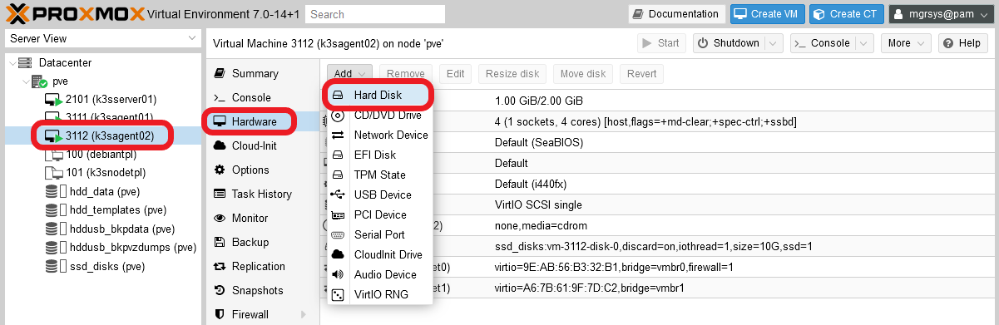
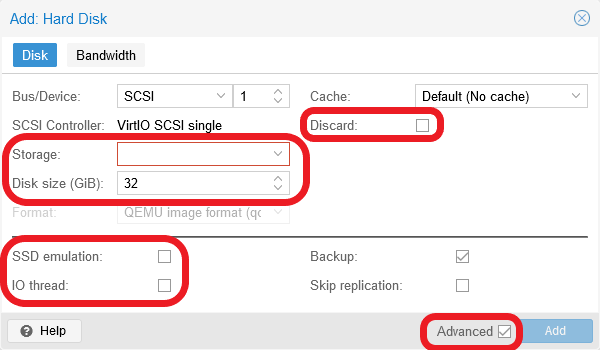
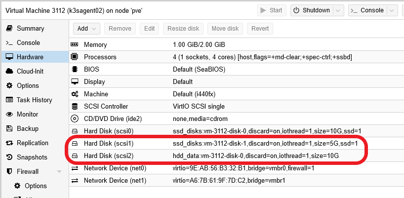

# G033 - Deploying services 02 ~ Nextcloud - Part 1 - Outlining setup, arranging storage and choosing service IPs

From the services listed in the [**G018** guide](G018%20-%20K3s%20cluster%20setup%2001%20~%20Requirements%20and%20arrangement.md#nextcloud), let's begin with the **Nextcloud** file-sharing platform. Since deploying it requires the configuration and deployment of several different components, I've split the Nextcloud guide in five parts, being this the first one of them. In this part, you'll see how to outline the setup of your Nextcloud platform, then work in the arrangement of the storage drives needed to store Nextcloud's data, and finally choose some required IPs.

## Outlining Nextcloud's setup

First, you must define how you want to setup Nextcloud in your cluster. This means that you'll have to decide beforehand how to solve the following points.

- For storing metadata, Nextcloud requires a database. Which one are you going to use and how you'll setup it?
- Will you use a cache server to improve the performance? Will it be exclusive to the Nextcloud instance?
- Where in your K3s cluster the Nextcloud's data and html folders should be placed?

This guide solves the previous points as follows.

- **Database**: MariaDB with its data saved in a local SSD storage drive.
- **Cache server**: Redis instance configured to be just an in-memory cache for sessions.
- **Nextcloud's folder for html and installation-related files**: persistent volume prepared on a local SSD storage drive.
- **Nextcloud users' data**: persistent volume prepared on a local HDD storage drive.
- Using kubernetes affinity rules, **all the Nextcloud-related services are deployed in pods running in the same K3s agent node**. This implies that the persistent volumes must be also available in the same K3s node.

### _Choosing the K3s agent_

Your cluster has only two K3s agent nodes, and the two of them are already running services. Choose the one that currently has the lowest CPU and RAM usage of the two. In my case it happened to be the `k3sagent02` node.

## Setting up new storage drives in the K3s agent

Given how the K3s cluster has been configured, the only persistent volumes you can use are local ones. This means that they rely on paths found in the K3s node VM's host system, but you don't want to use the root filesystem in which the underlying Debian OS is installed. It's better to have separate drives for each persistent volume, which you can create directly from your Proxmox VE web console.

### _Adding the new storage drives to the K3s agent node's VM_

1. Log in your Proxmox VE web console and go to the `Hardware` page of your chosen K3s agent's VM. There, click on the `Add` button and then on the `Hard Disk` option.

    

2. You'll meet a window (already seen back in the [**G020** guide](G020%20-%20K3s%20cluster%20setup%2003%20~%20Debian%20VM%20creation.md#setting-up-a-new-virtual-machine)) where you can define a new storage drive for your VM.

    

    Add two new "hard disks" to your VM, one SSD drive and a HDD drive. Notice the highlighted elements in the capture above: be sure of having the `Advanced` checkbox enabled and edit only the featured fields as follows.

    - **SSD drive**: storage `ssd_disks`, Discard `ENABLED`, disk size `5 GiB`, SSD emulation `ENABLED`, IO thread `ENABLED`.

    - **HDD drive**: storage `hdd_data`, Discard `ENABLED`, disk size `10 GiB`, SSD emulation `DISABLED`, IO thread `ENABLED`.

    After adding the new drives, they should appear in your VM's hardware list.

    

3. Now, open a shell in your VM and check with `fdisk` that the new drives are already active and running.

    ~~~bash
    $ sudo fdisk -l

    Disk /dev/sda: 10 GiB, 10737418240 bytes, 20971520 sectors
    Disk model: QEMU HARDDISK
    Units: sectors of 1 * 512 = 512 bytes
    Sector size (logical/physical): 512 bytes / 512 bytes
    I/O size (minimum/optimal): 512 bytes / 512 bytes
    Disklabel type: dos
    Disk identifier: 0x76bd2712

    Device     Boot   Start      End  Sectors  Size Id Type
    /dev/sda1  *       2048   999423   997376  487M 83 Linux
    /dev/sda2       1001470 20969471 19968002  9.5G  5 Extended
    /dev/sda5       1001472 20969471 19968000  9.5G 8e Linux LVM

    Disk /dev/mapper/k3snode--vg-root: 9.52 GiB, 10221518848 bytes, 19963904 sectors
    Units: sectors of 1 * 512 = 512 bytes
    Sector size (logical/physical): 512 bytes / 512 bytes
    I/O size (minimum/optimal): 512 bytes / 512 bytes

    Disk /dev/sdb: 5 GiB, 5368709120 bytes, 10485760 sectors
    Disk model: QEMU HARDDISK
    Units: sectors of 1 * 512 = 512 bytes
    Sector size (logical/physical): 512 bytes / 512 bytes
    I/O size (minimum/optimal): 512 bytes / 512 bytes

    Disk /dev/sdc: 10 GiB, 10737418240 bytes, 20971520 sectors
    Disk model: QEMU HARDDISK
    Units: sectors of 1 * 512 = 512 bytes
    Sector size (logical/physical): 512 bytes / 512 bytes
    I/O size (minimum/optimal): 512 bytes / 512 bytes
    ~~~

    The new drives are `/dev/sdb` and `/dev/sdc`. Unsurprisingly, they are of the same `Disk model` as `/dev/sda`: `QEMU HARDDISK`.

### _LVM storage set up_

You have the new storage drives available in your VM, but you still have to configure the required LVM volumes in them.

1. Create a new GPT partition on each of the new storage drives with `sgdisk`. Remember that these new drives are the `/dev/sdb` and `/dev/sdc` devices you saw before with `fdisk`.

    ~~~bash
    $ sudo sgdisk -N 1 /dev/sdb
    $ sudo sgdisk -N 1 /dev/sdc
    ~~~

    You might see the following warning when executing the `sgdisk` commands.

    ~~~bash
    Warning: Partition table header claims that the size of partition table
    entries is 0 bytes, but this program  supports only 128-byte entries.
    Adjusting accordingly, but partition table may be garbage.
    ~~~

    Don't worry about it, the partitions will work fine. This warning may be some odd consequence due to the drives' virtual nature.

2. Check with `fdisk` that now you have a new partition on each storage drive.

    ~~~bash
    $ sudo fdisk -l /dev/sdb /dev/sdc
    Disk /dev/sdb: 5 GiB, 5368709120 bytes, 10485760 sectors
    Disk model: QEMU HARDDISK
    Units: sectors of 1 * 512 = 512 bytes
    Sector size (logical/physical): 512 bytes / 512 bytes
    I/O size (minimum/optimal): 512 bytes / 512 bytes
    Disklabel type: gpt
    Disk identifier: B9CBA7C7-78E5-4EC7-9243-F3CB7ED69B6E

    Device     Start      End  Sectors Size Type
    /dev/sdb1   2048 10485726 10483679   5G Linux filesystem

    Disk /dev/sdc: 10 GiB, 10737418240 bytes, 20971520 sectors
    Disk model: QEMU HARDDISK
    Units: sectors of 1 * 512 = 512 bytes
    Sector size (logical/physical): 512 bytes / 512 bytes
    I/O size (minimum/optimal): 512 bytes / 512 bytes
    Disklabel type: gpt
    Disk identifier: B4168FB4-8501-4763-B89F-B3CEDB30B698

    Device     Start      End  Sectors Size Type
    /dev/sdc1   2048 20971486 20969439  10G Linux filesystem
    ~~~

    Above you can find the `/dev/sdb1` and `/dev/sdc1` partitions under their respective drives.

3. Use `pvcreate` to create a new LVM physical volume, or PV, out of each partition.

    ~~~bash
    $ sudo pvcreate --metadatasize 5m -y -ff /dev/sdb1
    $ sudo pvcreate --metadatasize 10m -y -ff /dev/sdc1
    ~~~

    To determine the metadata size, I've used the rule of thumb of allocating 1 MiB per 1 GiB present in the PV.

    Check with `pvs` that the PVs have been created.

    ~~~bash
    $ sudo pvs
      PV         VG         Fmt  Attr PSize   PFree
      /dev/sda5  k3snode-vg lvm2 a--   <9.52g      0
      /dev/sdb1             lvm2 ---   <5.00g  <5.00g
      /dev/sdc1             lvm2 ---  <10.00g <10.00g
    ~~~

4. You also need to assign a volume group, or VG, to each PV, bearing in mind the following.

    - The two drives are running on different storage hardware, so you must clearly differentiate their storage space.
    - Nextcloud's database data will be stored in `/dev/sdb1`, on the SSD drive.
    - Nextcloud's html and installation-related files will be also stored in `/dev/sdb1`, on the SSD drive.
    - Nextcloud's users files will be kept in `/dev/sdc1`, on the HDD drive.

    Knowing that, create two VGs with `vgcreate`.

    ~~~bash
    $ sudo vgcreate nextcloud-ssd /dev/sdb1
    $ sudo vgcreate nextcloud-hdd /dev/sdc1
    ~~~

    See how I named each VG related to nextcloud and the kind of underlying drive used. Then, with `pvs` you can see how each PV is now assigned to their respective VG.

    ~~~bash
    $ sudo pvs
      PV         VG            Fmt  Attr PSize  PFree
      /dev/sda5  k3snode-vg    lvm2 a--  <9.52g    0
      /dev/sdb1  nextcloud-ssd lvm2 a--   4.99g 4.99g
      /dev/sdc1  nextcloud-hdd lvm2 a--   9.98g 9.98g
    ~~~

    Also check with `vgs` the current status of the VGs in your VM.

    ~~~bash
    $ sudo vgs
      VG            #PV #LV #SN Attr   VSize  VFree
      k3snode-vg      1   1   0 wz--n- <9.52g    0
      nextcloud-hdd   1   0   0 wz--n-  9.98g 9.98g
      nextcloud-ssd   1   0   0 wz--n-  4.99g 4.99g
    ~~~

5. Then, you can create the required light volumes on each VG with `lvcreate`. Remember the purpose of each LV and give them meaningful names.

    ~~~bash
    $ sudo lvcreate -l 75%FREE -n nextcloud-db nextcloud-ssd
    $ sudo lvcreate -l 100%FREE -n nextcloud-html nextcloud-ssd
    $ sudo lvcreate -l 100%FREE -n nextcloud-data nextcloud-hdd
    ~~~

    Notice how the `nextcloud-db` LV only takes the `75%` of the currently free space on the `nextcloud-ssd` VG, and how the `nextcloud-html` LV uses all the **remaining** space available on the same VG. On the other hand, `nextcloud-data` takes all the storage available in the `nextcloud-hdd` VG. Also see how all the LV's names are reminders of the kind of data they'll store later.

    Check with `lvs` the new LVs in your VM.

    ~~~bash
    $ sudo lvs
      LV             VG            Attr       LSize  Pool Origin Data%  Meta%  Move Log Cpy%Sync Convert
      root           k3snode-vg    -wi-ao---- <9.52g
      nextcloud-data nextcloud-hdd -wi-a-----  9.98g
      nextcloud-db   nextcloud-ssd -wi-a-----  3.74g
      nextcloud-html nextcloud-ssd -wi-a-----  1.25g
    ~~~

    See how `nextcloud-db` has the size corresponding to the 75% (3.74 GiB) of the 5 GiB that were available in the `nextcloud-ssd` VG, while `nextcloud-html` took the remaining 25% (1.25 GiB).

    With `vgs` you can verify that there's no space left (`VFree` column) in the VGs.

    ~~~bash
    $ sudo vgs
      VG            #PV #LV #SN Attr   VSize  VFree
      k3snode-vg      1   1   0 wz--n- <9.52g    0
      nextcloud-hdd   1   1   0 wz--n-  9.98g    0
      nextcloud-ssd   1   2   0 wz--n-  4.99g    0
    ~~~

    Notice how the count of LVs in the `nextcloud-ssd` VG is `2`, while in the rest of them is just `1`.

### _Formatting and mounting the new LVs_

Your new LVs need to be formatted as ext4 filesystems and then mounted.

1. Before you format the new LVs, you need to see their `/dev/mapper/` paths with `fdisk`. To get only the Nextcloud related paths, I filter out their lines with `grep` because the `nextcloud` string will be part of the paths.

    ~~~bash
    $ sudo fdisk -l | grep nextcloud
    Disk /dev/mapper/nextcloud--ssd-nextcloud--db: 3.74 GiB, 4018143232 bytes, 7847936 sectors
    Disk /dev/mapper/nextcloud--ssd-nextcloud--html: 1.25 GiB, 1342177280 bytes, 2621440 sectors
    Disk /dev/mapper/nextcloud--hdd-nextcloud--data: 9.98 GiB, 10720641024 bytes, 20938752 sectors
    ~~~

2. Call the `mkfs.ext4` command on their `/dev/mapper/nextcloud` paths.

    ~~~bash
    $ sudo mkfs.ext4 /dev/mapper/nextcloud--ssd-nextcloud--db
    $ sudo mkfs.ext4 /dev/mapper/nextcloud--ssd-nextcloud--html
    $ sudo mkfs.ext4 /dev/mapper/nextcloud--hdd-nextcloud--data
    ~~~

3. Next you need to create a directory structure that provides mount points for the LVs. It could be like the one created with the following `mkdir` command.

    ~~~bash
    $ sudo mkdir -p /mnt/nextcloud-ssd/{db,html} /mnt/nextcloud-hdd/data
    ~~~

    Notice that you have to use `sudo` for creating those folders, because the system will use its `root` user to mount them later on each boot up. Check, with the `tree` command, that they've been created correctly.

    ~~~bash
    $ tree -F /mnt/
    /mnt/
    ├── nextcloud-hdd/
    │   └── data/
    └── nextcloud-ssd/
        ├── db/
        └── html/

    5 directories, 0 files
    ~~~

4. Using the `mount` command, mount the LVs in their respective mount points.

    ~~~bash
    $ sudo mount /dev/mapper/nextcloud--ssd-nextcloud--db /mnt/nextcloud-ssd/db
    $ sudo mount /dev/mapper/nextcloud--ssd-nextcloud--html /mnt/nextcloud-ssd/html
    $ sudo mount /dev/mapper/nextcloud--hdd-nextcloud--data /mnt/nextcloud-hdd/data
    ~~~

    Verify with `df` that they've been mounted in the system. Since you're working in a K3s agent node, you'll also see a bunch of containerd-related filesystems mounted. Your newly mounted LVs will appear at the bottom of the list.

    ~~~bash
    $ df -h
    Filesystem                                  Size  Used Avail Use% Mounted on
    udev                                        974M     0  974M   0% /dev
    tmpfs                                       199M  1.2M  198M   1% /run
    /dev/mapper/k3snode--vg-root                9.3G  1.8G  7.1G  21% /
    tmpfs                                       992M     0  992M   0% /dev/shm
    tmpfs                                       5.0M     0  5.0M   0% /run/lock
    /dev/sda1                                   470M   48M  398M  11% /boot
    shm                                          64M     0   64M   0% /run/k3s/containerd/io.containerd.grpc.v1.cri/sandboxes/0a3ab27d616453de9f6723df7e3f98a68842dc4cd6c53546ea3aac7a61f2120f/shm
    shm                                          64M     0   64M   0% /run/k3s/containerd/io.containerd.grpc.v1.cri/sandboxes/a78e5eca7c8310b13e61d9205e54a53279bc78054490f48303052d4670f7c70a/shm
    shm                                          64M     0   64M   0% /run/k3s/containerd/io.containerd.grpc.v1.cri/sandboxes/4aa9bb992317404351deadd41c339928c0bbbb0d6bd46f8f496a56761270fdfb/shm
    shm                                          64M     0   64M   0% /run/k3s/containerd/io.containerd.grpc.v1.cri/sandboxes/dca9bec1a9e1b900335800fc883617a13539e683caf518176c1eefccabc44525/shm
    shm                                          64M     0   64M   0% /run/k3s/containerd/io.containerd.grpc.v1.cri/sandboxes/0e4e4877c0b21e59e60bac8f58fcb760c24d4121a88cea3ec0797cdc14ae6bb1/shm
    shm                                          64M     0   64M   0% /run/k3s/containerd/io.containerd.grpc.v1.cri/sandboxes/2fcb1ecfc4dd0902d12c26ce4d31b2067ff2dd6c77ce0ddd936a1907573e280b/shm
    tmpfs                                       173M     0  173M   0% /run/user/1000
    /dev/mapper/nextcloud--ssd-nextcloud--db    3.7G   24K  3.5G   1% /mnt/nextcloud-ssd/db
    /dev/mapper/nextcloud--ssd-nextcloud--html  1.2G   24K  1.2G   1% /mnt/nextcloud-ssd/html
    /dev/mapper/nextcloud--hdd-nextcloud--data  9.8G   24K  9.3G   1% /mnt/nextcloud-hdd/data
    ~~~

5. To make the mountings permanent, append them to the `/etc/fstab` file of the VM. First, make a backup of the `fstab` file.

    ~~~bash
    $ sudo cp /etc/fstab /etc/fstab.bkp
    ~~~

    Then **append** the following lines to the `fstab` file.

    ~~~bash
    # Nextcloud volumes
    /dev/mapper/nextcloud--ssd-nextcloud--db /mnt/nextcloud-ssd/db ext4 defaults,nofail 0 0
    /dev/mapper/nextcloud--ssd-nextcloud--html /mnt/nextcloud-ssd/html ext4 defaults,nofail 0 0
    /dev/mapper/nextcloud--hdd-nextcloud--data /mnt/nextcloud-hdd/data ext4 defaults,nofail 0 0
    ~~~

### _Storage mount points for Nextcloud containers_

You must not use the directories in which you've mounted the new storage volumes as mount points for the persistent volumes you'll enable later for the containers where the Nexcloud components will run. This is because the containers can change the owner user and group, and also the permission mode, applied to those folders. This could cause a failure when, after a reboot, your K3s agent node tries to mount again its storage volumes. The issue will happen because it won't have the right user or permissions anymore to access the mount point folders. The best thing to do then is to create another folder within each storage volume that can be used safely by its respective container.

1. For the case of the LVM storage volumes created before, you just have to execute a `mkdir` command like the following.

    ~~~bash
    $ sudo mkdir /mnt/{nextcloud-ssd/db,nextcloud-ssd/html,nextcloud-hdd/data}/k3smnt
    ~~~

    Like you did with the mount point folders, these new directories also have to be owned by `root`. This is because the K3s service is running under that user.

2. Check the new folder structure with `tree`.

    ~~~bash
    $ tree -F /mnt/
    /mnt/
    ├── nextcloud-hdd/
    │   └── data/
    │       ├── k3smnt/
    │       └── lost+found/ [error opening dir]
    └── nextcloud-ssd/
        ├── db/
        │   ├── k3smnt/
        │   └── lost+found/ [error opening dir]
        └── html/
            ├── k3smnt/
            └── lost+found/ [error opening dir]

    11 directories, 0 files
    ~~~

    Don't mind the `lost+found` folders, they are created by the system automatically.

> **BEWARE!**  
> Realize that the `k3smnt` folders are **within** the already mounted LVM storage volumes, meaning that you cannot create them without mounting the light volumes first.

### _About increasing the size of volumes_

If, after a time using and filling up these volumes, you need to increase their size, take a look to the [**G907** appendix guide](G907%20-%20Appendix%2007%20~%20Resizing%20a%20root%20LVM%20volume.md). It shows you how to extend a partition and the LVM filesystem within it, although in that case it works on a LV volume that happens to be also the root filesystem of a VM.

## Choosing static cluster IPs for Nextcloud related services

For all the main components of your Nextcloud setup, you're going to create `Service` resources. To make them reachable internally for any pod within your Kubernetes cluster, one way is by assigning them a static cluster IP. With this you get to know beforehand which internal IP the services have, allowing you pointing the Nextcloud server instance to the right ones. To determine which cluster IP is correct for those future services, you need to take a look at which cluster IPs are currently in use in your Kubernetes cluster.

~~~bash
$ kubectl get svc -A
NAMESPACE              NAME                        TYPE           CLUSTER-IP      EXTERNAL-IP    PORT(S)                      AGE
default                kubernetes                  ClusterIP      10.43.0.1       <none>         443/TCP                      8d
kube-system            kube-dns                    ClusterIP      10.43.0.10      <none>         53/UDP,53/TCP,9153/TCP       8d
kube-system            traefik                     LoadBalancer   10.43.110.37    192.168.1.41   80:30963/TCP,443:32446/TCP   7d23h
kube-system            metrics-server              ClusterIP      10.43.133.41    <none>         443/TCP                      6d19h
cert-manager           cert-manager                ClusterIP      10.43.176.145   <none>         9402/TCP                     5d23h
cert-manager           cert-manager-webhook        ClusterIP      10.43.75.5      <none>         443/TCP                      5d23h
kubernetes-dashboard   dashboard-metrics-scraper   ClusterIP      10.43.181.120   <none>         8000/TCP                     5d1h
kubernetes-dashboard   kubernetes-dashboard        ClusterIP      10.43.101.112   <none>         443/TCP                      5d1h
~~~

Check the values under the `CLUSTER-IP` column, and notice how all of them fall (in this case) under the `10.43` subnet. What you have to do now is just choose IPs that fall into that subnet but don't collide with the ones currently in use by other services. Let's say you choose the following ones:

- `10.43.100.1` for the Redis service.
- `10.43.100.2` for the MariaDB service.
- `10.43.100.3` for the Nextcloud service.

See that I've also chosen IP for the Nextcloud server. With the internal cluster IPs known, in a later guide you'll see how Nextcloud will be able to point at the components it needs to run.

## Relevant system paths

### _Folders in K3s agent node's VM_

- `/etc`
- `/mnt`
- `/mnt/nextcloud-hdd`
- `/mnt/nextcloud-hdd/data`
- `/mnt/nextcloud-hdd/data/k3smnt`
- `/mnt/nextcloud-ssd`
- `/mnt/nextcloud-ssd/db`
- `/mnt/nextcloud-ssd/db/k3smnt`
- `/mnt/nextcloud-ssd/html`
- `/mnt/nextcloud-ssd/html/k3smnt`

### _Files in K3s agent node's VM_

- `/dev/mapper/nextcloud--hdd-nextcloud--data`
- `/dev/mapper/nextcloud--ssd-nextcloud--db`
- `/dev/mapper/nextcloud--ssd-nextcloud--html`
- `/dev/sdb`
- `/dev/sdb1`
- `/dev/sdc`
- `/dev/sdc1`
- `/etc/fstab`
- `/etc/fstab.bkp`
