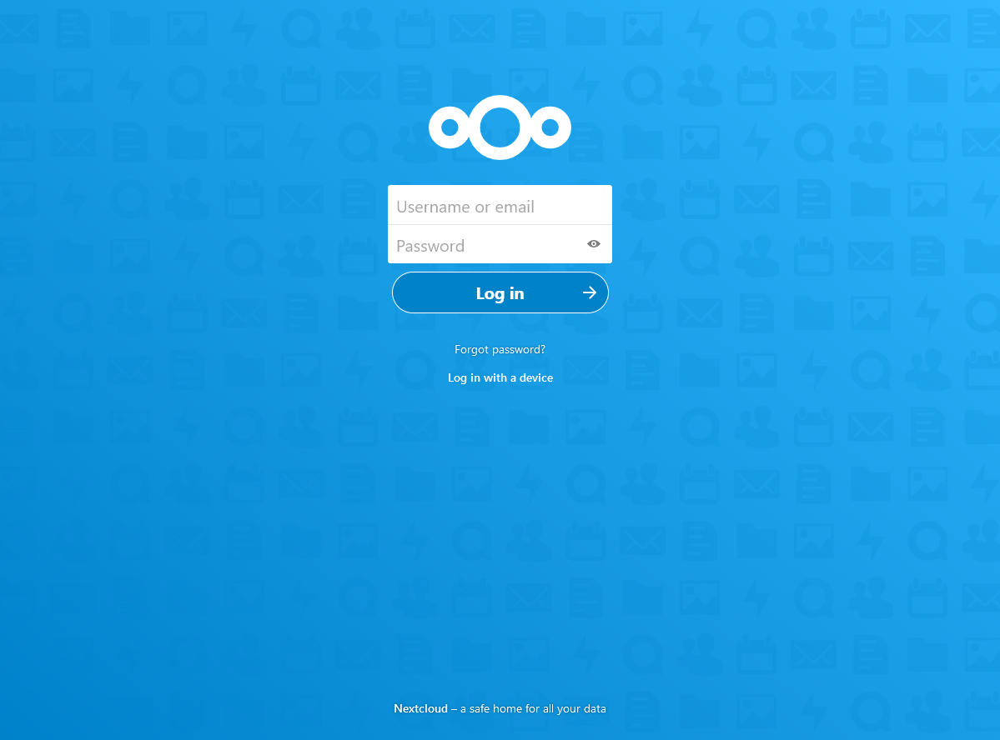
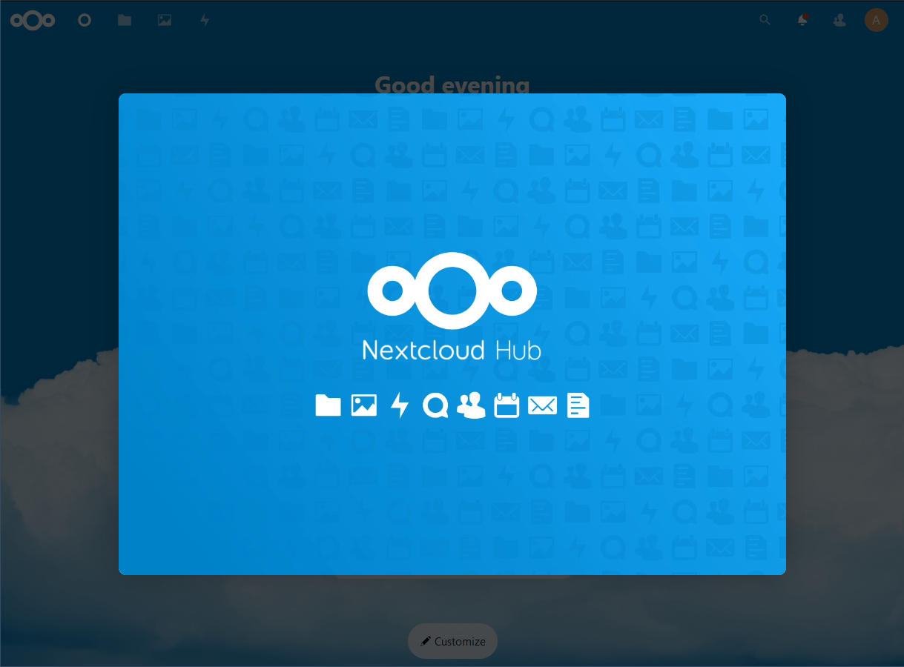
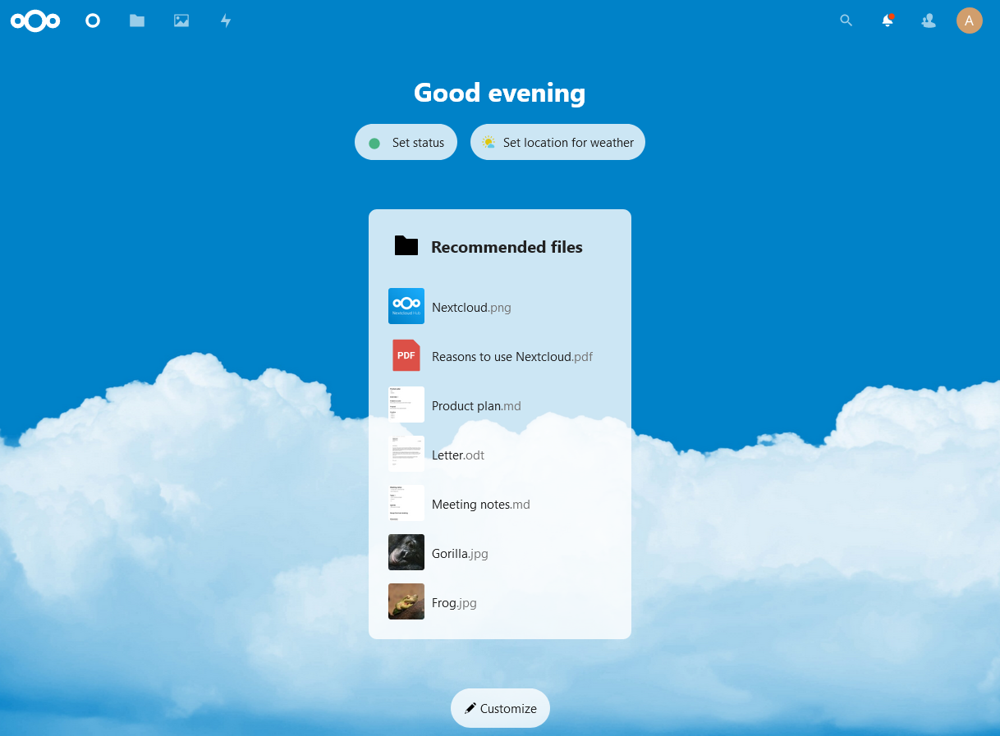
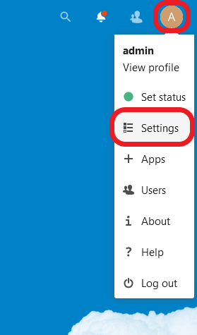
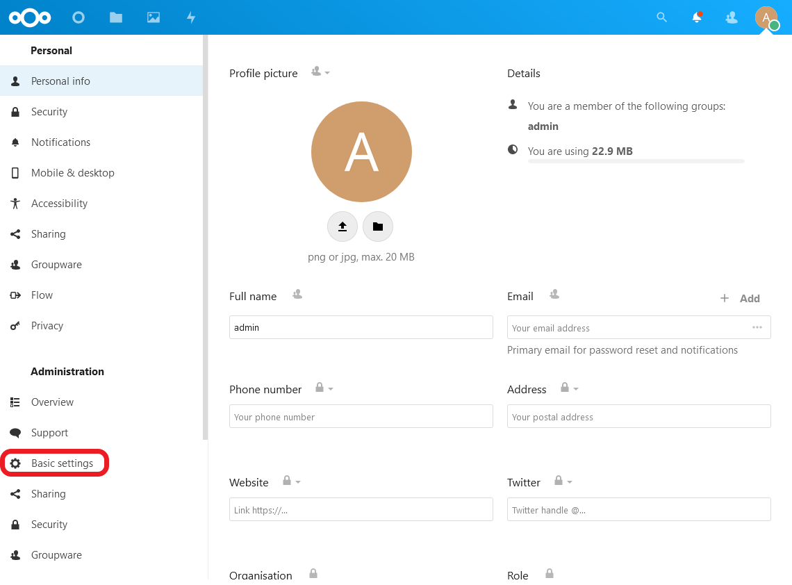
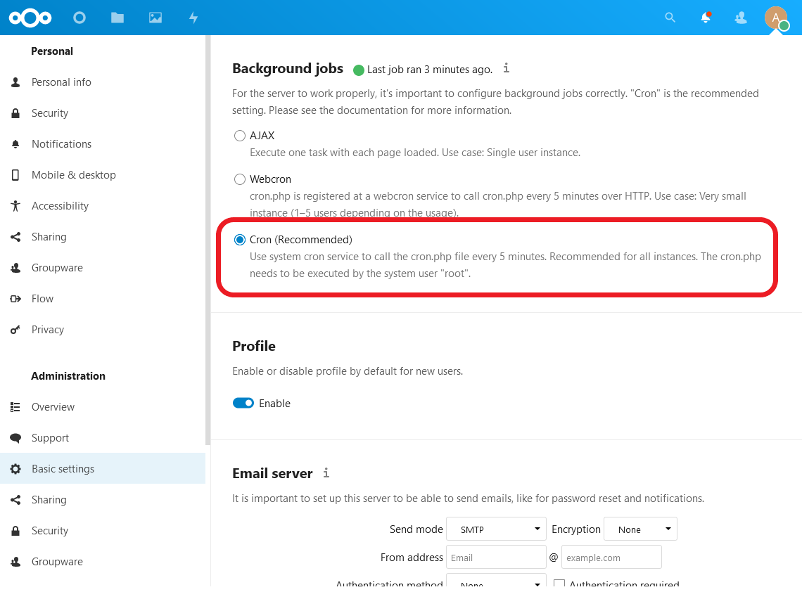

# G033 - Deploying services 02 ~ Nextcloud - Part 5 - Complete Nextcloud platform

In this final part of the Nextcloud platform guide, you'll declare any missing elements needed in your Nextcloud platform, put everything together and deploy it all at once in your K3s Kubernetes cluster. Also, I'll show you how to check out the platform and its containers.

## Preparing pending Nextcloud platform elements

You've prepared the main components that make up the Nextcloud platform, but there are still a few elements you need to define: the three persistent volumes that correspond to all the claims you've defined for MariaDB and Nextcloud server, a namespace to group all the components together in your Kubernetes cluster, and the secret from the wildcard certificate you created back in the [**G029** guide about cert-manager](G029%20-%20K3s%20cluster%20setup%2012%20~%20Setting%20up%20cert-manager%20and%20wildcard%20certificate.md#setting-up-a-wildcard-certificate-for-a-domain). The volumes and the namespace are Kubernetes resources, so prepare a folder to hold their yaml definitions in the root folder of your Nextcloud project.

~~~bash
$ mkdir -p $HOME/k8sprjs/nextcloud/resources
~~~

### _Persistent volumes_

The persistent volumes are the way to use, in your K3s cluster, the LVM storage volumes you arranged in [the first part of this guide](G033%20-%20Deploying%20services%2002%20~%20Nextcloud%20-%20Part%201%20-%20Outlining%20setup,%20arranging%20storage%20and%20choosing%20service%20IPs.md).

1. You need to create three different persistent volumes, so prepare a new file for each of them.

    ~~~bash
    $ touch $HOME/k8sprjs/nextcloud/resources/{data-nextcloud,db-nextcloud,html-nextcloud}.persistentvolume.yaml
    ~~~

2. Copy the following yaml definitions in their corresponding files.

    - In `data-nextcloud.persistentvolume.yaml`.

        ~~~yaml
        apiVersion: v1
        kind: PersistentVolume

        metadata:
          name: data-nextcloud
        spec:
          capacity:
            storage: 9.3G
          volumeMode: Filesystem
          accessModes:
          - ReadWriteOnce
          storageClassName: local-path
          persistentVolumeReclaimPolicy: Retain
          local:
            path: /mnt/nextcloud-hdd/data/k3smnt
          nodeAffinity:
            required:
              nodeSelectorTerms:
              - matchExpressions:
                - key: kubernetes.io/hostname
                  operator: In
                  values:
                  - k3sagent02
        ~~~

    - In `db-nextcloud.persistentvolume.yaml`.

        ~~~yaml
        apiVersion: v1
        kind: PersistentVolume

        metadata:
          name: db-nextcloud
        spec:
          capacity:
            storage: 3.5G
          volumeMode: Filesystem
          accessModes:
          - ReadWriteOnce
          storageClassName: local-path
          persistentVolumeReclaimPolicy: Retain
          local:
            path: /mnt/nextcloud-ssd/db/k3smnt
          nodeAffinity:
            required:
              nodeSelectorTerms:
              - matchExpressions:
                - key: kubernetes.io/hostname
                  operator: In
                  values:
                  - k3sagent02
        ~~~

    - In `html-nextcloud.persistentvolume.yaml`.

        ~~~yaml
        apiVersion: v1
        kind: PersistentVolume

        metadata:
          name: html-nextcloud
        spec:
          capacity:
            storage: 1.2G
          volumeMode: Filesystem
          accessModes:
          - ReadWriteOnce
          storageClassName: local-path
          persistentVolumeReclaimPolicy: Retain
          local:
            path: /mnt/nextcloud-ssd/html/k3smnt
          nodeAffinity:
            required:
              nodeSelectorTerms:
              - matchExpressions:
                - key: kubernetes.io/hostname
                  operator: In
                  values:
                  - k3sagent02
        ~~~

    The yamls above use exactly the same parameters.

    - In the `metadata` section, the `name` strings are the same ones set in the claims you declared for MariaDB and Nextcloud server.

    - In the `spec` section there are a number or particularities.

        - The `spec.capacity.storage` is a decimal number in gigabytes (`G`). Internally the decimal value will be converted to megabytes (`M`). Be sure of not assigning more capacity than is really available in the underlying storage, something you can check on the node with `df -h`.
            > **BEWARE!**  
            > Be careful with the units you use in Kubernetes: its not the same typing **1G** (1000M) than **1Gi** (1024 Mi). Check out [this Stackoverflow question about the matter](https://stackoverflow.com/questions/50804915/kubernetes-size-definitions-whats-the-difference-of-gi-and-g) for further clarification.

        - The `spec.volumeMode` is set to `Filesystem` because the underlying LVM volume has been formatted with an ext4 filesystem. The alternative value is `Block`, and its valid only for raw (unformatted) volumes connected through storage plugins that support that format (`local-path` doesn't).

        - The `spec.accessModes` list has just the `ReadWriteOnce` value to ensure that only one pod (hence the `Once` part) has read and write access to the volume.

        - The `spec.storageClassName` is a parameter that indicates what storage profile (a particular set of properties) to use with the persistent volume. Remember that you only have one available in your K3s cluster, `local-path`, so that's the one you have to use.
            > **BEWARE!**  
            > If you leave the `storageClassName` parameter unset, its value will be set internally to the default one (`local-path` in a K3s cluster). On the other hand, if the value is the empty string (`storageClassName: ""`), this leaves the volume with no storage class assigned at all.

        - The `spec.persistentVolumeReclaimPolicy` parameter is about the reclaim policy to apply to this persistent volume. When all the persistent volume claims that required this volume are deleted from the cluster, the system must know what to do with this storage.
            - There are only two policies to use here: `Retain` or `Delete`.
            - Left unset, it'll be set to whatever reclaim policy is set in the storage class. The `local-path` has it on `Delete`.
            - `Retain` deletes the persistent volume from the cluster but not the associated storage asset. This means that whatever data was stored there will be preserved.
            - `Delete` deletes both the persistent volume and the associated storage asset, but only if the volume plugin/storage provisioner used supports it. In the case of the Rancher [local-path-provisioner](https://github.com/rancher/local-path-provisioner) used in K3s (associated with the `local-path` storage class), it will automatically clean up the contents stored in the volume.

        - In `spec.local.path` is where you specify the **absolute path**, within the node's filesystem, where you want to mount this volume. Notice how, in all the PVs, it has the path to their corresponding `k3smnt` folder you already left prepared in your `k3sagent02` VM.

        - The `spec.nodeAffinity` block restricts to which node in the cluster a volume will be binded to. Otherwise, the Kubernetes engine would try to bind the volume to any node, which could lead to errors. In the yamls above, you can see how in all the PVs theres's only one node affinity rule that looks for the hostname of the node (the `key` in the `matchExpressions` section), and checks if it's `In` (the `operator` parameter) the list of admitted `values`. Since the `k3sagent02` node is the only one with the storage ready for those volumes, it's hostname is the only value in the list.

### _Nextcloud Namespace resource_

To avoid naming conflicts with any other resources you could have running in your K3s cluster, its better to put all the components of this Nextcloud platform under an exclusive namespace.

1. A namespace is also a Kubernetes resource, so create a file for it under the `resources` folder.

    ~~~bash
    $ touch $HOME/k8sprjs/nextcloud/resources/nextcloud.namespace.yaml
    ~~~

2. Fill `nextcloud.namespace.yaml` with the resource definition next.

    ~~~yaml
    apiVersion: v1
    kind: Namespace

    metadata:
      name: nextcloud
    ~~~

    As you see above, the Namespace is one of the simplest resources you can set in a Kubernetes cluster.

### _Updating wildcard certificate's Reflector-managed namespaces_

The Apache service running your Nextcloud server needs the secret from the wildcard certificate you created in the [**G029** guide](G029%20-%20K3s%20cluster%20setup%2012%20~%20Setting%20up%20cert-manager%20and%20wildcard%20certificate.md#setting-up-a-wildcard-certificate-for-a-domain). That secret is what contains the files that make up the certificate itself, and you need it replicated in the nextcloud namespace so it can be used by Apache. For replication of secrets and config maps, remember that you installed the Reflector addon and that you already annotated the wildcard certificate so its secret can be managed by it. What you need to do is just add the `nextcloud` namespace in those annotations.

1. In the Kustomize project you created for the wildcard certificate, create a new `patches` folder.

    ~~~bash
    $ mkdir -p $HOME/k8sprjs/cert-manager/certificates/patches
    ~~~

2. Create a `wildcard.deimos.cloud-tls.certificate.cert-manager.reflector.namespaces.yaml` file under the `patches` folder.

    ~~~bash
    $ touch $HOME/k8sprjs/cert-manager/certificates/patches/wildcard.deimos.cloud-tls.certificate.cert-manager.reflector.namespaces.yaml
    ~~~

3. In `wildcard.deimos.cloud-tls.certificate.cert-manager.reflector.namespaces.yaml` copy the yaml portion below.

    ~~~yaml
    # Certificate wildcard.deimos.cloud-tls patch for Reflector-managed namespaces
    apiVersion: cert-manager.io/v1
    kind: Certificate

    metadata:
      name: wildcard.deimos.cloud-tls
      namespace: certificates
    spec:
      secretTemplate:
        annotations:
          reflector.v1.k8s.emberstack.com/reflection-allowed-namespaces: "kube-system,nextcloud"
          reflector.v1.k8s.emberstack.com/reflection-auto-namespaces: "kube-system,nextcloud"
    ~~~

    This portion has been taken from the original `wildcard.deimos.cloud-tls.certificate.cert-manager.yaml` you created to define your wildcard certificate.

    - Only two Reflector-related annotations have to be modified, the ones in which the namespaces where to copy the certificate's secret are listed.

    - The `nextcloud` namespace is added right after the originally present `kube-system` one.

4. Edit the `kustomization.yaml` file from this certificate's Kustomize project to add the patch. The file should look like below.

    ~~~yaml
    # Certificates deployment
    apiVersion: kustomize.config.k8s.io/v1beta1
    kind: Kustomization

    resources:
    - resources/certificates.namespace.yaml
    - resources/cluster-issuer-selfsigned.cluster-issuer.cert-manager.yaml
    - resources/wildcard.deimos.cloud-tls.certificate.cert-manager.yaml

    patches:
    - path: patches/wildcard.deimos.cloud-tls.certificate.cert-manager.reflector.namespaces.yaml
      target:
        group: cert-manager.io
        version: v1
        kind: Certificate
        namespace: certificates
        name: wildcard.deimos.cloud-tls
    ~~~

    What's new in this `kustomization.yaml` file is the whole patches block, where you see that your `wildcard.deimos.cloud-tls.certificate.cert-manager.reflector.namespaces.yaml` is applied to a very concrete `target` that corresponds to the wildcard certificate you need to change.

5. Test the Kustomize yaml output to see if the patch is applied properly. The only thing that should change are the two patched Reflector annotations at `spec.secretTemplate.annotations` in the wildcard's `Certificate` resource.

    ~~~yaml
    apiVersion: v1
    kind: Namespace
    metadata:
      name: certificates
    ---
    apiVersion: cert-manager.io/v1
    kind: Certificate
    metadata:
      name: wildcard.deimos.cloud-tls
      namespace: certificates
    spec:
      dnsNames:
      - '*.deimos.cloud'
      - deimos.cloud
      duration: 8760h
      isCA: false
      issuerRef:
        group: cert-manager.io
        kind: ClusterIssuer
        name: cluster-issuer-selfsigned
      privateKey:
        algorithm: ECDSA
        encoding: PKCS8
        rotationPolicy: Always
        size: 384
      renewBefore: 720h
      secretName: wildcard.deimos.cloud-tls
      secretTemplate:
        annotations:
          reflector.v1.k8s.emberstack.com/reflection-allowed: "true"
          reflector.v1.k8s.emberstack.com/reflection-allowed-namespaces: kube-system,nextcloud
          reflector.v1.k8s.emberstack.com/reflection-auto-enabled: "true"
          reflector.v1.k8s.emberstack.com/reflection-auto-namespaces: kube-system,nextcloud
      subject:
        organizations:
        - Deimos
    ---
    apiVersion: cert-manager.io/v1
    kind: ClusterIssuer
    metadata:
      name: cluster-issuer-selfsigned
    spec:
      selfSigned: {}
    ~~~

6. If you agree with the Kustomize output, reapply the Kustomize project of your certificate.

    ~~~bash
    $ kubectl apply -k $HOME/k8sprjs/cert-manager/certificates
    ~~~

> **BEWARE!**  
> Remember that the `cert-manager` system won't automatically apply this modification to the annotations in the secret already generated for your wildcard certificate. Not a problem right now but later, after you've deployed the whole Nextcloud platform, you'll have to apply the change to the certificate's secret to make Reflector clone it into your new `nextcloud` namespace.

## Kustomize project for Nextcloud platform

With every required component declared or configured, now you need to put everything together under the same Kustomize project.

1. Create a `kustomization.yaml` file under the `nextcloud` folder.

    ~~~bash
    $ touch $HOME/k8sprjs/nextcloud/kustomization.yaml
    ~~~

2. Copy in `kustomization.yaml` the yaml below.

    ~~~yaml
    # Nextcloud platform setup
    apiVersion: kustomize.config.k8s.io/v1beta1
    kind: Kustomization

    namespace: nextcloud

    commonLabels:
      platform: nextcloud

    namePrefix: nxcd-

    resources:
    - resources/data-nextcloud.persistentvolume.yaml
    - resources/db-nextcloud.persistentvolume.yaml
    - resources/html-nextcloud.persistentvolume.yaml
    - resources/nextcloud.namespace.yaml
    - components/cache-redis
    - components/db-mariadb
    - components/server-nextcloud
    ~~~

    Be aware of the following details.

    - The `nextcloud` namespace is applied to all the resources coming out of this Kustomize project, except the namespace itself.

    - The `commonLabels` will put a `platform` label to all your resources. Remember that you already set an `app` label within each component.
        > **BEWARE!**  
        > A label set in a Kustomize project will overwrite the same label in any underlying subprojects.

    - The `namePrefix` adds a prefix to all the `metadata.name` strings in your resources, except to namespaces. It also transforms those names in the places they're referred to, although be aware that there might exceptions to this. In this case, the prefix is an acronym of the term _Nextcloud_.

    - In the `resources` list you have yaml files and also the directories of the components you have configured in the previous parts of this guide.
        > **BEWARE!**  
        > You can list directories as resources only if they have a `kustomization.yaml` inside that can be read by Kustomize. In other words, you can list Kustomize projects as resources for another Kustomize project.

3. As usual, check the Kustomize yaml output for this project. Since this one is going to be particularly long, let's dump it into a file such as `nextcloud.k.output.yaml`.

    ~~~bash
    $ kubectl kustomize $HOME/k8sprjs/nextcloud > nextcloud.k.output.yaml
    ~~~

4. Open the `nextcloud.k.output.yaml` file and compare your resulting yaml output with the one next.

    ~~~yaml
    apiVersion: v1
    kind: Namespace
    metadata:
      labels:
        platform: nextcloud
      name: nextcloud
    ---
    apiVersion: v1
    data:
      redis.conf: |
        port 6379
        bind 0.0.0.0
        protected-mode no
        maxmemory 64mb
        maxmemory-policy allkeys-lru
    kind: ConfigMap
    metadata:
      labels:
        app: cache-redis
        platform: nextcloud
      name: nxcd-cache-redis-6967fc5hc5
      namespace: nextcloud
    ---
    apiVersion: v1
    data:
      initdb.sh: |
        #!/bin/sh
        echo ">>> Creating user for Mysql Prometheus metrics exporter"
        mysql -u root -p$MYSQL_ROOT_PASSWORD --execute \
        "CREATE USER '${MARIADB_PROMETHEUS_EXPORTER_USERNAME}'@'localhost' IDENTIFIED BY '${MARIADB_PROMETHEUS_EXPORTER_PASSWORD}' WITH MAX_USER_CONNECTIONS 3;
        GRANT PROCESS, REPLICATION CLIENT, SELECT ON *.* TO '${MARIADB_PROMETHEUS_EXPORTER_USERNAME}'@'localhost';
        FLUSH privileges;"
      my.cnf: |
        [server]
        skip_name_resolve = 1
        innodb_buffer_pool_size = 224M
        innodb_flush_log_at_trx_commit = 2
        innodb_log_buffer_size = 32M
        query_cache_type = 1
        query_cache_limit = 2M
        query_cache_min_res_unit = 2k
        query_cache_size = 64M
        slow_query_log = 1
        slow_query_log_file = /var/lib/mysql/slow.log
        long_query_time = 1
        innodb_io_capacity = 2000
        innodb_io_capacity_max = 3000

        [client-server]
        !includedir /etc/mysql/conf.d/
        !includedir /etc/mysql/mariadb.conf.d/

        [client]
        default-character-set = utf8mb4

        [mysqld]
        character_set_server = utf8mb4
        collation_server = utf8mb4_general_ci
        transaction_isolation = READ-COMMITTED
        binlog_format = ROW
        log_bin = /var/lib/mysql/mysql-bin.log
        expire_logs_days = 7
        max_binlog_size = 100M
        innodb_file_per_table=1
        innodb_read_only_compressed = OFF
        tmp_table_size= 32M
        max_heap_table_size= 32M
        max_connections=512
      nextcloud-db-name: nextcloud-db
      nextcloud-username: nextcloud
      prometheus-exporter-username: exporter
    kind: ConfigMap
    metadata:
      labels:
        app: db-mariadb
        platform: nextcloud
      name: nxcd-db-mariadb-88gc2m5h46
      namespace: nextcloud
    ---
    apiVersion: v1
    data:
      000-default.conf: |
        MinSpareServers 4
        MaxSpareServers 16
        StartServers 10
        MaxConnectionsPerChild 2048

        LoadModule socache_shmcb_module /usr/lib/apache2/modules/mod_socache_shmcb.so
        SSLSessionCache shmcb:/var/tmp/apache_ssl_scache(512000)

        <VirtualHost *:443>
          Protocols http/1.1
          ServerAdmin root@deimos.cloud
          ServerName nextcloud.deimos.cloud
          ServerAlias nxc.deimos.cloud

          Header always set Strict-Transport-Security "max-age=15552000; includeSubDomains"

          DocumentRoot /var/www/html
          DirectoryIndex index.php

          LoadModule ssl_module /usr/lib/apache2/modules/mod_ssl.so
          SSLEngine on
          SSLCertificateFile /etc/ssl/certs/wildcard.deimos.cloud-tls.crt
          SSLCertificateKeyFile /etc/ssl/certs/wildcard.deimos.cloud-tls.key

          <Directory /var/www/html/>
            Options FollowSymlinks MultiViews
            AllowOverride All
            Require all granted

            <IfModule mod_dav.c>
              Dav off
            </IfModule>

            SetEnv HOME /var/www/html
            SetEnv HTTP_HOME /var/www/html
            Satisfy Any

          </Directory>

          ErrorLog ${APACHE_LOG_DIR}/error.log
          CustomLog ${APACHE_LOG_DIR}/access.log combined
        </VirtualHost>
      cache-redis-svc-cluster-ip: 10.43.100.1
      db-mariadb-svc-cluster-ip: 10.43.100.2
      nextcloud-admin-username: admin
      nextcloud-trusted-domains: 192.168.1.42 nextcloud.deimos.cloud nxc.deimos.cloud
      ports.conf: |
        Listen 443

        # vim: syntax=apache ts=4 sw=4 sts=4 sr noet
    kind: ConfigMap
    metadata:
      labels:
        app: server-nextcloud
        platform: nextcloud
      name: nxcd-server-apache-nextcloud-fcckh8bk2d
      namespace: nextcloud
    ---
    apiVersion: v1
    data:
      redis-password: |
        WTB1cl9yRTNlNDFMeS5sYWzDsWpmbMOxa2FlcnV0YW9uZ3ZvYW46YcOxb2RrbzM0OTQ4dX
        lPbmctUzNrcmVUX1A0czV3b1JkLWhlUkUhCg==
    kind: Secret
    metadata:
      labels:
        app: cache-redis
        platform: nextcloud
      name: nxcd-cache-redis-bh9d296g5k
      namespace: nextcloud
    type: Opaque
    ---
    apiVersion: v1
    data:
      nextcloud-user-password: |
        cTQ4OXE1NjlnYWRmamzDsWtqcXdpb2VrbnZrbG5rd2VvbG12bGtqYcOxc2RnYWlvcGgyYXNkZmFz
        a2RrbmZnbDIK
      prometheus-exporter-password: |
        bmd1ZXVlaTVpdG52Ym52amhha29hb3BkcGRrY25naGZ1ZXI5MzlrZTIwMm1mbWZ2bHNvc2QwM2Zr
        ZDkyM2zDsQo=
      root-password: |
        MDk0ODM1bXZuYjg5MDM4N212Mmk5M21jam5yamhya3Nkw7Fzb3B3ZWpmZ212eHNvZWRqOTNkam1k
        bDI5ZG1qego=
    kind: Secret
    metadata:
      labels:
        app: db-mariadb
        platform: nextcloud
      name: nxcd-db-mariadb-dg5cm45947
      namespace: nextcloud
    type: Opaque
    ---
    apiVersion: v1
    data:
      nextcloud-admin-password: |
        OXE0OHVvbmJvaXU0ODkwdW9paG5nw6x1eTM0ODkwOTIzdWttbmFwamTEusOxamdwYmFpdTM5MHVp
        b3UzOTAzMnVpMDl1bmdhb3BpamRkYcOxejM5a2zDkXFla2oK
    kind: Secret
    metadata:
      labels:
        app: server-nextcloud
        platform: nextcloud
      name: nxcd-server-nextcloud-mmd5t7577c
      namespace: nextcloud
    type: Opaque
    ---
    apiVersion: v1
    kind: Service
    metadata:
      annotations:
        prometheus.io/port: "9121"
        prometheus.io/scrape: "true"
      labels:
        app: cache-redis
        platform: nextcloud
      name: nxcd-cache-redis
      namespace: nextcloud
    spec:
      clusterIP: 10.43.100.1
      ports:
      - name: server
        port: 6379
        protocol: TCP
      - name: metrics
        port: 9121
        protocol: TCP
      selector:
        app: cache-redis
        platform: nextcloud
      type: ClusterIP
    ---
    apiVersion: v1
    kind: Service
    metadata:
      annotations:
        prometheus.io/port: "9104"
        prometheus.io/scrape: "true"
      labels:
        app: db-mariadb
        platform: nextcloud
      name: nxcd-db-mariadb
      namespace: nextcloud
    spec:
      clusterIP: 10.43.100.2
      ports:
      - name: server
        port: 3306
        protocol: TCP
      - name: metrics
        port: 9104
        protocol: TCP
      selector:
        app: db-mariadb
        platform: nextcloud
      type: ClusterIP
    ---
    apiVersion: v1
    kind: Service
    metadata:
      annotations:
        prometheus.io/port: "9205"
        prometheus.io/scrape: "true"
      labels:
        app: server-nextcloud
        platform: nextcloud
      name: nxcd-server-apache-nextcloud
      namespace: nextcloud
    spec:
      clusterIP: 10.43.100.3
      loadBalancerIP: 192.168.1.42
      ports:
      - name: server
        port: 443
        protocol: TCP
      - name: metrics
        port: 9205
        protocol: TCP
      selector:
        app: server-nextcloud
        platform: nextcloud
      type: LoadBalancer
    ---
    apiVersion: v1
    kind: PersistentVolume
    metadata:
      labels:
        platform: nextcloud
      name: nxcd-data-nextcloud
    spec:
      accessModes:
      - ReadWriteOnce
      capacity:
        storage: 9.3G
      local:
        path: /mnt/nextcloud-hdd/data/k3smnt
      nodeAffinity:
        required:
          nodeSelectorTerms:
          - matchExpressions:
            - key: kubernetes.io/hostname
              operator: In
              values:
              - k3sagent02
      persistentVolumeReclaimPolicy: Retain
      storageClassName: local-path
      volumeMode: Filesystem
    ---
    apiVersion: v1
    kind: PersistentVolume
    metadata:
      labels:
        platform: nextcloud
      name: nxcd-db-nextcloud
    spec:
      accessModes:
      - ReadWriteOnce
      capacity:
        storage: 3.5G
      local:
        path: /mnt/nextcloud-ssd/db/k3smnt
      nodeAffinity:
        required:
          nodeSelectorTerms:
          - matchExpressions:
            - key: kubernetes.io/hostname
              operator: In
              values:
              - k3sagent02
      persistentVolumeReclaimPolicy: Retain
      storageClassName: local-path
      volumeMode: Filesystem
    ---
    apiVersion: v1
    kind: PersistentVolume
    metadata:
      labels:
        platform: nextcloud
      name: nxcd-html-nextcloud
    spec:
      accessModes:
      - ReadWriteOnce
      capacity:
        storage: 1.2G
      local:
        path: /mnt/nextcloud-ssd/html/k3smnt
      nodeAffinity:
        required:
          nodeSelectorTerms:
          - matchExpressions:
            - key: kubernetes.io/hostname
              operator: In
              values:
              - k3sagent02
      persistentVolumeReclaimPolicy: Retain
      storageClassName: local-path
      volumeMode: Filesystem
    ---
    apiVersion: v1
    kind: PersistentVolumeClaim
    metadata:
      labels:
        app: server-nextcloud
        platform: nextcloud
      name: nxcd-data-server-nextcloud
      namespace: nextcloud
    spec:
      accessModes:
      - ReadWriteOnce
      resources:
        requests:
          storage: 9.3G
      storageClassName: local-path
      volumeName: nxcd-data-nextcloud
    ---
    apiVersion: v1
    kind: PersistentVolumeClaim
    metadata:
      labels:
        app: db-mariadb
        platform: nextcloud
      name: nxcd-db-mariadb
      namespace: nextcloud
    spec:
      accessModes:
      - ReadWriteOnce
      resources:
        requests:
          storage: 3.5G
      storageClassName: local-path
      volumeName: nxcd-db-nextcloud
    ---
    apiVersion: v1
    kind: PersistentVolumeClaim
    metadata:
      labels:
        app: server-nextcloud
        platform: nextcloud
      name: nxcd-html-server-nextcloud
      namespace: nextcloud
    spec:
      accessModes:
      - ReadWriteOnce
      resources:
        requests:
          storage: 1.2G
      storageClassName: local-path
      volumeName: nxcd-html-nextcloud
    ---
    apiVersion: apps/v1
    kind: Deployment
    metadata:
      labels:
        app: cache-redis
        platform: nextcloud
      name: nxcd-cache-redis
      namespace: nextcloud
    spec:
      replicas: 1
      selector:
        matchLabels:
          app: cache-redis
          platform: nextcloud
      template:
        metadata:
          labels:
            app: cache-redis
            platform: nextcloud
        spec:
          affinity:
            podAffinity:
              requiredDuringSchedulingIgnoredDuringExecution:
              - labelSelector:
                  matchExpressions:
                  - key: app
                    operator: In
                    values:
                    - server-nextcloud
                topologyKey: kubernetes.io/hostname
          containers:
          - command:
            - redis-server
            - /etc/redis/redis.conf
            - --requirepass $(REDIS_PASSWORD)
            env:
            - name: REDIS_PASSWORD
              valueFrom:
                secretKeyRef:
                  key: redis-password
                  name: nxcd-cache-redis-bh9d296g5k
            image: redis:6.2-alpine
            name: server
            ports:
            - containerPort: 6379
            resources:
              limits:
                memory: 64Mi
            volumeMounts:
            - mountPath: /etc/redis/redis.conf
              name: redis-config
              subPath: redis.conf
          - env:
            - name: REDIS_PASSWORD
              valueFrom:
                secretKeyRef:
                  key: redis-password
                  name: nxcd-cache-redis-bh9d296g5k
            image: oliver006/redis_exporter:v1.32.0-alpine
            name: metrics
            ports:
            - containerPort: 9121
            resources:
              limits:
                memory: 32Mi
          volumes:
          - configMap:
              defaultMode: 292
              items:
              - key: redis.conf
                path: redis.conf
              name: nxcd-cache-redis-6967fc5hc5
            name: redis-config
    ---
    apiVersion: apps/v1
    kind: StatefulSet
    metadata:
      labels:
        app: db-mariadb
        platform: nextcloud
      name: nxcd-db-mariadb
      namespace: nextcloud
    spec:
      replicas: 1
      selector:
        matchLabels:
          app: db-mariadb
          platform: nextcloud
      serviceName: nxcd-db-mariadb
      template:
        metadata:
          labels:
            app: db-mariadb
            platform: nextcloud
        spec:
          containers:
          - env:
            - name: MYSQL_DATABASE
              valueFrom:
                configMapKeyRef:
                  key: nextcloud-db-name
                  name: nxcd-db-mariadb-88gc2m5h46
            - name: MYSQL_ROOT_PASSWORD
              valueFrom:
                secretKeyRef:
                  key: root-password
                  name: nxcd-db-mariadb-dg5cm45947
            - name: MYSQL_USER
              valueFrom:
                configMapKeyRef:
                  key: nextcloud-username
                  name: nxcd-db-mariadb-88gc2m5h46
            - name: MYSQL_PASSWORD
              valueFrom:
                secretKeyRef:
                  key: nextcloud-user-password
                  name: nxcd-db-mariadb-dg5cm45947
            - name: MARIADB_PROMETHEUS_EXPORTER_USERNAME
              valueFrom:
                configMapKeyRef:
                  key: prometheus-exporter-username
                  name: nxcd-db-mariadb-88gc2m5h46
            - name: MARIADB_PROMETHEUS_EXPORTER_PASSWORD
              valueFrom:
                secretKeyRef:
                  key: prometheus-exporter-password
                  name: nxcd-db-mariadb-dg5cm45947
            image: mariadb:10.6-focal
            name: server
            ports:
            - containerPort: 3306
            resources:
              limits:
                memory: 320Mi
            volumeMounts:
            - mountPath: /etc/mysql/my.cnf
              name: mariadb-config
              subPath: my.cnf
            - mountPath: /docker-entrypoint-initdb.d/initdb.sh
              name: mariadb-config
              subPath: initdb.sh
            - mountPath: /var/lib/mysql
              name: mariadb-storage
          - args:
            - --collect.info_schema.tables
            - --collect.info_schema.innodb_tablespaces
            - --collect.info_schema.innodb_metrics
            - --collect.global_status
            - --collect.global_variables
            - --collect.slave_status
            - --collect.info_schema.processlist
            - --collect.perf_schema.tablelocks
            - --collect.perf_schema.eventsstatements
            - --collect.perf_schema.eventsstatementssum
            - --collect.perf_schema.eventswaits
            - --collect.auto_increment.columns
            - --collect.binlog_size
            - --collect.perf_schema.tableiowaits
            - --collect.perf_schema.indexiowaits
            - --collect.info_schema.userstats
            - --collect.info_schema.clientstats
            - --collect.info_schema.tablestats
            - --collect.info_schema.schemastats
            - --collect.perf_schema.file_events
            - --collect.perf_schema.file_instances
            - --collect.perf_schema.replication_group_member_stats
            - --collect.perf_schema.replication_applier_status_by_worker
            - --collect.slave_hosts
            - --collect.info_schema.innodb_cmp
            - --collect.info_schema.innodb_cmpmem
            - --collect.info_schema.query_response_time
            - --collect.engine_tokudb_status
            - --collect.engine_innodb_status
            env:
            - name: MARIADB_PROMETHEUS_EXPORTER_USERNAME
              valueFrom:
                configMapKeyRef:
                  key: prometheus-exporter-username
                  name: nxcd-db-mariadb-88gc2m5h46
            - name: MARIADB_PROMETHEUS_EXPORTER_PASSWORD
              valueFrom:
                secretKeyRef:
                  key: prometheus-exporter-password
                  name: nxcd-db-mariadb-dg5cm45947
            - name: DATA_SOURCE_NAME
              value: $(MARIADB_PROMETHEUS_EXPORTER_USERNAME):$(MARIADB_PROMETHEUS_EXPORTER_PASSWORD)@(localhost:3306)/
            image: prom/mysqld-exporter:v0.13.0
            name: metrics
            ports:
            - containerPort: 9104
            resources:
              limits:
                memory: 32Mi
          volumes:
          - configMap:
              items:
              - key: initdb.sh
                path: initdb.sh
              - key: my.cnf
                path: my.cnf
              name: nxcd-db-mariadb-88gc2m5h46
            name: mariadb-config
          - name: mariadb-storage
            persistentVolumeClaim:
              claimName: nxcd-db-mariadb
    ---
    apiVersion: apps/v1
    kind: StatefulSet
    metadata:
      labels:
        app: server-nextcloud
        platform: nextcloud
      name: nxcd-server-apache-nextcloud
      namespace: nextcloud
    spec:
      replicas: 1
      selector:
        matchLabels:
          app: server-nextcloud
          platform: nextcloud
      serviceName: nxcd-server-apache-nextcloud
      template:
        metadata:
          labels:
            app: server-nextcloud
            platform: nextcloud
        spec:
          containers:
          - env:
            - name: NEXTCLOUD_ADMIN_USER
              valueFrom:
                configMapKeyRef:
                  key: nextcloud-admin-username
                  name: nxcd-server-apache-nextcloud-fcckh8bk2d
            - name: NEXTCLOUD_ADMIN_PASSWORD
              valueFrom:
                secretKeyRef:
                  key: nextcloud-admin-password
                  name: nxcd-server-nextcloud-mmd5t7577c
            - name: NEXTCLOUD_TRUSTED_DOMAINS
              valueFrom:
                configMapKeyRef:
                  key: nextcloud-trusted-domains
                  name: nxcd-server-apache-nextcloud-fcckh8bk2d
            - name: MYSQL_HOST
              valueFrom:
                configMapKeyRef:
                  key: db-mariadb-svc-cluster-ip
                  name: nxcd-server-apache-nextcloud-fcckh8bk2d
            - name: MYSQL_DATABASE
              valueFrom:
                configMapKeyRef:
                  key: nextcloud-db-name
                  name: nxcd-db-mariadb-88gc2m5h46
            - name: MYSQL_USER
              valueFrom:
                configMapKeyRef:
                  key: nextcloud-username
                  name: nxcd-db-mariadb-88gc2m5h46
            - name: MYSQL_PASSWORD
              valueFrom:
                secretKeyRef:
                  key: nextcloud-user-password
                  name: nxcd-db-mariadb-dg5cm45947
            - name: REDIS_HOST
              valueFrom:
                configMapKeyRef:
                  key: cache-redis-svc-cluster-ip
                  name: nxcd-server-apache-nextcloud-fcckh8bk2d
            - name: REDIS_HOST_PASSWORD
              valueFrom:
                secretKeyRef:
                  key: redis-password
                  name: nxcd-cache-redis-bh9d296g5k
            - name: APACHE_ULIMIT_MAX_FILES
              value: ulimit -n 65536
            image: nextcloud:22.2-apache
            lifecycle:
              postStart:
                exec:
                  command:
                  - sh
                  - -c
                  - |
                    chown www-data:www-data /var/www/html/data
                    apt-get update
                    apt-get install -y openrc
                    start-stop-daemon --start --background --pidfile /cron.pid --exec /cron.sh
            name: server
            ports:
            - containerPort: 443
            resources:
              limits:
                memory: 512Mi
            volumeMounts:
            - mountPath: /etc/ssl/certs/wildcard.deimos.cloud-tls.crt
              name: certificate
              subPath: wildcard.deimos.cloud-tls.crt
            - mountPath: /etc/ssl/certs/wildcard.deimos.cloud-tls.key
              name: certificate
              subPath: wildcard.deimos.cloud-tls.key
            - mountPath: /etc/apache2/ports.conf
              name: apache-config
              subPath: ports.conf
            - mountPath: /etc/apache2/sites-available/000-default.conf
              name: apache-config
              subPath: 000-default.conf
            - mountPath: /var/www/html
              name: html-storage
            - mountPath: /var/www/html/data
              name: data-storage
          - env:
            - name: NEXTCLOUD_SERVER
              value: https://localhost
            - name: NEXTCLOUD_TLS_SKIP_VERIFY
              value: "true"
            - name: NEXTCLOUD_USERNAME
              valueFrom:
                configMapKeyRef:
                  key: nextcloud-admin-username
                  name: nxcd-server-apache-nextcloud-fcckh8bk2d
            - name: NEXTCLOUD_PASSWORD
              valueFrom:
                secretKeyRef:
                  key: nextcloud-admin-password
                  name: nxcd-server-nextcloud-mmd5t7577c
            image: xperimental/nextcloud-exporter:0.4.0-15-gbb88fb6
            name: metrics
            ports:
            - containerPort: 9205
            resources:
              limits:
                memory: 32Mi
          volumes:
          - configMap:
              defaultMode: 420
              items:
              - key: ports.conf
                path: ports.conf
              - key: 000-default.conf
                path: 000-default.conf
              name: nxcd-server-apache-nextcloud-fcckh8bk2d
            name: apache-config
          - name: certificate
            secret:
              defaultMode: 292
              items:
              - key: tls.crt
                path: wildcard.deimos.cloud-tls.crt
              - key: tls.key
                path: wildcard.deimos.cloud-tls.key
              secretName: wildcard.deimos.cloud-tls
          - name: html-storage
            persistentVolumeClaim:
              claimName: nxcd-html-server-nextcloud
          - name: data-storage
            persistentVolumeClaim:
              claimName: nxcd-data-server-nextcloud
    ~~~

    The most important thing here is to verify that all the resources' names have been transformed correctly (prefixes or suffixes added) in all the places they are referred to. Remember that Kustomize won't change the names if they've been put in non-standard Kubernetes parameters, and it might be possible that Kustomize won't even touch values in certain particular standard ones. On the other hand, notice how Kustomize has grouped all the resources together according to their kind and ordered them alphabetically by `metadata.name`.

5. If you modified any value from this guide, it is a good idea to check here that you forgot nothing. As an example, you could check the domain name, if you modified it.

    ~~~bash
    $ kubectl kustomize $HOME/k8sprjs/nextcloud | grep deimos.cloud
    ~~~

    The result of this command should be empty.

6. If you agree with the final yaml, you can apply the Nextcloud platform Kustomize project to your cluster.

    ~~~bash
    $ kubectl apply -k $HOME/k8sprjs/nextcloud
    ~~~

7. Right after applying the Kustomize project, check how the deployment is going for all your Nextcloud platform.

    ~~~bash
    $ kubectl -n nextcloud get pv,pvc,cm,secret,deployment,replicaset,statefulset,pod,svc -o wide
    ~~~

    Next you have a possible output from the `kubectl` command above.

    > **BEWARE!**  
    > Notice below that the `wildcard.deimos.cloud-tls` secret is missing and the `nxcd-server-apache-nextcloud-0` pod is still in `ContainerCreating` status, waiting for that secret to be available.

    ~~~bash
    NAME                                   CAPACITY   ACCESS MODES   RECLAIM POLICY   STATUS   CLAIM                                  STORAGECLASS   REASON   AGE   VOLUMEMODE
    persistentvolume/nxcd-data-nextcloud   9300M      RWO            Retain           Bound    nextcloud/nxcd-data-server-nextcloud   local-path              18m   Filesystem
    persistentvolume/nxcd-db-nextcloud     3500M      RWO            Retain           Bound    nextcloud/nxcd-db-mariadb              local-path              18m   Filesystem
    persistentvolume/nxcd-html-nextcloud   1200M      RWO            Retain           Bound    nextcloud/nxcd-html-server-nextcloud   local-path              18m   Filesystem

    NAME                                               STATUS   VOLUME                CAPACITY   ACCESS MODES   STORAGECLASS   AGE   VOLUMEMODE
    persistentvolumeclaim/nxcd-html-server-nextcloud   Bound    nxcd-html-nextcloud   1200M      RWO            local-path     18m   Filesystem
    persistentvolumeclaim/nxcd-data-server-nextcloud   Bound    nxcd-data-nextcloud   9300M      RWO            local-path     18m   Filesystem
    persistentvolumeclaim/nxcd-db-mariadb              Bound    nxcd-db-nextcloud     3500M      RWO            local-path     18m   Filesystem

    NAME                                                DATA   AGE
    configmap/kube-root-ca.crt                          1      18m
    configmap/nxcd-cache-redis-6967fc5hc5               1      18m
    configmap/nxcd-db-mariadb-88gc2m5h46                5      18m
    configmap/nxcd-server-apache-nextcloud-fcckh8bk2d   6      18m

    NAME                                      TYPE                                  DATA   AGE
    secret/default-token-l74p7                kubernetes.io/service-account-token   3      18m
    secret/nxcd-cache-redis-7c88b92427        Opaque                                1      18m
    secret/nxcd-db-mariadb-dg5cm45947         Opaque                                3      18m
    secret/nxcd-server-nextcloud-mmd5t7577c   Opaque                                1      18m

    NAME                               READY   UP-TO-DATE   AVAILABLE   AGE   CONTAINERS       IMAGES                                                     SELECTOR
    deployment.apps/nxcd-cache-redis   1/1     1            1           18m   server,metrics   redis:6.2-alpine,oliver006/redis_exporter:v1.32.0-alpine   app=cache-redis,platform=nextcloud

    NAME                                          DESIRED   CURRENT   READY   AGE   CONTAINERS       IMAGES                                                     SELECTOR
    replicaset.apps/nxcd-cache-redis-68984788b7   1         1         1       18m   server,metrics   redis:6.2-alpine,oliver006/redis_exporter:v1.32.0-alpine   app=cache-redis,platform=nextcloud,pod-template-hash=68984788b7

    NAME                                            READY   AGE   CONTAINERS       IMAGES
    statefulset.apps/nxcd-server-apache-nextcloud   0/1     18m   server,metrics   nextcloud:22.2-apache,xperimental/nextcloud-exporter:0.4.0-15-gbb88fb6
    statefulset.apps/nxcd-db-mariadb                1/1     18m   server,metrics   mariadb:10.6-focal,prom/mysqld-exporter:v0.13.0

    NAME                                    READY   STATUS              RESTARTS   AGE   IP            NODE         NOMINATED NODE   READINESS GATES
    pod/nxcd-server-apache-nextcloud-0      0/2     ContainerCreating   0          18m   <none>        k3sagent02   <none>           <none>
    pod/nxcd-cache-redis-68984788b7-npjz9   2/2     Running             0          18m   10.42.2.239   k3sagent02   <none>           <none>
    pod/nxcd-db-mariadb-0                   2/2     Running             0          18m   10.42.2.240   k3sagent02   <none>           <none>

    NAME                                   TYPE           CLUSTER-IP    EXTERNAL-IP    PORT(S)                        AGE   SELECTOR
    service/nxcd-cache-redis               ClusterIP      10.43.100.1   <none>         6379/TCP,9121/TCP              18m   app=cache-redis,platform=nextcloud
    service/nxcd-db-mariadb                ClusterIP      10.43.100.2   <none>         3306/TCP,9104/TCP              18m   app=db-mariadb,platform=nextcloud
    service/nxcd-server-apache-nextcloud   LoadBalancer   10.43.100.3   192.168.1.42   443:31730/TCP,9205:31398/TCP   18m   app=server-nextcloud,platform=nextcloud
    ~~~

    There are a few details about this deployment you must know, based on this `kubectl` output.

    - First are the persistent volumes with all their details. Notice how the values under the `CAPACITY` column are in megabytes (`M`), although those sizes were specified in gigabytes (`G`) in the yaml description. Also see how there's no information about to which node are the volumes associated to. The status `Bound` means that the volume has been claimed, so its not free at the moment.

    - Right below the persistent volumes you got the persistent volume claims, and all of them appear with `Bound` status and with the name of the `VOLUME` they're bounded to. And, as it happened with the PVs, the PVCs' requested `CAPACITY` is shown in megabytes (`M`) rather than gigabytes (`G`).

    - The `Deployment` resource for Redis appears indicating that 1 out of 1 required `ReplicaSet`s are `READY`, among other details.

    - What comes out of a `Deployment` resource is a `ReplicaSet`, like the one named `nxcd-cache-redis-68984788b7`. See how the name has an hexadecimal number as a suffix, which is added by Kubernetes automatically. This replica set will give its name to the pods that come out of to it. On the other hand, notice instead of using one `READY` column like in its parent `Deployment` resource, it has a `DESIRED`, `CURRENT` and `READY` to tell you about how many of its pods are running.

    - The `StatefulSet`s appear with their names as they are in their yaml descriptions, next to other values that inform you of the pods they have running (`READY` column) and a few other related details.

    - The resources are apparently fine, and all the expected pods are accounted for and with `Running` in their `STATUS` column. But if, for some reason, a pod is missing some resource they need, they'll remain in `ContainerCreating` or `Pending` status till they get what they require to run.
        - For instance, let's suppose the wildcard certificate's secret is not available in the `nextcloud` namespace yet. This would force the `nxcd-server-apache-nextcloud-0` pod to wait with `ContainerCreating` status till that resource becomes available in the namespace.

        > **BEWARE!**  
        > Remember that, probably due to a bug related to the graceful shutdown feature in the particular K3s version you've installed in this guide series (`v1.22.3+k3s1`), after a reboot the pods may not appear with status `Running` but `Terminated`.

    - Notice a particularity about how pods are named.
        - The pods from regular Deployment resources (such as `nxcd-cache-redis-68984788b7-npjz9`) get their _unique_ name from their parent replica set combined with an autogenerated string.
        - The pods from stateful sets (`nxcd-db-mariadb-0` and `nxcd-server-apache-nextcloud-0` in this case) get their names from their parent stateful set, plus a number as a suffix. When a stateful set requires to run more than one replica, each generated pod will have a different but consecutive number. Check more about stateful sets behaviour [in the official Kubernetes documentation](https://kubernetes.io/docs/concepts/workloads/controllers/statefulset/).

    - At the `Service` resources list, you can see that all services have their cluster IP and the one for the Nextcloud server also has the expected external IP for accessing the platform later. On the other hand, notice that the pods also have an IP which is on a different internal cluster subnet.

    - Finally, see how the pods are all assigned to the `k3sagent02` node of your K3s cluster, due mainly to the rules of affinity applied to the persistent volumes. Services that store data (_state_) have to be deployed where their storage is available. Redis, on the other hand, has its affinity to the Nextcloud server itself, so it ended being deployed in the same node too.

### _Cloning wildcard certificate's secret into the `nextcloud` namespace_

Now that you have the Nextcloud platform deployed, you must update the annotations of your wildcard certificate's secret with cert-manager. The most straightforward and clean way is by forcing a manual renew of the certificate itself. To execute this renew method, you can use the kubectl cert-manager plugin executed as follows.

~~~bash
$ kubectl cert-manager -n certificates renew wildcard.deimos.cloud-tls
Manually triggered issuance of Certificate certificates/wildcard.deimos.cloud-tls
~~~

The `kubectl cert-manager` command above forces a `renew` on the `wildcard.deimos.cloud-tls` certificate present in the `certificates` namespace. This way, cert-manager updates the secret directly related to the certificate, also under the `certificates` namespace. In this case, since the certificate won't be reissued because is still valid, the secret is not regenerated either although the annotations and labels in it will be properly updated, which is what you want. Right after the secret is updated, Reflector should replicate that secret into the `nextcloud` namespace. Check it out with `kubectl`.

~~~bash
$ kubectl -n nextcloud get secrets 
NAME                               TYPE                                  DATA   AGE
default-token-l74p7                kubernetes.io/service-account-token   3      35m
nxcd-cache-redis-7c88b92427        Opaque                                1      35m
nxcd-db-mariadb-dg5cm45947         Opaque                                3      35m
nxcd-server-nextcloud-mmd5t7577c   Opaque                                1      35m
nxcd-cache-redis-bh9d296g5k        Opaque                                1      35m
wildcard.deimos.cloud-tls          kubernetes.io/tls                     3      7m
~~~

See how, from all the secrets existing in the `nextcloud` namespace, the `wildcard.deimos.cloud-tls` one is the most recent of them. This secret in the `certificates` namespace will be older.

## Logging and checking the background jobs configuration on your Nextcloud platform

Give some minutes to MariaDB and Nextcloud to initialize themselves properly. Then, open a browser and navigate to your Nexcloud platform's main URL, which in my case are `nextcloud.deimos.cloud` and `nxc.deimos.cloud`. Of course, if you haven't made available any URLs for Nextcloud in your network, you'll have to browse to the IP of the Nextcloud service, in this case `192.168.1.42`.

Either way, if the deployment has gone right, you should reach the login page of your Nextcloud platform.

Remember, you can login here with the username and password of the administrator user you've configured in the Kustomize project of the Nextcloud server. After the login, you'll get to the dashboard page.

Click the welcome screen away and you'll see the dashboard itself.

Now that you're in, you need to check a particular setting of your Nextcloud instance. So click on your user's avatar, at the top right of the page, then click on `Settings` in the resulting menu.

You'll reach an administrative page where you can find the options that affect only your current user, the ones under the `Personal` title, and others related to the whole Nextcloud instance, those under the `Administration` moniker, which only an administrator user can see.

Click on the highlighted `Basic settings` link to get to the page shown next.

Ensure that the option enabled in the `Background jobs` section is the **`Cron (Recommended)`** one. This way, Nextcloud will use the cron service you declared as a `lifecycle.postStart` command in its `StatefulSet`, right in the [previous part of this Nextcloud guide](G033%20-%20Deploying%20services%2002%20~%20Nextcloud%20-%20Part%204%20-%20Nextcloud%20server.md#nextcloud-server-stateful-resource), to execute its background tasks.

## Security considerations in Nextcloud

After deploying Nextcloud, you'll only have one user available, the administrative one. That user is also used by the Prometheus metrics exporter associated to the Nextcloud server. Ideally, your next steps should be the following.

1. Create a different administrative user for management tasks.

2. Create a regular user for storing your personal data. Never use an administrative user for regular usage.

3. Try to restrict the permissions and capabilities of the original administrative user so the only thing it can really do is access the url `https://nextcloud.deimos.cloud/ocs/v2.php/apps/serverinfo/api/v1/info`. This url just returns an xml with statistics taken from the Nextcloud server, and that's the url the Prometheus metrics exporter uses to get the Nextcloud metrics.

4. Check the security options available in Nextcloud, and try to increase the security of your setup by using them. In particular, you can enable two-factor authentication and server-side encryption.

    > **BEWARE!**  
    > The server-side encryption comes with a performance penalty, since it encrypts the files uploaded to the Nextcloud server. Of course, this also implies that they have to be decrypted when they're downloaded later.

## Nextcloud platform's Kustomize project attached to this guide series

You can find the Kustomize project for this Nextcloud platform deployment in the following attached folder.

- `k8sprjs/nextcloud`

## Relevant system paths

### _Folders in `kubectl` client system_

- `$HOME/k8sprjs/cert-manager/certificates`
- `$HOME/k8sprjs/cert-manager/certificates/patches`
- `$HOME/k8sprjs/nextcloud`
- `$HOME/k8sprjs/nextcloud/components`
- `$HOME/k8sprjs/nextcloud/components/cache-redis`
- `$HOME/k8sprjs/nextcloud/components/db-mariadb`
- `$HOME/k8sprjs/nextcloud/components/server-nextcloud`
- `$HOME/k8sprjs/nextcloud/resources`

### _Files in `kubectl` client system_

- `$HOME/k8sprjs/cert-manager/certificates/kustomization.yaml`
- `$HOME/k8sprjs/cert-manager/certificates/patches/wildcard.deimos.cloud-tls.certificate.cert-manager.reflector.namespaces.yaml`
- `$HOME/k8sprjs/nextcloud/kustomization.yaml`
- `$HOME/k8sprjs/nextcloud/resources/data-nextcloud.persistentvolume.yaml`
- `$HOME/k8sprjs/nextcloud/resources/db-nextcloud.persistentvolume.yaml`
- `$HOME/k8sprjs/nextcloud/resources/html-nextcloud.persistentvolume.yaml`
- `$HOME/k8sprjs/nextcloud/resources/nextcloud.namespace.yaml`

## References

### _Kubernetes_

#### **Storage**

- [Official Doc - Local Storage Volumes](https://kubernetes.io/docs/concepts/storage/volumes/#local)
- [Official Doc - Local Persistent Volumes for Kubernetes Goes Beta](https://kubernetes.io/blog/2018/04/13/local-persistent-volumes-beta/)
- [Official Doc - Reserving a PersistentVolume](https://kubernetes.io/docs/concepts/storage/persistent-volumes/#reserving-a-persistentvolume)
- [Official Doc - Local StorageClass](https://kubernetes.io/docs/concepts/storage/storage-classes/#local)
- [Official Doc - Reclaiming Persistent Volumes](https://kubernetes.io/docs/concepts/storage/persistent-volumes/#reclaiming)
- [Kubernetes API - PersistentVolume](https://kubernetes.io/docs/reference/kubernetes-api/config-and-storage-resources/persistent-volume-v1/)
- [Kubernetes API - PersistentVolumeClaim](https://kubernetes.io/docs/reference/kubernetes-api/config-and-storage-resources/persistent-volume-claim-v1/)
- [Kubernetes Persistent Volumes, Claims, Storage Classes, and More](https://cloud.netapp.com/blog/kubernetes-persistent-storage-why-where-and-how)
- [Rancher K3s - Setting up the Local Storage Provider](https://rancher.com/docs/k3s/latest/en/storage/)
- [K3s local path provisioner on GitHub](https://github.com/rancher/local-path-provisioner)
- [Using "local-path" in persistent volume requires sudo to edit files on host node?](https://github.com/k3s-io/k3s/issues/1823)
- [Kubernetes size definitions: What's the difference of "Gi" and "G"?](https://stackoverflow.com/questions/50804915/kubernetes-size-definitions-whats-the-difference-of-gi-and-g)
- [distinguish unset and empty values for storageClassName](https://github.com/helm/helm/issues/2600)
- [Kubernetes Mounting Volumes in Pods. Mount Path Ownership and Permissions](https://kb.novaordis.com/index.php/Kubernetes_Mounting_Volumes_in_Pods#Mount_Path_Ownership_and_Permissions)

#### **Pod scheduling**

- [Official Doc - Assigning Pods to Nodes](https://kubernetes.io/docs/concepts/scheduling-eviction/assign-pod-node/)
- [Official Doc - Assign Pods to Nodes using Node Affinity](https://kubernetes.io/docs/tasks/configure-pod-container/assign-pods-nodes-using-node-affinity/)
- [Kubernetes API - Pod scheduling](https://kubernetes.io/docs/reference/kubernetes-api/workload-resources/pod-v1/#scheduling)
- [STRATEGIES FOR KUBERNETES POD PLACEMENT AND SCHEDULING](https://thenewstack.io/strategies-for-kubernetes-pod-placement-and-scheduling/)
- [Implement Node and Pod Affinity/Anti-Affinity in Kubernetes: A Practical Example](https://thenewstack.io/implement-node-and-pod-affinity-anti-affinity-in-kubernetes-a-practical-example/)
- [Tutorial: Apply the Sidecar Pattern to Deploy Redis in Kubernetes](https://thenewstack.io/tutorial-apply-the-sidecar-pattern-to-deploy-redis-in-kubernetes/)
- [Amazon EKS Workshop Official Doc - Assigning Pods to Nodes](https://www.eksworkshop.com/beginner/140_assigning_pods/affinity_usecases/)

#### **StatefulSets**

- [Official Doc](https://kubernetes.io/docs/concepts/workloads/controllers/statefulset/)

#### **ConfigMaps and secrets**

- [Official Doc - ConfigMaps](https://kubernetes.io/docs/concepts/configuration/configmap/)
- [Official Doc - Configure a Pod to Use a ConfigMap](https://kubernetes.io/docs/tasks/configure-pod-container/configure-pod-configmap/)
- [An Introduction to Kubernetes Secrets and ConfigMaps](https://opensource.com/article/19/6/introduction-kubernetes-secrets-and-configmaps)
- [Kubernetes - Using ConfigMap SubPaths to Mount Files](https://dev.to/joshduffney/kubernetes-using-configmap-subpaths-to-mount-files-3a1i)
- [Kubernetes Secrets | Declare confidential data with examples](https://www.golinuxcloud.com/kubernetes-secrets/)
- [Kubernetes ConfigMaps and Secrets](https://shravan-kuchkula.github.io/kubernetes/configmaps-secrets/)
- [Import data to config map from kubernetes secret](https://stackoverflow.com/questions/50452665/import-data-to-config-map-from-kubernetes-secret)

### _cert-manager_

- [Kubectl cert-manager plugin](https://cert-manager.io/docs/usage/kubectl-plugin/)

### _Nextcloud_

- [Official Docker build of Nextcloud](https://hub.docker.com/_/nextcloud)
- [Official Docker build of Nextcloud on GitHub](https://github.com/nextcloud/docker)
- [Prometheus exporter for getting some metrics of a Nextcloud server instance](https://hub.docker.com/r/xperimental/nextcloud-exporter)
- [Installation and server configuration](https://docs.nextcloud.com/server/stable/admin_manual/installation/index.html)
- [Installation on Linux](https://docs.nextcloud.com/server/stable/admin_manual/installation/source_installation.html#installation-on-linux)
- [Database configuration](https://docs.nextcloud.com/server/latest/admin_manual/configuration_database/linux_database_configuration.html)
- [Nextcloud on Kubernetes, by modzilla99](https://github.com/modzilla99/kubernetes-nextcloud)
- [Nextcloud on Kubernetes, by andremotz](https://github.com/andremotz/nextcloud-kubernetes)
- [Deploy Nextcloud - Yaml with application and database container and a configure a secret](https://www.debontonline.com/2021/05/part-15-deploy-nextcloud-yaml-with.html)
- [Self-Host Nextcloud Using Kubernetes](https://blog.true-kubernetes.com/self-host-nextcloud-using-kubernetes/)
- [Deploying NextCloud on Kubernetes with Kustomize](https://medium.com/@acheaito/nextcloud-on-kubernetes-19658785b565)
- [A NextCloud Kubernetes deployment](https://github.com/acheaito/nextcloud-kubernetes)
- [Nextcloud self-hosting on K8s](https://eramons.github.io/techblog/post/nextcloud/)
- [Nextcloud self-hosting on K8s on GitHub](https://github.com/eramons/kubenextcloud)
- [Installing Nextcloud on Ubuntu with Redis, APCu, SSL & Apache](https://bayton.org/docs/nextcloud/installing-nextcloud-on-ubuntu-16-04-lts-with-redis-apcu-ssl-apache/)
- [Install Nextcloud with Apache2 on Debian 10](https://vectops.com/2021/01/install-nextcloud-with-apache2-on-debian-10/)
- [Nextcloud scale-out using Kubernetes](https://faun.pub/nextcloud-scale-out-using-kubernetes-93c9cac9e493)
- [How to tune Nextcloud on-premise cloud server for better performance](https://www.techrepublic.com/article/how-to-tune-nextcloud-on-premise-cloud-server-for-better-performance/)

### _Other_

- [How-to build your own Kubernetes cluster with a Rasberry Pi 4](https://www.debontonline.com/p/kubernetes.html)
- [Kubernetes Development Series on GitHub](https://github.com/marcel-dempers/docker-development-youtube-series/tree/master/kubernetes)
- [How to deploy WordPress and MySQL on Kubernetes](https://medium.com/@containerum/how-to-deploy-wordpress-and-mysql-on-kubernetes-bda9a3fdd2d5)
- [Alpine, Slim, Stretch, Buster, Jessie, Bullseye — What are the Differences in Docker Images?](https://medium.com/swlh/alpine-slim-stretch-buster-jessie-bullseye-bookworm-what-are-the-differences-in-docker-62171ed4531d)
- [Alpine Linux FAQ: My cron jobs don't run?](https://wiki.alpinelinux.org/wiki/Alpine_Linux:FAQ#My_cron_jobs_don.27t_run.3F)
- [Running cron jobs in a Docker Alpine container](https://devopsheaven.com/cron/docker/alpine/linux/2017/10/30/run-cron-docker-alpine.html)

## Navigation

[<< Previous (**G033. Deploying services 02. Nextcloud Part 4**)](G033%20-%20Deploying%20services%2002%20~%20Nextcloud%20-%20Part%204%20-%20Nextcloud%20server.md) | [+Table Of Contents+](G000%20-%20Table%20Of%20Contents.md) | [Next (**G034. Deploying services 03. Gitea Part 1**) >>](G034%20-%20Deploying%20services%2003%20~%20Gitea%20-%20Part%201%20-%20Outlining%20setup%20and%20arranging%20storage.md)
