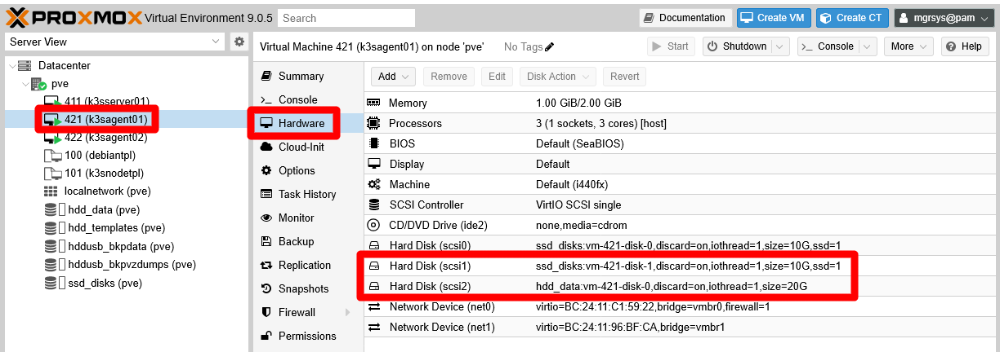

# G034 - Deploying services 03 ~ Forgejo - Part 1 - Outlining setup and arranging storage

- [Deploy Forgejo like you deployed Ghost](#deploy-forgejo-like-you-deployed-ghost)
- [Outlining Forgejo's setup](#outlining-forgejos-setup)
  - [Choosing the K3s agent](#choosing-the-k3s-agent)
- [Setting up new storage drives in the K3s agent](#setting-up-new-storage-drives-in-the-k3s-agent)
  - [Adding the new storage drives to the K3s agent node's VM](#adding-the-new-storage-drives-to-the-k3s-agent-nodes-vm)
  - [LVM storage set up](#lvm-storage-set-up)
  - [Formatting and mounting the new LVs](#formatting-and-mounting-the-new-lvs)
  - [Storage mount points for Forgejo containers](#storage-mount-points-for-forgejo-containers)
  - [About increasing the size of volumes](#about-increasing-the-size-of-volumes)
- [Relevant system paths](#relevant-system-paths)
  - [Folders in K3s agent node's VM](#folders-in-k3s-agent-nodes-vm)
  - [Files in K3s agent node's VM](#files-in-k3s-agent-nodes-vm)
- [References](#references)
  - [Forgejo](#forgejo)
  - [Git](#git)
- [Navigation](#navigation)

## Deploy Forgejo like you deployed Ghost

The next platform to deploy from the ones listed in the [chapter **G018**](G018%20-%20K3s%20cluster%20setup%2001%20~%20Requirements%20and%20arrangement.md#forgejo) is Forgejo. Forgejo is a Git-based control version system platform which, from a Kubernetes point of view, is like the Ghost platform you have deployed in the previous [chapter **G033**](G033%20-%20Deploying%20services%2002%20~%20Ghost%20-%20Part%201%20-%20Outlining%20setup%20and%20arranging%20storage.md). And what exactly makes Forgejo so similar to Ghost?

Both platforms share the need for a database, a storage space for their data and the capacity of using a cache system such as Valkey. Therefore, you can expect the Forgejo deployment in your Kubernetes cluster should mirrors Ghost's. In fact, the procedure is so similar that this Forgejo procedure will not repeat the same explanations already given in the Ghost guide, except for specific particularities.

## Outlining Forgejo's setup

As you did with Ghost, you must figure out first how to set up all the components to become part of your Forgejo setup:

- **Database**\
  PostgreSQL with its data saved in a local SSD storage drive.

- **Cache server**\
  Valkey instance configured to persist its database for faster startup in a local SSD storage drive.

- **Forgejo's application data folder**\
  Persistent volume prepared on a local SSD storage drive.

- **Forgejo users' repositories**\
  Persistent volume prepared on a local HDD storage drive.

- **Forgejo's [Git Large File Storage (LFS)](https://git-lfs.com/)**\
  Forgejo is able to use the LFS extensión of Git to handle large files like audios or videos. In this Forgejo setup, those files are going to be stored in the same persistent volume reserved for the users' repositories.

The whole Forgejo setup is going to run on the same K3s agent node, which will be also the one providing the persistent storage needed for the Forgejo components.

### Choosing the K3s agent

The K3s agent chosen in the previous [chapter **G033**](G033%20-%20Deploying%20services%2002%20~%20Ghost%20-%20Part%201%20-%20Outlining%20setup%20and%20arranging%20storage.md#choosing-the-k3s-agent-node-for-running-ghost) was the `k3sagent02` VM. To balance the workload in the cluster, better deploy Forgejo in the `k3sagent01` VM instead.

## Setting up new storage drives in the K3s agent

The first thing to setup is the storage, which has to be arranged in the the `k3sagent01` agent node in a very similar way as you did for the Ghost deployment:

- One virtual SSD drive containing three LVM volumes.
- One virtual HDD drive holding one LVM volume.

### Adding the new storage drives to the K3s agent node's VM

Go to the `Hardware` tab of your `k3sagent01` VM and add two _hard disks_ with the following characteristics:

- **SSD drive**: Storage `ssd_disks`, Discard `ENABLED`, Disk size `10 GiB`, SSD emulation `ENABLED`, IO thread `ENABLED`, rest of options left with their default values.

- **HDD drive**: Storage `hdd_data`, Discard `ENABLED`, Disk size `20 GiB`, SSD emulation `DISABLED`, IO thread `ENABLED`, rest of options left with their default values.

These new storage drives should appear as _Hard Disks_ in the `Hardware` list of the `k3sagent01` VM.

### LVM storage set up

Since the two new storage drives are already active in your `k3sagent01` VM, you can create the necessary LVM volumes in them:

1. Open a shell into your VM and check with `fdisk` the new drives:

    ~~~sh
    $ sudo fdisk -l
    Disk /dev/sda: 10 GiB, 10737418240 bytes, 20971520 sectors
    Disk model: QEMU HARDDISK
    Units: sectors of 1 * 512 = 512 bytes
    Sector size (logical/physical): 512 bytes / 512 bytes
    I/O size (minimum/optimal): 512 bytes / 512 bytes
    Disklabel type: dos
    Disk identifier: 0x5dc9a39f

    Device     Boot   Start      End  Sectors  Size Id Type
    /dev/sda1  *       2048  1556479  1554432  759M 83 Linux
    /dev/sda2       1558526 20969471 19410946  9.3G  f W95 Ext'd (LBA)
    /dev/sda5       1558528 20969471 19410944  9.3G 8e Linux LVM

    Disk /dev/mapper/k3snode--vg-root: 9.25 GiB, 9936306176 bytes, 19406848 sectors
    Units: sectors of 1 * 512 = 512 bytes
    Sector size (logical/physical): 512 bytes / 512 bytes
    I/O size (minimum/optimal): 512 bytes / 512 bytes

    Disk /dev/sdb: 10 GiB, 10737418240 bytes, 20971520 sectors
    Disk model: QEMU HARDDISK
    Units: sectors of 1 * 512 = 512 bytes
    Sector size (logical/physical): 512 bytes / 512 bytes
    I/O size (minimum/optimal): 512 bytes / 512 bytes

    Disk /dev/sdc: 20 GiB, 21474836480 bytes, 41943040 sectors
    Disk model: QEMU HARDDISK
    Units: sectors of 1 * 512 = 512 bytes
    Sector size (logical/physical): 512 bytes / 512 bytes
    I/O size (minimum/optimal): 512 bytes / 512 bytes
    ~~~

    The two new drives are the _disks_ named `/dev/sdb` and `/dev/sdc`.

2. Create a new GPT partition on each of the new storage drives with `sgdisk`:

    ~~~sh
    $ sudo sgdisk -N 1 /dev/sdb
    $ sudo sgdisk -N 1 /dev/sdc
    ~~~

3. Check with `fdisk` that now you have a new partition on each storage drive:

    ~~~sh
    $ sudo fdisk -l /dev/sdb /dev/sdc
    Disk /dev/sdb: 10 GiB, 10737418240 bytes, 20971520 sectors
    Disk model: QEMU HARDDISK
    Units: sectors of 1 * 512 = 512 bytes
    Sector size (logical/physical): 512 bytes / 512 bytes
    I/O size (minimum/optimal): 512 bytes / 512 bytes
    Disklabel type: gpt
    Disk identifier: 7A2C3D0A-F4E2-428B-A84B-B1EC39731206

    Device     Start      End  Sectors Size Type
    /dev/sdb1   2048 20971486 20969439  10G Linux filesystem

    Disk /dev/sdc: 20 GiB, 21474836480 bytes, 41943040 sectors
    Disk model: QEMU HARDDISK
    Units: sectors of 1 * 512 = 512 bytes
    Sector size (logical/physical): 512 bytes / 512 bytes
    I/O size (minimum/optimal): 512 bytes / 512 bytes
    Disklabel type: gpt
    Disk identifier: 72272E78-E280-4B3F-9F22-EC34DC3F92BE

    Device     Start      End  Sectors Size Type
    /dev/sdc1   2048 41943006 41940959  20G Linux filesystem
    ~~~

    Now you have the partitions `/dev/sdb1` and `/dev/sdc1` on their respective drives.

4. With `pvcreate`, make a new LVM physical volume with each partition:

    ~~~sh
    $ sudo pvcreate --metadatasize 10m -y -ff /dev/sdb1
    $ sudo pvcreate --metadatasize 20m -y -ff /dev/sdc1
    ~~~

    For the metadata size, remember that this guide uses the rule of thumb of allocating 1 MiB per 1 GiB present in the PV.

    Check with `pvs` that the PVs have been created:

    ~~~sh
    $ sudo pvs
      PV         VG         Fmt  Attr PSize   PFree
      /dev/sda5  k3snode-vg lvm2 a--    9.25g      0
      /dev/sdb1             lvm2 ---  <10.00g <10.00g
      /dev/sdc1             lvm2 ---  <20.00g <20.00g
    ~~~

5. Next, assign a volume group to each PV, being aware of the following:

    - The two drives are running on different storage hardware, so you must clearly differentiate their storage space.
    - Forgejo's cache and database data will be stored in `/dev/sdb1`, on the SSD drive.
    - Forgejo's application data files will be also stored in `/dev/sdb1`, on the SSD drive.
    - Forgejo's users git repositories and Git LFS will be kept in `/dev/sdc1`, on the HDD drive.

    Knowing that, create two volume groups with `vgcreate`:

    ~~~sh
    $ sudo vgcreate forgejo-ssd /dev/sdb1
    $ sudo vgcreate forgejo-hdd /dev/sdc1
    ~~~

    With `pvs` check that each PV is assigned to their corresponding VG:

    ~~~sh
    $ sudo pvs
      PV         VG          Fmt  Attr PSize   PFree
      /dev/sda5  k3snode-vg  lvm2 a--    9.25g      0
      /dev/sdb1  forgejo-ssd lvm2 a--    9.98g   9.98g
      /dev/sdc1  forgejo-hdd lvm2 a--  <19.98g <19.98g
    ~~~

    Also check with `vgs` the current status of the VGs:

    ~~~sh
    $ sudo vgs
      VG          #PV #LV #SN Attr   VSize   VFree
      forgejo-hdd   1   0   0 wz--n- <19.98g <19.98g
      forgejo-ssd   1   0   0 wz--n-   9.98g   9.98g
      k3snode-vg    1   1   0 wz--n-   9.25g      0
    ~~~

6. Create the required light volumes on each VG with `lvcreate`. Remember the purpose of each LV and give them meaningful names:

    ~~~sh
    $ sudo lvcreate -l 30%FREE -n cache forgejo-ssd
    $ sudo lvcreate -l 70%FREE -n db forgejo-ssd
    $ sudo lvcreate -l 100%FREE -n data forgejo-ssd
    $ sudo lvcreate -l 100%FREE -n git forgejo-hdd
    ~~~

    > [!IMPORTANT]
    > **Remember what the `%FREE` percentage in the `lvcreate` command means**\
    > The `%FREE` number indicates the percentage the `lvcreate` command takes from what is currently free (unassigned) in the volume group to create the light volume.
    >
    > In the shell snippet above:
    >
    > - The first `lvcreate` command takes 30% of the 10GiB available in the `forgejo-ssd` VG at that moment.
    > - The second `lvcreate` command takes the 70% (about 5GiB) of the approximately 7GiB remaining in the `forgejo-ssd` VG.
    > - The third `lvcreate` command uses all the remaining (100%) free space left (about 2GiB) in the `forgejo-ssd` VG.
    > - The last `lvcreate` command takes up all the free space available in the `forgejo-hdd` VG.

    Check with `lvs` the new LVs in your VM:

    ~~~sh
    $ sudo lvs
      LV    VG          Attr       LSize   Pool Origin Data%  Meta%  Move Log Cpy%Sync Convert
      git   forgejo-hdd -wi-a----- <19.98g
      cache forgejo-ssd -wi-a-----   2.99g
      data  forgejo-ssd -wi-a-----  <2.10g
      db    forgejo-ssd -wi-a-----   4.89g
      root  k3snode-vg  -wi-ao----   9.25g
    ~~~

    Also verify with `vgs` that there is no free space left in any of the VGs:

    ~~~sh
    $ sudo vgs
      VG          #PV #LV #SN Attr   VSize   VFree
      forgejo-hdd   1   1   0 wz--n- <19.98g    0
      forgejo-ssd   1   3   0 wz--n-   9.98g    0
      k3snode-vg    1   1   0 wz--n-   9.25g    0
    ~~~

### Formatting and mounting the new LVs

The new light volumes have to be formatted as ext4 filesystems and mounted:

1. Get the LVs `/dev/mapper` paths with `fdisk` and `grep`:

    ~~~sh
    $ sudo fdisk -l | grep forgejo
    Disk /dev/mapper/forgejo--ssd-cache: 2.99 GiB, 3212836864 bytes, 6275072 sectors
    Disk /dev/mapper/forgejo--ssd-db: 4.89 GiB, 5255462912 bytes, 10264576 sectors
    Disk /dev/mapper/forgejo--ssd-data: 2.1 GiB, 2252341248 bytes, 4399104 sectors
    Disk /dev/mapper/forgejo--hdd-git: 19.98 GiB, 21449670656 bytes, 41893888 sectors
    ~~~

2. Execute the `mkfs.ext4` command on each of the `/dev/mapper/forgejo` paths:

    ~~~sh
    $ sudo mkfs.ext4 /dev/mapper/forgejo--ssd-cache
    $ sudo mkfs.ext4 /dev/mapper/forgejo--ssd-db
    $ sudo mkfs.ext4 /dev/mapper/forgejo--ssd-data
    $ sudo mkfs.ext4 /dev/mapper/forgejo--hdd-git
    ~~~

3. Create a folder tree to mount the LVs in under the `/mnt` path:

    ~~~sh
    $ sudo mkdir -p /mnt/forgejo-ssd/{cache,db,data} /mnt/forgejo-hdd/git
    ~~~

    Check the directory structure with `tree`:

    ~~~sh
    $ tree -F /mnt
    /mnt/
    ├── forgejo-hdd/
    │   └── git/
    └── forgejo-ssd/
        ├── cache/
        ├── data/
        └── db/

    7 directories, 0 files
    ~~~

4. Mount the LVs in their corresponding mount points:

    ~~~sh
    $ sudo mount /dev/mapper/forgejo--ssd-cache /mnt/forgejo-ssd/cache
    $ sudo mount /dev/mapper/forgejo--ssd-db /mnt/forgejo-ssd/db
    $ sudo mount /dev/mapper/forgejo--ssd-data /mnt/forgejo-ssd/data
    $ sudo mount /dev/mapper/forgejo--hdd-git /mnt/forgejo-hdd/git
    ~~~

    Check with `df` that they have been mounted correctly, appearing at the command output's bottom:

    ~~~sh
    $ df -h
    Filesystem                      Size  Used Avail Use% Mounted on
    udev                            965M     0  965M   0% /dev
    tmpfs                           198M  1.3M  197M   1% /run
    /dev/mapper/k3snode--vg-root    9.1G  6.8G  1.8G  80% /
    tmpfs                           987M     0  987M   0% /dev/shm
    tmpfs                           5.0M     0  5.0M   0% /run/lock
    tmpfs                           987M     0  987M   0% /tmp
    tmpfs                           1.0M     0  1.0M   0% /run/credentials/systemd-journald.service
    /dev/sda1                       730M  111M  567M  17% /boot
    tmpfs                           1.0M     0  1.0M   0% /run/credentials/getty@tty1.service
    shm                              64M     0   64M   0% /run/k3s/containerd/io.containerd.grpc.v1.cri/sandboxes/b8fbd6c304ba2e7a560a84c37c5aae85ca064291434941c2b2a5059a2cbd798a/shm
    shm                              64M     0   64M   0% /run/k3s/containerd/io.containerd.grpc.v1.cri/sandboxes/c38a99510ae6dfc3c1637ca801c7a97ce5d2667d6cc4c2cc916f0580b9d13952/shm
    shm                              64M     0   64M   0% /run/k3s/containerd/io.containerd.grpc.v1.cri/sandboxes/7cd707481d7a27d2b747eaeec00ab0de1d895bceda06ec89730dbff9c1264a89/shm
    shm                              64M     0   64M   0% /run/k3s/containerd/io.containerd.grpc.v1.cri/sandboxes/d0a34b9060d8f54a749c2533a116afdcc91392287f121d155e0d248d0ea1a60c/shm
    tmpfs                           185M  8.0K  185M   1% /run/user/1000
    /dev/mapper/forgejo--ssd-cache  2.9G  788K  2.8G   1% /mnt/forgejo-ssd/cache
    /dev/mapper/forgejo--ssd-db     4.8G  1.3M  4.5G   1% /mnt/forgejo-ssd/db
    /dev/mapper/forgejo--ssd-data   2.0G  560K  1.9G   1% /mnt/forgejo-ssd/data
    /dev/mapper/forgejo--hdd-git     20G  2.1M   19G   1% /mnt/forgejo-hdd/git
    ~~~

5. Make those mountings permanent, by adding them to the VM's  `/etc/fstab` file. First, backup the file:

    ~~~sh
    $ sudo cp /etc/fstab /etc/fstab.bkp
    ~~~

    Then **append** the following lines to the `fstab` file:

    ~~~sh
    # Forgejo volumes
    /dev/mapper/forgejo--ssd-cache /mnt/forgejo-ssd/cache ext4 defaults,nofail 0 0
    /dev/mapper/forgejo--ssd-db /mnt/forgejo-ssd/db ext4 defaults,nofail 0 0
    /dev/mapper/forgejo--ssd-data /mnt/forgejo-ssd/data ext4 defaults,nofail 0 0
    /dev/mapper/forgejo--hdd-git /mnt/forgejo-hdd/git ext4 defaults,nofail 0 0
    ~~~

### Storage mount points for Forgejo containers

With the LVs mounted, you can create within them the `k3smnt` folders that will act as mounting points for the Forgejo containers' persistent volumes:

1. Use the following `mkdir` command to create a `k3smnt` folder within each Forgejo storage volume:

    ~~~sh
    $ sudo mkdir /mnt/{forgejo-ssd/cache,forgejo-ssd/db,forgejo-ssd/data,forgejo-hdd/git}/k3smnt
    ~~~

2. Check with `tree` that the folders have been created where they should:

    ~~~sh
    $ tree -F /mnt
    /mnt/
    ├── forgejo-hdd/
    │   └── git/
    │       ├── k3smnt/
    │       └── lost+found/  [error opening dir]
    └── forgejo-ssd/
        ├── cache/
        │   ├── k3smnt/
        │   └── lost+found/  [error opening dir]
        ├── data/
        │   ├── k3smnt/
        │   └── lost+found/  [error opening dir]
        └── db/
            ├── k3smnt/
            └── lost+found/  [error opening dir]

    15 directories, 0 files
    ~~~

    Ignore the `lost+found` folders, they are created by the system automatically.

> [!WARNING]
> **The `k3smnt` folders exist within the already mounted LVM storage volumes!**\
> You cannot create those folders without mounting the light volumes first.

### About increasing the size of volumes

If, after a time using and filling up these volumes, you need to increase their size, take a look to the [appendix chapter **G907**](G907%20-%20Appendix%2007%20~%20Resizing%20a%20root%20LVM%20volume.md). It shows you how to extend a partition and the LVM filesystem within it, although in that case it is done on a LV volume that happens to be also the root filesystem of a VM.

## Relevant system paths

### Folders in K3s agent node's VM

- `/etc`
- `/mnt`
- `/mnt/forgejo-hdd`
- `/mnt/forgejo-hdd/git/`
- `/mnt/forgejo-hdd/git/k3smnt`
- `/mnt/forgejo-ssd`
- `/mnt/forgejo-ssd/cache/`
- `/mnt/forgejo-ssd/cache/k3smnt`
- `/mnt/forgejo-ssd/data/`
- `/mnt/forgejo-ssd/data/k3smnt`
- `/mnt/forgejo-ssd/db`
- `/mnt/forgejo-ssd/db/k3smnt`

### Files in K3s agent node's VM

- `/dev/mapper/forgejo--hdd-git`
- `/dev/mapper/forgejo--ssd-cache`
- `/dev/mapper/forgejo--ssd-data`
- `/dev/mapper/forgejo--ssd-db`
- `/dev/sdb`
- `/dev/sdb1`
- `/dev/sdc`
- `/dev/sdc1`
- `/etc/fstab`
- `/etc/fstab.bkp`

## References

### [Forgejo](https://forgejo.org/)

- [Forgejo Administration Guide](https://forgejo.org/docs/latest/admin/)

### [Git](https://git-scm.com/)

- [Git Large File Storage](https://git-lfs.com/)

## Navigation

[<< Previous (**G033. Deploying services 02. Ghost Part 5**)](G033%20-%20Deploying%20services%2002%20~%20Ghost%20-%20Part%205%20-%20Complete%20Ghost%20platform.md) | [+Table Of Contents+](G000%20-%20Table%20Of%20Contents.md) | [Next (**G034. Deploying services 03. Forgejo Part 2**) >>](G034%20-%20Deploying%20services%2003%20~%20Forgejo%20-%20Part%202%20-%20Valkey%20cache%20server.md)
