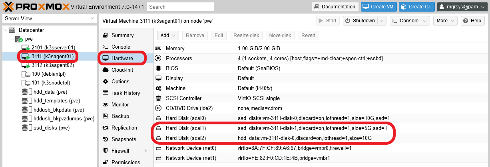

# G034 - Deploying services 03 ~ Gitea - Part 1 - Outlining setup and arranging storage

The next platform to deploy from the ones listed in the [**G018** guide](G018%20-%20K3s%20cluster%20setup%2001%20~%20Requirements%20and%20arrangement.md#gitea) is Gitea. Gitea is a Git-based control version system platform which, from a Kubernetes point of view, is like the Nextcloud platform you've deployed in the previous [**G033** guide](G033%20-%20Deploying%20services%2002%20~%20Nextcloud%20-%20Part%201%20-%20Outlining%20setup,%20arranging%20storage%20and%20choosing%20service%20IPs.md). And what exactly makes Gitea similar to Nextcloud?

Both platforms share the need for a database, a storage for user data and the capacity of using a cache system such as Redis. Therefore, you can expect that Gitea's deployment in your Kubernetes cluster should almost mirror Nextcloud's. In fact, the procedure is so similar that I won't repeat in this Gitea guide the same explanations I already gave in the Nextcloud guide, beyond some configuration particularities.

## Outlining Gitea's setup

As you did with Nextcloud, let's figure out first how to set up all Gitea's main components.

- Database: PostgreSQL with its data saved in a local SSD storage drive.
- Cache server: Redis instance configured to be just an in-memory cache.
- Gitea's application data folder: persistent volume prepared on a local SSD storage drive.
- Gitea users' repositories: persistent volume prepared on a local HDD storage drive.
- Using kubernetes affinity rules, all the Gitea-related services are deployed in pods running in the same K3s agent node. This implies that the persistent volumes must be also available in the same K3s node.

### _Choosing the K3s agent_

In the previous [Nextcloud **G033** guide](G033%20-%20Deploying%20services%2002%20~%20Nextcloud%20-%20Part%201%20-%20Outlining%20setup,%20arranging%20storage%20and%20choosing%20service%20IPs.md#choosing-the-k3s-agent) I used the `k3sagent02` node, so here I'll use the `k3sagent01` VM for Gitea instead.

## Setting up new storage drives in the K3s agent

The first thing to setup is the storage, which will be arranged in the same way as you did for Nextcloud: one virtual SSD drive with two volumes inside, one virtual HDD drive with just one volume inside.

### _Adding the new storage drives to the K3s agent node's VM_

At this point you know how to add a new virtual storage drive to a VM. So, go to the `Hardware` tab of your `k3sagent01` VM and add two _hard disks_ with the following characteristics:

- **SSD drive**: storage `ssd_disks`, Discard `ENABLED`, disk size `5 GiB`, SSD emulation `ENABLED`, IO thread `ENABLED`.

- **HDD drive**: storage `hdd_data`, Discard `ENABLED`, disk size `10 GiB`, SSD emulation `DISABLED`, IO thread `ENABLED`.

These new storage drives should appear as _Hard Disks_ in the `Hardware` list of the `k3sagent01` VM.

### _LVM storage set up_

The two new storage drives are already active in your `k3sagent01` VM, so you can create the necessary LVM volumes in them.

1. Open a shell into your VM and check with `fdisk` the new drives.

    ~~~bash
    $ sudo fdisk -l

    Disk /dev/sda: 10 GiB, 10737418240 bytes, 20971520 sectors
    Disk model: QEMU HARDDISK
    Units: sectors of 1 * 512 = 512 bytes
    Sector size (logical/physical): 512 bytes / 512 bytes
    I/O size (minimum/optimal): 512 bytes / 512 bytes
    Disklabel type: dos
    Disk identifier: 0x76bd2712

    Device     Boot   Start      End  Sectors  Size Id Type
    /dev/sda1  *       2048   999423   997376  487M 83 Linux
    /dev/sda2       1001470 20969471 19968002  9.5G  5 Extended
    /dev/sda5       1001472 20969471 19968000  9.5G 8e Linux LVM

    Disk /dev/mapper/k3snode--vg-root: 9.52 GiB, 10221518848 bytes, 19963904 sectors
    Units: sectors of 1 * 512 = 512 bytes
    Sector size (logical/physical): 512 bytes / 512 bytes
    I/O size (minimum/optimal): 512 bytes / 512 bytes

    Disk /dev/sdb: 5 GiB, 5368709120 bytes, 10485760 sectors
    Disk model: QEMU HARDDISK
    Units: sectors of 1 * 512 = 512 bytes
    Sector size (logical/physical): 512 bytes / 512 bytes
    I/O size (minimum/optimal): 512 bytes / 512 bytes

    Disk /dev/sdc: 10 GiB, 10737418240 bytes, 20971520 sectors
    Disk model: QEMU HARDDISK
    Units: sectors of 1 * 512 = 512 bytes
    Sector size (logical/physical): 512 bytes / 512 bytes
    I/O size (minimum/optimal): 512 bytes / 512 bytes
    ~~~

    The two new drives are the _disks_ named `/dev/sdb` and `/dev/sdc`.

2. Create a new GPT partition on each of the new storage drives with `sgdisk`.

    ~~~bash
    $ sudo sgdisk -N 1 /dev/sdb
    $ sudo sgdisk -N 1 /dev/sdc
    ~~~

    You might see the following warning when executing the `sgdisk` commands.

    ~~~bash
    Warning: Partition table header claims that the size of partition table
    entries is 0 bytes, but this program  supports only 128-byte entries.
    Adjusting accordingly, but partition table may be garbage.
    ~~~

    Don't worry about it, the partitions will work fine. This warning may be some odd consequence due to the drives' virtual nature.

3. Check with `fdisk` that now you have a new partition on each storage drive.

    ~~~bash
    $ sudo fdisk -l /dev/sdb /dev/sdc
    Disk /dev/sdb: 5 GiB, 5368709120 bytes, 10485760 sectors
    Disk model: QEMU HARDDISK
    Units: sectors of 1 * 512 = 512 bytes
    Sector size (logical/physical): 512 bytes / 512 bytes
    I/O size (minimum/optimal): 512 bytes / 512 bytes
    Disklabel type: gpt
    Disk identifier: F772DD27-B7B4-4966-B001-3BD24D128A6A

    Device     Start      End  Sectors Size Type
    /dev/sdb1   2048 10485726 10483679   5G Linux filesystem

    Disk /dev/sdc: 10 GiB, 10737418240 bytes, 20971520 sectors
    Disk model: QEMU HARDDISK
    Units: sectors of 1 * 512 = 512 bytes
    Sector size (logical/physical): 512 bytes / 512 bytes
    I/O size (minimum/optimal): 512 bytes / 512 bytes
    Disklabel type: gpt
    Disk identifier: 1BB9DE18-C3C2-4C17-B12C-0C7F0A489360

    Device     Start      End  Sectors Size Type
    /dev/sdc1   2048 20971486 20969439  10G Linux filesystem
    ~~~

    Now you got the partitions `/dev/sdb1` and `/dev/sdc1` on their respective drives.

4. With `pvcreate`, make a new LVM physical volume with each partition.

    ~~~bash
    $ sudo pvcreate --metadatasize 5m -y -ff /dev/sdb1
    $ sudo pvcreate --metadatasize 10m -y -ff /dev/sdc1
    ~~~

    For the metadata size remember that I use the rule of thumb of allocating 1 MiB per 1 GiB present in the PV.

    Check with `pvs` that the PVs have been created.

    ~~~bash
    $ sudo pvs
      PV         VG         Fmt  Attr PSize   PFree
      /dev/sda5  k3snode-vg lvm2 a--   <9.52g      0
      /dev/sdb1             lvm2 ---   <5.00g  <5.00g
      /dev/sdc1             lvm2 ---  <10.00g <10.00g
    ~~~

5. Next, assign a volume group to each PV, being aware of the following.

    - The two drives are running on different storage hardware, so you must clearly differentiate their storage space.
    - Gitea's database data will be stored in `/dev/sdb1`, on the SSD drive.
    - Gitea's application data files will be also stored in `/dev/sdb1`, on the SSD drive.
    - Gitea's users git repositories will be kept in `/dev/sdc1`, on the HDD drive.

    Knowing that, create two volume groups with `vgcreate`.

    ~~~bash
    $ sudo vgcreate gitea-ssd /dev/sdb1
    $ sudo vgcreate gitea-hdd /dev/sdc1
    ~~~

    With `pvs` check that each PV is assigned to their corresponding VG.

    ~~~bash
    $ sudo pvs
      PV         VG         Fmt  Attr PSize  PFree
      /dev/sda5  k3snode-vg lvm2 a--  <9.52g    0
      /dev/sdb1  gitea-ssd  lvm2 a--   4.99g 4.99g
      /dev/sdc1  gitea-hdd  lvm2 a--   9.98g 9.98g
    ~~~

    Also check with `vgs` the current status of the VGs.

    ~~~bash
    $ sudo vgs
      VG         #PV #LV #SN Attr   VSize  VFree
      gitea-hdd    1   0   0 wz--n-  9.98g 9.98g
      gitea-ssd    1   0   0 wz--n-  4.99g 4.99g
      k3snode-vg   1   1   0 wz--n- <9.52g    0
    ~~~

6. Create the required light volumes on each VG with `lvcreate`. Remember the purpose of each LV and give them meaningful names.

    ~~~bash
    $ sudo lvcreate -l 75%FREE -n gitea-db gitea-ssd
    $ sudo lvcreate -l 100%FREE -n gitea-data gitea-ssd
    $ sudo lvcreate -l 100%FREE -n gitea-repos gitea-hdd
    ~~~

    Check with `lvs` the new LVs in your VM.

    ~~~bash
    $ sudo lvs
      LV          VG         Attr       LSize  Pool Origin Data%  Meta%  Move Log Cpy%Sync Convert
      gitea-repos gitea-hdd  -wi-a-----  9.98g
      gitea-data  gitea-ssd  -wi-a-----  1.25g
      gitea-db    gitea-ssd  -wi-a-----  3.74g
      root        k3snode-vg -wi-ao---- <9.52g
    ~~~

    Also verify with `vgs` that there's no free space left in any of the VGs.

    ~~~bash
    $ sudo vgs
      VG         #PV #LV #SN Attr   VSize  VFree
      gitea-hdd    1   1   0 wz--n-  9.98g    0
      gitea-ssd    1   2   0 wz--n-  4.99g    0
      k3snode-vg   1   1   0 wz--n- <9.52g    0
    ~~~

### _Formatting and mounting the new LVs_

The new light volumes have to be formatted as ext4 filesystems and mounted.

1. Get the LVs `/dev/mapper` paths with `fdisk` and `grep`.

    ~~~bash
    $ sudo fdisk -l | grep gitea
    Disk /dev/mapper/gitea--ssd-gitea--db: 3.74 GiB, 4018143232 bytes, 7847936 sectors
    Disk /dev/mapper/gitea--ssd-gitea--data: 1.25 GiB, 1342177280 bytes, 2621440 sectors
    Disk /dev/mapper/gitea--hdd-gitea--repos: 9.98 GiB, 10720641024 bytes, 20938752 sectors
    ~~~

2. Execute the `mkfs.ext4` command on each of the `/dev/mapper/gitea` paths.

    ~~~bash
    $ sudo mkfs.ext4 /dev/mapper/gitea--ssd-gitea--db
    $ sudo mkfs.ext4 /dev/mapper/gitea--ssd-gitea--data
    $ sudo mkfs.ext4 /dev/mapper/gitea--hdd-gitea--repos
    ~~~

3. Create a folder tree to mount the LVs in under the `/mnt` path.

    ~~~bash
    $ sudo mkdir -p /mnt/gitea-ssd/{db,data} /mnt/gitea-hdd/repos
    ~~~

    Check the directories with `tree`.

    ~~~bash
    $ tree -F /mnt/
    /mnt/
    ├── gitea-hdd/
    │   └── repos/
    └── gitea-ssd/
        ├── data/
        └── db/

    5 directories, 0 files
    ~~~

4. Mount the LVs in their corresponding mount points.

    ~~~bash
    $ sudo mount /dev/mapper/gitea--ssd-gitea--db /mnt/gitea-ssd/db
    $ sudo mount /dev/mapper/gitea--ssd-gitea--data /mnt/gitea-ssd/data
    $ sudo mount /dev/mapper/gitea--hdd-gitea--repos /mnt/gitea-hdd/repos
    ~~~

    Check with `df` that they've been mounted correctly, appearing at the command output's bottom.

    ~~~bash
    $ df -h
    Filesystem                           Size  Used Avail Use% Mounted on
    udev                                 974M     0  974M   0% /dev
    tmpfs                                199M  1.2M  198M   1% /run
    /dev/mapper/k3snode--vg-root         9.3G  2.7G  6.2G  30% /
    tmpfs                                992M     0  992M   0% /dev/shm
    tmpfs                                5.0M     0  5.0M   0% /run/lock
    /dev/sda1                            470M   48M  398M  11% /boot
    shm                                   64M     0   64M   0% /run/k3s/containerd/io.containerd.grpc.v1.cri/sandboxes/20feacae6e9a32ec7a1766cb97500fef303357e372cedf98ffcdac90102fa970/shm
    shm                                   64M     0   64M   0% /run/k3s/containerd/io.containerd.grpc.v1.cri/sandboxes/1001fbc207ffa0c129ffadc8830452945354506d8fcd47e93535ca1c036c4f5a/shm
    shm                                   64M     0   64M   0% /run/k3s/containerd/io.containerd.grpc.v1.cri/sandboxes/3d428313b4e70a9d607498878b4e92b8e03c9cf3597141db4d345a9e46929e8c/shm
    shm                                   64M     0   64M   0% /run/k3s/containerd/io.containerd.grpc.v1.cri/sandboxes/b5e0da33c3a76eabfe776951939deb520e45f3d4e80905b18f67c9edaf44a077/shm
    shm                                   64M     0   64M   0% /run/k3s/containerd/io.containerd.grpc.v1.cri/sandboxes/fa50d14df8b0e3624d9ea4a83a24b04f5b0888c7fcfabd820d399c18f401dc04/shm
    shm                                   64M     0   64M   0% /run/k3s/containerd/io.containerd.grpc.v1.cri/sandboxes/3e2680cd5c3e80f99bbd2386241e53fedf4b71552f9f4db289ed4aa31b5f4e32/shm
    shm                                   64M     0   64M   0% /run/k3s/containerd/io.containerd.grpc.v1.cri/sandboxes/74b4c1150f81e3004ebbdb03ea02a296aa72d4528bb593381e559879cf73dc1e/shm
    tmpfs                                160M     0  160M   0% /run/user/1000
    /dev/mapper/gitea--ssd-gitea--db     3.7G   24K  3.5G   1% /mnt/gitea-ssd/db
    /dev/mapper/gitea--ssd-gitea--data   1.2G   24K  1.2G   1% /mnt/gitea-ssd/data
    /dev/mapper/gitea--hdd-gitea--repos  9.8G   24K  9.3G   1% /mnt/gitea-hdd/repos
    ~~~

5. Make those mountings permanent, by adding them to the VM's  `/etc/fstab` file. First, backup the file.

    ~~~bash
    $ sudo cp /etc/fstab /etc/fstab.bkp
    ~~~

    Then **append** the following lines to the `fstab` file.

    ~~~bash
    # Gitea volumes
    /dev/mapper/gitea--ssd-gitea--db /mnt/gitea-ssd/db ext4 defaults,nofail 0 0
    /dev/mapper/gitea--ssd-gitea--data /mnt/gitea-ssd/data ext4 defaults,nofail 0 0
    /dev/mapper/gitea--hdd-gitea--repos /mnt/gitea-hdd/repos ext4 defaults,nofail 0 0
    ~~~

### _Storage mount points for Nextcloud containers_

With the LVs mounted, you can create within them the `k3smnt` folders that will act as mounting points for the Gitea containers' persistent volumes.

1. Use the following `mkdir` command to create a `k3smnt` folder within each Gitea storage volume.

    ~~~bash
    $ sudo mkdir /mnt/{gitea-ssd/db,gitea-ssd/data,gitea-hdd/repos}/k3smnt
    ~~~

2. Check with `tree` that the folders have been created where they should.

    ~~~bash
    $ tree -F /mnt/
    /mnt/
    ├── gitea-hdd/
    │   └── repos/
    │       ├── k3smnt/
    │       └── lost+found/ [error opening dir]
    └── gitea-ssd/
        ├── data/
        │   ├── k3smnt/
        │   └── lost+found/ [error opening dir]
        └── db/
            ├── k3smnt/
            └── lost+found/ [error opening dir]

    11 directories, 0 files
    ~~~

    Don't mind the `lost+found` folders, they are created by the system automatically.

> **BEWARE!**  
> Realize that the `k3smnt` folders are **within** the already mounted LVM storage volumes, meaning that you cannot create them without mounting the light volumes first.

### _About increasing the size of volumes_

If, after a time using and filling up these volumes, you need to increase their size, take a look to the [**G907** appendix guide](G907%20-%20Appendix%2007%20~%20Resizing%20a%20root%20LVM%20volume.md). It shows you how to extend a partition and the LVM filesystem within it, although in that case it works on a LV volume that happens to be also the root filesystem of a VM.

## FQDNs for Gitea related services

You'll use three main services with Gitea, and you need to know how to reach them from other pods. You already saw one way of doing this [in the Nextcloud guide](G033%20-%20Deploying%20services%2002%20~%20Nextcloud%20-%20Part%201%20-%20Outlining%20setup,%20arranging%20storage%20and%20choosing%20service%20IPs.md#choosing-static-cluster-ips-for-nextcloud-related-services), where you assigned particular internal cluster IPs for the Nextcloud's services. For your Gitea platform's services, you'll use their FQDNs (or DNS records) to reach them.

Your K3s cluster has DNS functionality provided by a [CoreDNS](https://coredns.io/) server, which resolves the FQDNs of services and pods to their internal IPs when required. To take advantage of this feature and being able of invoking services by their FQDNs, you don't really need to do anything special. For the `Service` resources you'll configure in this guide, you just need to be aware of what's the string format used to automatically build their DNS records, which is shown below.

~~~html
<metadata.name>.<namespace>.svc.<internal.cluster.domain>
~~~

On each part of this guide, I'll show you which are the FQDNs for each service. On the other hand, I'd recommend you to learn more about [how DNS works in Kubernetes](https://kubernetes.io/docs/concepts/services-networking/dns-pod-service/).

## Relevant system paths

### _Folders in K3s agent node's VM_

- `/etc`
- `/mnt`
- `/mnt/gitea-hdd`
- `/mnt/gitea-hdd/repos/`
- `/mnt/gitea-hdd/repos/k3smnt`
- `/mnt/gitea-ssd`
- `/mnt/gitea-ssd/data/`
- `/mnt/gitea-ssd/data/k3smnt`
- `/mnt/gitea-ssd/db`
- `/mnt/gitea-ssd/db/k3smnt`

### _Files in K3s agent node's VM_

- `/dev/mapper/gitea--ssd-gitea--data`
- `/dev/mapper/gitea--ssd-gitea--db`
- `/dev/mapper/gitea--hdd-gitea--repos`
- `/dev/sdb`
- `/dev/sdb1`
- `/dev/sdc`
- `/dev/sdc1`
- `/etc/fstab`
- `/etc/fstab.bkp`

## References

### _Kubernetes_

- [DNS for Services and Pods](https://kubernetes.io/docs/concepts/services-networking/dns-pod-service/)

### _CoreDNS_

- [CoreDNS official site](https://coredns.io/)
