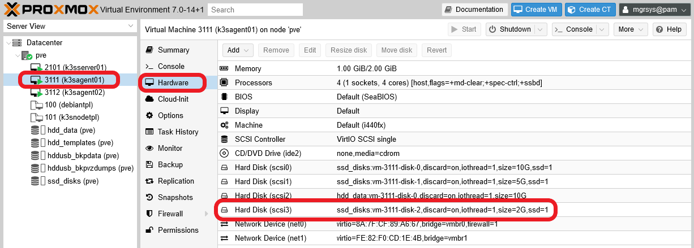
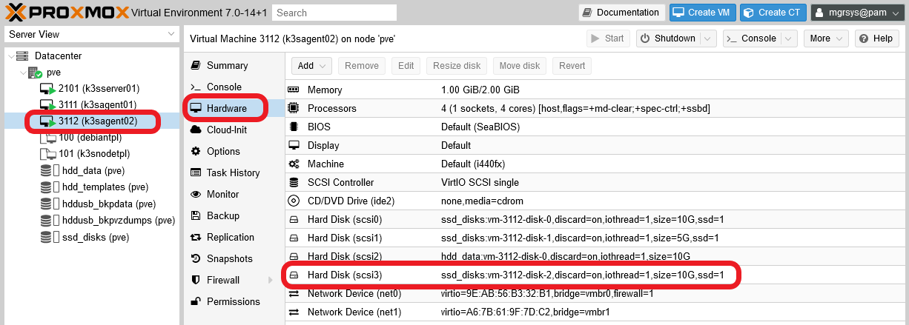

# G035 - Deploying services 04 ~ Monitoring stack - Part 1 - Outlining setup and arranging storage

The last thing you'll deploy in this guide series is a stack of services to monitor your K3s Kubernetes cluster.

## Outlining your monitoring stack setup

The very first thing to do is identifying which are going to be the components of your monitoring stack. In this guide, those components will be the following ones.

- **Prometheus**: open-source monitoring framework ready for Kubernetes. Consider this component the core of your monitoring stack, on which all the other ones you'll deploy in this guide will be centred around.

- **Kube State Metrics**: service that provides details from all the Kubernetes API objects present in a Kubernetes cluster, but that are not accessible through the native Kubernetes monitoring components. In other words, is an agent that gets cluster-level metrics and exposes them in a Prometheus-compatible `/metrics` endpoint.
    > **BEWARE!**  
    > Don't confuse the **Kube State Metrics** service with the `metrics-server` you deployed in the [**G028** guide](G028%20-%20K3s%20cluster%20setup%2011%20~%20Deploying%20the%20metrics-server%20service.md). The `metrics-server` service neither gets the same metrics nor exposes them through an endpoint reachable by Prometheus.

- **Prometheus Node Exporter**: agent that captures and exposes Linux-related system-level metrics from the nodes of a Kubernetes cluster like yours.

- **Grafana**: lightweight dashboard tool that can work with Prometheus, among many other data sources. It can also execute queries in the Prometheus query language (PromQL) on a given Prometheus server.

From all those components listed above, you need to determine which ones will require some storage space.

- **Prometheus**: since it will act as a data source for metrics, it'll need some storage where to retain, temporarily, the metrics it scrapes from your K3s cluster.
- **Grafana**: requires a small storage for configuration and user management purposes.

As you see, you'll need to create two different storage volumes, one per each service that can store data.

### _Choosing the K3s agent_

To balance things out, you'll want to run Prometheus in one of your agents and Grafana in the remaining one. To do this, you'll use again the affinity rules applied to persistent volumes you've seen before. By using that trick, in this guide you'll make Grafana run in the `k3sagent01` node and Prometheus in the `k3sagent02` node.

## Setting up new storage drives in the K3s agents

You need to create three different storage volumes, two on the `k3sagent01` node and one on the `k3sagent02` node. The procedure in both cases will be essentially the same as you did for [Nextcloud](G033%20-%20Deploying%20services%2002%20~%20Nextcloud%20-%20Part%201%20-%20Outlining%20setup,%20arranging%20storage%20and%20choosing%20service%20IPs.md#setting-up-new-storage-drives-in-the-k3s-agent) or [Gitea](G034%20-%20Deploying%20services%2003%20~%20Gitea%20-%20Part%201%20-%20Outlining%20setup%20and%20arranging%20storage.md#setting-up-new-storage-drives-in-the-k3s-agent). For better performance, these three new storages will be SSD drives.

### _Adding a new storage drive to each K3s agent nodes' VM_

Get into your Proxmox VE web console and, in the `Hardware` tab of each K3s **agent** VM, add a _hard disk_ as follows.

#### **On `k3sagent01`**

Open the `Hardware` view of the `k3sagent01` node and add a _hard disk_ with the following specification.

- **SSD drive**: storage `ssd_disks`, Discard `ENABLED`, disk size `2 GiB`, SSD emulation `ENABLED`, IO thread `ENABLED`.

This new storage unit should appear in the `Hardware` list of the `k3sagent01` VM as in the capture next.

#### **On `k3sagent02`**

Get into the `Hardware` view of the `k3sagent02` node and add a _hard disk_ with the following specification.

- **SSD drive**: storage `ssd_disks`, Discard `ENABLED`, disk size `10 GiB`, SSD emulation `ENABLED`, IO thread `ENABLED`.

This new storage drive should be listed the `Hardware` view of the `k3sagent02` VM as shown below.

### _LVM storage set up_

You have created a new storage drive on each agent node VM, but you still need to enable them as LVM volumes before you can use them.

#### **On `k3sagent01`**

1. Get into your `k3sagent01` through a shell and see that the new 2 GiB SSD storage is there.

    ~~~bash
    $ sudo fdisk -l

    Disk /dev/sdb: 5 GiB, 5368709120 bytes, 10485760 sectors
    Disk model: QEMU HARDDISK
    Units: sectors of 1 * 512 = 512 bytes
    Sector size (logical/physical): 512 bytes / 512 bytes
    I/O size (minimum/optimal): 512 bytes / 512 bytes
    Disklabel type: gpt
    Disk identifier: F772DD27-B7B4-4966-B001-3BD24D128A6A

    Device     Start      End  Sectors Size Type
    /dev/sdb1   2048 10485726 10483679   5G Linux filesystem

    Disk /dev/sda: 10 GiB, 10737418240 bytes, 20971520 sectors
    Disk model: QEMU HARDDISK
    Units: sectors of 1 * 512 = 512 bytes
    Sector size (logical/physical): 512 bytes / 512 bytes
    I/O size (minimum/optimal): 512 bytes / 512 bytes
    Disklabel type: dos
    Disk identifier: 0x76bd2712

    Device     Boot   Start      End  Sectors  Size Id Type
    /dev/sda1  *       2048   999423   997376  487M 83 Linux
    /dev/sda2       1001470 20969471 19968002  9.5G  5 Extended
    /dev/sda5       1001472 20969471 19968000  9.5G 8e Linux LVM

    Disk /dev/sdc: 10 GiB, 10737418240 bytes, 20971520 sectors
    Disk model: QEMU HARDDISK
    Units: sectors of 1 * 512 = 512 bytes
    Sector size (logical/physical): 512 bytes / 512 bytes
    I/O size (minimum/optimal): 512 bytes / 512 bytes
    Disklabel type: gpt
    Disk identifier: 1BB9DE18-C3C2-4C17-B12C-0C7F0A489360

    Device     Start      End  Sectors Size Type
    /dev/sdc1   2048 20971486 20969439  10G Linux filesystem

    Disk /dev/mapper/gitea--ssd-gitea--db: 3.74 GiB, 4018143232 bytes, 7847936 sectors
    Units: sectors of 1 * 512 = 512 bytes
    Sector size (logical/physical): 512 bytes / 512 bytes
    I/O size (minimum/optimal): 512 bytes / 512 bytes

    Disk /dev/mapper/gitea--ssd-gitea--data: 1.25 GiB, 1342177280 bytes, 2621440 sectors
    Units: sectors of 1 * 512 = 512 bytes
    Sector size (logical/physical): 512 bytes / 512 bytes
    I/O size (minimum/optimal): 512 bytes / 512 bytes

    Disk /dev/mapper/gitea--hdd-gitea--repos: 9.98 GiB, 10720641024 bytes, 20938752 sectors
    Units: sectors of 1 * 512 = 512 bytes
    Sector size (logical/physical): 512 bytes / 512 bytes
    I/O size (minimum/optimal): 512 bytes / 512 bytes

    Disk /dev/mapper/k3snode--vg-root: 9.52 GiB, 10221518848 bytes, 19963904 sectors
    Units: sectors of 1 * 512 = 512 bytes
    Sector size (logical/physical): 512 bytes / 512 bytes
    I/O size (minimum/optimal): 512 bytes / 512 bytes

    Disk /dev/sdd: 2 GiB, 2147483648 bytes, 4194304 sectors
    Disk model: QEMU HARDDISK
    Units: sectors of 1 * 512 = 512 bytes
    Sector size (logical/physical): 512 bytes / 512 bytes
    I/O size (minimum/optimal): 512 bytes / 512 bytes
    ~~~

    Gitea was deployed in `k3sagent01`, so you'll also see the drives related to that platform. The new SSD drive is the `/dev/sdd` one, which shows up listed at the end of the output above.

2. Create a new GPT partition on the `/dev/sdd` drive with `sgdisk`.

    ~~~bash
    $ sudo sgdisk -N 1 /dev/sdd
    ~~~

    You might see the following warning when executing the `sgdisk` commands.

    ~~~bash
    Warning: Partition table header claims that the size of partition table
    entries is 0 bytes, but this program  supports only 128-byte entries.
    Adjusting accordingly, but partition table may be garbage.
    ~~~

    Don't worry about it, the partition will work fine. This warning may be some odd consequence due to the drives' virtual nature.

3. Verify with `fdisk` that your new partition appears in `/dev/sdd`.

    ~~~bash
    $ sudo fdisk -l /dev/sdd
    Disk /dev/sdd: 2 GiB, 2147483648 bytes, 4194304 sectors
    Disk model: QEMU HARDDISK
    Units: sectors of 1 * 512 = 512 bytes
    Sector size (logical/physical): 512 bytes / 512 bytes
    I/O size (minimum/optimal): 512 bytes / 512 bytes
    Disklabel type: gpt
    Disk identifier: 6422BDDD-CCC5-459F-AD26-2202FA047B88

    Device     Start     End Sectors Size Type
    /dev/sdd1   2048 4194270 4192223   2G Linux filesystem
    ~~~

    The new partition is a storage device named `/dev/sdd1`.

4. Use `pvcreate` to produce a new LVM physical volume in the `/dev/sdd1` partition.

    ~~~bash
    $ sudo pvcreate --metadatasize 2m -y -ff /dev/sdd1
    ~~~

    For the metadata size remember that I use the rule of thumb of allocating 1 MiB per 1 GiB present in the PV.

    With `pvs` see that your new PV exists.

    ~~~bash
    $ sudo pvs
      PV         VG         Fmt  Attr PSize  PFree
      /dev/sda5  k3snode-vg lvm2 a--  <9.52g     0
      /dev/sdb1  gitea-ssd  lvm2 a--   4.99g     0
      /dev/sdc1  gitea-hdd  lvm2 a--   9.98g     0
      /dev/sdd1             lvm2 ---  <2.00g <2.00g
    ~~~

5. Assign a volume group to this new PV, knowing that this volume will be for Grafana, which will be deployed in your cluster in the `monitoring` namespace. So, execute `vgcreate` as shown next.

    ~~~bash
    $ sudo vgcreate monitoring-ssd /dev/sdd1
    ~~~

    With `pvs` verify that the PV is assigned to your new `monitoring-ssd` VG.

    ~~~bash
    $ sudo pvs
      PV         VG             Fmt  Attr PSize  PFree
      /dev/sda5  k3snode-vg     lvm2 a--  <9.52g    0
      /dev/sdb1  gitea-ssd      lvm2 a--   4.99g    0
      /dev/sdc1  gitea-hdd      lvm2 a--   9.98g    0
      /dev/sdd1  monitoring-ssd lvm2 a--   1.99g 1.99g
    ~~~

    Also, you can check with `vgs` the current status of the VG.

    ~~~bash
    $ sudo vgs
      VG             #PV #LV #SN Attr   VSize  VFree
      gitea-hdd        1   1   0 wz--n-  9.98g    0
      gitea-ssd        1   2   0 wz--n-  4.99g    0
      k3snode-vg       1   1   0 wz--n- <9.52g    0
      monitoring-ssd   1   0   0 wz--n-  1.99g 1.99g
    ~~~

6. Create a light volume in the VG using `lvcreate`, giving it a meaningful name.

    ~~~bash
    $ sudo lvcreate -l 100%FREE -n grafana-data monitoring-ssd
    ~~~

    See with `lvs` the status of the new LVs in your VM.

    ~~~bash
    $ sudo lvs
      LV           VG             Attr       LSize  Pool Origin Data%  Meta%  Move Log Cpy%Sync Convert
      gitea-repos  gitea-hdd      -wi-ao----  9.98g
      gitea-data   gitea-ssd      -wi-ao----  1.25g
      gitea-db     gitea-ssd      -wi-ao----  3.74g
      root         k3snode-vg     -wi-ao---- <9.52g
      grafana-data monitoring-ssd -wi-a-----  1.99g
    ~~~

    On the other hand, check with `vgs` that there's no free space left in the `monitoring-ssd` VG.

    ~~~bash
    $ sudo vgs
      VG             #PV #LV #SN Attr   VSize  VFree
      gitea-hdd        1   1   0 wz--n-  9.98g    0
      gitea-ssd        1   2   0 wz--n-  4.99g    0
      k3snode-vg       1   1   0 wz--n- <9.52g    0
      monitoring-ssd   1   1   0 wz--n-  1.99g    0
    ~~~

#### **On `k3sagent02`**

1. Open a shell in your `k3sagent02` VM and check with `fdisk` the new 10 GiB SSD drive.

    ~~~bash
    $ sudo fdisk -l

    Disk /dev/sdb: 5 GiB, 5368709120 bytes, 10485760 sectors
    Disk model: QEMU HARDDISK
    Units: sectors of 1 * 512 = 512 bytes
    Sector size (logical/physical): 512 bytes / 512 bytes
    I/O size (minimum/optimal): 512 bytes / 512 bytes
    Disklabel type: gpt
    Disk identifier: B9CBA7C7-78E5-4EC7-9243-F3CB7ED69B6E

    Device     Start      End  Sectors Size Type
    /dev/sdb1   2048 10485726 10483679   5G Linux filesystem

    Disk /dev/sdc: 10 GiB, 10737418240 bytes, 20971520 sectors
    Disk model: QEMU HARDDISK
    Units: sectors of 1 * 512 = 512 bytes
    Sector size (logical/physical): 512 bytes / 512 bytes
    I/O size (minimum/optimal): 512 bytes / 512 bytes
    Disklabel type: gpt
    Disk identifier: B4168FB4-8501-4763-B89F-B3CEDB30B698

    Device     Start      End  Sectors Size Type
    /dev/sdc1   2048 20971486 20969439  10G Linux filesystem

    Disk /dev/sda: 10 GiB, 10737418240 bytes, 20971520 sectors
    Disk model: QEMU HARDDISK
    Units: sectors of 1 * 512 = 512 bytes
    Sector size (logical/physical): 512 bytes / 512 bytes
    I/O size (minimum/optimal): 512 bytes / 512 bytes
    Disklabel type: dos
    Disk identifier: 0x76bd2712

    Device     Boot   Start      End  Sectors  Size Id Type
    /dev/sda1  *       2048   999423   997376  487M 83 Linux
    /dev/sda2       1001470 20969471 19968002  9.5G  5 Extended
    /dev/sda5       1001472 20969471 19968000  9.5G 8e Linux LVM

    Disk /dev/mapper/nextcloud--hdd-nextcloud--data: 9.98 GiB, 10720641024 bytes, 20938752 sectors
    Units: sectors of 1 * 512 = 512 bytes
    Sector size (logical/physical): 512 bytes / 512 bytes
    I/O size (minimum/optimal): 512 bytes / 512 bytes

    Disk /dev/mapper/k3snode--vg-root: 9.52 GiB, 10221518848 bytes, 19963904 sectors
    Units: sectors of 1 * 512 = 512 bytes
    Sector size (logical/physical): 512 bytes / 512 bytes
    I/O size (minimum/optimal): 512 bytes / 512 bytes

    Disk /dev/mapper/nextcloud--ssd-nextcloud--db: 3.74 GiB, 4018143232 bytes, 7847936 sectors
    Units: sectors of 1 * 512 = 512 bytes
    Sector size (logical/physical): 512 bytes / 512 bytes
    I/O size (minimum/optimal): 512 bytes / 512 bytes

    Disk /dev/mapper/nextcloud--ssd-nextcloud--html: 1.25 GiB, 1342177280 bytes, 2621440 sectors
    Units: sectors of 1 * 512 = 512 bytes
    Sector size (logical/physical): 512 bytes / 512 bytes
    I/O size (minimum/optimal): 512 bytes / 512 bytes

    Disk /dev/sdd: 10 GiB, 10737418240 bytes, 20971520 sectors
    Disk model: QEMU HARDDISK
    Units: sectors of 1 * 512 = 512 bytes
    Sector size (logical/physical): 512 bytes / 512 bytes
    I/O size (minimum/optimal): 512 bytes / 512 bytes
    ~~~

    In the `k3sagent02` is where Nextcloud was deployed, so you'll see listed all the storage related to it. The new SSD drive is the `/dev/sdd` one, which appears at the end of the output above.

2. Create a new GPT partition on the new storage drives with `sgdisk`.

    ~~~bash
    $ sudo sgdisk -N 1 /dev/sdd
    ~~~

    You might see the following warning when executing the `sgdisk` command.

    ~~~bash
    Warning: Partition table header claims that the size of partition table
    entries is 0 bytes, but this program  supports only 128-byte entries.
    Adjusting accordingly, but partition table may be garbage.
    ~~~

    Don't worry about it, the partitions will work fine. This warning may be some odd consequence due to the drives' virtual nature.

3. Check with `fdisk` the new partition on the storage drive.

    ~~~bash
    $ sudo fdisk -l /dev/sdd
    Disk /dev/sdd: 10 GiB, 10737418240 bytes, 20971520 sectors
    Disk model: QEMU HARDDISK
    Units: sectors of 1 * 512 = 512 bytes
    Sector size (logical/physical): 512 bytes / 512 bytes
    I/O size (minimum/optimal): 512 bytes / 512 bytes
    Disklabel type: gpt
    Disk identifier: E9E474CD-0A0B-4EDA-9D28-B95B469FF47B

    Device     Start      End  Sectors Size Type
    /dev/sdd1   2048 20971486 20969439  10G Linux filesystem
    ~~~

    Now you have a `/dev/sdd1` partition in the `/dev/sdd` drive.

4. Use pvcreate to make a new LVM physical volume out of the `/dev/sdd1` partition.

    ~~~bash
    $ sudo pvcreate --metadatasize 10m -y -ff /dev/sdd1
    ~~~

    For the metadata size remember that I use the rule of thumb of allocating 1 MiB per 1 GiB present in the PV.

    Check with `pvs` that the new PV have been created.

    ~~~bash
    $ sudo pvs
      PV         VG            Fmt  Attr PSize   PFree
      /dev/sda5  k3snode-vg    lvm2 a--   <9.52g      0
      /dev/sdb1  nextcloud-ssd lvm2 a--    4.99g      0
      /dev/sdc1  nextcloud-hdd lvm2 a--    9.98g      0
      /dev/sdd1                lvm2 ---  <10.00g <10.00g
    ~~~

5. Assign a volume group to the new PV with `vgcreate`. Remember that this volume will be for Prometheus, which will be deployed in your cluster in the `monitoring` namespace. So, execute `vgcreate` as shown next.

    ~~~bash
    $ sudo vgcreate monitoring-ssd /dev/sdd1
    ~~~

    With `pvs` check that the `/dev/sdd1` PV is assigned to the `monitoring-ssd` VG.

    ~~~bash
    $ sudo pvs
      PV         VG             Fmt  Attr PSize  PFree
      /dev/sda5  k3snode-vg     lvm2 a--  <9.52g    0
      /dev/sdb1  nextcloud-ssd  lvm2 a--   4.99g    0
      /dev/sdc1  nextcloud-hdd  lvm2 a--   9.98g    0
      /dev/sdd1  monitoring-ssd lvm2 a--   9.98g 9.98g
    ~~~

    Also see with `vgs` the current status of the VG.

    ~~~bash
    $ sudo vgs
      VG             #PV #LV #SN Attr   VSize  VFree
      k3snode-vg       1   1   0 wz--n- <9.52g    0
      monitoring-ssd   1   0   0 wz--n-  9.98g 9.98g
      nextcloud-hdd    1   1   0 wz--n-  9.98g    0
      nextcloud-ssd    1   2   0 wz--n-  4.99g    0
    ~~~

6. Create a light volume with a significant name in the `monitoring-ssd` VG.

    ~~~bash
    $ sudo lvcreate -l 100%FREE -n prometheus-data monitoring-ssd
    ~~~

    Check with `lvs` the new LV in your VM.

    ~~~bash
    $ sudo lvs
      LV              VG             Attr       LSize  Pool Origin Data%  Meta%  Move Log Cpy%Sync Convert
      root            k3snode-vg     -wi-ao---- <9.52g
      prometheus-data monitoring-ssd -wi-a-----  9.98g
      nextcloud-data  nextcloud-hdd  -wi-ao----  9.98g
      nextcloud-db    nextcloud-ssd  -wi-ao----  3.74g
      nextcloud-html  nextcloud-ssd  -wi-ao----  1.25g
    ~~~

    Also verify with `vgs` that there's no free space left in the `monitoring-ssd` VG.

    ~~~bash
    $ sudo vgs
      VG             #PV #LV #SN Attr   VSize  VFree
      k3snode-vg       1   1   0 wz--n- <9.52g    0
      monitoring-ssd   1   1   0 wz--n-  9.98g    0
      nextcloud-hdd    1   1   0 wz--n-  9.98g    0
      nextcloud-ssd    1   2   0 wz--n-  4.99g    0
    ~~~

### _Formatting and mounting the new LVs_

You have to format your new light volumes as ext4 filesystems and mount them permanently.

#### **On `k3sagent01`**

1. Get the `/dev/mapper` path of the `grafana-data` LV with `fdisk` and `grep`.

    ~~~bash
    $ sudo fdisk -l | grep monitoring
    Disk /dev/mapper/monitoring--ssd-grafana--data: 1.99 GiB, 2139095040 bytes, 4177920 sectors
    ~~~

2. Execute the `mkfs.ext4` command on the `/dev/mapper/monitoring--ssd-grafana--data` path.

    ~~~bash
    $ sudo mkfs.ext4 /dev/mapper/monitoring--ssd-grafana--data
    ~~~

3. Create folders where to mount the LV under the `/mnt` path.

    ~~~bash
    $ sudo mkdir -p /mnt/monitoring-ssd/grafana-data
    ~~~

    Check the folders with `tree`.

    ~~~bash
    $ tree -F /mnt/monitoring-ssd/
    /mnt/monitoring-ssd/
    └── grafana-data/

    1 directory, 0 files
    ~~~

4. Mount the LV in its corresponding mount point folder.

    ~~~bash
    $ sudo mount /dev/mapper/monitoring--ssd-grafana--data /mnt/monitoring-ssd/grafana-data
    ~~~

    Check with `df` that it's been mounted correctly, by seeing it listed at the bottom of the command's output.

    ~~~bash
    $ df -h
    Filesystem                                      Size  Used Avail Use% Mounted on
    udev                                            974M     0  974M   0% /dev
    tmpfs                                           199M  1.6M  197M   1% /run
    /dev/mapper/k3snode--vg-root                    9.3G  3.9G  5.0G  45% /
    tmpfs                                           992M     0  992M   0% /dev/shm
    tmpfs                                           5.0M     0  5.0M   0% /run/lock
    /dev/sda1                                       470M   48M  398M  11% /boot
    /dev/mapper/gitea--ssd-gitea--data              1.2G  200K  1.2G   1% /mnt/gitea-ssd/data
    /dev/mapper/gitea--ssd-gitea--db                3.7G   55M  3.4G   2% /mnt/gitea-ssd/db
    /dev/mapper/gitea--hdd-gitea--repos             9.8G   28K  9.3G   1% /mnt/gitea-hdd/repos
    shm                                              64M     0   64M   0% /run/k3s/containerd/io.containerd.grpc.v1.cri/sandboxes/13f3722cb5db256e44e011365307ea52e402b0779a1a4547fad29c843aa2161b/shm
    shm                                              64M     0   64M   0% /run/k3s/containerd/io.containerd.grpc.v1.cri/sandboxes/5fcceedfffc597064fe0edeb707866b2972e3ccee3d31d1c9c95edc7d46f56cd/shm
    shm                                              64M     0   64M   0% /run/k3s/containerd/io.containerd.grpc.v1.cri/sandboxes/c5ceab30ff9eb971c150c72defdf9b4457af962b8a3bea68f33ee80578b1dfaa/shm
    shm                                              64M     0   64M   0% /run/k3s/containerd/io.containerd.grpc.v1.cri/sandboxes/1d33c8f869a03989b256499dda39e953d6ccb2b69317172f83746b3bc0e401c5/shm
    shm                                              64M     0   64M   0% /run/k3s/containerd/io.containerd.grpc.v1.cri/sandboxes/3a1041b07206e021d6f2702997ecb64bc77c9223bfbb80779972f8b79fc901bb/shm
    shm                                              64M   28K   64M   1% /run/k3s/containerd/io.containerd.grpc.v1.cri/sandboxes/35e0d8d2d503fd35339c26ea8f6abe9c66137fa8472673b7e07e60dfc095e91d/shm
    shm                                              64M     0   64M   0% /run/k3s/containerd/io.containerd.grpc.v1.cri/sandboxes/2df5dcb123ba91ee2804d3a19985d117a87c92ae7c53a77d5fdc4163e9dde2ab/shm
    shm                                              64M     0   64M   0% /run/k3s/containerd/io.containerd.grpc.v1.cri/sandboxes/571303871660a11294df4ca2990e46337156424291bc44b01bc86ce6024ebdee/shm
    shm                                              64M     0   64M   0% /run/k3s/containerd/io.containerd.grpc.v1.cri/sandboxes/9978548d0ba77753d85e16aeb83701b1dd30dd26812a44055839ebc55e98f86f/shm
    shm                                              64M     0   64M   0% /run/k3s/containerd/io.containerd.grpc.v1.cri/sandboxes/d75d092c43d10319f49567f5bd28a1d958303b232bdc602cd4ba5a49769ad36c/shm
    tmpfs                                           159M     0  159M   0% /run/user/1000
    /dev/mapper/monitoring--ssd-grafana--data  2.0G   24K  1.9G   1% /mnt/monitoring-ssd/grafana-data
    ~~~

5. Make the mounting permanent, by adding it to the `k3sagent01`'s  `/etc/fstab` file. First, backup the file.

    > **BEWARE!**  
    > At this point you'll have already a backup of the `fstab` file. Rename as something like `fstab.bkp.old` or remove it before you apply the following command.

    ~~~bash
    $ sudo cp /etc/fstab /etc/fstab.bkp
    ~~~

    Then **append** the following lines to the `fstab` file.

    ~~~bash
    # Grafana volume
    /dev/mapper/monitoring--ssd-grafana--data /mnt/monitoring-ssd/grafana-data ext4 defaults,nofail 0 0
    ~~~

#### **On `k3sagent02`**

1. Get the LV `/dev/mapper` path with `fdisk` and `grep`.

    ~~~bash
    $ sudo fdisk -l | grep prometheus
    Disk /dev/mapper/monitoring--ssd-prometheus--data: 9.98 GiB, 10720641024 bytes, 20938752 sectors
    ~~~

2. Execute the `mkfs.ext4` command on the `/dev/mapper/monitoring--ssd-prometheus--data` path.

    ~~~bash
    $ sudo mkfs.ext4 /dev/mapper/monitoring--ssd-prometheus--data
    ~~~

3. Create a folder where to mount the LV under the `/mnt` path.

    ~~~bash
    $ sudo mkdir -p /mnt/monitoring-ssd/prometheus-data
    ~~~

    Check the folder with `tree`.

    ~~~bash
    $ tree -F /mnt/monitoring-ssd/
    /mnt/monitoring-ssd/
    └── prometheus-data/

    1 directory, 0 files
    ~~~

4. Mount the LV in its mount point.

    ~~~bash
    $ sudo mount /dev/mapper/monitoring--ssd-prometheus--data /mnt/monitoring-ssd/prometheus-data
    ~~~

    Use `df` to see that it's been mounted correctly, shown at the bottom of the command's list.

    ~~~bash
    $ df -h
    Filesystem                                    Size  Used Avail Use% Mounted on
    udev                                          974M     0  974M   0% /dev
    tmpfs                                         199M  1.6M  197M   1% /run
    /dev/mapper/k3snode--vg-root                  9.3G  3.8G  5.1G  43% /
    tmpfs                                         992M     0  992M   0% /dev/shm
    tmpfs                                         5.0M     0  5.0M   0% /run/lock
    /dev/sda1                                     470M   48M  398M  11% /boot
    /dev/mapper/nextcloud--ssd-nextcloud--html    1.2G  443M  702M  39% /mnt/nextcloud-ssd/html
    /dev/mapper/nextcloud--ssd-nextcloud--db      3.7G  204M  3.3G   6% /mnt/nextcloud-ssd/db
    /dev/mapper/nextcloud--hdd-nextcloud--data    9.8G   30M  9.2G   1% /mnt/nextcloud-hdd/data
    shm                                            64M     0   64M   0% /run/k3s/containerd/io.containerd.grpc.v1.cri/sandboxes/2b31df710dd3ec4bbf1bb712cc344869ee9e425fdc11611a51d8184d69625118/shm
    shm                                            64M     0   64M   0% /run/k3s/containerd/io.containerd.grpc.v1.cri/sandboxes/02ba0e7547ab26a22ed8fefbead013d952ef8785aac8743423bd296926e3e690/shm
    shm                                            64M     0   64M   0% /run/k3s/containerd/io.containerd.grpc.v1.cri/sandboxes/14b909bc70683ceeee7f96d08422a956a24b79fb785c95ca3e9e494c37fccec7/shm
    shm                                            64M     0   64M   0% /run/k3s/containerd/io.containerd.grpc.v1.cri/sandboxes/7e70d9347d11ad5dc5360a7dd48b12a0a3371103d3c7b4b541de23eb8a075d27/shm
    shm                                            64M     0   64M   0% /run/k3s/containerd/io.containerd.grpc.v1.cri/sandboxes/5b2bafc6c3940add0a1cf488a607462665c4609ea1b4a8a813080ffc6e8a93b3/shm
    shm                                            64M     0   64M   0% /run/k3s/containerd/io.containerd.grpc.v1.cri/sandboxes/4f85768e7e3b6fdffdab833690efe35fee8ec0a600e51193ea299eb2d8a258fa/shm
    shm                                            64M     0   64M   0% /run/k3s/containerd/io.containerd.grpc.v1.cri/sandboxes/e7d1b132e14ef450e8194badc31c38a1c480e603fa9e91cdfa75c17e7fd66637/shm
    shm                                            64M     0   64M   0% /run/k3s/containerd/io.containerd.grpc.v1.cri/sandboxes/96c525e2572054bccc877eadf0ae1c0f8ee3ae91fbbebd22d13af7a4ee341b03/shm
    shm                                            64M     0   64M   0% /run/k3s/containerd/io.containerd.grpc.v1.cri/sandboxes/c6753d36b0284159d62c46cca3a2902088d81d7c529fc23fed34d3d4ca1c3373/shm
    tmpfs                                         165M     0  165M   0% /run/user/1000
    /dev/mapper/monitoring--ssd-prometheus--data  9.8G   24K  9.3G   1% /mnt/monitoring-ssd/prometheus-data
    ~~~

5. Make the mounting permanent, by adding it to the VM's  `/etc/fstab` file. First, backup the file.

    > **BEWARE!**  
    > At this point you'll have already a backup of the `fstab` file. Rename the backup to something like `fstab.bkp.old`, or remove it before you apply the following command.

    ~~~bash
    $ sudo cp /etc/fstab /etc/fstab.bkp
    ~~~

    Then **append** the following lines to the `fstab` file.

    ~~~bash
    # Prometheus volume
    /dev/mapper/monitoring--ssd-prometheus--data /mnt/monitoring-ssd/prometheus-data ext4 defaults,nofail 0 0
    ~~~

### _Storage mount point for containers_

The last step regarding the storage setup is to create an extra folder serving as mounting point for the Grafana and Prometheus containers's persistent volumes.

#### **On `k3sagent01`**

1. Make a `k3smnt` folder **within** the `grafana-data` LV you've just created and mounted.

    ~~~bash
    $ sudo mkdir /mnt/monitoring-ssd/grafana-data/k3smnt
    ~~~

2. Use `tree` to verify that the `k3smnt` folder is correct.

    ~~~bash
    $ tree -F /mnt/monitoring-ssd/
    /mnt/monitoring-ssd/
    └── grafana-data/
        ├── k3smnt/
        └── lost+found/ [error opening dir]

    3 directories, 0 files

    ~~~

    Don't mind the `lost+found` folder, it's created by the system automatically.

#### **On `k3sagent02`**

1. Make a `k3smnt` folder within the `prometheus-data` LV you've just created.

    ~~~bash
    $ sudo mkdir /mnt/monitoring-ssd/prometheus-data/k3smnt
    ~~~

2. Check the `k3smnt` folder with `tree`.

    ~~~bash
    $ tree -F /mnt/prometheus-ssd
    /mnt/monitoring-ssd
    └── prometheus-data/
        ├── k3smnt/
        └── lost+found/ [error opening dir]

    3 directories, 0 files
    ~~~

    Don't mind the `lost+found` folder, it's created by the system automatically.

> **BEWARE!**  
> Realize that the `k3smnt` folders are **within** the already mounted LVM storage volumes, meaning that you cannot create them without mounting the light volumes first.

### _About increasing the storage volume's size_

After a time, your monitoring services may end being close to fill up their storage space, so you'll need to increase their size. Read the [**G907** appendix guide](G907%20-%20Appendix%2007%20~%20Resizing%20a%20root%20LVM%20volume.md) to know how. It shows you how to extend a partition and the LVM filesystem within it, although in that case it works on a LV volume that happens to be also the root filesystem of a VM.

## Relevant system paths

### _Folders in K3s agent nodes' VMs_

- `/etc`
- `/mnt`
- `/mnt/monitoring-ssd`
- `/mnt/monitoring-ssd/grafana-data/`
- `/mnt/monitoring-ssd/grafana-data/k3smnt`
- `/mnt/monitoring-ssd/prometheus-data/`
- `/mnt/monitoring-ssd/prometheus-data/k3smnt`

### _Files in K3s agent nodes' VMs_

- `/dev/mapper/monitoring--ssd-grafana--data`
- `/dev/mapper/monitoring--ssd-prometheus--data`
- `/dev/sdd`
- `/dev/sdd1`
- `/etc/fstab`
- `/etc/fstab.bkp`

## References

### _Cluster Monitoring stack_

- [Prometheus](https://prometheus.io/)
- [Prometheus Node Exporter](https://github.com/prometheus/node_exporter)
- [Kube State Metrics](https://github.com/kubernetes/kube-state-metrics)
- [Grafana](https://grafana.com/grafana/)

## Navigation

[<< Previous (**G034. Deploying services 03. Gitea Part 5**)](G034%20-%20Deploying%20services%2003%20~%20Gitea%20-%20Part%205%20-%20Complete%20Gitea%20platform.md) | [+Table Of Contents+](G000%20-%20Table%20Of%20Contents.md) | [Next (**G035. Deploying services 04. Monitoring stack Part 2**) >>](G035%20-%20Deploying%20services%2004%20~%20Monitoring%20stack%20-%20Part%202%20-%20Kube%20State%20Metrics%20service.md)
