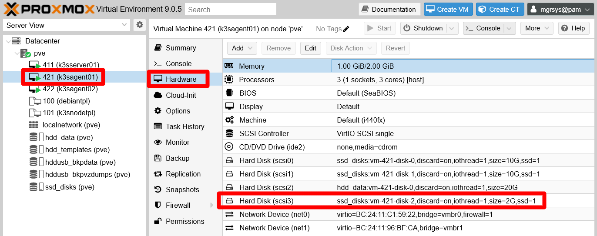
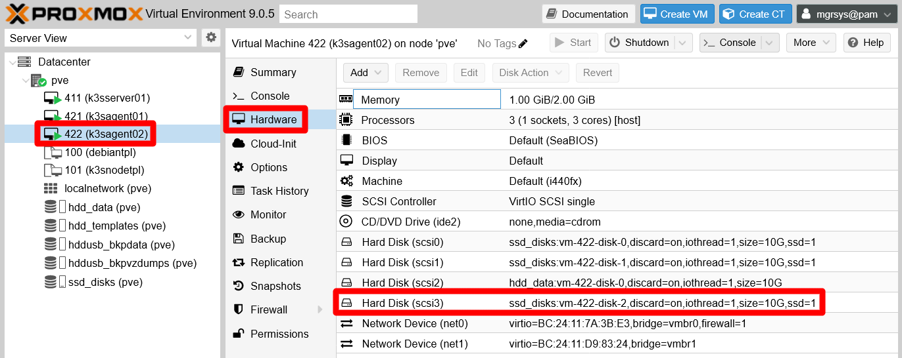

# G035 - Deploying services 04 ~ Monitoring stack - Part 1 - Outlining setup and arranging storage

- [Improve your K3s cluster's observability with a Prometheus-based monitoring stack](#improve-your-k3s-clusters-observability-with-a-prometheus-based-monitoring-stack)
- [Outlining your monitoring stack setup](#outlining-your-monitoring-stack-setup)
  - [Determining storage needs for the monitoring stack](#determining-storage-needs-for-the-monitoring-stack)
  - [Choosing the K3s agent node](#choosing-the-k3s-agent-node)
- [Setting up new storage drives in the K3s agents](#setting-up-new-storage-drives-in-the-k3s-agents)
  - [Adding a new storage drive to each K3s agent nodes' VM](#adding-a-new-storage-drive-to-each-k3s-agent-nodes-vm)
    - [Adding a storage drive to `k3sagent01`](#adding-a-storage-drive-to-k3sagent01)
    - [Adding a storage drive to `k3sagent02`](#adding-a-storage-drive-to-k3sagent02)
  - [LVM storage set up](#lvm-storage-set-up)
    - [LVM setup on `k3sagent01`](#lvm-setup-on-k3sagent01)
    - [LVM setup on `k3sagent02`](#lvm-setup-on-k3sagent02)
  - [Formatting and mounting the new LVs](#formatting-and-mounting-the-new-lvs)
    - [Format and mount the new LV in `k3sagent01`](#format-and-mount-the-new-lv-in-k3sagent01)
    - [Format and mount the new LV in `k3sagent02`](#format-and-mount-the-new-lv-in-k3sagent02)
  - [Storage mount point for containers](#storage-mount-point-for-containers)
    - [Enabling the mount point in `k3sagent01`](#enabling-the-mount-point-in-k3sagent01)
    - [Enabling the mount point in `k3sagent02`](#enabling-the-mount-point-in-k3sagent02)
  - [About increasing the storage volume's size](#about-increasing-the-storage-volumes-size)
- [Relevant system paths](#relevant-system-paths)
  - [Folders in K3s agent nodes' VMs](#folders-in-k3s-agent-nodes-vms)
  - [Files in K3s agent nodes' VMs](#files-in-k3s-agent-nodes-vms)
- [References](#references)
  - [Monitoring stack components](#monitoring-stack-components)
- [Navigation](#navigation)

## Improve your K3s cluster's observability with a Prometheus-based monitoring stack

If you have applied everything explained in this guide up to this point, your homelab setup already has a number of monitoring tools running in it. In particular, you have the [Traefik dashboard](G030%20-%20K3s%20cluster%20setup%2013%20~%20Enabling%20the%20Traefik%20dashboard.md) and [Headlamp](G031%20-%20K3s%20cluster%20setup%2014%20~%20Deploying%20the%20Headlamp%20dashboard.md), but also the logs and metrics available in the Proxmox console or through `kubectl`. Also, do not forget all the commands available in the virtual machines running your cluster, like `htop`.

Still, there are certain metrics that you cannot observe with any of those tools. Those metrics are the ones provided by all the services part of the [Ghost](G033%20-%20Deploying%20services%2002%20~%20Ghost%20-%20Part%201%20-%20Outlining%20setup%20and%20arranging%20storage.md) and [Forgejo](G034%20-%20Deploying%20services%2003%20~%20Forgejo%20-%20Part%201%20-%20Outlining%20setup%20and%20arranging%20storage.md) platforms, and are all provided in a Prometheus-compatible format. In other words, you need to deploy a Prometheus-based monitoring stack in your cluster to cover all those metrics that you cannot monitor with the observability tools you have already present in your homelab.

## Outlining your monitoring stack setup

The very first thing to do is identifying which components you need in your monitoring stack. In this guide, those components will be these:

- **Prometheus**\
  Open-source monitoring framework ready for Kubernetes. Prometheus is going to be the core of your monitoring stack, on which all the other monitoring components deployed with this guide will be centered around. Again, Prometheus is fundamental because the metrics you cannot see yet are all Prometheus-compatible ones.

- **Kube State Metrics**\
  Service that provides details from all the Kubernetes API objects present in a Kubernetes cluster, but that are not accessible through the native Kubernetes monitoring components. In other words, is an agent that gets cluster-level metrics and exposes them in a Prometheus-compatible `/metrics` endpoint.

  > [!NOTE]
  > **The Kube State Metrics is not the metrics-server!**\
  > Do not confuse the **Kube State Metrics** service with the `metrics-server` you deployed in the [chapter **G028**](G028%20-%20K3s%20cluster%20setup%2011%20~%20Deploying%20the%20metrics-server%20service.md).
  >
  > The `metrics-server` service neither gets the same metrics nor exposes them through an endpoint reachable by Prometheus.

- **Prometheus Node Exporter**\
  Agent that captures and exposes Linux-related system-level metrics from the nodes of a Kubernetes cluster like the one described in this guide.

- **Grafana**\
  Lightweight dashboard tool that can work with Prometheus, among many other data sources. It can also execute queries in the Prometheus query language (PromQL) on a given Prometheus server.

### Determining storage needs for the monitoring stack

You need to identify which monitoring components require storage space:

- **Prometheus**\
  Since it  acts as a data source for metrics, it needs some storage space where to retain, temporarily, the metrics it scrapes from your K3s cluster.

- **Grafana**\
  Requires a small storage space for configuration and user management purposes.

As you see, you need to create two different storage volumes, one per each service with storage needs.

### Choosing the K3s agent node

To balance things out, you want to run Prometheus in one of your K3s agent nodes and Grafana in the remaining one. To do this, use again the affinity rules applied to persistent volumes you have seen before. By using that technique, this guide makes Grafana always run in the `k3sagent01` node and Prometheus in the `k3sagent02` node.

## Setting up new storage drives in the K3s agents

You need to create two different storage volumes, one on each K3s agent node in the same way you prepared the storage drives for the [Ghost](G033%20-%20Deploying%20services%2002%20~%20Ghost%20-%20Part%201%20-%20Outlining%20setup%20and%20arranging%20storage.md#setting-up-new-storage-drives-in-the-k3s-agent-node) or [Forgejo](G034%20-%20Deploying%20services%2003%20~%20Forgejo%20-%20Part%201%20-%20Outlining%20setup%20and%20arranging%20storage.md#setting-up-new-storage-drives-in-the-k3s-agent) components.

### Adding a new storage drive to each K3s agent nodes' VM

Get into your Proxmox VE web console and, in the `Hardware` tab of each K3s agent node VM, add a _hard disk_ as indicated in the following subsections.

#### Adding a storage drive to `k3sagent01`

Open the `Hardware` view of the `k3sagent01` node and add a _hard disk_ with the following specification:

- **SSD drive**: storage `ssd_disks`, Discard `ENABLED`, disk size `2 GiB`, SSD emulation `ENABLED`, IO thread `ENABLED`.

This new storage unit should appear in the `Hardware` list of the `k3sagent01` VM as in this capture:

#### Adding a storage drive to `k3sagent02`

Get into the `Hardware` view of the `k3sagent02` node and add a _hard disk_ with the following specification.:

- **SSD drive**: storage `ssd_disks`, Discard `ENABLED`, disk size `10 GiB`, SSD emulation `ENABLED`, IO thread `ENABLED`.

This new storage drive should be listed the `Hardware` view of the `k3sagent02` VM as shown below:

### LVM storage set up

You have created a new storage drive on each agent node VM, but you still need to create the LVM structure in them to enable that storage space in your cluster.

#### LVM setup on `k3sagent01`

Get into your `k3sagent01` through a remote shell and do the following:

1. Check with `fdisk` that the new 2 GiB SSD storage is there:

    ~~~sh
    $ sudo fdisk -l
    Disk /dev/sda: 10 GiB, 10737418240 bytes, 20971520 sectors
    Disk model: QEMU HARDDISK
    Units: sectors of 1 * 512 = 512 bytes
    Sector size (logical/physical): 512 bytes / 512 bytes
    I/O size (minimum/optimal): 512 bytes / 512 bytes
    Disklabel type: dos
    Disk identifier: 0x5dc9a39f

    Device     Boot   Start      End  Sectors  Size Id Type
    /dev/sda1  *       2048  1556479  1554432  759M 83 Linux
    /dev/sda2       1558526 20969471 19410946  9.3G  f W95 Ext'd (LBA)
    /dev/sda5       1558528 20969471 19410944  9.3G 8e Linux LVM

    Disk /dev/sdc: 10 GiB, 10737418240 bytes, 20971520 sectors
    Disk model: QEMU HARDDISK
    Units: sectors of 1 * 512 = 512 bytes
    Sector size (logical/physical): 512 bytes / 512 bytes
    I/O size (minimum/optimal): 512 bytes / 512 bytes
    Disklabel type: gpt
    Disk identifier: 7A2C3D0A-F4E2-428B-A84B-B1EC39731206

    Device     Start      End  Sectors Size Type
    /dev/sdc1   2048 20971486 20969439  10G Linux filesystem

    Disk /dev/sdb: 20 GiB, 21474836480 bytes, 41943040 sectors
    Disk model: QEMU HARDDISK
    Units: sectors of 1 * 512 = 512 bytes
    Sector size (logical/physical): 512 bytes / 512 bytes
    I/O size (minimum/optimal): 512 bytes / 512 bytes
    Disklabel type: gpt
    Disk identifier: 72272E78-E280-4B3F-9F22-EC34DC3F92BE

    Device     Start      End  Sectors Size Type
    /dev/sdb1   2048 41943006 41940959  20G Linux filesystem

    Disk /dev/mapper/forgejo--ssd-cache: 2.99 GiB, 3212836864 bytes, 6275072 sectors
    Units: sectors of 1 * 512 = 512 bytes
    Sector size (logical/physical): 512 bytes / 512 bytes
    I/O size (minimum/optimal): 512 bytes / 512 bytes

    Disk /dev/mapper/k3snode--vg-root: 9.25 GiB, 9936306176 bytes, 19406848 sectors
    Units: sectors of 1 * 512 = 512 bytes
    Sector size (logical/physical): 512 bytes / 512 bytes
    I/O size (minimum/optimal): 512 bytes / 512 bytes

    Disk /dev/mapper/forgejo--hdd-git: 19.98 GiB, 21449670656 bytes, 41893888 sectors
    Units: sectors of 1 * 512 = 512 bytes
    Sector size (logical/physical): 512 bytes / 512 bytes
    I/O size (minimum/optimal): 512 bytes / 512 bytes

    Disk /dev/mapper/forgejo--ssd-db: 4.89 GiB, 5255462912 bytes, 10264576 sectors
    Units: sectors of 1 * 512 = 512 bytes
    Sector size (logical/physical): 512 bytes / 512 bytes
    I/O size (minimum/optimal): 512 bytes / 512 bytes

    Disk /dev/mapper/forgejo--ssd-data: 2.1 GiB, 2252341248 bytes, 4399104 sectors
    Units: sectors of 1 * 512 = 512 bytes
    Sector size (logical/physical): 512 bytes / 512 bytes
    I/O size (minimum/optimal): 512 bytes / 512 bytes

    Disk /dev/sdd: 2 GiB, 2147483648 bytes, 4194304 sectors
    Disk model: QEMU HARDDISK
    Units: sectors of 1 * 512 = 512 bytes
    Sector size (logical/physical): 512 bytes / 512 bytes
    I/O size (minimum/optimal): 512 bytes / 512 bytes
    ~~~

    Forgejo is deployed in the `k3sagent01` node, so you will also see the drives related to that platform. The new SSD drive is the `/dev/sdd` one, which shows up listed at the end of the output above.

2. Create a new GPT partition on the `/dev/sdd` drive with `sgdisk`:

    ~~~sh
    $ sudo sgdisk -N 1 /dev/sdd
    ~~~

3. Verify with `fdisk` that your new partition appears in `/dev/sdd`:

    ~~~sh
    Disk /dev/sdd: 2 GiB, 2147483648 bytes, 4194304 sectors
    Disk model: QEMU HARDDISK
    Units: sectors of 1 * 512 = 512 bytes
    Sector size (logical/physical): 512 bytes / 512 bytes
    I/O size (minimum/optimal): 512 bytes / 512 bytes
    Disklabel type: gpt
    Disk identifier: 81F5AB20-07D8-4115-97B7-8A42E84D3264

    Device     Start     End Sectors Size Type
    /dev/sdd1   2048 4194270 4192223   2G Linux filesystem
    ~~~

    The new partition is the storage device named `/dev/sdd1`.

4. Use `pvcreate` to produce a new LVM physical volume in the `/dev/sdd1` partition:

    ~~~sh
    $ sudo pvcreate --metadatasize 2m -y -ff /dev/sdd1
    ~~~

    For the metadata size remember that this guide uses the rule of thumb of allocating 1 MiB per 1 GiB present in the PV.

    Use `pvs` to see that your new PV exists:

    ~~~sh
    $ sudo pvs
      PV         VG          Fmt  Attr PSize   PFree
      /dev/sda5  k3snode-vg  lvm2 a--    9.25g     0
      /dev/sdb1  forgejo-hdd lvm2 a--  <19.98g     0
      /dev/sdc1  forgejo-ssd lvm2 a--    9.98g     0
      /dev/sdd1              lvm2 ---   <2.00g <2.00g
    ~~~

5. Assign a volume group to this new PV, knowing that this volume is reserved for Grafana, which will be deployed in your cluster in the `monitoring` namespace. So, execute `vgcreate` as shown next:

    ~~~sh
    $ sudo vgcreate monitoring-ssd /dev/sdd1
    ~~~

    With `pvs` verify that the PV is assigned to your new `monitoring-ssd` VG:

    ~~~sh
    $ sudo pvs
      PV         VG             Fmt  Attr PSize   PFree
      /dev/sda5  k3snode-vg     lvm2 a--    9.25g    0
      /dev/sdb1  forgejo-hdd    lvm2 a--  <19.98g    0
      /dev/sdc1  forgejo-ssd    lvm2 a--    9.98g    0
      /dev/sdd1  monitoring-ssd lvm2 a--    1.99g 1.99g
    ~~~

    Also, you can check with `vgs` the current status of the VG:

    ~~~sh
    $ sudo vgs
      VG             #PV #LV #SN Attr   VSize   VFree
      forgejo-hdd      1   1   0 wz--n- <19.98g    0
      forgejo-ssd      1   3   0 wz--n-   9.98g    0
      k3snode-vg       1   1   0 wz--n-   9.25g    0
      monitoring-ssd   1   0   0 wz--n-   1.99g 1.99g
    ~~~

6. Create a light volume in the VG using `lvcreate`, giving it a meaningful name:

    ~~~sh
    $ sudo lvcreate -l 100%FREE -n grafana-data monitoring-ssd
    ~~~

    See with `lvs` the status of the new LVs in your VM:

    ~~~sh
    $ sudo lvs
      LV           VG             Attr       LSize   Pool Origin Data%  Meta%  Move Log Cpy%Sync Convert
      git          forgejo-hdd    -wi-ao---- <19.98g
      cache        forgejo-ssd    -wi-ao----   2.99g
      data         forgejo-ssd    -wi-ao----  <2.10g
      db           forgejo-ssd    -wi-ao----   4.89g
      root         k3snode-vg     -wi-ao----   9.25g
      grafana-data monitoring-ssd -wi-a-----   1.99g
    ~~~

    On the other hand, check with `vgs` that there is no free space left in the `monitoring-ssd` VG:

    ~~~sh
    $ sudo vgs
      VG             #PV #LV #SN Attr   VSize   VFree
      forgejo-hdd      1   1   0 wz--n- <19.98g    0
      forgejo-ssd      1   3   0 wz--n-   9.98g    0
      k3snode-vg       1   1   0 wz--n-   9.25g    0
      monitoring-ssd   1   1   0 wz--n-   1.99g    0
    ~~~

#### LVM setup on `k3sagent02`

Open a remote shell in your `k3sagent02` VM and follow these steps:

1. Check with `fdisk` that the new 10 GiB SSD drive is available in the VM:

    ~~~sh
    $ sudo fdisk -l
    Disk /dev/sda: 10 GiB, 10737418240 bytes, 20971520 sectors
    Disk model: QEMU HARDDISK
    Units: sectors of 1 * 512 = 512 bytes
    Sector size (logical/physical): 512 bytes / 512 bytes
    I/O size (minimum/optimal): 512 bytes / 512 bytes
    Disklabel type: gpt
    Disk identifier: 0DF6943D-791B-4D7B-9946-36648735901E

    Device     Start      End  Sectors Size Type
    /dev/sda1   2048 20971486 20969439  10G Linux filesystem

    Disk /dev/sdc: 10 GiB, 10737418240 bytes, 20971520 sectors
    Disk model: QEMU HARDDISK
    Units: sectors of 1 * 512 = 512 bytes
    Sector size (logical/physical): 512 bytes / 512 bytes
    I/O size (minimum/optimal): 512 bytes / 512 bytes
    Disklabel type: gpt
    Disk identifier: FFC445C4-C09D-4689-9A31-7BB4B0DCFB95

    Device     Start      End  Sectors Size Type
    /dev/sdc1   2048 20971486 20969439  10G Linux filesystem

    Disk /dev/sdb: 10 GiB, 10737418240 bytes, 20971520 sectors
    Disk model: QEMU HARDDISK
    Units: sectors of 1 * 512 = 512 bytes
    Sector size (logical/physical): 512 bytes / 512 bytes
    I/O size (minimum/optimal): 512 bytes / 512 bytes
    Disklabel type: dos
    Disk identifier: 0x5dc9a39f

    Device     Boot   Start      End  Sectors  Size Id Type
    /dev/sdb1  *       2048  1556479  1554432  759M 83 Linux
    /dev/sdb2       1558526 20969471 19410946  9.3G  f W95 Ext'd (LBA)
    /dev/sdb5       1558528 20969471 19410944  9.3G 8e Linux LVM

    Disk /dev/mapper/ghost--ssd-db: 6.99 GiB, 7503609856 bytes, 14655488 sectors
    Units: sectors of 1 * 512 = 512 bytes
    Sector size (logical/physical): 512 bytes / 512 bytes
    I/O size (minimum/optimal): 512 bytes / 512 bytes

    Disk /dev/mapper/k3snode--vg-root: 9.25 GiB, 9936306176 bytes, 19406848 sectors
    Units: sectors of 1 * 512 = 512 bytes
    Sector size (logical/physical): 512 bytes / 512 bytes
    I/O size (minimum/optimal): 512 bytes / 512 bytes

    Disk /dev/mapper/ghost--ssd-cache: 3 GiB, 3217031168 bytes, 6283264 sectors
    Units: sectors of 1 * 512 = 512 bytes
    Sector size (logical/physical): 512 bytes / 512 bytes
    I/O size (minimum/optimal): 512 bytes / 512 bytes

    Disk /dev/mapper/ghost--hdd-srv: 9.98 GiB, 10720641024 bytes, 20938752 sectors
    Units: sectors of 1 * 512 = 512 bytes
    Sector size (logical/physical): 512 bytes / 512 bytes
    I/O size (minimum/optimal): 512 bytes / 512 bytes

    Disk /dev/sdd: 10 GiB, 10737418240 bytes, 20971520 sectors
    Disk model: QEMU HARDDISK
    Units: sectors of 1 * 512 = 512 bytes
    Sector size (logical/physical): 512 bytes / 512 bytes
    I/O size (minimum/optimal): 512 bytes / 512 bytes
    ~~~

    Is in the `k3sagent02` where the Ghost platform is deployed, so you can see listed all the storage related to it. The new SSD drive is the `/dev/sdd` one, which appears at the end of the output above.

2. Create a new GPT partition on the new storage drives with `sgdisk`:

    ~~~sh
    $ sudo sgdisk -N 1 /dev/sdd
    ~~~

3. Check with `fdisk` the new partition on the storage drive:

    ~~~sh
    $ sudo fdisk -l /dev/sdd
    Disk /dev/sdd: 10 GiB, 10737418240 bytes, 20971520 sectors
    Disk model: QEMU HARDDISK
    Units: sectors of 1 * 512 = 512 bytes
    Sector size (logical/physical): 512 bytes / 512 bytes
    I/O size (minimum/optimal): 512 bytes / 512 bytes
    Disklabel type: gpt
    Disk identifier: D43EC653-E8C7-438D-A481-782659EED927

    Device     Start      End  Sectors Size Type
    /dev/sdd1   2048 20971486 20969439  10G Linux filesystem
    ~~~

    Now you have a `/dev/sdd1` partition in the `/dev/sdd` drive.

4. Use pvcreate to make a new LVM physical volume out of the `/dev/sdd1` partition:

    ~~~sh
    $ sudo pvcreate --metadatasize 10m -y -ff /dev/sdd1
    ~~~

    For the metadata size remember that this guide applies the rule of thumb of allocating 1 MiB per 1 GiB present in the PV.

    Check with `pvs` that the new PV have been created:

    ~~~sh
    $ sudo pvs
      PV         VG         Fmt  Attr PSize   PFree
      /dev/sda1  ghost-ssd  lvm2 a--    9.98g      0
      /dev/sdb5  k3snode-vg lvm2 a--    9.25g      0
      /dev/sdc1  ghost-hdd  lvm2 a--    9.98g      0
      /dev/sdd1             lvm2 ---  <10.00g <10.00g
    ~~~

5. Assign a volume group to the new PV with `vgcreate`. Remember that this volume is going to be for Prometheus, which will be deployed in your cluster in the `monitoring` namespace. So, execute `vgcreate` like this:

    ~~~sh
    $ sudo vgcreate monitoring-ssd /dev/sdd1
    ~~~

    With `pvs` check that the `/dev/sdd1` PV is assigned to the `monitoring-ssd` VG:

    ~~~sh
    $ sudo pvs
      PV         VG             Fmt  Attr PSize PFree
      /dev/sda1  ghost-ssd      lvm2 a--  9.98g    0
      /dev/sdb5  k3snode-vg     lvm2 a--  9.25g    0
      /dev/sdc1  ghost-hdd      lvm2 a--  9.98g    0
      /dev/sdd1  monitoring-ssd lvm2 a--  9.98g 9.98g
    ~~~

    Also see with `vgs` the current status of the VG:

    ~~~sh
    $ sudo vgs
      VG             #PV #LV #SN Attr   VSize VFree
      ghost-hdd        1   1   0 wz--n- 9.98g    0
      ghost-ssd        1   2   0 wz--n- 9.98g    0
      k3snode-vg       1   1   0 wz--n- 9.25g    0
      monitoring-ssd   1   0   0 wz--n- 9.98g 9.98g
    ~~~

6. Create a light volume with a significant name in the `monitoring-ssd` VG:

    ~~~sh
    $ sudo lvcreate -l 100%FREE -n prometheus-data monitoring-ssd
    ~~~

    Check with `lvs` the new LV in your VM:

    ~~~sh
    $ sudo lvs
      LV              VG             Attr       LSize  Pool Origin Data%  Meta%  Move Log Cpy%Sync Convert
      srv             ghost-hdd      -wi-ao----  9.98g
      cache           ghost-ssd      -wi-ao---- <3.00g
      db              ghost-ssd      -wi-ao---- <6.99g
      root            k3snode-vg     -wi-ao----  9.25g
      prometheus-data monitoring-ssd -wi-a-----  9.98g
    ~~~

    Also verify with `vgs` that there's no free space left in the `monitoring-ssd` VG:

    ~~~sh
    $ sudo vgs
      VG             #PV #LV #SN Attr   VSize VFree
      ghost-hdd        1   1   0 wz--n- 9.98g    0
      ghost-ssd        1   2   0 wz--n- 9.98g    0
      k3snode-vg       1   1   0 wz--n- 9.25g    0
      monitoring-ssd   1   1   0 wz--n- 9.98g    0
    ~~~

### Formatting and mounting the new LVs

You have to format your new light volumes as ext4 filesystems and mount them permanently.

#### Format and mount the new LV in `k3sagent01`

Get back into the remote shell connected to your `k3sagent01` VM and do this:

1. Get the `/dev/mapper` path of the `grafana-data` LV with `fdisk` and `grep`:

    ~~~sh
    $ sudo fdisk -l | grep monitoring
    Disk /dev/mapper/monitoring--ssd-grafana--data: 1.99 GiB, 2139095040 bytes, 4177920 sectors
    ~~~

2. Execute the `mkfs.ext4` command on the `/dev/mapper/monitoring--ssd-grafana--data` path:

    ~~~sh
    $ sudo mkfs.ext4 /dev/mapper/monitoring--ssd-grafana--data
    ~~~

3. Create the folder structure where to mount the LV under the `/mnt` path:

    ~~~sh
    $ sudo mkdir -p /mnt/monitoring-ssd/grafana-data
    ~~~

    Check the created folder structure with `tree`:

    ~~~sh
    $ tree -F /mnt/monitoring-ssd
    /mnt/monitoring-ssd/
    └── grafana-data/

    2 directories, 0 files
    ~~~

4. Mount the LV in its corresponding mount point folder:

    ~~~sh
    $ sudo mount /dev/mapper/monitoring--ssd-grafana--data /mnt/monitoring-ssd/grafana-data
    ~~~

    Check with `df` that it has been mounted correctly. You can find it listed at the bottom of the command's output:

    ~~~sh
    $ df -h
    Filesystem                                 Size  Used Avail Use% Mounted on
    udev                                       965M     0  965M   0% /dev
    tmpfs                                      198M  2.2M  196M   2% /run
    /dev/mapper/k3snode--vg-root               9.1G  7.1G  1.6G  83% /
    tmpfs                                      987M     0  987M   0% /dev/shm
    tmpfs                                      5.0M     0  5.0M   0% /run/lock
    tmpfs                                      987M     0  987M   0% /tmp
    tmpfs                                      1.0M     0  1.0M   0% /run/credentials/systemd-journald.service
    /dev/mapper/forgejo--ssd-data              2.0G  728K  1.9G   1% /mnt/forgejo-ssd/data
    /dev/mapper/forgejo--ssd-cache             2.9G  796K  2.8G   1% /mnt/forgejo-ssd/cache
    /dev/mapper/forgejo--ssd-db                4.8G   72M  4.5G   2% /mnt/forgejo-ssd/db
    /dev/mapper/forgejo--hdd-git                20G  2.1M   19G   1% /mnt/forgejo-hdd/git
    /dev/sda1                                  730M  111M  567M  17% /boot
    tmpfs                                      1.0M     0  1.0M   0% /run/credentials/getty@tty1.service
    shm                                         64M     0   64M   0% /run/k3s/containerd/io.containerd.grpc.v1.cri/sandboxes/d884e66f2498e885af8719c07cb959c5495bbca80f21e9a3793120c2e36842fd/shm
    shm                                         64M     0   64M   0% /run/k3s/containerd/io.containerd.grpc.v1.cri/sandboxes/ecd0aa508c4b404ad87627b155a88d4cf1998d944991b65f654d561253af0ef7/shm
    shm                                         64M     0   64M   0% /run/k3s/containerd/io.containerd.grpc.v1.cri/sandboxes/732f4933252de2e18fa7e7c00232aa37f3ee7f56bd84d802ad95d0d91739c2c1/shm
    shm                                         64M     0   64M   0% /run/k3s/containerd/io.containerd.grpc.v1.cri/sandboxes/4f803f06f1e2a61b899d53003b447ec2516ddc755c9e83c07dba2743d409fa6a/shm
    shm                                         64M     0   64M   0% /run/k3s/containerd/io.containerd.grpc.v1.cri/sandboxes/a1061cdbcbcaade102af9c9609dd299a5b966382c4818b3a400d4b09e5ed5d93/shm
    shm                                         64M     0   64M   0% /run/k3s/containerd/io.containerd.grpc.v1.cri/sandboxes/1f71be24111cfad6e6c6a9fdc7c30e21ff9009abc5529802c5bfa10420f564db/shm
    shm                                         64M     0   64M   0% /run/k3s/containerd/io.containerd.grpc.v1.cri/sandboxes/9d1ef6c3ce7442e0f77db14acba2ca2308f1dae431fb1803de516c5dd118238c/shm
    shm                                         64M  1.1M   63M   2% /run/k3s/containerd/io.containerd.grpc.v1.cri/sandboxes/1ff3d85c239448bea60470da2c1a52cdf5e741dffdd12e40b610832d2a878cfb/shm
    tmpfs                                      197M  8.0K  197M   1% /run/user/1000
    /dev/mapper/monitoring--ssd-grafana--data  2.0G  532K  1.9G   1% /mnt/monitoring-ssd/grafana-data
    ~~~

5. Make the mounting permanent, by adding it to the `k3sagent01`'s  `/etc/fstab` file. First, backup the file:

    > [!WARNING]
    > **You already have a backup of the `fstab` file**\
    > At this point you should already have a backup of the `fstab` file. Rename it to something like `fstab.bkp.old` or remove it before you apply the following command.
    >
    > `$ sudo mv /etc/fstab.bkp /etc/fstab.bkp.old`

    ~~~sh
    $ sudo cp /etc/fstab /etc/fstab.bkp
    ~~~

    Then **append** the following lines to the `fstab` file:

    ~~~sh
    # Grafana volume
    /dev/mapper/monitoring--ssd-grafana--data /mnt/monitoring-ssd/grafana-data ext4 defaults,nofail 0 0
    ~~~

#### Format and mount the new LV in `k3sagent02`

Reopen the remote shell connected to your `k3sagent02` VM to apply the following steps:

1. Get the LV `/dev/mapper` path with `fdisk` and `grep`:

    ~~~sh
    $ sudo fdisk -l | grep prometheus
    Disk /dev/mapper/monitoring--ssd-prometheus--data: 9.98 GiB, 10720641024 bytes, 20938752 sectors
    ~~~

2. Execute the `mkfs.ext4` command on the `/dev/mapper/monitoring--ssd-prometheus--data` path:

    ~~~sh
    $ sudo mkfs.ext4 /dev/mapper/monitoring--ssd-prometheus--data
    ~~~

3. Create a folder where to mount the LV under the `/mnt` path:

    ~~~sh
    $ sudo mkdir -p /mnt/monitoring-ssd/prometheus-data
    ~~~

    Validate the new folder structure with `tree`:

    ~~~sh
    $ tree -F /mnt/monitoring-ssd
    /mnt/monitoring-ssd/
    └── prometheus-data/

    2 directories, 0 files
    ~~~

4. Mount the LV in its mount point:

    ~~~sh
    $ sudo mount /dev/mapper/monitoring--ssd-prometheus--data /mnt/monitoring-ssd/prometheus-data
    ~~~

    Use `df` to see that it's been mounted correctly, shown at the bottom of the command's list:

    ~~~sh
    $ df -h
    Filesystem                                    Size  Used Avail Use% Mounted on
    udev                                          965M     0  965M   0% /dev
    tmpfs                                         198M  1.6M  196M   1% /run
    /dev/mapper/k3snode--vg-root                  9.1G  6.1G  2.5G  72% /
    tmpfs                                         987M     0  987M   0% /dev/shm
    tmpfs                                         5.0M     0  5.0M   0% /run/lock
    tmpfs                                         987M     0  987M   0% /tmp
    tmpfs                                         1.0M     0  1.0M   0% /run/credentials/systemd-journald.service
    /dev/mapper/ghost--ssd-cache                  2.9G  800K  2.8G   1% /mnt/ghost-ssd/cache
    /dev/mapper/ghost--ssd-db                     6.8G  332M  6.1G   6% /mnt/ghost-ssd/db
    /dev/mapper/ghost--hdd-srv                    9.8G  4.0M  9.3G   1% /mnt/ghost-hdd/srv
    /dev/sdb1                                     730M  111M  567M  17% /boot
    tmpfs                                         1.0M     0  1.0M   0% /run/credentials/getty@tty1.service
    shm                                            64M     0   64M   0% /run/k3s/containerd/io.containerd.grpc.v1.cri/sandboxes/4527a9cfea2fd6c1be310502ffa75c65a1aac0f9580dda5d265451dd53d919d8/shm
    shm                                            64M     0   64M   0% /run/k3s/containerd/io.containerd.grpc.v1.cri/sandboxes/d0fbf552f42c4e65392e4f487c95f14c4277ecc63bf9da919090eea89f0ec539/shm
    shm                                            64M     0   64M   0% /run/k3s/containerd/io.containerd.grpc.v1.cri/sandboxes/98cfd2cf872207692f5b3d1cf9e4394b95e9ac82695fcf56e1f1f77564e85451/shm
    shm                                            64M     0   64M   0% /run/k3s/containerd/io.containerd.grpc.v1.cri/sandboxes/00a5f7d48441c8ba6aca8184f11624385083cac03120d4f2f7c602b99adec0d1/shm
    shm                                            64M     0   64M   0% /run/k3s/containerd/io.containerd.grpc.v1.cri/sandboxes/faff43e19e8ecbb7aed359da7e09a55567bef00b3ff1ce4c40fefec68ef4254c/shm
    tmpfs                                         198M  8.0K  198M   1% /run/user/1000
    /dev/mapper/monitoring--ssd-prometheus--data  9.8G  2.1M  9.3G   1% /mnt/monitoring-ssd/prometheus-data
    ~~~

5. Make the mounting permanent, by adding it to the VM's  `/etc/fstab` file. First, backup the file:

    > [!WARNING]
    > **You already have a backup of the `fstab` file**\
    > At this point you should already have a backup of the `fstab` file. Rename it to something like `fstab.bkp.old` or remove it before you apply the following command.
    >
    > `$ sudo mv /etc/fstab.bkp /etc/fstab.bkp.old`

    ~~~sh
    $ sudo cp /etc/fstab /etc/fstab.bkp
    ~~~

    Then **append** the following lines to the `fstab` file:

    ~~~sh
    # Prometheus volume
    /dev/mapper/monitoring--ssd-prometheus--data /mnt/monitoring-ssd/prometheus-data ext4 defaults,nofail 0 0
    ~~~

### Storage mount point for containers

The last step regarding the storage setup is to create an extra folder serving as mounting point for the Grafana and Prometheus containers's persistent volumes.

#### Enabling the mount point in `k3sagent01`

Return to the `k3sagent01` remote shell and follow these steps:

1. Make a `k3smnt` folder **within** the `grafana-data` LV you have just created and mounted:

    ~~~sh
    $ sudo mkdir /mnt/monitoring-ssd/grafana-data/k3smnt
    ~~~

2. Use `tree` to verify that the `k3smnt` folder is correct:

    ~~~sh
    $ tree -F /mnt/monitoring-ssd
    /mnt/monitoring-ssd/
    └── grafana-data/
        ├── k3smnt/
        └── lost+found/  [error opening dir]

    4 directories, 0 files
    ~~~

    Do not mind the `lost+found` folder, it is created by the system automatically.

#### Enabling the mount point in `k3sagent02`

Go back to the `k3sagent02` remote shell and do this:

1. Make a `k3smnt` folder within the `prometheus-data` LV you have just created:

    ~~~sh
    $ sudo mkdir /mnt/monitoring-ssd/prometheus-data/k3smnt
    ~~~

2. Check the `k3smnt` folder with `tree`:

    ~~~sh
    $ tree -F /mnt/monitoring-ssd
    /mnt/monitoring-ssd/
    └── prometheus-data/
        ├── k3smnt/
        └── lost+found/  [error opening dir]

    4 directories, 0 files
    ~~~

    Ignore the `lost+found` folder, it is automatically created by the system.

> [!IMPORTANT]
> **Remember that the `k3smnt` folders are within the already mounted LVM storage volumes**\
> You cannot create these folders without mounting the light volumes first.

### About increasing the storage volume's size

After some time, your monitoring services may end being close to fill up their storage space. Therefore, you will need to increase their size. Read the [appendix chapter **G905**](G905%20-%20Appendix%2005%20~%20Resizing%20a%20root%20LVM%20volume.md) to know how. It shows you how to extend a partition and the LVM filesystem within it, although in that case it works on a LVM volume that happens to be also the root filesystem of a VM.

## Relevant system paths

### Folders in K3s agent nodes' VMs

- `/etc`
- `/mnt`
- `/mnt/monitoring-ssd`
- `/mnt/monitoring-ssd/grafana-data/`
- `/mnt/monitoring-ssd/grafana-data/k3smnt`
- `/mnt/monitoring-ssd/prometheus-data/`
- `/mnt/monitoring-ssd/prometheus-data/k3smnt`

### Files in K3s agent nodes' VMs

- `/dev/mapper/monitoring--ssd-grafana--data`
- `/dev/mapper/monitoring--ssd-prometheus--data`
- `/dev/sdd`
- `/dev/sdd1`
- `/etc/fstab`
- `/etc/fstab.bkp`
- `/etc/fstab.bkp.old`

## References

### Monitoring stack components

- [Kube State Metrics](https://github.com/kubernetes/kube-state-metrics)
- [Prometheus Node Exporter](https://github.com/prometheus/node_exporter)
- [Prometheus](https://prometheus.io/)
- [Grafana](https://grafana.com/grafana/)

## Navigation

[<< Previous (**G034. Deploying services 03. Forgejo Part 5**)](G034%20-%20Deploying%20services%2003%20~%20Forgejo%20-%20Part%205%20-%20Complete%20Forgejo%20platform.md) | [+Table Of Contents+](G000%20-%20Table%20Of%20Contents.md) | [Next (**G035. Deploying services 04. Monitoring stack Part 2**) >>](G035%20-%20Deploying%20services%2004%20~%20Monitoring%20stack%20-%20Part%202%20-%20Kube%20State%20Metrics%20service.md)
