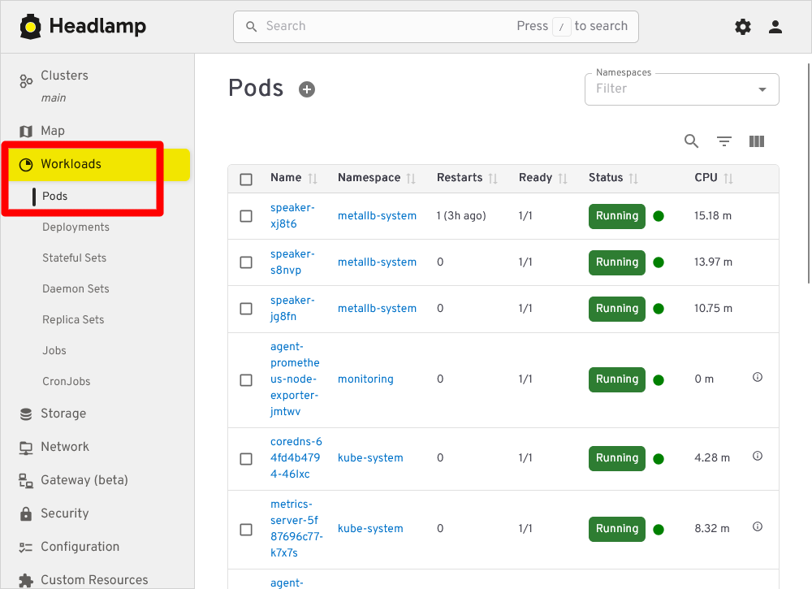
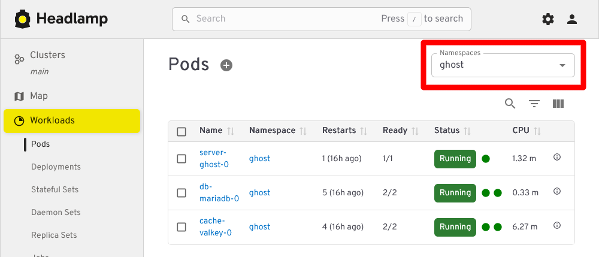
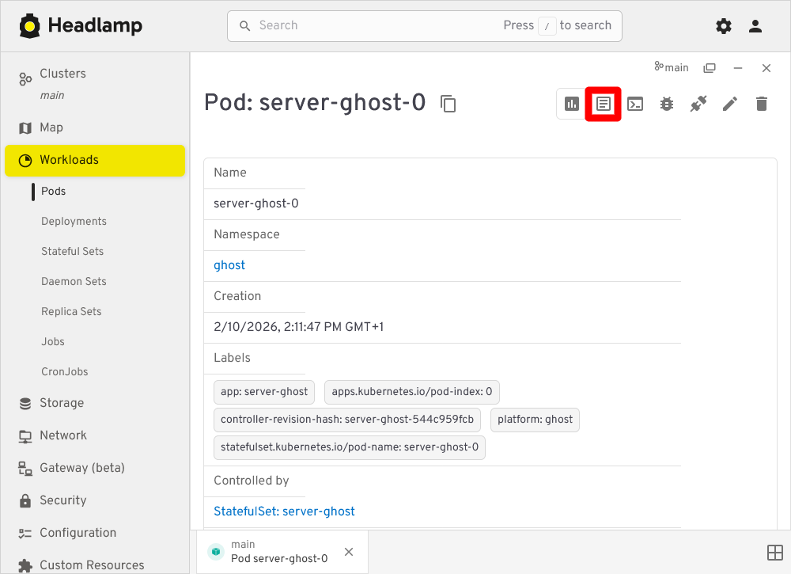
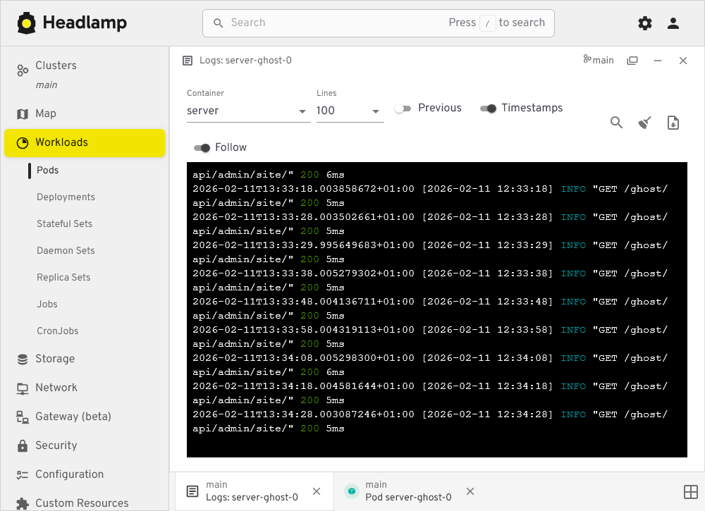
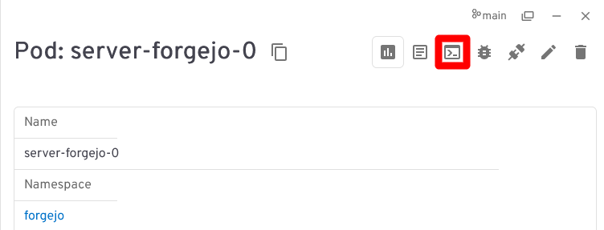
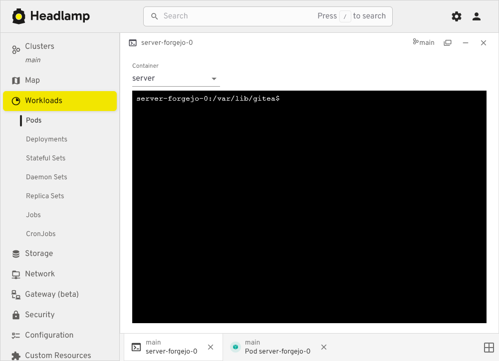
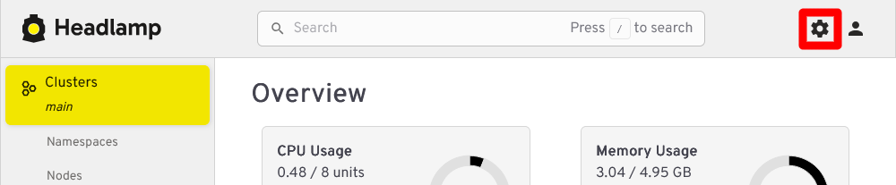
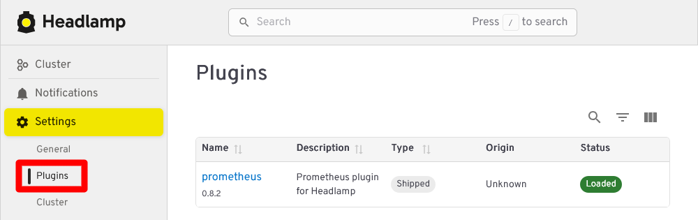
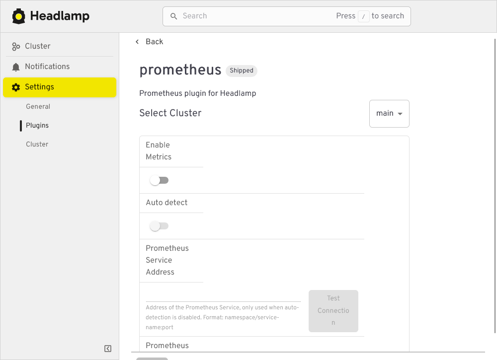

# G036 - Host and K3s cluster ~ Monitoring and diagnosis

- [Monitor your homelab setup with its own tools](#monitor-your-homelab-setup-with-its-own-tools)
- [Monitoring resources usage](#monitoring-resources-usage)
- [Checking the logs](#checking-the-logs)
  - [Proxmox VE logs](#proxmox-ve-logs)
  - [Virtual machine logs](#virtual-machine-logs)
  - [Container logs](#container-logs)
- [Shell access into your containers](#shell-access-into-your-containers)
  - [Accessing containers with kubectl](#accessing-containers-with-kubectl)
  - [Accessing containers from Headlamp](#accessing-containers-from-headlamp)
- [Metrics from the monitoring stack](#metrics-from-the-monitoring-stack)
- [References](#references)
  - [Kubernetes](#kubernetes)
  - [Headlamp](#headlamp)
  - [Grafana](#grafana)
- [Navigation](#navigation)

## Monitor your homelab setup with its own tools

At this point of the guide, your homelab setup has a collection of tools enabling you to monitor and diagnose your K3s Kubernetes cluster and the workloads it runs at different levels. This chapter is a rundown of all those tools and their purposes.

## Monitoring resources usage

In a small or limited system such as the one used in this guide, the first thing you have to worry about is the usage of resources:

- Proxmox VE's web console has a `Summary` view on all its levels (datacenter, node and virtual machine) in which it shows how the usage of resources is going. On the other hand, the web console offers a page for each storage unit configured in the system. On the other hand, remember that Proxmox VE's web console cannot monitor the Kubernetes cluster running in your VMs.

- Do not forget shell commands like `htop`, `df` or `free`. They can give you a different point of view of the resources usages from within your Proxmox VE host or the VMs. For instance, in the VM nodes of your K3s cluster, you can see with `htop` many lines related to the K3s service running in them and also about the containerd service executing your Kubernetes containers.

  Still, these commands are not good enough for monitoring your Kubernetes cluster. They show you the Kubernetes-related processes like any other process at the operative system level. In other words, their resolution is "too low" and lack context to help you make sense of what they can report about your Kubernetes cluster.

- To monitor the resources usage in your Kubernetes nodes and workloads, you can:

  - Use the Headlamp dashboard you deployed and browsed into [back in the chapter **G031**](G031%20-%20K3s%20cluster%20setup%2014%20~%20Deploying%20the%20Headlamp%20dashboard.md). This is probably your best option for the everyday monitoring of your K3s cluster.

  - Use the `kubectl top` command from your `kubectl` client system. For instance, you could see the usages of your Ghost platform's pods.

    ~~~sh
    $ kubectl top pod -n ghost
    NAME             CPU(cores)   MEMORY(bytes)   
    cache-valkey-0   9m           29Mi            
    db-mariadb-0     1m           182Mi           
    server-ghost-0   2m           194Mi
    ~~~

    Notice that `top pod` requires specifying the namespace, while `top node` does not (cluster nodes are not namespaced).

## Checking the logs

Logs are particularly useful when you need to diagnose issues in a system. This section explains the most relevant logs you have in your homelab setup and how to read them.

### Proxmox VE logs

The Proxmox VE host is a Debian system, and its logs were usually all found in the `/var/log` directory but this has changed. Now a journaling system is where you can find all the system-related logs, including those about Proxmox VE processes, and you can access it with the `journalctl` command. You can also see the system's journal at the `pve` node level of your Proxmox VE web console, in the `System > System Log` page. Nevertheless, you can still find some relevant logs under the `/var/log` directory like:

- `fail2ban.log`\
  Log file where the Fail2ban system registers its activity.

- `pve-firewall.log`\
  Where the Proxmox VE's firewall writes its logs, including the ones related to your virtual machines. Very important to check it out when you detect networking issues with your containers, like blocked traffic to certain ports. You can see this log also in the web console:

  - At the `pve` node level, in the `Firewall > Log` view, you can see all the lines written in the log.

  - At each VM you also have a `Firewall > Log` view, but it only shows the lines related to the current VM.

### Virtual machine logs

The VMs you have setup as K3s nodes are all Debian-based, so their system logs are also stored in their corresponding journals. Logs about Kubernetes or K3s related processes will also appear in the journal but, on the other hand, there are other log files produced by your K3s cluster that are found in `/var/log/`:

- `containers`\
  In a Kubernetes node that runs workloads, like your K3s agent ones, this folder holds the logs of the containers currently running in the virtual machine. More precisely, they are symbolic links to the actual log files found under the path `/var/log/pods`, where they are also grouped in folders.

- `pods`\
  Folder keeping the logs of the containers running in your Kubernetes pods. The logs are in folders organized in the following manner.

  - Each pod running in the node has its own folder named following the pattern `<namespace>_<pod's current name>_<cluster-generated UUID>`.

  - Within each pod's folder, you have one directory per container running in that pod. The containers' logs are inside their corresponding folders.

  - For instance, the Ghost platform has two pods with two containers each and one pod with an init container and a regular one. The `tree` command would present them like this:

    ~~~sh
    $ sudo tree -F /var/log/pods/ghost_cache-valkey-0_766099b7-bc03-4614-81c9-5a6a33cacb3d
    /var/log/pods/ghost_cache-valkey-0_766099b7-bc03-4614-81c9-5a6a33cacb3d/
    ├── metrics/
    │   ├── 1.log
    │   └── 2.log
    └── server/
        ├── 1.log
        └── 2.log

    3 directories, 4 files
    ~~~

    ~~~sh
    $ sudo tree -F /var/log/pods/ghost_db-mariadb-0_8c5a171a-1ae7-411d-88cd-2dac30a1e6ca
    /var/log/pods/ghost_db-mariadb-0_8c5a171a-1ae7-411d-88cd-2dac30a1e6ca/
    ├── metrics/
    │   ├── 1.log
    │   └── 2.log
    └── server/
        ├── 2.log
        └── 3.log

    3 directories, 4 files
    ~~~

    ~~~sh
    mgrsys@k3sagent02:~$ sudo tree -F /var/log/pods/ghost_server-ghost-0_43cc54ac-6304-4286-89f3-c7678a05f819
    /var/log/pods/ghost_server-ghost-0_43cc54ac-6304-4286-89f3-c7678a05f819/
    ├── permissions-fix/
    │   └── 1.log
    └── server/
        ├── 0.log
        └── 1.log

    3 directories, 3 files
    ~~~

    Notice how there is more than one log file in each container's folder, and that their filenames are just numbers. The higher the number, the more recent the log file is.

    Also see that the `sudo` command is needed to allow `tree` to list the contents of the `pods` folders.

### Container logs

You can access a container's log with `kubectl`. For instance, to access the log of your Forgejo `server` container you would execute this command:

~~~sh
$ kubectl logs -n forgejo server-forgejo-0 server | less
~~~

See how after indicating the `forgejo` namespace, the pod's name (`server-forgejo-0`) is specified and then the concrete container (`server`). The output has been redirected to `less` for paginating the log. This log is the same one stored in the corresponding `/var/log/pods` path which, at the moment of writing this, is `/var/log/pods/forgejo_server-forgejo-0_3d717aab-d09c-4f4d-9fd6-83f421c70218/server/2.log`.

Moreover, you can access any container logs through Headlamp. In the sidebar menu, click on `Workloads` and then on `Pods`:

Above you can see the Workloads Pods section of Headlamp listing all pods running in the Kubernetes cluster. If you want to see only the pods of the Ghost platform for instance, filter by their corresponding namespace `ghost`:

Clicking on any of the listed Ghost pods loads a view showing the chosen pod's details:

In this view, click the `Show Logs` button highlighted in the snapshot above to see the pods logs:

In pods running more than one container, the `Container` list allows you to pick the container whose logs you want to see.

## Shell access into your containers

There are issues you may not be able to understand unless you get inside the containers. To do so, you can open a shell terminal into them with `kubectl`  or from the Headlamp web console.

### Accessing containers with kubectl

To illustrate how to open a shell in a container with `kubectl`, let's get into the `server` container running in the Forgejo PostgreSQL pod:

~~~sh
$ kubectl exec -it -n forgejo db-postgresql-0 -c server -- bash
root@db-postgresql-0:/#
~~~

> [!WARNING]
> **You log as the `root` user in containers that are not rootless**\
> Be careful when you get into containers that are not rootless since you sign in into them as the `root` user.

Understand the previous `kubectl` command:

- The `exec` option is for executing commands in containers.

- The `-it` options are for configuring the stdin in the container.

- With `-c` you specify to what container you want to connect to within the specified pod.

  - If you do not specify the container, `kubectl` connects to the first one listed in the `Deployment`, `ReplicaSet` or `StatefulSet` that deployed the pod.

- Also, be aware that any command you invoke in a container has to be already present in the image the container is running. In the example above, the PostgreSQL image happens to have the `bash` shell available but other images may only have `sh`.

While inside your PostgreSQL server container, you can take a look at the files defined and mounted by the `StatefulSet` resource you configured [in the Part 3 of the Forgejo platform's deployment guide](G034%20-%20Deploying%20services%2003%20~%20Forgejo%20-%20Part%203%20-%20PostgreSQL%20database%20server.md). You will find them exactly where their corresponding `mountPath` say they should be. For instance, check the `postgresql.conf` file:

~~~sh
root@db-postgresql-0:/# ls -al /etc/postgresql/postgresql.conf 
-rw-rwxr-- 1 root root 608 Feb 11 08:57 /etc/postgresql/postgresql.conf
~~~

The `ls` command proofs that the file exists where it is expected to be. You could also read its content with the `cat` or `less` commands.

> [!NOTE]
> **Do not expect to find the same commands available on every container image**\
> For security reasons or to save storage space, some container images may lack many commonly used commands. In other words, do not expect to have the same usual commands on every container you deal with.

On the other hand, you can also see how the Forgejo's PostgreSQL `server` container has produced a bunch of files in the K3s agent node where is running. So, open a shell on the node itself (in the guide is the `k3sagent01` one) and just `ls` the folder where the database's volume is mounted on (`/mnt/forgejo-ssd/db/k3smnt/`):

~~~sh
$ ls -al /mnt/forgejo-ssd/db/k3smnt/
total 12
drwxr-xr-x 3 root root 4096 Feb 10 20:41 .
drwxr-xr-x 4 root root 4096 Feb 10 14:10 ..
drwxr-xr-x 3 root root 4096 Feb 10 20:41 18
~~~

There is one folder named `18`, which is the major version number of the PostgreSQL server deployed for Forgejo. Inside it there is a `docker` folder which you can only `ls` with `sudo`:

~~~sh
$ sudo ls -al /mnt/forgejo-ssd/db/k3smnt/18/docker/
total 136
drwx------ 19  999 root             4096 Feb 11 09:58 .
drwxr-xr-x  3 root root             4096 Feb 10 20:41 ..
drwx------  6  999 systemd-journal  4096 Feb 10 20:41 base
drwx------  2  999 systemd-journal  4096 Feb 11 09:58 global
drwx------  2  999 systemd-journal  4096 Feb 10 20:41 pg_commit_ts
drwx------  2  999 systemd-journal  4096 Feb 10 20:41 pg_dynshmem
-rw-------  1  999 systemd-journal  5753 Feb 10 20:41 pg_hba.conf
-rw-------  1  999 systemd-journal  2681 Feb 10 20:41 pg_ident.conf
drwx------  4  999 systemd-journal  4096 Feb 11 10:03 pg_logical
drwx------  4  999 systemd-journal  4096 Feb 10 20:41 pg_multixact
drwx------  2  999 systemd-journal  4096 Feb 10 20:41 pg_notify
drwx------  2  999 systemd-journal  4096 Feb 10 20:41 pg_replslot
drwx------  2  999 systemd-journal  4096 Feb 10 20:41 pg_serial
drwx------  2  999 systemd-journal  4096 Feb 10 20:41 pg_snapshots
drwx------  2  999 systemd-journal  4096 Feb 11 09:58 pg_stat
drwx------  2  999 systemd-journal  4096 Feb 11 09:58 pg_stat_tmp
drwx------  2  999 systemd-journal  4096 Feb 10 20:41 pg_subtrans
drwx------  2  999 systemd-journal  4096 Feb 10 20:41 pg_tblspc
drwx------  2  999 systemd-journal  4096 Feb 10 20:41 pg_twophase
-rw-------  1  999 systemd-journal     3 Feb 10 20:41 PG_VERSION
drwx------  4  999 systemd-journal  4096 Feb 10 20:52 pg_wal
drwx------  2  999 systemd-journal  4096 Feb 10 20:41 pg_xact
-rw-------  1  999 systemd-journal    88 Feb 10 20:41 postgresql.auto.conf
-rw-------  1  999 systemd-journal 32319 Feb 10 20:41 postgresql.conf
-rw-------  1  999 systemd-journal    87 Feb 11 09:58 postmaster.opts
-rw-------  1  999 systemd-journal   105 Feb 11 09:58 postmaster.pid
~~~

See how all these PostgreSQL files are owned by a `999` user and the `systemd-journald` group. But, if you check them from within the PostgreSQL `server` container itself, in the default data `/var/lib/postgresql` folder, you would see that they are owned by the `postgres` user and group:

~~~sh
root@db-postgresql-0:/# ls -al /var/lib/postgresql/18/docker/
total 136
drwx------ 19 postgres root      4096 Feb 11 08:58 .
drwxr-xr-x  3 root     root      4096 Feb 10 19:41 ..
drwx------  6 postgres postgres  4096 Feb 10 19:41 base
drwx------  2 postgres postgres  4096 Feb 11 08:58 global
drwx------  2 postgres postgres  4096 Feb 10 19:41 pg_commit_ts
drwx------  2 postgres postgres  4096 Feb 10 19:41 pg_dynshmem
-rw-------  1 postgres postgres  5753 Feb 10 19:41 pg_hba.conf
-rw-------  1 postgres postgres  2681 Feb 10 19:41 pg_ident.conf
drwx------  4 postgres postgres  4096 Feb 11 09:03 pg_logical
drwx------  4 postgres postgres  4096 Feb 10 19:41 pg_multixact
drwx------  2 postgres postgres  4096 Feb 10 19:41 pg_notify
drwx------  2 postgres postgres  4096 Feb 10 19:41 pg_replslot
drwx------  2 postgres postgres  4096 Feb 10 19:41 pg_serial
drwx------  2 postgres postgres  4096 Feb 10 19:41 pg_snapshots
drwx------  2 postgres postgres  4096 Feb 11 08:58 pg_stat
drwx------  2 postgres postgres  4096 Feb 11 08:58 pg_stat_tmp
drwx------  2 postgres postgres  4096 Feb 10 19:41 pg_subtrans
drwx------  2 postgres postgres  4096 Feb 10 19:41 pg_tblspc
drwx------  2 postgres postgres  4096 Feb 10 19:41 pg_twophase
-rw-------  1 postgres postgres     3 Feb 10 19:41 PG_VERSION
drwx------  4 postgres postgres  4096 Feb 10 19:52 pg_wal
drwx------  2 postgres postgres  4096 Feb 10 19:41 pg_xact
-rw-------  1 postgres postgres    88 Feb 10 19:41 postgresql.auto.conf
-rw-------  1 postgres postgres 32319 Feb 10 19:41 postgresql.conf
-rw-------  1 postgres postgres    87 Feb 11 08:58 postmaster.opts
-rw-------  1 postgres postgres   105 Feb 11 08:58 postmaster.pid
~~~

This seeming mismatch happens because the `postgres` user and group only exist within the PostgreSQL container. Since there is no user in the K3s agent node that corresponds to the `999` UID, the `ls` command only shows the UID as the owner user of the files. Meanwhile, there is a coincidence in the GID assigned to the `postgres` group in the container and the `systemd-journal` group that exists in the K3s agent node. This makes `ls` print `systemd-journal` as the owner group at the node level.

On the other hand, the permission mode of the files is the same as how you saw them directly in the agent node. Needless to say that you should be careful of not tinkering with these files unless strictly necessary.

Back in the K3s agent node shell, if you now checked the folder where the Forgejo users Git repositories volume is mounted (`/mnt/forgejo-hdd/git/k3smnt`), you can see that its owner has changed:

~~~sh
~$ ls -al /mnt/forgejo-hdd/git/
total 28
drwxr-xr-x 4 root   root    4096 Feb 10 14:09 .
drwxr-xr-x 3 root   root    4096 Jan 20 20:27 ..
drwx------ 5 mgrsys mgrsys  4096 Feb 10 20:41 k3smnt
drwx------ 2 root   root   16384 Jan 20 20:27 lost+found
~~~

Remember that the `k3smnt` folder was originally owned by the `root` user and group, but the Forgejo `server` container has switched it to `git` (which corresponds to `mgrsys` from the agent node point of view). This situation illustrates you the need to have a different folder for mounting the volumes used by the containers, at least when using local storage as it is done in this guide series.

### Accessing containers from Headlamp

Headlamp also offers the capability of opening a shell in a pod's container. Pick a pod and open its detail view. There notice the `Terminal/Exec` button next to the `Show Logs` one:

After clicking on the `Terminal/Exec` button, you will see how Headlamp attempts to open a shell in the first container it finds in the selected pod:

What "attempts" means is that Headlamp automatically tries a number of known shells until one works with the container. This is because each container can come with a different shell but Headlamp cannot know beforehand which one to use.

## Metrics from the monitoring stack

Do not forget that you also have a whole monitoring stack deployed in your Kubernetes cluster, with Prometheus gathering metrics and Grafana able to show them in their own dashboards. The main problem you have to face here is that you need to setup yourself the dashboards to monitor the metrics scraped from the platforms or apps you deploy in your cluster.

For instance, you may decide to have one dashboard for the metrics from each main component (cache server, database and Forgejo server) of the Forgejo platform. You may find in [Grafana's dashboard marketplace](https://grafana.com/grafana/dashboards/) already prepared dashboards you can use to show the metrics of those components. Another option for you would be to combine all the metrics from the Forgejo components in one single custom dashboard you prepare on your own.

Also, do not forget that not all apps or services provide Prometheus-compatible metrics. This is the case of the Ghost server deployed in this guide, for instance.

Finally, know that Headlamp comes with a plugin to connect with a Prometheus server. Click on the `Settings` button next to the `Search` bar:

In `Settings`, go to `Plugins` to see which plugins you have loaded in your Headlamp instance:

In this guide's setup, there is just [one plugin for connecting with Prometheus](https://github.com/headlamp-k8s/plugins/tree/main/prometheus). If you click in its name, you get a form for configuring the connection with a Prometheus instance:

See in this last snapshot how the plugin has enabled by default an `Auto detect` feature that cannot work as it is: the Prometheus server in the cluster has basic authentication enabled. Given that the plugin configuration does not offer explicit fields to set a user and password, and there is no official documentation clearly stating if the plugin supports basic authentication in some way, it may be that this plugin (at least in the version shown in the snapshot above, `0.8.2`) can only work with Prometheus instances that do not require authentication.

## References

### [Kubernetes](https://kubernetes.io/)

- [Kubernetes Documentation. Tasks. Monitoring, Logging, and Debugging](https://kubernetes.io/docs/tasks/debug/)
  - [Troubleshooting Applications Tasks. Get a Shell to a Running Container](https://kubernetes.io/docs/tasks/debug-application-cluster/get-shell-running-container/)

### [Headlamp](https://headlamp.dev/)

- [GitHub. Headlamp](https://github.com/headlamp-k8s)
  - [Official plugins of the Headlamp project](https://github.com/headlamp-k8s/plugins)
    - [Prometheus](https://github.com/headlamp-k8s/plugins/tree/main/prometheus)

### [Grafana](https://grafana.com/oss/)

- [Grafana dashboards](https://grafana.com/grafana/dashboards/)

## Navigation

[<< Previous (**G035. Deploying services 04. Monitoring stack Part 6**)](G035%20-%20Deploying%20services%2004%20~%20Monitoring%20stack%20-%20Part%206%20-%20Complete%20monitoring%20stack%20setup.md) | [+Table Of Contents+](G000%20-%20Table%20Of%20Contents.md) | [Next (**G037. Backups 01**) >>](G037%20-%20Backups%2001%20~%20Considerations.md)
