# G039 - Backups 03 ~ Proxmox VE backup job

Back in the [**G023** guide](G023%20-%20K3s%20cluster%20setup%2006%20~%20Debian%20VM%20template%20and%20backup.md#vm-templates-backup), I already showed you how to do a manual backup of a VM template in Proxmox VE, which is the same manual process available to do a VM backup. With that experience in mind, here I'll show you how to program in Proxmox VE an automated job that backups periodically the virtual machines used as nodes of your K3s cluster.

## What gets covered with the backup job

The backup job that I'll explain here will cover the three virtual machines acting as nodes of the K3s Kubernetes cluster deployed in previous guides. This means that each VM will be completely copied in its own backup, including all the virtual storage drives they may have attached at the moment the backup is executed.

Therefore, you're treating these VMs like you did with your Proxmox VE system in the previous [**G038** Clonezilla guide](G038%20-%20Backups%2002%20~%20Host%20platform%20backup%20with%20Clonezilla.md), because that's what they are: the VMs are the hosts of your Kubernetes cluster and all the applications deployed in it, together with their data. The difference is that you control the backup procedure in a more friendly way thanks to the capabilities of Proxmox VE in this regard.

## Why scheduling a backup job

You might think, I already do Clonezilla backups regularly, so why doing these?

1. These backups are only about the VMs, not the whole Proxmox VE setup. By having these VM backups, you can restore each VM independently when required, not your whole Proxmox VE system.

2. The Proxmox backup jobs are really easy to program and leave on their own. Once you've programmed them, you don't have to remember to do them: Proxmox does that for you.

## How it affects the K3s Kubernetes cluster

Since a VM backup copies the entire virtual machine, the VM must be stopped so the backup process can be executed on it. Of course, this implies that your K3s Kubernetes cluster won't be available for as long as the backup takes to finish. Bear in mind that this unavailability is not symmetric (so to speak):

- When the backup job starts executing the backup of the K3s master/server node of your Kubernestes cluster, the entire K3s cluster will be down (you won't be able to reach it with `kubectl`). The other two nodes, the agent ones will keep running but waiting for their server to come back.

- When the backup executed is on one of the K3s agent nodes, the K3s cluster will be available to your `kubectl` commands, but anything running in the stopped agent node will be down until the backup finishes.

The Proxmox automated backup system is able to stop and start the affected VMs on its own, so you don't have to worry about manually restart them after the backup job is done.

## When to do the backup job

On one hand, your VMs are the host platform for your Kubernetes cluster. This means that you'll want to have their backups ready at hand before you apply updates or relevant configuration changes on them, or just to be ready in case harmful events happen to those VMs. On the other hand, each VM (in particular the ones serving as K3s agent nodes) holds application and user data, and such contents can change daily.

Taking into account those two perspectives, I'd say that at least a weekly backup of each VM would be the bare minimum to have, although it would be much better if you do it daily.

## Scheduling the backup job in Proxmox VE

Scheduling backup jobs is a rather simple matter on Proxmox VE. Just log in the Proxmox VE web console with the `mgrsys` user and follow the procedure described next.

1. After login in the PVE web console, go to the `Datacenter > Backup` page.

    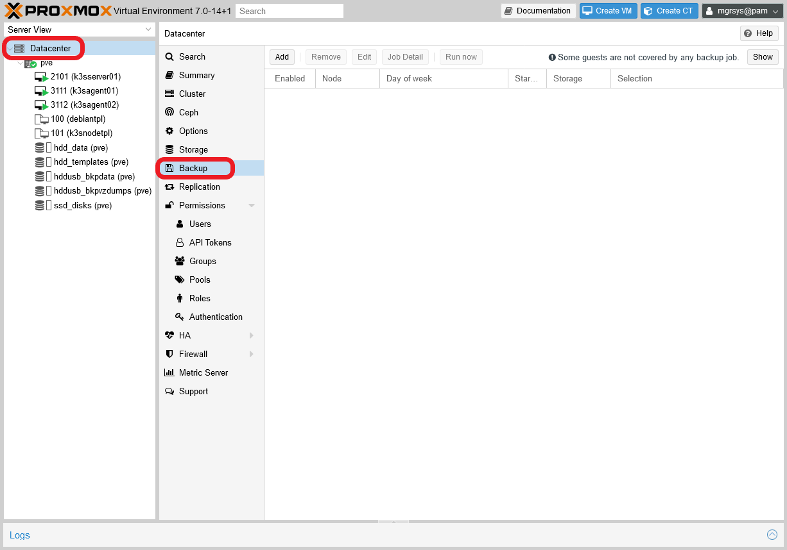

    This is the page where you can schedule backups for a Proxmox VE cluster. Of course, in your case, you'll only prepare backups for the VMs in your standalone PVE node.

2. Notice the warning message next to the action buttons available in this page.

    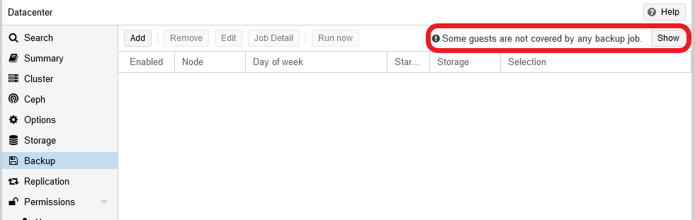

    It's telling you that there are VMs (the "_guests_" for Proxmox VE) not covered by any backup job. Press on the `Show` button, next to the message, to see which ones are considered not covered.

    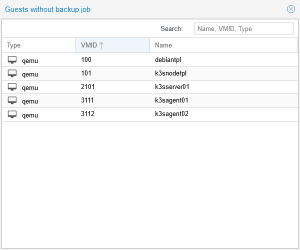

    Notice that lists all the VMs in the system, but also the VM templates. Remember that VM templates are just forever frozen-in-time VMs, so them appearing in this listing is not wrong technically speaking.

3. Return to the main Backup page and click on the `Add` button.

    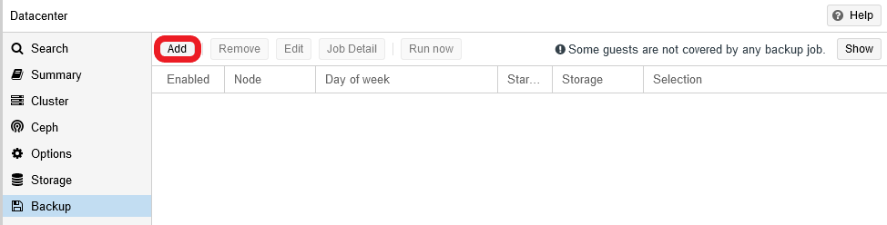

4. You'll get to a new window where you can program a backup job.

    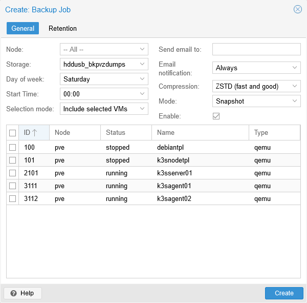

    This window has two tabs, and you get in the `General` one first by default. This tab gives you the parameters to configure how the backup job's is executed.

    - `Node`: default is `All`. In a Proxmox VE cluster environment, with several nodes available, you would be able to choose on which node to run the backup job. Although I haven't seen this explained in the official Proxmox VE documentation, probably, when you choose a node, the list of VMs (and containers if you're also using those) shown in this window will change to show only those running in that PVE node. Also, the documentation doesn't tell if its possible to choose more than one node at the same time.

    - `Storage`: default is the first one available in the PVE system. Specifies where to store the backups generated by the job. In this guide series you only configured one, the `hddusb_bkpvzdumps`, so that's the one being offered by default.

    - `Day of week`: default is `Saturday`. Here you can choose in which days of the week you want to execute the backup job. In the list you can mark several days, or even all of them.

    - `Start Time`: default is `00:00`. Indicates at which hour and minute you want to start the backup job. You can either type the hour and minute you want, or choose it from the list.
        > **BEWARE!**  
        > The time in in 24H format!

    - `Selection mode`: default is `Include selected VMs`. It allows to choose the mode in which you use the list of VMs (or containers) below. You can only apply one of the four modes available:
        - `Include selected VMs`: only the VMs selected will have their backup done in this job.
        - `All`: all the VMs in the list will have the backup done.
        - `Exclude selected VMs`: only the VMs NOT selected in the list will have their backup done.
        - `Pool based`: if you've organized your VMs in pools, you can just indicate which pool to backup and only those VMs within that pool will be affected by the backup job.

    - `Send email to`: default is empty string. If you want to receive an email warning you about the backup job being executed or failed, put an email address here.

    - `Email notification`: default is `Always`. This option determines when Proxmox VE sends the email warning about the backup job execution, either "always" (the official documentation doesn't explain what `Always` really means) or just on failures.

    - `Compression`: default is `ZSTD (fast and good)`. Offers you the possibility of compressing or not the backup of your VM or container. In a scenario with very limited storage like the one used in this guide series, its mandatory to compress the dumps as much as possible. The default `ZSTD` option is the best option since is not only the fastest algorithm of the three offered, but also is multi-threaded.

    - `Mode`: default is `Snapshot`. Indicates how you want to execute the backup on each VM. There are three modes available.
        - `Snapshot`: allows you to make backups of VMs that are running. This mode is the riskiest regarding data inconsistency, but this issue is reduced thanks to the use of the Qemu guest agent (installed in your VMs by default by their underlying Debian 11 OS) that allows Proxmox VE to suspend the VM while doing the backup.
        - `Suspend`: does essentially the same as `Snapshot`, but the official documentation recommends using `Snapshot` mode rather than this one.
        - `Stop`: executes an orderly shutdown of the VM, then makes the backup. After finishing the backup, it restarts the affected VM. This mode provides the highest data consistency in the resulting backup.
        > **BEWARE!**  
        > The behaviour of these backup modes for containers is very similar but not totally equivalent to how they work for VMs. Check the Proxmox VE help to see the differences.

    - `Enable`: default is checked. Enables or disables the backup job.

    - List of VMs and containers: default is **none** selected. The list where you choose which VMs (or containers) you want to backup with this job. Remember that this list changes depending on what `Node` or `Selection mode` are selected.

5. Now that you know about the `General` tab, you'll understand the configuration shown in the following snapshot.

    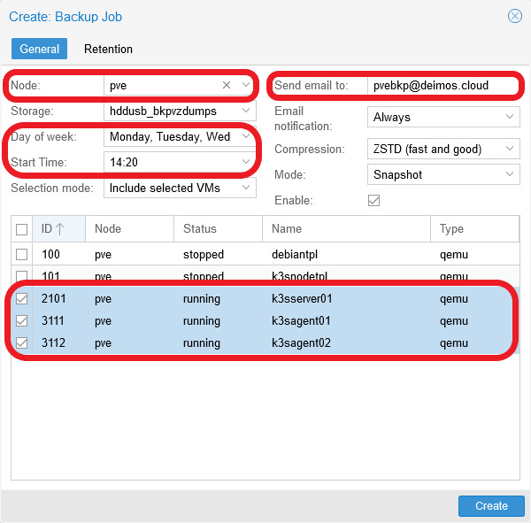

    Notice that I've changed the following parameters.

    - `Node` set to the only node available, the `pve` node. I made this on purpose, just to show how it would look.

    - `Day of week` has all days selected.

    - `Start time` is set to `14:20`, a value **not** available in this parameter's unfoldable list.

    - `Send email to`: some **fake** email to show on this guide.

    - At the VMs list I've chosen only the VMs of the K3s Kubernetes cluster. The VM templates already have their own backup made manually, and doesn't make sense either to run a backup job on them since VM templates cannot be modified (well, except their Proxmox VE configuration which you usually shouldn't touch again).

    > **BEWARE!**  
    > Don't click on `Create` just yet! There's something else to configure yet in this backup job.

6. With the `General` configuration set, now you have to check out the `Retention` tab, so click on it to meet the window below.

    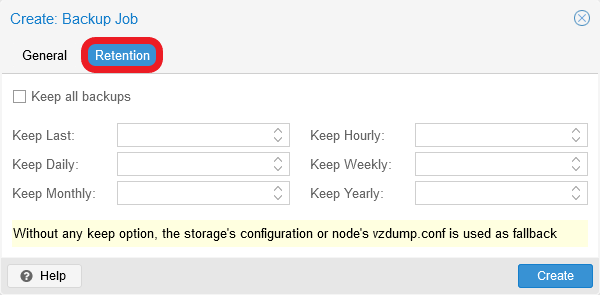

    The purpose of this tab if to define the retention policy applied on the backups generated by this backup job. In other words, is the policy that cleans up old backups following the criteria you specify here. The parameters available in this form all come blank or disabled by default.

    - `Keep all backups`: keeps all the backups generated from this backup job, so enabling it disables or nullifies all the other parameters.

    - `Keep Last`: keeps the last "N" of backups, with "N" being an integer number. So, if you tell it to keep the 10 most recent backups, the oldest 11th will be removed automatically.

    - `Keep Hourly/Daily/Weekly/Monthly/Yearly`: keeps **only one** backup for each of the last "N" hours/days/etc. If in an hour/day/etc happened to be more than one backup present, just the most recent is kept.

    > **BEWARE!**  
    > A backup job processes these retention options in a certain order. First goes the `Keep Last` option, then `Hourly`, `Daily`, etc. In other words, each option is a level of restriction that supersedes the previous one.  
    For example, if you set the job to keep the `Last` 30 backups, but also to keep only the ones from the last 5 hours, the `Hourly` restriction will apply to the 30 backups left by the `Last` rule.

    Also notice also the warning found almost at the window's bottom. It tells you that, if you don't specify anything in this tab, the retention policy applied in this backup job will be the one specified in the backup storage, or the one set in some `vzdump.conf` configuration file suppossedly found in "the node" (which one if you've chosen the option `All` and you have a Proxmox VE cluster with several of them?).

7. After learning what the `Retention` tab is, let's set a retention policy for this backup job.

    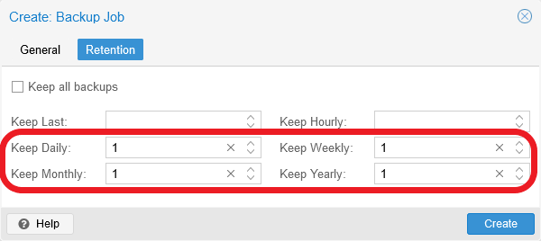

    The configuration above means the following:

    - Only one backup shall be kept from each day.
    - From all the dailies, only the last one from each week will be kept.
    - From all the weeklies, only the last one from each month will be preserved.
    - When a year is over, only the most recent monthly one will remain as a representative of the whole year.

8. If you are content with this backup job's configuration, click on the `Create` button found at the window's bottom.

    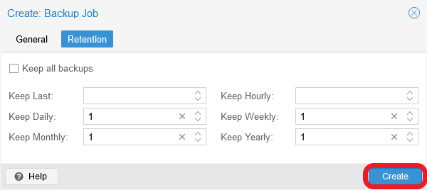

    After clicking on the `Create` button, the `Add` backup job window will close itself and you'll see almost immediately the new task in the `Backup` page.

    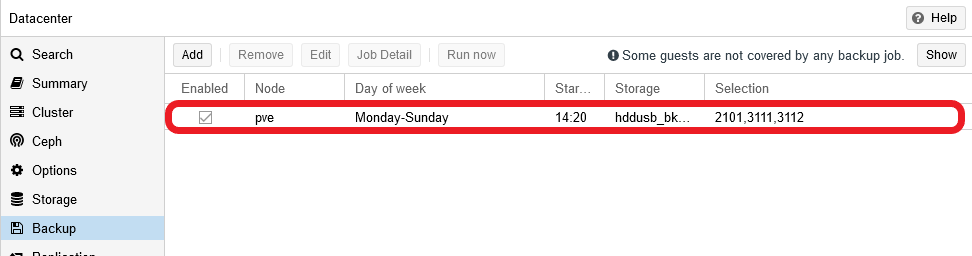

    See how some of the details of the new backup job appear in the list, such as its programming time, storage location and VMs selected (listed just by their IDs). Also see how the warning message about "_guests not covered_" is still present due to the VM templates being left out of the backup job.

    > **BEWARE!**  
    > Remember that you've only created the backup job task, not launched the backup process itself!

### _Testing the backup job_

Now that you got your first backup job ready, know that you don't have to wait for its set `Start Time` to see how it goes. Also there are other actions related to the management of backup jobs that you should get familiar with.

1. Select the new job to enable the other buttons available on this `Backup` page.

    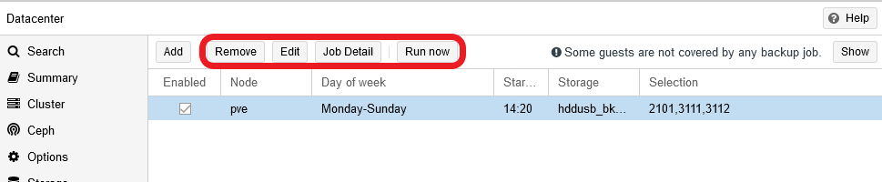

    The actions that you know have enabled have rather obvious names.
    - `Remove`: removes the selected backup job. It'll ask you for confirmation.
    - `Edit`: allows you to edit the job in the same form used for creating it.
    - `Job Detail`: presents you all the details of the selected job in a more complete way.
    - `Run now`: allows you to execute the selected job when you press it. You'll use it to test your job a few steps later.

2. Let's check the `Job Detail` first, so click on that button. A window like the one below should raise.

    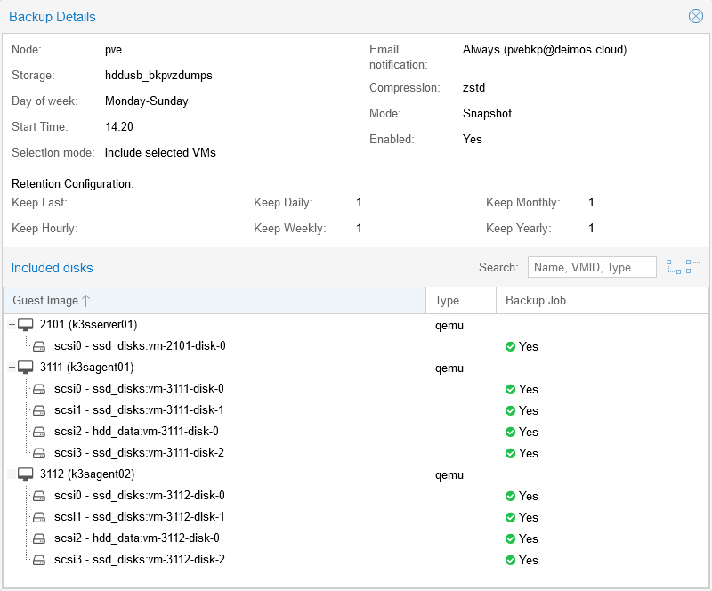

    Here you can see all the job's configuration laid out, plus a little extra that you should notice in the `Included disks` box below the `Retention Configuration` lines. There, this windows details all the virtual disks that are included in the backup, which are the ones currently attached to the VMs selected in this job's configuration. This is a read-only screen, so you cannot change anything here.

3. At last, lets make a test run of your new backup job. Be sure of keeping the job selected and then click on `Run now` above.

    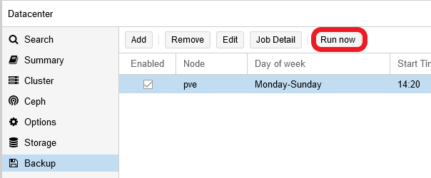

4. This action requires of your confirmation to be executed.

    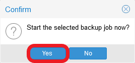

    Click on `Yes` to allow the backup job to proceed.

5. The resulting error window came as a surprise to me as I'm sure it'll be to you.

    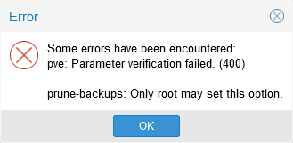

    This is a security error that, translated, tells you that only the `root` user can set retention policies on the backup jobs. You might wonder then if your `mgrsys` user doesn't already have all the administrative permissions. I've checked and yes, it has them all, so what to do then? Worry not and keep reading!

6. The easiest and most obvious way to overcome that issue is just login as `root` in the Proxmox VE web console, then browsing straigth back to the `Datacenter > Backup` page.

    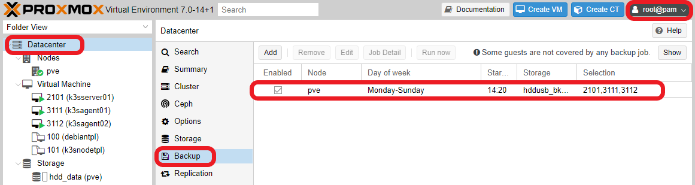

    In the snapshot above, you can see that I've logged in as `root`, and that in the `Backup` page the backup job appears listed just the same, meaning that it's not directly tied to the user that created it at all (which makes sense since it's a system task).

7. Select the backup job and click on `Run now`.

    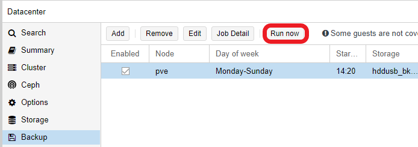

8. Again, you'll have to answer `Yes` to the confirmation dialog that the web console raises.

    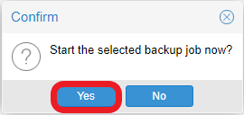

9. Unlike other operations done in the Proxmox VE web console, this one doesn't have a progress window. You'll have to unfold the `Tasks` console found at the bottom of the page to see the backup job running.

    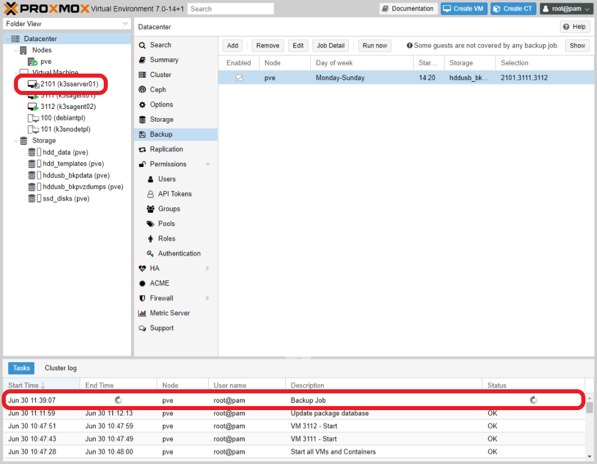

    Notice the log with the `Backup job` description and the animated "running" icons. Also, in the sidebar showing all your VMs, see how the VM being backed up currently has its icon changed to something else, indicating that it's going under the procedure.

    On the other hand, if you go to the `Cluster log` tab, you'll find there a log entry also related to this backup job.

    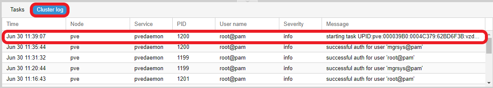

    Internally for Proxmox VE, the backup job is a task with an hexadecimal identifier called UPID. See how the log message says "`starting task UPID:pve`" and, after the UPID code itself, you should see the string "`vzdump::root@pam:`".

10. After a while, the backup job will end but you'll probably notice it first in the `Tasks` console.

    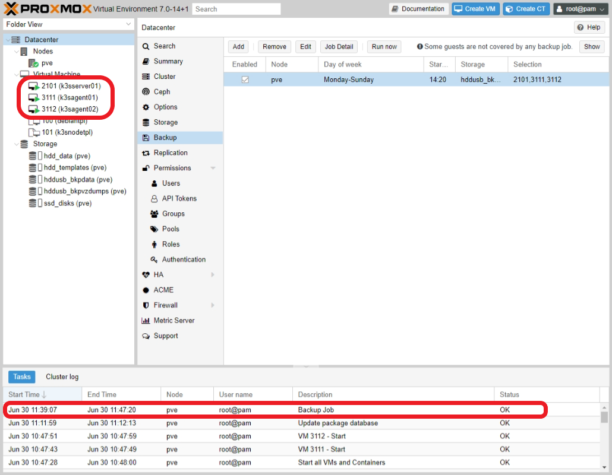

    You'll see that the task has an `End Time` set and a `OK` in the `Status` field, replacing the animated running icon from before. Also, in the sidebar all the affected VMs will appear with their running icon.

    Meanwhile, in the `Cluster log` tab, you'll find a new log entry referred to the end of the task.

    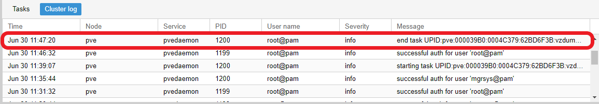

    On the other hand, if you configured the backup job with a valid email address, when it finishes you should receive an email that looks like below.

    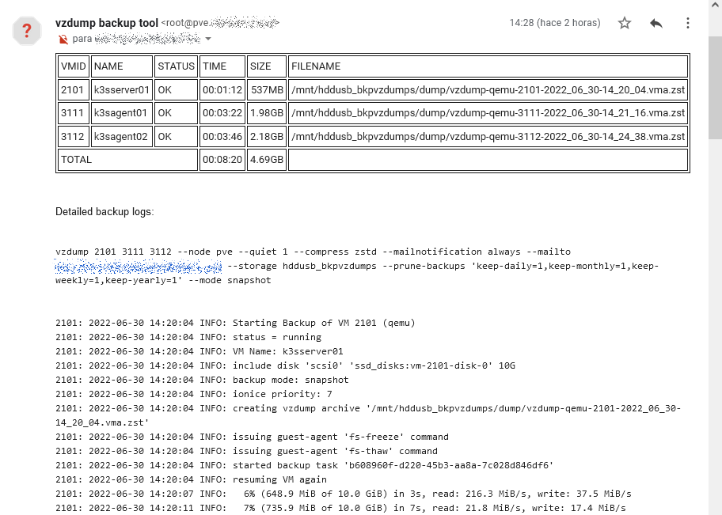

    It includes a table which summarizes the job's results, including backup sizes and partial and total processing time, and also the execution logs for each VM's backup headed by the command used in them.

    > **BEWARE!**  
    > Your email service may treat this message as spam (as it happened to me with Gmail, for instance) so, if you don't see it in your inbox, remember to check in the spam section.

    So, how long does this backup job takes? As you can see in the captures, in my case it took around 8 minutes and a bit more but, of course, there wasn't that much data to backup to begin with. Also, in a more capable hardware, this time might be reduced significantly.

11. Log off from your `root` session and get back as `mgrsys` (remember, the less you use the `root` user the better). Then open the `Tasks` console.

    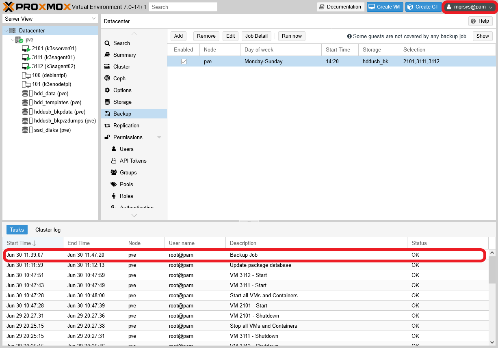

    See how the list of tasks logger there is exactly the same as the one seen as `root`. The same thing happens with the `Cluster log` view, where you'll see the same logs, including the ones related to the backup job you've just run before.

    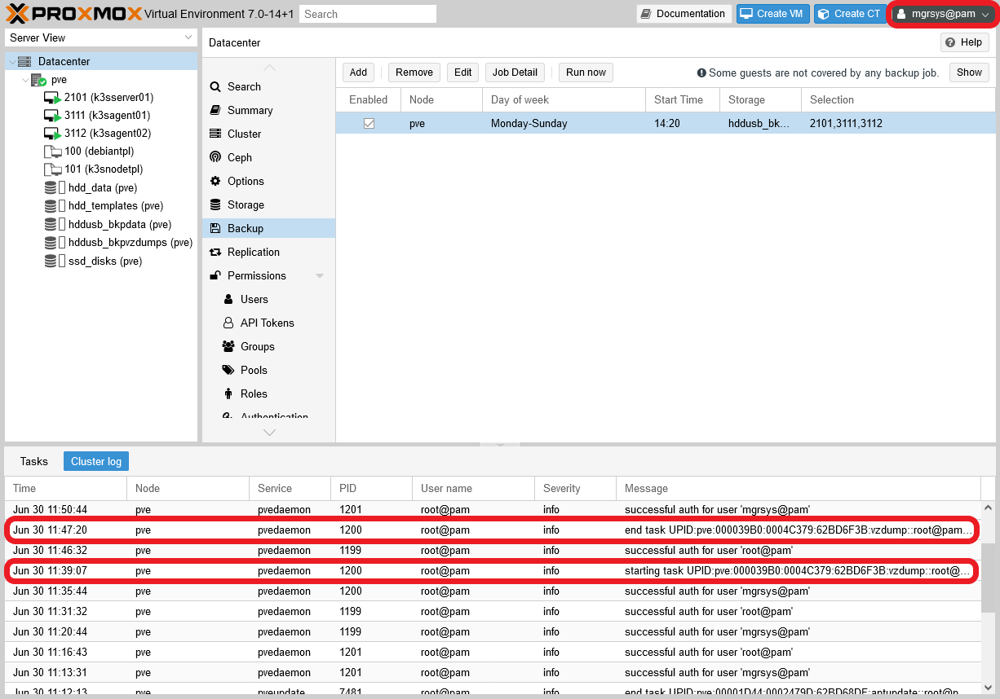

12. Now, let's find the backups generated by the job. Each backup is associated with a particular VM, then you can go to each VM's backup page and find the corresponding backup there.

    - Backup page of the `k3sserver01` VM.

        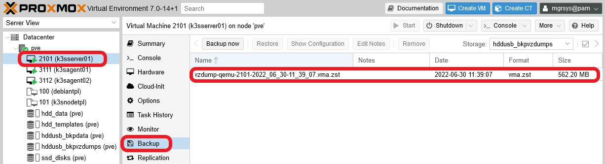

    - Backup page of the `k3sagent01` VM.

        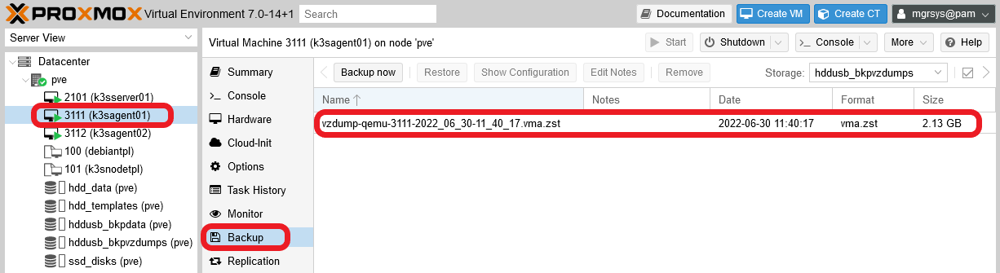

    - Backup page of the `k3sagent02` VM.

        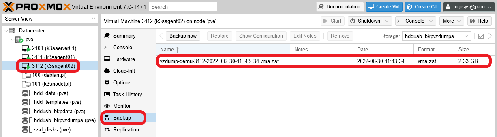

    Each backup has a different size, and the one for the `k3sserver01` VM is noticeable smaller than the ones for the K3s agent node VMs. This makes perfect sense since the agent nodes are where applications are deployed in your K3s Kubernetes cluster, and also where several virtual storage drives have been attached.

13. There's another page where you can see all those backups, plus others, in one single place. This place is the page of the storage where all the backups done in this guide series have been saved, a partition set a external USB HDD drive and named `hddusb_bkppvzdumps` within Proxmox VE. Browse there and be sure to start in the `Summary` tab.

    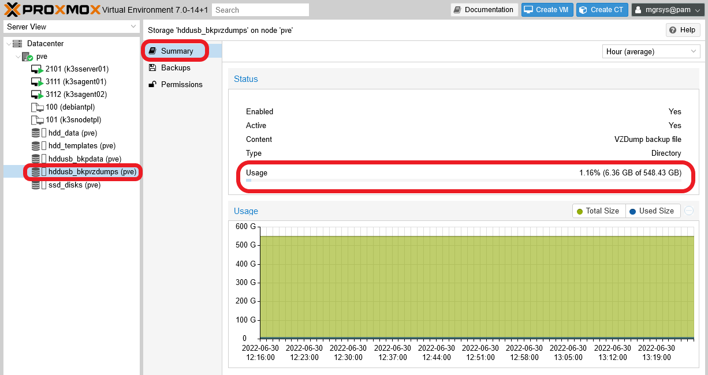

    In this view you can see how much space you have used, which is not much yet in this case. You'll have to check out this usage frequently, to be sure of not running out of storage space for your backups.

14. Remaining in the same page, now click on the `Backups` tab.

    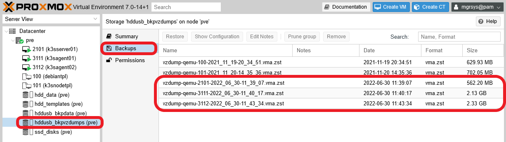

    Here you'll not only find your newest backups, but also the dumps you did for the VM templates, way back in the [G023 guide](G023%20-%20K3s%20cluster%20setup%2006%20~%20Debian%20VM%20template%20and%20backup.md#vm-templates-backup).

Now that you've validated the backup job's execution, the remaining things to verify are if the job launches at the time you programmed it, and if the pruning of older backups follows your job's retention policy correctly.

## Restoring a backup in Proxmox VE

You've already seen a detailed explanation about how to restore a backup [in the **G023** guide](G023%20-%20K3s%20cluster%20setup%2006%20~%20Debian%20VM%20template%20and%20backup.md#restoring-the-vm-templates-backup). So, what else is to say about this process? A couple of things more in fact.

### _Generating new VMs from backups_

You can generate new VMs (or containers) from backups, if you execute the restoration process from the `Backup` tab of the storage that keeps them. So, in your system you would do the following.

1. Login as `mgrsys` in your Proxmox VE web console, then go to the `Backup` tab of the `hddusb_bkppvzdumps` storage.

    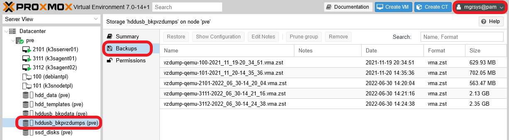

2. Select one of the backups listed there, for instance one from the K3s agent node VMs.

    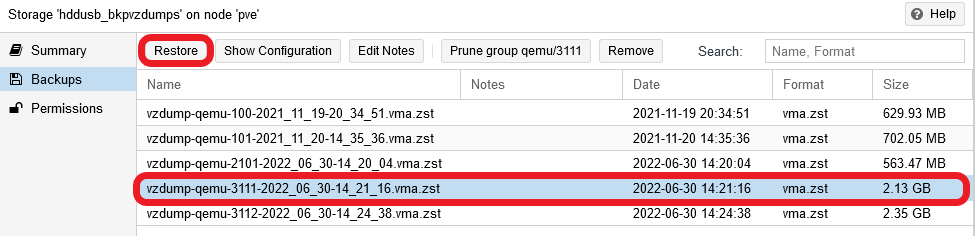

    With the buttons enabled, press on `Restore`.

3. You'll meet a `Restore` window which is a bit different to the one you get in the `Backup` tab of any of your VMs' management page.

    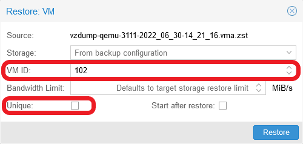

    I've highlighted in the snapshot above this window's two main particularities.
    - The `VM ID` field is editable here, so you can assign any identifier to the new VM generated from this restoration process.
        - See how by default it already puts the lowest identifier available, in this case `102`. Remember that this ID can't be lower than `100`.
        - You can't put an ID already in use. If you do, the field will be highlighted in red and the `Restore` button will be disabled. It doesn't matter if the ID is the same as the VM from which the backup was made, as shown below.

        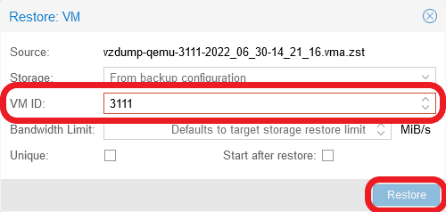

    - The `Unique` checkbox is to make certain internal properties of the VM, like the MAC addresses of its network cards, unique. In other words, by enabling this option, the new VM won't have the same values in those internal properties as the original VM.
        - This is usually very convenient to enable, except when you're planning to replace the original VM with the restored one.

4. Since this is just a demonstration, let's set the `VM ID` to a high value that doesn't follow the same criteria applied to the other VMs. Also, let's enable the `Unique` option but do **NOT** check the `Start after restore` option, since it could mess up your K3s Kubernetes cluster by having two identical K3s agents running at the same time.

    

    See that I've left the other parameters with default values, and that the `Restore` button remains enabled since the configuration is proper.

5. Click on `Restore` and the task will start right away, without asking you for confirmation. You'll get directly a `Task viewer` window where the restoration process shows its progress.

    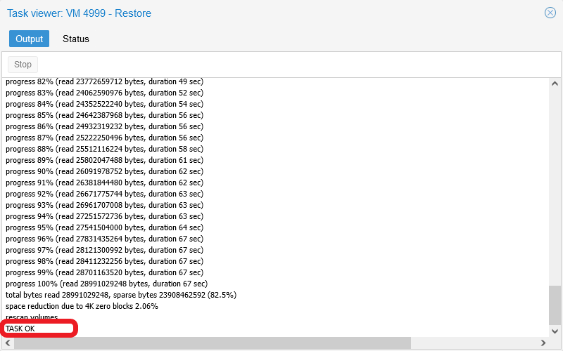

    When you see the log line `TASK OK`, that's when you'll know the restoration process is over.

6. Close the `Task viewer` and check on the sidebar tree that the newly generated VM is present there.

    

    As expected, it appears as stopped with the VM ID established in the `Restore` window before. But see how it's name is the same as the one from its original VM, `k3sagent01`.

7. Get into this new VM's management page and go to its `Hardware` tab.

    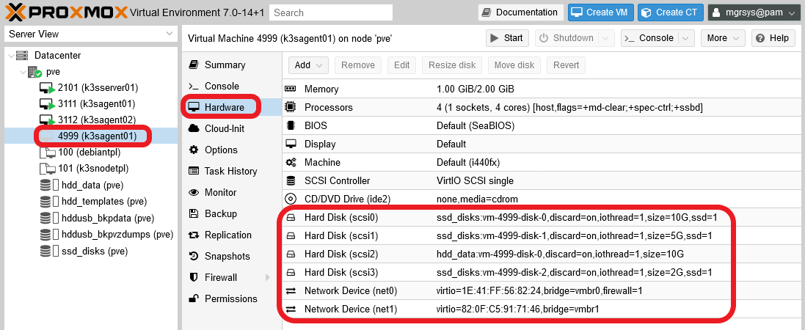

    See that this VM has the same hardware arrangement as the original `k3sagent01`. In particular, it comes with its own four virtual storage drives (or `Hard Disk` as they're called in Proxmox VE) configured in the same way, and also two virtual network devices.

8. Remember that you can change the name any VM has in Proxmox VE in their `Options` tab.

    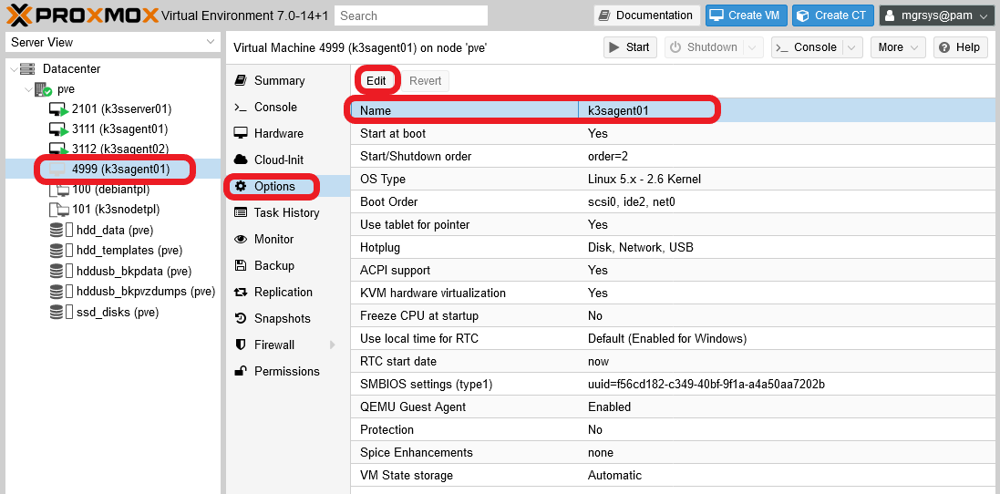

    Just select the `Name` field and press on `Edit`.

9. Since this was just a demonstration, delete this VM by unfolding the `More` menu then clicking on `Remove`.

    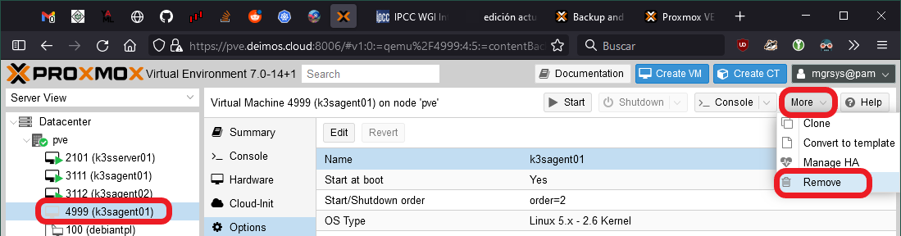

10. You'll have to confirm the action in its corresponding `Confirm` window.

    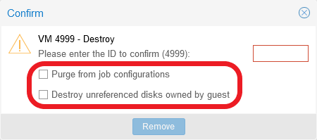

    Pay attention to the options offered in this window.

    - `Purge from job configurations` means that if this VM was included in backup or other kind of jobs within Proxmox VE, it'll be delisted from all of them. Since this particular VM is not in any job, you wouldn't need to enable this one.
    - `Destroy unreferenced disks owned by guests` refers to those virtual storage drives that are associated with the VM but are not attached to it (or any other VM, although I haven't seen if this is possible within Proxmox VE). With this option on, all related virtual storages related to the VM will be removed.

11. Input the `VM ID` of this VM you're about to remove for confirming the action, and also check both options on (this is just to be sure the removal is thorough).

    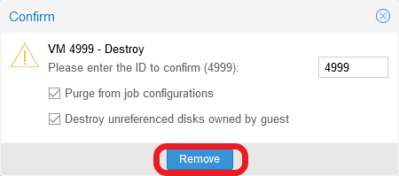

    The `Remove` button will be enabled, so click on it. Unfold the `Tasks` console to see the process progress, which should finish in a rather short time.

    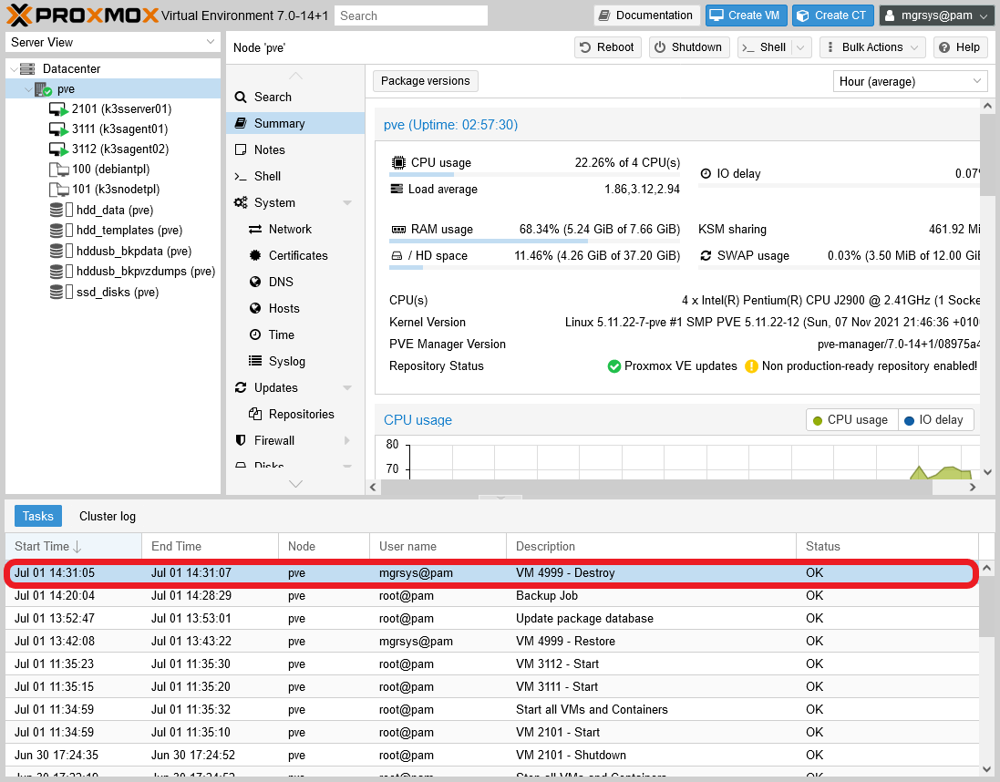

### _You cannot restore a live VM_

Let's say that, for some reason, you want or need to restore the `k3sagent02` VM, and you somehow forget that's still running. What will happen? Find out following the steps next.

1. Go to the `Backup` tab of your `k3sagent02` VM, choose the most recent backup you have and press `Restore`.

    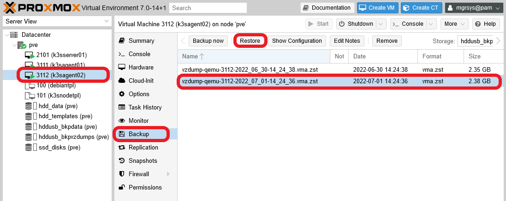

2. In the `Restore` window that appears, you'll consider that you want to make the VM start right after being restored, so you enable that option while you leave the rest with the default options.

    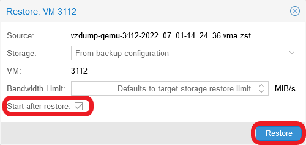

3. A confirmation window asks you to accept the action, warning you that any non-backuped data in the current instance of the VM will be permanently erased (meaning lost).

    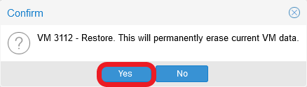

    Since you know that the backup you've chosen to restore is very recent, you're sure of not losing anything important, so you press `Yes`.

4. A `Task viewer` window is raised, showing you the output of this process. To your surprise (and mine somewhat), it informs you that the task has failed!

    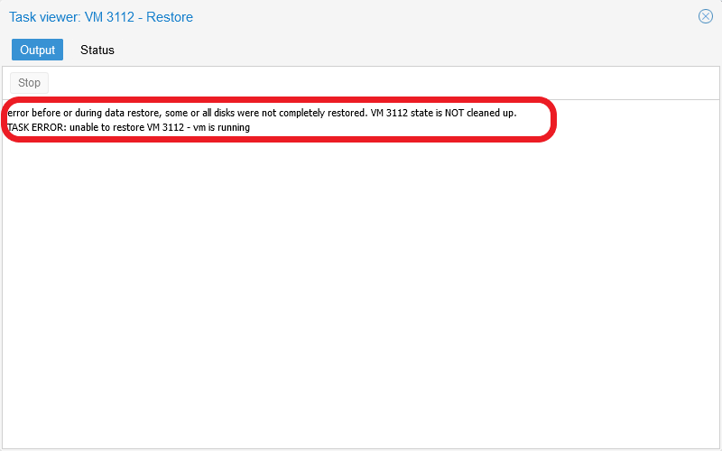

    In short, the log messages shown in the `Output` tab tells you that you can't execute a restoration on a VM that's currently running.

You might wonder why the web console doesn't block the `Restore` action in the first place. Well, since nothing is broken, we have to take this as just one of the many idiosyncrasies within the Proxmox VE software, and hope that they improve this and other things in future releases.

> **BEWARE!**  
> This is just a note for reference. This behaviour has been detected in the `7.0-14+1` version of Proxmox VE, a detail visible in some of the snapshots shown in this guide.

## Location of the backup files in the Proxmox VE system

The VM (or container) backups are just compressed dump files, that are perfectly accessible as any other file in the underlying Debian 11 Linux system. But, to reach them, first you need to know where they are. The storage where you have the backups, the `hddusb_bkpvzdumps` one, is one of the two LVs you setup as directories [back in the **G019** guide](G019%20-%20K3s%20cluster%20setup%2002%20~%20Storage%20setup.md#setting-up-the-directories), which both you mounted under the `/mnt` path.

1. Open a shell in your Proxmox VE as `mgrsys`, then do an `ls` to `/mnt`.

    ~~~bash
    $  ls -al /mnt
    total 20
    drwxr-xr-x  5 root root 4096 Nov 17  2021 .
    drwxr-xr-x 18 root root 4096 Nov 10  2021 ..
    drwxr-xr-x  5 root root 4096 Nov 17  2021 hdd_templates
    drwxr-xr-x  4 root root 4096 Nov 17  2021 hddusb_bkpvzdumps
    drwxr-xr-x  2 root root 4096 Nov  6  2021 hostrun
    ~~~

    The folder you're looking for is the `hddusb_bkpvzdumps` one. Remember that `hdd_templates` is for storing the ISOs for installing operative systems in your VMs, and `hostrun` is something system-related that you shouldn't touch at all.

2. Do `ls` of that `hddusb_bkpvzdumps` folder.

    ~~~bash
    $ ls -al /mnt/hddusb_bkpvzdumps
    total 28
    drwxr-xr-x 4 root root  4096 Nov 17  2021 .
    drwxr-xr-x 5 root root  4096 Nov 17  2021 ..
    drwxr-xr-x 2 root root  4096 Jul  1 14:28 dump
    drwx------ 2 root root 16384 Nov 17  2021 lost+found
    ~~~

    The important folder to notice here is `dump`, while at this point you should now that `lost+found` is filesystem-related.

3. Now make an ls -al of that `dump` folder.

    ~~~bash
    $ ls -al /mnt/hddusb_bkpvzdumps/dump
    total 11180104
    drwxr-xr-x 2 root root       4096 Jul  1 14:28 .
    drwxr-xr-x 4 root root       4096 Nov 17  2021 ..
    -rw-r--r-- 1 root root       8316 Nov 19  2021 vzdump-qemu-100-2021_11_19-20_34_51.log
    -rw-r--r-- 1 root root  629933942 Nov 19  2021 vzdump-qemu-100-2021_11_19-20_34_51.vma.zst
    -rw-r--r-- 1 root root       8316 Nov 20  2021 vzdump-qemu-101-2021_11_20-14_35_36.log
    -rw-r--r-- 1 root root  702047470 Nov 20  2021 vzdump-qemu-101-2021_11_20-14_35_36.vma.zst
    -rw-r--r-- 1 root root       3539 Jun 30 14:21 vzdump-qemu-2101-2022_06_30-14_20_04.log
    -rw-r--r-- 1 root root  563467424 Jun 30 14:21 vzdump-qemu-2101-2022_06_30-14_20_04.vma.zst
    -rw-r--r-- 1 root root       3387 Jul  1 14:21 vzdump-qemu-2101-2022_07_01-14_20_04.log
    -rw-r--r-- 1 root root  564322203 Jul  1 14:21 vzdump-qemu-2101-2022_07_01-14_20_04.vma.zst
    -rw-r--r-- 1 root root       5212 Jun 30 14:24 vzdump-qemu-3111-2022_06_30-14_21_16.log
    -rw-r--r-- 1 root root 2128983119 Jun 30 14:24 vzdump-qemu-3111-2022_06_30-14_21_16.vma.zst
    -rw-r--r-- 1 root root       5064 Jul  1 14:24 vzdump-qemu-3111-2022_07_01-14_21_16.log
    -rw-r--r-- 1 root root 2131544411 Jul  1 14:24 vzdump-qemu-3111-2022_07_01-14_21_16.vma.zst
    -rw-r--r-- 1 root root       5515 Jun 30 14:28 vzdump-qemu-3112-2022_06_30-14_24_38.log
    -rw-r--r-- 1 root root 2345232255 Jun 30 14:28 vzdump-qemu-3112-2022_06_30-14_24_38.vma.zst
    -rw-r--r-- 1 root root       5758 Jul  1 14:28 vzdump-qemu-3112-2022_07_01-14_24_36.log
    -rw-r--r-- 1 root root 2382773755 Jul  1 14:28 vzdump-qemu-3112-2022_07_01-14_24_36.vma.zst
    ~~~

    At last you hit the jackpot! There you can see all the backups currently kept in this `hddusb_bkpvzdumps` storage. All of them are dailies, as you can see by the dates in their names. Also notice that, for each backup present, there are two files:

    - A `.log` file where is annotated the progress log of its related backup.
    - A `.vma.zst` file which is the compressed dump file itself.

So, if you wanted, you could connect through SSH with a tool like WinSCP and copy those files to another storage for better safe keeping. What I cannot tell you is how Proxmox VE keeps track of those files to relate them to their proper VMs, although I suspect it does simply by looking to the VM ID annotated right after the `vzdump-qemu-` string in the file name.

## Relevant system paths

### _Directories on Proxmox VE_

- `/mnt`
- `/mnt/hddusb_bkpvzdumps`
- `/mnt/hddusb_bkpvzdumps/dump`

## References

### _Proxmox VE_

- [Wiki. Backup and Restore](https://pve.proxmox.com/wiki/Backup_and_Restore)
- [Administrator Guide. Backup and Restore](https://pve.proxmox.com/pve-docs/pve-admin-guide.html#chapter_vzdump)
