# G039 - Backups 03 ~ Proxmox VE backup job

- [Backup your VMs in Proxmox VE](#backup-your-vms-in-proxmox-ve)
- [What gets covered with the backup job](#what-gets-covered-with-the-backup-job)
- [Why scheduling a backup job](#why-scheduling-a-backup-job)
- [How it affects the K3s Kubernetes cluster](#how-it-affects-the-k3s-kubernetes-cluster)
- [When to do the backup job](#when-to-do-the-backup-job)
- [Scheduling the backup job in Proxmox VE](#scheduling-the-backup-job-in-proxmox-ve)
  - [Testing the backup job](#testing-the-backup-job)
- [Restoring a backup in Proxmox VE](#restoring-a-backup-in-proxmox-ve)
  - [Generating new VMs from backups](#generating-new-vms-from-backups)
  - [You cannot restore a live VM](#you-cannot-restore-a-live-vm)
- [Location of the backup files in the Proxmox VE system](#location-of-the-backup-files-in-the-proxmox-ve-system)
- [Relevant system paths](#relevant-system-paths)
  - [Directories on Proxmox VE](#directories-on-proxmox-ve)
- [References](#references)
  - [Proxmox](#proxmox)
- [Navigation](#navigation)

## Backup your VMs in Proxmox VE

Back in the [chapter **G023**](G023%20-%20K3s%20cluster%20setup%2006%20~%20Debian%20VM%20template%20and%20backup.md#vm-templates-backup), you learned how to do a manual backup of a VM template in Proxmox VE, which is the same manual process available to do a VM backup. With that experience in mind, this chapter covers how to schedule in Proxmox VE an automated job that backups periodically the virtual machines used as nodes of your K3s cluster.

## What gets covered with the backup job

The backup job explained here covers the three virtual machines acting as nodes of the K3s Kubernetes cluster deployed in previous guides. This means that each VM is going to be completely copied in its own backup, including all the virtual storage drives they may have attached at the moment the backup is executed.

Therefore, you are treating these VMs like you did with your Proxmox VE system and Clonezilla in the previous [chapter **G038**](G038%20-%20Backups%2002%20~%20Host%20platform%20backup%20with%20Clonezilla.md), because that is what they are: the VMs are the hosts of your Kubernetes cluster and all the applications deployed in it, together with their data. The difference is that you control the backup procedure in a more friendly way thanks to the capabilities Proxmox VE offers in this regard.

## Why scheduling a backup job

You might think, if I already do Clonezilla backups regularly, why doing these?

1. **These backups are only about the VMs, not the whole Proxmox VE setup**\
   By having these VM backups, you can restore each VM independently when required, not your whole Proxmox VE system.

2. **The Proxmox backup jobs are really easy to schedule and leave on their own**\
   Once you have scheduled them, you do not have to remember to execute them: Proxmox does that for you.

## How it affects the K3s Kubernetes cluster

Since a VM backup copies the entire virtual machine, the VM must be stopped so the backup process can be executed on it. Of course, this implies that your K3s Kubernetes cluster will not be available for as long as the backup takes to finish. Bear in mind that this unavailability is not symmetric (so to speak):

- When the backup job starts executing the backup of the K3s server node of your Kubernetes cluster, the entire K3s cluster is taken down. This means that you cannot reach it with `kubectl`. The agent nodes keep on running but waiting for their server to come back.

- When the backup executed is on one of the K3s agent nodes, the K3s cluster remains available to your `kubectl` commands, but anything running in the stopped agent node is taken down until the backup finishes and the VM boots up again.

The Proxmox VE automated backup system is able to stop and start the affected VMs on its own. You do not have to worry about manually restart them after the backup job is done.

## When to do the backup job

On one hand, your VMs are the host platform for your Kubernetes cluster. This means that you'll want to have their backups ready at hand before you apply updates or relevant configuration changes on them, or just to be ready in case harmful events happen to those VMs. On the other hand, each VM (in particular the ones serving as K3s agent nodes) holds application and user data, and such contents can change daily.

Taking into account those two perspectives, at least a weekly backup of each VM would be the bare minimum to have, although it would be much better if you do it daily.

## Scheduling the backup job in Proxmox VE

Scheduling backup jobs is rather easy on Proxmox VE. Just log in the Proxmox VE web console with the `mgrsys` user and follow the procedure described next:

1. After login in the PVE web console, go to the `Datacenter > Backup` page:

    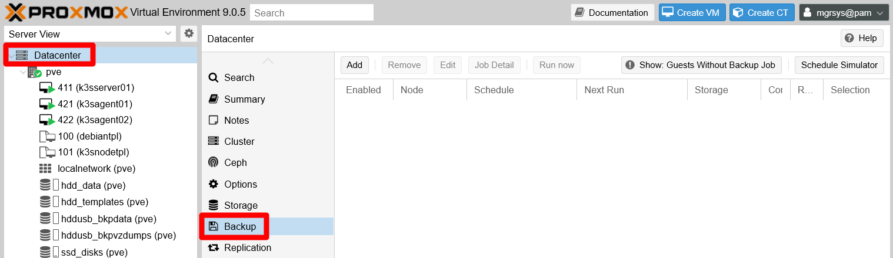

    Here you can schedule backups for a Proxmox VE cluster. Of course, in your case, you have to prepare backups only for the VMs in your standalone PVE node.

2. Notice the warning message next to the action buttons available in this page:

    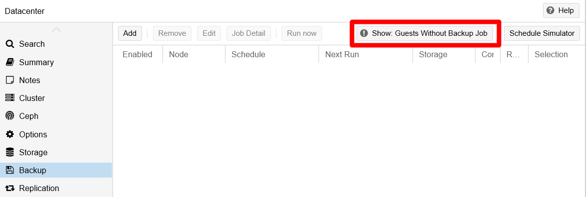

    It warns about VMs (the "_guests_" for Proxmox VE) not being covered by any backup job. The warning itself is a button, so press it to see which guests are considered not covered:

    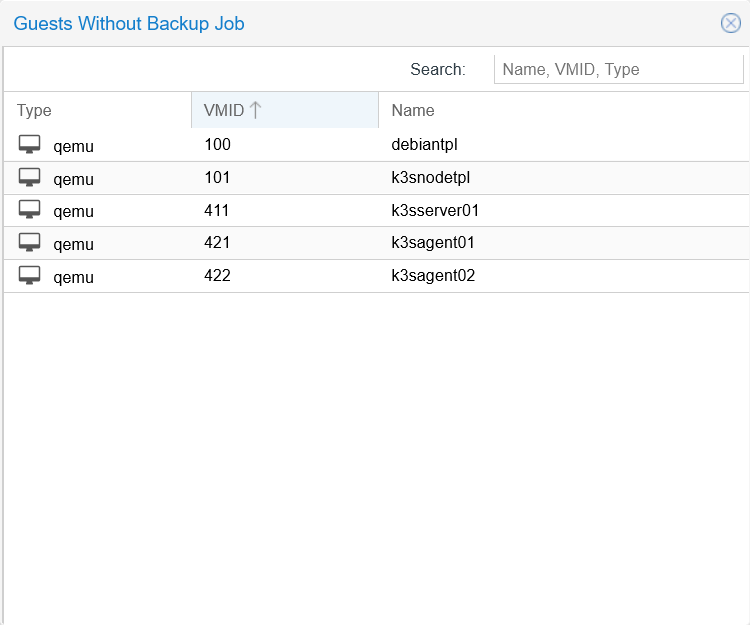

    Notice that lists all the existing VMs in the system, but also the VM templates. Remember that VM templates are just forever frozen-in-time VMs, so them appearing in this listing is not wrong technically speaking.

3. Return to the main `Backup` page and click on the `Add` button:

    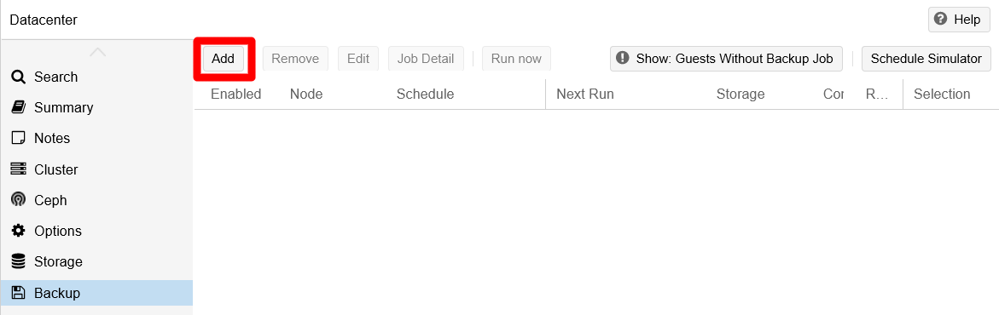

4. You get into a new window where you can schedule a backup job:

    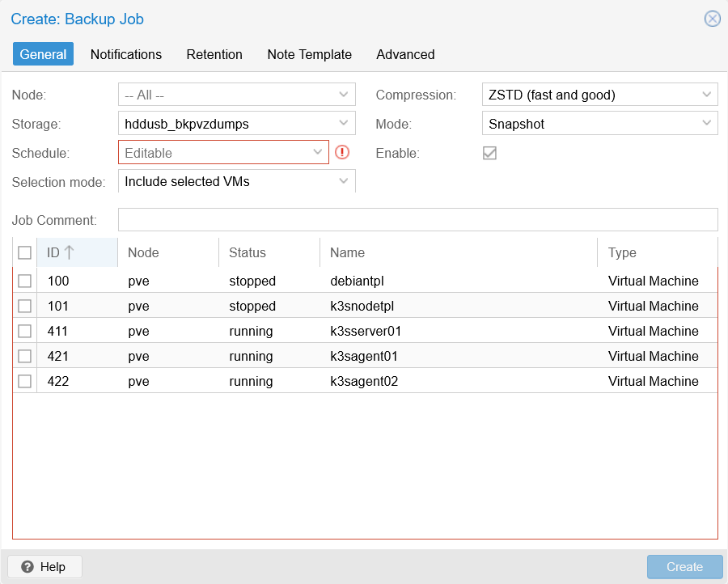

    This window has several tabs, and you start in the `General` one by default. This tab gives you the parameters to configure how the backup job's is executed:

    - `Node`: default is `All`.\
      In a Proxmox VE cluster environment, with several nodes available, you would be able to choose on which node to run the backup job. Although this is not explained in the official Proxmox VE documentation, when you choose a node, the list of VMs (and containers if you're also using those) shown in this window will change to list only those running in that PVE node. Also, the documentation doesn't tell if its possible to choose more than one node at the same time.

    - `Storage`: default is the first backup storage available in the PVE system.\
      Specifies where to store the backups generated by the job. In this guide there is only one backup storage enabled, the `hddusb_bkpvzdumps`, so that is the one being offered by default.

    - `Schedule`: empty by default.
      In this field you specify the schedule you want for the backup. You can enter a predefined schedule from the list offered by the field:

      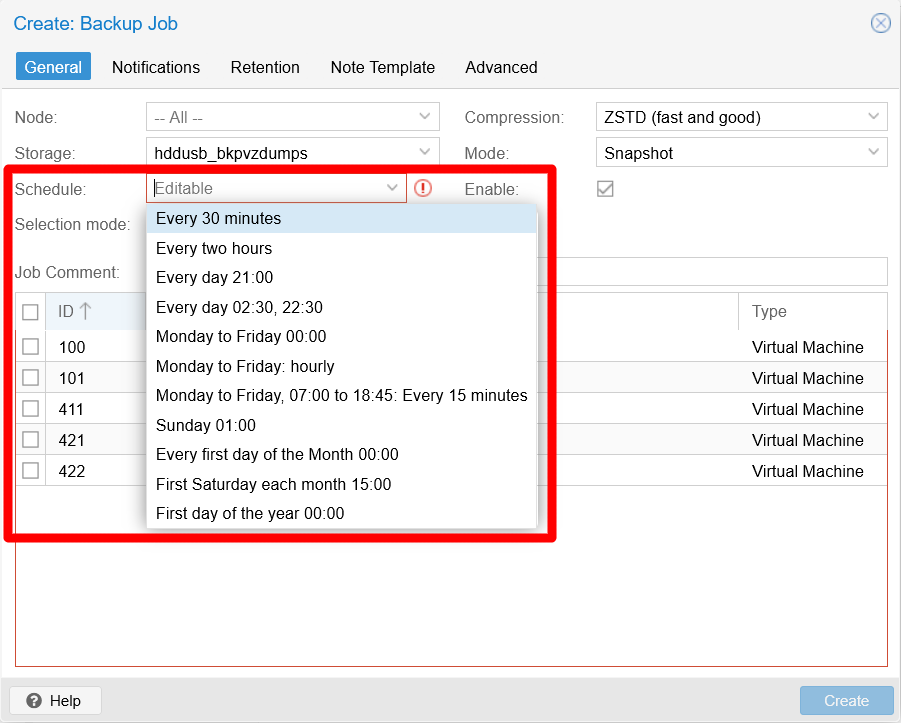

      The option you choose fills the `Schedule` field as a string you can edit later:

      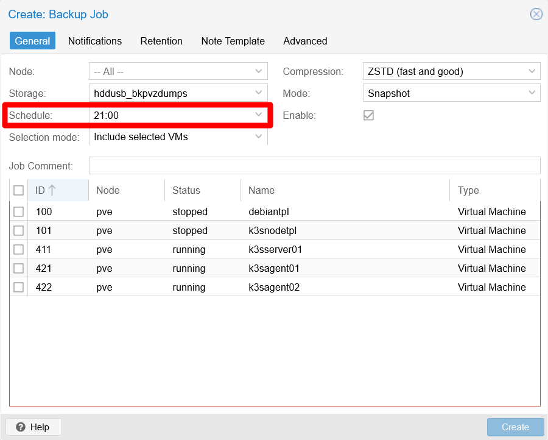

      The schedule set above is a daily one that is executed at 21:00, but you can change it to suit your needs.

      > [!IMPORTANT]
      > **Careful with the time format**\
      > The time is always set in 24H format.

    - `Selection mode`: default is `Include selected VMs`.\
      Allows to choose in which mode the list of VMs (or containers) below is processed. You can only apply one of these four modes:

      - `Include selected VMs`\
        Only the VMs selected will have their backup done in this job.

      - `All`\
        All the VMs in the list will have the backup done.

      - `Exclude selected VMs`\
        Only the VMs NOT selected in the list will have their backup done.

      - `Pool based`\
        If you have organized your VMs in pools, you can just indicate which pool to backup and the job will only backup those VMs within that pool.

    - `Compression`: default is `ZSTD (fast and good)`.\
      Offers the possibility of compressing or not the backup of your VM or container. In a scenario with very limited storage like the one used in this guide, it is mandatory to compress the dumps as much as possible. The default `ZSTD` option is not only the fastest algorithm of the three offered, but it is also multi-threaded.

    - `Mode`: default is `Snapshot`.\
      Indicates how you want to execute the backup on each VM. There are three modes available.

      - `Snapshot`:\
        Allows you to make backups of VMs that are running. This mode is the riskiest regarding data inconsistency, but this issue is reduced thanks to the use of the Qemu guest agent (installed in your VMs by default by their underlying Debian 11 OS) that allows Proxmox VE to suspend the VM while doing the backup.

      - `Suspend`:\
        Does essentially the same as `Snapshot`, but the official documentation recommends using `Snapshot` mode rather than this one.

      - `Stop`:\
        Executes an orderly shutdown of the VM, then makes the backup. After finishing the backup, it restarts the affected VM. This mode provides the highest data consistency in the resulting backup.

        > [!IMPORTANT]
        > **The backup modes do not work exactly the same for containers**\
        > The behavior of these backup modes for containers is very similar but not totally equivalent to how they work for VMs. Check the Proxmox VE help to see the differences.

    - `Enable`: default is checked.\
      Enables or disables the backup job.

    - `Job Comment`: default is empty.\
      Just a comment string.  

    - List of VMs and containers: default is **none selected**.\
      The list where you choose which VMs (or containers) you want to backup with this job. Remember that this list changes depending on what `Node` or `Selection mode` are selected.

5. After learning about the `General` tab, you can understand the configuration shown in this snapshot:

    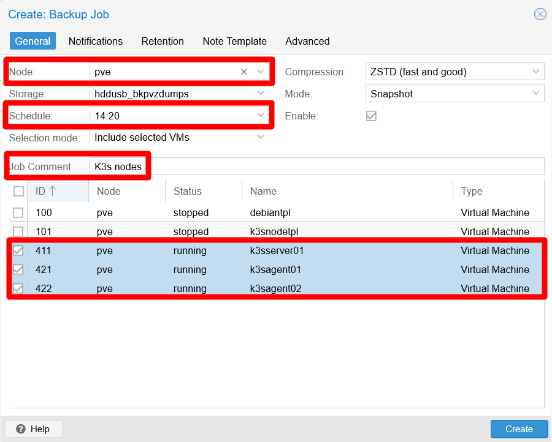

    Notice that the following fields have changed:

    - `Node` set to the only node available, the `pve` node.

    - `Schedule` configures this job to execute daily at `14:20`.

    - `Job Comment` has a short line as a reminder of what is being backed up by this job.

    - At the VMs list, only the VMs of the K3s Kubernetes cluster are chosen. The VM templates already have their own backup made manually, and does not make sense either to run a backup job on them since VM templates cannot be modified (well, except their Proxmox VE configuration which you usually should not touch again).

    > [!WARNING]  
    > **Do not click on `Create` just yet!**\
    > There are more tabs to review in this backup job configuration window.

6. Click on the `Notifications` tab to open the window below:

    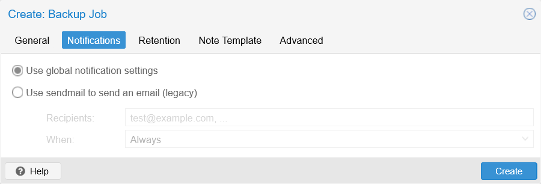

    As you can see, this tab exists only to maintain the legacy option of sending email notifications regarding the backup job through a sendmail server. Just leave the default option and proceed to the next tab.

7. In the `Retention` tab you have a scheduling grid:

    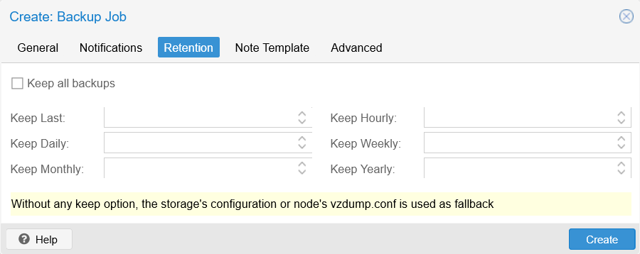

    This tab is where you define the retention policy applied to the backups generated by this backup job. In other words, is the policy that cleans up old backups following the scheduling criteria you specify here. The parameters available in this form all come blank or disabled by default.

    - `Keep all backups`\
      Keeps all the backups generated from this backup job, so enabling it disables or nullifies all the other parameters.

    - `Keep Last`\
      Keeps the last "N" of backups, with "N" being an integer number. So, if you tell it to keep the 10 most recent backups, the oldest 11th will be removed automatically.

    - `Keep Hourly/Daily/Weekly/Monthly/Yearly`\
      Keeps **only one backup** for each of the last "N" hours/days/etc. If in an hour/day/etc happened to be more than one backup present, just the most recent is kept.

    > [!IMPORTANT]
    > **Backup jobs process these retention options in a certain order**\
    > First goes the `Keep Last` option, then `Hourly`, `Daily`, etc. In other words, each option is a level of restriction that supersedes the previous one.
    >
    > For example, if you set the job to keep the `Last` 30 backups, but also to keep only the ones from the last 5 hours, the `Hourly` restriction will apply to the 30 backups left by the `Last` rule.

    Also notice the warning found almost at the window's bottom. It tells you that, if you do not specify anything in this tab, the retention policy applied in this backup job will be the one specified in the backup storage, or the one set in some `vzdump.conf` configuration file supposedly found in "the node" (it is not clear which one if you have chosen the option `All` and you have a Proxmox VE cluster with several of them).

8. After learning what the `Retention` tab is, you can set a retention policy for this backup job:

    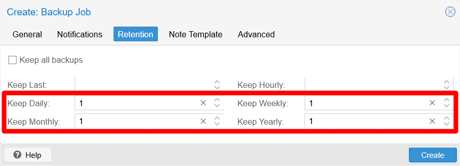

    The configuration above means the following:

    - Only one backup shall be kept from each day.
    - From all the dailies, only the last one from each week will be kept.
    - From all the weeklies, only the last one from each month will be preserved.
    - When a year is over, only the most recent monthly one will remain.

9. Click on the next tab, `Note Template`:

    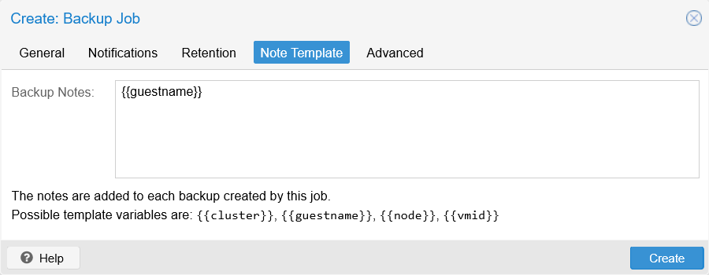

    This tab allows you to customize the notes that go with each backup. For instance, you could set custom notes as a reminder of these backups being for the K3s nodes of your Kubernetes cluster:

    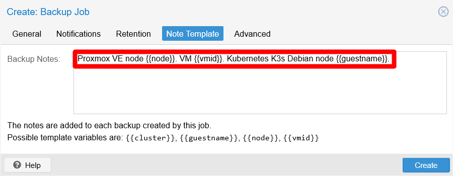

    Notice how the customized note uses most of the template variables indicated at the window's bottom to make it more informative.

10. Press on the remaining `Advanced` tab:

    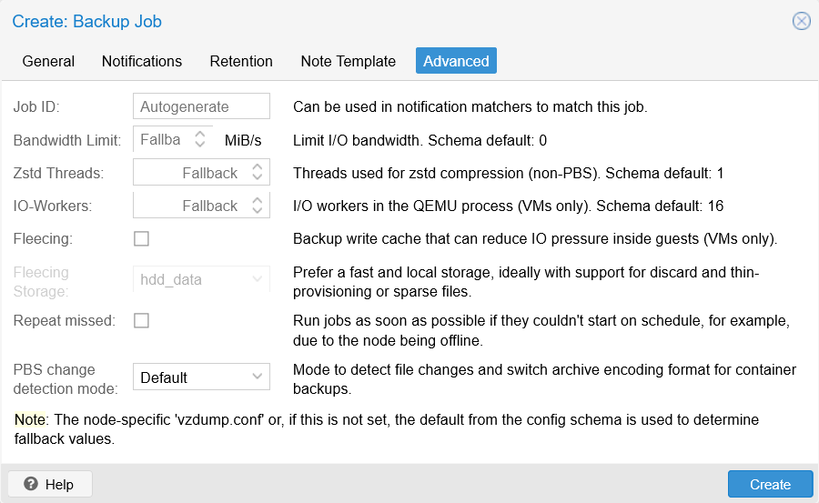

    This tab offers you some advanced options to better tune the performance of your backups and how they affect your system. For this guide's homelab setup, the default configuration of these advanced options is good enough.

11. If you are content with this backup job's configuration, click on the `Create` button found at the window's bottom:

    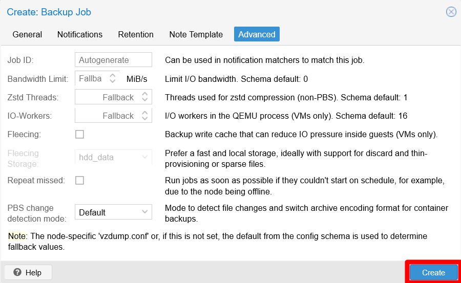

    After clicking on the `Create` button, the `Create: backup job` window closes itself and you see almost immediately the new scheduled job in the main `Backup` page:

    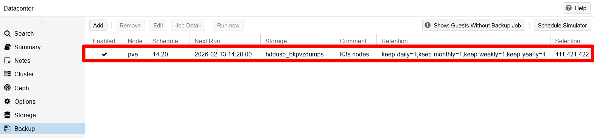

    See how some of the details of the new backup job appear in the list, such as its schedule, storage location, and VMs selected (listed just by their IDs). Also see how the warning message about "_guests not covered_" is still present due to the VM templates being left out of the backup job.

### Testing the backup job

With your first backup job ready, you do not have to wait for its scheduled next eun to see how it goes. Also there are other actions related to the management of backup jobs that you should get familiar with:

1. Select the new job to enable the other actions available in this `Backup` page:

    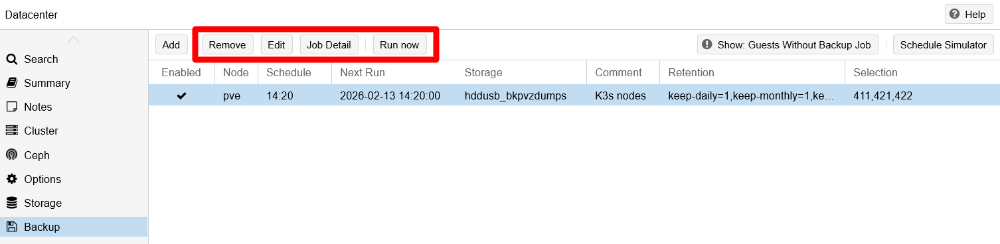

    The enabled actions have explicit names:

    - `Remove`\
      Removes the selected backup job after requesting your confirmation.

    - `Edit`\
      Allows you to edit the backup job with the same form used for creating it.

    - `Job Detail`\
      Shows you all the details of the selected backup job.

    - `Run now`\
      Allows you to execute the selected backup job when you press it. You will use it to test your job a few steps later.

2. Click on the `Job Detail` button to raise this window:

    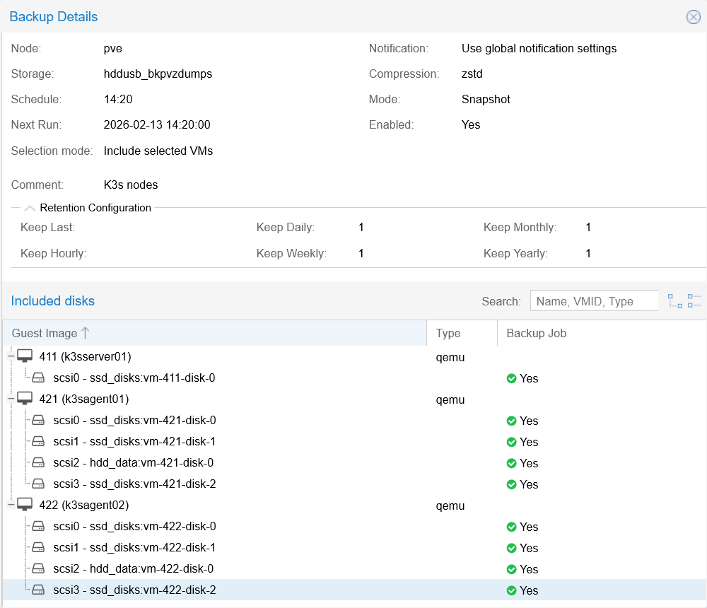

    Here you can see the configuration set in the `General`, `Notification` and `Retention` tabs of the window where you created the backup job. In the `Included disk` box are listed all the virtual disks included in the backup, which are all the ones currently attached to the VMs selected in this job's configuration. Notice that this is a read-only screen, so you cannot change anything here.

3. At last, lets make a test run of your new backup job. Be sure of keeping the job selected and then click on `Run now` above:

    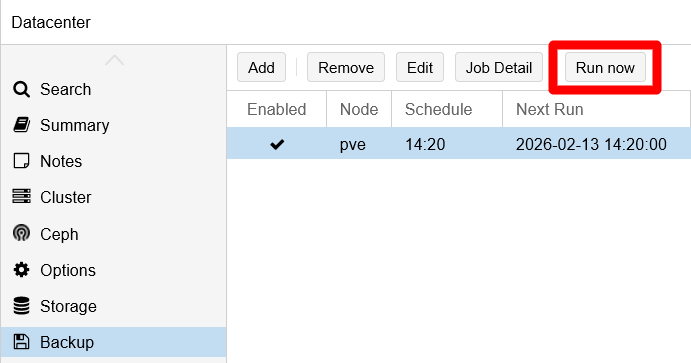

4. This action requires your confirmation to be executed:

    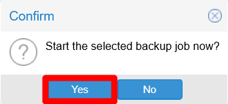

    Click on `Yes` to allow the backup job to proceed.

5. Unlike other operations done in the Proxmox VE web console, the backup job one does not have a progress window. You have to unfold the `Tasks` console found at the bottom of the page to see the backup job running:

    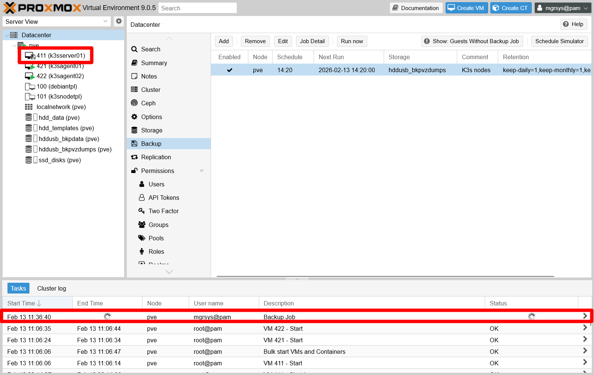

    Notice the entry with the `Backup job` description and the animated "running" icons. Also, in the sidebar showing all your VMs, see how the VM being backed up currently has its icon changed to something else, indicating that it is going under the procedure.

    On the other hand, if you go to the `Cluster log` tab, you find there a log entry also related to this backup job:

    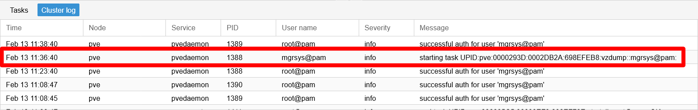

    Internally for Proxmox VE, the backup job is a task with an hexadecimal identifier called UPID. See how the log message says "`starting task UPID:pve`" and, after the UPID code itself, you should see the string "`vzdump::mgrsys@pam:`" identifying the user executing the job.

6. After a while, the backup job ends but you will probably notice it first in the `Tasks` console:

    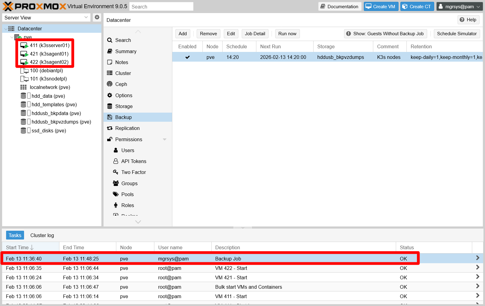

    The finished task has an `End Time` set and a `OK` in its `Status` field, replacing the animated running icon from before. In the sidebar, all the affected VMs will appear with their running icon.

    In the `Cluster log` tab, you can see a new log entry referred to the end of the task:

    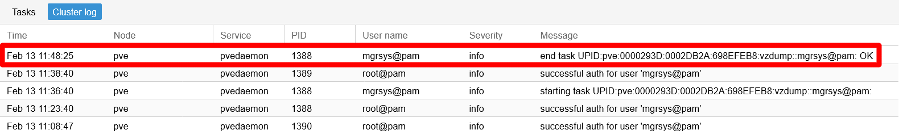

7. Wit the job finished, you can check the backups it has produced. Since each backup is associated with a particular VM, go to each VM's backup page and find their corresponding backup there:

    - Backup page of the `k3sserver01` VM:

      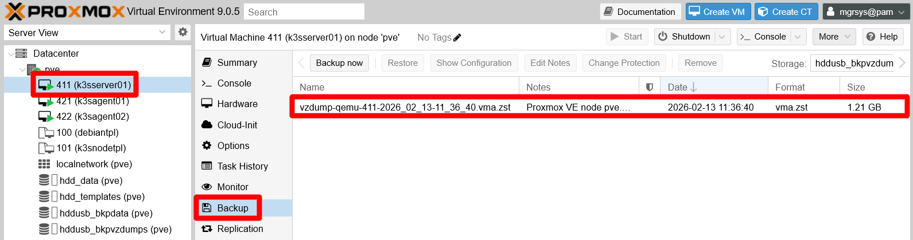

    - Backup page of the `k3sagent01` VM.

      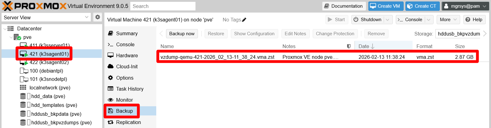

    - Backup page of the `k3sagent02` VM.

      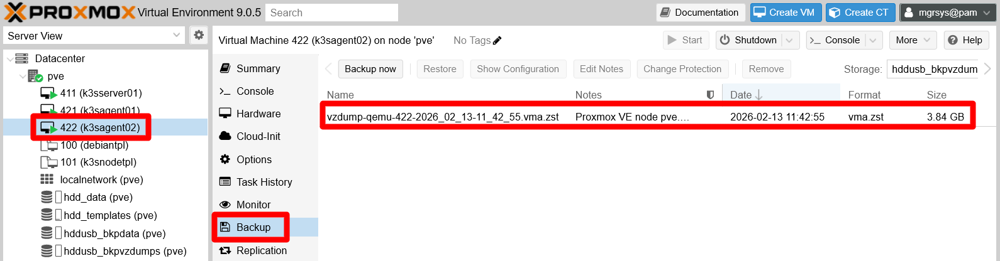

    Each backup has a different size, and the one for the `k3sserver01` VM is noticeable smaller than the ones for the K3s agent node VMs. This makes perfect sense since the agent nodes are where several virtual storage drives have been attached, and where the Ghost and Forgejo platforms are deployed in the K3s Kubernetes cluster.

8. There is another place where you can see all those backups, plus others, in one single place. It is the page of the storage configured as the space where all the backups are dumped, the partition prepared in the external USB HDD drive and named `hddusb_bkppvzdumps` within Proxmox VE. Browse there and be sure to start in the `Summary` tab:

    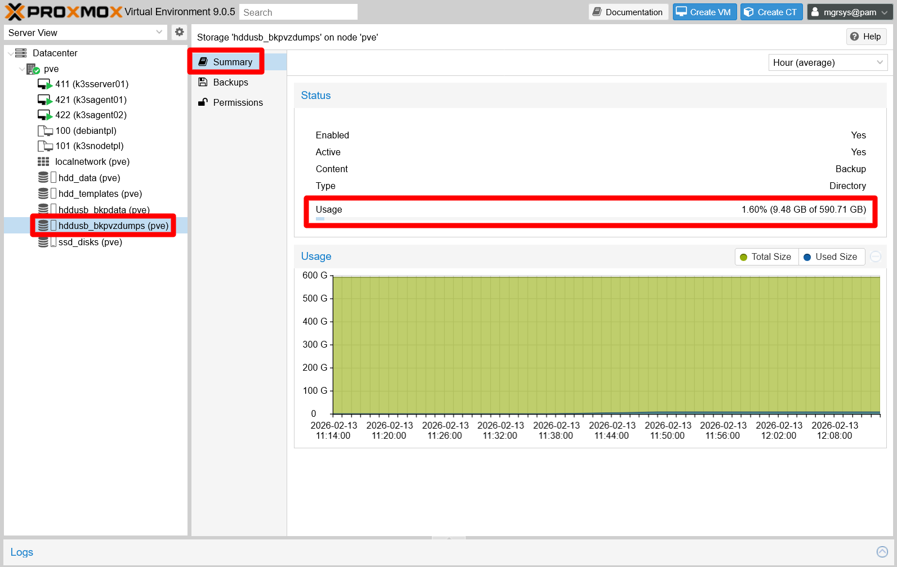

    In this view you can see how much space you have used. Check out this usage frequently to avoid running out of storage space for your backups.

9. Remaining in the same page, now click on the `Backups` tab:

    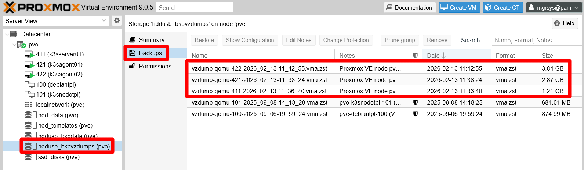

    In this case, this page not only lists your newest backups, but also the dumps you did for the VM templates, way back in the [chapter **G023**](G023%20-%20K3s%20cluster%20setup%2006%20~%20Debian%20VM%20template%20and%20backup.md#vm-templates-backup).

After validating the backup job's execution, do not forget to verify:

- If the job launches at the time you programmed it.
- If the pruning of older backups follows your job's retention policy correctly.

## Restoring a backup in Proxmox VE

You have already seen a detailed explanation about how to restore a backup [in the chapter **G023**](G023%20-%20K3s%20cluster%20setup%2006%20~%20Debian%20VM%20template%20and%20backup.md#restoring-the-vm-templates-backup). So, what else is to say about this process? A couple of things more in fact.

### Generating new VMs from backups

You can generate new VMs (or containers) from backups, if you execute the restoration process from the `Backup` tab of the storage that keeps them. So, in this guide's homelab setup you would do the following:

1. Login as `mgrsys` in your Proxmox VE web console, then go to the `Backup` tab of the `hddusb_bkppvzdumps` storage:

    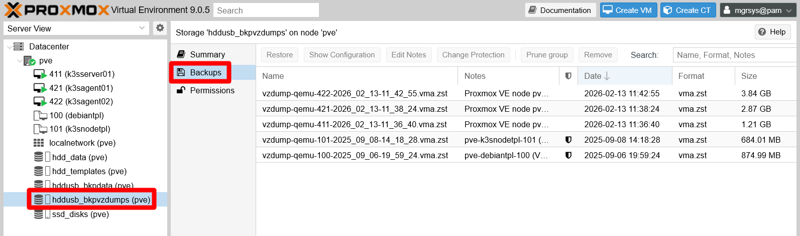

2. Select one of the backups listed there, for instance one from the K3s agent node VMs:

    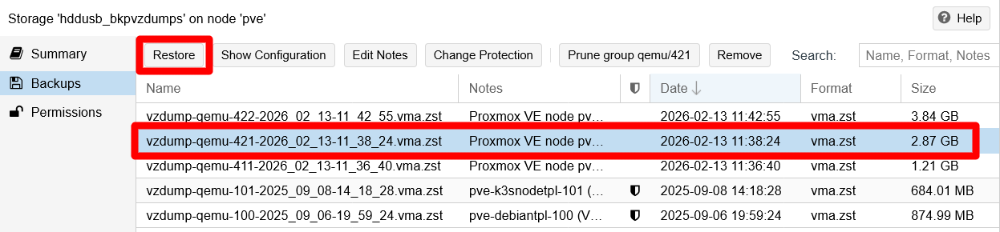

    With the actions buttons enabled, press on `Restore`.

3. The `Restore` window appears. It is a bit different to the one you get in the `Backup` tab of any of your VMs' management page:

    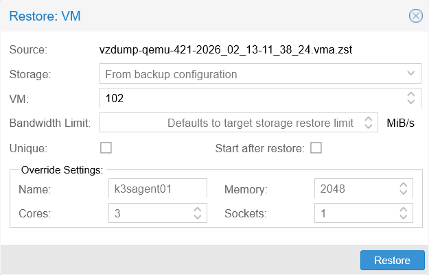

    Pay particular attention to these fields from the window shown above:

    - The `VM` field is editable here, so you can assign any identifier to the new VM generated from this restoration process.

      - See how by default it already puts the lowest identifier available, in this case `102`. Remember that this ID cannot be lower than `100`.

      - You cannot put an ID already in use. If you do, the field will be highlighted in red and the `Restore` button will be disabled. It does not matter if the ID is the same as the VM from which the backup was made, as shown below.

        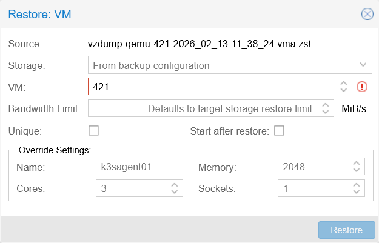

    - The `Unique` checkbox is to make certain internal properties of the VM, like the MAC addresses of its network cards, unique. In other words, by enabling this option, the new VM won't have the same values in those internal properties as the original VM.

      - Enabling this `Unique` option is very convenient to create copies of a VM, but not when you are planning to replace the original VM with the restored one.

    - The `Override Settings` box allows you to make the name and performance capacities different to the original VM dumped in the backup to be restored.

4. Since this is just a demonstration, set the `VM` ID to a high value that does not follow the same criteria applied to the other VMs. Also, enable the `Unique` option but **leave disabled** the `Start after restore` option. It could mess up your K3s Kubernetes cluster by having two identical K3s agents running at the same time. Finally, change the `Name` of the restored VM to something else to tell it apart from the existing K3s agent nodes:

    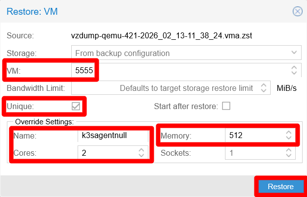

    See that the number of `Cores` and `Memory` capacity have been also readjusted, and that the `Restore` button remains enabled since the configuration is proper.

5. Click on `Restore` and the task starts right away, without asking you for confirmation. Then, you are redirected into a `Task viewer` window showing the progress of the restoration process:

    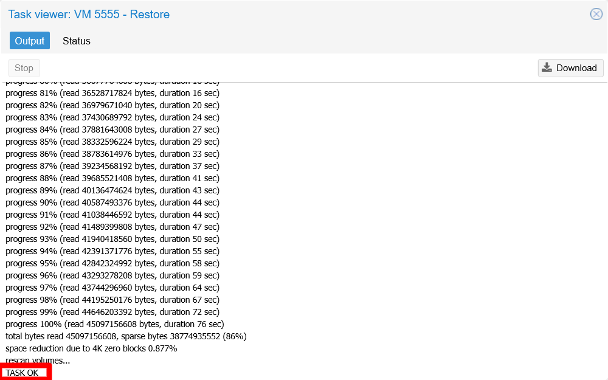

    When you see the log line `TASK OK`, you will know the restoration process is over.

6. Close the `Task viewer` and look for the newly generated VM in the sidebar:

    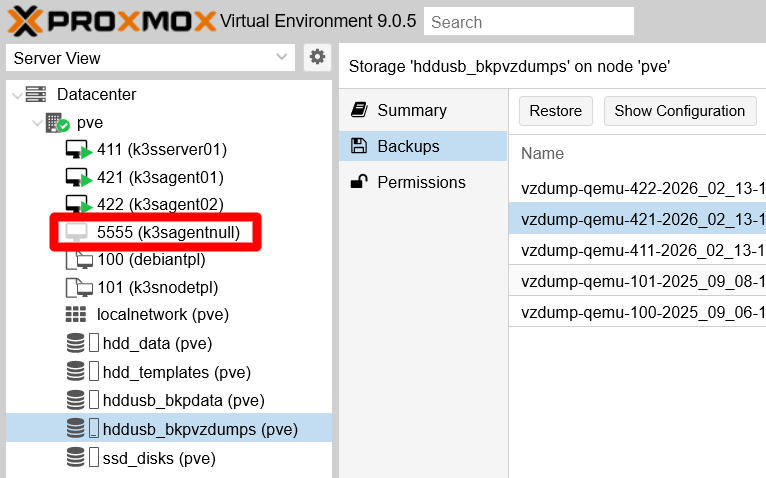

    As expected, it appears as stopped with the VM ID and name set previously in the `Restore` window.

7. Browse into the management page of the new VM, then go to its `Hardware` tab:

    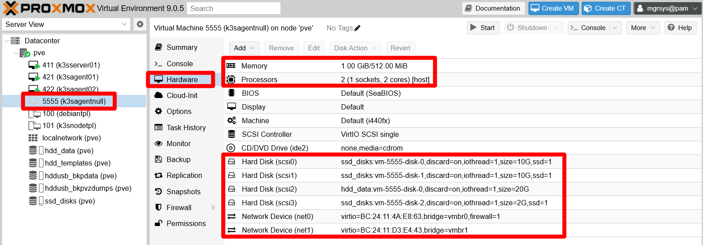

    See that this VM has the same arrangement in hard disks and network devices as the original `k3sagent01`, although the network devices have different MACs than the original ones. Also see how the `Memory` and `Processors` fields correspond to what has been specified in the restoration window. In particular, notice how the `Memory` field has a mistake. If you edit it you can see that it is wrong:

    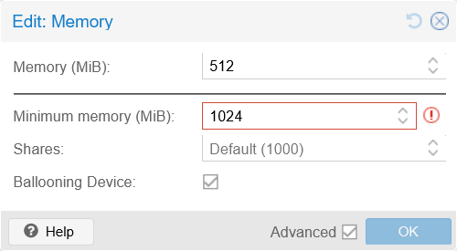

    The form is warning about a mismatch between the maximum amount of memory allowed to this VM (512 MiB), and the minimum memory requested (1021 MiB) which keeps the same value it had in the original VM. This has happened because, if you remember, this minimum memory cannot be edited in the configuration for VM restoration. It is not clear if this is on purpose or just a bug of the Proxmox VE version used at the time of writing this (9.0.5). Just remember to always review the hardware of a restored VM to detect problems like this one.

8. Since this is just a demonstration, delete this VM by unfolding the `More` menu then clicking on `Remove`:

    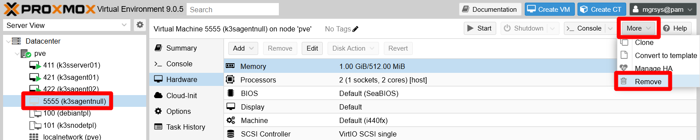

9. Proxmox VE asks you to confirm the remove action in the corresponding `Confirm` window:

    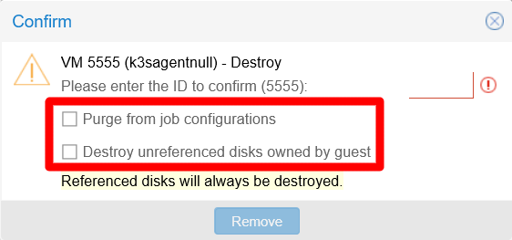

    Pay attention to the options this window offers:

    - `Purge from job configurations`\
      Means that if this VM is included in a backup or other kind of jobs within Proxmox VE, it will be delisted from all of them. Since this particular VM is not in any job, you would not need to enable this one in this case.

    - `Destroy unreferenced disks owned by guest`\
      Refers to those virtual storage drives that are associated with the VM but are not attached to it. With this option on, you can ensure that all virtual storages related to the VM will be removed. Enable this option to be sure that no virtual storage remains from this VM in your Proxmox VE server after its removal.

10. Input the VM ID of the virtual machine you are about to remove to confirm the action. Also check both options on just to be sure the removal is thorough:

    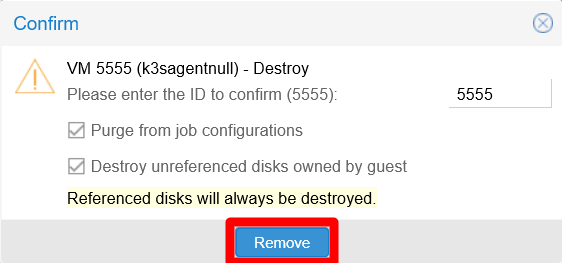

    The `Remove` button gets enabled, so click on it. Unfold the `Tasks` console to see the process progress, which should finish in a rather short time:

    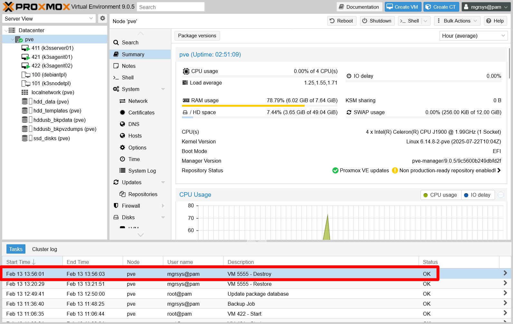

### You cannot restore a live VM

Imagine that, for some reason, you want or need to restore the `k3sagent02` VM, and you somehow forget that is still running. Find out what would happen following the steps next:

1. Go to the `Backup` tab of your `k3sagent02` VM, choose the most recent backup available and press `Restore`:

    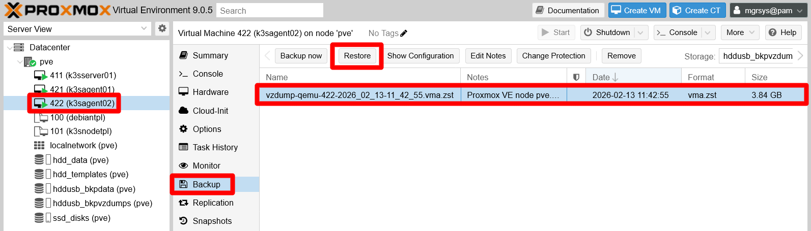

2. In the `Restore` window that appears, you may want to make the VM start right after being restored. Therefore, you just enable that option while you leave the rest as it is:

    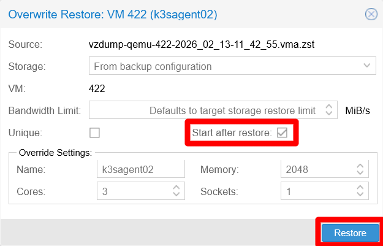

3. A confirmation window asks you to accept the restore action, warning you that any non-backed-up data in the VM's current instance will be permanently erased (meaning lost):

    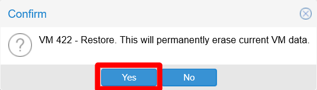

    Since you know that the backup you have chosen to restore is very recent, you are sure of not losing anything important, so you press `Yes`.

4. Proxmox VE's web console raises a `Task viewer` window, showing you the output of this process. To your surprise, it informs you that the task has failed:

    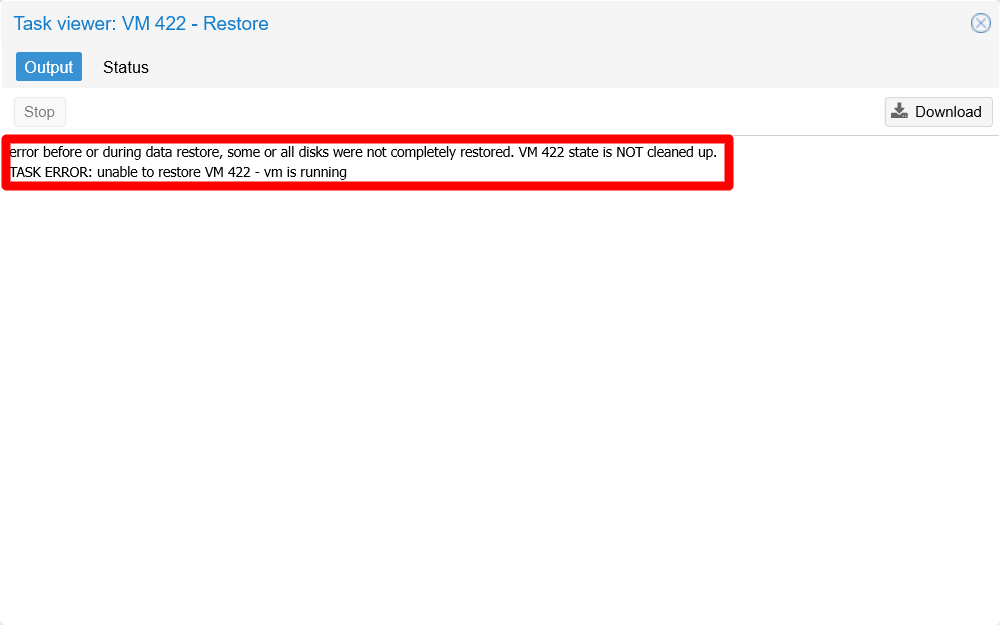

    In short, the log messages shown in the `Output` tab tells you that you cannot execute a restoration on a VM that is currently running.

You might wonder why the web console does not block the `Restore` action right away for running VMs. Since nothing is broken, take this as just one of the many idiosyncrasies within the Proxmox VE software, and hope that they improve this and other things in future releases.

## Location of the backup files in the Proxmox VE system

The VM (or container) backups are just compressed dump files, perfectly accessible as any other file in the underlying Debian system. But, to reach them, first you need to know where they are. The storage where you have the backups, the `hddusb_bkpvzdumps` one, is one of the two LVs you setup as directories [back in the chapter **G019**](G019%20-%20K3s%20cluster%20setup%2002%20~%20Storage%20setup.md#setting-up-the-directories), which both you mounted under the `/mnt` path.

1. Open a shell in your Proxmox VE as `mgrsys`, then do an `ls` to `/mnt`:

    ~~~sh
    $  ls -al /mnt
    total 16
    drwxr-xr-x  4 root root 4096 Sep  2 13:26 .
    drwxr-xr-x 19 root root 4096 Aug 20 14:09 ..
    drwxr-xr-x  5 root root 4096 Sep  2 16:39 hdd_templates
    drwxr-xr-x  4 root root 4096 Sep  2 16:34 hddusb_bkpvzdumps
    ~~~

    The folder you are looking for is the `hddusb_bkpvzdumps` one. Remember that `hdd_templates` is for storing the ISOs of the operative systems to be installed in your VMs.

2. Do `ls` of that `hddusb_bkpvzdumps` folder:

    ~~~sh
    $ ls -al /mnt/hddusb_bkpvzdumps
    total 28
    drwxr-xr-x 4 root root  4096 Sep  2 16:34 .
    drwxr-xr-x 4 root root  4096 Sep  2 13:26 ..
    drwxr-xr-x 2 root root  4096 Feb 13 11:48 dump
    drwx------ 2 root root 16384 Sep  2 13:26 lost+found
    ~~~

    The important folder here is `dump`, while at this point you should now that `lost+found` is filesystem-related.

3. Now execute `ls -alh` on that `dump` folder, being aware that the `h` option gives you the weight of the files in a more human-readable format:

    ~~~sh
    $ ls -alh /mnt/hddusb_bkpvzdumps/dump
    total 8.9G
    drwxr-xr-x 2 root root 4.0K Feb 13 11:48 .
    drwxr-xr-x 4 root root 4.0K Sep  2 16:34 ..
    -rw-r--r-- 1 root root 3.1K Sep  6 20:00 vzdump-qemu-100-2025_09_06-19_59_24.log
    -rw-r--r-- 1 root root 835M Sep  6 20:00 vzdump-qemu-100-2025_09_06-19_59_24.vma.zst
    -rw-r--r-- 1 root root   31 Sep  6 20:00 vzdump-qemu-100-2025_09_06-19_59_24.vma.zst.notes
    -rw-r--r-- 1 root root    0 Sep  6 20:00 vzdump-qemu-100-2025_09_06-19_59_24.vma.zst.protected
    -rw-r--r-- 1 root root 2.8K Sep  8 14:19 vzdump-qemu-101-2025_09_08-14_18_28.log
    -rw-r--r-- 1 root root 653M Sep  8 14:19 vzdump-qemu-101-2025_09_08-14_18_28.vma.zst
    -rw-r--r-- 1 root root   32 Sep  8 14:19 vzdump-qemu-101-2025_09_08-14_18_28.vma.zst.notes
    -rw-r--r-- 1 root root    0 Sep  8 14:19 vzdump-qemu-101-2025_09_08-14_18_28.vma.zst.protected
    -rw-r--r-- 1 root root 4.4K Feb 13 11:38 vzdump-qemu-411-2026_02_13-11_36_40.log
    -rw-r--r-- 1 root root 1.2G Feb 13 11:38 vzdump-qemu-411-2026_02_13-11_36_40.vma.zst
    -rw-r--r-- 1 root root   68 Feb 13 11:38 vzdump-qemu-411-2026_02_13-11_36_40.vma.zst.notes
    -rw-r--r-- 1 root root 5.5K Feb 13 11:42 vzdump-qemu-421-2026_02_13-11_38_24.log
    -rw-r--r-- 1 root root 2.7G Feb 13 11:42 vzdump-qemu-421-2026_02_13-11_38_24.vma.zst
    -rw-r--r-- 1 root root   67 Feb 13 11:42 vzdump-qemu-421-2026_02_13-11_38_24.vma.zst.notes
    -rw-r--r-- 1 root root 5.8K Feb 13 11:48 vzdump-qemu-422-2026_02_13-11_42_55.log
    -rw-r--r-- 1 root root 3.6G Feb 13 11:48 vzdump-qemu-422-2026_02_13-11_42_55.vma.zst
    -rw-r--r-- 1 root root   67 Feb 13 11:48 vzdump-qemu-422-2026_02_13-11_42_55.vma.zst.notes
    ~~~

    There you can see all the backups currently kept in this `hddusb_bkpvzdumps` storage. Also notice that, for each backup present, there are three files:

    - A `.log` file where Proxmox VE has written the progress log of its related dump.
    - A `.vma.zst` file which is the compressed dump file itself.
    - A `.vma.zst.notes` text file with the notes associated to the compressed dump.

Therefore, you can connect through SSH with a tool like WinSCP and copy those files to another storage for better safe keeping. What this guide cannot tell you is how Proxmox VE keeps track of those files to associate them with their proper VMs, although one could suspect it just looks to the VM ID annotated right after the `vzdump-qemu-` string in the file name.

## Relevant system paths

### Directories on Proxmox VE

- `/mnt`
- `/mnt/hddusb_bkpvzdumps`
- `/mnt/hddusb_bkpvzdumps/dump`

## References

### [Proxmox](https://www.proxmox.com/en/)

- [Proxmox VE Administration Guide](https://pve.proxmox.com/pve-docs/pve-admin-guide.html)
  - [Backup and Restore](https://pve.proxmox.com/pve-docs/pve-admin-guide.html#chapter_vzdump)

- [Proxmox VE Wiki](https://pve.proxmox.com/wiki/Main_Page)
  - [Backup and Restore](https://pve.proxmox.com/wiki/Backup_and_Restore)

## Navigation

[<< Previous (**G038. Backups 02**)](G038%20-%20Backups%2002%20~%20Host%20platform%20backup%20with%20Clonezilla.md) | [+Table Of Contents+](G000%20-%20Table%20Of%20Contents.md) | [Next (**G040. Backups 04. UrBackup 01**) >>](G040%20-%20Backups%2004%20~%20UrBackup%2001%20-%20Server%20setup.md)
