# G040 - Backups 04 ~ UrBackup 01 - Server setup

- [Use UrBackup to preserve specific directories](#use-urbackup-to-preserve-specific-directories)
- [Setting up a new VM for the UrBackup server](#setting-up-a-new-vm-for-the-urbackup-server)
  - [Create a new VM based on the Debian VM template](#create-a-new-vm-based-on-the-debian-vm-template)
  - [Set an static IP for the main network device (`net0`)](#set-an-static-ip-for-the-main-network-device-net0)
  - [System adjustments](#system-adjustments)
    - [Setting a proper hostname string](#setting-a-proper-hostname-string)
    - [Changing the LVM VG's name](#changing-the-lvm-vgs-name)
    - [Setting up the second network card](#setting-up-the-second-network-card)
    - [Changing the password of mgrsys](#changing-the-password-of-mgrsys)
    - [Changing the TOTP code for mgrsys](#changing-the-totp-code-for-mgrsys)
    - [Changing the SSH key pair of mgrsys](#changing-the-ssh-key-pair-of-mgrsys)
  - [Adding a virtual storage drive to the VM](#adding-a-virtual-storage-drive-to-the-vm)
    - [Attaching a new hard disk to the VM](#attaching-a-new-hard-disk-to-the-vm)
    - [BTRFS storage set up](#btrfs-storage-set-up)
  - [Updating Debian in the VM](#updating-debian-in-the-vm)
- [Deploying UrBackup](#deploying-urbackup)
  - [Installing UrBackup server](#installing-urbackup-server)
  - [Enabling a domain name for the UrBackup server in your network](#enabling-a-domain-name-for-the-urbackup-server-in-your-network)
  - [Testing your UrBackup server](#testing-your-urbackup-server)
  - [Securing the user access to your UrBackup server](#securing-the-user-access-to-your-urbackup-server)
  - [Enabling SSL access to the UrBackup server](#enabling-ssl-access-to-the-urbackup-server)
- [Firewall configuration on Proxmox VE](#firewall-configuration-on-proxmox-ve)
- [Adjusting the UrBackup server configuration](#adjusting-the-urbackup-server-configuration)
  - [Specifying the server URL for UrBackup clients](#specifying-the-server-url-for-urbackup-clients)
  - [Disabling the image backups](#disabling-the-image-backups)
- [UrBackup server log file](#urbackup-server-log-file)
- [About backing up the UrBackup server VM](#about-backing-up-the-urbackup-server-vm)
- [Relevant system paths](#relevant-system-paths)
  - [Directories on Debian VM](#directories-on-debian-vm)
  - [Files on Debian VM](#files-on-debian-vm)
- [References](#references)
  - [UrBackup](#urbackup)
  - [Other contents related to UrBackup](#other-contents-related-to-urbackup)
  - [BTRFS](#btrfs)
  - [Other contents related to BTRFS](#other-contents-related-to-btrfs)
  - [NGINX](#nginx)
  - [Contents related to TLS certificates](#contents-related-to-tls-certificates)
- [Navigation](#navigation)

## Use UrBackup to preserve specific directories

With [UrBackup](https://www.urbackup.org/) you can schedule backups of specific directories rather than whole systems, as you have done in the two previous chapters. But first you need to deploy an UrBackup server and install the corresponding UrBackup clients in the target systems which, in this case, is going to be your K3s node VMs.

The UrBackup server could be deployed in your K3s Kubernetes cluster (there is a Docker image available of the UrBackup server), but usually you should have the backup server on a completely different system for safety. Of course, for this guide there is only one physical system, so this chapter teaches you how to run a UrBackup server on a small Debian VM acting as that external system.

## Setting up a new VM for the UrBackup server

You already have a suitable VM template from which you can clone a new Debian VM. This VM template is the one named `debiantpl`, which you prepared in the chapters [**G020**](G020%20-%20K3s%20cluster%20setup%2003%20~%20Debian%20VM%20creation.md), [**G021**](G021%20-%20K3s%20cluster%20setup%2004%20~%20Debian%20VM%20configuration.md), [**G022**](G022%20-%20K3s%20cluster%20setup%2005%20~%20Connecting%20the%20VM%20to%20the%20NUT%20server.md) and [**G023**](G023%20-%20K3s%20cluster%20setup%2006%20~%20Debian%20VM%20template%20and%20backup.md). The resulting VM will require some adjustments, in the same way you had to reconfigure the VMs that became K3s nodes. Since how to do all those changes is already explained in earlier chapters, the following subsections just indicate what to change and why while also pointing you to the proper sections in previous chapters.

### Create a new VM based on the Debian VM template

Clone a new VM from the `debiantpl` VM template, as is explained [here in the chapter **G024**](G024%20-%20K3s%20cluster%20setup%2007%20~%20K3s%20node%20VM%20template%20setup.md#full-cloning-of-the-debian-vm-template). The cloning parameters adjusted for generating this chapter's VM were set as follows:

- `VM ID`: `431`.\
  As you did with the K3s node VMs, give your new VM an ID correlated to the IPs it is going to have. So, for this guide, this new VM will have the ID `431`, which corresponds to the IPs assigned later in this chapter.

- `Name`: `bkpserver`.\
  The VM name should be something meaningful like `bkpserver`. Be aware that this name will also be the VM's `hostname` within Debian.

- `Mode`: `Linked Clone`.\
  Links this VM to the VM template, instead of duplicating it.

After the new VM is cloned, **DO NOT start it**. You still need to take a look to its assigned hardware capabilities. If you have the same kind of limited hardware as the one used in this guide, and also having a K3s Kubernetes cluster already running in the system, you must be careful of how much RAM and CPU you assign to any new VM. So, in this chapter, the new VM will have the same hardware setup as the VM template except on the memory department. It will require a minimum of 256 MiB and have an upper limit of 1 GiB.

In the capture below, you can see how the `Hardware` tab looks for this new VM:

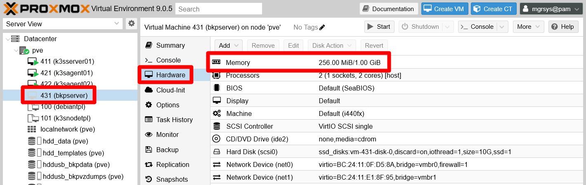

On the other hand, do not forget to modify the `Notes` section in the `Summary` tab of this VM. For instance, you could enter something like the following:

~~~md
# Backup Server VM
VM created: 2026-02-13\
OS: Debian 13 "trixie"\
Root login disabled: yes\
Sysctl configuration: yes\
Transparent hugepages disabled: yes\
SWAP disabled: no\
SSH access: yes\
TFA enabled: yes\
QEMU guest agent working: yes\
Fail2Ban working: yes\
NUT (UPS) client working: yes\
Utilities apt packages installed: yes\
Backup server software: UrBackup
~~~

A final detail to adjust at this point is to set to `Yes` the parameter `Start at boot` found in the `Options` tab. This makes Proxmox VE boot up the VM after the host system itself has started.

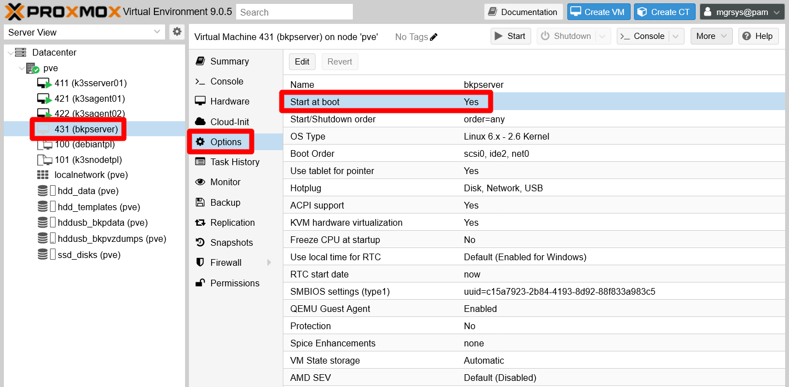

### Set an static IP for the main network device (`net0`)

To facilitate your remote access to the VM, set up a static IP for its `net0` network device in your router or gateway, as you have done for the other VMs. Remember that you can see the MAC of the network device in the `Hardware` tab of your new VM.

In this guide, the VM has the IP `10.4.3.1`, and notice how the `4.3.1` part corresponds with this VM's ID.

### System adjustments

Boot up your `bkpserver` VM, then connect to it through remote SSH shell and login as `mgrsys`.

> [!WARNING]
> **Use the Debian template credentials to access this new VM**\
> At this point, to access your `bkpserver` VM you have to use the same credentials set up in the Debian VM template.

#### Setting a proper hostname string

The very first thing you have to do is to change the VM's hostname to match its name on Proxmox VE. So, to set the string `bkpserver`, do as it was already explained [in this section of the chapter **G024**](G024%20-%20K3s%20cluster%20setup%2007%20~%20K3s%20node%20VM%20template%20setup.md#setting-a-proper-hostname-string).

#### Changing the LVM VG's name

The LVM filesystem structure of this VM retains the same names as the VM template, and this could be confusing. In particular, it is the VG (volume group) that should be changed to something related to this VM, such as `bkpserver-vg`. But this is not a trivial change, in particular because this VM has a **SWAP partition active**. So, tread carefully while following these instructions:

1. First, **temporarily** disable the active SWAP of this VM with the `swapoff` command below:

    ~~~sh
    $ sudo swapoff -a
    ~~~

    Verify that the command has been successful by checking the `/proc/swaps` file:

    ~~~sh
    $ cat /proc/swaps
    Filename                                Type            Size            Used            Priority
    ~~~

    If there is nothing listed in the output, like above, you are good to go.

2. Now, follow closely the instructions specified [in this section of the chapter **G024**](G024%20-%20K3s%20cluster%20setup%2007%20~%20K3s%20node%20VM%20template%20setup.md#changing-the-vgs-name), although bearing in mind that the new VG name is `bkpserver-vg` in this guide.

3. Finally, you need to edit the file `/etc/initramfs-tools/conf.d/resume` and again find and change the string `debiantpl` for the corresponding one, `bkpserver` in this guide. After the change, the line should look as below:

    ~~~sh
    RESUME=/dev/mapper/bkpserver--vg-swap_1
    ~~~

    > [!WARNING]
    > **Careful when doing a backup of this `resume` file**\
    > Do not make a `.orig` backup of this `resume` file, or not in the very same directory the original is. **Debian reads all files within the directory!**

#### Setting up the second network card

The second network device, or virtual Ethernet card, in the new VM is disabled by default. You have to enable it and assign it a proper IP, so later it can communicate directly with the secondary virtual NICs of your K3s node VMs. Do this by following the instructions [in this particular section of the chapter **G024**](G024%20-%20K3s%20cluster%20setup%2007%20~%20K3s%20node%20VM%20template%20setup.md#setting-up-the-second-network-card), but configuring an available IP within the same range as the K3s nodes (`172.16.x.x`). In this guide, the IP for this secondary NIC will be `172.16.3.1`.

#### Changing the password of mgrsys

You should change the password of the `mgrsys` user, since it is the same one it had in the VM template. To do so, execute the `passwd` command as `mgrsys` and it asks you the old and new password for the account:

~~~sh
$ passwd
Changing password for mgrsys.
Current password:
New password:
Retype new password:
passwd: password updated successfully
~~~

#### Changing the TOTP code for mgrsys

As you have done with the `mgrsys` password, now you must change its TOTP to make it unique for this `bkpserver` VM. Just execute the `google-authenticator` command, and it overwrites the current content of the `.google_authenticator` file in the `$HOME` directory of your current user. In this guide, for this VM the command is as below:

~~~sh
$ google-authenticator -t -d -f -r 3 -R 30 -w 3 -Q UTF8 -i bkpserver.homelab.cloud -l mgrsys@bkpserver
~~~

> [!IMPORTANT]
> **Save your TOTP codes**\
> Export and save all the codes and even the `.google_authenticator` file in a password manager or by any other secure method.

#### Changing the SSH key pair of mgrsys

To connect through SSH to the VM, you are using the key pair originally meant just for the Debian VM template. The proper thing to do is to change it for a new pair meant only for this `bkpserver` VM. You already did this change for the K3s node VMs, a procedure detailed [in a specific section within the chapter **G025**](G025%20-%20K3s%20cluster%20setup%2008%20~%20K3s%20Kubernetes%20cluster%20setup.md#changing-the-ssh-key-pair). Follow those instructions, but set the comment (the `-C` option at the `ssh-keygen` command) in the new key pair to a meaningful string like `bkpserver.homelab.cloud@mgrsys`.

### Adding a virtual storage drive to the VM

Since main purpose of this new VM is to store backups, you need to attach a more spacious virtual storage drive (a _hard disk_ in Proxmox VE) to the `bkpserver` VM.

#### Attaching a new hard disk to the VM

Get into your Proxmox VE web console and:

1. Go to the `Hardware` tab of your `bkpserver` VM. There add a new `hard disk` with a configuration like in the snapshot below:

    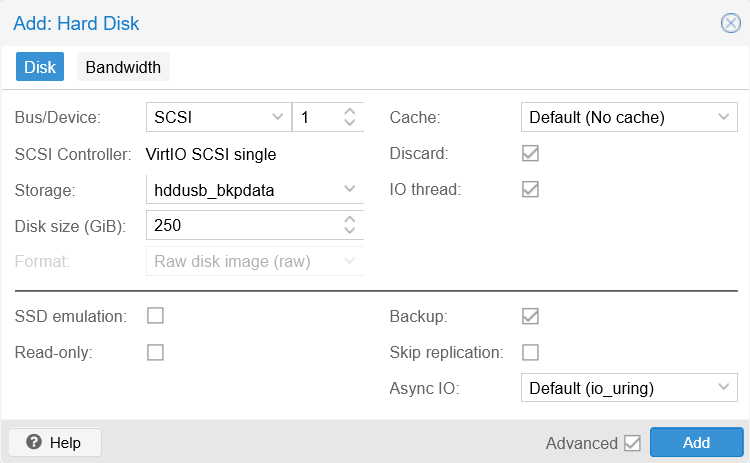

    The parameters tweaked above are configured for a big enough external storage drive:

    - `Storage`\
      Is the partition enabled as `hddusb_bkpdata`, specifically reserved for storing data backups, which is found in the external USB storage drive attached to the Proxmox VE physical host.

    - `Disk size`\
      Set here to 250 GiB as an example, but you can input anything you want. Yet be careful of not going over the real capacity of the storage you have selected.

    - `Discard`\
      Left enabled because the feature is supported by the underlying filesystem.

    - Rest of parameters\
      Left with their default settings.

2. After adding the new hard disk, it should almost immediately appear listed in the `Hardware` tab among the VM's other devices:

    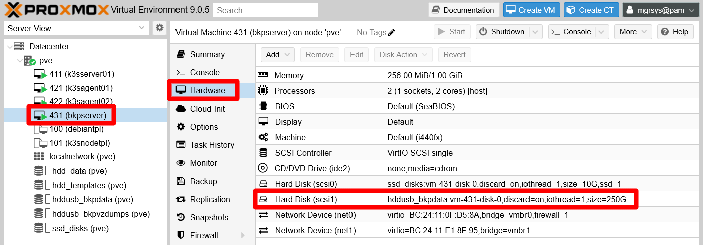

3. Next, connect with a remote terminal as `mgrsys` to the `bkpserver` VM. Then, check with `fdisk` that the new storage is available:

    ~~~sh
    $ sudo fdisk -l
    Disk /dev/sda: 10 GiB, 10737418240 bytes, 20971520 sectors
    Disk model: QEMU HARDDISK
    Units: sectors of 1 * 512 = 512 bytes
    Sector size (logical/physical): 512 bytes / 512 bytes
    I/O size (minimum/optimal): 512 bytes / 512 bytes
    Disklabel type: dos
    Disk identifier: 0x5dc9a39f

    Device     Boot   Start      End  Sectors  Size Id Type
    /dev/sda1  *       2048  1556479  1554432  759M 83 Linux
    /dev/sda2       1558526 20969471 19410946  9.3G  f W95 Ext'd (LBA)
    /dev/sda5       1558528 20969471 19410944  9.3G 8e Linux LVM

    Disk /dev/mapper/bkpserver--vg-root: 8.69 GiB, 9328132096 bytes, 18219008 sectors
    Units: sectors of 1 * 512 = 512 bytes
    Sector size (logical/physical): 512 bytes / 512 bytes
    I/O size (minimum/optimal): 512 bytes / 512 bytes

    Disk /dev/mapper/bkpserver--vg-swap_1: 544 MiB, 570425344 bytes, 1114112 sectors
    Units: sectors of 1 * 512 = 512 bytes
    Sector size (logical/physical): 512 bytes / 512 bytes
    I/O size (minimum/optimal): 512 bytes / 512 bytes

    Disk /dev/sdb: 250 GiB, 268435456000 bytes, 524288000 sectors
    Disk model: QEMU HARDDISK
    Units: sectors of 1 * 512 = 512 bytes
    Sector size (logical/physical): 512 bytes / 512 bytes
    I/O size (minimum/optimal): 512 bytes / 512 bytes
    ~~~

    The newly attached storage appears at the bottom of the `fdisk` output as the `/dev/sdb` disk.

#### BTRFS storage set up

Btrfs, which stands for _B-tree file system_, is a filesystem with specific advanced capabilities that UrBackup can take advantage of for optimizing its backups. Modern Debian versions supports btrfs, but you need to install the package with tools for handling this filesystem:

~~~sh
$ sudo apt install -y btrfs-progs
~~~

With the tools available, now you can turn your `/dev/sdb` drive into a btrfs filesystem:

1. Start by adding the `/dev/sdb` to a new labelled multidevice btrfs configuration with the corresponding `mkfs.btrfs` command:

    ~~~sh
    $ sudo mkfs.btrfs -d single -L bkpdata-hdd /dev/sdb
    btrfs-progs v6.14
    See https://btrfs.readthedocs.io for more information.

    Performing full device TRIM /dev/sdb (250.00GiB) ...
    NOTE: several default settings have changed in version 5.15, please make sure
          this does not affect your deployments:
          - DUP for metadata (-m dup)
          - enabled no-holes (-O no-holes)
          - enabled free-space-tree (-R free-space-tree)

    Label:              bkpdata-hdd
    UUID:               b24d4575-42d2-4e0b-81a6-dcfb824194a3
    Node size:          16384
    Sector size:        4096        (CPU page size: 4096)
    Filesystem size:    250.00GiB
    Block group profiles:
      Data:             single            8.00MiB
      Metadata:         DUP               1.00GiB
      System:           DUP               8.00MiB
    SSD detected:       no
    Zoned device:       no
    Features:           extref, skinny-metadata, no-holes, free-space-tree
    Checksum:           crc32c
    Number of devices:  1
    Devices:
        ID        SIZE  PATH
        1   250.00GiB  /dev/sdb

    ~~~

    Let's analyze the command's output above:

    - The command has created a btrfs volume labeled `bkpdata-hdd`.

    - This volume is multidevice, although currently it only has one storage drive.

    - The volume works in `single` mode, meaning that:

      - The metadata will be mirrored in all the devices in the volume.
      - The data is allocated in "linear" fashion all along the devices in the volume.

    > [!WARNING]
    > **Never build a multidevice volume with drives of different capabilities**\
    > So do not put in the same volume SSD devices with HDD ones, for instance. Always be sure that they all are of the same kind and have the same I/O capabilities.

    With the btrfs volume configured this way, when you are running out of space in it, you can add another storage device to it. [Check out how in the official btrfs wiki](https://btrfs.wiki.kernel.org/index.php/Using_Btrfs_with_Multiple_Devices#Adding_new_devices).

2. You need a mount point for the btrfs volume, so create one under the standarde `/mnt` folder:

    ~~~sh
    $ sudo mkdir /mnt/bkpdata-hdd
    ~~~

3. Mount the btrfs volume in the mount point created before. To do the mounting, you can invoke in the `mount` command any of the devices used in the volume. In this case, there is only `/dev/sdb`:

    ~~~sh
    $ sudo mount /dev/sdb /mnt/bkpdata-hdd
    ~~~

4. To make that mounting permanent, you have to edit the `/etc/fstab` file and add the corresponding line there. First, make a backup of the `fstab` file:

    ~~~sh
    $ sudo cp /etc/fstab /etc/fstab.bkp
    ~~~

    Then **append** to the `fstab` file these lines below:

    ~~~sh
    # Backup storage
    /dev/sdb /mnt/bkpdata-hdd btrfs defaults,nofail 0 0
    ~~~

5. Reboot the VM:

    ~~~sh
    $ sudo reboot
    ~~~

6. Log back into a shell in the VM, then check with `df` that the volume is mounted:

    ~~~sh
    $ df -h
    Filesystem                      Size  Used Avail Use% Mounted on
    udev                            462M     0  462M   0% /dev
    tmpfs                            97M  556K   97M   1% /run
    /dev/mapper/bkpserver--vg-root  8.5G  1.2G  6.9G  14% /
    tmpfs                           484M     0  484M   0% /dev/shm
    tmpfs                           5.0M     0  5.0M   0% /run/lock
    tmpfs                           1.0M     0  1.0M   0% /run/credentials/systemd-journald.service
    tmpfs                           470M     0  470M   0% /tmp
    /dev/sdb                        250G  5.8M  248G   1% /mnt/bkpdata-hdd
    /dev/sda1                       730M  111M  566M  17% /boot
    tmpfs                           1.0M     0  1.0M   0% /run/credentials/getty@tty1.service
    tmpfs                            84M  8.0K   84M   1% /run/user/1000
    ~~~

    See above how the `/dev/sdb` device appears in the list of filesystems.

### Updating Debian in the VM

This VM is based on a VM template that could be at this point out of date. You should then use `apt` to update the Debian in this VM:

~~~sh
$ sudo apt update
$ sudo apt upgrade
~~~

If the upgrade affects many packages, or critical ones, you should reboot after applying the upgrade:

~~~sh
$ sudo reboot
~~~

## Deploying UrBackup

With the `bkpserver` VM ready, you can proceed with the deployment of the UrBackup server in it.

### Installing UrBackup server

To install UrBackup server in your Debian VM, you just need to install one `.deb` package following [these official hints](https://www.urbackup.org/debianserverinstall.html). At the time of writing this, the latest non-beta version of UrBackup server is the `2.5.35`, and you can find it [in the official UrBackup download page](https://www.urbackup.org/download.html#server_debian):

1. In a shell as `mgrsys`, use `wget` to download in the `bkpserver` VM the package for UrBackup version `2.5.35`:

    ~~~sh
    $ wget https://hndl.urbackup.org/Server/2.5.35/urbackup-server_2.5.35_amd64.deb
    ~~~

2. Install the downloaded `urbackup-server_2.5.35_amd64.deb` package with `dpkg`:

    ~~~sh
    $ sudo dpkg -i urbackup-server_2.5.35_amd64.deb
    ~~~

    The output of this `dpkg` command may warn you of unsatisfied dependencies that have left the package installation unfinished. This is something you will correct in the next step with `apt`.

3. Apply the following `apt` command to properly finalize the installation of the UrBackup package:

    ~~~sh
    $ sudo apt install -f
    ~~~

    A few seconds later, this `apt` command launches a text-based window asking where your UrBackup server should store its backups:

    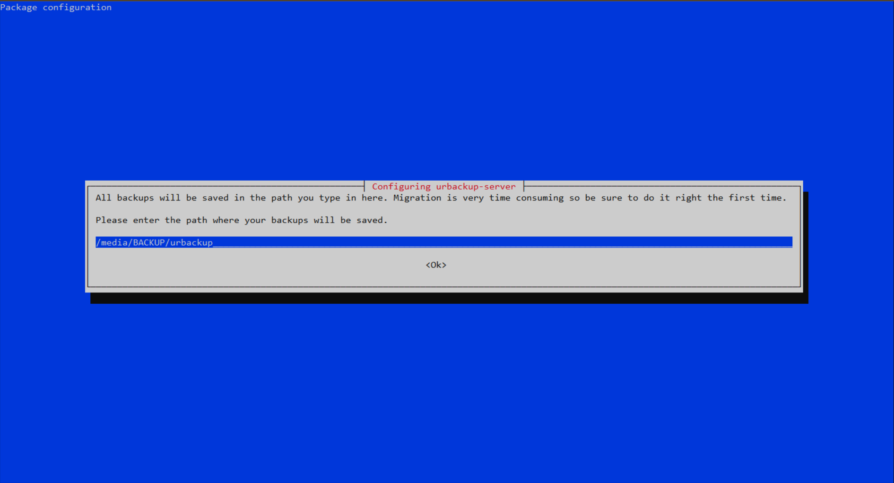

    Change the suggested path for the one where the btrfs volume is mounted. In this guide is `/mnt/bkpdata-hdd`:

    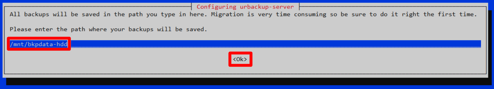

    After setting the correct path, press enter and the installation finishes.

### Enabling a domain name for the UrBackup server in your network

Remember to enable a domain name for your UrBackup server in your network, either by hosts files or configuring it in your local network router. This guide uses the domain `bkpserver.homelab.cloud` for the `10.4.3.1` IP, to make reaching the web interface easier to remember.

### Testing your UrBackup server

UrBackup server is installed in your VM, so now you can browse into its web console. Remember to associate its main IP to a domain in your LAN. [As established previously](#enabling-a-domain-name-for-the-urbackup-server-in-your-network), the domain for this UrBackup server is `bkpserver.homelab.cloud`:

1. Access the UrBackup server through an **http** (unsecured!) connection to the port `55414`. For this guide's VM, the whole URL would be `http://bkpserver.homelab.cloud:55414/`. The first page you see is the `Status` tab of your new UrBackup server:

    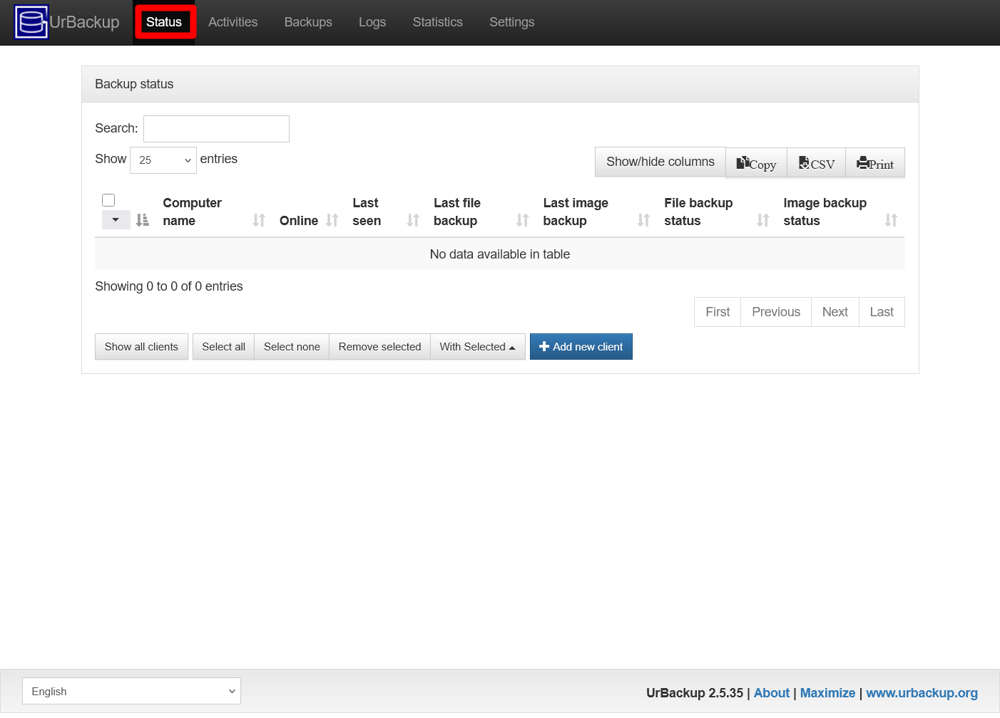

    Notice that you have gotten here without going through any kind of authentication process. This security hole is one of several things you have to adjust in the following sections.

    On the other hand, open a remote terminal on the `bkpserver` VM and list the contents of the `/mnt/bkpdata-hdd`:

    ~~~sh
    $ ls -al /mnt/bkpdata-hdd/
    total 20
    drwxr-xr-x 1 urbackup urbackup   50 Feb 14 18:42 .
    drwxr-xr-x 3 root     root     4096 Feb 14 18:09 ..
    drwxr-x--- 1 urbackup urbackup    0 Feb 14 18:42 clients
    drwxr-x--- 1 urbackup urbackup    0 Feb 14 18:42 urbackup_tmp_files
    ~~~

    See that UrBackup is already using this storage, and with its own `urbackup` user no less. This confirms you that the backup path configuration set to UrBackup is correct.

2. There is a test you should do to confirm that your UrBackup server is able to use the btrfs features of the chosen backup storage. Execute the following `urbackup_snapshot_helper` command in your `bkpserver` VM:

    ~~~sh
    $ urbackup_snapshot_helper test
    Testing for btrfs...
    Create subvolume '/mnt/bkpdata-hdd/testA54hj5luZtlorr494/A'
    Create snapshot of '/mnt/bkpdata-hdd/testA54hj5luZtlorr494/A' in '/mnt/bkpdata-hdd/testA54hj5luZtlorr494/B'
    Delete subvolume 258 (commit): '/mnt/bkpdata-hdd/testA54hj5luZtlorr494/A'
    Delete subvolume 259 (commit): '/mnt/bkpdata-hdd/testA54hj5luZtlorr494/B'
    BTRFS TEST OK
    ~~~

    Notice two things:

    - The `urbackup_snapshot_helper` command **does not require `sudo` to be executed**.

    - At the end of its output it informs of the test result which, in this case, is the expected `BTRFS TEST OK`.

3. Know that the UrBackup server is installed as a service that you can manage with `systemctl` commands:

    ~~~sh
    $ sudo systemctl status urbackupsrv.service
    ● urbackupsrv.service - LSB: Server for doing backups
        Loaded: loaded (/etc/init.d/urbackupsrv; generated)
        Active: active (running) since Sat 2026-02-14 18:38:42 CET; 13min ago
    Invocation: 2ad0f267af414895a3b164ad472daadc
        Docs: man:systemd-sysv-generator(8)
        Process: 10680 ExecStart=/etc/init.d/urbackupsrv start (code=exited, status=0/SUCCESS)
        Tasks: 26 (limit: 1107)
        Memory: 144.8M (peak: 145.3M)
            CPU: 5.346s
        CGroup: /system.slice/urbackupsrv.service
                └─10687 /usr/bin/urbackupsrv run --config /etc/default/urbackupsrv --daemon --pidfile /var/run/urbackupsrv.pid

    Feb 14 18:38:42 bkpserver systemd[1]: Starting urbackupsrv.service - LSB: Server for doing backups...
    Feb 14 18:38:42 bkpserver systemd[1]: Started urbackupsrv.service - LSB: Server for doing backups.
    Feb 14 18:42:21 bkpserver urbackupsrv[10687]: Login successful for anonymous from 10.157.123.220 via web interface
    Feb 14 18:47:09 bkpserver urbackupsrv[10687]: Login successful for anonymous from 10.157.123.220 via web interface
    ~~~

4. After validating the UrBackup server installation, you can remove the `urbackup-server_2.5.35_amd64.deb` package file from the `bkpserver` VM system:

    ~~~sh
    $ rm urbackup-server_2.5.35_amd64.deb
    ~~~

### Securing the user access to your UrBackup server

At this point, your UrBackup server allows anonymous access to anyone browsing into its web console and also grants them the capacity of managing all the backups. This is not good at all; you must add an administrator user to your UrBackup server at once:

1. In the UrBackup server's web interface, browse to the `Settings` tab. In the resulting page, click on `Users`:

    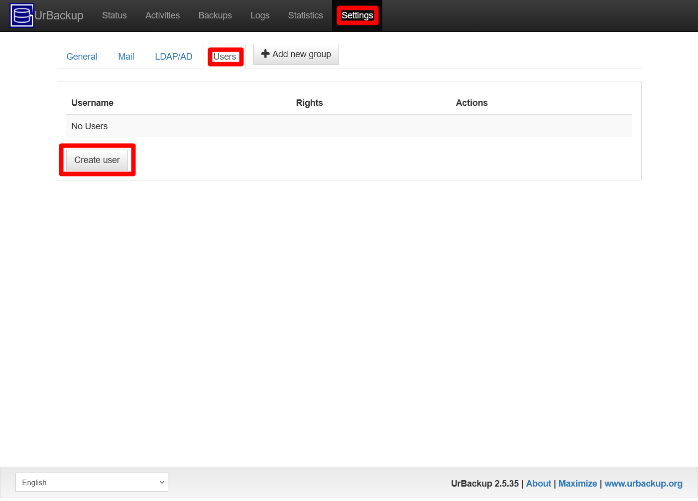

    Click on the `Create user` button also highlighted in the screenshot above.

2. After pressing on the `Create user` button, the following form appears:

    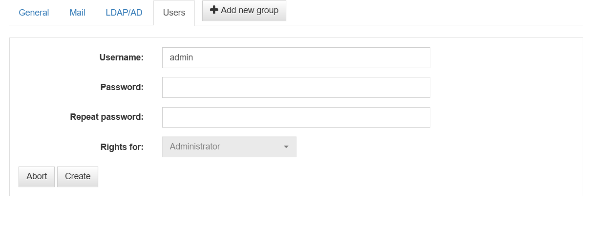

    There are a couple of thing to realize from this form:

    - It only allows you to create an administrator user, since the `Rights for` unfoldable list is greyed out.

    - You can change the default `admin` username to something else.

3. Fill the form, then press on `Create`:

    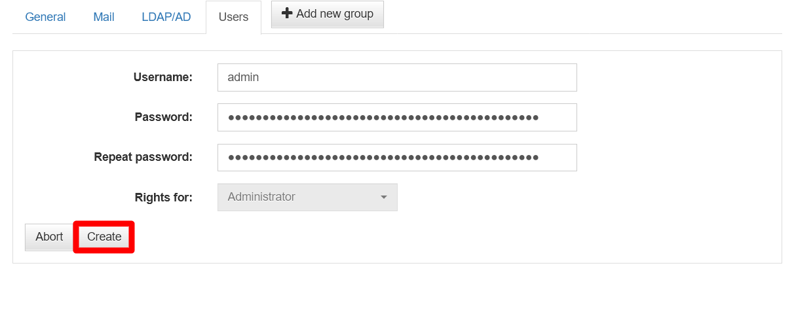

4. The creation is immediate and sends you back to the updated `Users` view:

    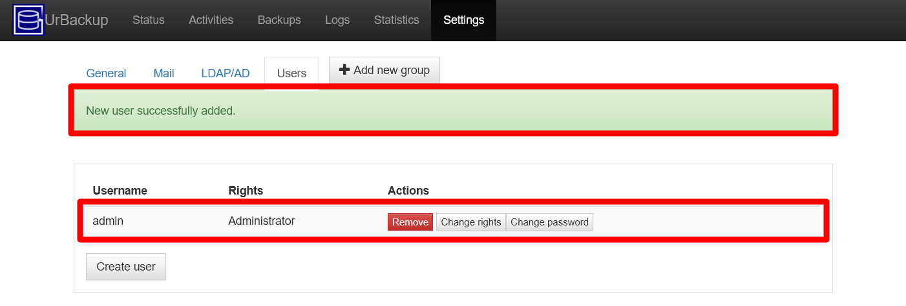

    The web interface warns you of the new user added successfully, while you can also see your new administrator listed in the users list.

5. Refresh the page in your browser and the web interface asks for your new administrator user's password:

    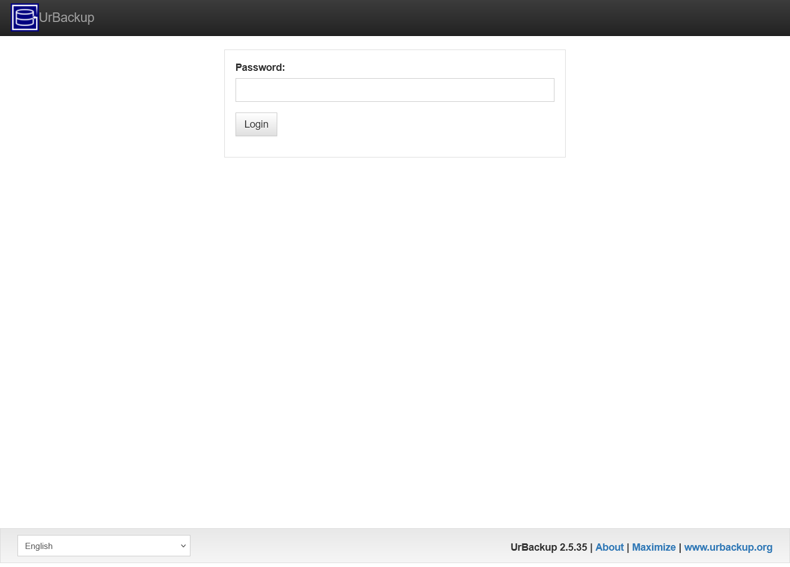

    See that it only asks you for the password, not the username.

    > [!WARNING]
    > **UrBackup's web interface does not have a logout or disconnect button**\
    > To force the logout, manually refresh the page in your browser to get back to this password page.

### Enabling SSL access to the UrBackup server

UrBackup server does not come with SSL/TLS support so, to secure the connections to the web interface, you have to put a reverse proxy in front of it. This chapter shows you how to do this with an nginx server, slightly adapting what is explained [in this guide](https://github.com/Dmitrius7/UrBackup_simple_make_web_via_ssl_https):

1. Open a remote terminal as `mgrsys` to your `bkpserver` VM, then install nginx with `apt`:

    ~~~sh
    $ sudo apt install -y nginx
    ~~~

2. With the `openssl` command, create a self-signed TLS certificate for encrypting the HTTPS connections:

    ~~~sh
    $ sudo openssl req -x509 -nodes -days 3650 -newkey ec -pkeyopt ec_paramgen_curve:P-521 -subj "/O=Urb Security/OU=Urb/CN=Urb.local/CN=Urb" -addext "subjectAltName=DNS:bkpserver.homelab.cloud" -keyout /etc/ssl/certs/urb-cert.key -out /etc/ssl/certs/urb-cert.crt
    ~~~

    The resulting key-pair generated by the openssl command above is encrypted with the ECDSA algorithm using the P-521 curve, just like the certificates generated for the [Ghost](G033%20-%20Deploying%20services%2002%20~%20Ghost%20-%20Part%205%20-%20Complete%20Ghost%20platform.md#ghost-platforms-tls-certificate), [Forgejo](G034%20-%20Deploying%20services%2003%20~%20Forgejo%20-%20Part%205%20-%20Complete%20Forgejo%20platform.md#forgejo-platforms-tls-certificate) and [monitoring stack](G035%20-%20Deploying%20services%2004%20~%20Monitoring%20stack%20-%20Part%206%20-%20Complete%20monitoring%20stack%20setup.md#monitoring-stack-tls-certificate) deployments already explained in this guide.

3. Create an empty file in the path `/etc/nginx/sites-available/urbackup.conf`:

    ~~~sh
    $ sudo touch /etc/nginx/sites-available/urbackup.conf
    ~~~

4. Edit the new `urbackup.conf` file so it has the following content:

    ~~~nginx
    # Make UrBackup webinterface accessible via HTTPS
    server {
        # Define your listening https port
        listen 443 ssl;

        server_name bkpserver.homelab.cloud; 

        # SSL configuration
        ssl_certificate /etc/ssl/certs/urb-cert.crt;
        ssl_certificate_key /etc/ssl/certs/urb-cert.key;
        # SSL configuration

        # Set the root directory and index files
        root /usr/share/urbackup/www;
        index index.htm;

        # This location we have to proxy the "x" file
        # to the running UrBackup FastCGI server
        location /x {
            include fastcgi_params;
            fastcgi_pass 127.0.0.1:55413;
        }

        # If requests reach the site using HTTP, redirect them to HTTPS
        error_page 497 https://$host:$server_port$request_uri;

        # Disable logs
        access_log off;
        error_log off;

    }
    ~~~

    > [!IMPORTANT]
    > **Notice the `server_name` parameter with the domain for the UrBackup server**\
    > Do not forget to switch it with the one you are using in your homelab setup.

    With this configuration, nginx listens for HTTPS requests on the standard HTTPS port `443` to redirect them towards the UrBackup server which is listening in the `55413` port.

    > [!WARNING]
    > **Careful of not specifying UrBackup server's web console `55414` port**\
    > For the redirection to work, ensure to point it towards the `55413` port where UrBackup is also listening. Otherwise, the access to the web console will not work properly.

5. You need to enable the UrBackup configuration in nginx:

    ~~~sh
    $ sudo ln -s /etc/nginx/sites-available/urbackup.conf /etc/nginx/sites-enabled/urbackup.conf
    ~~~

6. Disable the `default` configuration that nginx got enabled in its standard installation:

    ~~~sh
    $ sudo rm /etc/nginx/sites-enabled/default
    ~~~

7. At last, restart the nginx service to make it refresh its configuration:

    ~~~sh
    $ sudo systemctl restart nginx.service
    ~~~

8. Try to browse through HTTPS to your UrBackup server. For the configuration proposed in this guide, the correct HTTPS url is `https://bkpserver.homelab.cloud`.

## Firewall configuration on Proxmox VE

As you did for your K3s node VMs [in the chapter **G025**](G025%20-%20K3s%20cluster%20setup%2008%20~%20K3s%20Kubernetes%20cluster%20setup.md#firewall-setup-for-the-k3s-cluster), you have to apply some firewall rules on Proxmox VE to increase the protection on your UrBackup server. In particular, you want this VM reachable only through the ports `22` (for SSH) and `443` (for HTTPS) on its `net0` network device:

1. At the `Datacenter` level, go to `Firewall > Alias`. There, add a new alias for the `bkpserver` main IP (the one for the first network device, named `net0` in Proxmox VE):

    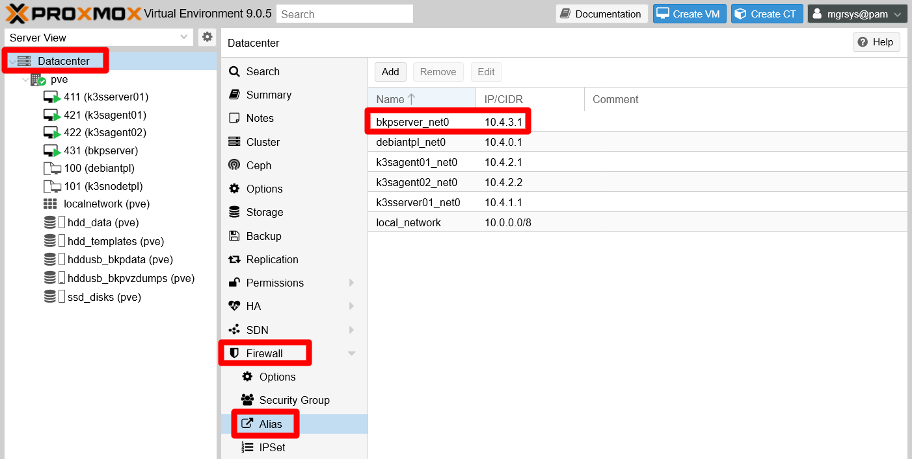

    See above how the alias `bkpserver_net0` is named after the VM is related to.

2. Browse to the `Firewall > IPSet` tab. There create a new ipset that only includes the `bkpserver_net0` alias created before:

    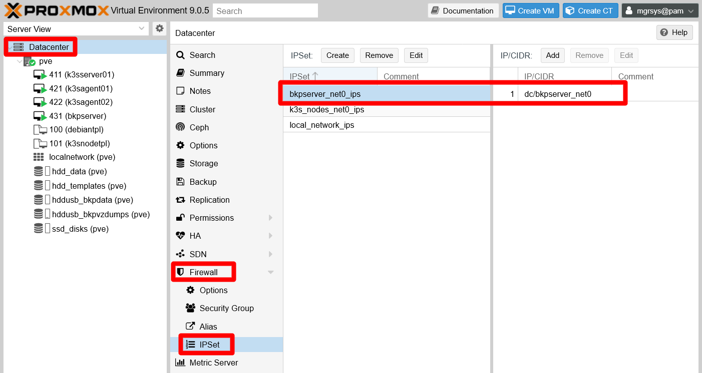

    Give this ipset a name related to the VM, like `bkpserver_net0_ips`.

3. Now go to the `Firewall > Security Group`, where you should create a security group with a name such as `bkpserver_net0_in` containing just the following rules:

    - `bkpserver_net0_in`:
      - Rule 1: Type `in`, Action `ACCEPT`, Protocol `tcp`, Source `local_network_ips`, Dest. port `22`, Comment `SSH standard port open for entire local network`.
      - Rule 2: Type `in`, Action `ACCEPT`, Protocol `tcp`, Source `local_network_ips`, Dest. port `443`, Comment `HTTPS standard port open for entire local network`.

    In the PVE web console, your new security group should look like in the snapshot below:

    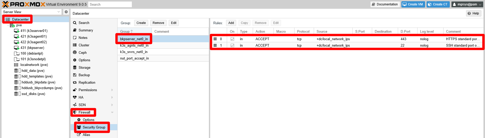

    > [!IMPORTANT]
    > **Do not forget to enable these rules when you create them**\
    > Revise the `On` column and check the ones you may have left disabled.

4. Browse to the `Firewall` page of the `bkpserver` VM. Here you must press the `Insert: Security Group` to apply the new security group on this VM:

    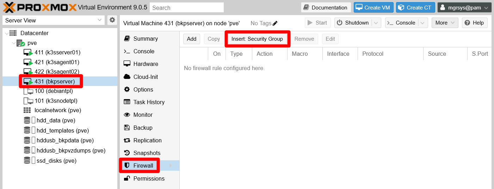

    In the form that appears, be sure of choosing the security group related to this VM (`bkpserver_net0_in` in this guide). Also specify the correct network interface on which the security group must be applied (`net0`), and **do not forget to leave the rule enabled!**

    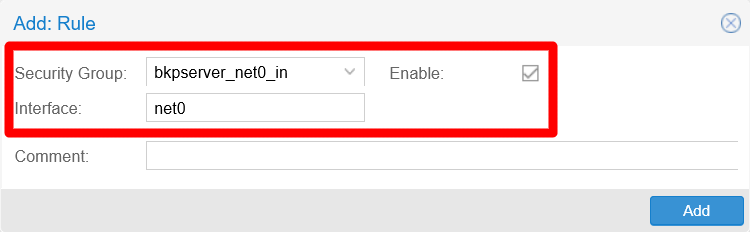

    The security group rule should appear now in the `bkpserver` VM firewall:

    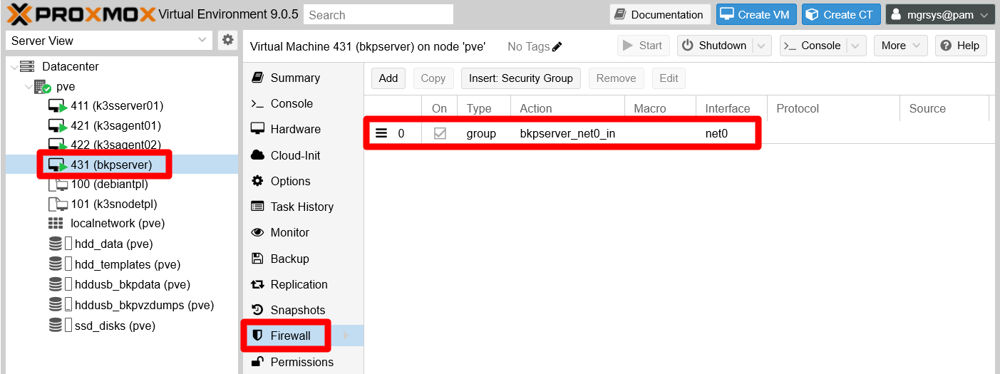

5. Go to the `Firewall > IPset` section of the VM, where you have to add an IP set for the IP filter you will enable later on the `net0` network device of this VM. Remember that the IP set name must begin with the string `ipfilter-`, then followed by the network device's name (`net0` here), otherwise the ipfilter will not work. As shown below, this IP set must contain only the alias of this VM main network device's IP (`bkpserver_net0` in this case):

    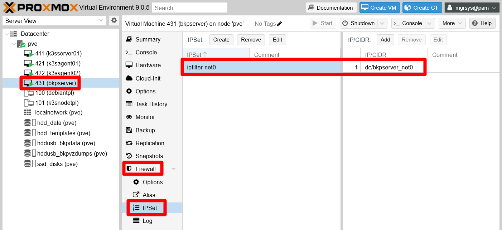

6. To enable the firewall on this VM, click on the `Firewall > Options` tab. There you have to adjust the options as shown in the following snapshot:

    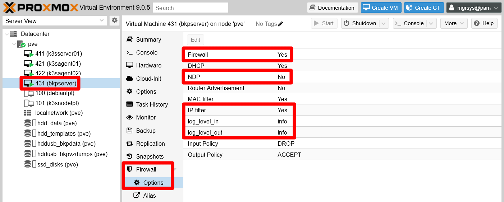

    The options that have been changed are highlighted in red:

    - The `NDP` option is disabled because is only useful for IPv6 networking, which is not active in your VM.

    - The `IP filter` is enabled, which helps to avoid IP spoofing.

      > [!NOTE]
      > **Remember that enabling this option is not enough**\
      > You need to specify the concrete IPs allowed on the network interface in which you want to apply this security measure, something you have just done in the previous step.

    - The `log_level_in` and `log_level_out` options are set to `info`, enabling the logging of the firewall on the VM. This allows you to see, in the `Firewall > Log` view of the VM, any incoming or outgoing traffic that gets dropped or rejected by the firewall.

7. As a final verification, try now browsing to your UrBackup server web interface on the HTTPS url, but also on the HTTP one. Only the HTTPS one should work, while trying to connect with unsecured HTTP should return a time-out or similar error.

  On the other hand, also try to connect with your preferred SSH client. If any of these checks fails, go over this procedure again to find what you might have missed!

## Adjusting the UrBackup server configuration

Like any other software, the UrBackup server comes with a default configuration that requires some retouching to better fit your circumstances. In particular, you will see in this section how to adjust relevant general options.

### Specifying the server URL for UrBackup clients

To enable to UrBackup clients the capacity of accessing and restoring the backups stored in the server, you need to specify the concrete server URL they have to reach to do so:

1. Browse to the `Settings` tab of yor UrBackup server's web interface. By default, this page puts you on the `General > Server` options view. There, you can see the empty parameter `Server URL for client file/backup access/browsing`:

    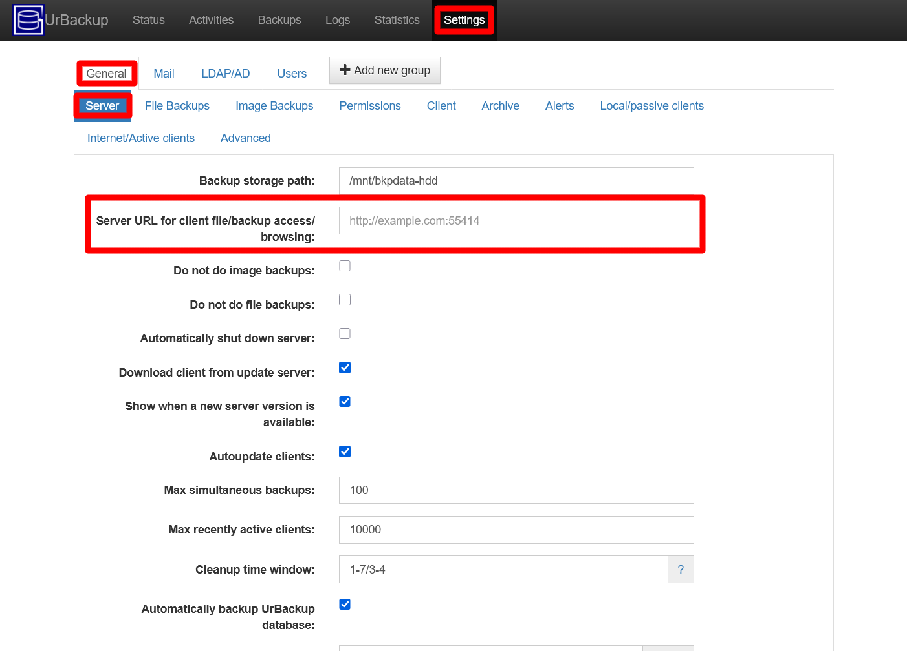

2. By default, that `Server URL` parameter is empty. You have to specify here the secondary network device IP (`172.16.3.1` in this guide) plus the UrBackup server port (`55414`), and all of this preceded by the `http` protocol. So, the URL in this guide is `http://172.16.3.1:55414`, as shown in the next snapshot:

    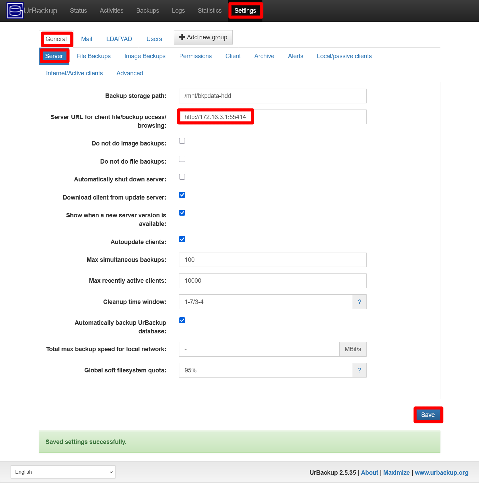

    Press on `Save` to apply the change, which should show you a success message at the bottom of the page:

    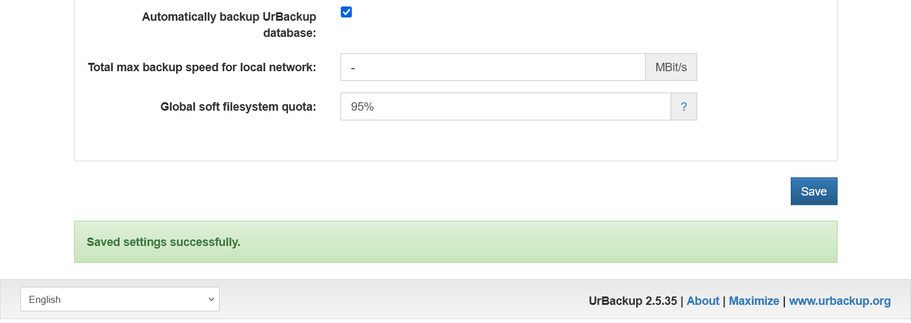

3. Now click on the `General > Internet/Active clients` tab. In this page, there is a `Server URL clients connect to` field where you also have to specify the same IP and port as before, although respecting the `urbackup` protocol string already set there:

    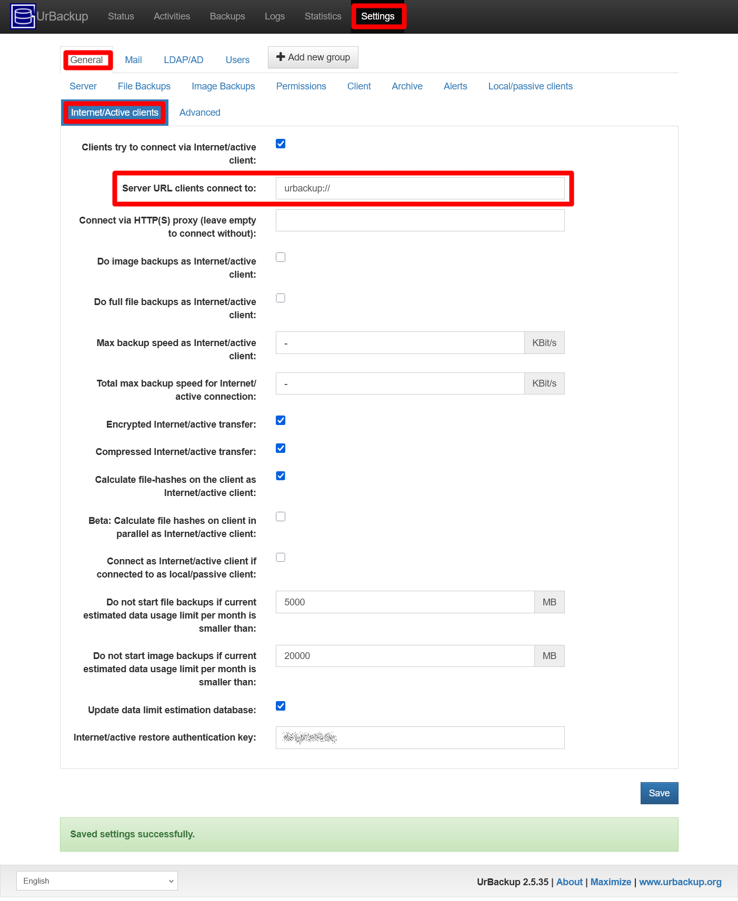

    Type in the `Server URL` field the correct string, which for this guide is `urbackup://172.16.3.1:55414`, as seen in the capture next:

    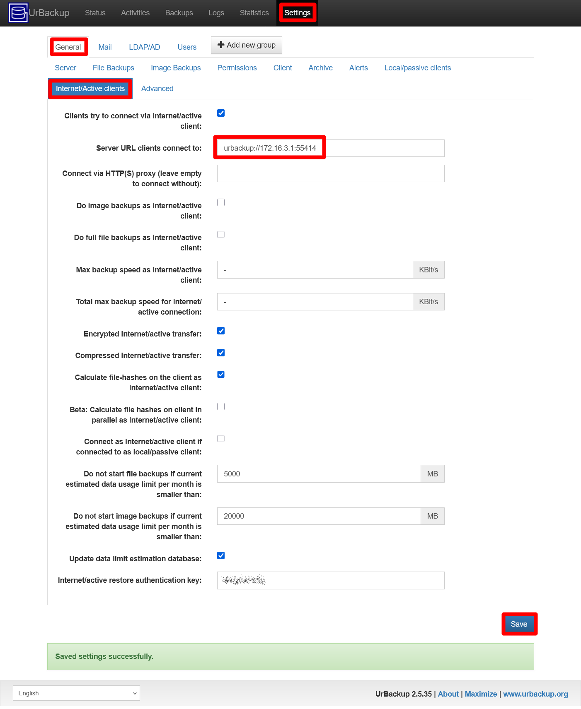

    Press the `Save` button to apply the change, which should show you the same success message as before at the bottom of the page.

### Disabling the image backups

By default, the UrBackup server automatically executes a full image backup from any client it is connected to. Since you already have full images done by Proxmox VE, you do not need to do the same thing again with UrBackup.

On the other hand, this procedure would fail with your K3s node VMs because the tool UrBackup uses in the clients to create the images is incompatible with the _ext2_ filesystem used in the boot partition used on all your Debian VMs.

With all this in mind, the best thing to do in this homelab scenario is to disable, in your UrBackup server, the full image backups feature altogether:

1. Return to the `Settings > General > Server` options view of your UrBackup server's web interface. There you find the option `Do not do image backups` unchecked:

    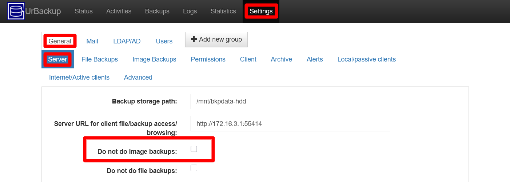

2. Check the `Do not do image backups` option and then press the `Save` button:

    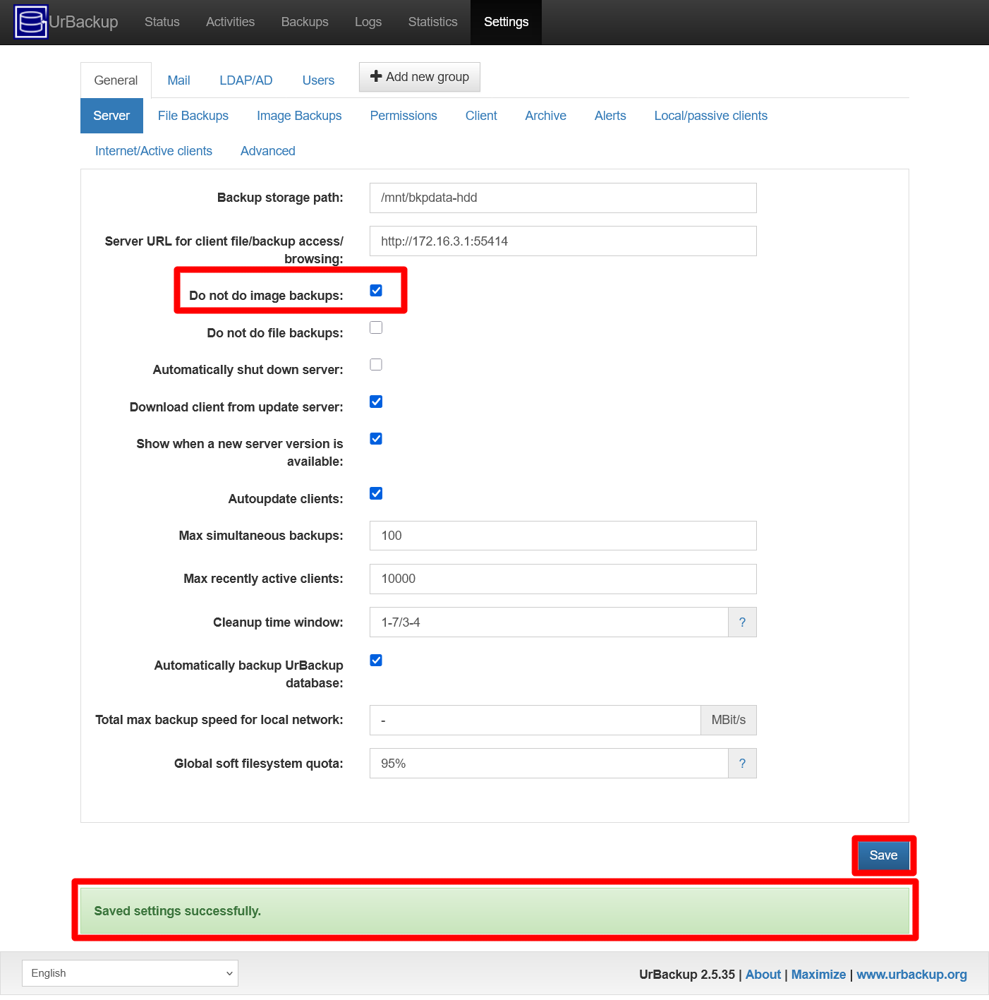

    Again, due to a bug in the UrBackup server's web interface, you can still see the success message from the previous change. Because of this, after pressing `Save`, the same success warning just stays there.

## UrBackup server log file

Like other services, the UrBackup server has a log file found in the `/var/log` directory. It's full path is `/var/log/urbackup.log`.

This log is rotated, and its default rotation configuration is set in the file `/etc/logrotate.d/urbackupsrv`.

## About backing up the UrBackup server VM

You may consider to schedule in Proxmox VE a job to backup this VM, as you did in the previous [chapter **G039** with the K3s node VMs](G039%20-%20Backups%2003%20~%20Proxmox%20VE%20backup%20job.md). If you want to do this, please bear in mind the following concerns:

- Remember that the backup job copies and compresses all the storages attached to the VM. This is important since the storage drive where UrBackup stores its backups is not only big, but also uses the btrfs filesystem that may not agree well with the Proxmox VE backup procedure.

- Careful with the storage space you have for backups within Proxmox VE, because the images of this VM may eat that space faster than the backups of other VMs.

- Do not include the UrBackup server VM in the same backup job with other VMs. You want it apart from the others so you can schedule it at a different and more convenient time.

## Relevant system paths

### Directories on Debian VM

- `$HOME`
- `$HOME/.ssh`
- `/etc`
- `/etc/initramfs-tools/conf.d`
- `/etc/nginx`
- `/etc/nginx/sites-available`
- `/etc/nginx/sites-enabled`
- `/etc/ssl/certs`
- `/mnt`
- `/mnt/bkpdata-hdd`
- `/proc`
- `/var/log`

### Files on Debian VM

- `$HOME/.google_authenticator`
- `$HOME/.ssh/authorized_keys`
- `$HOME/.ssh/id_rsa`
- `$HOME/.ssh/id_rsa.pub`
- `/etc/fstab`
- `/etc/initramfs-tools/conf.d/resume`
- `/etc/nginx/sites-available/urbackup.conf`
- `/etc/nginx/sites-enabled/default`
- `/etc/nginx/sites-enabled/urbackup.conf`
- `/etc/ssl/certs/urb-cert.crt`
- `/etc/ssl/certs/urb-cert.key`
- `/proc/swaps`
- `/var/log/urbackup.log`

## References

### [UrBackup](https://www.urbackup.org/)

- [Documentation](https://www.urbackup.org/documentation.html)
  - [Administration Manual for UrBackup Server 2.5.x](https://www.urbackup.org/administration_manual.html)

- [Download](https://www.urbackup.org/download.html)
  - [Server. Debian/Ubuntu](https://www.urbackup.org/download.html#server_debian)

- [Developer Blog](https://blog.urbackup.org/)
  - [Backup server for the raspberry pi](http://blog.urbackup.org/87/backup-server-for-the-raspberry-pi)
  - [Connect clients with a HTTPS CONNECT web proxy](http://blog.urbackup.org/299/connect-clients-with-a-https-connect-web-proxy)
  - [Linux image backups with UrBackup 2.5.y](http://blog.urbackup.org/368/linux-image-backups-with-urbackup-2-5-y)
  - [Btrfs file system stability status update](https://blog.urbackup.org/category/btrfs)

- [Forums](https://forums.urbackup.org/)
  - [SSL on the web interface](https://forums.urbackup.org/t/ssl-on-the-web-interface/9539)

### Other contents related to UrBackup

- [GitHub. Dmitrius7. UrBackup_simple_make_web_via_ssl_https](https://github.com/Dmitrius7/UrBackup_simple_make_web_via_ssl_https)

### [BTRFS](https://btrfs.readthedocs.io/en/latest/)

- [Introduction](https://btrfs.readthedocs.io/en/latest/Introduction.html)
- [Administration](https://btrfs.readthedocs.io/en/latest/Administration.html)
- [Volume management](https://btrfs.readthedocs.io/en/latest/Volume-management.html)

- [Manual pages](https://btrfs.readthedocs.io/en/latest/man-index.html)
  - [btrfs-filesystem(8)](https://btrfs.readthedocs.io/en/latest/btrfs-filesystem.html)

### Other contents related to BTRFS

- [Wikipedia. Btrfs](https://en.wikipedia.org/wiki/Btrfs)
- [Debian. Wiki. Btrfs](https://wiki.debian.org/Btrfs)
- [StackExchange. Unix. Increase the disk size on Debian 11 with btrfs filesystem](https://unix.stackexchange.com/questions/707540/increase-the-disk-size-on-debian-11-with-btrfs-filesystem)
- [Superuser. How to delete btrfs snapshot?](https://superuser.com/questions/846282/how-to-delete-btrfs-snapshot)

- [Marc's Public Blog - Linux Btrfs Blog Posts](https://marc.merlins.org/perso/btrfs/)
  - [Fixing Btrfs Filesystem Full Problems](https://marc.merlins.org/perso/btrfs/post_2014-05-04_Fixing-Btrfs-Filesystem-Full-Problems.html)

### [NGINX](https://nginx.org)

- [nginx documentation](https://nginx.org/en/docs/)
  - [Introduction. Configuring HTTPS servers](https://nginx.org/en/docs/http/configuring_https_servers.html)

### Contents related to TLS certificates

- [DEV. 7 Tips for TLS Hardening on Nginx – Modern Ciphers and Forward Secrecy](https://dev.to/ramer2b58cbe46bc8/7-tips-for-tls-hardening-on-nginx-modern-ciphers-and-forward-secrecy-2cd0)
- [StackOverflow. How do I create an ECDSA certificate with the OpenSSL command-line. Comment by Sergey Ponomarev](https://stackoverflow.com/questions/11992036/how-do-i-create-an-ecdsa-certificate-with-the-openssl-command-line#comment134936646_11999641)

## Navigation

[<< Previous (**G039. Backups 03**)](G039%20-%20Backups%2003%20~%20Proxmox%20VE%20backup%20job.md) | [+Table Of Contents+](G000%20-%20Table%20Of%20Contents.md) | [Next (**G041. Backups 05. UrBackup 02**) >>](G041%20-%20Backups%2005%20~%20UrBackup%2002%20-%20Clients%20setup%20and%20configuring%20file%20backups.md)
