# G041 - Backups 05 ~ UrBackup 02 - Clients setup and configuring file backups

- [Install UrBackup clients in your K3s node VMs](#install-urbackup-clients-in-your-k3s-node-vms)
- [Deploying the UrBackup client program](#deploying-the-urbackup-client-program)
- [UrBackup client log file](#urbackup-client-log-file)
- [UrBackup client uninstaller](#urbackup-client-uninstaller)
- [Configuring file backup paths on a client](#configuring-file-backup-paths-on-a-client)
- [Backups on the UrBackup server](#backups-on-the-urbackup-server)
  - [Executing and monitoring backups](#executing-and-monitoring-backups)
  - [Backups' general configuration](#backups-general-configuration)
  - [Backups' client configuration](#backups-client-configuration)
- [Restoration from file backups](#restoration-from-file-backups)
- [Relevant system paths](#relevant-system-paths)
  - [Directories on Debian VMs](#directories-on-debian-vms)
  - [Files on Debian VMs](#files-on-debian-vms)
- [References](#references)
  - [UrBackup](#urbackup)
  - [About snapshots](#about-snapshots)
  - [Logrotate](#logrotate)
- [Navigation](#navigation)

## Install UrBackup clients in your K3s node VMs

With your UrBackup server up and running, now you need to deploy the UrBackup client program in all the systems you want to backup. In this guide, those systems are the VMs running your K3s Kubernetes cluster. This way you will be able to schedule backup jobs in your UrBackup server to run them on your clients.

## Deploying the UrBackup client program

You need to deploy the UrBackup client program **in all of your K3s node VMs**. Since those VMs are Debian systems, you need to execute the corresponding Linux installer of the UrBackup client in all of them. And _corresponding_ means you have to install the correct version of the client, which has to correspond with the version of your UrBackup server.

In this case, since the UrBackup server used is a 2.5.z version (`2.5.35` is the one deployed [in the previous chapter **G040**](G040%20-%20Backups%2004%20~%20UrBackup%2001%20-%20Server%20setup.md#deploying-urbackup)), you also require to use the client's 2.5.z version. At the time of writing this, the client's latest version is `2.5.29` and you can find it [in this official page](https://www.urbackup.org/download.html#linux_all_binary):

1. The UrBackup client installer also installs a couple of packages, so it is better to have up to date the references to the Debian packages sources in your VMs. So, just execute the following `apt` command to update those references:

    ~~~sh
    $ sudo apt update
    ~~~

2. Next, **on EACH of your K3s node VMs**, download the UrBackup client installer with `wget`:

    ~~~sh
    $ wget https://hndl.urbackup.org/Client/2.5.29/UrBackup%20Client%20Linux%202.5.29.sh
    ~~~

3. With the installer downloaded, execute it on all the VMs to install the UrBackup client:

    ~~~sh
    $ sudo sh UrBackup\ Client\ Linux\ 2.5.29.sh
    ~~~

    Be aware that this client installation asks you a couple of questions for setting up its configuration, and maybe also your permission to install some packages through `apt`:

    > [!WARNING]
    > **Give the same answers to these questions in all of your VMs.**

    ~~~sh
    Verifying archive integrity... All good.
    Uncompressing UrBackup Client Installer for Linux  100%
    Installation of UrBackup Client 2.5.29 to /usr/local ... Proceed ? [Y/n]

    Uncompressing install data...
    Detected Debian \(derivative\) system
    Detected systemd
    Detected architecture x86_64-linux-glibc
    Installed daemon configuration at /etc/default/urbackupclient...
    Info: Restoring from web interface is disabled per default. Enable by modifying /etc/default/urbackupclient.
    Installing systemd unit...
    Cannot find systemd unit dir. Assuming /usr/lib/systemd/system
    Created symlink '/etc/systemd/system/multi-user.target.wants/urbackupclientbackend.service' → '/usr/lib/systemd/system/urbackupclientbackend.service'.
    Starting UrBackup Client service...
    Successfully started client service. Installation complete.
    +Detected Debian stable
    -dattobd not supported on this system
    -Detected no btrfs filesystem
    +Detected LVM volumes
    +dmsetup present
    -Grub not searching for boot device via UUID. Disabling dmsetup snapshot option
    Please select the snapshot mechanism to be used for backups:
    2) LVM - Logical Volume Manager snapshots
    5) Use no snapshot mechanism. Files will be backed up without creating snapshots of them. Images backups will be not supported.
    Enter choice (number 1-5, then enter): 5
    Configured no snapshot mechanism
    ~~~

    In the shell snippet above you can see how the installer asked two things:

    - `Installation of UrBackup Client 2.5.19 to /usr/local ... Proceed ? [Y/n]`\
      Justs asks for your permission to continue with the installation.

    - `Please select the snapshot mechanism to be used for backups`\
      Below this question the installer only lists the supported snapshot options it has detected as available in the system. The option `5` is chosen here to disable the snapshot mechanism, because this feature has proven to be rather problematic for this guide's setup.

      In particular, the option 2 uses the snapshot capabilities of LVM but this method can have relevant performance issues.

4. With all the clients installed, browse to your UrBackup server's web interface. In the `Status` page, you should see all the clients autodetected already:

    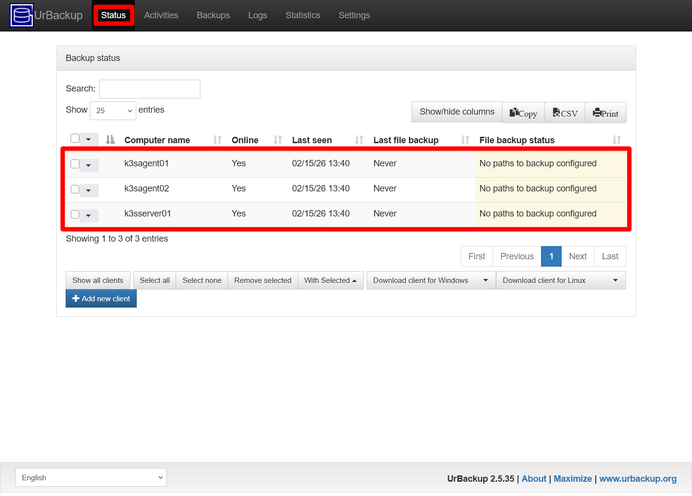

    This autodetection is possible because both the server and the clients are in the same local network and the UrBackup server is able to find on its own any active client in its vicinity.

    You can see more details of each client by enabling some extra columns available in the `Show/hide columns` list:

    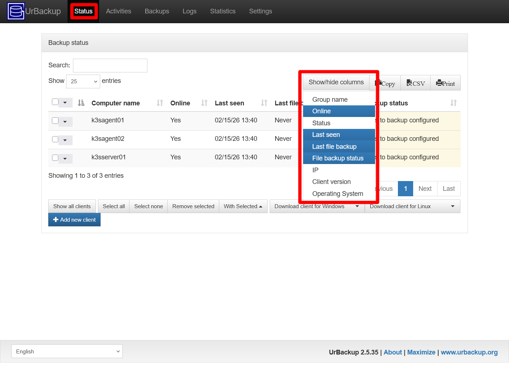

    If you enabled them all, this view would look like below:

    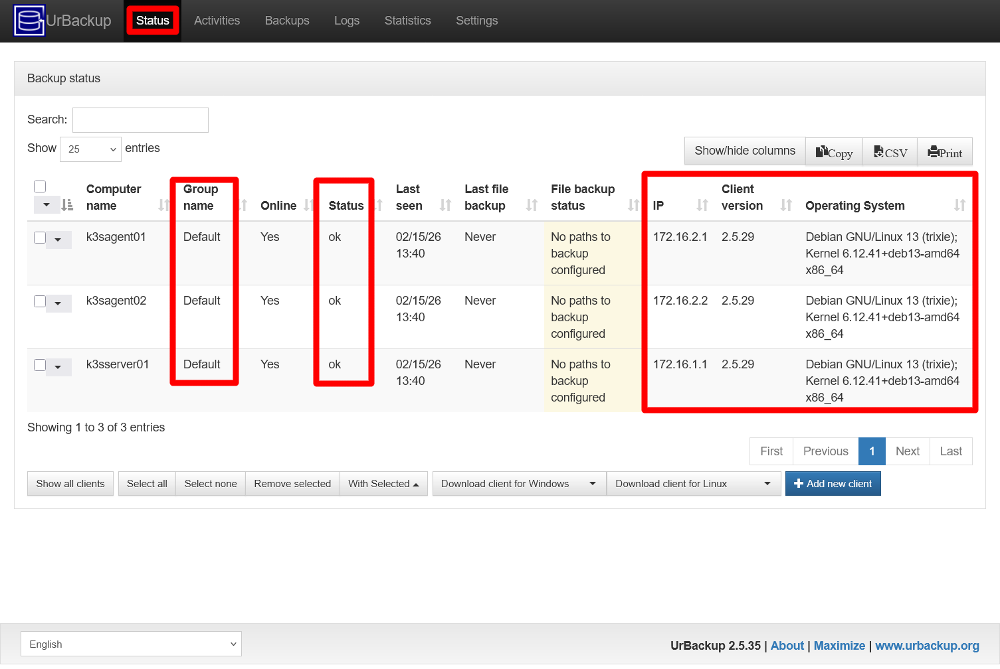

    Notice how you can see now the status, IP, client and operating system version of your clients. In the IP column, see how all the clients are connected to the UrBackup server through their secondary network devices.

5. Reboot all your K3s node VMs, so any pending changes done by the client installation can be fully applied. You can do this from the Proxmox VE web console, starting with the K3s agent nodes, then the K3s server node:

    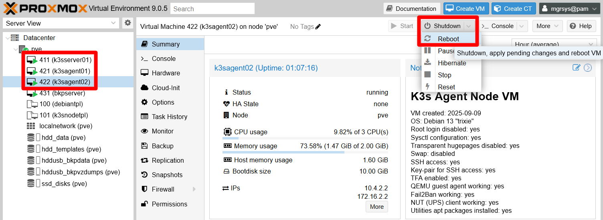

    > [!WARNING]
    > **Press `Reboot`, not `Reset`**\
    > Click on the `Reboot` button, not the `Reset` one! And only on the K3s node VMs.

    If you prefer, you can execute the `reboot` command through a remote terminal opened on each K3s node VM:

    ~~~sh
    $ sudo reboot
    ~~~

6. Finally, do not forget to remove the `UrBackup Client Linux 2.5.29.sh` installer from the VMs:

    ~~~sh
    $ rm UrBackup\ Client\ Linux\ 2.5.29.sh
    ~~~

## UrBackup client log file

Like the server, each UrBackup client has its own log file, which is located in the path `/var/log/urbackupclient.log`.

This log file does not have a default rotation configuration enabled. You have to create one for rotating it yourself:

1. **On each VM**, create the file `/etc/logrotate.d/urbackupcli`:

    ~~~sh
    $ sudo touch /etc/logrotate.d/urbackupcli
    ~~~

2. Enter the log rotation configuration below in `/etc/logrotate.d/urbackupcli`:

    ~~~sh
    "/var/log/urbackupclient.log" {
        weekly
        rotate 5
        missingok
        create
        compress
        postrotate
            /bin/systemctl restart urbackupclientbackend.service
        endscript
    }
    ~~~

    This configuration above means this:

    - `weekly`\
      The `urbackupclient.log` log file will be rotated weekly.

    - `rotate 5`\
      Only the last five previous old log files will be kept.

    - `missingok`\
      Do not fail if the log file is missing, just keep doing the rotation without issuing an error.

    - `create`\
      Creates the new log file with the same mode and owner as the old one.

    - `postrotate`\
      After rotation, execute the script in the line below. In this case, the rotation will restart the UrBackup client to ensure that it does not have an issue with the new log file.

    - `endscript`\
      Indicates the end of the `postrotate` block.

3. After saving the configuration **in all your VMs**, you can test it in any of them with the following `logrotate` command:

    ~~~sh
    $ sudo logrotate -d /etc/logrotate.d/urbackupcli
    warning: logrotate in debug mode does nothing except printing debug messages!  Consider using verbose mode (-v) instead if this is not what you want.

    reading config file /etc/logrotate.d/urbackupcli
    Reading state from file: /var/lib/logrotate/status
    Allocating hash table for state file, size 64 entries
    Creating new state
    Creating new state
    Creating new state
    Creating new state
    Creating new state
    Creating new state
    Creating new state
    Creating new state

    Handling 1 logs

    rotating pattern: "/var/log/urbackupclient.log" weekly empty log files are rotated, (5 rotations), old logs are removed
    considering log /var/log/urbackupclient.log
    Creating new state
    Now: 2026-02-15 15:48
    Last rotated at 2026-02-15 15:00
    log does not need rotating (log has already been rotated)
    ~~~

## UrBackup client uninstaller

It may happen that you want or need to uninstall the client from any of your VMs, as it happened to me while testing the UrBackup software for this guide. Since its not installed as an apt package, the client comes with an uninstaller script although it is not mentioned in the official documentation. Still, using it is really simple:

1. In the VM from where you want to uninstall the UrBackup client, execute the following (as `mgrsys`):

    ~~~sh
    $ sudo uninstall_urbackupclient
    Complete uninstallation of UrBackup Client (purge).. Proceed ? [Y/n]

    Cannot find systemd unit dir. Assuming /lib/systemd/system
    Removed '/etc/systemd/system/multi-user.target.wants/urbackupclientbackend.service'.
    UrBackup client uninstall complete.
    ~~~

    Notice how the command asks for confirmation to proceed.

2. To finish the cleanup, you have to remove any remaining log files and the logrotate configuration:

    ~~~sh
    $ sudo rm /etc/logrotate.d/urbackupcli
    $ sudo rm /var/log/urbackupclient*
    ~~~

3. Since uninstalling the client affects the system at its lowest level, you have to reboot the VM:

    ~~~sh
    $ sudo reboot
    ~~~

## Configuring file backup paths on a client

With the clients ready, you can configure the backup of concrete files or folders. In particular, you have to backup the data directories of the platforms you have running in your K3s Kubernetes cluster: Ghost, Forgejo and the Prometheus-based monitoring stack. Those directories are found in the K3s agent nodes of your cluster, the `k3sagent01` and `k3sagent02` VMs.

This section shows you how to do this by scheduling the backup of the relevant paths in the `k3sagent01` VM:

1. First, you need the full paths of the directories to backup. Then, open a remote shell to `k3sagent01` and list the contents of `/mnt`:

    ~~~sh
    $ ls -al /mnt
    total 20
    drwxr-xr-x  5 root root 4096 Jan 27 14:02 .
    drwxr-xr-x 18 root root 4096 Sep  8 13:03 ..
    drwxr-xr-x  3 root root 4096 Jan 20 20:27 forgejo-hdd
    drwxr-xr-x  5 root root 4096 Jan 20 20:27 forgejo-ssd
    drwxr-xr-x  3 root root 4096 Jan 27 14:02 monitoring-ssd
    ~~~

    The `k3sagent01` has directories related to Foegejo and the monitoring stack. Do a deeper `ls` to see what is inside them:

    ~~~sh
    $ ls -al /mnt/*
    /mnt/forgejo-hdd:
    total 12
    drwxr-xr-x 3 root root 4096 Jan 20 20:27 .
    drwxr-xr-x 5 root root 4096 Jan 27 14:02 ..
    drwxr-xr-x 4 root root 4096 Feb 10 14:09 git

    /mnt/forgejo-ssd:
    total 20
    drwxr-xr-x 5 root root 4096 Jan 20 20:27 .
    drwxr-xr-x 5 root root 4096 Jan 27 14:02 ..
    drwxr-xr-x 4 root root 4096 Jan 20 20:30 cache
    drwxr-xr-x 4 root root 4096 Feb 10 14:10 data
    drwxr-xr-x 4 root root 4096 Feb 10 14:10 db

    /mnt/monitoring-ssd:
    total 12
    drwxr-xr-x 3 root root 4096 Jan 27 14:02 .
    drwxr-xr-x 5 root root 4096 Jan 27 14:02 ..
    drwxr-xr-x 4 root root 4096 Feb  4 17:09 grafana-data
    ~~~

    Your Forgejo server has here a directory for the git repositories, and three other for its cache data, application data, and database files. From the monitoring stack, in this VM there is only the data folder for the Grafana application.

    Remember that in all these folders there is another folder named `k3smnt`, which is the mounting point for the persistent volumes within your Kubernetes cluster. In conclusion, the relevant paths to backup from this `k3sagent01` VM are the following:

    - `/mnt/forgejo-hdd/git`
    - `/mnt/forgejo-ssd/data`
    - `/mnt/forgejo-ssd/db`
    - `/mnt/monitoring-ssd/grafana-data`

2. Use the command `urbackupclientctl` for adding the relevant paths to the list of locations UrBackup client monitors:

    > [!NOTE]
    > **There is no official documentation about the `urbackupclientctl` command**\
    > There is not have even a `man` page for this command. The only detailed information you can get about it is from its integrated textual help, which you can see by executing `urbackupclientctl --help`.

    ~~~sh
    $ sudo urbackupclientctl add-backupdir -n forgejo-git -f -x -d /mnt/forgejo-hdd/git
    $ sudo urbackupclientctl add-backupdir -n forgejo-data -f -x -d /mnt/forgejo-ssd/data
    $ sudo urbackupclientctl add-backupdir -n forgejo-db -f -x -d /mnt/forgejo-ssd/db
    $ sudo urbackupclientctl add-backupdir -n monitoring-grafana-data -f -x -d /mnt/monitoring-ssd/grafana-data
    ~~~

    The four commands above all use the same options:

    - `add-backupdir`\
      The action that allows you to add file or folder paths to the list monitored by the client.

    - `-n`\
      Any folder added to the client gets assigned a name, which is taken from the deepest element in the path. With this `-n` option you can set a more meaningful string as name.

    - `-f`\
      This restricts the backup process **to not follow symlinks that lead outside the backup path**. This is to ensure that the backup procedure cares only about the files directly under the specified path.

    - `-x`\
      Its description says `Do not cross filesystem boundary during backup`, which maybe refers to not read data from different filesystems while doing the backup. It is not clear how this feature can affect something like an LVM based storage that has been built on several partitions from different storage devices.

    - `-d`\
      The mandatory option after which you type the file or folder path you want to backup through the client.

    This `add-backupdir` action has more options, which you can check out by executing its own help.

    ~~~sh
    $ urbackupclientctl add-backupdir --help
    ~~~

    You can also get help for the other `urbackupclientctl` actions the same way.

3. Confirm that the paths have been added to the client configuration with the following `urbackupclientctl` command:

    ~~~sh
    $ urbackupclientctl list-backupdirs
    PATH                             NAME                    FLAGS
    -------------------------------- ----------------------- ---------------------------------------------
    /mnt/forgejo-hdd/git             forgejo-git             symlinks_optional,one_filesystem,share_hashes
    /mnt/forgejo-ssd/data            forgejo-data            symlinks_optional,one_filesystem,share_hashes
    /mnt/forgejo-ssd/db              forgejo-db              symlinks_optional,one_filesystem,share_hashes
    /mnt/monitoring-ssd/grafana-data monitoring-grafana-data symlinks_optional,one_filesystem,share_hashes
    ~~~

    There are a couple of things to realize from the command above:

    - You do not need to execute `urbackupclientctl` with `sudo` for listing the paths.

    - The flags indicate the options enabled on each path.

Now that you have some paths configured in a client, be aware that the UrBackup server comes configured by default to launch file backups periodically on its own. In other words, it could happen that right after you have added those paths, UrBackup could go and execute a file backup automatically. The next section covers how file backups are managed in the server.

## Backups on the UrBackup server

Once you have configured the paths you want to backup in your clients, you can manage your backups from the UrBackup server.

### Executing and monitoring backups

The UrBackup server comes with a default configuration that schedules it to execute automatically both file and image backups on the clients connected to it. Also, you also have already disabled the image backup capability in the [previous chapter **G040**](G040%20-%20Backups%2004%20~%20UrBackup%2001%20-%20Server%20setup.md#disabling-the-image-backups). Here you can focus on the file backups:

1. Browse to the `Status` page of your UrBackup server, then click on the downward arrow button in the `k3sagent01` row:

    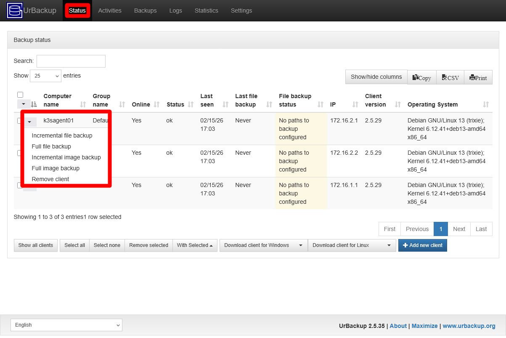

    It gives you a list of five actions:

    - Two for executing incremental or full file backups.

    - Two for launching incremental or full image backups. Remember that the image backups have been disabled, so this feature should not work.

    - The last action for removing the client software from the client computer.

2. To make a file backup, click on either the `Incremental` or the `Full` `file backup` option. You only get to see a thin blue progress bar at the top of the page, and a new short message in the `Last file backup` column at the `k3sagent01` row:

    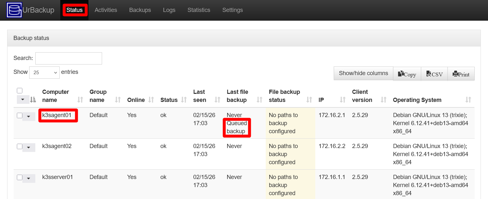

    Notice that below the `Never` string now it says `Queued backup`, which does not mean much by itself.

3. Go to the `Activities` tab, where you can see the state of in-progress backup jobs and the result of finished backup jobs:

    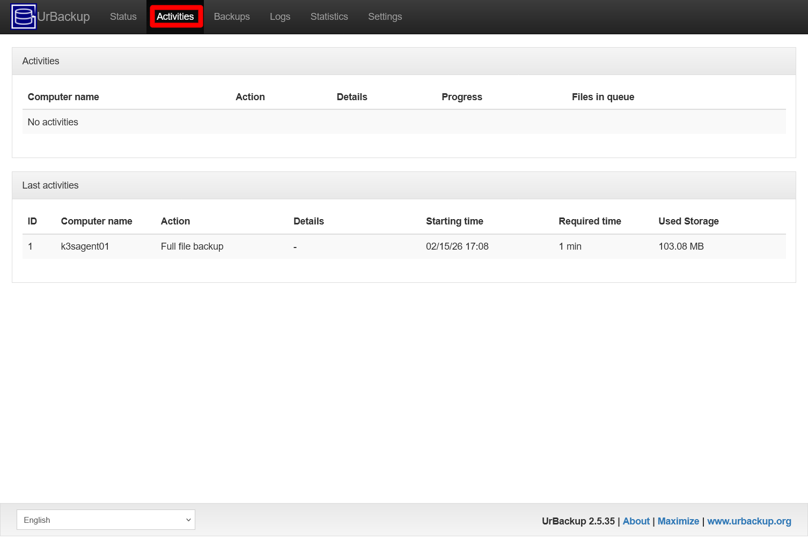

    The top `Activities` table is for activities currently in progress, while the `Last activities` one is where you can see all the backups done previously, like the one launched in the previous step.

    Be aware that, if you try to execute an incremental backup and there is no previous full backup, UrBackup executes a full backup instead no matter what. This is because incremental backups only store the differences between the previous (incremental or full) backup and the current state of the content being preserved.

    This circumnstance also implies that, from time to time, you may need to do a new full backup because you do not want end having incremental backups that diverge too much from their correlative full one. UrBackup by default is also scheduled to make a fresh full backup every number of days, something you will see later in this chapter.

    In the case of the backup executed before, you can see it in the `Last activities` and see how it appears classified as a `Full file backup` action. Also notice that it did not took much to finish since, at this point, the backed up paths in the K3s agent node did not had any data to backup to begin with.

    In the capture below you can see how this `Activities` page looks with an incremental backup job currently running:

    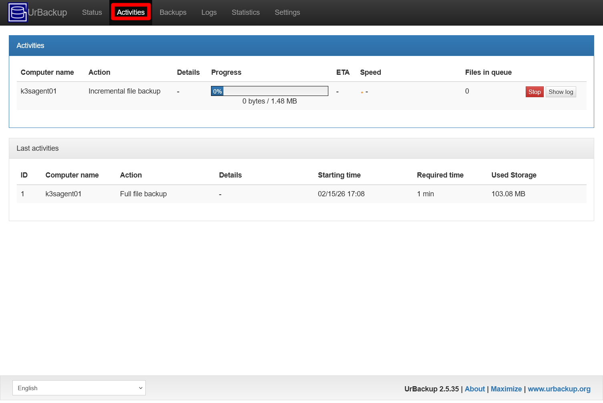

    The `Activities` table gets highlighted and the row of the task in progress has, among other details, a `Stop` button. The job in progress is also notified in the `Status` page:

    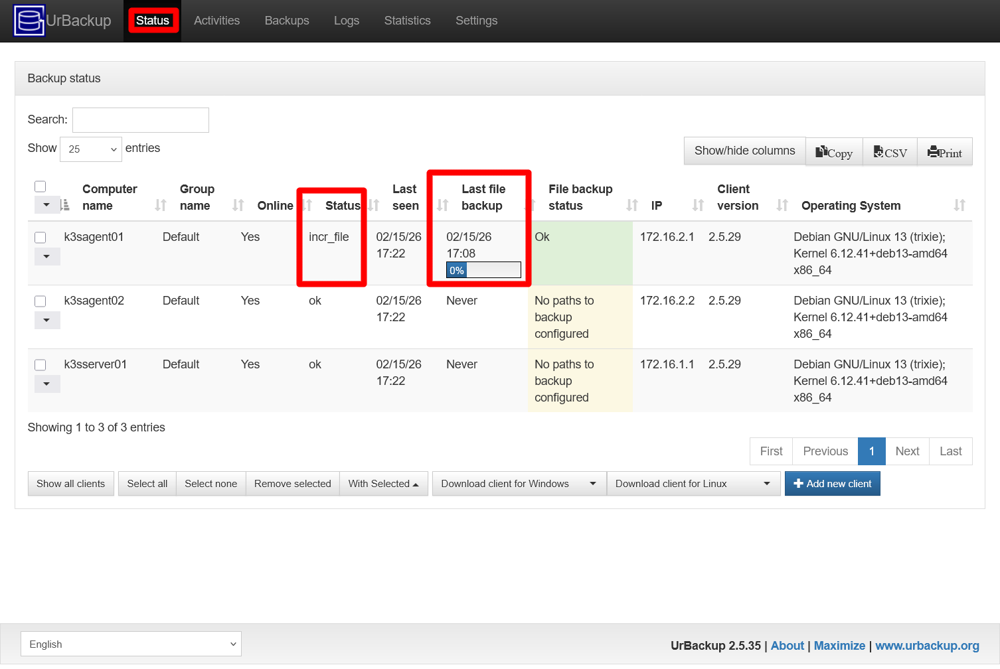

    See in the line for the `k3sagent01` how the `Status` column says `incr_file`, indicating that there is an incremental backup job running in that client. The `Last file backup` column shows the date and the progress bar of that incremental backup job. Also notice how the `File backup status` column reports `OK`, but that value is related to the previous full backup done in the client.

4. Now browse to the `Backups` page, where you can navigate through all your backups in a per-client basis:

    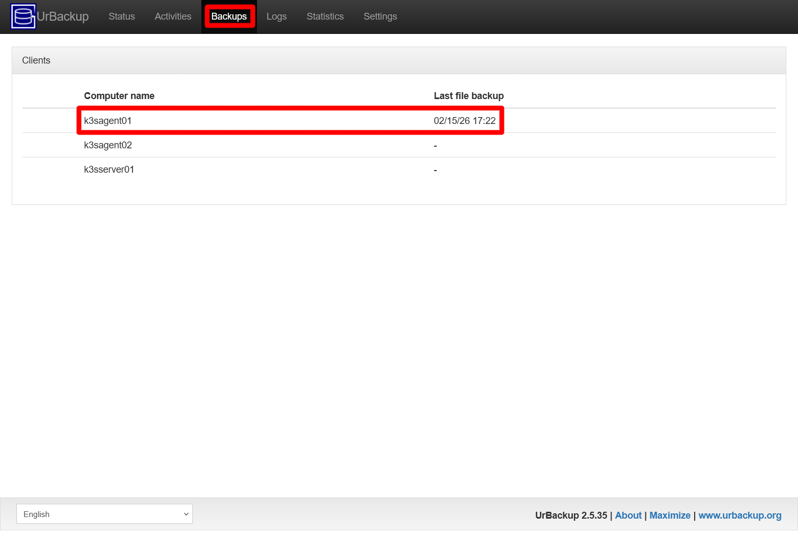

    This page gives you a list of the clients known by your UrBackup server and the date of the last backup done on each. In this case, only the `k3sagent01` has a backup, so click on its row to get into the page captured below:

    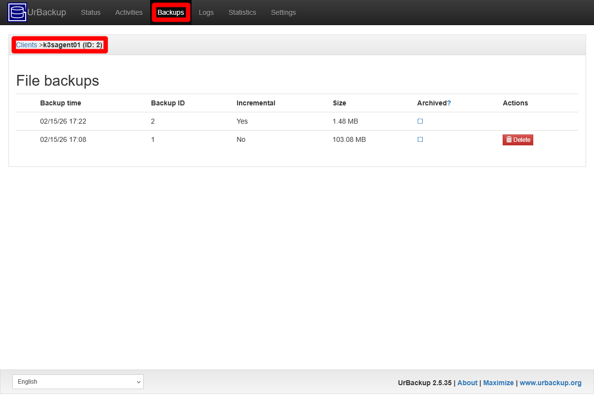

    This page lists the backups done from the selected client, although in this case it only presents a table of file backups since the image backups are disabled. In this case, two file backups are listed: one is the first full backup done earlier, the other an incremental one done later. Also notice the breadcrumb row over the table, which indicates your location within this `Backups` page.

    Clicking on a backup takes you to a file browser where you can navigate through the backup's contents:

    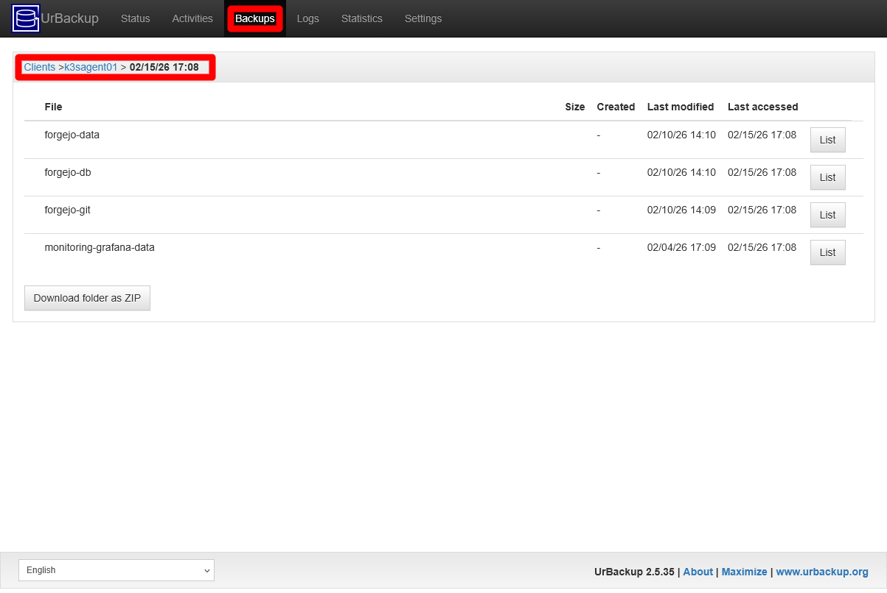

    The first level of the file backup is the list of paths configured in the client. They are listed by the names you gave them in the `urbackupclientctl add-backupdir`. If you click in any of them, you can browse the files and folders they contain. On the other hand, notice the `Download folder as ZIP` button below the list. That button allows you to export as a ZIP file the folder you are currently seeing.

5. Any backup task produces a log, which you can find in the `Logs` tab:

    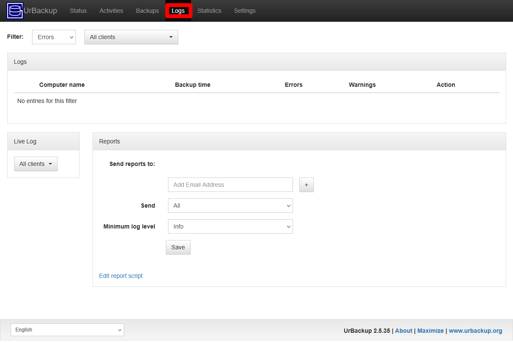

    By default, it has its filter set to show only error logs from all clients. You can adjust it to list also warning or all the logs of any or all clients:

    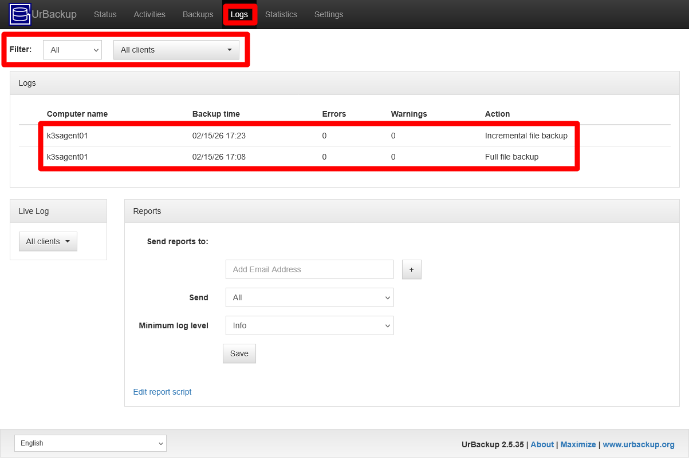

    This `Logs` table lists the entries produced by the file backups executed on the `k3sagent` client. Click on any of them to see their log lines:

    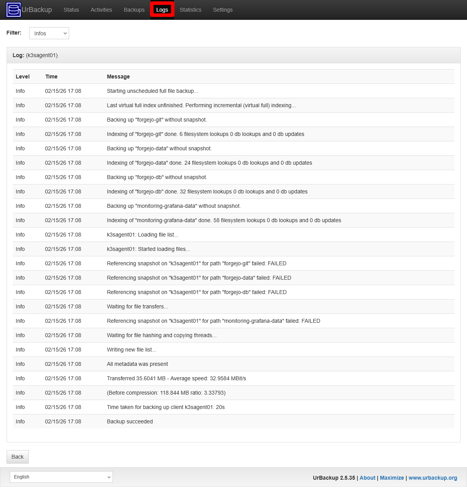

    In this case they are all logs of the `info` category from the full file backup. If there had been errors or warnings, this page would had filter the logs to show only those with the highest priority. All these log lines are found in the UrBackup server log file `/var/log/urbackup.log`.

    On the other hand, you can also see the most recent registered logs in your clients. Go back to the main `Logs` page, and unfold the `Live Log` clients list:

    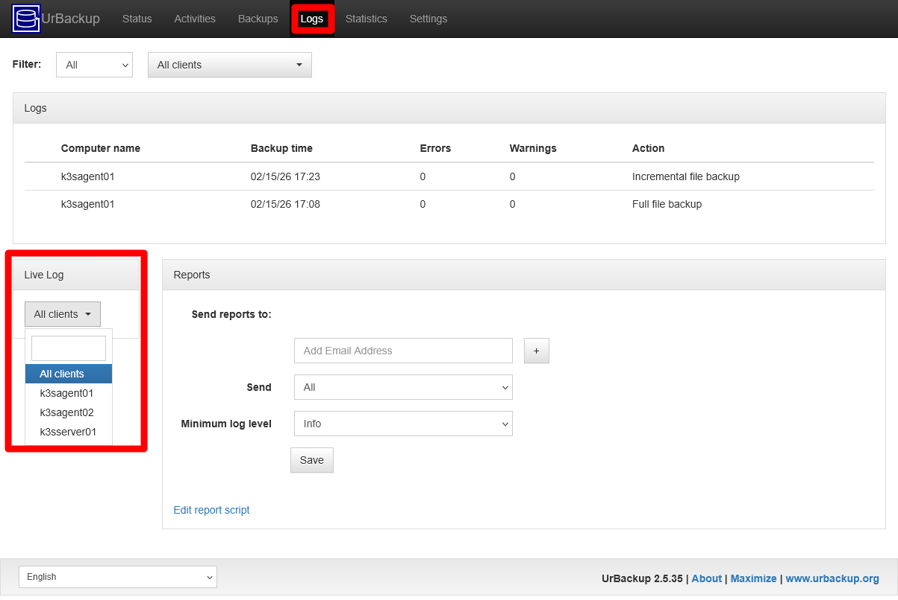

    Click for instance on the `k3sagent01` client, and a new page opens in your browser:

    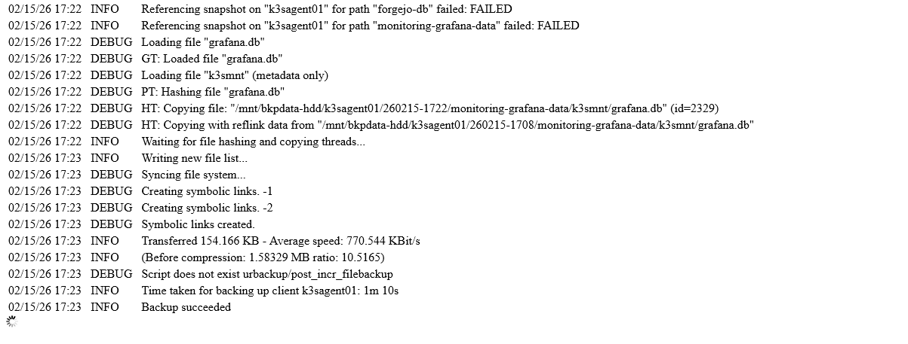

    Be aware that you do not see the whole client log here, just some of the most recent entries and those that may appear after them. To see the full log, you have to go to the file found at `/var/log/urbackupclient.log` in the client.

    The final detail to know about this `Logs` page is the `Reports` form, that allows you to send summaries of the backups done by email. This feature doesn't work as is, UrBackup needs to connect to an email server to send these messages. You will learn later were to put this configuration.

6. Another informative tab is the `Statistics` one:

    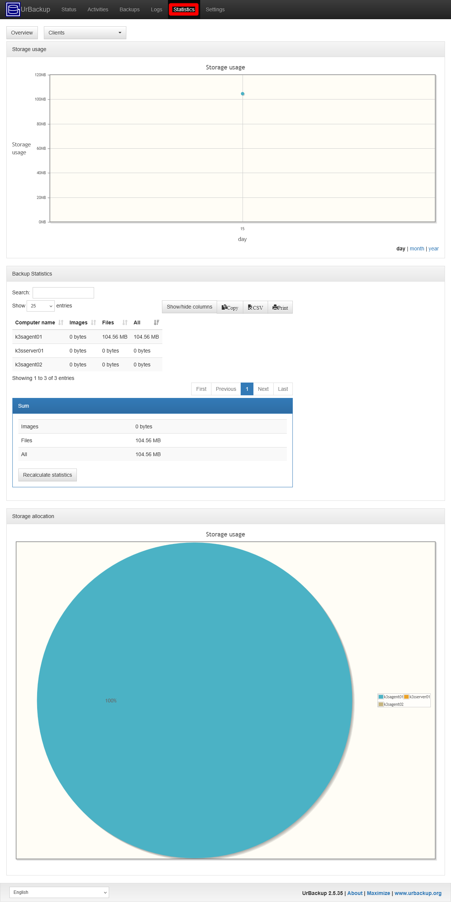

    Here you can see how much storage your backups are taking up in your server.

### Backups' general configuration

There are many parameters to adjust in your UrBackup server, and you have already adjusted a few of them. This section shows you a few more general (applied to all clients) parameters to tweak the backup tasks better to the particularities of your homelab system:

1. Browse to the `Settings` page, and stay at the `General > Server` tab:

    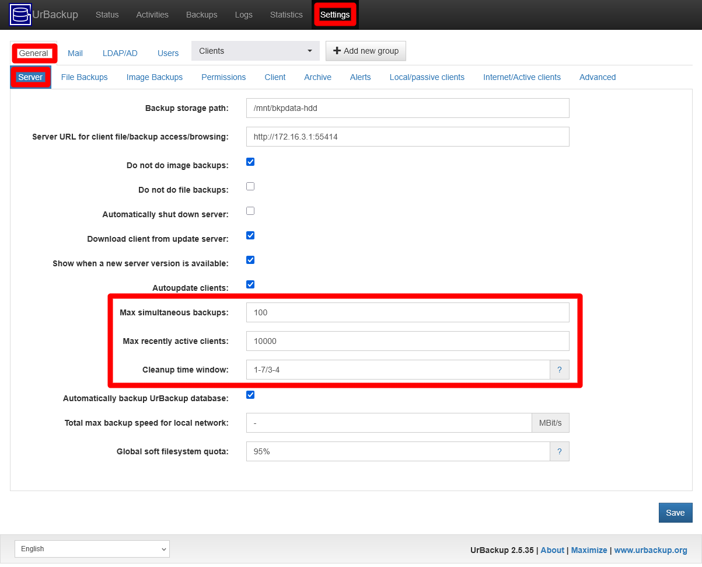

    Notice the highlighted fields in the snapshot above.

    - `Max simultaneous backups`\
      Number of backups started at the same time. The default `100` value is too much for the small and rather loaded system used in this guide, so it is better to reduce it to something like `5`.

    - `Max recently active clients`\
      How many clients the server accepts. It does not make much sense to have such a high default value (`10000`) when you know that you will never have more than a handful of clients connected to this server. Better reduce it to something more reasonable like `10`.

    - `Cleanup time window`\
      Time period in which this server cleans old backups and inactive clients up. The default value is `1-7/3-4` which means:

        - `1-7`\
          This task is executed all days of the week.

        - `3-4`\
          The task can be launched between the 3 and 4 hours (in 24h format).

        Adjust the time interval to something that fits you better, for this guide's setup is `1-7/10-11`. The time interval format has a bit of complexity, so it is better if you learn how it goes [from the official UrBackup documentation](https://www.urbackup.org/administration_manual.html#x1-610008.3.1).

    After appling the changes above, those fields would look as follows:

    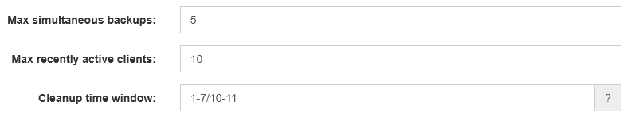

2. The next tab you must check in `Settings` is `General > File Backups`:

    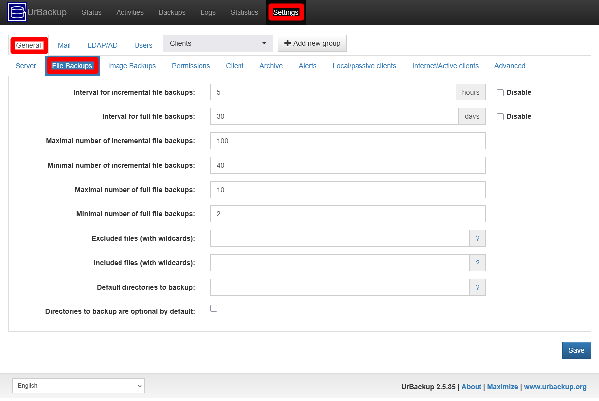

    Here you can adjust certain parameters that apply to all the file backups executed by this UrBackup server:

    - `Interval for incremental file backups`\
      How much time, **in hours**, must the server wait before executing the next **incremental file backups**.

    - `Interval for full file backups`\
      How much time, **in days**, must the server wait before executing the next **full file backups**.

    - `Maximal number of incremental file backups` and `Minimal number of incremental file backups`\
      These two values define the range of maximum and minimum number of **incremental file backups** kept for each client in the server.

    - `Maximal number of full file backups` and `Minimal number of full file backups`
      These two values define the range of maximum and minimum number of **full file backups** kept for each client in the server.

    - `Excluded files (with wildcards)`\
      Indicates which files, or filetypes, to exclude from all the file backups.

    - `Included files (with wildcards)`\
      Indicates which files, or filetypes, have to be included in all the file backups.

    - `Default directories to backup`\
      Specifies the paths to be backed up from all clients. If you use this field, you should ponder if you have to use the option that comes after this field. Otherwise, if the path does not exist in any particular client, the procedure in that client will fail with an error.

    - `Directories to backup are optional by default`\
      With this option enabled, a file backup will not fail if it does not find a concrete path. Leave it disabled if you really want a file backup to return an error if an expected path is missing in a client.

    At this point, there is no need to change anything here.

3. Now go to the `General > Image Backups` tab:

    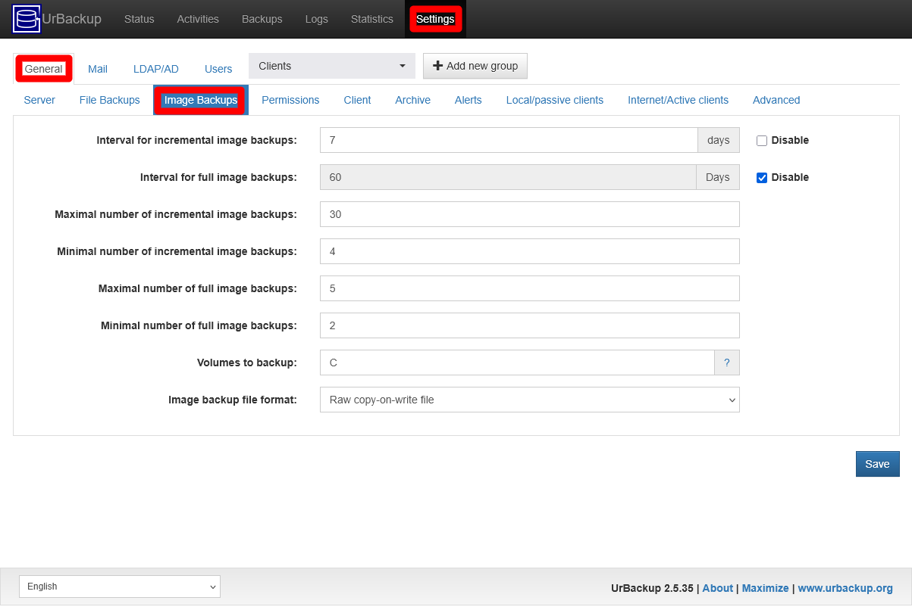

    The first six fields are the image backup equivalents of also the first six ones in the `File Backups` tab, although the `Interval for incremental image backups` field is measured in days rather than in hours. Also see how `Interval for full image backups` is disabled, which is the consequence of disabling the image backups in the `General > Server` tab. The `Volumes to backup` field has a `C` letter specified as in the `C` volume of a Windows system. The way it is described in the official documentation seems to indicate that this feature is Windows-only.

4. Jump to the `General > Client` tab:

    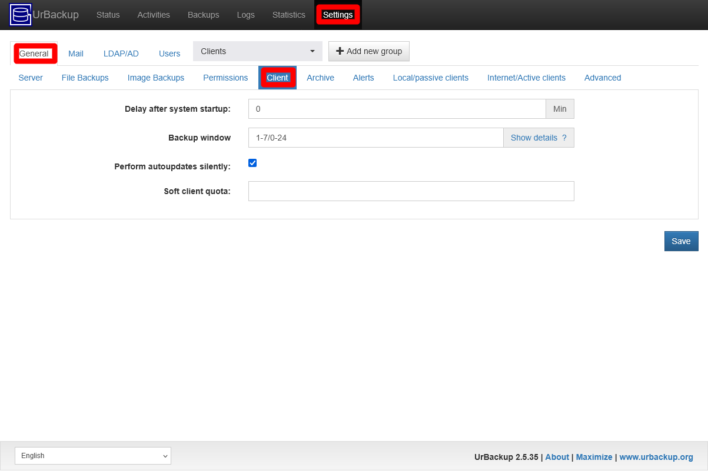

    These options configure certain behaviors of the server that affect the client program:

    - `Delay after system startup`\
      When the server discovers a client, how much time in minutes must the server wait to start a backup in that client. Being aware that your clients are all K3s nodes, you may prefer to give them some time to properly start all their services before doing anything. Therefore, enter here `5` or even `10` minutes at least.

    - `Backup window`\
      The server only starts backups on clients in this particular time period. Here you must remember that you have already configured in Proxmox VE a backup job acting on all your K3s node VMs, so you do not want that process and the UrBackup backups start in the same time frame. To avoid that "collision", adjust this backup window to something like `1-7/0-13:30;1-7/17-0` (all days of the week, between 00:00 and 13:30 or between 17:00 and 00:00). Check out this time period format [in the official UrBackup documentation](https://www.urbackup.org/administration_manual.html#x1-610008.3.1).

      This field can be finely tuned for each type of backup. To do so, click on the `Show details` link next to the field:

      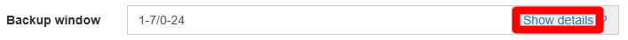

      After clicking on it, `Backup window` unfolds into four different fields, one per each kind of backup.

      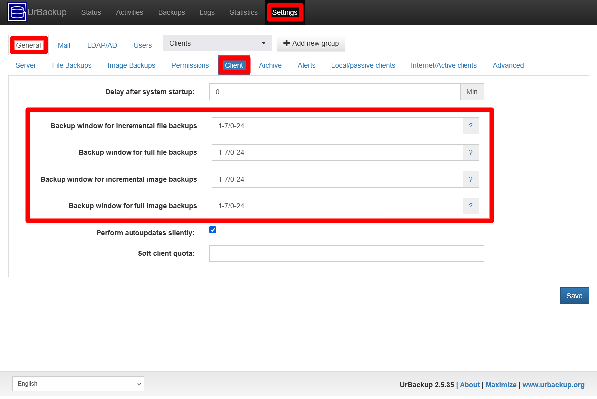

      This way, you can adjust a different time period for each kind of backup. Notice how the same default value appears in all the fields.

    - `Perform autoupdates silently`\
      By default, the updates of the client software won't ask the user for its permission.

    - `Soft client quota`\
      Storage space quota applied to the backups of each client during cleanups. Any backups that go over this quota, and also beyond the minimal number of file or image backups configured for clients, will be removed from the server.

    For this guide, the page is left configured like this:

    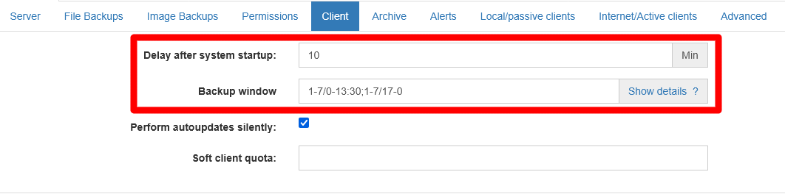

### Backups' client configuration

You have seen the UrBackup server general configuration, but know that you can also set a particular configuration to each client:

1. Regardless of what tab you are in the `Settings` page, you always have the list of `Clients` available over the tab bar:

    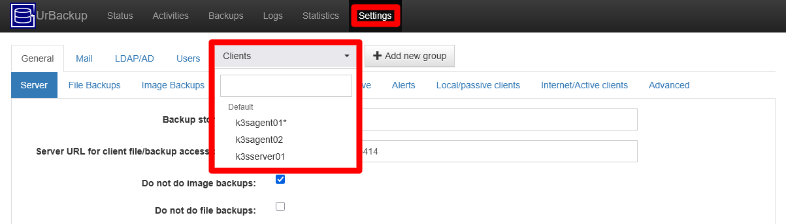

    When unfolded, you get a list of active clients organized in groups. In this case, there is only the `Default` group, where UrBackup puts all clients by default. Notice how `k3sagent01` has an `*` next to its name. The UrBackup documentation does not explain the meaning of this mark.

2. If you click on the `k3sagent01` client, you get into the `Settings` page for that client:

    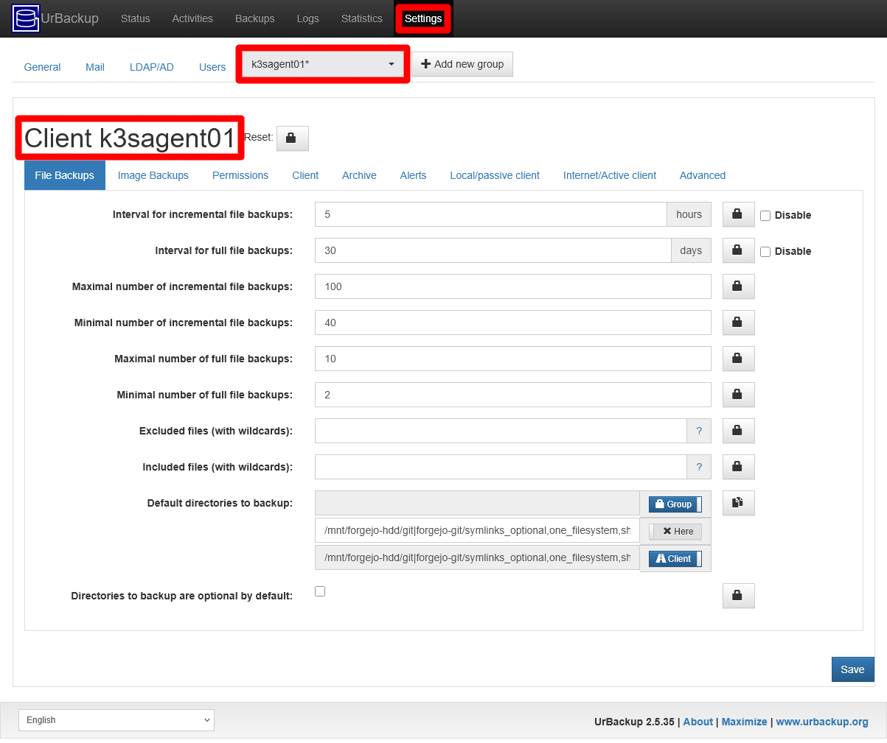

    You start inside the `File Backups` tab, and notice that there is no `Server` tab now. Also see how the fields' values here are the common ones, except in the `Default directories to backup` field. This parameter now has three fields:

    - The first one shows the group configuration.
    - The second one is for specifying paths in this page.
    - The third one is the path configuration set in the client itself. You cannot edit it from this web interface.

    The lock button indicates if a field is using an inherited "group" value or one that has been set explicitly for this client.

3. If you browse through the other tabs, you will found out that they are essentially the same as the ones found in the `Settings > General` page (except the `Server` tab), although with some differences.

## Restoration from file backups

In the setup explained in this guide, the filesystem snapshots in the clients are disabled, which makes automatic complete restorations with UrBackup uncertain (maybe impossible even). The [official UrBackup documentation is quite thin on this regard](https://www.urbackup.org/administration_manual.html#x1-840009), so expect a manual restoration file by file when using file backups (and this could also imply setting the correct owners and permissions manually to each recovered file or folder).

Anyway, to restore any UrBackup backup automatically on a linux client you have to use the `urbackupclientctl restore-start` command. Check out its help (`urbackupclientctl restore-start --help`) to know more about it.

## Relevant system paths

### Directories on Debian VMs

- `/etc/logrotate.d`
- `/mnt/forgejo-hdd/git`
- `/mnt/forgejo-ssd/data`
- `/mnt/forgejo-ssd/db`
- `/mnt/monitoring-ssd/grafana-data`
- `/var/log`

### Files on Debian VMs

- `/etc/logrotate.d/urbackupcli`
- `/var/log/urbackupclient.log`

## References

### [UrBackup](https://www.urbackup.org/)

- [Documentation](https://www.urbackup.org/documentation.html)
  - [Administration Manual for UrBackup Server 2.5.x](https://www.urbackup.org/administration_manual.html)
    - [8. Server settings](https://www.urbackup.org/administration_manual.html#x1-410008)
      - [8.3 Client specific settings](https://www.urbackup.org/administration_manual.html#x1-600008.3)
        - [8.3.1 Backup window](https://www.urbackup.org/administration_manual.html#x1-610008.3.1)
    - [9. Restoring backups](https://www.urbackup.org/administration_manual.html#x1-840009)

- [Download](https://www.urbackup.org/download.html)
  - [Client. Binary Linux client](https://www.urbackup.org/download.html#linux_all_binary)

- [FAQ](https://www.urbackup.org/faq.html)

- [Forums](https://forums.urbackup.org/)
  - [Howto fully uninstall urbackup client on Ubuntu](https://forums.urbackup.org/t/howto-fully-uninstall-urbackup-client-on-ubuntu/3040)
  - [Linux Debian / Ubuntu - add-backupdir CLI issue](https://forums.urbackup.org/t/linux-debian-ubuntu-add-backupdir-cli-issue/11446)
  - [Linux Client not cleaning up .Overlay Files](https://forums.urbackup.org/t/linux-client-not-cleaning-up-overlay-files/2351)

### About snapshots

- [The Linux Kernel documentation](https://docs.kernel.org/)
  - [The Linux kernel user’s and administrator’s guide](https://docs.kernel.org/admin-guide/index.html)
    - [Block-layer and filesystem administration. Device Mapper](https://docs.kernel.org/admin-guide/device-mapper/)
      - [Device-mapper snapshot support](https://docs.kernel.org/admin-guide/device-mapper/snapshot.html)

- [Narkive. Snapshot behavior on classic LVM vs ThinLVM](https://linux-lvm.redhat.narkive.com/DsOflGYe/snapshot-behavior-on-classic-lvm-vs-thinlvm)
- [StackExchange. Unix. Selection of linux filesystem for snapshots - For file backups on a VM](https://unix.stackexchange.com/questions/421245/selection-of-linux-filesystem-for-snapshots-for-file-backups-on-a-vm)
- [Sharper Tools. Using Linux Device Mapper Snapshots to Rescue a Failed RAID](http://st.xorian.net/blog/2013/03/using-linux-device-mapper-snapshots-to-rescue-a-failed-raid/)

### Logrotate

- [Michael Kerrisk. man7.org. Linux. logrotate(8) — Linux manual page](https://www.man7.org/linux/man-pages/man8/logrotate.8.html)
- [LinuxConfig.org. logrotate command in Linux with examples](https://linuxconfig.org/logrotate)

## Navigation

[<< Previous (**G040. Backups 04. UrBackup 01**)](G040%20-%20Backups%2004%20~%20UrBackup%2001%20-%20Server%20setup.md) | [+Table Of Contents+](G000%20-%20Table%20Of%20Contents.md) | [Next (**G042. System update 01**) >>](G042%20-%20System%20update%2001%20~%20Considerations.md)
